<!--
CO_OP_TRANSLATOR_METADATA:
{
  "original_hash": "750f3ea8a94930439ebd8a10871b1d73",
  "translation_date": "2025-10-21T17:47:17+00:00",
  "source_file": "docs/operative-preview/08-dataverse-grounding/README.md",
  "language_code": "hi"
}
-->
# 🚨 मिशन 08: Dataverse ग्राउंडिंग के साथ उन्नत प्रॉम्प्ट्स

--8<-- "disclaimer.md"

## 🕵️‍♂️ कोडनेम: `ऑपरेशन ग्राउंडिंग कंट्रोल`

> **⏱️ ऑपरेशन का समय:** `~60 मिनट`

## 🎯 मिशन का विवरण

फिर से स्वागत है, ऑपरेटिव। आपका मल्टी-एजेंट हायरिंग सिस्टम चालू है, लेकिन **डेटा ग्राउंडिंग** के लिए एक महत्वपूर्ण सुधार की आवश्यकता है - आपके AI मॉडल को बुद्धिमान निर्णय लेने के लिए आपके संगठन के संरचित डेटा तक रीयल-टाइम पहुंच चाहिए।

वर्तमान में, आपका Summarize Resume प्रॉम्प्ट स्थिर जानकारी के साथ काम करता है। लेकिन क्या होगा अगर यह आपके जॉब रोल्स डेटाबेस तक डायनामिक रूप से पहुंच सके और सटीक, अद्यतन मिलान प्रदान कर सके? क्या होगा अगर यह आपकी मूल्यांकन मानदंडों को समझ सके बिना उन्हें हार्डकोड किए?

इस मिशन में, आप अपने कस्टम प्रॉम्प्ट को **Dataverse ग्राउंडिंग** के साथ उन्नत करेंगे - अपने प्रॉम्प्ट्स को सीधे लाइव डेटा स्रोतों से जोड़ना। यह आपके एजेंट्स को स्थिर उत्तरदाताओं से बदलकर डायनामिक, डेटा-ड्रिवन सिस्टम में बदल देता है जो बदलती व्यावसायिक आवश्यकताओं के अनुसार अनुकूलित होते हैं।

आपका मिशन: अपने रिज्यूमे विश्लेषण वर्कफ़्लो में रीयल-टाइम जॉब रोल और मूल्यांकन मानदंड डेटा को एकीकृत करना, एक स्व-अपडेटिंग सिस्टम बनाना जो आपके संगठन की हायरिंग आवश्यकताओं के साथ अद्यतन रहता है।

## 🔎 उद्देश्य

इस मिशन में, आप सीखेंगे:

1. कैसे **Dataverse ग्राउंडिंग** कस्टम प्रॉम्प्ट्स को उन्नत बनाती है
1. डेटा ग्राउंडिंग बनाम स्थिर निर्देशों का उपयोग कब करें
1. प्रॉम्प्ट्स डिज़ाइन करना जो लाइव डेटा को डायनामिक रूप से शामिल करते हैं
1. Summarize Resume फ्लो को जॉब रोल्स के साथ मिलान करके उन्नत करना

## 🧠 प्रॉम्प्ट्स के लिए Dataverse ग्राउंडिंग को समझना

**Dataverse ग्राउंडिंग** आपके कस्टम प्रॉम्प्ट्स को Dataverse टेबल्स से लाइव डेटा तक पहुंचने की अनुमति देती है जब वे अनुरोधों को प्रोसेस करते हैं। स्थिर निर्देशों के बजाय, आपके प्रॉम्प्ट्स रीयल-टाइम जानकारी को शामिल कर सकते हैं ताकि सूचित निर्णय लिए जा सकें।

### Dataverse ग्राउंडिंग क्यों महत्वपूर्ण है

पारंपरिक प्रॉम्प्ट्स स्थिर निर्देशों के साथ काम करते हैं:

```text
Match this candidate to these job roles: Developer, Manager, Analyst
```

Dataverse ग्राउंडिंग के साथ, आपका प्रॉम्प्ट वर्तमान डेटा तक पहुंचता है:

```text
Match this candidate to available job roles from the Job Roles table, 
considering current evaluation criteria and requirements
```

इस दृष्टिकोण के कई प्रमुख लाभ हैं:

- **डायनामिक अपडेट्स:** जॉब रोल्स और मानदंड बिना प्रॉम्प्ट संशोधनों के बदलते हैं
- **संगति:** सभी एजेंट्स एक ही वर्तमान डेटा स्रोतों का उपयोग करते हैं
- **स्केलेबिलिटी:** नए रोल्स और मानदंड स्वचालित रूप से उपलब्ध होते हैं
- **सटीकता:** रीयल-टाइम डेटा सुनिश्चित करता है कि निर्णय वर्तमान आवश्यकताओं को दर्शाते हैं

### Dataverse ग्राउंडिंग कैसे काम करती है

जब आप किसी कस्टम प्रॉम्प्ट के लिए Dataverse ग्राउंडिंग सक्षम करते हैं:

1. **डेटा चयन:** शामिल करने के लिए विशिष्ट Dataverse टेबल्स और कॉलम चुनें। आप संबंधित टेबल्स भी चुन सकते हैं जिन्हें सिस्टम प्राप्त किए गए पैरेंट रिकॉर्ड्स के आधार पर फ़िल्टर करेगा।
1. **संदर्भ इंजेक्शन:** प्रॉम्प्ट स्वचालित रूप से प्राप्त डेटा को प्रॉम्प्ट संदर्भ में शामिल करता है
1. **बुद्धिमान फ़िल्टरिंग:** यदि आप कोई फ़िल्टरिंग प्रदान करते हैं तो सिस्टम केवल वर्तमान अनुरोध से संबंधित डेटा शामिल करता है।
1. **संरचित आउटपुट:** आपका प्रॉम्प्ट प्राप्त डेटा का संदर्भ दे सकता है और आउटपुट बनाने के लिए प्राप्त रिकॉर्ड्स के बारे में तर्क कर सकता है।

### स्थिर से डायनामिक तक: ग्राउंडिंग का लाभ

आइए आपके वर्तमान Summarize Resume फ्लो को मिशन 07 से देखें और देखें कि Dataverse ग्राउंडिंग इसे स्थिर से डायनामिक इंटेलिजेंस में कैसे बदलती है।

**वर्तमान स्थिर दृष्टिकोण:**
आपके मौजूदा प्रॉम्प्ट में हार्डकोडेड मूल्यांकन मानदंड और पूर्वनिर्धारित मिलान तर्क शामिल थे। यह दृष्टिकोण काम करता है लेकिन जब भी आप नए जॉब रोल्स जोड़ते हैं, मूल्यांकन मानदंड बदलते हैं, या कंपनी की प्राथमिकताओं में बदलाव होता है, तो इसे मैन्युअल अपडेट की आवश्यकता होती है।

**Dataverse ग्राउंडिंग परिवर्तन:**
Dataverse ग्राउंडिंग जोड़कर, आपका Summarize Resume फ्लो:

- **वर्तमान जॉब रोल्स तक पहुंचता है** आपके जॉब रोल्स टेबल से
- **लाइव मूल्यांकन मानदंड का उपयोग करता है** स्थिर विवरणों के बजाय  
- **सटीक मिलान प्रदान करता है** रीयल-टाइम आवश्यकताओं के आधार पर

## 🎯 समर्पित प्रॉम्प्ट्स बनाम एजेंट वार्तालाप क्यों

मिशन 02 में, आपने अनुभव किया कि कैसे इंटरव्यू एजेंट उम्मीदवारों को जॉब रोल्स से मिलान कर सकता है, लेकिन इसके लिए जटिल उपयोगकर्ता प्रॉम्प्ट्स की आवश्यकता थी जैसे:

```text
Upload this resume, then show me open job roles,
each with a description of the evaluation criteria, 
then use this to match the resume to at least one suitable
job role even if not a perfect match.
```

हालांकि यह काम करता है, Dataverse ग्राउंडिंग के साथ समर्पित प्रॉम्प्ट्स विशिष्ट कार्यों के लिए महत्वपूर्ण लाभ प्रदान करते हैं:

### समर्पित प्रॉम्प्ट्स के प्रमुख लाभ

| पहलू | एजेंट वार्तालाप | समर्पित प्रॉम्प्ट्स |
|--------|-------------------|------------------|
| **संगति** | परिणाम उपयोगकर्ता के प्रॉम्प्ट क्राफ्टिंग कौशल पर निर्भर करते हैं | हर बार मानकीकृत प्रोसेसिंग |
| **विशेषज्ञता** | सामान्य-उद्देश्यीय तर्क व्यवसाय की बारीकियों को मिस कर सकता है | अनुकूलित व्यावसायिक तर्क के साथ उद्देश्य-निर्मित |
| **स्वचालन** | मानव इंटरैक्शन और व्याख्या की आवश्यकता होती है | संरचित JSON आउटपुट के साथ स्वचालित रूप से ट्रिगर होता है |

## 🧪 लैब 8: प्रॉम्प्ट्स में Dataverse ग्राउंडिंग जोड़ें

अब समय है आपके रिज्यूमे विश्लेषण क्षमताओं को अपग्रेड करने का! आप मौजूदा Summarize Resume फ्लो को डायनामिक जॉब रोल्स के साथ मिलान करके उन्नत करेंगे।

### इस मिशन को पूरा करने के लिए आवश्यक शर्तें

1. आपको **या तो**:

    - **मिशन 07 पूरा करना होगा** और आपका रिज्यूमे विश्लेषण सिस्टम तैयार होना चाहिए, **या**
    - **मिशन 08 स्टार्टर सॉल्यूशन को इम्पोर्ट करना होगा** यदि आप नए सिरे से शुरू कर रहे हैं या आपको पकड़ने की आवश्यकता है। [मिशन 08 स्टार्टर सॉल्यूशन डाउनलोड करें](https://aka.ms/agent-academy)

1. [टेस्ट रिज्यूमे](https://download-directory.github.io/?url=https://github.com/microsoft/agent-academy/tree/main/operative/sample-data/resumes&filename=operative_sampledata) से नमूना रिज्यूमे दस्तावेज़

!!! note "सॉल्यूशन इम्पोर्ट और नमूना डेटा"
    यदि आप स्टार्टर सॉल्यूशन का उपयोग कर रहे हैं, तो [मिशन 01](../01-get-started/README.md) में दिए गए निर्देशों का पालन करें कि कैसे अपने वातावरण में सॉल्यूशन और नमूना डेटा इम्पोर्ट करें।

### 8.1 अपने प्रॉम्प्ट में Dataverse ग्राउंडिंग जोड़ें

आप मिशन 07 में बनाए गए Summarize Resume प्रॉम्प्ट पर काम करेंगे। वर्तमान में यह केवल रिज्यूमे को सारांशित करता है, लेकिन अब आप इसे Dataverse में वर्तमान में मौजूद जॉब रोल्स के साथ ग्राउंड करेंगे, जिससे यह हमेशा अद्यतन रहेगा।

पहले, आइए Dataverse टेबल्स की जांच करें जिनके साथ आप ग्राउंडिंग करेंगे:

1. **Power Apps** पर जाएं और **Environment switcher** का उपयोग करके अपने वातावरण का चयन करें।

1. **Tables** चुनें और **Job Roles** टेबल को ढूंढें।

1. उन प्रमुख कॉलम्स की समीक्षा करें जिनका उपयोग आप ग्राउंडिंग के लिए करेंगे:

    | कॉलम | उद्देश्य |
    |--------|---------|
    | **Job Role Number** | रोल मिलान के लिए यूनिक पहचानकर्ता |
    | **Job Title** | रोल का डिस्प्ले नाम |
    | **Description** | विस्तृत रोल आवश्यकताएँ |

1. इसी तरह, अन्य टेबल्स जैसे **Evaluation Criteria** टेबल की समीक्षा करें।

### 8.2 अपने प्रॉम्प्ट में Dataverse ग्राउंडिंग डेटा जोड़ें

1. **Copilot Studio** पर जाएं, और **Environment switcher** का उपयोग करके अपने वातावरण का चयन करें।

1. बाईं ओर नेविगेशन से **Tools** चुनें।

1. **Prompt** चुनें और मिशन 07 से अपने **Summarize Resume** प्रॉम्प्ट को ढूंढें।  
    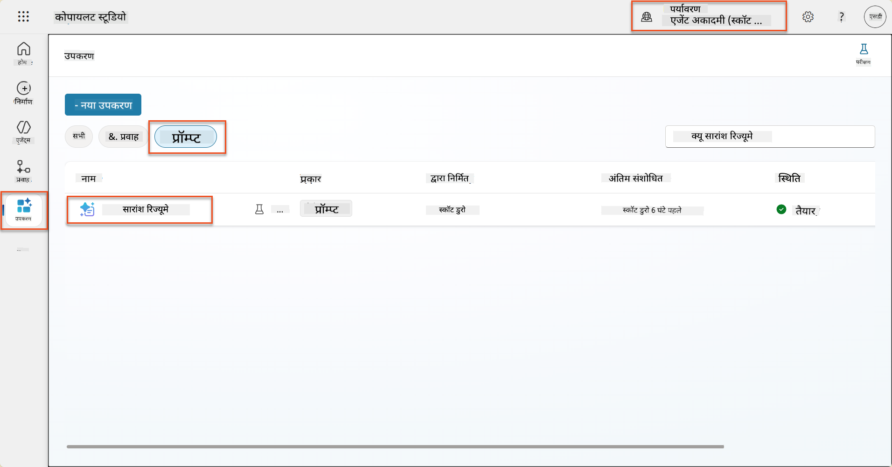

1. **Edit** चुनें और प्रॉम्प्ट को संशोधित करें, और नीचे दिए गए उन्नत संस्करण से बदलें:

    !!! important
        सुनिश्चित करें कि Resume और Cover Letter पैरामीटर पैरामीटर के रूप में बरकरार रहें।

    ```text
    You are tasked with extracting key candidate information from a resume and cover letter to facilitate matching with open job roles and creating a summary for application review.
    
    ### Instructions:
    1. **Extract Candidate Details:**
       - Identify and extract the candidate's full name.
       - Extract contact information, specifically the email address.
    
    2. **Analyze Resume and Cover Letter:**
       - Review the resume content to identify relevant skills, experience, and qualifications.
       - Review the cover letter to understand the candidate's motivation and suitability for the roles.
    
    3. **Match Against Open Job Roles:**
       - Compare the extracted candidate information with the requirements and descriptions of the provided open job roles.
       - Use the job descriptions to assess potential fit.
       - Identify all roles that align with the candidate's cover letter and profile. You don't need to assess perfect suitability.
       - Provide reasoning for each match based on the specific job requirements.
    
    4. **Create Candidate Summary:**
       - Summarize the candidate's profile as multiline text with the following sections:
          - Candidate name
          - Role(s) applied for if present
          - Contact and location
          - One-paragraph summary
          - Top skills (8–10)
          - Experience snapshot (last 2–3 roles with outcomes)
          - Key projects (1–3 with metrics)
          - Education and certifications
          - Availability and work authorization
    
    ### Output Format
    
    Provide the output in valid JSON format with the following structure:
    
    {
      "CandidateName": "string",
      "Email": "string",
      "MatchedRoles": [
        {
          "JobRoleNumber": "ppa_jobrolenumber from grounded data",
          "RoleName": "ppa_jobtitle from grounded data",
          "Reasoning": "Detailed explanation based on job requirements"
        }
      ],
      "Summary": "string"
    }
    
    ### Guidelines
    
    - Extract information only from the provided resume and cover letter documents.
    - Ensure accuracy in identifying contact details.
    - Use the available job role data for matching decisions.
    - The summary should be concise but informative, suitable for quick application review.
    - If no suitable matches are found, indicate an empty list for MatchedRoles and explain briefly in the summary.
    
    ### Input Data
    Open Job Roles (ppa_jobrolenumber, ppa_jobtitle): /Job Role 
    Resume: {Resume}
    Cover Letter: {CoverLetter}
    ```

1. प्रॉम्प्ट एडिटर में, `/Job Role` को बदलें और **+ Add content** चुनें, **Dataverse** → **Job Role** चुनें और निम्नलिखित कॉलम्स का चयन करें, फिर **Add** चुनें:

    1. **Job Role Number**

    1. **Job Title**

    1. **Description**

    !!! tip
        आप टेबल का नाम टाइप करके खोज सकते हैं।

1. **Job Role** डायलॉग में, **Filter** एट्रिब्यूट चुनें, **Status** चुनें, और फिर **Active** को **Filter** मान के रूप में टाइप करें।  
    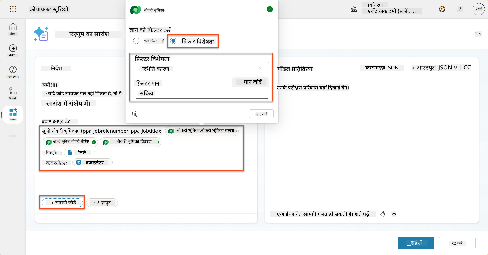

    !!! tip
        आप यहां **Add value** का उपयोग करके एक इनपुट पैरामीटर भी जोड़ सकते हैं - उदाहरण के लिए यदि आपके पास किसी मौजूदा रिकॉर्ड को सारांशित करने का प्रॉम्प्ट है, तो आप फ़िल्टर करने के लिए Resume Number को पैरामीटर के रूप में प्रदान कर सकते हैं।

1. अगला, आप संबंधित Dataverse टेबल **Evaluation Criteria** जोड़ेंगे, फिर से **+ Add content** चुनें, **Job Roles** ढूंढें, और Job Role पर कॉलम्स का चयन करने के बजाय, **Job Role (Evaluation Criteria)** पर जाएं और निम्नलिखित कॉलम्स का चयन करें, फिर **Add** चुनें:

    1. **Criteria Name**

    1. **Description**  
        

        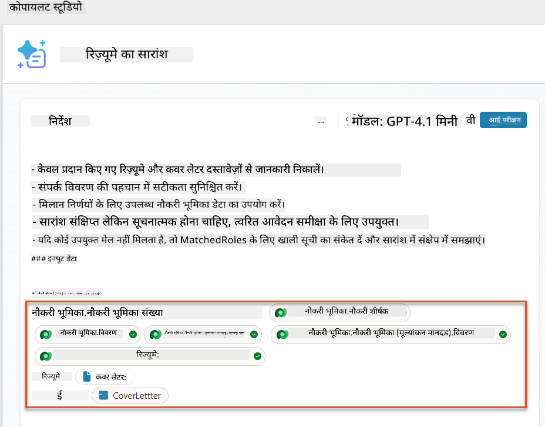

    !!! tip
        यह महत्वपूर्ण है कि संबंधित Evaluation Criteria को पहले Job Role का चयन करके और फिर मेनू में Job Role (Evaluation Criteria) पर नेविगेट करके चुना जाए। यह सुनिश्चित करेगा कि केवल Job Role के संबंधित रिकॉर्ड्स लोड किए जाएंगे।

1. **Settings** चुनें, और **Record retrieval** को 1000 पर समायोजित करें - यह अधिकतम Job Roles और Evaluation Criteria को आपके प्रॉम्प्ट में शामिल करने की अनुमति देगा।  
    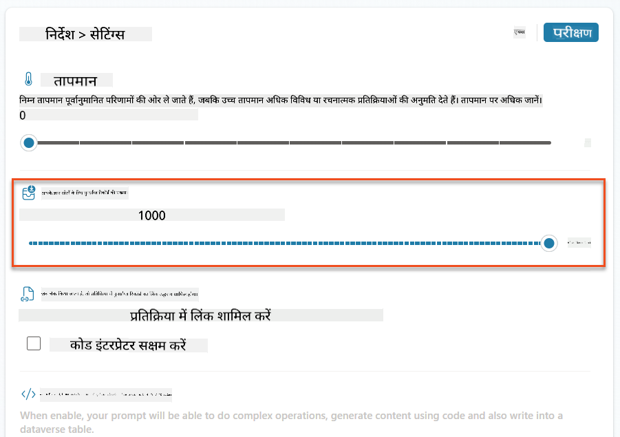

### 8.3 उन्नत प्रॉम्प्ट का परीक्षण करें

1. **Resume** पैरामीटर चुनें, और मिशन 07 में उपयोग किए गए नमूना रिज्यूमे को अपलोड करें।
1. **Test** चुनें।
1. एक बार परीक्षण पूरा हो जाने के बाद, ध्यान दें कि JSON आउटपुट अब **Matched Roles** को शामिल करता है।
1. **Knowledge used** टैब चुनें, यह देखने के लिए कि Dataverse डेटा आपके प्रॉम्प्ट के साथ निष्पादन से पहले कैसे मर्ज हुआ।
1. **Save** करें अपने अपडेटेड प्रॉम्प्ट को। सिस्टम अब स्वचालित रूप से इस Dataverse डेटा को आपके प्रॉम्प्ट के साथ शामिल करेगा जब मौजूदा Summarize Resume Agent Flow इसे कॉल करेगा।  
    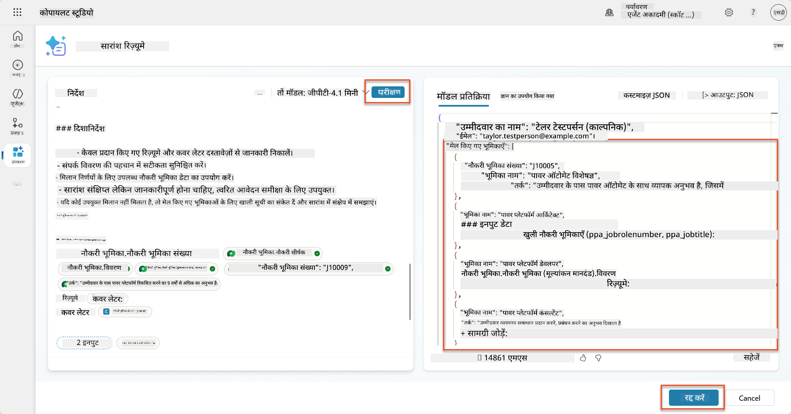

### 8.4 जॉब एप्लिकेशन एजेंट फ्लो जोड़ें

हमारे Application Intake Agent को सुझाए गए रोल्स के आधार पर जॉब रोल्स बनाने की अनुमति देने के लिए, हमें एक Agent Flow बनाना होगा। एजेंट प्रत्येक सुझाए गए जॉब रोल्स के लिए इस टूल को कॉल करेगा जिसमें उम्मीदवार रुचि रखता है।

!!! tip "Agent Flow एक्सप्रेशंस"
    यह बहुत महत्वपूर्ण है कि आप अपने नोड्स का नामकरण और एक्सप्रेशंस को बिल्कुल सही तरीके से दर्ज करें क्योंकि एक्सप्रेशंस पिछले नोड्स को उनके नाम का उपयोग करके संदर्भित करते हैं! [Agent Flow मिशन इन Recruit](../../recruit/09-add-an-agent-flow/README.md#you-mentioned-expressions-what-are-expressions) में एक त्वरित पुनरावलोकन के लिए देखें!

1. **Hiring Agent** के अंदर, **Agents** टैब चुनें, और **Application Intake Agent** चाइल्ड एजेंट खोलें।

1. **Tools** पैनल के अंदर, **+ Add** → **+ New tool** → **Agent Flow** चुनें।

1. **When an agent calls the flow** नोड चुनें, **+ Add an input** का उपयोग करके निम्नलिखित पैरामीटर जोड़ें:

    | प्रकार | नाम            | विवरण                                                  |
    | ---- | --------------- | ------------------------------------------------------------ |
    | Text | `ResumeNumber`  | सुनिश्चित करें कि केवल [ResumeNumber] का उपयोग करें - यह MUST अक्षर R से शुरू होना चाहिए |
    | Text | `JobRoleNumber` | सुनिश्चित करें कि केवल [JobRoleNumber] का उपयोग करें - यह MUST अक्षर J से शुरू होना चाहिए |

    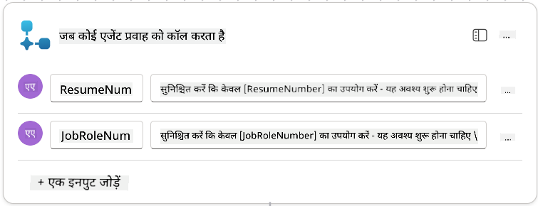

1. पहले नोड के नीचे **+** Insert action आइकन चुनें, **Dataverse** खोजें, **See more** चुनें, और फिर **List rows** एक्शन को ढूंढें।

1. **नोड का नाम बदलें** `Get Resume`, और निम्नलिखित पैरामीटर सेट करें:

    | प्रॉपर्टी        | कैसे सेट करें                      | मान                                                        |
    | --------------- | ------------------------------- | ------------------------------------------------------------ |
    | **Table name**  | चयन करें                          | Resumes                                                      |
    | **Filter rows** | डायनामिक डेटा (थंडरबोल्ट आइकन) | `ppa_resumenumber eq 'ResumeNumber'` चुनें और **ResumeNumber** को **When an agent calls the flow** → **ResumeNumber** से बदलें |
    | **Row count**   | दर्ज करें                           | 1                                                            |

    

1. अब, **Get Resume** के नीचे **+** Insert action आइकन चुनें, **Dataverse** खोजें, **See more** चुनें, और फिर **List rows** एक्शन को ढूंढें।

1. **नोड का नाम बदलें** `Get Job Role`, और निम्नलिखित पैरामीटर सेट करें:

    | प्रॉपर्टी        | कैसे सेट करें                      | मान                                                        |
    | --------------- | ------------------------------- | ------------------------------------------------------------ |
    | **Table name**  | चयन करें                          | Job Roles                                                    |
    | **Filter rows** | डायनामिक डेटा (थंडरबोल्ट आइकन) | `ppa_jobrolenumber eq 'JobRoleNumber'` चुनें और **JobRoleNumber** को **When an agent calls the flow** → **JobRoleNumber** से बदलें |
    | **Row count**   | दर्ज करें                           | 1                                                            |

    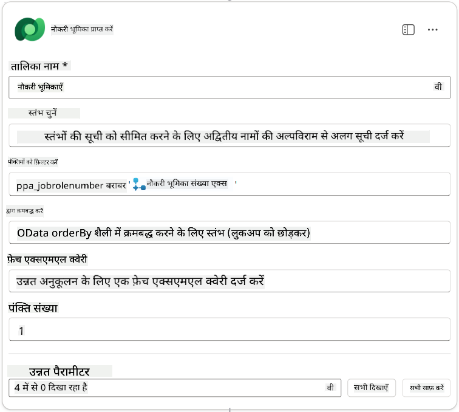

1. अब, Get Job Role के नीचे **+** Insert action आइकन चुनें, **Dataverse** खोजें, **See more** चुनें, और फिर **Add a new row** एक्शन को ढूंढें।

1. **नोड का नाम बदलें** `Add Application`, और निम्नलिखित पैरामीटर सेट करें:

    | प्रॉपर्टी                           | कैसे सेट करें           | मान                                                        |
    | ---------------------------------- | -------------------- | ------------------------------------------------------------ |
    | **Table name**                     | चयन करें               | Job Applications                                             |
    | **Candidate (Candidates)**             | एक्सप्रेशन (fx आइकन) | `concat('ppa_candidates/',first(outputs('Get_Resume')?['body/value'])?['_ppa_candidate_value'])` |
| **नौकरी भूमिका (Job Roles)**               | अभिव्यक्ति (fx आइकन) | `concat('ppa_jobroles/',first(outputs('Get_Job_Role')?['body/value'])?['ppa_jobroleid'])` |
| **रिज़्यूमे (Resumes)**                   | अभिव्यक्ति (fx आइकन) | `concat('ppa_resumes/', first(outputs('Get_Resume')?['body/value'])?['ppa_resumeid'])` |
| **आवेदन तिथि** (उपयोग करें **Show all**) | अभिव्यक्ति (fx आइकन) | `utcNow()`                                                   |

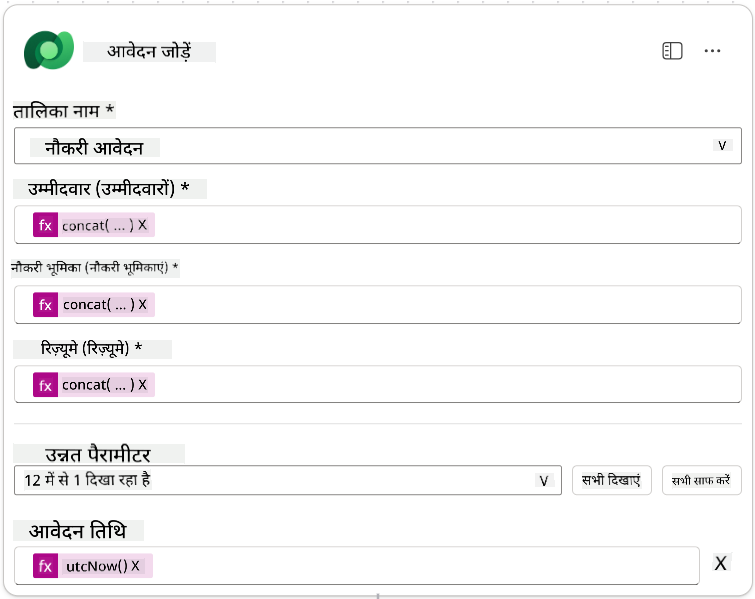

1. **एजेंट को प्रतिक्रिया दें** नोड चुनें, और फिर **+ आउटपुट जोड़ें** चुनें

     | गुण (Property)        | कैसे सेट करें (How to Set)                      | विवरण (Details)                                         |
     | --------------- | ------------------------------- | ----------------------------------------------- |
     | **प्रकार (Type)**        | चयन करें                          | `Text`                                          |
     | **नाम (Name)**        | दर्ज करें                           | `ApplicationNumber`                             |
     | **मूल्य (Value)**       | डायनामिक डेटा (थंडरबोल्ट आइकन) | *आवेदन जोड़ें → अधिक देखें → आवेदन संख्या* |
     | **विवरण (Description)** | दर्ज करें                           | `निर्मित नौकरी आवेदन का [ApplicationNumber]`      |

     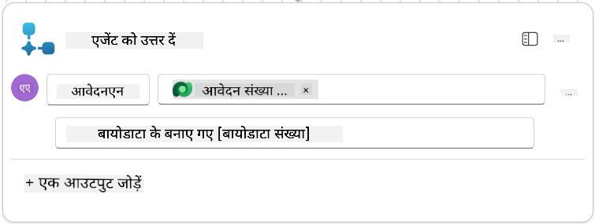

1. ऊपर दाईं ओर **Save draft** चुनें

1. **Overview** टैब चुनें, **Details** पैनल पर **Edit** चुनें

      - **फ्लो नाम (Flow name)**:`Create Job Application`
      - **विवरण (Description)**:`[ResumeNumber] और [JobRoleNumber] दिए जाने पर नया नौकरी आवेदन बनाता है`
      - **Save**

1. फिर से **Designer** टैब चुनें, और **Publish** चुनें।

### 8.5 एजेंट में Create Job Application जोड़ें

अब आप प्रकाशित फ्लो को अपने Application Intake Agent से जोड़ेंगे।

1. **Hiring Agent** पर वापस जाएं और **Agents** टैब चुनें। **Application Intake Agent** खोलें, और फिर **Tools** पैनल ढूंढें।

1. **+ Add** चुनें

1. **Flow** फ़िल्टर चुनें, और `Create Job Application` खोजें। **Create Job Application** फ्लो चुनें, और फिर **Add and configure**।

1. निम्नलिखित पैरामीटर सेट करें:

    | पैरामीटर (Parameter)                                           | मूल्य (Value)                                                        |
    | --------------------------------------------------- | ------------------------------------------------------------ |
    | **विवरण (Description)**                                     | `[ResumeNumber] और [JobRoleNumber] दिए जाने पर नया नौकरी आवेदन बनाता है` |
    | **अतिरिक्त विवरण → यह टूल कब उपयोग किया जा सकता है (Additional details → When this tool may be used)** | `केवल जब विषयों या एजेंटों द्वारा संदर्भित किया जाए`                   |

1. **Save** चुनें  
    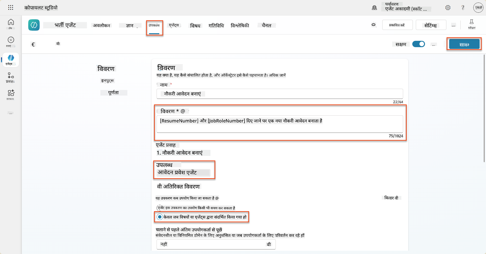

### 8.6 एजेंट निर्देश परिभाषित करें

नौकरी आवेदन बनाने के लिए, आपको एजेंट को बताना होगा कि नया टूल कब उपयोग करना है। इस मामले में, आप उपयोगकर्ता से पुष्टि करेंगे कि किन सुझाए गए नौकरी भूमिकाओं पर आवेदन करना है, और एजेंट को प्रत्येक भूमिका के लिए टूल चलाने का निर्देश देंगे।

1. **Application Intake Agent** में वापस जाएं, और **Instructions** पैनल ढूंढें।

1. **Instructions** फ़ील्ड में, **मौजूदा निर्देशों के अंत में** अपने चाइल्ड एजेंट के लिए निम्नलिखित स्पष्ट मार्गदर्शन **जोड़ें**:

    ```text
    3. Post Resume Upload
       - Respond with a formatted bullet list of [SuggestedJobRoles] the candidate could apply for.  
       - Use the format: [JobRoleNumber] - [RoleDescription]
       - Ask the user to confirm which Job Roles to create applications for the candidate.
       - When the user has confirmed a set of [JobRoleNumber]s, move to the next step.
    
    4. Post Upload - Application Creation
        - After the user confirms which [SuggestedJobRoles] for a specific [ResumeNumber]:
        E.g. "Apply [ResumeNumber] for the Job Roles [JobRoleNumber], [JobRoleNumber], [JobRoleNumber]
        E.g. "apply to all suggested job roles" - this implies use all the [JobRoleNumbers] 
         - Loop over each [JobRoleNumber] and send with [ResumeNumber] to /Create Job Application   
         - Summarize the Job Applications Created
    
    Strict Rules (that must never be broken)
    You must always follow these rules and never break them:
    1. The only valid identifiers are:
      - ResumeNumber (ppa_resumenumber)→ format R#####
      - CandidateNumber (ppa_candidatenumber)→ format C#####
      - ApplicationNumber (ppa_applicationnumber)→ format A#####
      - JobRoleNumber (ppa_jobrolenumber)→ format J#####
    2. Never guess or invent these values.
    3. Always extract identifiers from the current context (conversation, data, or system output). 
    ```

1. जहां निर्देशों में एक फॉरवर्ड स्लैश (/) शामिल है, स्लैश के बाद के टेक्स्ट का चयन करें और **Create Job Application** टूल चुनें।

1. **Save** चुनें  
    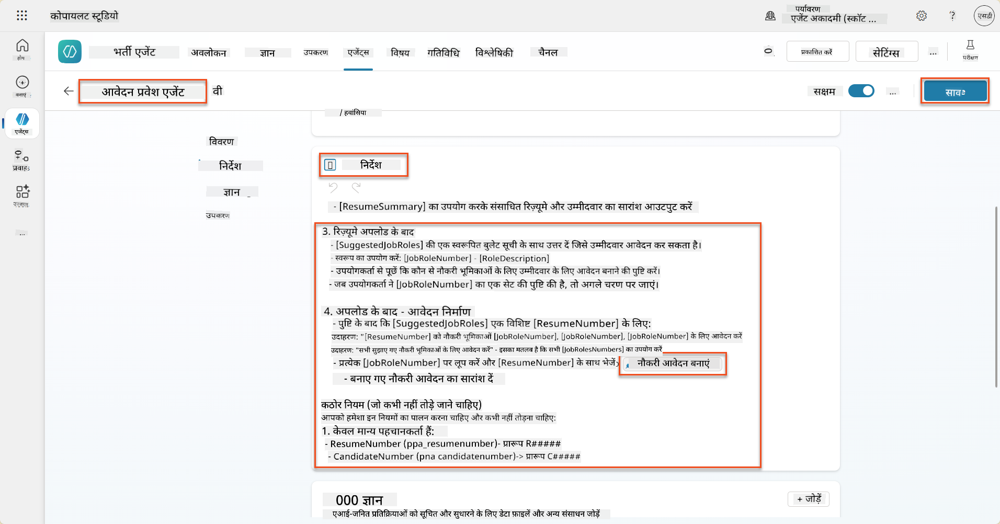

!!! tip "Generative Orchestration में कई आइटम्स पर पुनरावृत्ति करना"
    ये निर्देश जनरेटिव ऑर्केस्ट्रेशन की क्षमता का उपयोग करते हैं जो निर्णय लेने के समय कई पंक्तियों पर पुनरावृत्ति कर सकते हैं कि कौन से चरण और टूल उपयोग किए जाएं। मेल खाई नौकरी भूमिकाएं स्वचालित रूप से पढ़ी जाएंगी और Application Intake Agent प्रत्येक पंक्ति के लिए चलाया जाएगा। जनरेटिव ऑर्केस्ट्रेशन की जादुई दुनिया में आपका स्वागत है!

### 8.7 अपने एजेंट का परीक्षण करें

1. Copilot Studio में अपना **Hiring Agent** खोलें।

1. चैट में एक नमूना रिज़्यूमे **अपलोड** करें, और टाइप करें:

    ```text
    This is a new resume for the Power Platform Developer Role.
    ```

1. ध्यान दें कि एजेंट सुझाए गए नौकरी भूमिकाओं की सूची प्रदान करता है - प्रत्येक के साथ एक नौकरी भूमिका संख्या।  
    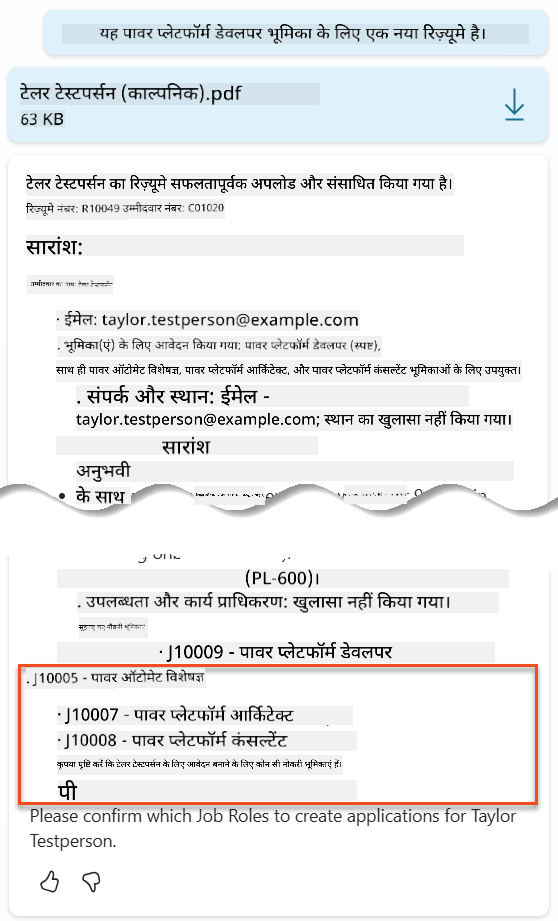

1. आप फिर यह बता सकते हैं कि इनमें से किन भूमिकाओं के लिए आप रिज़्यूमे को नौकरी आवेदन के रूप में जोड़ना चाहते हैं।
    **उदाहरण:**

    ```text
    "Apply for all of those job roles"
    "Apply for the J10009 Power Platform Developer role"
    "Apply for the Developer and Architect roles"
    ```

    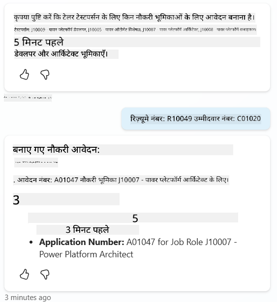

1. **Create Job Application टूल** फिर प्रत्येक नौकरी भूमिका के लिए चलाया जाएगा जिसे आपने आवेदन बनाने के लिए निर्दिष्ट किया था। Activity map के अंदर, आप देखेंगे कि Create Job Application टूल प्रत्येक नौकरी भूमिका के लिए चलाया गया जिसे आपने आवेदन के लिए कहा था:  
    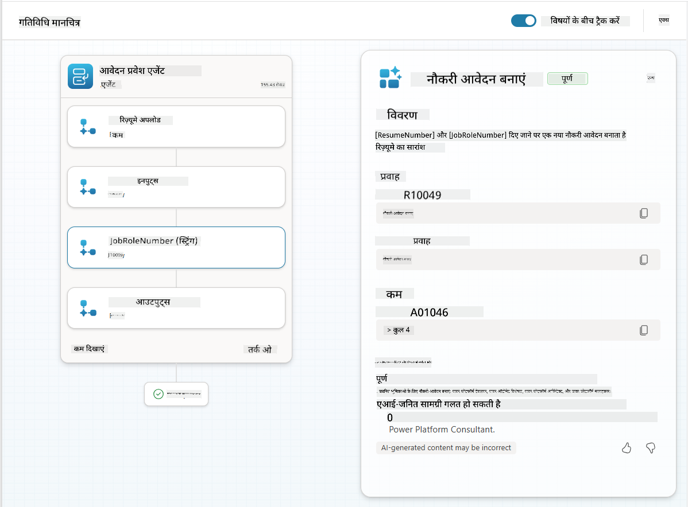

## 🎉 मिशन पूरा

शानदार काम, ऑपरेटिव! **Operation Grounding Control** अब पूरा हो गया है। आपने अपनी AI क्षमताओं को डायनामिक डेटा ग्राउंडिंग के साथ सफलतापूर्वक बढ़ाया है, एक वास्तव में बुद्धिमान भर्ती प्रणाली बनाई है।

यहां आपने इस मिशन में क्या हासिल किया:

**✅ Dataverse ग्राउंडिंग में महारत**  
अब आप कस्टम प्रॉम्प्ट्स को लाइव डेटा स्रोतों से जोड़ने के लिए समझते हैं ताकि डायनामिक इंटेलिजेंस प्राप्त हो सके।

**✅ उन्नत रिज़्यूमे विश्लेषण**  
आपका Summarize Resume फ्लो अब वास्तविक समय नौकरी भूमिका डेटा और मूल्यांकन मानदंडों तक पहुंचता है ताकि सटीक मिलान हो सके।

**✅ डेटा-चालित निर्णय लेना**  
आपके भर्ती एजेंट अब नौकरी आवश्यकताओं में बदलाव के साथ स्वचालित रूप से अनुकूलित हो सकते हैं बिना मैनुअल प्रॉम्प्ट अपडेट के।

**✅ नौकरी आवेदन निर्माण**  
आपकी उन्नत प्रणाली अब नौकरी आवेदन बना सकती है और आगे के जटिल वर्कफ़्लो ऑर्केस्ट्रेशन के लिए तैयार है।

🚀 **अगला:** अपने अगले मिशन में, आप सीखेंगे कि गहन तर्क क्षमताओं को कैसे लागू करें जो आपके एजेंटों को जटिल निर्णय लेने और उनकी सिफारिशों के लिए विस्तृत स्पष्टीकरण प्रदान करने में मदद करें।

⏩ [मिशन 09: गहन तर्क पर जाएं](../09-deep-reasoning/README.md)

## 📚 सामरिक संसाधन

📖 [अपने डेटा का उपयोग प्रॉम्प्ट में करें](https://learn.microsoft.com/ai-builder/use-your-own-prompt-data?WT.mc_id=power-182762-scottdurow)

📖 [एक कस्टम प्रॉम्प्ट बनाएं](https://learn.microsoft.com/ai-builder/create-a-custom-prompt?WT.mc_id=power-182762-scottdurow)

📖 [Copilot Studio में Dataverse के साथ काम करें](https://learn.microsoft.com/microsoft-copilot-studio/knowledge-add-dataverse?WT.mc_id=power-182762-scottdurow)

📖 [AI Builder कस्टम प्रॉम्प्ट्स का अवलोकन](https://learn.microsoft.com/ai-builder/prompts-overview?WT.mc_id=power-182762-scottdurow)

📖 [Power Platform AI Builder दस्तावेज़ीकरण](https://learn.microsoft.com/ai-builder/?WT.mc_id=power-182762-scottdurow)

📖 [प्रशिक्षण: अपने Dataverse डेटा का उपयोग करके AI Builder प्रॉम्प्ट्स बनाएं](https://learn.microsoft.com/training/modules/ai-builder-grounded-prompts/?WT.mc_id=power-182762-scottdurow)

---

**अस्वीकरण**:  
यह दस्तावेज़ AI अनुवाद सेवा [Co-op Translator](https://github.com/Azure/co-op-translator) का उपयोग करके अनुवादित किया गया है। जबकि हम सटीकता के लिए प्रयास करते हैं, कृपया ध्यान दें कि स्वचालित अनुवाद में त्रुटियां या अशुद्धियां हो सकती हैं। मूल भाषा में दस्तावेज़ को आधिकारिक स्रोत माना जाना चाहिए। महत्वपूर्ण जानकारी के लिए, पेशेवर मानव अनुवाद की सिफारिश की जाती है। इस अनुवाद के उपयोग से उत्पन्न किसी भी गलतफहमी या गलत व्याख्या के लिए हम उत्तरदायी नहीं हैं।