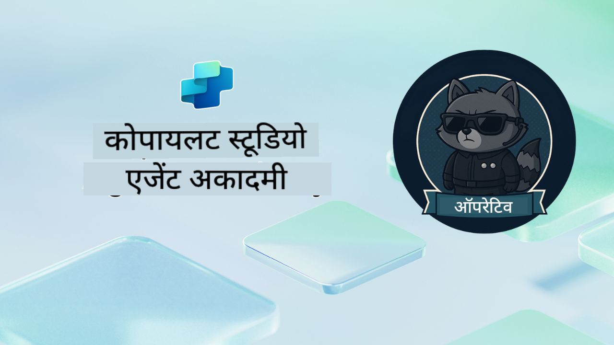

<!--
CO_OP_TRANSLATOR_METADATA:
{
  "original_hash": "24fcbe9a57d3439e05f8866e550c0a84",
  "translation_date": "2025-10-21T17:36:55+00:00",
  "source_file": "docs/operative-preview/README.md",
  "language_code": "hi"
}
-->
# स्वागत है ऑपरेटिव

**स्वागत है, ऑपरेटिव।**  
आपका उन्नत मिशन—यदि आप इसे स्वीकार करते हैं—**Microsoft Copilot Studio** का उपयोग करके **एंटरप्राइज़-ग्रेड मल्टी-एजेंट सिस्टम** बनाने की कला में महारत हासिल करना है।

यह गहन प्रशिक्षण आपको साधारण एजेंट निर्माण से आगे ले जाता है और आपको **मल्टी-एजेंट ऑर्केस्ट्रेशन** की जटिल दुनिया में प्रवेश कराता है: हायरिंग ऑटोमेशन से लेकर AI सुरक्षा तक, आप वास्तविक एंटरप्राइज़ परिदृश्यों का उपयोग करके बुद्धिमान एजेंट इकोसिस्टम को बनाना, समन्वय करना और तैनात करना सीखेंगे।

--8<-- "disclaimer.md"

---

## 🎯 मिशन उद्देश्य

एजेंट अकादमी ऑपरेटिव प्रोग्राम पूरा करने के बाद, आप सक्षम होंगे:

- जटिल व्यावसायिक परिदृश्यों के लिए **मल्टी-एजेंट सिस्टम** डिज़ाइन और लागू करना
- **एजेंट ऑर्केस्ट्रेशन** और सहयोग पैटर्न में महारत हासिल करना
- उत्पादन प्रणाली में **AI सुरक्षा और सामग्री मॉडरेशन** लागू करना
- दस्तावेज़ प्रसंस्करण और विश्लेषण के लिए **मल्टी-मोडल प्रॉम्प्ट्स** बनाना
- उचित गवर्नेंस और परीक्षण के साथ **एंटरप्राइज़-रेडी एजेंट्स** तैनात करना

---

## 🧪 आवश्यकताएँ

सभी मिशन पूरा करने के लिए, आपको चाहिए:

- **एजेंट अकादमी रिक्रूट** प्रशिक्षण पूरा किया हो
- **Copilot Studio** लाइसेंस के साथ Microsoft Power Platform वातावरण
- **Microsoft Dataverse** तक पहुंच
- समाधान और एजेंट बनाने के लिए प्रशासनिक अनुमतियाँ

---

## 🧬 यह किसके लिए है

यह उन्नत कोर्स आदर्श है:

- **सॉल्यूशन आर्किटेक्ट्स** जो एंटरप्राइज़ AI सिस्टम डिज़ाइन कर रहे हैं
- **डेवलपर्स** जो उत्पादन-रेडी एजेंट समाधान बना रहे हैं
- **आईटी पेशेवर** जो AI गवर्नेंस और सुरक्षा लागू कर रहे हैं
- **बिजनेस एनालिस्ट्स** जो जटिल ऑटोमेशन वर्कफ़्लो बना रहे हैं
- कोई भी जो **बेसिक एजेंट्स से एंटरप्राइज़ सिस्टम तक** स्तर बढ़ाने के लिए तैयार है

---

## 🧭 पाठ्यक्रम अवलोकन

यह अकादमी प्रगतिशील फील्ड ऑपरेशन्स की एक श्रृंखला के रूप में संरचित है—प्रत्येक मिशन पिछले मिशन पर आधारित है ताकि एक व्यापक हायरिंग ऑटोमेशन सिस्टम बनाया जा सके।

| मिशन | शीर्षक | ऑपरेशन ब्रीफिंग |
|---------|-------|-------------------|
| `01` | 🚨 [हायरिंग एजेंट के साथ शुरुआत करें](./01-get-started/README.md) | बुनियादी ढांचे को तैनात करें और अपना केंद्रीय ऑर्केस्ट्रेटर एजेंट बनाएं |
| `02` | 🎭 [अपने एजेंट को कनेक्टेड एजेंट्स के साथ मल्टी-एजेंट रेडी बनाएं](./02-multi-agent/README.md) | सिंगल एजेंट को समन्वित मल्टी-एजेंट सिस्टम में बदलें |
| `03` | ⚡ [ट्रिगर्स के साथ अपने एजेंट को स्वचालित करें](./03-automate-triggers/README.md) | इवेंट-ड्रिवन ट्रिगर्स के साथ स्वायत्त एजेंट व्यवहार लागू करें |
| `04` | 📝 [एजेंट निर्देश लिखना](./04-agent-instructions/README.md) | सटीक एजेंट संचार और व्यवहार नियंत्रण में महारत हासिल करें |
| `05` | 💬 [एजेंट प्रतिक्रियाओं को व्यक्तिगत बनाना](./05-agent-responses/README.md) | अधिकतम प्रभाव और जुड़ाव के लिए एजेंट प्रतिक्रियाओं को अनुकूलित करें |
| `06` | 🛡️ [सामग्री मॉडरेशन और AI सुरक्षा आवश्यकताएँ](./06-ai-safety/README.md) | एंटरप्राइज़-ग्रेड सुरक्षा और अनुपालन उपाय लागू करें |
| `07` | 🎨 [मल्टी-मोडल प्रॉम्प्ट्स के साथ रिज़्यूमे सामग्री निकालना](./07-multimodal-prompts/README.md) | उन्नत AI क्षमताओं के साथ दस्तावेज़ और छवियों को संसाधित करें |
| `08` | 🗄️ [प्रॉम्प्ट्स - Dataverse ग्राउंडिंग](./08-dataverse-grounding/README.md) | सटीक प्रतिक्रियाओं के लिए एजेंट्स को एंटरप्राइज़ डेटा में ग्राउंड करें |
| `09` | 🧠 [उम्मीदवार फिट और इंटरव्यू तैयारी का मूल्यांकन करने के लिए डीप रीजनिंग लागू करना](./09-deep-reasoning/README.md) | जटिल निर्णयों के लिए परिष्कृत AI रीजनिंग लागू करें |
| `10` | 📄 [प्रॉम्प्ट्स के साथ उम्मीदवार-विशिष्ट इंटरव्यू दस्तावेज़ तैयार करना](./10-generate-documents/README.md) | एजेंट विश्लेषण के आधार पर गतिशील दस्तावेज़ बनाएं |
| `11` | 📊 [एडाप्टिव कार्ड्स के साथ उपयोगकर्ता प्रतिक्रिया प्राप्त करना](./11-obtain-user-feedback/README.md) | निरंतर सुधार के लिए उपयोगकर्ता प्रतिक्रिया एकत्र करें और संसाधित करें |
| `12` | 🌐 [स्टेकहोल्डर परीक्षण के लिए अपने एजेंट्स को डेमो वेबसाइट पर प्रकाशित करना](./12-demo-website/README.md) | स्टेकहोल्डर प्रदर्शन और परीक्षण के लिए संपूर्ण समाधान तैनात करें |

!!! note
    ✅ इस पाठ्यक्रम को पूरा करने पर आपको **ऑपरेटिव** बैज प्राप्त होगा।  
    🔓 **कमांडर** भविष्य के चरणों में अनलॉक किया जाएगा।

<!-- markdownlint-disable-next-line MD033 -->

---

**अस्वीकरण**:  
यह दस्तावेज़ AI अनुवाद सेवा [Co-op Translator](https://github.com/Azure/co-op-translator) का उपयोग करके अनुवादित किया गया है। जबकि हम सटीकता के लिए प्रयास करते हैं, कृपया ध्यान दें कि स्वचालित अनुवाद में त्रुटियां या अशुद्धियां हो सकती हैं। मूल भाषा में दस्तावेज़ को आधिकारिक स्रोत माना जाना चाहिए। महत्वपूर्ण जानकारी के लिए, पेशेवर मानव अनुवाद की सिफारिश की जाती है। इस अनुवाद के उपयोग से उत्पन्न किसी भी गलतफहमी या गलत व्याख्या के लिए हम उत्तरदायी नहीं हैं।