<!--
CO_OP_TRANSLATOR_METADATA:
{
  "original_hash": "d9cd8cd1a4fbd8915171a2ed972cc322",
  "translation_date": "2025-10-21T19:09:16+00:00",
  "source_file": "docs/recruit/00-course-setup/README.md",
  "language_code": "hi"
}
-->
# 🚨 मिशन 00: कोर्स सेटअप

## 🕵️‍♂️ कोडनेम: `ऑपरेशन डिप्लॉयमेंट रेडी`

> **⏱️ ऑपरेशन समय सीमा:** `~30 मिनट`  

## 🎯 मिशन का विवरण

आपका स्वागत है, कोपायलट स्टूडियो एजेंट के रूप में आपके प्रशिक्षण के पहले मिशन में।  
अपने पहले AI एजेंट को बनाने से पहले, आपको अपना **फील्ड-रेडी डेवलपमेंट एनवायरनमेंट** स्थापित करना होगा।

यह ब्रीफिंग Microsoft 365 इकोसिस्टम में सफलतापूर्वक काम करने के लिए आवश्यक सिस्टम, एक्सेस क्रेडेंशियल्स और सेटअप चरणों को बताती है।

## 🔎 उद्देश्य

आपका मिशन शामिल करता है:

1. Microsoft 365 अकाउंट प्राप्त करना  
1. Microsoft Copilot Studio तक पहुंच प्राप्त करना  
1. (वैकल्पिक) प्रोडक्शन पब्लिशिंग के लिए Microsoft 365 Copilot लाइसेंस सुरक्षित करना  
1. Copilot Studio एनवायरनमेंट में निर्माण के लिए एक डेवलपर एनवायरनमेंट बनाना  
1. एक SharePoint साइट बनाना जो बाद के मिशनों में आपके डेटा स्रोत के रूप में काम करेगी  

---

## 🔍 आवश्यकताएँ

शुरू करने से पहले, सुनिश्चित करें कि आपके पास:

1. एक **वर्क या स्कूल ईमेल एड्रेस** (पर्सनल @outlook.com, @gmail.com आदि समर्थित नहीं हैं)।  
1. इंटरनेट और एक आधुनिक ब्राउज़र (Edge, Chrome, या Firefox अनुशंसित)।  
1. Microsoft 365 की बुनियादी जानकारी (जैसे Office ऐप्स या Teams में साइन इन करना)।  
1. (वैकल्पिक) यदि आप पेड लाइसेंस खरीदने की योजना बना रहे हैं तो एक क्रेडिट कार्ड या बिलिंग विधि।  

---

## चरण 1: Microsoft 365 अकाउंट प्राप्त करें

Copilot Studio Microsoft 365 के भीतर स्थित है, इसलिए इसे एक्सेस करने के लिए आपको एक Microsoft 365 अकाउंट की आवश्यकता होगी। यदि आपके पास पहले से एक अकाउंट है तो आप उसका उपयोग कर सकते हैं या इन चरणों का पालन करके एक उपयुक्त लाइसेंस प्राप्त कर सकते हैं:

1. **पेड Microsoft 365 बिजनेस सब्सक्रिप्शन प्राप्त करें**  
   1. [Microsoft 365 बिजनेस प्लान्स और प्राइसिंग पेज](https://www.microsoft.com/microsoft-365/business/microsoft-365-plans-and-pricing) पर जाएं।  
   1. शुरुआत करने के लिए सबसे सस्ता विकल्प Microsoft 365 बिजनेस बेसिक प्लान है। `Try for free` चुनें और अपने सब्सक्रिप्शन, अकाउंट विवरण और भुगतान जानकारी भरने के लिए गाइडेड फॉर्म का पालन करें।  
   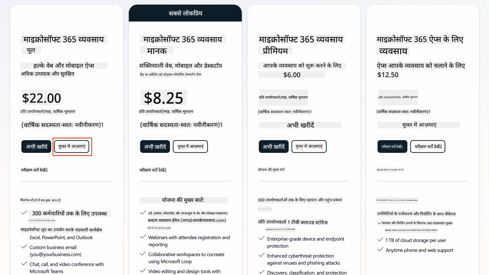  
   1. एक बार जब आपका नया अकाउंट बन जाए, तो लॉगिन करें।  

    !!! टिप  
        यदि आप Microsoft 365 Copilot Chat में एजेंट्स को पब्लिश करने या संगठनात्मक डेटा (SharePoint, OneDrive, Dataverse) से कनेक्ट करने की योजना बना रहे हैं, तो Microsoft 365 Copilot लाइसेंस आवश्यक है। यह एक ऐड-ऑन लाइसेंस है जिसके बारे में आप [लाइसेंसिंग साइट](https://www.microsoft.com/microsoft-365/copilot#plans) पर अधिक जान सकते हैं।  

---

## चरण 2: Copilot Studio ट्रायल शुरू करें

एक बार जब आपके पास Microsoft 365 टेनेंट हो, तो आपको Copilot Studio तक पहुंच प्राप्त करनी होगी। आप इन चरणों का पालन करके 30 दिन का मुफ्त ट्रायल प्राप्त कर सकते हैं:

1. [aka.ms/TryCopilotStudio](https://aka.ms/TryCopilotStudio) पर जाएं।  
1. पिछले चरण में कॉन्फ़िगर किए गए नए अकाउंट से ईमेल एड्रेस दर्ज करें और `Next` चुनें।  
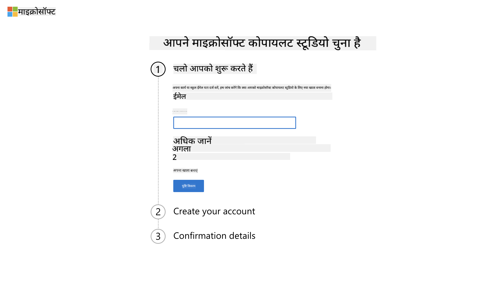  
1. यह आपके अकाउंट को पहचान लेगा। `Sign In` चुनें।  
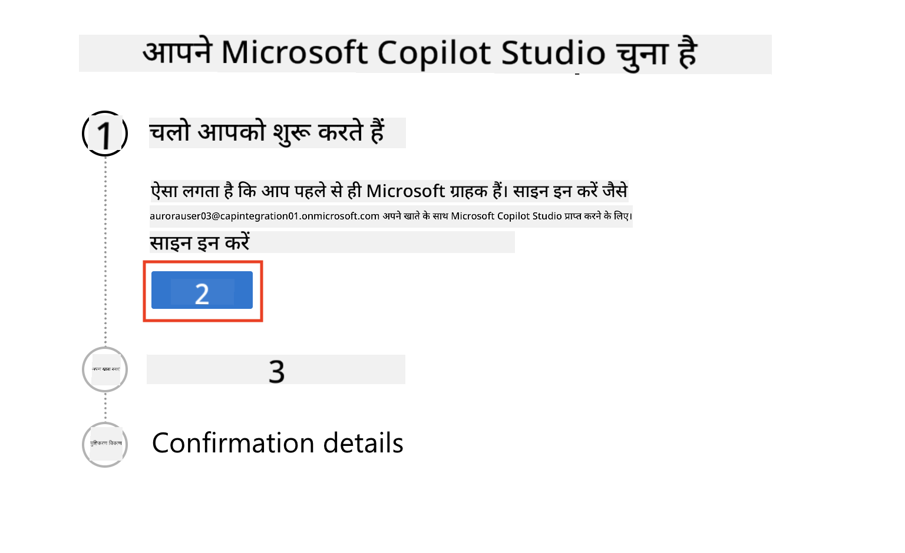  
1. `Start Free Trial` चुनें।  
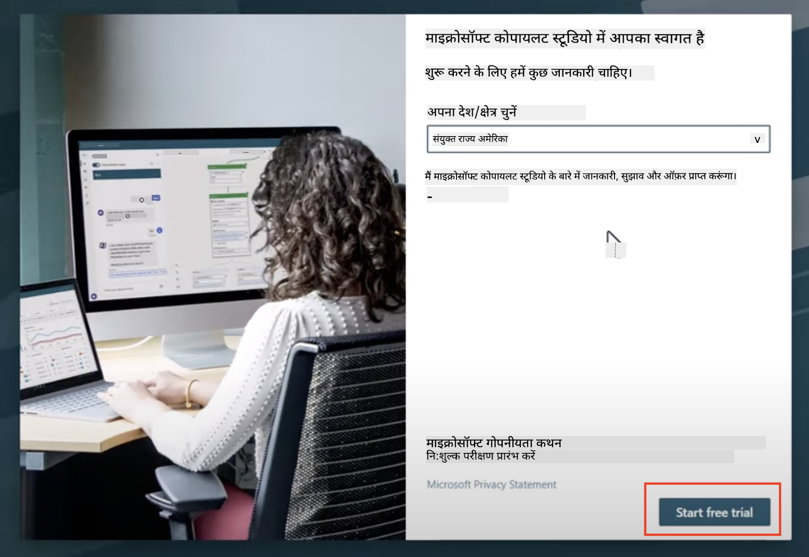  

!!! जानकारी "ट्रायल नोट्स"  
     1. मुफ्त ट्रायल **पूर्ण Copilot Studio क्षमताएँ** प्रदान करता है।  
     1. आपको अपने ट्रायल समाप्ति के बारे में ईमेल नोटिफिकेशन प्राप्त होंगे। आप ट्रायल को 30-दिन की वृद्धि में बढ़ा सकते हैं (90 दिनों तक एजेंट रनटाइम)।  
     1. यदि आपके टेनेंट एडमिनिस्ट्रेटर ने सेल्फ-सर्विस साइन-अप को अक्षम कर दिया है, तो आपको एक त्रुटि दिखाई देगी—अपने Microsoft 365 एडमिन से इसे पुनः सक्षम करने के लिए संपर्क करें।  

---

## चरण 3: नया डेवलपर एनवायरनमेंट बनाएं

### Power Apps डेवलपर प्लान के लिए साइन अप करें

चरण 1 में उपयोग किए गए Microsoft 365 टेनेंट का उपयोग करके, Copilot Studio के साथ निर्माण और परीक्षण करने के लिए एक मुफ्त डेवलपमेंट एनवायरनमेंट बनाने के लिए Power Apps डेवलपर प्लान के लिए साइन अप करें।

1. [Power Apps डेवलपर प्लान वेबसाइट](https://aka.ms/PowerAppsDevPlan) पर साइन अप करें।  

    - अपना ईमेल एड्रेस दर्ज करें।  
    - चेकबॉक्स टिक करें।  
    - **Start free** चुनें।  

    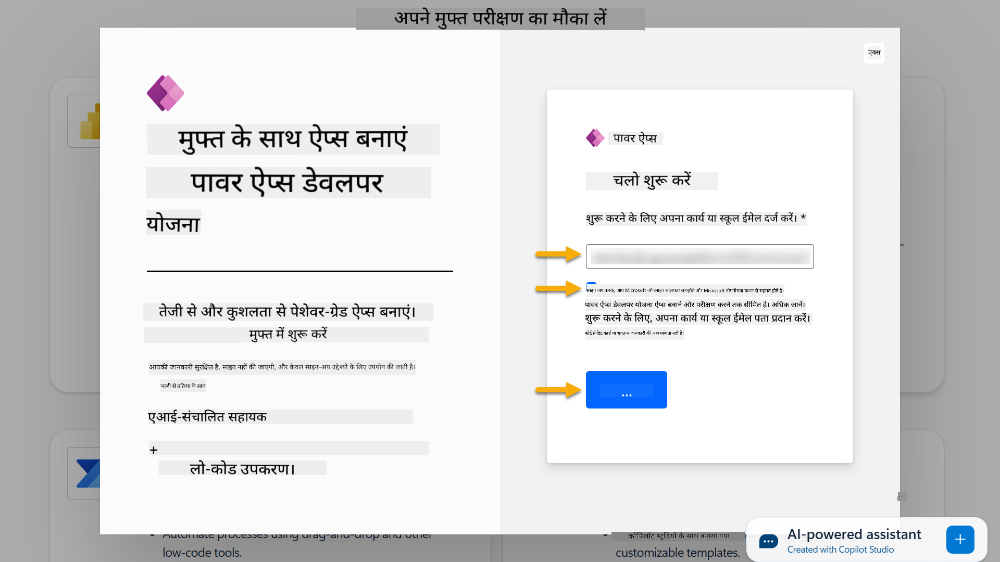  

1. डेवलपर प्लान के लिए साइन अप करने के बाद, आपको [Power Apps](https://make.powerapps.com/) पर रीडायरेक्ट किया जाएगा। एनवायरनमेंट आपके नाम का उपयोग करता है, उदाहरण के लिए **Adele Vance's environment**। यदि पहले से ही उस नाम के साथ एक एनवायरनमेंट है, तो नया डेवलपर एनवायरनमेंट का नाम **Adele Vance's (1)** होगा।  

    Copilot Studio में लैब्स को पूरा करते समय इस डेवलपर एनवायरनमेंट का उपयोग करें।  

!!! नोट  
    यदि आप एक मौजूदा Microsoft 365 अकाउंट का उपयोग कर रहे हैं और चरण 1 में नया अकाउंट नहीं बनाया है, उदाहरण के लिए - अपने कार्य संगठन में अपना खुद का अकाउंट उपयोग कर रहे हैं, तो आपके IT एडमिनिस्ट्रेटर (या समकक्ष) टीम जिसने आपके टेनेंट/एनवायरनमेंट्स का प्रबंधन किया है, साइन अप प्रक्रिया को बंद कर सकती है। इस स्थिति में, कृपया अपने एडमिनिस्ट्रेटर से संपर्क करें, या चरण 1 के अनुसार एक टेस्ट टेनेंट बनाएं।  

---

## चरण 4: नई SharePoint साइट बनाएं

एक नई SharePoint साइट बनाई जानी चाहिए जो [Lesson 06 - Copilot और आपके डेटा के साथ ग्राउंडिंग के साथ संवादात्मक निर्माण अनुभव का उपयोग करके एक कस्टम एजेंट बनाएं](../06-create-agent-from-conversation/README.md#62-add-an-internal-knowledge-source-using-a-sharepoint-site) में उपयोग की जाएगी।  

1. Microsoft Copilot Studio के शीर्ष बाएँ कोने में वॉफल आइकन चुनें और मेनू देखें। मेनू से SharePoint चुनें।  

    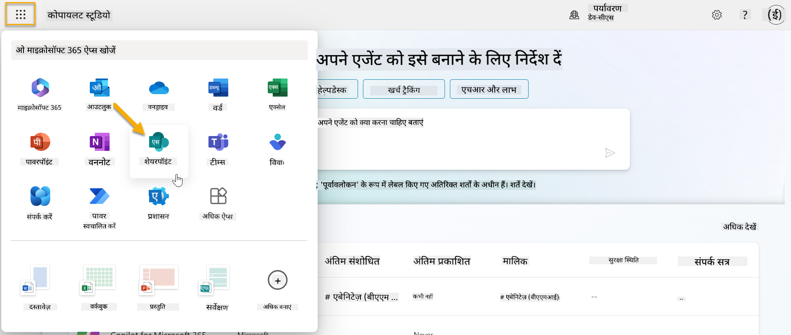  

1. SharePoint लोड होगा। **+ Create site** चुनें और एक नई SharePoint साइट बनाएं।  

    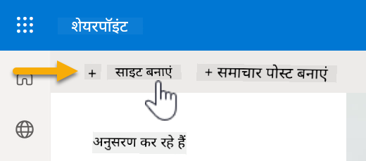  

1. एक डायलॉग बॉक्स दिखाई देगा जो आपको एक नई SharePoint साइट बनाने में मार्गदर्शन करेगा। **Team site** चुनें।  

    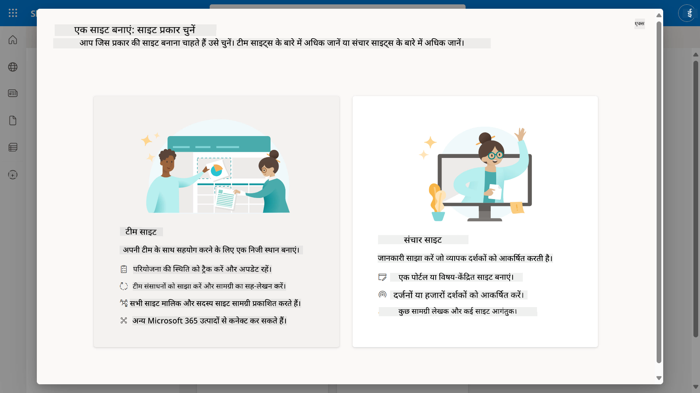  

1. अगले चरण में, Microsoft टेम्पलेट्स की एक सूची डिफ़ॉल्ट रूप से लोड होगी। नीचे स्क्रॉल करें और **IT help desk** टेम्पलेट चुनें।  

    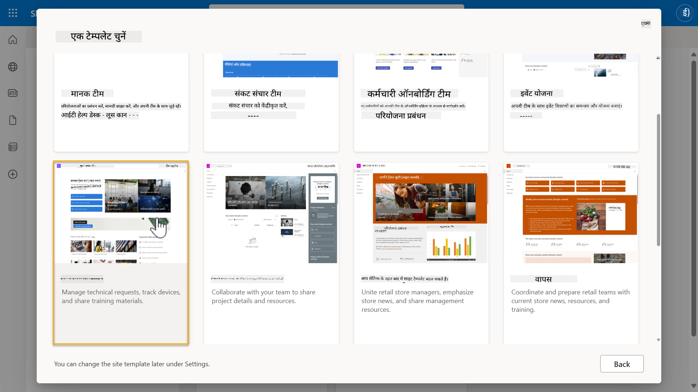  

1. **Use template** चुनें और IT हेल्प डेस्क टेम्पलेट का उपयोग करके एक नई SharePoint साइट बनाएं।  

    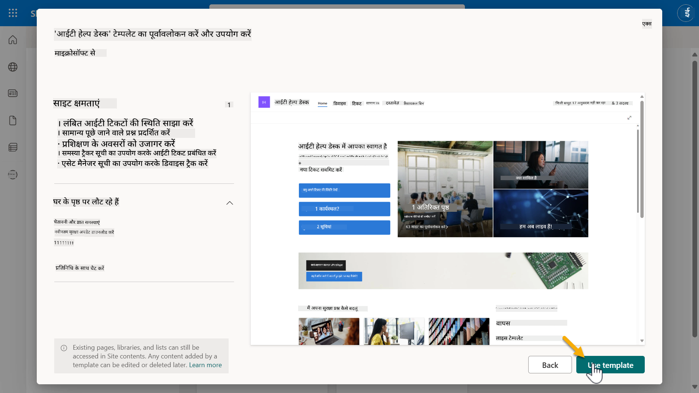  

1. अपनी साइट के लिए जानकारी दर्ज करें। निम्नलिखित एक उदाहरण है:  

    | फ़ील्ड | मान |  
    | --- | --- |  
    | साइट का नाम | Contoso IT |  
    | साइट विवरण | Copilot Studio for Beginners |  
    | साइट पता | ContosoIT |  

    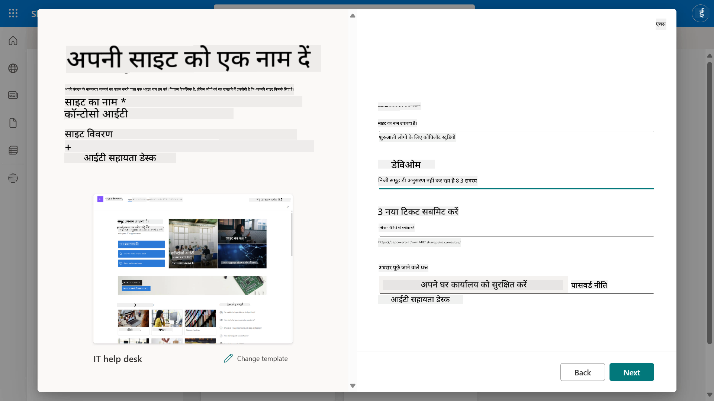  

1. अंतिम चरण में, SharePoint साइट के लिए एक भाषा चुनी जा सकती है। डिफ़ॉल्ट रूप से यह **English** होगी। भाषा को **English** पर छोड़ें और **Create site** चुनें।  

    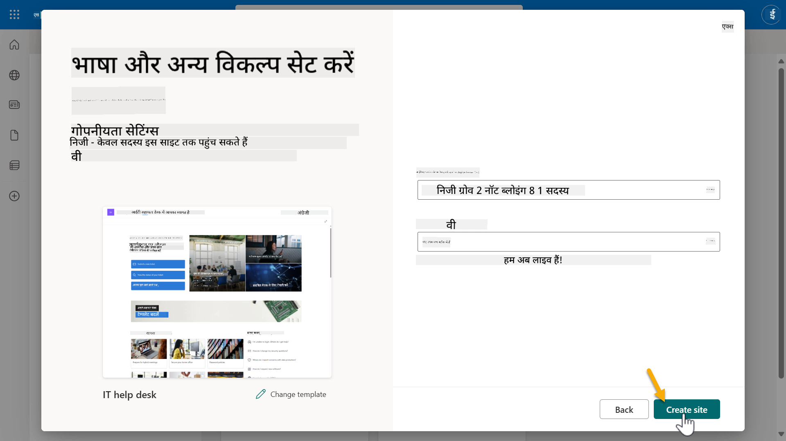  

1. SharePoint साइट अगले कुछ सेकंड के लिए प्रोविजन करेगी। इस बीच, आप अपनी साइट में अन्य उपयोगकर्ताओं को जोड़ने के लिए उनके ईमेल एड्रेस को **Add members** फ़ील्ड में दर्ज कर सकते हैं। जब पूरा हो जाए, तो **Finish** चुनें।  

    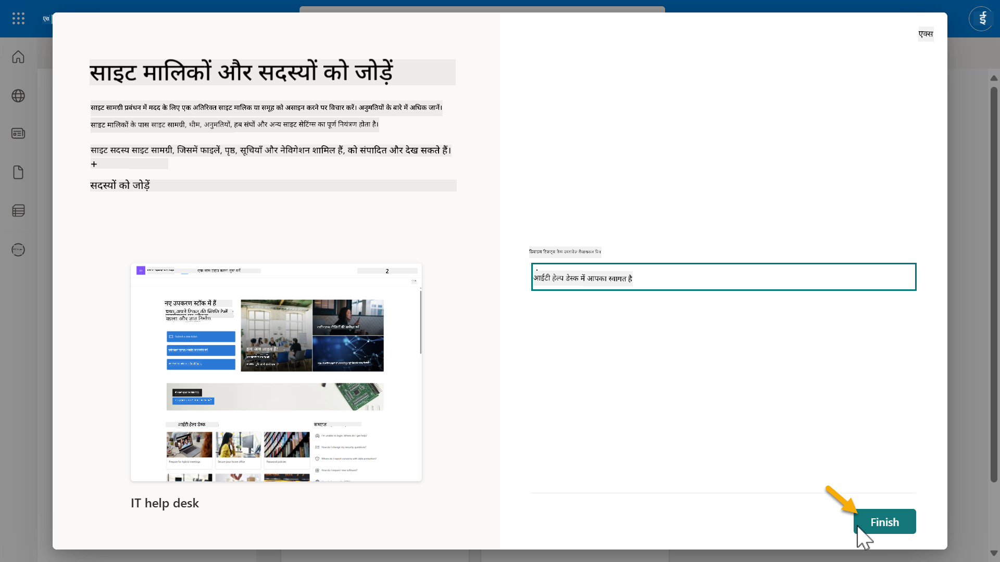  

1. SharePoint साइट होम पेज लोड होगा। **SharePoint साइट URL कॉपी करें।**  

1. यह टेम्पलेट विभिन्न IT नीतियों के बारे में सैंपल डेटा के साथ पेज और दो सैंपल लिस्ट (Tickets और Devices) प्रदान करता है।  

### Devices SharePoint लिस्ट का उपयोग करें  

हम [Mission 07 - Add new topic with trigger and nodes](../07-add-new-topic-with-trigger/README.md#73-add-a-tool-using-a-connector) में **Devices** लिस्ट का उपयोग करेंगे।  

### नया कॉलम जोड़ें  

लिस्ट में सबसे दाईं ओर स्क्रॉल करें और **+ Add column** बटन चुनें। **hyperlink** प्रकार चुनें, कॉलम नाम के लिए **Image** दर्ज करें, और जोड़ें।  

### Devices SharePoint लिस्ट में सैंपल डेटा बनाएं  

आपको यह सुनिश्चित करना होगा कि इस लिस्ट में कम से कम 4 सैंपल डेटा आइटम भरे गए हों और इस लिस्ट में एक अतिरिक्त कॉलम जोड़ा गया हो।  

सैंपल डेटा जोड़ते समय, सुनिश्चित करें कि निम्नलिखित फ़ील्ड भरे गए हैं:  

- डिवाइस फोटो - [डिवाइस इमेज फोल्डर](https://github.com/microsoft/agent-academy/tree/main/docs/recruit/00-course-setup/images/device-images) से इमेज का उपयोग करें।  
- टाइटल  
- स्टेटस  
- मैन्युफैक्चरर  
- मॉडल  
- एसेट टाइप  
- कलर  
- सीरियल नंबर  
- खरीदारी की तारीख  
- खरीदारी की कीमत  
- ऑर्डर #  
- इमेज - निम्नलिखित लिंक का उपयोग करें।  

|डिवाइस  |URL  |  
|---------|---------|  
|Surface Laptop 13     | [https://raw.githubusercontent.com/microsoft/agent-academy/refs/heads/main/docs/recruit/00-course-setup/images/device-images/Surface-Laptop-13.png](https://raw.githubusercontent.com/microsoft/agent-academy/refs/heads/main/docs/recruit/00-course-setup/images/device-images/Surface-Laptop-13.png)        |  
|Surface Laptop 15     | [https://raw.githubusercontent.com/microsoft/agent-academy/refs/heads/main/docs/recruit/00-course-setup/images/device-images/Surface-Laptop-15.png](https://raw.githubusercontent.com/microsoft/agent-academy/refs/heads/main/docs/recruit/00-course-setup/images/device-images/Surface-Laptop-15.png)        |  
|Surface Pro    | [https://raw.githubusercontent.com/microsoft/agent-academy/refs/heads/main/docs/recruit/00-course-setup/images/device-images/Surface-Pro-12.png](https://raw.githubusercontent.com/microsoft/agent-academy/refs/heads/main/docs/recruit/00-course-setup/images/device-images/Surface-Pro-12.png)        |  
|Surface Studio    | [https://raw.githubusercontent.com/microsoft/agent-academy/refs/heads/main/docs/recruit/00-course-setup/images/device-images/Surface-Studio.png](https://raw.githubusercontent.com/microsoft/agent-academy/refs/heads/main/docs/recruit/00-course-setup/images/device-images/Surface-Studio.png)        |  

---

## ✅ मिशन पूरा

आपने सफलतापूर्वक:

- Microsoft 365 डेवलपमेंट एनवायरनमेंट सेटअप किया।  
- Copilot Studio ट्रायल को सक्रिय किया।  
- एजेंट्स को ग्राउंड करने के लिए एक SharePoint साइट बनाई।  
- भविष्य के मिशनों के उपयोग के लिए Devices लिस्ट को भरा।  

आप आधिकारिक तौर पर [Lesson 01](../01-introduction-to-agents/README.md) में अपना **रिक्रूट-स्तरीय एजेंट प्रशिक्षण** शुरू करने के लिए तैयार हैं।  

---

**अस्वीकरण**:  
यह दस्तावेज़ AI अनुवाद सेवा [Co-op Translator](https://github.com/Azure/co-op-translator) का उपयोग करके अनुवादित किया गया है। जबकि हम सटीकता के लिए प्रयास करते हैं, कृपया ध्यान दें कि स्वचालित अनुवाद में त्रुटियां या अशुद्धियां हो सकती हैं। मूल भाषा में दस्तावेज़ को आधिकारिक स्रोत माना जाना चाहिए। महत्वपूर्ण जानकारी के लिए, पेशेवर मानव अनुवाद की सिफारिश की जाती है। इस अनुवाद के उपयोग से उत्पन्न किसी भी गलतफहमी या गलत व्याख्या के लिए हम जिम्मेदार नहीं हैं।