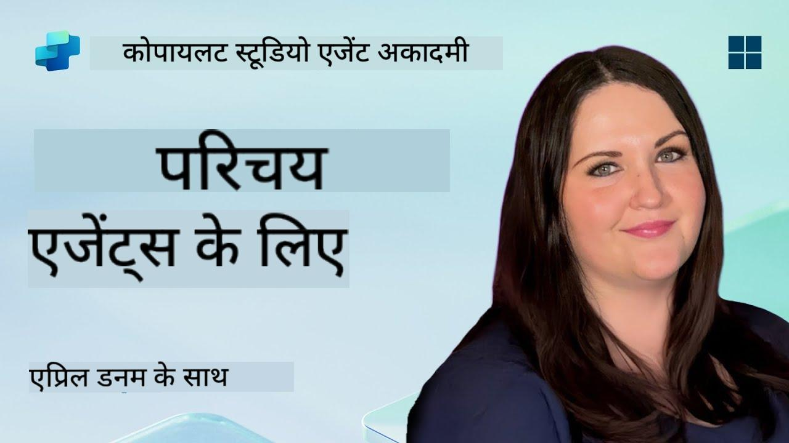

<!--
CO_OP_TRANSLATOR_METADATA:
{
  "original_hash": "d6706e107678264168d77b2e107710b1",
  "translation_date": "2025-10-21T18:29:45+00:00",
  "source_file": "docs/recruit/01-introduction-to-agents/README.md",
  "language_code": "hi"
}
-->
# 🚨 मिशन 01: एजेंट्स का परिचय

## 🕵️‍♂️ कोडनेम: `ऑपरेशन AI एजेंट डिकोड`

> **⏱️ ऑपरेशन समय सीमा:** `~30 मिनट – केवल जानकारी, कोई फील्डवर्क नहीं`

🎥 **वॉकथ्रू देखें**

## 🎯 मिशन ब्रीफ

स्वागत है, रिक्रूट। एजेंट्स बनाने से पहले, आपको उन AI अवधारणाओं की ठोस समझ होनी चाहिए जो उन्हें शक्ति प्रदान करती हैं। यह मिशन आपको संवादात्मक AI, बड़े भाषा मॉडल (LLMs), रिट्रीवल-ऑगमेंटेड जनरेशन (RAG), और Copilot Studio में आप किस प्रकार के एजेंट्स बना सकते हैं, की बुनियादी जानकारी देगा।

## 🔎 उद्देश्य

इस मिशन में, आप सीखेंगे:

1. संवादात्मक AI क्या है और यह क्यों महत्वपूर्ण है  
1. बड़े भाषा मॉडल (LLMs) चैट अनुभवों को कैसे शक्ति प्रदान करते हैं  
1. रिट्रीवल-ऑगमेंटेड जनरेशन (RAG) क्या योगदान देता है  
1. संवादात्मक एजेंट्स और स्वायत्त एजेंट्स के बीच का अंतर  
1. Copilot Studio में एजेंट्स इन अवधारणाओं का उपयोग कैसे करते हैं  

चलो शुरू करते हैं!

---

## संवादात्मक AI क्या है?

संवादात्मक AI किसी भी सिस्टम को संदर्भित करता है जो मानव भाषा – चाहे वह टेक्स्ट हो या आवाज़ – को समझ सकता है, प्रोसेस कर सकता है, और प्राकृतिक तरीके से प्रतिक्रिया दे सकता है। जैसे हेल्प डेस्क में चैटबॉट्स या आपके पसंदीदा ऐप्स में वर्चुअल पर्सनल असिस्टेंट्स। अंदर से, अधिकांश आधुनिक संवादात्मक AIs बड़े भाषा मॉडल्स (LLMs) पर निर्भर करते हैं, जिन्हें हम अगले भाग में कवर करेंगे।

### यह क्यों महत्वपूर्ण है

- **उपयोगकर्ता अनुभव:** संवादात्मक इंटरफेस अक्सर मेनू के माध्यम से क्लिक करने की तुलना में अधिक सहज होते हैं।  
- **स्केलेबिलिटी:** एक एजेंट दसियों या सैकड़ों समवर्ती वार्तालापों को संभाल सकता है।  
- **प्रभावशीलता:** कस्टम नियम-आधारित स्क्रिप्ट बनाने के बजाय, LLM-संचालित एजेंट्स उपयोगकर्ता इनपुट के अनुसार तुरंत अनुकूलित होते हैं।  
- **विस्तारशीलता:** सही डिज़ाइन के साथ, एजेंट्स ज्ञान आधारों का उपयोग कर सकते हैं, APIs से जुड़ सकते हैं, या व्यावसायिक वर्कफ़्लो में "डिजिटल सहकर्मी" के रूप में कार्य कर सकते हैं।

---

## बड़े भाषा मॉडल्स (LLMs) 101

अधिकांश संवादात्मक AI सिस्टम्स के केंद्र में **बड़े भाषा मॉडल्स** होते हैं – न्यूरल नेटवर्क्स जो विशाल टेक्स्ट कॉर्पस पर प्रशिक्षित होते हैं। वे भाषा के सांख्यिकीय पैटर्न सीखते हैं ताकि वे सुसंगत वाक्य बना सकें, सवालों का जवाब दे सकें, या विचारों पर मंथन कर सकें। समझने के लिए मुख्य बिंदु:

1. **प्रशिक्षण डेटा:** LLMs टेराबाइट्स टेक्स्ट (वेब पेज, किताबें, लेख) को ग्रहण करते हैं। यह "विश्व ज्ञान" उन्हें कई विषयों पर प्रतिक्रिया देने की अनुमति देता है।  
1. **टोकनाइजेशन:** टेक्स्ट को छोटे इकाइयों में तोड़ा जाता है जिन्हें टोकन कहा जाता है (शब्द, उपशब्द, या अक्षर)। मॉडल एक समय में एक टोकन की भविष्यवाणी करता है।  
1. **संदर्भ विंडो:** प्रत्येक LLM की सीमा होती है कि वह एक बार में कितने टोकन "देख" सकता है। उस सीमा से परे, पिछले टोकन काट दिए जाते हैं।  
1. **प्रॉम्प्टिंग:** आप LLM के साथ एक प्रॉम्प्ट भेजकर बातचीत करते हैं। आपका प्रॉम्प्ट जितना बेहतर होगा, प्रतिक्रिया उतनी ही केंद्रित और प्रासंगिक होगी।  
1. **ज़ीरो-शॉट बनाम फाइन-ट्यूनिंग:** ज़ीरो-शॉट का मतलब है LLM का उपयोग जैसा है (सिर्फ कच्चे वेट्स)। फाइन-ट्यूनिंग का मतलब है मॉडल को डोमेन-विशिष्ट डेटा पर समायोजित करना ताकि यह आपकी आवश्यकताओं के लिए अधिक सटीक उत्तर दे सके।

!!! Tip "प्रो टिप"
    एक सामान्य उपमा यह है कि LLM एक "सुपर-स्मार्ट ऑटोकंप्लीट" की तरह है। यह मानव मस्तिष्क की तरह अर्थ को वास्तव में नहीं समझता, लेकिन यह अनुक्रम में अगला सबसे अच्छा शब्द (या वाक्यांश) भविष्यवाणी करने में बेहद अच्छा है।

---

## रिट्रीवल-ऑगमेंटेड जनरेशन (RAG)

जब LLM केवल स्थिर प्रशिक्षण डेटा पर निर्भर करते हैं, तो वे भ्रमित हो सकते हैं या पुराना हो सकते हैं। RAG इसे संबोधित करता है, जिससे मॉडल उत्तर तैयार करने से पहले ताजा जानकारी "खोज" सकता है। उच्च स्तर पर, RAG इस प्रकार काम करता है:

1. **उपयोगकर्ता क्वेरी:** उपयोगकर्ता एक सवाल पूछता है (जैसे, "Contoso की तिमाही आय के बारे में नवीनतम क्या है?")।  
1. **रिट्रीवर चरण:** सिस्टम एक ज्ञान स्रोत (दस्तावेज़, आंतरिक डेटाबेस, SharePoint लाइब्रेरी आदि) से प्रासंगिक अंश खोजता है।  
1. **ऑगमेंटेशन:** प्राप्त अंश LLM प्रॉम्प्ट से पहले या बाद में जोड़े जाते हैं।  
1. **जनरेशन:** LLM उपयोगकर्ता के सवाल और प्राप्त संदर्भ दोनों को ग्रहण करता है, फिर एक उत्तर उत्पन्न करता है जो अद्यतन डेटा पर आधारित होता है।  

RAG के साथ, आपका एजेंट आंतरिक कंपनी विकी, प्लगइन APIs, या FAQ ज्ञान आधार खोज सकता है—और उत्तर दे सकता है जो स्थिर रूप से प्रकाशित मॉडल पैरामीटर तक सीमित नहीं हैं।

---

## संवादात्मक बनाम स्वायत्त एजेंट्स

Copilot Studio के संदर्भ में, **एजेंट** शब्द AI सहायकों के कई प्रकारों को संदर्भित कर सकता है। यह रेखा खींचना उपयोगी है:

**संवादात्मक एजेंट्स:**

- मुख्य रूप से दो-तरफा संवाद पर ध्यान केंद्रित करते हैं।  
- बातचीत के कई चरणों में संदर्भ बनाए रखते हैं।  
- आमतौर पर पूर्वनिर्धारित प्रवाह या ट्रिगर्स के माध्यम से संचालित होते हैं (जैसे, "यदि उपयोगकर्ता X कहता है, तो Y के साथ प्रतिक्रिया दें")।  
- ग्राहक सहायता, FAQs, निर्देशित इंटरैक्शन, शेड्यूलिंग, या सरल Q&A के लिए आदर्श।  
  - उदाहरण:  
    - एक Teams चैटबॉट जो HR नीति सवालों का जवाब देता है।  
    - एक Power Virtual Agents बॉट जो SharePoint पेज पर उपयोगकर्ताओं को एक फॉर्म के माध्यम से मार्गदर्शन करता है।  

**स्वायत्त एजेंट्स:**

- बैक-एंड चैट से आगे बढ़ते हैं; वे उपयोगकर्ता की ओर से **कार्रवाई कर सकते हैं**।  
- LLM रीजनिंग लूप्स का उपयोग करते हैं (सोचें "योजना → कार्य → अवलोकन → पुनः योजना") कार्यों को पूरा करने के लिए।  
- बाहरी उपकरणों या APIs से जुड़ते हैं (जैसे, Power Automate फ्लो कॉल करना, कैलेंडर निमंत्रण भेजना, Dataverse में डेटा हेरफेर करना)।  
- निरंतर मानव संकेतों के बिना संचालित होते हैं—एक बार ट्रिगर होने पर, वे स्वायत्त रूप से बहु-चरणीय प्रक्रियाओं को संभाल सकते हैं।  
  - उदाहरण:  
    - एक एजेंट जो यात्रा कार्यक्रम तैयार करता है, उड़ानें बुक करता है, और पुष्टिकरण ईमेल करता है।  
    - एक "मीटिंग समरीज़र" एजेंट जो Teams कॉल में शामिल होता है, इसे वास्तविक समय में ट्रांसक्राइब करता है, और OneNote में एक कार्यकारी सारांश लिखता है।  

!!! Info "मुख्य अंतर"
    संवादात्मक एजेंट्स उपयोगकर्ता इनपुट की प्रतीक्षा करते हैं और संवाद तक सीमित रहते हैं। स्वायत्त एजेंट्स व्यापक उपकरण पहुंच का उपयोग करके कदमों की एक श्रृंखला को सक्रिय रूप से योजना बनाते हैं और निष्पादित करते हैं।

---

## Copilot Studio में एजेंट्स

**Copilot Studio** संवादात्मक और स्वायत्त दोनों परिदृश्यों को एक फ्रेमवर्क के तहत एकीकृत करता है। Copilot Studio एजेंट्स बनाने में आपकी मदद कैसे करता है:

1. **विजुअल एजेंट डिज़ाइनर:** एक लो-कोड कैनवास जो चैट और एक्शन वर्कफ़्लो के लिए प्रॉम्प्ट्स, मेमोरी, और टूल्स को परिभाषित करता है।  
1. **LLM कॉन्फ़िगरेशन:** विभिन्न OpenAI मॉडल्स या Microsoft के एंटरप्राइज-ग्रेड GPT से चुनें जो आपके प्रदर्शन और लागत आवश्यकताओं से मेल खाते हैं।  
1. **रिट्रीवल कनेक्टर्स:** SharePoint, OneDrive, Azure Cognitive Search, और Dataverse के लिए प्रीबिल्ट इंटीग्रेशन, जो RAG को तुरंत सक्षम करते हैं।  
1. **कस्टम टूल्स और फंक्शन्स:** कस्टम HTTP एक्शन या Power Automate फ्लो परिभाषित करें जिन्हें आपका एजेंट स्वायत्त रूप से कॉल कर सकता है।  
1. **मल्टी-मोडल सपोर्ट:** टेक्स्ट के अलावा, Copilot Studio एजेंट्स संदर्भ को समृद्ध करने के लिए इमेज, फाइल्स, या संरचित डेटा को ग्रहण कर सकते हैं।  
1. **पब्लिशिंग और डिस्ट्रीब्यूशन:** एक बार आपका एजेंट तैयार हो जाए, आप इसे Microsoft 365 Copilot पर प्रकाशित कर सकते हैं (ताकि उपयोगकर्ता इसे Teams, SharePoint, Outlook आदि में उपयोग कर सकें) या इसे एक स्टैंडअलोन चैट विजेट के रूप में वेबपेज पर एम्बेड कर सकते हैं।

---

## 🎉 मिशन पूरा

अब आपने एजेंट्स और बुनियादी AI अवधारणाओं का परिचय पूरा कर लिया है। आप समझते हैं:

1. **LLMs = आपके एजेंट का "मस्तिष्क"**  
   - भाषा समझने और उत्पन्न करने के लिए जिम्मेदार।  
   - अधिक टोकन = समृद्ध संदर्भ, लेकिन प्रति कॉल अधिक लागत।  

1. **RAG = वास्तविक समय ज्ञान एकीकरण**  
   - स्थिर LLM और लगातार बदलते डेटा स्रोतों के बीच की खाई को पाटता है।  
   - प्रासंगिक दस्तावेज़ या रिकॉर्ड को LLM प्रॉम्प्ट में पुनः प्राप्त करता है और इंजेक्ट करता है।  

1. **संवादात्मक बनाम स्वायत्त**  
   - **संवादात्मक:** संवाद प्रवाह और संदर्भ बनाए रखने पर ध्यान केंद्रित करें (जैसे, "सेशन मेमोरी")।  
   - **स्वायत्त:** "एक्शन ब्लॉक्स" जोड़ें जो एजेंट को बाहरी उपकरणों या सेवाओं को कॉल करने दें।

---
अगले चरण में, आप [Copilot Studio की मूल बातें](../02-copilot-studio-fundamentals/README.md) का अन्वेषण करेंगे!

सतर्क रहें, रिक्रूट - आपकी AI यात्रा अभी शुरू हो रही है!

## 📚 सामरिक संसाधन

🔗 [Copilot Studio दस्तावेज़ होम](https://learn.microsoft.com/microsoft-copilot-studio/)

---

---

**अस्वीकरण**:  
यह दस्तावेज़ AI अनुवाद सेवा [Co-op Translator](https://github.com/Azure/co-op-translator) का उपयोग करके अनुवादित किया गया है। जबकि हम सटीकता के लिए प्रयास करते हैं, कृपया ध्यान दें कि स्वचालित अनुवाद में त्रुटियां या अशुद्धियां हो सकती हैं। मूल भाषा में दस्तावेज़ को आधिकारिक स्रोत माना जाना चाहिए। महत्वपूर्ण जानकारी के लिए, पेशेवर मानव अनुवाद की सिफारिश की जाती है। इस अनुवाद के उपयोग से उत्पन्न किसी भी गलतफहमी या गलत व्याख्या के लिए हम उत्तरदायी नहीं हैं।