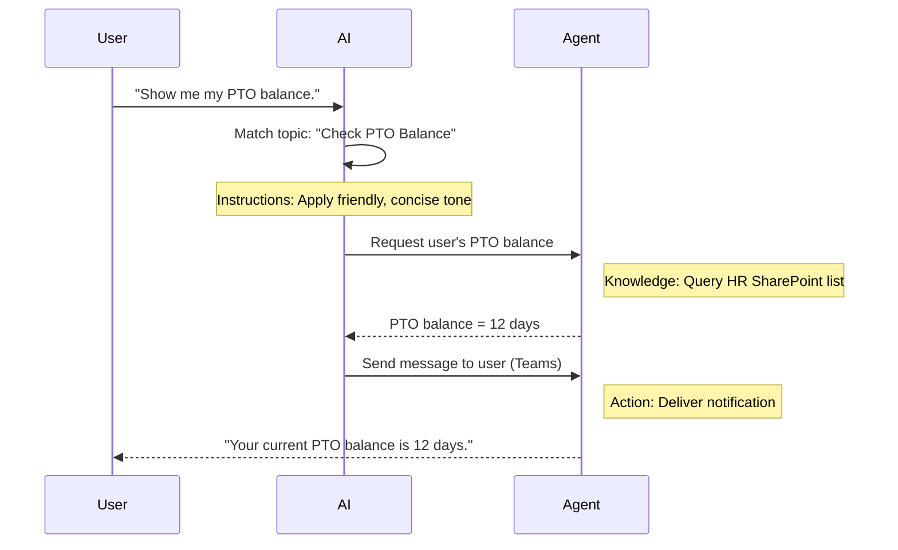

<!--
CO_OP_TRANSLATOR_METADATA:
{
  "original_hash": "90a3c5122f5687bbc8cc819990f175d4",
  "translation_date": "2025-10-21T18:58:02+00:00",
  "source_file": "docs/recruit/02-copilot-studio-fundamentals/README.md",
  "language_code": "hi"
}
-->
# 🚨 मिशन 02: Copilot Studio की मूल बातें

## 🕵️‍♂️ कोडनेम: `ऑपरेशन कोर प्रोटोकॉल`

> **⏱️ ऑपरेशन का समय:** `~30 मिनट – केवल जानकारी, कोई फील्डवर्क नहीं`  

🎥 **वॉकथ्रू देखें**

[](https://www.youtube.com/watch?v=x4OCwDRGeLE "YouTube पर वॉकथ्रू देखें")

## 🎯 मिशन का विवरण

स्वागत है, रिक्रूट। यह मिशन आपको Copilot Studio को समझने और ऐसे बुद्धिमान एजेंट बनाने के लिए आवश्यक बुनियादी जानकारी प्रदान करेगा जो वास्तविक व्यावसायिक मूल्य प्रदान करते हैं।

अपना पहला एजेंट बनाने से पहले, आपको उन चार प्रमुख घटकों को समझना होगा जो हर कस्टम AI एजेंट का हिस्सा होते हैं: ज्ञान, उपकरण, विषय और निर्देश। आप यह भी जानेंगे कि Copilot Studio ऑर्केस्ट्रेटर में ये तत्व कैसे एक साथ काम करते हैं।

## 🔎 उद्देश्य

इस मिशन में, आप:

- **जानेंगे कि Copilot Studio क्या है**  
- **समझेंगे कि एजेंट का उपयोग कब और क्यों करना है**  
- **एजेंट के चार निर्माण खंडों का अन्वेषण करेंगे**  
      - **ज्ञान**  
      - **उपकरण**  
      - **विषय**  
      - **निर्देश**  
- **समझेंगे कि ये घटक कैसे एक साथ काम करते हैं** ताकि एक बुद्धिमान, स्वचालित एजेंट बनाया जा सके  

---

## Copilot Studio में एजेंट क्या हैं?

एक **एजेंट** एक विशेष AI सहायक है जिसे आप विशिष्ट कार्यों या प्रश्नों को संभालने के लिए डिज़ाइन करते हैं। एक सामान्य-उद्देश्य चैटबॉट के विपरीत, आपका एजेंट:

- **कंपनी-विशिष्ट डेटा जानता है** (नीतियां, दस्तावेज़, डेटाबेस)  
- **वास्तविक दुनिया के कार्य करता है** (संदेश भेजना, कैलेंडर ईवेंट बनाना, रिकॉर्ड अपडेट करना)  
- **संवादी संदर्भ बनाए रखता है** ताकि यह पिछले प्रश्नों पर फॉलो-अप कर सके  

क्योंकि Copilot Studio लो-कोड है, आप प्रीबिल्ट घटकों को ड्रैग और ड्रॉप कर सकते हैं—गहरी कोडिंग कौशल की आवश्यकता नहीं है। एक बार आपका एजेंट बन जाने के बाद, लोग इसे Teams, Slack, या यहां तक कि एक कस्टम वेबपेज के अंदर कॉल कर सकते हैं ताकि उत्तर प्राप्त कर सकें या वर्कफ़्लो को स्वचालित रूप से ट्रिगर कर सकें।

---

## Copilot Studio का उपयोग कब और क्यों करें

जबकि Microsoft 365 Copilot Office ऐप्स में सामान्य AI सहायता प्रदान करता है, आपको एक कस्टम एजेंट की आवश्यकता होगी जब:

### आपको डोमेन-विशिष्ट ज्ञान चाहिए

- आउट-ऑफ-द-बॉक्स Copilot आपके कंपनी की आंतरिक प्रक्रियाओं या डेटा को नहीं जान सकता। एक एजेंट आपके SharePoint साइट्स, डेटाबेस, या कस्टम स्रोतों से सटीक, अद्यतन उत्तर देने के लिए प्रश्न कर सकता है।  

### आप मल्टी-स्टेप वर्कफ़्लो को स्वचालित करना चाहते हैं

- उदाहरण के लिए: "जब कोई खर्च जमा करता है, तो उसे अनुमोदन के लिए भेजें, वित्त ट्रैकर को अपडेट करें, और प्रबंधक को सूचित करें।" एक कस्टम एजेंट एक ही कमांड या इवेंट द्वारा ट्रिगर किए गए हर चरण को संभाल सकता है।  

### आपको एक संदर्भात्मक, इन-टूल अनुभव चाहिए  

- कल्पना करें कि Teams में एक New Hire Onboarding एजेंट HR स्टाफ को हर नीति के माध्यम से मार्गदर्शन करता है, आवश्यक फॉर्म भेजता है, और ओरिएंटेशन मीटिंग्स को शेड्यूल करता है—आपके मौजूदा सहयोग प्लेटफ़ॉर्म के अंदर।  

---

## एजेंट के चार निर्माण खंड

हर Copilot Studio एजेंट चार मुख्य घटकों से बना होता है:

1. **ज्ञान**  
1. **उपकरण (क्रियाएं)**  
1. **विषय**  
1. **निर्देश**

नीचे, हम प्रत्येक निर्माण खंड को परिभाषित करेंगे और दिखाएंगे कि वे एक प्रभावी एजेंट बनाने के लिए कैसे काम करते हैं।

### 1. ज्ञान

**ज्ञान** वह डेटा और संदर्भ है जिसका उपयोग आपका एजेंट सटीक उत्तर देने के लिए करता है। इसमें दो भाग होते हैं:

#### कस्टम निर्देश और संदर्भ

- आप एजेंट के उद्देश्य और टोन का संक्षिप्त विवरण लिखते हैं। उदाहरण के लिए:  

    ```text
    You are an IT support agent. You help employees troubleshoot common software issues, provide troubleshooting steps, and escalate urgent tickets.
    ```

- बातचीत के दौरान, एजेंट पिछले टर्न को याद रखता है ताकि वह पहले से चर्चा की गई बातों का संदर्भ दे सके (उदाहरण के लिए, यदि उपयोगकर्ता पहले कहता है, "मेरा प्रिंटर ऑफलाइन है," और बाद में पूछता है, "क्या आपने इंक स्तर की जांच की?" तो एजेंट प्रिंटर संदर्भ को याद करता है)।

#### ज्ञान स्रोत (ग्राउंडिंग डेटा)

- आप अपने एजेंट को कई डेटा स्रोतों से कनेक्ट कर सकते हैं—SharePoint लाइब्रेरी, डॉक्यूमेंटेशन साइट्स, विकी, या अन्य डेटाबेस।  
- जब उपयोगकर्ता कोई प्रश्न पूछता है, तो एजेंट उन स्रोतों से प्रासंगिक अंश खींचता है ताकि उत्तर आपके संगठन की वास्तविक नीतियों, उत्पाद मैनुअल, या किसी भी स्वामित्व जानकारी में **ग्राउंडेड** हो।  
- आप एजेंट को केवल उन्हीं स्रोतों से जानकारी देने के लिए मजबूर कर सकते हैं, जिससे वह अनुमान लगाने या "हैलुसिनेटिंग" उत्तर देने से बच सके।

!!! उदाहरण
    एक "पॉलिसी असिस्टेंट" एजेंट आपके HR SharePoint साइट से कनेक्ट हो सकता है। यदि उपयोगकर्ता पूछता है, "हमारा PTO संग्रह दर क्या है?" तो एजेंट HR पॉलिसी दस्तावेज़ से सटीक टेक्स्ट प्राप्त करता है बजाय इसके कि वह एक सामान्य AI उत्तर पर निर्भर करे।

---

### 2. उपकरण (क्रियाएं)

**उपकरण (क्रियाएं)** परिभाषित करते हैं कि एजेंट चैटिंग के अलावा क्या कर सकता है। प्रत्येक क्रिया एक कार्य है जिसे एजेंट प्रोग्रामेटिक रूप से निष्पादित करता है, जैसे:

- ईमेल या Teams संदेश भेजना  
- कैलेंडर ईवेंट बनाना या अपडेट करना  
- डेटाबेस में रिकॉर्ड जोड़ना या संपादित करना (जैसे, SharePoint सूची या Dataverse तालिका)  
- Power Automate फ्लो या REST API को कॉल करना  

#### क्रियाएं कैसे काम करती हैं

- **इनपुट और आउटपुट परिभाषित करें**  
      - उदाहरण के लिए, एक Send Email क्रिया में आवश्यकता हो सकती है:  
        - `RecipientEmailAddress`  
        - `SubjectLine`  
        - `EmailBody`  

- **क्रियाओं को वर्कफ़्लो में संयोजित करें**  
      - अक्सर, उपयोगकर्ता अनुरोध को पूरा करने में कई चरण शामिल होते हैं।  
      - आप क्रियाओं को अनुक्रमित कर सकते हैं ताकि:  
             1. एजेंट SharePoint सूची से डेटा प्राप्त करे।  
             2. LLM का उपयोग करके एक सारांश उत्पन्न करे।  
             3. वह सारांश के साथ एक Teams संदेश भेजे।  

- **बाहरी सिस्टम से कनेक्ट करें**  
      - यदि आपको CRM अपडेट करने या आंतरिक API को कॉल करने की आवश्यकता है, तो इसे संभालने के लिए एक कस्टम क्रिया बनाएं।  
      - Copilot Studio Power Platform या किसी भी HTTP-आधारित एंडपॉइंट के साथ एकीकृत हो सकता है।

!!! उदाहरण "एक "Expense Helper" एजेंट कर सकता है:"  
    1. "Submit Expense" अनुरोध सुनें।  
    2. उपयोगकर्ता के खर्च विवरण को एक फॉर्म से प्राप्त करें।  
    3. "Add to SharePoint List" क्रिया का उपयोग करके डेटा को स्टोर करें।  
    4. "Send Email" क्रिया को ट्रिगर करें ताकि अनुमोदक को सूचित किया जा सके।  

---

### 3. विषय

**विषय** परिभाषित करते हैं कि आपके एजेंट के लिए बातचीत के ट्रिगर या प्रवेश बिंदु क्या हैं। प्रत्येक विषय एक कार्यक्षमता या प्रश्न श्रेणी से मेल खाता है।

#### संवादी ट्रिगर  

- एक विषय "Submit IT Ticket," "Check Vacation Balance," या "Create Sales Report" हो सकता है।  
- अंदर, Copilot Studio **जनरेटिव ऑर्केस्ट्रेशन** का उपयोग करता है: सटीक कीवर्ड पर निर्भर रहने के बजाय, AI उपयोगकर्ता के इरादे की व्याख्या करता है और आपके द्वारा प्रदान किए गए संक्षिप्त विवरण के आधार पर सही विषय चुनता है।  

#### विषय विवरण  

- प्रत्येक विषय में, आप लिखते हैं कि वह विषय क्या कवर करता है।

!!! उदाहरण "विषय विवरण का उदाहरण"
    यह विषय उपयोगकर्ताओं को IT सपोर्ट टिकट जमा करने में मदद करता है, जिसमें समस्या विवरण, प्राथमिकता, और संपर्क जानकारी शामिल है।

- AI उस विवरण का उपयोग यह तय करने के लिए करता है कि इस विषय को कब सक्रिय करना है, भले ही उपयोगकर्ता की वाक्य रचना बिल्कुल मेल न खाए।

#### विषयों को क्रियाओं से मैप करना  

- प्रत्येक विषय एक या अधिक क्रियाओं या डेटा पुनर्प्राप्ति चरणों से जुड़ा होता है।  
- जब AI एक विषय चुनता है, तो यह आपके द्वारा परिभाषित अनुक्रम के माध्यम से बातचीत को मार्गदर्शित करता है (फॉलो-अप प्रश्न पूछें, क्रियाओं को कॉल करें, परिणाम लौटाएं)।

!!! उदाहरण
    यदि उपयोगकर्ता कहता है, "मुझे अपने नए लैपटॉप को सेटअप करने में मदद चाहिए," तो AI उस इरादे को "Submit IT Ticket" विषय से मेल कर सकता है। फिर एजेंट लैपटॉप मॉडल, उपयोगकर्ता विवरण पूछता है, और स्वचालित रूप से हेल्पडेस्क सिस्टम में एक टिकट डालता है।

---

### 4. निर्देश

**निर्देश** (कभी-कभी "प्रॉम्प्ट" या "सिस्टम संदेश" कहा जाता है) LLM के टोन, शैली, और सीमाओं को मार्गदर्शित करते हैं। वे किसी भी स्थिति में एजेंट की प्रतिक्रिया को आकार देते हैं।

#### भूमिका और व्यक्तित्व  

- आप AI को बताते हैं कि वह कौन है (जैसे, "आप Contoso Retail के लिए एक ग्राहक सेवा एजेंट हैं")।  
- यह टोन सेट करता है—मित्रवत, संक्षिप्त, औपचारिक, या अनौपचारिक—आपके उपयोग के मामले के आधार पर।

#### प्रतिक्रिया दिशानिर्देश  

- एजेंट को पालन करने के लिए कोई भी नियम निर्दिष्ट करें, जैसे:  
      - "हमेशा नीति जानकारी को बुलेट पॉइंट में सारांशित करें।"  
      - "यदि आपको उत्तर नहीं पता है, तो कहें ‘मुझे खेद है, मेरे पास वह जानकारी नहीं है।’"  
      - "कभी भी संदर्भ के बाहर गोपनीय डेटा शामिल न करें।"

#### मेमोरी और संदर्भ नियम

- आप एजेंट को निर्देश दे सकते हैं कि बातचीत के कितने टर्न को याद रखना है।  
- उदाहरण के लिए: "इस उपयोगकर्ता के अनुरोधों का विवरण तीन फॉलो-अप प्रश्नों तक याद रखें।"

!!! उदाहरण "एक "Benefits Advisor" एजेंट में, आप शामिल कर सकते हैं:"
    "हमेशा नवीनतम HR हैंडबुक का संदर्भ दें जब प्रश्नों का उत्तर दें। यदि नामांकन की समय सीमा के बारे में पूछा जाए, तो नीति से विशिष्ट तिथियां प्रदान करें। उत्तर 150 शब्दों से कम रखें।"

---

## चार निर्माण खंड कैसे एक साथ काम करते हैं

जब आप **ज्ञान**, **उपकरण**, **विषय**, और **निर्देश** को इकट्ठा करते हैं, तो Copilot Studio का AI ऑर्केस्ट्रेटर एक ऐसा एजेंट बनाता है जो:

1. **प्रासंगिक विषय के लिए सुनता है** (आपके विषय विवरण द्वारा निर्देशित)।  
1. **निर्देश लागू करता है** ताकि इसका टोन सेट हो, यह तय करे कि कब फॉलो-अप प्रश्न पूछने हैं, और नियम लागू करे।  
1. **ज्ञान स्रोतों का लाभ उठाता है** ताकि इसके उत्तर आपके संगठन के डेटा में ग्राउंडेड हों।  
1. **उपकरण (क्रियाएं) कॉल करता है** जब आवश्यक हो ताकि कार्य किए जा सकें—संदेश भेजना, रिकॉर्ड अपडेट करना, या APIs को कॉल करना।  

अंदर, ऑर्केस्ट्रेटर **जनरेटिव प्लानिंग** दृष्टिकोण का उपयोग करता है: यह तय करता है कि उपयोगकर्ता अनुरोध को पूरा करने के लिए कौन से चरण लेने हैं, किस क्रम में। यदि कोई क्रिया विफल होती है (उदाहरण के लिए, ईमेल नहीं भेजा जा सकता), तो एजेंट आपके अपवाद-प्रबंधन दिशानिर्देशों का पालन करता है (स्पष्ट करने वाला प्रश्न पूछें या त्रुटि की रिपोर्ट करें)। क्योंकि LLM बातचीत के संदर्भ के अनुसार अनुकूलित होता है, एजेंट कई टर्न पर मेमोरी बनाए रख सकता है और बातचीत के दौरान नई जानकारी को शामिल कर सकता है।

**दृश्य प्रवाह उदाहरण:**  
<!--
1. **उपयोगकर्ता:** "मुझे मेरा PTO बैलेंस दिखाएं।"
1. **AI (विषय):** "Check PTO Balance" विषय से मेल खाता है।  
1. **AI (निर्देश):** मित्रवत, संक्षिप्त टोन का उपयोग करता है।  
1. **एजेंट (ज्ञान):** उपयोगकर्ता के बैलेंस के लिए HR SharePoint सूची को क्वेरी करता है।  
1. **एजेंट (क्रियाएं):** मान प्राप्त करता है और एक Teams संदेश भेजता है:  
   > "आपका वर्तमान PTO बैलेंस 12 दिन है।"  
-->



---

## 🎉 मिशन पूरा

आपने सफलतापूर्वक अपनी मूलभूत जानकारी ब्रीफिंग पूरी कर ली है। अब आपने Copilot Studio में किसी भी एजेंट के चार आवश्यक निर्माण खंडों को सीख लिया है:

1. **ज्ञान** – जहां एजेंट तथ्यात्मक जानकारी देखता है और बातचीत की मेमोरी बनाए रखता है।  
1. **उपकरण** – कार्य जो एजेंट स्वचालित रूप से चीजें करने के लिए कर सकता है।  
1. **विषय** – कैसे एजेंट उपयोगकर्ता के इरादे को पहचानता है और तय करता है कि कौन सा वर्कफ़्लो चलाना है।  
1. **निर्देश** – नियम, टोन, और सीमाएं जो हर प्रतिक्रिया को मार्गदर्शित करती हैं।

इन घटकों के साथ, आप एक बुनियादी एजेंट बना सकते हैं जो प्रश्नों का उत्तर देता है और सरल वर्कफ़्लो निष्पादित करता है। अगले पाठ में, हम एक "Service Desk" एजेंट बनाने के लिए चरण-दर-चरण ट्यूटोरियल के माध्यम से चलेंगे—अपने पहले ज्ञान स्रोत को कनेक्ट करने से लेकर एक विषय को परिभाषित करने और एक क्रिया को वायर करने तक।

आगे: आप अपना [पहला डिक्लेरेटिव एजेंट M365 Copilot के लिए बनाएंगे](../03-create-a-declarative-agent-for-M365Copilot/README.md)।

<!-- markdownlint-disable-next-line MD033 -->


---

**अस्वीकरण**:  
यह दस्तावेज़ AI अनुवाद सेवा [Co-op Translator](https://github.com/Azure/co-op-translator) का उपयोग करके अनुवादित किया गया है। जबकि हम सटीकता के लिए प्रयास करते हैं, कृपया ध्यान दें कि स्वचालित अनुवाद में त्रुटियां या अशुद्धियां हो सकती हैं। मूल भाषा में दस्तावेज़ को आधिकारिक स्रोत माना जाना चाहिए। महत्वपूर्ण जानकारी के लिए, पेशेवर मानव अनुवाद की सिफारिश की जाती है। इस अनुवाद के उपयोग से उत्पन्न किसी भी गलतफहमी या गलत व्याख्या के लिए हम जिम्मेदार नहीं हैं।