<!--
CO_OP_TRANSLATOR_METADATA:
{
  "original_hash": "0c51aabca81d6256990caf4c015e6195",
  "translation_date": "2025-10-21T18:33:07+00:00",
  "source_file": "docs/recruit/04-creating-a-solution/README.md",
  "language_code": "hi"
}
-->
# 🚨 मिशन 04: अपने एजेंट के लिए समाधान बनाना

## 🕵️‍♂️ कोडनेम: `ऑपरेशन CTRL-ALT-PACKAGE`

> **⏱️ ऑपरेशन समय सीमा:** `~45 मिनट`

🎥 **वॉकथ्रू देखें**

[](https://www.youtube.com/watch?v=1iATbkgfcpU "YouTube पर वॉकथ्रू देखें")

## 🎯 मिशन ब्रीफ

एजेंट मेकर, आपका अगला रणनीतिक ऑपरेशन शुरू हो गया है। इस मिशन में, आप एक समाधान को असेंबल करना सीखेंगे - Microsoft Copilot Studio के साथ बनाए गए आपके IT हेल्पडेस्क एजेंट के लिए आधिकारिक डिप्लॉयमेंट वाहन। इसे एक डिजिटल ब्रीफकेस के रूप में सोचें जो आपके एजेंट और उसके आर्टिफैक्ट्स को समेटे हुए है।

हर एजेंट को एक सुव्यवस्थित घर की आवश्यकता होती है। यही वह है जो Power Platform समाधान प्रदान करता है - व्यवस्था, पोर्टेबिलिटी, और उत्पादन के लिए तत्परता।

चलो पैकिंग शुरू करें।

## 🔎 उद्देश्य

इस मिशन में, आप सीखेंगे:

1. Power Platform समाधान क्या हैं और एजेंट विकास में उनकी भूमिका को समझना
1. एजेंट्स को व्यवस्थित और डिप्लॉय करने के लिए समाधान का उपयोग करने के लाभ सीखना
1. समाधान प्रकाशकों का अन्वेषण करना और घटक प्रबंधन में उनकी महत्वता को समझना
1. विकास से उत्पादन तक Power Platform समाधान जीवनचक्र को समझना
1. अपने IT हेल्पडेस्क एजेंट के लिए अपना समाधान प्रकाशक और कस्टम समाधान बनाना

## 🕵🏻‍♀️ समाधान? वह क्या है?

Microsoft Power Platform में, समाधान कंटेनर या पैकेज की तरह होते हैं जो आपके ऐप्स या एजेंट्स के सभी हिस्सों को समेटे हुए होते हैं - ये टेबल्स, फॉर्म्स, फ्लो और कस्टम लॉजिक हो सकते हैं। समाधान एप्लिकेशन लाइफसाइकिल मैनेजमेंट (ALM) के लिए आवश्यक हैं, वे आपको अपने ऐप और एजेंट्स को विचार से विकास, परीक्षण, डिप्लॉयमेंट और अपडेट तक प्रबंधित करने में सक्षम बनाते हैं।

Copilot Studio में, हर एजेंट जिसे आप बनाते हैं, वह Power Platform समाधान में संग्रहीत होता है। डिफ़ॉल्ट रूप से, एजेंट्स डिफ़ॉल्ट समाधान में बनाए जाते हैं, जब तक कि आप एक नया कस्टम समाधान नहीं बनाते जिसमें आप अपना एजेंट बनाते हैं। यही हम इस पाठ और हैंड्स-ऑन लैब में सीखेंगे 🤓।

पारंपरिक रूप से समाधान **Power Apps मेकर पोर्टल** में बनाए जाते थे - एक वेब आधारित इंटरफ़ेस जहां आप ऐप्स, Dataverse, फ्लो, AI घटकों का अन्वेषण और अधिक बना और कस्टमाइज़ कर सकते हैं।

   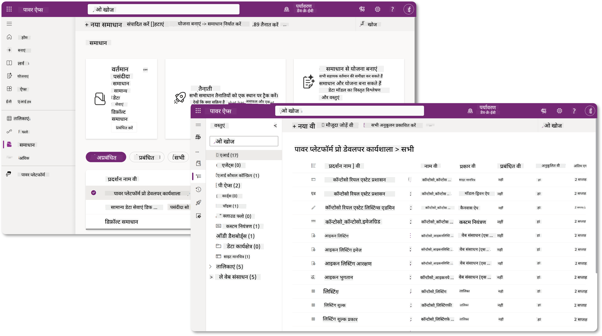

Copilot Studio में अब **Solution Explorer** है जहां आप सीधे अपने समाधान प्रबंधित कर सकते हैं। अब आपको समाधान प्रबंधित करने के लिए Power Apps मेकर पोर्टल पर स्विच करने की आवश्यकता नहीं है, यह Copilot Studio के अंदर ही किया जा सकता है 🪄।

इसका मतलब है कि आप सामान्य समाधान-संबंधित कार्य कर सकते हैं:

- **समाधान बनाएं** - कस्टम समाधान एजेंट्स को वातावरणों के बीच निर्यात और आयात करने में सक्षम बनाते हैं।
- **अपना पसंदीदा समाधान सेट करें** - चुनें कि डिफ़ॉल्ट रूप से एजेंट्स, ऐप्स आदि किस समाधान में बनाए जाएंगे।
- **घटक जोड़ें या हटाएं** - आपका एजेंट अन्य घटकों जैसे पर्यावरण चर या क्लाउड फ्लो का संदर्भ दे सकता है। इसलिए इन घटकों को समाधान में शामिल करने की आवश्यकता होती है।
- **समाधान निर्यात करें** - समाधान को किसी अन्य लक्ष्य वातावरण में स्थानांतरित करने के लिए।
- **समाधान आयात करें** - अन्यत्र बनाए गए समाधान आयात करें, जिसमें समाधान को अपग्रेड या अपडेट करना शामिल है।
- **समाधान पाइपलाइनों को बनाएं और प्रबंधित करें** - वातावरणों के बीच समाधान के डिप्लॉयमेंट को स्वचालित करें।
- **Git इंटीग्रेशन** - डेवलपर्स को संस्करण नियंत्रण, सहयोग और ALM के लिए Git रिपॉजिटरी के साथ समाधान कनेक्ट करने में सक्षम बनाता है। केवल डेवलपर वातावरणों में उपयोग के लिए अभिप्रेत।

   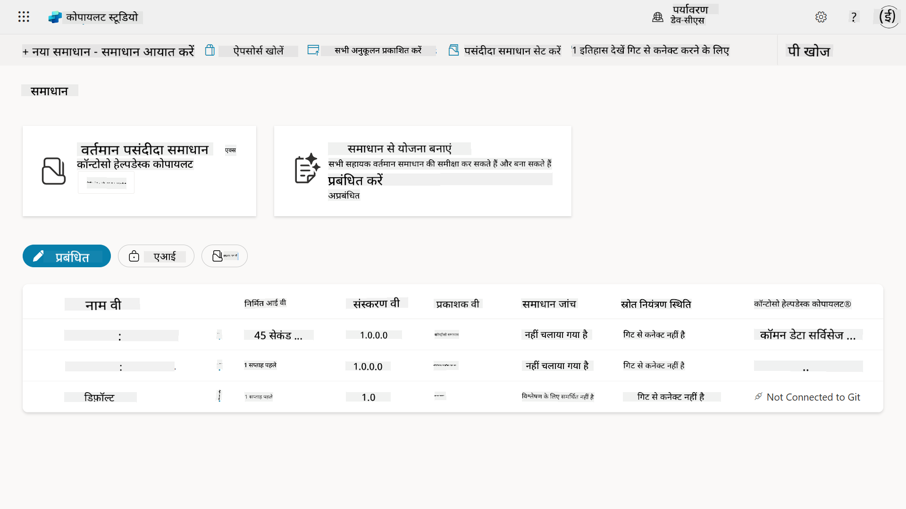

समाधान दो प्रकार के होते हैं:

- **अनमैनेज्ड समाधान** - विकास के दौरान उपयोग किए जाते हैं। आप आवश्यकतानुसार स्वतंत्र रूप से संपादित और कस्टमाइज़ कर सकते हैं।
- **मैनेज्ड समाधान** - जब आप अपने ऐप को परीक्षण या उत्पादन में डिप्लॉय करने के लिए तैयार होते हैं। इन्हें आकस्मिक परिवर्तनों को रोकने के लिए लॉक कर दिया जाता है।

## 🤔 मुझे अपने एजेंट के लिए समाधान का उपयोग क्यों करना चाहिए?

समाधान को एक _टूलबॉक्स_ के रूप में सोचें। जब आपको किसी अलग स्थान (वातावरण) में कुछ ठीक करने या बनाने (एजेंट) की आवश्यकता होती है, तो आप सभी आवश्यक उपकरण (घटक) इकट्ठा करते हैं और उन्हें अपने टूलबॉक्स (समाधान) में रखते हैं। फिर आप इस टूलबॉक्स को नए स्थान (वातावरण) में ले जा सकते हैं और उपकरणों (घटकों) का उपयोग करके अपना काम पूरा कर सकते हैं, या नए उपकरण (घटक) जोड़ सकते हैं ताकि आप अपने एजेंट या प्रोजेक्ट को कस्टमाइज़ कर सकें जिसे आप बना रहे हैं।

!!! quote "Elaiza, आपकी दोस्ताना क्लाउड एडवोकेट यहां 🙋🏻‍♀️ कुछ शब्द साझा करने के लिए:"
    हमारे पास न्यूज़ीलैंड में एक कहावत है, "Be a tidy Kiwi!" जो न्यूज़ीलैंडर्स 🥝 को अपने वातावरण की जिम्मेदारी लेने के लिए प्रेरित करता है, जैसे कचरे को सही तरीके से निपटाना और सार्वजनिक स्थानों को साफ रखना। हम एजेंट्स के लिए भी यही संदर्भ उपयोग कर सकते हैं, ताकि आपके एजेंट से संबंधित सब कुछ व्यवस्थित और पोर्टेबल रहे, और यह आपको एक सुव्यवस्थित वातावरण बनाए रखने में मदद करेगा।

अपने स्रोत (डेवलपर) वातावरण में एक समर्पित समाधान में एजेंट बनाना एक अच्छा अभ्यास है। समाधान मूल्यवान क्यों हैं, इसके कारण यहां दिए गए हैं:

🧩 **संगठित विकास**

- आप अपने एजेंट को डिफ़ॉल्ट समाधान से अलग रख रहे हैं जिसमें वातावरण में सब कुछ शामिल होता है। आपके सभी एजेंट घटक एक ही स्थान पर हैं 🎯।

- आपके एजेंट के लिए आवश्यक सब कुछ एक समाधान में है, जिससे इसे लक्ष्य वातावरण में निर्यात और आयात करना आसान हो जाता है 👉🏻 यह ALM की एक स्वस्थ आदत है।

🧩 **सुरक्षित डिप्लॉयमेंट**

- आप अपने ऐप या एजेंट को एक मैनेज्ड समाधान के रूप में निर्यात कर सकते हैं और इसे अन्य लक्ष्य वातावरण (जैसे परीक्षण या उत्पादन) में डिप्लॉय कर सकते हैं बिना आकस्मिक संपादन का जोखिम उठाए।

🧩 **संस्करण नियंत्रण**

- आप पैच (लक्षित सुधार), अपडेट (एक अधिक व्यापक परिवर्तन) या अपग्रेड (समाधान को बदलना - आमतौर पर प्रमुख परिवर्तन और नई सुविधाओं को पेश करना) बना सकते हैं।

- आपको नियंत्रित तरीके से परिवर्तन रोल आउट करने में मदद करता है।

🧩 **निर्भरता प्रबंधन**

- समाधान ट्रैक करते हैं कि कौन से हिस्से दूसरों पर निर्भर हैं। यह आपको परिवर्तन करते समय चीजों को तोड़ने से रोकता है।

🧩 **टीम सहयोग**

- डेवलपर्स और मेकर्स विकास में अनमैनेज्ड समाधान का उपयोग करके एक साथ काम कर सकते हैं, फिर डिप्लॉयमेंट के लिए एक मैनेज्ड समाधान सौंप सकते हैं।

## 🪪 समाधान प्रकाशकों को समझना

Power Platform में एक समाधान प्रकाशक एक लेबल या ब्रांड की तरह होता है जो यह पहचानता है कि समाधान किसने बनाया या उसका मालिक कौन है। यह आपके ऐप्स, एजेंट्स और फ्लो कस्टमाइज़ेशन को प्रबंधित करने का एक छोटा लेकिन महत्वपूर्ण हिस्सा है, खासकर जब टीमों या वातावरणों के बीच काम कर रहे हों।

जब आप एक समाधान बनाते हैं, तो आपको एक प्रकाशक चुनना होता है। यह प्रकाशक परिभाषित करता है:

- एक प्रीफिक्स जो सभी कस्टम घटकों (जैसे टेबल्स, फील्ड्स, और फ्लो) में जोड़ा जाता है।

- उस संगठन या व्यक्ति का नाम और संपर्क जानकारी जो समाधान का मालिक है।

### 🤔 यह महत्वपूर्ण क्यों है?

1. **आसान पहचान** - प्रीफिक्स (उदाहरण - `new_` या `abc_`) आपको जल्दी से पहचानने में मदद करता है कि कौन से घटक किस समाधान या टीम से संबंधित हैं।

1. **संघर्षों से बचाव** - यदि दो टीमें एक कॉलम को स्टेटस नाम देती हैं, तो उनके प्रीफिक्स (`teamA_status`, `teamB_status`) नामकरण टकराव को रोकते हैं।

1. **ALM का समर्थन करता है** - जब समाधान को वातावरणों (Dev → Test → Prod) के बीच स्थानांतरित किया जाता है, तो प्रकाशक स्वामित्व को ट्रैक करने और स्थिरता बनाए रखने में मदद करता है।

### ✨ उदाहरण

मान लीजिए आप एक प्रकाशक बनाते हैं जिसका नाम Contoso Solutions है और प्रीफिक्स `cts_` है।

यदि आप एक कस्टम कॉलम जोड़ते हैं जिसका नाम _Priority_ है, तो इसे समाधान में `cts_Priority` के रूप में संग्रहीत किया जाएगा।

जो भी इस कॉलम को समाधान स्तर पर देखेगा, चाहे वह किसी भी वातावरण में हो, वह आसानी से पहचान सकता है कि यह कॉलम Contoso Solutions से संबंधित है।

## 🧭 Power Platform समाधान जीवनचक्र

अब जब आप समाधान का उद्देश्य समझ गए हैं, तो चलिए जीवनचक्र के बारे में सीखते हैं।

**1. विकास वातावरण में समाधान बनाएं** - अपने विकास वातावरण में एक नया समाधान बनाकर शुरू करें।

**2. घटक जोड़ें** - अपने समाधान में ऐप्स, फ्लो, टेबल्स और अन्य तत्व जोड़ें।

**3. मैनेज्ड समाधान के रूप में निर्यात करें** - अपने समाधान को डिप्लॉयमेंट के लिए पैकेज करें और इसे मैनेज्ड समाधान के रूप में निर्यात करें।

**4. परीक्षण वातावरण में आयात करें** - सुनिश्चित करें कि सब कुछ अपेक्षित रूप से काम करता है, इसके लिए अपने समाधान को एक अलग परीक्षण वातावरण में आयात करें।

**5. उत्पादन वातावरण में आयात करें** - परीक्षण किए गए समाधान को अपने लाइव उत्पादन वातावरण में डिप्लॉय करें।

**6. पैच, अपडेट या अपग्रेड लागू करें** - सुधार या सुधार पैच, अपडेट या अपग्रेड का उपयोग करके करें। 🔁 चक्र को दोहराएं!

### ✨ उदाहरण

कल्पना करें कि आप एक IT हेल्पडेस्क एजेंट बना रहे हैं जो कर्मचारियों को डिवाइस समस्याओं, नेटवर्क ट्रबलशूटिंग, प्रिंटर सेटअप और अधिक में मदद करता है।

- आप एक विकास वातावरण में अनमैनेज्ड समाधान का उपयोग करके शुरू करते हैं।

- जब यह तैयार हो जाता है, तो आप इसे एक मैनेज्ड समाधान के रूप में निर्यात करते हैं और इसे एक लक्ष्य वातावरण जैसे सिस्टम टेस्ट या यूजर एक्सेप्टेंस टेस्टिंग (UAT) वातावरण में आयात करते हैं।

- परीक्षण के बाद, आप इसे उत्पादन वातावरण में स्थानांतरित करते हैं - बिना मूल विकास संस्करण को छुए।

## 🧪 लैब 04: नया समाधान बनाएं

अब हम सीखने जा रहे हैं

- [4.1 समाधान प्रकाशक कैसे बनाएं](../../../../../docs/recruit/04-creating-a-solution)
- [4.2 समाधान कैसे बनाएं](../../../../../docs/recruit/04-creating-a-solution)

हम पहले के उदाहरण के साथ रहेंगे, जहां हम एक समर्पित Copilot Studio वातावरण में एक समाधान बनाएंगे ताकि उसमें अपना IT हेल्पडेस्क एजेंट बना सकें।

चलो शुरू करें!

### आवश्यकताएँ

#### सुरक्षा भूमिका

Copilot Studio में, आप समाधान एक्सप्लोरर में क्या कर सकते हैं, यह आपके उपयोगकर्ता सुरक्षा भूमिका पर निर्भर करता है। यदि आपके पास Power Apps एडमिन सेंटर में समाधान प्रबंधित करने की अनुमति नहीं है, तो आप Copilot Studio में भी वे कार्य नहीं कर पाएंगे।

सुनिश्चित करें कि सब कुछ सुचारू रूप से काम करता है, इसके लिए जांचें कि आपके पास सही सुरक्षा भूमिकाएँ और अनुमतियाँ हैं। या यदि आप अपने संगठन में वातावरण प्रबंधित नहीं करते हैं, तो अपने IT प्रशासक (या समकक्ष) टीम से पूछें जो आपके टेनेंट/वातावरण को प्रबंधित करती है।

निम्नलिखित सुरक्षा भूमिकाएँ उपयोगकर्ताओं को उनके वातावरण में समाधान बनाने में सक्षम बनाती हैं।

| सुरक्षा भूमिका    | विवरण |
| ---------- | ---------- |
| Environment Maker | एक विशिष्ट वातावरण के भीतर संसाधनों को बनाने, कस्टमाइज़ करने और प्रबंधित करने के लिए आवश्यक अनुमतियाँ प्रदान करता है, जिसमें समाधान भी शामिल हैं  |
| System Customizer  | Environment Maker से व्यापक अनुमतियाँ, जिसमें वातावरण को कस्टमाइज़ करना और सुरक्षा भूमिकाओं को प्रबंधित करना शामिल है |
| System Administrator   | उच्चतम स्तर की अनुमतियाँ और वातावरण के सभी पहलुओं को प्रबंधित कर सकता है, जिसमें सुरक्षा भूमिकाएँ बनाना और असाइन करना शामिल है     |

#### डेवलपर वातावरण

सुनिश्चित करें कि आप अपने समर्पित डेवलपर वातावरण में स्विच करें, [Lesson 00 - कोर्स सेटअप - Step 3: नया डेवलपर बनाएं](../00-course-setup/README.md#step-3-create-new-developer-environment) का संदर्भ लें।

1. ऊपर दाईं ओर, **Cog wheel** आइकन चुनें और डिफ़ॉल्ट वातावरण से अपने वातावरण में स्विच करें, उदाहरण के लिए **Adele Vance का वातावरण**।

    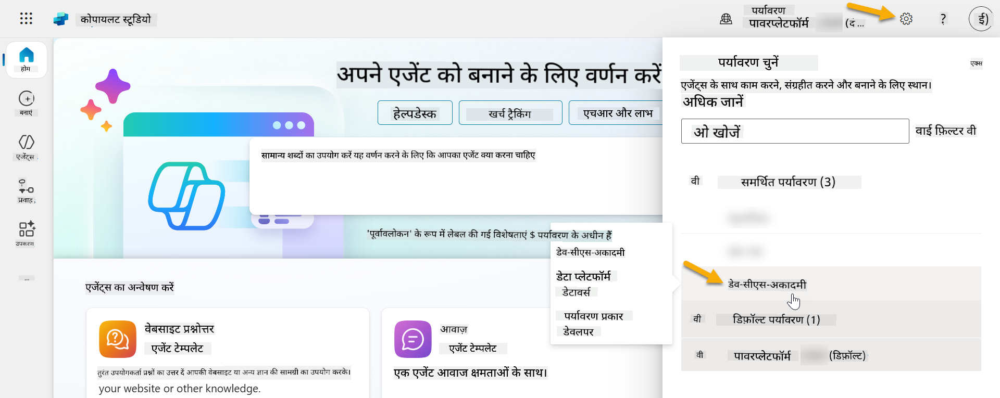

### 4.1 समाधान प्रकाशक बनाएं

1. पिछले पाठ में उपयोग किए गए समान Copilot Studio वातावरण का उपयोग करते हुए, Copilot Studio में बाईं ओर मेनू में **ellipsis आइकन (. . .)** चुनें। **Explore** हेडर के तहत **Solutions** चुनें।

    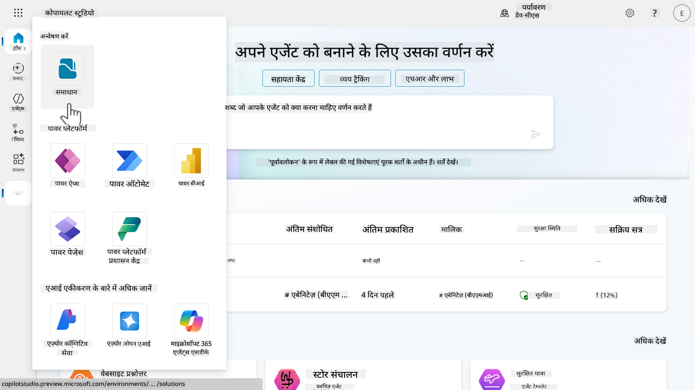

1. Copilot Studio में **Solution Explorer** लोड होगा। **+ New solution** चुनें।

    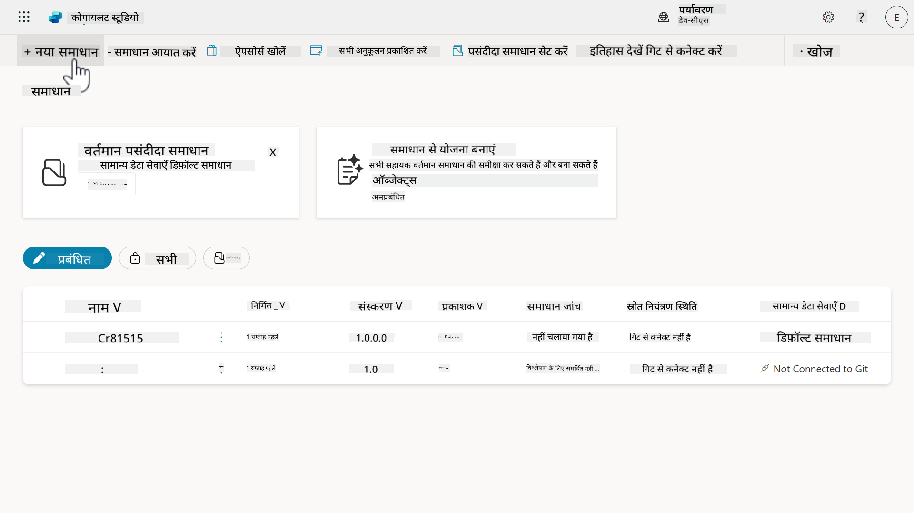

1. **New solution** पैन दिखाई देगा जहां हम अपने समाधान का विवरण परिभाषित कर सकते हैं। सबसे पहले, हमें एक नया प्रकाशक बनाना होगा। **+ New publisher** चुनें।

    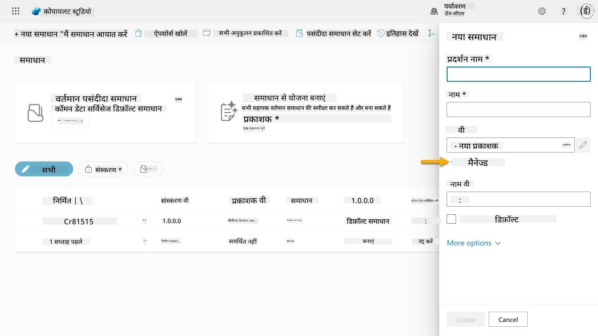  

1. **New publisher** पैन का **Properties** टैब दिखाई देगा जिसमें आवश्यक और गैर-आवश्यक फ़ील्ड्स को **Properties** टैब में भरा जाना है। यह वह जगह है जहां हम प्रकाशक का विवरण रेखांकित कर सकते हैं जो समाधान का मालिक या निर्माता के रूप में उपयोग किया जाएगा।

    | गुण    | विवरण | आवश्यक |
    | ---------- | ---------- | :----------: |
    | Display name | प्रकाशक के लिए डिस्प्ले नाम | हां   |
    | Name  | प्रकाशक के लिए अद्वितीय नाम और स्कीमा नाम  | हां    |
    | Description   | समाधान का उद्देश्य रेखांकित करता है    | नहीं     |
    | Prefix    | प्रकाशक प्रीफिक्स जो नए बनाए गए घटकों पर लागू होगा   | हां      |
    | Choice value prefix   | प्रकाशक प्रीफिक्स के आधार पर एक संख्या उत्पन्न करता है। जब आप विकल्पों में विकल्प जोड़ते हैं तो इस संख्या का उपयोग किया जाता है और यह संकेतक प्रदान करता है कि कौन सा समाधान विकल्प जोड़ने के लिए उपयोग किया गया था।   | हां      |

    **Display name** के लिए निम्नलिखित को कॉपी और पेस्ट करें,

    ```text
    Contoso Solutions
    ```

    **Name** के लिए निम्नलिखित को कॉपी और पेस्ट करें,

    ```text
    ContosoSolutions
    ```

    **Description** के लिए निम्नलिखित को कॉपी और पेस्ट करें,

    ```text
    Copilot Studio Agent Academy
    ```

    **Prefix** के लिए निम्नलिखित को कॉपी और पेस्ट करें,

    ```text
    cts
    ```

    डिफ़ॉल्ट रूप से, **Choice value** प्रीफिक्स एक पूर्णांक मान प्रदर्शित करेगा। इस पूर्णांक मान को निकटतम हजार में अपडेट करें। उदाहरण के लिए, मेरे स्क्रीनशॉट में, यह प्रारंभ में `77074` था। इसे `77074` से `77000` में अपडेट करें।

    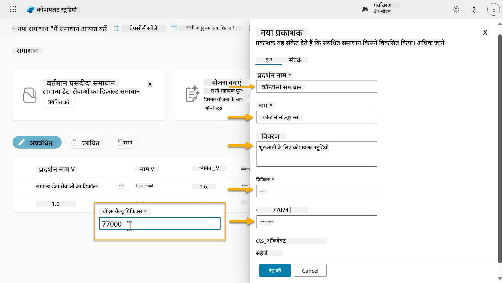  

1. यदि आप समाधान के लिए संपर्क विवरण प्रदान करना चाहते हैं, तो **Contact** टैब चुनें और प्रदर्शित किए गए निम्नलिखित कॉलम भरें।

    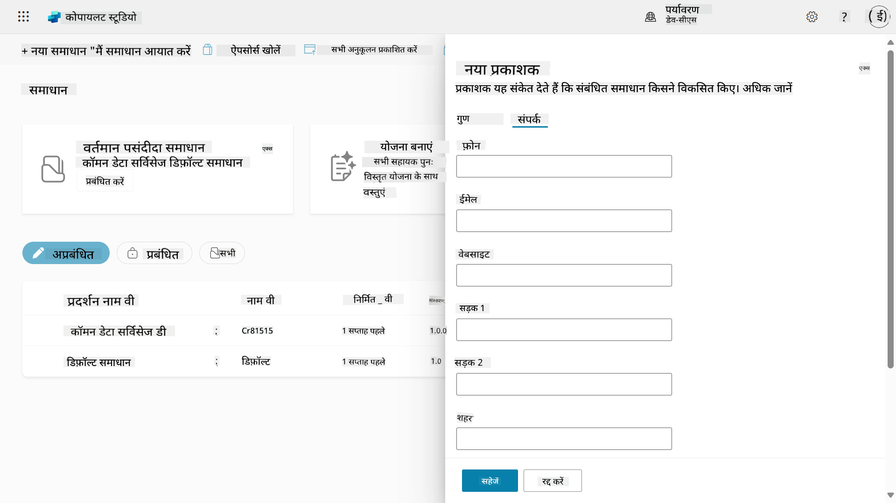

1. **Properties** टैब चुनें और **Save** चुनें ताकि प्रकाशक बनाया जा सके।

    
1. नया प्रकाशक पैन बंद हो जाएगा और आप **नया समाधान** पैन पर वापस आ जाएंगे, जिसमें नया बनाया गया प्रकाशक चयनित होगा।

    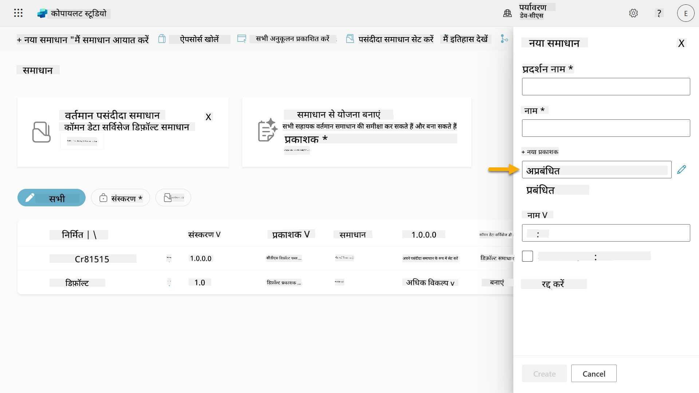  

शाबाश, आपने अब एक समाधान प्रकाशक बना लिया है! 🙌🏻 अब हम सीखेंगे कि नया कस्टम समाधान कैसे बनाया जाए।

### 4.2 नया समाधान बनाएं

1. अब जब हमने अपने समाधान बना लिए हैं, तो हम **नया समाधान** पैन में बाकी फॉर्म को पूरा कर सकते हैं।

    निम्नलिखित को **डिस्प्ले नाम** के रूप में कॉपी और पेस्ट करें,

    ```text
    Contoso Helpdesk Agent
    ```

    निम्नलिखित को **नाम** के रूप में कॉपी और पेस्ट करें,

    ```text
    ContosoHelpdeskAgent
    ```

    चूंकि हम एक नया समाधान बना रहे हैं, [**संस्करण** संख्या](https://learn.microsoft.com/power-apps/maker/data-platform/update-solutions#understanding-version-numbers-for-updates/?WT.mc_id=power-172615-ebenitez) डिफ़ॉल्ट रूप से `1.0.0.0` होगी।

    **अपने पसंदीदा समाधान के रूप में सेट करें** चेकबॉक्स को टिक करें।

    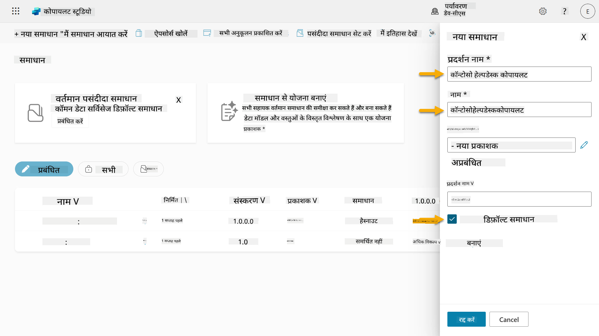  

1. **अधिक विकल्प** को विस्तारित करें ताकि समाधान में प्रदान किए जा सकने वाले अतिरिक्त विवरण देख सकें।

    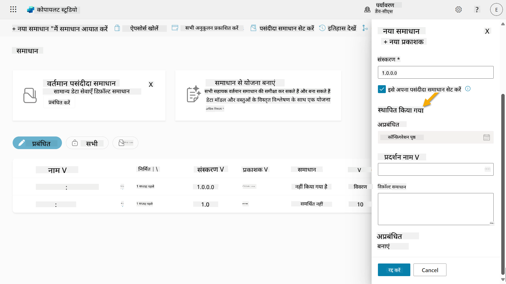

1. आपको निम्नलिखित दिखाई देगा,

    - **इंस्टॉल किया गया** - वह तारीख जब समाधान इंस्टॉल किया गया था।

    - **कॉन्फ़िगरेशन पेज** - डेवलपर्स एक HTML वेब संसाधन सेट करते हैं ताकि उपयोगकर्ता अपने ऐप, एजेंट या टूल के साथ इंटरैक्ट कर सकें, जहां यह सूचना अनुभाग में एक वेब पेज के रूप में दिखाई देगा जिसमें निर्देश या बटन होंगे। इसे ज्यादातर कंपनियों या डेवलपर्स द्वारा उपयोग किया जाता है जो समाधान बनाते और दूसरों के साथ साझा करते हैं।

    - **विवरण** - समाधान या कॉन्फ़िगरेशन पेज का उच्च स्तर का विवरण।

    हम इस लैब के लिए इन्हें खाली छोड़ देंगे।

    **बनाएं** चुनें।

    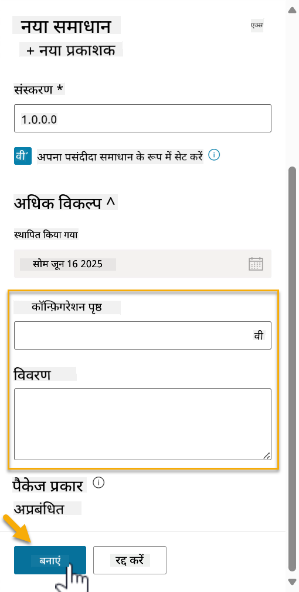

1. Contoso Helpdesk Agent के लिए समाधान अब बना दिया गया है। इसमें कोई घटक नहीं होगा जब तक हम Copilot Studio में एक एजेंट नहीं बनाते।

    समाधान एक्सप्लोरर पर वापस जाने के लिए **पीछे तीर** आइकन चुनें।

    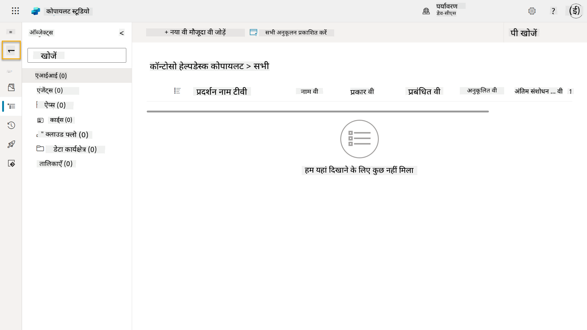

1. ध्यान दें कि Contoso Helpdesk Agent अब **वर्तमान पसंदीदा समाधान** के रूप में प्रदर्शित होता है क्योंकि हमने पहले **अपने पसंदीदा समाधान के रूप में सेट करें** चेकबॉक्स को टिक किया था।

    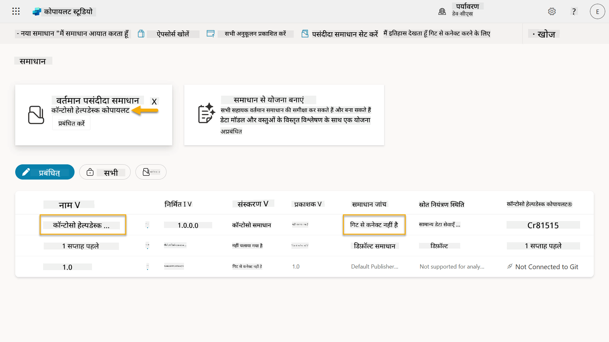

## ✅ मिशन पूरा

बधाई हो! 👏🏻 आपने एक प्रकाशक बनाया और इसे अपने नए बनाए गए समाधान में उपयोग किया ताकि आप अपना एजेंट बना सकें!

बहुत अच्छा किया, एजेंट निर्माता। एक सुव्यवस्थित डिजिटल छाप बड़े पैमाने पर संचालन के लिए पहला कदम है। अब आपके पास स्थायी, एंटरप्राइज-रेडी एजेंट विकास के लिए उपकरण और मानसिकता है।

यह **लैब 04 - समाधान बनाना** का अंत है, नीचे दिए गए लिंक का चयन करें ताकि अगले पाठ में जा सकें। इस लैब में बनाया गया समाधान अगले पाठ की लैब में उपयोग किया जाएगा।

⏭️ [**पहले से बने एजेंटों के साथ जल्दी शुरू करें** पाठ पर जाएं](../05-using-prebuilt-agents/README.md)

## 📚 सामरिक संसाधन

🔗 [समाधान बनाएं](https://learn.microsoft.com/power-apps/maker/data-platform/create-solution/?WT.mc_id=power-172615-ebenitez)

🔗 [Copilot Studio में समाधान बनाएं और प्रबंधित करें](https://learn.microsoft.com/microsoft-copilot-studio/authoring-solutions-overview/?WT.mc_id=power-172615-ebenitez)

🔗 [अन्य उपयोगकर्ताओं के साथ एजेंट साझा करें](https://learn.microsoft.com/microsoft-copilot-studio/admin-share-bots/?WT.mc_id=power-172615-ebenitez)

🔗 [पूर्वनिर्धारित सुरक्षा भूमिकाओं के लिए उपलब्ध संसाधनों का सारांश](https://learn.microsoft.com/power-platform/admin/database-security#summary-of-resources-available-to-predefined-security-roles/?WT.mc_id=power-172615-ebenitez)

🔗 [समाधान को अपग्रेड या अपडेट करें](https://learn.microsoft.com/power-apps/maker/data-platform/update-solutions/?WT.mc_id=power-172615-ebenitez)

🔗 [Power Platform में पाइपलाइनों का अवलोकन](https://learn.microsoft.com/power-platform/alm/pipelines/?WT.mc_id=power-172615-ebenitez)

🔗 [Power Platform में Git इंटीग्रेशन का अवलोकन](https://learn.microsoft.com/power-platform/alm/git-integration/overview/?WT.mc_id=power-172615-ebenitez)


---

**अस्वीकरण**:  
यह दस्तावेज़ AI अनुवाद सेवा [Co-op Translator](https://github.com/Azure/co-op-translator) का उपयोग करके अनुवादित किया गया है। जबकि हम सटीकता के लिए प्रयास करते हैं, कृपया ध्यान दें कि स्वचालित अनुवाद में त्रुटियां या अशुद्धियां हो सकती हैं। मूल भाषा में दस्तावेज़ को आधिकारिक स्रोत माना जाना चाहिए। महत्वपूर्ण जानकारी के लिए, पेशेवर मानव अनुवाद की सिफारिश की जाती है। इस अनुवाद के उपयोग से उत्पन्न किसी भी गलतफहमी या गलत व्याख्या के लिए हम उत्तरदायी नहीं हैं।