<!--
CO_OP_TRANSLATOR_METADATA:
{
  "original_hash": "8e2c64a7f9303e58329ec8bb468c80b4",
  "translation_date": "2025-10-21T18:48:24+00:00",
  "source_file": "docs/recruit/05-using-prebuilt-agents/README.md",
  "language_code": "hi"
}
-->
# 🧰 मिशन 05: पहले से बने एजेंट का उपयोग करना  

## 🕵️‍♂️ कोडनेम: `ऑपरेशन सुरक्षित यात्रा`

> **⏱️ ऑपरेशन समय सीमा:** `~30 मिनट`

🎥 **वॉकथ्रू देखें**

## 🎯 मिशन का विवरण

आपका स्वागत है Copilot Studio Agent Academy के अगले मिशन में। आप **पहले से बने एजेंटों** की दुनिया का पता लगाने वाले हैं—Microsoft द्वारा बनाए गए बुद्धिमान, उद्देश्यपूर्ण एजेंट जो आपके डिप्लॉयमेंट को तेज़ करने और मूल्य प्राप्त करने में समय कम करने के लिए डिज़ाइन किए गए हैं।

शुरुआत से निर्माण करने के बजाय, पहले से बने एजेंट (जिन्हें **एजेंट टेम्पलेट्स** भी कहा जाता है) आपको तैयार उपयोग के लिए परिदृश्य प्रदान करते हैं जिन्हें आप मिनटों में कस्टमाइज़ और डिप्लॉय कर सकते हैं।

इस मिशन में, आप **Safe Travels** एजेंट को डिप्लॉय करेंगे—एक ऐसा एजेंट जो आपके उपयोगकर्ताओं को व्यापार यात्रा की तैयारी करने, कंपनी की नीतियों को समझने और योजना को सरल बनाने में मदद करता है।

---

## 🧭 उद्देश्य

इस मिशन के लिए आपके लक्ष्य हैं:

1. समझें कि पहले से बने एजेंट क्या हैं और वे क्यों महत्वपूर्ण हैं  
1. **Safe Travels** एजेंट टेम्पलेट को डिप्लॉय करें  
1. एजेंट की प्रतिक्रियाओं और सामग्री को कस्टमाइज़ करें  
1. एजेंट का परीक्षण और प्रकाशन करें  

---

## 🧠 पहले से बने एजेंट क्या हैं?

पहले से बने एजेंट Microsoft द्वारा बनाए गए तैयार-उपयोग AI एजेंट हैं जो:

- सामान्य व्यावसायिक आवश्यकताओं को पूरा करते हैं (जैसे यात्रा, HR, IT समर्थन)
- पूरी तरह से कार्यशील टॉपिक्स, ट्रिगर वाक्यांश, निर्देश और नमूना ज्ञान शामिल करते हैं।
- आपके अपने डेटा के साथ संपादित, विस्तारित और ग्राउंड किए जा सकते हैं

ये एजेंट जल्दी शुरू करने या यह सीखने के लिए आदर्श हैं कि एजेंट कैसे संरचित होते हैं।

---

## 🧪 लैब 05: पहले से बने एजेंट के साथ जल्दी शुरू करें

अब हम सीखने जा रहे हैं कि पहले से बने एजेंट को कैसे चुनें और कस्टमाइज़ करें।

- [5.1 Copilot Studio लॉन्च करें](../../../../../docs/recruit/05-using-prebuilt-agents)
- [5.2 Safe Travels एजेंट टेम्पलेट चुनें](../../../../../docs/recruit/05-using-prebuilt-agents)
- [5.3 एजेंट को कस्टमाइज़ करें](../../../../../docs/recruit/05-using-prebuilt-agents)
- [5.4 परीक्षण और प्रकाशन](../../../../../docs/recruit/05-using-prebuilt-agents)

हम पहले के उदाहरण के साथ रहेंगे, जहां हम समर्पित Copilot Studio वातावरण में अपना IT हेल्पडेस्क एजेंट बनाने के लिए एक समाधान बनाएंगे।

चलो शुरू करें!

### 5.1 Copilot Studio लॉन्च करें

1. [https://copilotstudio.microsoft.com](https://copilotstudio.microsoft.com) पर जाएं

1. अपने Microsoft 365 कार्य या स्कूल खाते से साइन इन करें

!!! warning
    आपको उस टेनेंट में होना चाहिए जहां Copilot Studio सक्षम है। यदि आप Copilot Studio नहीं देखते हैं, तो [मिशन 00](../00-course-setup/README.md) पर वापस जाएं और अपनी सेटअप प्रक्रिया पूरी करें।

### 5.2 Safe Travels एजेंट टेम्पलेट चुनें

1. Copilot Studio होमपेज से, **+ Create** पर क्लिक करें  
    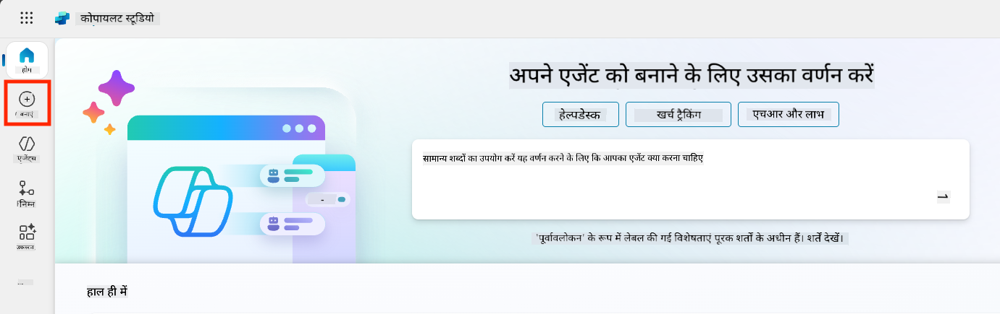

1. **Start with an agent template** सेक्शन तक स्क्रॉल करें  

1. **Safe Travels** को खोजें और चुनें  

    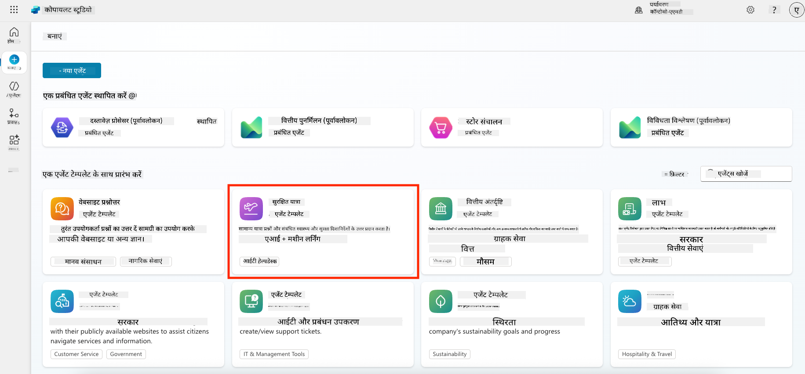

1. ध्यान दें कि टेम्पलेट विवरण, निर्देश और ज्ञान के साथ पहले से लोड आता है।  

    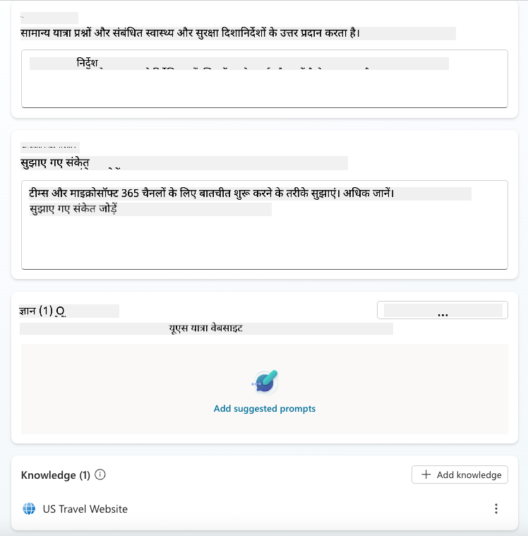

1. **Create** पर क्लिक करें  

    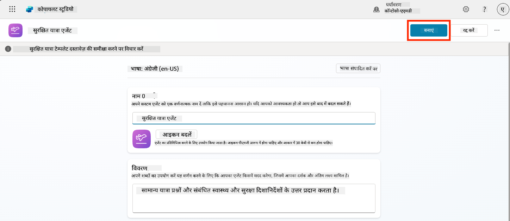

यह आपके वातावरण में Safe Travels कॉन्फ़िगरेशन के आधार पर एक नया एजेंट बनाएगा।

### 5.3 एजेंट को कस्टमाइज़ करें

अब जब एजेंट बन गया है, तो इसे अपनी कंपनी के लिए अनुकूलित करें:

1. **Enabled generative AI** चुनें ताकि यह टेम्पलेट में दिए गए निर्देशों का उपयोग कर सके।  

    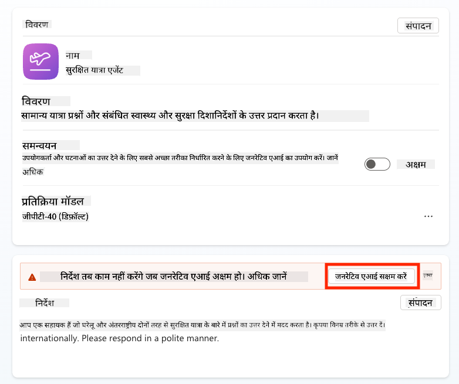

1. अब हम एजेंट को एक अतिरिक्त ज्ञान स्रोत से लैस करेंगे ताकि यह यूरोप यात्रा के बारे में सवालों का जवाब दे सके। ऐसा करने के लिए, **knowledge** सेक्शन तक स्क्रॉल करें और **Add knowledge** चुनें।  

    

1. **Public websites** चुनें  

    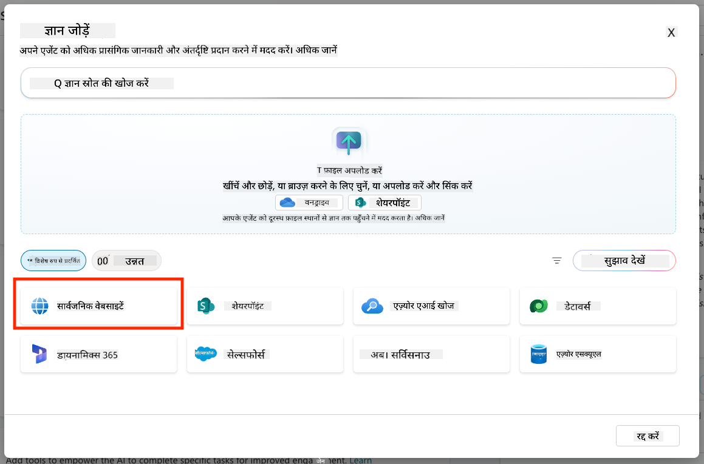

1. टेक्स्ट इनपुट में, **<https://european-union.europa.eu/>** पेस्ट करें और **Add** चुनें  

    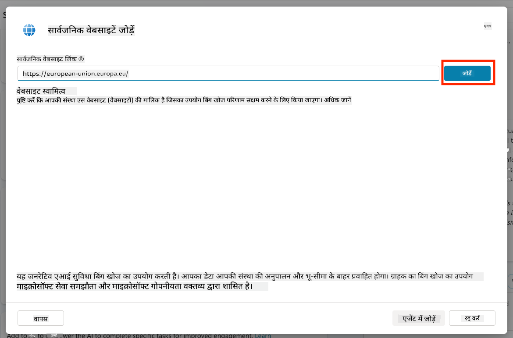

1. **Add to agent** चुनें  

    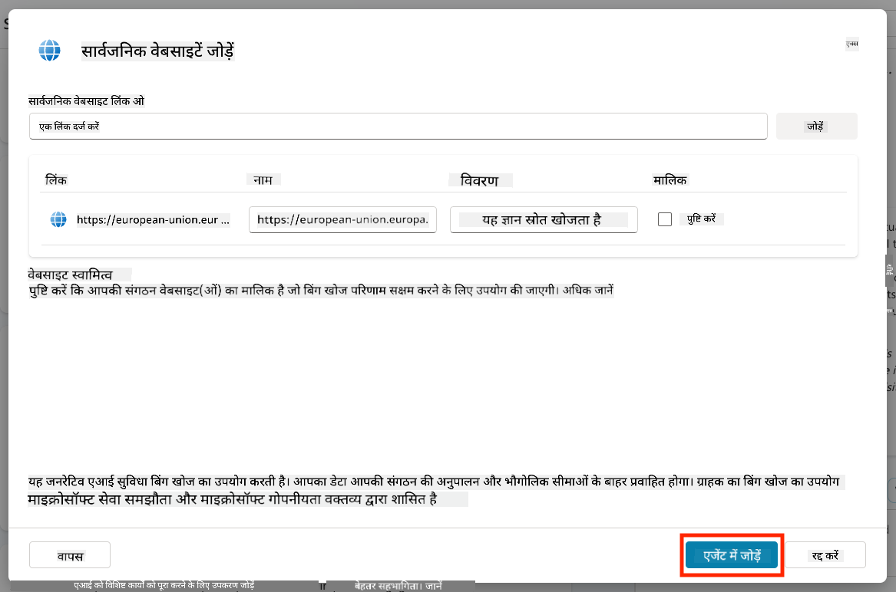

### 5.4 परीक्षण और प्रकाशन

1. **Test** पर क्लिक करें (ऊपर-दाईं ओर) ताकि परीक्षण विंडो लॉन्च हो सके  

1. निम्नलिखित वाक्यांशों को आज़माएं:

    - `“क्या मुझे US से एम्स्टर्डम जाने के लिए वीजा की आवश्यकता है?”`
    - `“US पासपोर्ट प्राप्त करने में कितना समय लगता है?”`
    - `“वैलेंसिया, स्पेन में सबसे नजदीकी US दूतावास कहां है?”`

1. पुष्टि करें कि एजेंट सटीक और सहायक जानकारी के साथ प्रतिक्रिया देता है और Activity Map पर देखें कि उसने जानकारी कहां से प्राप्त की।  

    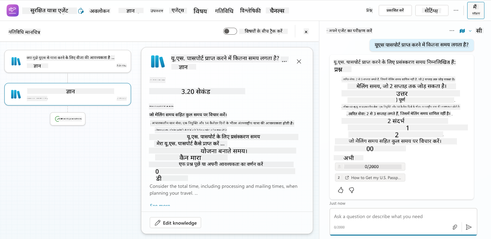

1. जब तैयार हों, **Publish** पर क्लिक करें  

    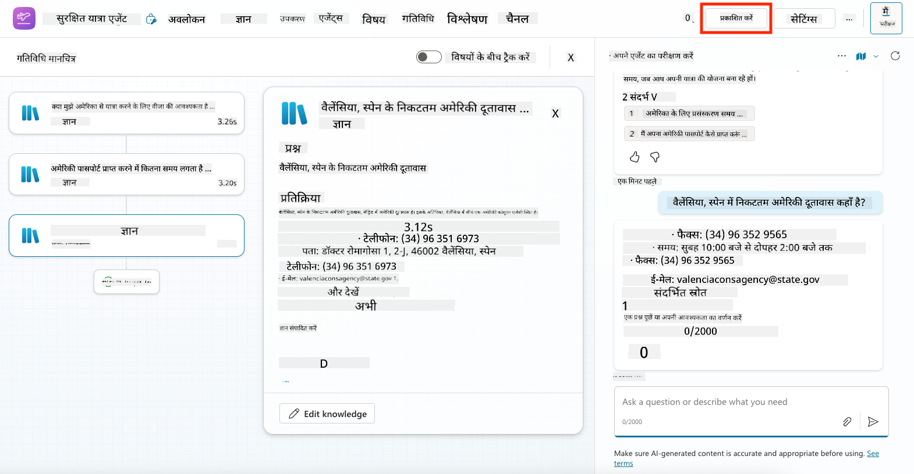

1. डायलॉग बॉक्स में फिर से **Publish** चुनें  
    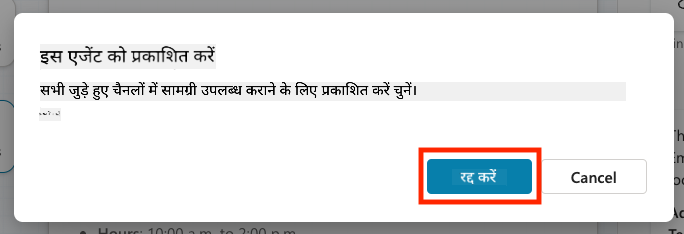

1. वैकल्पिक रूप से, एजेंट को Microsoft Teams में **Channels** फीचर का उपयोग करके जोड़ें।

!!! note "🧳 बोनस उद्देश्य"
    Safe Travels एजेंट को SharePoint साइट या FAQ फ़ाइल के साथ ग्राउंड करने का प्रयास करें ताकि यह आपकी कंपनी की यात्रा नीतियों के लिए अधिक प्रासंगिक हो सके।

## ✅ मिशन पूरा

आपने अब सफलतापूर्वक:

- Microsoft का पहले से बना एजेंट डिप्लॉय किया  
- एजेंट को कस्टमाइज़ किया  
- **Safe Travels** एजेंट टेम्पलेट का अपना संस्करण परीक्षण और प्रकाशित किया  

⏭️ [**एक कस्टम एजेंट को शुरुआत से बनाना** पाठ पर जाएं](../06-create-agent-from-conversation/README.md)।

<!-- markdownlint-disable-next-line MD033 -->

---

**अस्वीकरण**:  
यह दस्तावेज़ AI अनुवाद सेवा [Co-op Translator](https://github.com/Azure/co-op-translator) का उपयोग करके अनुवादित किया गया है। जबकि हम सटीकता के लिए प्रयास करते हैं, कृपया ध्यान दें कि स्वचालित अनुवाद में त्रुटियां या अशुद्धियां हो सकती हैं। मूल भाषा में दस्तावेज़ को आधिकारिक स्रोत माना जाना चाहिए। महत्वपूर्ण जानकारी के लिए, पेशेवर मानव अनुवाद की सिफारिश की जाती है। इस अनुवाद के उपयोग से उत्पन्न किसी भी गलतफहमी या गलत व्याख्या के लिए हम उत्तरदायी नहीं हैं।