<!--
CO_OP_TRANSLATOR_METADATA:
{
  "original_hash": "180f9cc0b40527f61be092c9b0f72aba",
  "translation_date": "2025-10-21T18:40:22+00:00",
  "source_file": "docs/recruit/06-create-agent-from-conversation/README.md",
  "language_code": "hi"
}
-->
# 🚨 मिशन 06: प्राकृतिक भाषा का उपयोग करके Copilot में एक कस्टम एजेंट बनाएं और इसे अपने डेटा से जोड़ें

## 🕵️‍♂️ कोडनेम: `ऑपरेशन एजेंट फोर्ज`

> **⏱️ ऑपरेशन का समय:** `~75 मिनट`

🎥 **वॉकथ्रू देखें**

[](https://www.youtube.com/watch?v=qZTtQVncGFg "YouTube पर वॉकथ्रू देखें")

## 🎯 मिशन का विवरण

वापस स्वागत है, एजेंट मेकर। इस मिशन में आप Copilot Studio की सबसे शक्तिशाली क्षमता का उपयोग करेंगे - केवल प्राकृतिक भाषा का उपयोग करके एक कस्टम एजेंट बनाना… और इसे अपने डेटा से सुपरचार्ज करना।

यह सिर्फ एक और चैटबॉट नहीं है। आप एक ज्ञान-सक्षम डिजिटल सहकर्मी बना रहे हैं - जो तर्क कर सकता है, जवाब दे सकता है, और वास्तविक एंटरप्राइज जानकारी का संदर्भ दे सकता है।

आपका हथियार? प्राकृतिक भाषा। आपका मिशन? एक पूरी तरह से कस्टमाइज्ड हेल्पडेस्क एजेंट डिज़ाइन करना, ट्रेन करना और टेस्ट करना जो SharePoint, अपलोड की गई फाइलें, या कंपनी URLs का उपयोग करके IT सवालों का जवाब दे सके।

आइए अपने एजेंट को जमीन से बनाएं।

## 🔎 उद्देश्य

इस मिशन में, आप सीखेंगे:

1. कस्टम एजेंट क्या हैं और वे प्री-बिल्ट टेम्पलेट्स से कैसे अलग हैं
1. Copilot के साथ प्राकृतिक भाषा प्रॉम्प्ट्स और संवादात्मक डिज़ाइन का उपयोग करके एजेंट बनाना
1. एंटरप्राइज ज्ञान स्रोतों जैसे SharePoint, दस्तावेज़ों और वेबसाइटों के साथ एजेंट को जोड़ना
1. जेनरेटिव ऑर्केस्ट्रेशन के बारे में सीखना और कैसे एजेंट कई डेटा स्रोतों का उपयोग करके डायनामिक रूप से खोज और जवाब देते हैं
1. एक पूरी तरह से कार्यात्मक IT हेल्पडेस्क एजेंट बनाना और टेस्ट करना जो आपके अपने डेटा से सवालों का जवाब दे सके

## 🤔 _कस्टम_ एजेंट क्या है?

कस्टम एजेंट एक चैटबॉट या वर्चुअल असिस्टेंट है जिसे आप Copilot Studio में डिज़ाइन और बनाते हैं ताकि उपयोगकर्ताओं को विशिष्ट कार्यों या सवालों में मदद मिल सके। इसे कस्टम इसलिए कहा जाता है क्योंकि:

- **आप उद्देश्य तय करते हैं** - उपयोगकर्ताओं को छुट्टी का समय अनुरोध करने, ऑर्डर की स्थिति जांचने, IT संबंधित सवालों में सहायता प्रदान करने में मदद करें।
- **आप बातचीत को परिभाषित करते हैं** - एजेंट क्या कहता है और कैसे जवाब देता है।
- **आप इसे अपने डेटा से जोड़ते हैं** - बिल्ट-इन समर्थित ज्ञान संसाधनों के माध्यम से अपने एंटरप्राइज डेटा से कनेक्ट करें।
- **आप इसे अपने सिस्टम या एप्लिकेशन से जोड़ते हैं** - कनेक्टर्स, फ्लो, REST APIs और मॉडल संदर्भ प्रोटोकॉल सर्वर से चुनें।

!!! note
    इसे इस तरह सोचें: आप अपना डिजिटल हेल्पर बना रहे हैं जो उपयोगकर्ताओं से बात कर सकता है और उनके लिए कार्य पूरे कर सकता है जैसे सवालों का जवाब देना, प्रक्रिया द्वारा आवश्यक जानकारी एकत्र करना, या आपके एंटरप्राइज डेटा से कनेक्ट करना।

### 🤖 कस्टम एजेंट क्या कर सकता है?

कस्टम एजेंट निम्नलिखित कार्य कर सकता है:

- उपयोगकर्ताओं से नाम, तारीखें, या प्राथमिकताएं जैसी जानकारी मांगें।
- उस जानकारी को डेटाबेस या टेबल में सेव करें।
- पूछे गए सवालों के आधार पर डेटा खोजें और जवाब दें।
- उपयोगकर्ताओं के सीधे इंटरैक्शन के बिना स्वायत्त रूप से काम करें।
- ईमेल भेजने या रिकॉर्ड बनाने जैसे कार्य ऑन-डिमांड या स्वायत्त रूप से ट्रिगर करें।

### 👩🏻‍💻 कस्टम एजेंट का उपयोग क्यों करें?

- दोहराव वाले कार्यों को स्वचालित करके समय बचाएं।
- उपयोगकर्ताओं को एक दोस्ताना, गाइडेड अनुभव प्रदान करें।
- इसे अपने व्यवसाय या प्रोजेक्ट की जरूरतों के अनुसार अनुकूलित करें।

### ✨ उदाहरण

आप एक कस्टम एजेंट बनाते हैं जो कर्मचारियों को छुट्टी का अनुरोध करने में मदद करता है।

यह उनका नाम, छुट्टी की तारीखें, और उनके मैनेजर का नाम पूछता है, फिर उस जानकारी को उस सिस्टम में सेव करता है जो छुट्टी के अनुरोधों को प्रबंधित करता है, जैसे SharePoint सूची।

अब, SharePoint सूची पर नेविगेट करने और एक नया आइटम बनाने के बजाय, कर्मचारी केवल एजेंट के साथ चैट करते हैं।

## 🗣️ प्राकृतिक भाषा का उपयोग करके एजेंट बनाएं

पहले आपने Copilot Studio में प्रीबिल्ट एजेंट टेम्पलेट्स का उपयोग करके जल्दी से एजेंट बनाने का तरीका सीखा था [पाठ 05 - प्री-बिल्ट एजेंट्स के साथ जल्दी शुरू करें](../05-using-prebuilt-agents/README.md)। इस पाठ में, हम Copilot के साथ संवादात्मक निर्माण अनुभव में गहराई से जाएंगे। Copilot Studio एजेंट बनाने को आसान बनाता है, जैसे कि Copilot के साथ बातचीत करना।

Copilot Studio में, आपको एजेंट बनाने के लिए कोड लिखने की आवश्यकता नहीं है। इसके बजाय, आप प्राकृतिक भाषा में वर्णन करते हैं कि आप अपने एजेंट से क्या चाहते हैं, और Copilot आपको इसे चरण-दर-चरण चैट जैसे अनुभव के माध्यम से बनाने में मदद करता है।

## 🌱 लेकिन मैं "जो मैं चाहता हूं उसे वर्णित करना" में नया हूं - मुझे क्या करना चाहिए?

प्राकृतिक भाषा में वर्णन करके कस्टम एजेंट बनाना आपके लिए एक नया विचार हो सकता है। जब भी आप Microsoft उत्पादों और सेवाओं में Copilot का उपयोग करते हैं, तो आप प्राकृतिक भाषा का उपयोग _प्रॉम्प्ट_ के रूप में कर रहे होते हैं।

प्रॉम्प्ट वह संदेश या निर्देश है जो आप AI एजेंट को देते हैं ताकि वह समझ सके कि आप उससे क्या चाहते हैं। इसे एक सहायक को निर्देश देने के रूप में सोचें। आपके निर्देश जितने स्पष्ट होंगे, आपके सहायक के लिए उन्हें समझना और उन पर कार्य करना उतना ही आसान होगा।

### 🪄 प्रॉम्प्ट्स क्यों महत्वपूर्ण हैं

- वे एजेंट के व्यवहार को निर्देशित करते हैं।
- वे एजेंट को समझने में मदद करते हैं कि किस प्रकार की बातचीत करनी है।
- एक अच्छा प्रॉम्प्ट एजेंट को अधिक सहायक और सटीक बनाता है।

### 📝 अच्छा प्रॉम्प्ट लिखने के टिप्स

- स्पष्ट और विशिष्ट बनें - ठीक-ठीक बताएं कि आप एजेंट से क्या चाहते हैं।
- उपयोगकर्ता की तरह सोचें - उपयोगकर्ता क्या कहेगा? एजेंट को क्या जवाब देना चाहिए?
- उदाहरण शामिल करें - यदि संभव हो, तो एक नमूना इंटरैक्शन दें।

### ✨ उदाहरण

मान लें कि HR टीम को छुट्टी के अनुरोधों में मदद करने के लिए एक एजेंट चाहिए।

प्रॉम्प्ट हो सकता है,

    “मैं एक एजेंट बनाना चाहता हूं जो उपयोगकर्ताओं को छुट्टी का अनुरोध सबमिट करने में मदद करे। जब कोई उपयोगकर्ता कहता है कि वह छुट्टी लेना चाहता है, तो एजेंट को उसका नाम, छुट्टी की शुरुआत की तारीख, छुट्टी की समाप्ति की तारीख, और उसके मैनेजर का नाम पूछना चाहिए। एक बार जब उपयोगकर्ता यह जानकारी प्रदान करता है, तो एजेंट को इसे ‘Vacation Requests’ नामक SharePoint सूची में सेव करना चाहिए और एक समर्पित Microsoft Teams चैनल में एक नोटिफिकेशन पोस्ट करना चाहिए।”

यह प्रॉम्प्ट क्यों काम करता है:

- **स्पष्ट रूप से लक्ष्य बताता है** - छुट्टी का अनुरोध सबमिट करना
- **उपयोगकर्ता इंटरैक्शन का वर्णन करता है** - उपयोगकर्ता क्या कहता है और एजेंट को क्या पूछना चाहिए
- **आवश्यक डेटा सूचीबद्ध करता है** - नाम, शुरुआत की तारीख, समाप्ति की तारीख, मैनेजर
- **बताता है कि डेटा कहां जाएगा** - ‘Vacation Requests’ नामक SharePoint सूची

## 🔮 ठीक है, मैंने अपना एजेंट बना लिया है... अब इसे ज्ञान के साथ कैसे जोड़ूं?

Copilot Studio में, ज्ञान स्रोत वे स्थान हैं जहां आपका एजेंट बेहतर जवाब देने के लिए जानकारी पा सकता है। जब आप इन स्रोतों को जोड़ते हैं, तो आपका एजेंट आपके एंटरप्राइज डेटा को Power Platform, Dynamics 365, वेबसाइटों और अन्य सिस्टम या सेवाओं से खींच सकता है जो आपकी कंपनी उपयोग करती है।

ये स्रोत AI के साथ मिलकर काम करते हैं ताकि आपका एजेंट उपयोगकर्ता के सवालों का अधिक सटीकता से जवाब दे सके। इसे **जेनरेटिव ऑर्केस्ट्रेशन** कहा जाता है।

### 🌿 एजेंट्स के संदर्भ में जेनरेटिव ऑर्केस्ट्रेशन क्या है?

जेनरेटिव ऑर्केस्ट्रेशन का मतलब है कि एजेंट AI का उपयोग करके डायनामिक रूप से तय करता है कि सवाल का जवाब कैसे देना है, अपने बिल्ट-इन भाषा कौशल को आपके जोड़े गए ज्ञान स्रोतों से जानकारी के साथ मिलाकर।

जब कोई उपयोगकर्ता सवाल पूछता है, तो एजेंट:

- AI का उपयोग करके सवाल को समझता है।
- उपयोगकर्ताओं से गायब जानकारी के लिए ऑन-द-फ्लाई सवाल पूछ सकता है।
- सबसे प्रासंगिक ज्ञान स्रोतों का चयन करता है।
- उन स्रोतों में जवाब खोजता है।
- मिली जानकारी का उपयोग करके प्राकृतिक, सहायक जवाब उत्पन्न करता है।

### 🏦 ज्ञान स्रोत क्यों महत्वपूर्ण हैं?

1. **स्मार्ट जवाब** - जब आप ज्ञान स्रोत जोड़ते हैं, तो आपका एजेंट आपके संगठन के वास्तविक डेटा का उपयोग करके बेहतर, अधिक सटीक जवाब दे सकता है।

1. **कम मैनुअल काम** - आपको हर संभव जवाब लिखने की आवश्यकता नहीं है। एजेंट आपके जोड़े गए स्रोतों के माध्यम से खोज कर स्वचालित रूप से जवाब दे सकता है।

1. **विश्वसनीय जानकारी का उपयोग करें** - आपका एजेंट Dataverse, SharePoint, या कंपनी वेबसाइटों जैसे सिस्टम से जवाब खींच सकता है ताकि उपयोगकर्ताओं को सत्य स्रोत से विश्वसनीय जानकारी मिले।

1. **जेनरेटिव AI के साथ काम करता है** - ज्ञान स्रोत और AI आपके एजेंट को सवालों को समझने और प्राकृतिक रूप से जवाब देने में मदद करते हैं, भले ही सवाल प्रोग्राम किए गए या स्टार्टर प्रॉम्प्ट के रूप में जोड़े गए न हों।

1. **लचीला और विस्तार योग्य** - आप सेटअप के दौरान या बाद में किसी भी समय ज्ञान स्रोत जोड़ सकते हैं, आपका एजेंट आपकी जरूरतों के अनुसार स्मार्ट बनता है।

### ✨ उदाहरण

कल्पना करें कि आप कर्मचारियों को HR सवालों में मदद करने के लिए एक एजेंट बनाते हैं। आप अपनी कंपनी की HR नीति दस्तावेज़ और SharePoint साइट को ज्ञान स्रोतों के रूप में जोड़ते हैं।

जब कोई कर्मचारी पूछता है, _“मुझे कितने छुट्टी के दिन मिलते हैं?”_, तो एजेंट जेनरेटिव ऑर्केस्ट्रेशन का उपयोग करके उन स्रोतों को खोजता है और सही नीति के साथ जवाब देता है, बिना आपको मैनुअल रूप से वह जवाब लिखने की आवश्यकता के। यह आपको कर्मचारियों के अधिकारों के बारे में हर संभव सवाल का जवाब देने के लिए समय बचाता है।

## जोड़े जा सकने वाले ज्ञान स्रोतों के प्रकार

1. **पब्लिक वेबसाइटें**
    - **यह क्या करती हैं:** Bing का उपयोग करके विशिष्ट वेबसाइटों (जैसे आपकी कंपनी की साइट) को खोजती हैं।
    - **यह क्यों उपयोगी है:** FAQs या उत्पाद विवरण जैसी सार्वजनिक जानकारी खींचने के लिए शानदार।

1. **दस्तावेज़**
    - **यह क्या करती है:** दस्तावेज़ों का उपयोग करती है जिन्हें आप सीधे अपने एजेंट में अपलोड करते हैं, जैसे PDF या Word फाइलें। ये अपलोड की गई फाइलें सुरक्षित रूप से Dataverse में संग्रहीत होती हैं।
    - **यह क्यों उपयोगी है:** आपके एजेंट को आंतरिक गाइड, मैनुअल या नीतियों के आधार पर सवालों का जवाब देने में सक्षम बनाती है।

1. **SharePoint**
    - **यह क्या करती है:** Microsoft Graph Search का उपयोग करके SharePoint फोल्डर्स या फाइलों से कनेक्ट करती है।
    - **यह क्यों उपयोगी है:** SharePoint में संग्रहीत टीम दस्तावेज़, HR नीतियां, या प्रोजेक्ट फाइलों तक पहुंचने के लिए आदर्श।

1. **Dataverse**
    - **यह क्या करती है:** आपके Dataverse वातावरण की टेबल्स और रो से संरचित डेटा का उपयोग करती है, और एजेंट के जवाबों को बेहतर बनाने के लिए टेबल्स और कॉलम के लिए पर्यायवाची और शब्दकोश परिभाषाएं लागू कर सकती है।
    - **यह क्यों उपयोगी है:** जब आपको Dataverse में संग्रहीत एंटरप्राइज डेटा जैसे ग्राहक जानकारी को देखना हो।

1. **रियल-टाइम ज्ञान कनेक्टर्स के साथ**
    - **यह क्या करती है:** उपयोगकर्ता की अपनी अनुमतियों का उपयोग करके Salesforce, ServiceNow, Dynamics 365, AzureSQL, Databricks, और अन्य एंटरप्राइज सिस्टम से लाइव डेटा तक पहुंचने देती है।
    - **यह क्यों उपयोगी है:** यह डेटा को स्टोर या डुप्लिकेट किए बिना, अप-टू-डेट, सुरक्षित और सटीक जवाब प्रदान करता है, जिससे आपका एजेंट स्मार्ट और सुरक्षित बनता है।

1. **Azure AI Search**
    - **यह क्या करती है:** उपयोगकर्ता सवालों को समझने के लिए सेमांटिक और वेक्टर सर्च का उपयोग करके Azure में संग्रहीत बड़े दस्तावेज़ सेटों को खोजने देती है।
    - **यह क्यों उपयोगी है:** जटिल डेटा स्रोतों से सटीक, भरोसेमंद जवाब प्रदान करती है, उद्धरणों का समर्थन करती है, और सुरक्षित एक्सेस कंट्रोल के साथ बड़े दस्तावेज़ संग्रह के लिए अच्छी तरह से स्केल करती है।

## 🔒 सुरक्षा पर नोट

### ज्ञान स्रोत प्रमाणीकरण

कुछ स्रोत जैसे SharePoint और Dataverse उपयोगकर्ता प्रमाणीकरण की आवश्यकता होती है। इसका मतलब है कि एजेंट केवल उस डेटा को अपने जवाब में संदर्भित करेगा जिसे उपयोगकर्ता देखने की अनुमति है। जबकि अन्य स्रोतों को एजेंट से कनेक्ट करने के लिए अतिरिक्त कॉन्फ़िगरेशन की आवश्यकता हो सकती है, जैसे Azure AI Search जिसमें Azure खाता और प्रमाणीकरण प्रकार निर्दिष्ट करना आवश्यक है।

## Copilot Studio में अपने एजेंट के जवाबों को सुधारना

आपके एजेंट को संवादात्मक निर्माण अनुभव से प्रोविजन करने के बाद, आप अपने एजेंट को उस प्रॉम्प्ट से उत्पन्न निर्देशों के खिलाफ टेस्ट करना चाहेंगे। Copilot Studio में अपने एजेंट के जवाबों को सुधारना यह सुनिश्चित करने के बारे में है कि वह आपके लक्ष्यों को स्पष्ट रूप से समझता है और उसके पास काम करने के लिए सही जानकारी है।

1. **एजेंट निर्देशों को परिष्कृत करें** - यहां आप अपने एजेंट को बताते हैं कि उसे कैसे व्यवहार करना चाहिए। स्पष्ट, विशिष्ट भाषा का उपयोग करें।

    उदाहरण के लिए:

    ✅ “एक दोस्ताना ग्राहक सहायता एजेंट की तरह व्यवहार करें जो चीजों को सरलता से समझाता है।”

    ❌ “सहायक बनें।” (बहुत अस्पष्ट)

1. **टोन और भाषा की जांच करें** - सुनिश्चित करें कि एजेंट का टोन आपके दर्शकों से मेल खाता है।

    आप इसे सेट कर सकते हैं:

    - दोस्ताना और अनौपचारिक।
    - पेशेवर और संक्षिप्त।
    - सहायक और धैर्यवान।

1. **ज्ञान स्रोत जोड़ें या अपडेट करें** - यदि आपके एजेंट को किसी विषय के बारे में सवालों का जवाब देने की आवश्यकता है, तो सुनिश्चित करें कि उसके पास सही जानकारी तक पहुंच है।

    - वेबसाइटों, दस्तावेज़ों, या FAQs के लिंक जोड़ें।
    - सामग्री को अपडेट रखें।
    - स्पष्ट, अच्छी तरह से संरचित जानकारी का उपयोग करें।

1. **टॉपिक्स और ट्रिगर्स का उपयोग करें** - यदि आपके एजेंट को विशिष्ट कार्यों या बातचीत को संभालने की आवश्यकता है, तो आप ट्रिगर वाक्यांशों के साथ टॉपिक्स बना सकते हैं। यह बातचीत को अधिक सटीक रूप से निर्देशित करने में मदद करता है। हम अगले पाठ में इसके बारे में अधिक जानेंगे।

1. **वास्तविक सवालों के साथ टेस्ट करें** - अपने एजेंट से उन प्रकार के सवाल पूछने की कोशिश करें जो उपयोगकर्ता पूछ सकते हैं।

    यदि जवाब अच्छे नहीं हैं:

    - सिस्टम निर्देशों को समायोजित करें।
    - अधिक उदाहरण या ज्ञान जोड़ें।
    - अपने सवालों को फिर से लिखें और देखें कि वह कैसे जवाब देता है।

1. **समीक्षा और पुनरावृत्ति करें** - एजेंट को सुधारना एक सतत प्रक्रिया है!

    प्रकाशित करने के बाद:

    - उपयोगकर्ताओं से प्रतिक्रिया एकत्र करें।
    - सामान्य सवालों या भ्रम की निगरानी करें।
    - एजेंट की सेटअप को लगातार सुधारते रहें।

## 🧪 लैब 06: Copilot Studio में कस्टम एजेंट बनाएं

अब हम सीखेंगे कि अपने डेटा पर चैट करने वाला कस्टम एजेंट कैसे बनाएं

- [6.1 Copilot के साथ प्राकृतिक भाषा का उपयोग करके एजेंट बनाएं](../../../../../docs/recruit/06-create-agent-from-conversation)
- [6.2 SharePoint साइट का उपयोग करके आंतरिक ज्ञान स्रोत जोड़ें](../../../../../docs/recruit/06-create-agent-from-conversation)
- [6.3 दस्तावेज़ अपलोड करके आंतरिक ज्ञान स्रोत जोड़ें](../../../../../docs/recruit/06-create-agent-from-conversation)
- [6.4 एजेंट का टेस्ट करें](../../../../../docs/recruit/06-create-agent-from-conversation)

### ✨ उपयोग का मामला
हम [Lesson 03 - Microsoft 365 Copilot के लिए एक घोषणात्मक एजेंट बनाएं](../03-create-a-declarative-agent-for-M365Copilot/README.md#use-case-scenario) से वही उपयोग केस का उपयोग करेंगे।

**एक कर्मचारी के रूप में**

**मैं चाहता हूं** कि मुझे आईटी हेल्पडेस्क एजेंट से डिवाइस समस्याओं, नेटवर्क ट्रबलशूटिंग, प्रिंटर सेटअप जैसे मुद्दों के लिए तेज़ और सटीक मदद मिले।

**ताकि मैं** उत्पादक रह सकूं और तकनीकी समस्याओं को बिना देरी के हल कर सकूं।

चलो शुरू करते हैं!

### ✨ आवश्यकताएँ

- **SharePoint साइट**

हम [Lesson 00 - कोर्स सेटअप - चरण 3: नई SharePoint साइट बनाएं](../00-course-setup/README.md#step-4-create-new-sharepoint-site) से **Contoso IT** SharePoint साइट का उपयोग करेंगे।

यदि आपने **Contoso IT** SharePoint साइट सेटअप नहीं की है, तो कृपया [Lesson 00 - कोर्स सेटअप - चरण 3: नई SharePoint साइट बनाएं](../00-course-setup/README.md#step-4-create-new-sharepoint-site) पर वापस जाएं।

- **सॉल्यूशन**

हम [Lesson 04 - अपने एजेंट के लिए एक सॉल्यूशन बनाना](../04-creating-a-solution/README.md#41-create-a-solution-publisher) से **Contoso Helpdesk Agent** सॉल्यूशन का उपयोग करेंगे।

यदि आपने **Contoso Agent** सॉल्यूशन सेटअप नहीं किया है, तो कृपया [Lesson 04 - अपने एजेंट के लिए एक सॉल्यूशन बनाना](../04-creating-a-solution/README.md#41-create-a-solution-publisher) पर वापस जाएं।

### 6.1 Copilot के साथ प्राकृतिक भाषा का उपयोग करके एक एजेंट बनाएं

!!! warning "Copilot प्रश्न सत्रों के बीच भिन्न हो सकते हैं"

    Copilot का संवादात्मक निर्माण अनुभव हर बार अलग हो सकता है, जहां मार्गदर्शन के लिए दिए गए प्रश्न पहले से थोड़े अलग हो सकते हैं।

1. Copilot Studio के होम पेज पर जाएं और फ़ील्ड में निम्नलिखित प्रॉम्प्ट दर्ज करें जो आईटी हेल्पडेस्क एजेंट का वर्णन करता है। प्रॉम्प्ट में एजेंट का लक्ष्य, संदर्भ, अपेक्षित कार्य और एजेंट की प्रतिक्रिया का प्रारूप शामिल है।

    ```text
    You are an IT help desk agent. Your goal is to assist users with their IT issues. You can access information from our company's knowledge base at https://support.microsoft.com/en-us. Your responses should be polite and helpful. If a user reports a slow computer, ask about the age of the device, current software versions, and if they've recently installed any new programs. If a user is experiencing trouble logging into their email, guide them through password reset procedures. You should be concise and informative, using step-by-step instructions with bullet points when appropriate.
    ```

      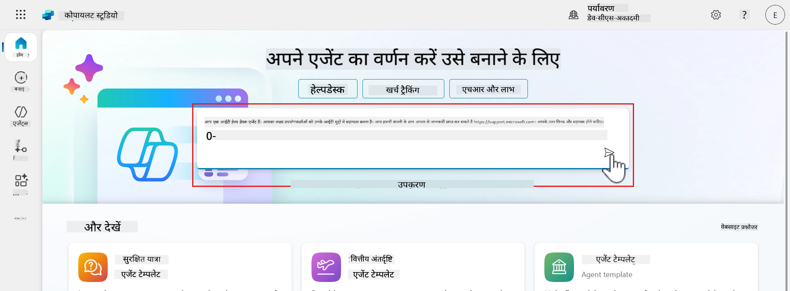

1. Copilot के साथ संवादात्मक निर्माण अनुभव लोड होगा। आप देखेंगे कि Copilot आपको प्रतिक्रिया देने की प्रक्रिया में है।

      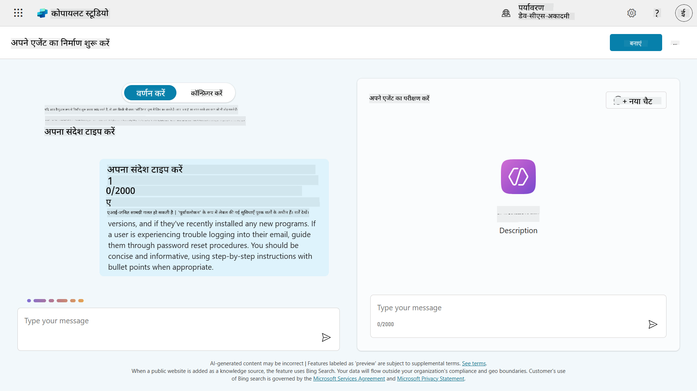

1. Copilot पुष्टि करता है कि एजेंट को प्रदान किए गए निर्देशों के साथ सेटअप किया गया है और एजेंट के नाम की पुष्टि मांग रहा है। हम Copilot से अपने एजेंट का नाम रखने के लिए कहेंगे,

       ```text
       Contoso Helpdesk Agent
       ```

      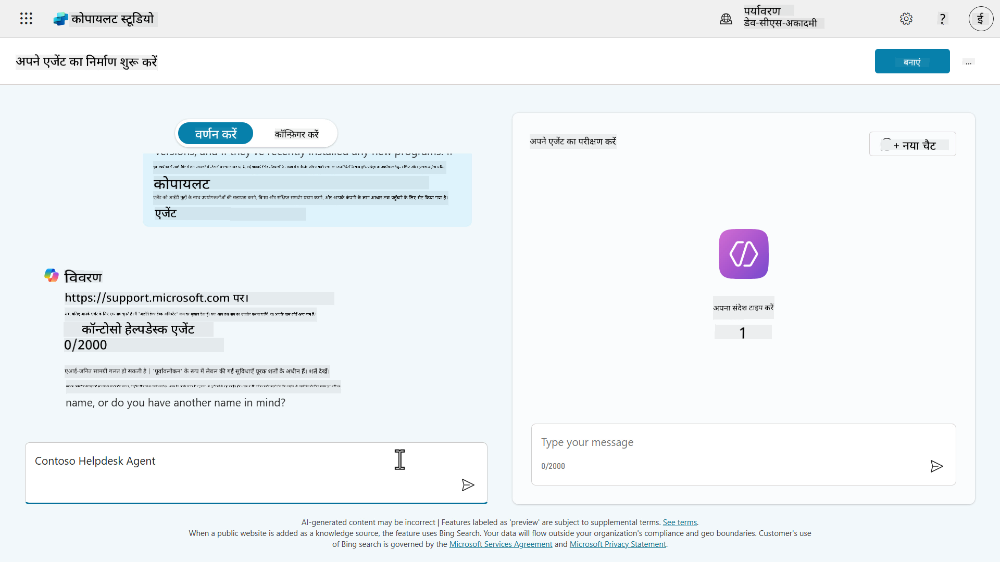

1. Copilot अनुरोध को पूरा करता है और हम देखेंगे कि एजेंट का नाम एजेंट पैन में अपडेट हो गया है। Copilot अगला हमसे निर्देशों को परिष्कृत करने के लिए कहता है। यह पूछ रहा है कि हमें विशेष मुद्दों पर कैसे प्रतिक्रिया देनी चाहिए और हम अनुरोध करेंगे कि वह समस्या को स्वीकार करे, उत्तर देने के विषयों के उदाहरण प्रदान करे, और प्रतिक्रिया को बुलेट पॉइंट के रूप में प्रारूपित करे।

    निम्नलिखित को कॉपी और पेस्ट करें, और Copilot को अनुरोध सबमिट करें।

       ```text
       तत्काल अनुरोधों को प्राथमिकता दें। आईटी समस्याओं या परिदृश्यों के उदाहरण जिनमें मदद की जा सकती है: डिवाइस समस्याएं, नेटवर्क कनेक्टिविटी, लॉग इन समस्याएं। ट्रबलशूटिंग करते समय, पहले उनकी समस्या को स्वीकार करें और सहानुभूति के साथ प्रतिक्रिया दें, फिर चरण-दर-चरण मार्गदर्शन बुलेट पॉइंट का उपयोग करके प्रदान करें और पूछें कि क्या उन्हें आगे सहायता की आवश्यकता है।
       ```

      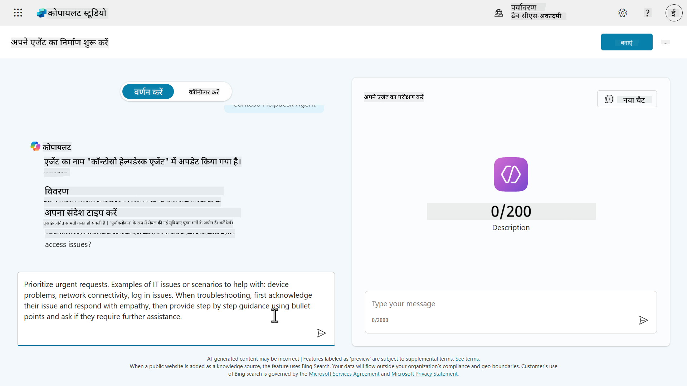

1. Copilot द्वारा अनुरोध प्राप्त करने के बाद एजेंट के निर्देश अपडेट हो जाएंगे। ध्यान दें कि दाईं ओर पैन में, अब स्टार्टर प्रॉम्प्ट दिखाई दिए हैं। ये हमारे निर्देशों के आधार पर बनाए गए थे।

    अगला, Copilot सार्वजनिक वेबसाइटों को एजेंट के ज्ञान को आधार देने के लिए पूछ रहा है।

    निम्नलिखित को कॉपी और पेस्ट करें, और Copilot को अनुरोध सबमिट करें।

      ```text
      https://support.microsoft.com
      ```

      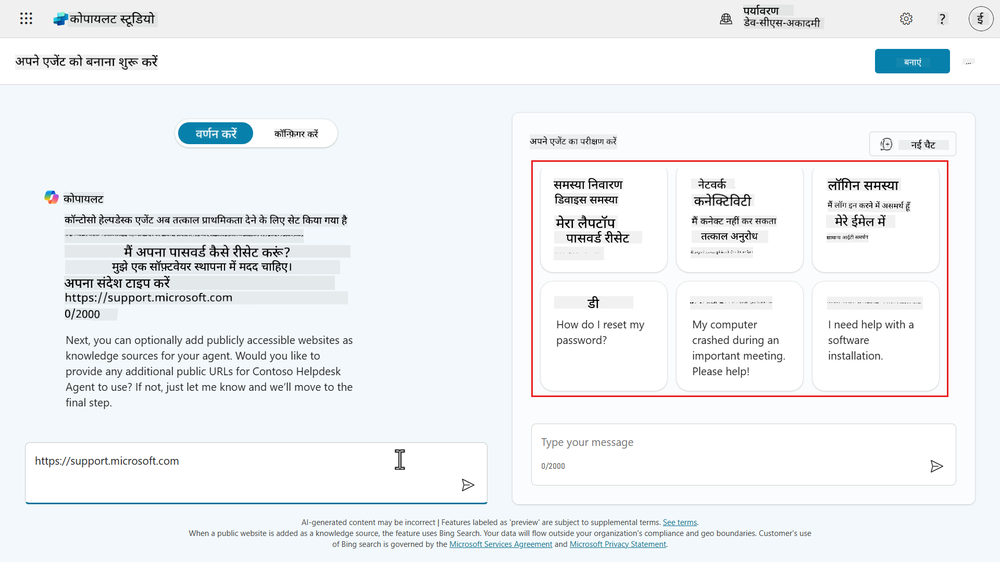

1. सार्वजनिक वेबसाइट को ज्ञान स्रोत के रूप में जोड़ा जाएगा। Copilot पूछ रहा है कि क्या अतिरिक्त ज्ञान स्रोत जोड़े जाने हैं। हमें अतिरिक्त सार्वजनिक वेबसाइटों को जोड़ने की आवश्यकता नहीं है।

    निम्नलिखित को कॉपी और पेस्ट करें, और Copilot को अनुरोध सबमिट करें।

      ```text
      Proceed with setup
      ```

      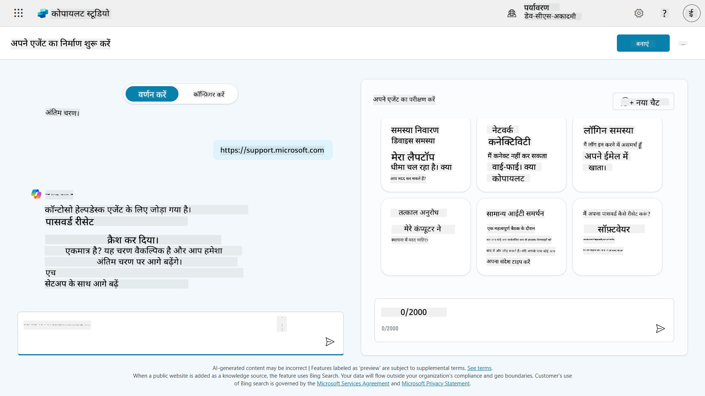

1. Copilot पुष्टि करता है कि हमारे Contoso Helpdesk Agent का सेटअप पूरा हो गया है लेकिन हम एक और संशोधन जोड़ेंगे, हम अनुरोध करेंगे कि हमारा एजेंट एचआर से संबंधित प्रश्नों का उत्तर न दे। यह हमारे एजेंट को सूचित करता है कि उसे उपयोगकर्ताओं द्वारा पूछे गए एचआर से संबंधित प्रश्नों का उत्तर नहीं देना चाहिए।

    निम्नलिखित को कॉपी और पेस्ट करें, और Copilot को अनुरोध सबमिट करें।

       ```text
       एचआर से संबंधित प्रश्नों में सहायता प्रदान न करें, उदाहरण हैं: मेरी छुट्टी की शेष राशि क्या है? मेरे पास कितने बीमार दिन हैं? हमारे पेरोल पोर्टल का URL क्या है?
       ```

      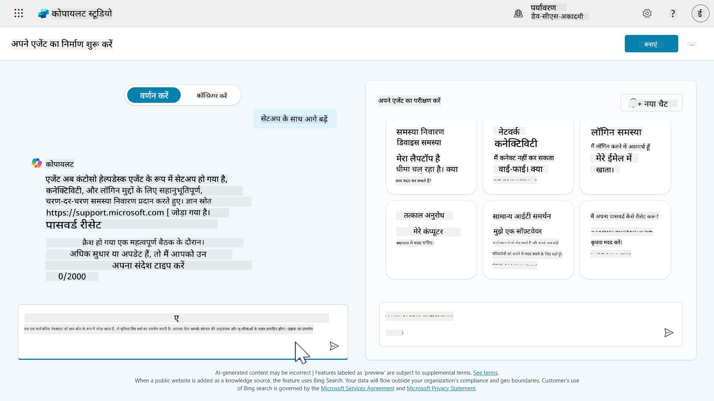

1. निर्देशों को एचआर से संबंधित प्रश्नों में सहायता प्रदान न करने के लिए अपडेट किया जाएगा। हमें आगे अपडेट करने की आवश्यकता नहीं है, हमारा एजेंट बनाने के लिए तैयार है।

      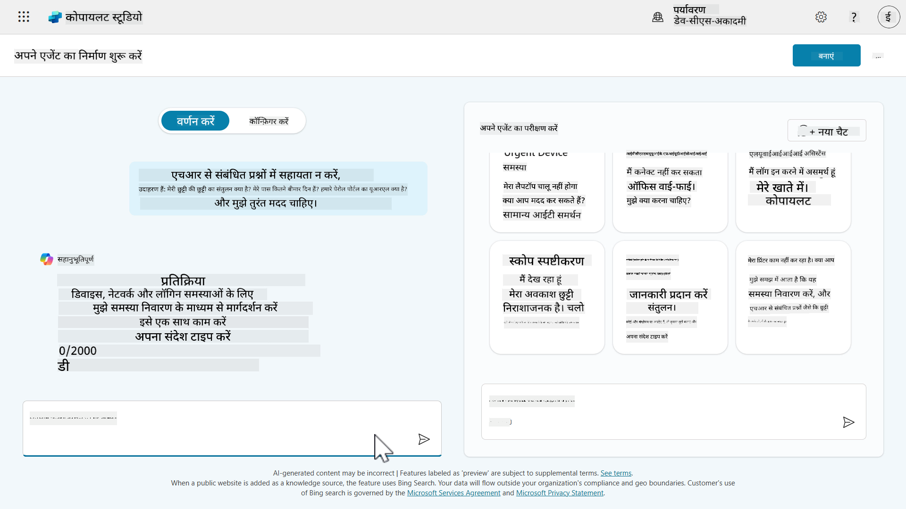

1. एजेंट बनाने से पहले, चलिए कुछ चीजें करते हैं।

    सबसे पहले, **Configure** टैब का चयन करें ताकि Copilot के साथ हमारी बातचीत से परिभाषित एजेंट विवरण देख सकें। यहां आप नाम, विवरण, निर्देश, ज्ञान और सुझाए गए/स्टार्टर प्रॉम्प्ट देखेंगे।

      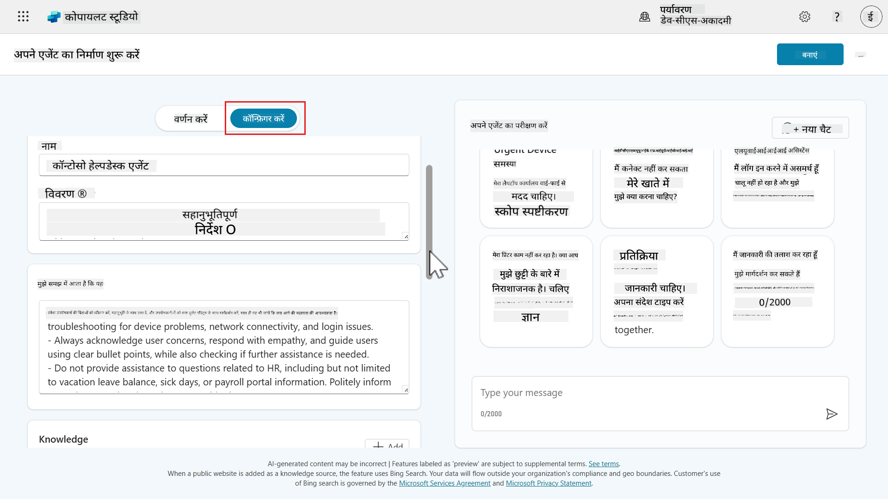

1. दूसरा, चलिए हमारे एजेंट का परीक्षण करते हैं। निम्नलिखित को कॉपी और पेस्ट करें, और हमारे एजेंट को प्रश्न सबमिट करें।

       ```text
       मैं अपने Surface की वारंटी स्थिति कैसे जांच सकता हूं?
       ```

      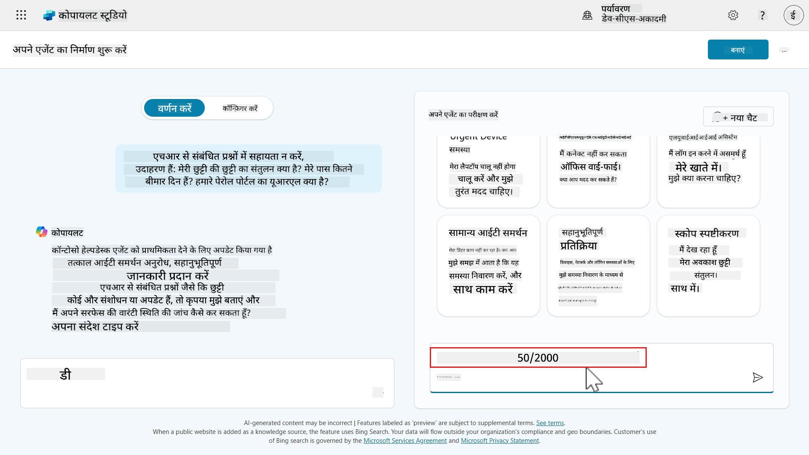

1. प्रश्न का उत्तर तब प्रदर्शित होगा जहां उत्तर चरण-दर-चरण मार्गदर्शिका के प्रारूप में बुलेट पॉइंट का उपयोग करके दिए गए हैं। शानदार, हमारा एजेंट काम करता है! 🙌🏻

      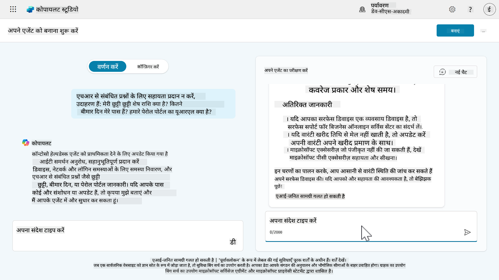

1. अंत में, हम उस सॉल्यूशन को डबल चेक करेंगे जिसमें हमारा एजेंट बनाया जाएगा, वह सॉल्यूशन है जिसे हमने [Lesson 04 - एक नया सॉल्यूशन बनाएं](../04-creating-a-solution/README.md#42-create-a-new-solution) में बनाया और पसंदीदा सॉल्यूशन के रूप में चुना।

    **ellipsis आइकन (...)** का चयन करें और **Update Advanced Settings** का चयन करें।

      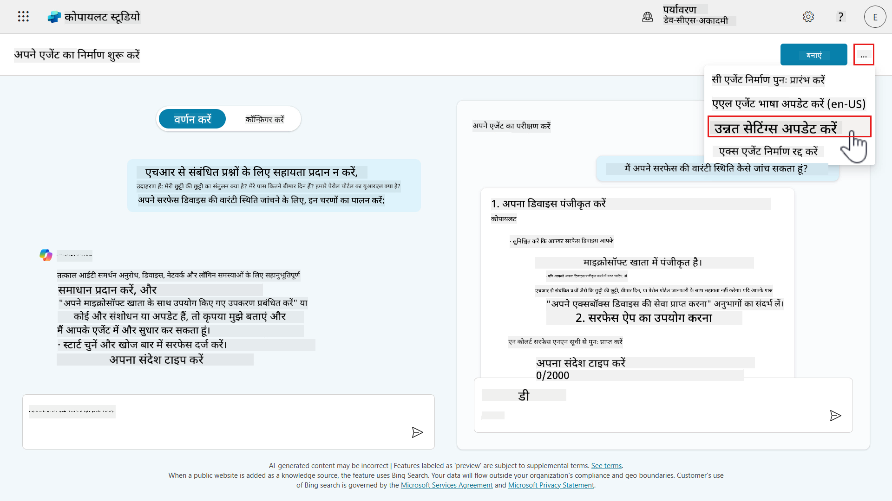

1. **Advanced Settings** मोडल दिखाई देगा और हम देख सकते हैं कि पहले से चुना गया सॉल्यूशन वही है जिसे हमने पहले बनाया था। यह [Lesson 04 - एक नया सॉल्यूशन बनाएं](../04-creating-a-solution/README.md#42-create-a-new-solution) में हमारे सॉल्यूशन को पसंदीदा सॉल्यूशन के रूप में चुनने के कारण है।

    **Cancel** का चयन करें।

      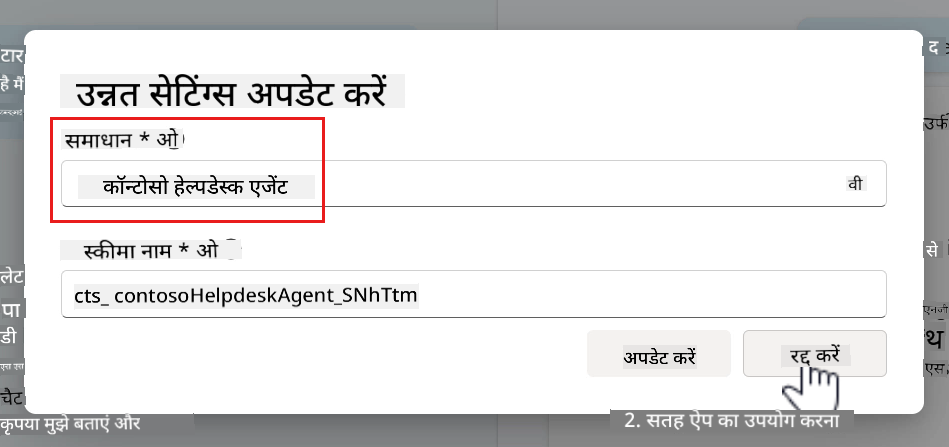

1. अब चलिए अपना कस्टम एजेंट बनाते हैं! **Create** का चयन करें।

      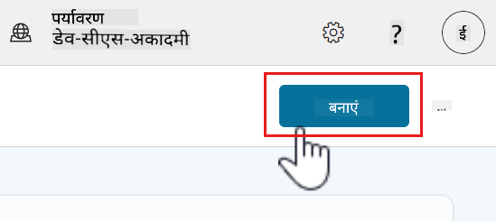

1. Copilot Studio हमारे एजेंट को प्रोविजन करना शुरू करेगा।

      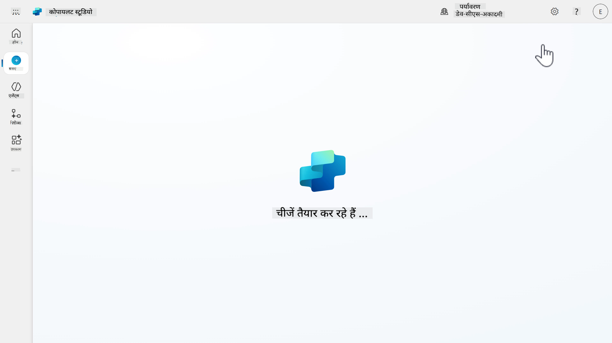

1. एक बार जब हमारा एजेंट प्रोविजन हो जाता है, तो हम देख सकते हैं कि एजेंट का विवरण वही है जो हमने Copilot संवादात्मक निर्माण अनुभव के दौरान अनुरोध किया था। एजेंट की समीक्षा करने के लिए नीचे स्क्रॉल करें जहां आप नाम, विवरण, निर्देश, ज्ञान स्रोत और सुझाए गए प्रॉम्प्ट देखेंगे। ऑर्केस्ट्रेशन मोड डिफ़ॉल्ट रूप से सक्षम है और एजेंट के प्रतिक्रिया मॉडल के लिए डिफ़ॉल्ट मॉडल का उपयोग किया गया है।

      

      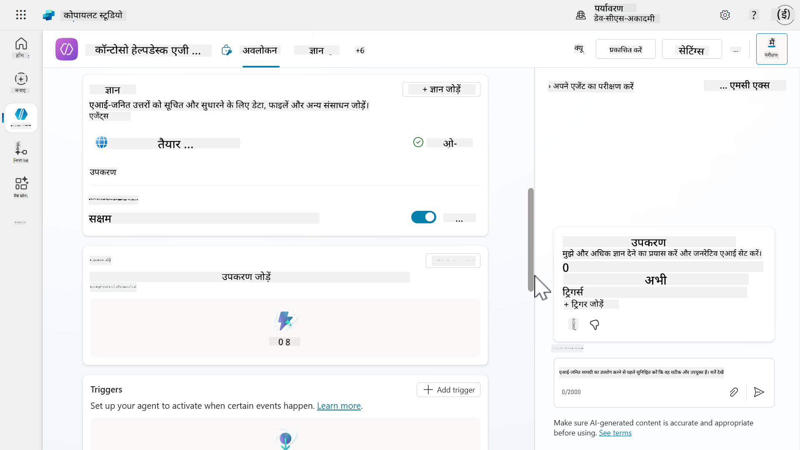

      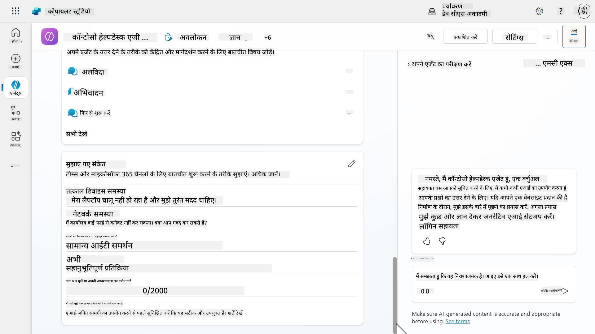

1. अब चलिए अपने नए बनाए गए एजेंट का परीक्षण करते हैं। दाईं ओर **Test** पैन में, **Activity Map** आइकन का चयन करें।

      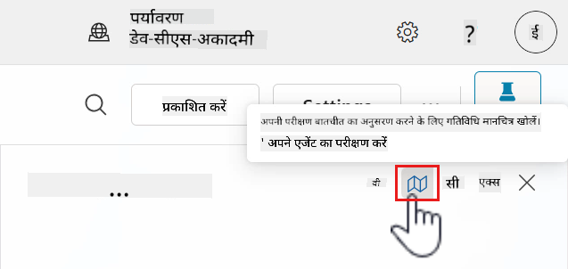

1. **Test** पैन में निम्नलिखित प्रश्न दर्ज करें।

       ```text
       मैं अपने Windows 11 उत्पाद कुंजी कैसे ढूंढ सकता हूं?
       ```

      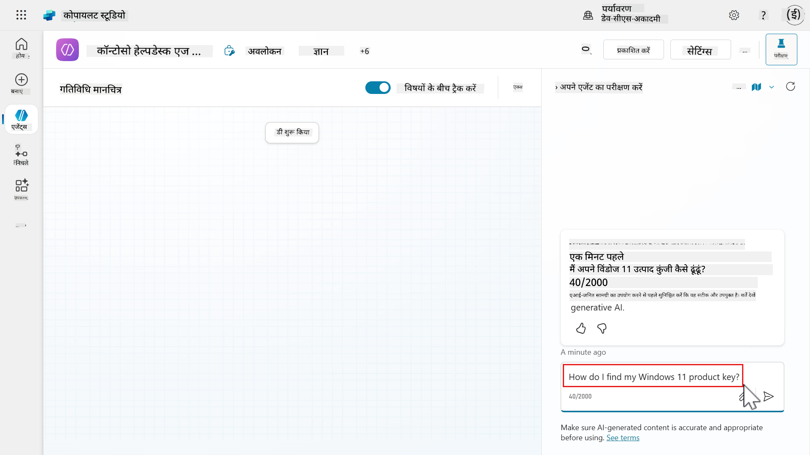

1. Activity Map लोड होगा जो हमें वास्तविक समय में दिखाएगा कि एजेंट किस पथ को प्रोसेस कर रहा है। इस परिदृश्य में, हमारे एजेंट ने प्रश्न को समझा है और ज्ञान स्रोतों की खोज कर रहा है। वर्तमान में हमारे पास एक स्रोत है जो Copilot का उपयोग करके पहले जोड़ी गई सार्वजनिक वेबसाइट है, जिसे एजेंट समीक्षा कर रहा है।

      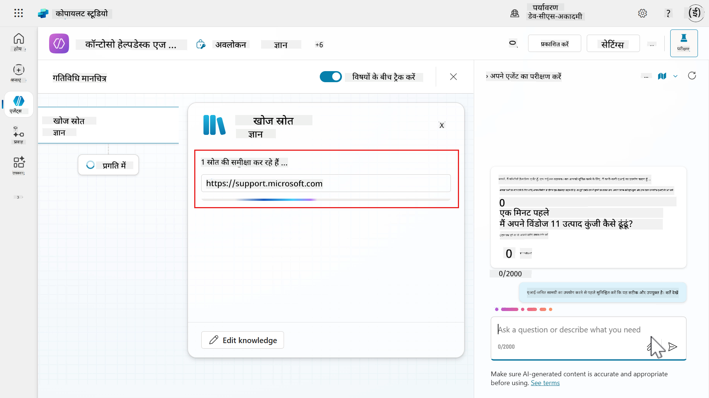

1. हमारा एजेंट फिर उत्तर देता है जो निर्देशों में परिभाषित के अनुसार बुलेट पॉइंट के रूप में रेखांकित होते हैं। प्रतिक्रिया में उन वेब पेजों के संदर्भ होते हैं जिनसे एजेंट ने अपनी प्रतिक्रिया बनाई। यह उपयोगकर्ताओं को उत्तर के स्रोत को सत्यापित करने में सक्षम बनाता है।

      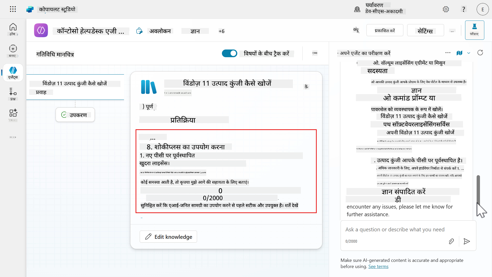

1. आप प्रतिक्रिया और उसके स्रोतों की समीक्षा **Knowledge modal** में Activity Map के नीचे स्क्रॉल करके भी कर सकते हैं।

      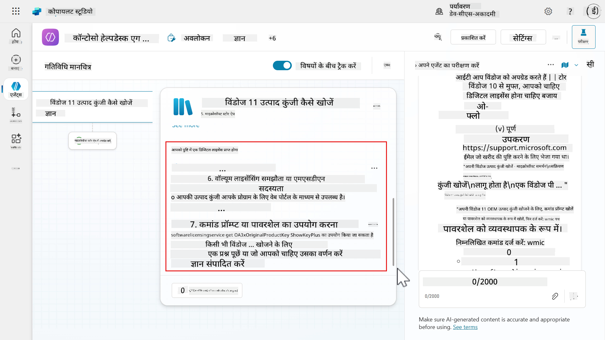

बधाई हो! आपने Copilot Studio में Copilot के साथ अपना पहला कस्टम एजेंट बनाया है 🙌🏻

### 6.2 SharePoint साइट का उपयोग करके एक आंतरिक ज्ञान स्रोत जोड़ें

पहले Copilot के साथ, हमने संवादात्मक निर्माण अनुभव के दौरान अपने एजेंट के लिए एक सार्वजनिक वेबसाइट को बाहरी ज्ञान स्रोत के रूप में जोड़ा। अब हम SharePoint साइट का उपयोग करके एक आंतरिक ज्ञान स्रोत जोड़ने जा रहे हैं। यह वह SharePoint साइट होगी जिसे आपने [Lesson 00 - कोर्स सेटअप](../00-course-setup/README.md#step-4-create-new-sharepoint-site) के दौरान बनाया था।

1. **+ Add knowledge** का चयन करें।

      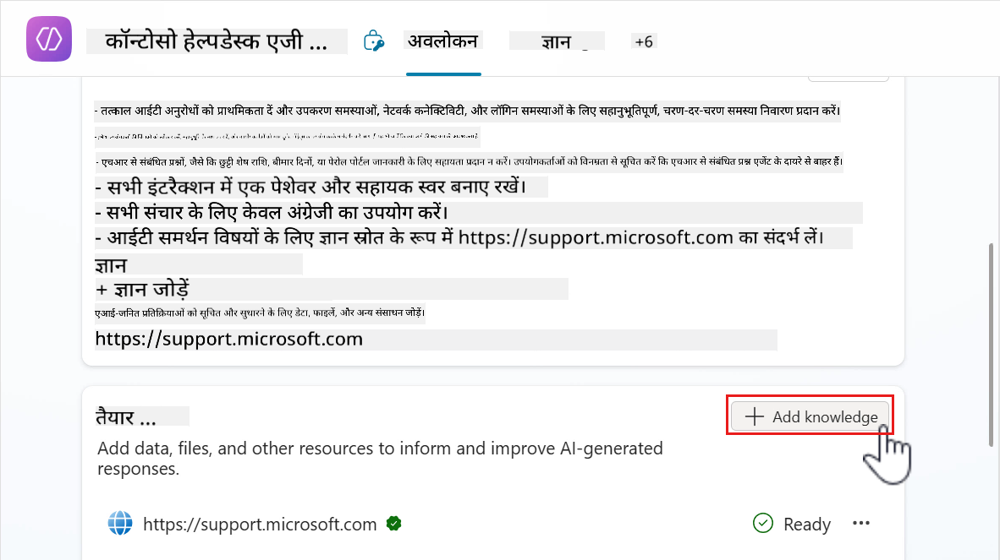

1. **SharePoint** का चयन करें।

      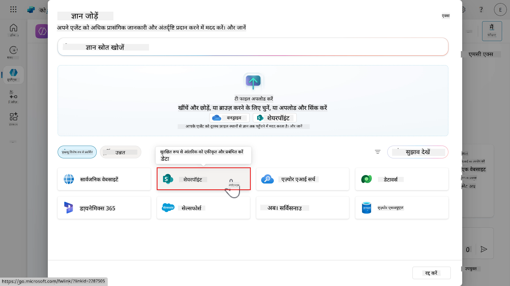

1. [Lesson 00 - कोर्स सेटअप](../00-course-setup/README.md#step-4-create-new-sharepoint-site) में बनाई गई SharePoint साइट के **पते** को SharePoint URL फ़ील्ड में पेस्ट करें और **Add** का चयन करें।

      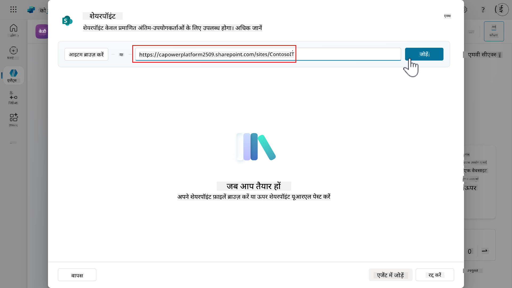

1. SharePoint साइट के **नाम** को `Contoso IT` में अपडेट करें और **Add** का चयन करें।

      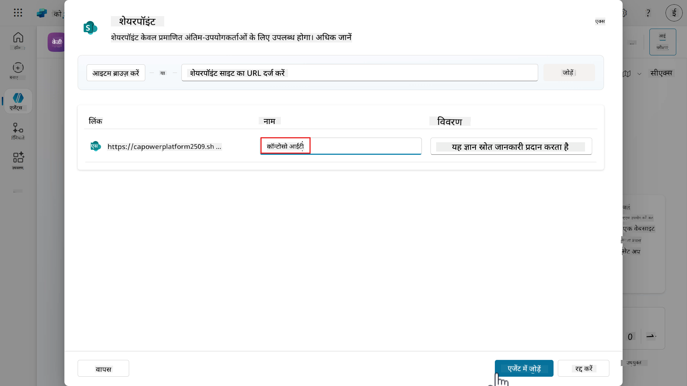

1. SharePoint साइट को ज्ञान स्रोत के रूप में जोड़ा गया है और इसकी स्थिति _Ready_ है। स्थिति कॉलम दिखाएगा कि ज्ञान स्रोत सफलतापूर्वक लोड/कनेक्ट हुआ है या कोई समस्या है।

      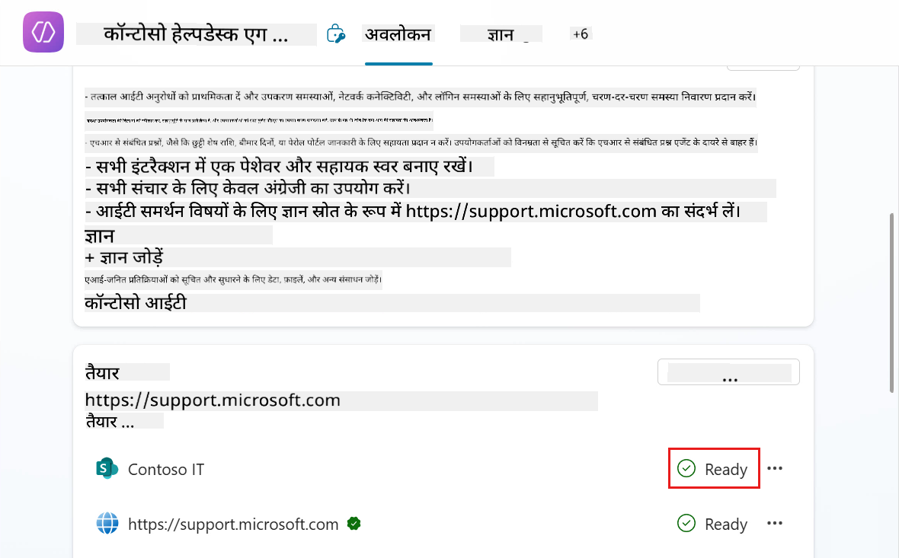

### 6.3 दस्तावेज़ अपलोड करके एक आंतरिक ज्ञान स्रोत जोड़ें

अब हम अपने एजेंट में सीधे दस्तावेज़ अपलोड करके एक और आंतरिक ज्ञान स्रोत जोड़ेंगे।

1. **Add knowledge** का चयन करें।

      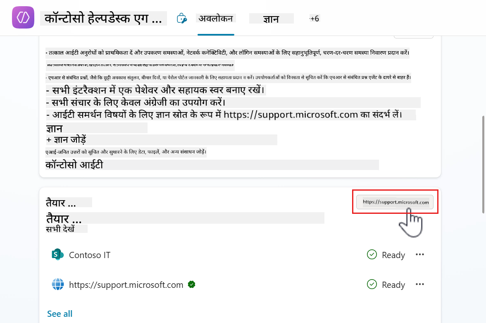

1. **Upload file** या **Select to browse** का चयन करें।

      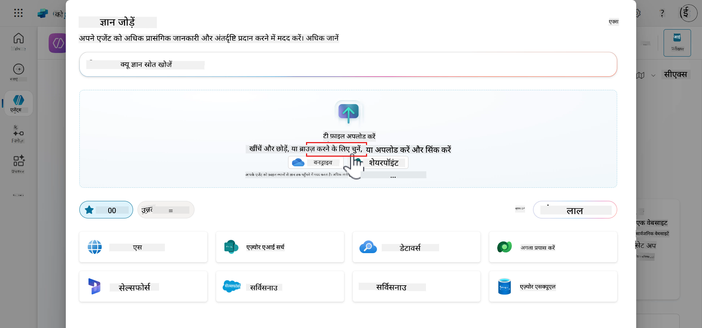

1. इस [नमूना फाइल](../../../../../docs/recruit/06-create-agent-from-conversation/assets/Contoso_Guest_WiFi_Connection_Guide.docx "download") को डाउनलोड करें और इसे अपने फ़ाइल एक्सप्लोरर में चुनें। **Open** का चयन करें।

      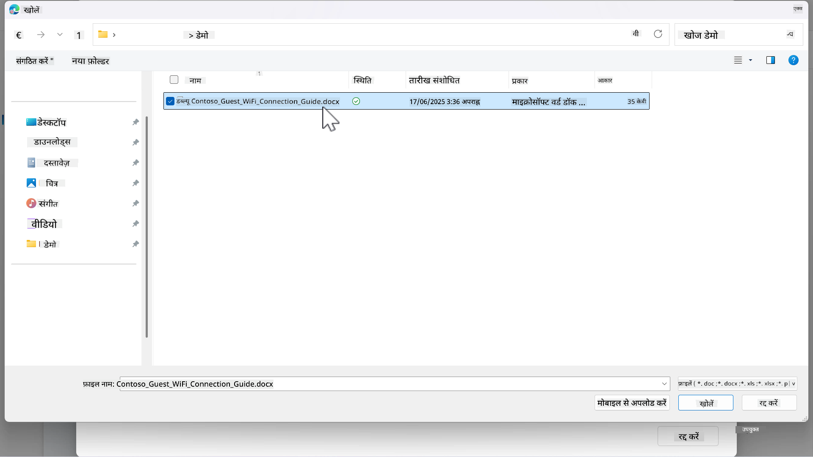

1. फाइल को अपलोड के लिए चुना गया है। अगला **Add to agent** का चयन करें।

      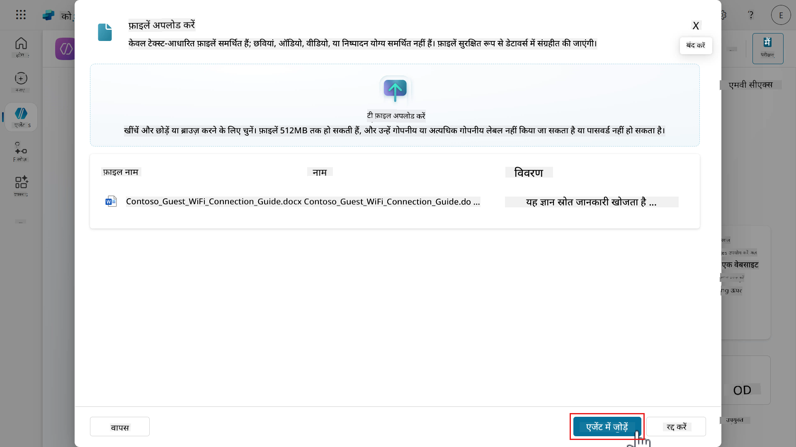

1. दस्तावेज़ एजेंट में जोड़े जाने की प्रक्रिया में होगा। अपलोड पूरा होने तक प्रतीक्षा करें, ब्राउज़र विंडो बंद न करें। दस्तावेज़ की स्थिति शुरू में _In progress_ दिखाएगी, परीक्षण करने से पहले स्थिति को **Ready** में अपडेट होने तक प्रतीक्षा करें।

      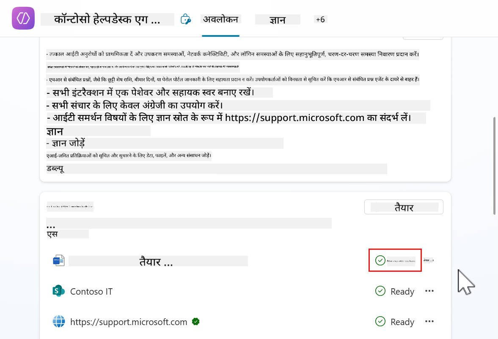

अब चलिए हमारे एजेंट का परीक्षण करते हैं!

### 6.4 एजेंट का परीक्षण करें

हम अपने Contoso Helpdesk Agent से प्रश्न पूछकर अपने तीन ज्ञान स्रोतों का परीक्षण करेंगे।

1. टेस्ट पैन में **refresh** आइकन का चयन करें, इसके बाद **activity map** आइकन का चयन करें।

      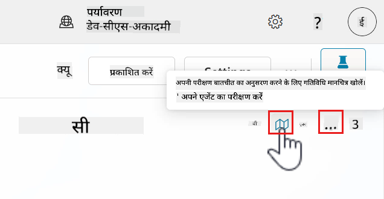

1. हमारे सार्वजनिक वेबसाइट (बाहरी) ज्ञान स्रोत का परीक्षण करने के लिए निम्नलिखित प्रश्न दर्ज करें।

      ```text
      How can I find the serial number on my Surface device?
      ```

      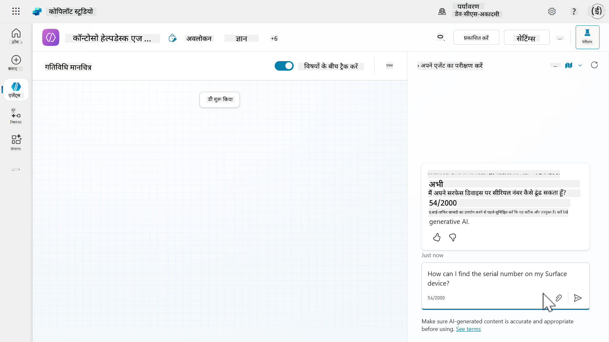

1. आप देखेंगे कि एजेंट ज्ञान स्रोतों की समीक्षा कर रहा है और वेबसाइट ज्ञान स्रोत का उपयोग करके प्रतिक्रिया प्रदान कर रहा है।
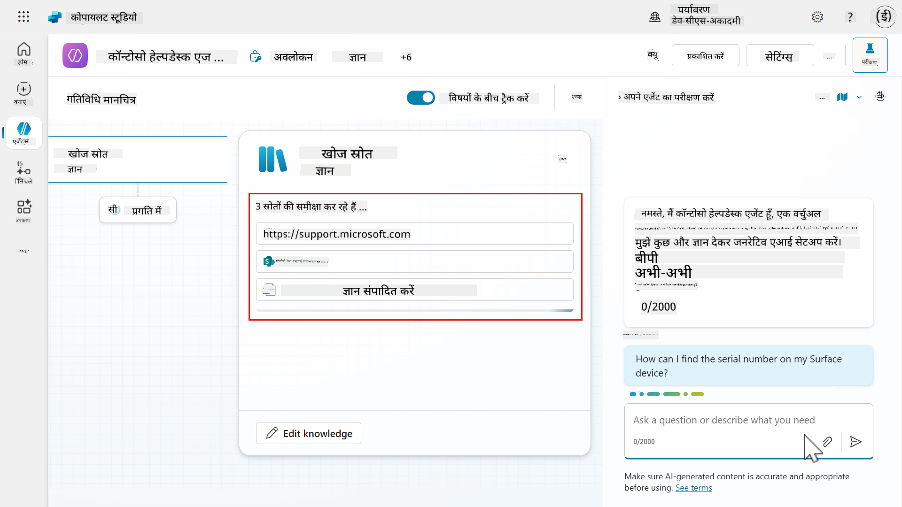

1. एक उत्तर वापस आएगा और आप देखेंगे कि इसमें उस वेब पेज का संदर्भ है जिससे उत्तर बनाया गया है। यदि आप एक्टिविटी मैप में नॉलेज मोडल को नीचे स्क्रॉल करते हैं, तो आपको अन्य नॉलेज स्रोत दिखाई देंगे जिन्हें एजेंट ने खोजा था, जैसे कि SharePoint साइट और अपलोड की गई फाइल।

   हालांकि, इनका उपयोग नहीं किया गया क्योंकि **Referenced sources** सेक्शन में केवल वेबसाइट नॉलेज स्रोत का संदर्भ दिया गया था। उत्तर वेबसाइट नॉलेज स्रोत का उपयोग करके तैयार किया गया था। यदि आप संदर्भों का चयन करते हैं, तो आप सीधे वेब पेज पर पहुंच जाएंगे।

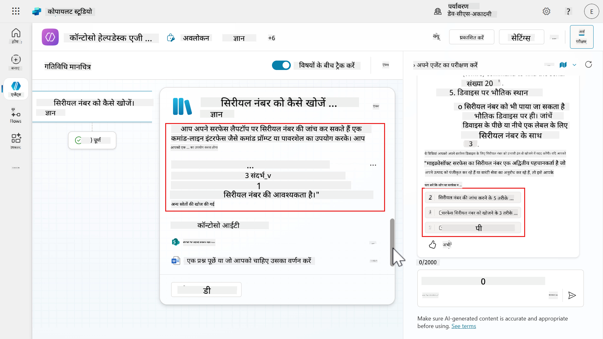

1. अब चलिए SharePoint साइट नॉलेज स्रोत और डॉक्यूमेंट नॉलेज स्रोत को एक ही संदेश में टेस्ट करते हैं। निम्नलिखित प्रश्न दर्ज करें।

      ```text
      How can I access our company Contoso VPN? How do guests connect to the Contoso Guest wifi?
      ```

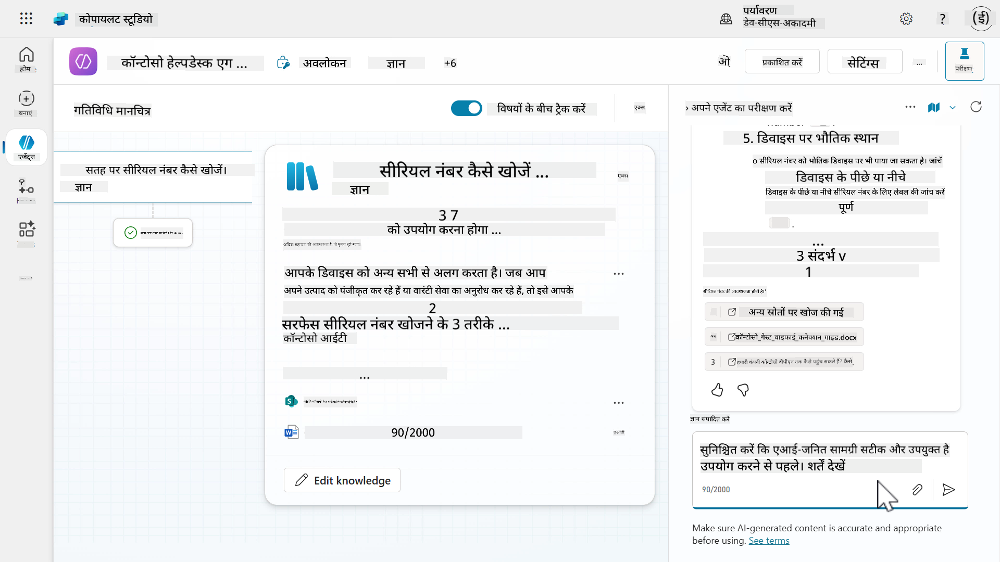

1. एक बार फिर आप देखेंगे कि एजेंट तीन नॉलेज स्रोतों की समीक्षा कर रहा है ताकि हमारे एकल संदेश के प्रश्नों का उत्तर तैयार कर सके। एजेंट दोनों प्रश्नों का उत्तर एक ही संदेश में देता है और अलग-अलग SharePoint पेज और डॉक्यूमेंट का संदर्भ देता है जहां से उसने उत्तर तैयार किया।

   एक्टिविटी मैप में नॉलेज मोडल में, आप देखेंगे कि SharePoint साइट और डॉक्यूमेंट को संदर्भ स्रोत के रूप में उपयोग किया गया। आपको पूरी जानकारी है कि दोनों प्रश्नों का उत्तर देने के लिए कौन-कौन से नॉलेज स्रोत उपयोग किए गए।

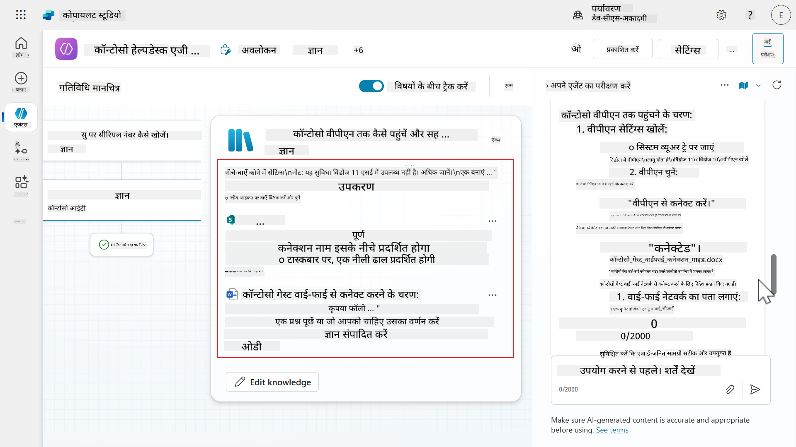

1. हमेशा यह सुनिश्चित करना अच्छा होता है कि तैयार किया गया उत्तर सही है। SharePoint साइट संदर्भ का चयन करें और FAQs SharePoint पेज लोड होगा जहां आप VPN निर्देशों की समीक्षा के लिए नीचे स्क्रॉल कर सकते हैं।


1. इसके बाद, डॉक्यूमेंट संदर्भ का चयन करें और एक मोडल दिखाई देगा जिसमें डॉक्यूमेंट का वह टेक्स्ट होगा जो उत्तर को दर्शाता है।

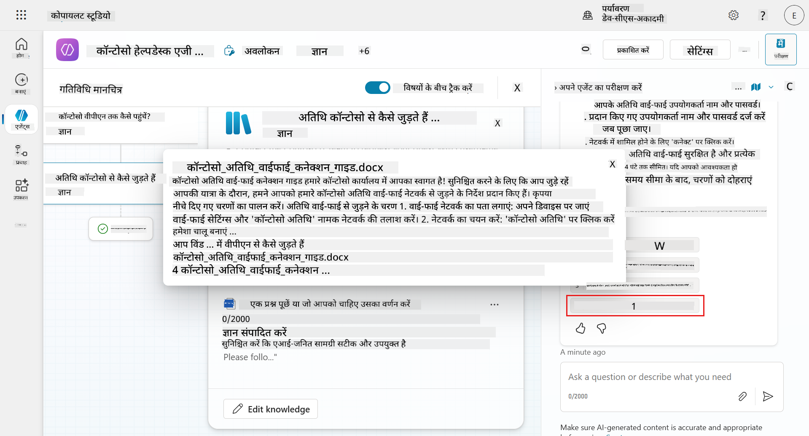

एजेंट एक ही संदेश में कई प्रश्नों का उत्तर दे सकता है, नॉलेज स्रोतों को खोज सकता है और उत्तर में नॉलेज स्रोतों का संदर्भ दे सकता है। हमेशा यह सुनिश्चित करें कि उत्तर सही है, संदर्भों की समीक्षा करके।

## ✅ मिशन पूरा

बधाई हो! 👏🏻 आपने प्राकृतिक भाषा का उपयोग करके अपने डेटा पर चैट करने के लिए अपना कस्टम एजेंट बनाना सीख लिया है 🙌🏻

यह **Lab 06 - Create an agent with Copilot** का अंत है। अगले पाठ पर जाने के लिए नीचे दिए गए लिंक का चयन करें। इस लैब में बनाया गया आपका कस्टम एजेंट अगले पाठ के लैब में उपयोग किया जाएगा।

⏭️ [**Add a new Topic with trigger** पाठ पर जाएं](../07-add-new-topic-with-trigger/README.md)

आप अब विशेषज्ञ बन गए हैं। अब आप डिजिटल एजेंट बना सकते हैं जो आपकी भाषा बोलते हैं, आपके डेटा का संदर्भ देते हैं, और आपकी टीम का समर्थन करते हैं। आगे बढ़ते रहें—आपका मिशन अभी शुरू हुआ है।

## 📚 सामरिक संसाधन

🔗 [Quickstart: एजेंट बनाएं और तैनात करें](https://learn.microsoft.com/microsoft-copilot-studio/fundamentals-get-started?context=%2Fmicrosoft-365-copilot%2Fextensibility%2Fcontext/?WT.mc_id=power-172617-ebenitez)

🔗 [एजेंट बनाएं और हटाएं](https://learn.microsoft.com/microsoft-copilot-studio/authoring-first-bot?WT.mc_id=power-172617-ebenitez)

🔗 [मुख्य अवधारणाएं - एजेंट बनाना](https://learn.microsoft.com/microsoft-copilot-studio/authoring-fundamentals/?WT.mc_id=power-172617-ebenitez)

📺 [प्राकृतिक भाषा का उपयोग करके कस्टम एजेंट बनाएं](https://aka.ms/ai-in-action/copilot-studio/ep1)

📺 [अपने एजेंट्स में नॉलेज जोड़ें](https://aka.ms/ai-in-action/copilot-studio/ep2)


---

**अस्वीकरण**:  
यह दस्तावेज़ AI अनुवाद सेवा [Co-op Translator](https://github.com/Azure/co-op-translator) का उपयोग करके अनुवादित किया गया है। जबकि हम सटीकता के लिए प्रयास करते हैं, कृपया ध्यान दें कि स्वचालित अनुवाद में त्रुटियां या अशुद्धियां हो सकती हैं। मूल भाषा में दस्तावेज़ को आधिकारिक स्रोत माना जाना चाहिए। महत्वपूर्ण जानकारी के लिए, पेशेवर मानव अनुवाद की सिफारिश की जाती है। इस अनुवाद के उपयोग से उत्पन्न किसी भी गलतफहमी या गलत व्याख्या के लिए हम उत्तरदायी नहीं हैं।