<!--
CO_OP_TRANSLATOR_METADATA:
{
  "original_hash": "c04b3587170139bc23e3b5cfc24c89ac",
  "translation_date": "2025-10-21T19:05:54+00:00",
  "source_file": "docs/recruit/07-add-new-topic-with-trigger/README.md",
  "language_code": "hi"
}
-->
# 🚨 मिशन 07: ट्रिगर और नोड्स के साथ नया टॉपिक जोड़ें

## 🕵️‍♂️ कोडनेम: `ऑपरेशन स्टे ऑन टॉपिक`

> **⏱️ ऑपरेशन का समय:** `~60 मिनट`

🎥 **वॉकथ्रू देखें**

[](https://www.youtube.com/watch?v=7iPAZaA8nJs "YouTube पर वॉकथ्रू देखें")

## 🎯 मिशन का विवरण

आपने एक एजेंट बनाया है। यह सुनता है, सीखता है, और सवालों के जवाब देता है - लेकिन अब समय है इसे और रणनीतिक बनाने का। इस मिशन में, आप गहराई से समझेंगे और अपने एजेंट को सटीकता के साथ विशेष प्रॉम्प्ट्स का जवाब देना सिखाएंगे।

टॉपिक्स और ट्रिगर्स के साथ, आपका एजेंट कर सकता है:

- इरादे को पहचानना

- लॉजिक के साथ बातचीत को रूट करना

- वेरिएबल्स को इकट्ठा और स्टोर करना

- फ्लो को ट्रिगर करना और कार्रवाई करना

आप केवल संवाद नहीं बना रहे हैं, बल्कि इसके निर्णय लेने वाले केंद्र को जोड़ रहे हैं। स्वागत है न्यूरल नेक्सस में।

## 🔎 उद्देश्य

इस मिशन में, आप सीखेंगे:

1. टॉपिक्स क्या हैं और आपके एजेंट के लिए संरचित बातचीत बनाने में उनकी भूमिका को समझना
1. टॉपिक्स की संरचना को समझना, जिसमें ट्रिगर वाक्यांश और बातचीत के नोड्स शामिल हैं
1. विभिन्न प्रकार के बातचीत नोड्स का पता लगाना और डायनामिक लॉजिक के लिए Power Fx का उपयोग करना
1. विशेष उपयोगकर्ता अनुरोधों और कार्यों को संभालने के लिए कस्टम टॉपिक्स बनाना
1. SharePoint डेटा से कनेक्ट करने के लिए कनेक्टर्स और टूल्स का उपयोग करके एक कार्यात्मक टॉपिक बनाना

## 🤔 टॉपिक क्या है?

एक टॉपिक एक संरचित बातचीत है जो आपके एजेंट को विशेष उपयोगकर्ता सवालों या कार्यों का जवाब देने में मदद करता है। इसे एक मिनी-कन्वर्सेशन या कार्य के रूप में सोचें जिसे आपका एजेंट संभाल सकता है। प्रत्येक टॉपिक विशेष उपयोगकर्ता सवाल या अनुरोध का जवाब देने के लिए डिज़ाइन किया गया है।

### 🌌 टॉपिक का उद्देश्य

उपयोगकर्ताओं की ज़रूरतों के आधार पर टॉपिक्स के तीन सामान्य उद्देश्य होते हैं:

**सूचनात्मक** - सवालों के जवाब देता है जैसे:

- `क्या है …?`
- `कब होगा …?`
- `क्यों …?`
- `क्या आप मुझे बता सकते हैं …?`

**कार्य पूरा करना** - उपयोगकर्ताओं को कुछ _करने_ में मदद करता है:

- `"मैं करना चाहता हूं …"`
- `"मैं कैसे करूं …?"`
- `"मुझे चाहिए …?"`

**समस्या समाधान** - समस्याओं को हल करता है:

- `कुछ काम नहीं कर रहा है …`
- `मुझे एक त्रुटि संदेश मिल रहा है …`
- `मैं कुछ अप्रत्याशित देख रहा हूं …?`

आप अस्पष्ट सवालों के लिए भी टॉपिक्स बना सकते हैं जैसे `मुझे मदद चाहिए`, जो उपयोगकर्ताओं से आगे की जानकारी मांगते हैं।

## 🐦 टॉपिक्स क्यों उपयोगी हैं?

टॉपिक्स आपकी मदद करते हैं,

- आपके एजेंट के ज्ञान को व्यवस्थित करने में।

- बातचीत को प्राकृतिक महसूस कराने में।

- उपयोगकर्ता की समस्याओं को प्रभावी ढंग से हल करने में।

## 🪺 टॉपिक्स के प्रकार

1. **सिस्टम टॉपिक्स** - ये बिल्ट-इन होते हैं और सामान्य घटनाओं को संभालते हैं जैसे:
    - बातचीत शुरू करना
    - बातचीत समाप्त करना
    - त्रुटियों को संभालना
    - उपयोगकर्ताओं से साइन इन करने के लिए कहना
    - मानव एजेंट को एस्केलेट करना

1. **कस्टम टॉपिक्स** - आप इन्हें विशेष कार्यों या सवालों को संभालने के लिए बनाते हैं जैसे:
    - कर्मचारी छुट्टी का अनुरोध
    - नया या रिप्लेसमेंट डिवाइस का अनुरोध

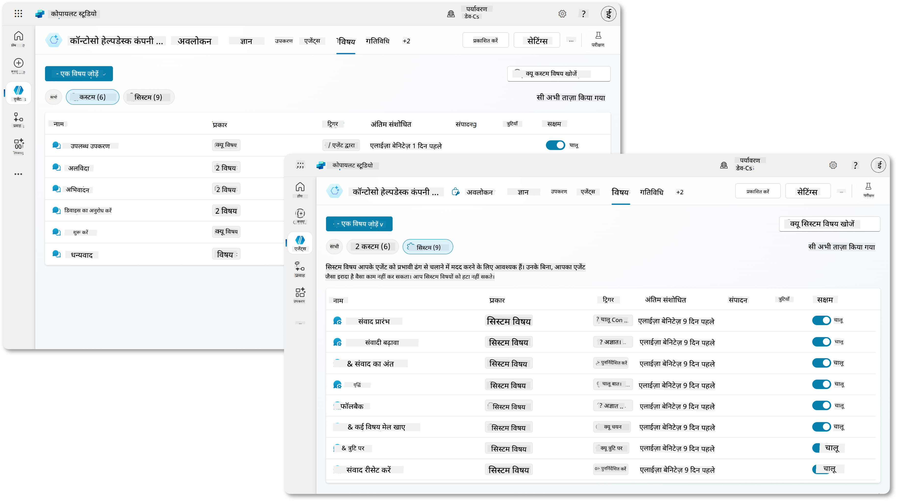

## 🧬 टॉपिक की संरचना

प्रत्येक टॉपिक में आमतौर पर निम्नलिखित होते हैं।

### 🗣️ ट्रिगर वाक्यांश

ये वे शब्द या वाक्य होते हैं जो उपयोगकर्ता टॉपिक शुरू करने के लिए कह सकते हैं।

**उदाहरण:**

छुट्टी के अनुरोध टॉपिक के लिए, ट्रिगर वाक्यांश हो सकते हैं

- `मैं छुट्टी लेना चाहता हूं`
- `छुट्टी का अनुरोध करें`
- `समय की छुट्टी के लिए आवेदन करें`
- `मैं छुट्टी का अनुरोध कैसे करूं?`

डिवाइस अनुरोध टॉपिक के लिए, ट्रिगर वाक्यांश हो सकते हैं

- `मुझे एक नया डिवाइस चाहिए`
- `क्या मैं एक डिवाइस का अनुरोध कर सकता हूं?`
- `क्या आप मुझे डिवाइस अनुरोध में मदद कर सकते हैं`

### 💬 बातचीत के नोड्स

एक टॉपिक नोड्स से बना होता है जो एजेंट द्वारा टॉपिक ट्रिगर होने के बाद फॉलो किए जाने वाले कदम होते हैं। आप इन कदमों को जोड़कर एक बातचीत फ्लो बनाते हैं जिसे आपका एजेंट उपयोगकर्ताओं के साथ बातचीत करते समय फॉलो करता है।

इन्हें निर्देश या क्रियाओं के रूप में सोचें जैसे:

- उपयोगकर्ता से सवाल पूछना
- संदेश भेजना
- छुट्टी प्रबंधन प्रणाली जैसे बाहरी सेवा को कॉल करना
- वेरिएबल्स सेट करना या चेक करना
- बातचीत को ब्रांच करने के लिए कंडीशन्स का उपयोग करना
- दूसरे टॉपिक पर निर्देशित करना

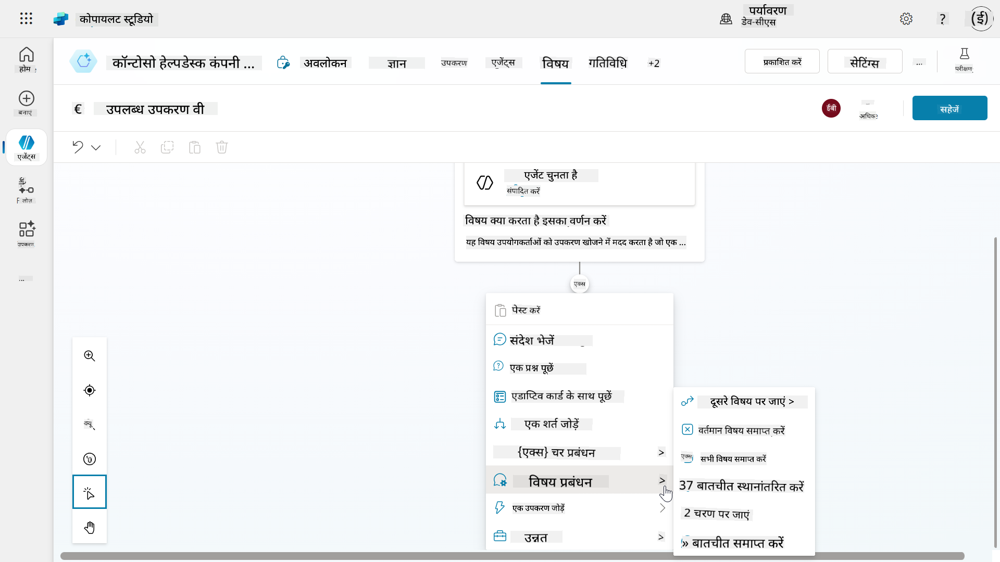

एजेंट में आप निम्नलिखित मुख्य प्रकार के नोड्स जोड़ सकते हैं:

#### संदेश भेजें

- **उद्देश्य** - उपयोगकर्ता को संदेश भेजता है।
- **उदाहरण** - `आपके अनुरोध के लिए धन्यवाद! मैं आपकी मदद करूंगा।`

यह नोड आपके एजेंट को उपयोगकर्ताओं को संदेश भेजने देता है, जो साधारण टेक्स्ट या समृद्ध सामग्री जैसे इमेज, वीडियो, कार्ड, क्विक रिप्लाई और एडैप्टिव कार्ड हो सकते हैं।

आप संदेशों को वेरिएबल्स का उपयोग करके व्यक्तिगत बना सकते हैं, विविधता के लिए कई संदेश वेरिएशन जोड़ सकते हैं, और यहां तक कि वॉयस-इनेबल्ड चैनलों के लिए स्पीच आउटपुट को कस्टमाइज़ कर सकते हैं।

!!! tip
    इसे "कुछ कहें" ब्लॉक के रूप में सोचें जो आपके एजेंट को उपयोगकर्ताओं के साथ स्पष्ट और इंटरैक्टिव तरीके से संवाद करने में मदद करता है।

#### सवाल पूछें

- **उद्देश्य** - उपयोगकर्ता से सवाल पूछता है और उनके जवाब का इंतजार करता है।
- **उदाहरण** - `आपकी छुट्टी की तारीखें क्या हैं?`

यह नोड बातचीत के दौरान उपयोगकर्ताओं से विशिष्ट जानकारी मांगने और उनके जवाबों को बाद में उपयोग के लिए वेरिएबल्स में स्टोर करने के लिए उपयोग किया जाता है।

आप सवाल के प्रकार को कस्टमाइज़ कर सकते हैं जैसे टेक्स्ट इनपुट या उपयोगकर्ताओं द्वारा चुने जाने वाले मानों की परिभाषित सूची के लिए एंटिटी का उपयोग करना, और यह परिभाषित कर सकते हैं कि उपयोगकर्ता द्वारा गलत जवाब देने या सवाल को छोड़ने पर एजेंट को कैसे व्यवहार करना चाहिए।

यह समृद्ध सामग्री जैसे इमेज और क्विक रिप्लाई का समर्थन करता है, और बातचीत को सुचारू रूप से चलाने के लिए वैलिडेशन, रिप्रॉम्प्टिंग और इंटरप्शन सेटिंग्स को फाइन-ट्यून करने देता है।

!!! tip
    इसे "पूछें और सुनें" ब्लॉक के रूप में सोचें जो आपके एजेंट को उपयोगकर्ताओं के साथ संरचित तरीके से बातचीत करने में मदद करता है।

#### एडैप्टिव कार्ड के साथ पूछें

- **उद्देश्य** - JSON का उपयोग करके एक समृद्ध, इंटरैक्टिव कार्ड भेजें।
- **उदाहरण** - एक कार्ड जो उपयोगकर्ता को तारीख चुनने के लिए कैलेंडर डेट पिकर दिखाता है।

यह नोड समृद्ध, इंटरैक्टिव कार्ड दिखाता है जिन्हें उपयोगकर्ता भर सकते हैं और सबमिट कर सकते हैं जैसे टेक्स्ट बॉक्स, बटन, और इमेज वाले फॉर्म। यह उपयोगकर्ता की इनपुट को कैप्चर करता है और इसे वेरिएबल्स में स्टोर करता है, जिसे आपका एजेंट बाद में बातचीत में उपयोग कर सकता है।

!!! tip
    इसे "कस्टमाइज़ेबल फॉर्म बिल्डर" ब्लॉक के रूप में सोचें जो आपके एजेंट को उपयोगकर्ताओं से विस्तृत जानकारी एकत्र करने में अधिक आकर्षक और सक्षम बनाता है।

#### कंडीशन जोड़ें

- **उद्देश्य** - बातचीत में लॉजिक जोड़ें। यह कुछ चेक करता है और तय करता है कि आगे क्या करना है।
- **उदाहरण** - यदि उपयोगकर्ता कहता है `हां`, अगले कदम पर जाएं। यदि `नहीं`, बातचीत समाप्त करें।

यह नोड आपके एजेंट के बातचीत फ्लो में निर्णय बिंदु बनाता है, जो चेक करता है कि वेरिएबल्स कुछ मानदंडों को पूरा करते हैं या नहीं। कंडीशन के सही या गलत होने के आधार पर, एजेंट अलग-अलग रास्तों का अनुसरण करता है।

!!! tip
    इसे "if-else" ब्लॉक के रूप में सोचें जो आपके एजेंट को उपयोगकर्ता इनपुट या वेरिएबल्स में स्टोर किए गए डेटा के आधार पर निर्णय लेने में मदद करता है।

#### वेरिएबल प्रबंधन

- **उद्देश्य** - बातचीत के दौरान जानकारी (जिसे वेरिएबल्स कहा जाता है) को स्टोर या क्लियर करता है।
- **उदाहरण** - उपयोगकर्ता द्वारा चुनी गई तारीख को स्टोर करता है जो एडैप्टिव कार्ड दिखाने वाले सवाल पूछें नोड में है।

यह नोड बातचीत के दौरान जानकारी स्टोर और प्रबंधित करने देता है, यह उपयोगकर्ता का नाम, जवाब, या प्राथमिकताएं हो सकती हैं। आप टेक्स्ट, नंबर, या तारीख जैसे विभिन्न प्रकार के वेरिएबल्स का उपयोग कर सकते हैं, और इन्हें एकल टॉपिक तक सीमित, टॉपिक्स के बीच साझा (ग्लोबल), या सिस्टम या एनवायरनमेंट से खींचा जा सकता है।

!!! tip
    इसे "मेमोरी बॉक्स" के रूप में सोचें जो आपके एजेंट को जानकारी याद रखने और उपयोगकर्ता के साथ बातचीत जारी रखने के दौरान उनका उपयोग करने में मदद करता है।

#### टॉपिक प्रबंधन

- **उद्देश्य** - बातचीत को दूसरे टॉपिक या टॉपिक के भीतर किसी कदम पर ले जाता है, बातचीत को ट्रांसफर करता है, या टॉपिक या बातचीत समाप्त करता है।
- **उदाहरण** - "छुट्टी नीति" टॉपिक पर रीडायरेक्ट करें।

यह नोड आपके एजेंट को बिना बातचीत को फिर से शुरू किए एक टॉपिक से दूसरे टॉपिक पर जाने, टॉपिक समाप्त करने, बातचीत ट्रांसफर करने या समाप्त करने, या उसी टॉपिक के भीतर किसी अन्य कदम पर जाने की अनुमति देता है। यह उपयोगकर्ताओं को बातचीत फ्लो के विभिन्न हिस्सों के माध्यम से मार्गदर्शन करने में मदद करता है, और आप उनके बीच वेरिएबल्स पास कर सकते हैं ताकि संदर्भ बनाए रखा जा सके।

!!! tip
    इसे "दूसरे सेक्शन/कदम पर जाएं" ब्लॉक के रूप में सोचें जो आपके एजेंट को उपयोगकर्ताओं के साथ चैटिंग में लचीलापन प्रदान करता है।

#### टूल जोड़ें

- **उद्देश्य** - कनेक्टर्स, एजेंट फ्लो, प्रॉम्प्ट्स, कस्टम सर्च, सर्च क्वेरी, स्किल्स, मॉडल कॉन्टेक्स्ट प्रोटोकॉल जैसे टूल्स से कनेक्ट करता है।
- **उदाहरण** - उपयोगकर्ता द्वारा उनकी छुट्टी अनुरोध सबमिट करने के बाद एजेंट फ्लो निष्पादित होता है।

यह नोड आपके एजेंट को बाहरी सिस्टम के साथ इंटरैक्ट करने या विशिष्ट कार्य करने की क्षमता देता है, जैसे ईमेल भेजना, मौसम की जानकारी चेक करना, या डेटाबेस तक पहुंचना। आप बिल्ट-इन कनेक्टर्स, कस्टम APIs, एजेंट फ्लो, प्रॉम्प्ट्स का उपयोग करके टूल्स जोड़ सकते हैं, या Model Context Protocol (MCP) सर्वर से कनेक्ट कर सकते हैं, और यहां तक कि _ग्राफिकल यूजर इंटरफेस_ ऑटोमेशन के लिए कंप्यूटर उपयोग टूल के माध्यम से डेस्कटॉप ऐप्स के लिए।

!!! tip
    टूल्स को "एक्शन ब्लॉक" के रूप में सोचें जो आपके एजेंट को _चैटिंग_ से परे चीजें करने की सुपरपावर देता है, जैसे API कॉल करना, प्रक्रिया चलाना, या उपयोगकर्ता इनपुट को स्वचालित रूप से इकट्ठा करना।

#### जनरेटिव उत्तर नोड

- **उद्देश्य** - उपयोगकर्ता के सवाल और किसी भी कनेक्टेड डेटा के आधार पर प्राकृतिक, मानव-जैसे उत्तर उत्पन्न करने के लिए बड़े भाषा मॉडल का उपयोग करता है।
- **उदाहरण** - कनेक्टेड ज्ञान स्रोत का उपयोग करता है जिसमें छुट्टी के अधिकारों के बारे में जानकारी होती है ताकि उपयोगकर्ता के छुट्टी अनुरोधों के बारे में सवालों का जवाब दिया जा सके।

यह नोड आपके एजेंट को विभिन्न ज्ञान स्रोतों जैसे वेबसाइट, दस्तावेज़, SharePoint, या कस्टम डेटा से जानकारी का उपयोग करके उपयोगकर्ता के सवालों का जवाब देने में सक्षम बनाता है। इसे तब उपयोग किया जा सकता है जब कोई मिलान करने वाला टॉपिक न मिले, या टॉपिक के भीतर अधिक विस्तृत, डायनामिक उत्तर प्रदान करने के लिए जिसे आपने अपने एजेंट को उपयोग करने के लिए कॉन्फ़िगर किया है।

!!! tip
    इसे "स्मार्ट उत्तर ब्लॉक" के रूप में सोचें जो आपके एजेंट को उपयोगकर्ता को सहायक, सटीक उत्तर देने में मदद करता है, जिसे आपने परिभाषित किए गए विश्वसनीय सामग्री को खोजकर प्रदान किया है।

#### HTTP अनुरोध नोड

- **उद्देश्य** - API कॉल (जैसे `GET` या `POST`) भेजकर बाहरी सिस्टम से कनेक्ट करता है ताकि डेटा प्राप्त या अपडेट किया जा सके।
- **उदाहरण** - जब उपयोगकर्ता अपने छुट्टी दिनों के बैलेंस के लिए पूछता है, तो एजेंट छुट्टी प्रबंधन प्रणाली को `GET` अनुरोध करता है और API प्रतिक्रिया से `remainingLeaveDays` निकालता है और उपयोगकर्ता को उस मान के साथ जवाब देता है।

यह नोड आपके एजेंट को REST API कॉल भेजकर बाहरी सिस्टम से कनेक्ट करने देता है, जैसे `GET` या `POST` अनुरोध। आप हेडर्स, बॉडी कंटेंट को कस्टमाइज़ कर सकते हैं और यहां तक कि डायनामिक डेटा को शामिल करने के लिए Power Fx का उपयोग कर सकते हैं, फिर प्रतिक्रिया को वेरिएबल्स में स्टोर कर सकते हैं ताकि बातचीत में बाद में इसका उपयोग किया जा सके।

!!! tip
    इसे "जानकारी प्राप्त करें" ब्लॉक के रूप में सोचें जो आपके एजेंट को अन्य सेवाओं से बात करने में मदद करता है जैसे उपयोगकर्ता विवरण प्राप्त करना या किसी अन्य सिस्टम को डेटा भेजना।

#### इवेंट भेजें

- **उद्देश्य** - आपके एजेंट को क्लाइंट या चैनल को सिस्टम अपडेट या टूल ट्रिगर जैसे गैर-संदेश क्रियाएं भेजने देता है, जिससे यह कार्य कर सके।
- **उदाहरण** - उपयोगकर्ता के चैट में शामिल होने पर स्वागत संदेश दिखाना।

यह नोड आपके एजेंट को बाहरी सिस्टम या चैनलों को गैर-संदेश क्रियाएं भेजने देता है, जो फिर तय करते हैं कि कैसे प्रतिक्रिया देनी है। आप प्रत्येक इवेंट को एक नाम देते हैं और एक मान संलग्न करते हैं, जो एक साधारण नंबर या टेक्स्ट, वेरिएबल, या Power Fx फॉर्मूला हो सकता है, और इसे JSON ऑब्जेक्ट के रूप में भेजा जाता है।

!!! tip
    इसे "साइलेंट ट्रिगर" ब्लॉक के रूप में सोचें जो आपके एजेंट को पर्दे के पीछे चीजें करने या उपयोगकर्ता से कुछ कहने की आवश्यकता के बिना बाहरी टूल्स के साथ संवाद करने में मदद करता है।

## 🏋🏻‍♀️ अपने नोड्स में Power Fx का उपयोग करना

Copilot Studio में, Power Fx एक लो-कोड प्रोग्रामिंग भाषा है जिसका उपयोग आपके एजेंट में लॉजिक और डायनामिक व्यवहार जोड़ने के लिए किया जाता है। यह वही भाषा है जो Microsoft Power Apps में उपयोग की जाती है, और इसे सरल और Excel-जैसा डिज़ाइन किया गया है, जिससे यह डेवलपर्स और गैर-डेवलपर्स के लिए आसान हो जाता है।

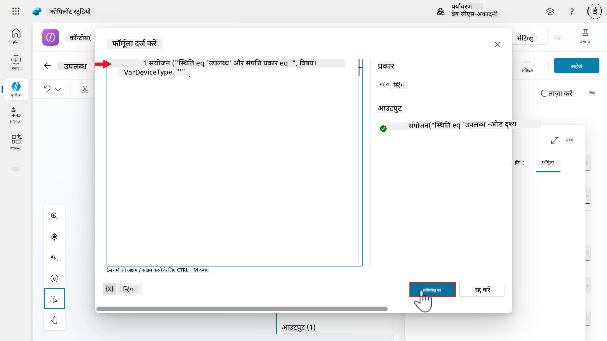

### टॉपिक्स में Power Fx क्या कर सकता है

- वेरिएबल्स सेट और प्रबंधित करें
      - उदाहरण: `Set(userName, "Adele Vance")`
- कंडीशन्स बनाएं
      - उदाहरण: `If(score > 80, "Pass", "Fail")`
- डेटा को फॉर्मेट और ट्रांसफॉर्म करें
      - उदाहरण: `Text(DateValue, "dd/mm/yyyy")`

### Power Fx का उपयोग क्यों करें?

- **लचीला:** आप बिना पूरी लाइन कोड लिखे लॉजिक बना सकते हैं।

- **परिचित:** यदि आपने Excel फॉर्मूलों का उपयोग किया है, तो यह बहुत समान लगता है।

- **शक्तिशाली:** यह आपको बातचीत को व्यक्तिगत बनाने, इनपुट को मान्य करने, और उपयोगकर्ता डेटा के आधार पर आपके एजेंट के व्यवहार को नियंत्रित करने देता है।

## 🏗️ मैं टॉपिक्स कैसे बनाऊं और संपादित करूं?

आपके एजेंट के लिए टॉपिक्स बनाने और संपादित करने के दो तरीके हैं।

### 1. खाली से बनाएं

यह आपको स्क्रैच से कस्टम बातचीत फ्लो बनाने की अनुमति देता है, और आप अपने टॉपिक को संपादित करते समय नोड्स को जोड़ या हटा
यह आपको प्राकृतिक भाषा का उपयोग करके अपनी इच्छाओं को व्यक्त करने की अनुमति देता है, और Copilot आपके लिए बातचीत तैयार करेगा। यही नियम तब भी लागू होता है जब आप अपने विषय को संपादित करते हैं; प्राकृतिक भाषा का उपयोग करें और Copilot आपके विषय की समीक्षा और संशोधन करेगा।

#### Copilot क्या-क्या समर्थन करता है

- बना और संपादित कर सकता है:
      - संदेश नोड्स
      - प्रश्न नोड्स
      - शर्त नोड्स
- उन्नत सेटिंग्स का समर्थन नहीं करता, जैसे कि उपयोगकर्ता प्रतिक्रिया न देने पर उन्हें दोबारा पूछने का तरीका या प्रश्न के दौरान व्यवधानों को कैसे प्रबंधित करें। यदि आवश्यक हो तो आप इन सेटिंग्स को मैन्युअल रूप से समायोजित कर सकते हैं।

#### यह क्यों उपयोगी है

- AI सहायता के साथ विकास को तेज करता है।
- आपको तर्क और उपयोगकर्ता अनुभव पर ध्यान केंद्रित करने देता है, न कि बार-बार सेटअप पर।
- बातचीत प्रवाह को न्यूनतम प्रयास के साथ सुधारने और दोहराने में आसान बनाता है।

#### ✨ उदाहरण प्रॉम्प्ट्स

- **एक विषय बनाएं**
      - `उपयोगकर्ता का नाम, आयु और जन्म तिथि स्वीकार करें और फिर उनके उत्तरों को दोहराएं।`
      - `उपयोगकर्ता का सड़क पता, राज्य और ज़िप कोड एकत्र करें। उपयोगकर्ता प्रत्येक प्रश्न को 4 बार तक दोबारा प्रयास कर सके।`

- **एक विषय संपादित करें**
      - `उपयोगकर्ता की जन्म तिथि पूछने के लिए एक प्रश्न जोड़ें।`
      - `संग्रहित जानकारी को एक Adaptive Card में संक्षेपित करें।`

## 👩🏻‍🎨 ठीक है, मैं अपने एजेंट के लिए विषय कैसे डिज़ाइन करूं?

### 🧙🏻‍♂️ चरण 1 - समझें कि उपयोगकर्ताओं को क्या चाहिए

सबसे पहले उन सामान्य प्रश्नों या कार्यों की पहचान करें जो उपयोगकर्ता आपके एजेंट से पूछेंगे। ये हो सकते हैं:

- अक्सर पूछे जाने वाले प्रश्न जैसे, `मेरे बीमार दिनों के लिए पात्रता क्या है?`
- सामान्य कार्य जो उपयोगकर्ता पूरा करना चाहते हैं जैसे कि एक फॉर्म जमा करना
- समस्याएं जिनका उपयोगकर्ता अक्सर सामना करते हैं जैसे लॉगिन समस्याएं

### 📦 चरण 2 - परिदृश्यों को समूहित करें

उपयोगकर्ता की आवश्यकताओं को तीन श्रेणियों में व्यवस्थित करें, जो हमने पहले सीखा - विषय का उद्देश्य:

- सूचनात्मक - उपयोगकर्ता कुछ जानना चाहता है
- कार्य पूरा करना - उपयोगकर्ता कुछ करना चाहता है
- समस्या निवारण - उपयोगकर्ता को किसी समस्या को हल करने में मदद चाहिए

### 🗺️ चरण 3 - बातचीत का नक्शा बनाएं

एजेंट को कैसे प्रतिक्रिया देनी चाहिए इसका एक सरल बातचीत प्रवाह तैयार करें।

- अभिवादन या पुष्टि से शुरू करें
- विवरण प्राप्त करने के लिए अनुवर्ती प्रश्न पूछें
- उत्तर प्रदान करें या क्रियाएं करें

!!! tip
    बातचीत को छोटा और केंद्रित रखें। केवल वही पूछें जो आवश्यक है।

### 🔀 चरण 4 - विभिन्न प्रकार की बातचीत को संभालें

दोनों के लिए डिज़ाइन करें:

- **सिंगल-टर्न** - एक प्रश्न, एक उत्तर

- **मल्टी-टर्न** - अनुवर्ती प्रश्नों के साथ आगे-पीछे की बातचीत

उदाहरण:

- उपयोगकर्ता: `मैं छुट्टी के लिए आवेदन करना चाहता हूं।`

- एजेंट: `ज़रूर! आपकी छुट्टी किस तारीख से शुरू होगी?`

- उपयोगकर्ता: `15 जुलाई।`

- एजेंट: `समझ गया। और आपकी छुट्टी कब समाप्त होगी?`

- उपयोगकर्ता: `22 जुलाई।`

- एजेंट: `धन्यवाद! आपकी छुट्टी का कारण क्या है?`

- उपयोगकर्ता: `पारिवारिक छुट्टी।`

- एजेंट: `विवरण के लिए धन्यवाद। मैंने आपकी छुट्टी का अनुरोध 15 जुलाई से 22 जुलाई तक पारिवारिक छुट्टी के लिए जमा कर दिया है। आपको जल्द ही पुष्टि प्राप्त होगी।`

### 🤖 चरण 5 - अप्रत्याशित प्रश्नों के लिए AI का उपयोग करें

भले ही आपने छुट्टी अनुरोधों के लिए एक विषय डिज़ाइन किया हो, उपयोगकर्ता ऐसे प्रश्न पूछ सकते हैं जो सीधे कवर नहीं किए गए हैं। यही वह जगह है जहां AI फीचर्स जैसे _Conversational boosting_ सिस्टम टॉपिक काम आते हैं।

इस विषय में एक जनरेटिव उत्तर नोड शामिल है, जो आपके एजेंट को तुरंत जुड़े ज्ञान स्रोतों का उपयोग करने देता है। एजेंट स्तर पर जो भी ज्ञान स्रोत जोड़े गए हैं, वे _Conversational boosting_ सिस्टम टॉपिक के भीतर जनरेटिव उत्तर नोड में स्वचालित रूप से शामिल होते हैं।

#### उदाहरण

- उपयोगकर्ता: `क्या मैं अप्रयुक्त छुट्टी के दिनों को अगले साल तक ले जा सकता हूं?`

यह प्रश्न आपके पूर्वनिर्धारित विषय प्रवाह का हिस्सा नहीं हो सकता, खासकर यदि आपका विषय केवल छुट्टी अनुरोधों को संभालता है।

#### AI कैसे मदद करता है

यदि आपका एजेंट आपकी कंपनी के HR नीति दस्तावेज़ों या आंतरिक वेबसाइट से जुड़ा है, तो AI:

- संबंधित छुट्टी नीति की खोज कर सकता है
- नियमों को समझ और संक्षेप में प्रस्तुत कर सकता है
- एजेंट उत्तर देता है: `HR नीति के अनुसार, आप अप्रयुक्त छुट्टी के दिनों को अगले कैलेंडर वर्ष तक ले जा सकते हैं। अधिक जानकारी के लिए, HR पोर्टल पर छुट्टी नीति अनुभाग देखें।`

#### यह क्यों उपयोगी है

- आपको हर नीति-संबंधित प्रश्न के लिए मैन्युअल रूप से विषय बनाने की आवश्यकता नहीं है।
- AI विश्वसनीय ज्ञान स्रोतों से सटीक उत्तर खींच सकता है।
- यह उपयोगकर्ता अनुभव को बेहतर बनाता है, जिससे एजेंट अधिक स्मार्ट और उत्तरदायी लगता है।

### 🔬 चरण 6 - विषय, बातचीत प्रवाह का परीक्षण करें

विषय प्रकाशित करने से पहले:

- वास्तविक प्रश्नों या वास्तविक नमूना इनपुट का उपयोग करके परीक्षण करें।
- सुनिश्चित करें कि यह स्वाभाविक और सहायक लगता है।

!!! tip
    परीक्षण के अनुसार अपने विषय में सुधार लागू करें, जैसे अधिक नोड्स जोड़ना या किसी अन्य विषय पर पुनर्निर्देशित करने के बजाय नोड्स हटाना।

### ⚠️ चरण 7 - वेबसाइट सामग्री को दोहराने से बचें

जो पहले से आपकी वेबसाइट पर है उसे कॉपी न करें।

- उन विषयों पर ध्यान केंद्रित करें जिनके बारे में उपयोगकर्ता अक्सर पूछते हैं।
- चैट इतिहास या समर्थन अनुरोधों के आधार पर नए विषय जोड़ें।

### ✨ बातचीत प्रवाह का उदाहरण

नीचे एक विषय का उदाहरण दिया गया है जो छुट्टी अनुरोधों को संभालता है।

#### चरण 1: ट्रिगर वाक्यांश

उपयोगकर्ता टाइप करता है,

`मैं छुट्टी का अनुरोध करना चाहता हूं`

#### चरण 2: एजेंट Adaptive कार्ड का उपयोग करके विवरण पूछता है

एजेंट पूछता है,

`ज़रूर! आप किस तारीख को छुट्टी लेना चाहेंगे?`

Adaptive कार्ड में एक प्रारंभ तिथि और समाप्ति तिथि कैलेंडर पिकर नियंत्रण होता है।

#### चरण 3: उपयोगकर्ता तिथियां प्रदान करता है

उपयोगकर्ता प्रारंभ तिथि 5 अगस्त 2025 और समाप्ति तिथि 10 अगस्त 2025 का चयन करता है, और कार्ड जमा करता है। तिथि मान Adaptive कार्ड के आउटपुट में वेरिएबल्स के रूप में संग्रहीत होते हैं।

#### चरण 4: क्लाउड फ्लो निष्पादित किया गया

एक Power Automate क्लाउड फ्लो निष्पादित किया गया है जो छुट्टी प्रबंधन प्रणाली में एक नया अनुरोध बनाता है और प्रबंधक को छुट्टी अनुरोध की सूचना देने के लिए ईमेल भेजता है।

#### चरण 5: उपयोगकर्ता को एक पुष्टि संदेश भेजें

एजेंट उत्तर देता है,

`आपका छुट्टी अनुरोध 5 अगस्त से 10 अगस्त तक जमा कर दिया गया है। आपका प्रबंधक समीक्षा करेगा और जल्द ही आपसे संपर्क करेगा।`

## 🧪 लैब 07 - बातचीत नोड्स के साथ एक नया विषय जोड़ें

अब हम सीखने जा रहे हैं कि ट्रिगर और टूल्स के साथ एक नया विषय कैसे जोड़ें। यह लैब खाली से एक विषय बनाने को कवर करेगा ताकि आप अपनी आवश्यकताओं के अनुसार विषयों को अनुकूलित करना समझ सकें।

- [7.1 खाली से एक नया विषय जोड़ें](../../../../../docs/recruit/07-add-new-topic-with-trigger)
- [7.2 ट्रिगर इनपुट और आउटपुट को परिभाषित करें](../../../../../docs/recruit/07-add-new-topic-with-trigger)
- [7.3 कनेक्टर का उपयोग करके एक टूल जोड़ें](../../../../../docs/recruit/07-add-new-topic-with-trigger)

### ✨ उपयोग का मामला

**एक कर्मचारी के रूप में**

**मैं जानना चाहता हूं** कि कौन-कौन से उपकरण उपलब्ध हैं

**ताकि मैं** उपलब्ध उपकरणों की सूची प्राप्त कर सकूं

चलो शुरू करें!

### आवश्यकताएँ

1. **SharePoint सूची**

    हम **Devices** SharePoint सूची का उपयोग करेंगे [Lesson 00 - Course Setup - Step 3: Create new SharePoint site](../00-course-setup/README.md#step-4-create-new-sharepoint-site) से।

    यदि आपने **Devices** SharePoint सूची सेटअप नहीं की है, तो कृपया [Lesson 00 - Course Setup - Step 3: Create new SharePoint site](../00-course-setup/README.md#step-4-create-new-sharepoint-site) पर वापस जाएं।

1. **Contoso Helpdesk Agent**

    हम उसी एजेंट का उपयोग करेंगे जो पहले [Lesson 06 - Create a custom agent using natural language with Copilot and grounding it with your data](../06-create-agent-from-conversation/README.md) में बनाया गया था।

### 7.1 खाली से एक नया विषय जोड़ें

1. एजेंट के नाम के पास **Topics टैब** चुनें। यदि यह दिखाई नहीं देता है, तो **+6** चुनें और आपको **Topics** सूचीबद्ध दिखाई देगा।

    

1. **Topics** टैब लोड होगा और डिफ़ॉल्ट रूप से _Custom_ विषय प्रदर्शित होंगे। आप विषयों को All, Custom और System के आधार पर फ़िल्टर कर सकते हैं। जो कस्टम और सिस्टम विषय आप वर्तमान में देख रहे हैं, वे एजेंट को प्रोविजन करते समय स्वचालित रूप से बनाए गए थे।

    **+ Add a topic** चुनें और **From blank** चुनें।

    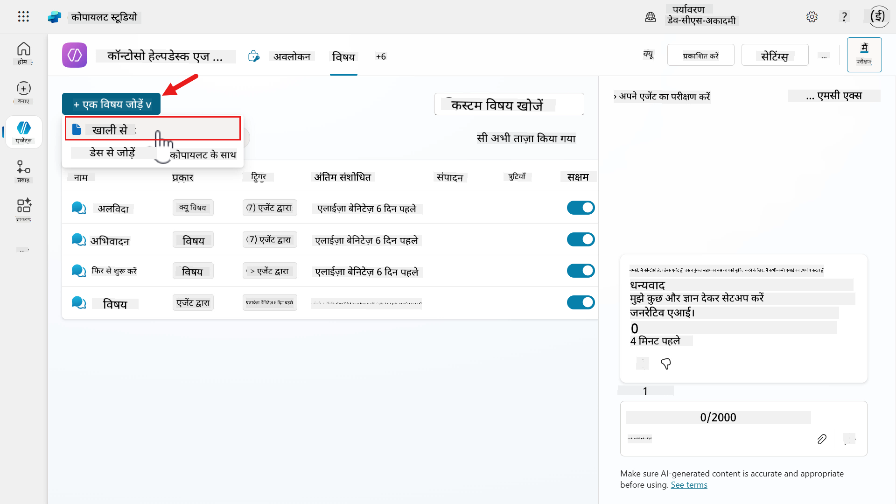

1. विषय के लिए एक नाम दर्ज करें। निम्नलिखित को कॉपी और पेस्ट करें।

    ```text
    Available devices
    ```

    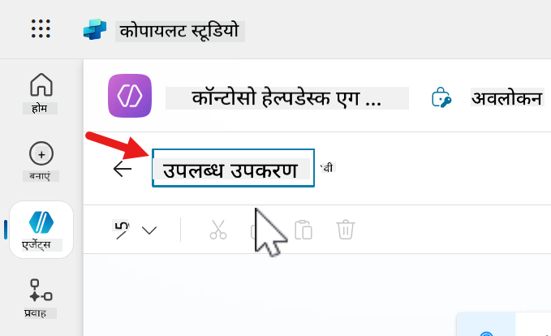

1. ट्रिगर विवरण दर्ज करें जो विषय क्या करता है उसे रेखांकित करता है। निम्नलिखित को कॉपी और पेस्ट करें।

    ```text
    This topic helps users find devices that are available from our SharePoint Devices list. User can ask to see available devices and it will return a list of devices that are available which can include laptops, smartphones, accessories and more.
    ```

    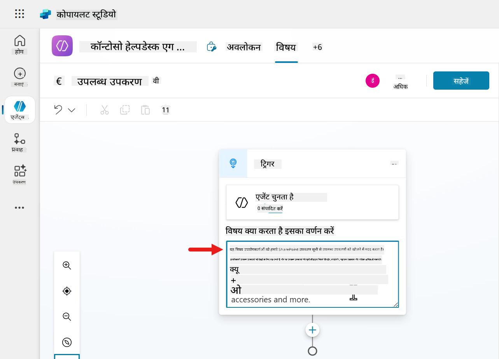

### 7.2 ट्रिगर इनपुट और आउटपुट को परिभाषित करें

1. अगला, हम एक नया इनपुट वेरिएबल जोड़ने जा रहे हैं जिसे जनरेटिव AI उपयोगकर्ता के संदेश से डिवाइस प्रकार का मान निकालने के लिए अपने ऑर्केस्ट्रेशन में उपयोग करेगा। विषय में **More ellipsis (...)** चुनें और **Details** चुनें ताकि विषय विवरण पैन लोड हो सके।

    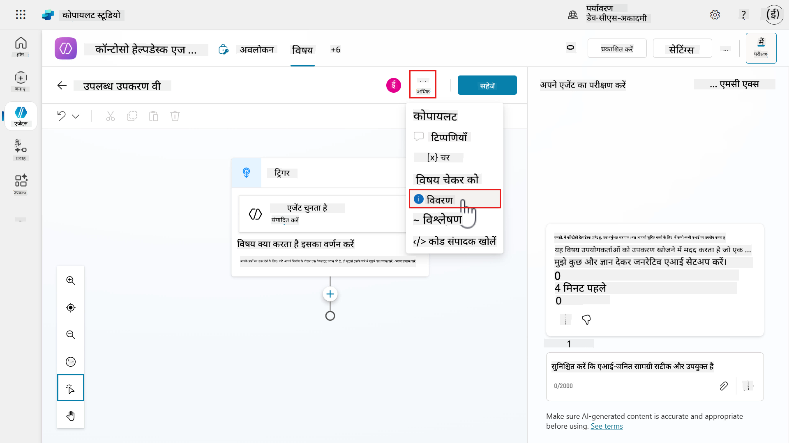

1. **Topic details** पैन अब लोड हो गया है। **Input** टैब चुनें।

    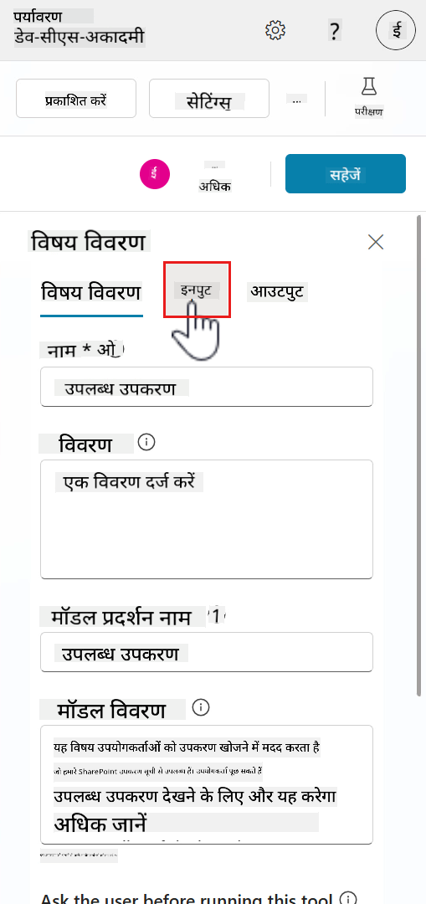

1. **Create a new variable** चुनें।

    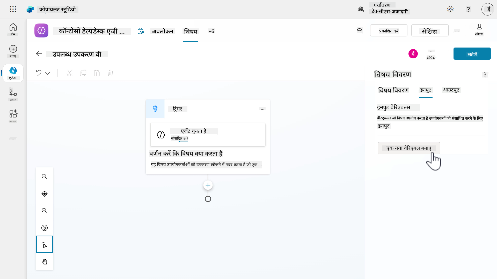

1. वेरिएबल के लिए एक नाम दर्ज करें। निम्नलिखित को कॉपी और पेस्ट करें।

    ```text
    VarDeviceType
    ```

    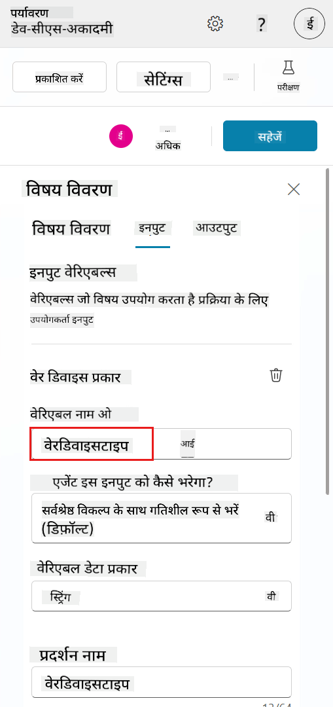

1. अब हमें अपने इनपुट और आउटपुट वेरिएबल्स को परिभाषित करने की आवश्यकता है। निम्नलिखित इनपुट और आउटपुट के लिए परिभाषित की जा सकने वाली गुण हैं।

    | फ़ील्ड    | मान |
    | ---------- | :--------- |
    | एजेंट इस इनपुट को कैसे भरेगा? | यह निर्धारित करता है कि एजेंट इस वेरिएबल को विषय चलाने से पहले मान के साथ कैसे भरेगा। डिफ़ॉल्ट रूप से इसे _Dynamically fill with the best option_ पर सेट किया गया है। अन्यथा आप उपयोगकर्ता से पूछने के बजाय इनपुट को मान के साथ ओवरराइड कर सकते हैं|
    | वेरिएबल डेटा प्रकार  | वेरिएबल का डेटा प्रकार। समर्थित डेटा प्रकार हैं `String`, `Boolean`, `Number`, `Date`, `DateTime`, `DateTimeNoTimeZone`, `Time`, `Record`, `Table`, `Unspecified`, `From sample data` |
    | प्रदर्शन नाम   | वेरिएबल का नाम   |
    | पहचान करें  | एजेंट के लिए सही मान प्रकार को कैप्चर करने के लिए इकाई प्रकार  |
    | विवरण    | विवरण एजेंट को विषय चलाने से पहले इनपुट को स्वचालित रूप से भरने या मानों के लिए प्रश्न उत्पन्न करने में मदद करता है   |

    _How will the agent fill this input?_, _Variable data type_ और _Display name_ को जैसा है वैसा ही रहने दें। **Identify as** गुण को **User's entire response** में अपडेट करें।

    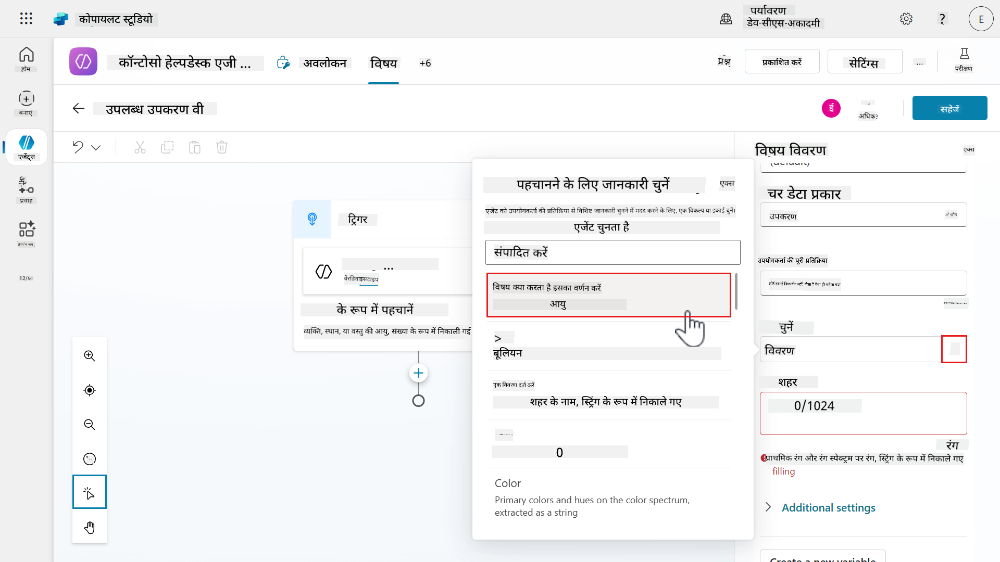

1. विवरण के रूप में निम्नलिखित को कॉपी और पेस्ट करें।

    ```text
    List of possible values: Laptop, Desktop, Smartphone
    ```

    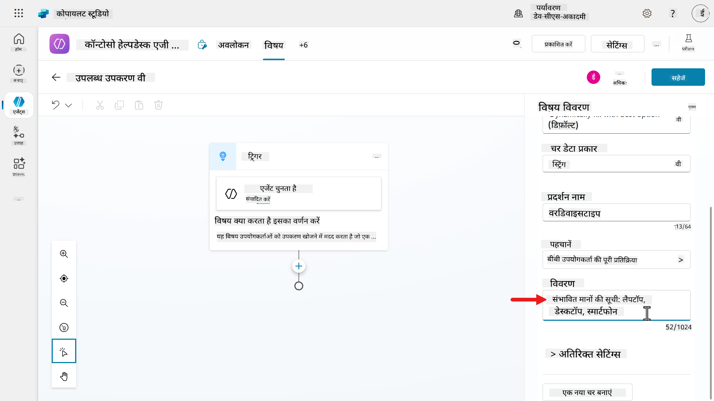

1. अगला, चलिए विषय के लिए आउटपुट को परिभाषित करते हैं। **Output** टैब चुनें।

    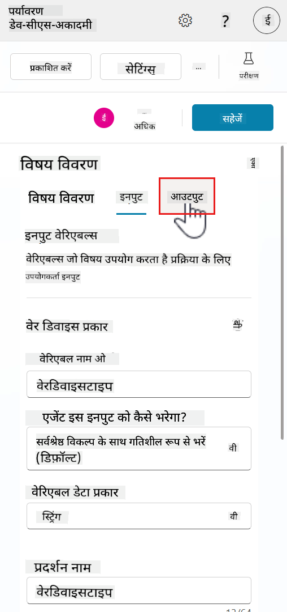

1. **Create a new variable** चुनें।

    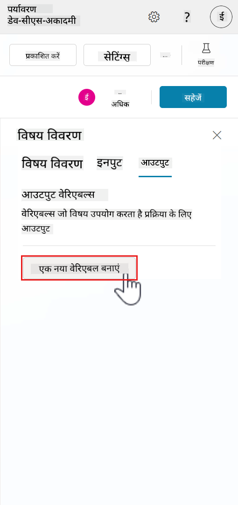

1. निम्नलिखित गुणों को अपडेट करें।

    **वेरिएबल नाम** - निम्नलिखित को कॉपी और पेस्ट करें।

    ```text
    VarAvailableDevices
    ```

    **वेरिएबल डेटा प्रकार** - डेटा प्रकार के रूप में **Table** चुनें।

    **वेरिएबल विवरण** - निम्नलिखित को कॉपी और पेस्ट करें।

    ```text
    List of available devices by device type
    ```

    

1. हमने अब विषय के इनपुट और आउटपुट को परिभाषित करना पूरा कर लिया है। **Topic details** पैन से बाहर निकलने के लिए **X आइकन** चुनें।

    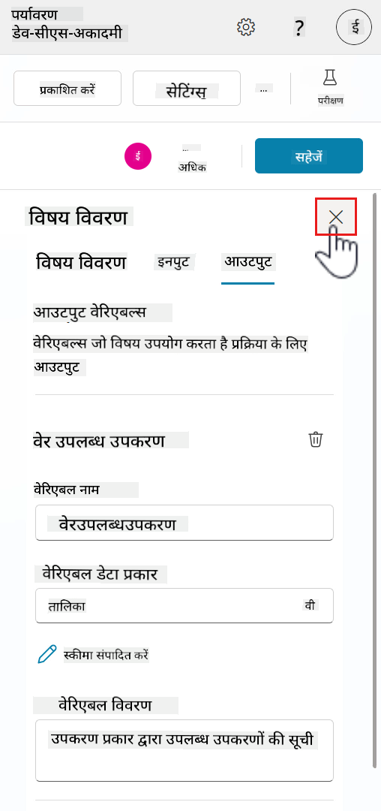

### 7.3 कनेक्टर का उपयोग करके एक टूल जोड़ें

1. चलिए अब एक नोड जोड़ते हैं जो एजेंट को **Devices** SharePoint सूची से उपकरणों की सूची प्राप्त करने में सक्षम बनाता है। ट्रिगर के नीचे **+ आइकन** चुनें।

    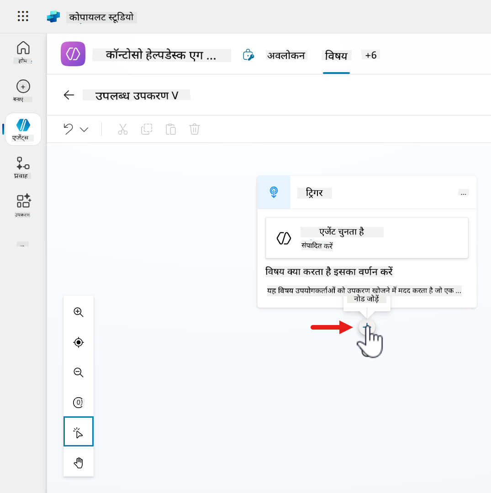

1. **Add a tool** नोड चुनें, फिर **Connector** टैब चुनें। `Get items` खोजें और **Get items** SharePoint कनेक्टर क्रिया चुनें।

    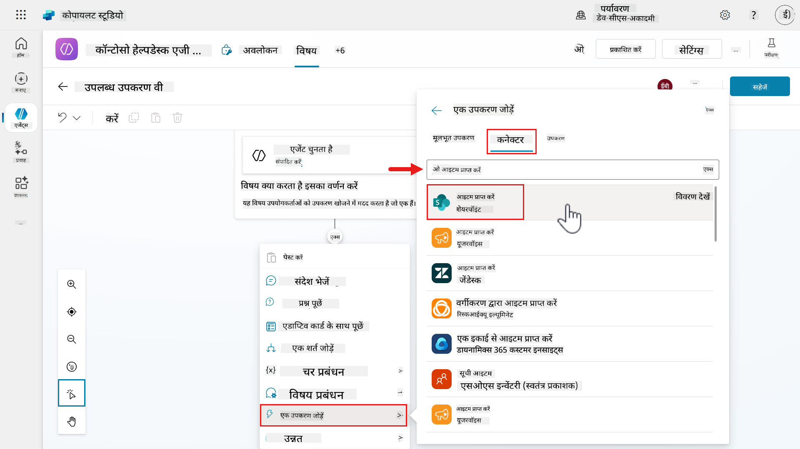

1. कनेक्टर के लिए एक नया कनेक्शन बनाया जाना चाहिए। **chevron** आइकन चुनें और **Create new connection** चुनें।

    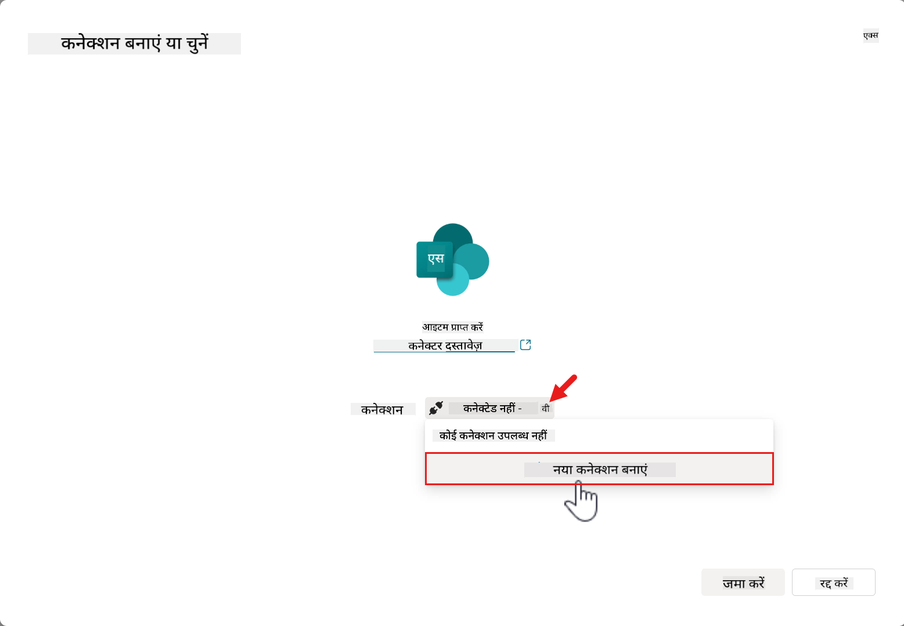

1. दो विकल्प प्रदर्शित होंगे जो आपको SharePoint Online या ऑन-प्रिमाइसेस SharePoint से सीधे कनेक्ट करने की अनुमति देते हैं। डिफ़ॉल्ट रूप से **Connect directly (cloud-services)** विकल्प चुना जाएगा, जिसे हम अपने कनेक्शन के लिए उपयोग करेंगे।
**Create** चुनें।

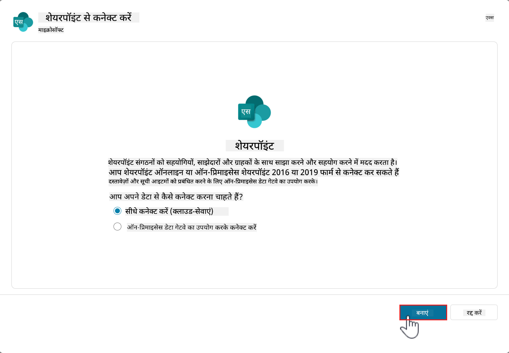

1. अपने साइन इन किए गए उपयोगकर्ता खाते को चुनें।

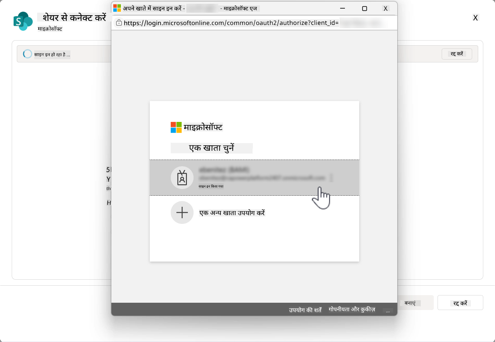

1. अगला, आपको पुष्टि करनी होगी कि आपका उपयोगकर्ता खाता SharePoint कनेक्टर से कनेक्शन के लिए उपयोग किया जा सकता है। **Allow access** चुनें।

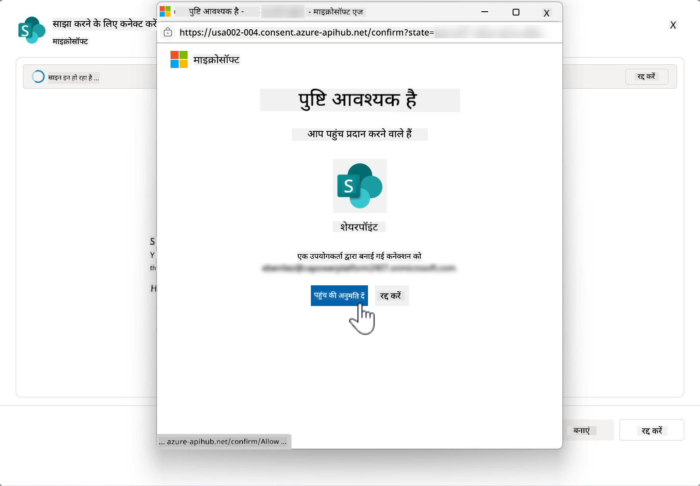

1. **Submit** चुनें ताकि **Get items** SharePoint कनेक्टर क्रिया को टॉपिक में एक नोड के रूप में जोड़ा जा सके।

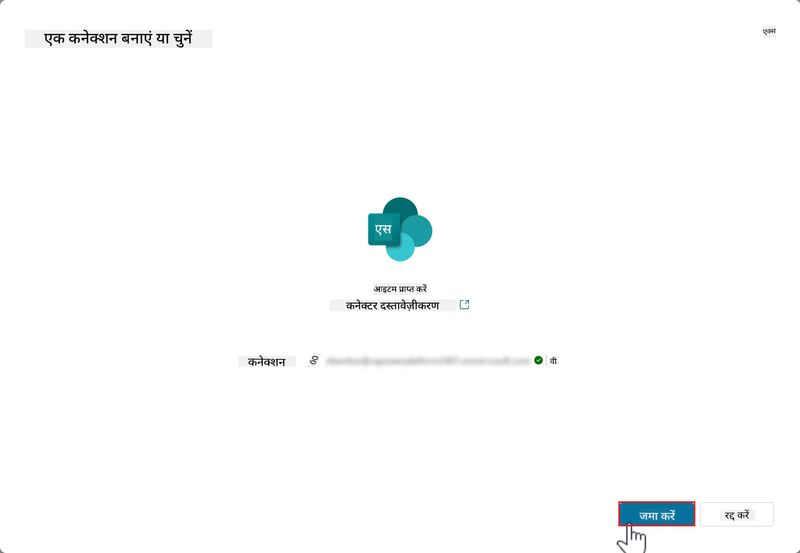

1. **Get items** SharePoint कनेक्टर क्रिया अब टॉपिक में जोड़ दी गई है। अब हम क्रिया के इनपुट्स को कॉन्फ़िगर करना शुरू कर सकते हैं। **ellipsis (...) आइकन** चुनें और **Properties** चुनें।

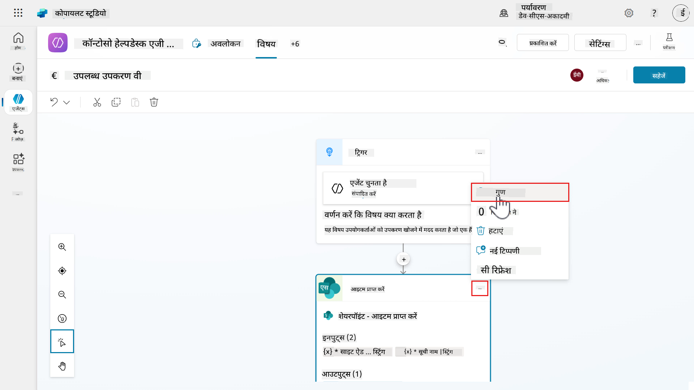

1. **Get items** कॉन्फ़िगरेशन पैन दिखाई देगा और डिफ़ॉल्ट रूप से, आप **Inputs** टैब देखेंगे। **Initiation** टैब चुनें और **Usage Description** फ़ील्ड में विवरण दर्ज करें। निम्नलिखित को कॉपी और पेस्ट करें।

    ```text
    Retrieves devices from SharePoint list
    ```

> यह तब उपयोगी होगा जब हम अपने एजेंट के _Manage your connections_ पेज को देखेंगे। हम जल्द ही इस पर वापस आएंगे।

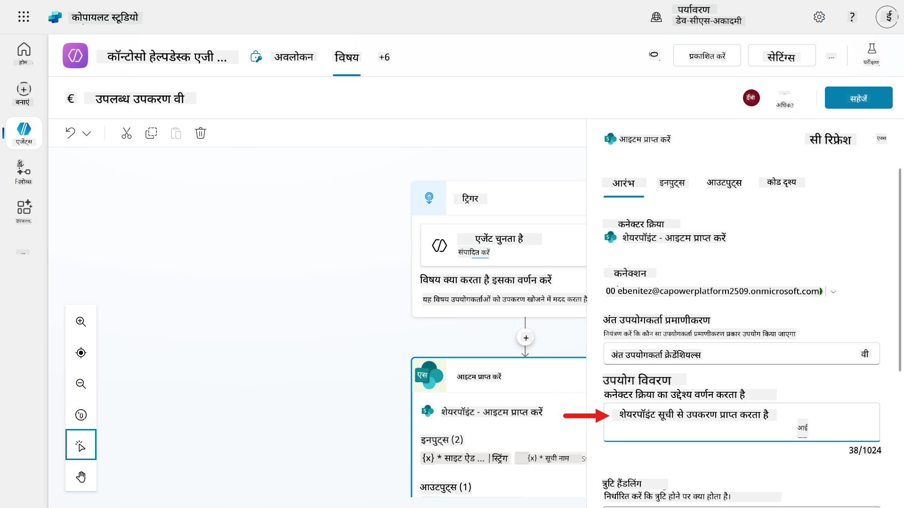

1. **Inputs** टैब चुनें और **Contoso IT** साइट और **Devices** सूची चुनें जिसे आपने [Lesson 00 - Course Setup - Step 3: Create new SharePoint site](../00-course-setup/README.md#step-4-create-new-sharepoint-site) में सेटअप किया था।

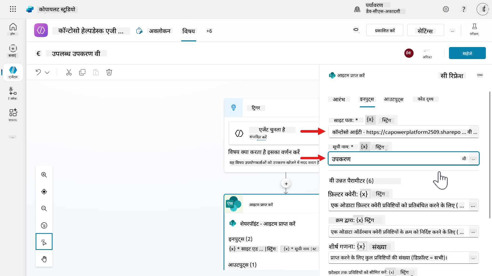

1. अब, केवल SharePoint सूची से उपकरण प्रदर्शित करने के लिए, जो
   - चयनित मान पर आधारित हो,
   - और केवल वे उपकरण जिनकी स्थिति _Available_ हो,

   हमें एक फ़िल्टर लागू करना होगा। यह Power Fx की मदद से एक फ़िल्टर क्वेरी दर्ज करके प्राप्त किया जाता है। **ellipsis (...) आइकन** चुनें।

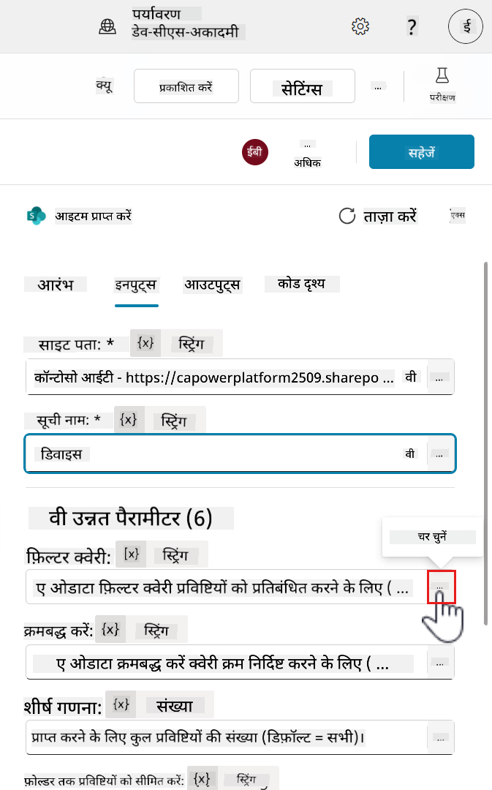

1. डिफ़ॉल्ट रूप से, आप **Custom** टैब में होंगे। **Formula** टैब चुनें।

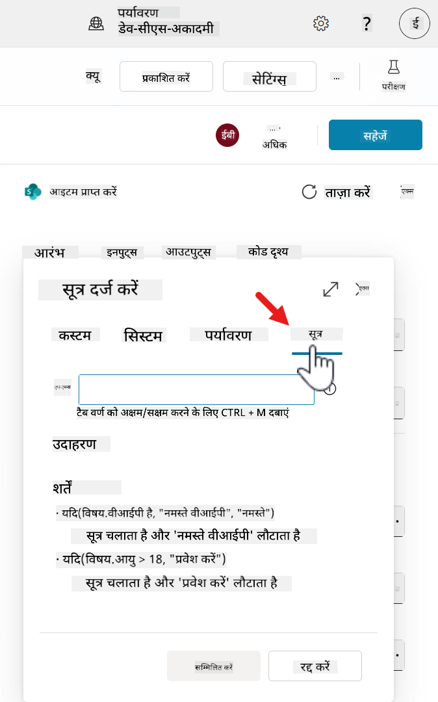

1. **Formula** फ़ील्ड को बड़ा करने के लिए **expand** आइकन चुनें। निम्नलिखित Power Fx अभिव्यक्ति को कॉपी और पेस्ट करें।

हम `Concatenate` फ़ंक्शन का उपयोग कर एक अभिव्यक्ति बना रहे हैं जो फ़िल्टर करेगा
   - SharePoint कॉलम **Status** _Available_ के बराबर हो
   - और SharePoint कॉलम **Asset type** _प्रश्न नोड से चयनित उपकरण_ के बराबर हो।

    ```text
    Concatenate("Status eq 'Available' and AssetType eq '", Topic.VarDeviceType, "'")
    ```

**Insert** चुनें।


1. Power Fx अभिव्यक्ति अब **Get items** क्रिया के फ़िल्टर क्वेरी इनपुट पैरामीटर में लागू हो जाएगी। अगला, **Limit Columns by View** में **All items** दृश्य चुनें। यह केवल चयनित दृश्य के आधार पर सूची में कॉलम को पुनः प्राप्त करेगा।

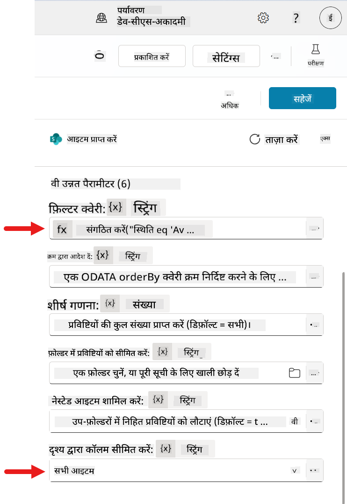

1. अगला, हम आउटपुट के लिए वेरिएबल का नाम अपडेट करेंगे। **Outputs** टैब चुनें और `GetItems` वेरिएबल चुनें।

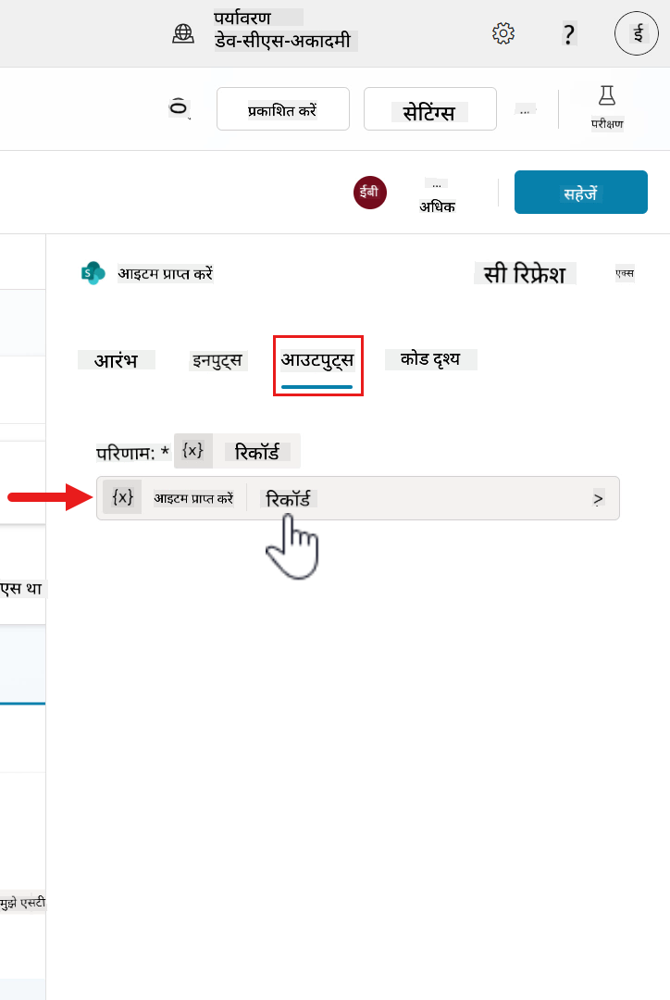

1. नाम को निम्नलिखित में अपडेट करें।

    ```text
    VarDevices
    ```

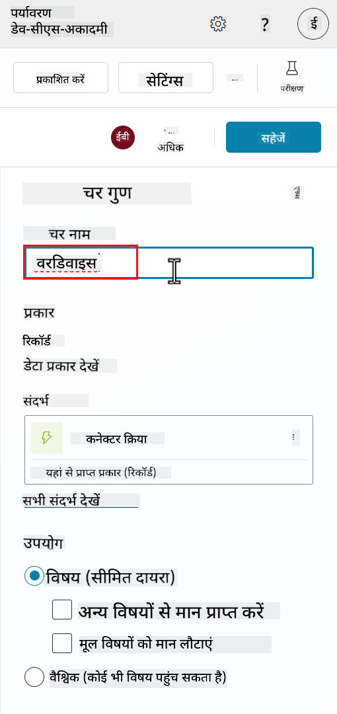

1. नीचे स्क्रॉल करें और **Usage** सेक्शन में **Global** चुनें। यह वेरिएबल को किसी भी टॉपिक द्वारा एक्सेस करने योग्य बना देगा।

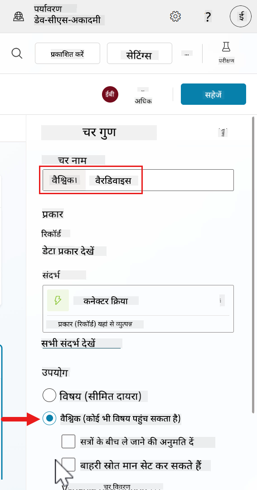

1. **Variable properties** पैन को **Close** करें।

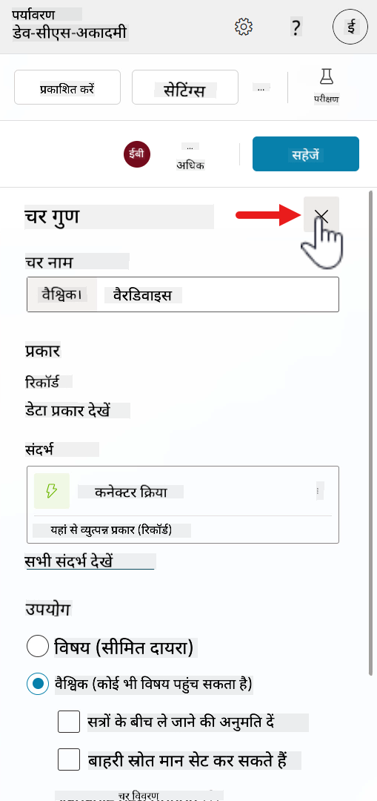

1. नया नोड डालने के लिए **plus +** आइकन चुनें, **Variable management** चुनें और फिर **Set a variable value** चुनें।

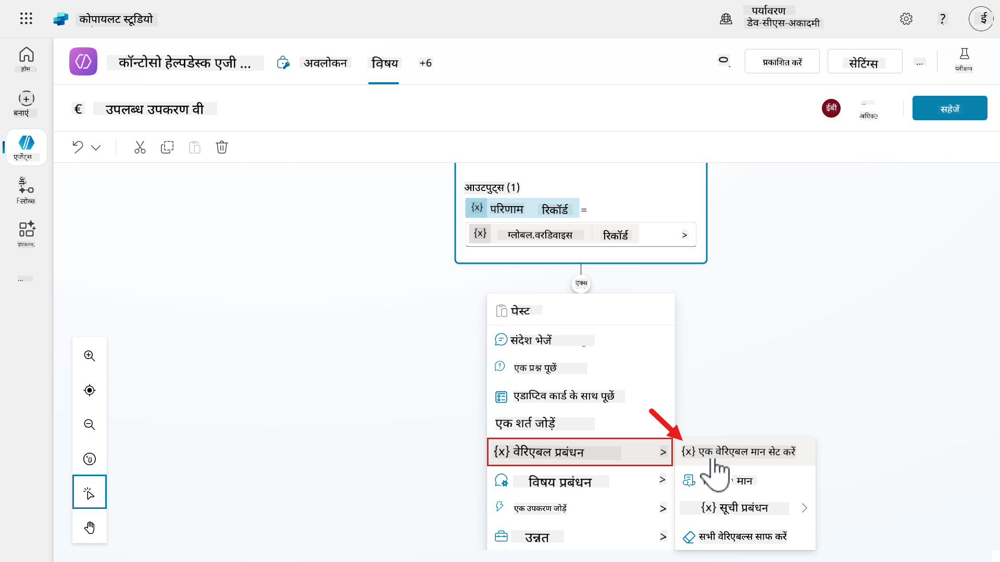

1. **Set variable** इनपुट पैरामीटर के लिए **greater than** आइकन चुनें।

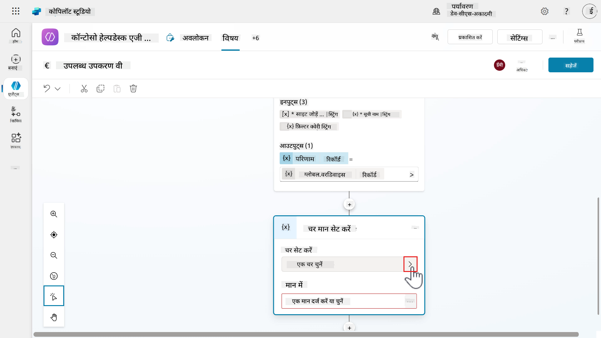

1. पहले बनाए गए टॉपिक आउटपुट को वेरिएबल के रूप में चुनें, **VarAvailableDevices**।

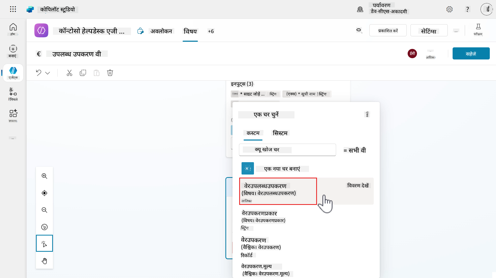

1. अगला, वेरिएबल का मान परिभाषित करने के लिए **ellipsis (...) आइकन** चुनें।

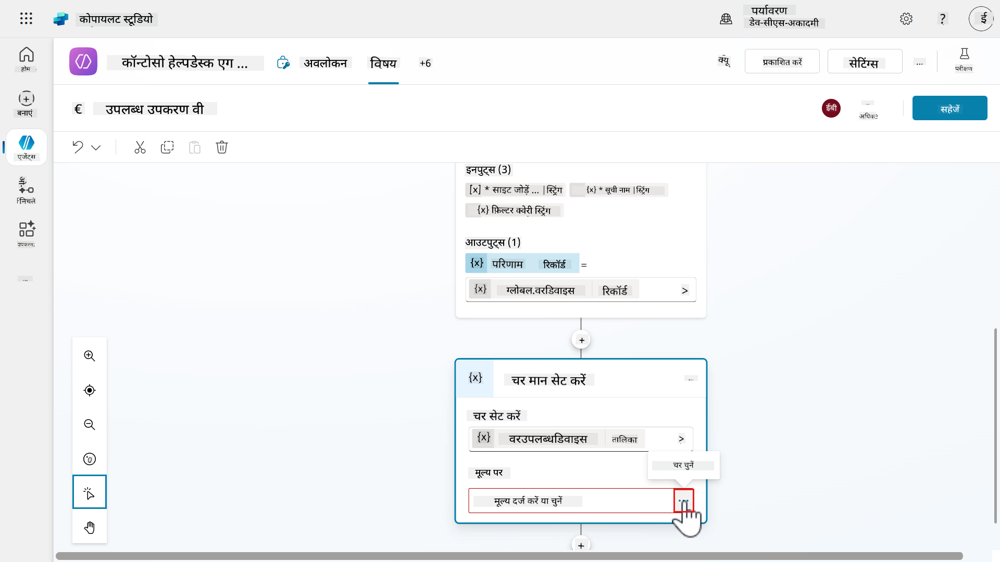

1. अब हम PowerFx अभिव्यक्ति का उपयोग करेंगे ताकि वेरिएबल मान को **Get items** प्रतिक्रिया में लौटाए गए `value` प्रॉपर्टी के रूप में सेट किया जा सके, और वेरिएबल के [scope](https://learn.microsoft.com/microsoft-copilot-studio/advanced-power-fx?WT.mc_id=power-172618-ebenitez) को ग्लोबल बनाने के लिए `Global` प्रीफिक्स जोड़ें।

**Insert** और **save** टॉपिक चुनें।

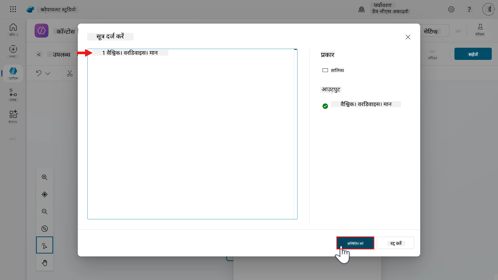

1. अगला, हमें एजेंट निर्देशों को अपडेट करना होगा। **Overview** टैब चुनें और **Edit** चुनें।

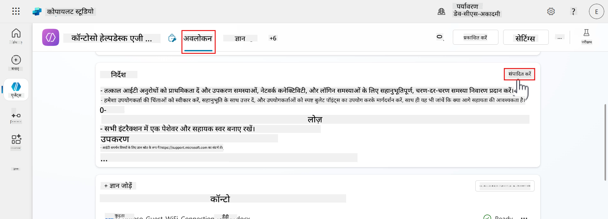

1. निर्देशों में एक नई पंक्ति जोड़ें, निम्नलिखित को कॉपी और पेस्ट करें।

    ```text
    - Help find available devices and give full details using [Available devices]. Always extract the VarDeviceType from the inputs. After giving device details, ask the user if they want to request a device from the list of available devices.
    ```

यह निर्देश जनरेटिव AI को **Available devices** ट्रिगर को सक्रिय करने के लिए मार्गदर्शन करेगा ताकि **Devices** SharePoint सूची से उपलब्ध उपकरणों की सूची प्रदर्शित की जा सके। पूरे टॉपिक प्लेसहोल्डर को वर्ग कोष्ठकों में चुनें।

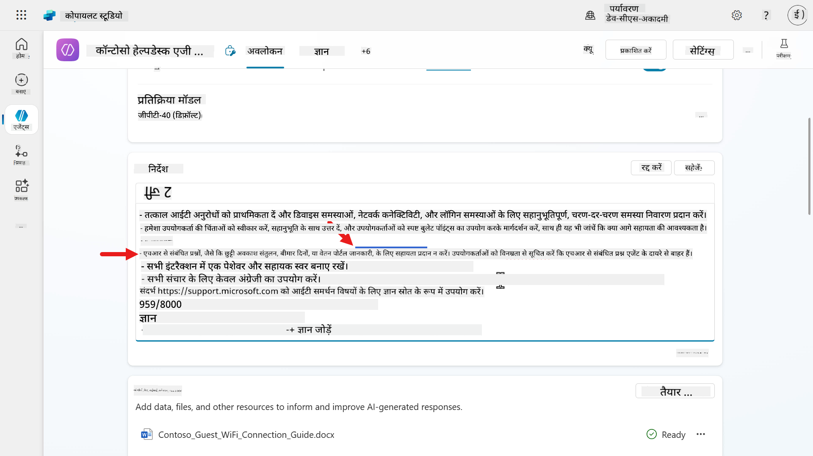

1. फॉरवर्ड स्लैश कैरेक्टर `/` टाइप करें और टॉपिक्स की सूची दिखाई देगी। **Available devices** टॉपिक चुनें।


1. अपडेट किए गए निर्देशों को **Save** करें।

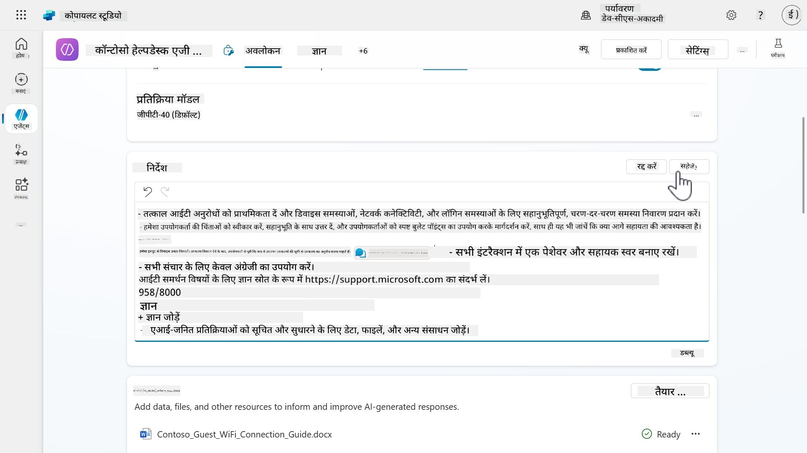

1. अब हम अपने अपडेट किए गए एजेंट का परीक्षण करने जा रहे हैं। परीक्षण पैन प्रदर्शित करने के लिए **Test** चुनें और परीक्षण पैन को **refresh** करें। एजेंट को निम्नलिखित संदेश दर्ज करें।

    ```text
    I need a laptop
    ```


1. एजेंट आगे बढ़ने से पहले, उपयोगकर्ता को पुष्टि करनी होगी कि उनका कनेक्शन उपयोग किया जा सकता है। **Allow** चुनें।

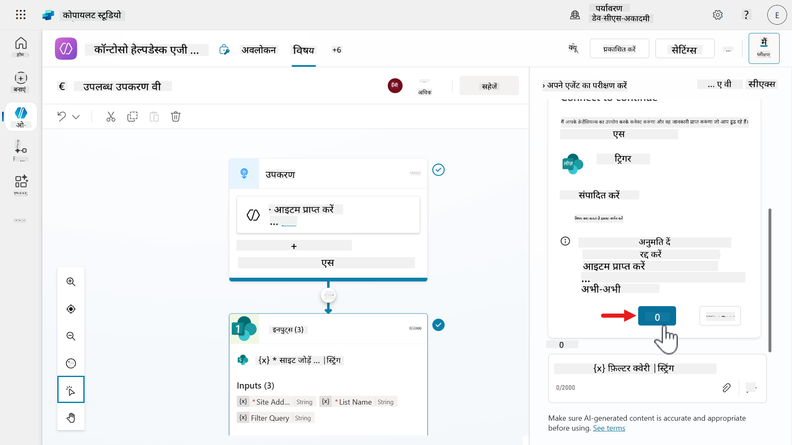

1. एजेंट SharePoint टूल को निष्पादित करेगा जो Power Fx अभिव्यक्ति का उपयोग करके "लैपटॉप" डिवाइस प्रकार और "उपलब्ध" स्थिति वाले उपकरणों की फ़िल्टर की गई सूची पुनः प्राप्त करता है। उपयोगकर्ता को पढ़ने के लिए बुलेट पॉइंट्स के रूप में प्रतिक्रिया स्वरूपित की जाएगी।


1. एक आखिरी चीज़ जो सीखनी है वह है एजेंट द्वारा उपयोग किए गए कनेक्शनों को देखना। एजेंट के _Manage your connections_ पेज को देखने के लिए **ellipsis (...)** चुनें और **Manage Connection** चुनें।

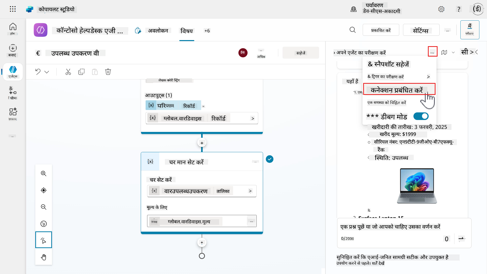

1. यह पेज वह जगह है जहां हम एजेंट द्वारा उपयोग किए गए सभी कनेक्शनों को देख सकते हैं। वर्तमान में, केवल एक कनेक्शन सूचीबद्ध है जो टॉपिक में जोड़े गए SharePoint टूल से जुड़ा है। **Used By** कॉलम में **1 tool** चुनें।

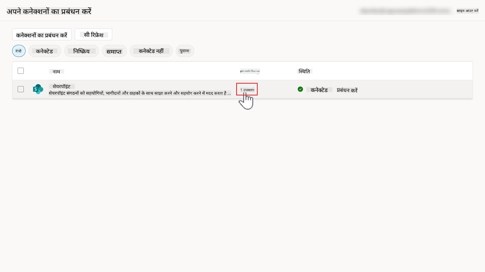

1. यह वह जगह है जहां हम Get items क्रिया का विवरण देख सकते हैं और याद रखें कि हमने पहले _usage description_ दर्ज किया था? यह वह जगह है जहां हम उपयोग विवरण देखेंगे। **Close** चुनें।

> यह हमें बताता है कि कौन सी क्रियाएं उपयोग की जाती हैं और उनका उद्देश्य क्या है। यह हमारे कनेक्शनों को व्यवस्थित रखता है 📁।

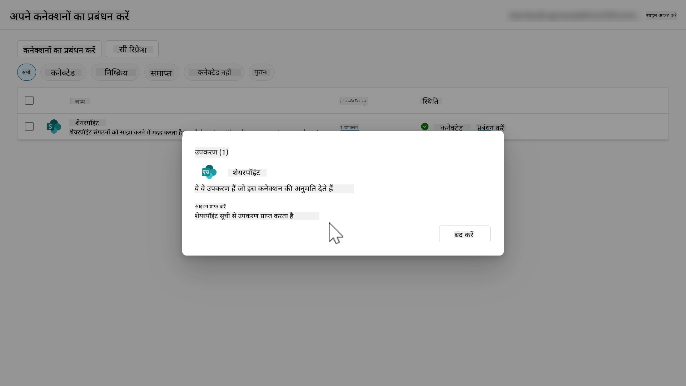

1. Copilot Studio के साथ अपने ब्राउज़र टैब पर वापस जाएं और परीक्षण को साफ़ करने के लिए परीक्षण पैन को **refresh** करें।

## ✅ मिशन पूरा

बधाई हो! 👏🏻 आपने सीखा कि कैसे एक नया टॉपिक खरोंच से जोड़ें, कैसे एक टूल जोड़ें जो Get items SharePoint कनेक्टर क्रिया को कॉल करता है और Power Fx का उपयोग करके प्रतिक्रिया को फ़िल्टर करें ताकि केवल उपकरण लौटाए जाएं जिनकी स्थिति उपलब्ध है और उपकरण प्रकार लैपटॉप है। 🙌🏻

यह **Lab 07 - Add a new topic with conversation nodes** का अंत है, नीचे दिए गए लिंक का चयन करें ताकि अगले पाठ में जाएं। हम इस लैब के उपयोग केस को अगले पाठ के लैब में विस्तारित करेंगे।

⏭️ [**Enhance user interactions with Adaptive Cards** पाठ पर जाएं](../08-add-adaptive-card/README.md)

## 📚 सामरिक संसाधन

🔗 [Use system topics](https://learn.microsoft.com/microsoft-copilot-studio/authoring-system-topics?mc_id=power-172618-ebenitez)

🔗 [Topics in Microsoft Copilot Studio](https://learn.microsoft.com/microsoft-copilot-studio/guidance/topics-overview?WT.mc_id=power-172618-ebenitez)

🔗 [Set topic triggers](https://learn.microsoft.com/microsoft-copilot-studio/authoring-triggers?WT.mc_id=power-172618-ebenitez)

🔗 [Defining agent topics](https://learn.microsoft.com/microsoft-copilot-studio/guidance/defining-chatbot-topics?WT.mc_id=power-172618-ebenitez)

🔗 [Create expressions using Power Fx](https://learn.microsoft.com/microsoft-copilot-studio/advanced-power-fx?WT.mc_id=power-172618-ebenitez)

📺 [Author topics using natural language](https://aka.ms/ai-in-action/copilot-studio/ep6)

📺 [Add actions to agents using connectors](https://aka.ms/ai-in-action/copilot-studio/ep4)


---

**अस्वीकरण**:  
यह दस्तावेज़ AI अनुवाद सेवा [Co-op Translator](https://github.com/Azure/co-op-translator) का उपयोग करके अनुवादित किया गया है। जबकि हम सटीकता के लिए प्रयास करते हैं, कृपया ध्यान दें कि स्वचालित अनुवाद में त्रुटियां या अशुद्धियां हो सकती हैं। मूल भाषा में दस्तावेज़ को आधिकारिक स्रोत माना जाना चाहिए। महत्वपूर्ण जानकारी के लिए, पेशेवर मानव अनुवाद की सिफारिश की जाती है। इस अनुवाद के उपयोग से उत्पन्न किसी भी गलतफहमी या गलत व्याख्या के लिए हम उत्तरदायी नहीं हैं।