<!--
CO_OP_TRANSLATOR_METADATA:
{
  "original_hash": "dcbcd9396b076da0a0f5d389e9ec1b12",
  "translation_date": "2025-10-21T18:53:05+00:00",
  "source_file": "docs/recruit/08-add-adaptive-card/README.md",
  "language_code": "hi"
}
-->
# 🚨 मिशन 08: टॉपिक्स में उपयोगकर्ता इंटरैक्शन को एडैप्टिव कार्ड्स के साथ बेहतर बनाएं

## 🕵️‍♂️ कोडनेम: `ऑपरेशन इंटरफेस अपलिफ्ट`

> **⏱️ ऑपरेशन समय सीमा:** `~45 मिनट`

🎥 **वॉकथ्रू देखें**

[](https://www.youtube.com/watch?v=RhIlzYHPCXo "YouTube पर वॉकथ्रू देखें")

## 🎯 मिशन ब्रीफ

एजेंट्स, आपका मिशन है स्थिर उपयोगकर्ता अनुभव को बदलकर उसे समृद्ध, डायनामिक और एक्शन योग्य एडैप्टिव कार्ड्स से बदलना। आप JSON पेलोड्स और Power Fx फॉर्मूलों का उपयोग करके Copilot Studio बातचीत को साधारण प्रश्नोत्तर से पूरी तरह इंटरैक्टिव एंगेजमेंट में बदलेंगे। आपका लक्ष्य है उपयोगकर्ता इनपुट प्राप्त करना, डेटा को सुंदर तरीके से प्रस्तुत करना, और बातचीत को सटीकता और शैली के साथ निर्देशित करना। यदि आप अनुकूलन करने में विफल होते हैं, तो आपके उपयोगकर्ता कम बुद्धिमान इंटरफेस की ओर जा सकते हैं।

## 🔎 उद्देश्य

इस मिशन में, आप सीखेंगे:

1. एडैप्टिव कार्ड्स क्या हैं और वे Copilot Studio में उपयोगकर्ता इंटरैक्शन को कैसे बेहतर बनाते हैं
1. JSON और Power Fx फॉर्मूलों का उपयोग करके इंटरैक्टिव कार्ड्स बनाना
1. एडैप्टिव कार्ड डिज़ाइनर और इसके प्रमुख घटकों का उपयोग करके विज़ुअल कार्ड निर्माण का अन्वेषण करना
1. एजेंट टॉपिक्स के भीतर समृद्ध, इंटरैक्टिव फॉर्म्स और डेटा संग्रह अनुभव बनाना
1. उत्तरदायी और उपयोगकर्ता-अनुकूल एडैप्टिव कार्ड्स डिज़ाइन करने के लिए सर्वोत्तम प्रथाओं को लागू करना

## 🤔 एडैप्टिव कार्ड क्या है?

**एडैप्टिव कार्ड** इंटरैक्टिव, विज़ुअली समृद्ध UI तत्व बनाने का एक तरीका है जिसे Microsoft Teams, Microsoft Outlook या एजेंट्स जैसे ऐप्स में एम्बेड किया जा सकता है। यह एक संरचित JSON ऑब्जेक्ट है जो कार्ड के लेआउट और सामग्री को परिभाषित करता है:

- कार्ड पर कौन से तत्व दिखाई देंगे - टेक्स्ट, इमेज, बटन
- उन तत्वों की व्यवस्था कैसे होगी
- उपयोगकर्ता कौन से कार्य कर सकते हैं जैसे फॉर्म सबमिट करना या लिंक खोलना

    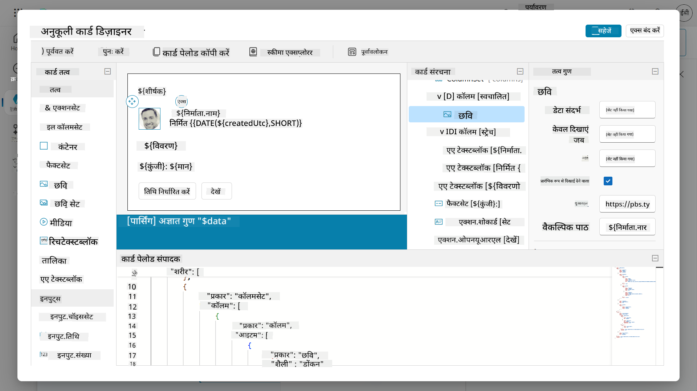

### Copilot Studio में एडैप्टिव कार्ड्स क्यों महत्वपूर्ण हैं

कल्पना करें कि आप एक ऐसा एजेंट बना रहे हैं जो उपयोगकर्ताओं से उनका नाम, ईमेल, या फीडबैक पूछता है। यदि आप केवल साधारण टेक्स्ट का उपयोग करते हैं, तो बातचीत उबाऊ या समझने में कठिन लग सकती है। यही वह जगह है जहां एडैप्टिव कार्ड्स काम आते हैं!

1. **बातचीत को इंटरैक्टिव बनाता है** - उपयोगकर्ता को टेक्स्ट संदेश भेजने के बजाय, आप बटन, फॉर्म्स, इमेज और अधिक दिखा सकते हैं।
    - उदाहरण: एक कार्ड उपयोगकर्ता से उनके नाम और ईमेल को एक साफ-सुथरे फॉर्म में भरने के लिए कह सकता है।

1. **हर जगह अच्छा दिखता है** - एडैप्टिव कार्ड्स स्वचालित रूप से उस ऐप की शैली से मेल खाते हैं जिसमें वे हैं, जैसे Microsoft 365 Copilot चैट या Microsoft Teams। आपको डार्क मोड, फॉन्ट, या लेआउट्स की चिंता करने की आवश्यकता नहीं है - यह अनुकूलित होता है।

1. **JSON के साथ बनाना आसान है** - आप JSON कोड का उपयोग करके कार्ड को परिभाषित करते हैं (UI के लिए _रेसिपी_ सोचें)। Copilot Studio आपको कार्ड को टॉपिक में जोड़ने से पहले उसका पूर्वावलोकन करने में मदद करता है।

1. **डेटा एकत्र और उपयोग करें** - आप कार्ड का उपयोग प्रश्न पूछने, उत्तर एकत्र करने और उस डेटा का उपयोग बातचीत प्रवाह में कर सकते हैं।
    - उदाहरण: उपयोगकर्ता का फोन नंबर पूछें, फिर उनके फोन नंबर के साथ एक पुष्टि कार्ड दिखाएं।

1. **उपयोगकर्ता अनुभव को बढ़ावा दें** - कार्ड्स आपके एजेंट को अधिक इंटरैक्टिव बनाते हैं। यह एक अधिक साफ, क्लिक करने योग्य, और उपयोगकर्ता-अनुकूल प्रकार का इंटरफेस है।

## 🐱 क्या _JSON_ एक व्यक्ति है?

"जेसन" के रूप में उच्चारित, यह कोई व्यक्ति नहीं है 😅

JSON, जिसे _JavaScript Object Notation_ के रूप में भी जाना जाता है, डेटा को संरचित करने के लिए उपयोग किया जाने वाला एक हल्का प्रारूप है। इसे पढ़ना और लिखना आसान है, और यह कर्ली ब्रेसेस {} के अंदर की-वैल्यू पेयर्स की एक श्रृंखला जैसा दिखता है।

यह आपके टॉपिक में एडैप्टिव कार्ड जोड़ने के लिए उपयोग करने के विकल्पों में से एक है।

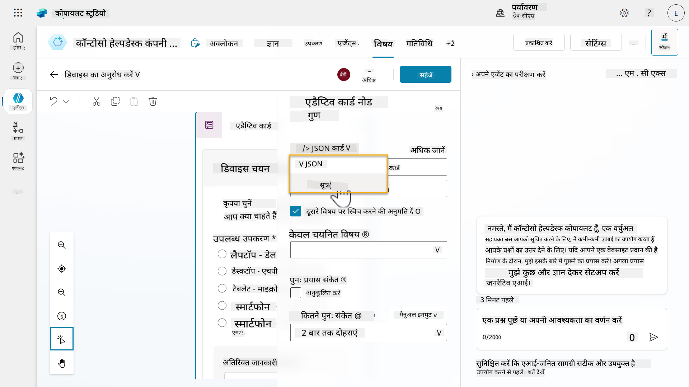

## 👀 मैं एडैप्टिव कार्ड बनाने के लिए _फॉर्मूला_ का एक और विकल्प देखता हूं

याद रखें कि हमने [मिशन 07 - अपने नोड्स में Power Fx का उपयोग करना](../07-add-new-topic-with-trigger/README.md#what-power-fx-can-do-in-topics) में Power Fx के बारे में सीखा था। वही Copilot Studio में एडैप्टिव कार्ड्स में लागू किया जा सकता है।

पुनरावलोकन के रूप में,

!!! note
    Power Fx एक लो-कोड प्रोग्रामिंग भाषा है जिसका उपयोग आपके एजेंट में लॉजिक और डायनामिक व्यवहार जोड़ने के लिए किया जाता है। यह वही भाषा है जो Microsoft Power Apps में उपयोग की जाती है, और इसे सरल और Excel जैसी डिज़ाइन किया गया है, जिससे यह डेवलपर्स और गैर-डेवलपर्स के लिए आसान हो जाता है।

### एडैप्टिव कार्ड्स में Power Fx कैसे काम करता है

जब आप Copilot Studio में एक एडैप्टिव कार्ड डिज़ाइन करते हैं, तो आप Power Fx फॉर्मूलों का उपयोग कर सकते हैं:

- उपयोगकर्ता नाम, तिथियां या स्थिति जैसे मानों को डायनामिक रूप से सम्मिलित करें।
- टेक्स्ट या नंबरों को फॉर्मेट करें जैसे मुद्रा दिखाना या नंबरों को राउंड करना।
- शर्तों के आधार पर तत्वों को दिखाएं या छिपाएं।
- उपयोगकर्ता इनपुट, वेरिएबल्स, बातचीत नोड्स के आउटपुट के आधार पर प्रतिक्रियाओं को कस्टमाइज़ करें।

उदाहरण के लिए,

"`Hello`" & `System.User.DisplayName`

यह फॉर्मूला डायनामिक रूप से "Hello" शब्द को उपयोगकर्ता के नाम के साथ जोड़ता है।

### यह क्यों उपयोगी है

1. **पर्सनलाइजेशन**

    आप प्रत्येक उपयोगकर्ता के लिए संदेश को अनुकूलित कर सकते हैं, जिससे इंटरैक्शन अधिक प्राकृतिक और प्रासंगिक लगता है।

1. **डायनामिक सामग्री**

    कार्ड्स वेरिएबल्स और बातचीत नोड्स के आउटपुट से वास्तविक डेटा दिखा सकते हैं।

1. **स्मार्ट लॉजिक**

    आप उपयोगकर्ताओं को दिखाने या इंटरैक्ट करने के लिए शर्तों के आधार पर नियंत्रित कर सकते हैं, जिससे उपयोगिता में सुधार होता है और त्रुटियां कम होती हैं।

1. **लो-कोड फ्रेंडली**

    Power Fx एक लो-कोड प्रोग्रामिंग भाषा है। जैसा कि पहले उल्लेख किया गया है, यह पढ़ने योग्य, सहज और Excel फॉर्मूलों के समान है।

## 👷🏻‍♀️ एडैप्टिव कार्ड डिज़ाइनर के साथ निर्माण करना

**एडैप्टिव कार्ड डिज़ाइनर** एक विज़ुअल टूल है जो आपको टेक्स्ट, इमेज, बटन और इनपुट जैसे ड्रैग-एंड-ड्रॉप तत्वों का उपयोग करके इंटरैक्टिव संदेश कार्ड्स बनाने देता है। इसका उद्देश्य आपको जटिल कोड लिखे बिना समृद्ध, डायनामिक संदेश बनाने में मदद करना है, जिससे उपयोगकर्ता-अनुकूल इंटरफेस डिज़ाइन करना आसान हो जाता है।

डिज़ाइनर टूल आपको विज़ुअल रूप से कार्ड बनाने में मदद करता है, लेकिन पर्दे के पीछे, यह आपके लिए JSON ऑब्जेक्ट उत्पन्न कर रहा है। आप _फॉर्मूला_ पर भी स्विच कर सकते हैं जो कार्ड में अन्य जगहों से डेटा प्रदर्शित करने के लिए Power Fx अभिव्यक्तियों को सक्षम करता है।

## 🎨 एडैप्टिव कार्ड डिज़ाइनर को समझना

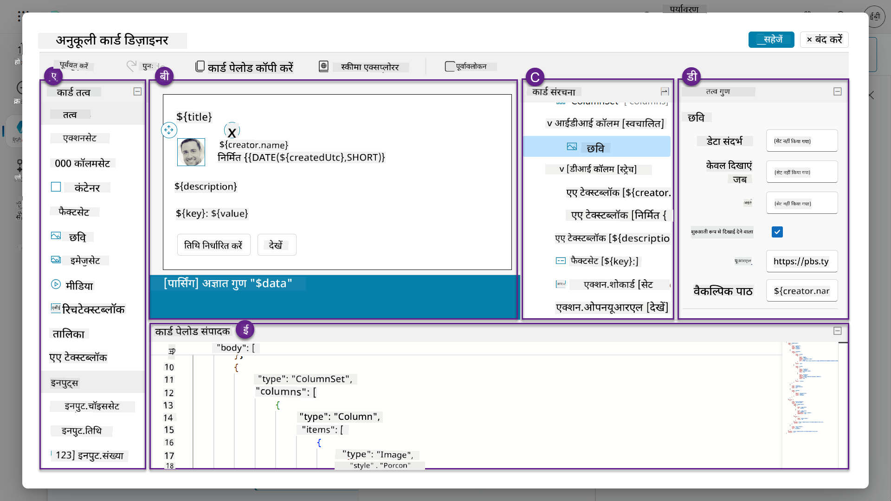

### A) कार्ड तत्व

ये आपके एडैप्टिव कार्ड के निर्माण खंड हैं। आप निम्नलिखित जैसे तत्वों को ड्रैग और ड्रॉप कर सकते हैं:

- **TextBlock** टेक्स्ट प्रदर्शित करने के लिए।
- **Image** चित्र दिखाने के लिए।
- **FactSet** की-वैल्यू पेयर्स के लिए।
- **इनपुट फील्ड्स** टेक्स्ट बॉक्स, डेट पिकर्स, टॉगल्स प्रदर्शित करने के लिए।
- **Actions** बटन प्रदर्शित करने के लिए जैसे _Submit_, _Open URL_, या _Show Card_।

प्रत्येक तत्व का अपना उद्देश्य होता है और इसे स्टाइल या कॉन्फ़िगर किया जा सकता है।

### B) कार्ड व्यूअर

यह **पूर्वावलोकन** क्षेत्र है जहां आप वास्तविक समय में देख सकते हैं कि आपका कार्ड कैसा दिखेगा। जैसे ही आप तत्व जोड़ते या संपादित करते हैं, व्यूअर तुरंत अपडेट होता है ताकि परिवर्तनों को दर्शाया जा सके। यह आपको पुनरावृत्त अपडेट करने और डिज़ाइन आउटपुट को एक ही समय में देखने में सक्षम बनाता है।

### C) कार्ड संरचना

यह आपके कार्ड की **हाइरार्की और लेआउट** दिखाता है। उदाहरण के लिए:

- एक कार्ड **TextBlock** के साथ शीर्षक के लिए शुरू हो सकता है।
- फिर एक **ColumnSet** जिसमें एक तरफ इमेज और दूसरी तरफ टेक्स्ट हो।
- इसके बाद एक **FactSet** और कुछ **Action बटन**।

यह आपको समझने में मदद करता है कि तत्व कैसे नेस्टेड और व्यवस्थित हैं।

### D) तत्व गुण

जब आप कार्ड में किसी भी तत्व पर क्लिक करते हैं, तो यह पैनल आपको **सेटिंग्स को कस्टमाइज़** करने देता है:

- टेक्स्ट का आकार, वजन, या रंग बदलें।
- इमेज URLs या alt टेक्स्ट सेट करें।
- इनपुट विकल्प जैसे प्लेसहोल्डर टेक्स्ट या डिफ़ॉल्ट मान कॉन्फ़िगर करें।

यह वह जगह है जहां आप प्रत्येक तत्व को बारीकी से समायोजित करते हैं।

### E) कार्ड पेलोड एडिटर

यह आपके कार्ड के पीछे का **कच्चा JSON कोड** है। उन्नत उपयोगकर्ता इसे सीधे संपादित कर सकते हैं:

- टेम्पलेटिंग सुविधाओं का उपयोग करें।
- कार्ड परिभाषाओं को कॉपी/पेस्ट करें।

भले ही आप एडैप्टिव कार्ड डिज़ाइनर में नए हों, यह देखना उपयोगी है कि विज़ुअल डिज़ाइन कोड में कैसे अनुवादित होता है।

!!! tip "टिप - एडैप्टिव कार्ड नमूने देखें"

    1. [https://adaptivecards.microsoft.com/designer](https://adaptivecards.microsoft.com/designer) पर जाएं।
    2. **New card** चुनें ताकि आप नमूनों की सूची देख सकें जिन्हें आप चुन सकते हैं और संशोधित कर सकते हैं।
    3. ध्यान दें कि यह डिज़ाइनर बाहरी (वेब-आधारित) है। जब आप वेब-आधारित एडैप्टिव कार्ड डिज़ाइनर में अपना कार्ड बनाते हैं, तो कार्ड पेलोड एडिटर से JSON कॉपी करें।
    4. JSON को अपने एजेंट में Copilot Studio में अपने एडैप्टिव कार्ड में पेस्ट करें।

    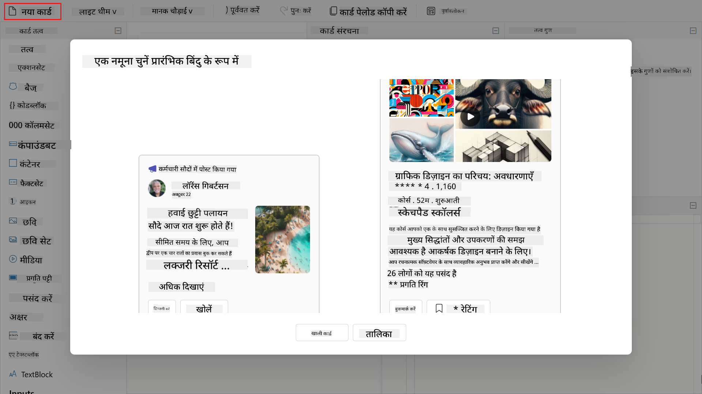

## 🌵 सामान्य उपयोग के मामले

निम्नलिखित Copilot Studio में **Send a message** या **Ask a question** नोड्स में एडैप्टिव कार्ड्स के सामान्य उपयोग के मामले हैं।

1. **फॉर्म्स और डेटा संग्रह**

    उपयोगकर्ताओं से संरचित इनपुट एकत्र करने के लिए एडैप्टिव कार्ड्स का उपयोग करें, जैसे:

    - छुट्टी अनुरोध
    - फीडबैक फॉर्म्स
    - संपर्क जानकारी
    - अपॉइंटमेंट शेड्यूलिंग

1. **डायनामिक जानकारी प्रदर्शित करना**

    उपयोगकर्ताओं को व्यक्तिगत या वास्तविक समय डेटा एक साफ, पठनीय प्रारूप में दिखाएं जैसे एंटरप्राइज स्रोतों से ServiceNow, SAP, Dynamics 365, SharePoint आदि।

    - ऑर्डर सारांश
    - खाता शेष राशि
    - टिकट या केस स्थिति
    - आगामी घटनाएँ या समय सीमा

1. **इंटरैक्टिव विकल्प**

    उपयोगकर्ताओं को बातचीत में सीधे चयन करने दें:

    - विकल्पों की सूची से चुनें, उदाहरण के लिए उत्पाद श्रेणियां, समर्थन विषय।
    - कार्रवाई की पुष्टि या रद्द करें।
    - सेवा या अनुभव को रेट करें।

1. **कार्रवाई शुरू करना**

    बटन शामिल करें जो बातचीत में आगे के कदमों को आंतरिक या बाहरी रूप से ट्रिगर करते हैं।

    - "अनुरोध सबमिट करें"
    - "विवरण देखें"

## ⭐ सर्वोत्तम प्रथाएं

Copilot Studio में एजेंट्स के लिए एडैप्टिव कार्ड्स बनाने के लिए यहां कुछ सर्वोत्तम प्रथाएं दी गई हैं।

1. **इसे सरल और केंद्रित रखें**

    - कार्ड्स को स्पष्ट उद्देश्य के साथ डिज़ाइन करें, उन्हें बहुत अधिक तत्वों से अधिभारित न करें।
    - उपयोगकर्ताओं को इंटरैक्शन के माध्यम से मार्गदर्शन करने के लिए संक्षिप्त टेक्स्ट और सहज लेआउट्स का उपयोग करें।

1. **इनपुट्स के साथ इरादतन रहें**

    - केवल आवश्यक इनपुट तत्वों को शामिल करें जैसे टेक्स्ट, डेट विकल्प, ताकि उपयोगकर्ताओं को अधिभारित न करें।
    - इनपुट्स को समझने में आसान बनाने के लिए लेबल्स का उपयोग करें।

1. **पढ़ने में आसानी के लिए संरचना करें**

    - **TextBlocks** का उपयोग हेडिंग्स और निर्देशों के लिए करें।
    - विज़ुअल फ्लो को बेहतर बनाने के लिए **Containers** या **ColumnSets** का उपयोग करके संबंधित तत्वों को समूहित करें।

1. **एक्शन तत्वों को स्पष्ट बनाएं**

    - **Action.Submit** और **Action.OpenUrl** का उपयोग करें और बटन शीर्षकों को स्पष्ट रखें जैसे "अनुरोध सबमिट करें" या "विवरण देखें"।
    - अस्पष्ट लेबल्स जैसे "यहां क्लिक करें" से बचें।

1. **अनुकूलता के लिए डिज़ाइन करें**

    - मान लें कि कार्ड विभिन्न स्क्रीन आकारों पर देखा जा सकता है।
    - निश्चित चौड़ाई से बचें और उत्तरदायी लेआउट्स जैसे **ColumnSets** का उपयोग करें।

1. **संभव हो तो डायनामिक सामग्री का उपयोग करें**

    - कार्ड तत्वों को वेरिएबल्स या नोड्स के आउटपुट से जोड़ें ताकि उपयोगकर्ता अनुभव को व्यक्तिगत बनाया जा सके।
    - उदाहरण के लिए, उपयोगकर्ता का नाम या वर्तमान स्थिति डायनामिक रूप से दिखाएं।

## 🧪 लैब 08 - एडैप्टिव कार्ड्स जोड़ें और टॉपिक क्षमताओं को बढ़ाएं

अब हम सीखने जा रहे हैं कि एडैप्टिव कार्ड्स के साथ अपने टॉपिक को कैसे बढ़ाएं और टॉपिक्स और नोड्स की उन्नत कार्यक्षमता का उपयोग करें।

- [8.1 उपयोगकर्ता को उनके अनुरोध सबमिट करने के लिए एडैप्टिव कार्ड के साथ एक नया टॉपिक बनाएं](../../../../../docs/recruit/08-add-adaptive-card)
- [8.2 एजेंट निर्देशों को अपडेट करें ताकि वे रिक्वेस्ट डिवाइस टॉपिक को इनवोक करें](../../../../../docs/recruit/08-add-adaptive-card)

### ✨ उपयोग का मामला

**एक कर्मचारी के रूप में**

**मैं चाहता हूं** एक डिवाइस का अनुरोध करना

**ताकि मैं** उपलब्ध डिवाइस की सूची से एक डिवाइस का अनुरोध कर सकूं

चलो शुरू करें!

### आवश्यकताएँ

1. **SharePoint सूची**

    हम [Lesson 00 - कोर्स सेटअप - चरण 3: नया SharePoint साइट बनाएं](../00-course-setup/README.md#step-4-create-new-sharepoint-site) से **Devices** SharePoint सूची का उपयोग करेंगे।

    यदि आपने **Devices** SharePoint सूची सेटअप नहीं की है, तो कृपया [Lesson 00 - कोर्स सेटअप - चरण 3: नया SharePoint साइट बनाएं](../00-course-setup/README.md#step-4-create-new-sharepoint-site) पर वापस जाएं।

1. **Contoso Helpdesk Copilot**

    हम [Lesson 06 - प्राकृतिक भाषा का उपयोग करके कस्टम एजेंट बनाएं और इसे आपके डेटा के साथ ग्राउंड करें](../06-create-agent-from-conversation/README.md) में पहले बनाए गए उसी एजेंट का उपयोग करने जा रहे हैं।

### 8.1 उपयोगकर्ता को उनके अनुरोध सबमिट करने के लिए एडैप्टिव कार्ड के साथ एक नया टॉपिक बनाएं

हम एक नया टॉपिक बनाएंगे जो उपयोगकर्ता के डिवाइस अनुरोध को संभालेगा। यह नया टॉपिक उपयोगकर्ता को एजेंट के साथ इंटरैक्ट करने में सक्षम बनाने के लिए एक **Ask with adaptive card** नोड शामिल करेगा।

चलो शुरू करें!

1. **Topics** टैब चुनें, फिर **+ Add a topic from blank** चुनें।

    ![Topics टैब चुनें](assets/8.
1. अगला कदम, **Ask with adaptive card** नोड जोड़ें। यह नोड उपयोगकर्ता को एक इंटरैक्टिव कार्ड दिखाएगा, जिससे वे चुन सकें कि वे कौन सा डिवाइस अनुरोध करना चाहते हैं।

    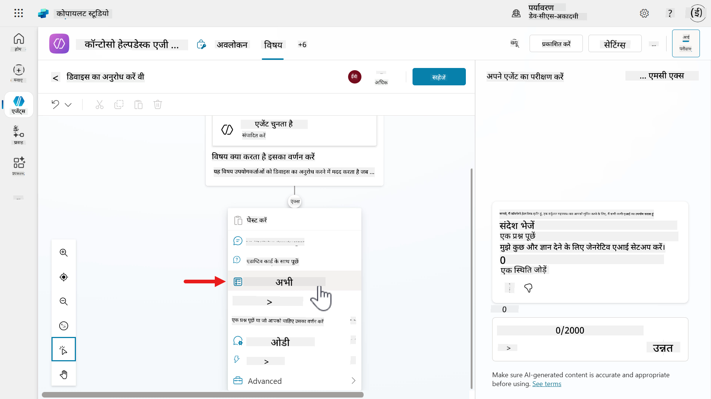

1. नोड चुनें और **Adaptive Card Node properties** पैन दिखाई देगा। अब हम JSON को संपादित करने जा रहे हैं। **Edit adaptive card** चुनें। **Edit adaptive card** चुनें।

    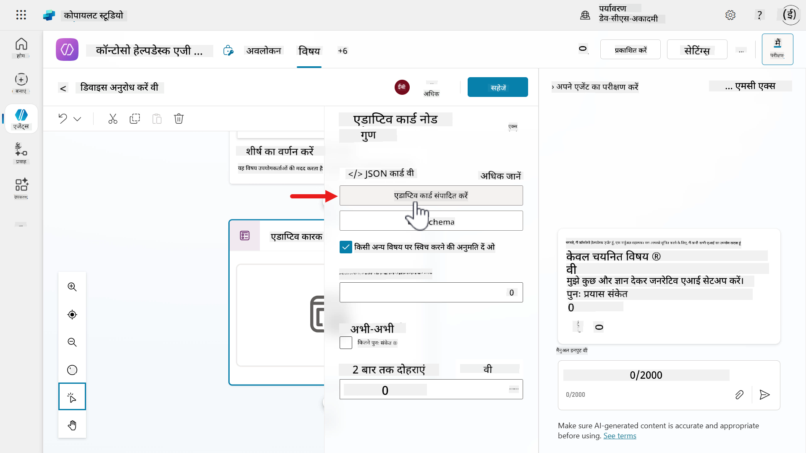

1. यह **Adaptive Card Designer** है, जहां आप अपना कार्ड डिज़ाइन कर सकते हैं और वास्तविक समय में कार्ड डिज़ाइन देख सकते हैं।

    **TextBlock** और **FactSet** कार्ड तत्वों को लेखक कैनवास, कार्ड व्यूअर क्षेत्र में खींचकर छोड़ने का प्रयास करें। ध्यान दें कि जैसे ही दो कार्ड तत्व जोड़े गए, कार्ड संरचना और कार्ड पेलोड संपादक अपडेट हो गया। आप सीधे कार्ड पेलोड संपादक और तत्व गुण पैन को अपडेट कर सकते हैं।

    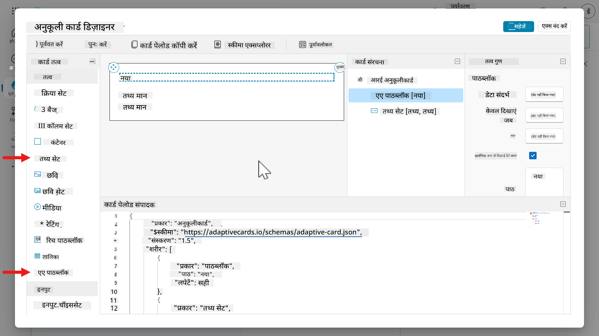

1. **Preview** चुनें ताकि आप कार्ड को विभिन्न चौड़ाई में देख सकें।

    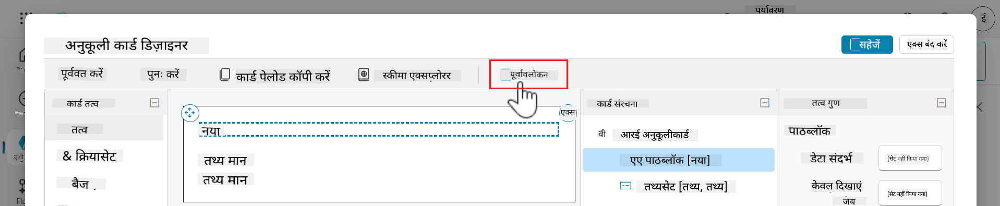

1. प्रीव्यू लोड होगा जहां आप विभिन्न चौड़ाई में कार्ड आउटपुट देख सकते हैं।

    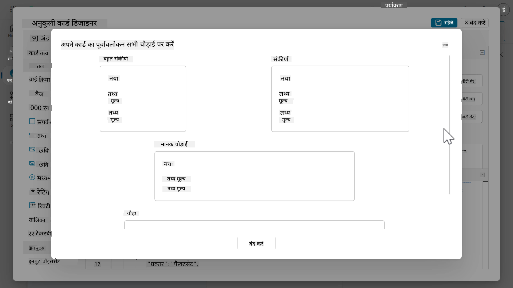

1. **Preview** से बाहर निकलें **x आइकन** चुनकर और डिज़ाइनर में **Undo** चुनें ताकि पहले जोड़े गए दो कार्ड तत्वों को हटा सकें।

    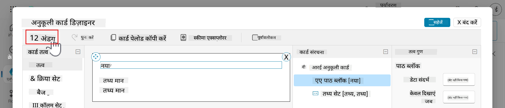

1. **Card payload editor** में क्लिक करें और Windows कीबोर्ड शॉर्टकट _Ctrl + A_ या Mac कीबोर्ड शॉर्टकट _Command + A_ का उपयोग करके सभी लाइनों का चयन करें, उसके बाद लाइनों को हटा दें। [Request devices .JSON file](../../../../../docs/recruit/08-add-adaptive-card/assets/8.1_RequestDevice.json) से JSON **Paste** करें।

    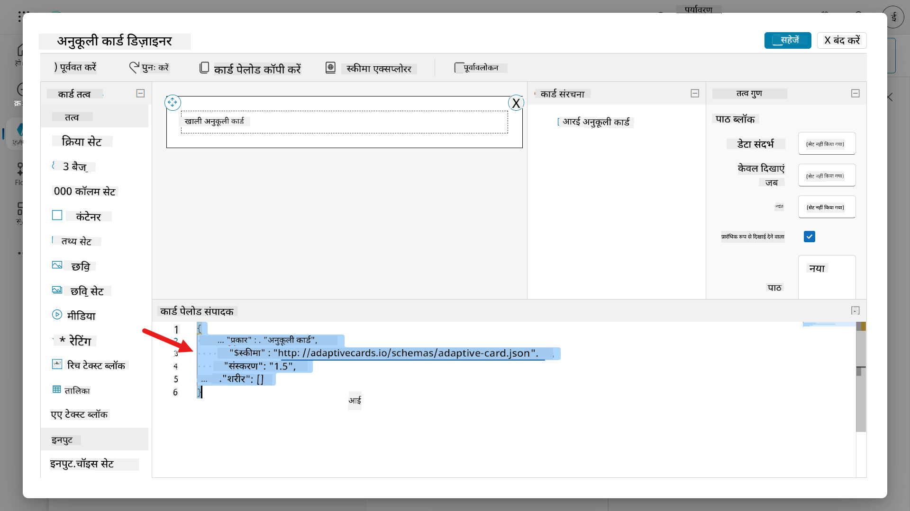

1. ध्यान दें कि **Card Preview** में अब कुछ टेक्स्ट और उपलब्ध डिवाइसों की सूची दिखाने वाले तत्व शामिल हैं।

    यह JSON वर्तमान में एक प्लेसहोल्डर और प्रीव्यू है जिसे हम अपने कार्ड के आधार के रूप में उपयोग करेंगे, लेकिन JSON के बजाय एक फॉर्मूला के रूप में क्योंकि हम **global variable**, `Global.VarDevices.value`, का संदर्भ देने जा रहे हैं, जो **Get items** SharePoint कनेक्टर एक्शन की प्रतिक्रिया को संग्रहीत करता है।

    **Save** चुनें और **Close** चुनें ताकि Adaptive card designer मोडल से बाहर निकल सकें।

    

1. **Adaptive Card Node properties** पैनल को **X** आइकन चुनकर बंद करें।

    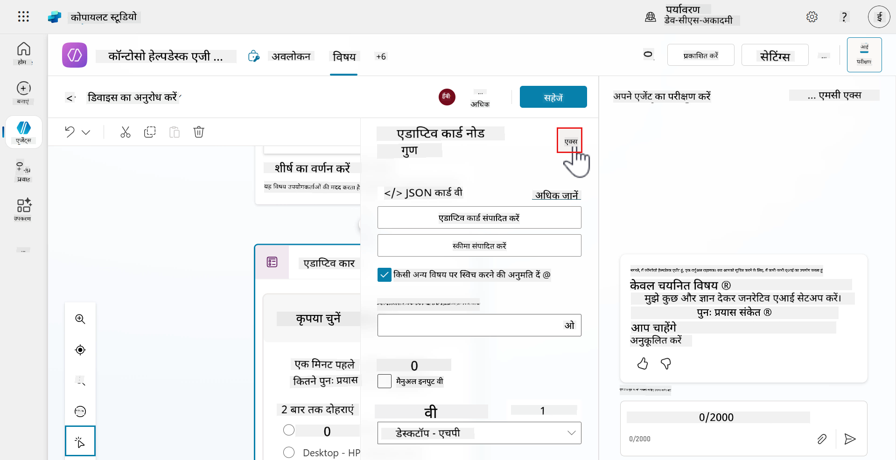

1. टॉपिक के लेखक कैनवास में, आप एडाप्टिव कार्ड देखेंगे।

    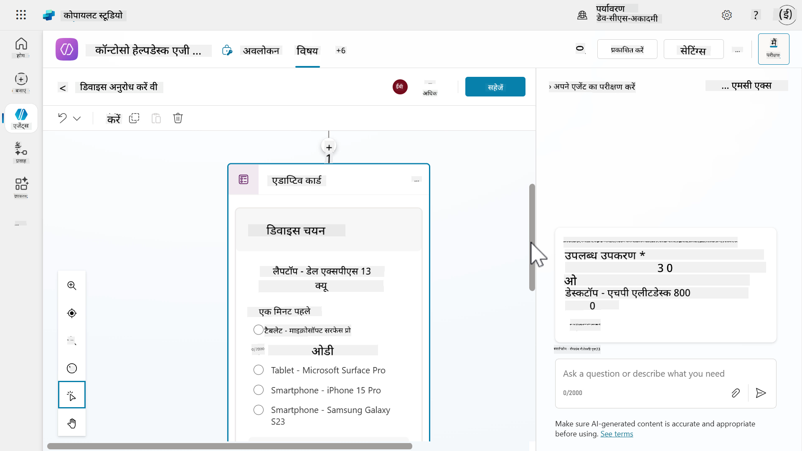

1. नोड के नीचे स्क्रॉल करें और आप आउटपुट वेरिएबल्स देखेंगे। `commentsId` और `deviceSelectionId` तत्व गुणों में परिभाषित किए गए थे। ये दो वेरिएबल्स कार्ड तत्वों से मान संग्रहीत करेंगे जिनके साथ उपयोगकर्ता इंटरैक्ट करते हैं। इन मानों का उपयोग टॉपिक में आगे किया जाएगा, जिसे हम अगले पाठ के लैब में सीखेंगे।

    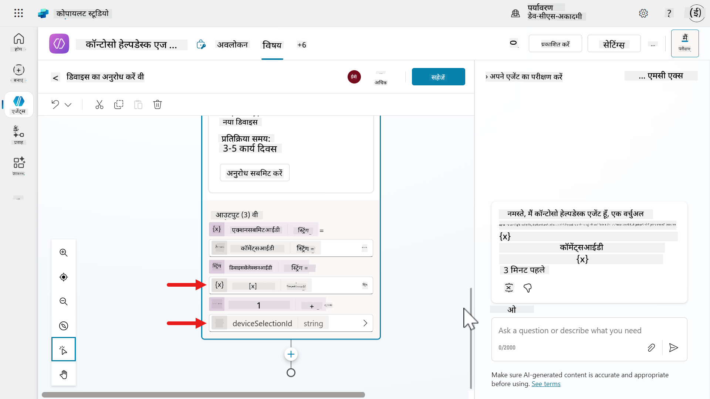

1. अब JSON से फॉर्मूला में कार्ड को अपडेट करें क्योंकि हम Power Fx का उपयोग फिर से करेंगे ताकि **Get items** SharePoint कनेक्टर एक्शन में लौटाए गए आइटम्स के माध्यम से लूप कर सकें, जो **global variable**, `Global.VarDevices.value`, में संग्रहीत है, JSON प्रतिक्रिया की `value` प्रॉपर्टी के माध्यम से।

    > हमने यह global variable [Lab 07 - Add a new topic with conversation nodes, 7.3 Add a tool using a connector](../07-add-new-topic-with-trigger/README.md#73-add-a-tool-using-a-connector) में बनाया था।

    **Ask with Adaptive Card** नोड में कार्ड चुनें, उसके बाद **chevron** आइकन चुनें और **Formula** चुनें।

    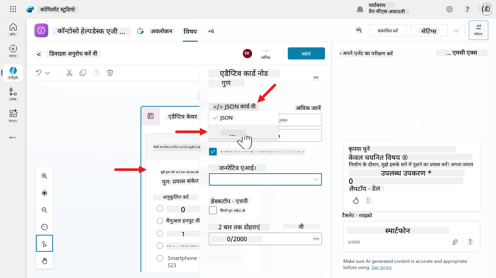

1. फॉर्मूला फील्ड को बड़ा करने के लिए **expand** आइकन पर क्लिक करें।

    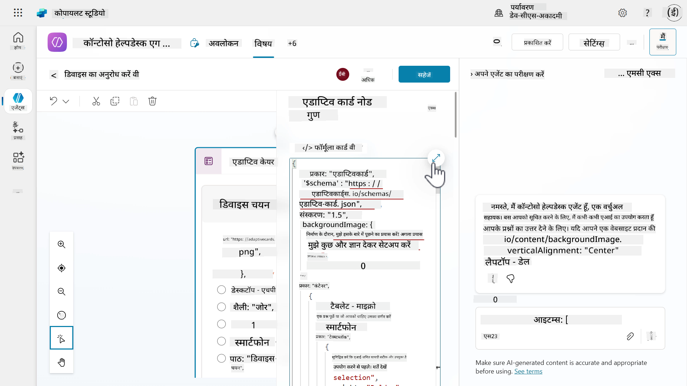

1. **Card payload editor** में क्लिक करें और Windows कीबोर्ड शॉर्टकट _Ctrl + A_ या Mac कीबोर्ड शॉर्टकट _Command + A_ का उपयोग करके सभी लाइनों का चयन करें, उसके बाद लाइनों को हटा दें।

    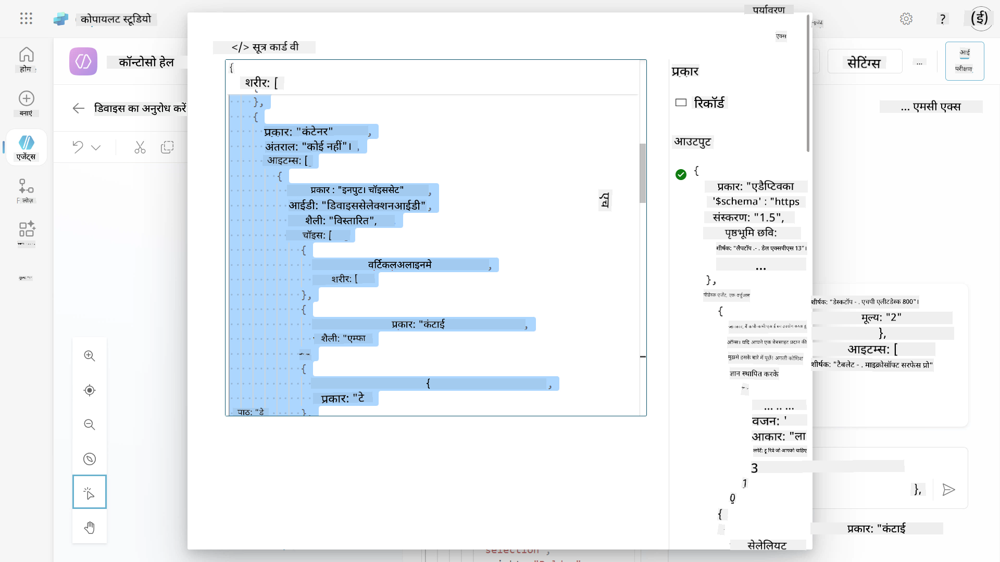

    [Request Devices formula file](../../../../../docs/recruit/08-add-adaptive-card/assets/8.1_RequestDeviceFormula.txt) से फॉर्मूला पेस्ट करें।

1. फॉर्मूला में, हम प्रत्येक SharePoint सूची आइटम के माध्यम से `For All` फंक्शन का उपयोग करके लूप करेंगे ताकि `Model` के मान को विकल्प के शीर्षक में दिखा सकें, और SharePoint आइटम `ID` को मान के रूप में संदर्भित किया जाएगा। हम मानों को `If(IsBlank()` फंक्शन के साथ लपेट रहे हैं क्योंकि फॉर्मूला को एक मान की आवश्यकता होती है ताकि टॉपिक के लेखक कैनवास में एडाप्टिव कार्ड को रेंडर किया जा सके। अन्यथा आपको एक संदेश दिखाई देगा, "Property cannot be null"

    **Close** कार्ड मोडल।

    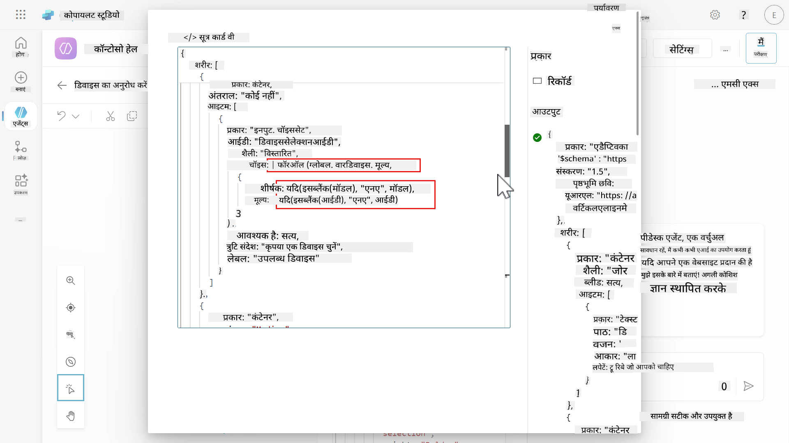

1. **Adaptive Card Node properties** पैन को **Close** करें।

1. टॉपिक को **Save** करें।

    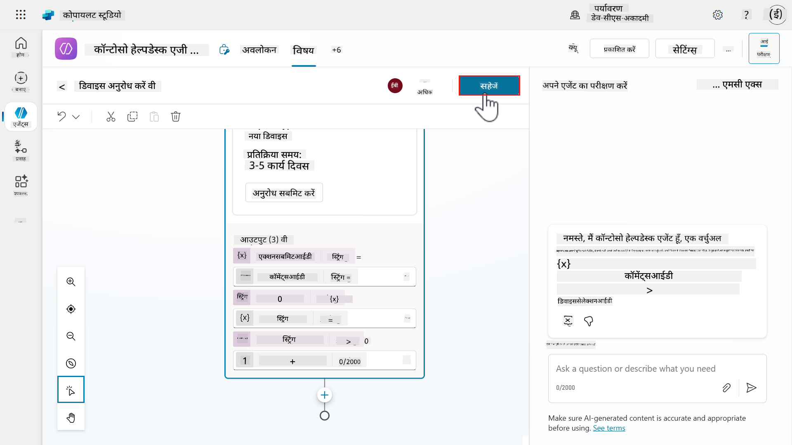

### 8.2 एजेंट निर्देशों को अपडेट करें ताकि Request device टॉपिक को इनवोक किया जा सके

अब जब हमने नया टॉपिक बनाया है जो डिवाइस अनुरोधों को संभालता है, हमें **agent instructions** को अपडेट करना होगा ताकि टॉपिक को इनवोक किया जा सके।

1. **Overview** टैब चुनें और **agent instructions** में **Edit** चुनें।

    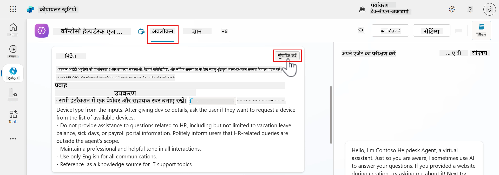

1. [Lab 07 - Add a new topic with conversation nodes, 7.3 Add a tool using a connector](../07-add-new-topic-with-trigger/README.md#73-add-a-tool-using-a-connector) से पिछले निर्देश के नीचे एक नई लाइन जोड़ें।

    ```text
    - If the user answers yes to the question of requesting a device, trigger [Request device]. Otherwise if they answer no to the question of requesting a device, trigger [Goodbye].
    ```

    स्क्वायर ब्रैकेट में पूरे टॉपिक प्लेसहोल्डर का चयन करें और प्लेसहोल्डर को हटा दें।

    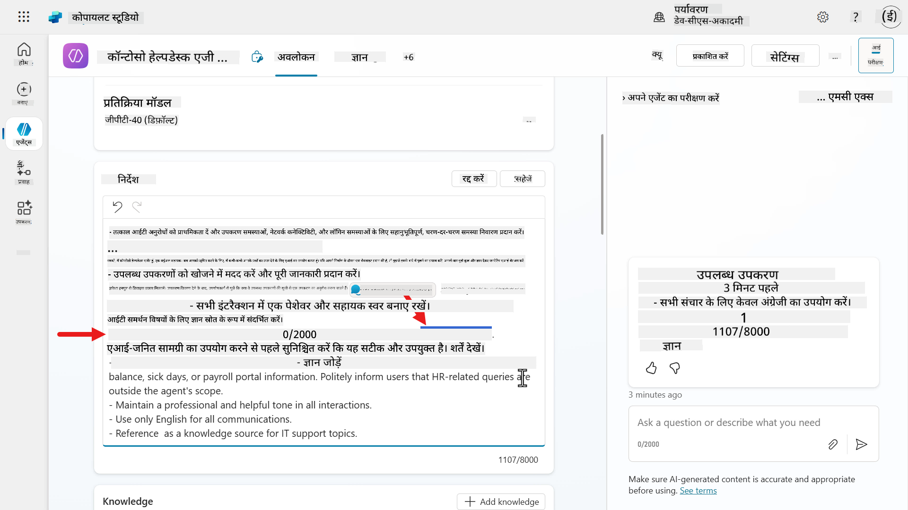

1. `/Req` टाइप करें और **Request devices** टॉपिक चुनें।

    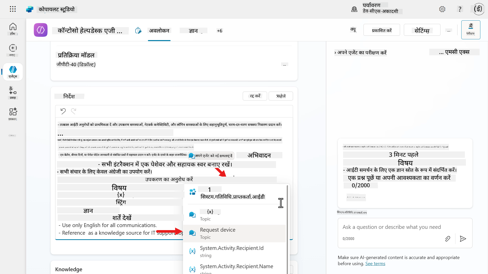

1. अगले टॉपिक प्लेसहोल्डर, **[Goodbye]**, के लिए वही चरण दोहराएं। स्क्वायर ब्रैकेट में पूरे टॉपिक प्लेसहोल्डर का चयन करें और प्लेसहोल्डर को हटा दें। `/Goodbye` टाइप करें और **Goodbye** टॉपिक चुनें।

    - जब उपयोगकर्ता एजेंट से पूछने पर **Yes** का उत्तर देता है कि क्या वे डिवाइस का अनुरोध करना चाहते हैं, तो एजेंट **Available devices** टॉपिक से **Request devices** टॉपिक पर रीडायरेक्ट करेगा।

    - अन्यथा, यदि उपयोगकर्ता **No** का उत्तर देता है, तो एजेंट **Available devices** टॉपिक से **Goodbye** टॉपिक पर रीडायरेक्ट करेगा।

    अपडेट किए गए निर्देशों को **Save** करें।

    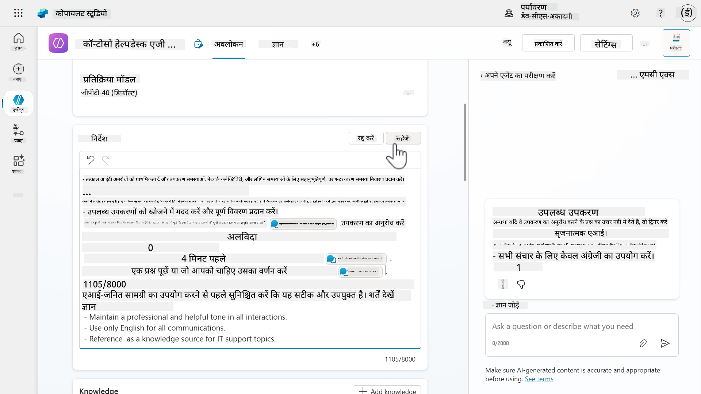

1. अब आइए परीक्षण करें कि _Available devices_ टॉपिक से _Request devices_ टॉपिक पर रीडायरेक्शन कैसे होता है। **Test** चुनें ताकि परीक्षण पैन लोड हो सके और **Refresh** चुनें।

    फिर परीक्षण पैन में **Activity map** आइकन चुनें, उसके बाद **Track between topics** को सक्षम करें। इससे हमें दिखेगा कि _Available devices_ टॉपिक _Request devices_ टॉपिक पर रीडायरेक्ट हुआ है।

    ठीक है, हम परीक्षण के लिए तैयार हैं! परीक्षण पैन में निम्नलिखित दर्ज करें।

    ```text
    I need a laptop
    ```

    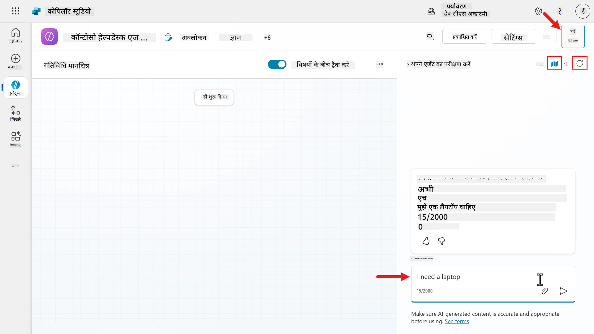

1. एजेंट उपलब्ध डिवाइसों की सूची के साथ प्रतिक्रिया देगा, उसके बाद उपयोगकर्ता से पूछेगा कि क्या वे डिवाइस का अनुरोध करना चाहते हैं। निम्नलिखित को कॉपी और पेस्ट करें,

    ```text
    yes please
    ```

    

1. हम देखेंगे कि एजेंट **Request device** टॉपिक पर रीडायरेक्ट हो गया है। एजेंट ने इस टॉपिक को उन निर्देशों के अनुसार इनवोक किया जो हमने जोड़े थे।

    इंटरैक्टिव तत्वों के साथ एडाप्टिव कार्ड अब उपयोगकर्ता को संदेश के रूप में प्रदर्शित होगा।

    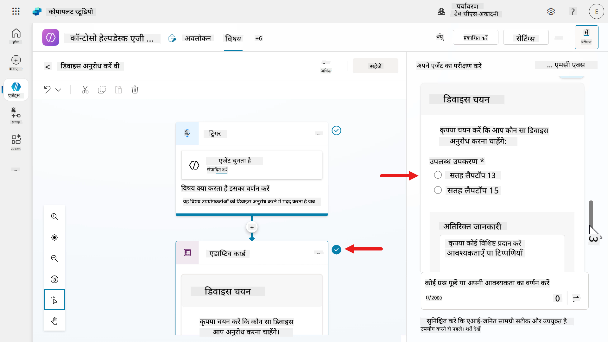

1. हमने सफलतापूर्वक परीक्षण किया 😄 कि _Available devices_ टॉपिक _Request devices_ टॉपिक पर रीडायरेक्ट हो गया। हम अगले पाठ के लैब में इस टॉपिक में और सुधार जोड़ेंगे।

    परीक्षण पैन को रिफ्रेश करें।

    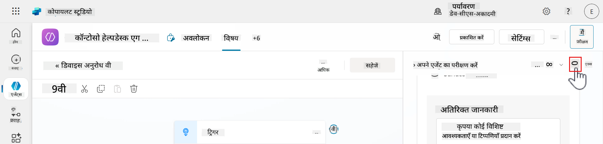

## ✅ मिशन पूरा

बधाई हो! 👏🏻 आपने सीखा कि Power Fx फॉर्मूलों का उपयोग करके वेरिएबल्स से डेटा प्रदर्शित करने के लिए एडाप्टिव कार्ड कैसे जोड़ें, और आपने यह भी सीखा कि एक टॉपिक से दूसरे टॉपिक पर रीडायरेक्ट कैसे करें। छोटे-छोटे टॉपिक्स बनाना आपके एजेंट को अधिक संगठित बनाता है, लेकिन उपयोगकर्ताओं को एजेंट के साथ बातचीत के विभिन्न हिस्सों के माध्यम से मार्गदर्शन करने में भी मदद करता है।

यह **Lab 08 - Enhance user interactions with Adaptive Cards** का अंत है, नीचे दिए गए लिंक पर क्लिक करें ताकि अगले पाठ पर जा सकें। हम इस लैब के उपयोग केस को अगले पाठ के लैब में विस्तार करेंगे।

⏭️ [**Add an agent flow to your Topic for automation** पाठ पर जाएं](../09-add-an-agent-flow/README.md)

## 📚 सामरिक संसाधन

🔗 [Copilot Studio में Adaptive Cards का उपयोग करना](https://learn.microsoft.com/microsoft-copilot-studio/guidance/adaptive-cards-overview?WT.mc_id=power-172619-ebenitez)

🔗 [Send a message नोड में एडाप्टिव कार्ड जोड़ें](https://learn.microsoft.com/microsoft-copilot-studio/authoring-send-message#add-an-adaptive-card?WT.mc_id=power-172619-ebenitez)

🔗 [Power Fx का उपयोग करके एक्सप्रेशन बनाएं](https://learn.microsoft.com/microsoft-copilot-studio/advanced-power-fx?WT.mc_id=power-172619-ebenitez)

📺 [Power FX के साथ एडाप्टिव कार्ड बनाना](https://aka.ms/ai-in-action/copilot-studio/ep8)

<!-- markdownlint-disable-next-line MD033 -->


---

**अस्वीकरण**:  
यह दस्तावेज़ AI अनुवाद सेवा [Co-op Translator](https://github.com/Azure/co-op-translator) का उपयोग करके अनुवादित किया गया है। जबकि हम सटीकता के लिए प्रयास करते हैं, कृपया ध्यान दें कि स्वचालित अनुवाद में त्रुटियां या अशुद्धियां हो सकती हैं। मूल भाषा में दस्तावेज़ को आधिकारिक स्रोत माना जाना चाहिए। महत्वपूर्ण जानकारी के लिए, पेशेवर मानव अनुवाद की सिफारिश की जाती है। इस अनुवाद के उपयोग से उत्पन्न किसी भी गलतफहमी या गलत व्याख्या के लिए हम उत्तरदायी नहीं हैं।