<!--
CO_OP_TRANSLATOR_METADATA:
{
  "original_hash": "cc4afa4a5a11c9d03896decfbcbd4060",
  "translation_date": "2025-10-21T18:26:57+00:00",
  "source_file": "docs/recruit/09-add-an-agent-flow/README.md",
  "language_code": "hi"
}
-->
# 🚨 मिशन 09: अपने टॉपिक में एजेंट फ्लो जोड़ें ऑटोमेशन के लिए

## 🕵️‍♂️ कोडनेम: `ऑपरेशन ऑटोमेशन पावरहाउस`

> **⏱️ ऑपरेशन का समय:** `~30 मिनट`  

🎥 **वॉकथ्रू देखें**

[](https://www.youtube.com/watch?v=vtLZJT3eBXg "YouTube पर वॉकथ्रू देखें")

## 🎯 मिशन का विवरण

आपका एजेंट अब उपयोगकर्ताओं से बातचीत कर सकता है और जानकारी प्रदान कर सकता है, लेकिन असली ऑपरेशनल उत्कृष्टता के लिए आपके एजेंट को कार्रवाई करने की आवश्यकता है। यह मिशन आपके संवादात्मक एजेंट को एक ऑटोमेशन पावरहाउस में बदल देगा, जिससे इसे एजेंट फ्लो के साथ सुसज्जित किया जाएगा।

मिशन के अंत तक, आप एक एंड-टू-एंड डिवाइस रिक्वेस्ट ऑटोमेशन बना चुके होंगे जो उपयोगकर्ता इनपुट को एक एडैप्टिव कार्ड के माध्यम से कैप्चर करता है, SharePoint से डेटा प्राप्त करता है, ईमेल के माध्यम से प्रबंधकों को सूचनाएं भेजता है, और उपयोगकर्ताओं को सहज प्रतिक्रिया प्रदान करता है - यह सब आपके एजेंट द्वारा बुद्धिमान वर्कफ़्लो ऑटोमेशन के माध्यम से संचालित होता है।

## 🔎 उद्देश्य

इस मिशन में, आप सीखेंगे:

1. एजेंट फ्लो क्या हैं और ऑटोमेशन के लिए Power Automate क्लाउड फ्लो से कैसे अलग हैं
1. एजेंट फ्लो को शक्तिशाली बनाने वाली मुख्य विशेषताओं को समझना, जिसमें AI एक्शन और प्राकृतिक भाषा लेखन शामिल हैं
1. एजेंट फ्लो डिज़ाइनर का अन्वेषण करना और गतिशील डेटा हैंडलिंग के लिए एक्सप्रेशन का उपयोग करना
1. SharePoint डेटा और ईमेल सूचनाओं को एकीकृत करने वाला एक पूर्ण डिवाइस रिक्वेस्ट ऑटोमेशन बनाना

## 🤔 एजेंट फ्लो क्या है?

एजेंट फ्लो दोहराए जाने वाले कार्यों को स्वचालित करने और आपके ऐप्स और सेवाओं को एकीकृत करने का एक शक्तिशाली तरीका है। इन्हें संरचित, चरण-दर-चरण वर्कफ़्लो के रूप में सोचें जिन्हें आपका एजेंट कार्यों को स्वचालित करने या अन्य एप्लिकेशन और सेवाओं के साथ कनेक्ट करने के लिए निष्पादित कर सकता है। आप इन्हें मिनी वर्कफ़्लो के रूप में सोच सकते हैं जो आपके एजेंट को नोटिफिकेशन भेजने, रिकॉर्ड अपडेट करने, या इवेंट्स का जवाब देने जैसे कार्य करने में मदद करते हैं।

स्वायत्त एजेंटों के विपरीत जो AI का उपयोग करके तुरंत निर्णय लेते हैं, एजेंट फ्लो **निर्धारित वर्कफ़्लो** हैं - यानी वे हर बार एक ही रास्ता अपनाते हैं, जिससे लगातार और विश्वसनीय परिणाम सुनिश्चित होते हैं।

सरल शब्दों में:

- वे आपके एजेंट को _कार्य करने_ में मदद करते हैं, न कि केवल उपयोगकर्ताओं से _बात करने_ में।
- ये टॉपिक्स और एजेंट्स के बीच पुन: उपयोग योग्य हैं और उपयोगकर्ता संदेशों, इवेंट्स, या अन्य एप्लिकेशन और सेवाओं द्वारा ट्रिगर किए जा सकते हैं।

## 🙋🏽 हां, लेकिन यह Power Automate क्लाउड फ्लो से कैसे अलग है?

एजेंट फ्लो और Power Automate क्लाउड फ्लो दोनों ही कार्यों को स्वचालित करने में मदद करते हैं। इन्हें अलग-अलग उद्देश्यों के लिए डिज़ाइन किया गया है और ये अलग-अलग तरीकों से काम करते हैं।

### 🤖 Copilot Studio में एजेंट फ्लो

**यह किसके लिए है:**

- Copilot Studio में संवादात्मक और स्वायत्त एजेंटों (एजेंट निर्देशों के माध्यम से) के लिए बनाया गया।
- स्मार्ट, AI-चालित ऑटोमेशन पर केंद्रित जो बिजनेस सिस्टम्स के साथ इंटरैक्ट करता है।

**यह उपयोगी क्यों है:**

- Copilot Studio में सीधे बनाना और प्रबंधित करना आसान।
- उपयोगकर्ताओं के साथ बातचीत के दौरान होने वाले कार्यों को स्वचालित करने के लिए शानदार, जैसे छुट्टी का अनुरोध सबमिट करना।
- आपको अलग से Power Automate लाइसेंस की आवश्यकता नहीं है क्योंकि बिलिंग Copilot Studio के अंदर उपयोग के आधार पर होती है। यह एंटरप्राइज टीमों के लिए समय और लागत बचा सकता है।

**सीमाएं:**

- आप इन्हें साझा, कॉपी, या सह-मालिक असाइन नहीं कर सकते।
- एजेंट फ्लो केवल Copilot Studio के अंदर दिखाई और उपयोग किए जा सकते हैं।
- वर्तमान में, एजेंटों के लिए इवेंट ट्रिगर Power Automate मेकर पोर्टल में संपादित किए जा सकते हैं।

### ☁️ Power Automate क्लाउड फ्लो

**यह किसके लिए है:**

- कई ऐप्स और सेवाओं के बीच सामान्य-उद्देश्य ऑटोमेशन के लिए डिज़ाइन किया गया।
- स्वतंत्र रूप से चल सकता है या एजेंट फ्लो के साथ काम कर सकता है।

**यह उपयोगी क्यों है:**

- कनेक्टर्स की विस्तृत श्रृंखला प्रदान करता है।
- एजेंटों के बाहर प्रक्रियाओं को स्वचालित करने के लिए आदर्श।
- टीमों के बीच साझा, पुन: उपयोग और प्रबंधित किया जा सकता है।

**आवश्यकताएं:**

- इसे उपयोग करने के लिए आपको Power Automate लाइसेंस की आवश्यकता है।

### 📗 सारांश

| इसका उपयोग करें | जब आप चाहते हैं कि |
| :- | :- |
| एजेंट फ्लो | एजेंट के अंदर कार्यों को स्वचालित करें, AI का उपयोग करें, और सब कुछ Copilot Studio में रखें |  
| Power Automate क्लाउड फ्लो | ऐप्स और सेवाओं के बीच ऑटोमेशन करें, या एजेंटों के बाहर वर्कफ़्लो बनाएं |

## 👍🏻 एजेंट फ्लो का उपयोग क्यों करें

एजेंट फ्लो हमेशा एक निश्चित पथ का अनुसरण करते हैं - वे हर बार एक ही इनपुट दिए जाने पर वही काम करते हैं।

यह उन्हें बनाता है:

- **विश्वसनीय** - आप भरोसा कर सकते हैं कि वे हर बार एक ही तरीके से व्यवहार करेंगे।
- **पूर्वानुमान योग्य** - आप जानते हैं कि फ्लो चलने पर क्या परिणाम अपेक्षित है।
- **नियम आधारित** - वे उन चरणों का पालन करते हैं जिन्हें आप परिभाषित करते हैं।

अन्य लाभ हैं:

- **ऑटोमेशन** - आपके एजेंट को फॉर्म सबमिट करने या नोटिफिकेशन भेजने जैसे दोहराए जाने वाले कार्यों को संभालने में सक्षम बनाता है।
- **कनेक्टेड** - ServiceNow, SharePoint, Salesforce जैसे 1400+ कनेक्टर्स के साथ कनेक्ट करें। अन्यथा आप अपना कस्टम कनेक्टर बना सकते हैं।
- **कसकर एकीकृत** - एजेंट फ्लो एजेंट की लॉजिक का हिस्सा हैं, वे सीधे उपयोगकर्ता संदेशों या बातचीत में क्रियाओं द्वारा ट्रिगर होते हैं।
- **स्केलेबिलिटी** - कई एजेंटों या परिदृश्यों में फ्लो को पुन: उपयोग करें।
- **नो-कोड या लो-कोड** - आप प्राकृतिक भाषा या विज़ुअल डिज़ाइनर का उपयोग करके फ्लो बना सकते हैं।
- **ऑल-इन-वन प्लेटफॉर्म** - आप Copilot Studio में एक ही स्थान पर एजेंट फ्लो डिज़ाइन, टेस्ट और डिप्लॉय कर सकते हैं। प्लेटफॉर्म के बीच स्विच करने की आवश्यकता नहीं है।

## 🏄🏻‍♂️ एजेंट फ्लो आपके एजेंट को कैसे बढ़ाते हैं?

एजेंट फ्लो आपके एजेंट को उपयोगकर्ताओं के साथ "चैटिंग" से परे कार्य करने और सिस्टम्स के साथ इंटरैक्ट करने की अनुमति देते हैं।

मान लीजिए आप वित्त विभाग में काम कर रहे हैं और आपको विक्रेताओं से बहुत सारे इनवॉइस मिलते हैं। आमतौर पर, किसी को प्रत्येक इनवॉइस पढ़ना होता है, महत्वपूर्ण विवरण निकालना होता है - राशि, तारीख, यह किससे है, और यह सुनिश्चित करना होता है कि सब कुछ आपके रिकॉर्ड से मेल खाता है। फिर इसे अनुमोदन के लिए सही व्यक्ति को भेजना होता है। इसमें समय और प्रयास लगता है।

Copilot Studio में एजेंट फ्लो के साथ, आप इस प्रक्रिया को स्वचालित कर सकते हैं। जैसे ही इनवॉइस आता है, एजेंट:

1. बुद्धिमान दस्तावेज़ प्रसंस्करण का उपयोग करके मुख्य जानकारी खोजने के लिए दस्तावेज़ पढ़ता है।
1. आपके एंटरप्राइज डेटा के खिलाफ विवरण की जांच करता है ताकि यह सुनिश्चित हो सके कि सब कुछ सही दिखता है।
1. इसे अनुमोदन के लिए सही व्यक्ति को भेजता है।

यह समय बचाता है, गलतियों को कम करता है और पूरी प्रक्रिया को अधिक सुचारू बनाता है।

### इसे इस तरह सोचें

- **एजेंट्स**: स्मार्ट निर्णय लेने वाले
- **एजेंट फ्लो**: विश्वसनीय निष्पादक

### यह क्यों महत्वपूर्ण है

- आपको दोनों दुनियाओं का सर्वश्रेष्ठ मिलता है: विश्वसनीय ऑटोमेशन और लचीला AI।
- जैसे-जैसे आपके व्यवसाय की ज़रूरतें बदलती हैं, फ्लो को बनाना और अपडेट करना आसान है।
- आप टीमों में ऑटोमेशन को स्केल कर सकते हैं।

## 🔌 एजेंट फ्लो को शक्तिशाली बनाने वाली मुख्य विशेषताएं

1. **प्राकृतिक भाषा लेखन**
    - आप साधारण अंग्रेजी में बता सकते हैं कि आप फ्लो से क्या चाहते हैं।
    - Copilot आपके इरादे को समझता है और आपके लिए फ्लो बनाता है।
    - कोड लिखने की आवश्यकता नहीं - बस अपना विचार समझाएं।

1. **AI एक्शन**

    AI का उपयोग करें:

    - दस्तावेज़ या छवियों को पढ़ने और समझने के लिए।
    - लंबे कंटेंट को छोटे, उपयोगी उत्तरों में संक्षेपित करने के लिए।
    - स्मार्ट सिफारिशें या निर्णय लेने के लिए।

1. **जेनरेटिव एक्शन**
    - ये फ्लो को वास्तविक समय में अनुकूलित करने देते हैं।
    - एजेंट बदलती जानकारी के आधार पर चरणों की योजना बना सकता है और समायोजित कर सकता है।

1. **इंटीग्रेशन एक्शन**
    - अपने फ्लो को Outlook, Microsoft Teams, ServiceNow, SharePoint और अन्य एप्लिकेशन और सेवाओं से कनेक्ट करें, +1400 बिल्ट-इन कनेक्टर्स या अपने कस्टम कनेक्टर के माध्यम से।
    - यह आपके एजेंट को उन ऐप्स के साथ काम करने में मदद करता है जो आपकी टीम पहले से उपयोग करती है।

1. **ह्यूमन इन द लूप**
    - अनुमोदन चरण जोड़ें जहां किसी व्यक्ति को कुछ समीक्षा या पुष्टि करनी होती है।
    - [एडवांस्ड अनुमोदन](https://learn.microsoft.com/microsoft-copilot-studio/flows-advanced-approvals?WT.mc_id=power-172621-ebenitez) रिमाइंडर, डेलीगेशन, और मल्टी-स्टेज अनुमोदन का समर्थन करता है।

## ⚙️ वे कैसे काम करते हैं

1. **ट्रिगर**

    एक इवेंट फ्लो शुरू करता है - जैसे उपयोगकर्ता द्वारा प्रश्न पूछना, टॉपिक से फ्लो को इनवोक करना, निर्धारित समय, या किसी अन्य सिस्टम में इवेंट होना।

1. **एक्शन**

    ये वे चरण हैं जिन्हें एजेंट अगला अनुसरण करता है - ईमेल भेजना, API कॉल करना, ServiceNow में टिकट अपडेट करना।

## 🧶 एजेंट फ्लो कैसे बनाएं

1. **प्राकृतिक भाषा**: बताएं कि आप चाहते हैं कि एजेंट क्या करे, और Copilot इसे आपके लिए बनाता है।
1. **डिज़ाइनर कैनवास**: एजेंट फ्लो डिज़ाइनर में एक्शन, कंडीशन और लूप को खींचें और छोड़ें।

## 🎨 एजेंट फ्लो डिज़ाइनर क्या है?

यह Copilot Studio में एक विज़ुअल टूल है जो आपको एजेंट फ्लो बनाने, संपादित करने, और प्रबंधित करने में मदद करता है जो आपके एजेंट को कार्यों को पूरा करने के लिए चरण-दर-चरण निर्देश प्रदान करता है। इसे उपयोग करने में आसान बनाया गया है, भले ही आप एजेंट फ्लो में नए हों।

### एजेंट फ्लो डिज़ाइनर की मुख्य विशेषताएं

1. **विज़ुअल कैनवास**
    - आप अपने पूरे फ्लो को एक डायग्राम की तरह देख सकते हैं।
    - आसानी से ज़ूम इन/आउट करें, व्यू फिट करें या बड़े फ्लो को नेविगेट करने के लिए मिनीमैप का उपयोग करें।

1. **एक्शन जोड़ें और हटाएं**
    - नया एक्शन जोड़ने के लिए _प्लस (+)_ बटन पर क्लिक करें जैसे संदेश भेजना या SharePoint सूची में आइटम अपडेट करना।
    - आप कनेक्टर्स से एक्शन खोज सकते हैं और इसे उसकी सेटिंग्स के माध्यम से कॉन्फ़िगर कर सकते हैं।
    - एक्शन हटाने के लिए, _तीन डॉट्स (⋮)_ पर क्लिक करें और _डिलीट_ चुनें।

1. **पैरामीटर जांचें**
    - किसी भी एक्शन पर क्लिक करें ताकि उसकी सेटिंग्स को देखा या संपादित किया जा सके जिसे _पैरामीटर_ कहा जाता है।
    - आप मैन्युअल रूप से मान दर्ज कर सकते हैं या उन्हें गतिशील बनाने के लिए _एक्सप्रेशन_ का उपयोग कर सकते हैं।

1. **वर्जन हिस्ट्री**
    - हर बार जब आप अपना फ्लो सेव करते हैं, तो एक वर्जन रिकॉर्ड किया जाता है।
    - आप वापस जाकर पिछले वर्जन को देख या पुनर्स्थापित कर सकते हैं यदि आवश्यक हो।

1. **एरर चेकिंग**
    - _फ्लो चेकर_ किसी भी त्रुटि को हाइलाइट करता है।
    - फ्लो को प्रकाशित करने से पहले सभी त्रुटियों को हल करना होगा।

1. **पब्लिश और टेस्ट**
    - एक बार जब आपका फ्लो त्रुटि-मुक्त हो जाए, तो इसे लाइव बनाने के लिए प्रकाशित करें।
    - _टेस्ट_ फीचर का उपयोग करके अपने फ्लो को मैन्युअल या स्वचालित रूप से चलाएं और जांचें कि यह अपेक्षित रूप से काम करता है या नहीं।

### एजेंट फ्लो डिज़ाइनर का उपयोग क्यों करें?

- **विज़ुअल और सहज** - आप फ्लो को खींचकर और क्लिक करके बना सकते हैं।
- **प्रयोग करने के लिए सुरक्षित** - वर्जन हिस्ट्री आपको बदलावों को पूर्ववत करने देती है।
- **बिल्ट-इन टेस्टिंग** - यह सुनिश्चित करने में मदद करता है कि सब कुछ लाइव होने से पहले काम करता है।

## 🔤 आपने _एक्सप्रेशन_ का उल्लेख किया - एक्सप्रेशन क्या हैं?

एक्सप्रेशन छोटे फॉर्मूले या कमांड हैं जो आपके एजेंट फ्लो को डेटा के साथ काम करने में मदद करते हैं। आप उनका उपयोग मानों की गणना करने, टेक्स्ट को फॉर्मेट करने, निर्णय लेने, या इनपुट से विशिष्ट जानकारी निकालने के लिए करते हैं।

### एक्सप्रेशन का उपयोग क्यों करें?

एक्सप्रेशन आपको:

- **डेटा को संभालने का तरीका कस्टमाइज़ करने** - नामों को जोड़ना, तारीखों को फॉर्मेट करना।
- **निर्णय लेने** - यदि कोई मान 10 से अधिक है, तो कुछ करें।
- **डेटा को ट्रांसफॉर्म करने** - टेक्स्ट को लोअरकेस में बदलना, स्ट्रिंग का हिस्सा निकालना।
- **लॉजिक को स्वचालित करने** - बिना पूरा कोड लिखे।

### एक्सप्रेशन कैसे दिखते हैं?

एक्सप्रेशन फंक्शन का उपयोग करते हैं। मैं Microsoft MVP, Jerry Weinstock से फंक्शन क्या हैं, इसका एक स्पष्टीकरण उधार लेने जा रहा हूं।

!!! quote
    फंक्शन आपके डेटा को सरल या जटिल ऑपरेशंस के माध्यम से ट्रांसफॉर्म करने के लिए बिल्ट-इन लॉजिक हैं।

फंक्शन आपको कोड लिखने की आवश्यकता के बिना एक्सप्रेशन बनाने में सक्षम बनाते हैं।

जिस तरह मैं इसे समझाता हूं, वह यह है कि एजेंट फ्लो में एक फंक्शन Excel फंक्शन के समान है। आप डेटा पर ऑपरेशन कर सकते हैं ताकि इसे वांछित आउटपुट में ट्रांसफॉर्म किया जा सके। Excel में फॉर्मूला बनाते समय आप इनपुट मान को टेबल या रेंज में सेल्स से चुनते हैं, और फिर डेटा आउटपुट को मैनिपुलेट करने के लिए फंक्शन लागू करते हैं। उदाहरण के लिए, `COUNT` फंक्शन का उपयोग करके यह पता लगाना कि किसी रेंज में कितने सेल्स में नंबर हैं।

एजेंट फ्लो में, टेबल में सेल्स से डेटा संदर्भित करने के बजाय, आप ट्रिगर या एक्शन से डेटा आउटपुट को संदर्भित कर रहे हैं जब आप अपने एक्सप्रेशन बना रहे हैं। पिछले उदाहरण को जारी रखते हुए, _Get items_ SharePoint कनेक्टर एक्शन से लौटाए गए आइटम की संख्या प्राप्त करने के लिए `length` फंक्शन का उपयोग करें।

### फंक्शन क्यों महत्वपूर्ण हैं?

फंक्शन आपके एजेंट फ्लो को बनाते हैं:

- **स्मार्ट** - वे विभिन्न इनपुट या कंडीशन पर प्रतिक्रिया कर सकते हैं।
- **लचीला** - आप डेटा को संभालने का तरीका कस्टमाइज़ कर सकते हैं।
- **प्रभावी** - आप लॉजिक को स्वचालित करके मैन्युअल चरणों से बचते हैं।

### सबसे उपयोगी फंक्शन

निम्नलिखित एजेंट फ्लो में उपयोग किए जाने वाले सामान्य फंक्शन हैं। फंक्शन की पूरी सूची के लिए, [रेफरेंस गाइड](https://learn.microsoft.com/azure/logic-apps/workflow-definition-language-functions-reference?WT.mc_id=power-172621-ebenitez) पर जाएं।

#### 🔡 टेक्स्ट

- `concat()` - दो या अधिक टेक्स्ट को जोड़ता है।
      - उदाहरण: `concat('Hello ', firstName)` → “Hello John”

- `toLower()` / `toUpper()` - टेक्स्ट को लोअरकेस या अपरकेस में
- उदाहरण: `addDays(utcNow(), 7)` आउटपुट 7 दिन बाद का होगा।

- `formatDateTime()` - एक तारीख को पढ़ने योग्य स्ट्रिंग में बदलता है।
  - उदाहरण: सोमवार, 7 जुलाई, 2025

#### ✅ लॉजिकल

- `if()` - यदि सही हो तो एक मान चलाता है, अन्यथा दूसरा।
  - उदाहरण: `if(score > 50, 'Pass', 'Fail')`

- `equals()` - जांचता है कि दो मान समान हैं या नहीं।

- `and()`, `or()`, `not()` - कई शर्तों को जोड़ता है।

#### 🪣 अन्य उपयोगी फंक्शन

- `coalesce()` - पहला गैर-खाली मान लौटाता है।
  - बैकअप/डिफ़ॉल्ट मानों के लिए उपयोगी।

- `guid()` - एक अद्वितीय आईडी बनाता है।
  - ट्रैकिंग या लॉगिंग के लिए उपयोगी।

- `length()` - गिनता है कि स्ट्रिंग या ऐरे में कितने अक्षर या आइटम हैं।

## ⭐ सर्वोत्तम अभ्यास

Copilot Studio में एजेंट फ्लो बनाने के लिए कुछ सर्वोत्तम अभ्यास यहां दिए गए हैं।

1. **सरल शुरुआत करें और धीरे-धीरे निर्माण करें**

    - एक छोटे, स्पष्ट कार्य से शुरू करें जैसे कि संदेश भेजना।
    - अपने ऑटोमेशन के मूलभूत भागों का परीक्षण करने के बाद और चरण जोड़ें।

1. **स्पष्ट और वर्णनात्मक क्रिया नामों का उपयोग करें**

    - प्रत्येक चरण को स्पष्ट रूप से लेबल करें ताकि आप और आपकी टीम समझ सके कि यह क्या करता है।
    - उदाहरण: SharePoint कनेक्टर क्रिया के लिए "Update item" के डिफ़ॉल्ट नाम के बजाय, इसे उस चीज़ का नाम दें जिसे यह अपडेट कर रहा है, जैसे "Update device status।"

1. **प्रकाशन से पहले त्रुटियों की जांच करें**

    - **फ्लो चेकर** का उपयोग करके किसी भी समस्या को खोजें और ठीक करें।
    - यदि त्रुटियां हैं तो आप फ्लो को प्रकाशित नहीं कर सकते, इसलिए जब वे हों तो उन्हें हल करने का प्रयास करें।

1. **अपने फ्लो का पूरी तरह से परीक्षण करें**

    - केवल इसलिए कि यह सहेजता है और प्रकाशित करता है, इसका मतलब यह नहीं है कि यह अपेक्षित रूप से काम करता है।
    - अपने फ्लो को मैन्युअल या स्वचालित रूप से चलाने और परिणामों की जांच करने के लिए _Test_ फीचर का उपयोग करें।

1. **वर्जन हिस्ट्री का उपयोग करें**

    - अपने फ्लो को अक्सर सहेजें ताकि यदि आवश्यक हो तो आप पहले के संस्करणों पर वापस जा सकें।
    - आप _Version History_ पैनल का उपयोग करके पिछले संस्करणों को देख और पुनर्स्थापित कर सकते हैं।

1. **पैरामीटर और एक्सप्रेशन का समझदारी से उपयोग करें**

    - क्रियाओं को कॉन्फ़िगर करते समय, अपने फ्लो को डायनामिक बनाने के लिए पैरामीटर का उपयोग करें।
    - आप मैन्युअल रूप से मान दर्ज कर सकते हैं या उन्हें कैलकुलेट करने के लिए एक्सप्रेशन का उपयोग कर सकते हैं, या _dynamic content_ पिकर का उपयोग करके इसे ऊपर की क्रियाओं से मानों के साथ जोड़ सकते हैं।

1. **अनावश्यक क्रियाओं को हटाएं**

    - यदि आप कोई क्रिया जोड़ते हैं और बाद में तय करते हैं कि इसकी आवश्यकता नहीं है, तो इसे हटा दें ताकि आपका फ्लो साफ रहे।

## 🧪 लैब 09 - ऑटोमेशन के लिए एजेंट फ्लो जोड़ें और टॉपिक क्षमताओं को बढ़ाएं

अब हम सीखेंगे कि एडैप्टिव कार्ड्स और टॉपिक्स और नोड्स की उन्नत कार्यक्षमता का उपयोग करके अपने टॉपिक को कैसे बेहतर बनाएं।

- [9.1 एजेंट फ्लो बनाएं](../../../../../docs/recruit/09-add-an-agent-flow)
- [9.2 टॉपिक में एजेंट फ्लो जोड़ें](../../../../../docs/recruit/09-add-an-agent-flow)
- [9.3 डिवाइस रिक्वेस्ट टॉपिक को बेहतर उपयोगकर्ता अनुभव के लिए कई नोड्स के साथ अपडेट करें](../../../../../docs/recruit/09-add-an-agent-flow)
- [9.4 कई परिदृश्यों का उपयोग करके एजेंट का परीक्षण करें](../../../../../docs/recruit/09-add-an-agent-flow)

### ✨ उपयोग का मामला

**एक** कर्मचारी के प्रबंधक के रूप में

**मैं चाहता हूं** डिवाइस रिक्वेस्ट प्राप्त करना

**ताकि मैं** कर्मचारी द्वारा अनुरोधित डिवाइस की समीक्षा कर सकूं।

चलो शुरू करें!

### आवश्यकताएँ

1. **SharePoint सूची**

    हम [Lesson 00 - Course Setup - Step 3: Create new SharePoint site](../00-course-setup/README.md#step-4-create-new-sharepoint-site) से **Devices** SharePoint सूची का उपयोग करेंगे।

    यदि आपने **Devices** SharePoint सूची सेटअप नहीं की है, तो कृपया [Lesson 00 - Course Setup - Step 3: Create new SharePoint site](../00-course-setup/README.md#step-4-create-new-sharepoint-site) पर वापस जाएं।

1. **Contoso Helpdesk Agent**

    हम [Lesson 06 - Create a custom agent using natural language with Copilot and grounding it with your data](../06-create-agent-from-conversation/README.md) में पहले बनाए गए एजेंट का उपयोग करेंगे।

### 9.1 एजेंट फ्लो बनाएं

इस अभ्यास में, हम एक एजेंट फ्लो बनाएंगे जो चयनित डिवाइस के SharePoint आइटम को प्राप्त करता है और डिवाइस विवरण के साथ प्रबंधक को ईमेल भेजता है।

1. **Request device** टॉपिक में, **Ask with adaptive card** नोड तक स्क्रॉल करें और एक नया नोड जोड़ें। **Add a tool** चुनें और फ्लाई आउट पैन के **Basic tools** टैब में, **New Agent flow** चुनें।

    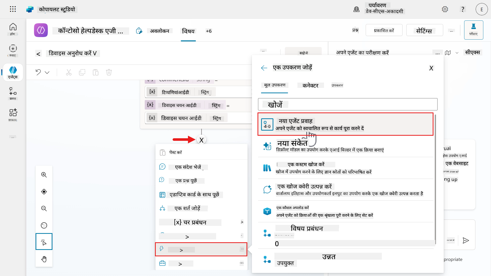

1. एजेंट फ्लो **Designer** एक ट्रिगर और एक्शन के साथ लोड होगा।

    - **Trigger** - जब कोई एजेंट फ्लो को कॉल करता है
        - यह Copilot Studio एजेंट से फ्लो को ट्रिगर करेगा।

    - **Action** - एजेंट को प्रतिक्रिया दें
        - यह एक प्रतिक्रिया भेजता है जिसमें Copilot Studio एजेंट को आउटपुट मान हो सकते हैं।

    ट्रिगर चुनें।

    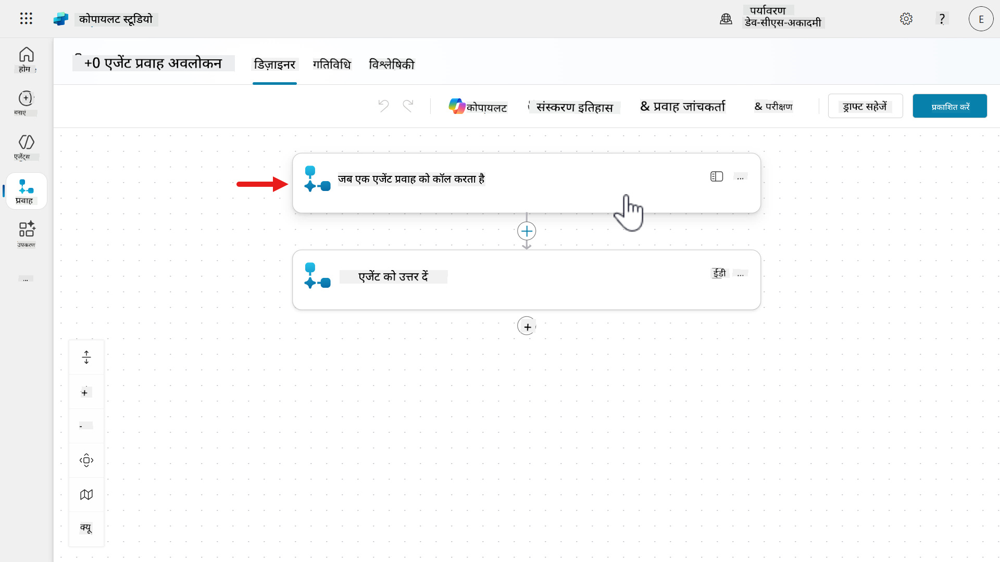

1. अब हम एजेंट फ्लो के लिए कई इनपुट जोड़ने जा रहे हैं।

    - `DeviceSharePointId` - यह SharePoint आइटम का मान, ID, संग्रहीत करेगा। यह ID मान उस नोड से आउटपुट है जहां उपयोगकर्ता ने डिवाइस चुना।

    - `User` - यह उपयोगकर्ता का नाम होगा जो एजेंट के सिस्टम वेरिएबल से होगा।

    - `AdditionalComments` - यह उपयोगकर्ता द्वारा दर्ज की गई टिप्पणी होगी, जो एडैप्टिव कार्ड नोड से आउटपुट है।

    पहले हम अपने ट्रिगर के लिए `DeviceSharePointId` को इनपुट के रूप में जोड़ेंगे। **+ Add an input** चुनें।

    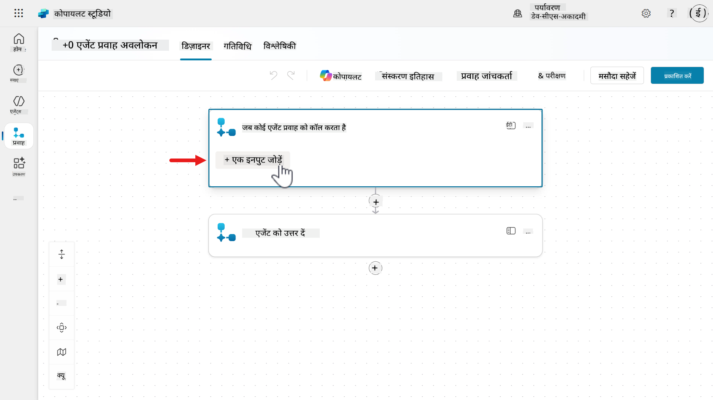

1. उपयोगकर्ता इनपुट के प्रकार के लिए, **Text** चुनें।

    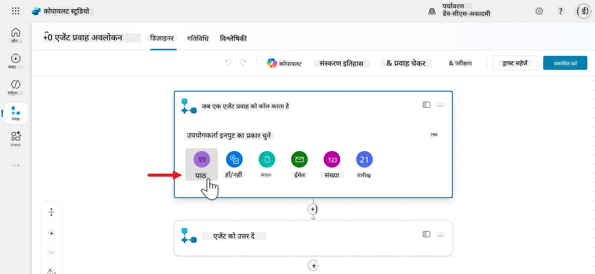

1. इनपुट के नाम के लिए, निम्नलिखित दर्ज करें।

    ```text
    DeviceSharePointId
    ```

    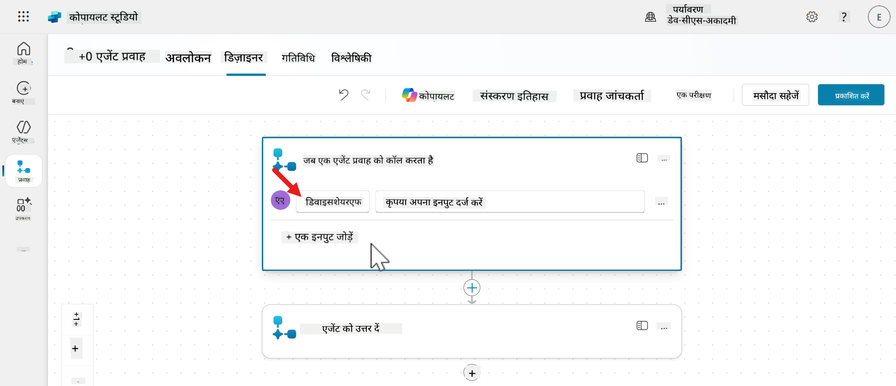

1. अब हम दूसरा इनपुट, `User` जोड़ेंगे। वही चरण दोहराएं, **+ Add an input** चुनें और **Text** चुनें।

    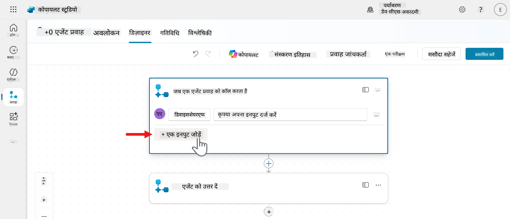

1. इनपुट के नाम के लिए, निम्नलिखित दर्ज करें।

    ```text
    User
    ```

    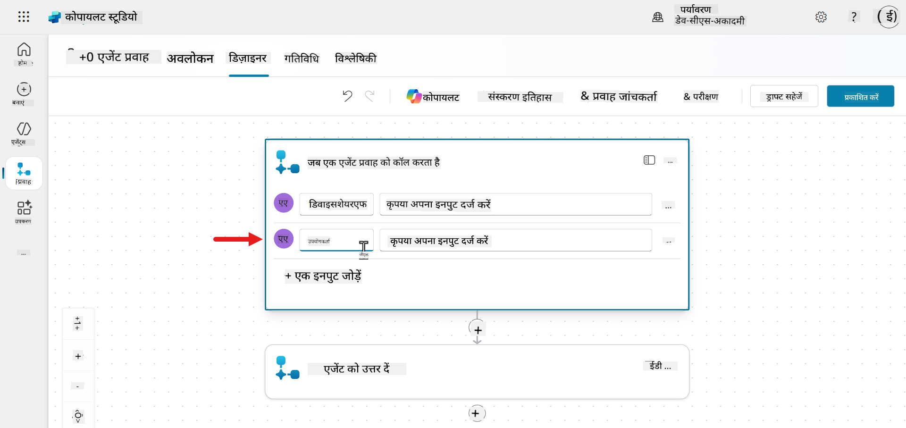

1. अब हम तीसरा इनपुट, `AdditionalComments` जोड़ेंगे। वही चरण दोहराएं, **+ Add an input** चुनें और **Text** चुनें।

    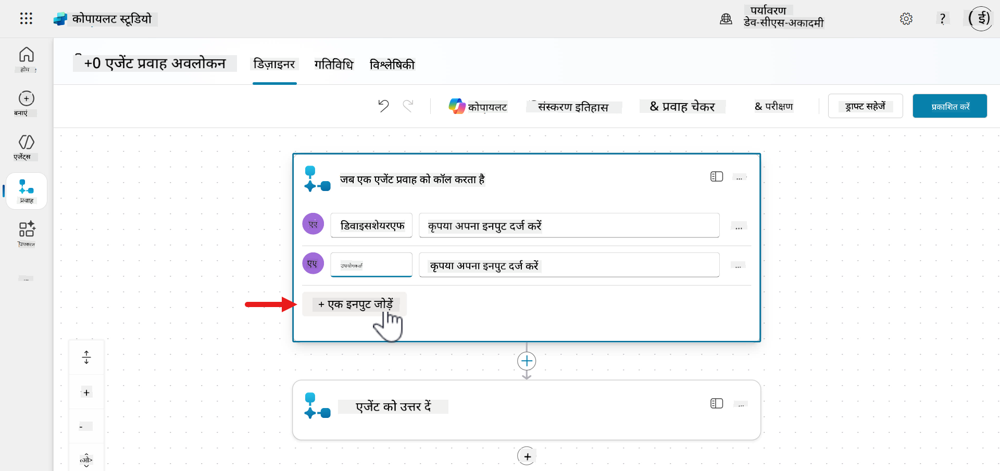

1. इनपुट के नाम के लिए, निम्नलिखित दर्ज करें।

    ```text
    AdditionalComments
    ```

    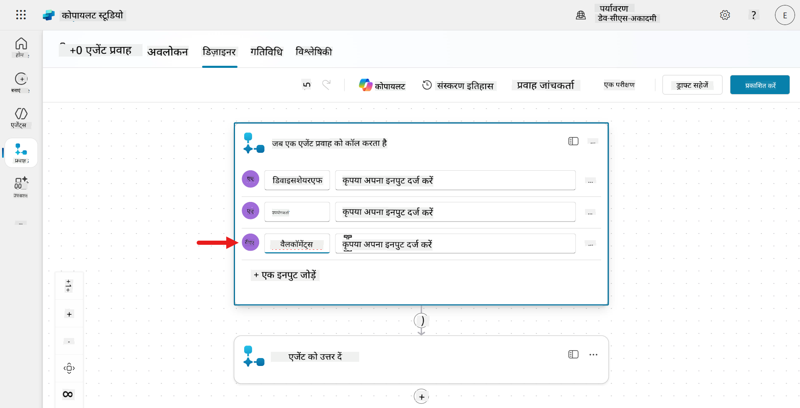

1. `AdditionalComments` इनपुट के लिए, हम इसे वैकल्पिक बनाने के लिए अपडेट करेंगे। **ellipsis (...) आइकन** चुनें और **Make the field optional** चुनें।

    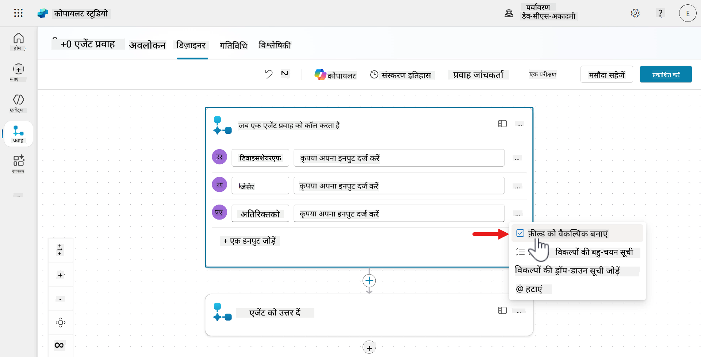

1. शानदार काम! ट्रिगर अब कॉन्फ़िगर हो गया है, चलिए जारी रखते हैं। ट्रिगर के नीचे **plus + icon** चुनें और एक नया एक्शन जोड़ें।

    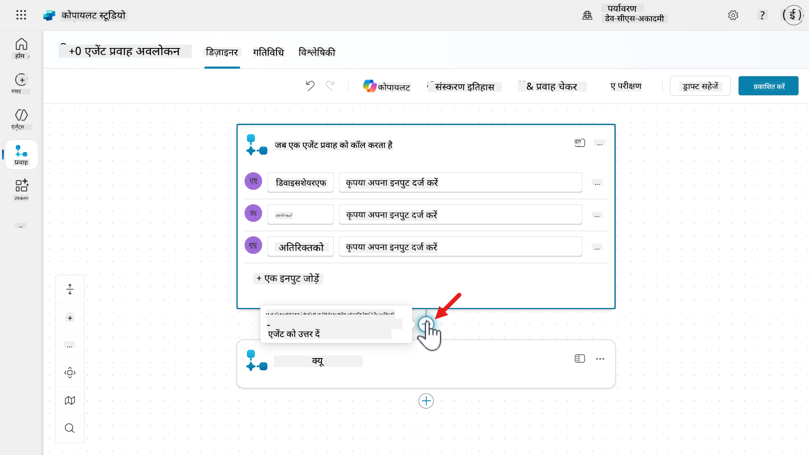

1. **Actions pane** दिखाई देगा जहां आप Microsoft और तृतीय-पक्ष सेवाओं के 1400+ बिल्ट-इन कनेक्टर्स से एक्शन देख सकते हैं। **search field** में निम्नलिखित दर्ज करें,

    ```text
    Get item
    ```

    खोज परिणामों में एक्शन की सूची प्रदर्शित होगी। **SharePoint कनेक्टर** से **Get item** एक्शन चुनें।

    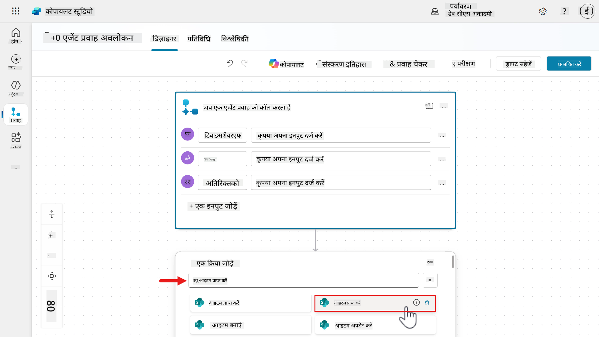

1. अब हम **Get item** एक्शन को कॉन्फ़िगर करना शुरू कर सकते हैं।

    **Ellipsis (...)** आइकन को **Get item** एक्शन में चुनें।

    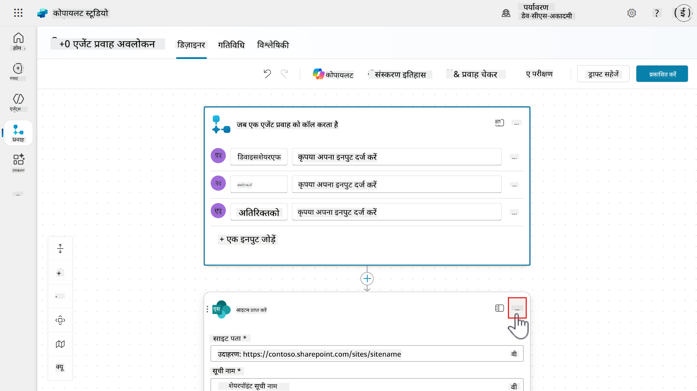

1. **Rename** चुनें।

    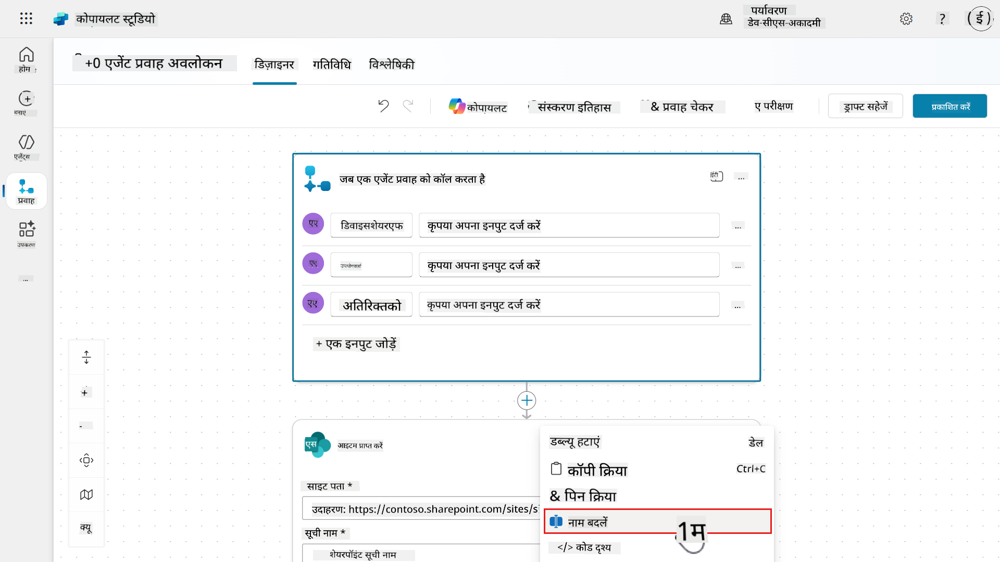

1. एक्शन का नाम बदलें,

    ```text
    Get Device
    ```

    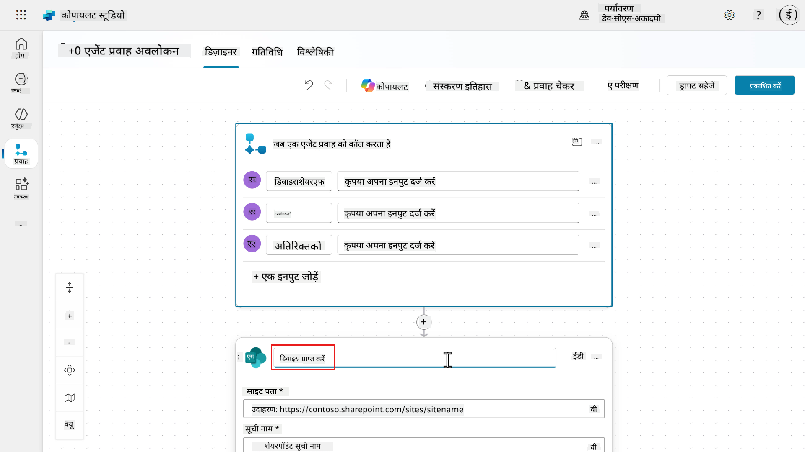

1. **Site Address** फ़ील्ड में, Contoso IT SharePoint साइट का **Site address** चुनें जो [Lesson 00 - Course Setup - Step 3: Create new SharePoint site](../00-course-setup/README.md#step-4-create-new-sharepoint-site) में बनाई गई थी।

    **List Name** फ़ील्ड में, **Devices** SharePoint सूची चुनें।

    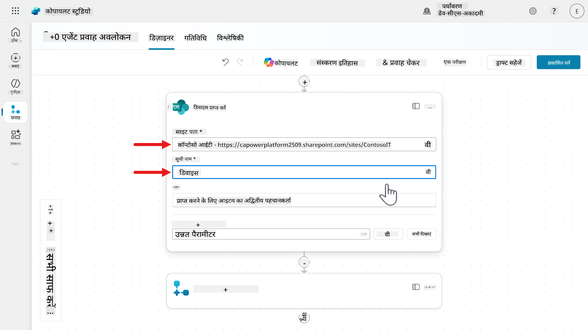

1. **Id** फ़ील्ड में, दाईं ओर **lightning bolt icon** या **fx icon** चुनें।

    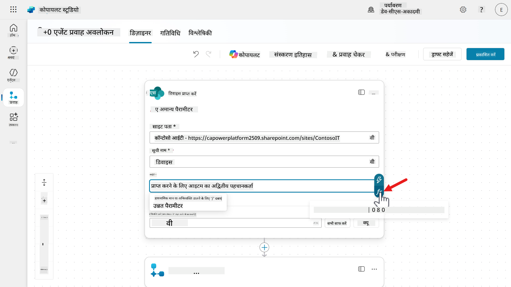

1. फ्लाईआउट पैन के **Dynamic content** टैब में, निम्नलिखित दर्ज करें,

    ```text
    sharepoint
    ```

    खोज परिणामों में मिलान करने वाले इनपुट पैरामीटर प्रदर्शित होंगे। ट्रिगर से **DeviceSharePointId** पैरामीटर चुनें।

    अगला, **Add** चुनें ताकि डायनामिक कंटेंट इनपुट को एक्शन के **Id** पैरामीटर में जोड़ा जा सके।

    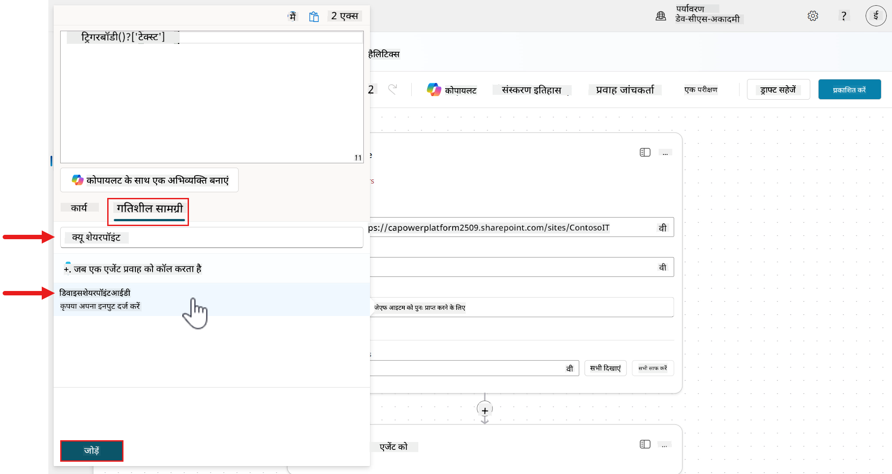

1. ट्रिगर से डायनामिक कंटेंट इनपुट अब एक्शन के **Id** पैरामीटर में संदर्भित है। हम अगले एक उन्नत पैरामीटर को अपडेट करने जा रहे हैं। उन्नत पैरामीटर देखने के लिए **Show all** चुनें।

    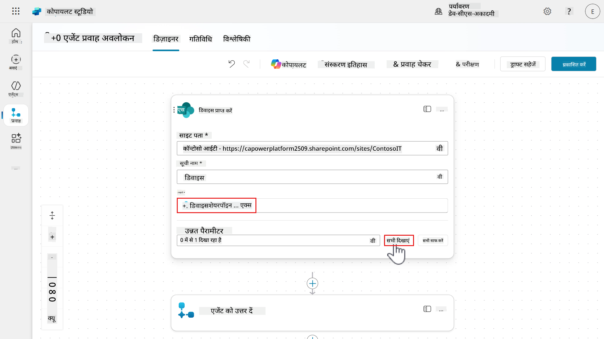

1. **Limit Columns by View** पैरामीटर प्रदर्शित होगा और डिफ़ॉल्ट रूप से यह **Use all columns (Do not limit)** पर सेट है। हम इस मान को एक व्यू में अपडेट करेंगे ताकि एक्शन की प्रतिक्रिया में लौटाए गए कॉलम सीमित हो जाएं। **Limit Columns by View** पैरामीटर चुनें ताकि व्यू की सूची देखी जा सके।

    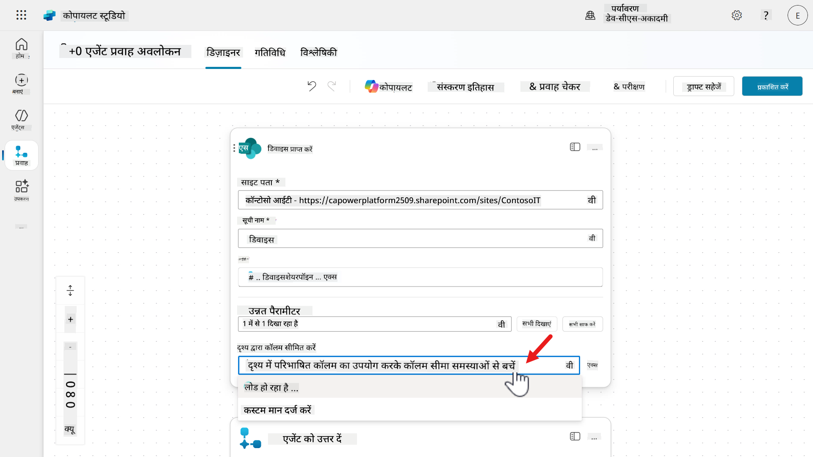

1. **All Items** व्यू चुनें।

    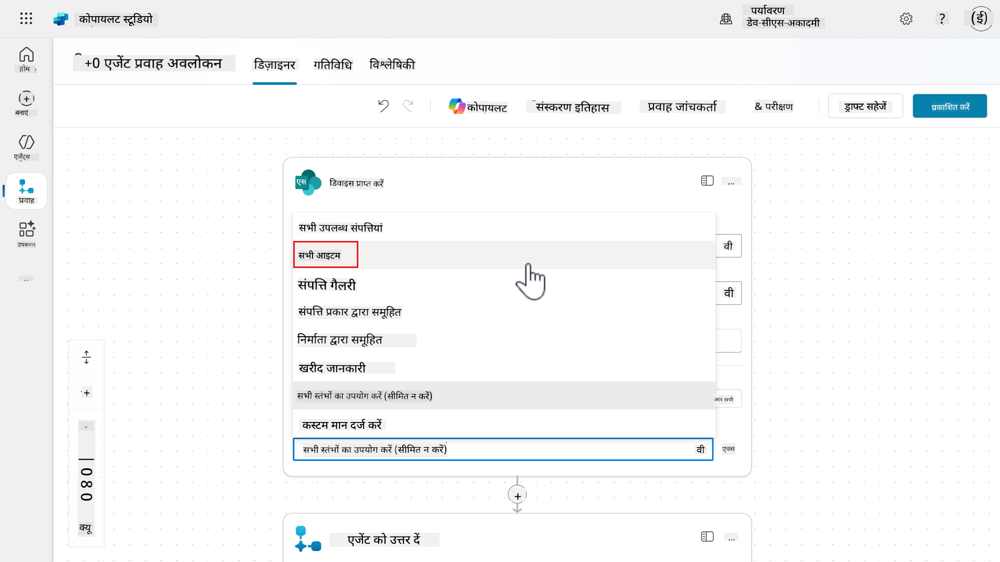

1. _Get Device_ एक्शन के नीचे **plus + icon** चुनें और एक नया एक्शन जोड़ें।

    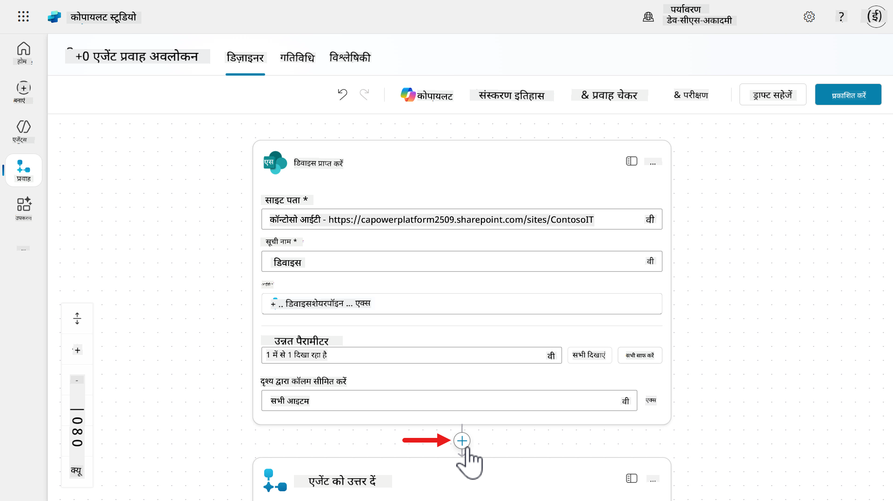

1. खोज फ़ील्ड में निम्नलिखित दर्ज करें,

    ```text
    send an email
    ```

    खोज परिणामों में एक्शन की सूची प्रदर्शित होगी। **Office 365 Outlook कनेक्टर** से **Send an email (V2)** एक्शन चुनें।

    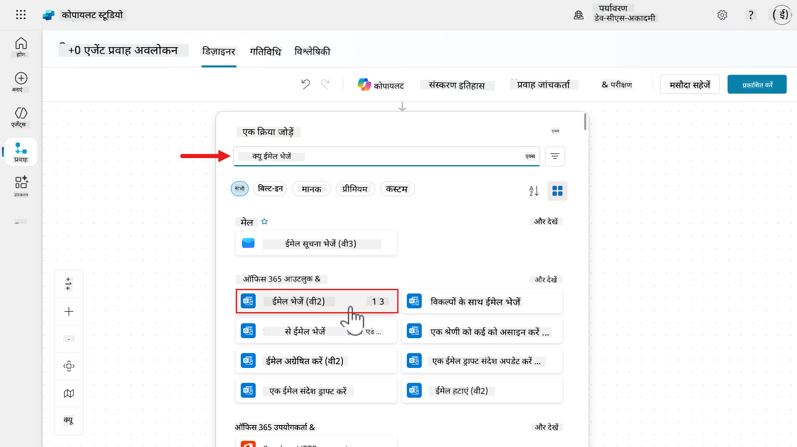

1. हमें कनेक्टर एक्शन के लिए एक कनेक्शन बनाना होगा। **Sign in** चुनें।

    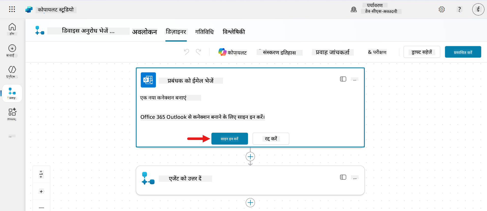

1. अपने साइन इन किए गए उपयोगकर्ता खाते को चुनें।

    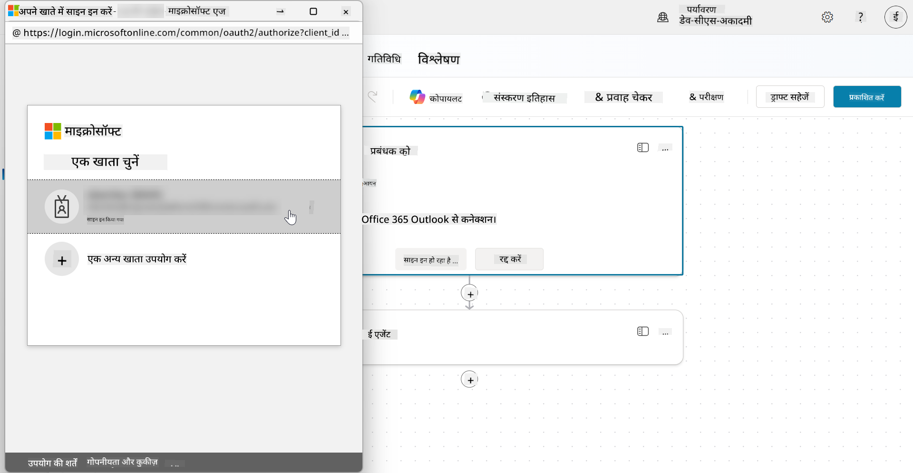

1. **Allow access** चुनें। अब एक कनेक्शन बन गया है।

    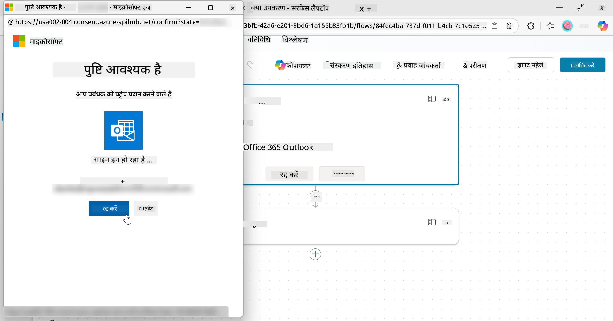

1. एक्शन का नाम निम्नलिखित में बदलें,

    ```text
    Send an email to manager
    ```

    चलिए अब हमारे एक्शन के इनपुट पैरामीटर को परिभाषित करते हैं।

    **To** इनपुट पैरामीटर के लिए, खुद को चुनें। सामान्यतः यह आपका प्रबंधक होगा या हम एक अन्य एक्शन का उपयोग करेंगे जो आपके Entra ID प्रोफाइल के आधार पर आपके प्रबंधक को खींचता है लेकिन इस पाठ के उद्देश्य के लिए, खुद को चुनें।

    **Subject** इनपुट पैरामीटर के लिए, निम्नलिखित दर्ज करें,

    ```text
    Request type: new device
    ```

    **Body** इनपुट पैरामीटर के लिए, निम्नलिखित दर्ज करें,

    ```text
    Hi,

    New device requested from

    Manufacturer:
    Model:
    Link to item in SharePoint
    Additional comments from:

    This is an automated email from Contoso Helpdesk Copilot
    ```

    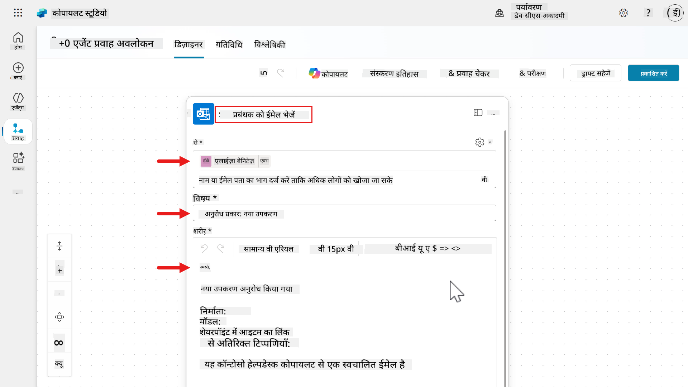

1. अगला, हम **Body** इनपुट पैरामीटर को ट्रिगर इनपुट या **Get item** एक्शन से डायनामिक कंटेंट इनपुट के संदर्भों के साथ अपडेट करेंगे। दूसरे लाइन के बाद एक स्पेस दर्ज करें क्योंकि हम ट्रिगर इनपुट, **User** से उपयोगकर्ता का नाम डालेंगे।

    दाईं ओर **lightning bolt icon** या **fx icon** चुनें।

    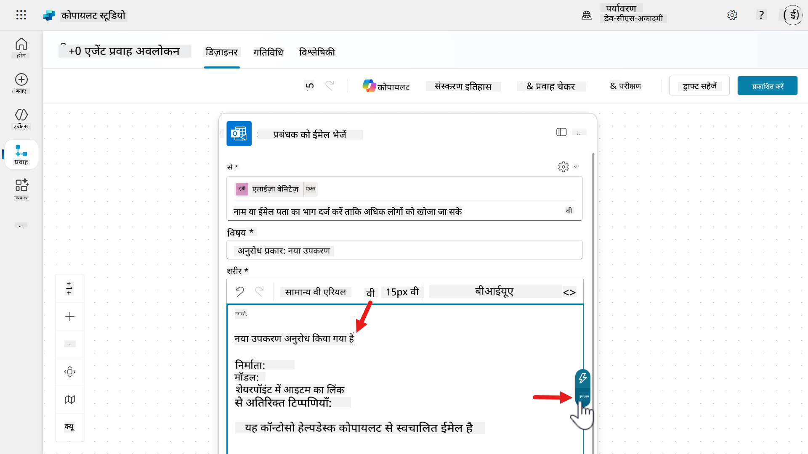

1. फ्लाईआउट पैन के **Dynamic content** टैब में, ट्रिगर से **User** इनपुट चुनें।

    **Add** चुनें ताकि डायनामिक कंटेंट **User** इनपुट को एक्शन के **Body** पैरामीटर में जोड़ा जा सके।

    
1. ट्रिगर से प्राप्त डायनामिक सामग्री को अब एक्शन के **Body** पैरामीटर में संदर्भित किया गया है। हम ईमेल संदेश बॉडी की बाकी लाइनों के लिए भी यही प्रक्रिया दोहराएंगे।

    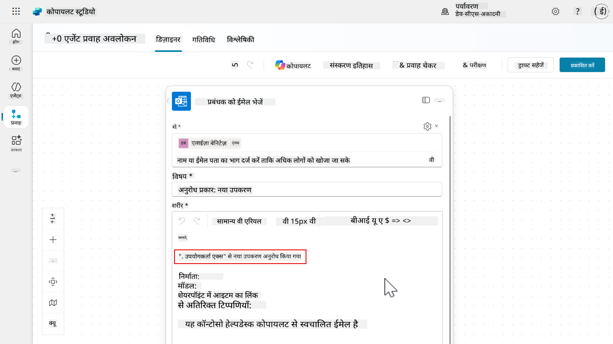

1. `Manufacturer:` के बगल में स्थान पर क्लिक करें। दाईं ओर **लाइटनिंग बोल्ट आइकन** या **fx आइकन** चुनें।

    फ्लाईआउट पैन के **Dynamic content** टैब में, खोज फ़ील्ड में निम्नलिखित दर्ज करें,

    ```text
    manufacturer
    ```

    ट्रिगर से **Manufacturer value** इनपुट चुनें और **Add** पर क्लिक करें।

    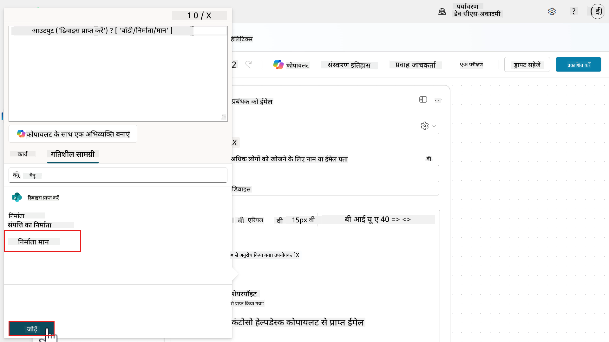

1. `Model:` के बगल में स्थान पर क्लिक करें। दाईं ओर **लाइटनिंग बोल्ट आइकन** या **fx आइकन** चुनें।

    फ्लाईआउट पैन के **Dynamic content** टैब में, खोज फ़ील्ड में निम्नलिखित दर्ज करें,

    ```text
    model
    ```

    **Get item** एक्शन से **Model** इनपुट चुनें और **Add** पर क्लिक करें।

    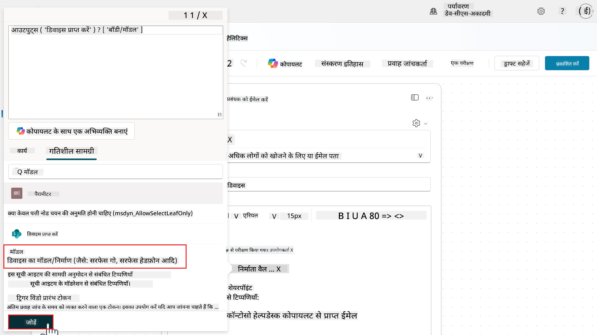

1. `Link to item in SharePoint` टेक्स्ट के लिए, हम इसे ईमेल संदेश बॉडी में एक हाइपरलिंक के रूप में अपडेट करेंगे। लाइन की शुरुआत में क्लिक करें और दाईं ओर **लाइटनिंग बोल्ट आइकन** या **fx आइकन** चुनें।

    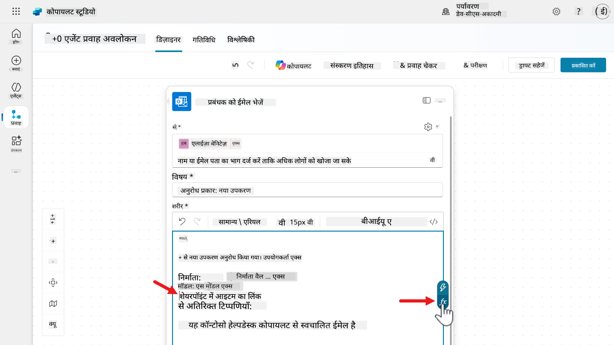

1. HTML एंकर टैग के बाद क्लिक करें और दाईं ओर **लाइटनिंग बोल्ट आइकन** या **fx आइकन** चुनें।

    फ्लाईआउट पैन के **Dynamic content** टैब में, खोज फ़ील्ड में निम्नलिखित दर्ज करें,

    ```text
    link to item
    ```

    **Get item** एक्शन से **Link to item** इनपुट चुनें और **Add** पर क्लिक करें।

    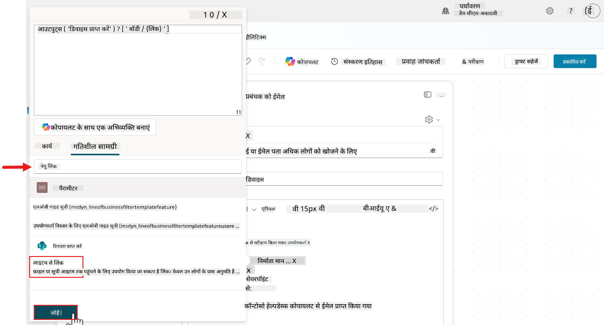

1. HTML एडिटर पर स्विच करने के लिए **&lt;/&gt;** आइकन चुनें।

    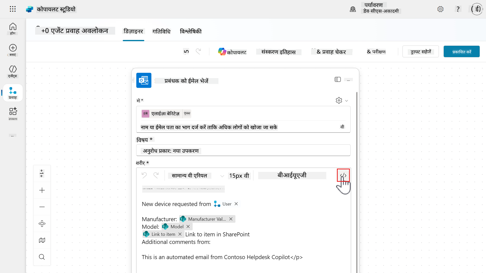

1. HTML एडिटर अब सक्षम है। `Link to item in SharePoint` टेक्स्ट से पहले क्लिक करें, एक HTML एंकर टैग जोड़ें ताकि हाइपरलिंक बनाया जा सके। निम्नलिखित कॉपी और पेस्ट करें।

    ```text
    <a href="
    ```

    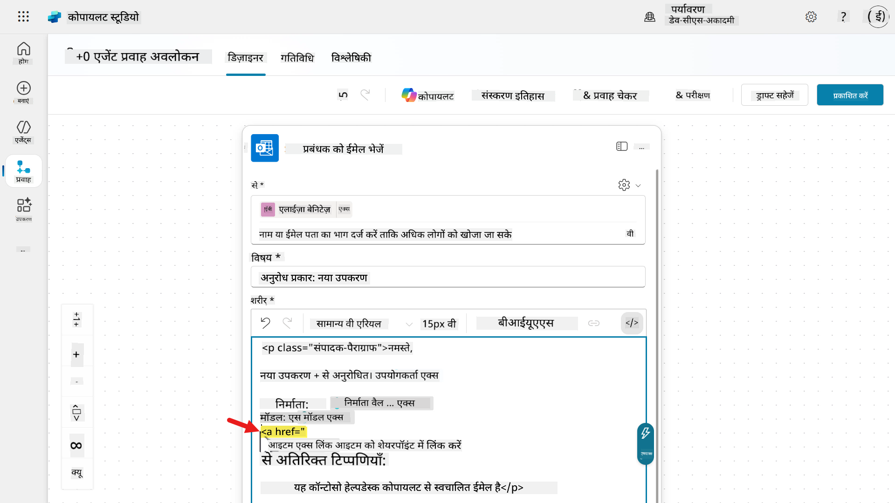

1. **Link to item** का डायनामिक सामग्री इनपुट अब **Body** पैरामीटर में संदर्भित है। **Link to item** इनपुट के बाद क्लिक करें, निम्नलिखित कॉपी और पेस्ट करें।

    ```text
    ">
    ```

    

1. `Link to item in SharePoint` टेक्स्ट के बाद क्लिक करें, HTML एंकर टैग बंद करें। निम्नलिखित कॉपी और पेस्ट करें।

    ```text
    </a>
    ```

    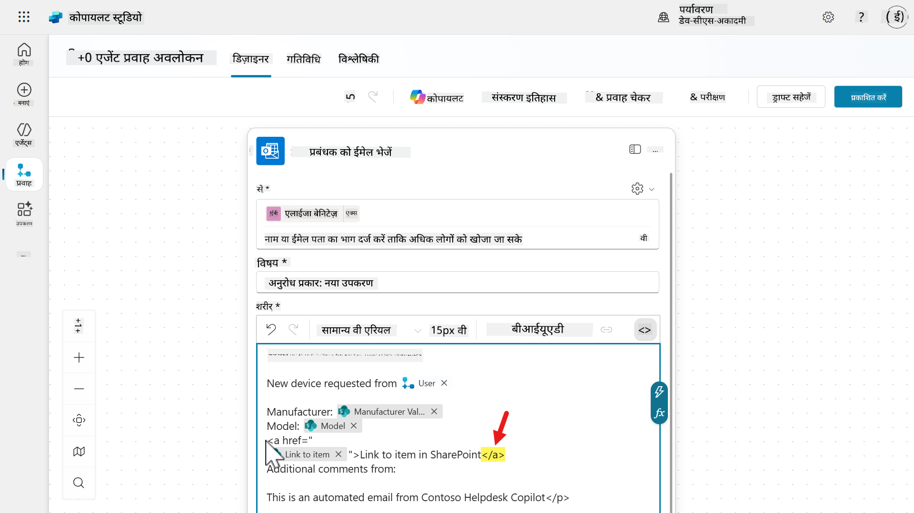

1. कोड व्यू को टॉगल करने के लिए **&lt;/&gt;** आइकन चुनें।

    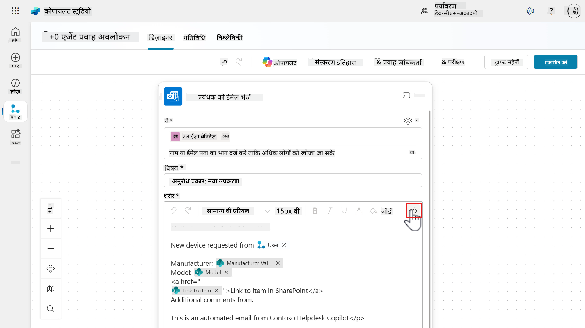

1. फिर से कोड व्यू टॉगल करने के लिए **&lt;/&gt;** आइकन चुनें।

    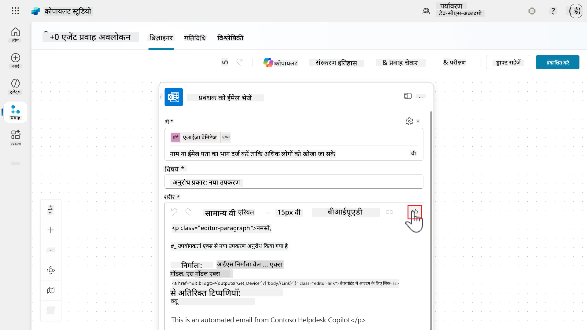

1. ध्यान दें कि कई अतिरिक्त वर्ण `&lt;br&gt;` हैं। इन वर्णों को हटा दें।

    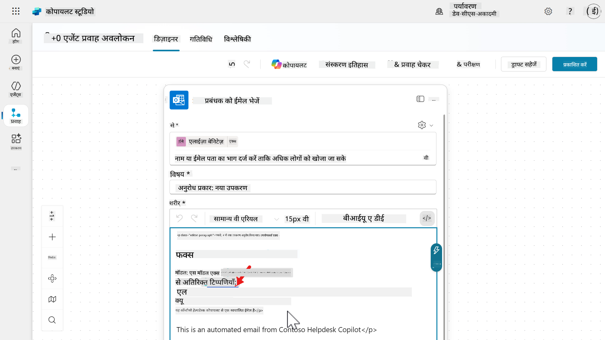

1. हमने अब अपने ईमेल संदेश बॉडी में एक हाइपरलिंक जोड़ना पूरा कर लिया है 😎 **&lt;/&gt;** आइकन चुनें ताकि कोड व्यू टॉगल किया जा सके।

    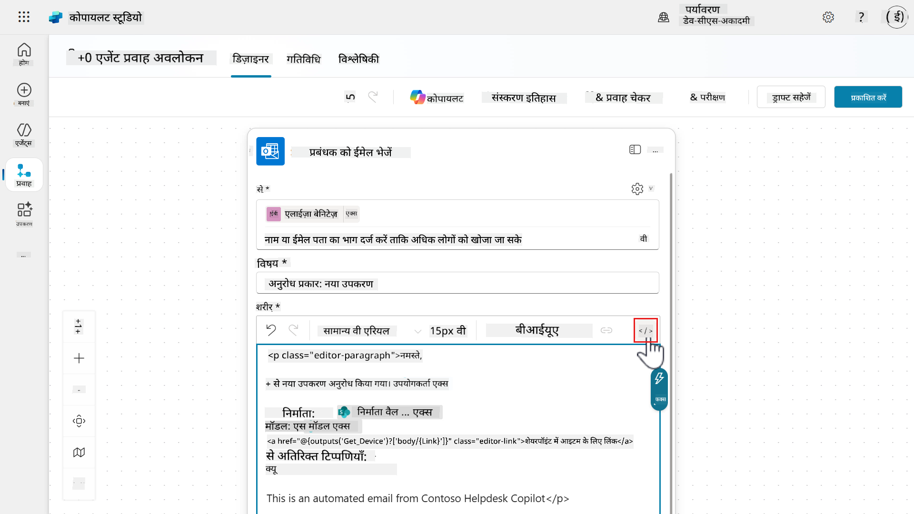

1. `Additional comments from` टेक्स्ट के बाद कॉलन से पहले क्लिक करें और दाईं ओर **लाइटनिंग बोल्ट आइकन** या **fx आइकन** चुनें।

    

1. फ्लाईआउट पैन के **Dynamic content** टैब में, खोज फ़ील्ड में निम्नलिखित दर्ज करें,

    ```text
    user
    ```

    ट्रिगर से **User** पैरामीटर चुनें और **Add** पर क्लिक करें।

    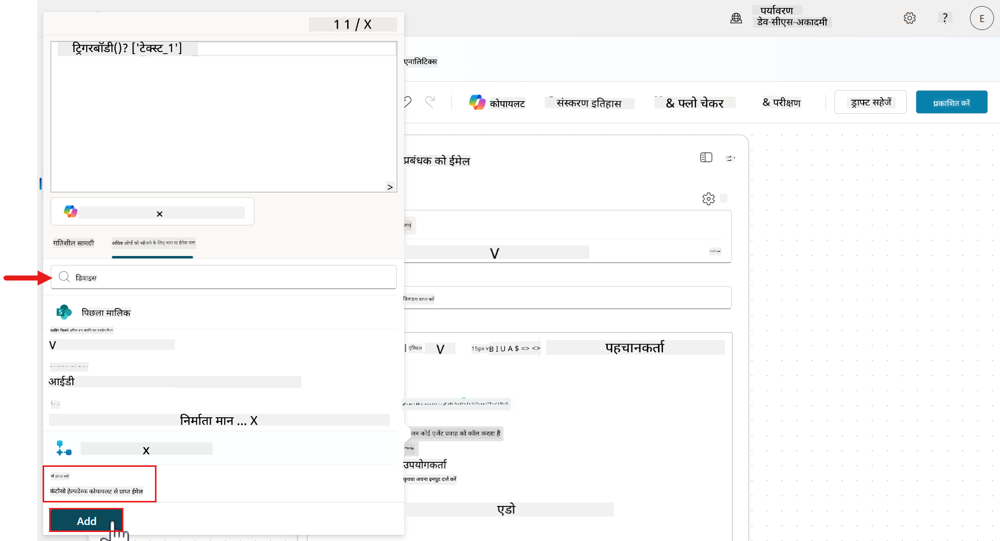

1. अब हम एक एक्सप्रेशन डालने जा रहे हैं जो उपयोगकर्ता द्वारा **Ask an adaptive card** नोड में प्रदान किए गए Additional Comments के मान को प्रदर्शित करेगा, अन्यथा "None" प्रदर्शित करेगा यदि उपयोगकर्ता कोई टिप्पणी प्रदान नहीं करता है।

    कॉलन के बाद क्लिक करें और दाईं ओर **लाइटनिंग बोल्ट आइकन** या **fx आइकन** चुनें।

    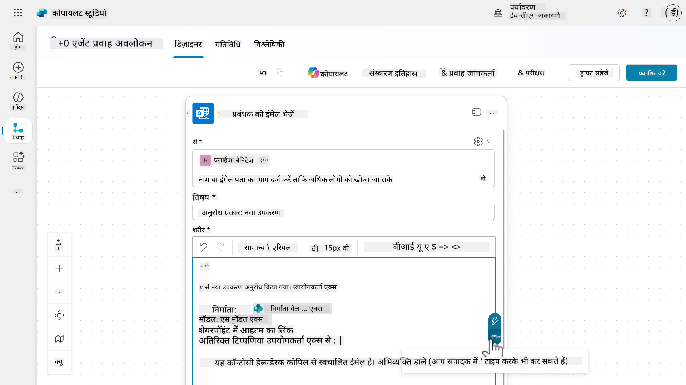

1. फ्लाईआउट पैन के **Function** टैब में और ऊपर एक्सप्रेशन फ़ील्ड में, निम्नलिखित दर्ज करें,

    ```text
    if(empty())
    ```

    यह एक्सप्रेशन `if` फ़ंक्शन का उपयोग करता है ताकि एक if-else स्टेटमेंट बनाया जा सके।

    अगला फ़ंक्शन `empty` है जो जांचता है कि स्ट्रिंग पैरामीटर में कोई मान मौजूद है या नहीं। संदर्भित स्ट्रिंग पैरामीटर ट्रिगर से **AdditionalComments** इनपुट पैरामीटर का मान है।

    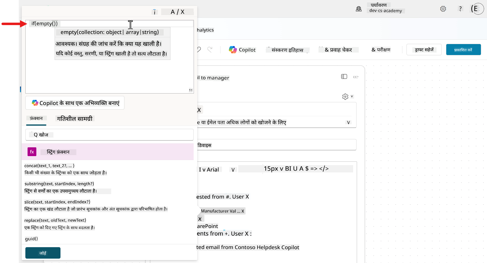

1. अब, `empty` फ़ंक्शन के बाद ब्रैकेट्स के अंदर क्लिक करें। हम ट्रिगर से **AdditionalComments** इनपुट पैरामीटर डालने जा रहे हैं।

    **Dynamic content** टैब चुनें। खोज फ़ील्ड में निम्नलिखित दर्ज करें,

    ```text
    Additional
    ```

    पैन को नीचे स्क्रॉल करें और ट्रिगर से **AdditionalComments** इनपुट चुनें। पैरामीटर अब एक्सप्रेशन में एक स्ट्रिंग पैरामीटर के रूप में जोड़ा जाएगा।

    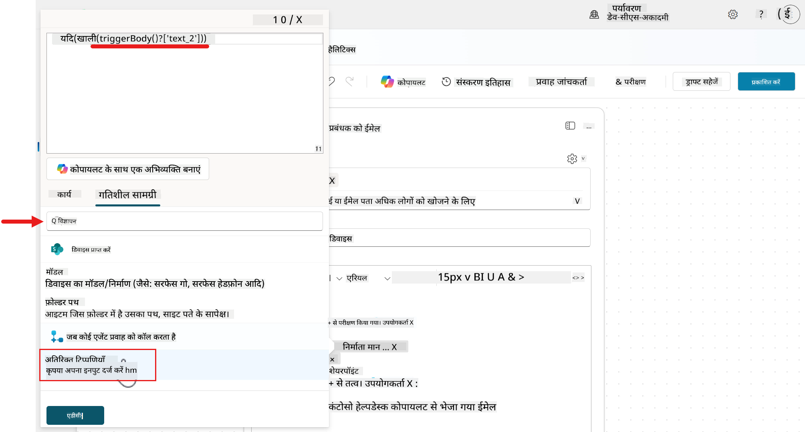

1. अब हम **_true_** लॉजिक को परिभाषित करेंगे, जहां यदि **AdditionalComments** स्ट्रिंग पैरामीटर खाली है, तो हम `None` टेक्स्ट प्रदर्शित करना चाहते हैं।

    स्ट्रिंग पैरामीटर को बंद करने वाले ब्रैकेट के बाद, निम्नलिखित दर्ज करें,

    ```text
    , 'None',
    ```

    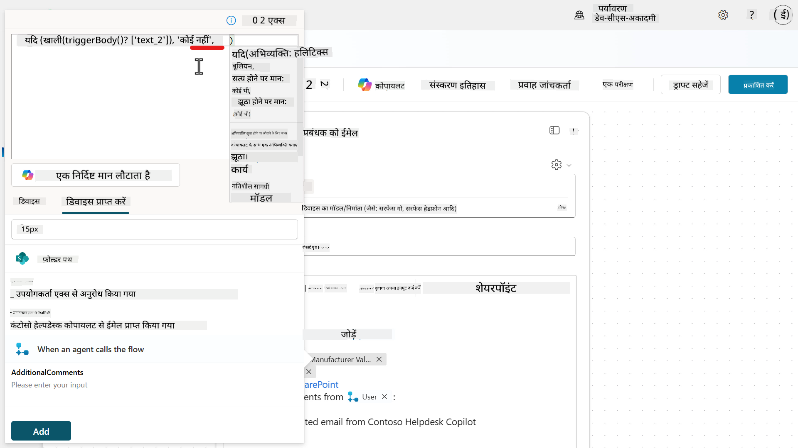

1. अंत में हम **_false_** लॉजिक को परिभाषित करेंगे, जहां यदि **AdditionalComments** स्ट्रिंग पैरामीटर खाली नहीं है, तो हम ट्रिगर से **AdditionalComments** इनपुट पैरामीटर का मान प्रदर्शित करना चाहते हैं।

    > याद दिलाने के लिए, यह मान **Ask with adaptive card** नोड में Additional Comments फ़ील्ड से होगा जो **Request device** टॉपिक में है।

    हमारे **_true_** लॉजिक के बाद कॉमा के बाद, **Dynamic content** टैब चुनें। खोज फ़ील्ड में निम्नलिखित दर्ज करें,

    ```text
    Additional
    ```

    पैन को नीचे स्क्रॉल करें और ट्रिगर से **AdditionalComments** इनपुट चुनें। पैरामीटर अब एक्सप्रेशन में एक स्ट्रिंग पैरामीटर के रूप में जोड़ा जाएगा।

    अब इसे हमारे **Body** पैरामीटर में जोड़ने के लिए **Add** चुनें।

    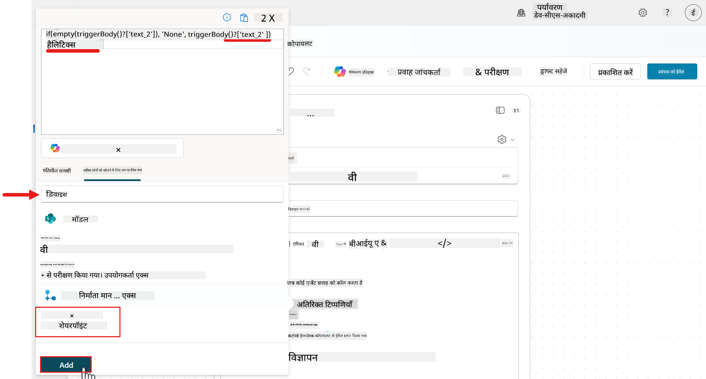

1. शानदार, हमारा एक्सप्रेशन पूरा हो गया है! एक्सप्रेशन अब **Body** पैरामीटर में जोड़ा गया है। अंत में, अंतिम लाइन को इटैलिक्स में फॉर्मेट करें।

    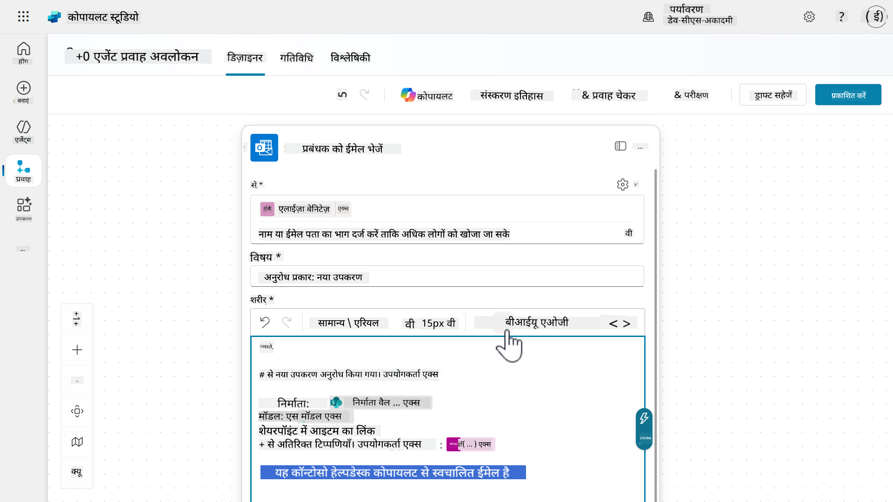

1. अब हम **Respond to the agent** एक्शन को अपडेट करने जा रहे हैं ताकि **Get item** एक्शन से **Model value** पैरामीटर का मान एजेंट को वापस भेजा जा सके।

    अपने माउस की बाईं कुंजी दबाए रखें और डिज़ाइनर के भीतर ऊपर की ओर मूव करें ताकि **Respond to the agent** एक्शन को देखा जा सके।

    **Respond to the agent** एक्शन चुनें और **Text** आउटपुट को प्रकार के रूप में चुनें।

    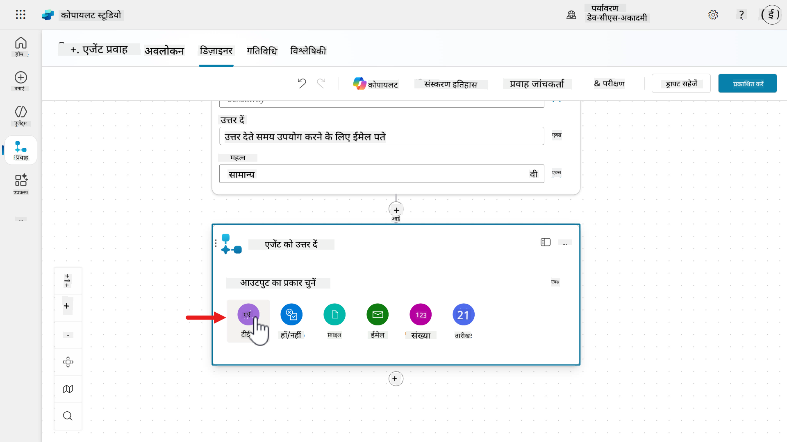

1. आउटपुट का नाम दर्ज करें।

    ```text
    ModelValue
    ```

    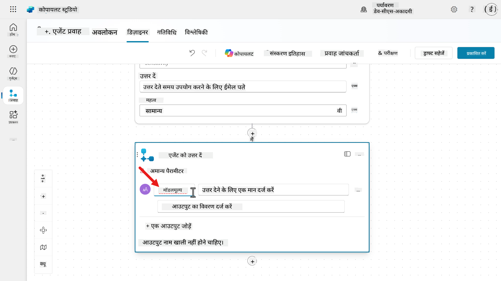

1. वैल्यू फ़ील्ड चुनें और दाईं ओर **लाइटनिंग बोल्ट आइकन** या **fx आइकन** चुनें।

    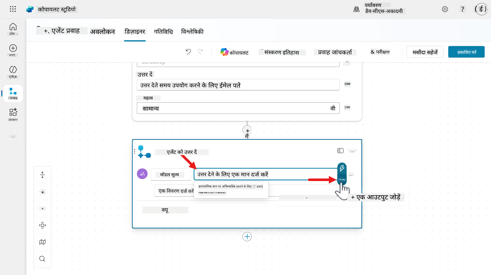

1. फ्लाईआउट पैन के **Dynamic content** टैब में, खोज फ़ील्ड में निम्नलिखित दर्ज करें,

    ```text
    model
    ```

    **Get item** एक्शन से **Model** पैरामीटर चुनें और **Add** पर क्लिक करें।

    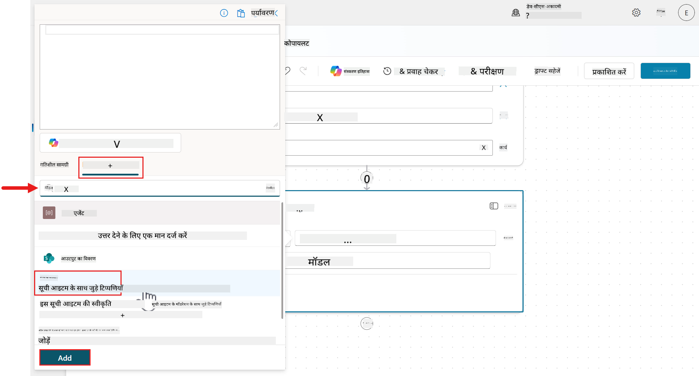

1. **Model** पैरामीटर अब टेक्स्ट आउटपुट का मान है। हमारे एजेंट फ्लो को सेव करने के लिए **Save draft** चुनें।

    हमने अब अपना एजेंट फ्लो पूरा कर लिया है 👏🏻

    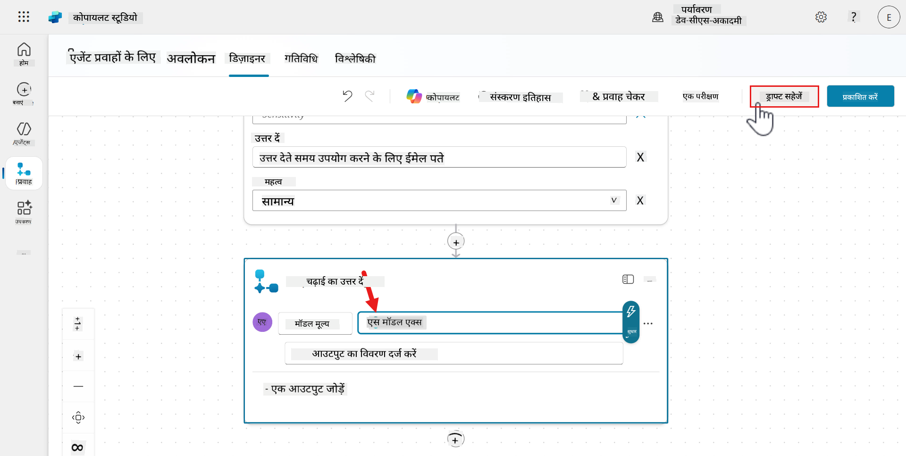

1. प्रकाशित करने से पहले हमारे एजेंट फ्लो में एक और अपडेट करें। **Overview** टैब चुनें और **Edit** चुनें।

    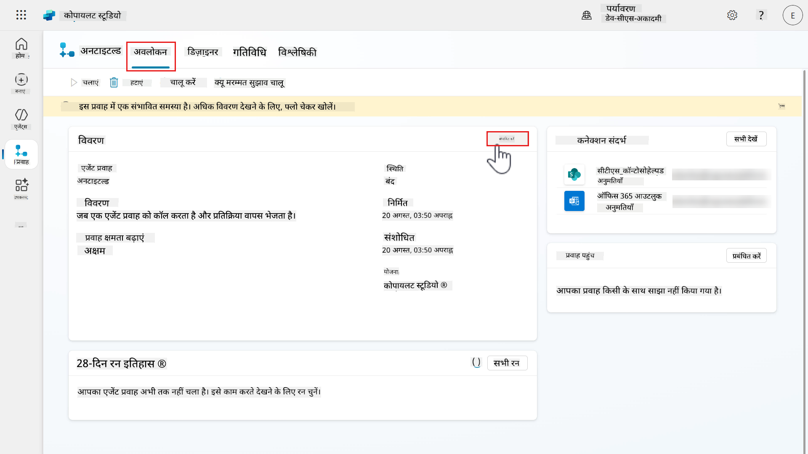

1. **Flow name** के लिए, निम्नलिखित कॉपी और पेस्ट करें।

    ```text
    Send device request email
    ```

    **Description** के लिए, **refresh icon** चुनें ताकि AI ट्रिगर और एक्शन के आधार पर स्वचालित रूप से विवरण उत्पन्न कर सके।

    एजेंट फ्लो का अपडेटेड नाम और विवरण सेव करने के लिए **Save** चुनें।

    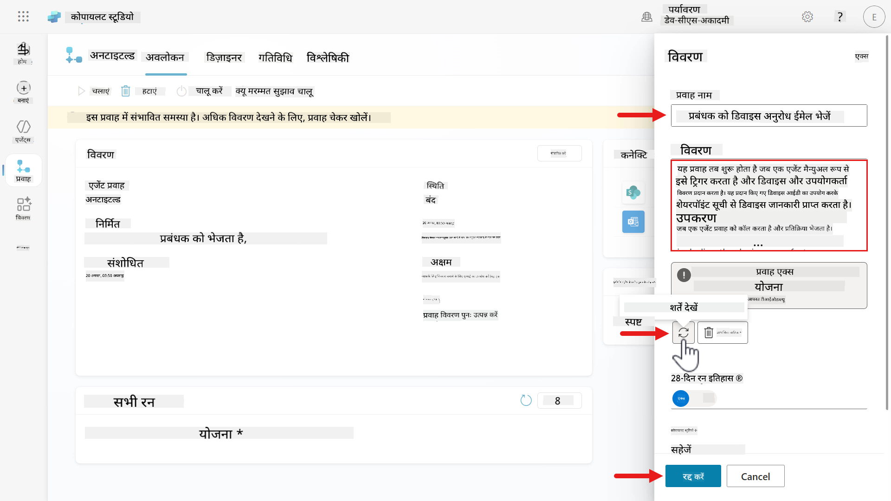

1. **Designer** टैब चुनें और **Publish** चुनें ताकि एजेंट फ्लो को **Request device** टॉपिक में एक नोड के रूप में जोड़ा जा सके।

    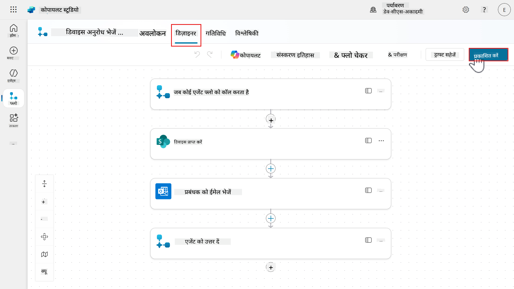

1. थोड़ी देर में एक पुष्टिकरण संदेश दिखाई देगा जो पुष्टि करेगा कि एजेंट फ्लो प्रकाशित हो गया है।

    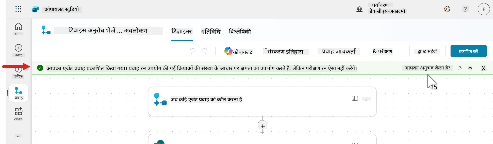

### 9.2 टॉपिक में एजेंट फ्लो जोड़ें

अब हम एजेंट फ्लो को **Request device** टॉपिक में जोड़ने जा रहे हैं।

1. बाईं ओर मेनू में **Agents** चुनें और **Contoso Helpdesk Agent** चुनें।

    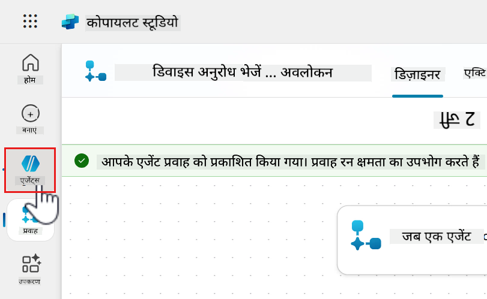

1. **Topics** टैब चुनें।

    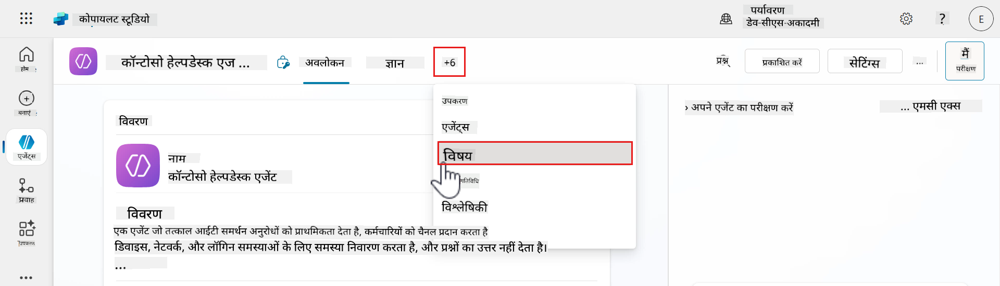

1. **Request device** टॉपिक चुनें।

    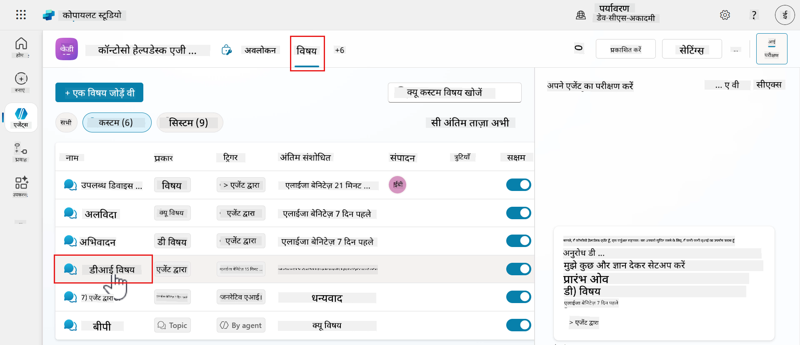

1. **Ask with adaptive card** नोड तक स्क्रॉल करें और एक नया नोड जोड़ें।

    **Add a tool** चुनें और फ्लाईआउट पैन के **Basic tools** टैब में, हाल ही में बनाए और प्रकाशित किए गए **Send device request email** एजेंट फ्लो को चुनें।

    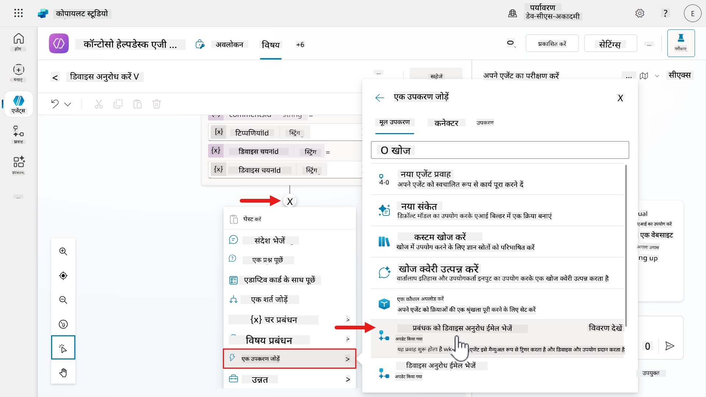

1. हमारे एजेंट फ्लो के ट्रिगर इनपुट के लिए, हमें **Ask with adaptive card** नोड से वेरिएबल आउटपुट्स चुनने की आवश्यकता है।

    **DeviceSharePointId** इनपुट के लिए **ellipsis (...) आइकन** चुनें।

    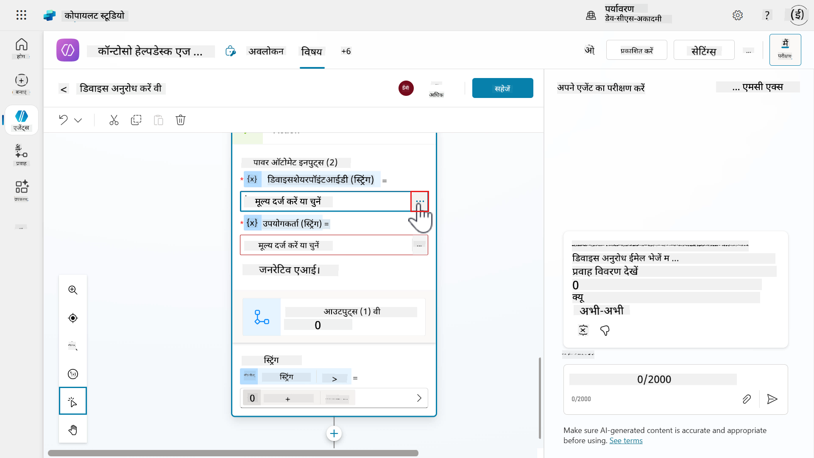

1. **Ask with adaptive card** नोड में परिभाषित आउटपुट्स में से एक **deviceSelectionId** वेरिएबल चुनें।

    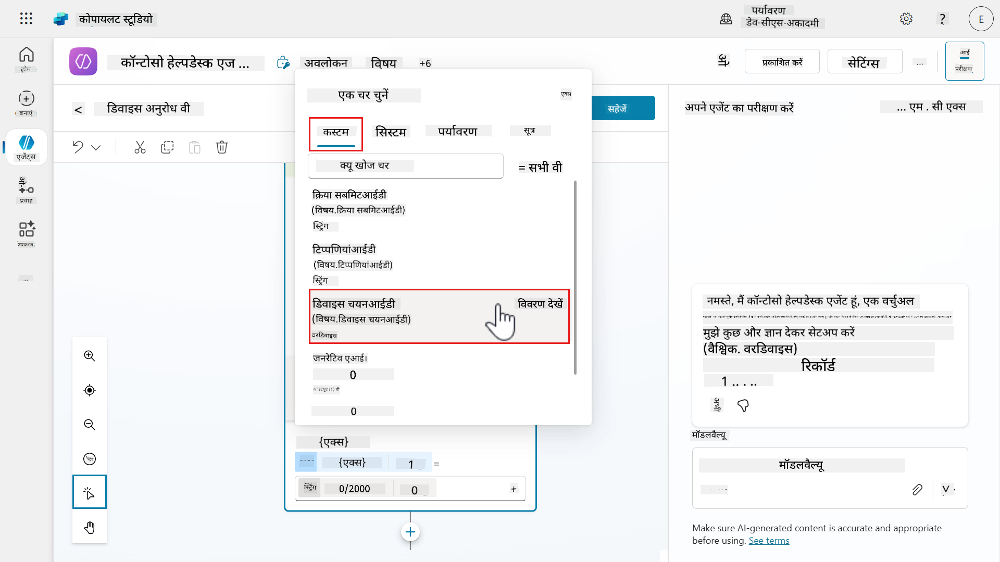

1. अगला, **User** इनपुट के लिए **ellipsis (...) आइकन** चुनें।

    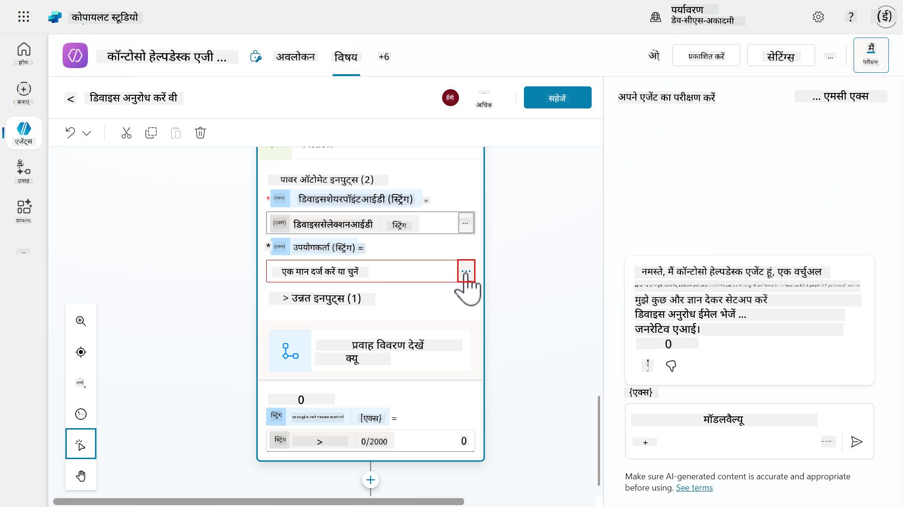

1. फ्लाईआउट वेरिएबल पैन में **System** टैब चुनें और **User.DisplayName** चुनें। यह वेरिएबल उस आंतरिक उपयोगकर्ता का डिस्प्ले नाम संग्रहीत करता है जो एजेंट के साथ इंटरैक्ट कर रहा है।

    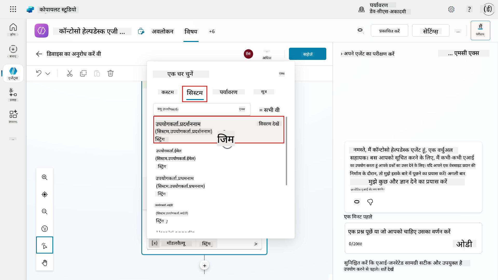

1. अगला, **Advanced inputs** देखने के लिए **greater than icon** चुनें।

    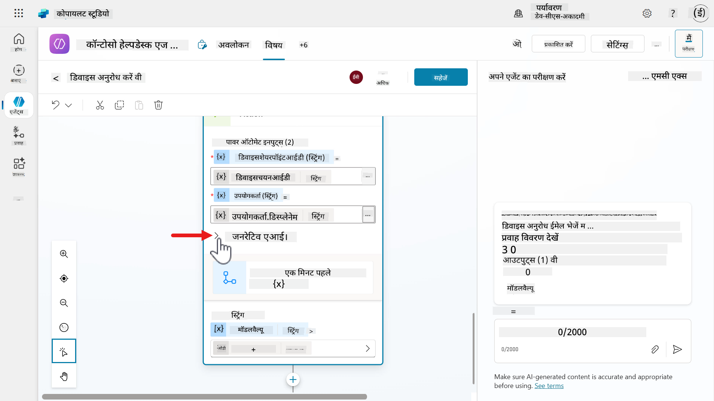

1. AdditionalComments इनपुट के लिए **ellipsis (...) आइकन** चुनें।

    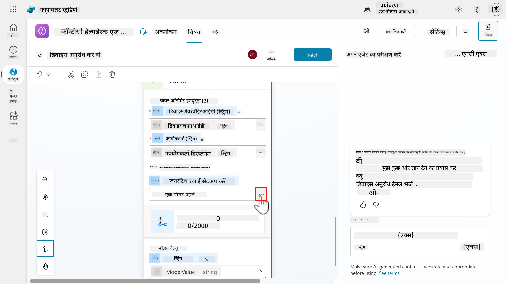

1. फ्लाईआउट वेरिएबल पैन में **Formula** टैब और विस्तारित आइकन चुनें क्योंकि हम Power Fx एक्सप्रेशन का उपयोग करेंगे।

    

1. एजेंट फ्लो में एक्सप्रेशन के समान जो _if_ फ़ंक्शन का उपयोग करता है, लेकिन इस बार
    - Power Fx फ़ंक्शंस का उपयोग करते हुए,
    - और या तो कोई मान नहीं डालते, या **Ask with adaptive card** नोड से `commentsId` आउटपुट वेरिएबल का मान डालते हैं।

    Power Fx फ़ील्ड में निम्नलिखित फ़ंक्शंस दर्ज करें,

    ```text
    If(IsBlank())
    ```

यह अभिव्यक्ति `If` फ़ंक्शन का उपयोग करती है एक if-else कथन के लिए।

अगला फ़ंक्शन `IsBlank` है, जो यह जांचता है कि क्या किसी स्ट्रिंग पैरामीटर में कोई मान मौजूद है या नहीं। संदर्भित स्ट्रिंग पैरामीटर **Ask with adaptive card** नोड से `commentsId` आउटपुट वेरिएबल है।

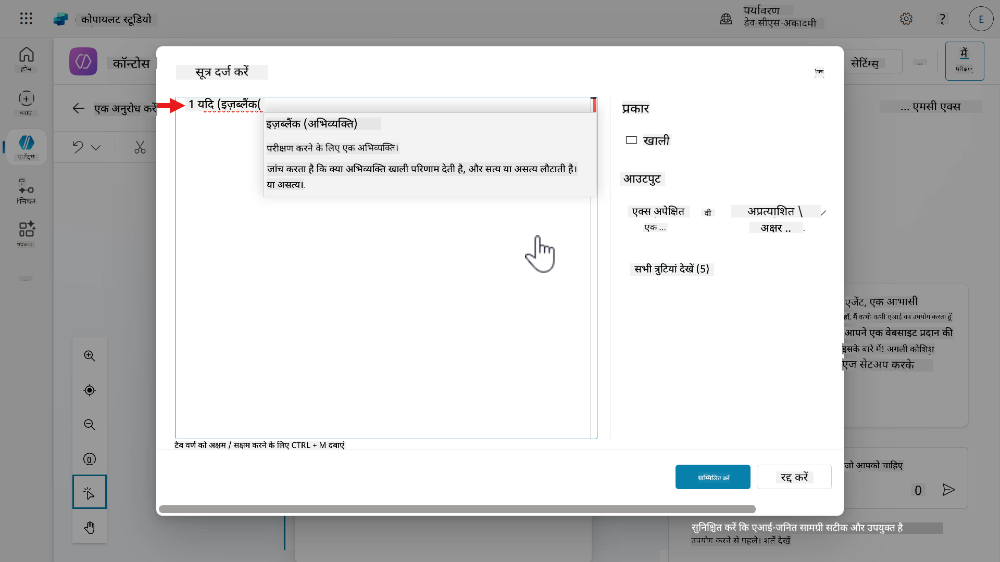

1. अब, `IsBlank` फ़ंक्शन के बाद **ब्रैकेट्स के अंदर क्लिक करें**। हम **Ask with adaptive card** नोड से `commentsId` आउटपुट वेरिएबल डालने जा रहे हैं।

ब्रैकेट्स के अंदर निम्नलिखित दर्ज करें,

    ```text
    Topic.commentsId
    ```

और ब्रैकेट के बाद एक कॉमा जोड़ें।

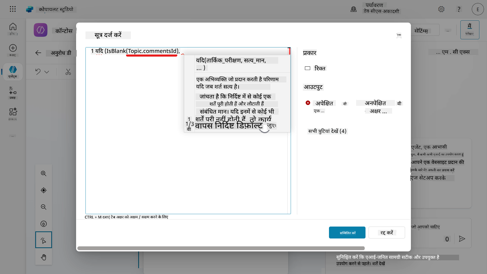

1. अब हम लॉजिक को परिभाषित करेंगे:

   - जब **_true_** हो - यदि `Topic.commentsId` स्ट्रिंग पैरामीटर खाली है, तो हम कोई मान नहीं डालना चाहते।
   - जब **_false_** हो - यदि `Topic.commentsId` स्ट्रिंग पैरामीटर खाली नहीं है, तो `commentsId` वेरिएबल का मान डालें।

स्ट्रिंग पैरामीटर को बंद करने वाले ब्रैकेट के बाद निम्नलिखित दर्ज करें,

    ```text
    "", Topic.commentsId)
    ```

Power Fx अभिव्यक्ति निम्नलिखित होनी चाहिए,

    ```text
    If(IsBlank(Topic.commentsId), "", Topic.commentsId)
    ```

शानदार काम, हमारी अभिव्यक्ति पूरी हो गई है! 🙌🏻 अब **Insert** चुनें ताकि एजेंट फ्लो के इनपुट पैरामीटर को Power Fx अभिव्यक्ति में सेट किया जा सके।

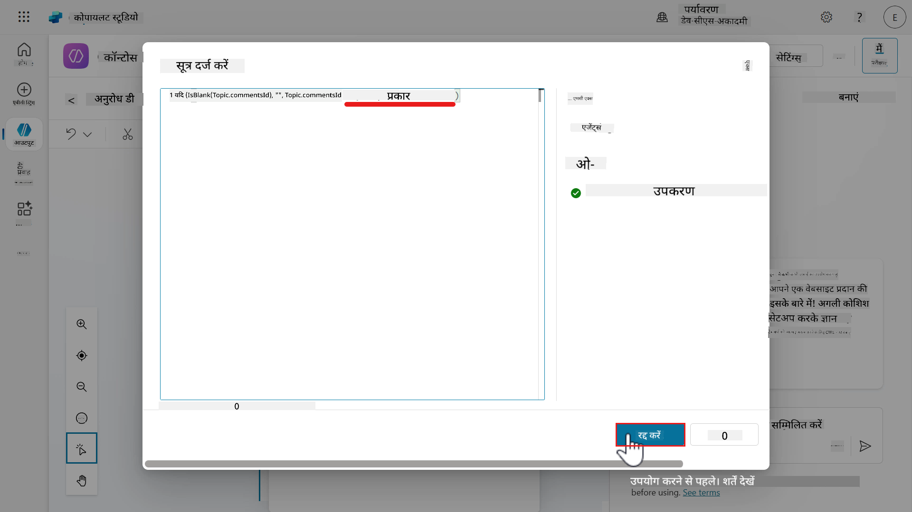

1. **Save** टॉपिक को सेव करें।

### 9.3 बेहतर उपयोगकर्ता अनुभव के लिए कई नोड्स के साथ Request device टॉपिक अपडेट करें

अब हम दो और नोड्स जोड़ेंगे:

- **Send a message** - यह एक पुष्टि संदेश के रूप में कार्य करेगा जो चयनित डिवाइस को संदर्भित करता है और यह कि उनका अनुरोध सबमिट कर दिया गया है।
- **Topic management** - बातचीत को बंद करने के लिए, हम **End of conversation** नोड पर रीडायरेक्ट करेंगे।

चलो शुरू करते हैं!

1. एजेंट फ्लो नोड के नीचे **प्लस + आइकन** चुनें और **Send a message** नोड चुनें।

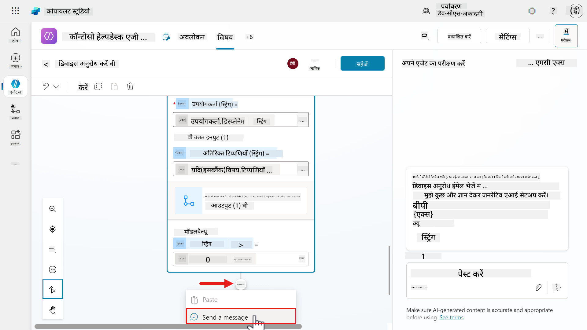

1. संदेश फ़ील्ड में नीचे निम्नलिखित दर्ज करें,

    ```text
    Thanks
    ```

फिर **Insert variable** चुनें क्योंकि हम उपयोगकर्ता का नाम संदर्भित करेंगे।

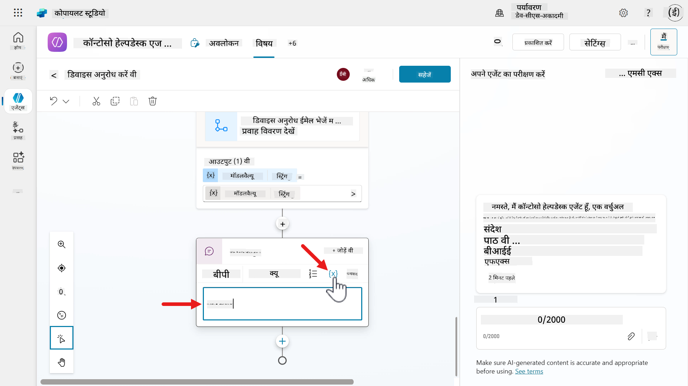

1. **System** टैब चुनें और खोज फ़ील्ड में `User` खोजें। **User.DisplayName** वेरिएबल चुनें।

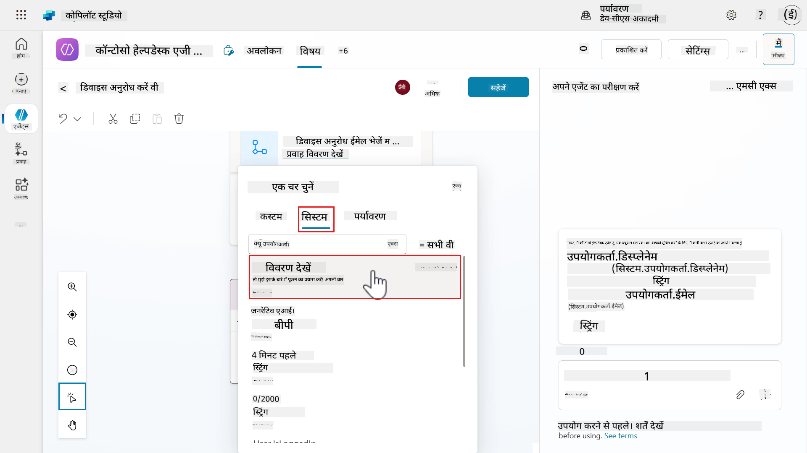

1. संदेश फ़ील्ड में नीचे निम्नलिखित दर्ज करें,

    ```text
    . Your selected device,
    ```

फिर **Insert variable** चुनें और इस बार **Custom** टैब में, **ModelValue** वेरिएबल चुनें।

फिर संदेश को पूरा करने के लिए नीचे निम्नलिखित दर्ज करें।

    ```text
    , has been submitted and will be reviewed by your manager.
    ```

संदेश निम्नलिखित जैसा दिखना चाहिए।

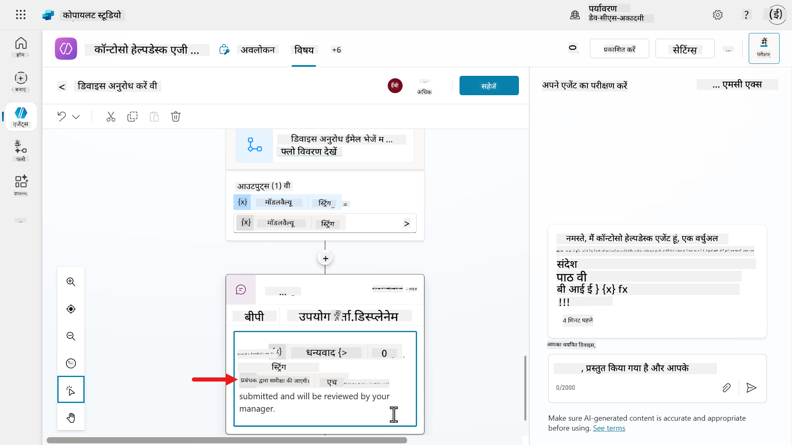

1. अंत में, **Send a message** नोड के नीचे **प्लस + आइकन** चुनें और **Topic management** चुनें, फिर **Go to another topic** और **End of Conversation** चुनें।

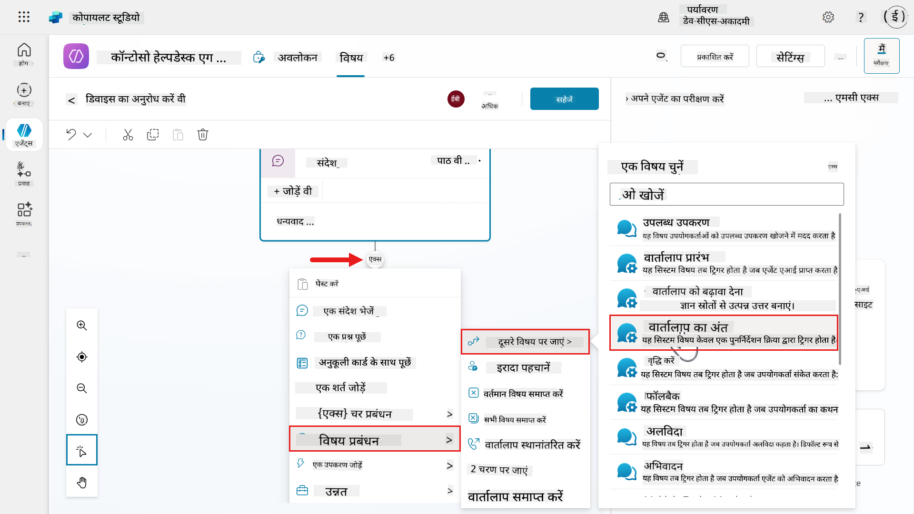

1. **Save** टॉपिक को सेव करें।

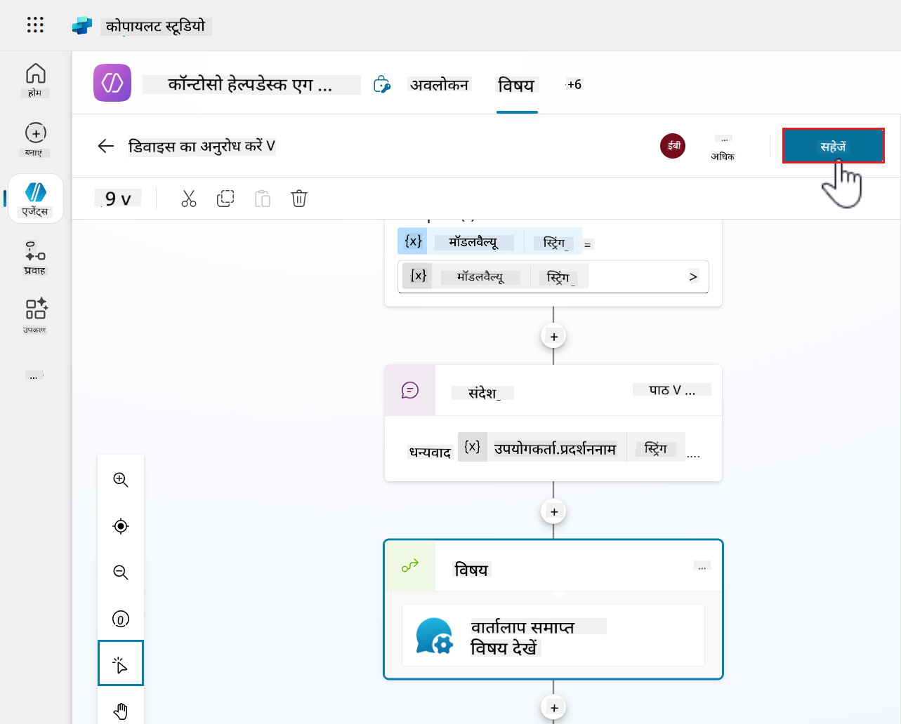

### 9.4 कई परिदृश्यों का उपयोग करके एजेंट का परीक्षण करें

शानदार काम!!! 😁 अब हम अपने एजेंट का परीक्षण कर सकते हैं।

#### 9.4.1 डिवाइस का अनुरोध करें और एडैप्टिव कार्ड में एक टिप्पणी दर्ज करें

1. **Refresh** टेस्ट पैन, **activity map** आइकन चुनें और एजेंट को संदेश के रूप में निम्नलिखित दर्ज करें।

    ```text
    I need a laptop
    ```

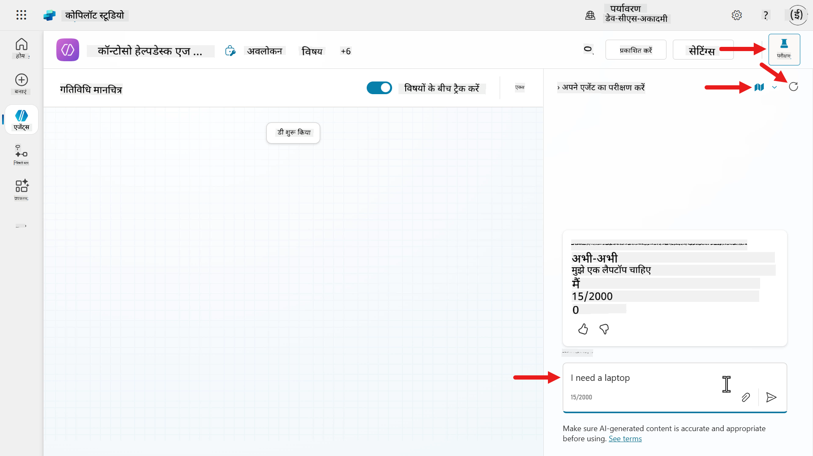

1. एजेंट **Available devices** को ट्रिगर करता है और उपलब्ध डिवाइसों की सूची के साथ प्रतिक्रिया देता है। हम निम्नलिखित उत्तर देंगे कि क्या हम डिवाइस का अनुरोध करना चाहते हैं।

    ```text
    Yes
    ```

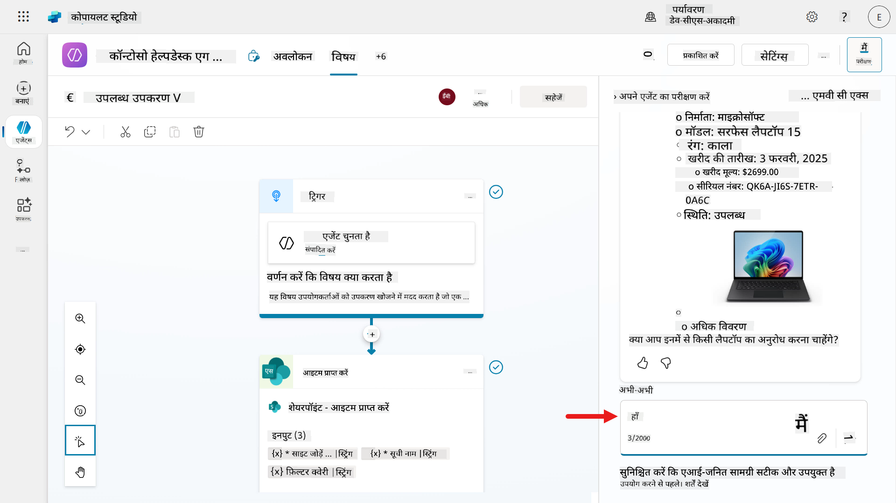

1. ध्यान दें कि एजेंट ने **Request device** को एजेंट निर्देशों के अनुसार ट्रिगर किया और एडैप्टिव कार्ड अब एजेंट संदेश में प्रदर्शित हो रहा है।

**Surface Laptop 15** डिवाइस चुनें और निम्नलिखित को टिप्पणी के रूप में जोड़ें।

    ```text
    I need 16GB of RAM please
    ```

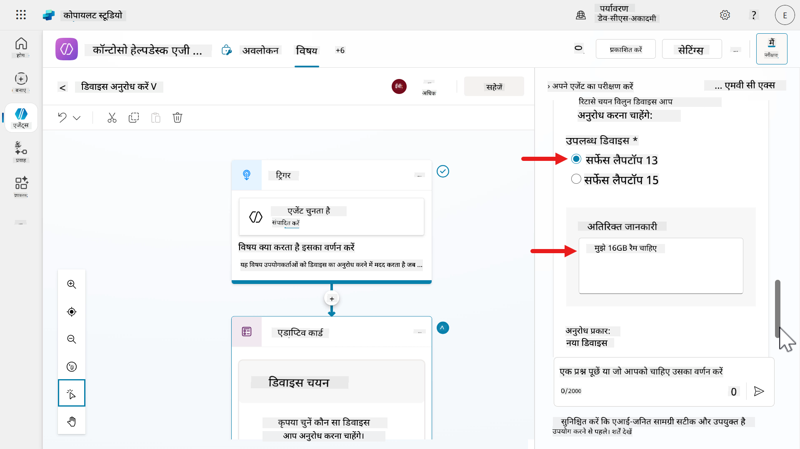

1. नीचे स्क्रॉल करें जब तक कि आप **Submit Request** बटन न देखें और इसे एजेंट को एडैप्टिव कार्ड सबमिट करने के लिए चुनें।

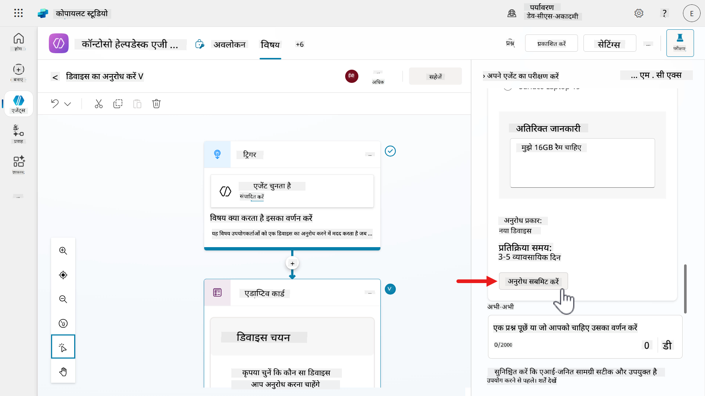

1. एजेंट को आपके क्रेडेंशियल्स का उपयोग करने की अनुमति देने के लिए **Allow** चुनें ताकि दो कनेक्टर क्रियाओं के कनेक्शन प्रमाणीकरण हो सके।

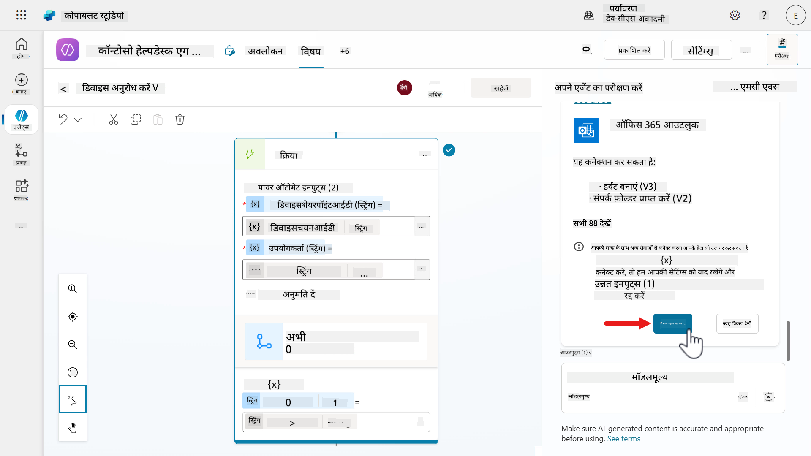

1. एजेंट फिर पुष्टि संदेश प्रदर्शित करेगा जिसमें चयनित मॉडल शामिल है, इसके बाद **End of Conversation** टॉपिक पर रीडायरेक्ट करेगा। शानदार!

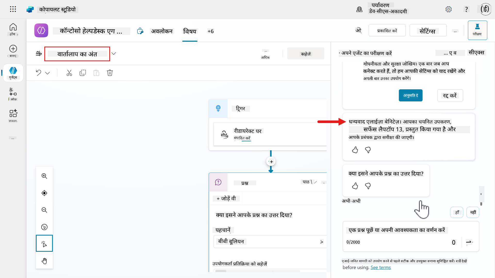

1. **Yes** चुनें ताकि **End of Conversation** टॉपिक के बाकी हिस्से को सत्यापित किया जा सके।

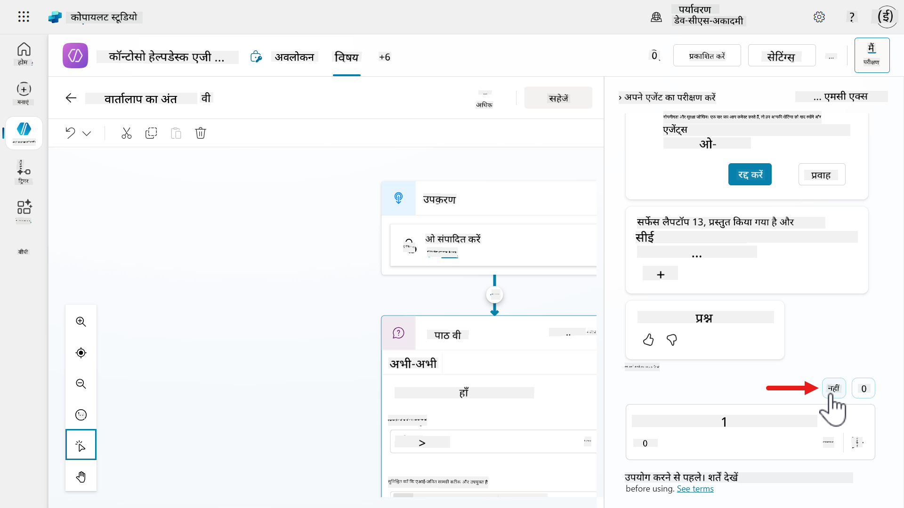

1. अगले चरण में, रेटिंग स्केल कार्ड में किसी भी स्टार को चुनकर अनुभव को रेट करें।

एजेंट फिर **End of Conversation** टॉपिक के अंतिम **Question** नोड पर जाएगा। **No** चुनें।

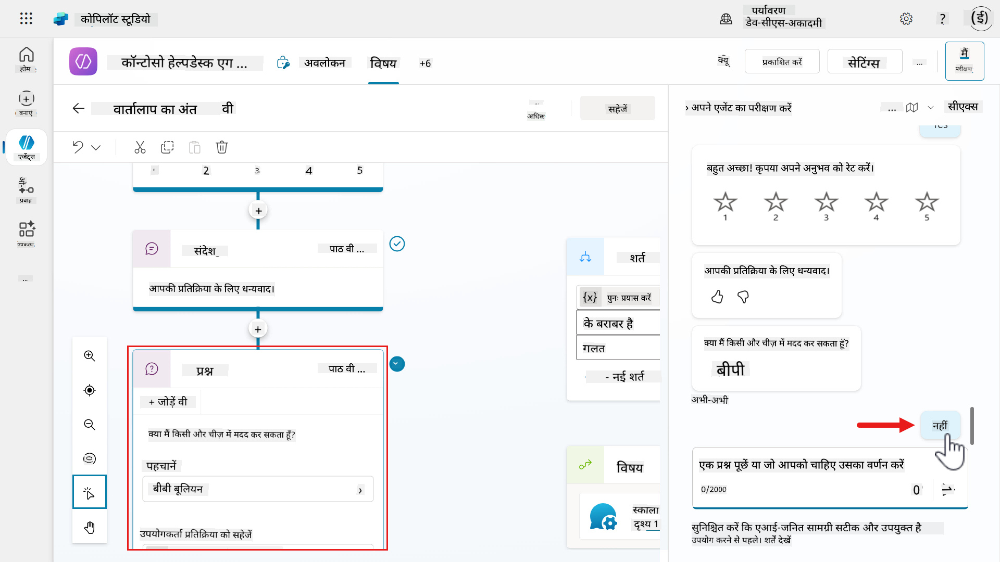

1. टॉपिक फिर पूरा हो जाएगा क्योंकि अंतिम संदेश टेस्ट पैन में प्रदर्शित होगा।

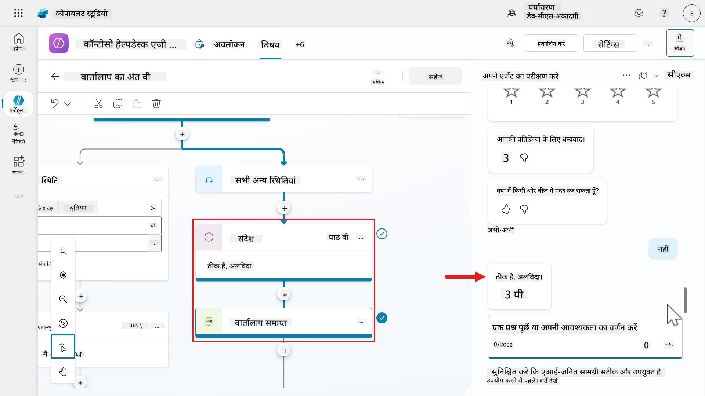

1. अपने ईमेल खाते के इनबॉक्स की जांच करें ताकि एजेंट फ्लो द्वारा प्रबंधक को भेजे गए ईमेल की समीक्षा की जा सके। आप चयनित डिवाइस का विवरण और एडैप्टिव कार्ड में दर्ज नोट देख सकते हैं।

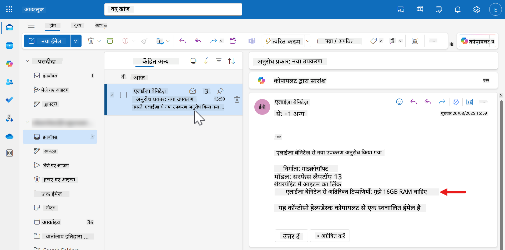

1. हाइपरलिंक पर क्लिक करें और ब्राउज़र को डिवाइस के SharePoint आइटम को लोड करना चाहिए। शानदार!

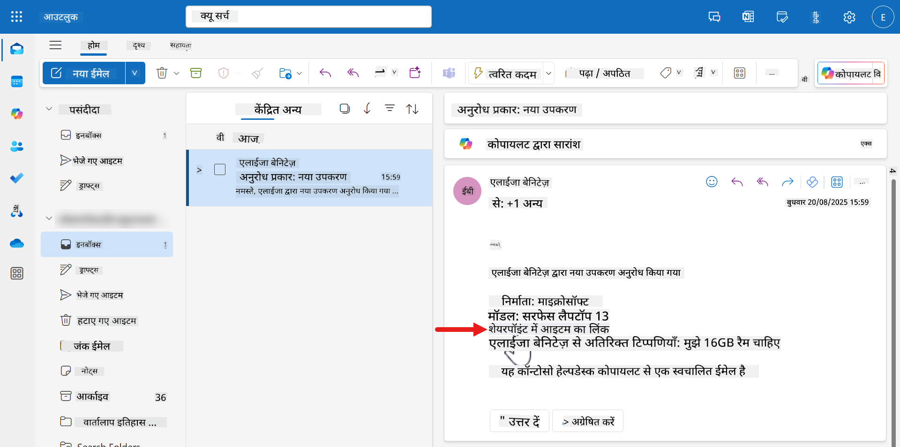

#### 9.4.2 डिवाइस का अनुरोध करें और एडैप्टिव कार्ड में टिप्पणी दर्ज न करें

अब हम उस परिदृश्य का परीक्षण करेंगे जब कोई टिप्पणी दर्ज नहीं की जाती है।

1. निम्नलिखित चरणों को दोहराएं:

   - **Refresh** टेस्ट पैन और **activity map** आइकन चुनें
   - संदेश दर्ज करें, `I need a laptop`
   - डिवाइस का अनुरोध करने के प्रश्न का उत्तर `Yes` के साथ दें


1. इस बार **Surface Laptop 13** डिवाइस चुनें और कोई टिप्पणी दर्ज न करें।


1. **Submit Request** बटन चुनकर अनुरोध सबमिट करें।

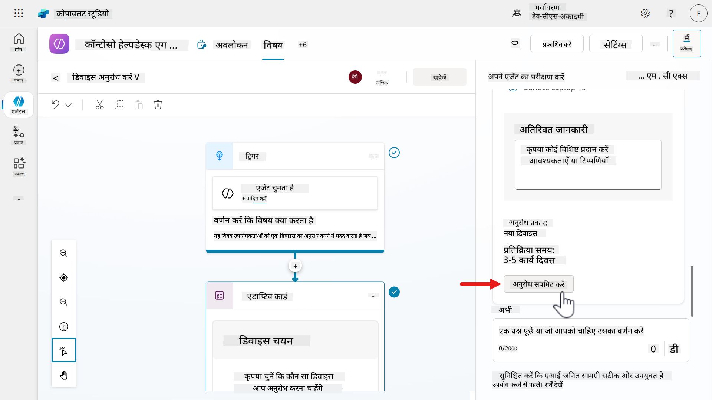

1. इस बार आपके इनबॉक्स में प्राप्त ईमेल में टिप्पणी के रूप में **None** प्रदर्शित होगा।

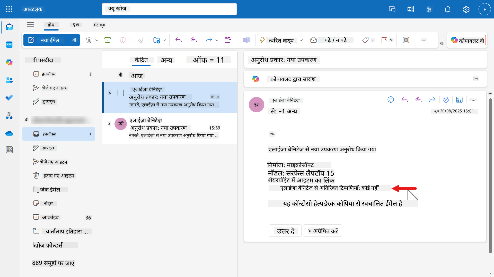

#### 9.4.3 डिवाइस का अनुरोध न करें

अब हम अंतिम परिदृश्य का परीक्षण करेंगे जिसमें डिवाइस का अनुरोध नहीं किया जाता है, और एजेंट निर्देशों के अनुसार **Goodbye** टॉपिक को ट्रिगर किया जाना चाहिए।

1. निम्नलिखित चरणों को दोहराएं:

   - **Refresh** टेस्ट पैन और **activity map** आइकन चुनें
   - संदेश दर्ज करें, `I need a laptop`
   - इस बार डिवाइस का अनुरोध करने के प्रश्न का उत्तर `No` के साथ दें

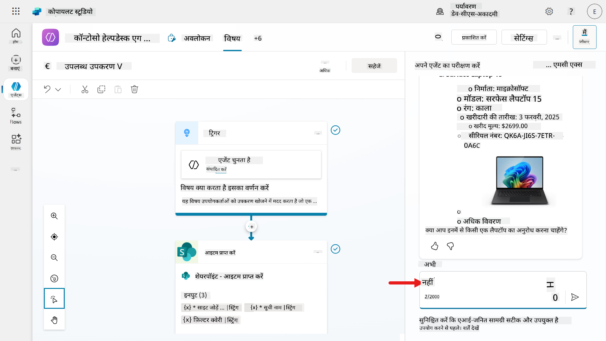

1. एजेंट ने **Goodbye** टॉपिक को ट्रिगर किया और टॉपिक में परिभाषित प्रश्न पूछा।

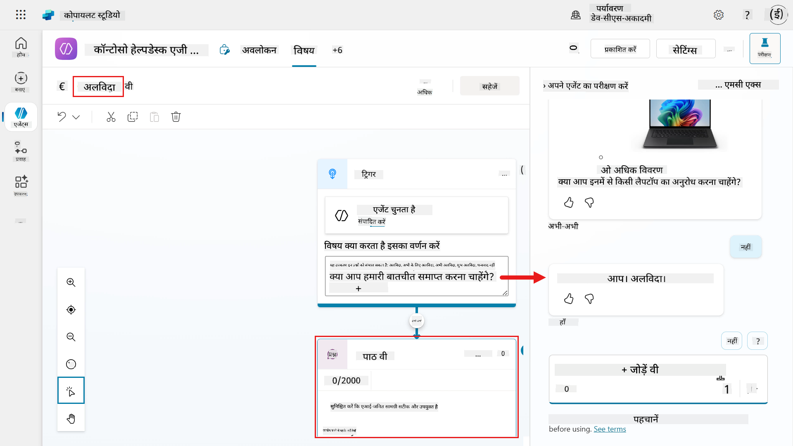

## ✅ मिशन पूरा

बधाई हो! 👏🏻 आपने सीखा कि अपने एजेंट फ्लो को कैसे बनाएं और इसे हमारे मौजूदा **Request device** टॉपिक में जोड़ें, और एजेंट को दूसरे टॉपिक पर रीडायरेक्ट कैसे करें।

यह **Lab 09 - Add an agent flow for automation and enhance topic capabilities** का अंत है, नीचे दिए गए लिंक पर क्लिक करें अगले पाठ में जाने के लिए। हम इस लैब के उपयोग मामले को अगले पाठ के लैब में विस्तार करेंगे।

⏭️ [**Add Event Triggers - Enable autonomous agent capabilities** पाठ पर जाएं](../10-add-event-triggers/README.md)

## 📚 सामरिक संसाधन

🔗 [एजेंट फ्लो का परिचय: AI-प्रथम वर्कफ़्लो के साथ ऑटोमेशन को बदलना](https://www.microsoft.com/microsoft-copilot/blog/copilot-studio/introducing-agent-flows-transforming-automation-with-ai-first-workflows/)

🔗 [एजेंट फ्लो का अवलोकन](https://learn.microsoft.com/microsoft-copilot-studio/flows-overview?WT.mc_id=power-172621-ebenitez)

🔗 [अपने एजेंट के साथ एजेंट फ्लो का उपयोग करें](https://learn.microsoft.com/microsoft-copilot-studio/advanced-flow?WT.mc_id=power-172621-ebenitez)

🔗 [संदर्भ गाइड में फ़ंक्शंस की सूची](https://learn.microsoft.com/azure/logic-apps/workflow-definition-language-functions-reference?WT.mc_id=power-172621-ebenitez)

📺 [Copilot Studio में एजेंट फ्लो](https://www.youtube.com/watch?v=VJTKyk3Pr7s)


---

**अस्वीकरण**:  
यह दस्तावेज़ AI अनुवाद सेवा [Co-op Translator](https://github.com/Azure/co-op-translator) का उपयोग करके अनुवादित किया गया है। जबकि हम सटीकता के लिए प्रयास करते हैं, कृपया ध्यान दें कि स्वचालित अनुवाद में त्रुटियां या अशुद्धियां हो सकती हैं। मूल भाषा में दस्तावेज़ को आधिकारिक स्रोत माना जाना चाहिए। महत्वपूर्ण जानकारी के लिए, पेशेवर मानव अनुवाद की सिफारिश की जाती है। इस अनुवाद के उपयोग से उत्पन्न किसी भी गलतफहमी या गलत व्याख्या के लिए हम उत्तरदायी नहीं हैं।