<!--
CO_OP_TRANSLATOR_METADATA:
{
  "original_hash": "cd99a76bcb7372ac2771b6ae178b023d",
  "translation_date": "2025-10-21T18:19:39+00:00",
  "source_file": "docs/recruit/10-add-event-triggers/README.md",
  "language_code": "hi"
}
-->
# 🚨 मिशन 10: इवेंट ट्रिगर्स जोड़ें - स्वायत्त एजेंट क्षमताओं को सक्षम करें

## 🕵️‍♂️ कोडनेम: `ऑपरेशन घोस्ट रूटीन`

> **⏱️ ऑपरेशन का समय:** `~45 मिनट`

🎥 **वॉकथ्रू देखें**

[](https://www.youtube.com/watch?v=ZgwHL8PQ1nY "YouTube पर वॉकथ्रू देखें")

## 🎯 मिशन का विवरण

अब समय आ गया है कि आप अपने एजेंट को एक साधारण संवादात्मक सहायक से स्वायत्त ऑपरेटिव में बदलें। आपका मिशन है कि आप अपने एजेंट को बिना बुलाए कार्य करने में सक्षम बनाएं - आपके डिजिटल डोमेन से आने वाले संकेतों पर सटीकता और गति के साथ प्रतिक्रिया दें।

इवेंट ट्रिगर्स के साथ, आप अपने एजेंट को SharePoint, Teams, और Outlook जैसे बाहरी सिस्टम की निगरानी करने और संकेत प्राप्त होते ही बुद्धिमान कार्य करने के लिए प्रशिक्षित करेंगे। यह ऑपरेशन आपके एजेंट को एक पूरी तरह से ऑपरेशनल फील्ड एसेट में बदल देता है - चुप, तेज़, और हमेशा सतर्क।

सफलता का मतलब है ऐसे एजेंट बनाना जो मूल्य की शुरुआत करें - केवल प्रतिक्रिया न दें।

## 🔎 उद्देश्य

📖 इस पाठ में आप सीखेंगे:

- इवेंट ट्रिगर्स को समझना और कैसे वे स्वायत्त एजेंट व्यवहार को सक्षम करते हैं
- इवेंट ट्रिगर्स और टॉपिक ट्रिगर्स के बीच का अंतर, जिसमें ट्रिगर वर्कफ़्लो और पेलोड शामिल हैं
- सामान्य इवेंट ट्रिगर परिदृश्यों का अन्वेषण करना
- इवेंट-ड्रिवन एजेंट्स के लिए प्रमाणीकरण, सुरक्षा, और प्रकाशन विचारों को समझना
- एक स्वायत्त आईटी हेल्प डेस्क एजेंट बनाना जो SharePoint इवेंट्स पर प्रतिक्रिया देता है और ईमेल पुष्टि भेजता है

## 🤔 इवेंट ट्रिगर क्या है?

**इवेंट ट्रिगर** एक ऐसा तंत्र है जो आपके एजेंट को बाहरी घटनाओं के जवाब में स्वायत्त रूप से कार्य करने की अनुमति देता है, बिना सीधे उपयोगकर्ता इनपुट की आवश्यकता के। इसे ऐसा समझें जैसे आपका एजेंट "विशेष घटनाओं" को देखने और उन घटनाओं के होने पर स्वचालित रूप से कार्रवाई करने में सक्षम हो।

टॉपिक ट्रिगर्स के विपरीत, जो उपयोगकर्ताओं को बातचीत शुरू करने के लिए कुछ टाइप करने की आवश्यकता होती है, इवेंट ट्रिगर्स आपके कनेक्टेड सिस्टम में होने वाली घटनाओं के आधार पर सक्रिय होते हैं। जैसे:

- जब SharePoint या OneDrive for Business में नई फ़ाइल बनाई जाती है
- जब Dataverse में नया रिकॉर्ड बनाया जाता है
- जब Planner में कोई कार्य पूरा होता है
- जब Microsoft Form का नया उत्तर सबमिट किया जाता है
- जब Microsoft Teams में नया संदेश जोड़ा जाता है
- एक आवर्ती शेड्यूल के आधार पर (जैसे दैनिक अनुस्मारक)  
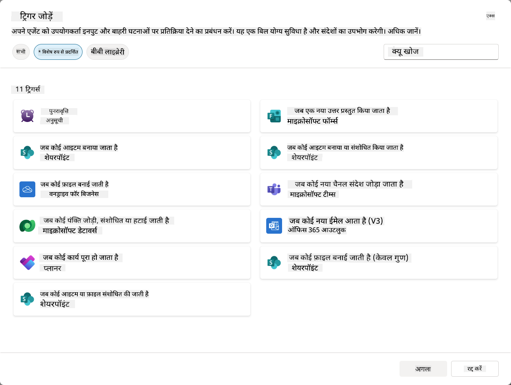

### स्वायत्त एजेंट्स में इवेंट ट्रिगर्स क्यों महत्वपूर्ण हैं

इवेंट ट्रिगर्स आपके एजेंट को एक प्रतिक्रियाशील सहायक से एक सक्रिय, स्वायत्त सहायक में बदल देते हैं:

1. **स्वायत्त संचालन** - आपका एजेंट बिना मानवीय हस्तक्षेप के 24/7 काम कर सकता है, घटनाओं के होते ही प्रतिक्रिया देता है।
    - *उदाहरण:* जब टीम में नए सदस्य जोड़े जाते हैं, तो स्वचालित रूप से उनका स्वागत करें।

1. **रियल-टाइम प्रतिक्रिया** - उपयोगकर्ताओं के सवाल पूछने का इंतजार करने के बजाय, आपका एजेंट प्रासंगिक घटनाओं पर तुरंत प्रतिक्रिया देता है।
    - *उदाहरण:* जब SharePoint दस्तावेज़ संशोधित होता है तो आईटी टीम को अलर्ट करें।

1. **वर्कफ़्लो ऑटोमेशन** - एकल ट्रिगर इवेंट के आधार पर कई क्रियाओं को जोड़ें।
    - *उदाहरण:* जब नया सपोर्ट टिकट बनाया जाता है, तो एक कार्य बनाएं, प्रबंधक को सूचित करें, और ट्रैकिंग डैशबोर्ड अपडेट करें।

1. **सुसंगत प्रक्रियाएं** - सुनिश्चित करें कि महत्वपूर्ण कदम कभी नहीं छूटते हैं, प्रमुख घटनाओं के जवाब को स्वचालित करके।
    - *उदाहरण:* हर नए कर्मचारी को स्वचालित रूप से ऑनबोर्डिंग सामग्री और एक्सेस अनुरोध प्राप्त होते हैं।

1. **डेटा-ड्रिवन क्रियाएं** - ट्रिगर इवेंट से जानकारी का उपयोग करके स्मार्ट निर्णय लें और उचित कार्रवाई करें।
    - *उदाहरण:* ट्रिगर पेलोड में प्राथमिकता स्तर के आधार पर वरिष्ठ कर्मचारियों को तत्काल टिकट भेजें।

## ⚙️ इवेंट ट्रिगर्स कैसे काम करते हैं?

इवेंट ट्रिगर्स तीन-चरणीय वर्कफ़्लो के माध्यम से काम करते हैं जो आपके एजेंट को बाहरी घटनाओं पर स्वायत्त रूप से प्रतिक्रिया देने में सक्षम बनाता है:

### ट्रिगर वर्कफ़्लो

1. **इवेंट डिटेक्शन** - कनेक्टेड सिस्टम (SharePoint, Teams, Outlook, आदि) में एक विशिष्ट घटना होती है।
1. **ट्रिगर सक्रियण** - इवेंट ट्रिगर इस घटना का पता लगाता है और आपके एजेंट को Power Automate Cloud Flow के माध्यम से पेलोड भेजता है।
1. **एजेंट प्रतिक्रिया** - आपका एजेंट पेलोड प्राप्त करता है और आपके द्वारा परिभाषित निर्देशों को निष्पादित करता है।

### इवेंट बनाम टॉपिक ट्रिगर्स

इन दो ट्रिगर प्रकारों के बीच का अंतर समझना महत्वपूर्ण है:

| **इवेंट ट्रिगर्स** | **टॉपिक ट्रिगर्स** |
|-------------------|-------------------|
| बाहरी सिस्टम घटनाओं द्वारा सक्रिय | उपयोगकर्ता इनपुट/वाक्यांशों द्वारा सक्रिय |
| स्वायत्त एजेंट व्यवहार सक्षम करें | संवादात्मक प्रतिक्रियाएं सक्षम करें |
| निर्माता का प्रमाणीकरण उपयोग करें | उपयोगकर्ता के प्रमाणीकरण का विकल्प |
| उपयोगकर्ता इंटरैक्शन के बिना चलें | उपयोगकर्ता को बातचीत शुरू करने की आवश्यकता |
| उदाहरण: फ़ाइल बनाई गई, ईमेल प्राप्त हुआ | उदाहरण: "मौसम कैसा है?" |

## 📦 ट्रिगर पेलोड को समझना

जब कोई घटना होती है, तो ट्रिगर आपके एजेंट को एक **पेलोड** भेजता है जिसमें घटना के बारे में जानकारी और प्रतिक्रिया देने के निर्देश होते हैं।

### डिफ़ॉल्ट बनाम कस्टम पेलोड

हर ट्रिगर प्रकार के पास एक डिफ़ॉल्ट पेलोड संरचना होती है, लेकिन आप इसे अनुकूलित कर सकते हैं:

**डिफ़ॉल्ट पेलोड** - मानक प्रारूप का उपयोग करता है जैसे `Use content from {Body}`

- बुनियादी घटना जानकारी शामिल करता है
- सामान्य प्रसंस्करण निर्देशों का उपयोग करता है
- सरल परिदृश्यों के लिए अच्छा है

**कस्टम पेलोड** - विशिष्ट निर्देश और डेटा स्वरूपण जोड़ें

- आपके एजेंट के लिए विस्तृत निर्देश शामिल करें
- सटीक रूप से निर्दिष्ट करें कि कौन सा डेटा उपयोग करना है और कैसे
- जटिल वर्कफ़्लो के लिए बेहतर

### एजेंट निर्देश बनाम कस्टम पेलोड निर्देश

आपके पास इवेंट ट्रिगर्स के साथ अपने एजेंट के व्यवहार को मार्गदर्शन देने के दो स्थान हैं:

**एजेंट निर्देश** (वैश्विक)

- व्यापक मार्गदर्शन जो सभी ट्रिगर्स पर लागू होता है
- उदाहरण: "टिकटों को संसाधित करते समय, पहले डुप्लिकेट की जांच करें"
- सामान्य व्यवहार पैटर्न के लिए सबसे अच्छा

**पेलोड निर्देश** (ट्रिगर-विशिष्ट)

- व्यक्तिगत ट्रिगर प्रकारों के लिए विशिष्ट निर्देश  
- उदाहरण: "इस SharePoint अपडेट के लिए, प्रोजेक्ट चैनल को सारांश भेजें"
- कई ट्रिगर्स वाले जटिल एजेंट्स के लिए सबसे अच्छा

💡 **प्रो टिप**: इन दोनों स्तरों के बीच विरोधाभासी निर्देशों से बचें, क्योंकि इससे अप्रत्याशित व्यवहार हो सकता है।

## 🎯 सामान्य इवेंट ट्रिगर परिदृश्य

यहां कुछ व्यावहारिक उदाहरण दिए गए हैं कि कैसे इवेंट ट्रिगर्स आपके एजेंट को बेहतर बना सकते हैं:

### आईटी हेल्प डेस्क एजेंट

- **ट्रिगर**: नया SharePoint सूची आइटम (सपोर्ट टिकट)
- **क्रिया**: स्वचालित रूप से वर्गीकृत करें, प्राथमिकता असाइन करें, और संबंधित टीम सदस्यों को सूचित करें

### कर्मचारी ऑनबोर्डिंग एजेंट

- **ट्रिगर**: Dataverse में नया उपयोगकर्ता जोड़ा गया
- **क्रिया**: स्वागत संदेश भेजें, ऑनबोर्डिंग कार्य बनाएं, और एक्सेस प्रदान करें

### प्रोजेक्ट प्रबंधन एजेंट

- **ट्रिगर**: Planner में कार्य पूरा हुआ
- **क्रिया**: प्रोजेक्ट डैशबोर्ड अपडेट करें, हितधारकों को सूचित करें, और ब्लॉकर्स की जांच करें

### दस्तावेज़ प्रबंधन एजेंट

- **ट्रिगर**: विशिष्ट SharePoint फ़ोल्डर में फ़ाइल अपलोड की गई
- **क्रिया**: मेटाडेटा निकालें, टैग लागू करें, और दस्तावेज़ मालिकों को सूचित करें

### मीटिंग सहायक एजेंट

- **ट्रिगर**: कैलेंडर इवेंट बनाया गया
- **क्रिया**: प्री-मीटिंग अनुस्मारक और एजेंडा भेजें, संसाधन बुक करें

## ⚠️ प्रकाशन और प्रमाणीकरण विचार

आपके एजेंट को उत्पादन में इवेंट ट्रिगर्स का उपयोग करने से पहले, आपको प्रमाणीकरण और सुरक्षा प्रभावों को समझना होगा।

### निर्माता प्रमाणीकरण

इवेंट ट्रिगर्स सभी प्रमाणीकरण के लिए **एजेंट निर्माता की क्रेडेंशियल्स** का उपयोग करते हैं:

- आपका एजेंट आपके अनुमतियों का उपयोग करके सिस्टम तक पहुंचता है
- उपयोगकर्ता आपके क्रेडेंशियल्स के माध्यम से डेटा तक पहुंच सकते हैं
- सभी क्रियाएं "आपके रूप में" की जाती हैं, भले ही उपयोगकर्ता एजेंट के साथ इंटरैक्ट करें

### डेटा सुरक्षा सर्वोत्तम प्रथाएं

इवेंट ट्रिगर्स के साथ एजेंट्स को प्रकाशित करते समय सुरक्षा बनाए रखने के लिए:

1. **डेटा एक्सेस का मूल्यांकन करें** - समीक्षा करें कि आपके ट्रिगर्स किन सिस्टम्स और डेटा तक पहुंच सकते हैं
1. **पूरी तरह से परीक्षण करें** - समझें कि ट्रिगर्स पेलोड्स में कौन सी जानकारी शामिल है
1. **ट्रिगर स्कोप को सीमित करें** - विशिष्ट पैरामीटर का उपयोग करें ताकि केवल आवश्यक घटनाएं ट्रिगर्स को सक्रिय करें
1. **पेलोड डेटा की समीक्षा करें** - सुनिश्चित करें कि ट्रिगर्स संवेदनशील जानकारी को उजागर नहीं करते हैं
1. **उपयोग की निगरानी करें** - ट्रिगर गतिविधि और संसाधन खपत को ट्रैक करें

## ⚠️ समस्या निवारण और सीमाएं

इवेंट ट्रिगर्स के साथ काम करते समय इन महत्वपूर्ण बातों को ध्यान में रखें:

### कोटा और बिलिंग प्रभाव

- प्रत्येक ट्रिगर सक्रियता आपके संदेश खपत में गिना जाता है
- बार-बार ट्रिगर्स (जैसे हर मिनट की पुनरावृत्ति) जल्दी से कोटा खपत कर सकते हैं
- थ्रॉटलिंग से बचने के लिए उपयोग की निगरानी करें

### तकनीकी आवश्यकताएं

- केवल उन एजेंट्स के लिए उपलब्ध जिनमें जनरेटिव ऑर्केस्ट्रेशन सक्षम है
- आपके वातावरण में समाधान-जागरूक क्लाउड फ्लो साझा करना सक्षम होना चाहिए

### डेटा लॉस प्रिवेंशन (DLP)

- आपकी संगठन की DLP नीतियां निर्धारित करती हैं कि कौन से ट्रिगर्स उपलब्ध हैं
- प्रशासक इवेंट ट्रिगर्स को पूरी तरह से ब्लॉक कर सकते हैं
- यदि अपेक्षित ट्रिगर्स उपलब्ध नहीं हैं, तो अपने प्रशासक से संपर्क करें

## 🧪 लैब 10 - स्वायत्त एजेंट व्यवहार के लिए इवेंट ट्रिगर्स जोड़ें

### 🎯 उपयोग का मामला

आप अपने आईटी हेल्प डेस्क एजेंट को नए सपोर्ट अनुरोधों पर स्वचालित रूप से प्रतिक्रिया देने के लिए बढ़ाएंगे। जब कोई व्यक्ति आपके SharePoint सपोर्ट टिकट्स सूची में नया आइटम बनाता है, तो आपका एजेंट:

1. SharePoint टिकट बनाए जाने पर स्वायत्त रूप से ट्रिगर होगा
1. टिकट विवरण और वह निर्देश प्रदान करेगा जो आप चाहते हैं कि वह प्रदर्शन करे
1. एआई जनरेटेड ईमेल के माध्यम से सबमिटर को टिकट की पुष्टि स्वचालित रूप से भेजेगा

यह लैब दिखाता है कि कैसे इवेंट ट्रिगर्स वास्तव में स्वायत्त एजेंट व्यवहार को सक्षम करते हैं।

### आवश्यकताएँ

इस लैब को शुरू करने से पहले सुनिश्चित करें कि आपके पास है:

- ✅ पिछले लैब्स (विशेष रूप से लैब 6-8 आईटी हेल्प डेस्क एजेंट के लिए) पूरे किए गए हैं
- ✅ SharePoint साइट तक पहुंच जिसमें आईटी सपोर्ट टिकट्स सूची है
- ✅ Copilot Studio वातावरण जिसमें इवेंट ट्रिगर्स सक्षम हैं
- ✅ आपके एजेंट में जनरेटिव ऑर्केस्ट्रेशन सक्षम है
- ✅ SharePoint और आपके Copilot Studio वातावरण में उपयुक्त अनुमतियाँ

### 10.1 जनरेटिव एआई सक्षम करें और SharePoint आइटम निर्माण ट्रिगर बनाएं

1. **Copilot Studio** में अपने **आईटी हेल्प डेस्क एजेंट** को खोलें

1. पहले सुनिश्चित करें कि आपके एजेंट के लिए **जनरेटिव एआई** सक्षम है:
   - **ओवरव्यू** टैब पर जाएं
   - ऑर्केस्ट्रेशन सेक्शन के तहत, **जनरेटिव ऑर्केस्ट्रेशन** को **चालू** पर टॉगल करें यदि यह पहले से सक्षम नहीं है  
     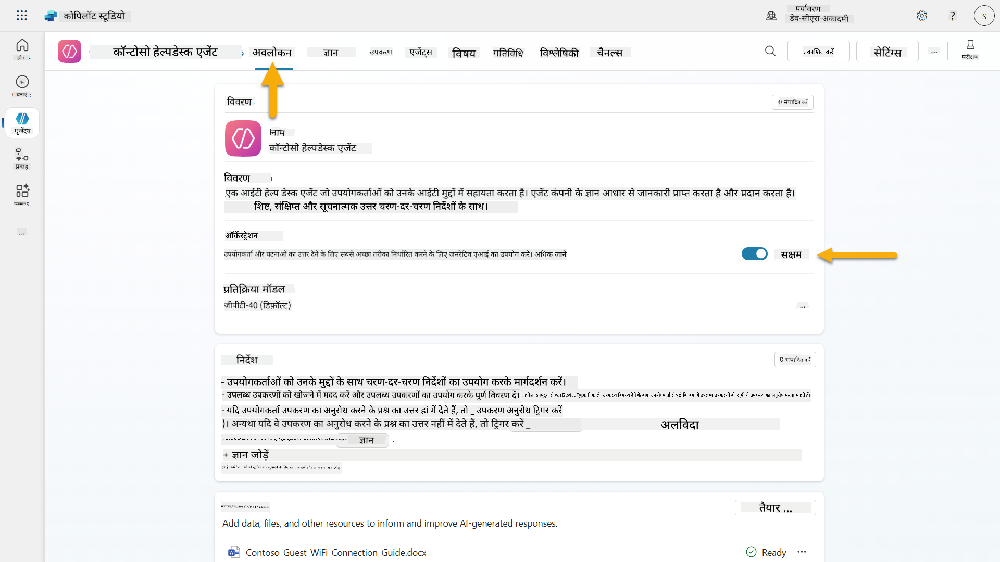

1. **ओवरव्यू** टैब पर जाएं और **ट्रिगर्स** सेक्शन को ढूंढें

1. **+ ट्रिगर जोड़ें** पर क्लिक करें ताकि ट्रिगर लाइब्रेरी खुल सके  
    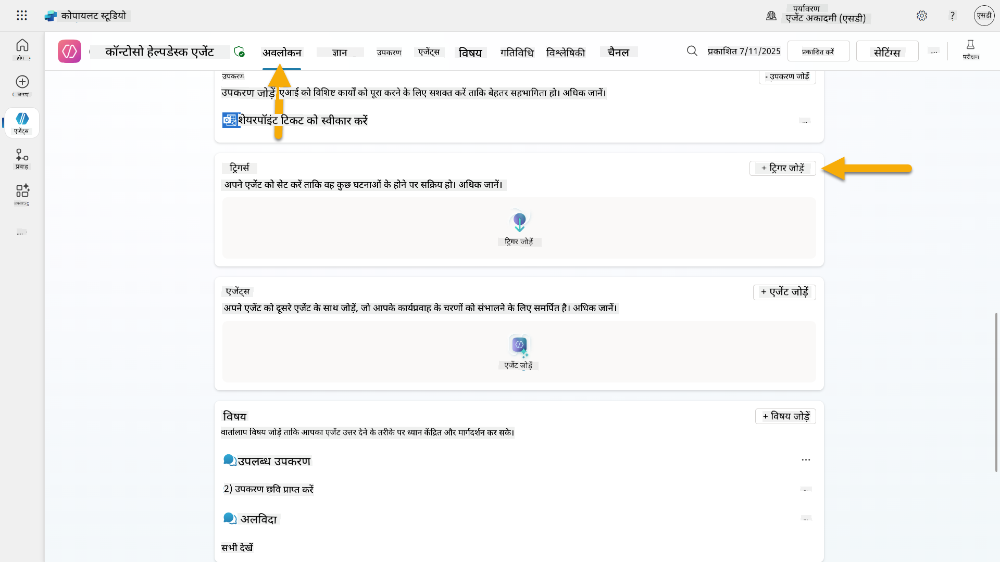

1. **जब आइटम बनाया जाए** (SharePoint) खोजें और चुनें  
    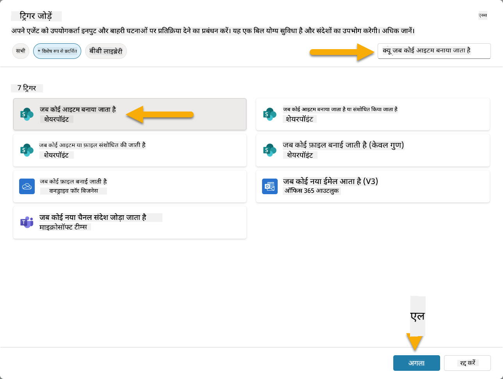

1. ट्रिगर नाम और कनेक्शन कॉन्फ़िगर करें:

   - **ट्रिगर नाम:** SharePoint में नया सपोर्ट टिकट बनाया गया

1. कनेक्शन कॉन्फ़िगर होने की प्रतीक्षा करें और **अगला** चुनें।  
   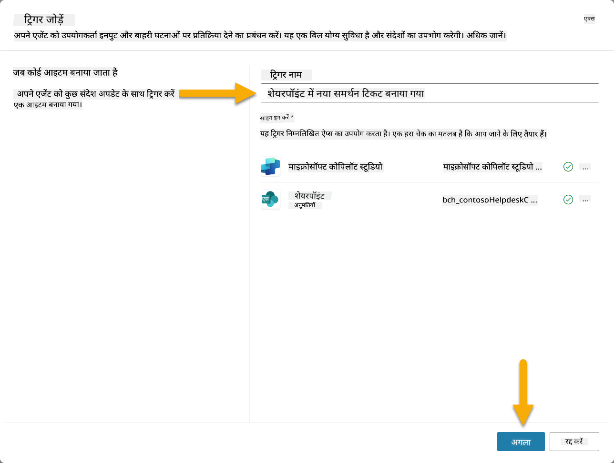

1. ट्रिगर पैरामीटर कॉन्फ़िगर करें:

   - **साइट पता**: अपना "Contoso IT" SharePoint साइट चुनें

   - **सूची का नाम**: अपनी "टिकट्स" सूची चुनें

   - **ट्रिगर द्वारा सक्रिय होने पर एजेंट को अतिरिक्त निर्देश:**

     ```text
     New Support Ticket Created in SharePoint: {Body}
     
     Use the 'Acknowledge SharePoint Ticket' tool to generate the email body automatically and respond.
     
     IMPORTANT: Do not wait for any user input. Work completely autonomously.
     ```

     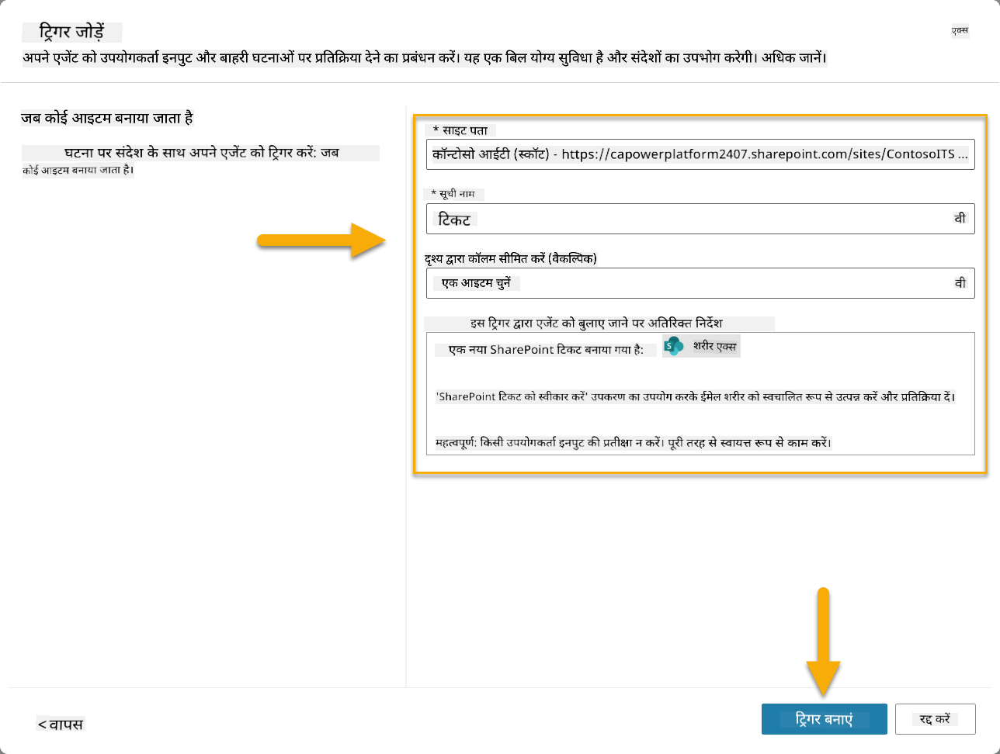

1. **ट्रिगर बनाएं** चुनें ताकि ट्रिगर निर्माण पूरा हो। एक Power Automate Cloud Flow स्वचालित रूप से बनाया जाता है ताकि एजेंट स्वायत्त रूप से ट्रिगर हो सके।

1. **बंद करें** चुनें।

### 10.2 ट्रिगर संपादित करें

1. **ओवरव्यू** टैब के **ट्रिगर्स** सेक्शन के अंदर, **SharePoint में नया सपोर्ट टिकट बनाया गया** ट्रिगर पर **...** मेनू चुनें

1. **Power Automate में संपादित करें** चुनें  
   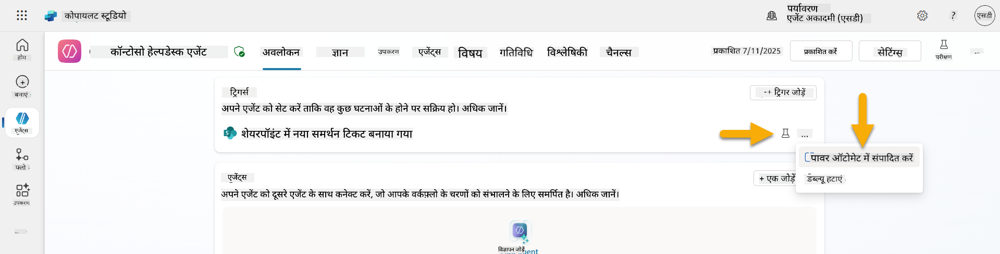

1. **संदेश को निर्दिष्ट कॉपायलट को प्रोसेसिंग के लिए भेजता है** नोड चुनें

1. **बॉडी/संदेश** फ़ील्ड में, बॉडी सामग्री हटाएं, **फॉरवर्ड स्लैश कुंजी** (/) दबाएं और **एक्सप्रेशन डालें** चुनें  
   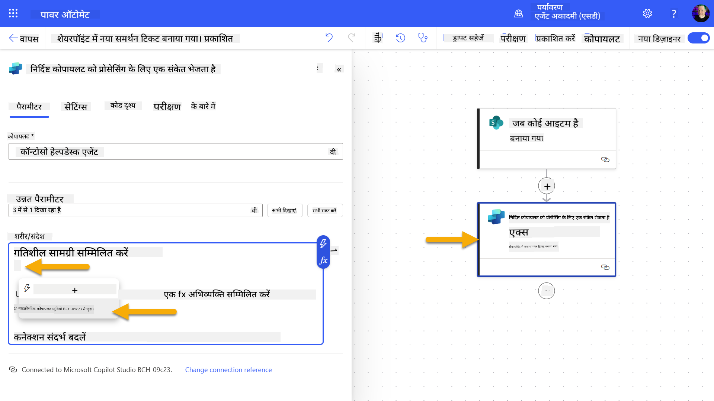

1. एजेंट को टिकट के बारे में विशिष्ट विवरण प्रदान करने के लिए निम्नलिखित एक्सप्रेशन दर्ज करें:

    ```text
    concat('Submitted By Name: ', first(triggerOutputs()?['body/value'])?['Author/DisplayName'], '\nSubmitted By Email: ', first(triggerOutputs()?['body/value'])?['Author/Email'], '\nTitle: ', first(triggerOutputs()?['body/value'])?['Title'], '\nIssue Description: ', first(triggerOutputs()?['body/value'])?['Description'], '\nPriority: ', first(triggerOutputs()?['body/value'])?['Priority/Value'],'\nTicket ID : ', first(triggerOutputs()?['body/value'])?['ID'])
    ```

1. **जोड़ें** चुनें  
   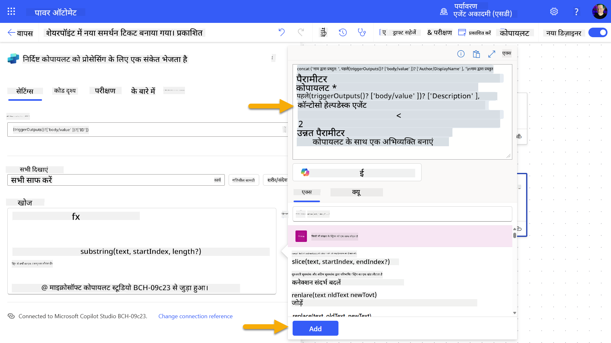

1. शीर्ष दाईं ओर टूलबार पर **प्रकाशित करें** चुनें।

### 10.3 ईमेल पुष्टि के लिए एक टूल बनाएं

1. **Copilot Studio** में अपने एजेंट पर वापस जाएं

1. अपने एजेंट के **टूल्स** टैब पर जाएं

1. **+ एक टूल जोड़ें** पर क्लिक करें और **कनेक्टर** चुनें

1. **Send an email (V2)** कनेक्टर खोजें और चुनें  
    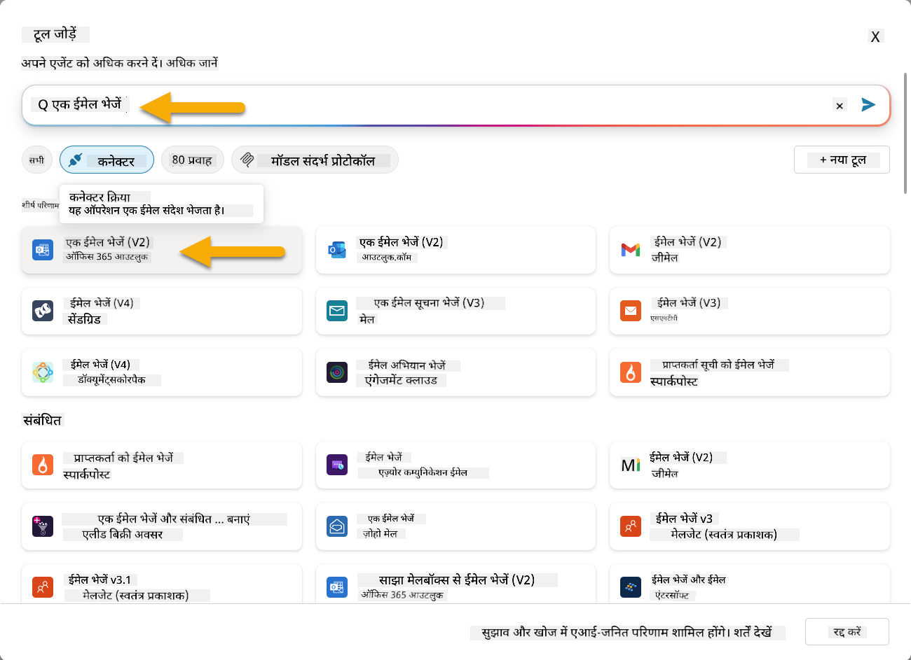

1. कनेक्शन कॉन्फ़िगर होने की प्रतीक्षा करें और फिर **जोड़ें और कॉन्फ़िगर करें** चुनें

1. टूल सेटिंग्स कॉन्फ़िगर करें:

   - **नाम**: SharePoint टिकट की पुष्टि करें
   - **विवरण**: यह टूल एक ईमेल पुष्टि भेजता है कि टिकट प्राप्त हो गया है।

1. **इनपुट पैरामीटर** के बगल में
1. एक नया ब्राउज़र टैब खोलें और अपने **SharePoint IT Support Tickets सूची** पर जाएं।  
1. **+ नया आइटम जोड़ें** पर क्लिक करें और एक टेस्ट टिकट बनाएं:  
   - **शीर्षक**: "VPN से कनेक्ट नहीं हो पा रहा"  
   - **विवरण**: "हाल ही के अपडेट के बाद कॉर्पोरेट WIFI नेटवर्क से कनेक्ट नहीं हो पा रहा"  
   - **प्राथमिकता**: "सामान्य"  

1. SharePoint आइटम को **सहेजें**  
    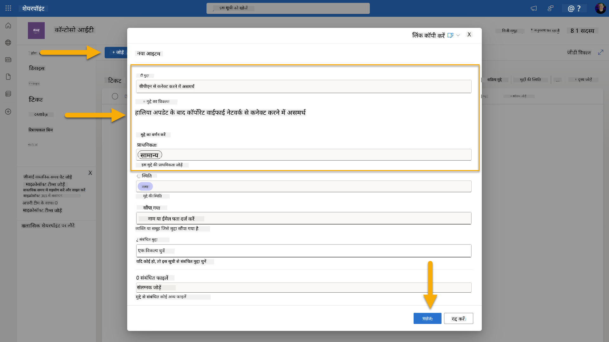  
1. **Copilot Studio** पर वापस जाएं और **Test your trigger** पैनल में ट्रिगर एक्टिवेशन की निगरानी करें। ट्रिगर इवेंट को लोड करने के लिए **Refresh** आइकन का उपयोग करें, इसमें कुछ मिनट लग सकते हैं।  
    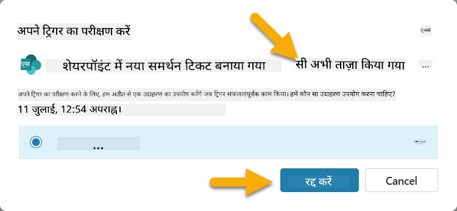  
1. जब ट्रिगर दिखाई दे, तो **Start testing** चुनें।  
1. **Test your agent** पैनल के शीर्ष पर **Activity Map आइकन** चुनें।  
1. सुनिश्चित करें कि आपका एजेंट:  
   - ट्रिगर पेलोड प्राप्त कर चुका है।  
   - "Acknowledge SharePoint ticket" टूल को कॉल किया है।  
     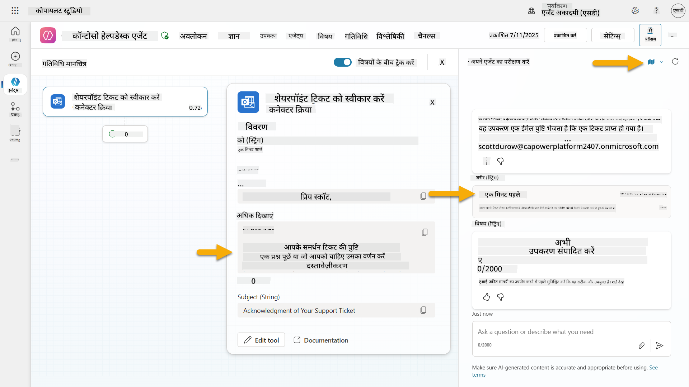  
1. सबमिटर के ईमेल इनबॉक्स की जांच करें कि पुष्टि ईमेल भेजा गया है।  
    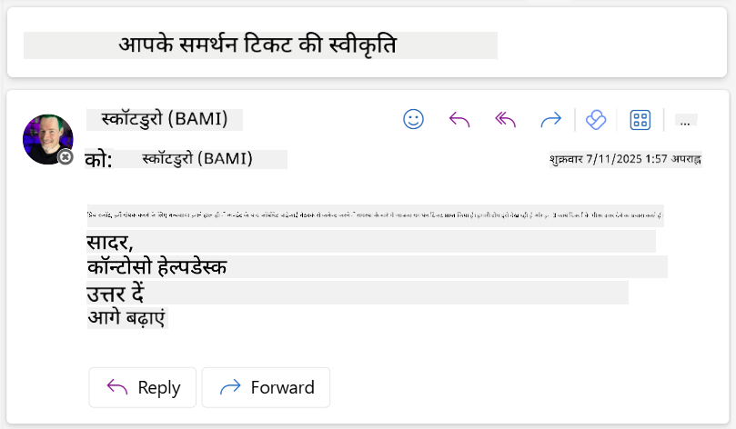  
1. Copilot Studio में **Activity** टैब की समीक्षा करें ताकि ट्रिगर और टूल निष्पादन को पूरी तरह से देख सकें।  

## ✅ मिशन पूरा  

🎉 **बधाई हो!** आपने कनेक्टर टूल्स के साथ इवेंट ट्रिगर्स को सफलतापूर्वक लागू किया है, जिससे आपका एजेंट स्वायत्त रूप से काम कर सके, ईमेल पुष्टि भेज सके और बिना उपयोगकर्ता हस्तक्षेप के सपोर्ट टिकट्स को प्रोसेस कर सके। एक बार आपका एजेंट प्रकाशित हो जाए, तो यह आपके लिए स्वायत्त रूप से कार्य करेगा।  

🚀 **अगला कदम**: हमारे अगले पाठ में, आप सीखेंगे कि [अपने एजेंट को प्रकाशित करें](../11-publish-your-agent/README.md) Microsoft Teams और Microsoft 365 Copilot पर, जिससे यह आपके पूरे संगठन के लिए उपलब्ध हो सके!  

⏭️ [**Publish your agent** पाठ पर जाएं](../11-publish-your-agent/README.md)  

## 📚 रणनीतिक संसाधन  

इवेंट ट्रिगर्स और स्वायत्त एजेंट्स के बारे में अधिक जानने के लिए तैयार हैं? इन संसाधनों को देखें:  

- **Microsoft Learn**: [Copilot Studio में अपने एजेंट को स्वायत्त बनाएं](https://learn.microsoft.com/training/modules/autonomous-agents-online-workshop/?WT.mc_id=power-177340-scottdurow)  
- **डॉक्यूमेंटेशन**: [इवेंट ट्रिगर जोड़ें](https://learn.microsoft.com/microsoft-copilot-studio/authoring-trigger-event?WT.mc_id=power-177340-scottdurow)  
- **सर्वोत्तम प्रथाएं**: [Power Automate ट्रिगर्स परिचय](https://learn.microsoft.com/power-automate/triggers-introduction?WT.mc_id=power-177340-scottdurow)  
- **उन्नत परिदृश्य**: [एजेंट्स के साथ Power Automate फ्लो का उपयोग करना](https://learn.microsoft.com/microsoft-copilot-studio/advanced-flow-create?WT.mc_id=power-177340-scottdurow)  
- **सुरक्षा**: [Copilot Studio के लिए डेटा लॉस प्रिवेंशन](https://learn.microsoft.com/microsoft-copilot-studio/admin-data-loss-prevention?WT.mc_id=power-177340-scottdurow)  

  

---

**अस्वीकरण**:  
यह दस्तावेज़ AI अनुवाद सेवा [Co-op Translator](https://github.com/Azure/co-op-translator) का उपयोग करके अनुवादित किया गया है। जबकि हम सटीकता के लिए प्रयास करते हैं, कृपया ध्यान दें कि स्वचालित अनुवाद में त्रुटियां या अशुद्धियां हो सकती हैं। मूल भाषा में दस्तावेज़ को आधिकारिक स्रोत माना जाना चाहिए। महत्वपूर्ण जानकारी के लिए, पेशेवर मानव अनुवाद की सिफारिश की जाती है। इस अनुवाद के उपयोग से उत्पन्न किसी भी गलतफहमी या गलत व्याख्या के लिए हम उत्तरदायी नहीं हैं।