<!--
CO_OP_TRANSLATOR_METADATA:
{
  "original_hash": "9dceeba2eae2bb73e328602a060eddab",
  "translation_date": "2025-10-21T18:55:50+00:00",
  "source_file": "docs/recruit/11-publish-your-agent/README.md",
  "language_code": "hi"
}
-->
# 🚨 मिशन 11: अपने एजेंट को प्रकाशित करें

## 🕵️‍♂️ कोडनेम: `ऑपरेशन पब्लिश पब्लिश पब्लिश`

> **⏱️ ऑपरेशन का समय:** `~30 मिनट`  

🎥 **वॉकथ्रू देखें**

## 🎯 मिशन का विवरण

कठिन मॉड्यूल्स की एक श्रृंखला पूरी करने के बाद, एजेंट निर्माता, अब आप अपने सबसे महत्वपूर्ण कदम के लिए तैयार हैं: अपने एजेंट को प्रकाशित करना। अब समय आ गया है कि आप अपनी रचना को Microsoft Teams और Microsoft 365 Copilot के उपयोगकर्ताओं के लिए उपलब्ध कराएं।

आपका एजेंट—एक स्पष्ट मिशन, शक्तिशाली उपकरण, और प्रमुख ज्ञान स्रोतों तक पहुंच से लैस—सेवा देने के लिए तैयार है। Microsoft Copilot Studio का उपयोग करके, आप अपने एजेंट को तैनात करते हैं ताकि वह वास्तविक उपयोगकर्ताओं की मदद कर सके, ठीक वहीं जहां वे काम करते हैं।

आइए आपके एजेंट को कार्रवाई में लॉन्च करें।

## 🔎 उद्देश्य

📖 इस पाठ में शामिल हैं:

1. अपने एजेंट को प्रकाशित करना क्यों महत्वपूर्ण है
1. जब आप अपने एजेंट को प्रकाशित करते हैं तो क्या होता है
1. चैनल कैसे जोड़ें (Microsoft Teams और Microsoft 365 Copilot)
1. Microsoft Teams में एजेंट कैसे जोड़ें
1. अपने पूरे संगठन के लिए Microsoft Teams में एजेंट को उपलब्ध कैसे बनाएं

## 🚀 एजेंट को प्रकाशित करें

हर बार जब आप Copilot Studio में किसी एजेंट पर काम करते हैं, तो आप उसमें ज्ञान या उपकरण जोड़कर उसे अपडेट कर सकते हैं। जब आप सभी बदलावों के साथ तैयार होते हैं और पूरी तरह से परीक्षण कर लेते हैं, तो आप इसे प्रकाशित करने के लिए तैयार होते हैं। प्रकाशित करना सुनिश्चित करता है कि नवीनतम अपडेट लाइव हैं। जब आप अपने एजेंट को नए उपकरणों के साथ अपडेट करते हैं और प्रकाशित बटन दबाते नहीं हैं, तो यह अभी तक अंतिम उपयोगकर्ताओं के लिए उपलब्ध नहीं है।

जब आप अपने एजेंट के उपयोगकर्ताओं के लिए अपडेट को पुश करना चाहते हैं, तो हमेशा प्रकाशित बटन दबाना सुनिश्चित करें। आपके एजेंट में चैनल जोड़े जा सकते हैं और जब आप प्रकाशित करते हैं तो अपडेट उन सभी चैनलों के लिए उपलब्ध होते हैं जिन्हें आपने एजेंट में जोड़ा है।

## ⚙️ चैनल कॉन्फ़िगर करें

चैनल यह निर्धारित करते हैं कि आपके उपयोगकर्ता आपके एजेंट तक कैसे पहुंच सकते हैं और उसके साथ कैसे इंटरैक्ट कर सकते हैं। अपने एजेंट को प्रकाशित करने के बाद, आप इसे कई चैनलों में उपलब्ध करा सकते हैं। प्रत्येक चैनल आपके एजेंट की सामग्री को अलग तरीके से प्रदर्शित कर सकता है।

आप अपने एजेंट को निम्नलिखित चैनलों में जोड़ सकते हैं:

- **Microsoft Teams और Microsoft 365 Copilot** - अपने एजेंट को Teams चैट और मीटिंग्स में और Microsoft 365 Copilot अनुभवों में उपलब्ध कराएं ([अधिक जानें](https://learn.microsoft.com/microsoft-copilot-studio/publication-add-bot-to-microsoft-teams))
- **डेमो वेबसाइट** - Copilot Studio द्वारा प्रदान की गई डेमो वेबसाइट पर अपने एजेंट का परीक्षण करें ([अधिक जानें](https://learn.microsoft.com/microsoft-copilot-studio/publication-connect-bot-to-web-channels))
- **कस्टम वेबसाइट** - अपने एजेंट को सीधे अपनी वेबसाइट में एम्बेड करें ([अधिक जानें](https://learn.microsoft.com/microsoft-copilot-studio/publication-connect-bot-to-web-channels))
- **मोबाइल ऐप** - अपने एजेंट को कस्टम मोबाइल एप्लिकेशन में एकीकृत करें ([अधिक जानें](https://learn.microsoft.com/microsoft-copilot-studio/publication-connect-bot-to-custom-application))
- **SharePoint** - SharePoint साइट्स में अपने एजेंट को जोड़ें ताकि दस्तावेज़ और साइट सहायता प्रदान की जा सके ([अधिक जानें](https://learn.microsoft.com/microsoft-copilot-studio/publication-add-bot-to-sharepoint))
- **Facebook Messenger** - Facebook के मैसेजिंग प्लेटफॉर्म के माध्यम से उपयोगकर्ताओं से जुड़ें ([अधिक जानें](https://learn.microsoft.com/microsoft-copilot-studio/publication-add-bot-to-facebook))
- **Power Pages** - अपने एजेंट को Power Pages वेबसाइटों में एकीकृत करें ([अधिक जानें](https://learn.microsoft.com/microsoft-copilot-studio/publication-add-bot-to-power-pages))
- **Azure Bot Service चैनल** - अतिरिक्त चैनलों तक पहुंचें जैसे Slack, Telegram, Twilio SMS, और अधिक ([अधिक जानें](https://learn.microsoft.com/microsoft-copilot-studio/publication-connect-bot-to-azure-bot-service-channels))

चैनल जोड़ने के लिए, अपने एजेंट में **Channels** टैब पर जाएं और उस चैनल का चयन करें जिसे आप कॉन्फ़िगर करना चाहते हैं। प्रत्येक चैनल के लिए विशिष्ट सेटअप आवश्यकताएं होती हैं और अतिरिक्त प्रमाणीकरण या कॉन्फ़िगरेशन चरणों की आवश्यकता हो सकती है।

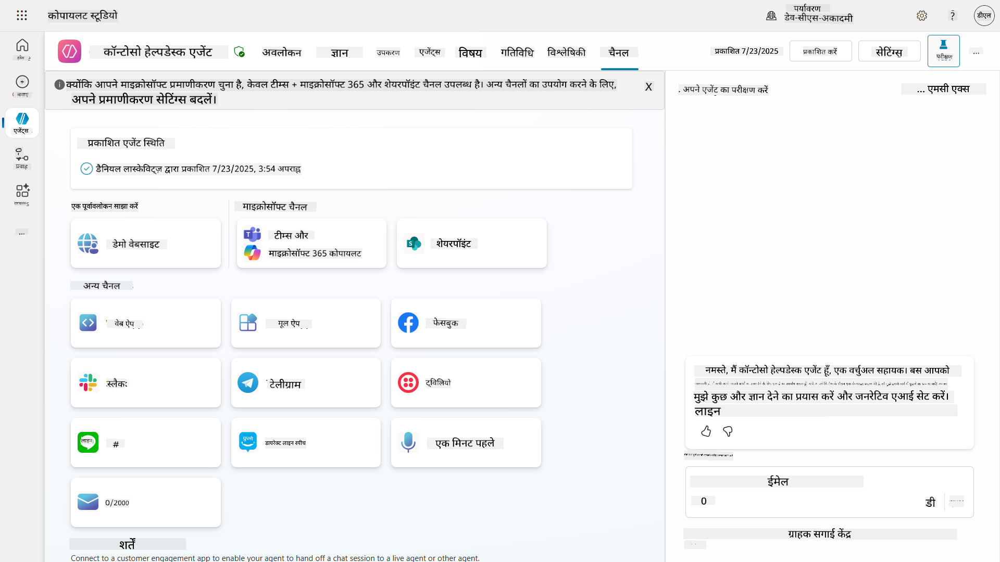

## 📺 चैनल अनुभव

विभिन्न चैनलों के उपयोगकर्ता अनुभव अलग-अलग होते हैं। जब आप कई चैनलों के लिए एक एजेंट बना रहे हों, तो सुनिश्चित करें कि आप प्रत्येक चैनल के अंतर को समझते हैं। यह हमेशा एक अच्छा तरीका है कि आप अपने एजेंट को कई चैनलों में परीक्षण करें ताकि यह सुनिश्चित हो सके कि यह वास्तव में वही करता है जो आपने इरादा किया था।

| अनुभव                            | वेबसाइट       | Teams और Microsoft 365 Copilot         | Facebook                 | Dynamics Omnichannel for Customer Service                   |
| --------------------------------- | ------------- | --------------------------------------- | ------------------------ | ----------------------------------------------------------- |
| [ग्राहक संतुष्टि सर्वेक्षण][1]    | एडैप्टिव कार्ड | केवल टेक्स्ट                           | केवल टेक्स्ट             | केवल टेक्स्ट                                                |
| [मल्टीपल-चॉइस विकल्प][1]         | समर्थित       | [हीरो कार्ड के रूप में छह तक समर्थित][4] | [13 तक समर्थित][6]       | [आंशिक रूप से समर्थित][8]                                   |
| [मार्कडाउन][2]                    | समर्थित       | [आंशिक रूप से समर्थित][5]              | [आंशिक रूप से समर्थित][7] | [आंशिक रूप से समर्थित][9]                                   |
| [स्वागत संदेश][1]                 | समर्थित       | समर्थित                                 | समर्थित नहीं             | [चैट][10] के लिए समर्थित। अन्य चैनलों के लिए समर्थित नहीं। |
| [क्या-आपका-अर्थ][3]               | समर्थित       | समर्थित                                 | समर्थित                  | [Microsoft Teams][11], [चैट][10], Facebook, और केवल टेक्स्ट चैनलों (SMS के माध्यम से [TeleSign][12] और [Twilio][13], [WhatsApp][14], [WeChat][15], और [Twitter][16]) के लिए समर्थित। सुझाए गए कार्यों को केवल टेक्स्ट सूची के रूप में प्रस्तुत किया जाता है; उपयोगकर्ताओं को प्रतिक्रिया देने के लिए एक विकल्प को फिर से टाइप करना होगा। |

[1]: https://learn.microsoft.com/microsoft-copilot-studio/authoring-create-edit-topics
[2]: https://daringfireball.net/projects/markdown/
[3]: https://learn.microsoft.com/microsoft-copilot-studio/advanced-ai-features
[4]: https://learn.microsoft.com/microsoftteams/platform/concepts/cards/cards-reference#hero-card
[5]: https://learn.microsoft.com/microsoftteams/platform/bots/how-to/format-your-bot-messages#text-only-messages
[6]: https://developers.facebook.com/docs/messenger-platform/send-messages/quick-replies/
[7]: https://www.facebook.com/help/147348452522644?helpref=related
[8]: https://learn.microsoft.com/dynamics365/customer-service/asynchronous-channels#suggested-actions-support
[9]: https://learn.microsoft.com/dynamics365/customer-service/asynchronous-channels#preview-support-for-formatted-messages
[10]: https://learn.microsoft.com/dynamics365/customer-service/set-up-chat-widget
[11]: https://learn.microsoft.com/dynamics365/customer-service/configure-microsoft-teams
[12]: https://learn.microsoft.com/dynamics365/customer-service/configure-sms-channel
[13]: https://learn.microsoft.com/dynamics365/customer-service/configure-sms-channel-twilio
[14]: https://learn.microsoft.com/dynamics365/customer-service/configure-whatsapp-channel
[15]: https://learn.microsoft.com/dynamics365/customer-service/configure-wechat-channel
[16]: https://learn.microsoft.com/dynamics365/customer-service/configure-twitter-channel

> [!NOTE]
> कुछ उदाहरण हैं जहां आप विभिन्न चैनलों के लिए अलग-अलग लॉजिक का उपयोग कर सकते हैं। इसका एक उदाहरण Power Platform Snippets रिपॉजिटरी में पाया जा सकता है:
>
> हेनरी जैम्स ने एक उदाहरण साझा किया है कि Microsoft Teams चैनल होने पर एक अलग एडैप्टिव कार्ड कैसे दिखाएं। ([उदाहरण का लिंक](https://github.com/pnp/powerplatform-snippets/blob/main/copilot-studio/multiple-topics-matched-topic/source/multiple-topics-matched.yaml#L40))

## 🧪 लैब 11: अपने एजेंट को Teams और Microsoft 365 Copilot में प्रकाशित करें

### 🎯 उपयोग का मामला

आपका Contoso IT Help Desk एजेंट अब पूरी तरह से कॉन्फ़िगर हो चुका है और शक्तिशाली क्षमताओं से लैस है—यह SharePoint ज्ञान स्रोतों तक पहुंच सकता है, समर्थन टिकट बना सकता है, सक्रिय सूचनाएं भेज सकता है, और उपयोगकर्ता प्रश्नों का बुद्धिमानी से उत्तर दे सकता है। हालांकि, ये सभी सुविधाएं वर्तमान में केवल उस विकास वातावरण में उपलब्ध हैं जहां आपने उन्हें बनाया है।

**चुनौती:** अंतिम उपयोगकर्ता आपके एजेंट की क्षमताओं का लाभ नहीं उठा सकते जब तक कि इसे ठीक से प्रकाशित न किया जाए और उन चैनलों के माध्यम से सुलभ न बनाया जाए जहां वे वास्तव में काम करते हैं।

**समाधान:** अपने एजेंट को प्रकाशित करना सुनिश्चित करता है कि नवीनतम संस्करण—आपके हाल के सभी अपडेट, नए विषय, उन्नत ज्ञान स्रोत, और कॉन्फ़िगर किए गए फ्लो के साथ—वास्तविक उपयोगकर्ताओं के लिए उपलब्ध है। बिना प्रकाशित किए, उपयोगकर्ता अभी भी आपके एजेंट के पुराने संस्करण के साथ इंटरैक्ट करेंगे जिसमें महत्वपूर्ण कार्यक्षमता गायब हो सकती है।

Teams और Microsoft 365 Copilot चैनल जोड़ना भी उतना ही महत्वपूर्ण है क्योंकि:

- **Teams एकीकरण**: आपके संगठन के कर्मचारी सहयोग, मीटिंग्स, और संचार के लिए अपना अधिकांश समय Microsoft Teams में बिताते हैं। अपने एजेंट को Teams में जोड़कर, उपयोगकर्ता बिना अपने प्राथमिक कार्य वातावरण को छोड़े IT सहायता प्राप्त कर सकते हैं।

- **Microsoft 365 Copilot**: उपयोगकर्ता आपके विशेष IT हेल्प डेस्क एजेंट तक सीधे Microsoft 365 Copilot अनुभव के भीतर पहुंच सकते हैं, जिससे यह Office एप्लिकेशन में उनके दैनिक वर्कफ़्लो में सहजता से एकीकृत हो जाता है।

- **केंद्रीकृत पहुंच**: अलग-अलग वेबसाइटों या एप्लिकेशन को याद रखने के बजाय, उपयोगकर्ता IT सहायता तक पहुंचने के लिए उन प्लेटफार्मों का उपयोग कर सकते हैं जिन्हें वे पहले से ही उपयोग कर रहे हैं, जिससे घर्षण कम होता है और अपनाने में वृद्धि होती है।

यह मिशन आपके विकास कार्य को एक उत्पादन-तैयार समाधान में बदल देता है जो आपके संगठन के अंतिम उपयोगकर्ताओं को वास्तविक मूल्य प्रदान करता है।

### आवश्यकताएँ

इस लैब को शुरू करने से पहले सुनिश्चित करें कि आपके पास:

- ✅ पिछले लैब्स को पूरा किया गया है और पूरी तरह से कॉन्फ़िगर किया गया Contoso Helpdesk Agent है
- ✅ आपका एजेंट परीक्षण किया गया है और उत्पादन उपयोग के लिए तैयार है
- ✅ Copilot Studio वातावरण में एजेंट प्रकाशित करने की अनुमति है
- ✅ आपके संगठन में Microsoft Teams तक पहुंच है

### 11.1 अपने एजेंट को प्रकाशित करें

अब जब हमारे एजेंट पर सारा काम पूरा हो गया है, तो हमें यह सुनिश्चित करना होगा कि हमारे काम को उन अंतिम उपयोगकर्ताओं के लिए उपलब्ध कराया जाए जो हमारे एजेंट का उपयोग करने जा रहे हैं। यह सुनिश्चित करने के लिए कि सामग्री सभी उपयोगकर्ताओं के लिए उपलब्ध है, हमें अपने एजेंट को प्रकाशित करना होगा।

1. Copilot Studio में Contoso Helpdesk Agent पर जाएं ([Copilot Studio निर्माता पोर्टल](https://copilotstudio.microsoft.com) के माध्यम से)

    Copilot Studio में, अपने एजेंट को प्रकाशित करना आसान है। आप बस एजेंट ओवरव्यू के शीर्ष पर प्रकाशित बटन का चयन कर सकते हैं।

    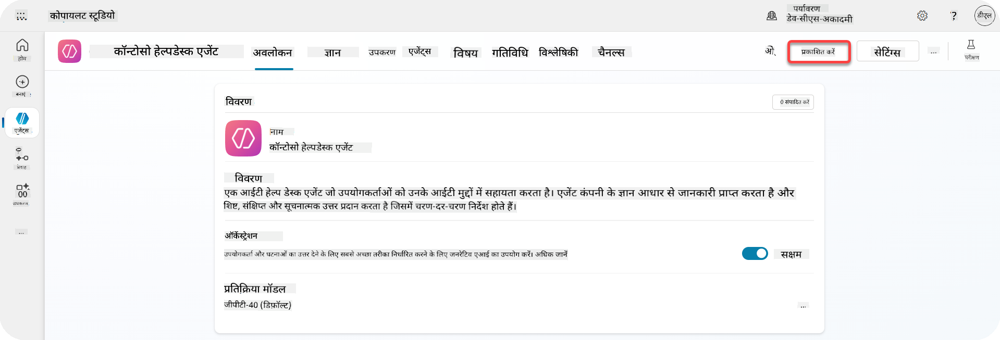

1. अपने एजेंट में **Publish** बटन का चयन करें

    यह प्रकाशित पॉप-अप खोलता है - यह पुष्टि करने के लिए कि आप वास्तव में अपने एजेंट को प्रकाशित करना चाहते हैं।

    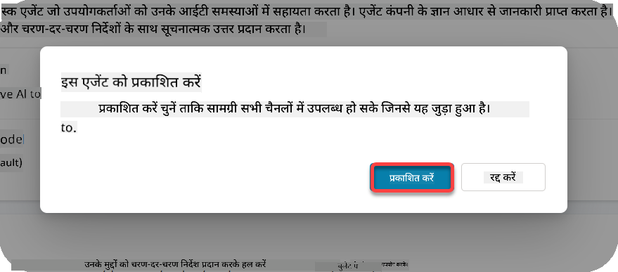

1. अपने एजेंट को प्रकाशित करने की पुष्टि करने के लिए **Publish** का चयन करें

    अब एक संदेश दिखाता है कि आपका एजेंट प्रकाशित हो रहा है। आपको वह पॉपअप खुला रखने की आवश्यकता नहीं है। जब एजेंट प्रकाशित हो जाएगा तो आपको सूचित किया जाएगा।

    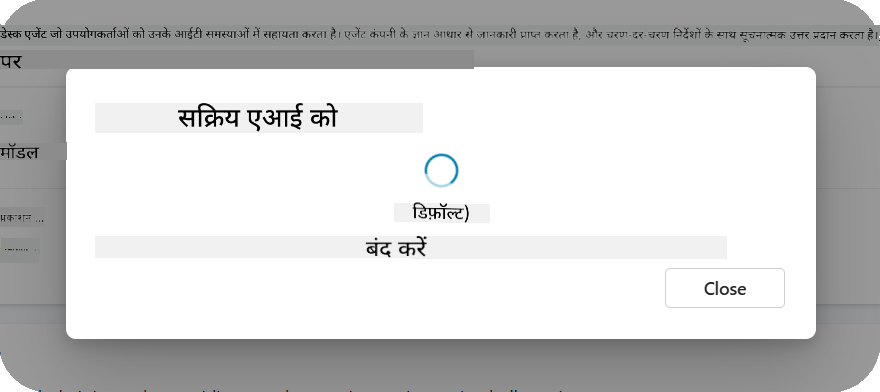

    जब एजेंट का प्रकाशन पूरा हो जाएगा, तो आप एजेंट पेज के शीर्ष पर अधिसूचना देखेंगे।

    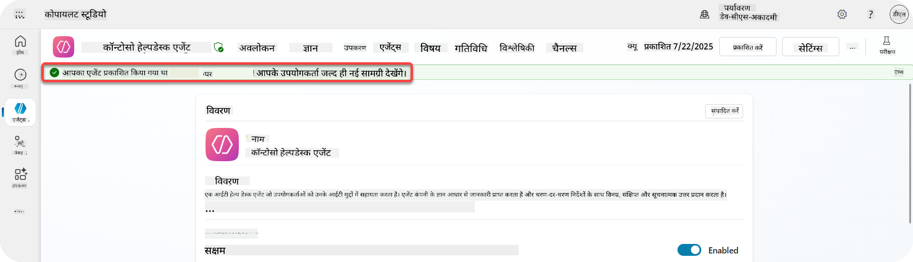

लेकिन - हमने केवल एजेंट को प्रकाशित किया है, हमने इसे अभी तक किसी चैनल में नहीं जोड़ा है, तो चलिए अब इसे ठीक करते हैं!

### 11.2 Teams और Microsoft 365 Copilot चैनल जोड़ें

1. अपने एजेंट में Teams और Microsoft 365 Copilot चैनल जोड़ने के लिए, हमें एजेंट के शीर्ष नेविगेशन में **Channel** का चयन करना होगा

    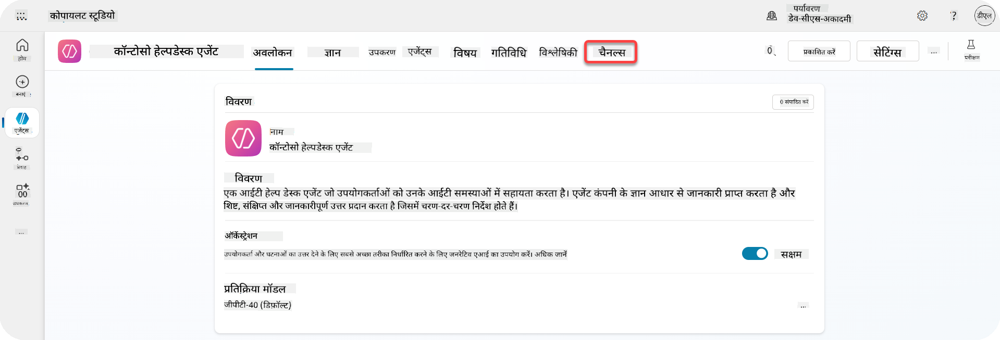

    यहां हम उन सभी चैनलों को देख सकते हैं जिन्हें हम इस एजेंट में जोड़ सकते हैं।

1. **Teams और Microsoft 365** का चयन करें

    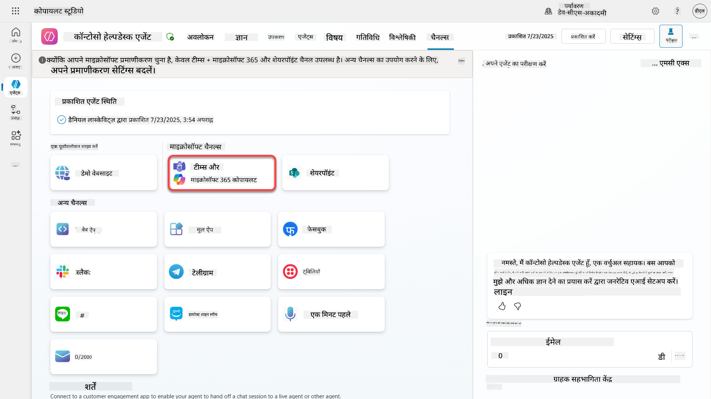

1. चैनल को एजेंट में जोड़ने के लिए **Add channel** का चयन करें

    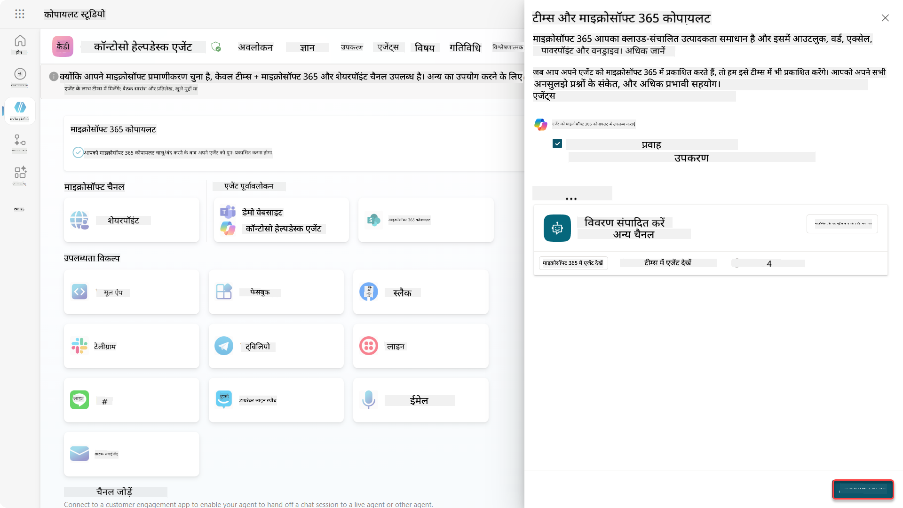

    इसे जोड़ने में थोड़ा समय लगेगा। जोड़ने के बाद साइडबार के शीर्ष पर एक हरी अधिसूचना दिखाई देगी।

    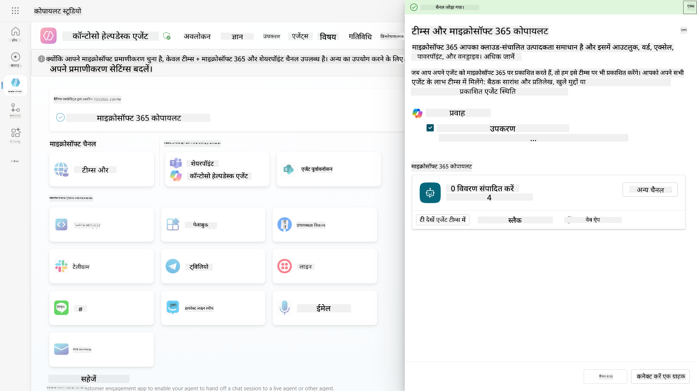

1. **See agent in Teams** का चयन करें ताकि एक नया टैब खुले

    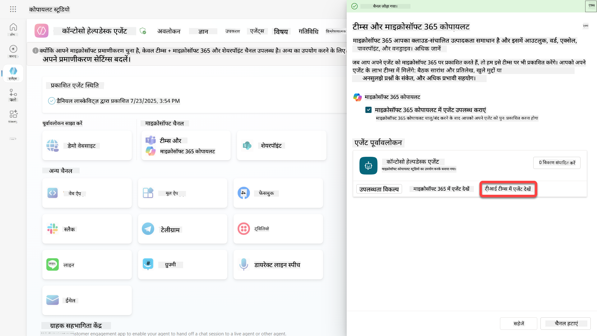

1. Contoso Helpdesk Agent को Teams में जोड़ने के लिए **Add** का चयन करें

    

    इसमें थोड़ा समय लग सकता है। इसके बाद निम्न स्क्रीन दिखनी चाहिए:

    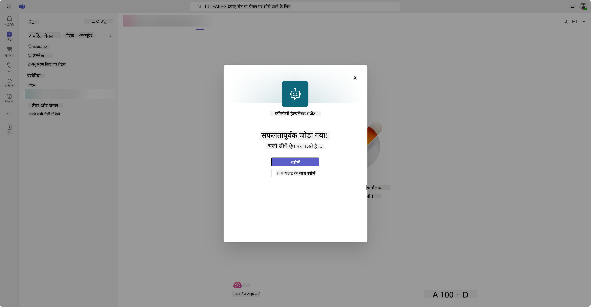

1. **Open** का चयन करें ताकि एजेंट Teams में खुले

    यह एजेंट को Teams में एक Teams ऐप के रूप में खोलेगा

    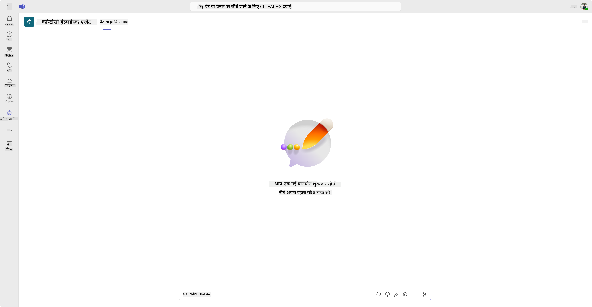

अब हमने एजेंट को Microsoft Teams में आपके लिए काम करने के लिए प्रकाशित कर दिया है, लेकिन आप इसे अधिक लोगों के लिए उपलब्ध कराना चाह सकते हैं।

### 11.3 एजेंट को टेनेंट के सभी उपयोगकर्ताओं के लिए उपलब्ध कराएं

1. ब्राउज़र टैब बंद करें जहां Contoso Helpdesk Agent खुला है

    यह आपको Copilot Studio में वापस लाना चाहिए जहां Teams और Microsoft 365 Copilot साइड पैनल अभी भी खुला है। हमने अभी एजेंट को Teams में खोला है, लेकिन हम यहां और भी बहुत कुछ कर सकते हैं। हम एजेंट के विवरण को संपादित कर सकते हैं, हम एजेंट को अधिक उपयोगकर्ताओं और अधिक तक तैनात कर सकते हैं।

1. **Edit details** का चयन करें

    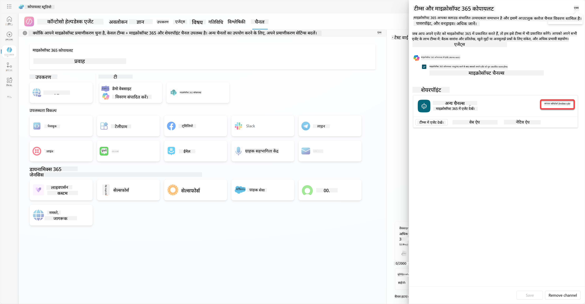
यह एक पैन खोलेगा जहां हम एजेंट के कई विवरण और सेटिंग्स बदल सकते हैं। हम आइकन, आइकन की पृष्ठभूमि का रंग और विवरण जैसे बुनियादी विवरण बदल सकते हैं। हम यहां Teams सेटिंग्स भी बदल सकते हैं (जैसे उपयोगकर्ता को एजेंट को टीम में जोड़ने की अनुमति देना, या इस एजेंट को समूह और मीटिंग चैट में उपयोग करने की अनुमति देना)। जब आप *more* चुनते हैं, तो आप डेवलपर विवरण जैसे डेवलपर का नाम, वेबसाइट, गोपनीयता नीति और उपयोग की शर्तें भी बदल सकते हैं।

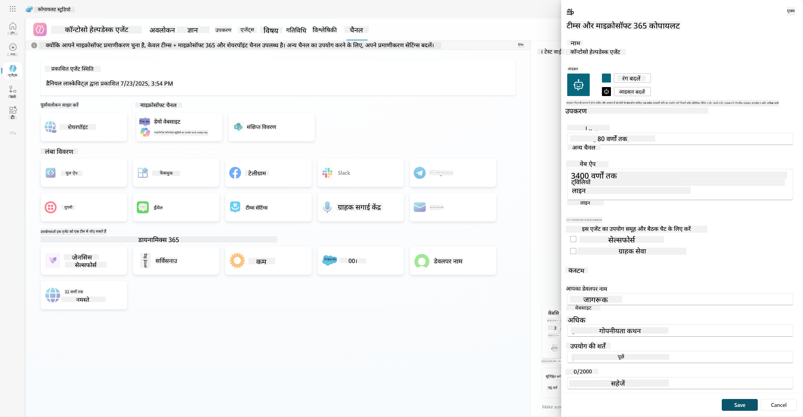

1. **Cancel** चुनें ताकि Edit details पैन बंद हो जाए।

1. **Availability options** चुनें।

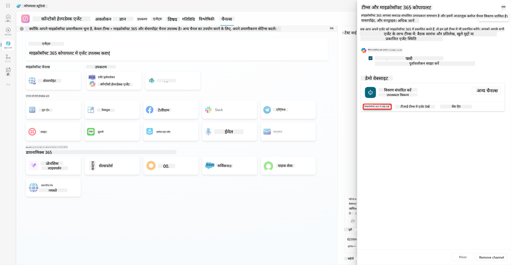

यह उपलब्धता विकल्प पैन खोलेगा, जहां आप उपयोगकर्ताओं को इस एजेंट का उपयोग करने के लिए लिंक भेजने के लिए कॉपी कर सकते हैं (ध्यान दें, आपको एजेंट को उपयोगकर्ता के साथ साझा करना होगा) और आप एक फ़ाइल डाउनलोड कर सकते हैं ताकि आपका एजेंट Microsoft Teams या Microsoft 365 स्टोर में जोड़ा जा सके। स्टोर में एजेंट दिखाने के लिए आपके पास अन्य विकल्प भी हैं: आप इसे अपने टीम के सदस्यों और साझा उपयोगकर्ताओं को दिखा सकते हैं (*Built with Power Platform* सेक्शन में दिखाने के लिए) या आप इसे अपने संगठन के सभी लोगों को दिखा सकते हैं (इसके लिए प्रशासक की स्वीकृति आवश्यक है)।

1. **Show to everyone in my org** चुनें।

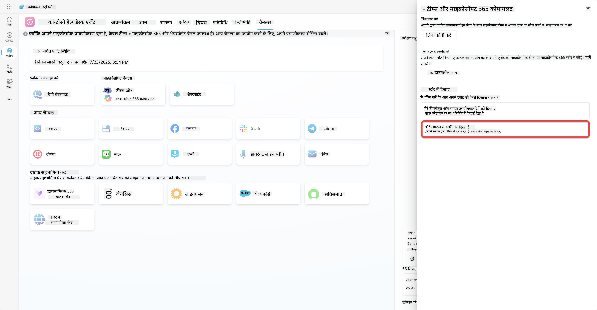

1. **Submit for admin approval** चुनें।

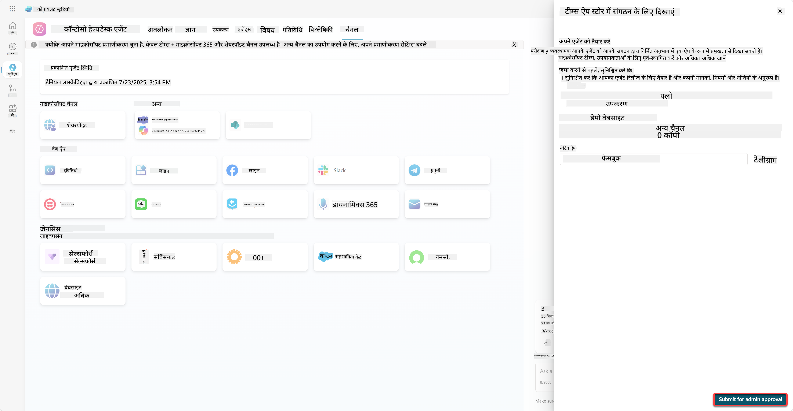

अब, आपके प्रशासक को आपके एजेंट सबमिशन को स्वीकृत करना होगा। वे ऐसा Teams Admin Center में जाकर और Apps में Contoso Helpdesk Agent को खोजकर कर सकते हैं। स्क्रीनशॉट में आप देख सकते हैं कि प्रशासक Teams Admin Center में क्या देखेगा।

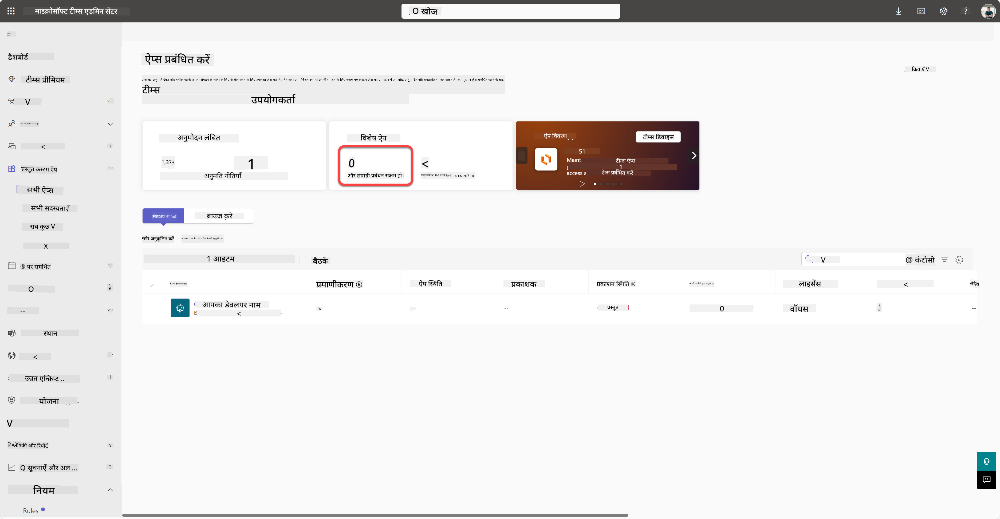

प्रशासक को Contoso Helpdesk Agent चुनना होगा और *Publish* चुनना होगा ताकि Contoso Helpdesk Agent सभी के लिए प्रकाशित हो सके।

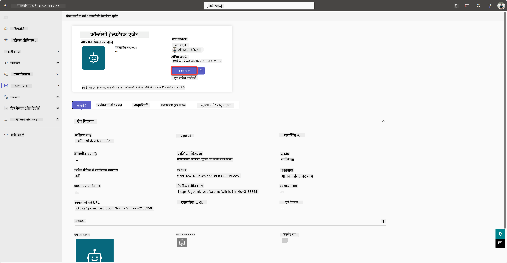

जब प्रशासक ने एजेंट सबमिशन को प्रकाशित कर दिया है, तो आप Copilot Studio को रिफ्रेश कर सकते हैं और आपको उपलब्धता विकल्पों में *available in app store* बैनर दिखाई देगा।

यहां और भी संभावनाएं हैं। आपका प्रशासक वैश्विक सेटअप नीति बदल सकता है और Contoso Helpdesk Agent को टेनेंट में सभी के लिए ऑटो इंस्टॉल कर सकता है। इसके अलावा - आप Contoso Helpdesk Agent को बाईं रेल पर पिन कर सकते हैं ताकि सभी को इसे आसानी से एक्सेस करने का मौका मिले।

## ✅ मिशन पूरा

🎉 **बधाई हो!** आपने सफलतापूर्वक अपने एजेंट को प्रकाशित किया और इसे Teams और Microsoft 365 Copilot में जोड़ा! अगला कदम कोर्स का अंतिम मिशन है: लाइसेंसिंग को समझना।

⏭️ [**Understanding licensing** पाठ पर जाएं](../12-understanding-licensing/README.md)

## 📚 सामरिक संसाधन

🔗 [Publish channels documentation](https://learn.microsoft.com/microsoft-copilot-studio/publication-fundamentals-publish-channels)

---

**अस्वीकरण**:  
यह दस्तावेज़ AI अनुवाद सेवा [Co-op Translator](https://github.com/Azure/co-op-translator) का उपयोग करके अनुवादित किया गया है। जबकि हम सटीकता के लिए प्रयास करते हैं, कृपया ध्यान दें कि स्वचालित अनुवाद में त्रुटियां या अशुद्धियां हो सकती हैं। मूल भाषा में दस्तावेज़ को आधिकारिक स्रोत माना जाना चाहिए। महत्वपूर्ण जानकारी के लिए, पेशेवर मानव अनुवाद की सिफारिश की जाती है। इस अनुवाद के उपयोग से उत्पन्न किसी भी गलतफहमी या गलत व्याख्या के लिए हम जिम्मेदार नहीं हैं।