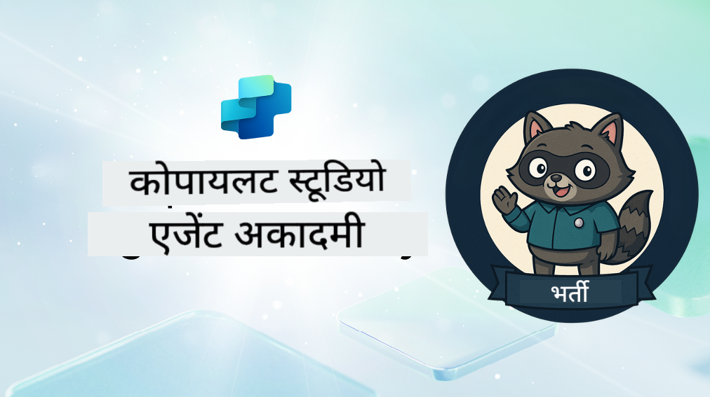

<!--
CO_OP_TRANSLATOR_METADATA:
{
  "original_hash": "8b5ecad9d5d073ea3f4c2b844e80f2e5",
  "translation_date": "2025-10-21T18:15:54+00:00",
  "source_file": "docs/recruit/README.md",
  "language_code": "hi"
}
-->
# स्वागत है, भर्ती

**स्वागत है, भर्ती।**  
आपका मिशन—यदि आप इसे स्वीकार करते हैं—**Microsoft Copilot Studio** का उपयोग करके एजेंट बनाने की कला में महारत हासिल करना है।

यह प्रैक्टिकल प्रशिक्षण आपको **एजेंट्स की दुनिया** में प्रवेश करने का अवसर देता है: ग्राउंडेड प्रॉम्प्ट्स से लेकर एडैप्टिव कार्ड्स और एजेंट फ्लो तक, आप वास्तविक दुनिया के टूल्स और उपयोग मामलों का उपयोग करके बुद्धिमान एजेंट्स को बनाना, स्केल करना और डिप्लॉय करना सीखेंगे।

---

## 🎯 मिशन उद्देश्य

Agent Academy पूरा करने के बाद, आप सक्षम होंगे:

- Microsoft Copilot Studio के संदर्भ में एजेंट्स को समझना
- यह जानना कि Large Language Models (LLMs), retrieval-augmented generation (RAG), और ऑर्केस्ट्रेशन एक एजेंट में कैसे मिलकर काम करते हैं
- **डिक्लेरेटिव** और **कस्टम एजेंट्स** बनाना
- एजेंट्स को **Topics**, **Adaptive Cards**, और **Agent Flows** के साथ बेहतर बनाना
- एजेंट्स को **Microsoft Teams** और **Microsoft 365 Copilot** पर डिप्लॉय करना

---

## 🧪 आवश्यकताएँ

सभी मिशन पूरा करने के लिए, आपको चाहिए:

- एक Microsoft 365 Developer टेनेंट (SharePoint सक्षम के साथ)
- **Microsoft Copilot Studio** (ट्रायल या लाइसेंस प्राप्त)
- वैकल्पिक: SharePoint, Power Platform, या Power Fx का बुनियादी ज्ञान

---

## 🧬 यह किसके लिए है

यह कोर्स आदर्श है:

- **Copilot Studio** का पता लगाने वाले मेकर्स और डेवलपर्स के लिए
- **Microsoft 365 Copilot एक्सटेंशन** बनाने वाले IT प्रोफेशनल्स के लिए
- Power Platform के उत्साही जो बुद्धिमान एजेंट्स के साथ **अपना स्तर बढ़ाना** चाहते हैं
- जो लोग **करके सीखना** पसंद करते हैं

---

## 🧭 पाठ्यक्रम का अवलोकन

यह अकादमी प्रगतिशील पाठों में विभाजित है—प्रत्येक को आपके एजेंट-बिल्डिंग कौशल को बढ़ाने के लिए एक फील्ड मिशन के रूप में डिज़ाइन किया गया है।

| पाठ | शीर्षक | मिशन ब्रीफिंग |
|--------|-------|------------------|
| `00` | 🧰 [कोर्स सेटअप](./00-course-setup/README.md) | अपना डेवलपमेंट एनवायरनमेंट, Copilot Studio ट्रायल, और SharePoint साइट सेट करें |
| `01` | 🧠 [एजेंट्स का परिचय](./01-introduction-to-agents/README.md) | संवादात्मक AI अवधारणाओं, LLMs, और स्वायत्त बनाम डिक्लेरेटिव एजेंट्स को समझें |
| `02` | 🛠️ [Copilot Studio की मूल बातें](./02-copilot-studio-fundamentals/README.md) | बिल्डिंग ब्लॉक्स सीखें: ज्ञान, कौशल, स्वायत्तता |
| `03` | 👩‍💻 [डिक्लेरेटिव एजेंट बनाएं](./03-create-a-declarative-agent-for-M365Copilot/README.md) | Microsoft 365 Copilot में अपना एजेंट जोड़ें, एक प्रॉम्प्ट पर आधारित |
| `04` | 🧩 [एक समाधान बनाना](./04-creating-a-solution/README.md) | अपने एजेंट को पर्यावरण प्रबंधन के लिए एक पुन: उपयोग योग्य समाधान में पैकेज करें |
| `05` | 🚀 [प्री-बिल्ट एजेंट्स के साथ शुरुआत करें](./05-using-prebuilt-agents/README.md) | सेटअप को तेज करने के लिए एक टेम्पलेट एजेंट का उपयोग और अनुकूलित करें |
| `06` | ✍️ [कस्टम एजेंट बनाएं](./06-create-agent-from-conversation/README.md) | ज्ञान स्रोतों पर आधारित एक नया Copilot बनाएं |
| `07` | 🧠 [ट्रिगर्स के साथ एक टॉपिक जोड़ें](./07-add-new-topic-with-trigger/README.md) | कस्टम प्रश्न/उत्तर पथ को परिभाषित करने के लिए Topics का उपयोग करें |
| `08` | 🪪 [Adaptive Cards के साथ सुधार करें](./08-add-adaptive-card/README.md) | Power Fx और SharePoint का उपयोग करके एक Adaptive Card बनाएं |
| `09` | 🔁 [Agent Flows के साथ स्वचालन करें](./09-add-an-agent-flow/README.md) | बैक-एंड फ्लो को ट्रिगर करने के लिए Adaptive Card इनपुट का उपयोग करें |
| `10` | 🧭 [इवेंट ट्रिगर्स जोड़ें](./10-add-event-triggers/README.md) | इवेंट-आधारित लॉजिक का उपयोग करके अपने एजेंट को स्वायत्त रूप से कार्य करने में सक्षम बनाएं |
| `11` | 📢 [अपने एजेंट को प्रकाशित करें](./11-publish-your-agent/README.md) | अपने एजेंट को Microsoft Teams और Microsoft 365 Copilot पर डिप्लॉय करें |
| `12` | 🪪 [लाइसेंसिंग को समझना](./12-understanding-licensing/README.md) | Copilot Studio के साथ लाइसेंसिंग और बिलिंग कैसे काम करती है, यह जानें |
| `13` | 🚨 [अपना भर्ती बैज सुरक्षित करें](./course-completion-badges-recruit/README.md) | अपना बैज प्राप्त करें और अपनी उपलब्धि को चिह्नित करें! |

!!! note
    ✅ इस पाठ्यक्रम को पूरा करने पर आपको **Recruit** बैज प्राप्त होगा।  
    🔓 **Operative** और **Commander** भविष्य के चरणों में अनलॉक किए जाएंगे।

<!-- markdownlint-disable-next-line MD033 -->

---

**अस्वीकरण**:  
यह दस्तावेज़ AI अनुवाद सेवा [Co-op Translator](https://github.com/Azure/co-op-translator) का उपयोग करके अनुवादित किया गया है। जबकि हम सटीकता के लिए प्रयास करते हैं, कृपया ध्यान दें कि स्वचालित अनुवाद में त्रुटियां या अशुद्धियां हो सकती हैं। मूल भाषा में दस्तावेज़ को आधिकारिक स्रोत माना जाना चाहिए। महत्वपूर्ण जानकारी के लिए, पेशेवर मानव अनुवाद की सिफारिश की जाती है। इस अनुवाद के उपयोग से उत्पन्न किसी भी गलतफहमी या गलत व्याख्या के लिए हम उत्तरदायी नहीं हैं।