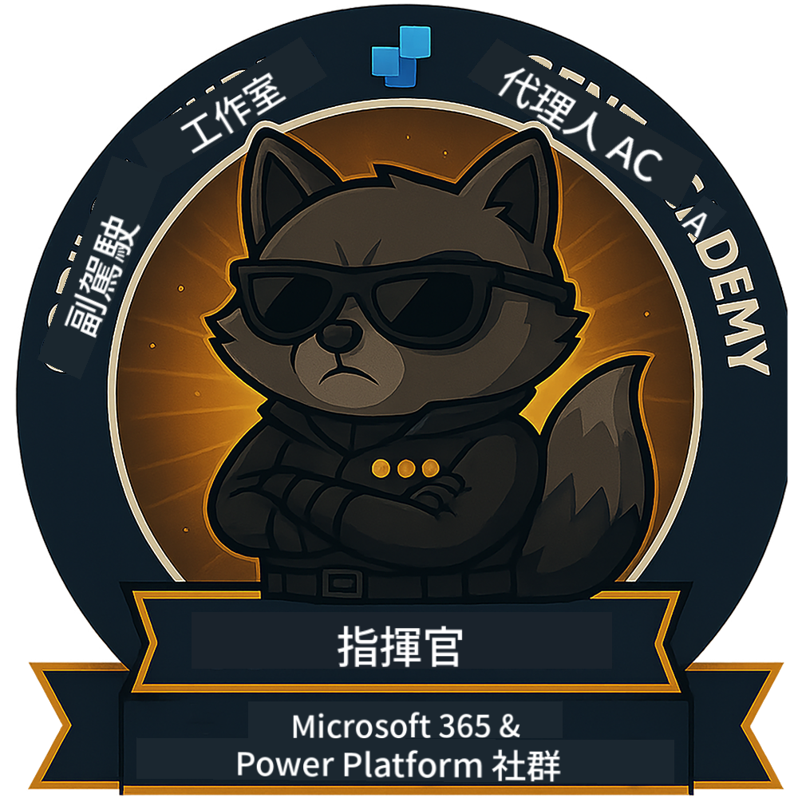

<!--
CO_OP_TRANSLATOR_METADATA:
{
  "original_hash": "8fb14b79c8616d9533f641ac2d555e8c",
  "translation_date": "2025-10-21T23:44:15+00:00",
  "source_file": "docs/commander/README.md",
  "language_code": "hk"
}
-->
---
hide:
- navigation
---

# 指揮官（即將推出）

這門課程目前仍屬於高度機密。未來將會解鎖！🔓

{ width="300" }

<!-- markdownlint-disable-next-line MD033 -->

---

**免責聲明**：  
此文件已使用人工智能翻譯服務 [Co-op Translator](https://github.com/Azure/co-op-translator) 進行翻譯。我們致力於提供準確的翻譯，但請注意，自動翻譯可能包含錯誤或不準確之處。原始文件的母語版本應被視為權威來源。對於重要信息，建議使用專業人工翻譯。我們對因使用此翻譯而引起的任何誤解或誤釋不承擔責任。