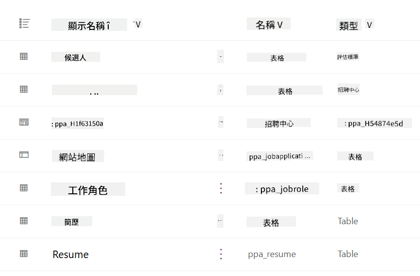
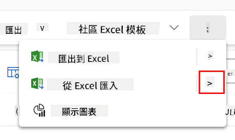
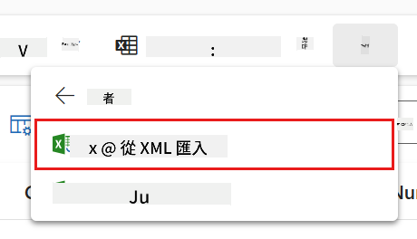
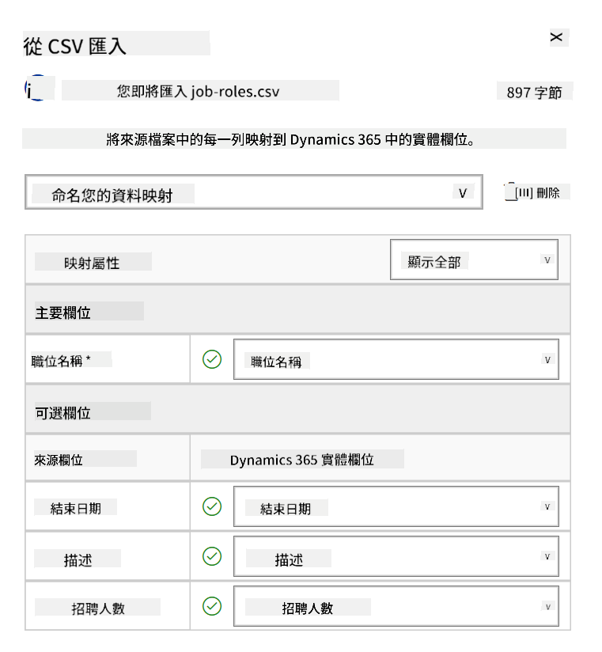
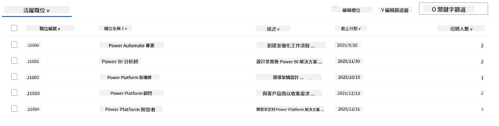
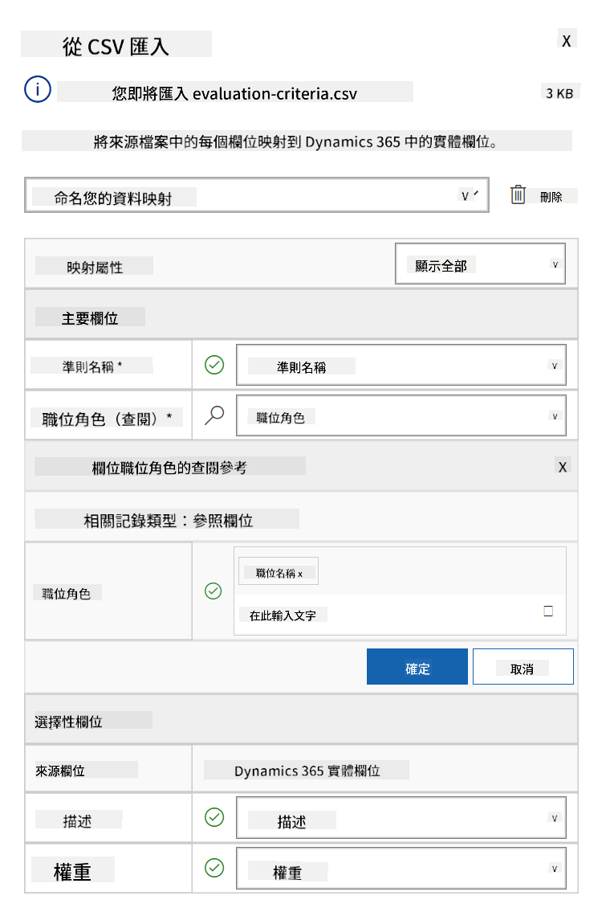
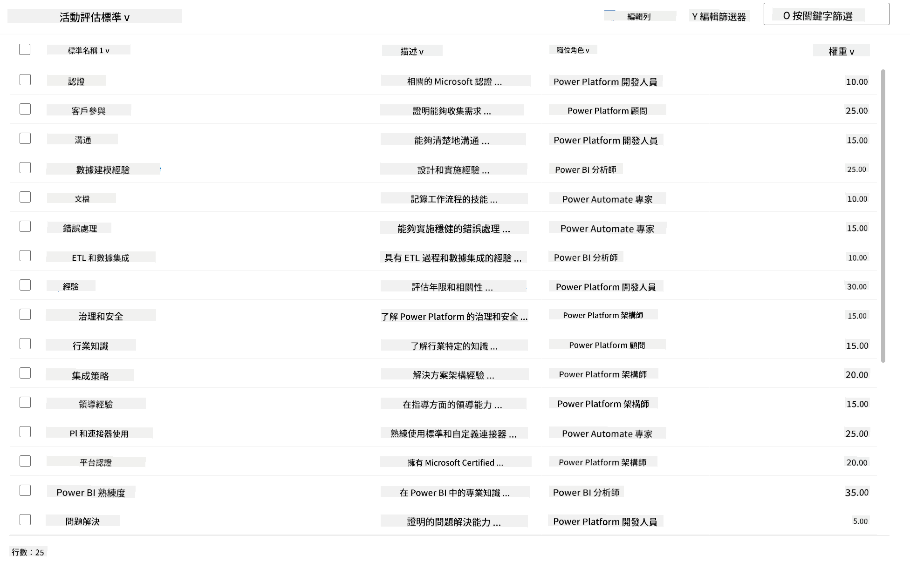

<!--
CO_OP_TRANSLATOR_METADATA:
{
  "original_hash": "2620cf9eaf09a3fc6be7fa31a3a62956",
  "translation_date": "2025-10-22T00:08:32+00:00",
  "source_file": "docs/operative-preview/01-get-started/README.md",
  "language_code": "hk"
}
-->
# 🚨 任務 01：開始使用招聘代理

--8<-- "disclaimer.md"

## 🕵️‍♂️ 行動代號：`人才偵察行動`

> **⏱️ 行動時間窗口：** `~45 分鐘`

## 🎯 任務簡介

歡迎，特工。您的第一個任務是 **人才偵察行動**——建立一個基於 AI 的招聘系統的基礎架構，徹底改變企業識別和招聘頂尖人才的方式。

您的任務（如果您選擇接受）是使用 Microsoft Copilot Studio 部署並配置一個全面的招聘管理系統。您將導入一個預建的解決方案，其中包含所有必要的數據結構，然後創建您的第一個 AI 代理——**招聘代理**，它將成為未來所有招聘操作的核心協調者。

這次初始部署將建立指揮中心，您將在 Agent Academy Operative 訓練計劃中進一步增強它。將其視為您的行動基地——在接下來的任務中，您將在此基礎上建立一整個專業代理網絡。

---

## 🔎 目標

完成此任務後，您將：

- **場景理解**：全面了解招聘自動化的挑戰和解決方案
- **解決方案部署**：成功導入並配置招聘管理系統的基礎
- **代理創建**：建立招聘代理，作為您在 Agent Academy Operative 訓練計劃中構建場景的起點

---

## 🔍 先決條件

在開始此任務之前，請確保您擁有：

- Copilot Studio 授權
- Microsoft Power Platform 環境的訪問權限
- 創建解決方案和代理的管理許可

---

## 🏢 理解招聘自動化場景

此場景展示了一家公司如何使用 Microsoft Copilot Studio 改善並自動化其招聘流程。它引入了一個代理系統，協同處理如審核簡歷、推薦職位、準備面試材料以及評估候選人等任務。

### 商業價值

此解決方案幫助 HR 團隊節省時間並做出更好的決策：

- 自動處理通過電子郵件收到的簡歷。
- 根據候選人資料推薦合適的職位。
- 為每位候選人量身定制創建求職申請和面試指南。
- 通過內置的安全和審核功能確保公平和合規的招聘流程。
- 收集反饋以改進解決方案。

### 運作方式

- 中心 **招聘代理** 協調流程並將數據存儲在 Microsoft Dataverse 中。
- **申請接收代理** 讀取簡歷並創建求職申請。
- **面試準備代理** 根據候選人的背景生成面試問題和文件。
- 系統可以發布到演示網站，讓利益相關者與其互動。

此場景非常適合希望使用 AI 驅動的自動化技術現代化招聘工作流程的組織，同時保持透明、公平和高效。

---

## 🧪 實驗室：設置招聘代理

在這個動手實驗中，您將為招聘自動化系統建立基礎。您將首先導入一個預配置的解決方案，其中包含管理候選人、職位和招聘工作流程所需的所有 Dataverse 表和數據結構。接下來，您將用示例數據填充這些表，這些數據將支持您在本模塊中的學習並提供現實場景進行測試。最後，您將在 Copilot Studio 中創建招聘代理，設置基本的對話界面，這將成為您在未來任務中添加所有其他功能的基石。

### 🧪 實驗室 1.1：導入解決方案

1. 前往 **[Copilot Studio](https://copilotstudio.microsoft.com)**
1. 在左側導航中選擇 **...** 並選擇 **Solutions**
1. 點擊頂部的 **Import Solution** 按鈕
1. **[下載](https://raw.githubusercontent.com/microsoft/agent-academy/refs/heads/main/docs/operative-preview/01-get-started/assets/Operative_1_0_0_0.zip)** 預先準備好的解決方案
1. 點擊 **Browse** 並選擇之前下載的解決方案
1. 點擊 **Next**
1. 點擊 **Import**

!!! success
    成功後，您將看到綠色通知欄，顯示以下消息：  
    "Solution "Operative" imported successfully."

解決方案導入後，通過選擇解決方案的顯示名稱 (`Operative`) 查看您導入的內容。



以下組件已導入：

| 顯示名稱 | 類型 | 描述 |
|-------------|------|-------------|
| Candidate | 表 | 候選人信息 |
| Evaluation Criteria | 表 | 職位的評估標準 |
| Hiring Hub | 模型驅動應用 | 管理招聘流程的應用 |
| Hiring Hub | 網站地圖 | Hiring Hub 應用的導航結構 |
| Job Application | 表 | 求職申請 |
| Job Role | 表 | 職位 |
| Resume | 表 | 候選人的簡歷 |

作為此實驗的最後一步，點擊頁面頂部的 **Publish all customizations** 按鈕。

### 🧪 實驗室 1.2：導入示例數據

在此實驗中，您將向實驗室 1.1 中導入的一些表添加示例數據。

#### 下載要導入的文件

1. **[下載](https://raw.githubusercontent.com/microsoft/agent-academy/refs/heads/main/docs/operative-preview/01-get-started/assets/evaluation-criteria.csv)** 評估標準的 CSV 文件
1. **[下載](https://raw.githubusercontent.com/microsoft/agent-academy/refs/heads/main/docs/operative-preview/01-get-started/assets/job-roles.csv)** 職位的 CSV 文件

#### 導入職位示例數據

1. 返回您在上一個實驗中導入的解決方案
1. 通過選擇行前的勾選框選擇 **Hiring Hub** 模型驅動應用
1. 點擊頂部的 **Play** 按鈕

    !!! warning
        您可能需要再次登錄。請確保完成登錄。完成後，您應該能看到 Hiring Hub 應用。

1. 在左側導航中選擇 **Job Roles**
1. 在命令欄中選擇 **更多** 圖標（三個垂直排列的點）
1. 點擊 *Import from Excel* 旁邊的 **右箭頭**

    

1. 點擊 **Import from CSV**

    

1. 點擊 **Choose File** 按鈕，選擇您剛剛下載的 **job-roles.csv** 文件，然後點擊 **Open**
1. 點擊 **Next**
1. 保持下一步設置不變，點擊 **Review Mapping**

    

1. 確保映射正確，然後點擊 **Finish Import**

    !!! info
        這將開始導入，您可以通過點擊 **Done** 跟蹤進度或立即完成過程。

1. 點擊 **Done**

這可能需要一些時間，但您可以點擊 **Refresh** 按鈕查看導入是否成功。



#### 導入評估標準示例數據

1. 在左側導航中選擇 **Evaluation Criteria**
1. 在命令欄中選擇 **更多** 圖標（三個垂直排列的點）
1. 點擊 *Import from Excel* 旁邊的 **右箭頭**

    

1. 點擊 **Import from CSV**

    

1. 點擊 **Choose File** 按鈕，選擇您剛剛下載的 **evaluation-criteria.csv** 文件，然後點擊 **Open**
1. 點擊 **Next**
1. 保持下一步設置不變，點擊 **Review Mapping**

    

1. 現在我們需要在映射中做一些額外的工作。點擊 Job Role 字段旁邊的放大鏡（🔎 圖標）
1. 確保選擇了 **Job Title**，如果沒有，請添加它
1. 點擊 **OK**
1. 確保其餘映射也正確，然後點擊 **Finish Import**

    !!! info
        這將再次開始導入，您可以通過點擊 **Done** 跟蹤進度或立即完成過程。

1. 點擊 **Done**

這可能需要一些時間，但您可以點擊 **Refresh** 按鈕查看導入是否成功。



### 🧪 實驗室 1.3：創建招聘代理

現在您已完成先決條件的設置，是時候進行實際工作了！首先讓我們添加招聘代理！

1. 前往 **[Copilot Studio](https://copilotstudio.microsoft.com)**，並確保您處於導入解決方案和數據的同一環境中
1. 在左側導航中選擇 **Agents**
1. 點擊 **New Agent**
1. 點擊 **Configure**
1. 在 **Name** 中輸入：

    ```text
    Hiring Agent
    ```

1. 在 **Description** 中輸入：

    ```text
    Central orchestrator for all hiring activities
    ```

1. 點擊右上角 *Create* 按鈕旁邊的 **...**
1. 選擇 **Update advanced settings**
1. 在 **Solution** 中選擇 `Operative`
1. 點擊 **Update**
1. 點擊右上角的 **Create**

這將為您創建招聘代理，您將在整個 Operative 課程中使用它。

---

## 🎉 任務完成

任務 01 已完成！您現在掌握了以下技能：

✅ **場景理解**：全面了解招聘自動化的挑戰和解決方案  
✅ **解決方案部署**：成功導入並配置招聘管理系統的基礎  
✅ **代理創建**：建立了招聘代理，作為您在 Agent Academy Operative 訓練計劃中構建場景的起點  

接下來是 [任務 02](../02-multi-agent/README.md)：讓您的代理具備多代理功能，並與其他代理連接。

---

## 📚 戰術資源

📖 [Microsoft Copilot Studio - 創建代理](https://learn.microsoft.com/microsoft-copilot-studio/authoring-first-bot)  
📖 [Microsoft Dataverse 文檔](https://learn.microsoft.com/power-apps/maker/data-platform)  

---

**免責聲明**：  
此文件已使用人工智能翻譯服務 [Co-op Translator](https://github.com/Azure/co-op-translator) 進行翻譯。儘管我們致力於提供準確的翻譯，請注意自動翻譯可能包含錯誤或不準確之處。原始語言的文件應被視為權威來源。對於重要信息，建議使用專業人工翻譯。我們不對因使用此翻譯而引起的任何誤解或誤釋承擔責任。