<!--
CO_OP_TRANSLATOR_METADATA:
{
  "original_hash": "4fb913dfc3bbc71506dd3602c4b8e6ed",
  "translation_date": "2025-10-21T23:50:45+00:00",
  "source_file": "docs/operative-preview/02-multi-agent/README.md",
  "language_code": "hk"
}
-->
# 🚨 任務 02：連接代理

--8<-- "disclaimer.md"

## 🕵️‍♂️ 行動代號：`交響樂行動`

> **⏱️ 行動時間窗口：** `~45 分鐘`

## 🎯 任務簡介

歡迎回來，特工。在任務 01 中，你已經建立了主要的招聘代理——一個管理招聘工作流程的堅實基礎。但單一代理的能力有限。

如果你選擇接受任務，那麼你的任務就是 **交響樂行動**——將你的單一代理轉變為 **多代理系統**：一個協調一致的專業代理團隊，共同應對複雜的招聘挑戰。就像交響樂團中每位音樂家都完美地演奏自己的部分一樣，你將為現有的招聘代理新增兩個重要的專家代理：一個負責自動處理履歷的申請接收代理，以及一個負責製作全面面試材料的面試準備代理。這些代理將在你的主要指揮者下無縫合作。

## 🔎 目標

在這次任務中，你將學到：

1. 何時使用 **子代理** 與 **連接代理**
1. 如何設計 **可擴展的多代理架構**
1. 創建 **專注任務的子代理**
1. 建立代理之間的 **通信模式**
1. 構建申請接收代理和面試準備代理

## 🧠 什麼是連接代理？

在 Copilot Studio 中，你不僅限於構建單一的、單一功能的代理。你可以創建 **多代理系統**——由專業代理組成的網絡，共同處理複雜的工作流程。

可以將其想像成現實中的組織：與其讓一個人做所有事情，不如讓專家專注於特定任務並在需要時合作。

### 為什麼多代理系統重要

- **可擴展性：** 每個代理可以由不同的團隊獨立開發、測試和維護。  
- **專業化：** 代理可以專注於它們最擅長的事情。例如，一個負責數據處理，另一個負責用戶交互，還有一個負責決策。  
- **靈活性：** 你可以混合搭配代理，跨項目重複使用它們，並逐步改進你的系統。  
- **可維護性：** 對一個代理的更改不一定會影響其他代理，使更新更安全、更容易。

### 現實例子：招聘流程

考慮我們的招聘工作流程——多個代理可能會一起工作，負責以下任務：

- **履歷接收** 需要文檔解析和數據提取技能
- **評分** 涉及評估候選人的履歷並將其與職位要求匹配
- **面試準備** 需要深入分析候選人是否適合  
- **候選人溝通** 需要同理心的溝通能力

與其構建一個試圖處理所有這些不同技能的大型代理，不如為每個領域創建專業代理並將它們協調在一起。

## 🔗 子代理與連接代理：關鍵區別

Copilot Studio 提供了兩種構建多代理系統的方法，每種方法都有其特定的使用場景：

### ↘️ 子代理

子代理是 **輕量級專家**，存在於你的主要代理內。可以將它們想像成同一部門內的專業團隊。

#### 關鍵技術細節

- 子代理存在於父代理內，並且只有一個配置頁面。
- 工具和知識 **存儲在父代理** 中，但配置為“可供”子代理使用。
- 子代理 **共享父代理的主題**。主題可以由子代理指令引用。
- 子代理 **不需要單獨發布**——一旦創建，它們會自動在父代理內可用。這使得測試更容易，因為父代理和子代理的更改可以在 **同一共享工作區** 內進行。

#### 使用子代理的情況

- 整個解決方案由單一團隊管理
- 你希望邏輯地將工具和知識組織到子代理中
- 你不需要為每個代理單獨進行身份驗證或部署
- 代理不會單獨發布或獨立使用
- 你不需要在多個解決方案中重複使用代理

**例子：** 一個 IT 幫助台代理，擁有以下子代理：

- 密碼重置程序
- 硬件故障排除  
- 軟件安裝指南

### 🔀 連接代理

連接代理是 **完全獨立的代理**，你的主要代理可以與之合作。可以將它們想像成在項目中合作的不同部門。

#### 關鍵技術細節

- 連接代理擁有 **自己的主題** 和對話流程。它們獨立運行，擁有自己的設置、邏輯和部署生命周期。
- 連接代理 **必須發布**，才能被其他代理添加和使用。
- 在測試期間，連接代理的更改必須發布，才能被調用代理使用。

#### 使用連接代理的情況

- 不同的團隊獨立開發和維護不同的代理
- 代理需要自己的設置、身份驗證和部署渠道
- 你希望單獨發布和維護代理，並為每個代理提供獨立的應用生命周期管理 (ALM)
- 代理應該可以在多個解決方案中重複使用

**例子：** 一個客戶服務系統，連接到：

- 由財務團隊維護的獨立賬單代理
- 由產品團隊維護的獨立技術支持代理
- 由運營團隊維護的獨立退貨代理

!!! tip "提示"
    你可以混合使用這兩種方法！例如，你的主要代理可以連接到其他團隊的外部代理，同時擁有自己的子代理來處理專業的內部任務。

## 🎯 多代理架構模式

在設計多代理系統時，根據代理如何交互，可以出現幾種模式：

| 模式                | 描述                                                                 | 最適合                                                      |
|----------------------|---------------------------------------------------------------------|-------------------------------------------------------------|
| **中心輻射型**      | 一個主要指揮代理協調多個專業代理。指揮代理處理用戶交互並將任務分配給子代理或連接代理。 | 複雜工作流程，其中一個代理協調專業任務                     |
| **流水線型**         | 代理按順序依次處理工作，每個代理在傳遞到下一階段之前增加價值。       | 線性流程，如申請處理（接收 → 篩選 → 面試 → 決策）          |
| **協作型**          | 代理同時在問題的不同方面合作，分享上下文和結果。                     | 需要多角度或專業領域進行複雜分析的情況                     |

!!! tip "提示"
    你甚至可以結合兩種或多種模式。

## 💬代理通信和上下文共享

當代理一起工作時，它們需要有效地共享信息。在 Copilot Studio 中，這是如何實現的：

### 對話歷史

默認情況下，當主要代理調用子代理或連接代理時，它可以傳遞 **對話歷史**。這使得專業代理能夠完全了解用戶正在討論的內容。

你可以禁用此功能以提高安全性或性能——例如，如果專業代理只需要完成特定任務而不需要完整的對話上下文。這可以有效防止 **數據洩漏**。

### 明確指令

你的主要代理可以向子代理或連接代理提供 **具體指令**。例如：“處理這份履歷並總結其技能是否符合高級開發人員職位。”

### 返回值

代理可以將結構化信息返回給調用代理，允許主要代理在後續步驟中使用該信息或與其他代理共享。

### Dataverse 集成

對於更複雜的場景，代理可以通過 **Dataverse** 或其他數據存儲共享信息，從而在多次交互中實現持久的上下文共享。

## ↘️子代理：申請接收代理

讓我們開始構建我們的多代理招聘系統。我們的第一個專家代理將是 **申請接收代理**——一個負責處理收到的履歷和候選人信息的子代理。

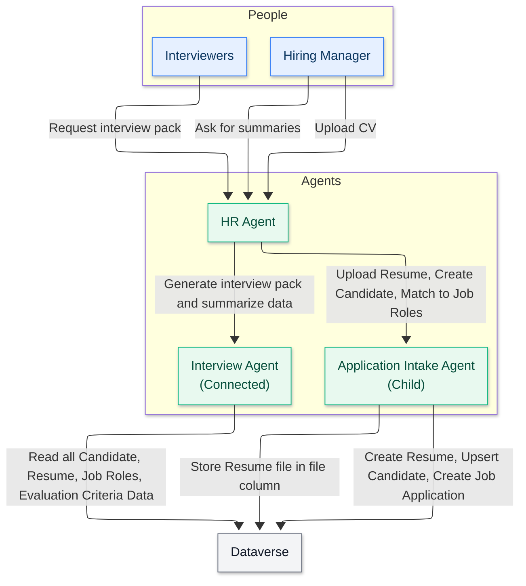
```mermaid
---
config:
  layout: elk
  look: neo
---
flowchart TB
 subgraph People["People"]
    direction TB
        HiringManager["Hiring Manager"]
        Interviewers["Interviewers"]
  end
 subgraph Agents["Agents"]
    direction LR
        ApplicationIntakeAgent["Application Intake Agent<br>(Child)"]
        InterviewAgent["Interview Agent<br>(Connected)"]
        HRAgent["HR Agent"]
  end
    HiringManager -- Upload CV --> HRAgent
    HRAgent -- Upload Resume, Create Candidate, Match to Job Roles --> ApplicationIntakeAgent
    ApplicationIntakeAgent -- Create Resume, Upsert Candidate, Create Job Application --> Dataverse["Dataverse"]
    ApplicationIntakeAgent -- Store Resume file in file column --> Dataverse
    HiringManager -- Ask for summaries --> HRAgent
    Interviewers -- Request interview pack --> HRAgent
    HRAgent -- Generate interview pack and summarize data --> InterviewAgent
    InterviewAgent -- Read all Candidate, Resume, Job Roles, Evaluation Criteria Data --> Dataverse
     HiringManager:::person
     Interviewers:::person
     ApplicationIntakeAgent:::agent
     InterviewAgent:::agent
     HRAgent:::agent
     Dataverse:::data
    classDef person fill:#e6f0ff,stroke:#3b82f6,color:#0b3660
    classDef agent fill:#e8f9ef,stroke:#10b981,color:#064e3b
    classDef data  fill:#f3f4f6,stroke:#6b7280,color:#111827
```

### 🤝申請接收代理的職責

- **解析履歷內容** 從通過互動聊天提供的 PDF 中提取（在未來的任務中，你將學習如何自主處理履歷）。
- **提取結構化數據**（姓名、技能、經驗、教育背景）
- **根據資格和求職信** 將候選人匹配到開放職位
- **將候選人信息存儲** 在 Dataverse 中以供後續處理
- **去重申請** 避免創建重複的候選人，通過從履歷中提取的電子郵件地址匹配到現有記錄。

### ⭐為什麼這應該是子代理

申請接收代理非常適合作為子代理，因為：

- 它專注於文檔處理和數據提取
- 它不需要單獨發布  
- 它是我們整體招聘解決方案的一部分，由同一團隊管理
- 它專注於特定觸發器（收到新履歷）並由招聘代理調用。

## 🔀連接代理：面試準備代理  

我們的第二個專家代理將是 **面試準備代理**——一個幫助創建全面面試材料並評估候選人回答的連接代理。

### 🤝面試準備代理的職責

- **創建面試包**，包括公司信息、職位要求和評估標準
- **生成面試問題**，根據特定職位和候選人背景量身定制
- **回答一般問題**，關於職位和申請的相關信息，用於利益相關者溝通

### ⭐為什麼這應該是連接代理

面試準備代理更適合作為連接代理，因為：

- 人才招聘團隊可能希望在多個招聘流程中獨立使用它
- 它需要自己的面試最佳實踐和評估標準知識庫
- 不同的招聘經理可能希望根據其團隊需求自定義其行為
- 它可以用於內部職位招聘，而不僅僅是外部招聘

## 🧪實驗 2.1：添加申請接收代理

準備好將理論付諸實踐了嗎？讓我們向你的現有招聘代理添加第一個子代理。

### 完成此任務的前提條件

你需要 **以下之一**：

- **完成任務 01** 並準備好你的招聘代理，**或者**
- **導入任務 02 起始解決方案**，如果你是從頭開始或需要補課。[下載任務 02 起始解決方案](https://aka.ms/agent-academy)

!!! note "解決方案導入和示例數據"
    如果你使用起始解決方案，請參考 [任務 01](../01-get-started/README.md) 以獲取有關如何將解決方案和示例數據導入到你的環境中的詳細說明。

### 2.1.1 解決方案設置

1. 在 Copilot Studio 中，選擇左側導航欄中工具下方的省略號（...）。
1. 選擇 **解決方案**。  
    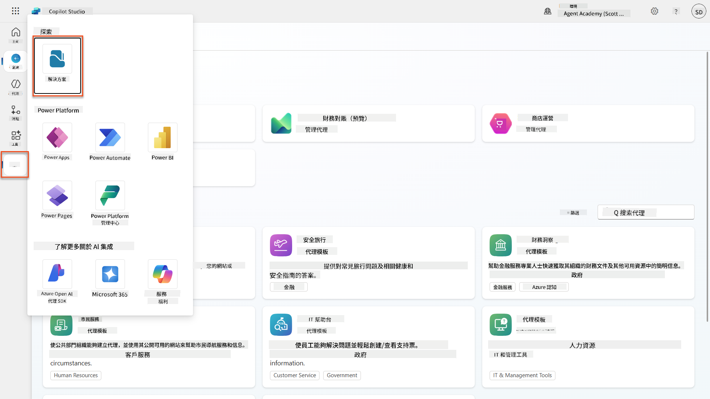
1. 找到你的 Operative 解決方案，選擇旁邊的 **省略號（...）**，然後選擇 **設置首選解決方案**。這將確保你的所有工作都將添加到此解決方案中。  
    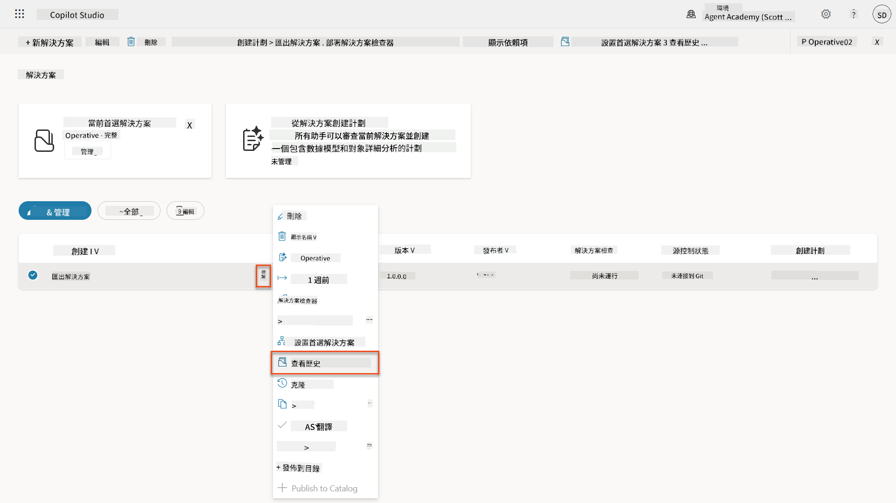

### 2.1.2 配置你的招聘代理指令

1. **導航** 到 Copilot Studio。確保在右上角的 **環境選擇器** 中選擇了你的環境。

1. 打開你在任務 01 中創建的 **招聘代理**

1. 在 **概覽** 標籤的 **指令** 部分中選擇 **編輯**，並在頂部添加以下指令：

    ```text
    You are the central orchestrator for the hiring process. You coordinate activities, provide summaries, and delegate work to specialized agents.
    ```

1. 選擇 **保存**  
    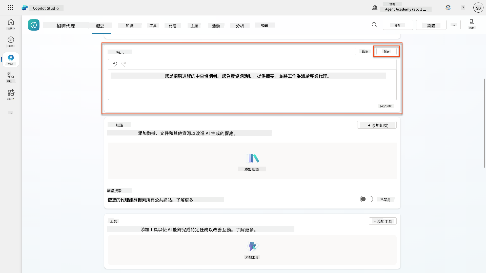

1. 選擇 **設置**（右上角）

1. 確保以下設置：

    | 設置 | 值 |
    |------|----|
    | 使用生成式 AI 協調代理的回應 | **是** |
    | 內容審核 | **中等** |
    | 使用一般知識 | **關閉** |
    | 使用網絡信息 | **關閉** |
    | 文件上傳 | **開啟** |

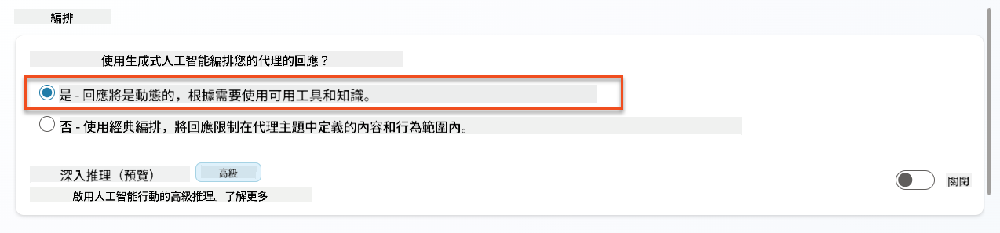
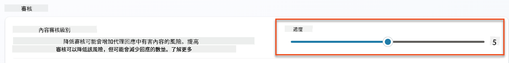


### 2.1.3 添加申請接收子代理

1. **導航** 到你的招聘代理中的 **代理** 標籤——這是你添加專業代理的地方。

1. 選擇 **+ 添加**，然後選擇 **創建代理**。注意，這標註為 "*創建一個輕量級代理，存在於你的當前代理內並繼承其設置。非常適合分解複雜邏輯* "  
    

1. **命名** 你的代理為 `申請接收代理`

1. 選擇 **代理選擇** - 根據描述在 **何時使用？** 下拉選單中選擇。這些選項類似於可以為主題配置的觸發器。

1. 將 **描述** 設置為：

    ```text
    Processes incoming resumes and stores candidates in the system
    ```

    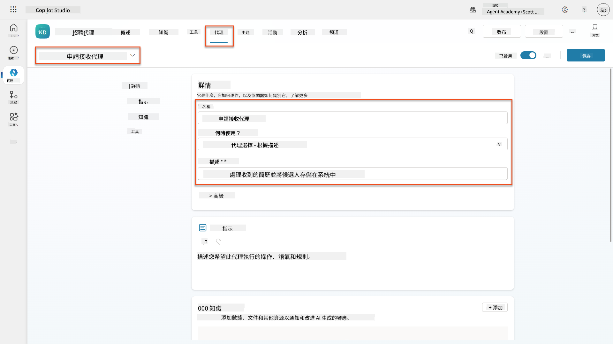

1. 展開 **高級選項**，並將優先級設置為 `10000`。這將確保稍後面試代理在回答一般問題時優先於此代理。此處也可以設置條件，例如確保至少有一個附件。

1. 確保 **網絡搜索** 切換設置為 **禁用**。因為我們只希望使用父代理提供的信息。

1. 選擇 **保存**

### 2.1.4 配置履歷上傳代理流程

代理在未被賦予工具或主題之前無法執行任何操作。
我們使用 **Agent Flow 工具** 而非 Topics 來處理 *上傳履歷* 步驟，因為這個多步驟的後端流程需要確定性執行並與外部系統整合。Topics 最適合引導對話式對話，而 Agent Flows 則提供結構化的自動化，能可靠地處理文件處理、數據驗證以及資料庫的新增或更新操作，而不依賴用戶交互。

1. 在 Application Intake Agent 頁面中找到 **Tools** 部分。
   **重要提示：** 這不是父代理的 Tools 標籤，而是可以在子代理指令下方向下滾動找到。

1. 選擇 **+ Add**
   

1. 選擇 **+ New tool** 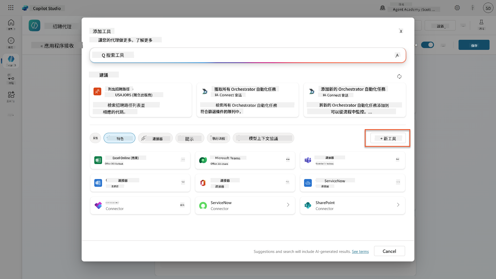

1. 選擇 **Agent flow**。
   Agent Flow 設計器將打開，這是我們添加上傳履歷邏輯的地方。  
   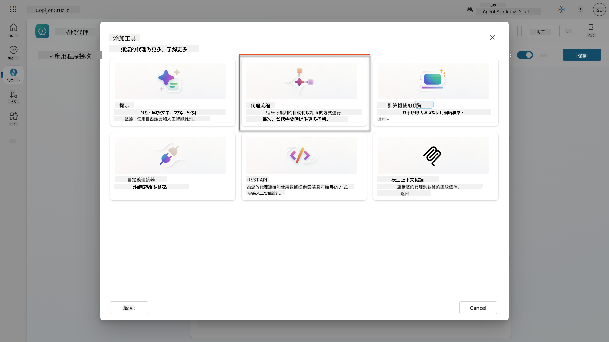

1. 選擇 **When an agent calls the flow** 節點，並選擇 **+ Add** 為以下參數添加輸入，確保添加名稱和描述。

    | 類型  | 名稱     | 描述                                                                                                   |
    |-------|----------|-------------------------------------------------------------------------------------------------------|
    | File  | Resume   | 履歷 PDF 文件                                                                                         |
    | Text  | Message  | 從上下文中提取封面信樣式的消息。消息必須少於 2000 字符。                                               |
    | Text  | UserEmail| 履歷來源的電子郵件地址。這將是聊天中上傳履歷的用戶，或者是通過電子郵件接收的發件人地址。                 |

    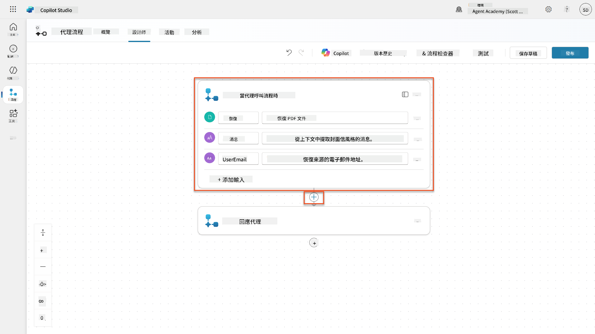

1. 選擇觸發節點下方的 **+ 圖標**，搜索 `Dataverse`，選擇 Microsoft Dataverse 旁的 **See more**，然後在 **Microsoft Dataverse** 部分選擇 **Add a new row** 操作  
    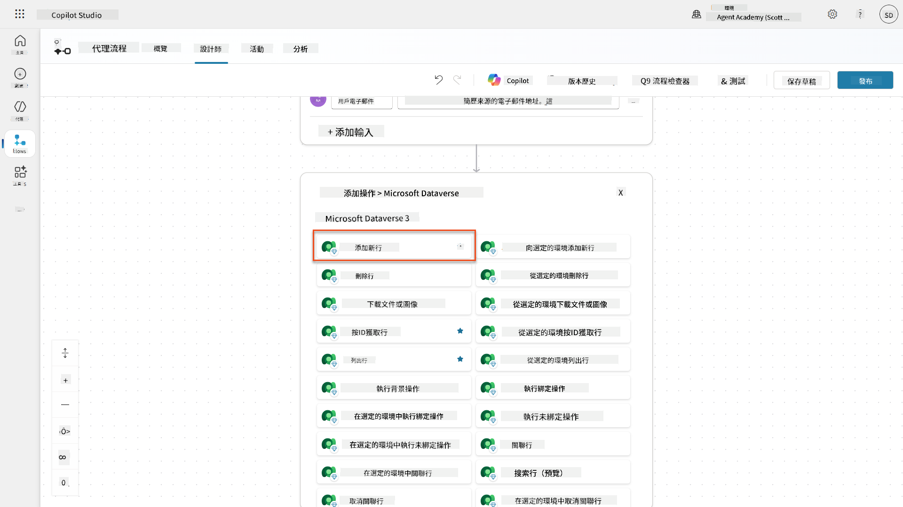

1. 通過選擇 **省略號(...)** 並選擇 **Rename** 將節點命名為 **Create Resume**  
    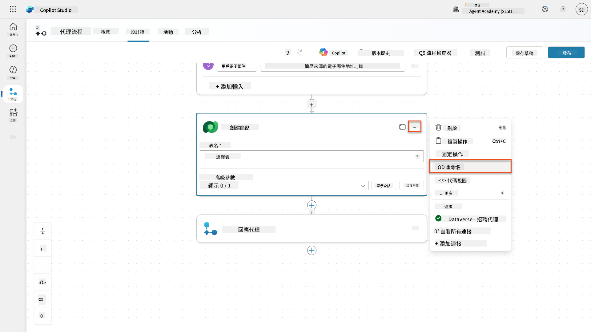

1. 將 **Table name** 設置為 **Resumes**，然後選擇 **Show all**，以顯示所有參數。

1. 設置以下 **屬性**：

    | 屬性                     | 設置方式                      | 詳細信息 / 表達式                                         |
    | ------------------------ | ----------------------------- | -------------------------------------------------------- |
    | **Resume Title**         | 動態數據 (閃電圖標)           | **When an agent calls the flow** → **Resume name** 如果看不到 Resume name，請確保您已將 Resume 參數配置為數據類型。 |
    | **Cover letter**         | 表達式 (fx 圖標)              | `if(greater(length(triggerBody()?['text']), 2000), substring(triggerBody()?['text'], 0, 2000), triggerBody()?['text'])` |
    | **Source Email Address** | 動態數據 (閃電圖標)           | **When an agent calls the flow** → **UserEmail**         |
    | **Upload Date**          | 表達式 (fx 圖標)              | `utcNow()`                                               |

    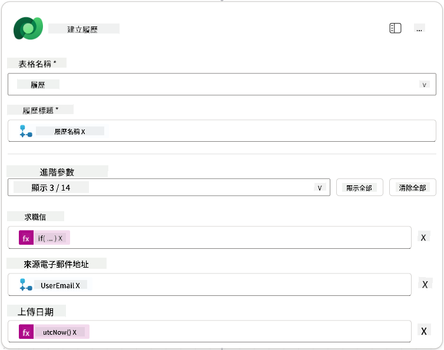

1. 選擇 Create Resume 節點下方的 **+ 圖標**，搜索 `Dataverse`，選擇 Microsoft Dataverse 旁的 **See more**，然後選擇 **Upload a file or an image** 操作。
   **重要提示：** 請勿選擇 Upload a file or an image to the selected environment 操作。

1. 通過選擇 **省略號(...)** 並選擇 **Rename** 將節點命名為 **Upload Resume File**

1. 設置以下 **屬性**：

     | 屬性 | 設置方式 | 詳細信息 |
     |------|----------|---------|
     | **Content name** | 動態數據 (閃電圖標) | When an agent calls the flow → Resume name |
     | **Table name** | 選擇 | Resumes |
     | **Row ID** | 動態數據 (閃電圖標) | Create Resume → See more → Resume |
     | **Column Name** | 選擇 | Resume PDF |
     | **Content** | 動態數據 (閃電圖標) | When an agent calls the flow → Resume contentBytes |

     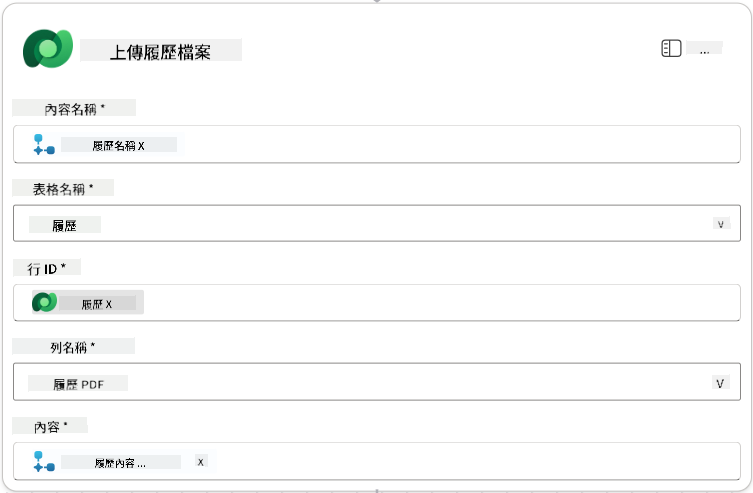

1. 選擇 **Respond to the agent node**，然後選擇 **+ Add an output**

     | 屬性 | 設置方式 | 詳細信息 |
     |------|----------|---------|
     | **Type** | 選擇 | `Text` |
     | **Name** | 輸入 | `ResumeNumber` |
     | **Value** | 動態數據 (閃電圖標) | Create Resume → See More → Resume Number |
     | **Description** | 輸入 | `創建的履歷的 [ResumeNumber]` |

     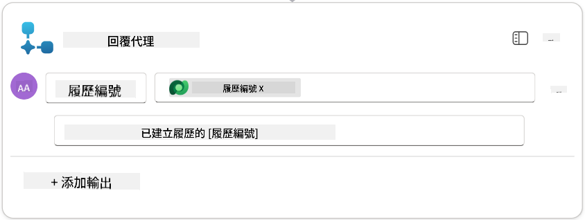

1. 在右上角選擇 **Save draft**  
     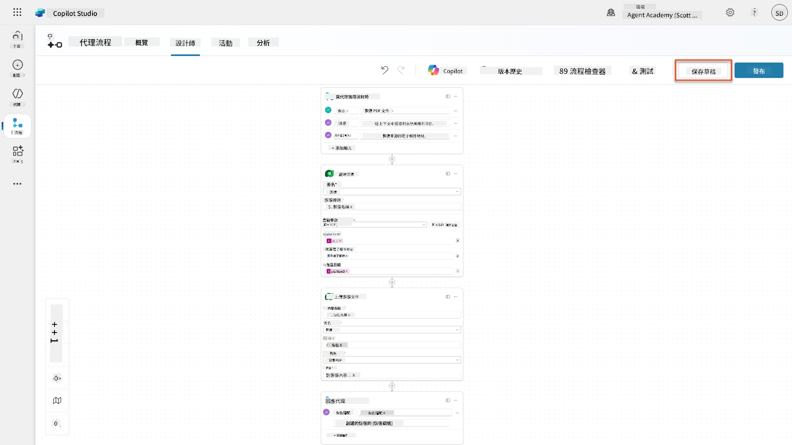

1. 選擇 **Overview** 標籤，選擇 **Edit** 在 **Details** 面板中進行編輯

     1. **Flow name**:`Resume Upload`
     1. **Description**:`當指示時上傳履歷`

     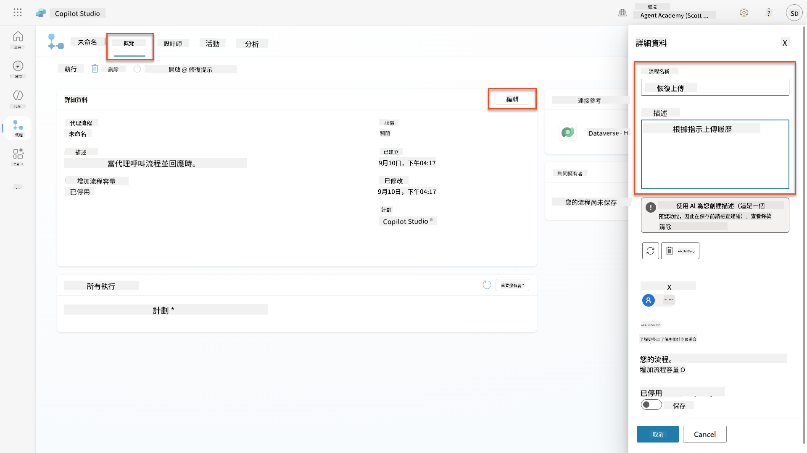

1. 再次選擇 **Designer** 標籤，然後選擇 **Publish**。  
     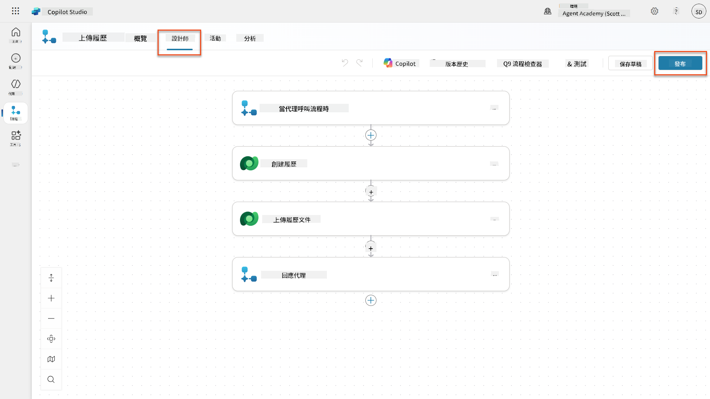

### 2.1.5 將流程連接到您的代理

現在您將已發布的流程連接到您的 Application Intake Agent。

1. 返回 **Hiring Agent**，選擇 **Agents** 標籤。打開 **Application Intake Agent**，然後找到 **Tools** 面板。  
    

1. 選擇 **+ Add**

1. 選擇 **Flow** 篩選器，並搜索 `Resume Upload`。選擇 **Resume Upload** 流程，然後 **Add and configure**。

1. 設置以下參數：

    | 參數 | 值 |
    |------|----|
    | **Description** | `當指示時上傳履歷。嚴格規則：僅在以 "Resume Upload" 形式引用並且有附件時調用此工具` |
    | **Additional details → When this tool may be used** | `僅當由 Topics 或代理引用時` |
    | **Inputs → Add Input** | `contentBytes` |
    | **Inputs → Add Input** | `name` |

    

    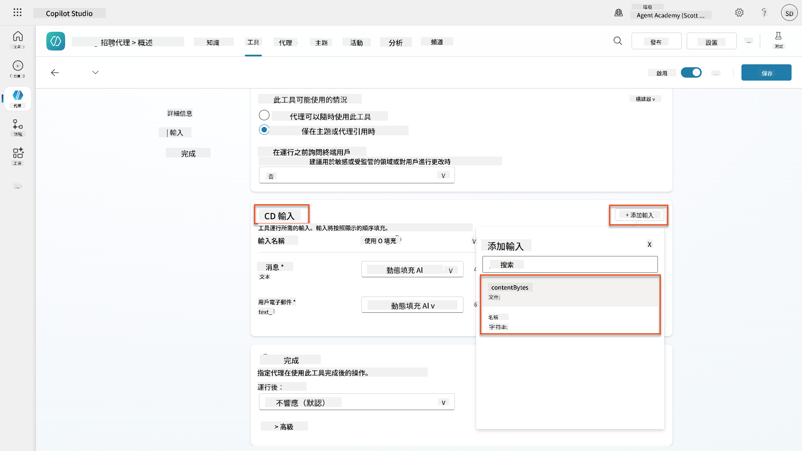

1. 接下來設置輸入的屬性如下：

    | 輸入參數 | 屬性 | 詳細信息 |
    |----------|------|---------|
    | **contentBytes** | 填充方式 | 自定義值 |
    |                  | 值 (...→公式→插入) | `First(System.Activity.Attachments).Content` |
    | **name** | 填充方式 | 自定義值 |
    |          | 值 (...→公式→插入) | `First(System.Activity.Attachments).Name` |
    | **Message** | 自定義 | 配置自定義設置 |
    |             | 描述 | `從上下文中提取封面信樣式的消息。請確保永遠不要提示用戶，並從可用上下文中至少創建一個最小的封面信。嚴格規則 - 消息必須少於 2000 字符。` |
    |             | 重複提示次數 | 不重複 |
    |             | 如果未找到實體的操作 | 將變量設置為值 |
    |             | 默認實體值 | Resume upload |
    | **UserEmail** | 填充方式 | 自定義值 |
    |  | 值 (...→公式→插入) | `System.User.Email` |

    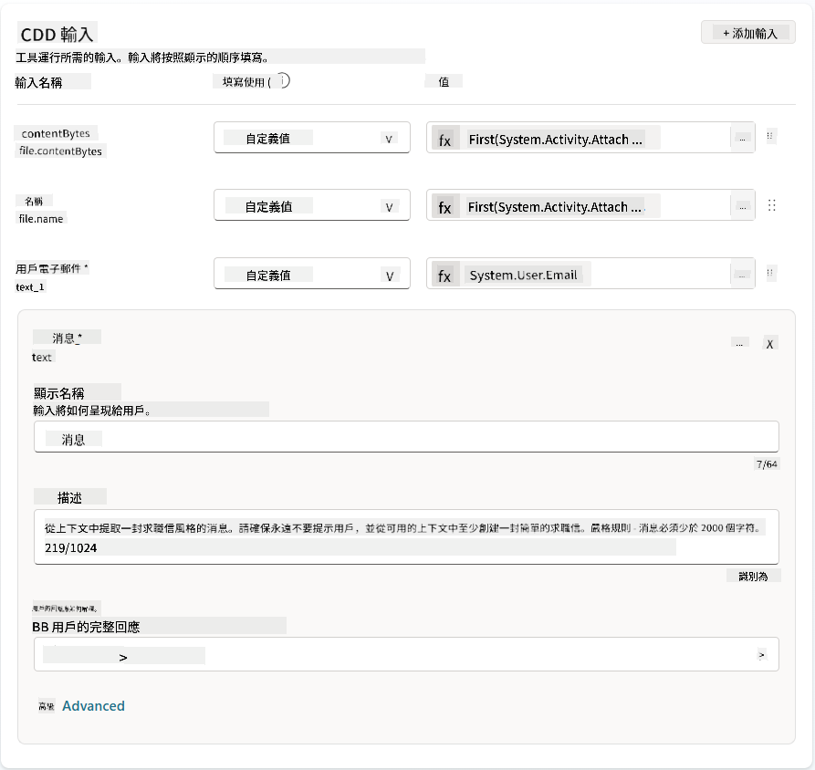

1. 選擇 **Save**

### 2.1.6 定義代理指令

1. 返回 **Application Intake Agent**，選擇 **Agents** 標籤，然後找到 **Instructions** 面板。

1. 在 **Instructions** 欄位中，粘貼以下清晰的指導給您的子代理：

    ```text
    You are tasked with managing incoming Resumes, Candidate information, and creating Job Applications.  
    Only use tools if the step exactly matches the defined process. Otherwise, indicate you cannot help.  
    
    Process for Resume Upload via Chat  
    1. Upload Resume  
      - Trigger only if /System.Activity.Attachments contains exactly one new resume.  
      - If more than one file, instruct the user to upload one at a time and stop.  
      - Call /Upload Resume once. Never upload more than once for the same message.  
    
    2. Post-Upload  
      - Always output the [ResumeNumber] (R#####).  
    ```

1. 當指令包含斜槓 (/) 時，選擇斜槓後的文本並選擇解析名稱。對以下進行操作：

    - `System.Activity.Attachments` (變量)
    - `Upload Resume` (工具)

    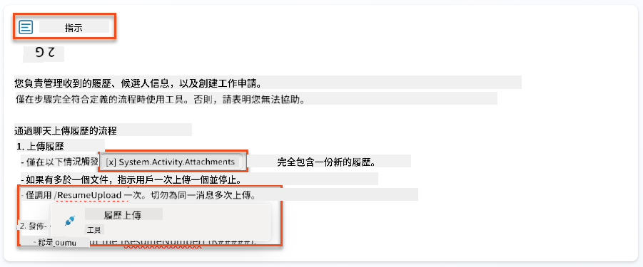

1. 選擇 **Save**

### 2.1.7 測試您的 Application Intake Agent

現在讓我們驗證您的第一個協作成員是否正常工作。

1. **下載** [測試履歷。](https://download-directory.github.io/?url=https://github.com/microsoft/agent-academy/tree/main/operative/sample-data/resumes&filename=operative_sampledata)

1. **打開**測試面板，選擇 **Test**。

1. 在測試聊天中 **上傳** 兩份履歷，並輸入消息 `Process these resumes`

    - 代理應返回類似於 *一次只能上傳一份履歷。請上傳一份履歷以繼續。* 的消息。

    

1. 嘗試僅上傳 **一份履歷**，並輸入消息 `Process this resume`

    - 代理應返回類似於 *Avery Example 的履歷已成功上傳。履歷編號為 R10026。* 的消息。

1. 在 **Activity map** 中，您應該看到 **Application Intake Agent** 處理履歷上傳。  
    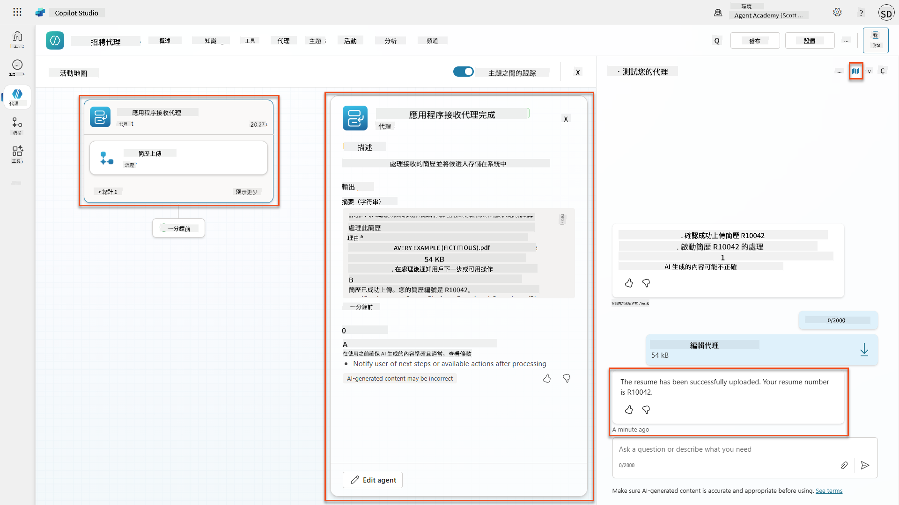

1. 前往 make.powerapps.com → 確保您的環境已在右上角的環境選擇器中選擇。

1. 選擇 **Apps** → Hiring Hub → 省略號(...) 菜單 → **Play**  
    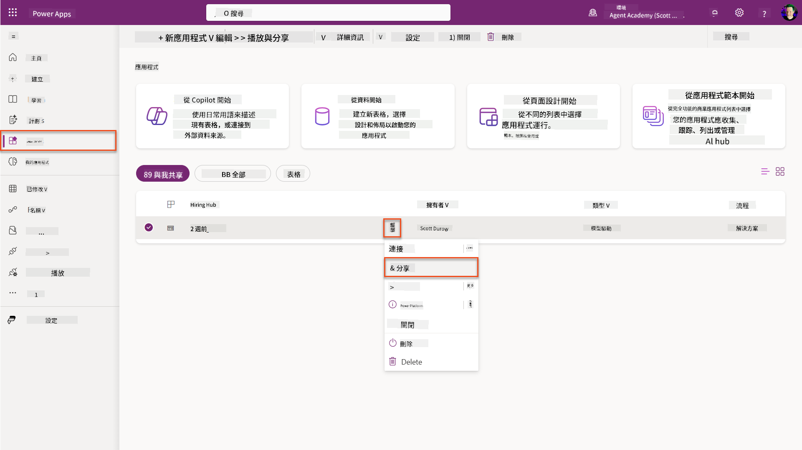

    注意：如果播放按鈕是灰色的，則表示您尚未從 Mission 01 發布您的解決方案。選擇 **Solutions** → **Publish all customizations**。

1. 前往 **Resumes**，檢查履歷文件是否已上傳，並且封面信是否已相應設置。  
    

## 🧪Lab 2.2: 添加面試準備連接代理

現在讓我們創建面試準備的連接代理並將其添加到您現有的 Hiring Agent。

### 2.2.1 創建連接的面試代理

1. **前往** Copilot Studio。確保您的環境仍在右上角的環境選擇器中選擇。

1. 打開您的 **Hiring Agent**

1. 前往 Agent 標籤，選擇 **+ Add an agent**

1. 選擇 **Connect an existing agent** → **Copilot Studio**

1. 選擇 **+ New agent**

### 2.2.2 配置基本設置

1. 選擇 **Configure** 標籤，輸入以下屬性：

    - **Name**: `Interview Agent`
    - **Description**: `協助面試過程。`

1. 指令：

    ```text
    You are the Interview Agent. You help interviewers and hiring managers prepare for interviews. You never contact candidates. 
    Use Knowledge to help with interview preparation. 
    
    The only valid identifiers are:
      - ResumeNumber (ppa_resumenumber)→ format R#####
      - CandidateNumber (ppa_candidatenumber)→ format C#####
      - ApplicationNumber (ppa_applicationnumber)→ format A#####
      - JobRoleNumber (ppa_jobrolenumber)→ format J#####
    
    Examples you handle
      - Give me a summary of ...
      - Help me prepare to interview candidates for the Power Platform Developer role
      - Create interview assistance for the candidates for Power Platform Developer
      - Give targeted questions for Candidate Alex Johnson focusing on the criteria for the Job Application
      
    How to work:
        You are expected to ask clarification questions if required information for queries is not provided
        - If asked for interview help without providing a job role, ask for it
        - If asking for interview questions, ask for the candidate and job role if not provided.
    
    General behavior
    - Do not invent or guess facts
    - Be concise, professional, and evidence-based
    - Map strengths and risks to the highest-weight criteria
    - If data is missing (e.g., no resume), state what is missing and ask for clarification
    - Never address or message a candidate
    ```

1. 切換 **Web Search** 為 **Disabled**

1. 選擇 **Create**  
    

### 2.2.3 配置數據訪問並發布

1. 在 **Knowledge** 部分，選擇 **+ Add knowledge**  
    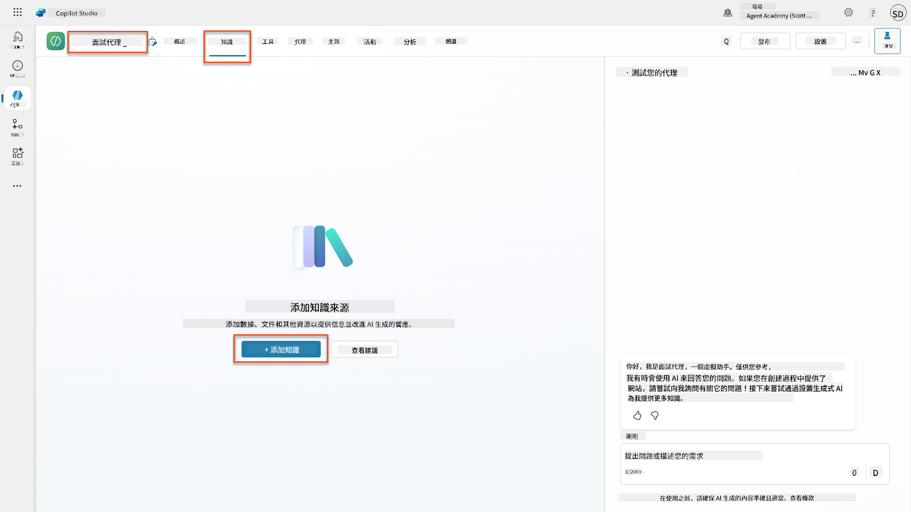
1. 選擇 **Dataverse**  
    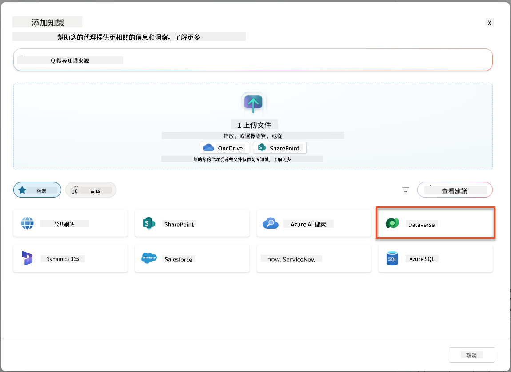
1. 在 **搜索框** 中輸入 `ppa_`。這是您之前導入的表的前綴。
1. **選擇**所有 5 個表 (Candidate, Evaluation Criteria, Job Application, Job Role, Resume)
1. 選擇 **Add to agent**  
    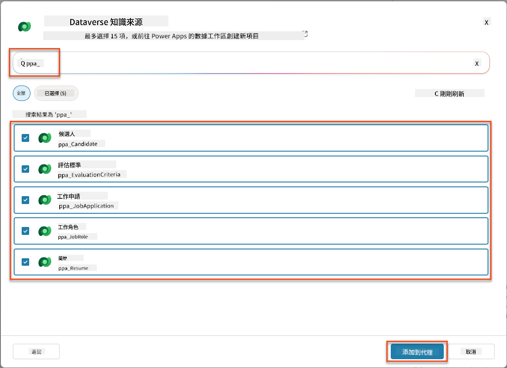
1. 在 Interview Agent 的 **Settings** 中，設置以下設置：

    - **允許其他代理連接並使用此代理：** `On`
    - **使用一般知識：** `Off`
    - **文件上傳：** `Off`
    - **內容審核級別：** `Medium`
1. 選擇 **Save**
1. 選擇 **Publish**，並等待發布完成。

### 2.2.4 將面試準備代理連接到您的 Hiring Agent

1. 返回您的 **Hiring Agent**

1. 選擇 **Agents** 標籤

1. 使用 **+Add an agent** → **Copilot Studio**，添加 **Interview Agent**。將描述設置為：
    ```text
    Assists with the interview process and provides information about Resumes, Candidates, Job Roles, and Evaluation Criteria.
    ```

    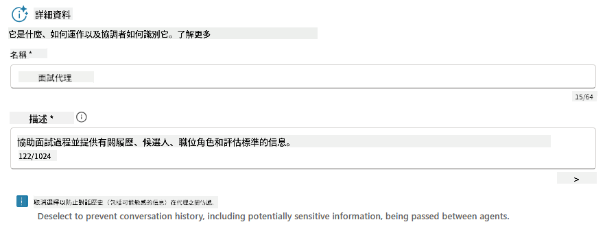
    注意，「將對話歷史記錄傳遞給此代理」已被勾選。這允許主代理向已連接的代理提供完整的上下文。

1. 選擇 **新增代理**

1. 確保您能看到 **Application Intake Agent** 和 **Interview Agent**。注意其中一個是子代理，另一個是已連接的代理。  
    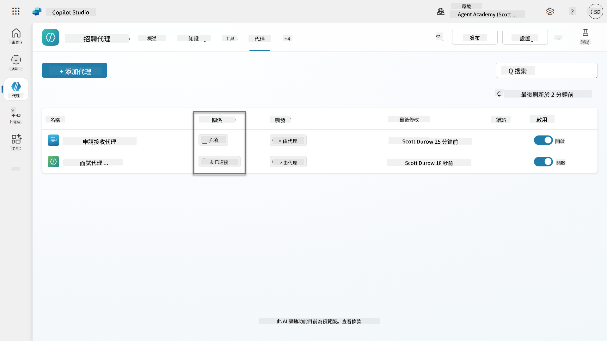

### 2.2.5 測試多代理協作

1. **切換**測試面板，選擇 **測試** 打開。

1. **上傳**其中一份測試履歷，並輸入以下描述，告訴主代理它可以將哪些任務委派給已連接的代理：

    ```text
    Upload this resume, then show me open job roles, each with a description of the evaluation criteria, then use this to match the resume to at least one suitable job role even if not a perfect match.
    ```

    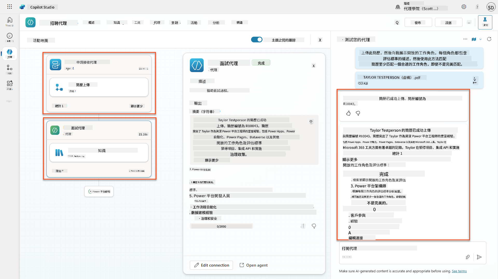

1. 注意招聘代理如何將上傳任務委派給子代理，然後要求面試代理使用其知識提供摘要和職位匹配。
   嘗試用不同方式詢問有關履歷、職位和評估標準的問題。
   **範例：**

    ```text
    Give me a summary of active resumes
    ```

    ```text
    Summarize resume R10044
    ```

    ```text
    Which active resumes are suitable for the Power Platform Developer role?
    ```

## 🎉 任務完成

幹得好，代理！**交響曲行動**現已完成。您已成功將單一招聘代理轉變為具有專業能力的多代理協作系統。

以下是您在此任務中完成的內容：

**✅ 掌握多代理架構**  
您現在了解何時使用子代理與已連接代理，以及如何設計可擴展的系統。

**✅ Application Intake 子代理**  
您已為招聘代理新增了一個專門的子代理，負責處理履歷、提取候選人數據並將信息存儲在 Dataverse 中。

**✅ Interview Prep 已連接代理**  
您已建立一個可重用的面試準備已連接代理，並成功將其連接到您的招聘代理。

**✅ 代理之間的溝通**  
您已看到主代理如何與專業代理協作、共享上下文並協調複雜的工作流程。

**✅ 自主性的基礎**  
您增強的招聘系統現在已準備好迎接我們即將在後續任務中添加的高級功能：自主觸發器、內容審核和深度推理。

🚀**下一步：** 在下一個任務中，您將學習如何配置代理以自主處理來自電子郵件的履歷！

⏩[前往任務 03：使用觸發器自動化您的代理](../03-automate-triggers/README.md)

## 📚 戰術資源

📖 [新增其他代理（預覽）](https://learn.microsoft.com/microsoft-copilot-studio/authoring-add-other-agents?WT.mc_id=power-182762-scottdurow)

📖 [向自定義代理新增工具](https://learn.microsoft.com/microsoft-copilot-studio/advanced-plugin-actions?WT.mc_id=power-182762-scottdurow)

📖 [在 Copilot Studio 中使用 Dataverse](https://learn.microsoft.com/microsoft-copilot-studio/knowledge-add-dataverse?WT.mc_id=power-182762-scottdurow)

📖 [代理流程概述](https://learn.microsoft.com/microsoft-copilot-studio/flows-overview?WT.mc_id=power-182762-scottdurow)

📖 [建立解決方案](https://learn.microsoft.com/power-platform/alm/solution-concepts-alm?WT.mc_id=power-182762-scottdurow)

📖 [Power Platform 解決方案 ALM 指南](https://learn.microsoft.com/power-platform/alm/overview-alm?WT.mc_id=power-182762-scottdurow)

📺 [Copilot Studio 中的代理間協作](https://youtu.be/d-oD3pApHAg?si=rwIHKhJTkjSvhTHw)

---

**免責聲明**：  
此文件已使用人工智能翻譯服務 [Co-op Translator](https://github.com/Azure/co-op-translator) 進行翻譯。儘管我們致力於提供準確的翻譯，但請注意，自動翻譯可能包含錯誤或不準確之處。原始文件的母語版本應被視為權威來源。對於重要信息，建議使用專業人工翻譯。我們對因使用此翻譯而引起的任何誤解或誤釋不承擔責任。