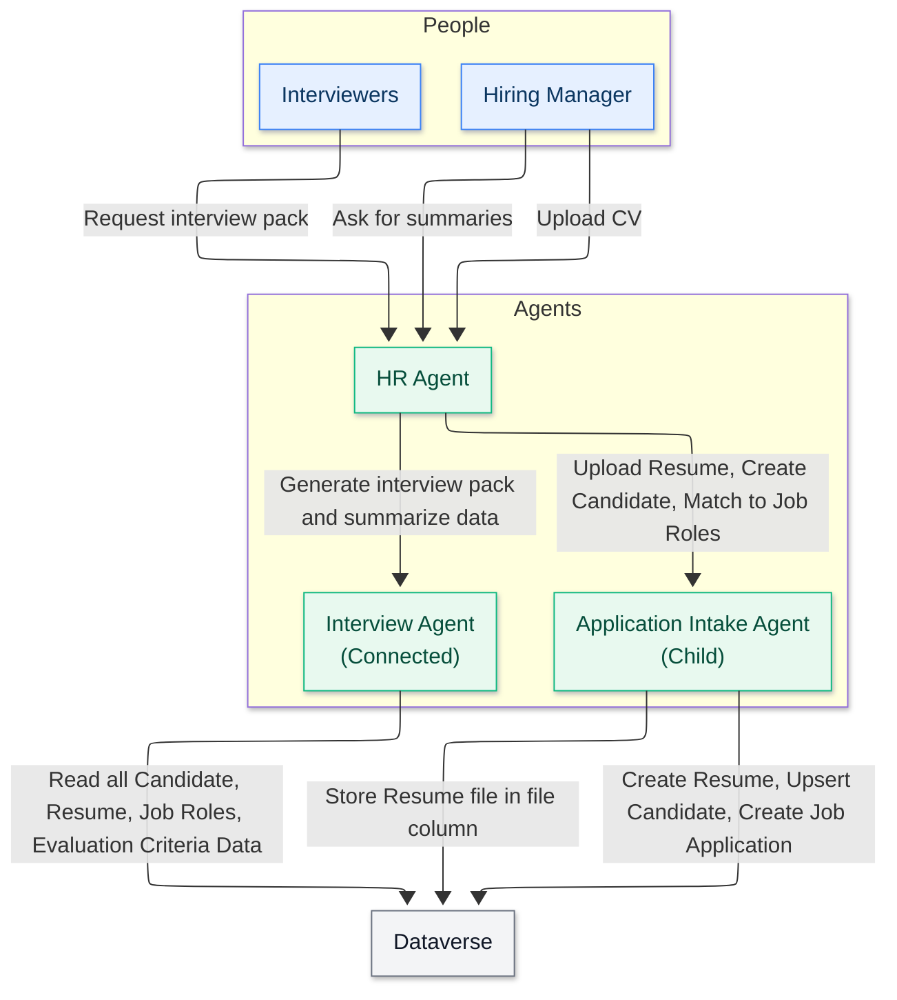

<!--
CO_OP_TRANSLATOR_METADATA:
{
  "original_hash": "02c15421de88efe63b32ca403c366f86",
  "translation_date": "2025-10-21T23:51:48+00:00",
  "source_file": "docs/operative-preview/02-multi-agent/assets/connected-agents-diagram.md",
  "language_code": "hk"
}
-->
# 連接代理圖表

---

**免責聲明**：  
此文件已使用人工智能翻譯服務 [Co-op Translator](https://github.com/Azure/co-op-translator) 進行翻譯。儘管我們致力於提供準確的翻譯，但請注意，自動翻譯可能包含錯誤或不準確之處。原始文件的母語版本應被視為權威來源。對於關鍵信息，建議使用專業人工翻譯。我們對因使用此翻譯而引起的任何誤解或誤釋不承擔責任。