<!--
CO_OP_TRANSLATOR_METADATA:
{
  "original_hash": "75efaf515d5694d4fd549bfd6518901a",
  "translation_date": "2025-10-22T00:18:15+00:00",
  "source_file": "docs/operative-preview/03-automate-triggers/README.md",
  "language_code": "hk"
}
-->
# 任務 03：新增事件觸發器以自主行動

--8<-- "disclaimer.md"

## 🕵️‍♂️ 行動代號：`信號點行動`

> **⏱️ 行動時間窗口：** `~45 分鐘`

## 🎯 任務簡介

歡迎回來，特工。在 [任務 02](../02-multi-agent/README.md) 中，你學會了如何建立應用程序接收子代理和面試準備連接代理，以擴展你的主要招聘代理的功能。

你的任務，若你選擇接受，就是 **信號點行動**——深入研究 **事件觸發器**，將你的代理系統從被動提升到 **自主運作**。你將把代理從等待人類輸入轉變為主動響應外部事件並在無需監督的情況下採取智能行動。

想像一下，從回答問題的代理升級到預測需求並獨立行動的代理。通過事件觸發器和自動化工作流程，你的招聘代理將能檢測到收到的簡歷郵件，自動處理附件，將數據存儲到 Dataverse，並通過 Microsoft Teams 通知你的 HR 招聘團隊——而你可以專注於更高價值的任務。

歡迎來到自動化與智能結合的世界。

## 🔎 目標

在這次任務中，你將學習：

1. 如何使用事件觸發器實現代理的自主行為，無需用戶交互
1. 在 Copilot Studio 中互動代理和自主代理的區別
1. 如何創建事件觸發器，自動處理電子郵件附件並將文件上傳到 Dataverse
1. 如何構建代理流程，將自適應卡片發佈到 Teams 頻道進行通知
1. 如何在事件觸發器和代理流程之間傳遞數據，實現端到端自動化

## 🤔 什麼是事件觸發器？

在之前的 [Recruit](../../recruit/10-add-event-triggers/README.md) 中，我們學習了事件觸發器。如果你錯過了，我們來快速回顧一下。

**事件觸發器** 讓代理在另一個系統中發生某些事情時能夠自主行動——不需要用戶消息。當配置的事件觸發時，例如“新增 SharePoint 項目”、“收到新郵件”、“分配了 Planner 任務”或基於時間的定期事件，連接器會向你的代理發送觸發器負載。然後代理根據你的指示決定要調用哪些操作或主題。

### 主要特徵

- **自主激活：**
      - 不同於用戶輸入啟動的主題觸發器，事件觸發器由外部事件觸發，實現主動行為。

- **基於負載：**
      - 每個事件通過連接器傳遞負載（變量 + 可選指令）。代理使用你定義的指令和負載來選擇下一步的操作。
      - 例如，_調用主題_ 或 _執行工具定義的操作_。

- **現成的示例：**
      - SharePoint/OneDrive 文件或項目創建
      - Planner 任務完成/分配
      - Microsoft Forms 回應提交
      - 定期/計劃

    可用性取決於你的組織在 Power Automate 中配置的數據政策。

- **需要生成式編排：**
      - 事件觸發器僅在代理啟用了生成式編排時可用。

- **計費/使用：**
      - 每次觸發器交付都計入 Copilot Studio 容量的消息。
      - 例如，每 10 分鐘的定期觸發會每 10 分鐘發送一條消息。

- **身份驗證模型和設置：**
      - 你可以在代理的概覽中添加觸發器，位於 _Triggers_ 下。觸發器連接器的身份驗證使用代理創建者的帳戶（“代理作者身份驗證”）。
      - 你可以在 Power Automate 創建者門戶中編輯觸發器參數和負載。

- **測試與可觀察性：**
      - 你可以從代理的測試面板測試觸發器，並在發布前使用活動地圖檢查行為。

!!! info "給開發者的簡要說明"

    將事件觸發器視為 **類似 webhook 的信號**，它將結構化的負載推送到你的代理，讓代理能夠 _啟動_ 工作並在系統之間鏈接操作——無需等待用戶的請求。

### 主題觸發器 - 它們有何不同

之前你在 [Recruit](../../recruit/07-add-new-topic-with-trigger/README.md) 中學習了主題觸發器，但你可能仍然想知道 _主題_ 觸發器與 _事件_ 觸發器有何不同，以及為什麼這種區別對理解代理的自主性至關重要。

主題觸發器控制 _主題何時運行_，通常是響應用戶消息。

- 在生成式編排中，默認觸發器是 **由代理**——規劃器選擇名稱/描述最符合用戶消息的主題。
- 在經典編排中，默認是 **短語**——規劃器選擇一個或多個觸發短語最符合用戶消息的主題。

其他觸發類型包括 `收到消息`、`收到事件`、`收到活動`、`會話更新`、`收到調用`、`重定向`、`不活躍` 和 `計劃完成`。

!!! info "核心區別"

    主題觸發器是聊天中的 _對話活動_ 啟動器。
    
    事件觸發器是系統通過連接器傳遞的 _事件_ 啟動器，可以在完全沒有對話的情況下運行代理。

### 主題觸發器與事件觸發器的快速指南

- **主題觸發器：** 用戶（或聊天活動）說/做了 X ➡️ 運行主題 T。
- **事件觸發器：** SharePoint/Planner/Email/Timer 發送了負載 P ➡️ 代理評估指令 ➡️ 根據情況調用操作/主題。

## 🏓 互動代理與自主代理 - 比較

現在你已經了解了事件觸發器和主題觸發器的區別，接下來我們來學習互動代理與自主代理的差異。

在 Copilot Studio 中，“互動”指主要通過聊天或頻道中的 **主題** 進行交互的代理。“自主”指也利用 **事件觸發器** 在無需用戶輸入的情況下運行的代理。

以下表格總結了它們的差異和相似之處。

| 維度                               | 互動代理               | 自主代理                                                                                              |
|-------------------------------------|-----------------------|-------------------------------------------------------------------------------------------------------|
| 如何啟動                           | 用戶（或聊天活動）觸發主題。例如：由代理、短語、收到消息。   | 外部事件觸發器通過連接器向代理發送負載。例如：SharePoint、Planner、電子郵件、計劃等。 |
| 主要用途                           | 問答、引導式工作流程、聊天中的請求驅動操作——Teams、網頁等。  | 主動操作和背景自動化——響應系統變更，然後通知、存檔或編排任務。 |
| 觸發表面                           | 主題觸發器：由代理 / 短語 / 收到消息 / 活動類型 / 調用 / 不活躍 / 計劃完成 | 事件觸發器庫通過連接器；負載包括事件數據 + 可選指令。 |
| 規劃器（生成式編排）               | 強烈依賴於由代理和計劃完成觸發器來選擇/排序主題。 | 事件觸發器需要；代理使用指令 + 負載來決定調用哪些操作/主題。 |
| 典型示例                           | 用戶詢問“我們的退款政策是什麼？” → 主題運行，查詢知識，回應。 | 新的 Planner 任務分配 → 事件觸發器啟動 → 代理發 Teams 消息、更新記錄或調用主題。 |
| 設置路徑                           | 創建主題，定義觸發類型，編寫對話/操作；發佈到頻道。 | 添加事件觸發器（概覽 → Triggers），使用代理作者憑證進行連接器身份驗證，配置負載/指令；通過測試面板測試；發佈。 |
| 身份驗證與治理                     | 在頻道/身份驗證上下文中運行；主題觸發器響應允許頻道中的聊天活動。 | 觸發器的可用性取決於 Power Automate 數據政策；連接器在代理創建者的帳戶下運行。 |
| 可觀察性                           | 在 Copilot Studio 中測試主題，檢查對話記錄/活動。 | 使用測試觸發器和活動地圖在發佈前驗證執行，發佈後監控活動。 |
| 容量影響                           | 每次用戶消息/代理回應都消耗容量消息。 | 每次事件交付也是一條消息，加上任何後續操作。例如：10 分鐘的定期觸發 = 每小時 6 條消息 |

### 什麼時候使用哪一種？

- 當用戶啟動代理對話時選擇 **主題觸發器（互動）**——FAQ、引導式接收或聊天中的命令式任務。規劃器的由代理觸發器減少了手動短語策劃。
- 當代理應該啟動對話或自行採取行動時添加 **事件觸發器（自主）**——例如在 SharePoint/Dataverse 中的更新、收到的電子郵件或計劃。這將你從被動操作轉變為主動操作。

## 開發者提示與注意事項

1. **啟用生成式編排** 對於任何你希望使其自主的代理。否則事件觸發器不會顯示。

1. **提前建模負載。** 決定代理需要的觸發器最少字段，例如 `itemId`、`assignedTo`、`dueDate`，並添加簡潔的指令，告訴代理根據負載值調用哪些操作/主題。

1. **身份驗證範圍很重要。** 觸發器使用代理創建者的帳戶進行身份驗證。確保該帳戶擁有正確的連接器權限並符合 Power Automate 數據政策。

1. **控制成本和噪音。** 高頻率的定期觸發或非常頻繁的來源可能會迅速增加消息消耗——盡可能進行節流或在觸發器中添加條件以過濾事件。

1. **在發佈前測試。** 使用 **測試觸發器** 和活動地圖觀察計劃和調用的操作——迭代指令/負載直到行為穩定。

## 🧪 實驗室 03 - 自動化處理候選人申請郵件

接下來我們將向 **招聘代理** 添加事件觸發器，並在子代理 **應用程序接收代理** 中構建代理流程，以進一步處理實現自主性。

### ✨ 使用場景

!!! info ""

    **作為** HR 招聘人員

    **我希望** 當收到包含簡歷的電子郵件並自動上傳到 Dataverse 時能收到通知

    **以便** 我能夠隨時了解通過電子郵件發送的申請簡歷已自動上傳到 Dataverse

我們將通過以下兩種技術來實現：

1. 當電子郵件到達時的事件觸發器，
    1. 檢查文件的 `contentType` 是否為 `PDF` 格式。
    1. 提取文件並通過 Dataverse 連接器的操作上傳到 Dataverse。
    1. 然後通過事件觸發器的輸入參數向代理發送提示以進一步處理。

1. 在子代理 **應用程序接收代理** 中添加代理流程，該流程由事件觸發器中的提示調用。
    1. 使用事件觸發器提示中傳遞的輸入參數，將自適應卡片發佈到 Microsoft Teams 的頻道，通知 HR 招聘團隊。自適應卡片將包含指向 Dataverse 中行的鏈接，該行將在 **招聘代理** 中查看。

讓我們開始吧！

### ✨ 完成此任務的先決條件

你需要 **以下其中之一**：

- **完成任務 01 和任務 02**，並準備好你的招聘代理，**或者**
- **導入任務 03 起始解決方案**，如果你是從頭開始或需要補課。[下載任務 03 起始解決方案](https://aka.ms/agent-academy)

!!! note "解決方案導入和示例數據"
    如果你使用起始解決方案，請參考 [任務 01](../01-get-started/README.md) 了解如何將解決方案和示例數據導入到你的環境。

你還需要訪問 **Microsoft Teams** 以完成第二個實驗室練習，將自適應卡片發佈到 Microsoft Teams。

### 實驗室 3.1 - 自動化上傳收到的簡歷到 Dataverse

1. 在招聘代理中，向下滾動到 **概覽標籤**，選擇 **+ 添加觸發器**。

       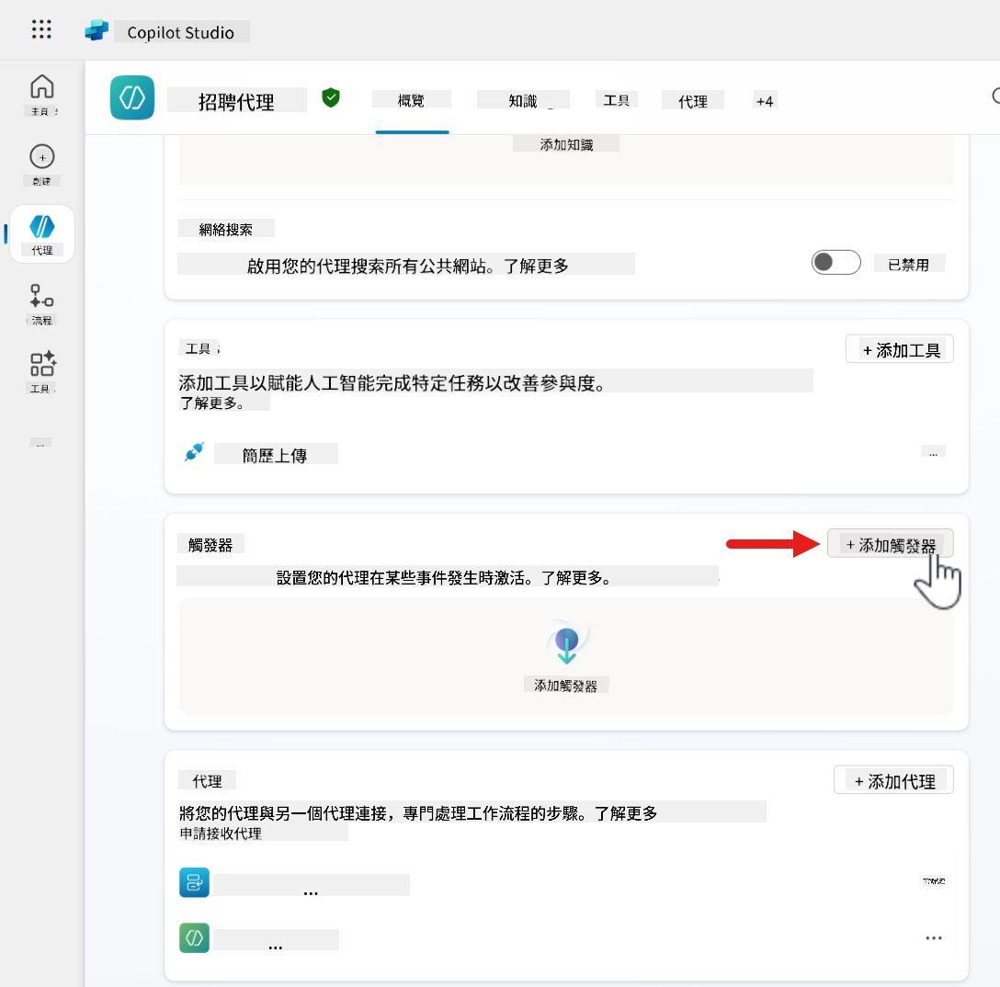

1. 觸發器列表將出現。選擇 **當收到新郵件 (V3)**，然後選擇 **下一步**。

       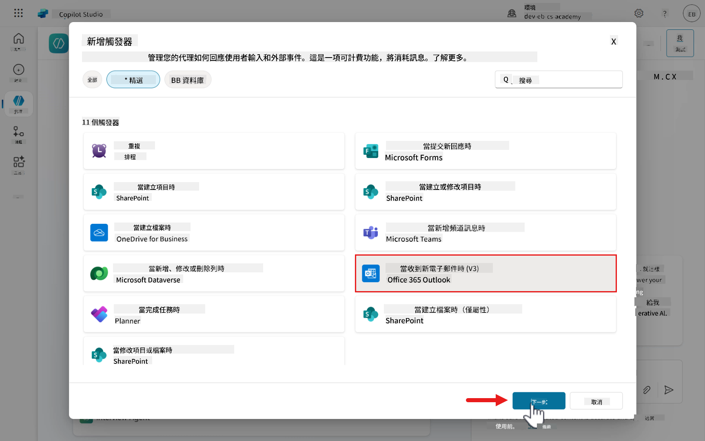

1. 我們現在會看到 **觸發器名稱** 和應用程序的 **登錄** 連接參考。

       將觸發器名稱重命名為以下內容：
    
       ```text
       當收到來自申請者的新郵件
       ```

       確保每個應用程序的連接參考旁邊都有綠色勾號。如果沒有看到綠色勾號，請通過省略號（...）登錄並選擇 **+ 新建連接參考** 以創建新的連接參考。

       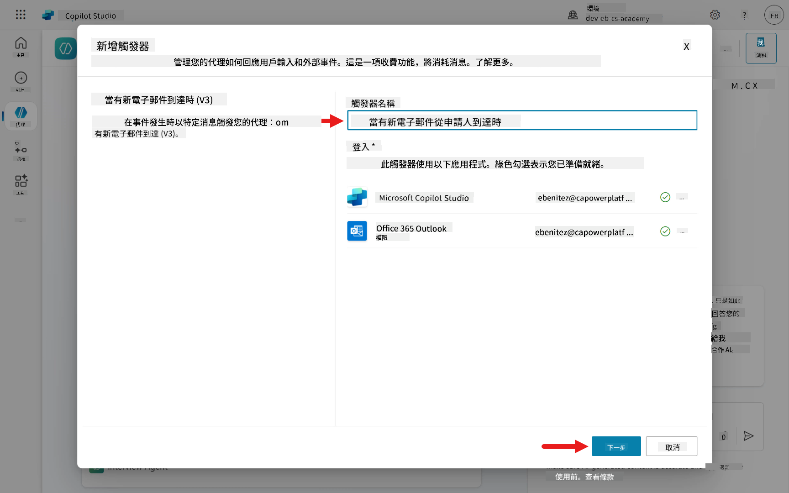

1. 最後一步是設置觸發器的輸入屬性。將以下屬性更新為以下內容：

     | 屬性 | 設置方式 | 詳細信息 |
     |------|----------|----------|
     | **包含附件（可選）** | 下拉選單 | 是 |
     | **主題篩選（可選）** | 鍵入/輸入 | Application |
     | **僅包含附件（可選）** | 下拉選單 | 是 |

       選擇 **創建觸發器**。

       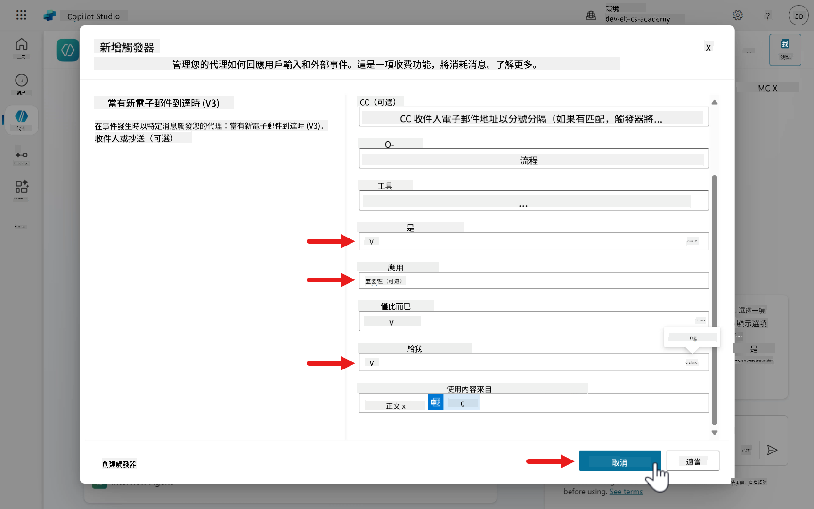

1. 創建完成後，將出現確認消息，表示觸發器已添加到代理中。選擇 **關閉**，觸發器將列在 **觸發器** 部分中。
現在我們要更新事件觸發器，增加更多自動化功能。選擇觸發器旁邊的 **省略號 (...)**，然後選擇 **在 Power Automate 中編輯**。

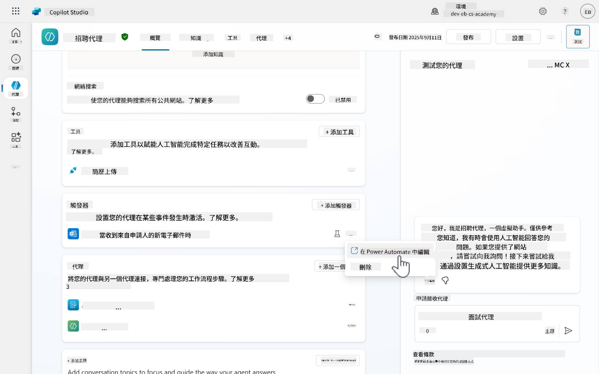

1. 觸發器將作為流程在 Power Automate 製作門戶中加載。您現在看到的是 Power Automate 製作門戶中的流程設計器。在這裡，我們可以添加更多邏輯和操作以實現更高的自動化。觸發器將顯示在頂部，流程的最後一個操作是 **向指定的 Copilot 發送提示進行處理**。


1. 默認情況下，Power Automate 中的 **當新電子郵件到達時** 觸發器可能會一次處理多封電子郵件，如果多封電子郵件同時到達，流程只會為這批電子郵件運行一次。

為了確保流程為每封電子郵件分別運行，請在觸發器的設置中啟用 **Split On** 設置，並在下拉框的數組字段中選擇 `@triggerOutputs()?['body/value']`。

啟用 **Split On** 並將數組字段設置為 `@triggerOutputs()?['body/value']` 後，即使多封電子郵件同時到達，流程也會為每封郵件單獨運行。

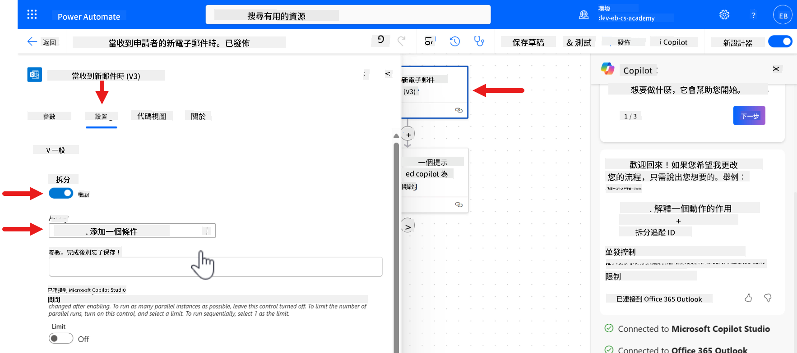

1. 接下來，我們添加一些邏輯來檢查附件的文件類型。我們只希望上傳 .PDF 文件附件，而不是圖片（這些可能來自電子郵件簽名）。選擇觸發器下方的 **+** 圖標，然後在 **內建工具** 部分中選擇 **控制**。

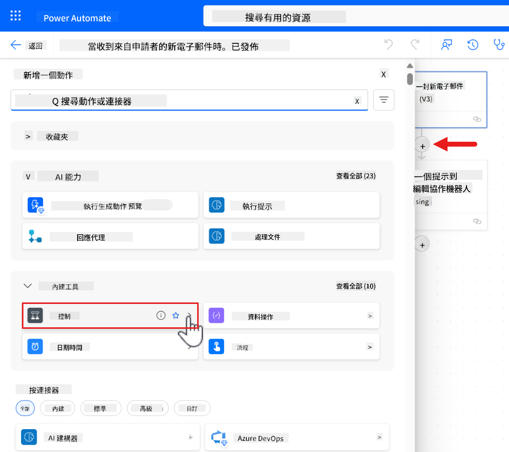

1. 選擇 **條件** 操作。

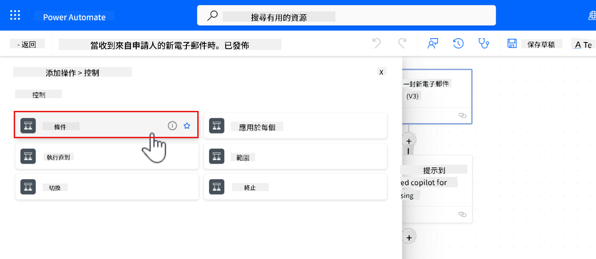

1. 現在我們配置條件以檢查文件附件的類型是否為 .PDF。在 **選擇值** 字段中，選擇右側的 **閃電圖標** 或 **fx 圖標**。

   1. 在 **搜索** 字段中輸入以下內容：

      ```text
      content type
      ```

   1. 然後從觸發器中選擇 **Attachments Content-Type** 參數。

   1. 接下來，選擇 **添加**，將動態內容輸入添加到操作的 **Id** 參數中。

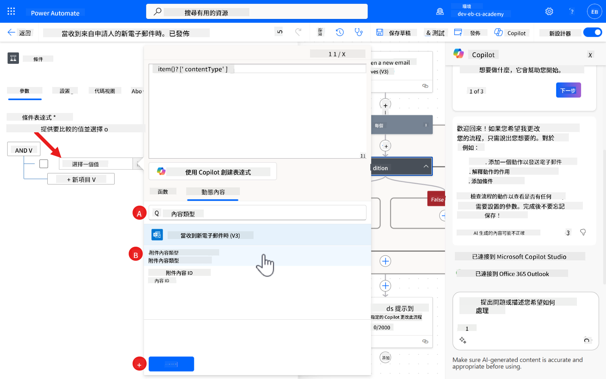

1. 我們先暫停一下，您可能已經注意到 **For each** 操作自動出現了。

選擇 **For each** 操作。此操作表示循環處理電子郵件中的每個附件，因為觸發器中的 **Attachments Content-Type** 參數與每個附件相關聯。

在底層，它是一個數組，這就是為什麼當我們在 **條件** 操作中選擇 **Attachments Content-Type** 參數時，**For each** 操作會自動添加。

要了解更多，請展開以下額外學習區塊。

??? info "額外學習：For each 操作自動出現"

🤔 **為什麼 "Apply to each" 或 "For each" 會自動出現？**

當您選擇代表列表或數組的參數（動態內容）時，例如附件列表、電子郵件或行，Power Automate 會識別您可能希望單獨處理每個項目。

為了幫助您完成此操作，Power Automate 自動在您的操作周圍添加 **“Apply to each”**（或 **For each**）循環。這確保您的操作將針對列表中的每個項目運行一次，而不是試圖一次處理整個列表（這可能會導致錯誤）。

🦋 **示例**

- 如果您選擇來自上一個操作的 "Attachments"（它是一個數組），並嘗試在期望單個文件的操作中使用它，Power Automate 會將您的操作包裹在 **"Apply to each"**（或 **For each**）循環中。
- 這樣，您的操作將針對 **每個附件** 運行——一次一個。

💡 **關鍵點**

- **自動化：** 循環自動出現以幫助您處理集合中的每個項目。
- **防止錯誤：** 沒有循環，您的操作可能會失敗，因為它無法一次處理多個項目。
- **可視化提示：** 它是一種可視化方式，顯示您的流程將針對列表中的每個項目重複操作。

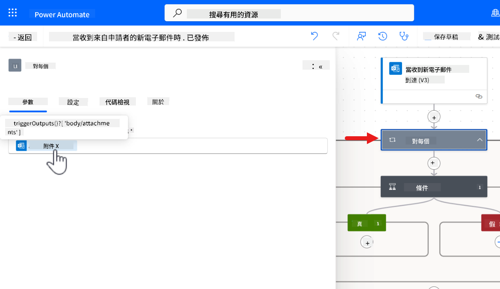

1. 接下來，在另一個 **選擇值** 字段中，輸入以下內容：

   ```text
   application/pdf
   ```

   這將確保對於每個文件附件，它會檢查文件擴展名格式是否為 .PDF。

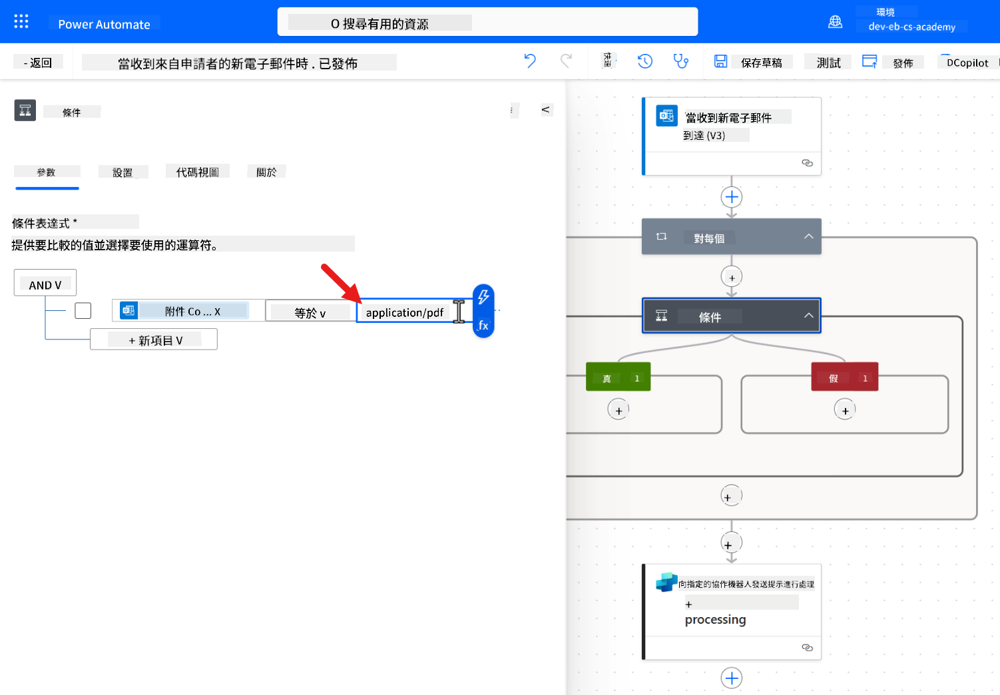

1. 現在我們將配置 **True** 路徑，從電子郵件中提取文件並將其上傳到 **Resume** Dataverse 表中。

在 **True** 路徑下添加一個新操作，然後搜索 `html to text`。選擇 **Html to text** 操作。

要了解更多關於 **Html to text** 操作的信息，請展開以下額外學習區塊。

??? info "額外學習：Html to text 操作"

🤔 **什麼是 "HTML to text" 操作？**

**HTML to text** 操作在 Power Automate 中用於將 HTML 格式的內容轉換為純文本。這在您接收到包含 HTML 標籤的數據（例如電子郵件、網頁內容或 API 響應）時特別有用，您希望提取僅可讀的文本而不包含任何格式或代碼。

⚙️ **它如何工作？**

- **輸入：** 您提供一段 HTML 內容（例如電子郵件正文）。
- **輸出：** 該操作移除所有 HTML 標籤，僅返回純文本。

👍🏻 **什麼時候應該使用它？**

- 當您希望從包含 HTML 的電子郵件、網頁或 API 響應中提取可讀文本時。
- 在將內容發送到不支持 HTML 格式的系統（例如 SMS、Teams 消息或數據庫）之前。
- 用於清理數據以進一步處理或分析。

🔭 **在哪裡可以找到它？**

- 在 Power Automate 的 Agent Flows 中，搜索名為 `HTML to text` 的操作。它位於 **數據操作** 連接器下。

💡 **關鍵點**

- 它移除所有 HTML 標籤，只留下文本。
- 它不解釋或執行腳本/樣式——僅移除標籤。
- 用於數據清理和準備內容以進行純文本輸出。

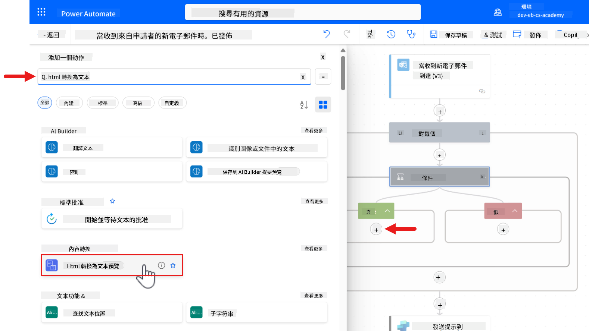

1. 接下來，我們需要為 **Html to text** 操作創建一個新的連接引用，選擇 **添加新**。

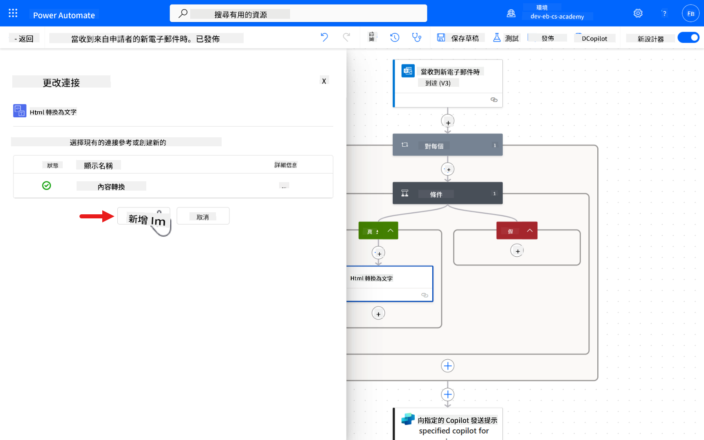

1. 現在可以配置該操作。讓我們添加觸發器中的 **Body** 參數。在 **內容** 字段中，選擇右側的 **閃電圖標** 或 **fx 圖標**。

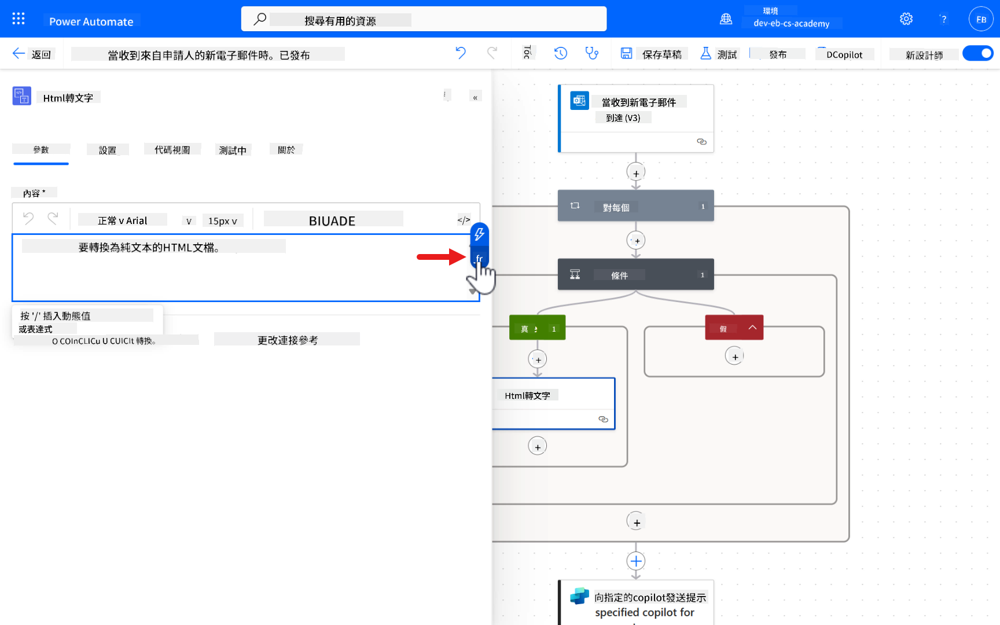

1. 在 **動態內容** 標籤中，搜索 `body` 並選擇 **Body** 參數，然後選擇 **添加**。

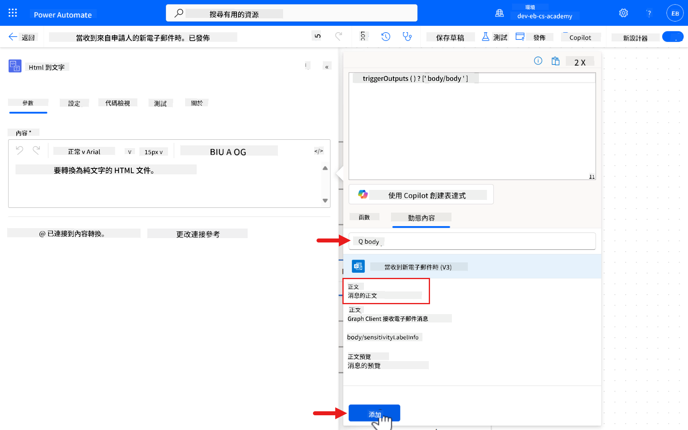

1. 我們已完成配置此操作，因此選擇指向左側的兩個角括號（«）以折疊面板退出操作。

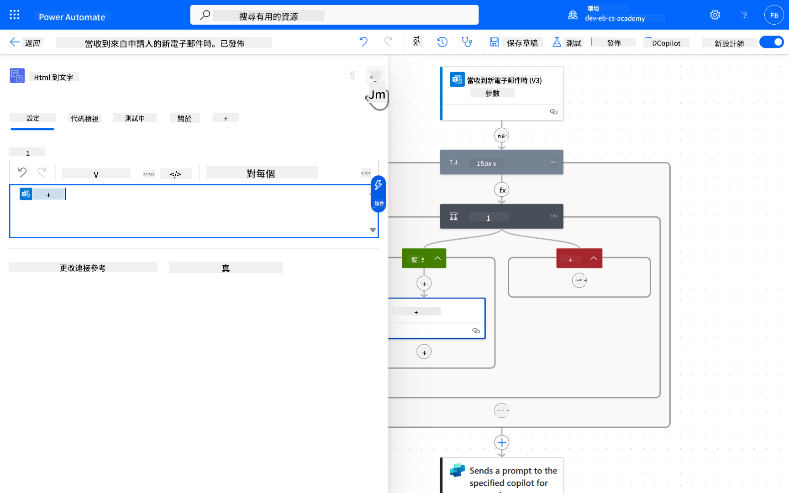

1. 我們將通過選擇 **Html to text** 操作下方的 **+ 圖標** 添加新操作，這將加載添加操作的面板。選擇 **Microsoft Dataverse** 連接器。

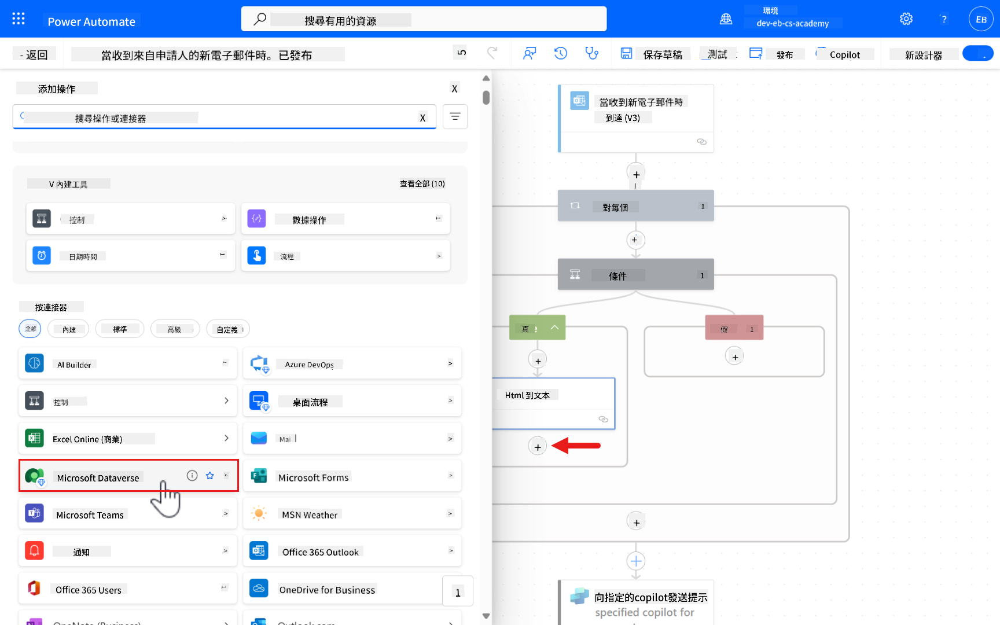

1. 選擇 **添加新行** 操作。

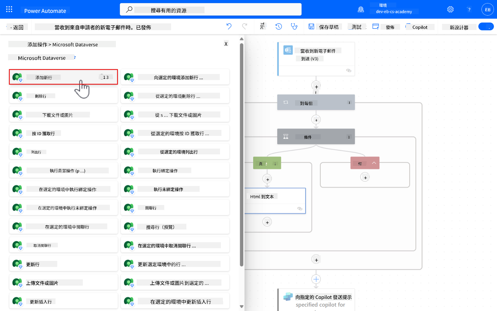

1. 通過選擇 **省略號 (...)** 重命名操作，複製並粘貼以下內容作為名稱：

```text
添加新的 Resume 行
```

在 **表名** 參數中，搜索 `res` 並選擇 **Resumes** 表。

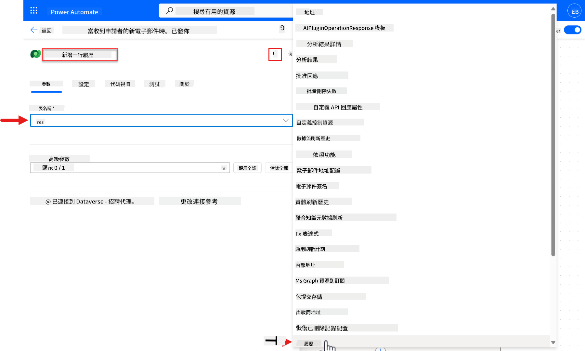

1. 接下來選擇 **Resume Title** 字段，並選擇右側的 **閃電圖標** 或 **fx 圖標**。

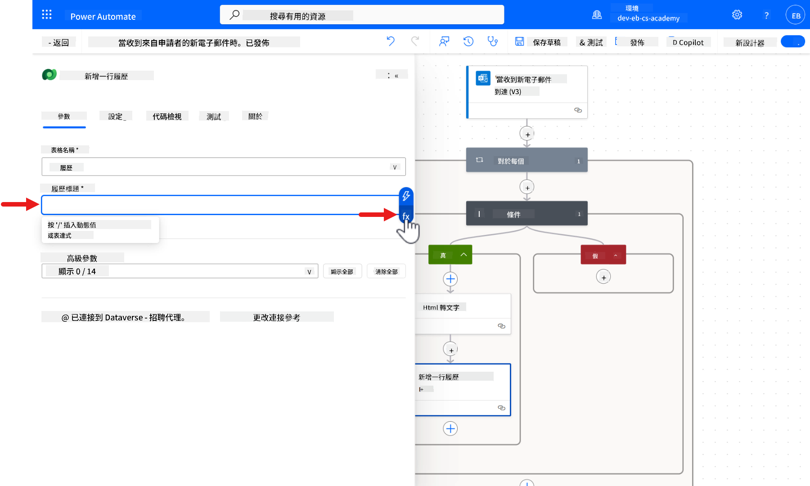

1. 在 **函數標籤** 中，輸入以下使用 `item()` 函數的表達式：

```text
item()?['name']
```

要了解更多關於 `item()` 函數的信息，請展開以下額外學習區塊。

??? info "額外學習：`item()` 函數"

🤔 **什麼是 `item()` 函數？**

- 當您使用 **Apply to each** 操作時，Power Automate 會遍歷集合（數組）中的每個元素。
- 它最常用於 **Apply to each**（或 **For each**）、**Select** 或 **Filter array** 等操作中。

⚙️ **它如何工作？**

- `item()` 是一個函數，返回當前正在循環或數組操作中處理的項目。
- 在該循環中，`item()` 指的是正在處理的 _當前元素_。

📌 **在哪裡使用它？**

- **Apply to each：** 訪問當前項目的屬性。
- **Select：** 轉換數組中的每個項目。
- **Filter array：** 引用正在評估的當前項目。

🦋 **示例**

- 循環中的表達式：
       -  `item()?['Email']`
- 這將獲取當前項目的 `Email` 屬性。

💡 **關鍵點**

- `item()` 是 _上下文敏感的_：它始終指向您所在循環或數組操作中的當前項目。
- 如果您嵌套循環，可以使用 `items('LoopName')` 引用特定循環中的項目。

選擇 **添加**，將表達式添加到 **Resume Title** 參數。

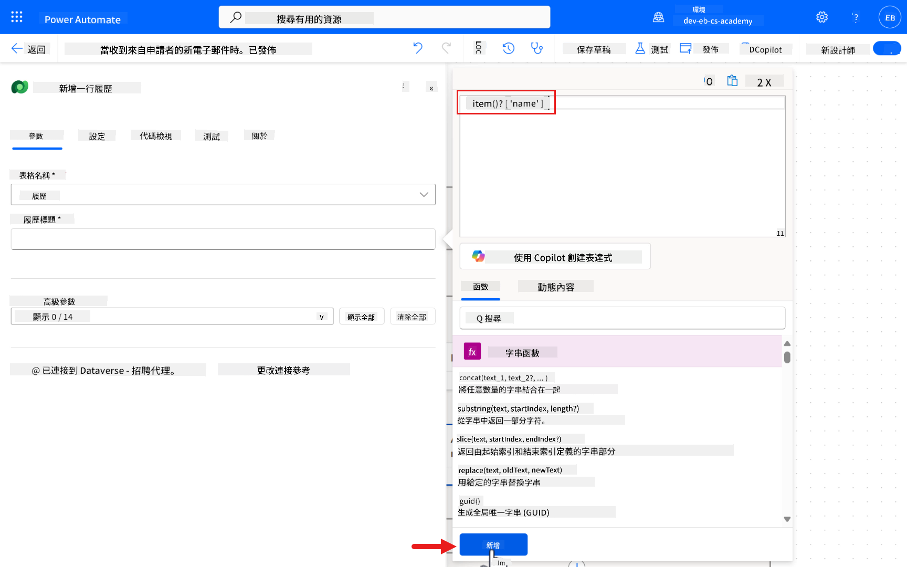

1. 我們仍需配置幾個參數，選擇 **顯示全部**，在 **Cover Letter** 字段中，選擇右側的 **閃電圖標** 或 **fx 圖標**。

在 **函數標籤** 中，輸入以下表達式，使用之前 [任務](../02-multi-agent/README.md) 中的相同表達式：

```text
if(greater(length(body('Html_to_text')), 2000), substring(body('Html_to_text'), 0, 2000), body('Html_to_text'))
```

此表達式檢查來自 **Html to text** 操作的 _文本_ 是否超過 2000 個字符，如果是，則僅返回前 2000 個字符；否則返回完整文本。

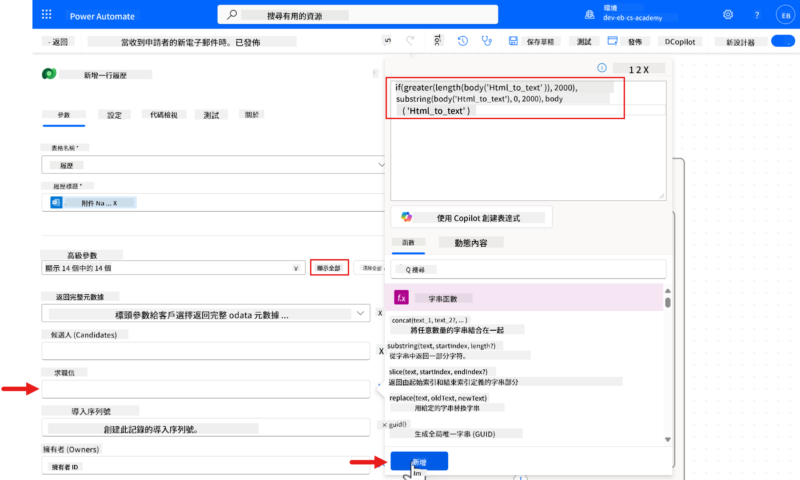

1. 表達式現在已添加到 **Cover Letter** 字段。

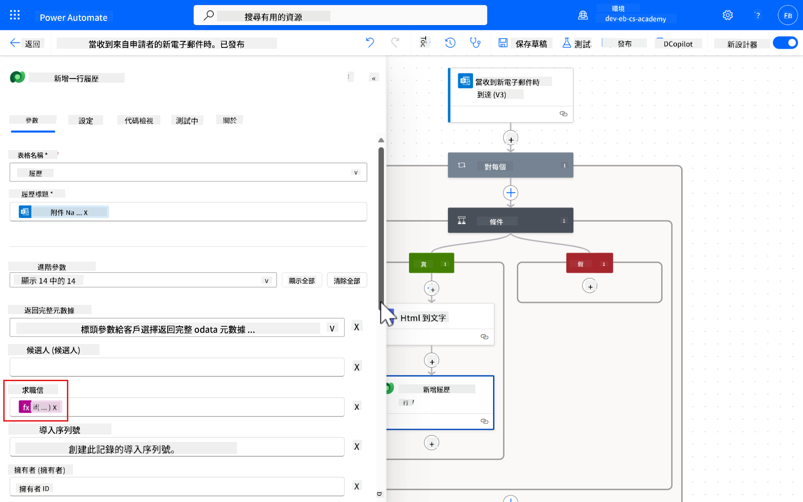

1. 對於 **Source Email Address** 字段，搜索 `from` 並選擇觸發器中的 **From** 參數，因為它包含電子郵件地址值。

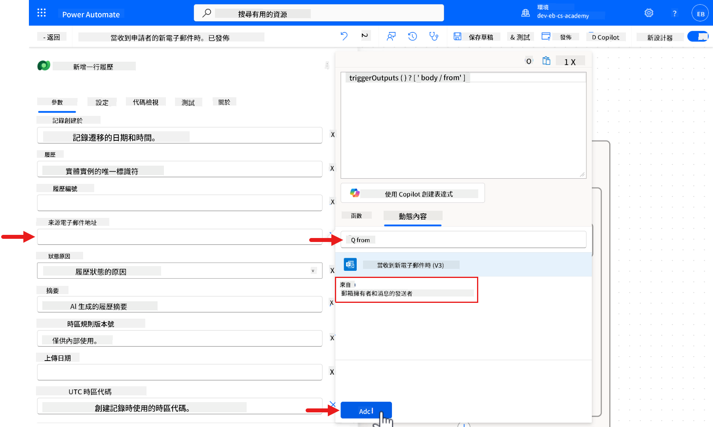

1. 對於 **Upload Date** 字段，選擇右側的 **閃電圖標** 或 **fx 圖標**。在 **函數標籤** 中，輸入以下使用 `utcNow()` 函數的表達式：

```text
utcNow()
```

要了解更多關於 `utcNow` 函數的信息，請展開以下額外學習區塊。

??? info "額外學習：`utcNow` 函數"

🤔 **什麼是 `utcNow()` 函數？**

- Power Automate 中的 `utcNow()` 函數返回當前日期和時間（以協調世界時 UTC）並以 ISO 8601 格式顯示，例如：`2025-09-23T04:32:14Z`

🦋 **示例**

- 表達式：
       -  `concat('報告生成於 ', utcNow())`
- 輸出為：
       - 報告生成於 `2025-09-23T04:32:14Z`

💡 **關鍵點**
- **不需要任何參數（輸入參數）：** 它總是返回當前的 UTC 時間戳。
   - **使用場景**
       - 為日誌或文件名添加時間戳
       - 與其他日期比較當前時間
       - 排程或基於時間的條件

   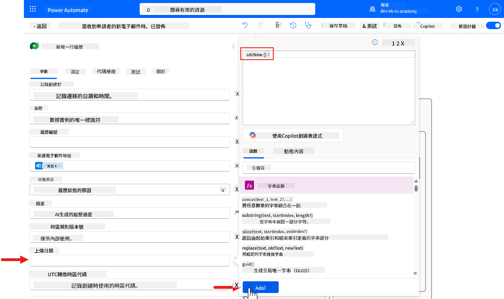

1. 我們已完成配置 **新增履歷行** 操作，現在可以通過折疊面板退出。

   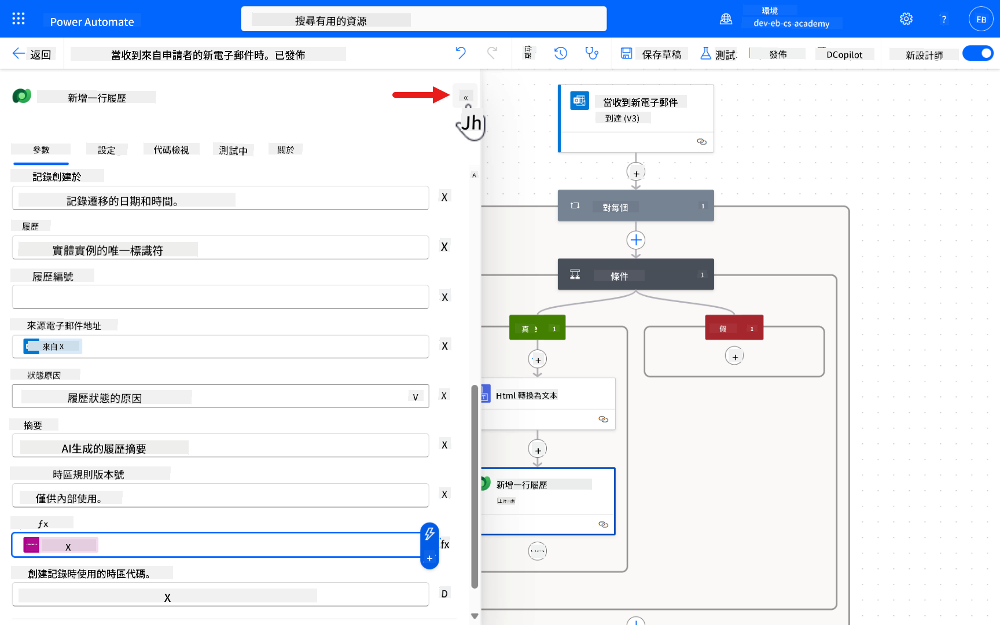

1. 我們將通過選擇 **新增履歷行** 操作下方的 **+ 圖標** 添加新操作，這將加載添加操作的面板。再次選擇 **Microsoft Dataverse** 連接器。

   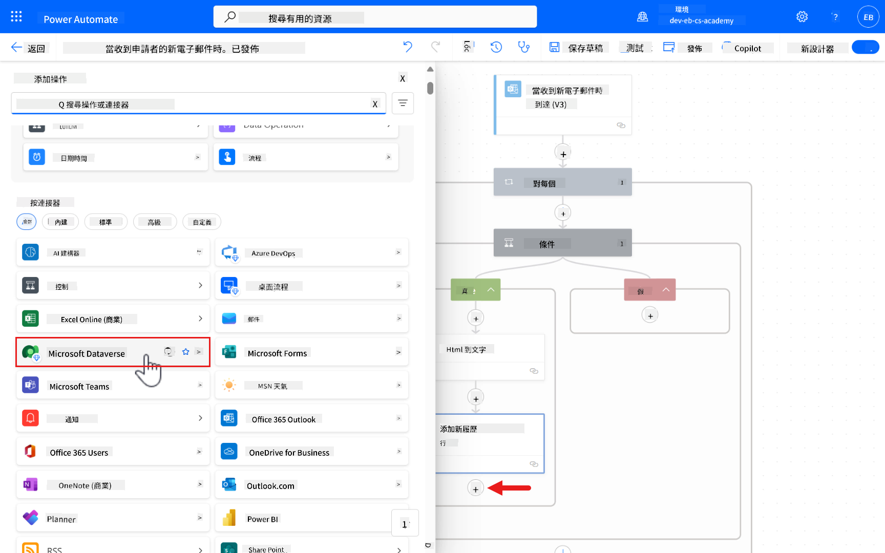

1. 選擇 **上傳文件或圖片** 操作。

   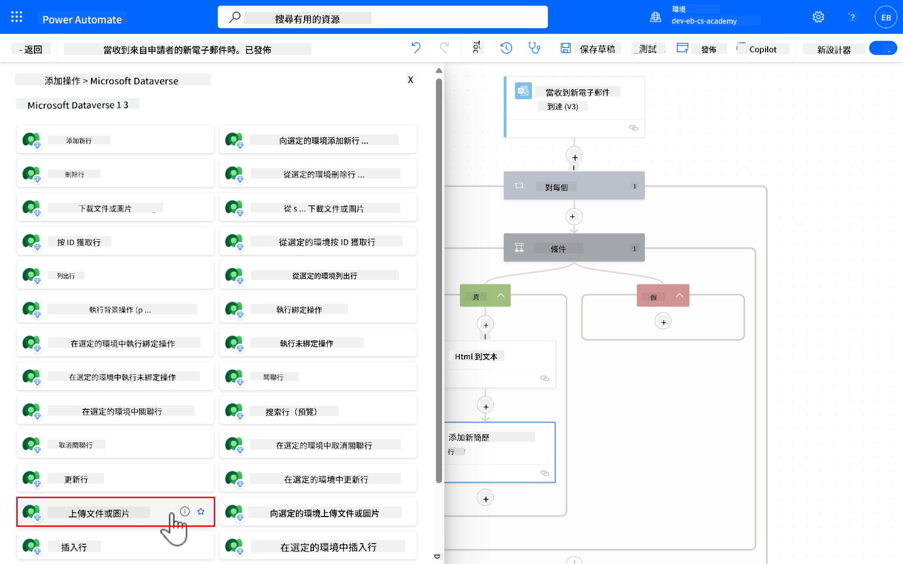

1. 通過選擇 **省略號 (...)** 重命名操作，複製並粘貼以下內容作為名稱：

   ```text
   上傳履歷文件
   ```

   

1. 接下來選擇 **內容名稱** 欄位，然後選擇右側的 **閃電圖標** 或 **fx 圖標**。

   在 **函數選項卡** 中，輸入以下使用 `item()` 函數的表達式。這將獲取當前項目的 `name` 屬性（附件文件）。

   ```text
   item()?['name']
   ```

   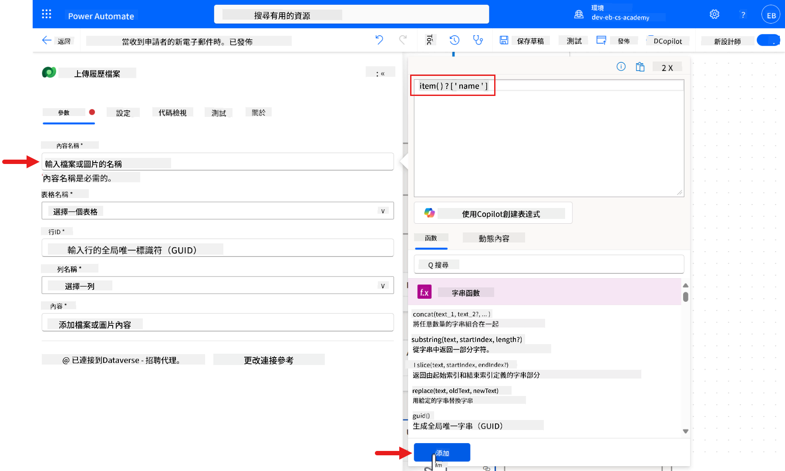

1. 對於 **表格名稱** 參數，搜索 `res` 並選擇 **履歷** 表格。

   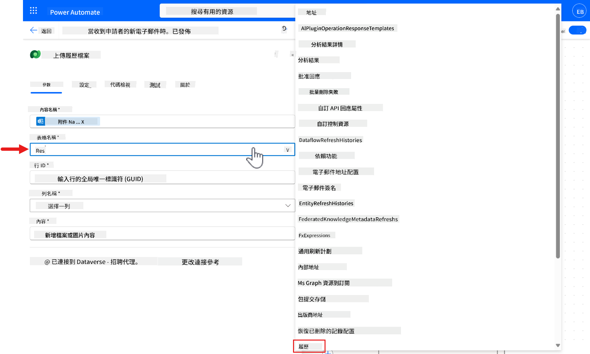

1. 接下來選擇 **行 ID** 欄位，然後選擇右側的 **閃電圖標** 或 **fx 圖標**。

   搜索 `ID` 並從 _新增行 Dataverse_ 操作中選擇 **履歷** 參數，因為它包含要上傳 PDF 文件的行的 ID 值。

   選擇 **添加**。

   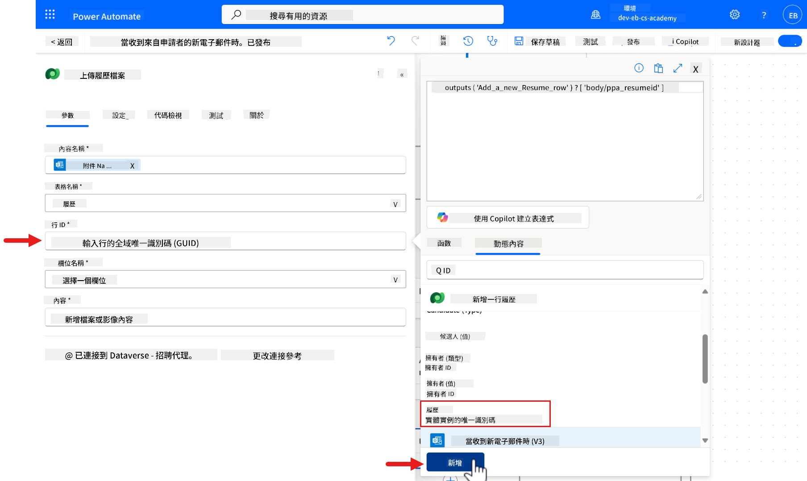

1. 選擇 **列名稱** 欄位並選擇 **履歷 PDF** 選項。

   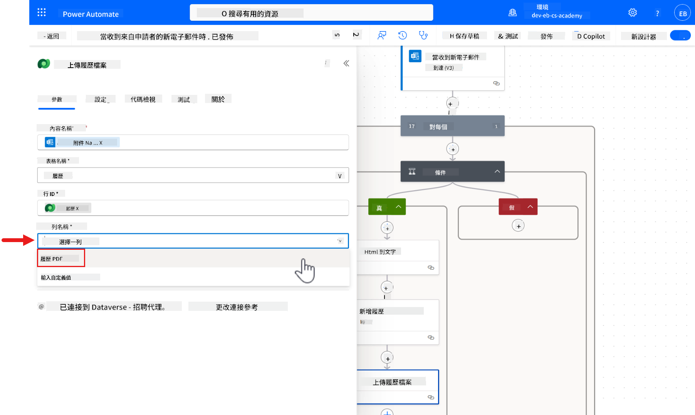

1. 選擇 **內容** 欄位並選擇右側的 **閃電圖標** 或 **fx 圖標**。

   在 **函數選項卡** 中，輸入以下使用 `item()` 函數的表達式。這將獲取當前項目的 `contentBytes` 屬性（附件文件）。`contentBytes` 指的是文件或附件的原始二進制數據，編碼為 Base64 字符串。

   ```text
   item()?['contentBytes']
   ```

1. 我們已完成配置此操作，現在可以通過選擇指向左側的兩個尖括號 («) 折疊面板退出操作。

   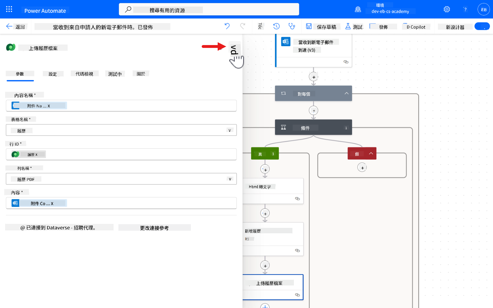

1. 接下來，選擇 **向指定的 Copilot 發送提示進行處理**，然後將此操作拖放到條件的 _True_ 路徑中的 **上傳履歷文件** 操作下方。

   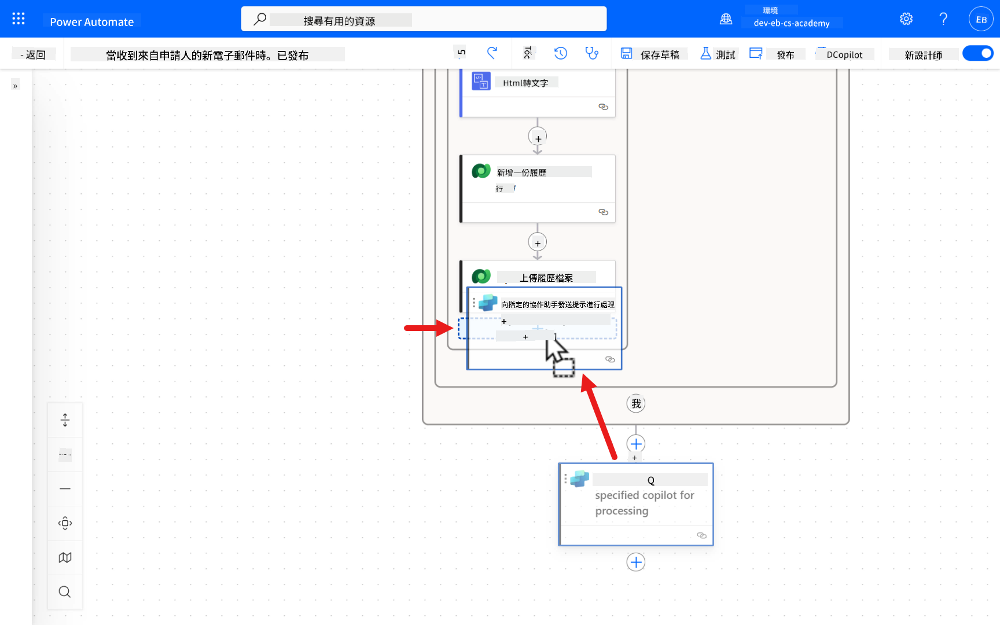

1. 選擇 **向指定的 Copilot 發送提示進行處理** 以進行配置。

   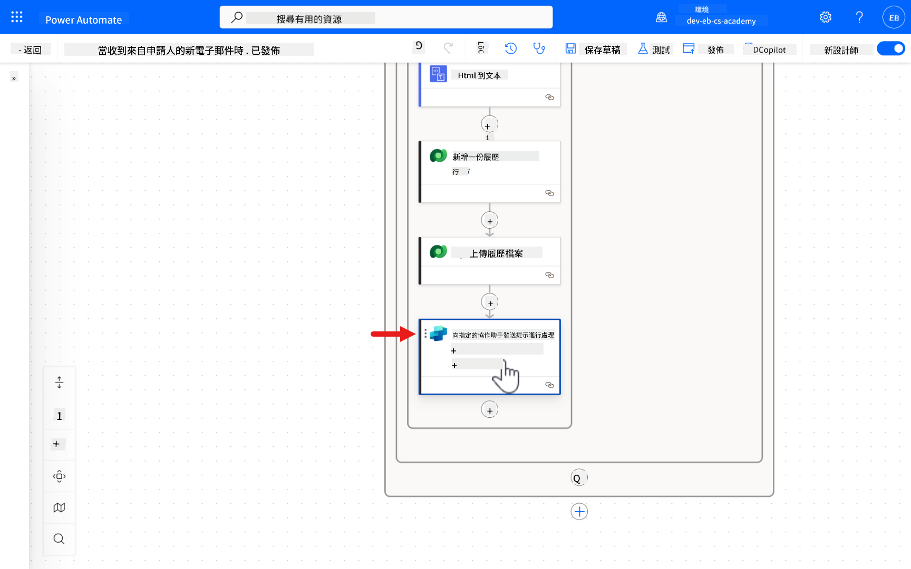

1. 在 **正文/消息** 欄位中，選擇所有欄位內容並清除/刪除。

   

1. 將以下文本複製並粘貼到 **正文/消息** 欄位中，並突出顯示 `RESUME ID PLACEHOLDER`。

   ```text
   發送 [ResumeId (text)] = "RESUME ID PLACEHOLDER" 和 [ResumeTitle (text_1)] = "RESUME TITLE PLACEHOLDER" 和 [ResumeNumber (text_2)] = "RESUME NUMBER PLACEHOLDER" 到工具 "通知 Teams 應聘者頻道" 在子代理 "申請接收代理"
   ```

   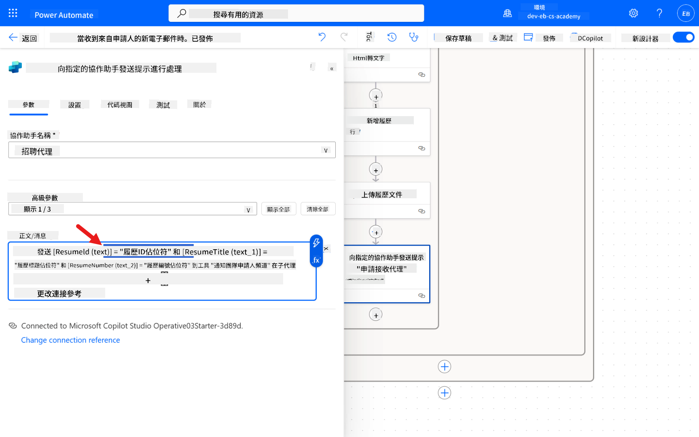

1. 選擇右側的 **閃電圖標** 或 **fx 圖標**。

   搜索 `resume` 並從 _新增行 Dataverse_ 操作中選擇 **履歷** 參數，因為它包含創建的履歷行的 `ID` 值。

   選擇 **添加**。

   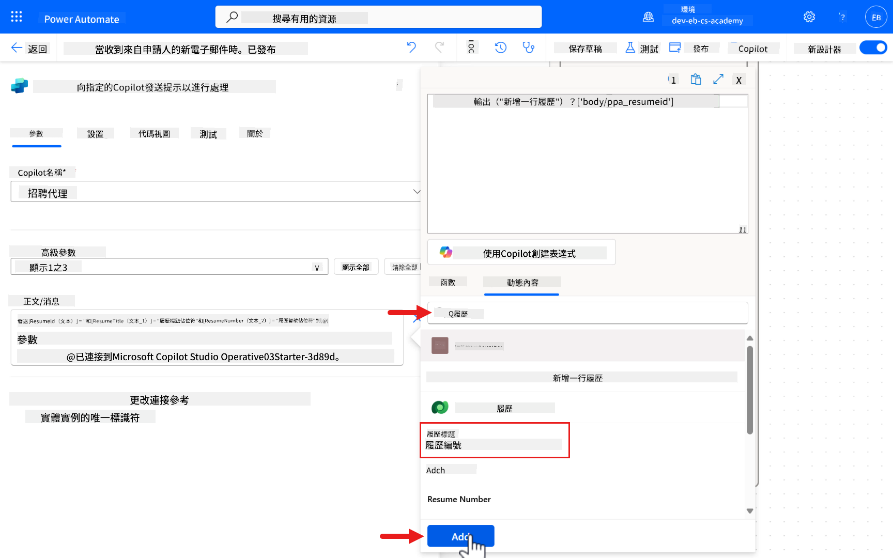

1. 突出顯示 `RESUME TITLE PLACEHOLDER`。選擇右側的 **閃電圖標** 或 **fx 圖標**。

   搜索 `title` 並從 _新增行 Dataverse_ 操作中選擇 **履歷標題** 參數，因為它包含創建的履歷行的 `履歷標題` 值。

   選擇 **添加**。

   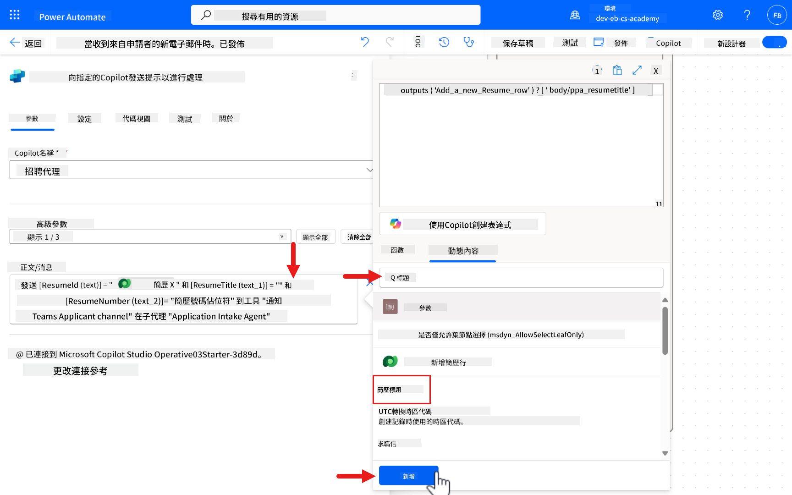

1. 突出顯示 `RESUME NUMBER PLACEHOLDER`。選擇右側的 **閃電圖標** 或 **fx 圖標**。

   搜索 `resume number` 並從 _新增行 Dataverse_ 操作中選擇 **履歷編號** 參數，因為它包含創建的履歷行的 `履歷編號` 值。

   選擇 **添加**。

   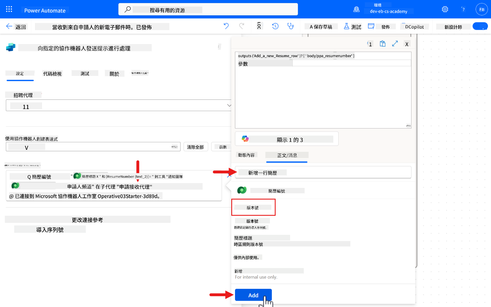

1. 我們已完成配置此操作以及代理流程 🙌🏻 你做得很好！現在通過選擇 **保存草稿** 保存事件觸發流程。

   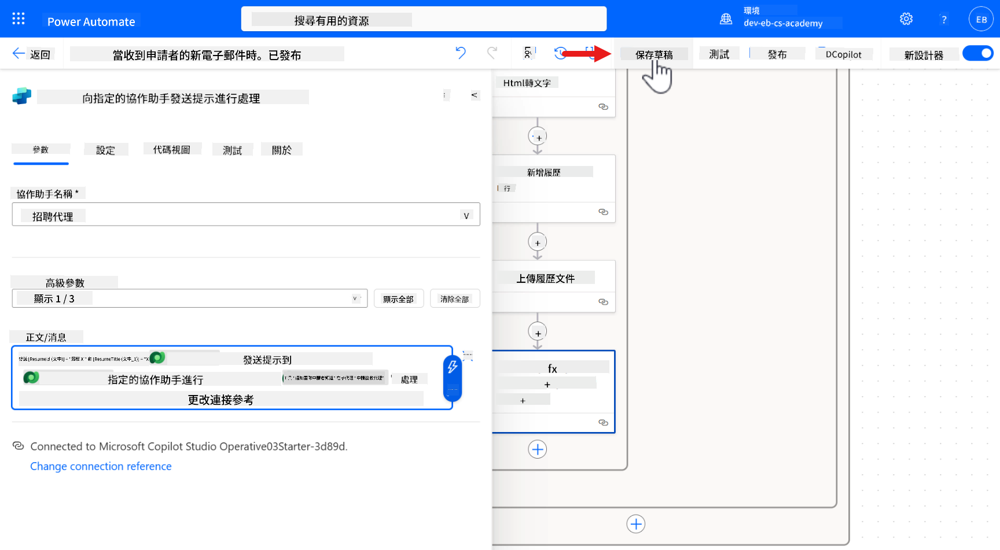

1. 我們現在需要編輯代理流程的詳細信息，選擇 **返回**。

   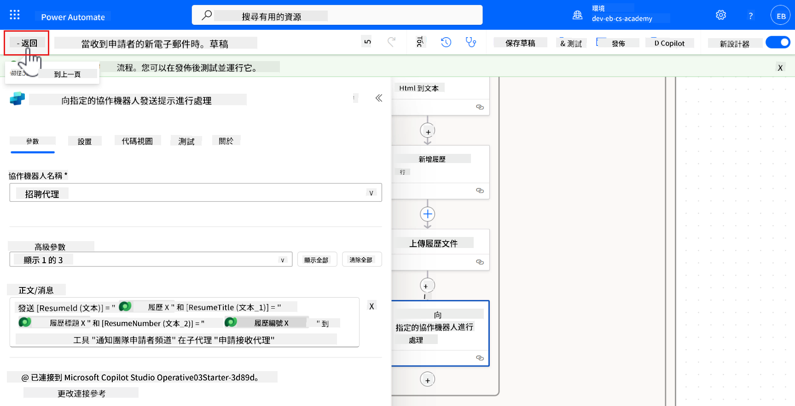

1. 在 **詳細信息** 部分選擇 **編輯**，並將 **計劃** 更新為 **Copilot Studio** 選項。

   選擇 **保存**。

   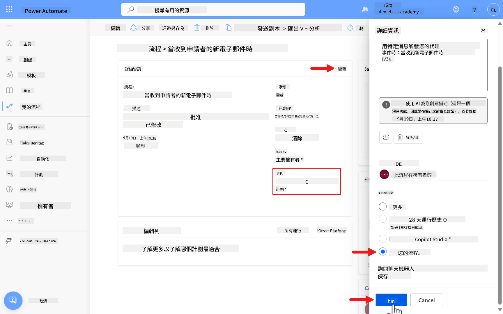

1. 將出現一個模態窗口，要求您確認切換到 Copilot Studio 計劃。選擇 **確認**。

   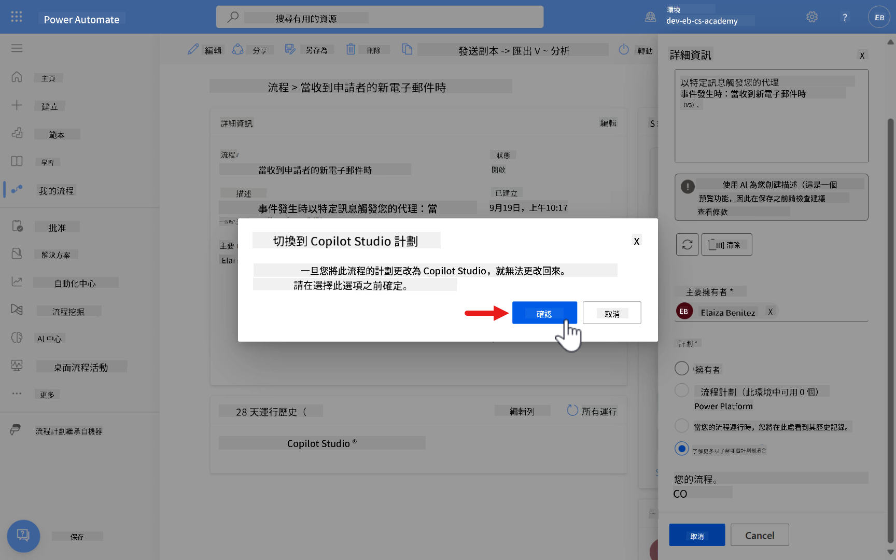

1. 計劃現在已更新為 **Copilot Studio**。選擇 **編輯**，因為我們需要發布事件觸發流程以供代理使用。

   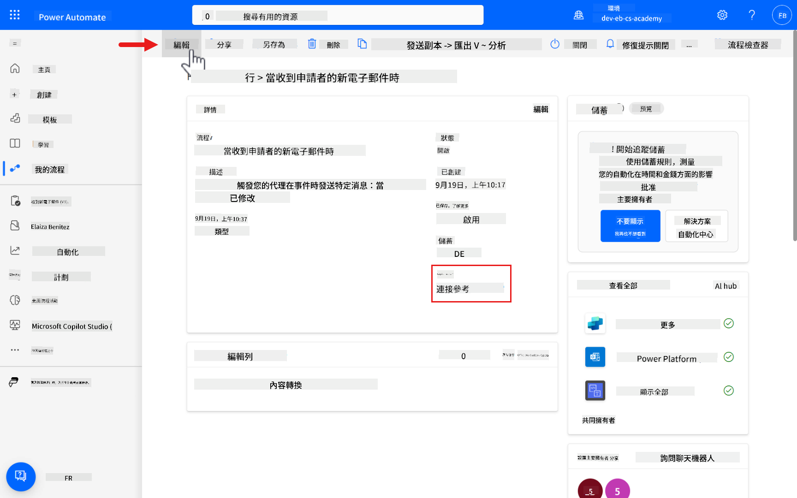

1. 選擇 **發布**。

   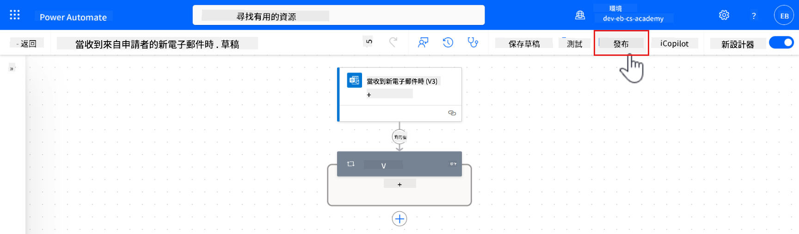

   太棒了！事件觸發流程現在已發布 😃

   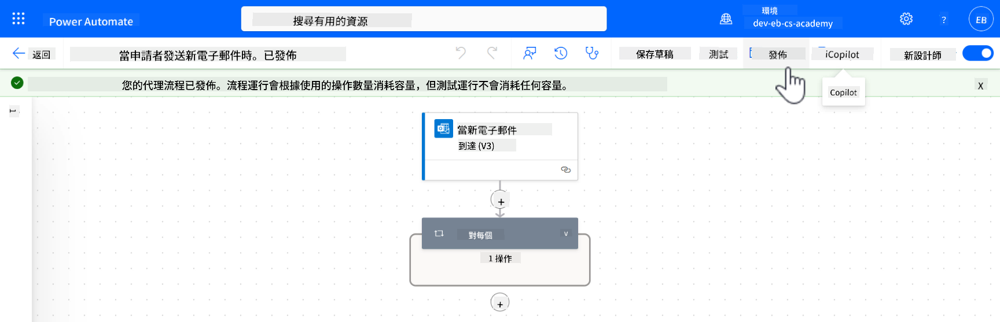

接下來，我們將創建一個新的代理流程，該流程將由子代理 **申請接收代理** 調用。

### 實驗 3.2 - 使用自適應卡通知 Teams 頻道

我們現在將為子代理 **申請接收代理** 創建一個新的代理流程，該流程使用事件觸發傳遞的值，向 Teams 頻道發布自適應卡。此自適應卡將提醒 HR 招聘團隊自動上傳的 PDF，以便他們進行審核。

讓我們開始吧！

1. 在 **招聘代理** 中選擇 **代理** 標籤，然後選擇 **申請接收代理**。

   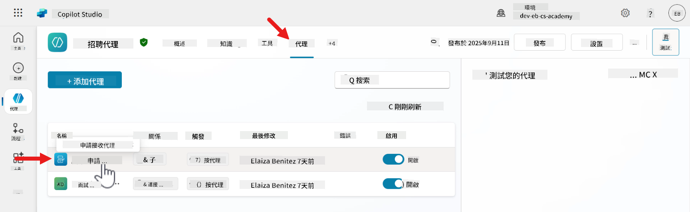

1. 向下滾動到 **工具** 並選擇 **+ 添加**。

   

1. 將出現 **添加工具** 模態窗口。選擇 **+ 新工具**。

   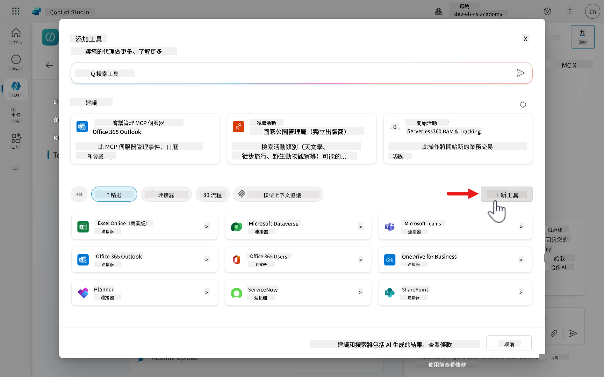

1. 選擇 **代理流程**。

   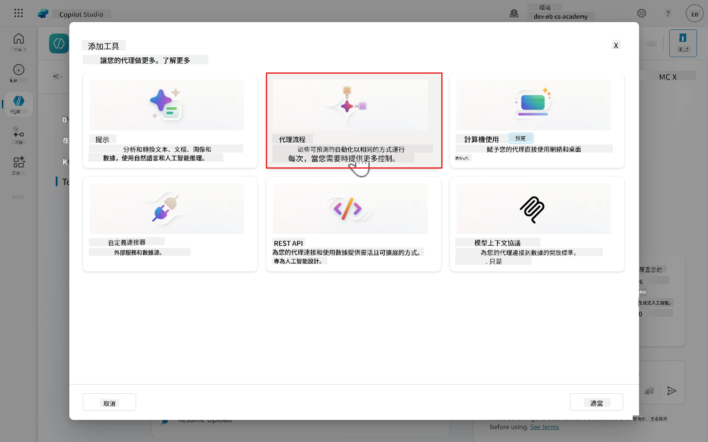

1. 接下來將加載 **代理流程設計器**。在 **當代理調用流程時** 觸發器中，選擇 **+ 添加輸入**。

   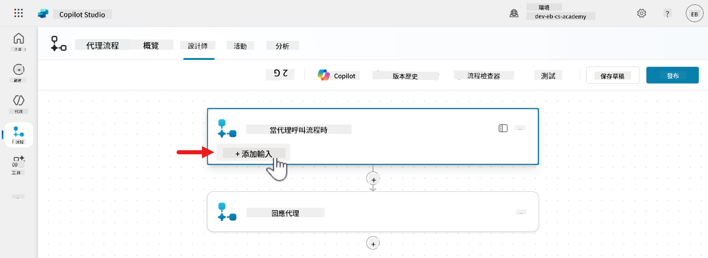

1. 選擇 **文本** 作為用戶輸入類型。

   

1. 在輸入文本欄位中，複製並粘貼以下內容作為輸入參數名稱。

   ```text
   ResumeId
   ```

   

1. 重複相同步驟添加第二個文本輸入。複製並粘貼以下內容作為輸入參數名稱。

   ```text
   ResumeTitle
   ```

   

1. 重複相同步驟添加第三個文本輸入。複製並粘貼以下內容作為輸入參數名稱。

   ```text
   ResumeNumber
   ```
   

1. 還記得在 [Recruit](../../recruit/08-add-adaptive-card/README.md#81-create-a-new-topic-with-an-adaptive-card-for-user-to-submit-their-request) 中，我們在代理的主題中添加了一個自適應卡嗎？這次，我們將在代理流程中添加自適應卡。我們現在將向代理流程添加另一個操作，該操作將向 Teams 頻道發布自適應卡。

   選擇觸發器下方的 **+ 圖標**。

   

1. 選擇 **在聊天或頻道中發布卡片** 操作。

   

1. 需要使用您的登錄用戶帳戶創建到 Microsoft Teams 的連接引用。選擇 **登錄**。

   

1. 選擇您的用戶帳戶，然後選擇 **允許訪問**。

   

1. 對於以下輸入參數，

   | 參數 | 設置方式 | 詳細信息 |
   |------|----------|----------|
   | **以...身份發布** | 下拉選單 | 選擇 `Flow bot` 選項 |
   | **發布到** | 下拉選單 | 選擇 `頻道` 選項 |
   | **團隊** | 下拉選單 | 選擇您環境中可用的團隊，您有權訪問以完成此實驗練習 |
   | **頻道** | 下拉選單 | 選擇您環境中可用的頻道，您有權訪問以完成此實驗練習 |

   

1. 接下來，我們將配置 **自適應卡** 欄位。選擇 **自適應卡** 欄位。

   

1. 打開 [Resume Table Updated JSON 文件](../../../../../docs/operative-preview/03-automate-triggers/assets/3.2_ResumeTableUpdated.json)，複製其全部內容，並粘貼到自適應卡欄位中。

   

1. 與我們在 [Recruit](../../recruit/08-add-adaptive-card/README.md#81-create-a-new-topic-with-an-adaptive-card-for-user-to-submit-their-request) 中所做的類似，我們將替換 JSON 貨幣中的現有值為實際值或動態內容。

   首先，讓我們更新 `selectAction` 屬性中的 `url` 屬性的 URL。此 URL 將替換為 **招聘中心** 模型驅動應用中的履歷系統視圖的 URL。這將允許招聘人員選擇操作並被定向到模型驅動應用中的履歷系統視圖。

   突出顯示當前的 URL 值並刪除它。

   

1. 在 **招聘中心** 模型驅動應用中，使用左側菜單導航到 **履歷** 系統視圖並複製 URL。然後返回代理流程，並將複製的 URL 粘貼到 `selectAction` 屬性中的 **url** 屬性中。

   
1. 您應該看到以下內容，其中以黃色標示的是您的 **Hiring Hub** 模型驅動應用程式的環境詳細資料。

     | 參數 | 值 | 說明 |
     |----------|------------|---------|
     | **Organization URI** | GUID | Dataverse/Dynamics 365 環境的組織 URL |
     | **appid** | GUID | 要開啟特定的模型驅動應用程式，可使用 appid 或 appname 作為查詢參數。在此情況下，使用的是 appid |
     | **viewid** | GUID | 查詢參數，表示視圖的 ID |

       

1. 接下來，我們將為幾個屬性添加動態內容值。首先，設定顯示由事件觸發器自動創建的行的履歷編號參考的文字。

      選擇 **面板** 圖示以載入操作面板。

       

1. 向下滾動到 `RESUME NUMBER PLACEHOLDER` 的 `text` 屬性所在的行。選中佔位符值並刪除它。

       

1. 點擊雙引號之間，然後選擇右側的 **閃電圖示** 或 **fx 圖示**。

      在 **動態內容** 標籤中選擇 **ResumeNumber** 參數並選擇 **添加**。

       

1. **ResumeNumber** 參數現在將作為動態內容添加到 `text` 屬性中。

       

1. 我們將對 `RESUME NAME PLACEHOLDER` 重複相同的步驟。向下滾動到 `RESUME NAME PLACEHOLDER` 的 `text` 屬性所在的行。選中佔位符值並刪除它。

       

1. 點擊雙引號之間，然後選擇右側的 **閃電圖示** 或 **fx 圖示**。

      在 **動態內容** 標籤中選擇 **ResumeTitle** 參數並選擇 **添加**。

       

1. **ResumeTitle** 參數現在將作為動態內容添加到 `text` 屬性中。

       

1. 我們將對代表招聘人員應在何時審核履歷的 **Due Date** 值重複相同的步驟。向下滾動到 `May 21, 2023` 的 `text` 屬性所在的行。

       

1. 刪除此日期佔位符值，然後點擊雙引號之間。

       

1. 選擇右側的 **閃電圖示** 或 **fx 圖示**，並在 **函數** 標籤中輸入以下表達式並選擇 **添加**。

       ```text
       addDays(utcNow(), 3, 'MMM dd, yyyy')
       ```

      此表達式使用了兩個函數。

     | 函數 | 說明 |
     |----------|------------|
     | **addDays** | 將指定的天數添加到給定日期，並以字串格式返回結果日期 |
     | **utcNow** | 以字串格式返回當前的協調世界時 (UTC) 日期和時間 |

      對於 utcNow 值，我們將日期格式化為月份和日期，後接年份。

       

      表達式現在將添加到 `text` 屬性中。

       

1. 最後，我們將更新 JSON 貨物中 `actions` 陣列屬性底部的 `url` 屬性的 URL。當前的佔位符 URL 將替換為 **Hiring Hub** 模型驅動應用程式中履歷行的 URL。這將允許招聘人員選擇自適應卡的 `Action.OpenURL` 操作，並直接進入模型驅動應用程式中的履歷。

       

1. 在 **Hiring Hub** 模型驅動應用程式中，使用左側菜單打開 **Resumes** 系統視圖中的一行。履歷行將作為表單載入到模型驅動應用程式中。

      複製履歷行的 URL。

    ??? info "如果您退出/關閉了 **Hiring Hub** 模型驅動應用程式，如何返回"

        1. 瀏覽至 [https://make.powerapps.com](https://make.powerapps.com)，並確保您處於用於這些實驗的開發者環境中，否則請切換到該環境。
        
        

        1. 在左側菜單窗格中選擇 **Apps**，然後選擇 **Hiring Hub** 模型驅動應用程式的 **播放** 圖示以在瀏覽器中載入。
        
        

       

1. 然後返回代理流程，選中當前的佔位符 URL 值並刪除它。

       

1. 然後將複製的 URL 貼到 `url` 屬性中的 `url property`。

       

1. 您應該看到以下內容。刪除末尾的 `GUID` ID 值。我們將替換此動態內容 - **ResumeId** 參數。

       

1. 選擇右側的 **閃電圖示** 或 **fx 圖示**。

      在 **動態內容** 標籤中選擇 **ResumeId** 參數並選擇 **添加**。

       

1. **ResumeId** 現在將作為動態內容添加。以下以黃色標示的是您的 **Hiring Hub** 模型驅動應用程式的環境詳細資料。

     | 參數 | 值 | 說明 |
     |----------|------------|---------|
     | **Organization URI** | GUID | Dataverse/Dynamics 365 環境的組織 URL |
     | **appid** | GUID | 要開啟特定的模型驅動應用程式，可使用 appid 或 appname 作為查詢參數。在此情況下，使用的是 appid |
     | **id** | GUID | 查詢參數，表示履歷行的 ID |

       

1. 我們已完成配置 **Post card in a chat or channel** 操作 👏🏻 點擊 **x** 圖示退出操作配置面板。

       

1. 最後，我們將配置最後一個操作，**Respond to the agent**，通過發送文字回覆代理以結束處理。

      在 **Respond to the agent** 操作中，選擇 **+添加輸出**。

       

1. 選擇 **文字** 作為輸出的類型。

       

1. 輸入以下作為輸出的名稱。

       

1. 輸入以下作為輸出的值。

       ```text
       Finished
       ```

       

1. 我們現在已完成配置代理流程。選擇 **保存草稿** 以保存代理流程。保存後將出現確認消息。

       

1. 在發布代理流程之前，我們需要更新代理流程的詳細資料。選擇 **概覽** 標籤並選擇 **編輯**。

      在流程名稱欄位中輸入以下內容。

       ```text
       Notify Teams Applicant channel
       ```      

      然後選擇 **刷新** 圖示以使用 AI 更新代理流程的描述。

      接著選擇 **保存** 以保存代理流程的更新詳細資料。

       

1. 返回 **設計器** 標籤並選擇 **發布** 以發布代理流程。保存後將出現確認消息。

       

1. 現在需要將代理流程作為工具添加到 **Application Intake Agent** 中。返回 **Hiring Agent** 並選擇 **Agents** 標籤，然後選擇 **Application Intake Agent**。

       

1. 在代理的 **詳細資料** 部分，我們將更新 **描述** 欄位。複製以下內容並貼到描述文字的末尾。

       ```text
       並通知 Teams Applicant 頻道
       ```

       

1. 接下來，我們將代理流程添加為工具。向下滾動並選擇 **+ 添加**。

       

1. 選擇之前創建的代理流程，**Notify Teams Applicant Channel**。

       

1. 接著選擇 **添加並配置**。

       

1. 在代理流程的 **輸入** 部分，之前在代理流程中配置的三個輸入是可見的。默認情況下，**填充方式** 配置設置為 **使用 AI 動態填充**。我們將保持此設置不變，因為事件觸發器的提示（在最後一個操作中，**將提示發送到指定的協作機器人進行處理** - 這是 **Lab 3.1 - 自動上傳通過電子郵件接收的履歷到 Dataverse** 的第 38-44 步）將包含 AI 將提取的參數值。

       

1. 現在工具已添加到 **Application Intake Agent** 中，代理的指示需要更新。選擇 **返回箭頭** 圖示以返回代理列表。

       

1. 在 **Hiring Agent** 的 **Agents** 標籤中選擇 **Application Intake Agent**。

       

1. 在 **指示** 欄位中，在 `2.Post-Upload` 指示後新增一行。複製並貼上以下指示。

       ```text
       通過電子郵件上傳履歷的流程
       1. 當您收到消息時，**將 [ResumeId (text)] = "1680265f-5793-f011-b41b-7c1e525be9f7" 和 [ResumeTitle (text_1)] = "TAYLOR TESTPERSON (FICTITIOUS).pdf" 和 [ResumeNumber (text_2)]= "R01026" 發送到子代理 "Application Intake Agent" 中的工具 "Notify Teams Applicant channel"，調用 [AGENT FLOW PLACEHOLDER]
       ```

       

1. 選中 `[AGENT FLOW PLACEHOLDER` 文本。

       

1. 輸入斜線字符 `/`，然後選擇 **Notify Teams Applicant Channel** 工具。

       
1. 根據指示，事件觸發器的最後一個動作（**向指定的 Copilot 發送提示進行處理**）將提示包含參數值發送回代理後，**Application Intake Agent** 現在將啟動代理流程。

   選擇 **Save** 以保存更新後的 **Application Intake Agent** 指示。

   

1. 保存代理後，指示將會更新。

   

1. 現在需要 **Publish** **Hiring Agent**。在右上角選擇 **Publish**，在出現的 _Publish this agent modal_ 中選擇 **Publish**。

   

1. 發布後，將出現確認消息，表示代理已成功發布。

   

現在可以測試代理了！

### Lab 3.3 - 測試事件觸發器

1. 要執行事件觸發器，需要發送一封附有簡歷 PDF 文件的電子郵件。在 Outlook 中，撰寫一封新郵件。

   | 電郵組件 | 詳情 |
   |----------|------------|
   | **收件人** | 使用您登入的用戶帳戶作為值 |
   | **文件附件** | 上傳 [TAYLOR TESTPERSON (FICTITIOUS)](../../../../../docs/operative-preview/test-data/resumes/TAYLOR%20TESTPERSON%20(FICTITIOUS).pdf) 文件 |
   | **正文** | 複製並粘貼以下內容作為電子郵件正文 |

   ```text
   Dear Hiring Manager,

   I am writing to express my interest in the Senior Power Platform Engineer position at your organization. With over nine years of experience delivering secure and scalable solutions on Microsoft cloud platforms, I am confident in my ability to contribute effectively to your team.

   In my most recent role as Lead Power Platform Engineer, I developed an automated resume-intake pipeline, reducing manual triage and improving searchability. I have delivered HR case management applications, introduced solution-aware flows, and implemented PR checks to enhance deployment lead times. My expertise includes Power Apps, Power Automate, Power Pages, Dataverse, and a range of Microsoft 365 services, as well as integration with Graph/REST APIs and Azure Functions.

   Previously, I developed Teams approvals with adaptive cards, cutting approval times to the same day, and created robust error-handling frameworks. My background also includes migrating legacy workflows to Power Automate and building self-service portals adopted by hundreds of employees.

   I hold a B.Sc. in Computer Science and am certified as a Power Platform Developer (PL-400) and Solution Architect (PL-600). I am also passionate about mentoring and have volunteered with local maker groups.

   Please find my CV attached for your consideration. I would welcome the opportunity to discuss how my skills and experience align with your needs.

   Thank you for your time and consideration.

   Kind regards,
   Taylor Testperson
   ```

   **發送**撰寫好的電子郵件。

   

1. 在 Power Automate 製作人門戶的事件觸發器流程中，選擇 **Refresh** 圖標以查看成功執行的流程。

   

1. 回到 Copilot Studio 的 **Hiring Agent**，選擇 **Activity** 標籤。

   

1. **Activity** 標籤將顯示 **Hiring Agent** 的所有活動。會有一個名為 **Automated** 且狀態為 **Complete** 的活動。此活動代表事件觸發器和已啟動的代理流程。

   

1. 選擇該活動，並在活動地圖中選擇事件觸發器。在右側面板中，注意提示中的輸入參數如何包含來自 **Dataverse** 行的 `Resume Id`、`Resume Title` 和 `Resume Number` 參數值。這些是之前在 **Lab 3.1 - Automate uploading resumes to Dataverse received by email** 的第 18 - 27 步中配置的動態內容值。

   

1. 返回 **Hiring Hub** 模型驅動應用，在 **Resumes system view** 中選擇 **Refresh** 以刷新視圖。通過事件觸發器創建的簡歷新行現在將列出。

   

1. 回到 Copilot Studio，並在活動地圖中選擇 **Application Intake Agent** 的 **Notify Teams Applicant Channel** 代理流程。在右側面板中，注意輸入值來自 Dataverse 行。這是事件觸發器的最後一個動作（**向指定的 Copilot 發送提示進行處理**）發送的提示中包含的參數值，這些值來自新創建的 Dataverse 行。這就是如何將事件觸發器的參數值傳遞給代理流程。

   

1. 最後，查看在 **Microsoft Teams** 頻道中發布的自適應卡。在頻道中，我們會看到顯示新創建的 Dataverse 簡歷行信息的自適應卡。將鼠標懸停在自適應卡開頭的超鏈接上，注意 URL 是我們之前在 JSON（**Lab 3.2 - Notify a Teams channel using an adaptive card** 的第 15 - 19 步）中配置的簡歷系統視圖 URL。

   

1. 選擇超鏈接，您將被引導至瀏覽器中的 **Hiring Hub** 模型驅動應用的簡歷系統視圖。

   

1. 返回 Microsoft Teams 頻道中發布的自適應卡。這次，將鼠標懸停在 **View Resume** 上，這是自適應卡的 `Action.OpenURL` 動作。注意 URL 是我們之前在 JSON（**Lab 3.2 - Notify a Teams channel using an adaptive card** 的第 30 - 36 步）中配置的簡歷行 URL。

   

1. 選擇該動作，您將被引導至瀏覽器中的 **Hiring Hub** 模型驅動應用的簡歷行表單。

   

## ✅ 任務完成

恭喜！👏🏻 幹得好，行動者。

✅ 事件觸發器：您已創建一個事件觸發器，將 Dataverse 參數值傳遞給代理流程。  
✅ 建立代理流程：使用 Dataverse 參數值向 Microsoft Teams 頻道發布自適應卡，通知 HR 招聘團隊。  
✅ 更新子代理指示：在事件觸發器完成後啟動流程。

這使得 **Hiring Agent** 能夠在收到附有簡歷的電子郵件時自動運作，並通知 HR 招聘團隊進行人工審查。

這是 **Lab 03 - Automating candidate application emails** 的結尾，點擊以下鏈接進入下一課程。

⏭️ [進入 **Authoring Agent Instructions** 課程](../04-agent-instructions/README.md)

## 📚 戰術資源

📖 [在 Copilot Studio 中使您的代理自主運作](https://learn.microsoft.com/training/modules/autonomous-agents-online-workshop/?WT.mc_id=power-188561-ebenitez)  
📖 [添加事件觸發器](https://learn.microsoft.com/microsoft-copilot-studio/authoring-trigger-event?WT.mc_id=power-188561-ebenitez)  
📖 [使用代理流程](https://learn.microsoft.com/microsoft-copilot-studio/advanced-flow?WT.mc_id=power-188561-ebenitez)  
📖 [Power Automate 觸發器介紹](https://learn.microsoft.com/power-automate/triggers-introduction?WT.mc_id=power-188561-ebenitez)  
📖 [使用 Power Automate 流與代理](https://learn.microsoft.com/microsoft-copilot-studio/advanced-flow-create?WT.mc_id=power-188561-ebenitez)  
📖 [Copilot Studio 的數據丟失防護](https://learn.microsoft.com/microsoft-copilot-studio/admin-data-loss-prevention?WT.mc_id=power-188561-ebenitez)  

---

**免責聲明**：  
此文件已使用人工智能翻譯服務 [Co-op Translator](https://github.com/Azure/co-op-translator) 進行翻譯。我們致力於提供準確的翻譯，但請注意，自動翻譯可能包含錯誤或不準確之處。原始文件的母語版本應被視為權威來源。對於重要信息，建議使用專業人工翻譯。我們對因使用此翻譯而引起的任何誤解或誤釋不承擔責任。