<!--
CO_OP_TRANSLATOR_METADATA:
{
  "original_hash": "750f3ea8a94930439ebd8a10871b1d73",
  "translation_date": "2025-10-21T23:54:52+00:00",
  "source_file": "docs/operative-preview/08-dataverse-grounding/README.md",
  "language_code": "hk"
}
-->
# 🚨 任務 08：使用 Dataverse 提升提示功能

--8<-- "disclaimer.md"

## 🕵️‍♂️ 行動代號：`地基控制行動`

> **⏱️ 行動時間窗口：** `~60 分鐘`

## 🎯 任務簡介

歡迎回來，特工。您的多代理招聘系統已經運行，但還需要進行一項重要的改進——**數據基礎**。您的 AI 模型需要實時訪問組織的結構化數據，以做出智能決策。

目前，您的「摘要履歷」提示僅基於靜態知識運行。但如果它能動態訪問您的職位數據庫，提供準確、最新的匹配結果呢？如果它能理解您的評估標準，而不需要您硬編碼呢？

在這次任務中，您將通過 **Dataverse 基礎** 增強您的自定義提示——將提示直接連接到實時數據源。這將使您的代理從靜態回應者轉變為動態、數據驅動的系統，能夠適應不斷變化的業務需求。

您的任務：將實時職位和評估標準數據整合到您的履歷分析工作流程中，創建一個自動更新的系統，始終保持與組織的招聘需求同步。

## 🔎 目標

在這次任務中，您將學習：

1. **Dataverse 基礎** 如何提升自定義提示
1. 何時使用數據基礎與靜態指令
1. 設計動態整合實時數據的提示
1. 通過職位匹配增強「摘要履歷」流程

## 🧠 理解提示的 Dataverse 基礎

**Dataverse 基礎** 使您的自定義提示在處理請求時能夠訪問 Dataverse 表中的實時數據。您的提示不再僅僅依賴靜態指令，而是可以整合實時信息以做出明智的決策。

### 為什麼 Dataverse 基礎很重要

傳統提示僅依賴固定指令：

```text
Match this candidate to these job roles: Developer, Manager, Analyst
```

使用 Dataverse 基礎，您的提示可以訪問最新數據：

```text
Match this candidate to available job roles from the Job Roles table, 
considering current evaluation criteria and requirements
```

這種方法提供了幾個關鍵優勢：

- **動態更新：** 職位和標準變更無需修改提示
- **一致性：** 所有代理使用相同的最新數據源
- **可擴展性：** 新職位和標準自動可用
- **準確性：** 實時數據確保決策反映當前需求

### Dataverse 基礎如何運作

啟用 Dataverse 基礎的自定義提示時：

1. **數據選擇：** 選擇要包含的特定 Dataverse 表和列。您還可以選擇相關表，系統將根據檢索到的父記錄進行篩選。
1. **上下文注入：** 提示會自動將檢索到的數據包含在提示上下文中。
1. **智能篩選：** 如果您提供篩選條件，系統僅包含與當前請求相關的數據。
1. **結構化輸出：** 提示可以引用檢索到的數據並根據檢索到的記錄生成輸出。

### 從靜態到動態：基礎的優勢

讓我們來看看您在任務 07 中的「摘要履歷」流程，並了解 Dataverse 基礎如何將其從靜態轉變為動態智能。

**目前的靜態方法：**
您現有的提示包含硬編碼的評估標準和預定的匹配邏輯。這種方法雖然有效，但每次添加新職位、更改評估標準或調整公司優先事項時，都需要手動更新。

**Dataverse 基礎的轉變：**
通過添加 Dataverse 基礎，您的「摘要履歷」流程將：

- **訪問當前職位**，來自您的職位表
- **使用實時評估標準**，而非靜態描述
- **提供準確匹配**，基於實時需求

## 🎯 為什麼選擇專用提示而非代理對話

在任務 02 中，您體驗了面試代理如何將候選人與職位匹配，但需要複雜的用戶提示，例如：

```text
Upload this resume, then show me open job roles,
each with a description of the evaluation criteria, 
then use this to match the resume to at least one suitable
job role even if not a perfect match.
```

雖然這種方法有效，但針對特定任務的專用提示結合 Dataverse 基礎提供了顯著優勢：

### 專用提示的主要優勢

| 方面 | 代理對話 | 專用提示 |
|--------|-------------------|------------------|
| **一致性** | 結果取決於用戶的提示撰寫技巧 | 每次都標準化處理 |
| **專業化** | 通用推理可能忽略業務細節 | 專門設計，優化業務邏輯 |
| **自動化** | 需要人工交互和解釋 | 自動觸發，結構化 JSON 輸出 |

## 🧪 實驗 8：為提示添加 Dataverse 基礎

是時候升級您的履歷分析功能了！您將通過動態職位匹配增強現有的「摘要履歷」流程。

### 完成此任務的前提條件

1. 您需要 **以下任一條件：**

    - **完成任務 07**，並準備好您的履歷分析系統，**或**
    - **導入任務 08 起始解決方案**，如果您是從頭開始或需要補課。[下載任務 08 起始解決方案](https://aka.ms/agent-academy)

1. 從 [測試履歷](https://download-directory.github.io/?url=https://github.com/microsoft/agent-academy/tree/main/operative/sample-data/resumes&filename=operative_sampledata) 獲取樣本履歷文件

!!! note "解決方案導入和樣本數據"
    如果您使用起始解決方案，請參考 [任務 01](../01-get-started/README.md) 了解如何將解決方案和樣本數據導入您的環境。

### 8.1 為提示添加 Dataverse 基礎

您將基於任務 07 中創建的「摘要履歷」提示進行改進。目前它僅僅是摘要履歷，現在您將通過 Dataverse 中的職位數據進行基礎化，使其始終保持最新。

首先，讓我們檢查您將使用的 Dataverse 表：

1. **導航到** [Power Apps](https://make.powerapps.com)，並使用導航欄右上角的 **環境切換器** 選擇您的環境。

1. 選擇 **表**，找到 **職位** 表。

1. 查看您將用於基礎的關鍵列：

    | 列 | 用途 |
    |--------|---------|
    | **職位編號** | 用於職位匹配的唯一標識符 |
    | **職位名稱** | 職位的顯示名稱 |
    | **描述** | 職位要求的詳細信息 |

1. 同樣，查看其他表，例如 **評估標準** 表。

### 8.2 將 Dataverse 基礎數據添加到您的提示

1. **導航到** Copilot Studio，並使用導航欄右上角的 **環境切換器** 選擇您的環境。

1. 從左側導航中選擇 **工具**。

1. 選擇 **提示**，找到您在任務 07 中的 **摘要履歷** 提示。  
    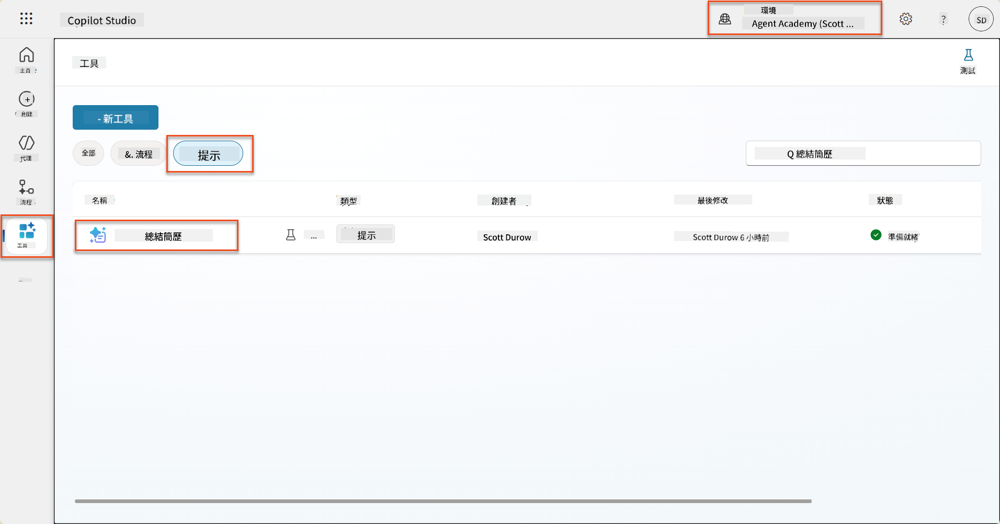

1. 選擇 **編輯** 修改提示，並用以下增強版替換：

    !!! important
        確保履歷和求職信參數保持原樣作為參數。

    ```text
    You are tasked with extracting key candidate information from a resume and cover letter to facilitate matching with open job roles and creating a summary for application review.
    
    ### Instructions:
    1. **Extract Candidate Details:**
       - Identify and extract the candidate's full name.
       - Extract contact information, specifically the email address.
    
    2. **Analyze Resume and Cover Letter:**
       - Review the resume content to identify relevant skills, experience, and qualifications.
       - Review the cover letter to understand the candidate's motivation and suitability for the roles.
    
    3. **Match Against Open Job Roles:**
       - Compare the extracted candidate information with the requirements and descriptions of the provided open job roles.
       - Use the job descriptions to assess potential fit.
       - Identify all roles that align with the candidate's cover letter and profile. You don't need to assess perfect suitability.
       - Provide reasoning for each match based on the specific job requirements.
    
    4. **Create Candidate Summary:**
       - Summarize the candidate's profile as multiline text with the following sections:
          - Candidate name
          - Role(s) applied for if present
          - Contact and location
          - One-paragraph summary
          - Top skills (8–10)
          - Experience snapshot (last 2–3 roles with outcomes)
          - Key projects (1–3 with metrics)
          - Education and certifications
          - Availability and work authorization
    
    ### Output Format
    
    Provide the output in valid JSON format with the following structure:
    
    {
      "CandidateName": "string",
      "Email": "string",
      "MatchedRoles": [
        {
          "JobRoleNumber": "ppa_jobrolenumber from grounded data",
          "RoleName": "ppa_jobtitle from grounded data",
          "Reasoning": "Detailed explanation based on job requirements"
        }
      ],
      "Summary": "string"
    }
    
    ### Guidelines
    
    - Extract information only from the provided resume and cover letter documents.
    - Ensure accuracy in identifying contact details.
    - Use the available job role data for matching decisions.
    - The summary should be concise but informative, suitable for quick application review.
    - If no suitable matches are found, indicate an empty list for MatchedRoles and explain briefly in the summary.
    
    ### Input Data
    Open Job Roles (ppa_jobrolenumber, ppa_jobtitle): /Job Role 
    Resume: {Resume}
    Cover Letter: {CoverLetter}
    ```

1. 在提示編輯器中，通過選擇 **+ 添加內容**，選擇 **Dataverse** → **職位**，並選擇以下列，然後選擇 **添加**：

    1. **職位編號**

    1. **職位名稱**

    1. **描述**

    !!! tip
        您可以輸入表名進行搜索。

1. 在 **職位** 對話框中，選擇 **篩選** 屬性，選擇 **狀態**，然後輸入 **Active** 作為 **篩選** 值。  
    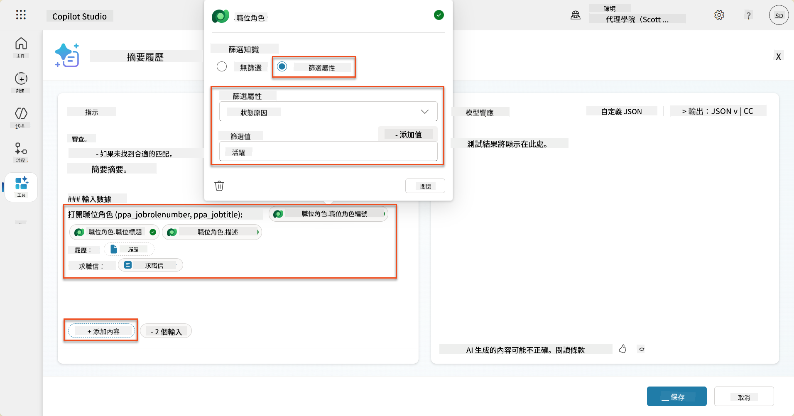

    !!! tip
        您可以在此處使用 **添加值**，添加輸入參數——例如，如果您有一個提示要摘要現有記錄，您可以提供履歷編號作為篩選參數。

1. 接下來，您將添加相關的 Dataverse 表 **評估標準**，再次選擇 **+ 添加內容**，找到 **職位**，然後不是選擇職位的列，而是展開 **職位（評估標準）**，選擇以下列，然後選擇 **添加**：

    1. **標準名稱**

    1. **描述**  
        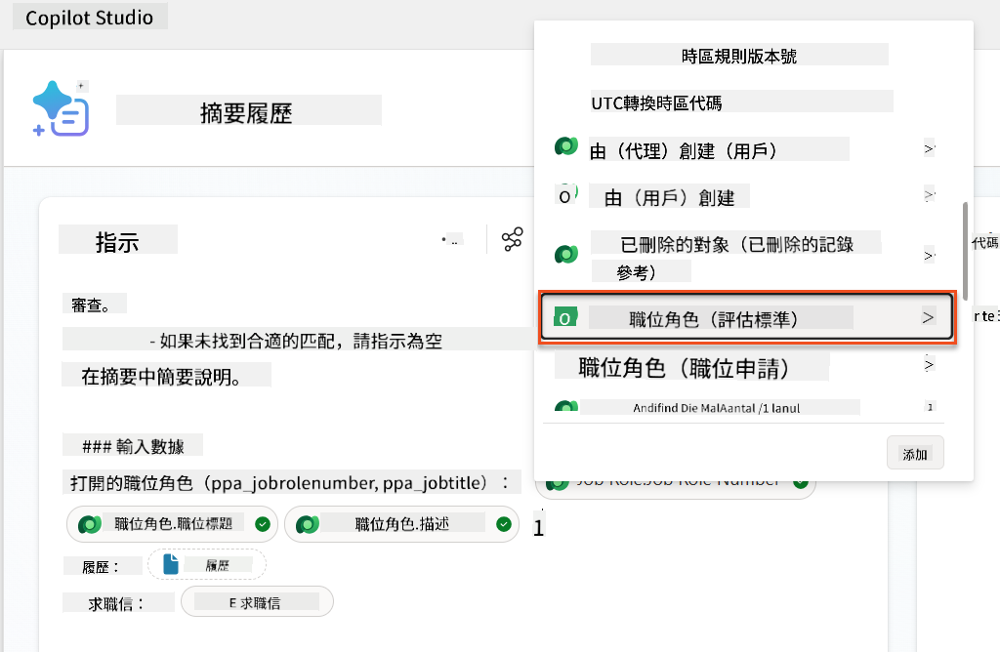

        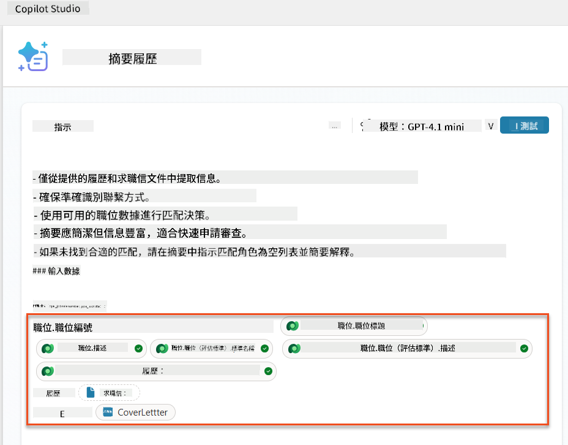

    !!! tip
        必須先選擇職位，然後在菜單中導航到職位（評估標準）以選擇相關評估標準。這將確保僅加載與職位相關的記錄。

1. 選擇 **設置**，並將 **記錄檢索** 調整為 1000——這將允許提示中包含最多的職位和評估標準。  
    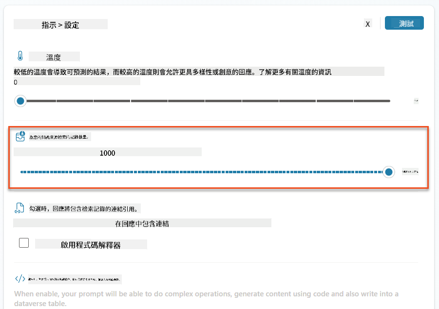

### 8.3 測試增強提示

1. 選擇 **履歷** 參數，並上傳您在任務 07 中使用的樣本履歷。
1. 選擇 **測試**。
1. 測試完成後，注意 JSON 輸出現在包含 **匹配的職位**。
1. 選擇 **使用的知識** 標籤，查看在執行提示之前與提示合併的 Dataverse 數據。
1. **保存** 您更新的提示。系統現在將自動在現有的「摘要履歷」代理流程調用提示時包含這些 Dataverse 數據。  
    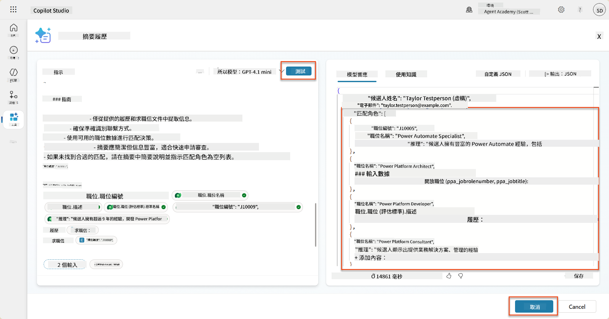

### 8.4 添加職位申請代理流程

為了讓我們的申請接收代理根據建議的職位創建職位申請，我們需要創建一個代理流程。代理將為候選人感興趣的每個建議職位調用此工具。

!!! tip "代理流程表達式"
    非常重要的是，您必須按照指示準確命名節點並輸入表達式，因為表達式使用節點名稱引用之前的節點！請參考 [招聘中的代理流程任務](../../recruit/09-add-an-agent-flow/README.md#you-mentioned-expressions-what-are-expressions) 以快速回顧！

1. 在 **招聘代理** 中，選擇 **代理** 標籤，打開 **申請接收代理** 子代理。

1. 在 **工具** 面板中，選擇 **+ 添加** → **+ 新工具** → **代理流程**

1. 選擇 **當代理調用流程時** 節點，使用 **+ 添加輸入** 添加以下參數：

    | 類型 | 名稱            | 描述                                                  |
    | ---- | --------------- | ------------------------------------------------------------ |
    | 文本 | `ResumeNumber`  | 確保僅使用 [ResumeNumber] - 必須以字母 R 開頭 |
    | 文本 | `JobRoleNumber` | 確保僅使用 [JobRoleNumber] - 必須以字母 J 開頭 |

    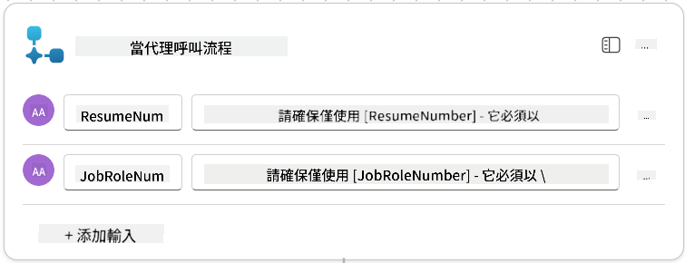

1. 選擇第一個節點下的 **+** 插入操作圖標，搜索 **Dataverse**，選擇 **查看更多**，然後找到 **列出行** 操作。

1. **重命名** 節點為 `獲取履歷`，然後設置以下參數：

    | 屬性        | 設置方式                      | 值                                                        |
    | --------------- | ------------------------------- | ------------------------------------------------------------ |
    | **表名**  | 選擇                          | 履歷                                                      |
    | **篩選行** | 動態數據（閃電圖標） | `ppa_resumenumber eq 'ResumeNumber'` 選擇並替換 **ResumeNumber** 為 **當代理調用流程時** → **ResumeNumber** |
    | **行數**   | 輸入                           | 1                                                            |

    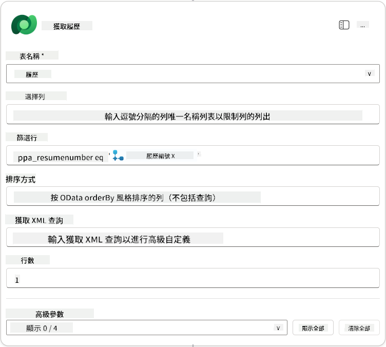

1. 現在，選擇 **獲取履歷** 下的 **+** 插入操作圖標，搜索 **Dataverse**，選擇 **查看更多**，然後找到 **列出行** 操作。

1. **重命名** 節點為 `獲取職位`，然後設置以下參數：

    | 屬性        | 設置方式                      | 值                                                        |
    | --------------- | ------------------------------- | ------------------------------------------------------------ |
    | **表名**  | 選擇                          | 職位                                                    |
    | **篩選行** | 動態數據（閃電圖標） | `ppa_jobrolenumber eq 'JobRoleNumber'` 選擇並替換 **JobRoleNumber** 為 **當代理調用流程時** → **JobRoleNumber** |
    | **行數**   | 輸入                           | 1                                                            |

    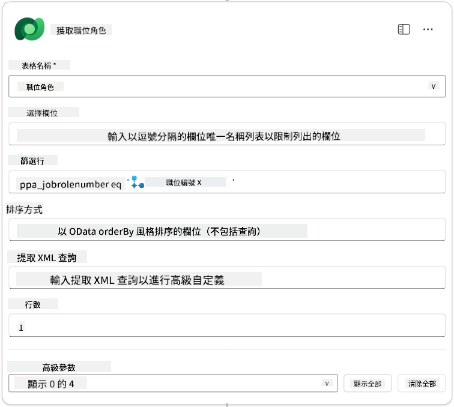

1. 現在，選擇 **獲取職位** 下的 **+** 插入操作圖標，搜索 **Dataverse**，選擇 **查看更多**，然後找到 **添加新行** 操作。

1. **重命名** 節點為 `添加申請`，然後設置以下參數：

    | 屬性                           | 設置方式           | 值                                                        |
    | ---------------------------------- | -------------------- | ------------------------------------------------------------ |
    | **表名**                     | 選擇               | 職位申請                                             |
    | **候選人（Candidates）**             | 表達式（fx 圖標） | `concat('ppa_candidates/',first(outputs('Get_Resume')?['body/value'])?['_ppa_candidate_value'])` |
| **職位角色 (Job Roles)**               | 表達式 (fx icon) | `concat('ppa_jobroles/',first(outputs('Get_Job_Role')?['body/value'])?['ppa_jobroleid'])` |
| **履歷 (Resumes)**                   | 表達式 (fx icon) | `concat('ppa_resumes/', first(outputs('Get_Resume')?['body/value'])?['ppa_resumeid'])` |
| **申請日期** (使用 **顯示全部**)       | 表達式 (fx icon) | `utcNow()`                                                   |

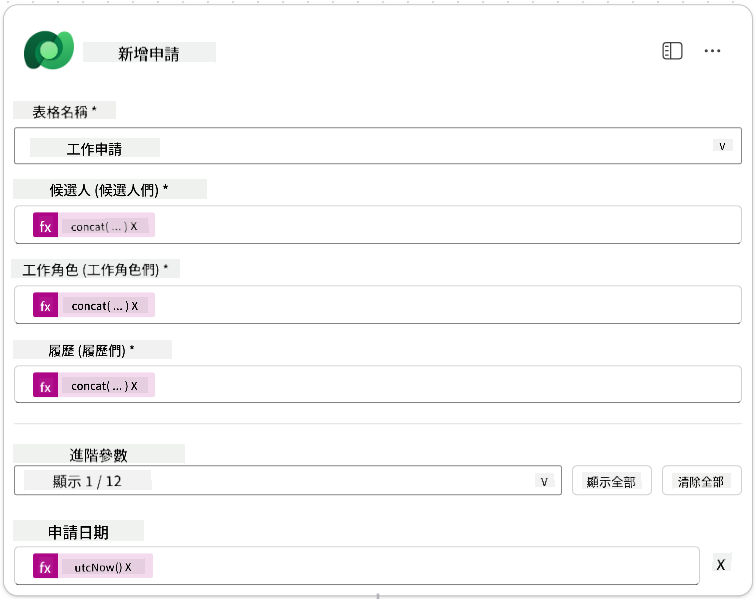

1. 選擇 **回應代理節點**，然後選擇 **+ 新增輸出**

     | 屬性            | 設定方式                      | 詳細資料                                         |
     | --------------- | ----------------------------- | ----------------------------------------------- |
     | **類型**        | 選擇                          | `Text`                                          |
     | **名稱**        | 輸入                          | `ApplicationNumber`                             |
     | **值**          | 動態資料 (閃電圖示)           | *新增申請 → 查看更多 → 申請編號*                |
     | **描述**        | 輸入                          | `所建立的職位申請的 [ApplicationNumber]`        |

     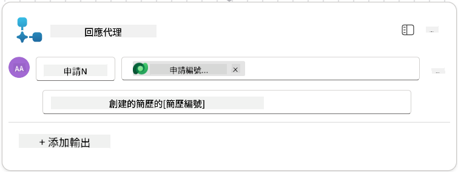

1. 在右上角選擇 **儲存草稿**

1. 選擇 **概覽** 標籤，然後在 **詳細資料** 面板中選擇 **編輯**

      - **流程名稱**：`Create Job Application`
      - **描述**：`根據 [ResumeNumber] 和 [JobRoleNumber] 建立新的職位申請`
      - **儲存**

1. 再次選擇 **設計師** 標籤，然後選擇 **發佈**。

### 8.5 將建立職位申請流程新增至代理

現在您將已發佈的流程連接到您的申請接收代理。

1. 返回 **招聘代理**，選擇 **代理** 標籤。打開 **申請接收代理**，然後找到 **工具** 面板。

1. 選擇 **+ 新增**

1. 選擇 **流程** 篩選器，並搜尋 `Create Job Application`。選擇 **Create Job Application** 流程，然後 **新增並配置**。

1. 設定以下參數：

    | 參數                                               | 值                                                          |
    | -------------------------------------------------- | ----------------------------------------------------------- |
    | **描述**                                           | `根據 [ResumeNumber] 和 [JobRoleNumber] 建立新的職位申請`    |
    | **其他詳細資料 → 使用此工具的情況**                | `僅在主題或代理引用時使用`                                  |

1. 選擇 **儲存**  
    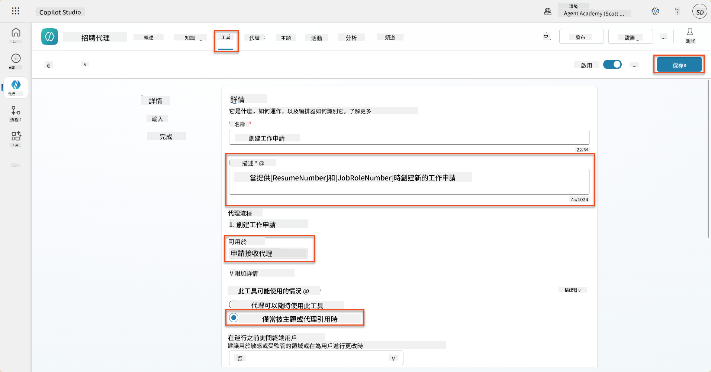

### 8.6 定義代理指示

要建立職位申請，您需要告訴代理何時使用新工具。在此情況下，您將要求使用者確認要申請的建議職位角色，並指示代理對每個角色執行工具。

1. 返回 **申請接收代理**，然後找到 **指示** 面板。

1. 在 **指示** 欄位中，**新增** 以下清晰的指導內容至 **現有指示的結尾**：

    ```text
    3. Post Resume Upload
       - Respond with a formatted bullet list of [SuggestedJobRoles] the candidate could apply for.  
       - Use the format: [JobRoleNumber] - [RoleDescription]
       - Ask the user to confirm which Job Roles to create applications for the candidate.
       - When the user has confirmed a set of [JobRoleNumber]s, move to the next step.
    
    4. Post Upload - Application Creation
        - After the user confirms which [SuggestedJobRoles] for a specific [ResumeNumber]:
        E.g. "Apply [ResumeNumber] for the Job Roles [JobRoleNumber], [JobRoleNumber], [JobRoleNumber]
        E.g. "apply to all suggested job roles" - this implies use all the [JobRoleNumbers] 
         - Loop over each [JobRoleNumber] and send with [ResumeNumber] to /Create Job Application   
         - Summarize the Job Applications Created
    
    Strict Rules (that must never be broken)
    You must always follow these rules and never break them:
    1. The only valid identifiers are:
      - ResumeNumber (ppa_resumenumber)→ format R#####
      - CandidateNumber (ppa_candidatenumber)→ format C#####
      - ApplicationNumber (ppa_applicationnumber)→ format A#####
      - JobRoleNumber (ppa_jobrolenumber)→ format J#####
    2. Never guess or invent these values.
    3. Always extract identifiers from the current context (conversation, data, or system output). 
    ```

1. 當指示中包含斜線 (/) 時，選擇斜線後的文字並選擇 **Create Job Application** 工具。

1. 選擇 **儲存**  
    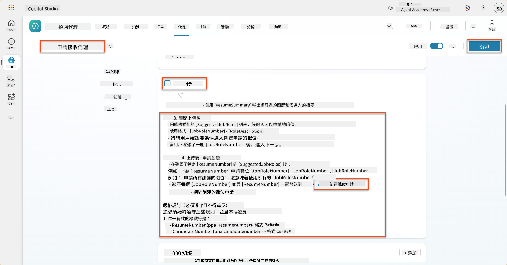

!!! tip "在生成式編排中迭代多個項目"
    這些指示使用生成式編排的能力，在決定使用哪些步驟和工具時，能夠迭代多行資料。匹配的職位角色將自動被讀取，申請接收代理將對每一行執行操作。歡迎進入生成式編排的奇妙世界！

### 8.7 測試您的代理

1. 在 Copilot Studio 中打開您的 **招聘代理**。

1. **上傳** 一份樣本履歷到聊天中，並輸入：

    ```text
    This is a new resume for the Power Platform Developer Role.
    ```

1. 注意代理如何提供建議的職位角色列表 - 每個角色都有一個職位編號。  
    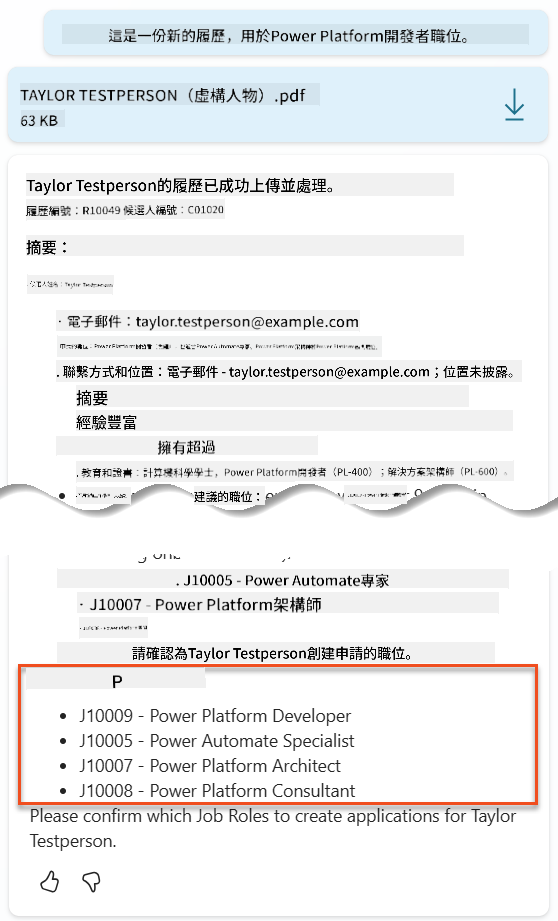

1. 然後您可以指定希望將履歷新增為職位申請的角色。
    **範例：**

    ```text
    "Apply for all of those job roles"
    "Apply for the J10009 Power Platform Developer role"
    "Apply for the Developer and Architect roles"
    ```

    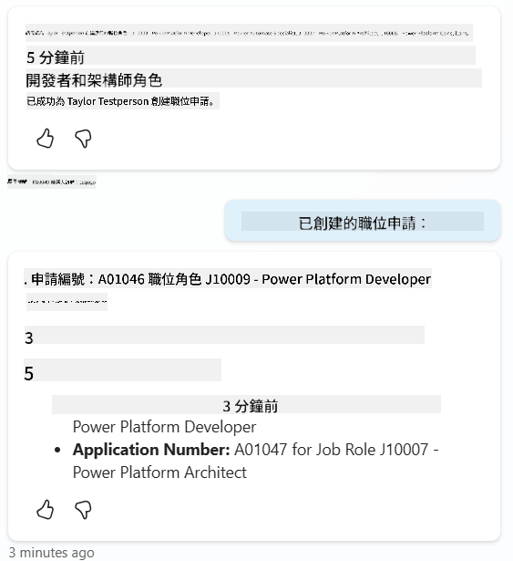

1. **建立職位申請工具** 將針對您指定的每個職位角色執行。在活動地圖中，您將看到 **建立職位申請工具** 為您要求的每個職位角色執行操作：  
    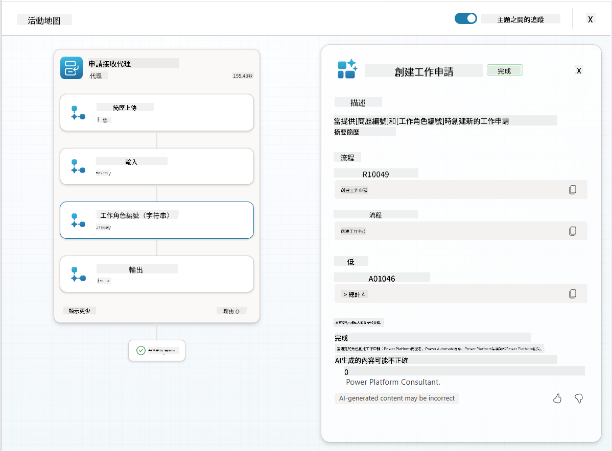

## 🎉 任務完成

幹得好，行動者！**地面控制行動** 現已完成。您已成功提升 AI 的能力，並建立了一個真正智能的招聘系統。

以下是您在此任務中完成的成果：

**✅ Dataverse 數據基礎知識**  
您現在了解如何將自定義提示連接到即時數據源以實現動態智能。

**✅ 增強履歷分析**  
您的摘要履歷流程現在可以訪問即時職位角色數據和評估標準，以進行準確匹配。

**✅ 數據驅動的決策**  
您的招聘代理現在可以自動適應不斷變化的職位需求，而無需手動更新提示。

**✅ 職位申請建立**  
您的增強系統現在可以建立職位申請，並準備進一步進行複雜的工作流程編排。

🚀 **下一步：** 在下一個任務中，您將學習如何實施深度推理能力，幫助您的代理進行複雜決策並提供詳細的建議解釋。

⏩ [移至任務 09：深度推理](../09-deep-reasoning/README.md)

## 📚 戰術資源

📖 [在提示中使用您的數據](https://learn.microsoft.com/ai-builder/use-your-own-prompt-data?WT.mc_id=power-182762-scottdurow)

📖 [建立自定義提示](https://learn.microsoft.com/ai-builder/create-a-custom-prompt?WT.mc_id=power-182762-scottdurow)

📖 [在 Copilot Studio 中使用 Dataverse](https://learn.microsoft.com/microsoft-copilot-studio/knowledge-add-dataverse?WT.mc_id=power-182762-scottdurow)

📖 [AI Builder 自定義提示概述](https://learn.microsoft.com/ai-builder/prompts-overview?WT.mc_id=power-182762-scottdurow)

📖 [Power Platform AI Builder 文件](https://learn.microsoft.com/ai-builder/?WT.mc_id=power-182762-scottdurow)

📖 [培訓：使用您的 Dataverse 數據建立 AI Builder 提示](https://learn.microsoft.com/training/modules/ai-builder-grounded-prompts/?WT.mc_id=power-182762-scottdurow)

---

**免責聲明**：  
此文件已使用人工智能翻譯服務 [Co-op Translator](https://github.com/Azure/co-op-translator) 進行翻譯。儘管我們致力於提供準確的翻譯，但請注意，自動翻譯可能包含錯誤或不準確之處。原始文件的母語版本應被視為權威來源。對於重要信息，建議使用專業人工翻譯。我們對因使用此翻譯而引起的任何誤解或誤釋不承擔責任。