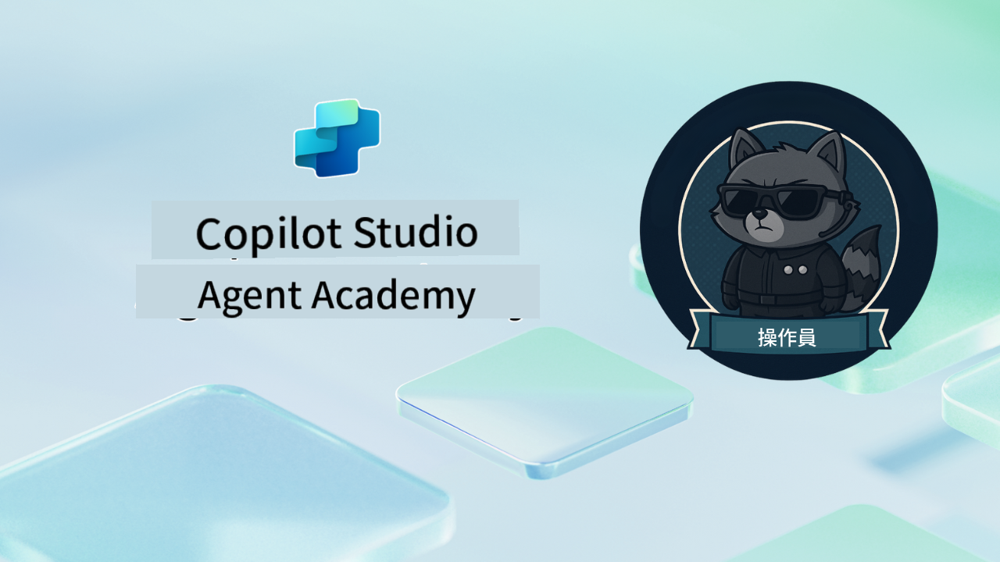

<!--
CO_OP_TRANSLATOR_METADATA:
{
  "original_hash": "24fcbe9a57d3439e05f8866e550c0a84",
  "translation_date": "2025-10-21T23:44:56+00:00",
  "source_file": "docs/operative-preview/README.md",
  "language_code": "hk"
}
-->
# 歡迎，特工

**歡迎，特工。**  
您的高級任務——如果您選擇接受——是掌握使用 **Microsoft Copilot Studio** 建立 **企業級多代理系統** 的藝術。

這項密集訓練將帶您超越基本代理創建，進入 **多代理協作** 的高級世界：從招聘自動化到 AI 安全，您將學習如何使用真實的企業場景來構建、協調和部署智能代理生態系統。

--8<-- "disclaimer.md"

---

## 🎯 任務目標

完成 Agent Academy Operative 計劃後，您將能夠：

- 設計和實施適用於複雜業務場景的 **多代理系統**
- 掌握 **代理協作** 和協調模式
- 在生產系統中實施 **AI 安全和內容審核**
- 建立用於文檔處理和分析的 **多模態提示**
- 部署具有適當治理和測試的 **企業級代理**

---

## 🧪 先決條件

要完成所有任務，您需要：

- 完成 **Agent Academy Recruit** 訓練
- 擁有 Microsoft Power Platform 環境及 **Copilot Studio** 授權
- 訪問 **Microsoft Dataverse**
- 擁有創建解決方案和代理的管理權限

---

## 🧬 適合對象

這門高級課程適合：

- 設計企業 AI 系統的 **解決方案架構師**
- 構建生產就緒代理解決方案的 **開發者**
- 實施 AI 治理和安全的 **IT 專業人士**
- 創建複雜自動化工作流程的 **業務分析師**
- 準備從基礎代理升級到企業系統的任何人

---

## 🧭 課程概覽

這個學院以一系列逐步的現場操作任務為結構——每個任務都建立在前一個任務的基礎上，最終創建一個全面的招聘自動化系統。

| 任務 | 標題 | 行動簡報 |
|------|------|----------|
| `01` | 🚨 [開始使用招聘代理](./01-get-started/README.md) | 部署基礎設施並創建您的核心協調代理 |
| `02` | 🎭 [讓您的代理具備多代理功能並連接其他代理](./02-multi-agent/README.md) | 將單一代理轉化為協調的多代理系統 |
| `03` | ⚡ [使用觸發器自動化您的代理](./03-automate-triggers/README.md) | 使用事件驅動的觸發器實現自主代理行為 |
| `04` | 📝 [編寫代理指令](./04-agent-instructions/README.md) | 掌握精確的代理溝通和行為控制 |
| `05` | 💬 [個性化代理回應](./05-agent-responses/README.md) | 自定義代理回應以達到最大影響和參與度 |
| `06` | 🛡️ [內容審核和 AI 安全要點](./06-ai-safety/README.md) | 實施企業級安全和合規措施 |
| `07` | 🎨 [使用多模態提示提取履歷內容](./07-multimodal-prompts/README.md) | 使用高級 AI 功能處理文檔和圖像 |
| `08` | 🗄️ [提示 - Dataverse 基礎](./08-dataverse-grounding/README.md) | 將代理基於企業數據以提供準確回應 |
| `09` | 🧠 [應用深度推理評估候選人適配性及面試準備](./09-deep-reasoning/README.md) | 實施複雜決策的高級 AI 推理 |
| `10` | 📄 [使用提示生成針對候選人的面試文件](./10-generate-documents/README.md) | 根據代理分析創建動態文檔 |
| `11` | 📊 [使用自適應卡片獲取用戶反饋](./11-obtain-user-feedback/README.md) | 收集並處理用戶反饋以持續改進 |
| `12` | 🌐 [將您的代理發布到演示網站供利益相關者測試](./12-demo-website/README.md) | 部署完整解決方案供利益相關者演示和測試 |

!!! note
    ✅ 完成此課程可獲得 **Operative** 徽章。  
    🔓 **Commander** 將在未來階段解鎖。

<!-- markdownlint-disable-next-line MD033 -->

---

**免責聲明**：  
此文件已使用人工智能翻譯服務 [Co-op Translator](https://github.com/Azure/co-op-translator) 進行翻譯。儘管我們致力於提供準確的翻譯，但請注意，自動翻譯可能包含錯誤或不準確之處。原始文件的母語版本應被視為權威來源。對於重要信息，建議使用專業人工翻譯。我們對因使用此翻譯而引起的任何誤解或誤釋不承擔責任。