<!--
CO_OP_TRANSLATOR_METADATA:
{
  "original_hash": "d9cd8cd1a4fbd8915171a2ed972cc322",
  "translation_date": "2025-10-22T01:02:32+00:00",
  "source_file": "docs/recruit/00-course-setup/README.md",
  "language_code": "hk"
}
-->
# 🚨 任務 00：課程設置

## 🕵️‍♂️ 行動代號：`準備部署行動`

> **⏱️ 行動時間窗口：** `~30 分鐘`  

## 🎯 任務簡介

歡迎來到你作為 Copilot Studio Agent 培訓的第一個任務。  
在開始建立你的第一個 AI Agent 之前，你需要設置一個**準備就緒的開發環境**。

本簡介概述了在 Microsoft 365 生態系統中成功操作所需的系統、訪問憑證和設置步驟。

## 🔎 目標

你的任務包括：

1. 獲取 Microsoft 365 帳戶  
1. 獲得 Microsoft Copilot Studio 的訪問權限  
1. （可選）獲取 Microsoft 365 Copilot 授權以進行生產發布  
1. 創建一個開發環境作為你的 Copilot Studio 環境進行構建  
1. 創建一個 SharePoint 網站作為後續任務中的數據來源  

---

## 🔍 先決條件

在開始之前，請確保你擁有：

1. 一個**工作或學校的電子郵件地址**（不支持個人 @outlook.com、@gmail.com 等）。  
1. 可用的互聯網連接和現代瀏覽器（推薦使用 Edge、Chrome 或 Firefox）。  
1. 對 Microsoft 365 的基本熟悉（例如，登錄 Office 應用或 Teams）。  
1. （可選）如果計劃購買付費授權，需準備一張信用卡或支付方式。

---

## 步驟 1：獲取 Microsoft 365 帳戶

Copilot Studio 位於 Microsoft 365 內，因此你需要一個 Microsoft 365 帳戶才能訪問它。你可以使用現有帳戶（如果有）或按照以下步驟獲取合適的授權：

1. **購買 Microsoft 365 商業訂閱**  
   1. 前往 [Microsoft 365 商業計劃和定價頁面](https://www.microsoft.com/microsoft-365/business/microsoft-365-plans-and-pricing)。  
   1. 最便宜的選項是 Microsoft 365 Business Basic 計劃。選擇 `免費試用`，並按照引導表單填寫訂閱、帳戶詳細信息和支付信息。  
   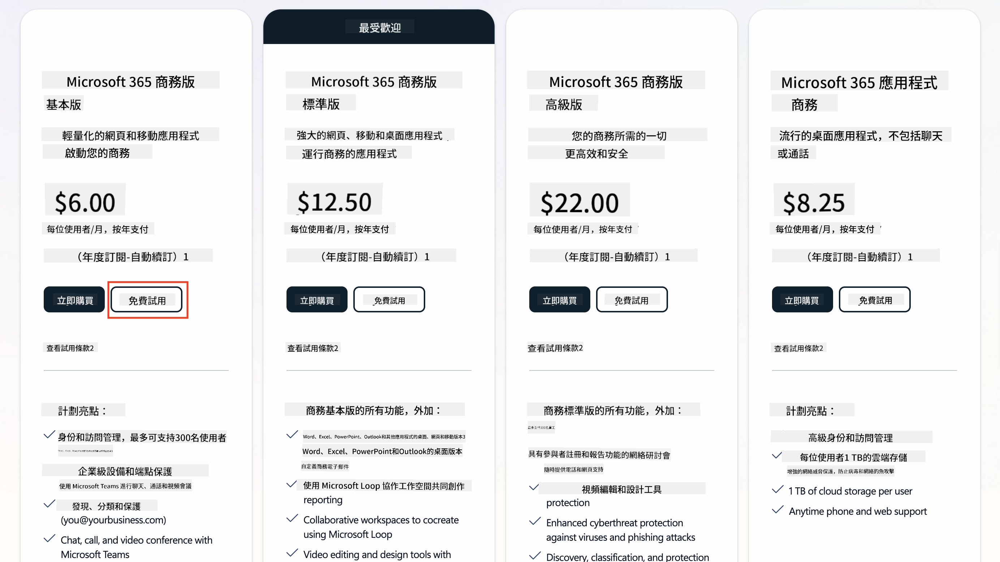  
   1. 獲得新帳戶後，登錄。

    !!! Tip
        如果你計劃將代理發布到 Microsoft 365 Copilot Chat 或連接到組織數據（如 SharePoint、OneDrive、Dataverse），需要 Microsoft 365 Copilot 授權。這是一個附加授權，你可以在[授權網站](https://www.microsoft.com/microsoft-365/copilot#plans)了解更多信息。

---

## 步驟 2：開始 Copilot Studio 試用

獲得 Microsoft 365 Tenant 後，你需要獲得 Copilot Studio 的訪問權限。你可以通過以下步驟獲得免費 30 天試用：

1. 前往 [aka.ms/TryCopilotStudio](https://aka.ms/TryCopilotStudio)。  
1. 輸入你在上一步中配置的新帳戶的電子郵件地址，然後選擇 `下一步`。  
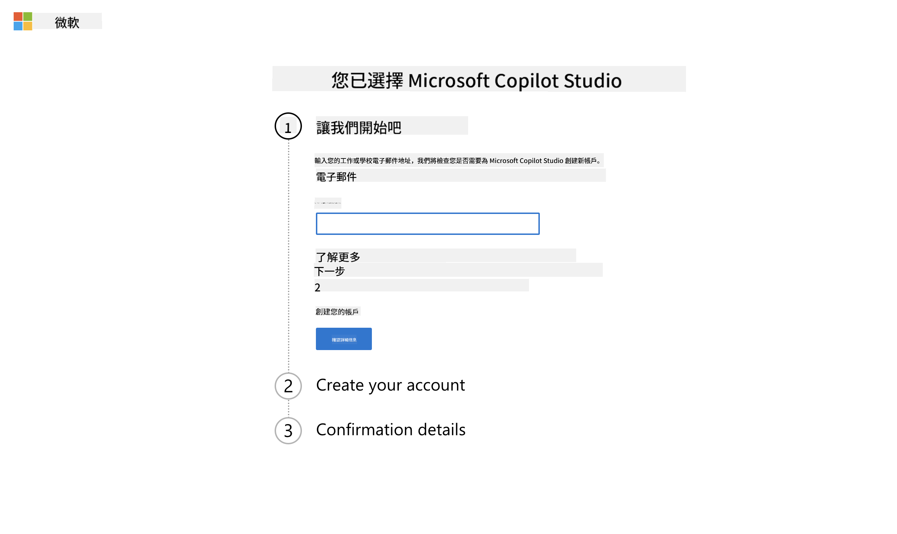  
1. 系統應識別你的帳戶。選擇 `登錄`。  
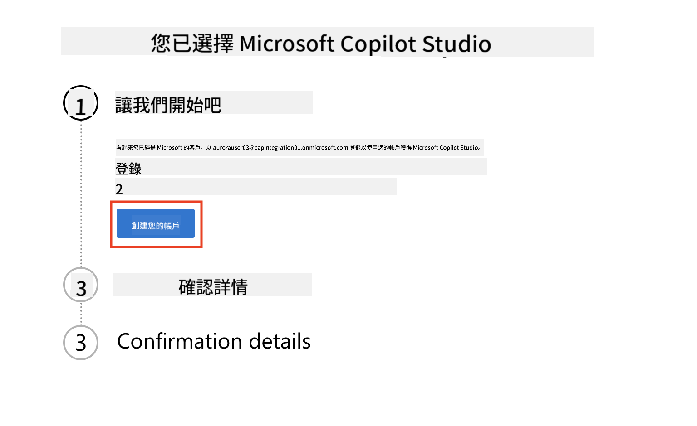  
1. 選擇 `開始免費試用`。  
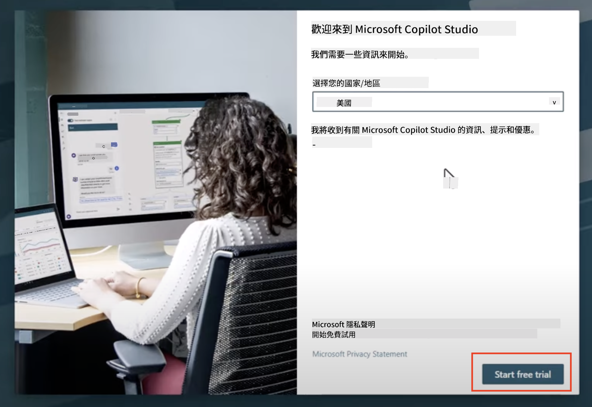  

!!! info "試用注意事項"  
     1. 免費試用提供**完整的 Copilot Studio 功能**。  
     1. 你將收到有關試用到期的電子郵件通知。你可以以 30 天為增量延長試用（最多 90 天的代理運行時間）。  
     1. 如果你的 Tenant 管理員禁用了自助註冊，你將看到錯誤——請聯繫你的 Microsoft 365 管理員重新啟用。

---

## 步驟 3：創建新的開發環境

### 註冊 Power Apps 開發者計劃

使用步驟 1 中的 Microsoft 365 Tenant，註冊 Power Apps 開發者計劃以創建一個免費的開發環境，用於在 Copilot Studio 中進行構建和測試。

1. 在 [Power Apps 開發者計劃網站](https://aka.ms/PowerAppsDevPlan)上註冊。

    - 輸入你的電子郵件地址  
    - 勾選選框  
    - 選擇 **開始免費**  

    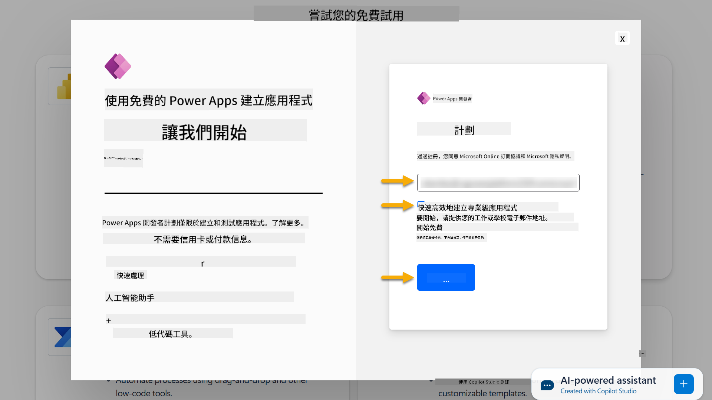

1. 註冊開發者計劃後，你將被重定向到 [Power Apps](https://make.powerapps.com/)。環境使用你的名字，例如 **Adele Vance 的環境**。如果已經有一個同名環境，新的開發者環境將命名為 **Adele Vance 的 (1)** 環境。

    在完成實驗室時，使用此開發者環境於 Copilot Studio。

!!! Note
    如果你使用的是現有的 Microsoft 365 帳戶，而不是在步驟 1 中創建的帳戶，例如使用你在工作組織中的帳戶，你的 IT 管理員（或等效團隊）可能已禁用註冊過程。在這種情況下，請聯繫你的管理員，或按照步驟 1 創建測試 Tenant。

---

## 步驟 4：創建新的 SharePoint 網站

需要創建一個新的 SharePoint 網站，該網站將在[第 6 課 - 使用 Copilot 的對話創建體驗創建自定義代理並基於你的數據進行設置](../06-create-agent-from-conversation/README.md#62-add-an-internal-knowledge-source-using-a-sharepoint-site)中使用。

1. 在 Microsoft Copilot Studio 的左上角選擇方格圖標以查看菜單。從菜單中選擇 SharePoint。

    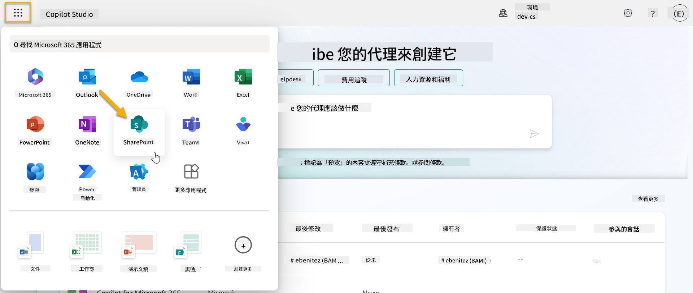

1. SharePoint 將加載。選擇 **+ 創建網站** 以創建新的 SharePoint 網站。

    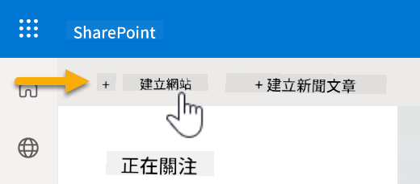

1. 將出現一個對話框引導你創建新的 SharePoint 網站。選擇 **團隊網站**。

    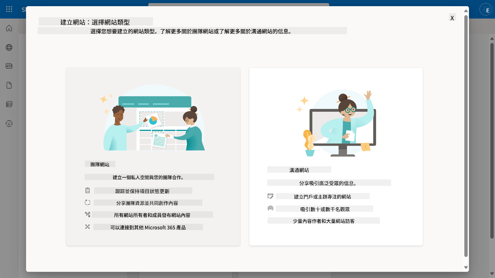

1. 下一步中，默認情況下將加載 Microsoft 模板列表。向下滾動並選擇 **IT 幫助台**模板。

    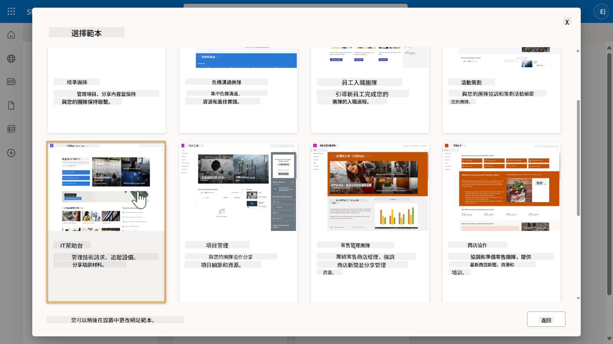

1. 選擇 **使用模板** 以使用 IT 幫助台模板創建新的 SharePoint 網站。

    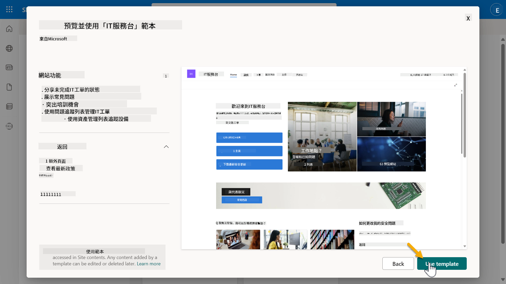

1. 輸入你的網站信息。以下是示例：

    | 欄位 | 值 |
    | --- | --- |
    | 網站名稱 | Contoso IT |
    | 網站描述 | Copilot Studio 初學者 |
    | 網站地址 | ContosoIT |

    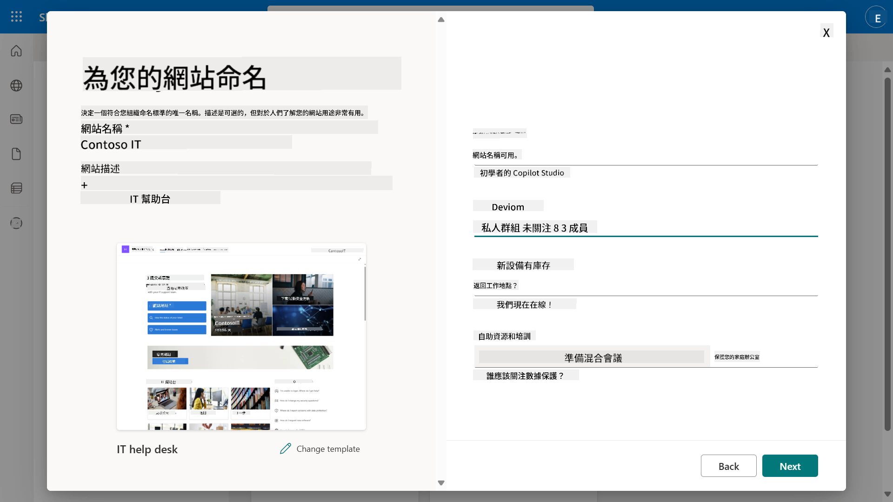

1. 最後一步中，可以選擇 SharePoint 網站的語言。默認情況下為 **英文**。保持語言為 **英文**，然後選擇 **創建網站**。

    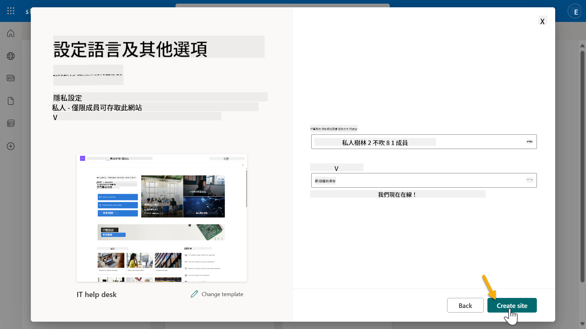

1. SharePoint 網站將在接下來的幾秒內進行配置。同時，你可以選擇通過在 **添加成員** 欄位中輸入他們的電子郵件地址來添加其他用戶到你的網站。完成後，選擇 **完成**。

    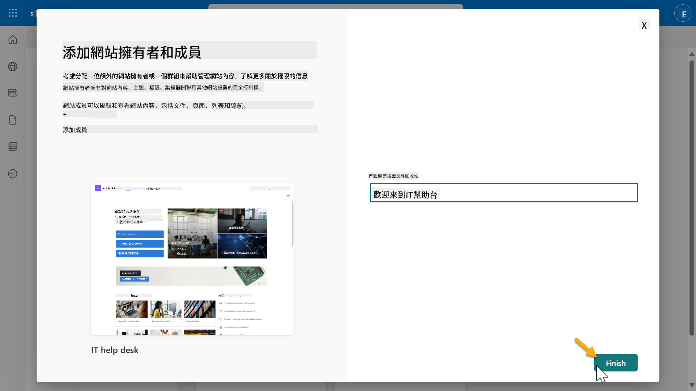

1. SharePoint 網站主頁將加載。**複製** SharePoint 網站 URL。

1. 此模板提供包含各種 IT 政策的示例數據的頁面以及兩個示例列表（Tickets 和 Devices）。

### 使用 Devices SharePoint 列表

我們將在[任務 07 - 添加新主題及觸發器和節點](../07-add-new-topic-with-trigger/README.md#73-add-a-tool-using-a-connector)中使用 **Devices** 列表。

### 添加新欄位

向列表的最右側滾動，選擇 **+ 添加欄位** 按鈕。選擇 **超連結** 類型，輸入 **圖片** 作為欄位名稱，然後選擇添加。

### 在 Devices SharePoint 列表中創建示例數據

你需要確保在此列表中填寫至少 4 個示例數據項目，並向此列表添加一個額外的欄位。

在添加示例數據時，請確保填寫以下欄位：

- 設備照片 - 使用 [設備圖片文件夾](https://github.com/microsoft/agent-academy/tree/main/docs/recruit/00-course-setup/images/device-images)中的圖片  
- 標題  
- 狀態  
- 製造商  
- 型號  
- 資產類型  
- 顏色  
- 序列號  
- 購買日期  
- 購買價格  
- 訂單號  
- 圖片 - 使用以下鏈接  

|設備  |URL  |
|---------|---------|
|Surface Laptop 13     | [https://raw.githubusercontent.com/microsoft/agent-academy/refs/heads/main/docs/recruit/00-course-setup/images/device-images/Surface-Laptop-13.png](https://raw.githubusercontent.com/microsoft/agent-academy/refs/heads/main/docs/recruit/00-course-setup/images/device-images/Surface-Laptop-13.png)        |
|Surface Laptop 15     | [https://raw.githubusercontent.com/microsoft/agent-academy/refs/heads/main/docs/recruit/00-course-setup/images/device-images/Surface-Laptop-15.png](https://raw.githubusercontent.com/microsoft/agent-academy/refs/heads/main/docs/recruit/00-course-setup/images/device-images/Surface-Laptop-15.png)        |
|Surface Pro    | [https://raw.githubusercontent.com/microsoft/agent-academy/refs/heads/main/docs/recruit/00-course-setup/images/device-images/Surface-Pro-12.png](https://raw.githubusercontent.com/microsoft/agent-academy/refs/heads/main/docs/recruit/00-course-setup/images/device-images/Surface-Pro-12.png)        |
|Surface Studio    | [https://raw.githubusercontent.com/microsoft/agent-academy/refs/heads/main/docs/recruit/00-course-setup/images/device-images/Surface-Studio.png](https://raw.githubusercontent.com/microsoft/agent-academy/refs/heads/main/docs/recruit/00-course-setup/images/device-images/Surface-Studio.png)        |

---

## ✅ 任務完成

你已成功：

- 設置 Microsoft 365 開發環境  
- 激活 Copilot Studio 試用  
- 創建用於設置代理的 SharePoint 網站  
- 填充 Devices 列表以供未來任務使用  

你已正式獲得開始 [第 1 課](../01-introduction-to-agents/README.md) **新兵級代理培訓**的資格。  

<!-- markdownlint-disable-next-line MD033 -->

---

**免責聲明**：  
此文件已使用人工智能翻譯服務 [Co-op Translator](https://github.com/Azure/co-op-translator) 進行翻譯。儘管我們致力於提供準確的翻譯，但請注意，自動翻譯可能包含錯誤或不準確之處。原始文件的母語版本應被視為權威來源。對於重要信息，建議使用專業人工翻譯。我們不對因使用此翻譯而引起的任何誤解或誤釋承擔責任。