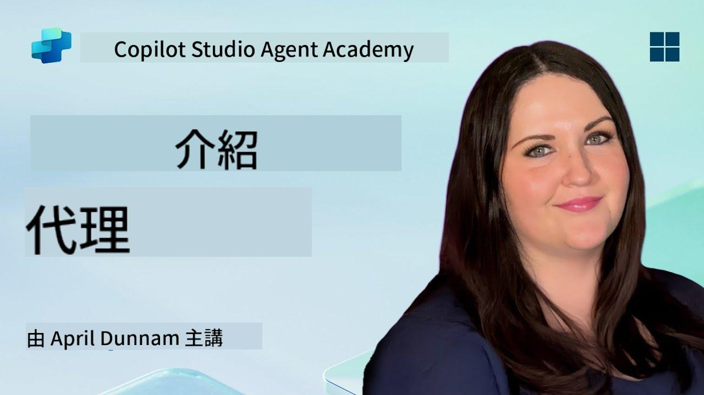

<!--
CO_OP_TRANSLATOR_METADATA:
{
  "original_hash": "d6706e107678264168d77b2e107710b1",
  "translation_date": "2025-10-22T00:33:08+00:00",
  "source_file": "docs/recruit/01-introduction-to-agents/README.md",
  "language_code": "hk"
}
-->
# 🚨 任務 01：代理的介紹

## 🕵️‍♂️ 行動代號：`AI代理解碼行動`

> **⏱️ 行動時間窗口：** `~30分鐘 – 僅限情報，無需外勤工作`

🎥 **觀看操作指南**

## 🎯 任務簡介

歡迎，招募者。在我們深入了解如何建立代理之前，您需要對驅動它們的AI概念有一個堅實的理解。本次任務將為您提供有關對話式AI、大型語言模型（LLMs）、檢索增強生成（RAG）以及您可以在Copilot Studio中創建的代理類型的基礎知識。

## 🔎 目標

在本次任務中，您將學習：

1. 什麼是對話式AI以及它的重要性  
1. 大型語言模型（LLMs）如何驅動聊天體驗  
1. 檢索增強生成（RAG）的作用  
1. 對話式代理和自主代理的區別  
1. Copilot Studio中的代理如何利用這些概念  

讓我們開始吧！

---

## 什麼是對話式AI？

對話式AI指的是任何能夠理解、處理並以自然方式回應人類語言（無論是文字還是語音）的系統。想想客服聊天機器人或您喜愛應用中的虛擬個人助理。在其背後，大多數現代對話式AI依賴於大型語言模型（LLMs），我們接下來會詳細介紹。

### 為什麼重要

- **用戶體驗：** 對話式界面通常比點擊菜單更直觀。  
- **可擴展性：** 一個代理可以同時處理數十或數百個對話。  
- **效率：** 與其建立自定義的基於規則的腳本，LLM驅動的代理可以根據用戶輸入即時適應。  
- **可擴展性：** 通過正確的設計，代理可以訪問知識庫、連接API，或在業務工作流程中充當“數字同事”。

---

## 大型語言模型（LLMs）101

大多數對話式AI系統的核心是**大型語言模型**——基於大量文本語料庫訓練的神經網絡。它們學習語言的統計模式，因此能生成連貫的句子、回答問題，甚至提出創意。以下是一些關鍵點：

1. **訓練數據：** LLMs吸收了海量文本（網頁、書籍、文章）。這種“世界知識”使它們能夠回答多種主題。  
1. **分詞：** 文本被分解為稱為tokens的小單元（單詞、子詞或字符）。模型一次預測一個token。  
1. **上下文窗口：** 每個LLM都有一個限制，能一次“看到”多少tokens。超過這個限制，之前的tokens會被截斷。  
1. **提示：** 您通過發送提示與LLM交互。提示越好，回應越集中且相關。  
1. **零樣本與微調：** 零樣本指直接使用LLM（僅原始權重）。微調則是基於特定領域數據調整模型，使其更準確地回答您的需求。

!!! Tip "專業提示"
    一個常見的比喻是，LLM就像一個“超級智能的自動完成工具”。它並不像人類大腦那樣真正理解含義，但它非常擅長預測序列中的下一個最佳詞（或短語）。

---

## 檢索增強生成（RAG）

當LLMs僅依賴靜態訓練數據時，它們可能會產生幻覺或過時。RAG通過讓模型在生成答案之前“查找”最新信息來解決這個問題。從高層次來看，RAG的工作原理如下：

1. **用戶查詢：** 用戶提出問題（例如，“Contoso最新的季度收益情況如何？”）。  
1. **檢索步驟：** 系統查詢知識來源（文檔、內部數據庫、SharePoint庫等）以找到相關段落。  
1. **增強：** 檢索到的段落被附加到或前置於LLM提示之前。  
1. **生成：** LLM同時吸收用戶的問題和檢索到的上下文，然後生成基於最新數據的回應。  

通過RAG，您的代理可以調用內部公司維基、插件API或搜索FAQ知識庫，並返回不受限於靜態模型參數的答案。

---

## 對話式代理與自主代理

在Copilot Studio的背景下，**代理**這個術語可以指多種AI助手。劃分以下兩種：

**對話式代理：**

- 主要專注於雙向對話。  
- 在多輪對話中保持上下文。  
- 通常通過預定義的流程或觸發器進行編排（例如，“如果用戶說X，則回應Y”）。  
- 適合客戶支持、FAQ、引導式交互、排程或簡單的問答。  
  - 示例：  
    - 一個回答HR政策問題的Teams聊天機器人。  
    - 一個在SharePoint頁面上的Power Virtual Agents機器人，引導用戶完成表單。  

**自主代理：**

- 超越了簡單的對話；它們可以**代表用戶採取行動**。  
- 使用LLM推理循環（想像“計劃 → 行動 → 觀察 → 再計劃”）完成任務。  
- 連接外部工具或API（例如，調用Power Automate流程、發送日曆邀請、操作Dataverse中的數據）。  
- 無需持續的人工提示——一旦觸發，它們可以自主處理多步驟流程。  
  - 示例：  
    - 一個生成旅行行程、預訂航班並發送確認郵件的代理。  
    - 一個“會議摘要”代理，加入Teams通話，實時轉錄並將執行摘要寫入OneNote。  

!!! Info "關鍵區別"
    對話式代理等待用戶輸入並專注於對話。自主代理則主動計劃並執行一系列步驟，使用更廣泛的工具訪問。

---

## Copilot Studio中的代理

**Copilot Studio**將對話式和自主場景統一在一個框架下。以下是Copilot Studio幫助您構建代理的方式：

1. **可視化代理設計器：** 一個低代碼畫布，用於定義提示、記憶和工具，支持聊天和行動工作流程。  
1. **LLM配置：** 從多種OpenAI模型或Microsoft的企業級GPT中選擇，以滿足您的性能和成本需求。  
1. **檢索連接器：** 為SharePoint、OneDrive、Azure Cognitive Search和Dataverse提供預構建集成，支持即時RAG。  
1. **自定義工具與功能：** 定義自定義HTTP操作或Power Automate流程，讓您的代理能自主調用。  
1. **多模態支持：** 除了文本，Copilot Studio代理還可以吸收圖片、文件或結構化數據以豐富上下文。  
1. **發布與分發：** 當您的代理準備就緒後，您可以將其發布到Microsoft 365 Copilot（讓用戶在Teams、SharePoint、Outlook等中調用）或嵌入到網頁上的獨立聊天小工具中。

---

## 🎉 任務完成

您已完成代理和基礎AI概念的介紹。您已了解：

1. **LLMs = 您代理的“大腦”**  
   - 負責語言理解和生成。  
   - 更多tokens = 更豐富的上下文，但每次調用的成本也更高。  

1. **RAG = 實時知識整合**  
   - 彌合靜態LLM與不斷變化的數據源之間的差距。  
   - 檢索並將相關文檔或記錄注入LLM提示中。  

1. **對話式與自主代理**  
   - **對話式：** 專注於對話流程並保持上下文（例如，“會話記憶”）。  
   - **自主：** 添加“行動模塊”，讓代理調用外部工具或服務。

---
接下來，您將探索[Copilot Studio的基礎知識](../02-copilot-studio-fundamentals/README.md)！

保持警惕，招募者——您的AI旅程才剛剛開始！

## 📚 戰術資源

🔗 [Copilot Studio 文件首頁](https://learn.microsoft.com/microsoft-copilot-studio/)

---

---

**免責聲明**：  
此文件已使用人工智能翻譯服務 [Co-op Translator](https://github.com/Azure/co-op-translator) 進行翻譯。儘管我們致力於提供準確的翻譯，但請注意，自動翻譯可能包含錯誤或不準確之處。原始文件的母語版本應被視為權威來源。對於重要信息，建議使用專業人工翻譯。我們不對因使用此翻譯而引起的任何誤解或誤釋承擔責任。