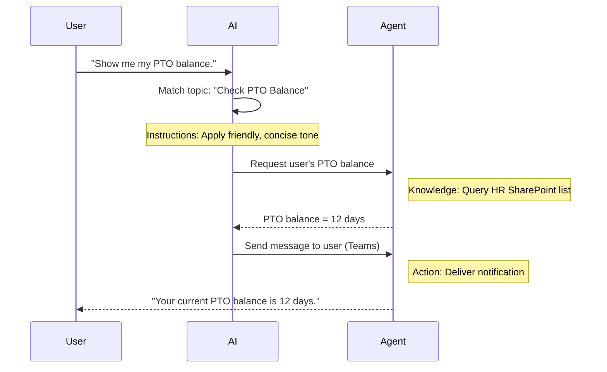

<!--
CO_OP_TRANSLATOR_METADATA:
{
  "original_hash": "90a3c5122f5687bbc8cc819990f175d4",
  "translation_date": "2025-10-22T00:54:17+00:00",
  "source_file": "docs/recruit/02-copilot-studio-fundamentals/README.md",
  "language_code": "hk"
}
-->
# 🚨 任務 02：Copilot Studio 基礎知識

## 🕵️‍♂️ 行動代號：`核心協議行動`

> **⏱️ 行動時間窗口：** `~30 分鐘 – 僅限情報，無需外勤工作`  

🎥 **觀看操作指南**

[](https://www.youtube.com/watch?v=x4OCwDRGeLE "在 YouTube 上觀看操作指南")

## 🎯 任務簡介

歡迎，招募者。本次任務將為您提供基礎情報，幫助您了解 Copilot Studio 的運作方式，以及如何構建能夠提供真正商業價值的智能代理。

在構建您的第一個代理之前，您需要了解每個自定義 AI 代理的四個關鍵組成部分：知識、工具、主題和指令。您還將學習這些元素如何在 Copilot Studio 的協調器中協同工作。

## 🔎 目標

在本次任務中，您將：

- **了解什麼是 Copilot Studio**
- **了解何時以及為什麼使用代理**
- **探索代理的四個構建模塊**
      - **知識**
      - **工具**
      - **主題**
      - **指令**
- **理解這些組成部分如何協同工作**，以創建智能化、自動化的代理

---

## Copilot Studio 中的代理是什麼？

**代理**是一種專門的 AI 助手，您可以設計它來處理特定任務或查詢。與通用聊天機器人不同，您的代理：

- **了解公司特定數據**（政策、文件、數據庫）  
- **執行現實世界的任務**（發送消息、創建日曆事件、更新記錄）  
- **保持對話上下文**，因此它可以跟進之前的問題  

由於 Copilot Studio 是低代碼的，您可以拖放預建組件——不需要深厚的編程技能。一旦代理構建完成，人們可以在 Teams、Slack 或甚至自定義網頁中調用它，以獲得答案或自動觸發工作流程。

---

## 何時以及為什麼使用 Copilot Studio

雖然 Microsoft 365 Copilot 提供了跨 Office 應用的通用 AI 協助，但當以下情況時，您可能需要自定義代理：

### 您需要特定領域的知識

- 現成的 Copilot 可能無法了解您公司的內部程序或數據。代理可以查詢您的 SharePoint 網站、數據庫或自定義來源，以提供準確、最新的答案。  

### 您希望自動化多步工作流程

- 例如："當有人提交報銷時，將其發送審批，更新財務追蹤器，並通知經理。" 自定義代理可以處理每一步，通過單一指令或事件觸發。  

### 您需要上下文相關的工具內體驗  

- 想像一個 Teams 中的新員工入職代理，它可以指導人力資源員工了解每項政策，發送必要的表格，並安排入職會議——直接在您現有的協作平台內完成。  

---

## 代理的四個構建模塊

每個 Copilot Studio 代理由四個核心組成部分構建：

1. **知識**  
1. **工具（操作）**  
1. **主題**  
1. **指令**

以下，我們將定義每個構建模塊並展示它們如何協同工作以創建一個有效的代理。

### 1. 知識

**知識**是代理用於準確回答問題的數據和上下文。它有兩個部分：

#### 自定義指令與上下文

- 您需要撰寫一段簡短的描述，說明代理的目的和語氣。例如：  

    ```text
    You are an IT support agent. You help employees troubleshoot common software issues, provide troubleshooting steps, and escalate urgent tickets.
    ```

- 在對話中，代理記住之前的回合，因此它可以回顧已討論的內容（例如，如果用戶首先說："我的打印機無法使用"，然後再問："你檢查過墨水量了嗎？"，代理會記住打印機的上下文）。

#### 知識來源（基礎數據）

- 您可以將代理連接到多個數據來源——SharePoint 資料庫、文檔網站、維基或其他數據庫。  
- 當用戶提出問題時，代理從這些來源中提取相關摘錄，因此答案是基於您組織的實際政策、產品手冊或任何專有信息。  
- 您甚至可以強制代理僅使用這些來源的信息進行回答，防止它猜測或"幻覺"答案。

!!! example
    一個"政策助手"代理可能連接到您的 HR SharePoint 網站。如果用戶問："我們的 PTO 累積率是多少？"，代理會從 HR 政策文件中檢索準確的文本，而不是依賴通用的 AI 回應。

---

### 2. 工具（操作）

**工具（操作）**定義代理除了聊天之外可以執行的任務。每個操作都是代理以編程方式執行的任務，例如：

- 發送電子郵件或 Teams 消息  
- 創建或更新日曆事件  
- 添加或編輯數據庫中的記錄（例如 SharePoint 列表或 Dataverse 表）  
- 調用 Power Automate 流程或 REST API  

#### 操作如何運作

- **定義輸入與輸出**  
      - 例如，發送電子郵件操作可能需要：  
        - `RecipientEmailAddress`  
        - `SubjectLine`  
        - `EmailBody`  

- **將操作組合成工作流程**  
      - 通常，滿足用戶請求涉及多個步驟。  
      - 您可以按順序安排操作，使得：  
             1. 代理從 SharePoint 列表中檢索數據。  
             2. 它使用 LLM 生成摘要。  
             3. 它發送 Teams 消息包含該摘要。  

- **連接到外部系統**  
      - 如果您需要更新 CRM 或調用內部 API，請創建自定義操作來處理。  
      - Copilot Studio 可以與 Power Platform 或任何基於 HTTP 的端點集成。

!!! example "一個"報銷助手"代理可以："  
    1. 監聽"提交報銷"請求。  
    2. 從表單中抓取用戶的報銷詳細信息。  
    3. 使用"添加到 SharePoint 列表"操作存儲數據。  
    4. 觸發"發送電子郵件"操作通知審批人。  

---

### 3. 主題

**主題**定義代理的對話觸發器或入口點。每個主題對應於一個功能或問題類別。

#### 對話觸發器  

- 一個主題可能是"提交 IT 工單"、"檢查假期餘額"或"創建銷售報告"。  
- 在底層，Copilot Studio 使用**生成式協調**：而不是依賴精確的關鍵字，AI 會解釋用戶意圖並根據您提供的簡短描述選擇正確的主題。  

#### 主題描述  

- 在每個主題中，您需要撰寫一個清晰、簡潔的描述，說明該主題涵蓋的內容。

!!! example "主題描述示例"
    此主題幫助用戶提交 IT 支援工單，收集問題詳細信息、優先級和聯繫信息。

- AI 使用該描述來決定何時激活此主題，即使用戶的措辭不完全匹配。

#### 將主題映射到操作  

- 每個主題都連接到一個或多個操作或數據檢索步驟。  
- 當 AI 選擇一個主題時，它會引導對話通過您定義的序列（詢問後續問題、調用操作、返回結果）。

!!! example
    如果用戶說："我需要幫助設置我的新筆記本電腦"，AI 可能將該意圖匹配到"提交 IT 工單"主題。代理然後詢問筆記本型號、用戶詳細信息，並自動將工單推送到客服系統。

---

### 4. 指令

**指令**（有時稱為"提示"或"系統消息"）指導 LLM 的語氣、風格和邊界。它們塑造代理在任何情況下的回應方式。

#### 角色與身份  

- 您告訴 AI 它是誰（例如："您是 Contoso 零售的客戶服務代理"）。  
- 這設定了語氣——友好、簡潔、正式或隨意——取決於您的使用場景。

#### 回應指南  

- 指定代理必須遵守的任何規則，例如：  
      - "始終以項目符號形式總結政策信息。"  
      - "如果您不知道答案，請說‘抱歉，我沒有該信息。’"  
      - "絕不在上下文之外包含機密數據。"

#### 記憶與上下文規則

- 您可以指示代理記住多少回合的對話。  
- 例如："記住此用戶請求的詳細信息最多三個後續問題。"

!!! example "在一個"福利顧問"代理中，您可能包括："
    "回答問題時，始終引用最新的 HR 手冊。如果被問及註冊截止日期，提供政策中的具體日期。將答案保持在 150 字以內。"

---

## 四個構建模塊如何協同工作

當您組合**知識**、**工具**、**主題**和**指令**時，Copilot Studio 的 AI 協調器會創建一個代理，該代理：

1. **聆聽相關主題**（由您的主題描述指導）。  
1. **應用指令**以設置語氣、決定何時詢問後續問題並執行規則。  
1. **利用知識來源**以基於您組織的數據提供答案。  
1. **調用工具（操作）**以執行任務——發送消息、更新記錄或調用 API。  

在底層，協調器使用**生成式規劃**方法：它決定採取哪些步驟以及以何種順序滿足用戶請求。如果操作失敗（例如，無法發送電子郵件），代理會遵循您的異常處理指南（詢問澄清問題或報告錯誤）。由於 LLM 適應對話上下文，代理可以在多個回合中保持記憶，並在對話展開時整合新信息。

**視覺流程示例：**  
<!--
1. **用戶：** "顯示我的 PTO 餘額。"
1. **AI（主題）：** 匹配"檢查 PTO 餘額"主題。  
1. **AI（指令）：** 使用友好、簡潔的語氣。  
1. **代理（知識）：** 查詢 HR SharePoint 列表以獲取用戶的餘額。  
1. **代理（操作）：** 檢索值並發送 Teams 消息：  
   > "您的當前 PTO 餘額為 12 天。"  
-->



---

## 🎉 任務完成

您已成功完成基礎知識簡報。您現在已了解 Copilot Studio 中任何代理的四個基本構建模塊：

1. **知識** – 代理查找事實信息並保持對話記憶的地方。  
1. **工具** – 代理可以執行的任務以自動完成事情。  
1. **主題** – 代理如何識別用戶意圖並決定運行哪個工作流程。  
1. **指令** – 指導每個回應的規則、語氣和邊界。

有了這些組成部分，您可以構建一個基本代理來回答問題並執行簡單的工作流程。在下一課中，我們將逐步演示如何創建一個"服務台"代理——從連接您的第一個知識來源到定義主題並連接操作。

接下來：您將構建您的[第一個 M365 Copilot 宣告式代理](../03-create-a-declarative-agent-for-M365Copilot/README.md)。

<!-- markdownlint-disable-next-line MD033 -->


---

**免責聲明**：  
此文件已使用人工智能翻譯服務 [Co-op Translator](https://github.com/Azure/co-op-translator) 進行翻譯。儘管我們致力於提供準確的翻譯，但請注意，自動翻譯可能包含錯誤或不準確之處。原始文件的母語版本應被視為權威來源。對於重要信息，建議使用專業人工翻譯。我們對因使用此翻譯而引起的任何誤解或誤釋不承擔責任。