<!--
CO_OP_TRANSLATOR_METADATA:
{
  "original_hash": "0c51aabca81d6256990caf4c015e6195",
  "translation_date": "2025-10-22T00:35:55+00:00",
  "source_file": "docs/recruit/04-creating-a-solution/README.md",
  "language_code": "hk"
}
-->
# 🚨 任務 04：為您的代理創建解決方案

## 🕵️‍♂️ 行動代號：`OPERATION CTRL-ALT-PACKAGE`

> **⏱️ 行動時間窗口：** `~45 分鐘`

🎥 **觀看操作指南**

[](https://www.youtube.com/watch?v=1iATbkgfcpU "在 YouTube 上觀看操作指南")

## 🎯 任務簡介

代理製造者，歡迎參加您的下一個戰術行動。在這次任務中，您將學習如何組裝解決方案——這是使用 Microsoft Copilot Studio 為您的 IT 幫助台代理部署的官方工具。可以將其視為一個數字公文包，存放您的代理及其相關的工件。

每個代理都需要一個結構良好的家。這就是 Power Platform 解決方案提供的功能——秩序、可移植性以及生產準備。

讓我們開始打包吧。

## 🔎 目標

在這次任務中，您將學習：

1. 理解 Power Platform 解決方案是什麼以及它們在代理開發中的角色
1. 學習使用解決方案組織和部署代理的好處
1. 探索解決方案發布者及其在組件管理中的重要性
1. 理解 Power Platform 解決方案生命周期，從開發到生產
1. 為您的 IT 幫助台代理創建自己的解決方案發布者和自定義解決方案

## 🕵🏻‍♀️ 解決方案是什麼？

在 Microsoft Power Platform 中，解決方案就像容器或包裹，存放您的應用或代理的所有部分——這些部分可能包括表格、表單、流程和自定義邏輯。解決方案對於應用生命周期管理（ALM）至關重要，它使您能夠從創意到開發、測試、部署和更新，管理您的應用和代理。

在 Copilot Studio 中，您創建的每個代理都存儲在 Power Platform 解決方案中。默認情況下，代理會創建在 Default 解決方案中，除非您創建新的自定義解決方案來存放您的代理。在本課程和實驗中，我們將學習如何做到這一點 🤓。

解決方案通常是在 **Power Apps 製作門戶** 中創建的——這是一個基於網頁的界面，您可以在其中構建和自定義應用、Dataverse、流程、探索 AI 組件等。

   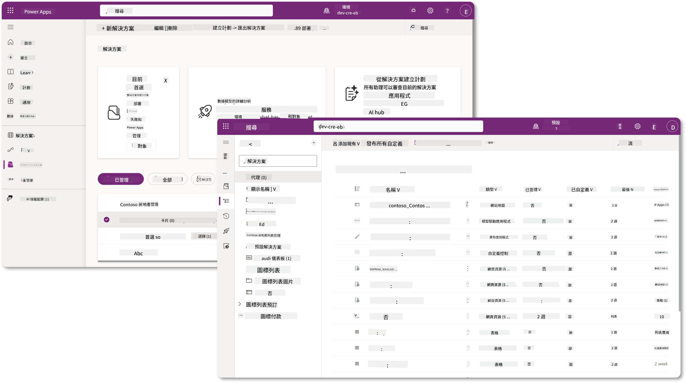

在 Copilot Studio 中，現在有了 **Solution Explorer**，您可以直接管理您的解決方案。您不再需要切換到 Power Apps 製作門戶來管理解決方案，這些操作可以直接在 Copilot Studio 中完成 🪄。

這意味著您可以執行常見的解決方案相關任務：

- **創建解決方案** - 自定義解決方案使代理可以在不同環境之間導出和導入。
- **設置首選解決方案** - 選擇代理、應用等默認創建的解決方案。
- **添加或移除組件** - 您的代理可能引用其他組件，例如環境變量或雲流程。因此需要將這些組件包含在解決方案中。
- **導出解決方案** - 將解決方案移動到另一個目標環境。
- **導入解決方案** - 導入其他地方創建的解決方案，包括升級或更新解決方案。
- **創建和管理解決方案管道** - 自動化解決方案在環境之間的部署。
- **Git 集成** - 使開發者能夠將解決方案與 Git 存儲庫連接，用於版本控制、協作和 ALM。僅限於開發環境使用。

   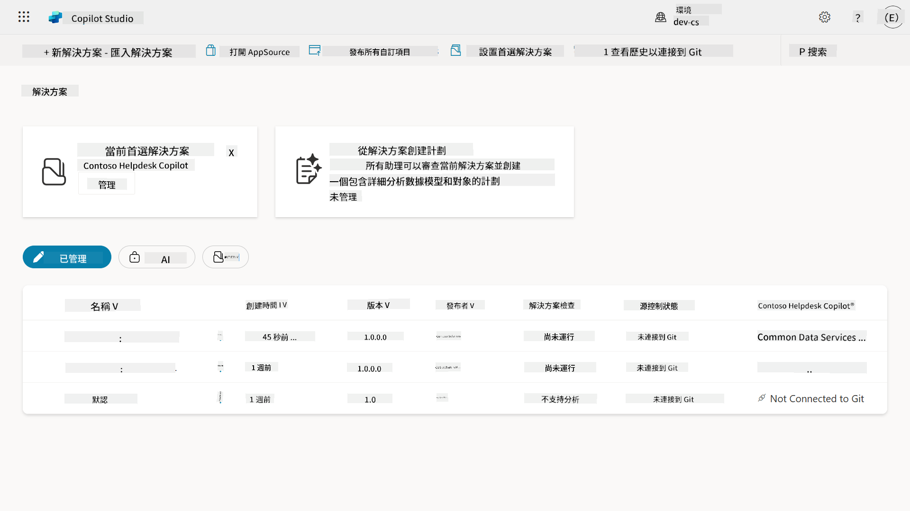

解決方案有兩種類型：

- **未管理解決方案** - 用於開發期間。您可以根據需要自由編輯和自定義。
- **已管理解決方案** - 當您準備將應用部署到測試或生產環境時使用。這些解決方案被鎖定以防止意外更改。

## 🤔 為什麼我應該為我的代理使用解決方案？

將解決方案想像成一個工具箱。當您需要在不同位置（環境）修復或構建某些東西（代理）時，您會收集所有必要的工具（組件）並將它們放入工具箱（解決方案）。然後，您可以將這個工具箱帶到新位置（環境），使用工具（組件）完成工作，或者添加新工具（組件）來自定義您的代理或正在構建的項目。

!!! quote "Elaiza，您的友好雲倡導者在此分享一些話:"
    在新西蘭，我們有一句話叫 "Be a tidy Kiwi!"，這是一個呼籲新西蘭人 🥝 負責自己的環境，妥善處理垃圾並保持公共空間清潔。我們可以用相同的理念來管理代理，通過保持與代理相關的一切井然有序和可移動，幫助您維持一個整潔的環境。

在您的源（開發者）環境中創建一個專用解決方案來存放代理是一個良好的做法。以下是解決方案的價值所在：

🧩 **有序的開發**

- 您將代理與 Default 解決方案分開，Default 解決方案包含環境中的所有內容。所有代理組件都集中在一個地方 🎯。

- 您需要的所有代理內容都在解決方案中，使其更容易導出和導入到目標環境 👉🏻 這是一個健康的 ALM 習慣。

🧩 **安全的部署**

- 您可以將應用或代理導出為已管理解決方案，並部署到其他目標環境（例如測試或生產），而不會冒意外編輯的風險。

🧩 **版本控制**

- 您可以創建補丁（目標修復）、更新（更全面的更改）或升級（替換解決方案——通常是重大更改並引入新功能）。

- 幫助您以受控方式推出更改。

🧩 **依賴管理**

- 解決方案跟蹤哪些部分相互依賴。這可以防止您在進行更改時破壞其他部分。

🧩 **團隊協作**

- 開發者和製作者可以在開發中使用未管理解決方案進行合作，然後交付已管理解決方案進行部署。

## 🪪 理解解決方案發布者

Power Platform 中的解決方案發布者就像一個標籤或品牌，標識誰創建或擁有解決方案。它是管理您的應用、代理和流程自定義的重要部分，尤其是在團隊或跨環境工作時。

當您創建解決方案時，必須選擇一個發布者。這個發布者定義了：

- 一個前綴，會添加到所有自定義組件（例如表格、字段和流程）。

- 一個名稱和聯繫信息，用於標識擁有解決方案的組織或個人。

### 🤔 為什麼重要？

1. **便於識別** - 前綴（例如 `new_` 或 `abc_`）幫助您快速識別哪些組件屬於哪個解決方案或團隊。

1. **避免衝突** - 如果兩個團隊都創建了一個名為 status 的列，它們的前綴（`teamA_status`，`teamB_status`）可以防止命名衝突。

1. **支持 ALM** - 在環境之間移動解決方案（開發 → 測試 → 生產）時，發布者幫助跟蹤所有權並保持一致性。

### ✨ 示例

假設您創建了一個名為 Contoso Solutions 的發布者，前綴為 `cts_`。

如果您添加了一個名為 _Priority_ 的自定義列，它將以 `cts_Priority` 的形式存儲在解決方案中。

任何人無論在哪個環境中看到這個列，都可以輕鬆識別它是與 Contoso Solutions 相關的列。

## 🧭 Power Platform 解決方案生命周期

現在您已經了解了解決方案的用途，接下來我們來學習它的生命周期。

**1. 在開發環境中創建解決方案** - 首先在您的開發環境中創建一個新解決方案。

**2. 添加組件** - 向解決方案中添加應用、流程、表格和其他元素。

**3. 導出為已管理解決方案** - 將解決方案打包以進行部署，導出為已管理解決方案。

**4. 導入到測試環境** - 在單獨的測試環境中測試您的解決方案，確保一切正常。

**5. 導入到生產環境** - 將測試過的解決方案部署到您的實時生產環境。

**6. 應用補丁、更新或升級** - 使用補丁、更新或升級進行改進或修復。🔁 重複此周期！

### ✨ 示例

假設您正在構建一個 IT 幫助台代理，幫助員工解決設備問題、網絡故障排除、打印機設置等問題。

- 您首先在開發環境中使用未管理解決方案開始。

- 一旦準備好，您將其導出為已管理解決方案並導入到目標環境，例如系統測試或用戶驗收測試（UAT）環境。

- 測試完成後，您將其移動到生產環境——完全不觸碰原始開發版本。

## 🧪 實驗 04：創建新解決方案

我們現在將學習

- [4.1 如何創建解決方案發布者](../../../../../docs/recruit/04-creating-a-solution)
- [4.2 如何創建解決方案](../../../../../docs/recruit/04-creating-a-solution)

我們將繼續之前的示例，在專用的 Copilot Studio 環境中創建一個解決方案，用於構建我們的 IT 幫助台代理。

讓我們開始吧！

### 先決條件

#### 安全角色

在 Copilot Studio 中，您在解決方案探索器中能執行的操作取決於您的用戶安全角色。
如果您沒有權限在 Power Apps 管理中心管理解決方案，那麼您也無法在 Copilot Studio 中執行這些任務。

為確保一切順利，請檢查您是否擁有正確的安全角色和權限。如果您不管理組織中的環境，請向您的 IT 管理員（或同等職位）團隊詢問，了解誰管理您的租戶/環境。

以下是允許用戶在其環境中創建解決方案的安全角色。

| 安全角色    | 描述 |
| ---------- | ---------- |
| 環境製作者 | 提供必要的權限以創建、定制和管理特定環境中的資源，包括解決方案  |
| 系統定制者  | 比環境製作者擁有更廣泛的權限，包括定制環境和管理安全角色 |
| 系統管理員   | 最高級別的權限，可以管理環境的所有方面，包括創建和分配安全角色     |

#### 開發者環境

確保您切換到專用的開發者環境，請參考 [課程 00 - 課程設置 - 步驟 3：創建新開發者環境](../00-course-setup/README.md#step-3-create-new-developer-environment)。

1. 在右上角，選擇 **齒輪圖標**，從默認環境切換到您的環境，例如 **Adele Vance 的環境**。

    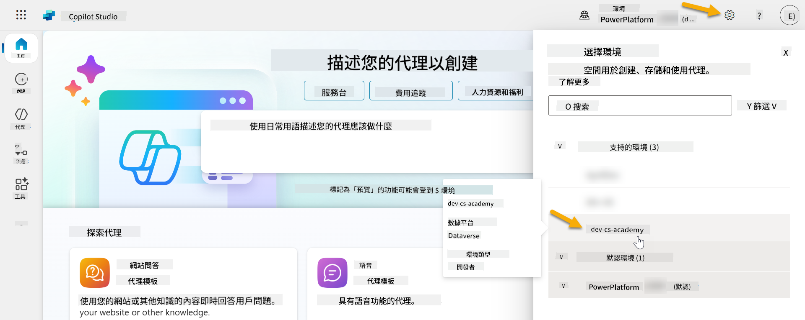

### 4.1 創建解決方案發布者

1. 使用上一課中使用的相同 Copilot Studio 環境，選擇 Copilot Studio 左側菜單中的 **省略號 (. . .)** 圖標。選擇 **Explore** 標題下的 **Solutions**。

    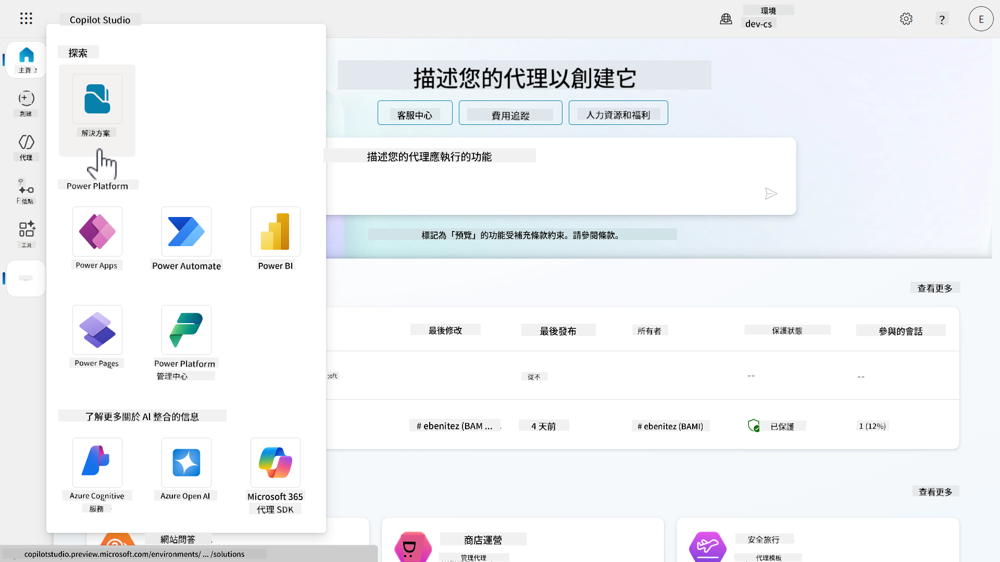

1. Copilot Studio 中的 **Solution Explorer** 將加載。選擇 **+ New solution**。

    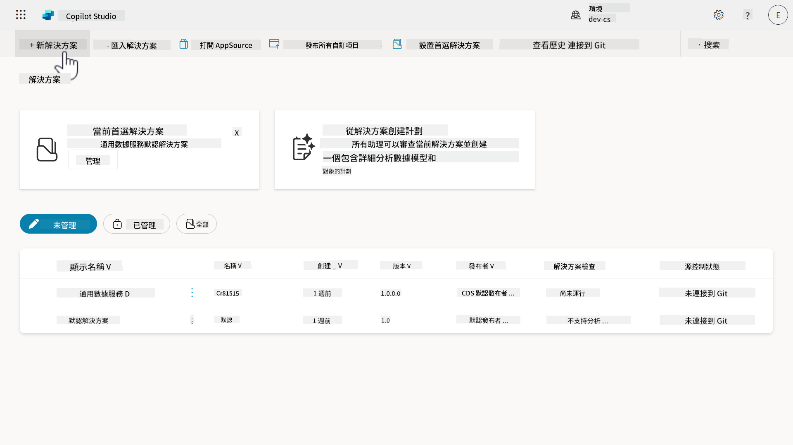

1. **New solution** 面板將出現，我們可以在其中定義解決方案的詳細信息。首先，我們需要創建一個新的發布者。選擇 **+ New publisher**。

    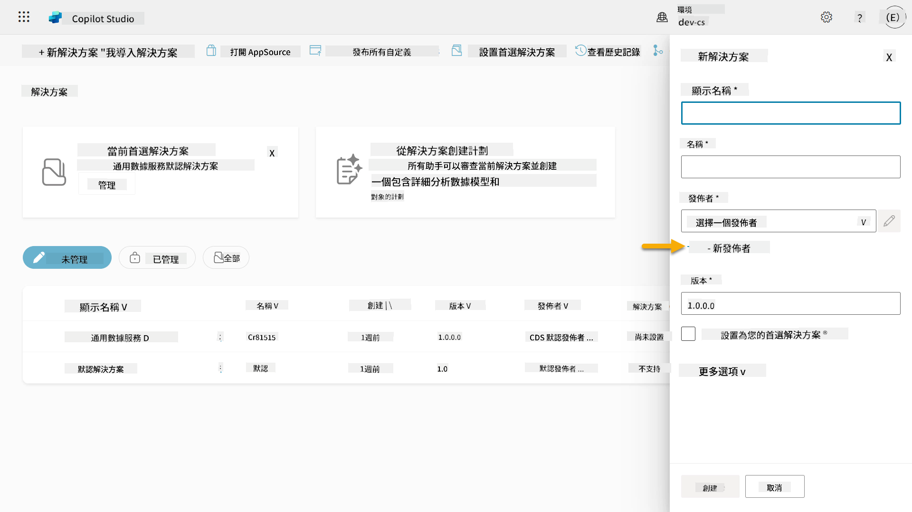  

1. **New publisher** 面板的 **Properties** 標籤將出現，其中包含需要填寫的必填和非必填字段。在 **Properties** 標籤中，我們可以概述發布者的詳細信息，這將用作標籤或品牌，標識誰創建或擁有解決方案。

    | 屬性    | 描述 | 必填 |
    | ---------- | ---------- | :----------: |
    | 顯示名稱 | 發布者的顯示名稱 | 是   |
    | 名稱  | 發布者的唯一名稱和架構名稱  | 是    |
    | 描述   | 概述解決方案的目的    | 否     |
    | 前綴    | 發布者前綴，將應用於新創建的組件   | 是      |
    | 選項值前綴   | 根據發布者前綴生成一個數字。此數字在您向選項添加選項時使用，並提供指示哪個解決方案用於添加選項的指標。   | 是      |

    將以下內容複製並粘貼為 **顯示名稱**，

    ```text
    Contoso Solutions
    ```

    將以下內容複製並粘貼為 **名稱**，

    ```text
    ContosoSolutions
    ```

    將以下內容複製並粘貼為 **描述**，

    ```text
    Copilot Studio Agent Academy
    ```

    將以下內容複製並粘貼為 **前綴**，

    ```text
    cts
    ```

    默認情況下，**選項值前綴** 將顯示一個整數值。將此整數值更新為最接近的千位數。例如，在我的屏幕截圖中，最初是 `77074`。將其從 `77074` 更新為 `77000`。

    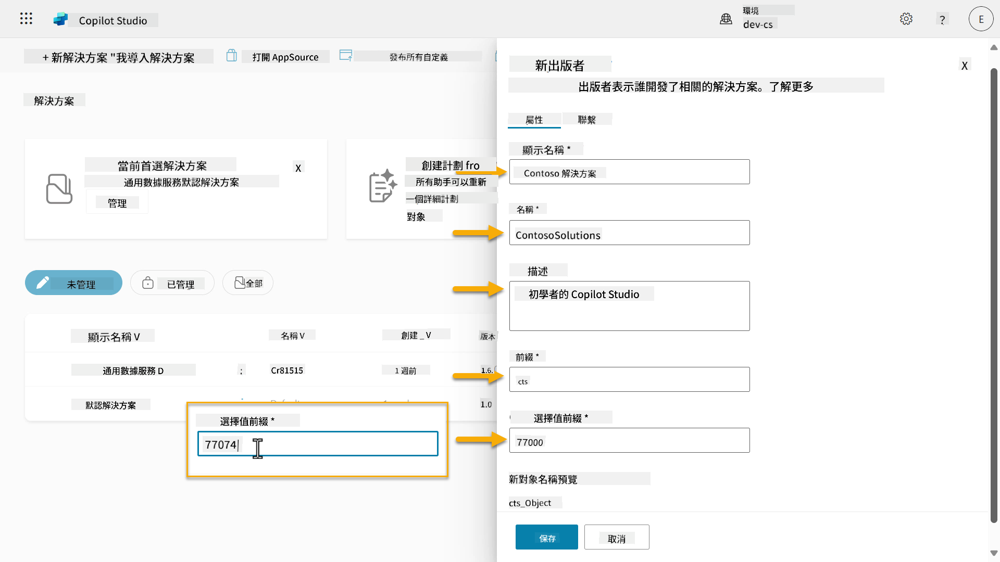  

1. 如果您希望提供解決方案的聯繫信息，請選擇 **Contact** 標籤並填寫顯示的以下列。

    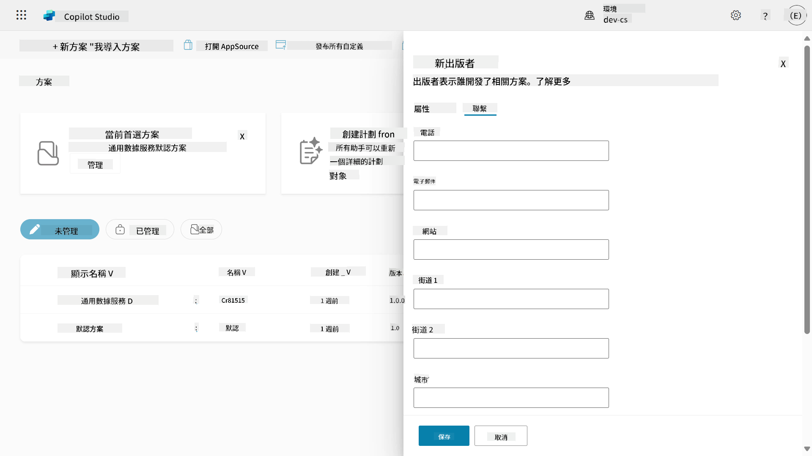

1. 選擇 **Properties** 標籤並選擇 **Save** 以創建發布者。

    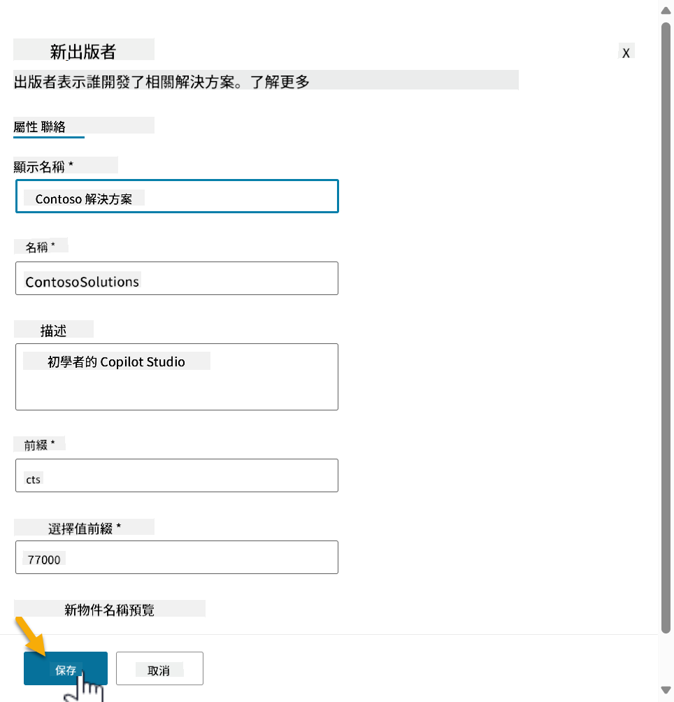
1. 新的 Publisher 窗格將會關閉，並且您會回到 **New solution** 窗格，已選擇剛剛建立的 Publisher。

    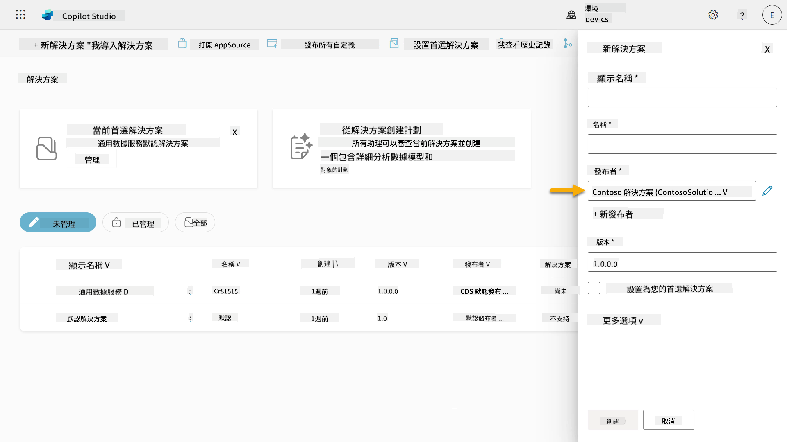  

太棒了，您已成功建立了一個 Solution Publisher！🙌🏻 接下來我們將學習如何建立一個新的自訂解決方案。

### 4.2 建立新的解決方案

1. 現在我們已建立了解決方案，可以完成 **New solution** 窗格中的其餘表單。

    複製並貼上以下內容作為 **Display name**，

    ```text
    Contoso Helpdesk Agent
    ```

    複製並貼上以下內容作為 **Name**，

    ```text
    ContosoHelpdeskAgent
    ```

    由於我們正在建立一個新的解決方案，[**Version** 編號](https://learn.microsoft.com/power-apps/maker/data-platform/update-solutions#understanding-version-numbers-for-updates/?WT.mc_id=power-172615-ebenitez) 預設為 `1.0.0.0`。

    勾選 **Set as your preferred solution** 選項。

    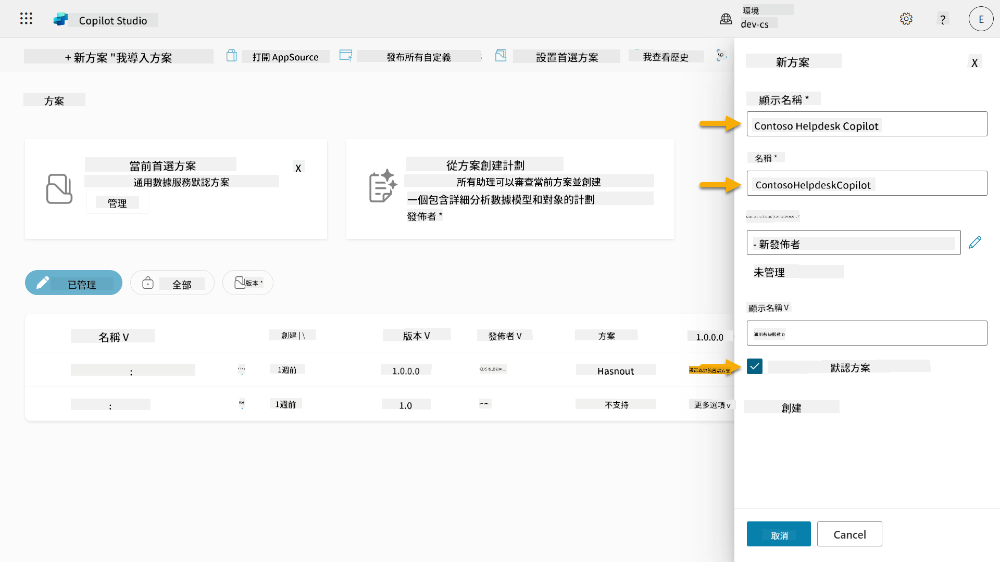  

1. 展開 **More options** 以查看解決方案中可以提供的其他詳細資訊。

    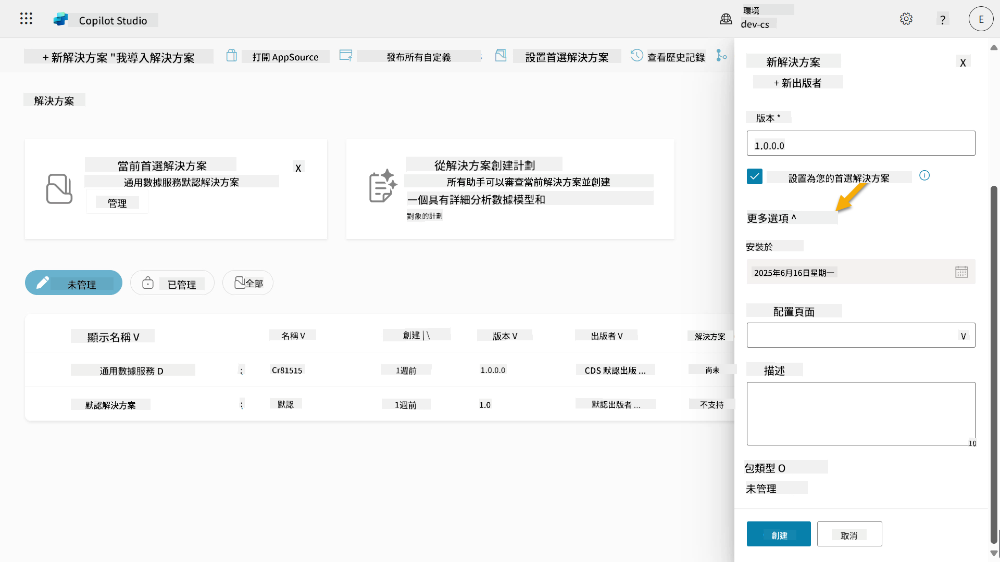

1. 您將看到以下內容：

    - **Installed on** - 解決方案安裝的日期。

    - **Configuration page** - 開發者設置 HTML 網頁資源，幫助使用者與其應用程式、代理或工具互動，該頁面將作為資訊部分中的網頁出現，提供指示或按鈕。這通常由建立並分享解決方案的公司或開發者使用。

    - **Description** - 描述解決方案或配置頁面的高層次描述。

    我們在這次實驗中將保持這些欄位空白。

    選擇 **Create**。

    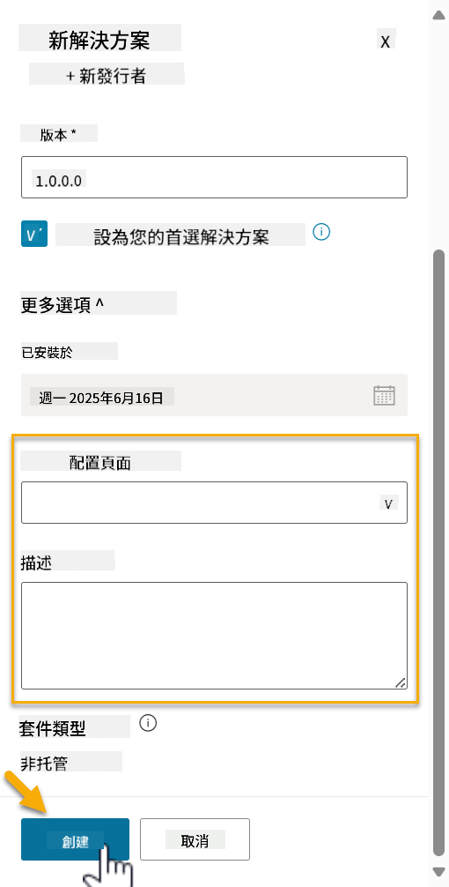

1. Contoso Helpdesk Agent 的解決方案現在已建立。在我們於 Copilot Studio 中建立代理之前，該解決方案將沒有任何元件。

    點擊 **back arrow** 圖示返回 Solution Explorer。

    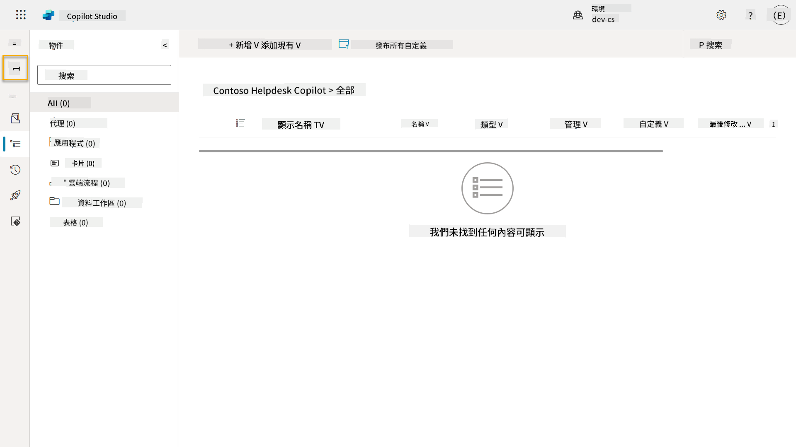

1. 注意，由於我們之前勾選了 **Set as your preferred solution** 選項，Contoso Helpdesk Agent 現在顯示為 **Current preferred solution**。

    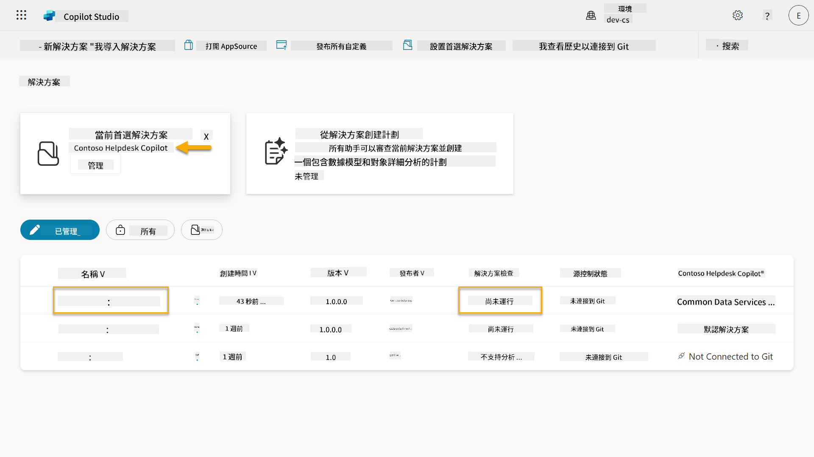

## ✅ 任務完成

恭喜！👏🏻 您已成功建立了一個 Publisher，並在新建立的解決方案中使用它來構建您的代理！

做得好，Agent Maker。整潔的數字足跡是實現大規模操作的第一步。現在您擁有了可持續、企業級代理開發的工具和思維方式。

這是 **Lab 04 - Creating a Solution** 的結尾，點擊以下連結進入下一課。您在本次實驗中建立的解決方案將在下一課的實驗中使用。

⏭️ [進入 **快速開始使用預建代理** 課程](../05-using-prebuilt-agents/README.md)

## 📚 策略資源

🔗 [建立解決方案](https://learn.microsoft.com/power-apps/maker/data-platform/create-solution/?WT.mc_id=power-172615-ebenitez)

🔗 [在 Copilot Studio 中建立和管理解決方案](https://learn.microsoft.com/microsoft-copilot-studio/authoring-solutions-overview/?WT.mc_id=power-172615-ebenitez)

🔗 [與其他使用者分享代理](https://learn.microsoft.com/microsoft-copilot-studio/admin-share-bots/?WT.mc_id=power-172615-ebenitez)

🔗 [預定義安全角色可用資源摘要](https://learn.microsoft.com/power-platform/admin/database-security#summary-of-resources-available-to-predefined-security-roles/?WT.mc_id=power-172615-ebenitez)

🔗 [升級或更新解決方案](https://learn.microsoft.com/power-apps/maker/data-platform/update-solutions/?WT.mc_id=power-172615-ebenitez)

🔗 [Power Platform 中管道概述](https://learn.microsoft.com/power-platform/alm/pipelines/?WT.mc_id=power-172615-ebenitez)

🔗 [Power Platform 中 Git 整合概述](https://learn.microsoft.com/power-platform/alm/git-integration/overview/?WT.mc_id=power-172615-ebenitez)

<!-- markdownlint-disable-next-line MD033 -->


---

**免責聲明**：  
此文件已使用人工智能翻譯服務 [Co-op Translator](https://github.com/Azure/co-op-translator) 進行翻譯。我們致力於提供準確的翻譯，但請注意，自動翻譯可能包含錯誤或不準確之處。原始文件的母語版本應被視為權威來源。對於重要信息，建議使用專業人工翻譯。我們不對因使用此翻譯而引起的任何誤解或誤釋承擔責任。