<!--
CO_OP_TRANSLATOR_METADATA:
{
  "original_hash": "cd99a76bcb7372ac2771b6ae178b023d",
  "translation_date": "2025-10-22T00:24:07+00:00",
  "source_file": "docs/recruit/10-add-event-triggers/README.md",
  "language_code": "hk"
}
-->
# 🚨 任務 10：新增事件觸發器 - 啟用自主代理功能

## 🕵️‍♂️ 行動代號：`幽靈例行作業`

> **⏱️ 行動時間窗口：** `~45分鐘`

🎥 **觀看操作指南**

[](https://www.youtube.com/watch?v=ZgwHL8PQ1nY "在 YouTube 上觀看操作指南")

## 🎯 任務簡介

是時候讓你的代理從對話助手升級為自主行動者了。你的任務是讓代理能夠在未被召喚的情況下行動——精準且迅速地回應來自數位領域的信號。

透過事件觸發器，你將訓練你的代理監控外部系統，例如 SharePoint、Teams 和 Outlook，並在接收到信號時立即執行智能操作。這項行動將你的代理轉變為完全運作的現場資產——沉默、迅速且時刻監控。

成功的關鍵在於打造能主動創造價值的代理，而不僅僅是被動回應。

## 🔎 目標

📖 本課程將涵蓋：

- 了解事件觸發器如何啟用自主代理行為
- 學習事件觸發器與主題觸發器的區別，包括觸發器工作流程和負載
- 探索常見的事件觸發器場景
- 了解事件驅動代理的身份驗證、安全性和發布考量
- 建立一個自主 IT 幫助台代理，回應 SharePoint 事件並發送電子郵件確認

## 🤔 什麼是事件觸發器？

**事件觸發器**是一種機制，允許你的代理在不需要直接用戶輸入的情況下自主回應外部事件。可以將其視為讓你的代理“監控”特定事件，並在事件發生時自動採取行動。

與需要用戶輸入以啟動對話的主題觸發器不同，事件觸發器是基於連接系統中的事件來啟動。例如：

- 當在 SharePoint 或 OneDrive for Business 中創建新文件時
- 當在 Dataverse 中創建記錄時
- 當在 Planner 中完成任務時
- 當提交新的 Microsoft Form 回應時
- 當新增 Microsoft Teams 訊息時
- 基於定期排程（例如每日提醒）  


### 為什麼事件觸發器對自主代理至關重要

事件觸發器將你的代理從被動助手轉變為主動、自主的幫手：

1. **自主運作** - 你的代理可以全天候工作，無需人工干預，隨時回應事件。
    - *例子：* 當新成員加入團隊時，自動歡迎他們。

1. **即時回應** - 代理不再等待用戶提問，而是立即回應相關事件。
    - *例子：* 當 SharePoint 文件被修改時，通知 IT 團隊。

1. **工作流程自動化** - 基於單一觸發事件串聯多個操作。
    - *例子：* 當創建新支持票時，創建任務、通知管理者並更新追蹤儀表板。

1. **一致性流程** - 通過自動回應關鍵事件，確保重要步驟不被遺漏。
    - *例子：* 每位新員工自動獲得入職材料和訪問請求。

1. **數據驅動行動** - 使用觸發事件中的信息進行智能決策並採取適當行動。
    - *例子：* 根據觸發負載中的優先級，將緊急票分配給資深員工。

## ⚙️ 事件觸發器如何運作？

事件觸發器通過三步工作流程運作，使你的代理能自主回應外部事件：

### 觸發器工作流程

1. **事件檢測** - 在連接系統（如 SharePoint、Teams、Outlook 等）中發生特定事件
1. **觸發器啟動** - 事件觸發器檢測到此事件並通過 Power Automate Cloud Flow 將負載發送給你的代理
1. **代理回應** - 你的代理接收負載並執行你定義的指令

### 事件觸發器與主題觸發器的區別

了解這兩種觸發器類型的區別至關重要：

| **事件觸發器** | **主題觸發器** |
|-------------------|-------------------|
| 由外部系統事件啟動 | 由用戶輸入/短語啟動 |
| 啟用自主代理行為 | 啟用對話回應 |
| 使用創建者的身份驗證 | 可選用戶身份驗證 |
| 無需用戶交互即可運行 | 需要用戶啟動對話 |
| 例子：文件創建、收到電子郵件 | 例子：“天氣如何？” |

## 📦 了解觸發器負載

當事件發生時，觸發器會向你的代理發送包含事件信息和回應指令的**負載**。

### 預設負載與自定義負載

每種觸發器類型都有預設的負載結構，但你可以進行自定義：

**預設負載** - 使用標準格式，例如 `使用 {Body} 的內容`

- 包含基本事件信息
- 使用通用處理指令
- 適用於簡單場景

**自定義負載** - 添加特定指令和數據格式

- 包含詳細的代理指導
- 明確指定要使用的數據及其方式
- 更適合複雜的工作流程

### 代理指令與自定義負載指令

你有兩個地方可以通過事件觸發器指導代理的行為：

**代理指令**（全局）

- 適用於所有觸發器的廣泛指導
- 例子：“處理票據時，請先檢查是否有重複項”
- 最適合一般行為模式

**負載指令**（特定觸發器）

- 為單個觸發器類型提供具體指令  
- 例子：“對於此 SharePoint 更新，向項目頻道發送摘要”
- 最適合具有多個觸發器的複雜代理

💡 **專業提示**：避免在這兩個層級之間出現指令衝突，否則可能導致意外行為。

## 🎯 常見事件觸發器場景

以下是事件觸發器如何提升代理功能的實際例子：

### IT 幫助台代理

- **觸發器**：新增 SharePoint 列表項目（支持票）
- **操作**：自動分類、分配優先級並通知相關團隊成員

### 員工入職代理

- **觸發器**：新增用戶至 Dataverse
- **操作**：發送歡迎信息、創建入職任務並配置訪問權限

### 項目管理代理

- **觸發器**：在 Planner 中完成任務
- **操作**：更新項目儀表板、通知利益相關者並檢查阻礙因素

### 文件管理代理

- **觸發器**：上傳文件至特定 SharePoint 文件夾
- **操作**：提取元數據、應用標籤並通知文件擁有者

### 會議助手代理

- **觸發器**：創建日曆事件
- **操作**：發送會前提醒和議程，預訂資源

## ⚠️ 發布和身份驗證考量

在你的代理能在生產環境中使用事件觸發器之前，你需要了解身份驗證和安全性方面的影響。

### 創建者身份驗證

事件觸發器使用**代理創建者的憑證**進行所有身份驗證：

- 你的代理使用你的權限訪問系統
- 用戶可能通過你的憑證訪問數據
- 所有操作均以“你的名義”執行，即使用戶與代理交互

### 數據保護最佳實踐

為了在發布具有事件觸發器的代理時保持安全性：

1. **評估數據訪問** - 審查觸發器可以訪問的系統和數據
1. **徹底測試** - 了解觸發器在負載中包含哪些信息
1. **縮小觸發器範圍** - 使用特定參數限制觸發器啟動的事件
1. **審查負載數據** - 確保觸發器不會暴露敏感信息
1. **監控使用情況** - 跟蹤觸發器活動和資源消耗

## ⚠️ 疑難排解和限制

在使用事件觸發器時，請記住以下重要考量：

### 配額和計費影響

- 每次觸發器啟動都計入你的消息消耗
- 頻繁的觸發器（例如每分鐘的重複觸發）可能會迅速消耗配額
- 監控使用情況以避免超額使用

### 技術要求

- 僅適用於啟用了生成式編排的代理
- 需要在你的環境中啟用解決方案感知的雲端流程共享

### 數據丟失防護（DLP）

- 你的組織的 DLP 政策決定了哪些觸發器可用
- 管理員可以完全阻止事件觸發器
- 如果預期的觸發器不可用，請聯繫你的管理員

## 🧪 實驗室 10 - 新增事件觸發器以實現自主代理行為

### 🎯 使用案例

你將增強你的 IT 幫助台代理，使其能自動回應新的支持請求。當有人在你的 SharePoint 支持票列表中創建新項目時，你的代理將：

1. 在 SharePoint 票據創建時自主觸發
1. 提供票據詳細信息和你希望其執行的步驟指令
1. 通過 AI 生成的電子郵件自動確認票據

此實驗室展示了事件觸發器如何啟用真正的自主代理行為。

### 先決條件

在開始此實驗室之前，請確保你已完成以下事項：

- ✅ 完成之前的實驗室（尤其是 IT 幫助台代理的第 6-8 實驗室）
- ✅ 獲得包含 IT 支持票列表的 SharePoint 網站的訪問權限
- ✅ 啟用了事件觸發器的 Copilot Studio 環境
- ✅ 你的代理已啟用生成式編排
- ✅ 在 SharePoint 和你的 Copilot Studio 環境中擁有適當的權限

### 10.1 啟用生成式 AI 並創建 SharePoint 項目創建觸發器

1. 在 **Copilot Studio** 中打開你的 **IT 幫助台代理**

1. 首先，確保你的代理已啟用 **生成式 AI**：
   - 進入 **概覽** 標籤
   - 在編排部分，將 **生成式編排** 切換至 **開啟**（如果尚未啟用）  
     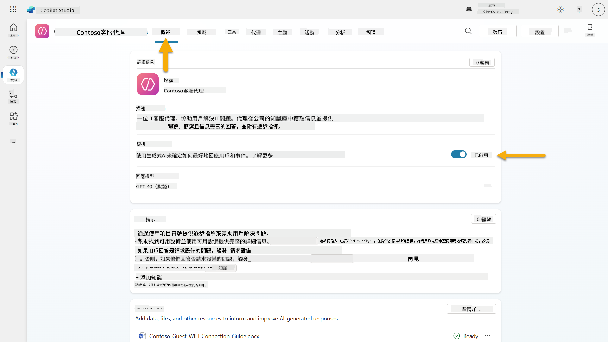

1. 進入 **概覽** 標籤並找到 **觸發器** 部分

1. 點擊 **+ 新增觸發器** 以打開觸發器庫  
    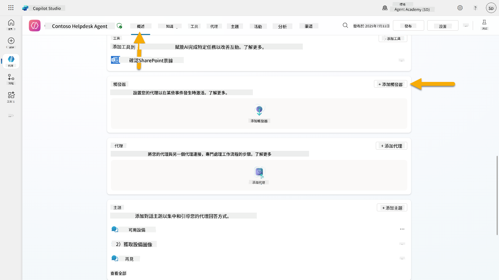

1. 搜索並選擇 **當創建項目時**（SharePoint）  
    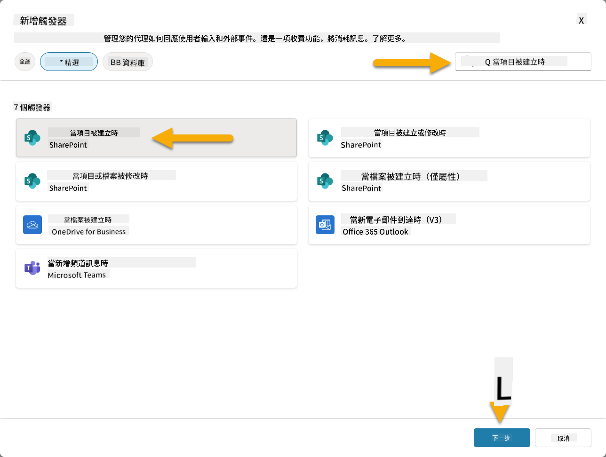

1. 配置觸發器名稱和連接：

   - **觸發器名稱：** 在 SharePoint 中創建新支持票

1. 等待連接配置完成，然後選擇 **下一步** 繼續。  
   

1. 配置觸發器參數：

   - **網站地址：** 選擇你的 "Contoso IT" SharePoint 網站

   - **列表名稱：** 選擇你的 "Tickets" 列表

   - **當觸發器啟動時向代理提供的額外指令：**

     ```text
     New Support Ticket Created in SharePoint: {Body}
     
     Use the 'Acknowledge SharePoint Ticket' tool to generate the email body automatically and respond.
     
     IMPORTANT: Do not wait for any user input. Work completely autonomously.
     ```

     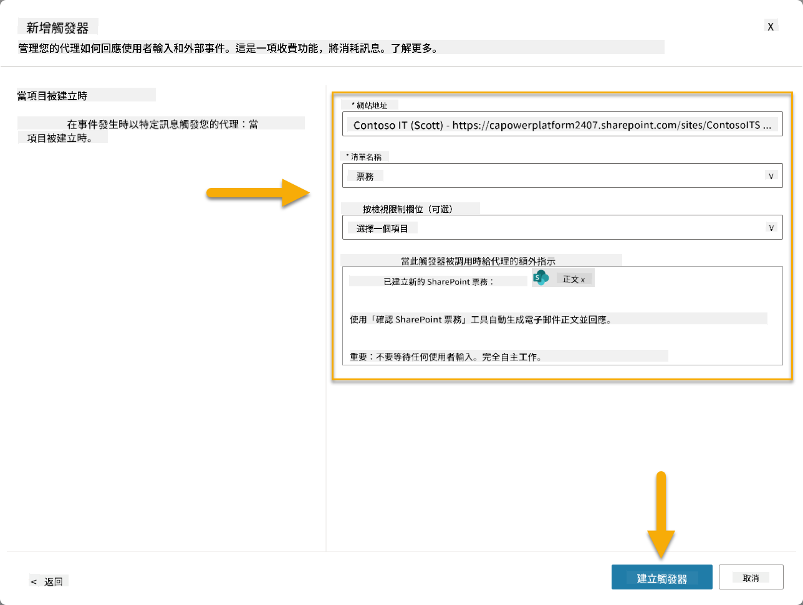

1. 選擇 **創建觸發器** 完成觸發器創建。系統會自動創建一個 Power Automate Cloud Flow，使代理自主觸發。

1. 選擇 **關閉**。

### 10.2 編輯觸發器

1. 在 **概覽** 標籤的 **觸發器** 部分內，選擇 **...** 菜單，找到 **在 SharePoint 中創建新支持票** 觸發器

1. 選擇 **在 Power Automate 中編輯**  
   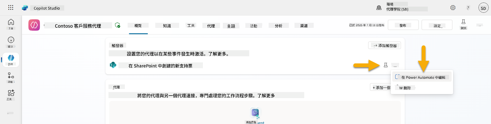

1. 選擇 **向指定的 Copilot 發送提示進行處理** 節點

1. 在 **正文/消息** 欄位中，移除正文內容，**按下斜線鍵**（/）並選擇 **插入表達式**  
   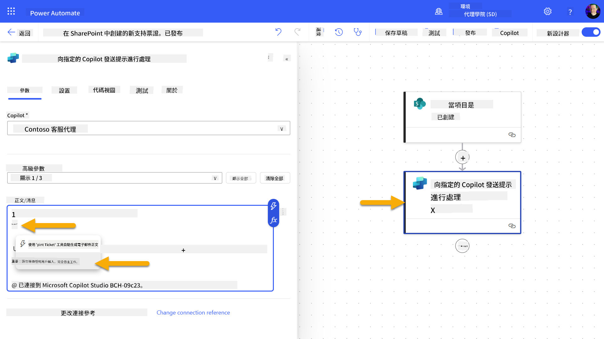

1. 輸入以下表達式，向代理提供有關票據的具體詳細信息：

    ```text
    concat('Submitted By Name: ', first(triggerOutputs()?['body/value'])?['Author/DisplayName'], '\nSubmitted By Email: ', first(triggerOutputs()?['body/value'])?['Author/Email'], '\nTitle: ', first(triggerOutputs()?['body/value'])?['Title'], '\nIssue Description: ', first(triggerOutputs()?['body/value'])?['Description'], '\nPriority: ', first(triggerOutputs()?['body/value'])?['Priority/Value'],'\nTicket ID : ', first(triggerOutputs()?['body/value'])?['ID'])
    ```

1. 選擇 **新增**  
   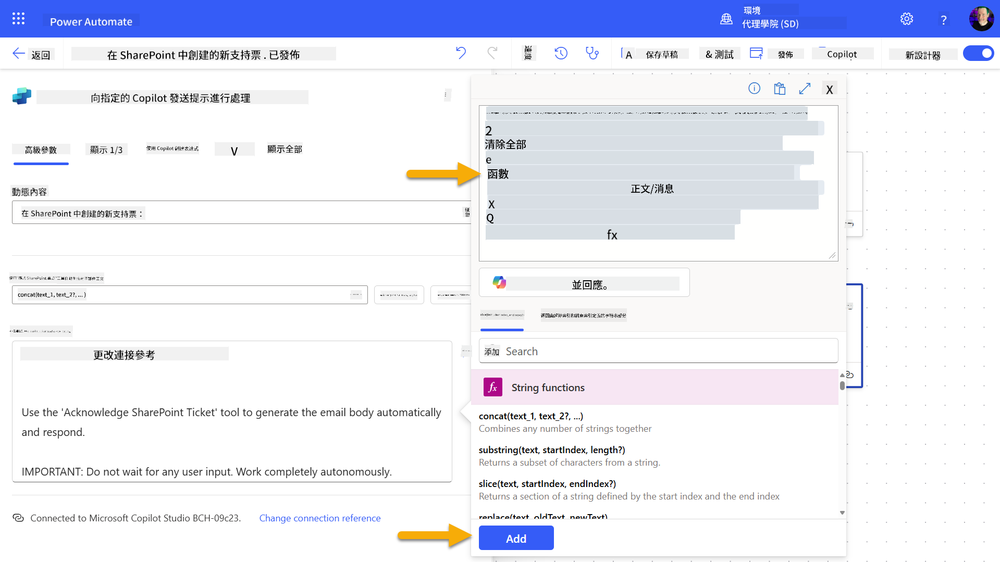

1. 在右上方工具欄選擇 **發布**。

### 10.3 創建電子郵件確認工具

1. **返回**到你的代理在 Copilot Studio 中

1. 進入代理的 **工具** 標籤

1. 點擊 **+ 新增工具** 並選擇 **連接器**

1. 搜索並選擇 **發送電子郵件 (V2)** 連接器  
    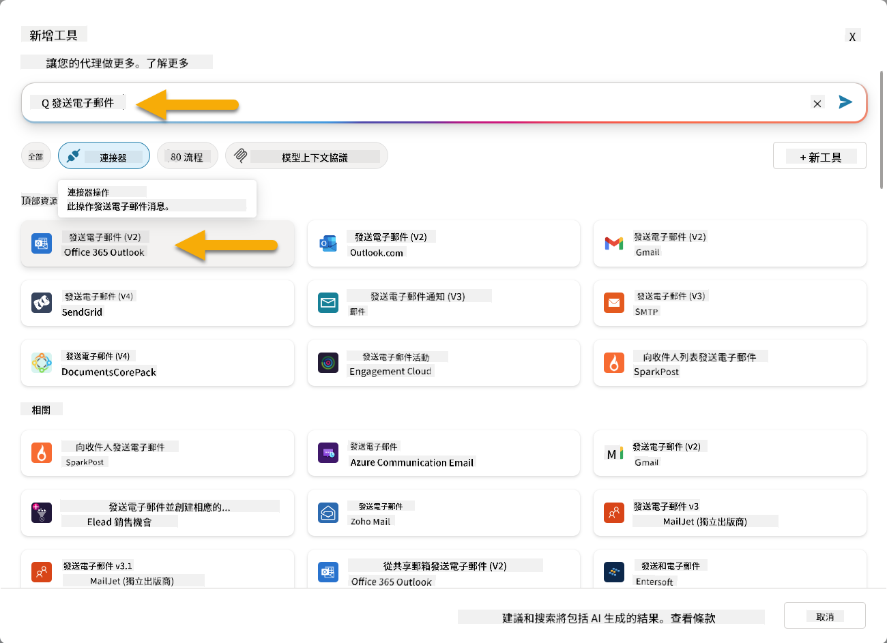

1. 等待連接配置完成，然後選擇 **新增並配置**

1. 配置工具設置：

   - **名稱：** 確認 SharePoint 票據
   - **描述：** 此工具發送電子郵件確認，通知票據已收到。

1. 選擇 **自定義**，進入輸入參數並配置如下：

    **收件人：**

    - **描述：** 提交 SharePoint 票據的人的電子郵件地址
    - **識別為：** 電子郵件

    **正文：**

    - **描述：** 確認已收到票據，並表示我們將在3個工作日內回覆。

    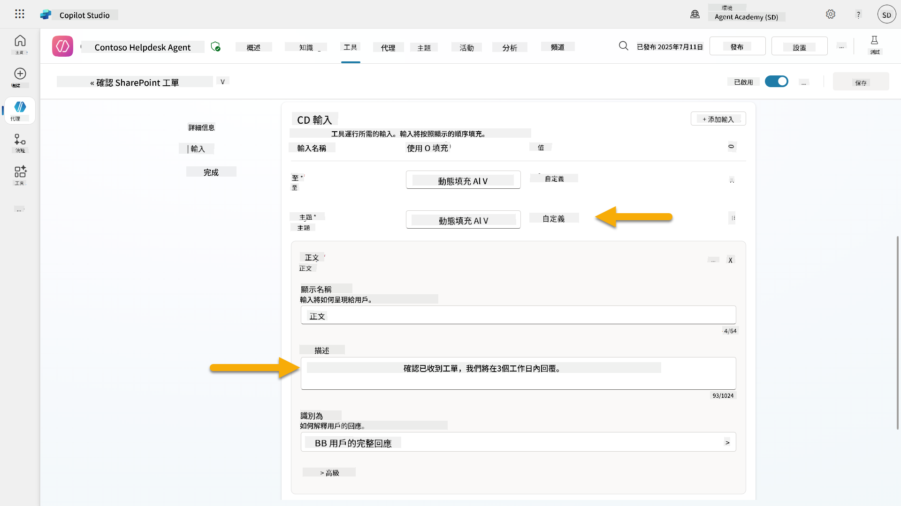

1. 選擇 **保存**

### 10.4 測試觸發器

1. 在你的 **幫助台代理** 中，選擇 **概覽** 標籤
1. 點擊 **測試觸發器** 圖標，位於 **在 SharePoint 中創建新支持票** 觸發器旁邊。這將打開 **測試你的觸發器** 視窗。
1. 開啟一個新的瀏覽器分頁，並前往您的 **SharePoint IT 支援票務清單**
1. 點擊 **+ 新增項目** 以建立測試票務：
   - **標題**: "無法連接到 VPN"
   - **描述**: "最近更新後無法連接到公司 WIFI 網絡"
   - **優先級**: "普通"

1. **儲存** SharePoint 項目  
    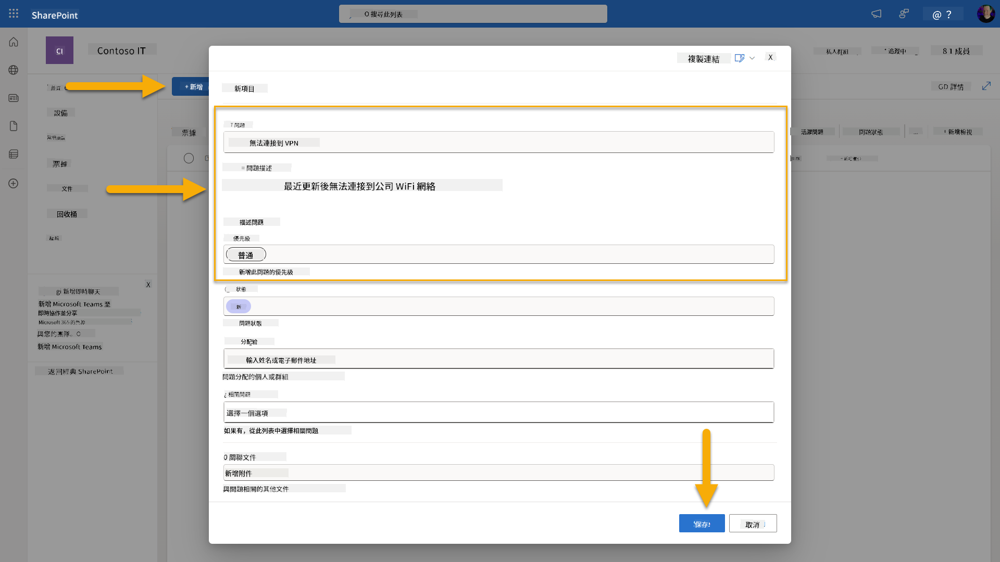
1. 返回 **Copilot Studio** 並監控 **測試您的觸發器** 面板以查看觸發器啟動情況。使用 **刷新** 圖標載入觸發事件，這可能需要幾分鐘。  
    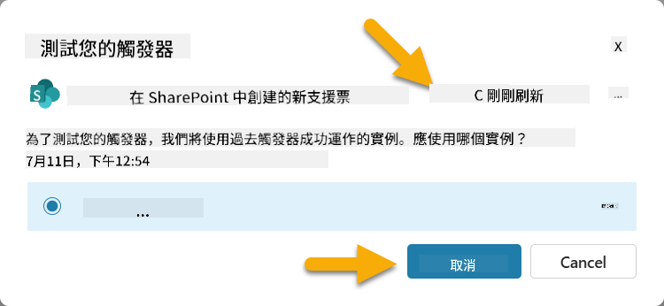
1. 當觸發器出現時，選擇 **開始測試**
1. 點擊 **活動地圖圖標** 位於 **測試您的代理** 面板頂部
1. 驗證您的代理：
   - 收到觸發器的有效負載
   - 調用了 "確認 SharePoint 票務" 工具  
     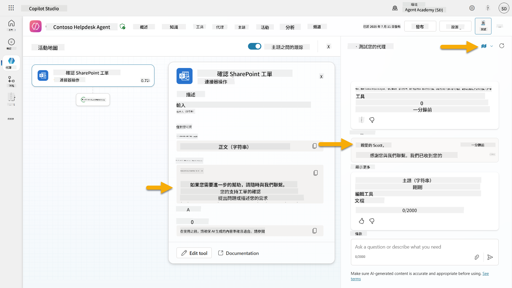
1. 檢查提交者的電子郵件收件箱以確認已發送確認電子郵件  
    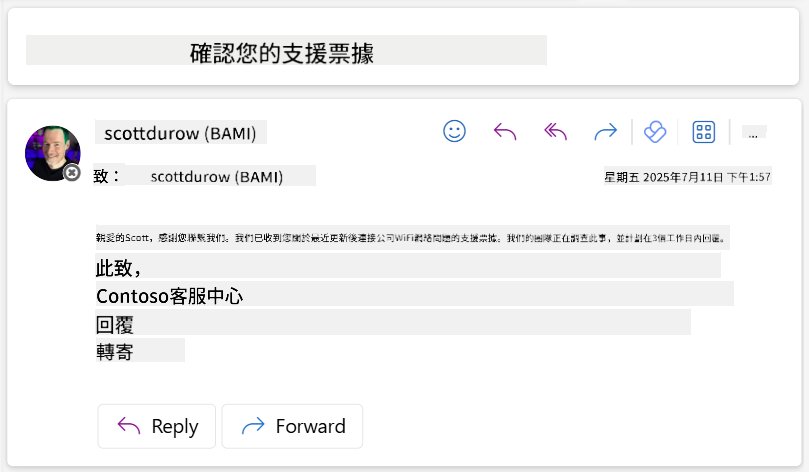
1. 在 Copilot Studio 的 **活動** 標籤中查看完整的觸發器和工具執行記錄

## ✅ 任務完成

🎉 **恭喜！** 您已成功實現使用連接器工具的事件觸發器，讓您的代理能夠自主運作，自動發送電子郵件確認並處理支援票務，無需使用者干預。一旦您的代理發布，它將代表您自主行動。

🚀 **下一步**: 在下一課中，您將學習如何 [發布您的代理](../11-publish-your-agent/README.md) 到 Microsoft Teams 和 Microsoft 365 Copilot，讓整個組織都能使用！

⏭️ [前往 **發布您的代理** 課程](../11-publish-your-agent/README.md)

## 📚 實用資源

準備深入了解事件觸發器和自主代理嗎？查看以下資源：

- **Microsoft Learn**: [在 Copilot Studio 中讓您的代理自主運作](https://learn.microsoft.com/training/modules/autonomous-agents-online-workshop/?WT.mc_id=power-177340-scottdurow)
- **文件**: [新增事件觸發器](https://learn.microsoft.com/microsoft-copilot-studio/authoring-trigger-event?WT.mc_id=power-177340-scottdurow)
- **最佳實踐**: [Power Automate 觸發器介紹](https://learn.microsoft.com/power-automate/triggers-introduction?WT.mc_id=power-177340-scottdurow)
- **進階場景**: [使用 Power Automate 流程與代理](https://learn.microsoft.com/microsoft-copilot-studio/advanced-flow-create?WT.mc_id=power-177340-scottdurow)
- **安全性**: [Copilot Studio 的資料遺失防護](https://learn.microsoft.com/microsoft-copilot-studio/admin-data-loss-prevention?WT.mc_id=power-177340-scottdurow)


---

**免責聲明**：  
此文件已使用人工智能翻譯服務 [Co-op Translator](https://github.com/Azure/co-op-translator) 進行翻譯。儘管我們致力於提供準確的翻譯，但請注意，自動翻譯可能包含錯誤或不準確之處。原始語言的文件應被視為權威來源。對於重要信息，建議使用專業人工翻譯。我們不對因使用此翻譯而引起的任何誤解或誤釋承擔責任。