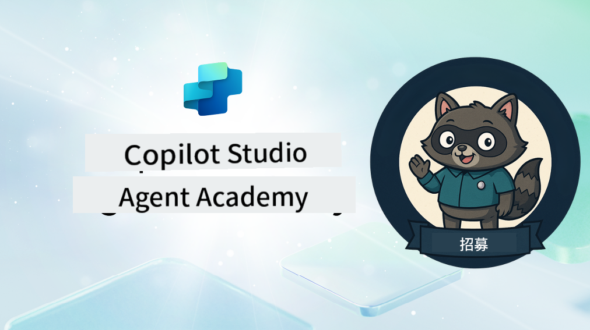

<!--
CO_OP_TRANSLATOR_METADATA:
{
  "original_hash": "8b5ecad9d5d073ea3f4c2b844e80f2e5",
  "translation_date": "2025-10-22T00:20:54+00:00",
  "source_file": "docs/recruit/README.md",
  "language_code": "hk"
}
-->
# 歡迎新兵

**歡迎，新兵。**  
你的任務——如果你選擇接受——是掌握使用 **Microsoft Copilot Studio** 建立智能代理的技術。

這個實作訓練是你進入 **代理世界** 的起點：從基礎提示到 Adaptive Cards 和代理流程，你將學習如何使用真實工具和案例來建立、擴展及部署智能代理。

---

## 🎯 任務目標

完成代理學院後，你將能夠：

- 理解在 Microsoft Copilot Studio 中代理的概念
- 探索大型語言模型 (LLMs)、檢索增強生成 (RAG) 和編排如何在代理中結合
- 建立 **聲明式** 和 **自訂代理**
- 使用 **主題**、**Adaptive Cards** 和 **代理流程** 增強代理功能
- 部署代理至 **Microsoft Teams** 和 **Microsoft 365 Copilot**

---

## 🧪 先決條件

完成所有任務需要：

- 一個 Microsoft 365 開發者租戶（啟用 SharePoint）
- **Microsoft Copilot Studio** 的存取權（試用版或授權版）
- 選擇性：基本的 SharePoint、Power Platform 或 Power Fx 知識

---

## 🧬 適合對象

此課程適合：

- 探索 **Copilot Studio** 的創作者和開發者
- 建立 **Microsoft 365 Copilot 擴展** 的 IT 專業人士
- 想要透過智能代理 **提升技能** 的 Power Platform 愛好者
- 喜歡透過 **實作學習** 的任何人

---

## 🧭 課程概覽

此學院分為漸進式課程——每一課都設計為一個任務，幫助你提升代理建立技能。

| 課程 | 標題 | 任務簡介 |
|------|------|----------|
| `00` | 🧰 [課程設置](./00-course-setup/README.md) | 設置你的開發環境、Copilot Studio 試用版和 SharePoint 網站 |
| `01` | 🧠 [代理簡介](./01-introduction-to-agents/README.md) | 理解對話式 AI 概念、LLMs，以及自主代理與聲明式代理的區別 |
| `02` | 🛠️ [Copilot Studio 基礎](./02-copilot-studio-fundamentals/README.md) | 學習基礎構件：知識、技能、自主性 |
| `03` | 👩‍💻 [建立聲明式代理](./03-create-a-declarative-agent-for-M365Copilot/README.md) | 在 Microsoft 365 Copilot 中新增基於提示的代理 |
| `04` | 🧩 [建立解決方案](./04-creating-a-solution/README.md) | 將你的代理打包成可重用的解決方案以進行環境管理 |
| `05` | 🚀 [使用預建代理入門](./05-using-prebuilt-agents/README.md) | 使用並自訂模板代理以加速設置 |
| `06` | ✍️ [建立自訂代理](./06-create-agent-from-conversation/README.md) | 建立基於知識來源的新 Copilot |
| `07` | 🧠 [新增主題與觸發器](./07-add-new-topic-with-trigger/README.md) | 使用主題定義自訂的問答路徑 |
| `08` | 🪪 [使用 Adaptive Cards 增強功能](./08-add-adaptive-card/README.md) | 使用 Power Fx 和 SharePoint 建立 Adaptive Card |
| `09` | 🔁 [透過代理流程自動化](./09-add-an-agent-flow/README.md) | 使用 Adaptive Card 輸入觸發後端流程 |
| `10` | 🧭 [新增事件觸發器](./10-add-event-triggers/README.md) | 讓你的代理能夠使用基於事件的邏輯自主行動 |
| `11` | 📢 [發布你的代理](./11-publish-your-agent/README.md) | 部署你的代理至 Microsoft Teams 和 Microsoft 365 Copilot |
| `12` | 🪪 [理解授權](./12-understanding-licensing/README.md) | 學習 Copilot Studio 的授權和計費方式 |
| `13` | 🚨 [獲得新兵徽章](./course-completion-badges-recruit/README.md) |  申請你的徽章並標記你的成就！ |

!!! note
    ✅ 完成此課程可獲得 **新兵** 徽章。  
    🔓 **行動者** 和 **指揮官** 將在未來階段解鎖。

<!-- markdownlint-disable-next-line MD033 -->

---

**免責聲明**：  
此文件已使用人工智能翻譯服務 [Co-op Translator](https://github.com/Azure/co-op-translator) 進行翻譯。儘管我們致力於提供準確的翻譯，但請注意，自動翻譯可能包含錯誤或不準確之處。原始文件的母語版本應被視為權威來源。對於重要信息，建議使用專業人工翻譯。我們不對因使用此翻譯而引起的任何誤解或誤釋承擔責任。