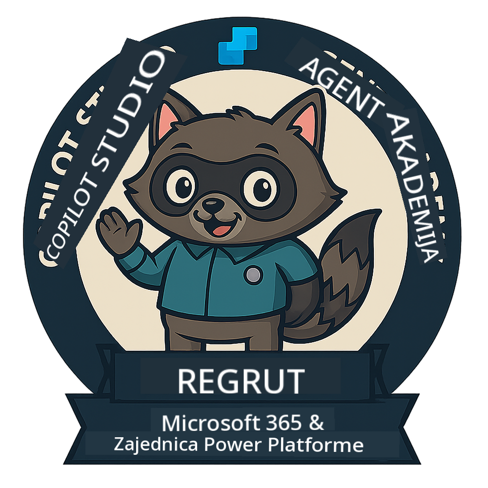

<!--
CO_OP_TRANSLATOR_METADATA:
{
  "original_hash": "15e57e059ce7689d602d7853187235cd",
  "translation_date": "2025-10-20T22:41:17+00:00",
  "source_file": "docs/index.md",
  "language_code": "hr"
}
-->
---
hide:
- navigation
---

# Akademija agenata Copilot Studio

**Dobrodošli u Akademiju agenata Copilot Studio.**  

Vaša misija—ako je odlučite prihvatiti—je savladati umjetnost izrade agenata koristeći **Microsoft Copilot Studio**.

Ova praktična obuka vaš je ulaz u **svijet agenata**: od preciznih upita do Adaptive Cards i tijekova agenata, naučit ćete kako izraditi, skalirati i implementirati inteligentne agente koristeći stvarne alate i primjere.

---

## 🏅 Napredovanje u činovima

**Akademija agenata Copilot Studio** je višefazni program obuke osmišljen za razvoj vaših vještina kroz tri čina agenata. Svaka razina uključuje značku i sve veće odgovornosti:

| Čin              | Razina | Vizualno |
|------------------|:-----:|--------|
| 🟢 **Regrut**  [🚀 Započni](https://aka.ms/agent-academy-recruit){ .md-button .md-button--primary }     | •     | { width="300" }     |
| 🔵 **Operativac** (Uskoro)   | ••    | { width="300" } |
| 🟡 **Zapovjednik** (Uskoro)    | •••   | { width="300" } |

Svaka razina nadograđuje prethodnu. Završite svoju misiju Regruta i pratite novosti kako biste unaprijedili svoje kvalifikacije kao agent.

---

## 🎒 Ostali tečajevi

Pogledajte ove tečajeve kako biste nastavili učiti o AI-u i agentima:

- [Microsoft Copilot Studio <3 MCP Lab](https://aka.ms/mcsmcplab)
- [Copilot Developer Camp](https://microsoft.github.io/copilot-camp/)
- [AI Agents for Beginners](https://microsoft.github.io/ai-agents-for-beginners/)
- [Model Context Protocol (MCP) For Beginners](https://github.com/microsoft/mcp-for-beginners)

---

## 🚑 Problemi

Vaše povratne informacije su nam jako važne! Molimo vas da koristite [popis problema](https://github.com/microsoft/agent-academy/issues) kako biste podijelili svoje komentare i prijavili probleme. Hvala!

---

## 📜 Kodeks ponašanja

Ovaj projekt usvojio je [Kodeks ponašanja za otvoreni izvor Microsofta](https://opensource.microsoft.com/codeofconduct/).

!!! info "Resursi:"

    - [Kodeks ponašanja za otvoreni izvor Microsofta](https://opensource.microsoft.com/codeofconduct/)
    - [Česta pitanja o kodeksu ponašanja Microsofta](https://opensource.microsoft.com/codeofconduct/faq/)
    - Kontaktirajte [opencode@microsoft.com](mailto:opencode@microsoft.com) za pitanja ili nedoumice

---

[⭐️ Označite naš repozitorij](https://github.com/microsoft/agent-academy){ .md-button .md-button--primary }

<!-- markdownlint-disable-next-line MD033 -->

---

**Izjava o odricanju odgovornosti**:  
Ovaj dokument je preveden pomoću AI usluge za prevođenje [Co-op Translator](https://github.com/Azure/co-op-translator). Iako nastojimo osigurati točnost, imajte na umu da automatski prijevodi mogu sadržavati pogreške ili netočnosti. Izvorni dokument na izvornom jeziku treba smatrati autoritativnim izvorom. Za ključne informacije preporučuje se profesionalni prijevod od strane ljudskog prevoditelja. Ne preuzimamo odgovornost za nesporazume ili pogrešna tumačenja koja mogu proizaći iz korištenja ovog prijevoda.