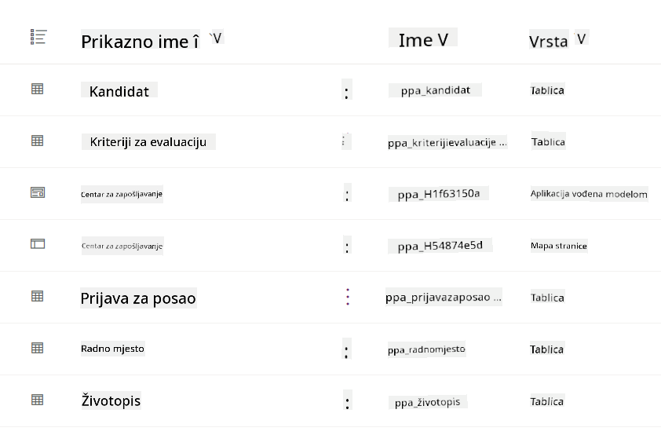
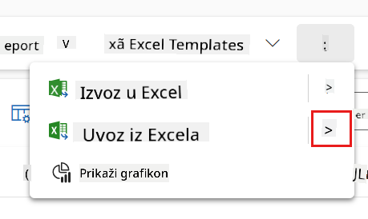
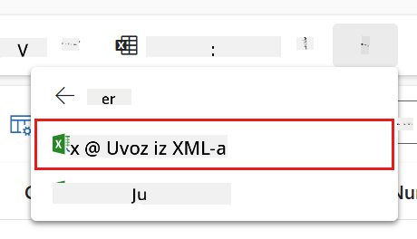
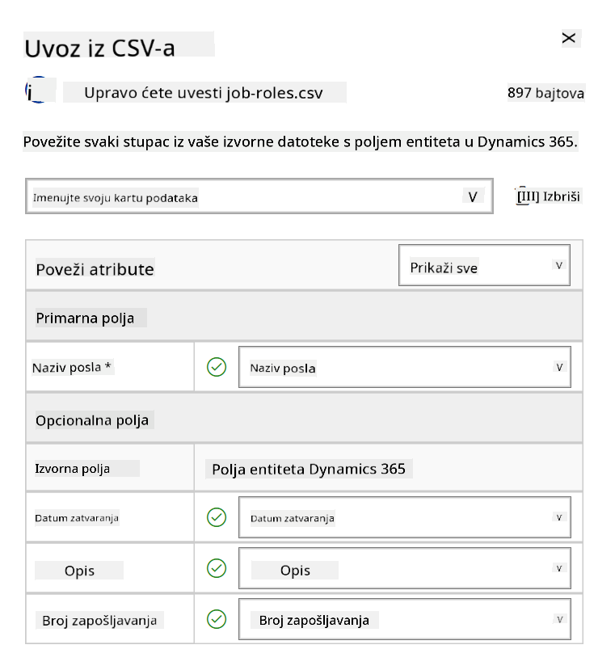
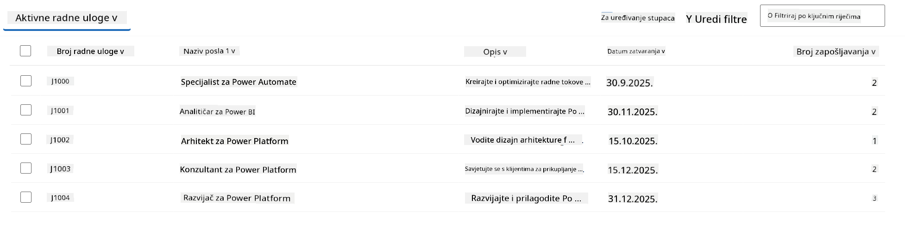
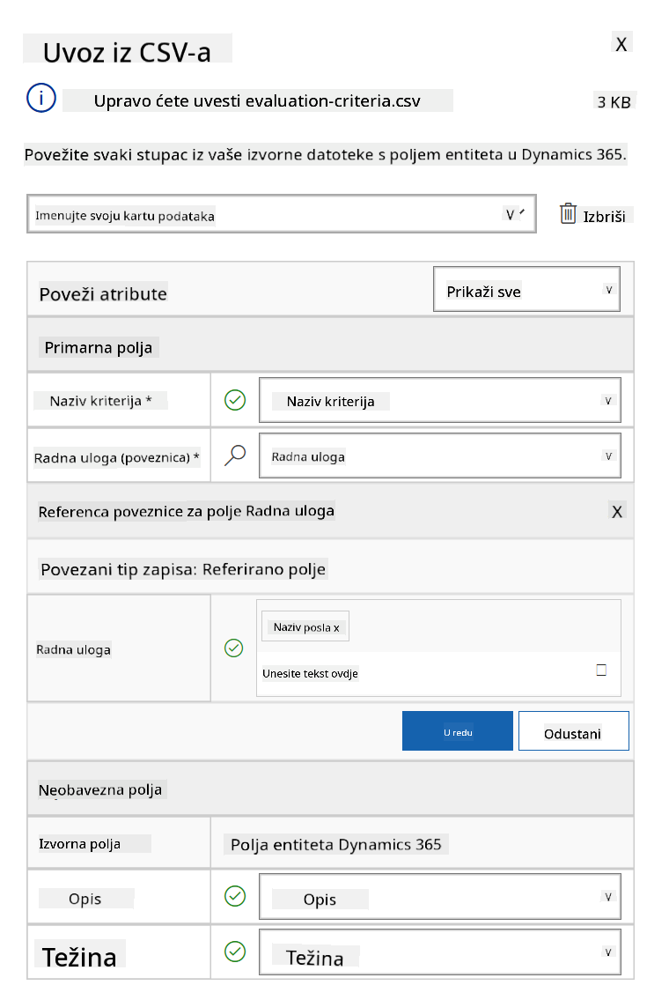
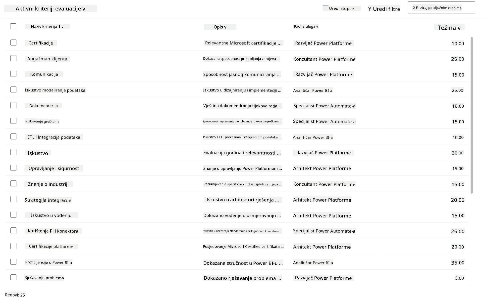

<!--
CO_OP_TRANSLATOR_METADATA:
{
  "original_hash": "2620cf9eaf09a3fc6be7fa31a3a62956",
  "translation_date": "2025-10-20T23:06:58+00:00",
  "source_file": "docs/operative-preview/01-get-started/README.md",
  "language_code": "hr"
}
-->
# 🚨 Misija 01: Početak rada s Hiring Agentom

--8<-- "disclaimer.md"

## 🕵️‍♂️ KODNO IME: `OPERACIJA TALENT SCOUT`

> **⏱️ Vrijeme trajanja operacije:** `~45 minuta`

## 🎯 Opis misije

Dobrodošli, agente. Vaš prvi zadatak je **Operacija Talent Scout** - uspostavljanje osnovne infrastrukture za AI-pokretan sustav zapošljavanja koji će transformirati način na koji organizacije identificiraju i zapošljavaju vrhunske talente.

Vaša misija, ako je odlučite prihvatiti, jest implementirati i konfigurirati sveobuhvatan sustav upravljanja zapošljavanjem koristeći Microsoft Copilot Studio. Uvest ćete unaprijed izrađeno rješenje koje sadrži sve potrebne podatkovne strukture, a zatim ćete kreirati svog prvog AI agenta - **Hiring Agenta** - koji će služiti kao središnji organizator za sve buduće operacije zapošljavanja.

Ova početna implementacija uspostavlja zapovjedni centar koji ćete unaprijediti tijekom programa Agent Academy Operative. Smatrajte ovo svojom bazom operacija - temeljom na kojem ćete izgraditi cijelu mrežu specijaliziranih agenata u narednim misijama.

---

## 🔎 Ciljevi

Završetkom ove misije, postići ćete:

- **Razumijevanje scenarija**: Steći sveobuhvatno znanje o izazovima i rješenjima automatizacije zapošljavanja
- **Implementacija rješenja**: Uspješno uvesti i konfigurirati osnove sustava upravljanja zapošljavanjem
- **Kreiranje agenta**: Izgraditi Hiring Agenta koji je početak scenarija koji ćete razvijati kao Agent Academy Operative

---

## 🔍 Preduvjeti

Prije nego započnete ovu misiju, osigurajte da imate:

- Licencu za Copilot Studio
- Pristup Microsoft Power Platform okruženju
- Administratorske ovlasti za kreiranje rješenja i agenata

---

## 🏢 Razumijevanje scenarija automatizacije zapošljavanja

Ovaj scenarij pokazuje kako tvrtka može koristiti Microsoft Copilot Studio za poboljšanje i automatizaciju procesa zapošljavanja. Uvodi sustav agenata koji surađuju u obavljanju zadataka poput pregleda životopisa, preporučivanja radnih mjesta, pripreme materijala za intervjue i procjene kandidata.

### Poslovna vrijednost

Rješenje pomaže HR timovima uštedjeti vrijeme i donositi bolje odluke kroz:

- Automatsku obradu životopisa primljenih putem e-pošte.
- Predlaganje odgovarajućih radnih mjesta na temelju profila kandidata.
- Kreiranje prijava za posao i vodiča za intervjue prilagođenih svakom kandidatu.
- Osiguravanje pravednih i usklađenih praksi zapošljavanja putem ugrađenih sigurnosnih i moderacijskih značajki.
- Prikupljanje povratnih informacija za poboljšanje rješenja.

### Kako funkcionira

- Središnji **Hiring Agent** koordinira proces i pohranjuje podatke u Microsoft Dataverse.
- **Application Intake Agent** čita životopise i kreira prijave za posao.
- **Interview Prep Agent** generira pitanja za intervjue i dokumente na temelju pozadine kandidata.
- Sustav se može objaviti na demo web stranici, omogućujući dionicima interakciju s njim.

Ovaj scenarij je idealan za organizacije koje žele modernizirati svoje procese zapošljavanja koristeći AI-pokrenutu automatizaciju, uz održavanje transparentnosti, pravednosti i učinkovitosti.

---

## 🧪 Laboratorij: Postavljanje Hiring Agenta

U ovom praktičnom laboratoriju uspostavit ćete temelj za svoj sustav automatizacije zapošljavanja. Započet ćete uvozom unaprijed konfiguriranog rješenja koje sadrži sve potrebne tablice Dataverse i podatkovne strukture za upravljanje kandidatima, radnim mjestima i procesima zapošljavanja. Zatim ćete popuniti ove tablice uzorcima podataka koji će podržati vaše učenje tijekom ovog modula i pružiti realne scenarije za testiranje. Na kraju, kreirat ćete Hiring Agenta u Copilot Studiju, postavljajući osnovno sučelje za razgovor koje će služiti kao temelj za sve ostale značajke koje ćete dodati u budućim misijama.

### 🧪 Laboratorij 1.1: Uvoz rješenja

1. Idite na **[Copilot Studio](https://copilotstudio.microsoft.com)**
1. Odaberite **...** u lijevoj navigaciji i odaberite **Solutions**
1. Kliknite na gumb **Import Solution** na vrhu
1. **[Preuzmite](https://raw.githubusercontent.com/microsoft/agent-academy/refs/heads/main/docs/operative-preview/01-get-started/assets/Operative_1_0_0_0.zip)** pripremljeno rješenje
1. Kliknite **Browse** i odaberite preuzeto rješenje iz prethodnog koraka
1. Kliknite **Next**
1. Kliknite **Import**

!!! success
    Ako je uvoz uspješan, vidjet ćete zelenu obavijest s porukom:  
    "Solution "Operative" imported successfully."

Kada je rješenje uvezeno, pogledajte što ste uvezli klikom na naziv rješenja (`Operative`).



Sljedeće komponente su uvezene:

| Naziv prikaza | Tip | Opis |
|---------------|------|------|
| Kandidat | Tablica | Informacije o kandidatu |
| Kriteriji procjene | Tablica | Kriteriji procjene za radno mjesto |
| Hiring Hub | Model-Driven App | Aplikacija za upravljanje procesom zapošljavanja |
| Hiring Hub | Site Map | Navigacijska struktura za aplikaciju Hiring Hub |
| Prijava za posao | Tablica | Prijave za posao |
| Radno mjesto | Tablica | Radna mjesta |
| Životopis | Tablica | Životopisi kandidata |

Kao posljednji zadatak za ovaj laboratorij, kliknite gumb **Publish all customizations** na vrhu stranice.

### 🧪 Laboratorij 1.2: Uvoz uzoraka podataka

U ovom laboratoriju dodati ćete uzorke podataka u neke od tablica koje ste uvezli u laboratoriju 1.1.

#### Preuzimanje datoteka za uvoz

1. **[Preuzmite](https://raw.githubusercontent.com/microsoft/agent-academy/refs/heads/main/docs/operative-preview/01-get-started/assets/evaluation-criteria.csv)** CSV datoteku s kriterijima procjene
1. **[Preuzmite](https://raw.githubusercontent.com/microsoft/agent-academy/refs/heads/main/docs/operative-preview/01-get-started/assets/job-roles.csv)** CSV datoteku s radnim mjestima

#### Uvoz uzoraka podataka za radna mjesta

1. Vratite se na rješenje koje ste upravo uvezli u posljednjem laboratoriju
1. Odaberite **Hiring Hub** Model-Driven App klikom na kvačicu ispred retka
1. Kliknite na gumb **Play** na vrhu

    !!! warning
        Možda ćete morati ponovno prijaviti. Obavezno to učinite. Nakon prijave, trebali biste vidjeti aplikaciju Hiring Hub.

1. Odaberite **Job Roles** u lijevoj navigaciji
1. Kliknite na ikonu **More** (tri točke ispod svake druge) u komandnoj traci
1. Kliknite na **desnu strelicu** pored *Import from Excel*

    

1. Kliknite na **Import from CSV**

    

1. Kliknite na gumb **Choose File**, odaberite datoteku **job-roles.csv** koju ste upravo preuzeli i zatim kliknite **Open**
1. Kliknite **Next**
1. Ostavite sljedeći korak kako jest i kliknite **Review Mapping**

    

1. Provjerite je li mapiranje ispravno i kliknite **Finish Import**

    !!! info
        Ovo će pokrenuti uvoz i moći ćete pratiti napredak ili odmah završiti proces klikom na **Done**

1. Kliknite **Done**

Ovo može potrajati neko vrijeme, ali možete kliknuti gumb **Refresh** kako biste provjerili je li uvoz uspješno završen.



#### Uvoz uzoraka podataka za kriterije procjene

1. Odaberite **Evaluation Criteria** u lijevoj navigaciji
1. Kliknite na ikonu **More** (tri točke ispod svake druge) u komandnoj traci
1. Kliknite na **desnu strelicu** pored *Import from Excel*

    

1. Kliknite na **Import from CSV**

    

1. Kliknite na gumb **Choose File**, odaberite datoteku **evaluation-criteria.csv** koju ste upravo preuzeli i zatim kliknite **Open**
1. Kliknite **Next**
1. Ostavite sljedeći korak kako jest i kliknite **Review Mapping**

    

1. Sada moramo napraviti malo više posla za mapiranje. Kliknite na ikonu povećala (🔎) pored polja Job Role
1. Provjerite je li odabrano **Job Title**, a ako nije - dodajte ga
1. Kliknite **OK**
1. Provjerite je li ostatak mapiranja također ispravan i kliknite **Finish Import**

    !!! info
        Ovo će ponovno pokrenuti uvoz i moći ćete pratiti napredak ili odmah završiti proces klikom na **Done**

1. Kliknite **Done**

Ovo može potrajati neko vrijeme, ali možete kliknuti gumb **Refresh** kako biste provjerili je li uvoz uspješno završen.



### 🧪 Laboratorij 1.3: Kreiranje Hiring Agenta

Sada kada ste završili postavljanje preduvjeta, vrijeme je za stvarni rad! Prvo dodajmo naš Hiring Agent!

1. Idite na **[Copilot Studio](https://copilotstudio.microsoft.com)** i provjerite jeste li u istom okruženju u kojem ste uvezli rješenje i podatke
1. Odaberite **Agents** u lijevoj navigaciji
1. Kliknite na **New Agent**
1. Kliknite na **Configure**
1. Za **Name**, unesite:

    ```text
    Hiring Agent
    ```

1. Za **Description**, unesite:

    ```text
    Central orchestrator for all hiring activities
    ```

1. Kliknite na **...** pored gumba *Create* u gornjem desnom kutu
1. Odaberite **Update advanced settings**
1. Kao **Solution**, odaberite `Operative`
1. Kliknite **Update**
1. Kliknite **Create** u gornjem desnom kutu

Ovo će kreirati Hiring Agenta za vas, kojeg ćete koristiti tijekom ovog Operative tečaja.

---

## 🎉 Misija završena

Misija 01 je završena! Sada ste savladali sljedeće vještine:

✅ **Razumijevanje scenarija**: Sveobuhvatno znanje o izazovima i rješenjima automatizacije zapošljavanja  
✅ **Implementacija rješenja**: Uspješno uvezeni i konfigurirani temelji sustava upravljanja zapošljavanjem  
✅ **Kreiranje agenta**: Kreiran Hiring Agent koji je početak scenarija koji ćete razvijati kao Agent Academy Operative  

Sljedeće je [Misija 02](../02-multi-agent/README.md): Pripremite svog agenta za rad s povezanim agentima.

---

## 📚 Taktički resursi

📖 [Microsoft Copilot Studio - Kreiranje agenta](https://learn.microsoft.com/microsoft-copilot-studio/authoring-first-bot)  
📖 [Microsoft Dataverse Dokumentacija](https://learn.microsoft.com/power-apps/maker/data-platform)

---

**Izjava o odricanju odgovornosti**:  
Ovaj dokument je preveden pomoću AI usluge za prevođenje [Co-op Translator](https://github.com/Azure/co-op-translator). Iako nastojimo osigurati točnost, imajte na umu da automatski prijevodi mogu sadržavati pogreške ili netočnosti. Izvorni dokument na izvornom jeziku treba smatrati autoritativnim izvorom. Za ključne informacije preporučuje se profesionalni prijevod od strane čovjeka. Ne preuzimamo odgovornost za nesporazume ili pogrešna tumačenja koja proizlaze iz korištenja ovog prijevoda.