<!--
CO_OP_TRANSLATOR_METADATA:
{
  "original_hash": "4fb913dfc3bbc71506dd3602c4b8e6ed",
  "translation_date": "2025-10-20T22:47:14+00:00",
  "source_file": "docs/operative-preview/02-multi-agent/README.md",
  "language_code": "hr"
}
-->
# 🚨 Misija 02: Povezani agenti

--8<-- "disclaimer.md"

## 🕵️‍♂️ KODNO IME: `OPERACIJA SIMFONIJA`

> **⏱️ Vremenski okvir operacije:** `~45 minuta`

## 🎯 Sažetak misije

Dobrodošli nazad, agente. U Misiji 01 izgradili ste svog glavnog agenta za zapošljavanje - čvrstu osnovu za upravljanje procesima zapošljavanja. No, jedan agent može učiniti samo toliko.

Vaš zadatak, ako ga odlučite prihvatiti, je **Operacija Simfonija** - transformacija vašeg pojedinačnog agenta u **sustav više agenata**: orkestrirani tim specijaliziranih agenata koji zajedno rješavaju složene izazove zapošljavanja. Zamislite to kao nadogradnju od solo operatera do vođenja specijaliziranog tima.

Kao simfonijski orkestar gdje svaki glazbenik svira svoj dio u savršenoj harmoniji, dodat ćete dva ključna specijalista svom postojećem agentu za zapošljavanje: agenta za unos prijava koji automatski obrađuje životopise i agenta za pripremu intervjua koji stvara sveobuhvatne materijale za intervjue. Ovi agenti će raditi zajedno besprijekorno pod vašim glavnim orkestratorom.

## 🔎 Ciljevi

U ovoj misiji naučit ćete:

1. Kada koristiti **podređene agente** naspram **povezanih agenata**
1. Kako dizajnirati **arhitekture više agenata** koje se mogu skalirati  
1. Stvaranje **podređenih agenata** za fokusirane zadatke
1. Uspostavljanje **komunikacijskih obrazaca** između agenata
1. Izgradnju agenta za unos prijava i agenta za pripremu intervjua

## 🧠 Što su povezani agenti?

U Copilot Studiju niste ograničeni na izgradnju jednog, monolitnog agenta. Možete stvoriti **sustave više agenata** - mreže specijaliziranih agenata koji zajedno rješavaju složene procese.

Zamislite to kao stvarnu organizaciju: umjesto da jedna osoba radi sve, imate specijaliste koji su izvrsni u određenim zadacima i surađuju kad je potrebno.

### Zašto su sustavi više agenata važni

- **Skalabilnost:** Svaki agent može se razvijati, testirati i održavati neovisno od strane različitih timova.  
- **Specijalizacija:** Agenti se mogu fokusirati na ono u čemu su najbolji. Možda jedan za obradu podataka, drugi za interakciju s korisnicima, treći za donošenje odluka.  
- **Fleksibilnost:** Možete kombinirati i prilagođavati agente, ponovno ih koristiti u različitim projektima i postupno razvijati svoj sustav.  
- **Održavanje:** Promjene na jednom agentu ne utječu nužno na druge, što čini ažuriranja sigurnijima i jednostavnijima.

### Primjer iz stvarnog života: Proces zapošljavanja

Razmotrite naš proces zapošljavanja - više agenata može surađivati s različitim odgovornostima:

- **Unos životopisa** zahtijeva vještine obrade dokumenata i ekstrakcije podataka
- **Ocjenjivanje** uključuje procjenu životopisa kandidata i njihovo usklađivanje s zahtjevima posla
- **Priprema za intervju** zahtijeva duboko razmišljanje o prikladnosti kandidata  
- **Komunikacija s kandidatima** zahtijeva empatične komunikacijske sposobnosti

Umjesto da gradite jednog masivnog agenta koji pokušava obraditi sve ove različite vještine, možete stvoriti specijalizirane agente za svako područje i orkestrirati ih zajedno.

## 🔗 Podređeni agenti naspram povezanih agenata: Ključna razlika

Copilot Studio nudi dva načina za izgradnju sustava više agenata, svaki s različitim slučajevima upotrebe:

### ↘️ Podređeni agenti

Podređeni agenti su **lagani specijalisti** koji žive unutar vašeg glavnog agenta. Zamislite ih kao specijalizirane timove unutar istog odjela.

#### Ključni tehnički detalji

- Podređeni agenti žive unutar glavnog agenta i imaju jednu stranicu za konfiguraciju.
- Alati i znanje su **pohranjeni kod glavnog** agenta, ali su konfigurirani da budu "dostupni" podređenom agentu.
- Podređeni agenti **dijele teme** svog glavnog agenta. Teme se mogu referencirati u uputama podređenog agenta.
- Podređeni agenti **ne trebaju zasebno objavljivanje** - automatski su dostupni unutar svog glavnog agenta nakon što su stvoreni. To olakšava testiranje jer se promjene na glavnom i podređenim agentima mogu obaviti u **istom zajedničkom radnom prostoru**.

#### Koristite podređene agente kada

- Jedan tim upravlja cijelim rješenjem
- Želite logički organizirati alate i znanje u pod-agente
- Ne trebate zasebnu autentifikaciju ili implementaciju za svakog agenta
- Agenti neće biti objavljeni zasebno ili korišteni neovisno
- Ne trebate ponovno koristiti agente u više rješenja

**Primjer:** IT helpdesk agent s podređenim agentima za:

- Postupke resetiranja lozinke
- Rješavanje problema s hardverom  
- Vodiče za instalaciju softvera

### 🔀 Povezani agenti

Povezani agenti su **potpuno neovisni agenti** s kojima vaš glavni agent može surađivati. Zamislite ih kao odvojene odjele koji rade zajedno na projektu.

#### Ključni tehnički detalji

- Povezani agenti imaju **svoje teme** i tokove razgovora. Djeluju neovisno sa svojim postavkama, logikom i životnim ciklusom implementacije.
- Povezani agenti **moraju biti objavljeni** prije nego što ih drugi agenti mogu dodati i koristiti.
- Tijekom testiranja, promjene na povezanom agentu moraju biti objavljene prije nego što ih pozivajući agent može koristiti.

#### Koristite povezane agente kada

- Više timova razvija i održava različite agente neovisno
- Agenti trebaju vlastite postavke, autentifikaciju i kanale implementacije
- Želite objavljivati i održavati agente zasebno s neovisnim upravljanjem životnim ciklusom aplikacije (ALM) za svakog agenta
- Agenti bi trebali biti ponovno upotrebljivi u više rješenja

**Primjer:** Sustav korisničke podrške koji se povezuje s:

- Odvojenim agentom za naplatu kojeg održava financijski tim
- Odvojenim agentom za tehničku podršku kojeg održava tim za proizvode
- Odvojenim agentom za povrate kojeg održava operativni tim

!!! tip "Savjet"
    Možete kombinirati oba pristupa! Na primjer, vaš glavni agent mogao bi se povezati s vanjskim agentima drugih timova dok također ima svoje podređene agente za specijalizirane interne zadatke.

## 🎯 Obrasci arhitekture više agenata

Pri dizajniranju sustava više agenata, pojavljuju se različiti obrasci temeljeni na načinu interakcije agenata:

| Obrazac              | Opis                                                                 | Najbolje za                                                      |
|----------------------|---------------------------------------------------------------------|------------------------------------------------------------------|
| **Hub i krakovi**    | Glavni orkestrator koordinira s više specijaliziranih agenata. Orkestrator upravlja interakcijom s korisnikom i delegira zadatke podređenim ili povezanim agentima. | Složeni procesi gdje jedan agent koordinira specijalizirane zadatke |
| **Cjevovod**         | Agenti prosljeđuju rad sekvencijalno jedan drugome, svaki dodajući vrijednost prije nego što ga proslijedi sljedećoj fazi. | Linearni procesi poput obrade prijava (unos → ocjenjivanje → intervju → odluka) |
| **Suradnički**       | Agenti rade zajedno istovremeno na različitim aspektima istog problema, dijeleći kontekst i rezultate. | Složene analize koje zahtijevaju više perspektiva ili područja stručnosti |

!!! tip "Savjet"
    Možete imati i hibrid dva ili više ovih obrazaca.

## 💬Komunikacija agenata i dijeljenje konteksta

Kada agenti rade zajedno, moraju učinkovito dijeliti informacije. Evo kako to funkcionira u Copilot Studiju:

### Povijest razgovora

Prema zadanim postavkama, kada glavni agent pozove podređenog ili povezanog agenta, može prenijeti **povijest razgovora**. To daje specijaliziranom agentu puni kontekst o tome što je korisnik raspravljao.

Možete to onemogućiti iz sigurnosnih ili performansnih razloga - na primjer, ako specijalizirani agent treba samo izvršiti određeni zadatak bez potrebe za punim kontekstom razgovora. Ovo može biti dobra obrana protiv **curenja podataka**.

### Izričite upute

Vaš glavni agent može dati **specifične upute** podređenim ili povezanim agentima. Na primjer: "Obradi ovaj životopis i sažmi njihove vještine za poziciju starijeg programera."

### Povratne vrijednosti

Agenti mogu vratiti strukturirane informacije natrag pozivajućem agentu, omogućujući glavnom agentu da koristi te informacije u sljedećim koracima ili ih podijeli s drugim agentima.

### Integracija s Dataverseom

Za složenije scenarije, agenti mogu dijeliti informacije putem **Dataverse** ili drugih spremišta podataka, omogućujući trajno dijeljenje konteksta kroz više interakcija.

## ↘️Podređeni agent: Agent za unos prijava

Započnimo izgradnju našeg sustava za zapošljavanje s više agenata. Naš prvi specijalist bit će **Agent za unos prijava** - podređeni agent odgovoran za obradu pristiglih životopisa i informacija o kandidatima.

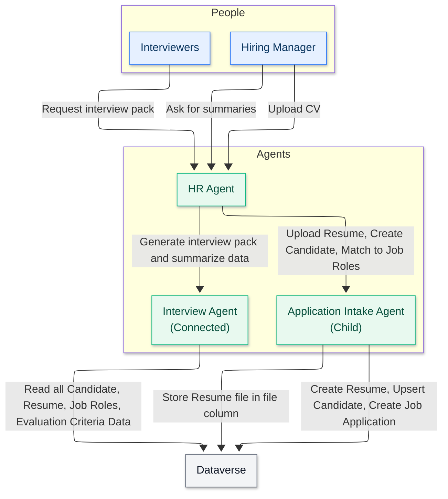
```mermaid
---
config:
  layout: elk
  look: neo
---
flowchart TB
 subgraph People["People"]
    direction TB
        HiringManager["Hiring Manager"]
        Interviewers["Interviewers"]
  end
 subgraph Agents["Agents"]
    direction LR
        ApplicationIntakeAgent["Application Intake Agent<br>(Child)"]
        InterviewAgent["Interview Agent<br>(Connected)"]
        HRAgent["HR Agent"]
  end
    HiringManager -- Upload CV --> HRAgent
    HRAgent -- Upload Resume, Create Candidate, Match to Job Roles --> ApplicationIntakeAgent
    ApplicationIntakeAgent -- Create Resume, Upsert Candidate, Create Job Application --> Dataverse["Dataverse"]
    ApplicationIntakeAgent -- Store Resume file in file column --> Dataverse
    HiringManager -- Ask for summaries --> HRAgent
    Interviewers -- Request interview pack --> HRAgent
    HRAgent -- Generate interview pack and summarize data --> InterviewAgent
    InterviewAgent -- Read all Candidate, Resume, Job Roles, Evaluation Criteria Data --> Dataverse
     HiringManager:::person
     Interviewers:::person
     ApplicationIntakeAgent:::agent
     InterviewAgent:::agent
     HRAgent:::agent
     Dataverse:::data
    classDef person fill:#e6f0ff,stroke:#3b82f6,color:#0b3660
    classDef agent fill:#e8f9ef,stroke:#10b981,color:#064e3b
    classDef data  fill:#f3f4f6,stroke:#6b7280,color:#111827
```

### 🤝Odgovornosti agenta za unos prijava

- **Parsiranje sadržaja životopisa** iz PDF-ova dostavljenih putem interaktivnog chata (u budućoj misiji naučit ćete kako autonomno obrađivati životopise).
- **Ekstrakcija strukturiranih podataka** (ime, vještine, iskustvo, obrazovanje)
- **Uspoređivanje kandidata s otvorenim pozicijama** na temelju kvalifikacija i motivacijskog pisma
- **Pohrana informacija o kandidatima** u Dataverse za kasniju obradu
- **Uklanjanje duplikata prijava** kako bi se izbjeglo stvaranje istih kandidata dva puta, uspoređivanje s postojećim zapisima pomoću e-mail adrese izvučene iz životopisa.

### ⭐Zašto bi ovo trebao biti podređeni agent

Agent za unos prijava savršeno se uklapa kao podređeni agent jer:

- Specijaliziran je za obradu dokumenata i ekstrakciju podataka
- Ne treba zasebno objavljivanje  
- Dio je našeg cjelokupnog rješenja za zapošljavanje kojim upravlja isti tim
- Fokusira se na specifičan okidač (pristigli životopis) i poziva ga glavni agent za zapošljavanje.

## 🔀Povezani agent: Agent za pripremu intervjua  

Naš drugi specijalist bit će **Agent za pripremu intervjua** - povezani agent koji pomaže u stvaranju sveobuhvatnih materijala za intervjue i procjeni odgovora kandidata.

### 🤝Odgovornosti agenta za pripremu intervjua

- **Stvaranje paketa za intervjue** s informacijama o tvrtki, zahtjevima za poziciju i kriterijima procjene
- **Generiranje pitanja za intervjue** prilagođenih specifičnim pozicijama i pozadinama kandidata
- **Odgovaranje na opća pitanja** o radnim pozicijama i prijavama za komunikaciju sa zainteresiranim stranama

### ⭐Zašto bi ovo trebao biti povezani agent

Agent za pripremu intervjua bolje funkcionira kao povezani agent jer:

- Tim za zapošljavanje možda ga želi koristiti neovisno u različitim procesima zapošljavanja
- Treba vlastitu bazu znanja o najboljim praksama za intervjue i kriterijima procjene
- Različiti voditelji zapošljavanja možda žele prilagoditi njegovo ponašanje za svoje timove
- Mogao bi se ponovno koristiti za interne pozicije, ne samo za vanjsko zapošljavanje

## 🧪Laboratorij 2.1: Dodavanje agenta za unos prijava

Spremni za primjenu teorije u praksi? Dodajmo našeg prvog podređenog agenta vašem postojećem agentu za zapošljavanje.

### Preduvjeti za dovršavanje ove misije

Trebat ćete **ili**:

- **Dovršiti Misiju 01** i imati spremnog svog agenta za zapošljavanje, **ILI**
- **Uvesti početno rješenje za Misiju 02** ako počinjete ispočetka ili trebate nadoknaditi. [Preuzmite početno rješenje za Misiju 02](https://aka.ms/agent-academy)

!!! note "Uvoz rješenja i uzorci podataka"
    Ako koristite početno rješenje, pogledajte [Misiju 01](../01-get-started/README.md) za detaljne upute o tome kako uvesti rješenja i uzorke podataka u svoje okruženje.

### 2.1.1 Postavljanje rješenja

1. Unutar Copilot Studija, odaberite tri točke (...) ispod Alata u lijevom navigacijskom izborniku.
1. Odaberite **Rješenja**.  
    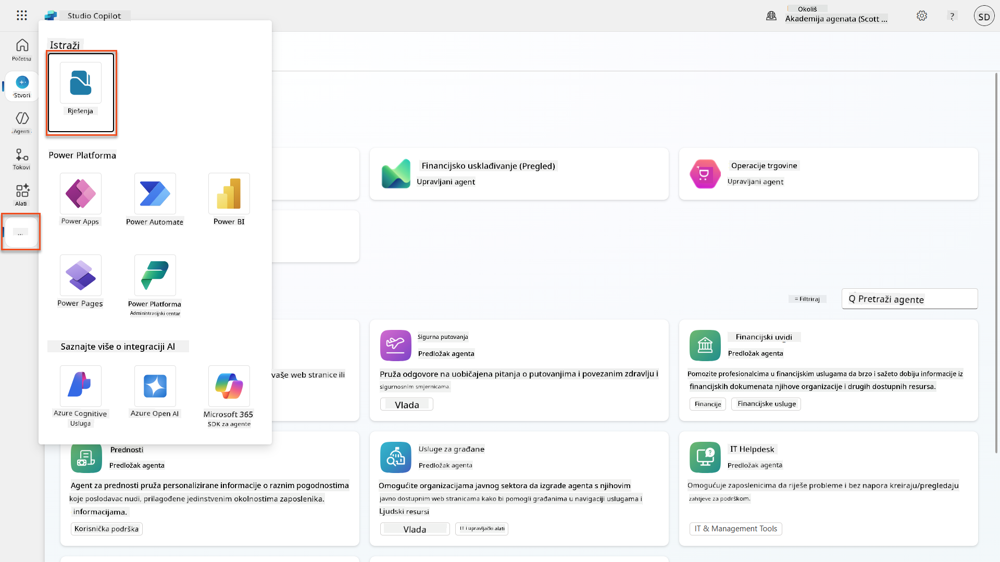
1. Pronađite svoje Operativno rješenje, odaberite **tri točke (...)** pored njega i odaberite **Postavi preferirano rješenje**. Ovo će osigurati da se sav vaš rad dodaje ovom rješenju.  
    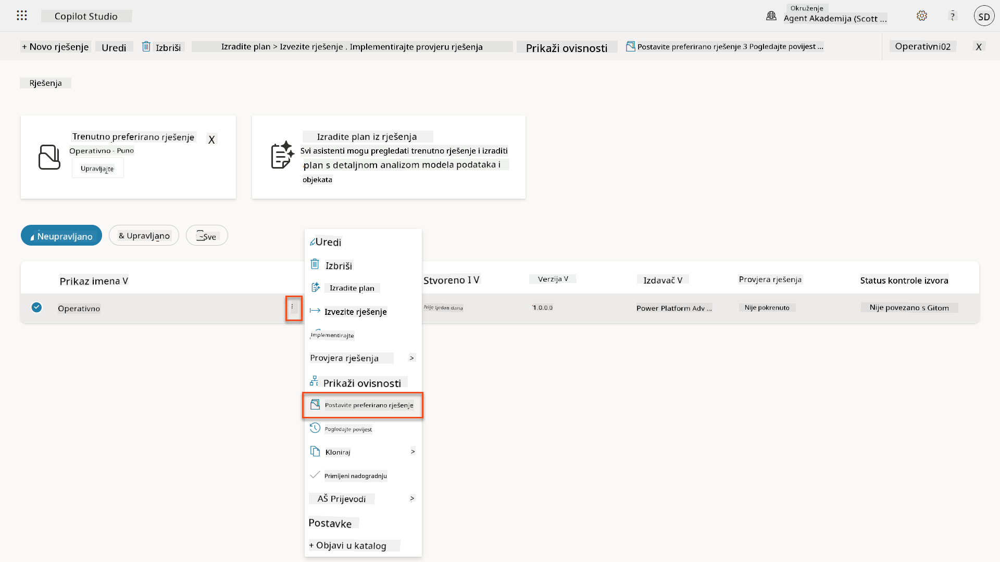

### 2.1.2 Konfigurirajte upute za agenta za zapošljavanje

1. **Navigirajte** do Copilot Studija. Osigurajte da je vaše okruženje odabrano u gornjem desnom **Odabiraču okruženja**.

1. Otvorite svog **Agenta za zapošljavanje** iz Misije 01

1. Odaberite **Uredi** u odjeljku **Upute** na kartici **Pregled**, i dodajte sljedeće upute na vrh:

    ```text
    You are the central orchestrator for the hiring process. You coordinate activities, provide summaries, and delegate work to specialized agents.
    ```

1. Odaberite **Spremi**  
    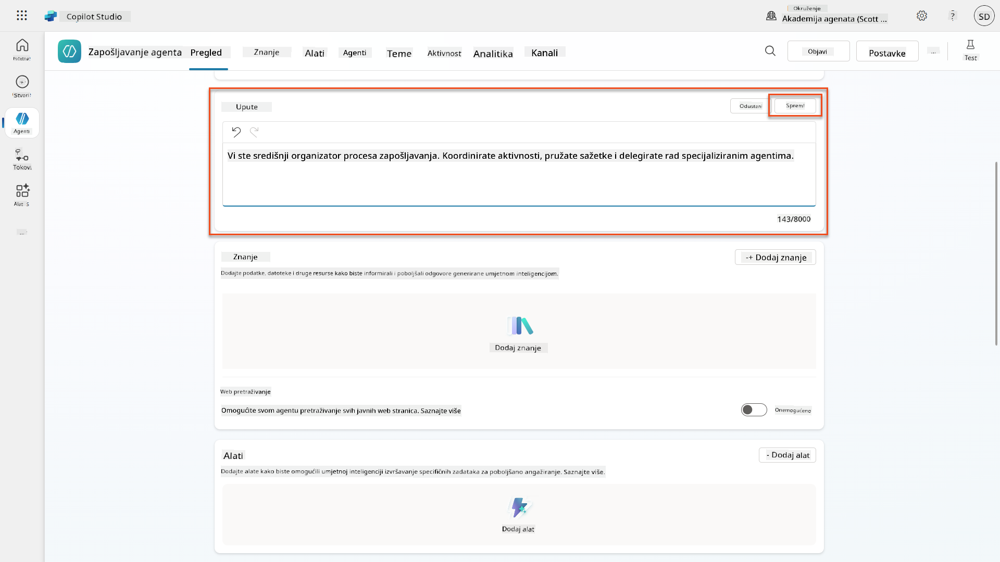

1. Odaberite **Postavke** (gore desno)

1. Osigurajte sljedeće postavke:

    | Postavka | Vrijednost |
    |----------|-----------|
    | Koristi generativnu AI orkestraciju za odgovore agenta | **Da** |
    | Moderacija sadržaja | **Umjereno** |
    | Koristi opće znanje | **Isključeno** |
    | Koristi informacije s weba | **Isključeno** |
    | Učitavanje datoteka | **Uključeno** |

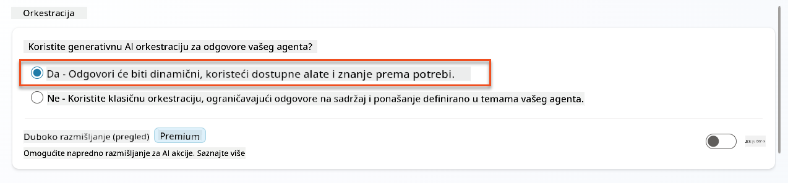
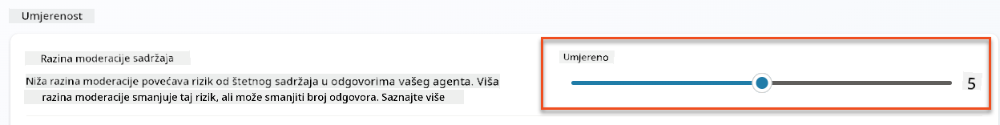


### 2.1.3 Dodavanje podređenog agenta za unos prijava

1. **Navigirajte** do kartice **Agenti** unutar vašeg Agenta za zapošljavanje - ovdje ćete dodati specijalizirane agente.

1. Odaberite **+ Dodaj** i zatim **Stvori agenta**. Primijetite da je ovo označeno s "*Stvorite laganog agenta koji živi unutar vašeg trenutnog agenta i nasljeđuje njegove postavke. Idealno za razbijanje složene logike* "  
    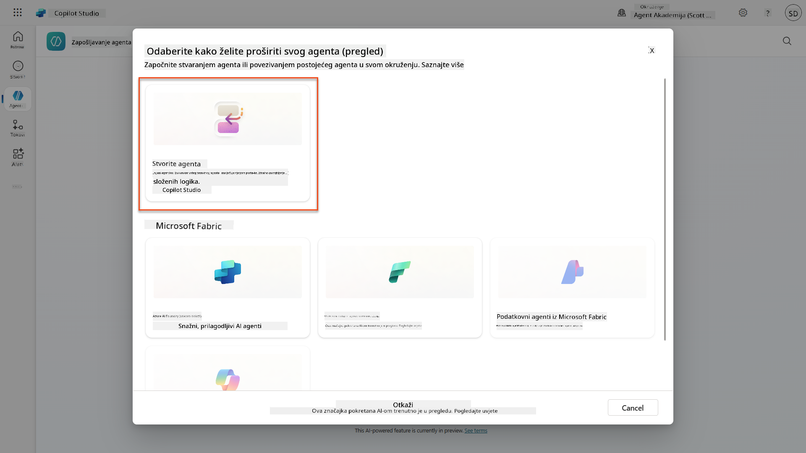

1. **Nazovite** svog agenta `Agent za unos prijava`

1. Odaberite **Agent bira** - Na temelju opisa u padajućem izborniku **Kada će se koristiti?**. Ove opcije su slične okidačima koji se mogu konfigurirati za teme.

1. Postavite **Opis** na:

    ```text
    Processes incoming resumes and stores candidates in the system
    ```

    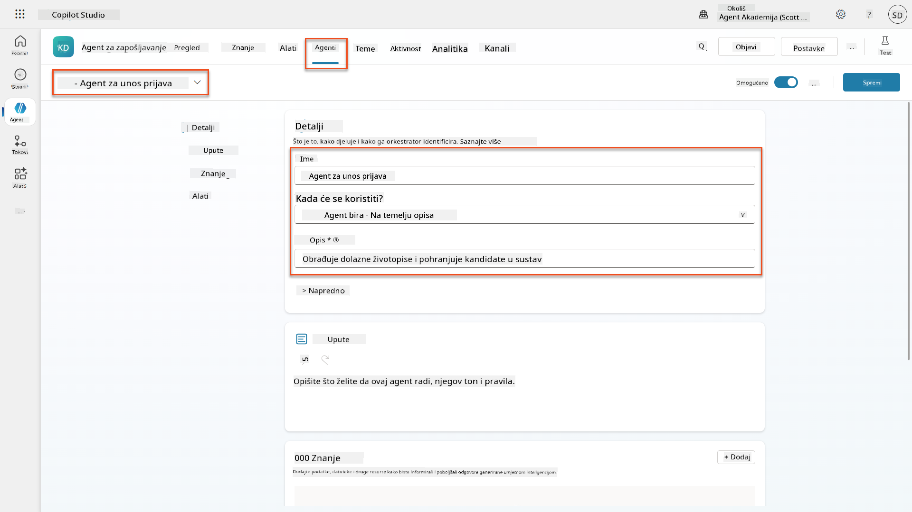

1. Proširite **Napredno**, i postavite Prioritet na `10000`. Ovo će osigurati da kasnije Agent za interv
Koristimo **Agent Flow alate** umjesto Tema za korak *Učitaj životopis* jer ovaj višekoračni proces na pozadinskom sustavu zahtijeva determinističko izvršavanje i integraciju s vanjskim sustavima. Dok su Teme najbolje za vođenje razgovora, Agent Flow omogućuje strukturiranu automatizaciju potrebnu za pouzdano rukovanje obradom datoteka, provjerom podataka i ažuriranjem baze podataka (umetanje novih ili ažuriranje postojećih) bez oslanjanja na interakciju korisnika.

1. Pronađite odjeljak **Alati** na stranici Application Intake Agent.
   **Važno:** Ovo nije kartica Alati glavnog agenta, već se može pronaći ako se pomaknete prema dolje ispod uputa za podređenog agenta.

1. Odaberite **+ Dodaj**
   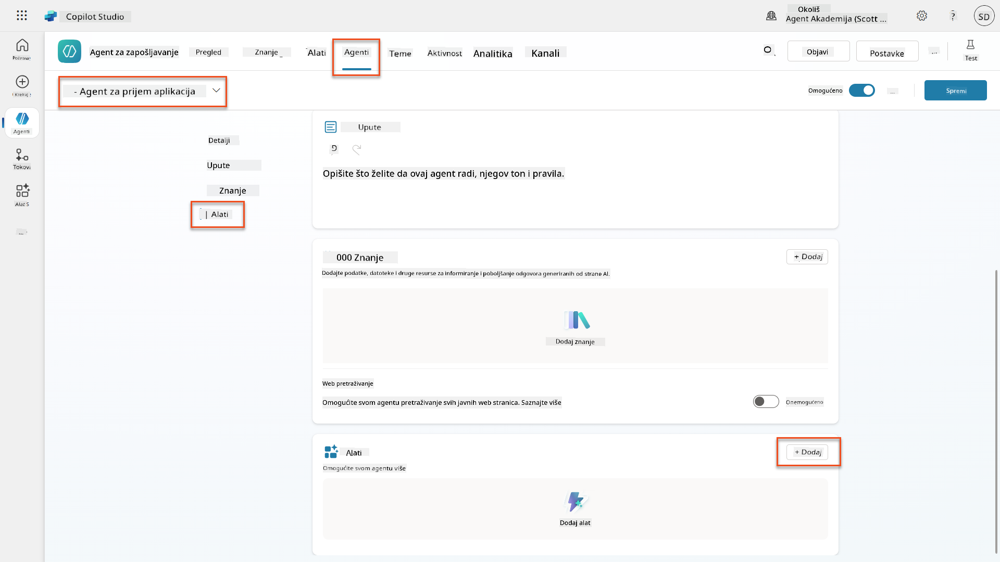

1. Odaberite **+ Novi alat** 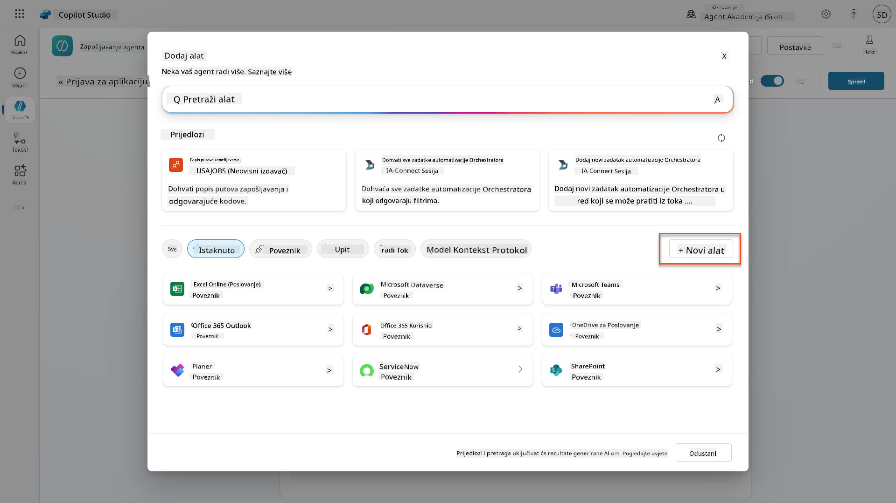

1. Odaberite **Agent flow**.
    Otvorit će se dizajner Agent Flow, gdje ćemo dodati logiku za učitavanje životopisa.  
    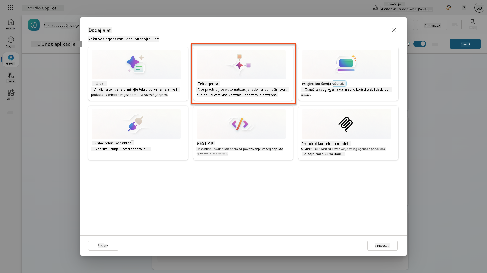

1. Odaberite čvor **Kada agent pozove tok**, i odaberite **+ Dodaj** ulaz za sljedeće parametre, pazeći da dodate i naziv i opis.

    | Tip   | Naziv      | Opis                                                                                                   |
    |-------|------------|-------------------------------------------------------------------------------------------------------|
    | Datoteka | Životopis | PDF datoteka životopisa                                                                              |
    | Tekst  | Poruka     | Izvucite poruku u stilu popratnog pisma iz konteksta. Poruka mora imati manje od 2000 znakova.        |
    | Tekst  | KorisničkiEmail | Email adresa s koje je životopis poslan. Ovo će biti korisnik koji učitava životopis u chatu ili email adresa pošiljatelja. |

    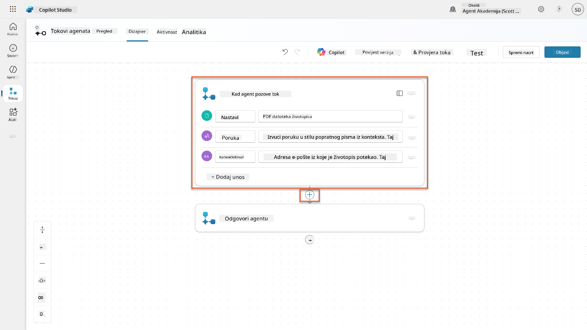

1. Odaberite **+ ikonu** ispod čvora okidača, pretražite `Dataverse`, odaberite **Vidi više** pored Microsoft Dataverse, a zatim odaberite akciju **Dodaj novi redak** u odjeljku **Microsoft Dataverse**  
    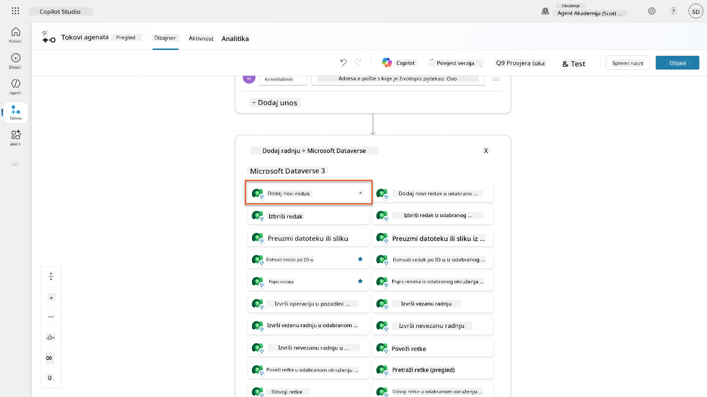

1. Imenujte čvor **Kreiraj životopis**, odabirom **tri točke(...)**, a zatim odaberite **Preimenuj**  
    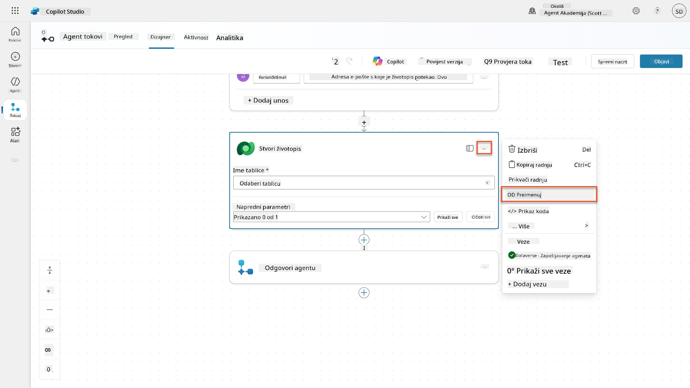

1. Postavite **Naziv tablice** na **Životopisi**, zatim odaberite **Prikaži sve**, kako biste prikazali sve parametre.

1. Postavite sljedeća **svojstva**:

    | Svojstvo                | Kako postaviti                  | Detalji / Izraz                                              |
    |-------------------------|----------------------------------|-------------------------------------------------------------|
    | **Naslov životopisa**   | Dinamički podaci (ikona munje)  | **Kada agent pozove tok** → **Naziv životopisa** Ako ne vidite naziv životopisa, provjerite jeste li konfigurirali parametar životopisa kao tip podataka. |
    | **Popratno pismo**      | Izraz (ikona fx)                | `if(greater(length(triggerBody()?['text']), 2000), substring(triggerBody()?['text'], 0, 2000), triggerBody()?['text'])` |
    | **Izvorna email adresa**| Dinamički podaci (ikona munje)  | **Kada agent pozove tok** → **KorisničkiEmail**             |
    | **Datum učitavanja**    | Izraz (ikona fx)                | `utcNow()`                                                  |

    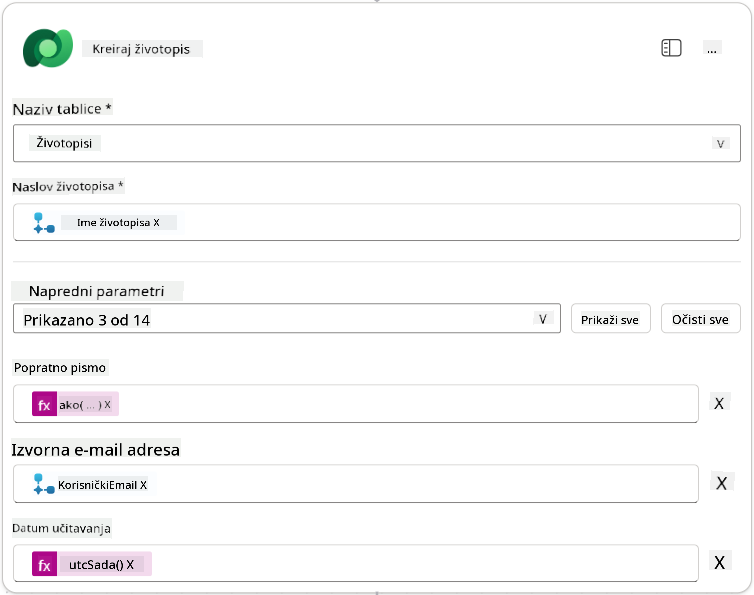

1. Odaberite **+ ikonu** ispod čvora Kreiraj životopis, pretražite `Dataverse`, odaberite **Vidi više** pored Microsoft Dataverse, a zatim odaberite akciju **Učitaj datoteku ili sliku**.
   **Važno:** Pazite da ne odaberete akciju Učitaj datoteku ili sliku u odabrano okruženje.

1. Imenujte čvor **Učitaj datoteku životopisa**, odabirom **tri točke(...)**, a zatim odaberite **Preimenuj**

1. Postavite sljedeća **svojstva**:

     | Svojstvo | Kako postaviti | Detalji |
     |----------|----------------|---------|
     | **Naziv sadržaja** | Dinamički podaci (ikona munje) | Kada agent pozove tok → Naziv životopisa |
     | **Naziv tablice** | Odaberite | Životopisi |
     | **ID retka** | Dinamički podaci (ikona munje) | Kreiraj životopis → Vidi više → Životopis |
     | **Naziv stupca** | Odaberite | PDF životopisa |
     | **Sadržaj** | Dinamički podaci (ikona munje) | Kada agent pozove tok → SadržajBytes životopisa |

     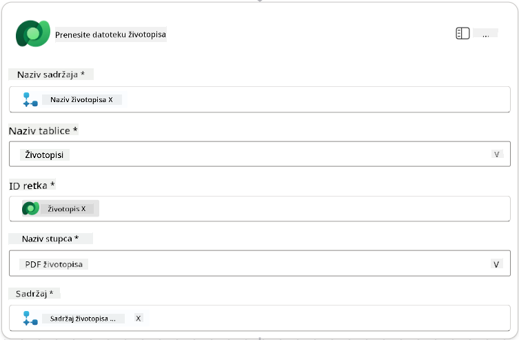

1. Odaberite čvor **Odgovori agentu**, a zatim odaberite **+ Dodaj izlaz**

     | Svojstvo | Kako postaviti | Detalji |
     |----------|----------------|---------|
     | **Tip** | Odaberite | `Tekst` |
     | **Naziv** | Unesite | `BrojŽivotopisa` |
     | **Vrijednost** | Dinamički podaci (ikona munje) | Kreiraj životopis → Vidi više → Broj životopisa |
     | **Opis** | Unesite | `Broj [BrojŽivotopisa] kreiranog životopisa` |

     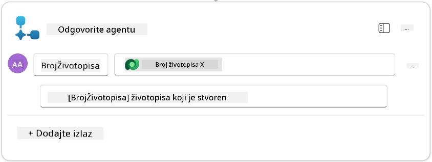

1. Odaberite **Spremi nacrt** u gornjem desnom kutu  
     

1. Odaberite karticu **Pregled**, odaberite **Uredi** na panelu **Detalji**

     1. **Naziv toka**:`Učitavanje životopisa`
     1. **Opis**:`Učitava životopis prema uputama`

     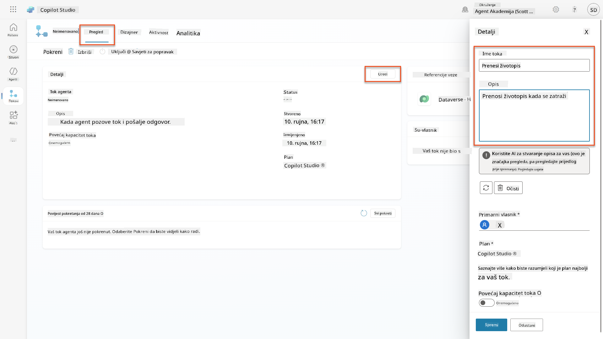

1. Ponovno odaberite karticu **Dizajner**, i odaberite **Objavi**.  
     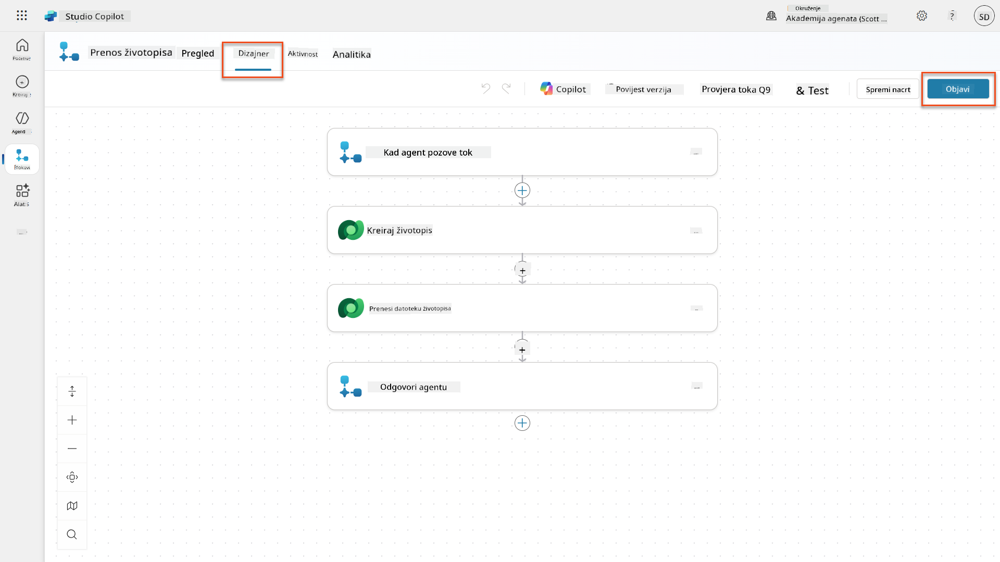

### 2.1.5 Povezivanje toka s vašim agentom

Sada ćete povezati objavljeni tok s vašim Application Intake Agentom.

1. Vratite se na **Hiring Agent** i odaberite karticu **Agenti**. Otvorite **Application Intake Agent**, a zatim pronađite panel **Alati**.  
    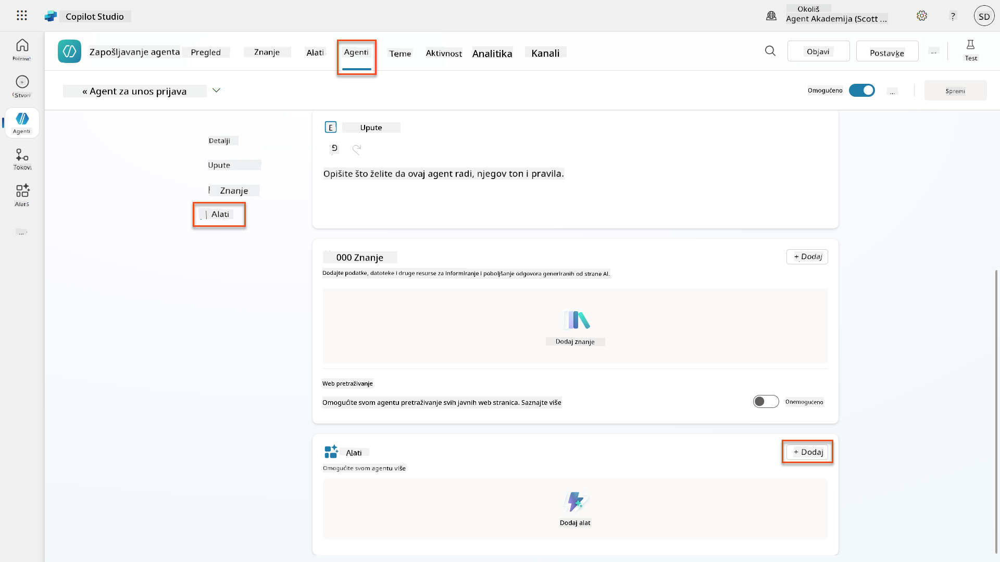

1. Odaberite **+ Dodaj**

1. Odaberite filter **Tok**, i pretražite `Učitavanje životopisa`. Odaberite tok **Učitavanje životopisa**, a zatim **Dodaj i konfiguriraj**.

1. Postavite sljedeće parametre:

    | Parametar | Vrijednost |
    |-----------|------------|
    | **Opis** | `Učitava životopis prema uputama. STROGO PRAVILO: Ovaj alat se smije pozvati samo kada se spominje u obliku "Učitavanje životopisa" i kada postoje privitci.` |
    | **Dodatni detalji → Kada se ovaj alat može koristiti** | `samo kada ga spominju teme ili agenti` |
    | **Ulazi → Dodaj ulaz** | `sadržajBytes` |
    | **Ulazi → Dodaj ulaz** | `naziv` |

    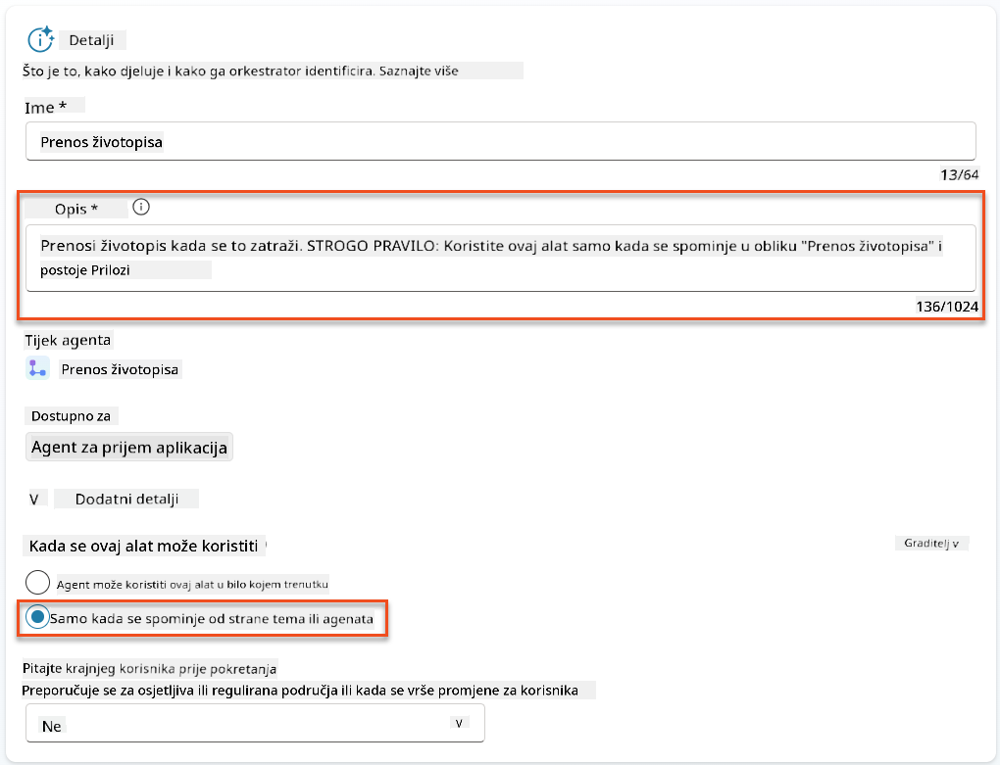

    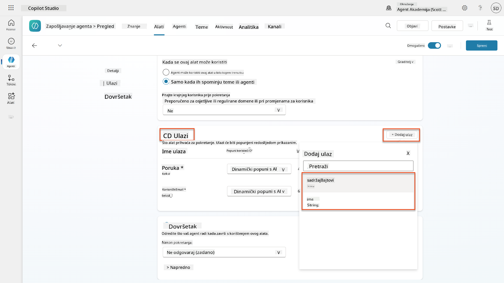

1. Zatim postavite svojstva ulaza kako slijedi:

    | Parametar ulaza | Svojstvo | Detalji |
    |-----------------|----------|---------|
    | **sadržajBytes** | Popuni koristeći | Prilagođena vrijednost |
    |                  | Vrijednost (...→Formula→Umetni) | `First(System.Activity.Attachments).Content` |
    | **naziv** | Popuni koristeći | Prilagođena vrijednost |
    |          | Vrijednost (...→Formula→Umetni) | `First(System.Activity.Attachments).Name` |
    | **Poruka** | Prilagodi | Konfiguriraj prilagođene postavke |
    |             | Opis | `Izvucite poruku u stilu popratnog pisma iz konteksta. Pazite da nikada ne tražite od korisnika i stvorite barem minimalno popratno pismo iz dostupnog konteksta. STROGO PRAVILO - poruka mora imati manje od 2000 znakova.` |
    |             | Koliko puta ponoviti | Ne ponavljaj |
    |             | Akcija ako entitet nije pronađen | Postavi varijablu na vrijednost |
    |             | Zadana vrijednost entiteta | Učitavanje životopisa |
    | **KorisničkiEmail** | Popuni koristeći | Prilagođena vrijednost |
    |  | Vrijednost (...→Formula→Umetni) | `System.User.Email` |

    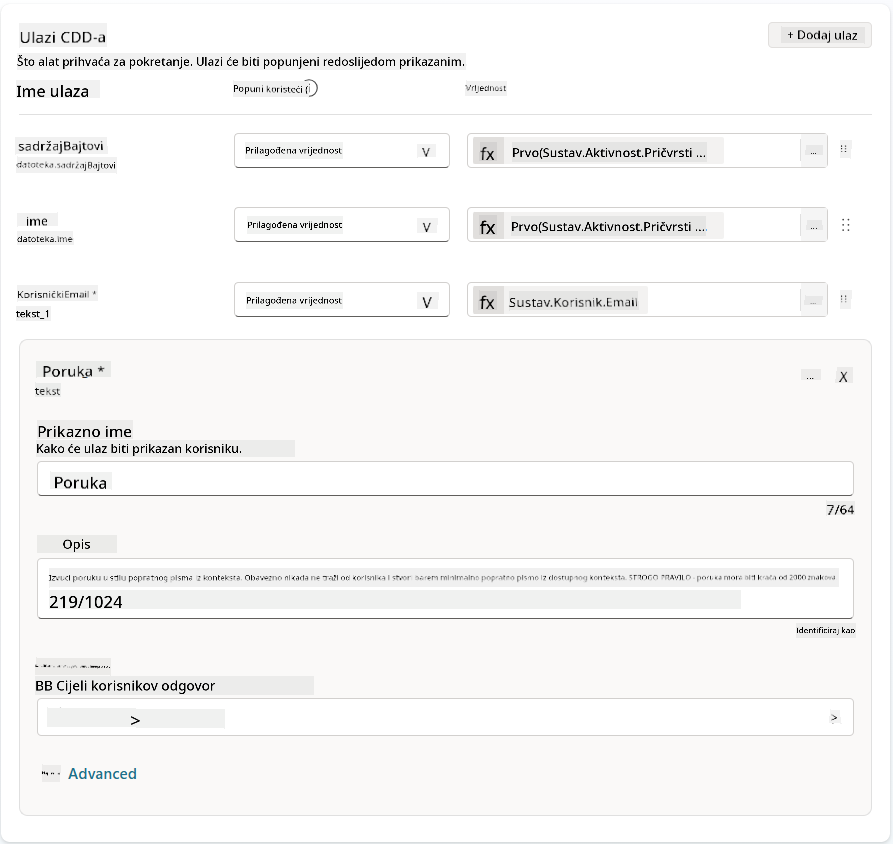

1. Odaberite **Spremi**

### 2.1.6 Definirajte upute za agenta

1. Vratite se u **Application Intake Agent** odabirom kartice **Agenti**, a zatim pronađite panel **Upute**.

1. U polje **Upute**, zalijepite sljedeće jasne smjernice za vašeg podređenog agenta:

    ```text
    You are tasked with managing incoming Resumes, Candidate information, and creating Job Applications.  
    Only use tools if the step exactly matches the defined process. Otherwise, indicate you cannot help.  
    
    Process for Resume Upload via Chat  
    1. Upload Resume  
      - Trigger only if /System.Activity.Attachments contains exactly one new resume.  
      - If more than one file, instruct the user to upload one at a time and stop.  
      - Call /Upload Resume once. Never upload more than once for the same message.  
    
    2. Post-Upload  
      - Always output the [ResumeNumber] (R#####).  
    ```

1. Gdje upute uključuju kosu crtu (/), odaberite tekst nakon / i odaberite riješeno ime. Učinite to za:

    - `System.Activity.Attachments` (Varijabla)
    - `Učitaj životopis` (Alat)

    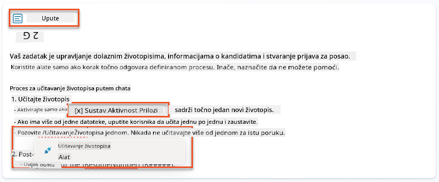

1. Odaberite **Spremi**

### 2.1.7 Testirajte svog Application Intake Agenta

Sada provjerimo radi li vaš prvi član orkestra ispravno.

1. **Preuzmite** [testne životopise.](https://download-directory.github.io/?url=https://github.com/microsoft/agent-academy/tree/main/operative/sample-data/resumes&filename=operative_sampledata)

1. **Otvorite** testni panel odabirom **Test**.

1. **Učitajte** dva životopisa u testni chat i pošaljite poruku `Obradi ove životopise`

    - Agent bi trebao vratiti poruku sličnu *Može se učitati samo jedan životopis odjednom. Molimo učitajte jedan životopis za nastavak.*

    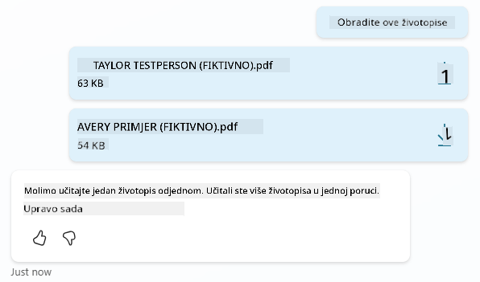

1. Pokušajte učitati **samo jedan životopis**, s porukom `Obradi ovaj životopis`

    - Agent bi tada trebao poslati poruku sličnu *Životopis za Avery Example uspješno je učitan. Broj životopisa je R10026.*

1. Na **Karti aktivnosti**, trebali biste vidjeti kako **Application Intake Agent** obrađuje učitavanje životopisa.  
    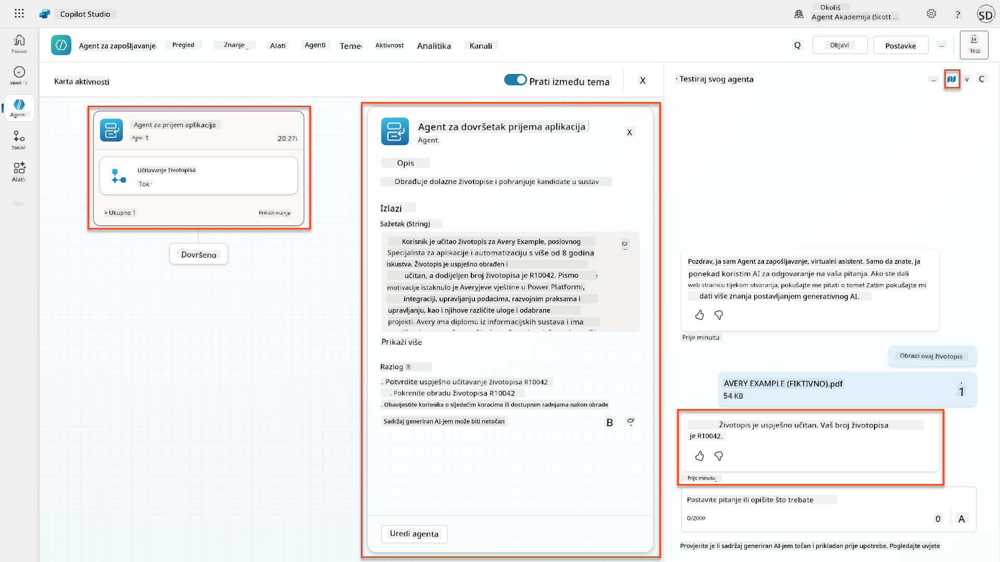

1. Idite na make.powerapps.com → Provjerite je li vaše okruženje odabrano u gornjem desnom kutu biranja okruženja.

1. Odaberite **Aplikacije** → Hiring Hub → izbornik s tri točke(...) → **Pokreni**  
    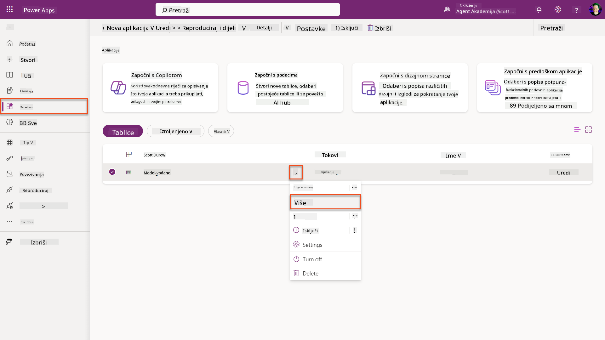

    Napomena: Ako je gumb za pokretanje zasivljen, to znači da niste objavili svoje rješenje iz Misije 01. Odaberite **Rješenja** → **Objavi sve prilagodbe**.

1. Idite na **Životopisi**, i provjerite je li datoteka životopisa učitana i je li popratno pismo ispravno postavljeno.  
    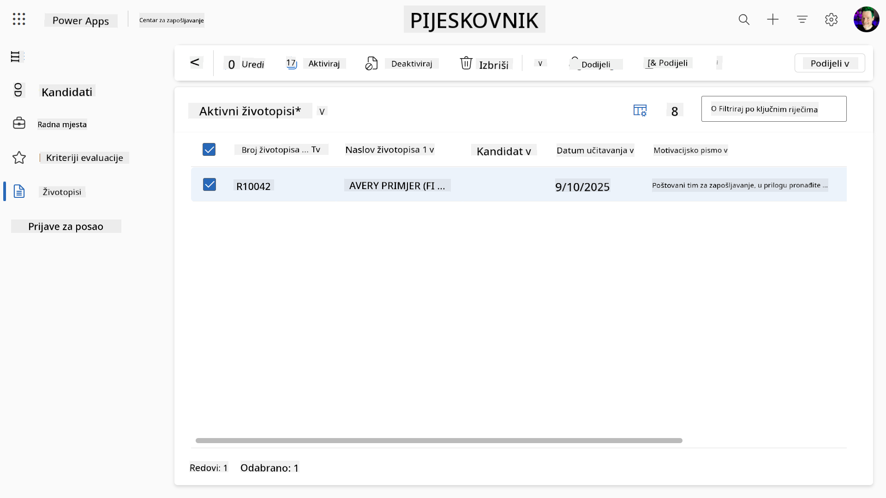

## 🧪Laboratorij 2.2: Dodavanje povezanog agenta za pripremu intervjua

Sada ćemo kreirati našeg povezanog agenta za pripremu intervjua i dodati ga vašem postojećem Hiring Agentu.

### 2.2.1 Kreirajte povezanog agenta za intervju

1. **Idite** na Copilot Studio. Provjerite je li vaše okruženje još uvijek odabrano u gornjem desnom kutu biranja okruženja.

1. Otvorite svoj **Hiring Agent**

1. Idite na karticu Agenti i odaberite **+ Dodaj agenta**

1. Odaberite **Poveži postojećeg agenta** → **Copilot Studio**

1. Odaberite **+ Novi agent**

### 2.2.2 Konfigurirajte osnovne postavke

1. Odaberite karticu **Konfiguriraj**, i unesite sljedeća svojstva:

    - **Naziv**: `Agent za intervju`
    - **Opis**: `Pomaže u procesu intervjua.`

1. Upute:

    ```text
    You are the Interview Agent. You help interviewers and hiring managers prepare for interviews. You never contact candidates. 
    Use Knowledge to help with interview preparation. 
    
    The only valid identifiers are:
      - ResumeNumber (ppa_resumenumber)→ format R#####
      - CandidateNumber (ppa_candidatenumber)→ format C#####
      - ApplicationNumber (ppa_applicationnumber)→ format A#####
      - JobRoleNumber (ppa_jobrolenumber)→ format J#####
    
    Examples you handle
      - Give me a summary of ...
      - Help me prepare to interview candidates for the Power Platform Developer role
      - Create interview assistance for the candidates for Power Platform Developer
      - Give targeted questions for Candidate Alex Johnson focusing on the criteria for the Job Application
      
    How to work:
        You are expected to ask clarification questions if required information for queries is not provided
        - If asked for interview help without providing a job role, ask for it
        - If asking for interview questions, ask for the candidate and job role if not provided.
    
    General behavior
    - Do not invent or guess facts
    - Be concise, professional, and evidence-based
    - Map strengths and risks to the highest-weight criteria
    - If data is missing (e.g., no resume), state what is missing and ask for clarification
    - Never address or message a candidate
    ```

1. Prebacite **Web pretraživanje** na **Onemogućeno**

1. Odaberite **Kreiraj**  
    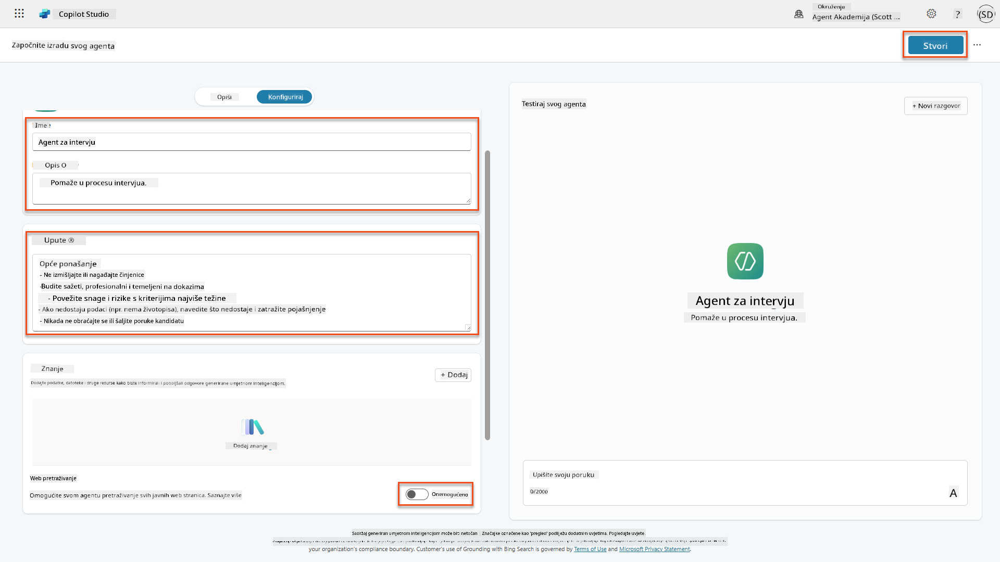

### 2.2.3 Konfigurirajte pristup podacima i objavite

1. U odjeljku **Znanje**, odaberite **+ Dodaj znanje**  
    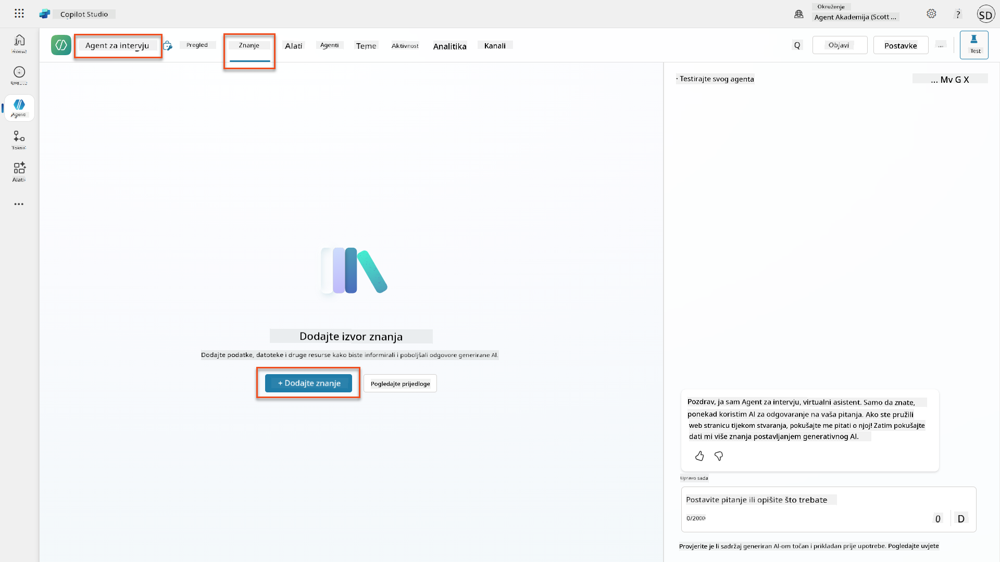
1. Odaberite **Dataverse**  
    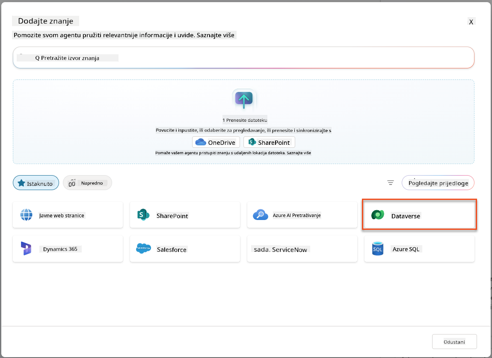
1. U polje za pretraživanje upišite `ppa_`. Ovo je prefiks za tablice koje ste prethodno uvezli.
1. **Odaberite** svih 5 tablica (Kandidat, Kriteriji za evaluaciju, Prijava za posao, Uloga posla, Životopis)
1. Odaberite **Dodaj agentu**  
    
1. Odaberite **Postavke**, na Agentu za intervju, i postavite sljedeće postavke:

    - **Dopusti drugim agentima da se povežu i koriste ovog:** `Uključeno`
    - **Koristi opće znanje**: `Isključeno`
    - **Učitavanje datoteka**: `Isključeno`
    - **Razina moderacije sadržaja:** `Srednja`
1. Odaberite **Spremi**
1. Odaberite **Objavi**, i pričekajte da se objavljivanje završi.

### 2.2.4 Povežite agenta za pripremu intervjua s vašim Hiring Agentom

1. Vratite se na svoj **Hiring Agent**

1. Odaberite karticu **Agenti**

1. Koristite **+Dodaj agenta** → **Copilot Studio**, kako biste dodali **Agenta za intervju**. Postavite opis na:
    ```text
    Assists with the interview process and provides information about Resumes, Candidates, Job Roles, and Evaluation Criteria.
    ```

    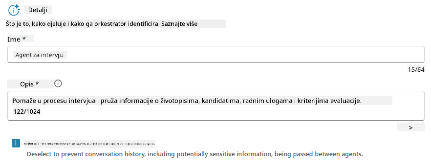
    Primijetite da je opcija Proslijedi povijest razgovora ovom agentu označena. To omogućuje glavnom agentu da pruži puni kontekst povezanom agentu.

1. Odaberite **Dodaj agenta**

1. Provjerite da vidite i **Agent za prijavu aplikacija** i **Agent za intervju**. Primijetite kako je jedan podređeni, a drugi povezani agent.  
    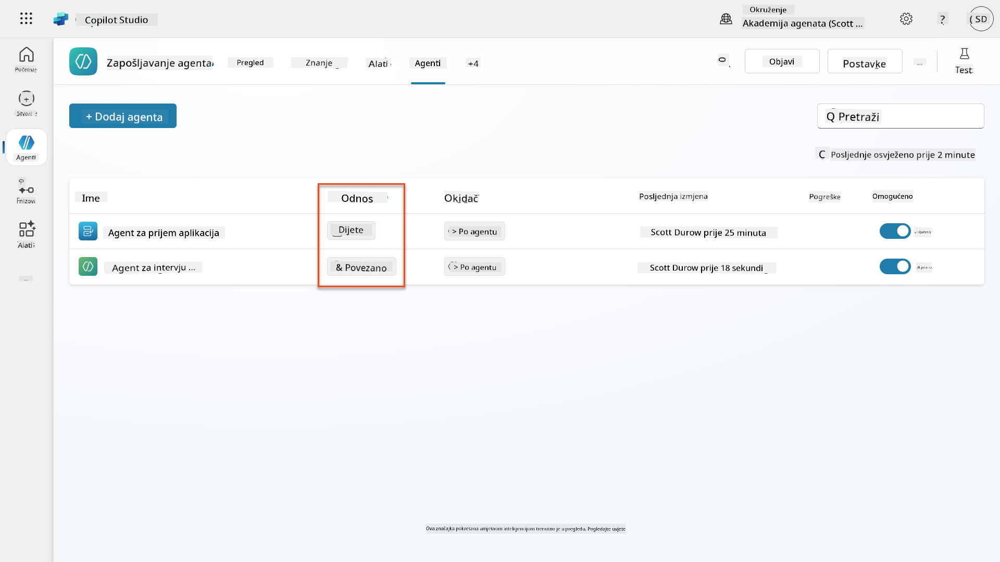

### 2.2.5 Testiranje suradnje više agenata

1. **Otvorite** testni panel odabirom **Test**.

1. **Prenesite** jedan od testnih životopisa i unesite sljedeći opis koji govori glavnom agentu što može delegirati povezanom agentu:

    ```text
    Upload this resume, then show me open job roles, each with a description of the evaluation criteria, then use this to match the resume to at least one suitable job role even if not a perfect match.
    ```

    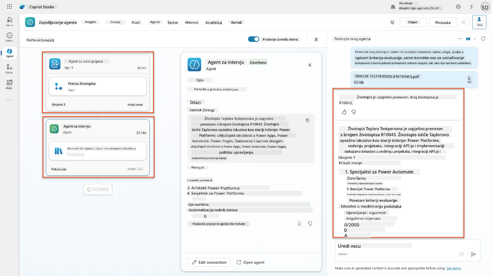

1. Primijetite kako je Agent za zapošljavanje delegirao prijenos podređenom agentu, a zatim zatražio od Agenta za intervju da pruži sažetak i podudaranje radne uloge koristeći svoje znanje. 
   Isprobajte različite načine postavljanja pitanja o životopisima, radnim ulogama i kriterijima procjene.  
   **Primjeri:**

    ```text
    Give me a summary of active resumes
    ```

    ```text
    Summarize resume R10044
    ```

    ```text
    Which active resumes are suitable for the Power Platform Developer role?
    ```

## 🎉 Misija završena

Odličan posao, Agente! **Operacija Simfonija** je sada završena. Uspješno ste transformirali svog jednostavnog Agenta za zapošljavanje u sofisticirani orkestar više agenata sa specijaliziranim sposobnostima.

Evo što ste postigli u ovoj misiji:

**✅ Majstorstvo arhitekture više agenata**  
Sada razumijete kada koristiti podređene agente naspram povezanih agenata i kako dizajnirati sustave koji se mogu skalirati.

**✅ Podređeni agent za prijavu aplikacija**  
Dodali ste specijaliziranog podređenog agenta svom Agentu za zapošljavanje koji obrađuje životopise, izvlači podatke o kandidatima i pohranjuje informacije u Dataverse.

**✅ Povezani agent za pripremu intervjua**  
Izgradili ste višekratno upotrebljivog povezanog agenta za pripremu intervjua i uspješno ga povezali sa svojim Agentom za zapošljavanje.

**✅ Komunikacija agenata**  
Vidjeli ste kako vaš glavni agent može koordinirati sa specijaliziranim agentima, dijeliti kontekst i orkestrirati složene tijekove rada.

**✅ Temelj za autonomiju**  
Vaš poboljšani sustav zapošljavanja sada je spreman za napredne značajke koje ćemo dodati u nadolazećim misijama: autonomne okidače, moderaciju sadržaja i dubinsko zaključivanje.

🚀**Sljedeće:** U vašoj sljedećoj misiji naučit ćete kako konfigurirati svog agenta da autonomno obrađuje životopise iz e-pošte!

⏩[Prijeđite na Misiju 03: Automatizirajte svog agenta pomoću okidača](../03-automate-triggers/README.md)

## 📚 Taktički resursi

📖 [Dodavanje drugih agenata (pregled)](https://learn.microsoft.com/microsoft-copilot-studio/authoring-add-other-agents?WT.mc_id=power-182762-scottdurow)

📖 [Dodavanje alata prilagođenim agentima](https://learn.microsoft.com/microsoft-copilot-studio/advanced-plugin-actions?WT.mc_id=power-182762-scottdurow)

📖 [Rad s Dataverseom u Copilot Studiju](https://learn.microsoft.com/microsoft-copilot-studio/knowledge-add-dataverse?WT.mc_id=power-182762-scottdurow)

📖 [Pregled tijekova rada agenata](https://learn.microsoft.com/microsoft-copilot-studio/flows-overview?WT.mc_id=power-182762-scottdurow)

📖 [Stvaranje rješenja](https://learn.microsoft.com/power-platform/alm/solution-concepts-alm?WT.mc_id=power-182762-scottdurow)

📖 [Vodič za ALM rješenja Power Platforme](https://learn.microsoft.com/power-platform/alm/overview-alm?WT.mc_id=power-182762-scottdurow)

📺 [Suradnja između agenata u Copilot Studiju](https://youtu.be/d-oD3pApHAg?si=rwIHKhJTkjSvhTHw)

---

**Odricanje od odgovornosti**:  
Ovaj dokument je preveden pomoću AI usluge za prevođenje [Co-op Translator](https://github.com/Azure/co-op-translator). Iako nastojimo osigurati točnost, imajte na umu da automatski prijevodi mogu sadržavati pogreške ili netočnosti. Izvorni dokument na izvornom jeziku treba smatrati autoritativnim izvorom. Za ključne informacije preporučuje se profesionalni prijevod od strane čovjeka. Ne preuzimamo odgovornost za nesporazume ili pogrešna tumačenja koja proizlaze iz korištenja ovog prijevoda.