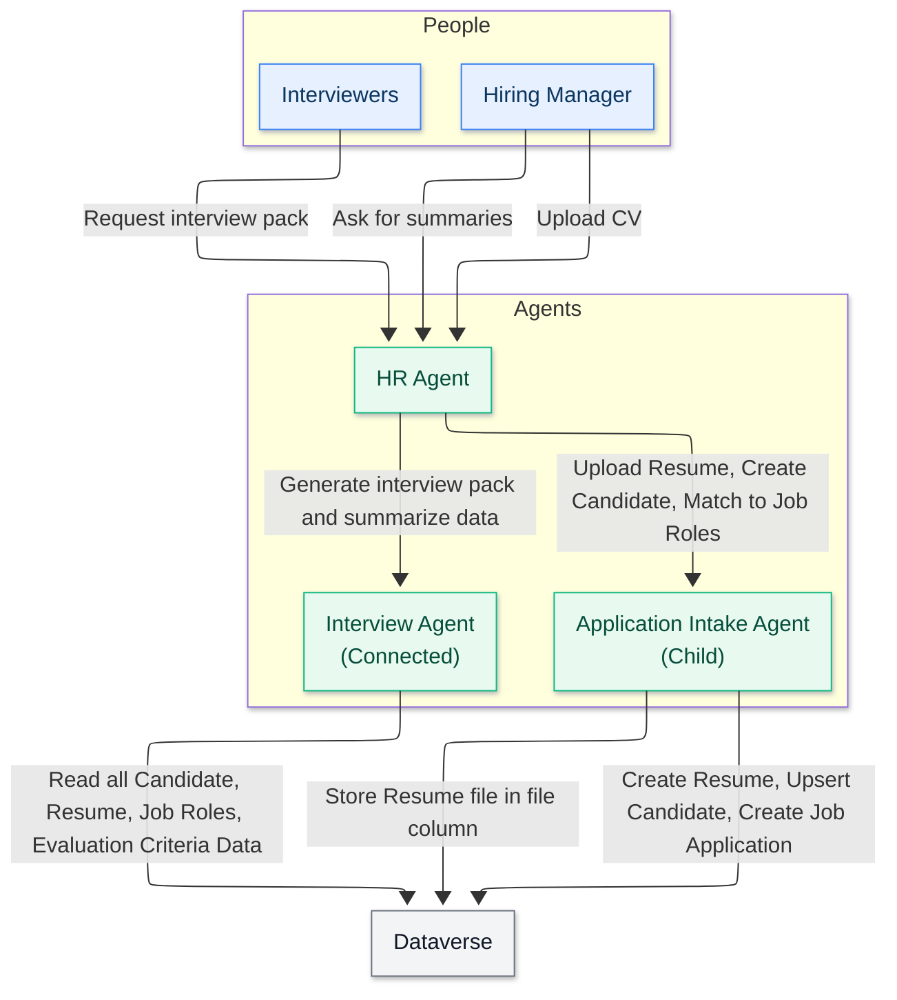

<!--
CO_OP_TRANSLATOR_METADATA:
{
  "original_hash": "02c15421de88efe63b32ca403c366f86",
  "translation_date": "2025-10-20T22:49:24+00:00",
  "source_file": "docs/operative-preview/02-multi-agent/assets/connected-agents-diagram.md",
  "language_code": "hr"
}
-->
# Dijagram povezanih agenata

---

**Izjava o odricanju odgovornosti**:  
Ovaj dokument je preveden pomoću AI usluge za prevođenje [Co-op Translator](https://github.com/Azure/co-op-translator). Iako nastojimo osigurati točnost, imajte na umu da automatski prijevodi mogu sadržavati pogreške ili netočnosti. Izvorni dokument na izvornom jeziku treba smatrati autoritativnim izvorom. Za ključne informacije preporučuje se profesionalni prijevod od strane čovjeka. Ne preuzimamo odgovornost za nesporazume ili pogrešna tumačenja koja proizlaze iz korištenja ovog prijevoda.