<!--
CO_OP_TRANSLATOR_METADATA:
{
  "original_hash": "75efaf515d5694d4fd549bfd6518901a",
  "translation_date": "2025-10-20T23:15:00+00:00",
  "source_file": "docs/operative-preview/03-automate-triggers/README.md",
  "language_code": "hr"
}
-->
# Misija 03: Dodavanje okidača događaja za autonomno djelovanje

--8<-- "disclaimer.md"

## 🕵️‍♂️ KODNO IME: `OPERACIJA SIGNALNA TOČKA`

> **⏱️ Vremenski okvir operacije:** `~45 minuta`

## 🎯 Kratak opis misije

Dobrodošli nazad, agente. U [Misiji 02](../02-multi-agent/README.md) - naučili ste kako izraditi podagenta za prijem aplikacija i povezanog agenta za pripremu intervjua kako biste proširili mogućnosti vašeg glavnog agenta za zapošljavanje.

Vaš zadatak, ako ga odlučite prihvatiti, je **Operacija Signalna Točka** - dublje istraživanje **okidača događaja** - podizanje vašeg sustava agenata s reaktivnog na **autonomno djelovanje**. Transformirat ćete svoje agente iz onih koji _odgovaraju na pitanja_ u agente koji _predviđaju potrebe_ i _djeluju neovisno_. Kroz okidače događaja i automatizirane tijekove rada, vaš agent za zapošljavanje će otkriti dolazne e-mailove s životopisima, automatski obraditi privitke, pohraniti podatke u Dataverse i obavijestiti vaš HR tim za zapošljavanje putem Microsoft Teams-a - dok se vi fokusirate na zadatke veće vrijednosti.

Dobrodošli u svijet gdje se automatizacija susreće s inteligencijom.

## 🔎 Ciljevi

U ovoj misiji naučit ćete:

1. Kako okidači događaja omogućuju autonomno ponašanje agenta bez interakcije korisnika
1. Razlike između interaktivnih i autonomnih agenata u Copilot Studiju
1. Kako stvoriti okidače događaja koji automatski obrađuju privitke e-mailova i učitavaju datoteke u Dataverse
1. Kako izgraditi tijekove rada agenta koji objavljuju prilagodljive kartice u kanalima Teams-a za obavijesti
1. Kako prenijeti podatke između okidača događaja i tijekova rada agenta za automatizaciju od početka do kraja

## 🤔 Što je okidač događaja?

Ranije u [Recruit](../../recruit/10-add-event-triggers/README.md), naučili smo o okidačima događaja. Napravimo kratki pregled u slučaju da ste to propustili.

**Okidači događaja** omogućuju agentu da _djeluje_ samostalno kada se nešto dogodi u drugom sustavu - bez potrebe za porukom korisnika. Kada se konfigurirani događaj aktivira - poput "novi SharePoint element", "novi e-mail", "Planner zadatak dodijeljen" ili čak vremenski definirana ponavljanja, konektor šalje okidač s podacima vašem agentu. Agent tada slijedi vaše upute kako bi odlučio koje radnje ili teme treba pozvati.

### Ključne karakteristike

- **Autonomna aktivacija:**
      - Za razliku od okidača tema koji se pokreću kada korisnik komunicira s agentom, okidači događaja aktiviraju se vanjskim događajima, omogućujući proaktivno ponašanje.

- **Vođeno podacima:**
      - Svaki događaj dostavlja podatke (varijable + opcionalne upute) putem konektora. Agent koristi vaše definirane upute i podatke kako bi odlučio što dalje učiniti.
      - Na primjer, _pozvati temu_ ili _izvršiti radnje definirane alatima_.

- **Primjeri iz kutije:**
      - SharePoint/OneDrive datoteka ili element stvoren
      - Planner zadatak dovršen/dodijeljen
      - Microsoft Forms odgovor poslan
      - Ponavljanje/raspored

    Dostupnost ovisi o politikama podataka vaše organizacije konfiguriranim u Power Automate.

- **Zahtijeva generativnu orkestraciju:**
      - Okidači događaja dostupni su samo kada je generativna orkestracija omogućena za agenta.

- **Troškovi/upotreba:**
      - Svaka dostava okidača računa se kao poruka prema kapacitetu Copilot Studija.
      - Na primjer, ponavljanje svakih 10 minuta šalje poruku svakih 10 minuta.

- **Model autentifikacije i postavke:**
      - Dodajete okidače unutar pregleda agenta, pod _Okidači_. Autentifikacija za konektor okidača koristi račun autora agenta ("autentifikacija autora agenta").
      - Možete uređivati parametre okidača i podatke u Power Automate portalu za izradu.

- **Testiranje i pregled:**
      - Možete testirati okidače iz testnog panela agenta i pregledati ponašanje pomoću mape aktivnosti prije objavljivanja.

!!! info "Sažetak za programere"

    Zamislite okidače događaja kao **signale slične webhookovima** koji šalju strukturirane podatke vašem agentu, omogućujući mu da _započne_ rad i poveže radnje između sustava - bez čekanja da korisnik nešto zatraži.

### Okidači tema - kako se razlikuju

Ranije ste naučili o okidačima tema u [Recruit](../../recruit/07-add-new-topic-with-trigger/README.md), međutim, možda se još uvijek pitate kako se _okidači tema_ razlikuju od _okidača događaja_ i zašto je ta razlika važna za razumijevanje što čini agenta autonomnim.

Okidači tema kontroliraju _kada se tema pokreće_, obično kao odgovor na poruku korisnika.

- U generativnoj orkestraciji, zadani okidač je **Od strane agenta** - planer bira temu čije ime/opis najbolje odgovara poruci korisnika.
- U klasičnoj orkestraciji, zadani okidač su **Fraze** - planer bira temu kada jedna ili nekoliko fraza okidača najbolje odgovara poruci korisnika.

Ostale vrste okidača uključuju `Primljena poruka`, `Primljen događaj`, `Primljena aktivnost`, `Ažuriranje razgovora`, `Primljen poziv`, `Preusmjeravanje`, `Neaktivnost` i `Dovršen plan`.

!!! info "Osnovna razlika"

    Okidači tema su _pokretači aktivnosti razgovora_ unutar chata.
    
    Okidači događaja su _pokretači sustavskih događaja_ dostavljeni putem konektora koji mogu pokrenuti agenta bez ikakvog razgovora.

### Brzi vodič za razliku između okidača tema i okidača događaja

- **Okidač teme:** Korisnik (ili aktivnost u chatu) kaže/učini X ➡️ pokreni temu T.
- **Okidač događaja:** SharePoint/Planner/E-mail/Timer aktiviran s podacima P ➡️ agent procjenjuje upute ➡️ poziva radnje/teme prema potrebi.

## 🏓 Usporedba interaktivnog i autonomnog agenta

Sada kada znate razliku između okidača događaja i okidača tema, sljedeće ćemo naučiti razliku između interaktivnog i autonomnog agenta.

U terminima Copilot Studija, "interaktivni" se odnosi na agente koji prvenstveno komuniciraju putem **tema** u chatu ili kanalu. "Autonomni" se odnosi na agente koji također koriste **okidače događaja** za rad bez korisničkog unosa.

Sljedeća tablica sažima njihove razlike i sličnosti.

| Dimenzija                           | Interaktivni agent     | Autonomni agent                                                                                              |
|-------------------------------------|-----------------------|---------------------------------------------------------------------------------------------------------------|
| Kako se pokreće                     | Korisnik (ili aktivnost u chatu) pokreće temu. Primjer: Od strane agenta, Fraze, Primljena poruka.   | Vanjski okidač događaja šalje podatke putem konektora agentu. Primjer: SharePoint, Planner, e-mail, raspored, itd. |
| Primarna upotreba                   | Pitanja i odgovori, vođeni tijekovi rada, radnje na zahtjev u chatu - Teams, web, itd.  | Proaktivne operacije i automatizacija u pozadini - reagiranje na promjene u sustavu, obavještavanje, pohrana ili organizacija zadataka. |
| Površina okidača                    | Okidači tema: Od strane agenta / Fraze / Primljena poruka / Tipovi aktivnosti / Poziv / Neaktivnost / Dovršen plan | Biblioteka okidača događaja putem konektora; podaci uključuju podatke o događaju + opcionalne upute. |
| Planer (generativna orkestracija)   | Snažno se koristi za okidače Od strane agenta i Dovršen plan za odabir/slijed tema. | Potrebno za okidače događaja; agent koristi upute + podatke za odlučivanje koje radnje/teme pozvati. |
| Tipičan primjer                     | Korisnik pita "Koja je naša politika povrata?" → Tema se pokreće, pretražuje znanje, odgovara. | Novi Planner zadatak dodijeljen → Okidač događaja aktiviran → Agent objavljuje poruku u Teams, ažurira zapis ili poziva temu. |
| Put postavljanja                    | Kreirajte teme, definirajte tip okidača, napišite dijalog/radnje; objavite u kanalima. | Dodajte okidač događaja (Pregled → Okidači), autentificirajte konektor s vjerodajnicama autora agenta, konfigurirajte podatke/upute; testirajte putem testnog panela; objavite. |
| Autentifikacija i upravljanje       | Radi pod kontekstom kanala/autentifikacije; okidači tema reagiraju na aktivnosti chata u dopuštenim kanalima. | Dostupnost okidača ovisi o politikama podataka Power Automate; konektori rade pod računom autora agenta. |
| Pregled                             | Testirajte teme unutar Copilot Studija, pregledajte transkripte razgovora/aktivnosti. | Koristite Test okidač i mapu aktivnosti za provjeru izvršenja prije objavljivanja, pratite aktivnosti nakon objavljivanja. |
| Utjecaj na kapacitet                | Svaka poruka korisnika/odgovor agenta je poruka koja troši kapacitet. | Svaka dostava događaja također je poruka, plus sve naknadne radnje. Primjer: ponavljanje svakih 10 minuta = 6 poruka/sat |

### Kada koristiti koji?

- Odaberite **okidače tema (interaktivni)** kada korisnici započinju razgovor s agentom - FAQ, vođeni unos ili zadaci u stilu naredbi unutar chata. Okidač Od strane agenta smanjuje ručno kuriranje fraza.
- Dodajte **okidače događaja (autonomni)** kada agent treba započeti razgovor ili samostalno poduzeti radnju - na ažuriranja u SharePoint/Dataverse, dolazni e-mail ili prema rasporedu. Ovo vas pomiče s reaktivnih na proaktivne operacije.

## Savjeti za programere i upozorenja

1. **Omogućite generativnu orkestraciju** za svakog agenta kojeg želite učiniti autonomnim. Okidači događaja neće se pojaviti inače.

1. **Modelirajte podatke rano.** Odlučite koja minimalna polja vaš agent treba od okidača, poput `itemId`, `assignedTo`, `dueDate` i dodajte sažete upute koje govore agentu koje radnje/teme treba pozvati na temelju vrijednosti podataka.

1. **Opseg autentifikacije je važan.** Okidači se autentificiraju pomoću računa autora agenta. Osigurajte da taj račun ima odgovarajuće dozvole za konektor i da je u skladu s politikama podataka Power Automate.

1. **Kontrolirajte troškove i buku.** Visokofrekventna ponavljanja ili izvori s puno aktivnosti mogu brzo povećati potrošnju poruka - ograničite gdje je moguće ili dodajte uvjete u okidač za filtriranje događaja.

1. **Testirajte prije objavljivanja.** Koristite **Test okidač** i mapu aktivnosti za praćenje plana i pozvanih radnji - iterirajte upute/podatke dok ponašanje ne postane stabilno.

## 🧪 Laboratorij 03 - Automatizacija e-mailova s prijavama kandidata

Sljedeće ćemo dodati okidač događaja u **Agenta za zapošljavanje** i izgraditi tijek rada agenta u podagentu **Agenta za prijem aplikacija** kako bismo omogućili daljnju obradu za autonomiju.

### ✨ Scenarij upotrebe

!!! info ""

    **Kao** HR regruter

    **Želim** biti obaviješten kada e-mail s životopisom stigne u moj Inbox i automatski se učita u Dataverse

    **Kako bih mogao** biti obaviješten o životopisima poslanim putem e-maila za prijave automatski učitane u Dataverse

Ovo ćemo postići koristeći dvije tehnike:

1. Okidač događaja za dolazak e-maila,
    1. Provjerite je li `contentType` datoteke jednak `PDF` kao format.
    1. Izvucite datoteku i učitajte je u Dataverse koristeći radnje putem konektora Dataverse.
    1. Zatim pošaljite upit agentu za daljnju obradu prosljeđivanjem ulaznih parametara iz radnji Dataverse-a.

1. Tijek rada agenta bit će dodan podagentu **Agenta za prijem aplikacija** koji se pokreće upitom u okidaču događaja.
    1. Koristite ulazne parametre proslijeđene iz upita okidača događaja u prilagodljivoj kartici objavljenoj u kanalu Microsoft Teams-a za obavještavanje HR tima za zapošljavanje. Prilagodljiva kartica će sadržavati poveznicu na redak u Dataverse-u koji će se pregledati u **Agentu za zapošljavanje**.

Krenimo!

### ✨ Preduvjeti za dovršetak ove misije

Trebat ćete **ili**:

- **Dovršiti Misiju 01 i Misiju 02** i imati spremnog svog Agenta za zapošljavanje, **ILI**
- **Uvesti početno rješenje za Misiju 03** ako počinjete od početka ili trebate nadoknaditi. [Preuzmite početno rješenje za Misiju 03](https://aka.ms/agent-academy)

!!! note "Uvoz rješenja i uzorci podataka"
    Ako koristite početno rješenje, pogledajte [Misiju 01](../01-get-started/README.md) za detaljne upute o tome kako uvesti rješenja i uzorke podataka u vaše okruženje.

Također ćete trebati pristup **Microsoft Teams-u** kako biste dovršili drugu vježbu laboratorija za objavljivanje prilagodljive kartice u Microsoft Teams.

### Laboratorij 3.1 - Automatizacija učitavanja životopisa u Dataverse primljenih putem e-maila

1. U Agentu za zapošljavanje, pomaknite se dolje na **Pregledni tab** i odaberite **+ Dodaj okidač**.

       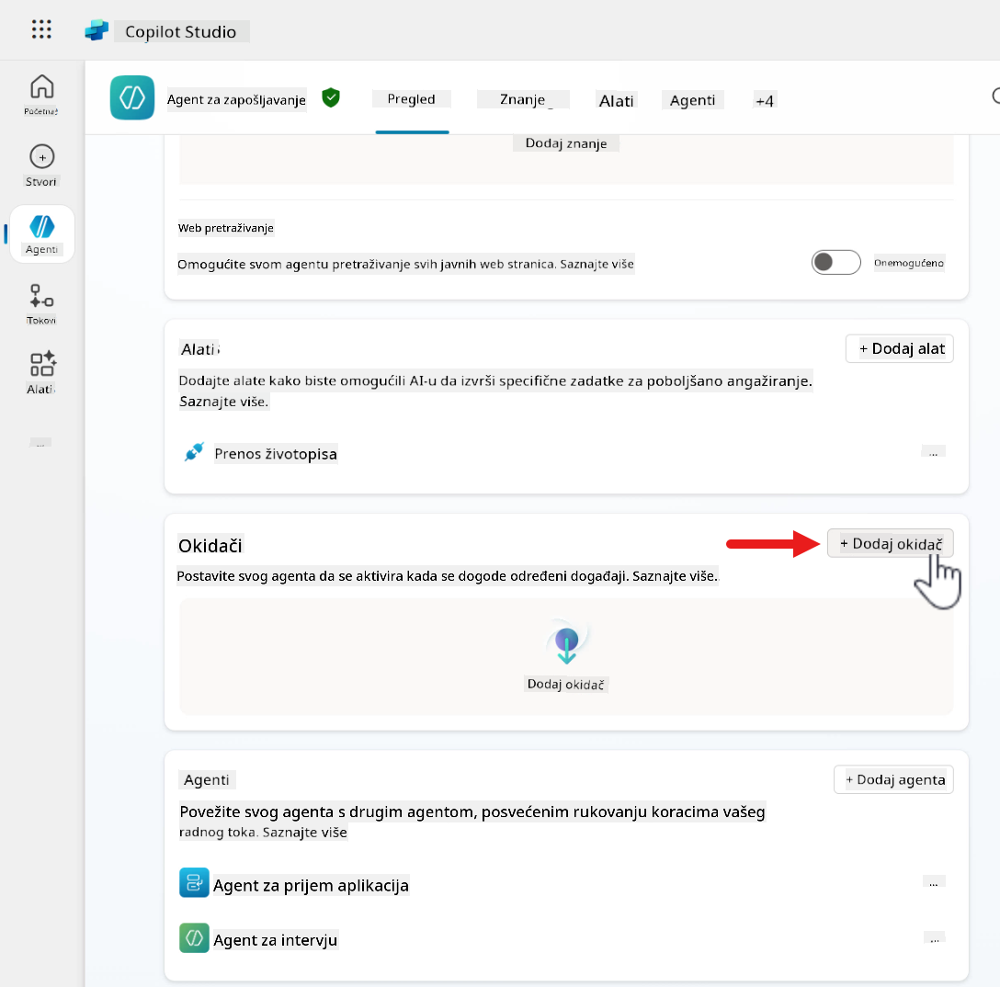

1. Pojavit će se popis okidača. Odaberite **Kada stigne novi e-mail (V3)** i odaberite **Dalje**.

       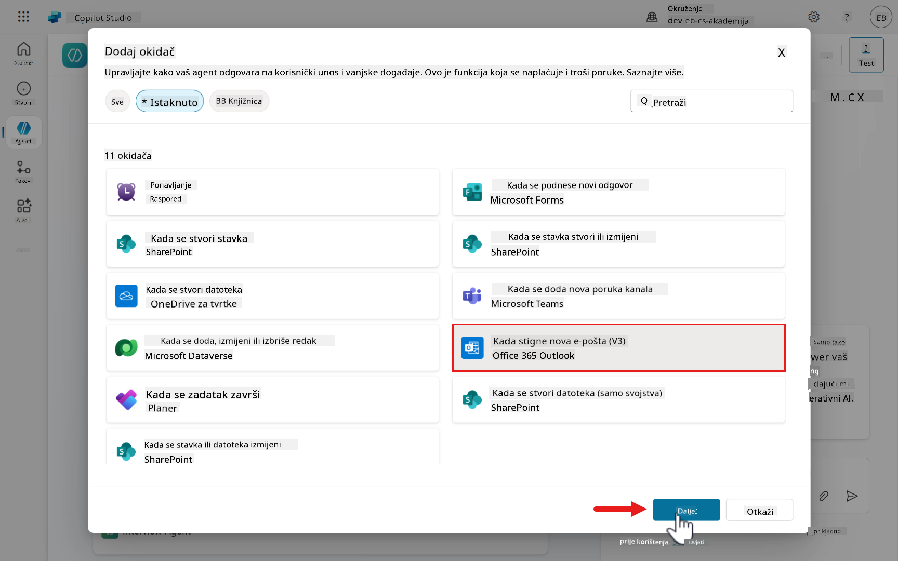

1. Sada ćemo vidjeti **Naziv okidača** i **Prijava** za referencu povezivanja aplikacija.

       Preimenujte naziv okidača u sljedeće,
    
       ```text
       Kada stigne novi e-mail od kandidata
       ```

       Provjerite je li uz svaku referencu povezivanja aplikacija prikazana zelena kvačica. Ako ne vidite zelenu kvačicu, prijavite se putem elipse (...) i odaberite **+ Nova referenca povezivanja** za stvaranje nove reference povezivanja.

       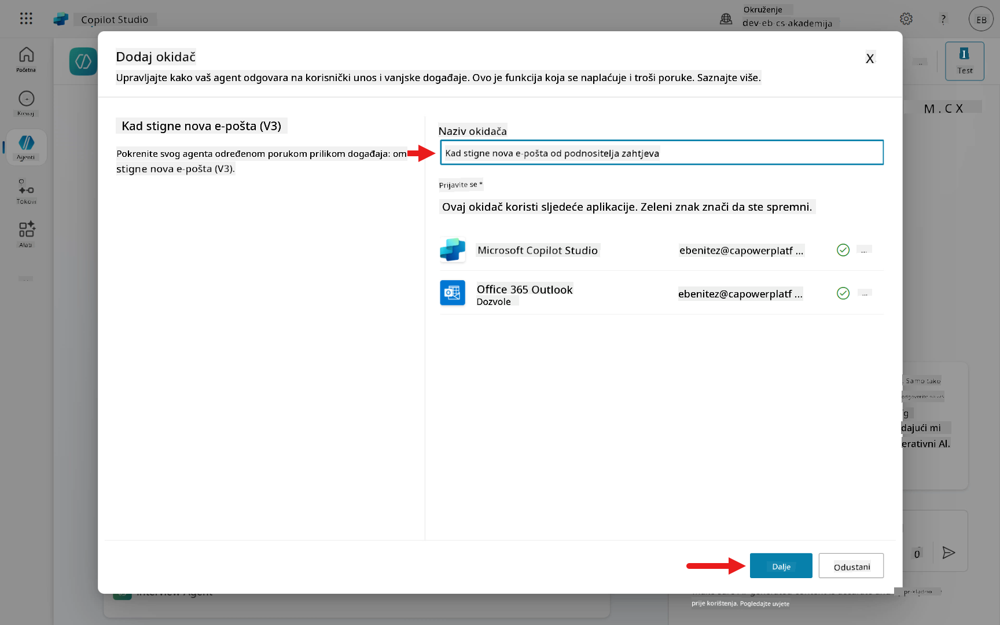

1. Posljednji korak je postavljanje ulaznih svojstava okidača. Ažurirajte sljedeća svojstva na sljedeće vrijednosti,

     | Svojstvo | Kako postaviti | Detalji |
     |----------|----------------|---------|
     | **Uključi privitke (Opcionalno)** | Padajući izbornik | Da |
     | **Filter predmeta (Opcionalno)** | Tipkajte/Unesite putem tipkovnice | Prijava |
     | **Samo s privitcima (Opcionalno)** | Padajući izbornik | Da |

       Odaberite **Kreiraj okidač**.

       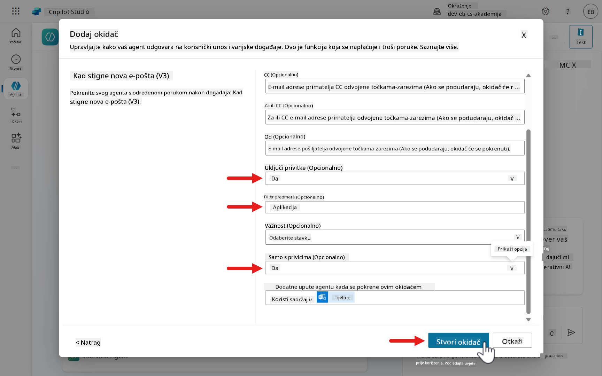

1. Nakon kreiranja, pojavit će se poruka potvrde da je okidač dodan agentu. Odaberite **Zatvori** i okidač će biti naveden u sekciji **Okidači**.
Sada ćemo ažurirati okidač događaja kako bismo dodali još mogućnosti automatizacije. Odaberite **tri točke (...)** pored okidača i odaberite **Uredi u Power Automate**.


1. Okidač će se zatim učitati kao tok u Power Automate maker portalu. Ono što vidite je dizajner toka u Power Automate maker portalu. Ovdje možemo dodati dodatnu logiku i radnje za veću automatizaciju. Okidač će se pojaviti na vrhu, a zatim **Šalje upit određenom copilotu za obradu** kao posljednja radnja u toku.

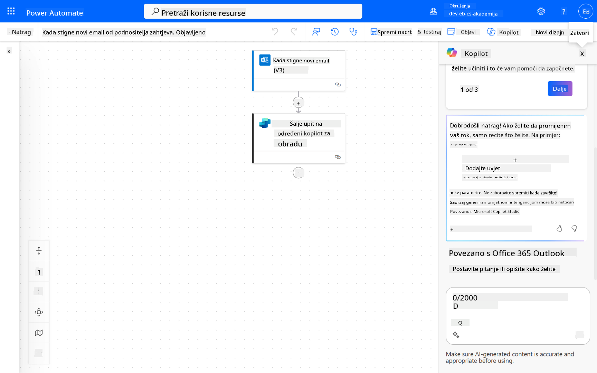

1. Prema zadanim postavkama, okidač **Kad stigne novi e-mail** u Power Automate može obraditi više e-mailova zajedno ako nekoliko njih stigne odjednom, pokrećući tok samo jednom za cijeli paket.

Kako bismo osigurali da se tok pokreće zasebno za svaki e-mail, omogućite postavku **Split On** u postavkama okidača i odaberite `@triggerOutputs()?['body/value']` u polju za niz.

S uključenom postavkom **Split On** i poljem za niz postavljenim na `@triggerOutputs()?['body/value']`, tok će se pokretati pojedinačno za svaku poruku, čak i ako ih stigne više istovremeno.

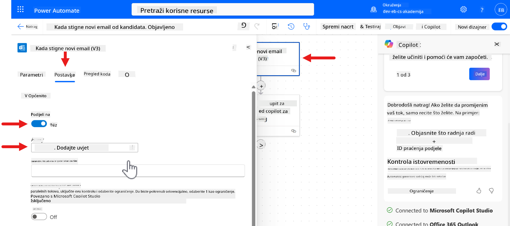

1. Sljedeće ćemo dodati logiku za provjeru vrste datoteke privitka; želimo učitati samo privitke u .PDF formatu, a ne slike (koje bi mogle dolaziti iz potpisa e-maila). Odaberite ikonu **+** ispod okidača i odaberite **Kontrola** u odjeljku **Ugrađeni alati**.

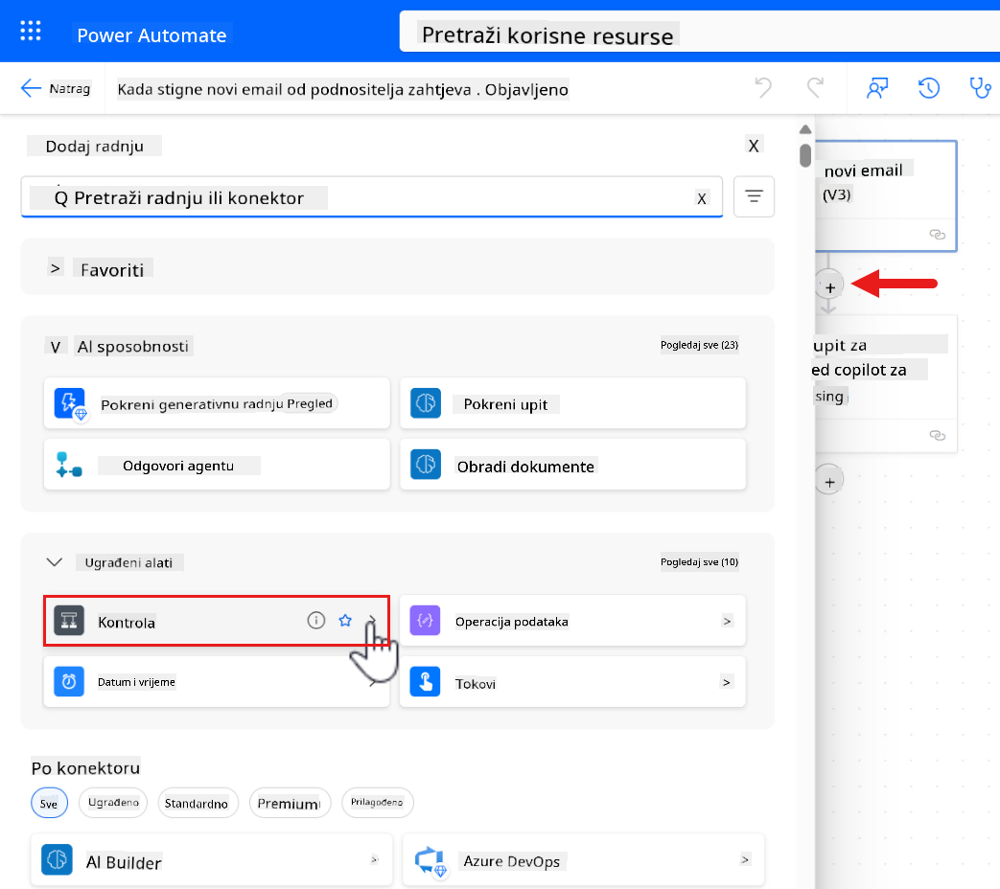

1. Odaberite radnju **Uvjet**.

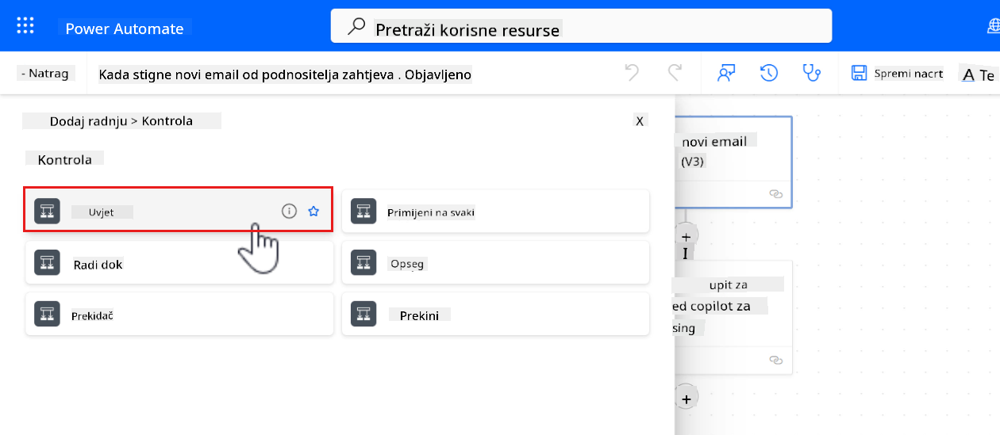

1. Sada konfiguriramo uvjet za provjeru je li vrsta datoteke privitka .PDF. U polju **Odaberite vrijednost**, odaberite **ikonu munje** ili **fx ikonu** s desne strane.

1. U polju **Pretraži** unesite sljedeće:

```text
content type
```

1. Zatim odaberite parametar **Attachments Content-Type** iz okidača.

1. Zatim odaberite **Dodaj** kako biste dodali dinamički unos sadržaja u parametar **Id** radnje.


1. Zastanimo ovdje na trenutak, vjerojatno ste primijetili da se radnja **Za svaki** automatski pojavila.

Odaberite radnju **Za svaki**. Ova radnja predstavlja petlju kroz svaki privitak u e-mailu, budući da je parametar **Attachments Content-Type** iz okidača povezan s svakim privitkom.

Ispod površine, to je niz i zato je radnja **Za svaki** automatski dodana kada smo odabrali parametar **Attachments Content-Type** u radnji **Uvjet**.

Za više informacija o ovome, proširite sljedeći dodatni blok za učenje.

??? info "Dodatno učenje: Automatsko pojavljivanje radnje Za svaki"

🤔 **Zašto se "Primijeni na svaki" ili "Za svaki" automatski pojavljuje?**

Kada odaberete parametar (dinamički sadržaj) koji predstavlja popis ili niz stavki - na primjer, popis privitaka, e-mailova ili redaka - Power Automate prepoznaje da biste mogli željeti obraditi svaku stavku pojedinačno.

Kako bi vam pomogao u tome, Power Automate automatski dodaje petlju **"Primijeni na svaki"** (ili **"Za svaki"**) oko vaše radnje. To osigurava da će vaša radnja biti izvršena jednom za svaku stavku na popisu, umjesto da pokušava obraditi cijeli popis odjednom (što bi moglo uzrokovati pogreške).

🦋 **Primjer**

- Ako odaberete "Privitci" iz prethodne radnje (što je niz), i pokušate ga koristiti u radnji koja očekuje jednu datoteku, Power Automate obavija vašu radnju u petlju **"Primijeni na svaki"** (ili **"Za svaki"**).
- Na taj način, vaša radnja će se izvršiti za **svaki privitak** - jedan po jedan.

💡 **Ključne točke**

- **Automatski:** Petlja se automatski pojavljuje kako bi vam pomogla obraditi svaku stavku u zbirci.
- **Sprječava pogreške:** Bez petlje, vaša radnja bi mogla propasti jer ne može obraditi više stavki odjednom.
- **Vizualni pokazatelj:** To je vizualni način prikazivanja da će vaš tok ponoviti radnju za svaku stavku na popisu.

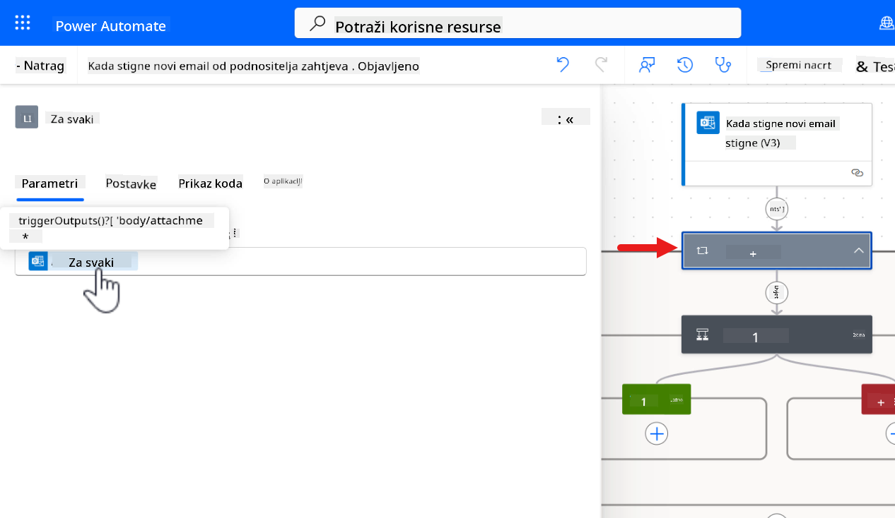

1. Sljedeće, u drugom polju **Odaberite vrijednost**, unesite sljedeće:

```text
application/pdf
```

To će osigurati da za svaki privitak datoteke provjerava je li format ekstenzije datoteke .PDF.

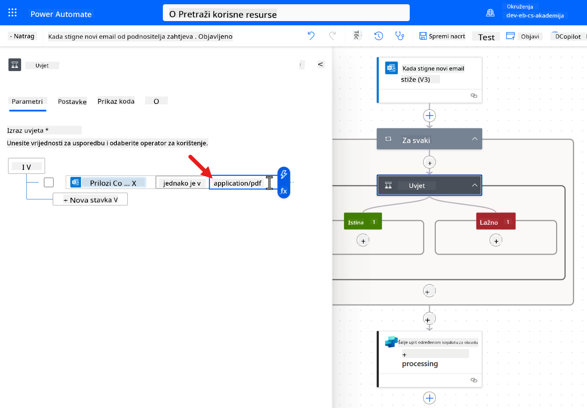

1. Sada ćemo konfigurirati put **True** za izdvajanje datoteke iz e-maila i učitavanje u tablicu **Resume** u Dataverseu.

Dodajte novu radnju ispod u putu **True** i potražite `html to text`. Odaberite radnju **Html to text**.

Za više informacija o radnji **Html to text**, proširite sljedeći dodatni blok za učenje.

??? info "Dodatno učenje: Radnja Html to text"

🤔 **Što je radnja "HTML to text"?**

Radnja **HTML to text** u Power Automate koristi se za pretvaranje sadržaja u HTML formatu u običan tekst. Ovo je posebno korisno kada primate podatke (poput e-mailova, web sadržaja ili odgovora API-ja) koji sadrže HTML oznake, a želite izdvojiti samo čitljiv tekst bez ikakvog formatiranja ili koda.

⚙️ **Kako funkcionira?**

- **Ulaz:** Unosite niz HTML sadržaja (na primjer, tijelo e-maila).
- **Izlaz:** Radnja uklanja sve HTML oznake i vraća samo običan tekst.

👍🏻 **Kada biste je trebali koristiti?**

- Kada želite izdvojiti čitljiv tekst iz e-mailova, web stranica ili odgovora API-ja koji sadrže HTML.
- Prije slanja sadržaja sustavima koji ne podržavaju HTML formatiranje (poput SMS-a, poruka u Teamsu ili baza podataka).
- Za čišćenje podataka za daljnju obradu ili analizu.

🔭 **Gdje je pronaći?**

- U Power Automate za Agent tokove, potražite radnju pod nazivom `HTML to text`. Nalazi se pod konektorom **Data Operations**.

💡 **Ključne točke**

- Uklanja sve HTML oznake i ostavlja samo tekst.
- Ne interpretira ili izvršava skripte/stilove - samo uklanja oznake.
- Korisno za čišćenje podataka i pripremu sadržaja za izlaze u običnom tekstu.

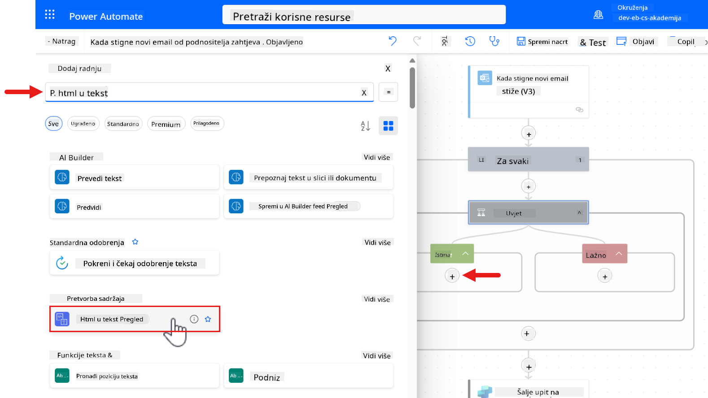

1. Sljedeće, trebamo stvoriti novu referencu veze za radnju **Html to text** odabirom **Dodaj novu**.

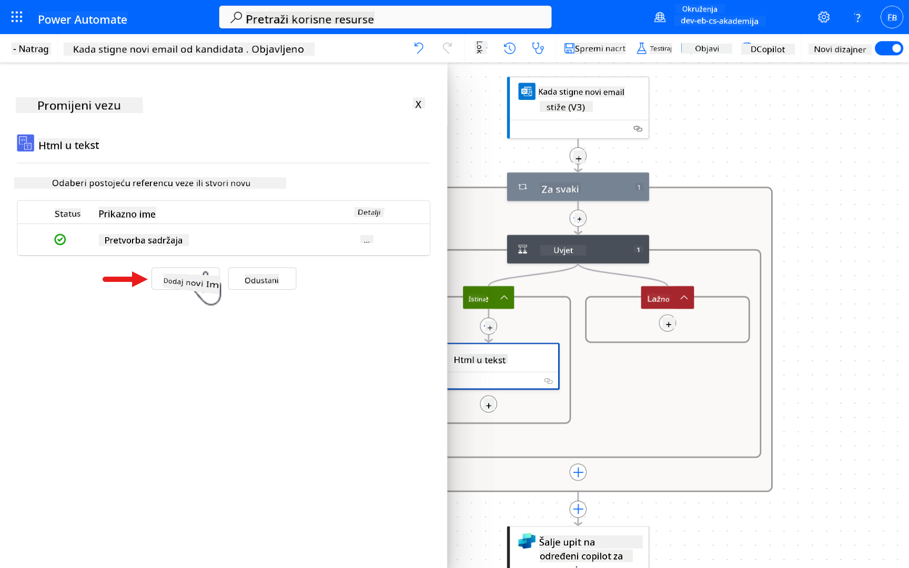

1. Radnja se sada može konfigurirati. Dodajmo parametar **Body** iz okidača. U polju **Sadržaj**, odaberite **ikonu munje** ili **fx ikonu** s desne strane.

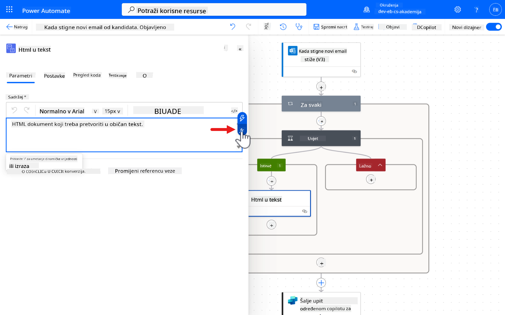

1. U kartici **Dinamički sadržaj**, potražite `body` i odaberite parametar **Body**, nakon čega odaberite **Dodaj**.

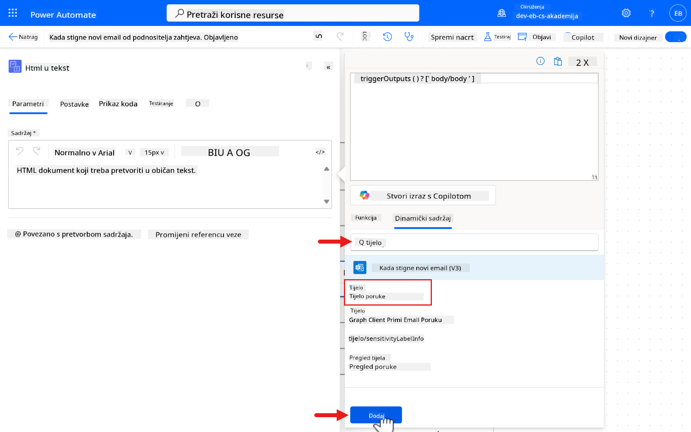

1. Završili smo konfiguraciju ove radnje pa izađimo iz radnje odabirom dvostrukih kutnih zagrada («) usmjerenih ulijevo kako bismo zatvorili panel.

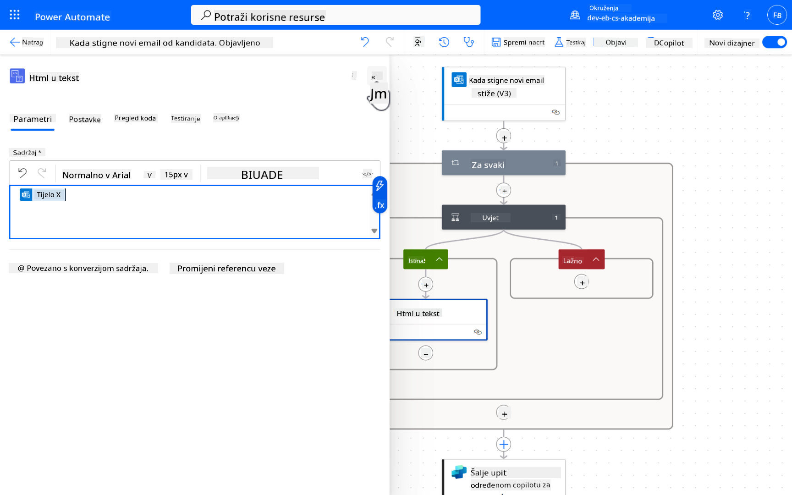

1. Dodajmo novu radnju odabirom **+ ikone** ispod radnje **Html to text**, što će učitati panel za dodavanje radnji. Odaberite konektor **Microsoft Dataverse**.

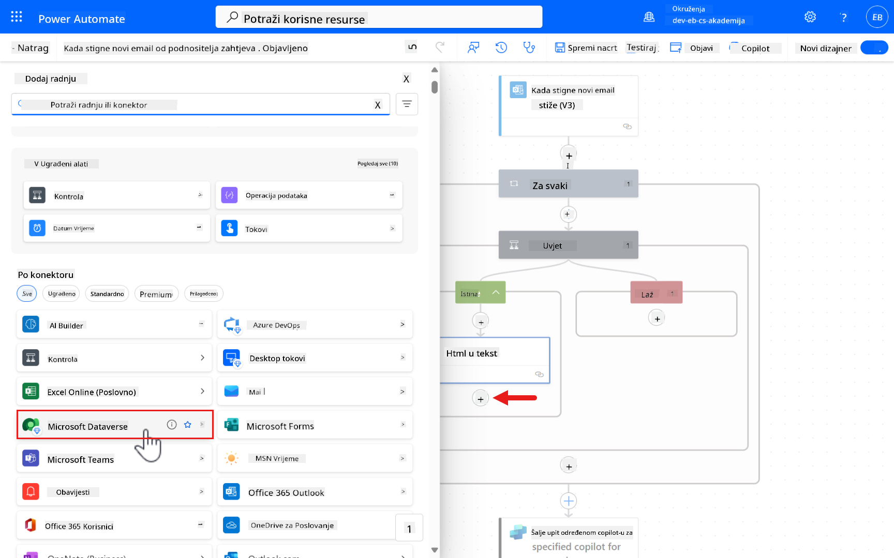

1. Odaberite radnju **Dodaj novi redak**.

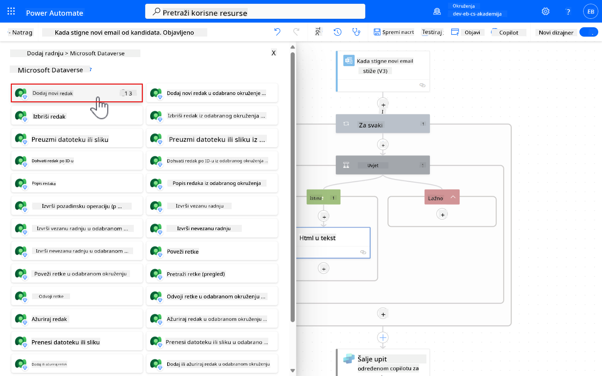

1. Preimenujte radnju odabirom **Tri točke (...)**, kopirajte i zalijepite sljedeće kao naziv:

```text
Dodaj novi redak za životopis
```

Za parametar **Naziv tablice**, potražite `res` i odaberite tablicu **Resumes**.

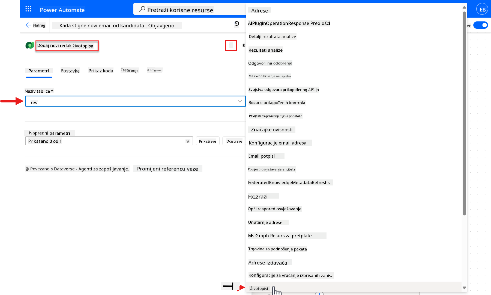

1. Sljedeće, odaberite polje **Naslov životopisa** i odaberite **ikonu munje** ili **fx ikonu** s desne strane.

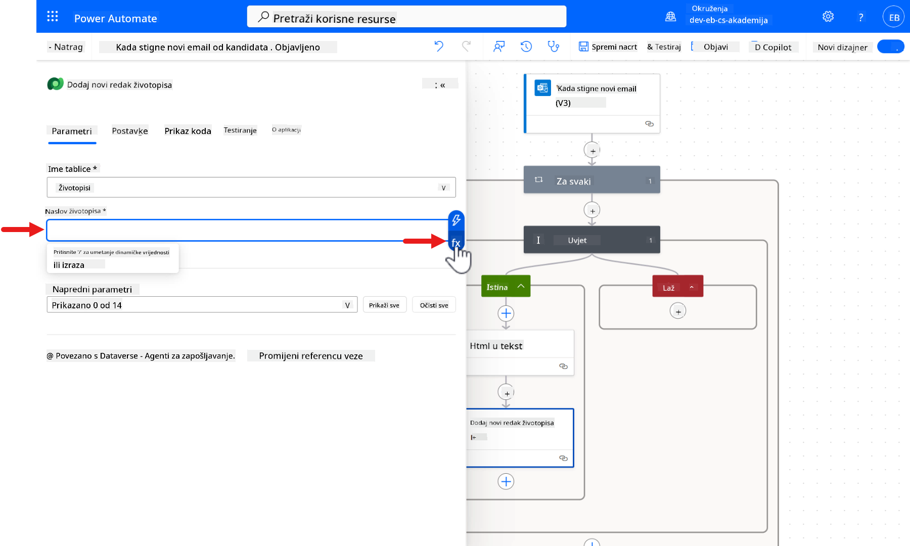

1. U kartici **Funkcija**, unesite sljedeći izraz koji koristi funkciju `item()`.

```text
item()?['name']
```

Za više informacija o funkciji `item()`, proširite sljedeći dodatni blok za učenje.

??? info "Dodatno učenje: Funkcija `item()`"

🤔 **Što je funkcija `item()`?**

- Kada koristite radnju **Primijeni na svaki**, Power Automate prolazi kroz svaki element u zbirci (nizu).
- Najčešće se koristi unutar radnji poput **Primijeni na svaki** (ili **Za svaki**), **Odaberi** ili **Filtriraj niz**.

⚙️ **Kako funkcionira?**

- `item()` je funkcija koja vraća trenutnu stavku koja se obrađuje u petlji ili operaciji niza.
- Unutar te petlje, `item()` se odnosi na _trenutni element_ koji se obrađuje.

📌 **Gdje je koristite?**

- **Primijeni na svaki:** za pristup svojstvima trenutne stavke.
- **Odaberi:** za transformaciju svake stavke u nizu.
- **Filtriraj niz:** za referenciranje trenutne stavke koja se procjenjuje.

🦋 **Primjer**

- Izraz unutar petlje:
       -  `item()?['Email']`
- Ovo dohvaća svojstvo `Email` trenutne stavke.

💡 **Ključne točke**

- `item()` je _osjetljiv na kontekst_: uvijek se odnosi na trenutnu stavku u petlji ili operaciji niza u kojoj se nalazite.
- Ako ugnijezde petlje, možete koristiti `items('NazivPetlje')` za referenciranje stavki u određenoj petlji.

Odaberite **Dodaj** kako biste dodali izraz u parametar **Naslov životopisa**.

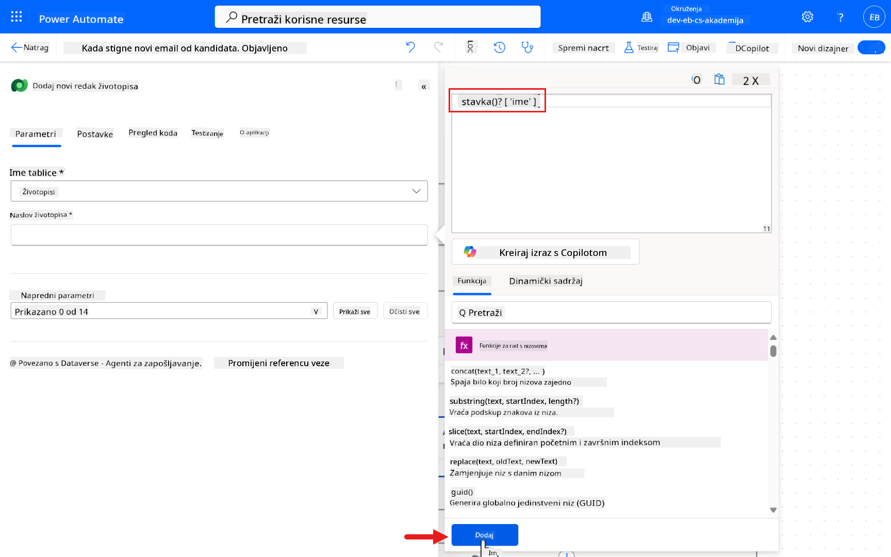

1. Još uvijek trebamo konfigurirati nekoliko parametara, odaberite **Prikaži sve**, a u polju **Motivacijsko pismo**, odaberite **ikonu munje** ili **fx ikonu** s desne strane.

U kartici **Funkcija**, unesite sljedeći izraz koji koristi isti izraz iz prethodne [misije](../02-multi-agent/README.md).

```text
if(greater(length(body('Html_to_text')), 2000), substring(body('Html_to_text'), 0, 2000), body('Html_to_text'))
```

Ovaj izraz provjerava je li _tekst_ iz radnje **Html to text** dulji od 2000 znakova, i ako jest, vraća samo prvih 2000 znakova; inače vraća cijeli tekst.

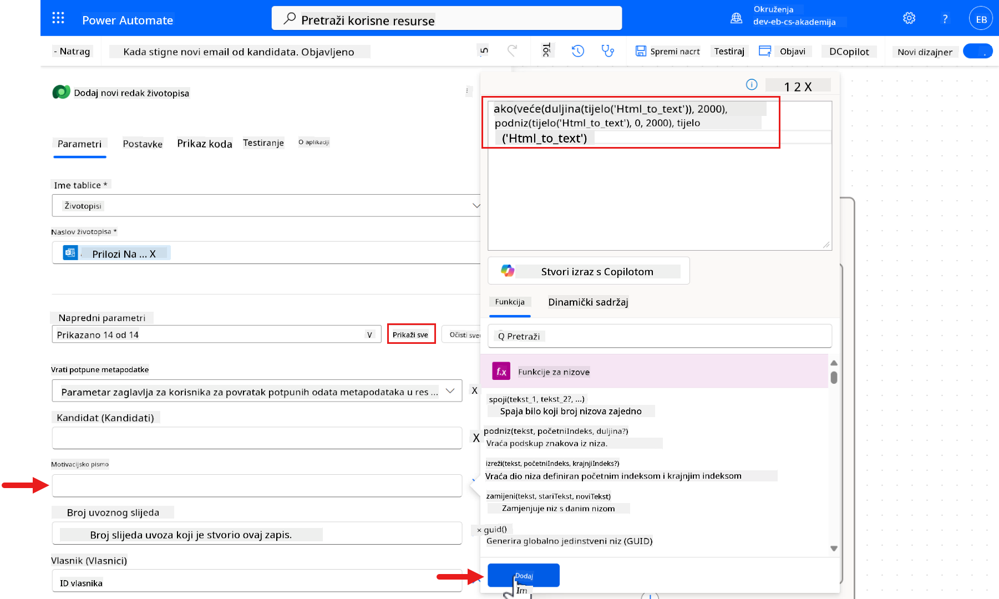

1. Izraz će sada biti dodan u polje **Motivacijsko pismo**.

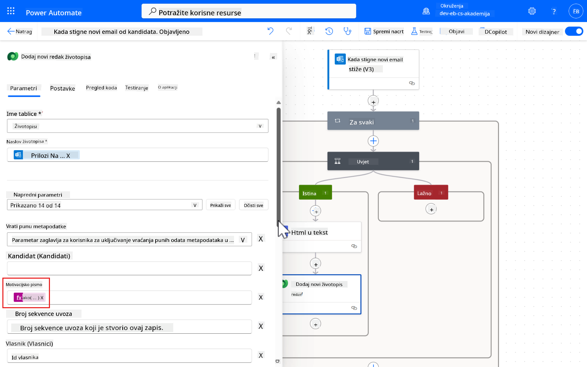

1. Za polje **E-mail adresa izvora**, potražite `from` i odaberite parametar **From** iz okidača jer sadrži vrijednost e-mail adrese.

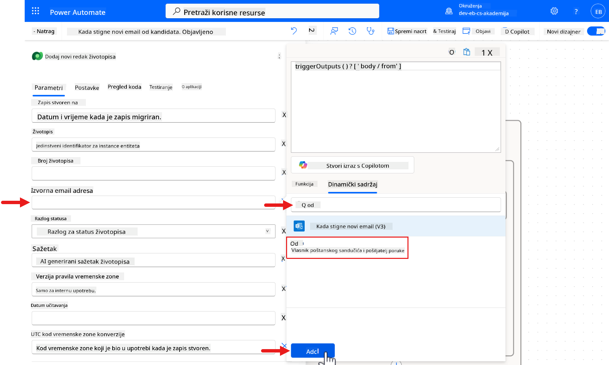

1. Za polje **Datum učitavanja**, odaberite **ikonu munje** ili **fx ikonu** s desne strane. U kartici **Funkcija**, unesite sljedeći izraz koji koristi funkciju `utcNow()`.

```text
utcNow()
```

Za više informacija o funkciji `utcNow`, proširite sljedeći dodatni blok za učenje.

??? info "Dodatno učenje: Funkcija `utcNow`"

🤔 **Što je funkcija `utcNow()`?**

- Funkcija utcnow() u Power Automate vraća trenutni datum i vrijeme u koordiniranom univerzalnom vremenu (UTC) u ISO 8601 formatu, poput: `2025-09-23T04:32:14Z`

🦋 **Primjer**

- Izraz:
       -  `concat('Izvješće generirano na ', utcnow())`
- Izlaz je:
       - Izvješće generirano na `2025-09-23T04:32:14Z`

💡 **Ključne točke**
- **Nisu potrebni argumenti (ulazni parametri):** uvijek daje trenutni UTC vremenski žig.
   - **Primjene**
       - Dodavanje vremenskih žigova u zapise ili nazive datoteka
       - Usporedba trenutnog vremena s drugim datumima
       - Planiranje ili uvjeti temeljeni na vremenu

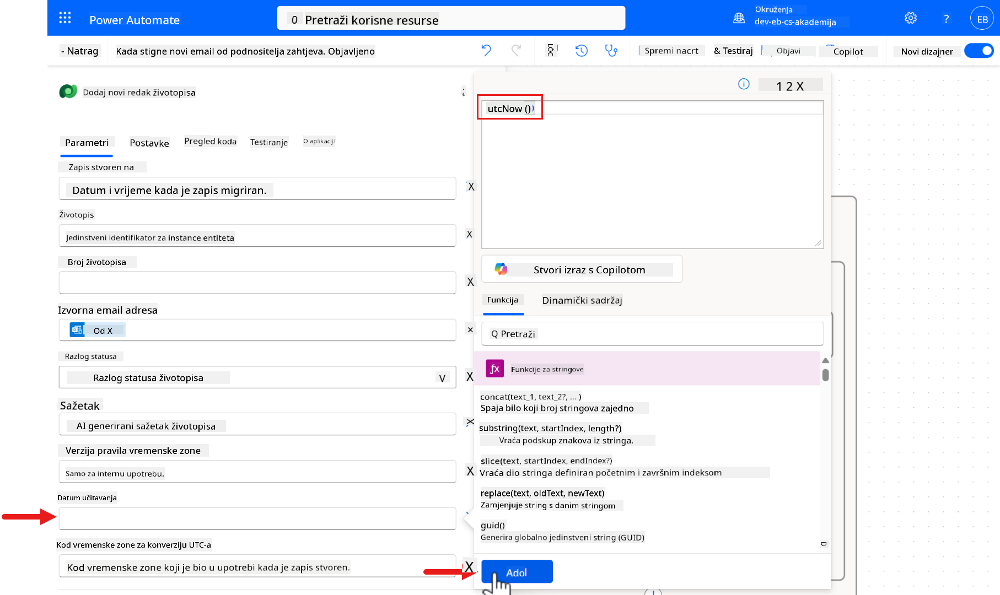

1. Sada smo završili konfiguraciju akcije **Dodaj novi redak životopisa**, pa izađimo iz panela tako da ga smanjimo.

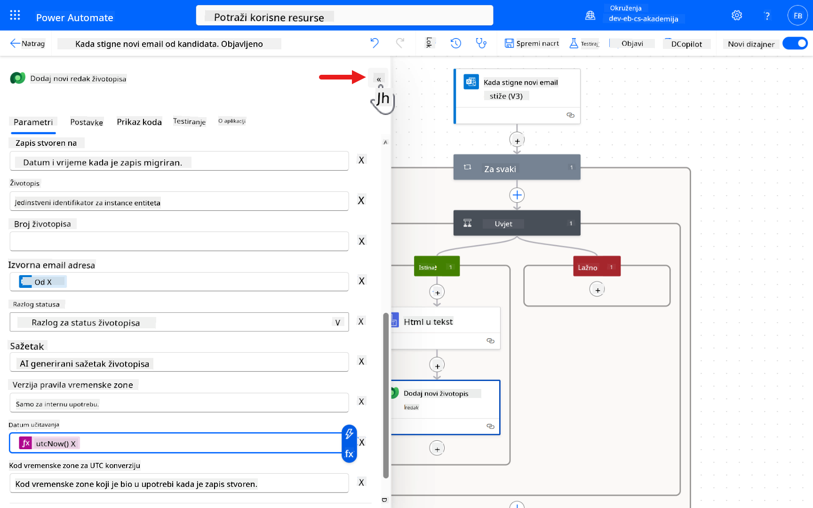

1. Dodati ćemo novu akciju odabirom **+ ikone** ispod akcije **Dodaj novi redak životopisa**, što će učitati panel za dodavanje akcija. Ponovno odaberite konektor **Microsoft Dataverse**.

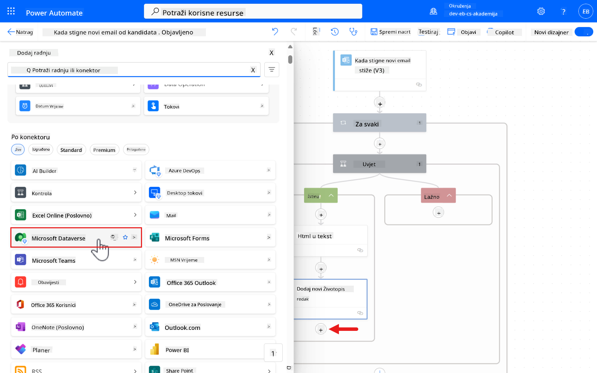

1. Odaberite akciju **Prenesi datoteku ili sliku**.

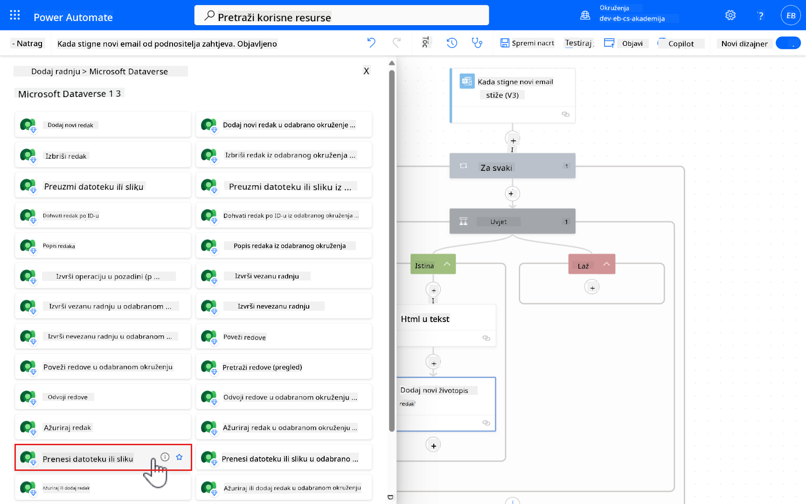

1. Preimenujte akciju odabirom **Tri točke (...)**, kopirajte i zalijepite sljedeće kao naziv:

```text
Prenesi datoteku životopisa
```

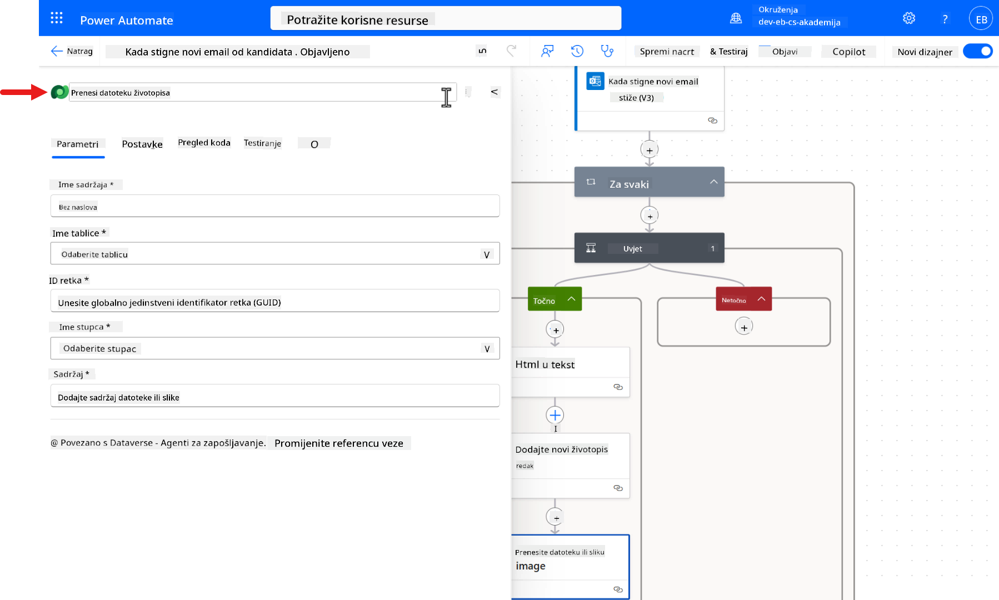

1. Zatim odaberite polje **Naziv sadržaja** i odaberite **ikonu munje** ili **fx ikonu** s desne strane.

U **kartici Funkcija**, unesite sljedeći izraz koji koristi funkciju `item ()`. Ovo dohvaća svojstvo `name` trenutne stavke (datoteke privitka).

```text
item()?['name']
```

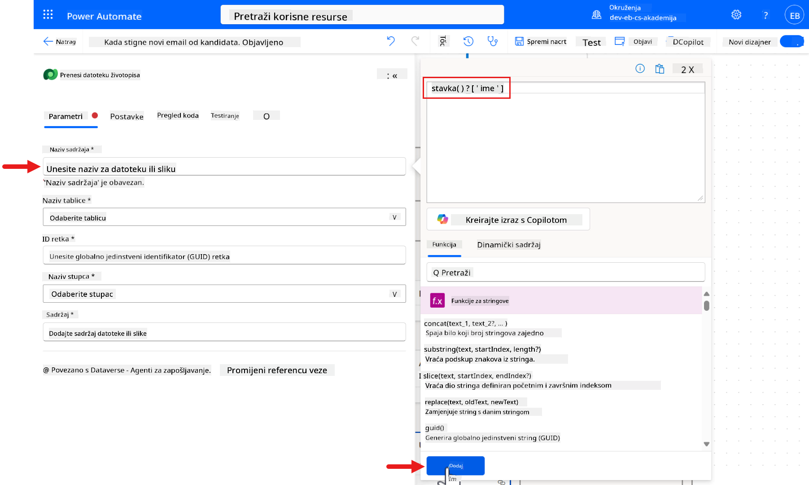

1. Za parametar **Naziv tablice**, potražite `res` i odaberite tablicu **Životopisi**.


1. Zatim odaberite polje **ID retka** i odaberite **ikonu munje** ili **fx ikonu** s desne strane.

Potražite `ID` i odaberite parametar **Životopis** iz akcije _Dodaj novi redak_ Dataverse jer sadrži ID vrijednost retka u koji se prenosi PDF datoteka.

Odaberite **Dodaj**.

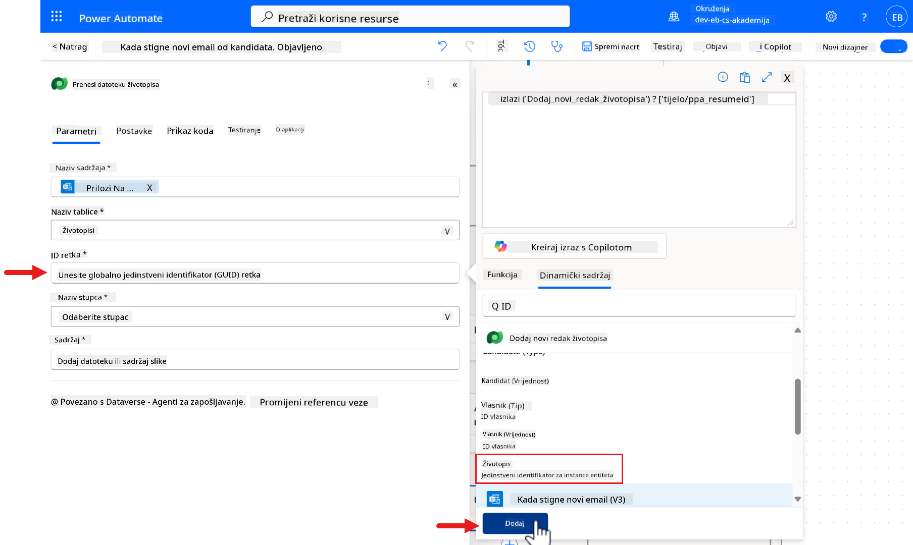

1. Odaberite polje **Naziv stupca** i odaberite opciju **PDF životopisa**.

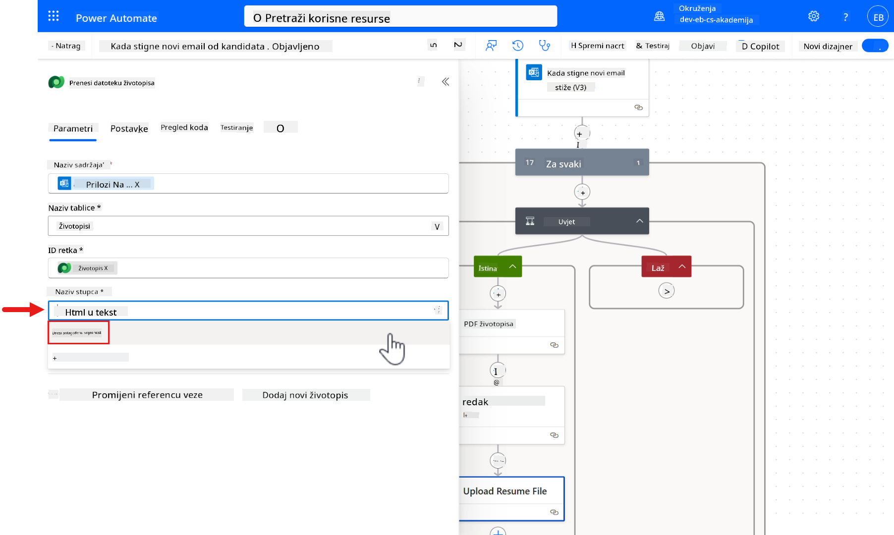

1. Odaberite polje **Sadržaj** i odaberite **ikonu munje** ili **fx ikonu** s desne strane.

U **kartici Funkcija**, unesite sljedeći izraz koji koristi funkciju `item ()`. Ovo dohvaća svojstvo `contentBytes` trenutne stavke (datoteke privitka). `contentBytes` odnosi se na sirove binarne podatke datoteke ili privitka, kodirane kao Base64 string.

```text
item()?['contentBytes']
```

1. Završili smo konfiguraciju ove akcije, pa izađimo iz akcije odabirom dvostrukih kutnih zagrada («) koje pokazuju ulijevo kako bismo smanjili panel.

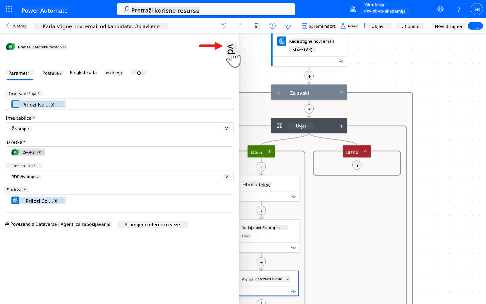

1. Zatim odaberite **Šalje upit određenom copilotu za obradu**, zatim povucite i ispustite ovu akciju ispod akcije **Prenesi datoteku životopisa** u _True_ putu uvjeta.

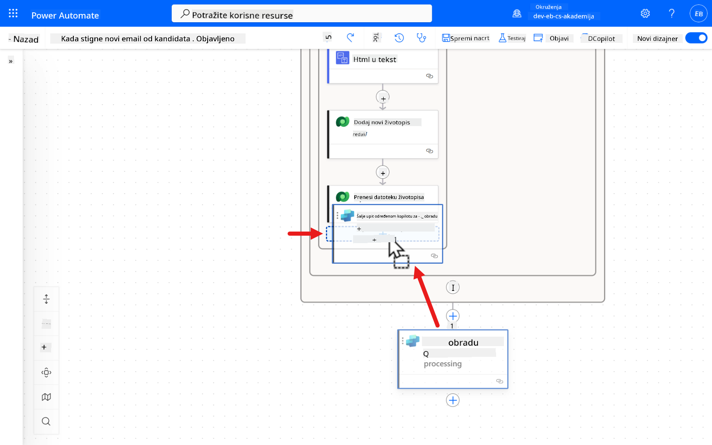

1. Odaberite **Šalje upit određenom copilotu za obradu** kako biste ga konfigurirali.

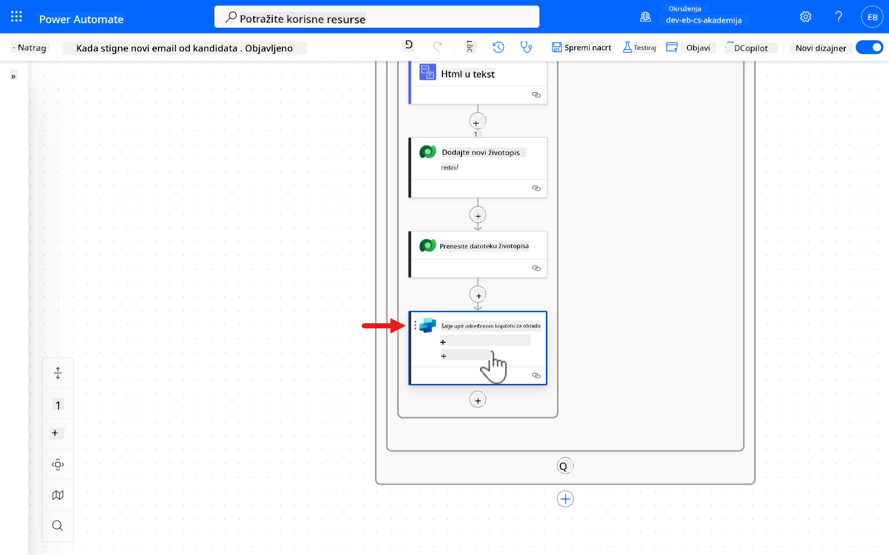

1. U polju **Tijelo/poruka**, odaberite sav sadržaj polja i očistite/izbrišite ga.

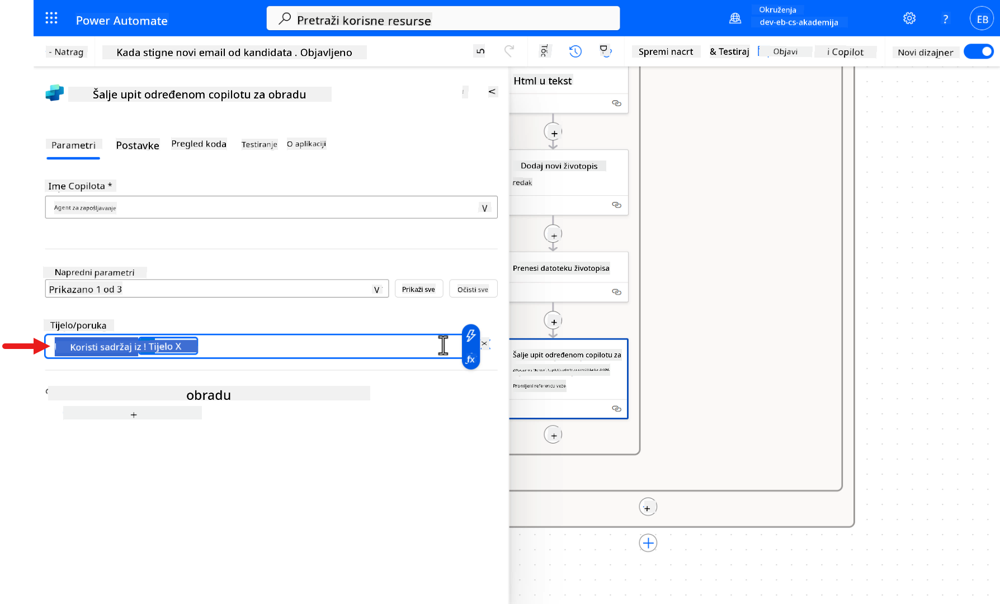

1. Kopirajte i zalijepite sljedeći tekst u polje **Tijelo/poruka** i istaknite `RESUME ID PLACEHOLDER`.

```text
Pošalji [ResumeId (text)] = "RESUME ID PLACEHOLDER" i [ResumeTitle (text_1)] = "RESUME TITLE PLACEHOLDER" i [ResumeNumber (text_2)]= "RESUME NUMBER PLACEHOLDER" alatu "Obavijesti Teams kanal za prijave" u pod-agentu "Agent za unos prijava"
```

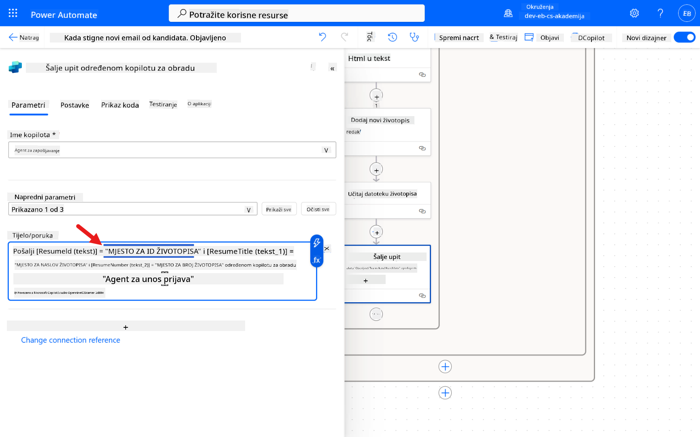

1. Odaberite **ikonu munje** ili **fx ikonu** s desne strane.

Potražite `resume` i odaberite parametar **Životopis** iz akcije _Dodaj novi redak Dataverse_ jer sadrži vrijednost `ID` retka stvorenog životopisa.

Odaberite **Dodaj**.

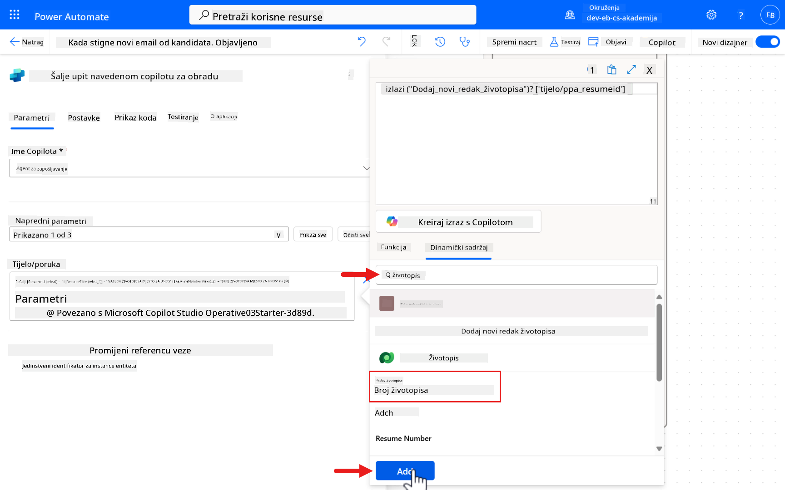

1. Istaknite `RESUME TITLE PLACEHOLDER`. Odaberite **ikonu munje** ili **fx ikonu** s desne strane.

Potražite `title` i odaberite parametar **Naslov životopisa** iz akcije _Dodaj novi redak Dataverse_ jer sadrži vrijednost `naslov životopisa` retka stvorenog životopisa.

Odaberite **Dodaj**.

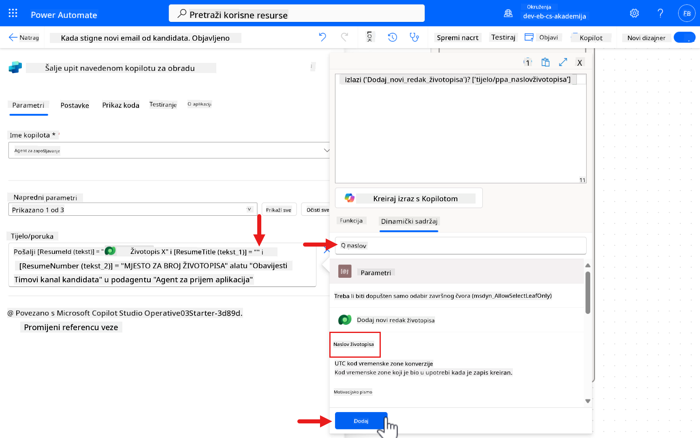

1. Istaknite `RESUME NUMBER PLACEHOLDER`. Odaberite **ikonu munje** ili **fx ikonu** s desne strane.

Potražite `resume number` i odaberite parametar **Broj životopisa** iz akcije _Dodaj novi redak Dataverse_ jer sadrži vrijednost `Broj životopisa` retka stvorenog životopisa.

Odaberite **Dodaj**.

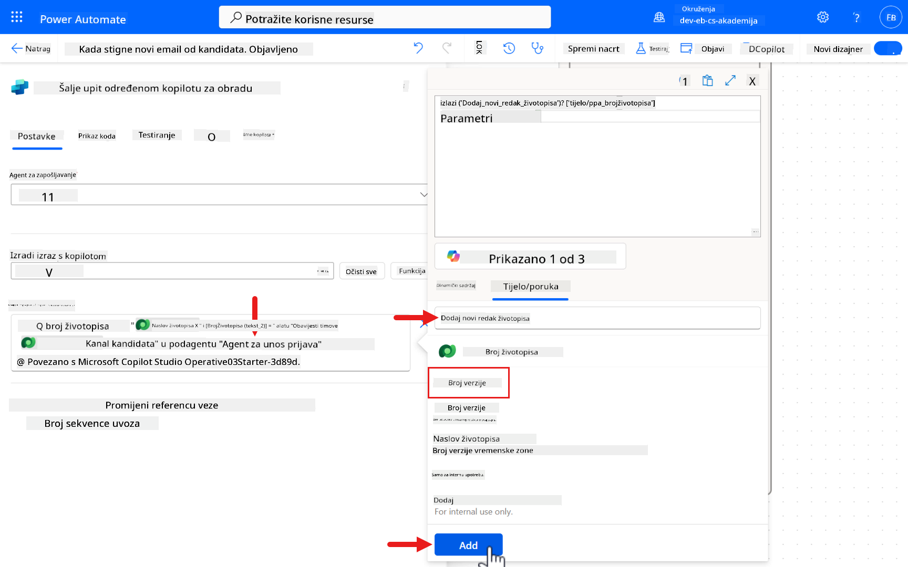

1. Završili smo konfiguraciju ove akcije i našeg tijeka rada agenta 🙌🏻 Odlično ti ide! Sada spremimo naš tijek rada za pokretanje događaja odabirom **Spremi nacrt**.

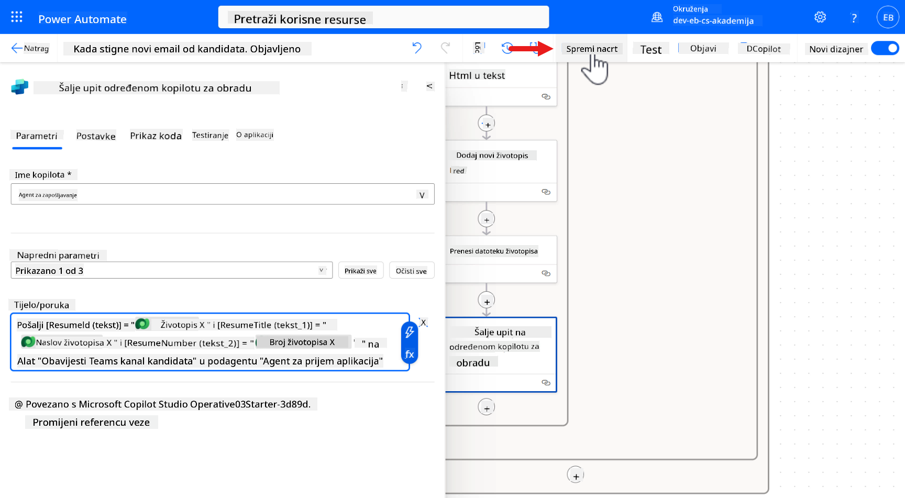

1. Sada trebamo urediti detalje tijeka rada agenta, odaberite **Natrag**.

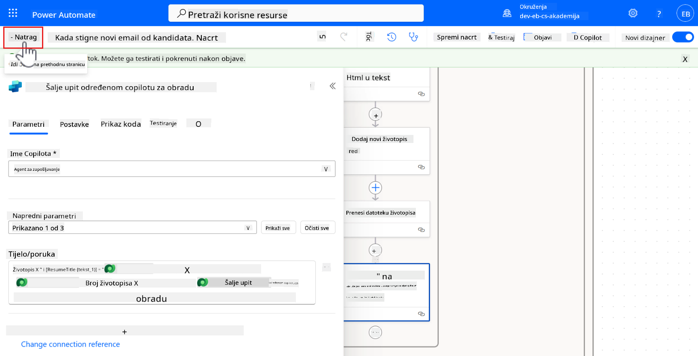

1. Odaberite **Uredi** u odjeljku **Detalji** i ažurirajte **Plan** na opciju **Copilot Studio**.

Odaberite **Spremi**.

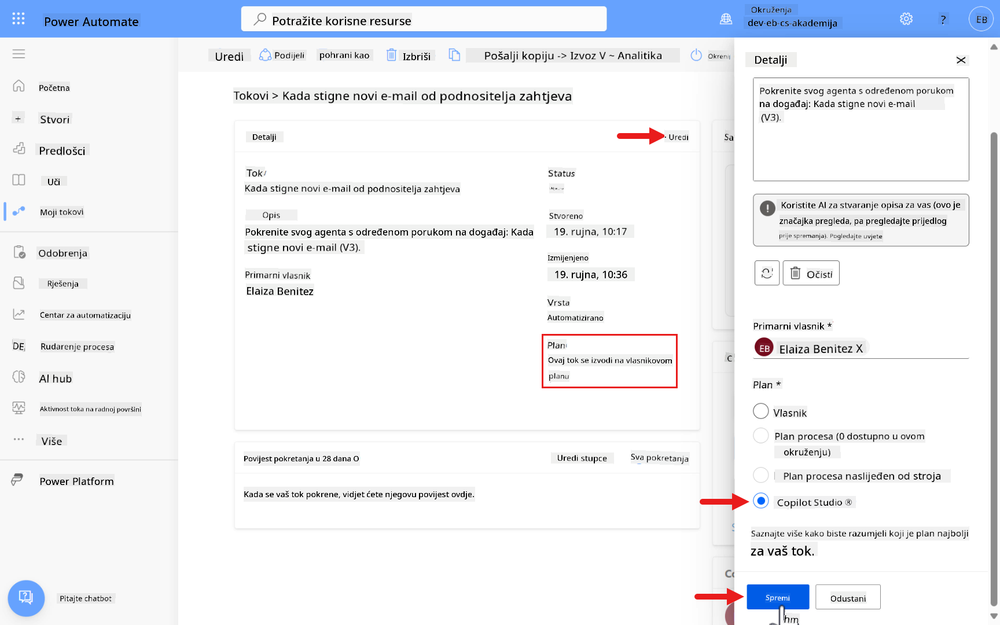

1. Pojavit će se modalni prozor koji traži potvrdu za prelazak na plan Copilot Studio. Odaberite **Potvrdi**.

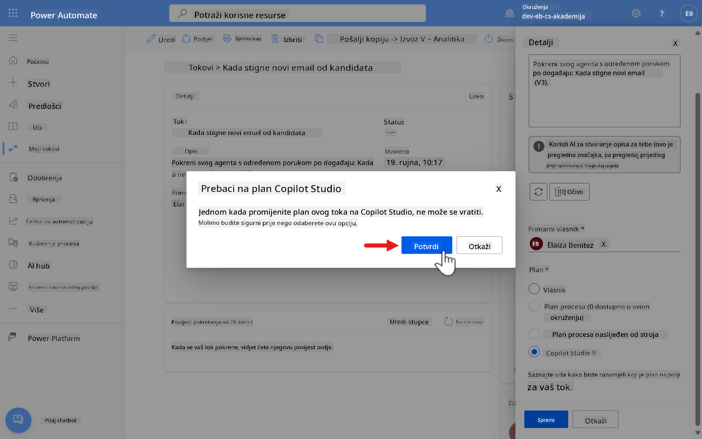

1. Plan je sada ažuriran na **Copilot Studio**. Odaberite **Uredi** jer trebamo objaviti tijek rada za pokretanje događaja za našeg agenta.

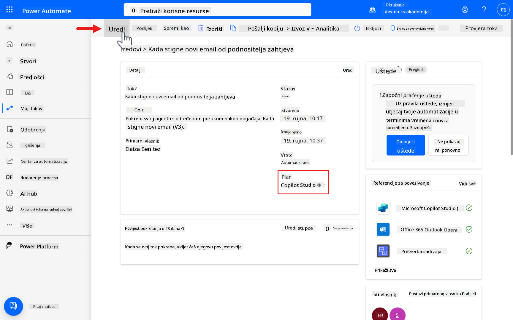

1. Odaberite **Objavi**.

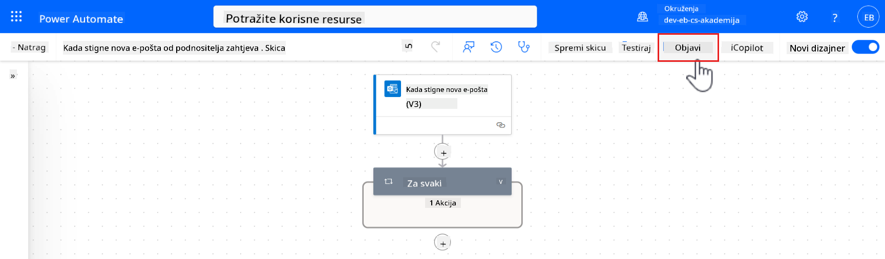

Bravo! Tijek rada za pokretanje događaja sada je objavljen 😃

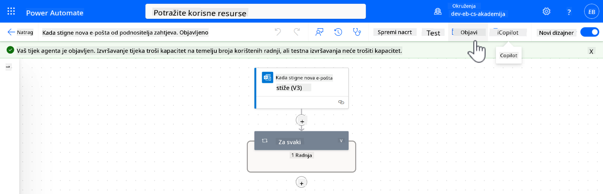

Nastavimo s kreiranjem novog tijeka rada agenta koji će pokrenuti pod-agent **Agent za unos prijava**.

### Laboratorij 3.2 - Obavijesti Teams kanal pomoću prilagodljive kartice

Sada ćemo kreirati novi tijek rada agenta za pod-agent **Agent za unos prijava** koji koristi vrijednosti proslijeđene pokretanjem događaja, kako bi objavio prilagodljivu karticu na Teams kanal. Ova prilagodljiva kartica će obavijestiti HR tim za zapošljavanje o PDF-u koji je automatski prenesen kako bi ga mogli pregledati.

Krenimo!

1. U **Agent za zapošljavanje** odaberite karticu **Agenti** i odaberite **Agent za unos prijava**.

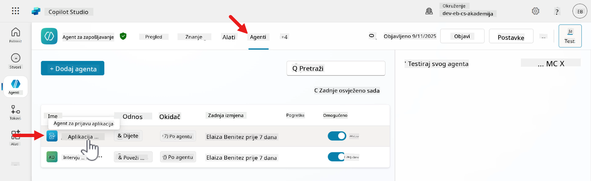

1. Pomaknite se dolje do **Alati** i odaberite **+ Dodaj**.

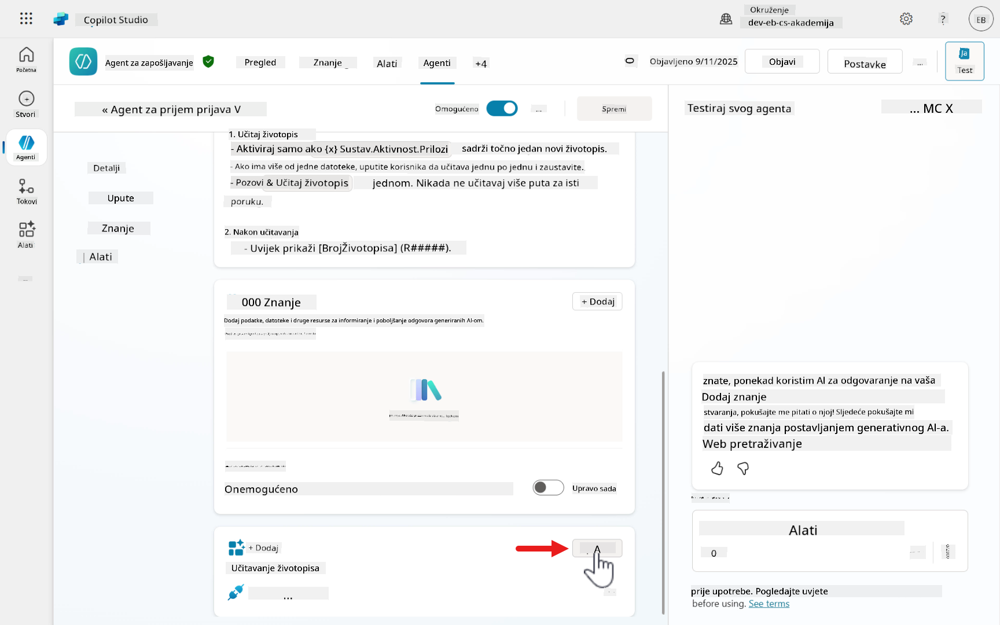

1. Pojavit će se modalni prozor **Dodaj alat**. Odaberite **+ Novi alat**.

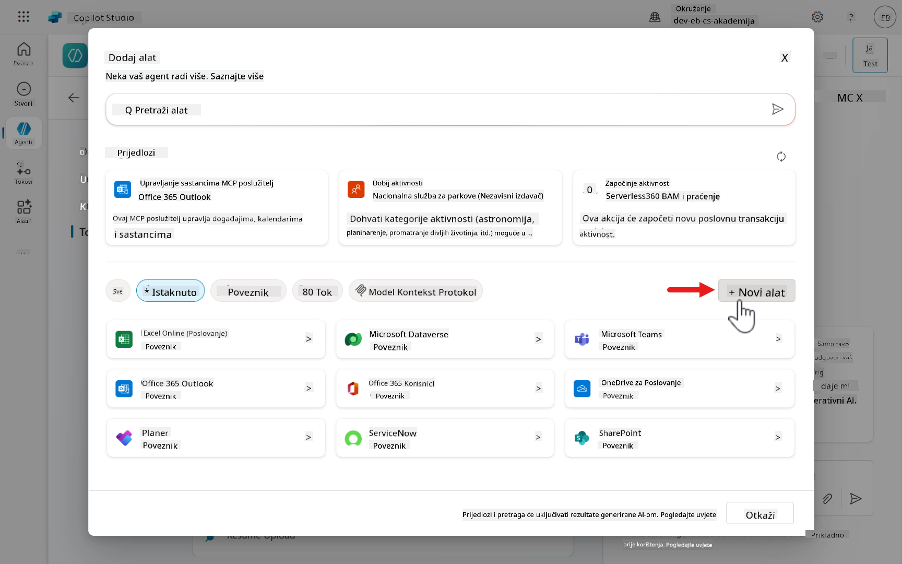

1. Odaberite **Tijek rada agenta**.

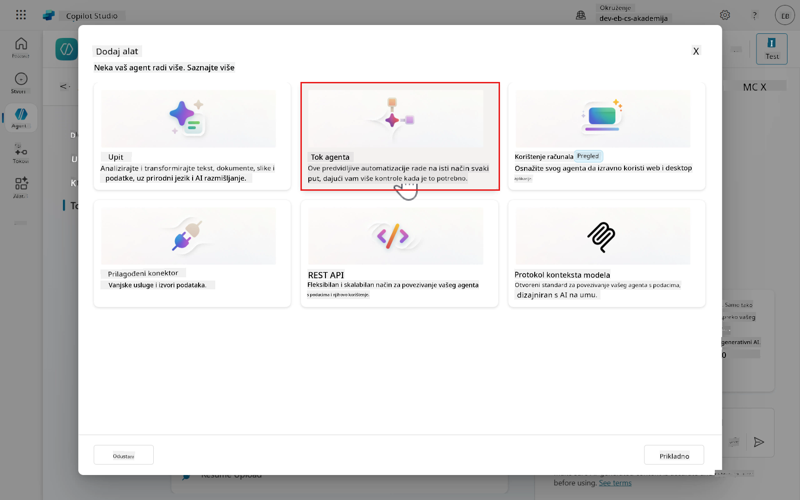

1. Zatim će se učitati **dizajner tijeka rada agenta**. U pokretaču **Kada agent pozove tijek rada**, odaberite **+ Dodaj unos**.


1. Odaberite **Tekst** kao vrstu korisničkog unosa.


1. U polje za unos teksta kopirajte i zalijepite sljedeće za naziv parametra unosa.

```text
ResumeId
```


1. Ponovite iste korake za dodavanje drugog tekstualnog unosa. Kopirajte i zalijepite sljedeće za naziv parametra unosa.

```text
ResumeTitle
```


1. Ponovite iste korake za dodavanje trećeg tekstualnog unosa. Kopirajte i zalijepite sljedeće za naziv parametra unosa.

```text
ResumeNumber
```


1. Sjećate li se kako smo u [Recruit](../../recruit/08-add-adaptive-card/README.md#81-create-a-new-topic-with-an-adaptive-card-for-user-to-submit-their-request) dodali prilagodljivu karticu unutar teme za našeg agenta? Ovaj put ćemo dodati prilagodljivu karticu u tijek rada agenta. Sada ćemo dodati još jednu akciju našem tijeku rada koja će objaviti prilagodljivu karticu na Teams kanal.

Odaberite **+ ikonu** ispod pokretača.


1. Odaberite akciju **Objavi karticu u chatu ili kanalu**.


1. Potrebno je stvoriti referencu za povezivanje s Microsoft Teams koristeći vaš prijavljeni korisnički račun. Odaberite **Prijavi se**.


1. Odaberite svoj korisnički račun, a zatim odaberite **Dopusti pristup**.


1. Za sljedeće ulazne parametre,

| Parametar | Kako postaviti | Detalji |
|----------|------------|---------|
| **Objavi kao** | Padajući izbornik | Odaberite opciju `Flow bot` |
| **Objavi u** | Padajući izbornik | Odaberite opciju `Kanal` |
| **Tim** | Padajući izbornik | Odaberite tim koji je dostupan u vašem okruženju i kojem imate pristup za potrebe ovog laboratorijskog zadatka |
| **Kanal** | Padajući izbornik | Odaberite kanal koji je dostupan u vašem okruženju i kojem imate pristup za potrebe ovog laboratorijskog zadatka |


1. Zatim ćemo konfigurirati polje **Prilagodljiva kartica**. Odaberite polje **Prilagodljiva kartica**.


1. Otvorite [JSON datoteku ažurirane tablice životopisa](../../../../../docs/operative-preview/03-automate-triggers/assets/3.2_ResumeTableUpdated.json), kopirajte cijeli njezin sadržaj i zalijepite ga u polje Prilagodljiva kartica.


1. Slično kao što smo učinili u [Recruit](../../recruit/08-add-adaptive-card/README.md#81-create-a-new-topic-with-an-adaptive-card-for-user-to-submit-their-request), zamijenit ćemo postojeće vrijednosti u JSON payloadu stvarnim vrijednostima ili dinamičkim sadržajem.

Prvo, ažurirajmo URL za svojstvo `url` unutar svojstva `selectAction`. Ovaj URL će biti zamijenjen URL-om sustavskog prikaza Životopisa u aplikaciji **Hiring Hub**. To će omogućiti regruteru da odabere akciju i bude preusmjeren na sustavski prikaz Životopisa u aplikaciji.

Istaknite trenutnu vrijednost URL-a i izbrišite je.


1. U aplikaciji **Hiring Hub**, navigirajte do sustavskog prikaza **Životopisi** koristeći izbornik na lijevoj strani i kopirajte URL. Zatim se vratite na tijek rada agenta i zalijepite kopirani URL u svojstvo **url** unutar svojstva `selectAction`.


1. Trebali biste vidjeti sljedeće gdje su žuto označeni detalji vašeg okruženja za model-driven aplikaciju **Hiring Hub**.

     | Parametar | Vrijednost | Objašnjenje |
     |----------|------------|---------|
     | **Organization URI** | GUID | URL organizacije okruženja Dataverse/Dynamics 365 |
     | **appid** | GUID | Za otvaranje određene model-driven aplikacije koristi se upitni parametar appid ili appname. U ovom slučaju koristi se appid |
     | **viewid** | GUID | Upitni parametar koji predstavlja ID pogleda |

       

1. Zatim ćemo dodati vrijednosti dinamičkog sadržaja za nekoliko svojstava. Počnimo s tekstom koji će prikazivati referencu broja životopisa reda koji je autonomno kreiran okidačem događaja.

      Odaberite ikonu **panel** za učitavanje akcijskog panela.

       

1. Pomaknite se dolje do linije gdje vidite svojstvo `text` za `RESUME NUMBER PLACEHOLDER`. Označite vrijednost rezerviranog mjesta i izbrišite je.

       

1. Kliknite između dvostrukih navodnika i odaberite ikonu **munje** ili **fx ikonu** s desne strane.

      Na kartici **Dynamic Content** odaberite parametar **ResumeNumber** i kliknite **Add**.

       

1. Parametar **ResumeNumber** sada će biti dodan kao dinamički sadržaj svojstvu `text`.

       

1. Ponovit ćemo iste korake za `RESUME NAME PLACEHOLDER`. Pomaknite se dolje do linije gdje vidite svojstvo `text` za `RESUME NAME PLACEHOLDER`. Označite vrijednost rezerviranog mjesta i izbrišite je.

       

1. Kliknite između dvostrukih navodnika i odaberite ikonu **munje** ili **fx ikonu** s desne strane.

      Na kartici **Dynamic Content** odaberite parametar **ResumeTitle** i kliknite **Add**.

       

1. Parametar **ResumeTitle** sada će biti dodan kao dinamički sadržaj svojstvu `text`.

       

1. Ponovit ćemo iste korake za vrijednost **Due Date** koja predstavlja kada regruter treba pregledati životopis. Pomaknite se dolje do linije gdje vidite svojstvo `text` za `May 21, 2023`.

       

1. Izbrišite ovu vrijednost rezerviranog mjesta datuma i kliknite između dvostrukih navodnika.

       

1. Odaberite ikonu **munje** ili **fx ikonu** s desne strane i na kartici **Function** unesite sljedeći izraz i kliknite **Add**.

       ```text
       addDays(utcNow(), 3, 'MMM dd, yyyy')
       ```

      Ovaj izraz koristi dvije funkcije.

     | Funkcija | Objašnjenje |
     |----------|------------|
     | **addDays** | Dodaje određeni broj dana zadanom datumu i vraća rezultat u obliku stringa |
     | **utcNow** | Vraća trenutni datum i vrijeme u formatu koordiniranog univerzalnog vremena (UTC) kao string. |

      Za vrijednost utcNow formatiramo datum da bude mjesec i dan, praćeni godinom.

       

      Izraz će sada biti dodan svojstvu `text`.

       

1. Na kraju, ažurirat ćemo URL za svojstvo `url` unutar svojstva `actions` array na dnu JSON payloada. Trenutni rezervirani URL bit će zamijenjen URL-om reda životopisa u model-driven aplikaciji **Hiring Hub**. Ovo će omogućiti regruteru da odabere akciju `Action.OpenURL` adaptivne kartice i bude preusmjeren na životopis u model-driven aplikaciji.

       

1. U model-driven aplikaciji **Hiring Hub**, otvorite red u sustavnom pogledu **Resumes** koristeći izbornik s lijeve strane. Red životopisa će se učitati kao obrazac u model-driven aplikaciji.

      Kopirajte URL reda životopisa.

    ??? info "Kako se vratiti na model-driven aplikaciju **Hiring Hub** ako ste je zatvorili/izašli iz nje"

        1. Idite na [https://make.powerapps.com](https://make.powerapps.com) i provjerite jeste li u svom razvojnom okruženju koje koristite za ove laboratorijske vježbe, inače se prebacite na njega.
        
        

        1. Odaberite **Apps** u izborniku s lijeve strane i za model-driven aplikaciju **Hiring Hub** odaberite ikonu **Play** za učitavanje u pregledniku.
        
        

       

1. Zatim se vratite na tijek agenta, označite trenutnu vrijednost rezerviranog URL-a i izbrišite je.

       

1. Zatim zalijepite kopirani URL u svojstvo **url** unutar svojstva `url property`.

       

1. Trebali biste vidjeti sljedeće. Izbrišite vrijednost ID-a `GUID` na kraju. Zamijenit ćemo je dinamičkim sadržajem - parametrom **ResumeId**.

       

1. Odaberite ikonu **munje** ili **fx ikonu** s desne strane.

      Na kartici **Dynamic Content** odaberite parametar **ResumeId** i kliknite **Add**.

       

1. **ResumeId** će biti dodan kao dinamički sadržaj. Sljedeće žuto označeno su detalji vašeg okruženja za model-driven aplikaciju **Hiring Hub**.

     | Parametar | Vrijednost | Objašnjenje |
     |----------|------------|---------|
     | **Organization URI** | GUID | URL organizacije okruženja Dataverse/Dynamics 365 |
     | **appid** | GUID | Za otvaranje određene model-driven aplikacije koristi se upitni parametar appid ili appname. U ovom slučaju koristi se appid |
     | **id** | GUID | Upitni parametar koji predstavlja ID reda životopisa |

       

1. Završili smo konfiguraciju akcije **Post card in a chat or channel** 👏🏻 Izađite iz panela za konfiguraciju akcije odabirom ikone **x**.

       

1. Na kraju, konfigurirat ćemo posljednju akciju, **Respond to the agent**, slanjem teksta natrag agentu kako bismo završili obradu.

      U akciji **Respond to the agent**, odaberite **+Add an output**.

       

1. Odaberite **Text** kao vrstu izlaza.

       

1. Unesite sljedeće kao naziv izlaza.

       

1. Unesite sljedeće kao vrijednost za izlaz.

       ```text
       Finished
       ```

       

1. Sada smo završili konfiguraciju tijeka agenta. Odaberite **Save draft** za spremanje tijeka agenta. Pojavit će se poruka o potvrdi nakon spremanja.

       

1. Prije objavljivanja tijeka agenta, moramo ažurirati detalje za tijek agenta. Odaberite karticu **Overview** i kliknite **Edit**.

      U polje za naziv tijeka unesite sljedeće.

       ```text
       Notify Teams Applicant channel
       ```      

      Zatim odaberite ikonu **Refresh** za ažuriranje opisa tijeka agenta pomoću AI-a.

      Zatim odaberite **Save** za spremanje ažuriranih detalja tijeka agenta.

       

1. Vratite se na karticu **Designer** i odaberite **Publish** za objavljivanje tijeka agenta. Pojavit će se poruka o potvrdi nakon spremanja.

       

1. Tijek agenta sada treba biti dodan kao alat u **Application Intake Agent**. Vratite se na **Hiring Agent** i odaberite karticu **Agents**, zatim odaberite **Application Intake Agent**.

       

1. U odjeljku **Details** agenta, ažurirat ćemo polje **Description**. Kopirajte sljedeće i zalijepite na kraj teksta opisa.

       ```text
       i također obavijesti Teams Applicant kanal
       ```

       

1. Zatim ćemo dodati tijek agenta kao alat. Pomaknite se dolje i odaberite **+ Add**.

       

1. Odaberite tijek agenta kreiran ranije, **Notify Teams Applicant Channel**.

       

1. Zatim odaberite **Add and configure**.

       

1. U odjeljku **Inputs** tijeka agenta vidljivi su tri ulaza koje smo ranije konfigurirali u tijeku agenta. Prema zadanim postavkama, konfiguracija **Fill using** postavljena je na **Dynamically fill with AI**. Ovu postavku ćemo ostaviti nepromijenjenom jer će upit iz okidača događaja (u posljednjoj akciji, **Sends a prompt to the specified copilot for processing** - ovo su koraci 38-44 iz **Lab 3.1 - Automate uploading resumes to Dataverse received by email**) sadržavati vrijednosti parametara koje će AI izvući.

       

1. Sada kada je alat dodan u **Application Intake Agent**, potrebno je ažurirati upute agenta. Odaberite ikonu **back arrow** za povratak na popis agenata.

       

1. Odaberite **Application Intake Agent** na kartici **Agents** u **Hiring Agent**.

       

1. U polje **Instructions** unesite novi redak nakon uputa `2.Post-Upload`. Kopirajte i zalijepite sljedeće upute.

       ```text
       Proces za učitavanje životopisa putem e-pošte
       1. Kada primite poruku, **Pošaljite [ResumeId (text)] = "1680265f-5793-f011-b41b-7c1e525be9f7" i [ResumeTitle (text_1)] = "TAYLOR TESTPERSON (FICTITIOUS).pdf" i [ResumeNumber (text_2)]= "R01026" alatu "Notify Teams Applicant channel"** u podagentu "Application Intake Agent", pozovite [AGENT FLOW PLACEHOLDER]
       ```

       

1. Označite tekst `[AGENT FLOW PLACEHOLDER`.

       

1. Unesite znak kosu crtu, `/`, i odaberite alat **Notify Teams Applicant Channel**.

       
1. Tok agenta sada će biti pokrenut od strane **Application Intake Agent** prema uputama, nakon posljednje radnje (**Šalje upit određenom copilotu za obradu**) u okidaču događaja, koja šalje upit s vrijednostima parametara natrag agentu.

      Odaberite **Spremi** kako biste spremili ažurirane upute za **Application Intake Agent**.

       

1. Upute će sada biti ažurirane nakon što je agent spremljen.

       

1. Sada trebamo **Objaviti** **Hiring Agent**. Odaberite **Objavi** u gornjem desnom kutu, a u modalnom prozoru _Objavi ovog agenta_ koji se pojavi odaberite **Objavi**.

       

1. Nakon objave, pojavit će se poruka potvrde da je agent objavljen.

       

Sada možemo testirati agenta!

### Lab 3.3 - Testiranje okidača događaja

1. Za izvršavanje okidača događaja, potrebno je poslati e-mail s priloženim PDF dokumentom životopisa. U Outlooku sastavite novu e-mail poruku.

     | Komponenta e-maila | Detalji |
     |----------|------------|
     | **Primatelj** | Koristite svoj prijavljeni korisnički račun kao vrijednost |
     | **Prilog datoteke** | Prenesite datoteku [TAYLOR TESTPERSON (FICTITIOUS)](../../../../../docs/operative-preview/test-data/resumes/TAYLOR%20TESTPERSON%20(FICTITIOUS).pdf)  |
     | **Tijelo poruke** | Kopirajte i zalijepite sljedeći tekst kao tijelo e-maila  |

       ```text
       Poštovani Voditelju zapošljavanja,

       Pišem kako bih izrazio svoj interes za poziciju Senior Power Platform Engineer u vašoj organizaciji. S više od devet godina iskustva u isporuci sigurnih i skalabilnih rješenja na Microsoftovim cloud platformama, uvjeren sam u svoju sposobnost da učinkovito doprinesem vašem timu.

       U svojoj posljednjoj ulozi kao Lead Power Platform Engineer, razvio sam automatizirani sustav za unos životopisa, smanjujući ručnu obradu i poboljšavajući pretraživanje. Isporučio sam aplikacije za upravljanje HR slučajevima, uveo tokove svjesne rješenja i implementirao PR provjere za poboljšanje vremena isporuke. Moje stručnosti uključuju Power Apps, Power Automate, Power Pages, Dataverse i niz Microsoft 365 usluga, kao i integraciju s Graph/REST API-ima i Azure Functions.

       Prije toga, razvio sam odobrenja za Teams s adaptivnim karticama, smanjujući vrijeme odobrenja na isti dan, te stvorio robusne okvire za rukovanje greškama. Moje iskustvo također uključuje migraciju zastarjelih tokova rada na Power Automate i izradu portala za samoposluživanje koje su usvojile stotine zaposlenika.

       Diplomirao sam računalne znanosti i certificiran sam kao Power Platform Developer (PL-400) i Solution Architect (PL-600). Također sam strastven u mentorstvu i volontirao sam s lokalnim grupama inovatora.

       U prilogu vam šaljem svoj životopis na razmatranje. Rado bih razgovarao o tome kako moje vještine i iskustvo odgovaraju vašim potrebama.

       Hvala vam na vremenu i razmatranju.

       Srdačan pozdrav,
       Taylor Testperson
       ```

       **Pošaljite** e-mail nakon što ga sastavite.

       

1. U Power Automate maker portalu za tok okidača događaja, odaberite ikonu **Osvježi** kako biste vidjeli uspješno izvršen tok za poslani e-mail.

       

1. Vratite se u Copilot Studio u **Hiring Agent** i odaberite karticu **Aktivnosti**.

       

1. Kartica **Aktivnosti** će se učitati i prikazati sve aktivnosti **Hiring Agent**. Bit će aktivnost s nazivom **Automatski** koja ima status **Dovršeno**. Ova aktivnost predstavlja okidač događaja i tok agenta koji je pokrenut.

       

1. Odaberite aktivnost i odaberite okidač događaja na karti aktivnosti. Na desnoj strani panela, primijetite kako ulazni parametri u upitu sadrže vrijednosti parametara `Resume Id`, `Resume Title` i `Resume Number` iz retka **Dataverse** koji je kreiran. Ovo je rezultat dinamičkih vrijednosti sadržaja konfiguriranih ranije u koracima 18 - 27 iz **Lab 3.1 - Automatizacija učitavanja životopisa u Dataverse primljenih putem e-maila**.

       

1. Vratite se u aplikaciju vođenu modelom **Hiring Hub** i u prikazu sustava **Resumes**, odaberite **Osvježi** kako biste osvježili prikaz. Novo kreirani redak za životopis koji je poslan e-mailom sada će biti naveden jer je kreiran putem okidača događaja.

       

1. Vratite se u Copilot Studio i odaberite tok agenta **Notify Teams Applicant Channel** unutar **Application Intake Agent** na karti aktivnosti. Na desnoj strani panela, primijetite kako ulazi imaju vrijednosti iz retka Dataverse. Ovo je rezultat upita poslanog posljednjom radnjom (**Šalje upit određenom copilotu za obradu**) u okidaču događaja koji sadrži vrijednosti parametara iz novokreiranog retka Dataverse. Ovako možemo prenijeti vrijednosti parametara iz okidača događaja u tokove agenta.

       

1. Na kraju, pogledajmo adaptivnu karticu objavljenu u kanalu u **Microsoft Teams**. U kanalu ćemo vidjeti adaptivnu karticu koja prikazuje informacije o novokreiranom retku životopisa u Dataverse. Pređite mišem preko hiperveze na početku adaptivne kartice, primijetite kako je URL prikaz sustava životopisa koji smo ranije konfigurirali u JSON (koraci 15 - 19 iz **Lab 3.2 - Obavijesti kanal Teams pomoću adaptivne kartice**) sadržaju adaptivne kartice.

       

1. Odaberite hipervezu i bit ćete preusmjereni na prikaz sustava životopisa u aplikaciji vođenoj modelom **Hiring Hub** u vašem pregledniku.

       

1. Vratite se na adaptivnu karticu objavljenu u kanalu u Microsoft Teams. Ovaj put, pređite mišem preko **Pogledaj životopis**, što je `Action.OpenURL` radnja adaptivne kartice. Primijetite kako je URL redak životopisa koji smo ranije konfigurirali u JSON (koraci 30 - 36 iz **Lab 3.2 - Obavijesti kanal Teams pomoću adaptivne kartice**) sadržaju adaptivne kartice.

       

1. Odaberite radnju i bit ćete preusmjereni na obrazac retka životopisa u aplikaciji vođenoj modelom **Hiring Hub** u vašem pregledniku.

       

## ✅ Misija završena

Čestitamo! 👏🏻 Odličan posao, Operative.

✅ Okidač događaja: kreirali ste okidač događaja koji prenosi vrijednosti parametara Dataverse u tok agenta.  
✅ Izgradili tok agenta: koristi vrijednosti parametara Dataverse za objavu adaptivne kartice u kanalu u Microsoft Teams kako bi se obavijestio HR tim za zapošljavanje.  
✅ Ažurirali upute za podređene agente: za pokretanje toka nakon što je okidač događaja dovršen.  

Ovo omogućuje **Hiring Agent** da radi autonomno kad god se životopisi primaju kao privitci e-maila i obavještava HR tim za zapošljavanje za ručni pregled.

Ovo je kraj **Lab 03 - Automatizacija e-mailova prijava kandidata**, odaberite poveznicu ispod za prelazak na sljedeću lekciju.

⏭️ [Prijeđite na lekciju **Pisanje uputa za agente**](../04-agent-instructions/README.md)

## 📚 Taktički resursi

📖 [Učinite svog agenta autonomnim u Copilot Studio](https://learn.microsoft.com/training/modules/autonomous-agents-online-workshop/?WT.mc_id=power-188561-ebenitez)  

📖 [Dodavanje okidača događaja](https://learn.microsoft.com/microsoft-copilot-studio/authoring-trigger-event?WT.mc_id=power-188561-ebenitez)  

📖 [Korištenje tokova agenta s vašim agentom](https://learn.microsoft.com/microsoft-copilot-studio/advanced-flow?WT.mc_id=power-188561-ebenitez)  

📖 [Uvod u okidače Power Automate](https://learn.microsoft.com/power-automate/triggers-introduction?WT.mc_id=power-188561-ebenitez)  

📖 [Korištenje tokova Power Automate s agentima](https://learn.microsoft.com/microsoft-copilot-studio/advanced-flow-create?WT.mc_id=power-188561-ebenitez)  

📖 [Prevencija gubitka podataka za Copilot Studio](https://learn.microsoft.com/microsoft-copilot-studio/admin-data-loss-prevention?WT.mc_id=power-188561-ebenitez)  

---

**Izjava o odricanju odgovornosti**:  
Ovaj dokument je preveden pomoću AI usluge za prevođenje [Co-op Translator](https://github.com/Azure/co-op-translator). Iako nastojimo osigurati točnost, imajte na umu da automatski prijevodi mogu sadržavati pogreške ili netočnosti. Izvorni dokument na izvornom jeziku treba smatrati autoritativnim izvorom. Za ključne informacije preporučuje se profesionalni prijevod od strane čovjeka. Ne preuzimamo odgovornost za nesporazume ili pogrešna tumačenja koja proizlaze iz korištenja ovog prijevoda.