<!--
CO_OP_TRANSLATOR_METADATA:
{
  "original_hash": "616d142d4fb5f45d2a168fad6c1f9545",
  "translation_date": "2025-10-20T23:03:12+00:00",
  "source_file": "docs/operative-preview/07-multimodal-prompts/README.md",
  "language_code": "hr"
}
-->
# 🚨 Misija 07: Ekstrakcija sadržaja životopisa pomoću multimodalnih upita

--8<-- "disclaimer.md"

## 🕵️‍♂️ KODNO IME: `DOKUMENT ŽIVOTOPIS REKON`

> **⏱️ Vremenski okvir operacije:** `~45 minuta`

## 🎯 Kratak opis misije

Dobrodošli, operativče. Vaše prethodne misije opremile su vas moćnim vještinama orkestracije agenata, ali sada je vrijeme da otključate sposobnost koja mijenja igru: **analiza multimodalnih dokumenata**.

Vaš zadatak, ako ga odlučite prihvatiti, je **Dokument Životopis Rekon** - precizno izvlačenje strukturiranih podataka iz bilo kojeg dokumenta. Dok vaši agenti lako obrađuju tekst, stvarni svijet zahtijeva svakodnevno rukovanje PDF-ovima, slikama i složenim dokumentima. Životopisi se gomilaju, računi trebaju obradu, a obrasci zahtijevaju trenutnu digitalizaciju.

Ova misija će vas transformirati iz graditelja agenata koji rade samo s tekstom u **multimodalnog stručnjaka**. Naučit ćete konfigurirati AI koji čita i razumije dokumente poput ljudskog analitičara - ali s AI brzinom i dosljednošću. Na kraju misije, izgradit ćete kompletan sustav za ekstrakciju životopisa koji se integrira u vaš proces zapošljavanja.

Tehnike koje ovdje naučite bit će ključne za napredne operacije temeljenja podataka u vašoj sljedećoj misiji.

## 🔎 Ciljevi

U ovoj misiji naučit ćete:

1. Što su multimodalni upiti i kada koristiti različite AI modele
1. Kako konfigurirati upite s ulazima u obliku slika i dokumenata
1. Kako formatirati izlaze upita kao JSON za ekstrakciju strukturiranih podataka
1. Najbolje prakse za inženjering upita s analizom dokumenata
1. Kako integrirati multimodalne upite s Agent Flows

## 🧠 Razumijevanje multimodalnih upita

### Što čini upit "multimodalnim"?

Tradicionalni upiti rade samo s tekstom. No, multimodalni upiti mogu obrađivati više vrsta sadržaja:

- **Tekst**: Pisane upute i sadržaj
- **Slike**: Fotografije, snimke zaslona, grafikoni i dijagrami (.PNG, .JPG, .JPEG)  
- **Dokumenti**: Računi, životopisi, obrasci (.PDF)

Ova sposobnost otvara moćne scenarije poput analize životopisa, obrade računa ili ekstrakcije podataka iz obrazaca.

### Zašto multimodalni upiti imaju važnost za vaše radne procese

Svaki dan vaša organizacija suočava se s ovim izazovima obrade dokumenata:

- **Pregled životopisa**: Ručno čitanje stotina životopisa oduzima dragocjeno vrijeme
- **Obrada računa**: Ekstrakcija podataka o dobavljačima, iznosima i datumima iz različitih formata dokumenata
- **Analiza obrazaca**: Pretvaranje papirnatih obrazaca u digitalne podatke

Multimodalni upiti uklanjaju ove prepreke kombiniranjem jezičnog razumijevanja AI-a s vizualnim analitičkim sposobnostima. To daje vašem AI-u sposobnost obrade dokumenata jednako učinkovito kao i teksta.

### Uobičajeni poslovni scenariji

Evo nekoliko primjera kako se multimodalni upiti mogu primijeniti:

| Scenarij                | Zadatak                                                                                                                                      | Primjeri izlaznih polja                                                                                   |
|-------------------------|-------------------------------------------------------------------------------------------------------------------------------------------|---------------------------------------------------------------------------------------------------------|
| **Pregled životopisa**    | Ekstrakcija imena kandidata, e-maila, telefona, trenutne titule, godina iskustva i ključnih vještina.                                                 | Ime kandidata, e-mail adresa, broj telefona, trenutna radna titula, godine iskustva, ključne vještine         |
| **Obrada računa**  | Ekstrakcija podataka o dobavljaču, datuma računa, ukupnog iznosa i stavki računa.                                                 | Ime dobavljača, datum računa, ukupni iznos, stavke računa                                             |
| **Analiza obrazaca**       | Analiza ovog obrasca prijave i ekstrakcija svih popunjenih polja.                                                                              | Naziv polja (npr. Ime kandidata), Unesena vrijednost (npr. Ivan Horvat), ...                                  |
| **Provjera identifikacijskih dokumenata** | Ekstrakcija imena, broja identifikacije, datuma isteka i adrese iz ovog identifikacijskog dokumenta. Provjera da je sav tekst jasno čitljiv i označavanje nejasnih dijelova. | Puno ime, Broj identifikacije, Datum isteka, Adresa, Oznaka nejasnih dijelova                        |

## ⚙️ Odabir modela u AI Builderu

AI Builder nudi različite modele optimizirane za specifične zadatke. Razumijevanje koji model koristiti ključno je za uspjeh.

!!! note "Točno od rujna 2025."
    AI Builder modeli se redovito ažuriraju, stoga provjerite najnoviju [dokumentaciju o postavkama modela AI Buildera](https://learn.microsoft.com/ai-builder/prompt-modelsettings) za trenutnu dostupnost modela.

### Usporedba modela

Svi sljedeći modeli podržavaju vizualnu i obradu dokumenata

| Model | 💰Trošak | ⚡Brzina | ✅Najbolje za |
|-------|------|-------|----------|
| **GPT-4.1 mini** | Osnovni (najisplativiji) | Brz | Standardna obrada dokumenata, sažimanje, projekti s ograničenim budžetom |
| **GPT-4.1** | Standardni | Umjeren | Složeni dokumenti, napredno stvaranje sadržaja, visoke potrebe za točnošću |
| **o3** | Premium | Sporo (prvo razlozi) | Analiza podataka, kritičko razmišljanje, sofisticirano rješavanje problema |
| **GPT-5 chat** | Standardni | Poboljšano | Najnovije razumijevanje dokumenata, najviša točnost odgovora |
| **GPT-5 reasoning** | Premium | Sporo (složena analiza) | Najsofisticiranija analiza, planiranje, napredno razmišljanje |

### Objašnjenje postavki temperature

Temperatura kontrolira koliko su odgovori vašeg AI-a kreativni ili predvidljivi:

- **Temperatura 0**: Najpredvidljiviji, dosljedni rezultati (najbolje za ekstrakciju podataka)
- **Temperatura 0.5**: Uravnotežena kreativnost i dosljednost  
- **Temperatura 1**: Maksimalna kreativnost (najbolje za generiranje sadržaja)

Za analizu dokumenata koristite **temperaturu 0** kako biste osigurali dosljednu ekstrakciju podataka.

## 📊 Formati izlaza: Tekst vs JSON

Odabir pravog formata izlaza ključan je za daljnju obradu.

### Kada koristiti tekstualni izlaz

Tekstualni izlaz dobro funkcionira za:

- Sažetke koji su čitljivi ljudima
- Jednostavne klasifikacije
- Sadržaj koji ne zahtijeva strukturiranu obradu

### Kada koristiti JSON izlaz

JSON izlaz je neophodan za:

- Ekstrakciju strukturiranih podataka
- Integraciju s bazama podataka ili sustavima
- Obradu u Power Automate tijeku
- Dosljedno mapiranje polja

### Najbolje prakse za JSON

1. **Definirajte jasne nazive polja**: Koristite opisne, dosljedne nazive
1. **Dajte primjere**: Uključite uzorke izlaza i vrijednosti za svako polje
1. **Navedite vrste podataka**: Uključite primjere za datume, brojeve i tekst
1. **Rukovanje nedostajućim podacima**: Planirajte za null ili prazne vrijednosti
1. **Provjerite strukturu**: Testirajte s različitim vrstama dokumenata

### Razmatranja kvalitete dokumenata

- **Rezolucija**: Osigurajte da su slike jasne i čitljive
- **Orijentacija**: Rotirajte dokumente u pravilnu orijentaciju prije obrade
- **Podrška za format**: Testirajte s vašim specifičnim vrstama dokumenata (PDF, JPG, PNG)
- **Ograničenja veličine**: Budite svjesni ograničenja veličine datoteka u vašem okruženju

### Optimizacija performansi

- **Odaberite odgovarajuće modele**: Nadogradite modele samo kada je potrebno
- **Optimizirajte upite**: Često kraće, jasnije upute daju bolje rezultate
- **Rukovanje greškama**: Planirajte za dokumente koje nije moguće obraditi
- **Pratite troškove**: Različiti modeli troše različite količine AI Builder kredita

## 🧪 Laboratorij 7: Izgradnja sustava za ekstrakciju životopisa

Vrijeme je da primijenite svoje znanje o multimodalnim upitima u praksi. Izgradit ćete sveobuhvatan sustav za ekstrakciju životopisa koji analizira dokumente kandidata i pretvara ih u strukturirane podatke za vaš proces zapošljavanja.

### Preduvjeti za dovršetak ove misije

1. Trebat ćete **ili**:

    - **Dovršiti Misiju 06** i imati spreman vaš sustav za zapošljavanje s više agenata, **ILI**
    - **Uvesti početno rješenje za Misiju 07** ako počinjete od početka ili trebate nadoknaditi. [Preuzmite početno rješenje za Misiju 07](https://aka.ms/agent-academy)

1. Uzorci dokumenata životopisa dostupni na [Test Životopisi](https://download-directory.github.io/?url=https://github.com/microsoft/agent-academy/tree/main/operative/sample-data/resumes&filename=operative_sampledata)

!!! note "Uvoz rješenja i uzoraka podataka"
    Ako koristite početno rješenje, pogledajte [Misiju 01](../01-get-started/README.md) za detaljne upute o tome kako uvesti rješenja i uzorke podataka u vaše okruženje.

### 7.1 Kreiranje multimodalnog upita

Vaš prvi cilj: kreirati upit sposoban analizirati dokumente životopisa i izvući strukturirane podatke.

1. Prijavite se na [Copilot Studio](https://copilotstudio.microsoft.com) i odaberite **Alati** iz lijeve navigacije.

1. Odaberite **+ Novi alat**, zatim odaberite **Upit**.  
    

1. **Preimenujte** upit iz zadanog naziva s vremenskim oznakom (npr. *Prilagođeni upit 09/04/2025, 04:59:11 PM*) u `Sažmi Životopis`.

1. U polje za upute dodajte ovaj upit:

    ```text
    You are tasked with extracting key candidate information from a resume and cover letter to facilitate matching with open job roles and creating a summary for application review.
    
    Instructions:
    1. Extract Candidate Details:
        - Identify and extract the candidate’s full name.
        - Extract contact information, specifically the email address.
    2. Create Candidate Summary:
        - Summarize the candidate’s profile as multiline text (max 2000 characters) with the following sections:
            - Candidate name
            - Role(s) applied for if present
            - Contact and location
            - One-paragraph summary
            - Experience snapshot (last 2–3 roles with outcomes)
            - Key projects (1–3 with metrics)
            - Education and certifications
            - Top skills (Top 10)
            - Availability and work authorization
    
    Guidelines:
    - Extract information only from the provided resume and cover letter documents.
    - Ensure accuracy in identifying all details such as contact details and skills.
    - The summary should be concise but informative, suitable for quick application review.
    
    Resume: /document
    CoverLetter: /text
    ```

    !!! tip "Koristite pomoć Copilota"
        Možete koristiti "Započnite s Copilotom" za generiranje vašeg upita koristeći prirodni jezik. Pokušajte zamoliti Copilota da kreira upit za sažimanje životopisa!

1. **Konfigurirajte** ulazne parametre:

    | Parametar | Tip | Naziv | Uzorak podataka |
    |-----------|------|------|-------------|
    | Životopis | Slika ili dokument | Životopis | Prenesite uzorak životopisa iz mape testnih podataka |
    | Motivacijsko pismo | Tekst | MotivacijskoPismo | Ovo je životopis! |

1. Odaberite **Test** kako biste vidjeli početni tekstualni izlaz iz vašeg upita.  
    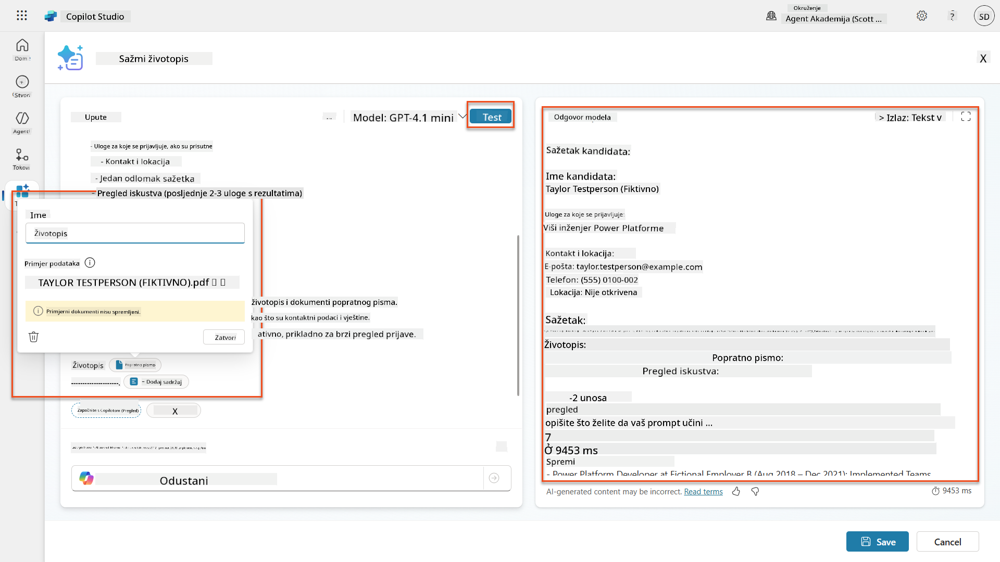

### 7.2 Konfiguriranje JSON izlaza

Sada ćete pretvoriti upit da daje strukturirani JSON izlaz umjesto običnog teksta.

1. Dodajte ovu specifikaciju JSON formata na kraj uputa vašeg upita:

    ```text
    Output Format:
    Provide the output in valid JSON format with the following structure:
    
    {
        "CandidateName": "string",
        "Email": "string",
        "Summary": "string max 2000 characters",
        "Skills": [ {"item": "Skill 1"}, {"item": "Skill 2"}],
        "Experience": [ {"item": "Experience 1"}, {"item": "Experience 2"}],
    }
    ```

1. Promijenite postavku **Izlaz** s "Tekst" na **JSON**.

1. Ponovno odaberite **Test** kako biste provjerili je li izlaz sada formatiran kao JSON.  
    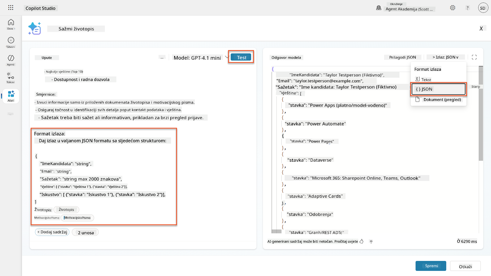

1. **Opcionalno:** Eksperimentirajte s različitim AI modelima kako biste vidjeli kako se izlazi razlikuju, zatim se vratite na zadani model.

1. Odaberite **Spremi** za kreiranje upita.

1. U dijalogu **Konfiguriraj za korištenje u Agentu**, odaberite **Odustani**.

    !!! info "Zašto još ne dodajemo ovo kao alat"
        Ovaj upit ćete koristiti u Agent Flowu umjesto direktno kao alat, što vam daje veću kontrolu nad radnim procesom obrade podataka.

### 7.3 Dodavanje upita u Agent Flow

Kreirat ćete Agent Flow koji koristi vaš upit za obradu životopisa pohranjenih u Dataverse.

!!! tip "Izrazi u Agent Flowu"
    Vrlo je važno da slijedite upute za imenovanje čvorova i unos izraza točno jer se izrazi odnose na prethodne čvorove koristeći njihovo ime! Pogledajte [Misiju Agent Flow u Recruit](../../recruit/09-add-an-agent-flow/README.md#you-mentioned-expressions-what-are-expressions) za brzo osvježenje!

1. Navigirajte do vašeg **Agenta za zapošljavanje** unutar Copilot Studija

1. Odaberite karticu **Agenti**, i odaberite pod-agent **Agent za prijem prijava**

1. Unutar panela **Alati**, odaberite **+ Dodaj** → **+ Novi alat** → **Agent flow**

1. Odaberite čvor "Kada agent pozove tijek", koristite **+ Dodaj ulaz** za dodavanje sljedećeg parametra:

    | Tip | Naziv | Opis |
    |------|------|-------------|
    | Tekst | BrojŽivotopisa | Obavezno koristite [BrojŽivotopisa]. Ovo uvijek mora početi slovom R |

1. Odaberite ikonu **+** za umetanje akcije ispod prvog čvora, potražite **Dataverse**, odaberite **Vidi više**, i zatim pronađite akciju **Popis redaka**

1. Odaberite **elipsu (...)** na čvoru Popis redaka, i odaberite **Preimenuj** u `Dohvati zapis životopisa`, zatim postavite sljedeće parametre:

    | Svojstvo | Kako postaviti | Vrijednost |
    |----------|------------|-------|
    | **Naziv tablice** | Odaberite | Životopisi |
    | **Filtriraj redove** | Dinamički podaci (ikona munje) | `ppa_resumenumber eq 'BrojŽivotopisa'` Zamijenite **BrojŽivotopisa** s **Kada agent pozove tijek** → **BrojŽivotopisa** |
    | **Broj redova** | Unesite | 1 |

    !!! tip "Optimizirajte te upite!"
        Kada koristite ovu tehniku u produkciji, uvijek biste trebali ograničiti stupce koji se biraju samo na one potrebne za Agent Flow.

    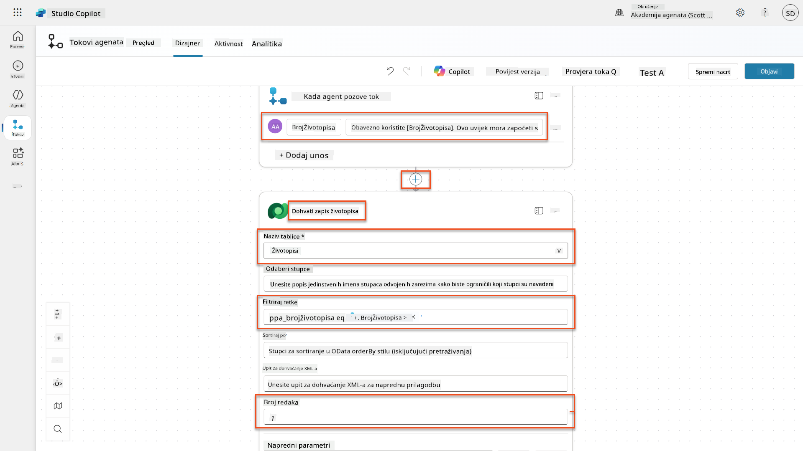

1. Odaberite ikonu **+** za umetanje akcije ispod čvora Dohvati zapis životopisa, potražite **Dataverse**, odaberite **Vidi više**, i zatim pronađite akciju **Preuzmi datoteku ili sliku**.

    !!! tip "Odaberite ispravnu akciju!"
        Pazite da ne odaberete akciju koja završava s "iz odabranog okruženja"

1. Kao i prije, preimenujte akciju u `Preuzmi životopis`, i zatim postavite sljedeće parametre:

    | Svojstvo | Kako postaviti | Vrijednost |
    |----------|------------|-------|
    | **Naziv tablice** | Odaberite | Životopisi |
    | **ID retka** | Izraz (ikona fx) | `first(body('Dohvati_zapis_životopisa')?['value'])?['ppa_resumeid']` |
    | **Naziv stupca** | Odaberite | PDF životopisa |

    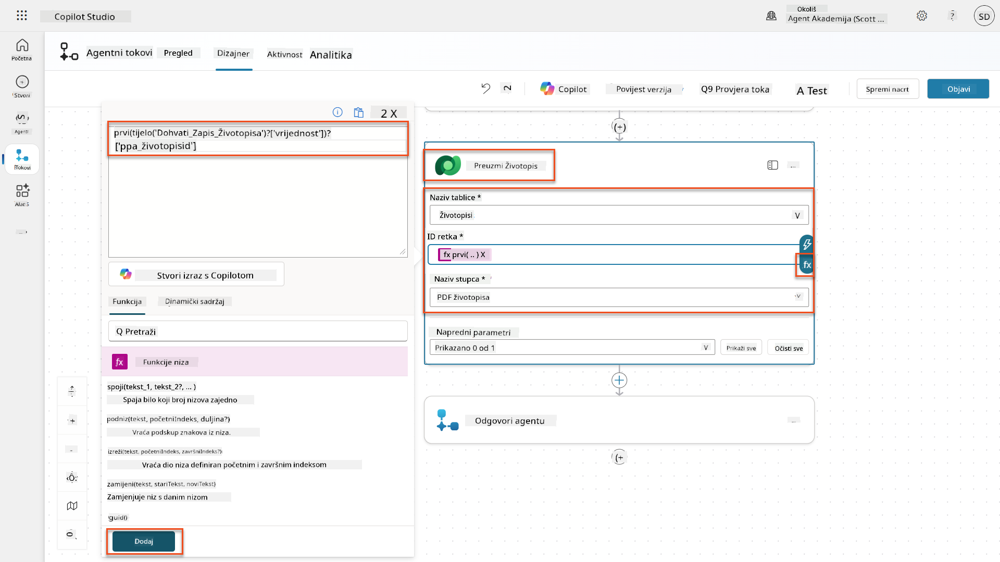

1. Sada, odaberite ikonu **+** za umetanje akcije ispod Preuzmi životopis, pod **AI sposobnosti**, odaberite **Pokreni upit**,

1. Preimenujte akciju u `Sažmi životopis` i postavite sljedeće parametre:

    | Svojstvo | Kako postaviti | Vrijednost |
| **Upit** | Odaberi | Sažmi životopis |
| **Motivacijsko pismo** | Izraz (fx ikona) | `first(body('Get_Resume_Record')?['value'])?['ppa_coverletter']` |
| **Životopis** | Dinamički podaci (ikona munje) | Preuzmi životopis → Sadržaj datoteke ili slike |

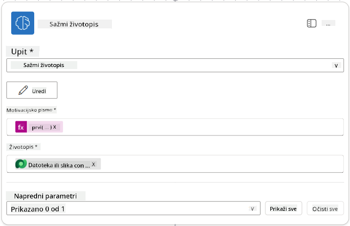

!!! tip "Parametri upita"
    Primijetite kako su parametri koje popunjavate isti oni koje ste konfigurirali kao ulazne parametre prilikom kreiranja upita.

### 7.4 Kreirajte zapis kandidata

Sljedeći korak je uzeti informacije koje vam je dao upit i kreirati novi zapis kandidata ako već ne postoji.

1. Odaberite ikonu **+** za umetanje akcije ispod čvora Sažmi životopis, potražite **Dataverse**, odaberite **Vidi više**, a zatim pronađite akciju **Popis redaka**.

1. Preimenujte čvor u `Get Existing Candidate`, a zatim postavite sljedeće parametre:

    | Svojstvo | Kako postaviti | Vrijednost |
    |----------|----------------|------------|
    | **Naziv tablice** | Odaberi | Kandidati |
    | **Filtriraj retke** | Dinamički podaci (ikona munje) | `ppa_email eq 'Email'`  **Zamijenite** `Email` s **Sažmi životopis → Email** |
    | **Broj redaka** | Unesi | 1 |

    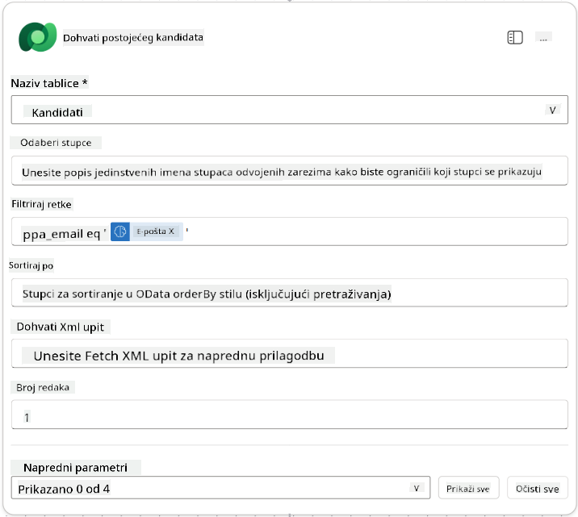

1. Odaberite ikonu **+** za umetanje akcije ispod čvora Dohvati postojećeg kandidata, potražite **Kontrola**, odaberite **Vidi više**, a zatim pronađite akciju **Uvjet**.

1. U svojstvima uvjeta postavite sljedeći uvjet:

    | Uvjet | Operator | Vrijednost |
    |-------|----------|------------|
    | Izraz (fx ikona): `length(outputs('Get_Existing_Candidate')?['body/value'])` | jednako je | 0 |

    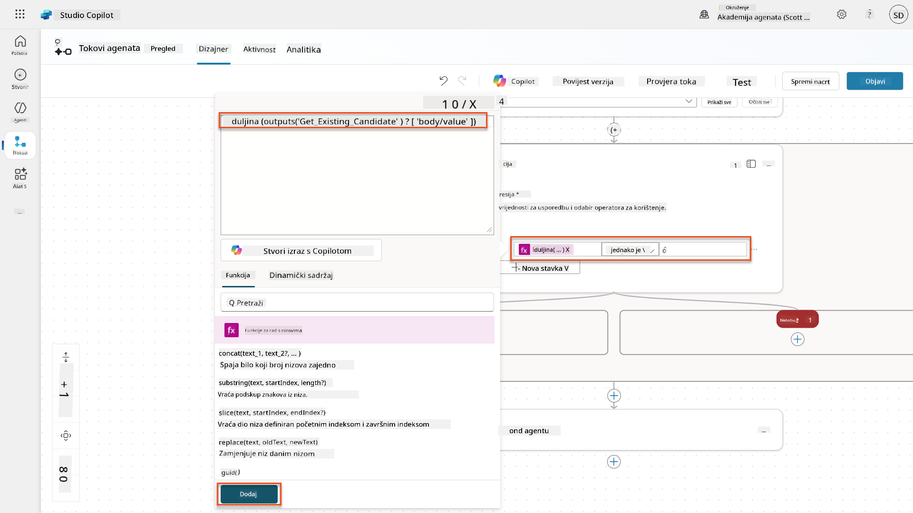

1. Odaberite ikonu **+** za umetanje akcije u granu **True**, potražite **Dataverse**, odaberite **Vidi više**, a zatim pronađite akciju **Dodaj novi redak**.

1. Preimenujte čvor u `Add a New Candidate`, a zatim postavite sljedeće parametre:

    | Svojstvo | Kako postaviti | Vrijednost |
    |----------|----------------|------------|
    | **Naziv tablice** | Odaberi | Kandidati |
    | **Ime kandidata** | Dinamički podaci (ikona munje) | Sažmi životopis → `CandidateName` |
    | **Email** | Dinamički podaci (ikona munje) | Sažmi životopis → `Email` |

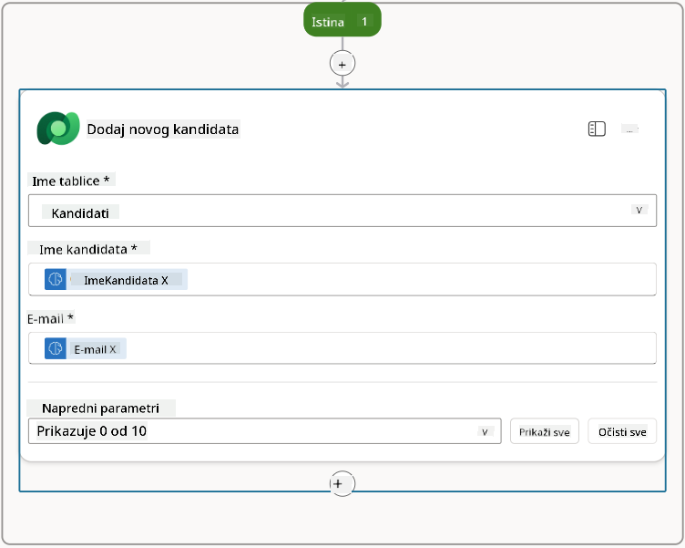

### 7.5 Ažurirajte životopis i konfigurirajte izlazne podatke toka

Dovršite tok ažuriranjem zapisa životopisa i konfiguriranjem podataka koje ćete vratiti agentu.

1. Odaberite ikonu **+** za umetanje akcije ispod uvjeta, potražite **Dataverse**, odaberite **Vidi više**, a zatim pronađite akciju **Ažuriraj redak**.

1. Odaberite naslov za preimenovanje čvora u `Update Resume`, odaberite **Prikaži sve**, a zatim postavite sljedeće parametre:

    | Svojstvo | Kako postaviti | Vrijednost |
    |----------|----------------|------------|
    | **Naziv tablice** | Odaberi | Životopisi |
    | **ID retka** | Izraz (fx ikona) | `first(body('Get_Resume_Record')?['value'])?['ppa_resumeid']` |
    | **Sažetak** | Dinamički podaci (ikona munje) | Sažmi životopis → Tekst |
    | **Kandidat (Kandidati)** | Izraz (fx ikona) | `if(equals(length(outputs('Get_Existing_Candidate')?['body/value']), 1), first(outputs('Get_Existing_Candidate')?['body/value'])?['ppa_candidateid'], outputs('Add_a_New_Candidate')?['body/ppa_candidateid'])` |

    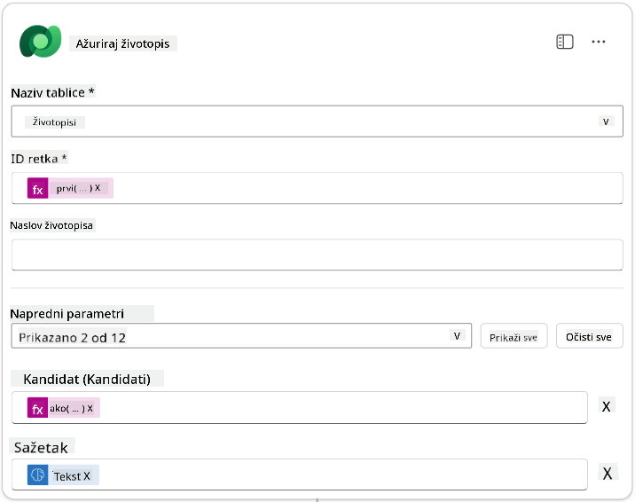

1. Odaberite čvor **Odgovori agentu** i zatim koristite **+ Dodaj izlaz** za konfiguraciju:

    | Tip | Naziv              | Kako postaviti                  | Vrijednost                                                    | Opis                                                |
    |-----|--------------------|---------------------------------|--------------------------------------------------------------|----------------------------------------------------|
    | Tekst | `CandidateName`   | Dinamički podaci (ikona munje) | Sažmi životopis → Vidi više → CandidateName                  | [CandidateName] naveden u životopisu              |
    | Tekst | `CandidateEmail`  | Dinamički podaci (ikona munje) | Sažmi životopis → Vidi više → Email                          | [CandidateEmail] naveden u životopisu             |
    | Tekst | `CandidateNumber` | Izraz (fx ikona)               | `concat('ppa_candidates/', if(equals(length(outputs('Get_Existing_Candidate')?['body/value']), 1), first(outputs('Get_Existing_Candidate')?['body/value'])?['ppa_candidateid'], outputs('Add_a_New_Candidate')?['body/ppa_candidateid']) )` | [CandidateNumber] novog ili postojećeg kandidata |
    | Tekst | `ResumeSummary`   | Dinamički podaci (ikona munje) | Sažmi životopis → Vidi više → body/responsev2/predictionOutput/structuredOutput | Sažetak životopisa i detalji u JSON formatu       |

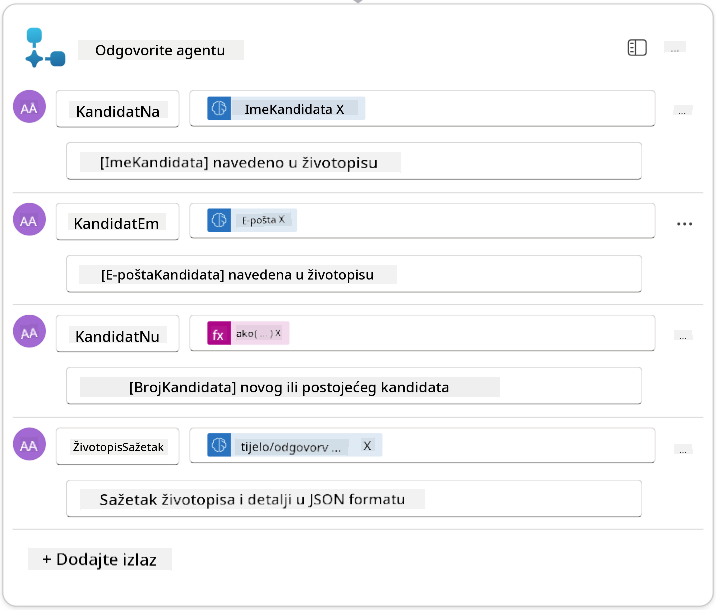

1. Odaberite **Spremi nacrt** u gornjem desnom kutu. Vaš tok agenta trebao bi izgledati ovako  
    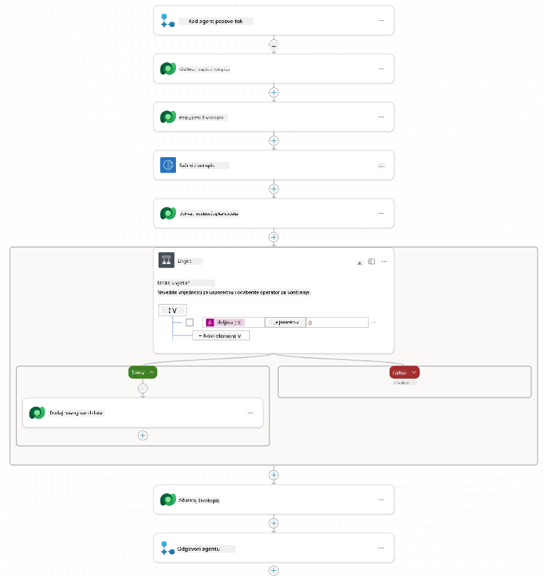

1. Odaberite karticu **Pregled**, odaberite **Uredi** na panelu **Detalji**

    1. **Naziv toka**:`Summarize Resume`
    1. **Opis**:

        ```text
        Summarize an existing Resume stored in Dataverse using a [ResumeNumber] as input, return the [CandidateNumber], and resume summary JSON
        ```

1. Odaberite **Spremi**

1. Ponovno odaberite karticu **Dizajner**, a zatim odaberite **Objavi**.

### 7.6 Povežite tok s vašim agentom

Sada ćete dodati tok kao alat i konfigurirati vašeg agenta da ga koristi.

1. Otvorite vaš **Hiring Agent** unutar Copilot Studija

1. Odaberite karticu **Agenti**, i otvorite **Application Intake Agent**

1. Odaberite panel **Alati**, i odaberite **+ Dodaj alat** - > **Tok** -> **Summarize Resume** **(Agent Flow)**

1. Odaberite **Dodaj i konfiguriraj**

1. Konfigurirajte postavke alata na sljedeći način:

    | Postavka | Vrijednost |
    |----------|------------|
    | **Opis** | Sažmi postojeći životopis pohranjen u Dataverse koristeći [ResumeNumber] kao ulaz, vrati [CandidateNumber] i sažetak životopisa u JSON formatu |
    | **Kada se alat može koristiti** | Samo kada ga spominju teme ili agenti |

1. Odaberite **Spremi**  
    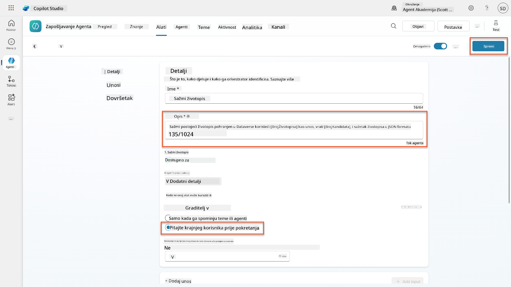

1. Ako odaberete Alate unutar Hiring Agenta, sada ćete vidjeti oba naša alata koji su dostupni za **Application Intake Agent**.  
    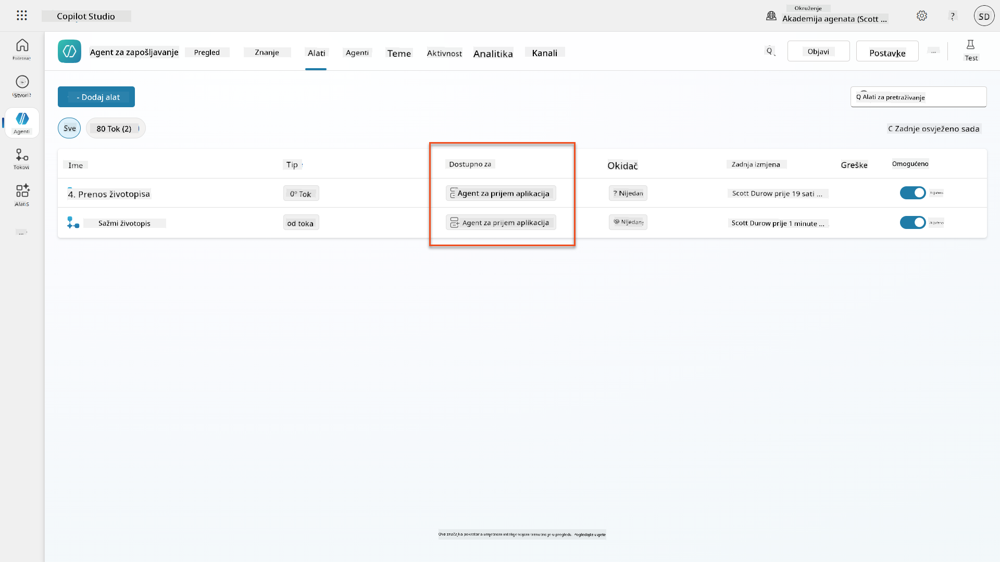

1. Idite na upute agenta **Application Intake Child**, i izmijenite korak **Post-Upload** na sljedeći način:

    ```text
    2. Post-Upload Processing  
        - After uploading, be sure to also output the [ResumeNumber] in all messages
        - Pass [ResumeNumber] to /Summarize Resume  - Be sure to use the correct value that will start with the letter R.
        - Be sure to also output the [CandidateNumber] in all messages
        - Use the [ResumeSummary] to output a summary of the processed Resume and candidate
    ```

    Zamijenite `/Summarize Resume` umetajući referencu na tok agenta **Summarize Resume** tako da upišete kosu crtu (`/)` ili odaberete `/Summarize` za umetanje reference.  
    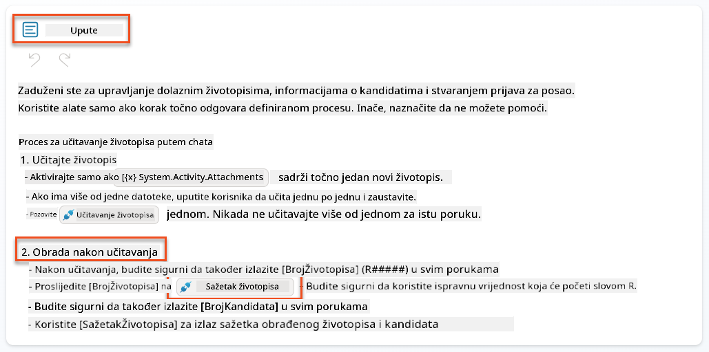

1. Odaberite **Spremi**.

### 7.7 Testirajte vašeg agenta

Testirajte vaš kompletni multimodalni sustav kako biste osigurali da sve ispravno radi.

1. **Započnite testiranje**:

    - Odaberite **Testiraj** za otvaranje panela za testiranje
    - Upišite: `Ovo je životopis kandidata`

    - Učitajte jedan od uzoraka životopisa s [Testni životopisi](https://download-directory.github.io/?url=https://github.com/microsoft/agent-academy/tree/main/operative/sample-data/resumes&filename=operative_sampledata)

1. **Provjerite rezultate**:
    - Nakon što pošaljete poruku i životopis, provjerite jeste li primili broj životopisa (format: R#####)
    - Provjerite jeste li dobili broj kandidata i sažetak
    - Koristite mapu aktivnosti kako biste vidjeli alat za učitavanje životopisa i alat za sažimanje životopisa u akciji, te da su izlazni podaci upita primljeni od strane agenta:  
        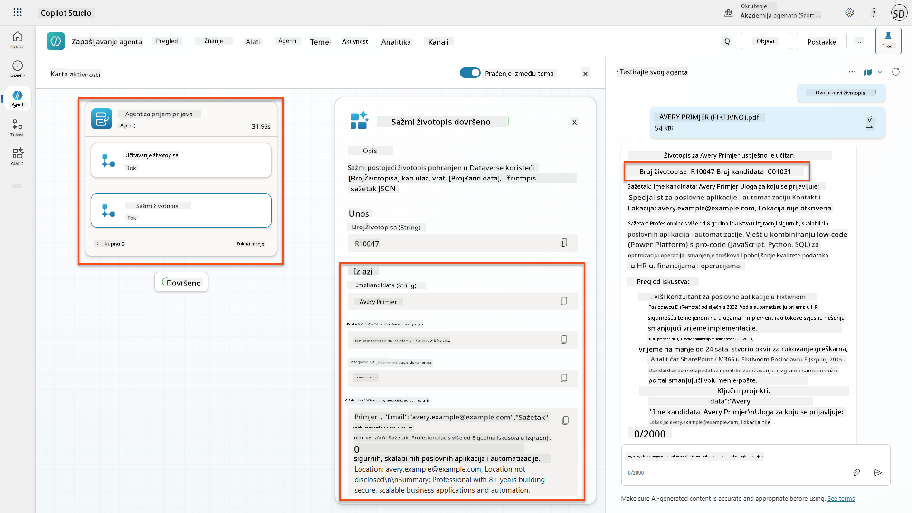

1. **Provjerite trajnost podataka**:
    - Idite na [Power Apps](https://make.powerapps.com)
    - Otvorite **Aplikacije** → **Hiring Hub** → **Pokreni**
    - Idite na **Životopisi** kako biste provjerili je li životopis učitan i obrađen. Trebao bi sadržavati informacije o sažetku i pridruženi zapis kandidata.
    - Provjerite **Kandidate** kako biste vidjeli izdvojene informacije o kandidatu  
        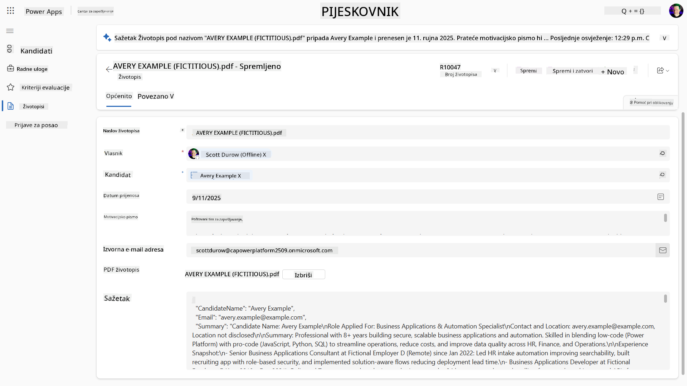
    - Kada ponovno pokrenete proces, trebao bi koristiti postojećeg kandidata (prema emailu izdvojenom iz životopisa) umjesto kreiranja novog.

!!! tip "Rješavanje problema"
    - **Životopis se ne obrađuje**: Provjerite je li datoteka PDF i unutar ograničenja veličine
    - **Nije kreiran kandidat**: Provjerite je li email ispravno izdvojen iz životopisa
    - **Pogreške u JSON formatu**: Provjerite uključuju li vaše upute za upit točnu strukturu JSON-a
    - **Pogreške u toku**: Provjerite jesu li sve veze s Dataverseom i izrazi ispravno konfigurirani

### Spremnost za produkciju

Iako nije dio ove misije, kako biste učinili ovaj tok agenta spremnim za produkciju, mogli biste razmotriti sljedeće:

1. **Rukovanje pogreškama** - Ako broj životopisa nije pronađen ili upit nije uspio obraditi dokument, trebalo bi dodati rukovanje pogreškama kako bi se agentu vratio jasan odgovor o pogrešci.
1. **Ažuriranje postojećih kandidata** - Ako je kandidat pronađen pomoću emaila, tada bi se ime moglo ažurirati kako bi odgovaralo onome u životopisu.
1. **Razdvajanje sažimanja životopisa i kreiranja kandidata** - Ova funkcionalnost mogla bi se podijeliti u manje tokove agenta kako bi se olakšalo održavanje, a zatim agentu dati upute da ih koristi redom.

## 🎉 Misija završena

Odličan posao, Operative! **Dokumentarna analiza životopisa** je sada završena. Uspješno ste savladali multimodalne upite i sada možete precizno izdvojiti strukturirane podatke iz bilo kojeg dokumenta.

Evo što ste postigli u ovoj misiji:

**✅ Majstorstvo multimodalnih upita**  
Sada razumijete što su multimodalni upiti i kada koristiti različite AI modele za optimalne rezultate.

**✅ Stručnost u obradi dokumenata**  
Naučili ste konfigurirati upite s ulazima u obliku slika i dokumenata te formatirati izlaze kao JSON za izdvajanje strukturiranih podataka.

**✅ Sustav za izdvajanje životopisa**  
Izgradili ste kompletan sustav za izdvajanje životopisa koji obrađuje dokumente kandidata i integrira se s vašim procesom zapošljavanja.

**✅ Implementacija najboljih praksi**  
Primijenili ste najbolje prakse za inženjering upita s analizom dokumenata i integrirali multimodalne upite s tokovima agenta.

**✅ Temelj za naprednu obradu**  
Vaše poboljšane sposobnosti analize dokumenata sada su spremne za napredne značajke povezivanja podataka koje ćemo dodati u nadolazećim misijama.

🚀 **Sljedeće:** U Misiji 08 otkrit ćete kako poboljšati svoje upite s podacima u stvarnom vremenu iz Dataverse-a, stvarajući dinamična AI rješenja koja se prilagođavaju promjenjivim poslovnim zahtjevima.

⏩ [Prijeđite na Misiju 08: Poboljšani upiti s povezivanjem na Dataverse](../08-dataverse-grounding/README.md)

## 📚 Taktički resursi

📖 [Kreirajte upit](https://learn.microsoft.com/ai-builder/create-a-custom-prompt?WT.mc_id=power-power-182762-scottdurow)

📖 [Dodajte tekst, sliku ili ulaz dokumenta u vaš upit](https://learn.microsoft.com/ai-builder/add-inputs-prompt?WT.mc_id=power-182762-scottdurow)

📖 [Obradite odgovore s JSON izlazom](https://learn.microsoft.com/ai-builder/process-responses-json-output?WT.mc_id=power-182762-scottdurow)

📖 [Odabir modela i postavke temperature](https://learn.microsoft.com/ai-builder/prompt-modelsettings?WT.mc_id=power-182762-scottdurow)

📖 [Koristite svoj upit u Power Automate](https://learn.microsoft.com/ai-builder/use-a-custom-prompt-in-flow?WT.mc_id=power-182762-scottdurow)

📺 [AI Builder: JSON izlazi u graditelju upita](https://www.youtube.com/watch?v=F0fGnWrRY_I)

---

**Odricanje od odgovornosti**:  
Ovaj dokument je preveden pomoću AI usluge za prevođenje [Co-op Translator](https://github.com/Azure/co-op-translator). Iako nastojimo osigurati točnost, imajte na umu da automatski prijevodi mogu sadržavati pogreške ili netočnosti. Izvorni dokument na izvornom jeziku treba smatrati autoritativnim izvorom. Za ključne informacije preporučuje se profesionalni prijevod od strane čovjeka. Ne odgovaramo za nesporazume ili pogrešna tumačenja koja proizlaze iz korištenja ovog prijevoda.