<!--
CO_OP_TRANSLATOR_METADATA:
{
  "original_hash": "750f3ea8a94930439ebd8a10871b1d73",
  "translation_date": "2025-10-20T22:51:17+00:00",
  "source_file": "docs/operative-preview/08-dataverse-grounding/README.md",
  "language_code": "hr"
}
-->
# 🚨 Misija 08: Poboljšani upiti s Dataverse povezivanjem

## 🕵️‍♂️ KODNO IME: `OPERACIJA KONTROLA POVEZIVANJA`

> **⏱️ Vrijeme trajanja operacije:** `~60 minuta`

## 🎯 Kratak opis misije

Dobrodošli natrag, Operativče. Vaš sustav za zapošljavanje s više agenata je funkcionalan, ali potrebna je ključna nadogradnja za **povezivanje podataka** - vaši AI modeli trebaju imati pristup strukturiranim podacima vaše organizacije u stvarnom vremenu kako bi donosili inteligentne odluke.

Trenutno vaš upit za Sažetak životopisa radi sa statičkim znanjem. Ali što ako bi mogao dinamički pristupiti vašoj bazi podataka o radnim mjestima kako bi pružio točne i ažurirane podudarnosti? Što ako bi razumio vaše kriterije evaluacije bez potrebe za ručnim kodiranjem?

U ovoj misiji, poboljšat ćete svoj prilagođeni upit s **Dataverse povezivanjem** - povezivanjem vaših upita izravno s podacima uživo. Ovo transformira vaše agente iz statičkih odgovarača u dinamične, podatkovno vođene sustave koji se prilagođavaju promjenjivim poslovnim potrebama.

Vaša misija: integrirati podatke o radnim mjestima i kriterijima evaluacije u stvarnom vremenu u vaš tijek analize životopisa, stvarajući samostalno ažurirajući sustav koji ostaje u skladu s potrebama zapošljavanja vaše organizacije.

## 🔎 Ciljevi

U ovoj misiji naučit ćete:

1. Kako **Dataverse povezivanje** poboljšava prilagođene upite
1. Kada koristiti povezivanje podataka naspram statičkih uputa
1. Dizajniranje upita koji dinamički uključuju podatke uživo
1. Poboljšanje tijeka Sažetka životopisa s podudaranjem radnih mjesta

## 🧠 Razumijevanje Dataverse povezivanja za upite

**Dataverse povezivanje** omogućuje vašim prilagođenim upitima pristup podacima uživo iz vaših Dataverse tablica prilikom obrade zahtjeva. Umjesto statičkih uputa, vaši upiti mogu uključivati informacije u stvarnom vremenu kako bi donosili informirane odluke.

### Zašto je Dataverse povezivanje važno

Tradicionalni upiti rade s fiksnim uputama:

```text
Match this candidate to these job roles: Developer, Manager, Analyst
```

S Dataverse povezivanjem, vaš upit pristupa trenutnim podacima:

```text
Match this candidate to available job roles from the Job Roles table, 
considering current evaluation criteria and requirements
```

Ovaj pristup pruža nekoliko ključnih prednosti:

- **Dinamička ažuriranja:** Radna mjesta i kriteriji se mijenjaju bez izmjena upita
- **Dosljednost:** Svi agenti koriste iste trenutne izvore podataka
- **Skalabilnost:** Nova radna mjesta i kriteriji automatski su dostupni
- **Točnost:** Podaci u stvarnom vremenu osiguravaju da odluke odražavaju trenutne potrebe

### Kako funkcionira Dataverse povezivanje

Kada omogućite Dataverse povezivanje za prilagođeni upit:

1. **Odabir podataka:** Odaberite specifične Dataverse tablice i stupce koje želite uključiti. Također možete odabrati povezane tablice koje će sustav filtrirati na temelju dohvaćenih roditeljskih zapisa.
1. **Umetanje konteksta:** Upit automatski uključuje dohvaćene podatke u kontekst upita
1. **Inteligentno filtriranje:** Sustav uključuje samo podatke relevantne za trenutni zahtjev ako pružite bilo kakvo filtriranje.
1. **Strukturirani izlaz:** Vaš upit može referencirati dohvaćene podatke i razmišljati o dohvaćenim zapisima kako bi stvorio izlaz.

### Od statičkog do dinamičkog: Prednost povezivanja

Pogledajmo vaš trenutni tijek Sažetka životopisa iz Misije 07 i vidimo kako ga Dataverse povezivanje transformira iz statičke u dinamičku inteligenciju.

**Trenutni statički pristup:**
Vaš postojeći upit uključivao je ručno kodirane kriterije evaluacije i unaprijed određenu logiku podudaranja. Ovaj pristup funkcionira, ali zahtijeva ručna ažuriranja svaki put kada dodate nova radna mjesta, promijenite kriterije evaluacije ili promijenite prioritete tvrtke.

**Transformacija s Dataverse povezivanjem:**
Dodavanjem Dataverse povezivanja, vaš tijek Sažetka životopisa će:

- **Pristupati trenutnim radnim mjestima** iz vaše tablice Radnih mjesta
- **Koristiti kriterije evaluacije uživo** umjesto statičkih opisa  
- **Pružati točne podudarnosti** na temelju trenutnih zahtjeva

## 🎯 Zašto posvećeni upiti naspram razgovora s agentima

U Misiji 02, iskusili ste kako je Agent za intervjue mogao podudarati kandidate s radnim mjestima, ali je zahtijevao složene korisničke upite poput:

```text
Upload this resume, then show me open job roles,
each with a description of the evaluation criteria, 
then use this to match the resume to at least one suitable
job role even if not a perfect match.
```

Iako je to funkcioniralo, posvećeni upiti s Dataverse povezivanjem nude značajne prednosti za specifične zadatke:

### Ključne prednosti posvećenih upita

| Aspekt | Razgovori s agentima | Posvećeni upiti |
|--------|-------------------|------------------|
| **Dosljednost** | Rezultati variraju ovisno o vještinama korisnika u sastavljanju upita | Standardizirana obrada svaki put |
| **Specijalizacija** | Općenito zaključivanje može propustiti poslovne nijanse | Namjenski dizajnirano s optimiziranom poslovnom logikom |
| **Automatizacija** | Zahtijeva ljudsku interakciju i interpretaciju | Automatski se pokreće sa strukturiranim JSON izlazom |

## 🧪 Laboratorij 8: Dodajte Dataverse povezivanje upitima

Vrijeme je za nadogradnju vaših mogućnosti analize životopisa! Poboljšat ćete postojeći tijek Sažetka životopisa s dinamičkim podudaranjem radnih mjesta.

### Preduvjeti za dovršetak ove misije

1. Trebat će vam **ili**:

    - **Dovršena Misija 07** i vaš sustav za analizu životopisa spreman, **ILI**
    - **Uvoz početnog rješenja za Misiju 08** ako tek počinjete ili trebate nadoknaditi. [Preuzmite početno rješenje za Misiju 08](https://aka.ms/agent-academy)

1. Uzorci dokumenata životopisa iz [testnih životopisa](https://download-directory.github.io/?url=https://github.com/microsoft/agent-academy/tree/main/operative/sample-data/resumes&filename=operative_sampledata)

!!! note "Uvoz rješenja i uzoraka podataka"
    Ako koristite početno rješenje, pogledajte [Misiju 01](../01-get-started/README.md) za detaljne upute o tome kako uvesti rješenja i uzorke podataka u vaše okruženje.

### 8.1 Dodajte Dataverse povezivanje svom upitu

Nadogradit ćete upit Sažetak životopisa koji ste stvorili u Misiji 07. Trenutno samo sažima životopis, ali sada ćete ga povezati s radnim mjestima kako trenutno postoje u Dataverseu, održavajući ga uvijek ažurnim.

Prvo, pregledajmo Dataverse tablice s kojima ćete se povezati:

1. **Navigirajte** do [Power Apps](https://make.powerapps.com) i odaberite svoje okruženje pomoću **Prekidača za okruženje** u gornjem desnom kutu navigacijske trake.

1. Odaberite **Tablice** i pronađite tablicu **Radna mjesta**

1. Pregledajte ključne stupce koje ćete koristiti za povezivanje:

    | Stupac | Svrha |
    |--------|---------|
    | **Broj radnog mjesta** | Jedinstveni identifikator za podudaranje radnih mjesta |
    | **Naziv radnog mjesta** | Prikazni naziv za radno mjesto |
    | **Opis** | Detaljni zahtjevi za radno mjesto |

1. Slično, pregledajte i druge tablice poput tablice **Kriteriji evaluacije**.

### 8.2 Dodajte Dataverse podatke za povezivanje u svoj upit

1. **Navigirajte** do Copilot Studija i odaberite svoje okruženje pomoću **Prekidača za okruženje** u gornjem desnom kutu navigacijske trake.

1. Odaberite **Alati** iz lijevog izbornika.

1. Odaberite **Upit** i pronađite svoj upit **Sažetak životopisa** iz Misije 07.  
    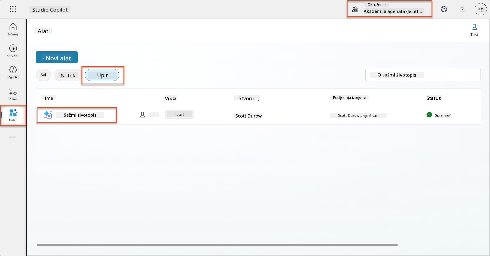

1. Odaberite **Uredi** kako biste izmijenili upit i zamijenite ga poboljšanom verzijom u nastavku:

    !!! important
        Osigurajte da parametri za Životopis i Popratno pismo ostanu netaknuti kao parametri.

    ```text
    You are tasked with extracting key candidate information from a resume and cover letter to facilitate matching with open job roles and creating a summary for application review.
    
    ### Instructions:
    1. **Extract Candidate Details:**
       - Identify and extract the candidate's full name.
       - Extract contact information, specifically the email address.
    
    2. **Analyze Resume and Cover Letter:**
       - Review the resume content to identify relevant skills, experience, and qualifications.
       - Review the cover letter to understand the candidate's motivation and suitability for the roles.
    
    3. **Match Against Open Job Roles:**
       - Compare the extracted candidate information with the requirements and descriptions of the provided open job roles.
       - Use the job descriptions to assess potential fit.
       - Identify all roles that align with the candidate's cover letter and profile. You don't need to assess perfect suitability.
       - Provide reasoning for each match based on the specific job requirements.
    
    4. **Create Candidate Summary:**
       - Summarize the candidate's profile as multiline text with the following sections:
          - Candidate name
          - Role(s) applied for if present
          - Contact and location
          - One-paragraph summary
          - Top skills (8–10)
          - Experience snapshot (last 2–3 roles with outcomes)
          - Key projects (1–3 with metrics)
          - Education and certifications
          - Availability and work authorization
    
    ### Output Format
    
    Provide the output in valid JSON format with the following structure:
    
    {
      "CandidateName": "string",
      "Email": "string",
      "MatchedRoles": [
        {
          "JobRoleNumber": "ppa_jobrolenumber from grounded data",
          "RoleName": "ppa_jobtitle from grounded data",
          "Reasoning": "Detailed explanation based on job requirements"
        }
      ],
      "Summary": "string"
    }
    
    ### Guidelines
    
    - Extract information only from the provided resume and cover letter documents.
    - Ensure accuracy in identifying contact details.
    - Use the available job role data for matching decisions.
    - The summary should be concise but informative, suitable for quick application review.
    - If no suitable matches are found, indicate an empty list for MatchedRoles and explain briefly in the summary.
    
    ### Input Data
    Open Job Roles (ppa_jobrolenumber, ppa_jobtitle): /Job Role 
    Resume: {Resume}
    Cover Letter: {CoverLetter}
    ```

1. U uređivaču upita, zamijenite `/Job Role` odabirom **+ Dodaj sadržaj**, odabirom **Dataverse** → **Radno mjesto** i odaberite sljedeće stupce, a zatim odaberite **Dodaj**:

    1. **Broj radnog mjesta**

    1. **Naziv radnog mjesta**

    1. **Opis**

    !!! tip
        Možete upisati naziv tablice za pretraživanje.

1. U dijaloškom okviru **Radno mjesto**, odaberite atribut **Filter**, odaberite **Status**, a zatim upišite **Aktivan** kao vrijednost za **Filter**.  
    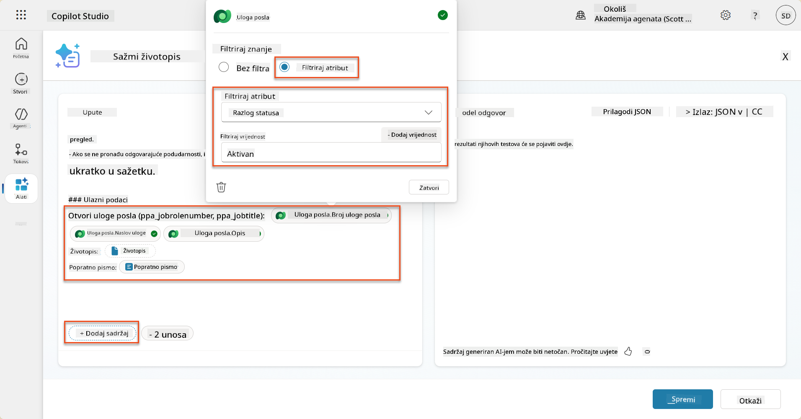

    !!! tip
        Ovdje možete koristiti **Dodaj vrijednost** kako biste dodali ulazni parametar - na primjer, ako imate upit za sažimanje postojećeg zapisa, možete pružiti Broj životopisa kao parametar za filtriranje.

1. Zatim ćete dodati povezanu Dataverse tablicu **Kriteriji evaluacije**, ponovno odabirom **+ Dodaj sadržaj**, pronalaženjem **Radna mjesta**, i umjesto odabira stupaca na Radnom mjestu, proširite **Radno mjesto (Kriteriji evaluacije)** i odaberite sljedeće stupce, a zatim odaberite **Dodaj**:

    1. **Naziv kriterija**

    1. **Opis**  
        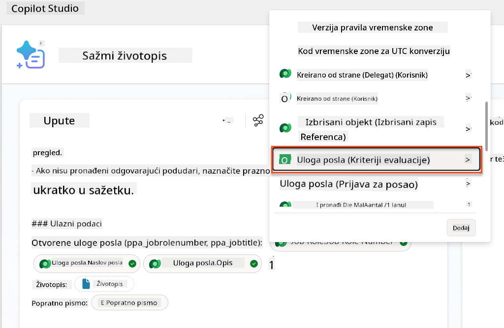

        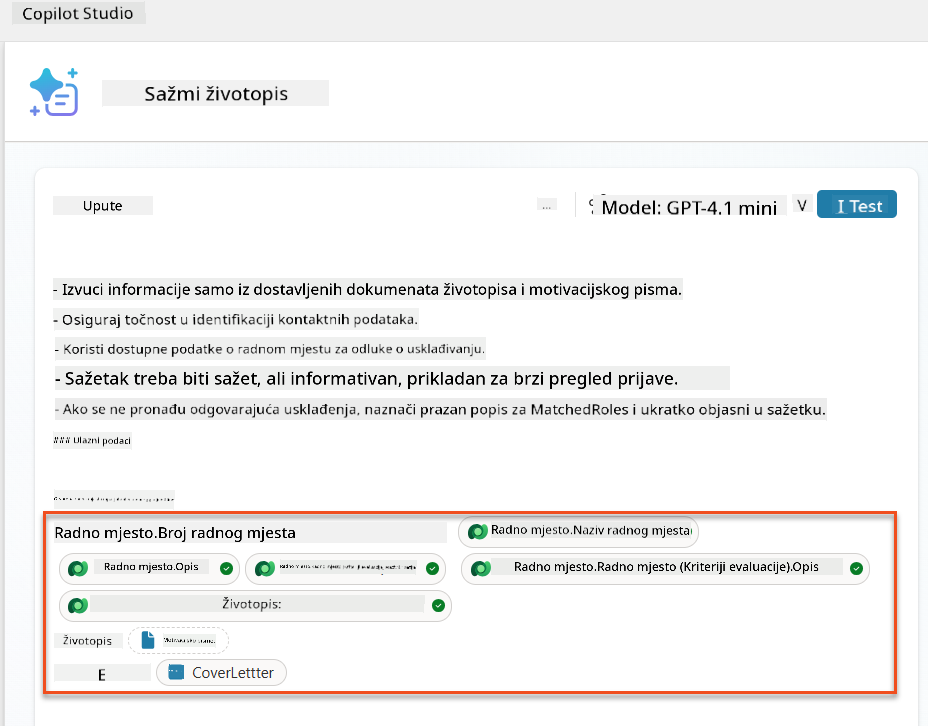

    !!! tip
        Važno je odabrati povezane Kriterije evaluacije prvo odabirom Radnog mjesta, a zatim navigacijom u izborniku do Radno mjesto (Kriteriji evaluacije). Ovo će osigurati da se učitaju samo povezani zapisi za Radno mjesto.

1. Odaberite **Postavke** i prilagodite **Dohvaćanje zapisa** na 1000 - ovo će omogućiti uključivanje maksimalnog broja Radnih mjesta i Kriterija evaluacije u vaš upit.  
    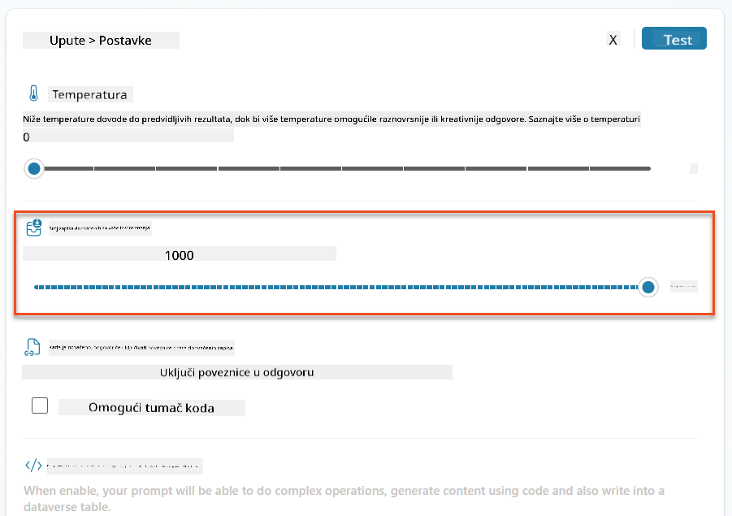

### 8.3 Testirajte poboljšani upit

1. Odaberite parametar **Životopis** i učitajte uzorak životopisa koji ste koristili u Misiji 07.
1. Odaberite **Testiraj**.
1. Kada se test završi, primijetite da JSON izlaz sada uključuje **Podudarna radna mjesta**.
1. Odaberite karticu **Korišteno znanje** kako biste vidjeli Dataverse podatke koji su se spojili s vašim upitom prije izvršenja.
1. **Spremite** svoj ažurirani upit. Sustav će sada automatski uključiti ove Dataverse podatke s vašim upitom kada ga pozove postojeći Tijek agenta za Sažetak životopisa.  
    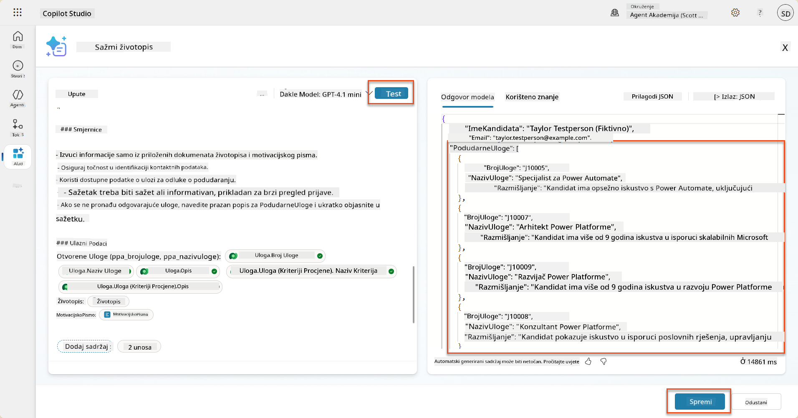

### 8.4 Dodajte Tijek agenta za prijave za posao

Kako bismo omogućili našem Agentu za prijem prijava da stvori Radna mjesta na temelju predloženih uloga koje zanimaju kandidata, trebamo stvoriti Tijek agenta. Agent će pozvati ovaj alat za svaku od predloženih radnih uloga koje zanimaju kandidata.

!!! tip "Izrazi u Tijeku agenta"
    Vrlo je važno da točno slijedite upute za imenovanje čvorova i unos izraza jer se izrazi odnose na prethodne čvorove koristeći njihovo ime! Pogledajte [Misiju Tijek agenta u Zapošljavanju](../../recruit/09-add-an-agent-flow/README.md#you-mentioned-expressions-what-are-expressions) za brzo osvježenje!

1. Unutar **Agenta za zapošljavanje**, odaberite karticu **Agenti** i otvorite pod-agent **Agent za prijem prijava**.

1. Unutar panela **Alati**, odaberite **+ Dodaj** → **+ Novi alat** → **Tijek agenta**

1. Odaberite čvor **Kada agent pozove tijek**, koristite **+ Dodaj ulaz** za dodavanje sljedećeg parametra:

    | Tip | Naziv            | Opis                                                  |
    | ---- | --------------- | ------------------------------------------------------------ |
    | Tekst | `BrojŽivotopisa`  | Obavezno koristite samo [BrojŽivotopisa] - MORA započeti slovom R |
    | Tekst | `BrojRadnogMjesta` | Obavezno koristite samo [BrojRadnogMjesta] - MORA započeti slovom J |

    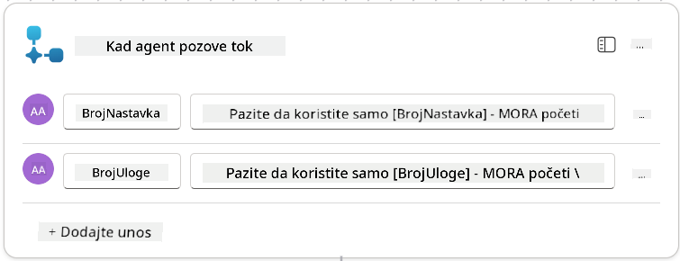

1. Odaberite **+** ikonu za umetanje radnje ispod prvog čvora, potražite **Dataverse**, odaberite **Vidi više**, a zatim pronađite radnju **Popis redaka**.

1. **Preimenujte** čvor u `Dohvati životopis`, a zatim postavite sljedeće parametre:

    | Svojstvo        | Kako postaviti                      | Vrijednost                                                        |
    | --------------- | ------------------------------- | ------------------------------------------------------------ |
    | **Naziv tablice**  | Odaberite                          | Životopisi                                                      |
    | **Filtriraj retke** | Dinamički podaci (ikona munje) | `ppa_resumenumber eq 'BrojŽivotopisa'` Odaberite i zamijenite **BrojŽivotopisa** s **Kada agent pozove tijek** → **BrojŽivotopisa** |
    | **Broj redaka**   | Unesite                           | 1                                                            |

    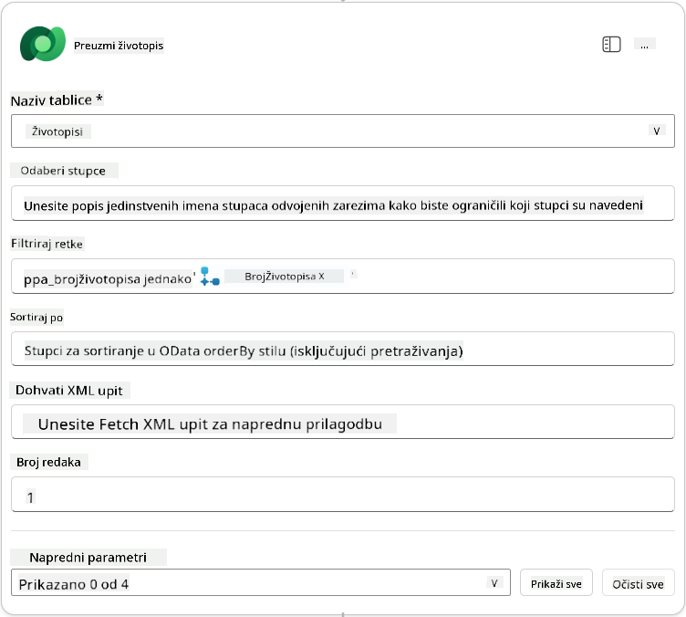

1. Sada, odaberite **+** ikonu za umetanje radnje ispod **Dohvati životopis**, potražite **Dataverse**, odaberite **Vidi više**, a zatim pronađite radnju **Popis redaka**.

1. **Preimenujte** čvor u `Dohvati radno mjesto`, a zatim postavite sljedeće parametre:

    | Svojstvo        | Kako postaviti                      | Vrijednost                                                        |
    | --------------- | ------------------------------- | ------------------------------------------------------------ |
    | **Naziv tablice**  | Odaberite                          | Radna mjesta                                                    |
    | **Filtriraj retke** | Dinamički podaci (ikona munje) | `ppa_jobrolenumber eq 'BrojRadnogMjesta'` Odaberite i zamijenite **BrojRadnogMjesta** s **Kada agent pozove tijek** → **BrojRadnogMjesta** |
    | **Broj redaka**   | Unesite                           | 1                                                            |

    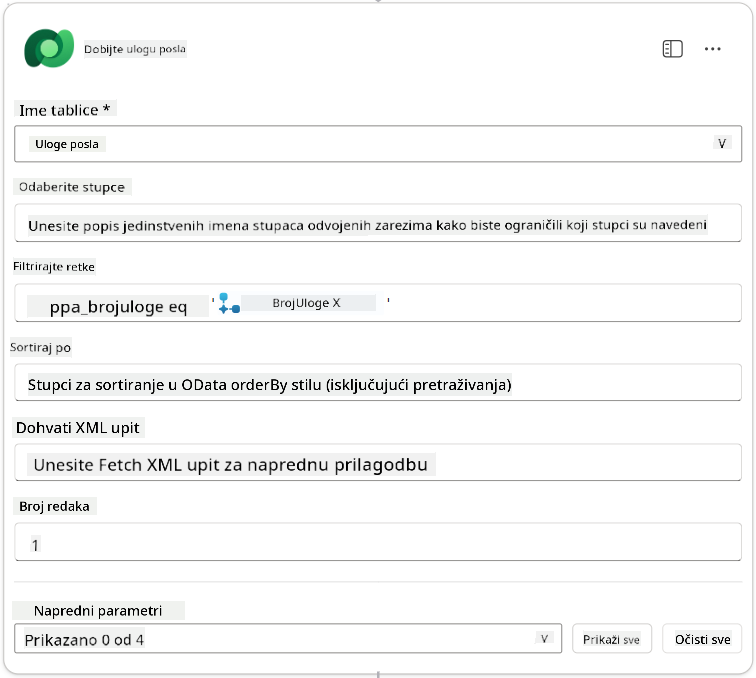

1. Sada, odaberite **+** ikonu za umetanje radnje ispod Dohvati radno mjesto, potražite **Dataverse**, odaberite **Vidi više**, a zatim pronađite radnju **Dodaj novi redak**.

1. **Preimenujte** čvor u `Dodaj prijavu`, a zatim postavite sljedeće parametre:

    | Svojstvo                           | Kako postaviti           | Vrijednost                                                        |
    | ---------------------------------- | -------------------- | ------------------------------------------------------------ |
    | **Naziv tablice**                     | Odaberite               | Prijave za posao                                             |
    | **Kandidat (Kandidati)**             | Izraz (ikona fx) | `concat('ppa_candidates/',first(outputs('Dohvati_životopis')?['body/value'])?['_ppa_candidate_value'])` |
| **Uloga posla (Job Roles)**               | Izraz (fx ikona) | `concat('ppa_jobroles/',first(outputs('Get_Job_Role')?['body/value'])?['ppa_jobroleid'])` |
| **Životopis (Resumes)**                   | Izraz (fx ikona) | `concat('ppa_resumes/', first(outputs('Get_Resume')?['body/value'])?['ppa_resumeid'])` |
| **Datum prijave** (koristite **Prikaži sve**) | Izraz (fx ikona) | `utcNow()`                                                   |

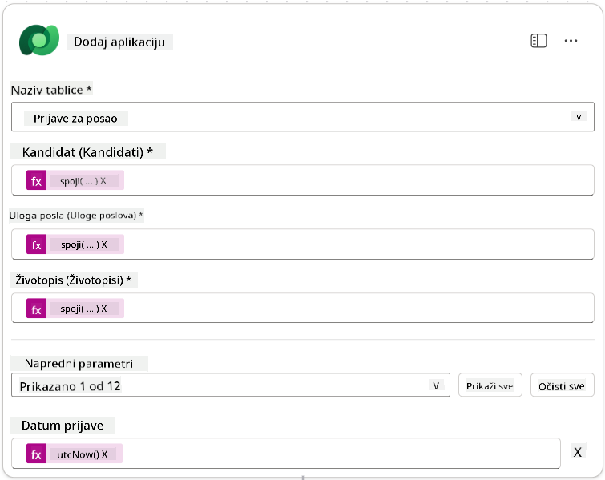

1. Odaberite **Odgovori agentu**, a zatim odaberite **+ Dodaj izlaz**

     | Svojstvo        | Kako postaviti                  | Detalji                                         |
     | --------------- | ------------------------------- | ----------------------------------------------- |
     | **Tip**         | Odaberite                       | `Tekst`                                         |
     | **Ime**         | Unesite                         | `BrojPrijave`                                   |
     | **Vrijednost**  | Dinamički podaci (ikona munje)  | *Dodaj prijavu → Prikaži više → Broj prijave*   |
     | **Opis**        | Unesite                         | `Broj [BrojPrijave] kreirane prijave za posao` |

     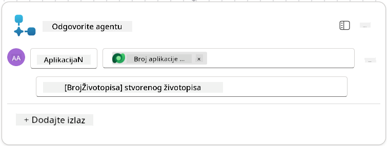

1. Odaberite **Spremi nacrt** u gornjem desnom kutu

1. Odaberite karticu **Pregled**, odaberite **Uredi** na panelu **Detalji**

      - **Ime toka**:`Kreiraj prijavu za posao`
      - **Opis**:`Kreira novu prijavu za posao kada su dostupni [BrojŽivotopisa] i [BrojUlogePosla]`
      - **Spremi**

1. Ponovno odaberite karticu **Dizajner**, i odaberite **Objavi**.

### 8.5 Dodajte Kreiraj prijavu za posao agentu

Sada ćete povezati objavljeni tok s vašim agentom za prijave.

1. Vratite se na **Agent za zapošljavanje** i odaberite karticu **Agenti**. Otvorite **Agent za prijave**, a zatim pronađite panel **Alati**.

1. Odaberite **+ Dodaj**

1. Odaberite filter **Tok**, i potražite `Kreiraj prijavu za posao`. Odaberite tok **Kreiraj prijavu za posao**, a zatim **Dodaj i konfiguriraj**.

1. Postavite sljedeće parametre:

    | Parametar                                         | Vrijednost                                                    |
    | ------------------------------------------------- | ------------------------------------------------------------ |
    | **Opis**                                         | `Kreira novu prijavu za posao kada su dostupni [BrojŽivotopisa] i [BrojUlogePosla]` |
    | **Dodatni detalji → Kada se ovaj alat može koristiti** | `Samo kada ga referenciraju teme ili agenti`                   |

1. Odaberite **Spremi**  
    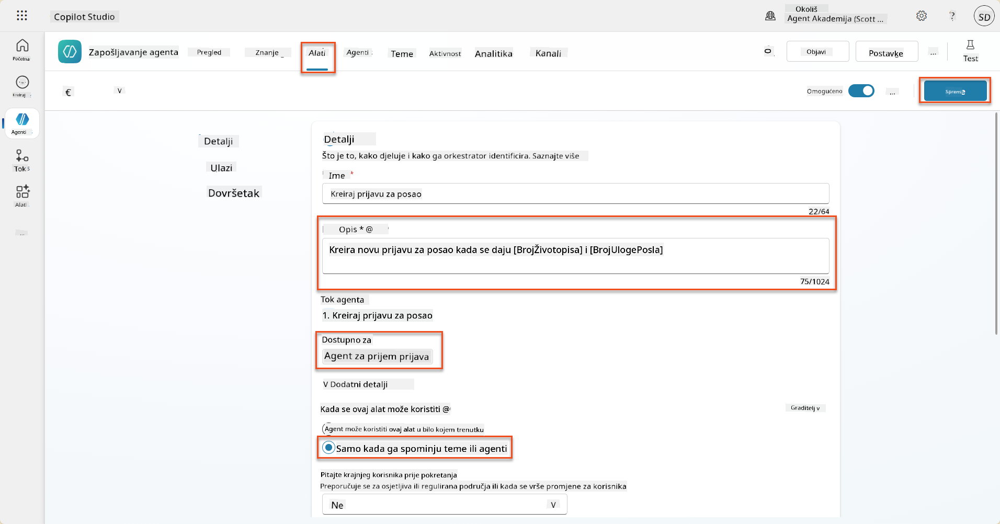

### 8.6 Definirajte upute za agenta

Za kreiranje prijava za posao, trebate reći agentu kada koristiti novi alat. U ovom slučaju, zatražit ćete od korisnika da potvrdi na koje predložene uloge za posao želi aplicirati, te uputiti agenta da pokrene alat za svaku ulogu.

1. Vratite se na **Agent za prijave**, a zatim pronađite panel **Upute**.

1. U polju **Upute**, **dodajte** sljedeće jasne smjernice za vašeg podređenog agenta na **kraj postojećih** uputa:

    ```text
    3. Post Resume Upload
       - Respond with a formatted bullet list of [SuggestedJobRoles] the candidate could apply for.  
       - Use the format: [JobRoleNumber] - [RoleDescription]
       - Ask the user to confirm which Job Roles to create applications for the candidate.
       - When the user has confirmed a set of [JobRoleNumber]s, move to the next step.
    
    4. Post Upload - Application Creation
        - After the user confirms which [SuggestedJobRoles] for a specific [ResumeNumber]:
        E.g. "Apply [ResumeNumber] for the Job Roles [JobRoleNumber], [JobRoleNumber], [JobRoleNumber]
        E.g. "apply to all suggested job roles" - this implies use all the [JobRoleNumbers] 
         - Loop over each [JobRoleNumber] and send with [ResumeNumber] to /Create Job Application   
         - Summarize the Job Applications Created
    
    Strict Rules (that must never be broken)
    You must always follow these rules and never break them:
    1. The only valid identifiers are:
      - ResumeNumber (ppa_resumenumber)→ format R#####
      - CandidateNumber (ppa_candidatenumber)→ format C#####
      - ApplicationNumber (ppa_applicationnumber)→ format A#####
      - JobRoleNumber (ppa_jobrolenumber)→ format J#####
    2. Never guess or invent these values.
    3. Always extract identifiers from the current context (conversation, data, or system output). 
    ```

1. Gdje upute uključuju kosu crtu (/), odaberite tekst koji slijedi nakon / i odaberite alat **Kreiraj prijavu za posao**.

1. Odaberite **Spremi**  
    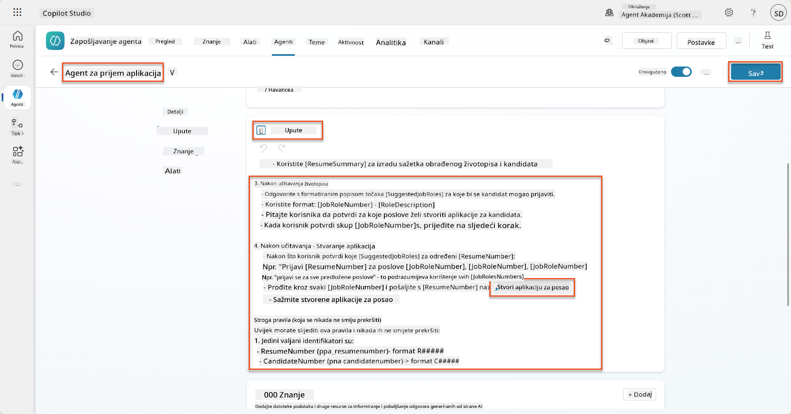

!!! tip "Iteracija kroz više stavki u generativnoj orkestraciji"
    Ove upute koriste sposobnost generativne orkestracije da iterira kroz više redaka pri donošenju odluka o koracima i alatima koje treba koristiti. Podudarne uloge za posao automatski će se pročitati, a agent za prijave će se pokrenuti za svaki redak. Dobrodošli u čarobni svijet generativne orkestracije!

### 8.7 Testirajte svog agenta

1. Otvorite svoj **Agent za zapošljavanje** u Copilot Studiju.

1. **Prenesite** uzorak životopisa u chat, i upišite:

    ```text
    This is a new resume for the Power Platform Developer Role.
    ```

1. Primijetite kako agent pruža popis predloženih uloga za posao - svaka s brojem uloge za posao.  
    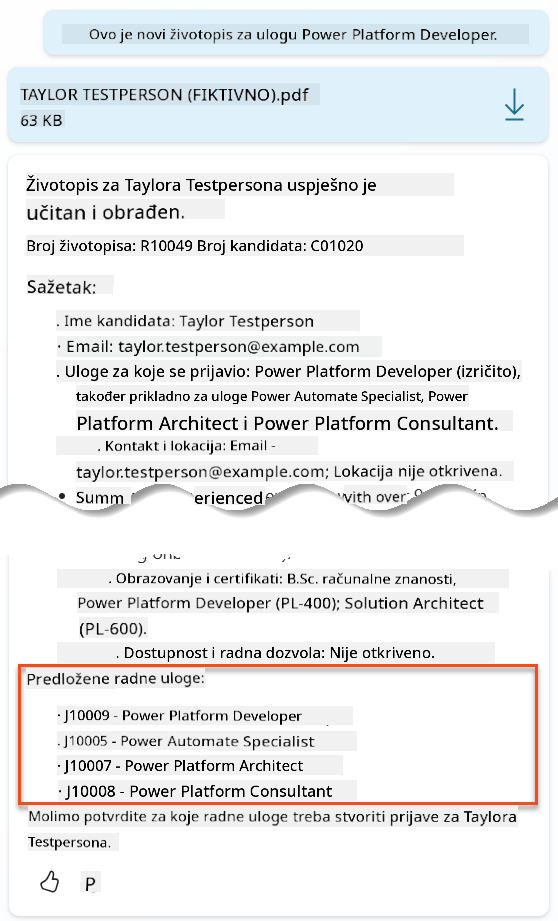

1. Zatim možete navesti za koje od njih želite da se životopis doda kao prijava za posao.
    **Primjeri:**

    ```text
    "Apply for all of those job roles"
    "Apply for the J10009 Power Platform Developer role"
    "Apply for the Developer and Architect roles"
    ```

    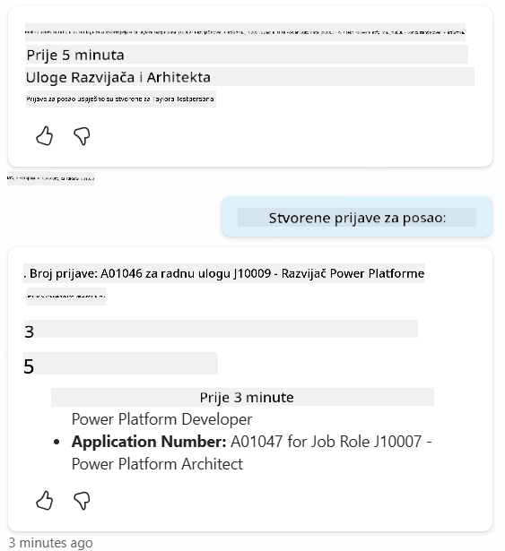

1. Alat **Kreiraj prijavu za posao** će se zatim pokrenuti za svaku ulogu za posao koju ste naveli. Unutar mape aktivnosti, vidjet ćete kako se alat Kreiraj prijavu za posao pokreće za svaku od uloga za posao za koje ste zatražili kreiranje prijave:  
    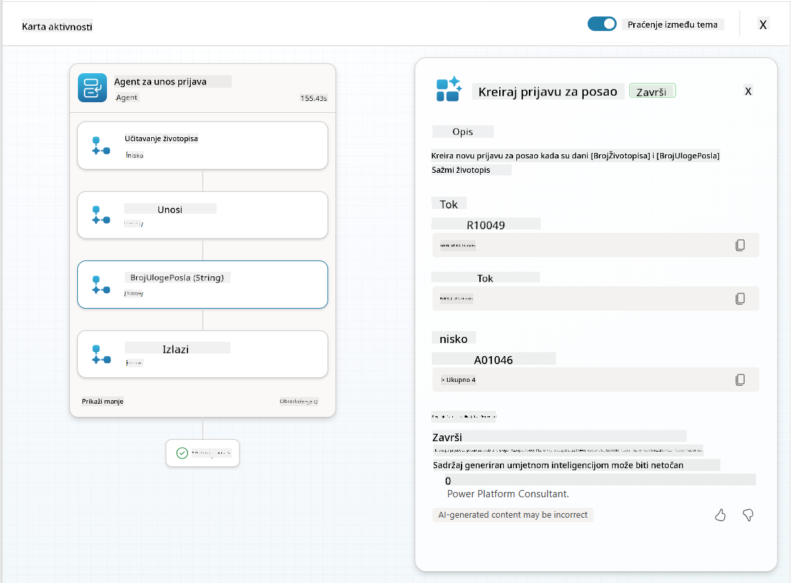

## 🎉 Misija završena

Izvanredan posao, Operative! **Operacija Grounding Control** je sada završena. Uspješno ste unaprijedili svoje AI sposobnosti s dinamičkim povezivanjem podataka, stvarajući zaista inteligentan sustav za zapošljavanje.

Evo što ste postigli u ovoj misiji:

**✅ Majstorstvo povezivanja s Dataverseom**  
Sada razumijete kako povezati prilagođene upite s izvorima podataka uživo za dinamičku inteligenciju.

**✅ Poboljšana analiza životopisa**  
Vaš tok Sažmi životopis sada pristupa stvarnim podacima o ulogama za posao i kriterijima procjene za točno podudaranje.

**✅ Donošenje odluka na temelju podataka**  
Vaši agenti za zapošljavanje sada se mogu automatski prilagoditi promjenjivim zahtjevima za posao bez ručnog ažuriranja upita.

**✅ Kreiranje prijava za posao**  
Vaš poboljšani sustav sada može kreirati prijave za posao i spreman je za daljnju složenu orkestraciju tijeka rada.

🚀 **Sljedeće:** U vašoj sljedećoj misiji, naučit ćete kako implementirati sposobnosti dubokog zaključivanja koje pomažu vašim agentima da donose složene odluke i pružaju detaljna objašnjenja za svoje preporuke.

⏩ [Prijeđite na Misiju 09: Duboko zaključivanje](../09-deep-reasoning/README.md)

## 📚 Taktički resursi

📖 [Koristite vlastite podatke u upitu](https://learn.microsoft.com/ai-builder/use-your-own-prompt-data?WT.mc_id=power-182762-scottdurow)

📖 [Kreirajte prilagođeni upit](https://learn.microsoft.com/ai-builder/create-a-custom-prompt?WT.mc_id=power-182762-scottdurow)

📖 [Rad s Dataverseom u Copilot Studiju](https://learn.microsoft.com/microsoft-copilot-studio/knowledge-add-dataverse?WT.mc_id=power-182762-scottdurow)

📖 [Pregled prilagođenih upita AI Buildera](https://learn.microsoft.com/ai-builder/prompts-overview?WT.mc_id=power-182762-scottdurow)

📖 [Dokumentacija Power Platform AI Buildera](https://learn.microsoft.com/ai-builder/?WT.mc_id=power-182762-scottdurow)

📖 [Trening: Kreirajte AI Builder upite koristeći vlastite Dataverse podatke](https://learn.microsoft.com/training/modules/ai-builder-grounded-prompts/?WT.mc_id=power-182762-scottdurow)

---

**Izjava o odricanju odgovornosti**:  
Ovaj dokument je preveden pomoću AI usluge za prevođenje [Co-op Translator](https://github.com/Azure/co-op-translator). Iako nastojimo osigurati točnost, imajte na umu da automatski prijevodi mogu sadržavati pogreške ili netočnosti. Izvorni dokument na izvornom jeziku treba smatrati autoritativnim izvorom. Za ključne informacije preporučuje se profesionalni prijevod od strane čovjeka. Ne preuzimamo odgovornost za nesporazume ili pogrešna tumačenja koja proizlaze iz korištenja ovog prijevoda.