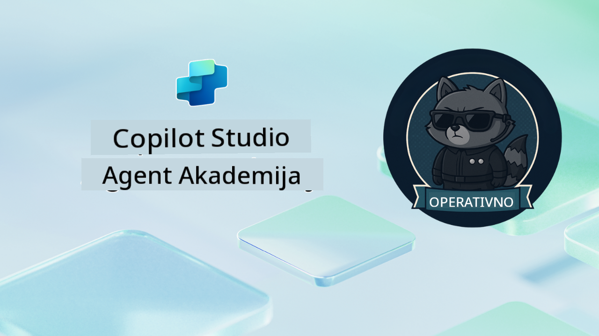

<!--
CO_OP_TRANSLATOR_METADATA:
{
  "original_hash": "24fcbe9a57d3439e05f8866e550c0a84",
  "translation_date": "2025-10-20T22:42:19+00:00",
  "source_file": "docs/operative-preview/README.md",
  "language_code": "hr"
}
-->
# Dobrodošao Operativče

**Dobrodošao, Operativče.**  
Tvoja napredna misija—ako je odlučiš prihvatiti—je savladati umjetnost izgradnje **višestrukih sustava agenata na razini poduzeća** koristeći **Microsoft Copilot Studio**.

Ova intenzivna obuka vodi te dalje od osnovnog stvaranja agenata u sofisticirani svijet **orkestracije višestrukih agenata**: od automatizacije zapošljavanja do sigurnosti AI-a, naučit ćeš kako izgraditi, koordinirati i implementirati inteligentne ekosustave agenata koristeći stvarne scenarije iz poslovnog svijeta.

--8<-- "disclaimer.md"

---

## 🎯 Cilj Misije

Završetkom programa Agent Academy Operative, moći ćeš:

- Dizajnirati i implementirati **sustave višestrukih agenata** za složene poslovne scenarije
- Savladati **orkestraciju agenata** i obrasce suradnje
- Implementirati **sigurnost AI-a i moderaciju sadržaja** u produkcijskim sustavima
- Izraditi **višestruke modalne upite** za obradu i analizu dokumenata
- Implementirati **agente spremne za poduzeće** uz odgovarajuće upravljanje i testiranje

---

## 🧪 Preduvjeti

Za dovršetak svih misija trebat će ti:

- Završena obuka **Agent Academy Recruit**
- Microsoft Power Platform okruženje s licencom za **Copilot Studio**
- Pristup **Microsoft Dataverse**
- Administratorske dozvole za kreiranje rješenja i agenata

---

## 🧬 Za koga je ovo namijenjeno

Ovaj napredni tečaj idealan je za:

- **Arhitekte rješenja** koji dizajniraju AI sustave za poduzeća
- **Razvijatelje** koji izrađuju produkcijska rješenja agenata
- **IT profesionalce** koji implementiraju upravljanje i sigurnost AI-a
- **Poslovne analitičare** koji kreiraju složene automatizirane tijekove rada
- Sve koji su spremni **napredovati** od osnovnih agenata do sustava za poduzeća

---

## 🧭 Pregled Kurikuluma

Ova akademija strukturirana je kao progresivni niz terenskih operacija—svaka misija nadograđuje prethodnu kako bi se stvorio sveobuhvatan sustav za automatizaciju zapošljavanja.

| Misija | Naslov | Operativni Sažetak |
|--------|--------|---------------------|
| `01` | 🚨 [Započni s Agentom za Zapošljavanje](./01-get-started/README.md) | Postavi osnovnu infrastrukturu i kreiraj svog centralnog orkestratora agenta |
| `02` | 🎭 [Pripremi svog agenta za višestruke agente s povezanim agentima](./02-multi-agent/README.md) | Transformiraj jednog agenta u koordinirani sustav višestrukih agenata |
| `03` | ⚡ [Automatiziraj svog agenta s Okidačima](./03-automate-triggers/README.md) | Implementiraj autonomna ponašanja agenata s okidačima temeljenim na događajima |
| `04` | 📝 [Pisanje Uputa za Agenta](./04-agent-instructions/README.md) | Savladaj preciznu komunikaciju i kontrolu ponašanja agenta |
| `05` | 💬 [Personalizacija Odgovora Agenta](./05-agent-responses/README.md) | Prilagodi odgovore agenta za maksimalni učinak i angažman |
| `06` | 🛡️ [Osnove Moderacije Sadržaja i Sigurnosti AI-a](./06-ai-safety/README.md) | Implementiraj sigurnosne i usklađene mjere na razini poduzeća |
| `07` | 🎨 [Ekstrakcija Sadržaja Životopisa s Višestrukim Modalnim Upitima](./07-multimodal-prompts/README.md) | Obradi dokumente i slike s naprednim AI sposobnostima |
| `08` | 🗄️ [Upiti - Utemeljenje u Dataverseu](./08-dataverse-grounding/README.md) | Utemelji agente u podacima poduzeća za točne odgovore |
| `09` | 🧠 [Primjena Dubokog Razmišljanja za Procjenu Kandidata i Pripremu za Intervju](./09-deep-reasoning/README.md) | Implementiraj sofisticirano AI razmišljanje za složene odluke |
| `10` | 📄 [Generiranje Specifičnih Dokumenata za Intervju Kandidata s Upitima](./10-generate-documents/README.md) | Kreiraj dinamične dokumente na temelju analize agenta |
| `11` | 📊 [Prikupljanje Povratnih Informacija Korisnika s Adaptivnim Karticama](./11-obtain-user-feedback/README.md) | Prikupi i obradi povratne informacije korisnika za kontinuirano poboljšanje |
| `12` | 🌐 [Objavljivanje Tvojih Agenata na Demo Web Stranici za Testiranje Dioničara](./12-demo-website/README.md) | Implementiraj kompletno rješenje za demonstraciju i testiranje dionicima |

!!! note
    ✅ Završetkom ovog kurikuluma zaslužuješ **Operativnu** značku.  
    🔓 **Zapovjednik** će biti otključan u budućim fazama.

<!-- markdownlint-disable-next-line MD033 -->

---

**Izjava o odricanju odgovornosti**:  
Ovaj dokument je preveden pomoću AI usluge za prevođenje [Co-op Translator](https://github.com/Azure/co-op-translator). Iako nastojimo osigurati točnost, imajte na umu da automatski prijevodi mogu sadržavati pogreške ili netočnosti. Izvorni dokument na izvornom jeziku treba smatrati autoritativnim izvorom. Za ključne informacije preporučuje se profesionalni prijevod od strane čovjeka. Ne preuzimamo odgovornost za nesporazume ili pogrešne interpretacije nastale korištenjem ovog prijevoda.