<!--
CO_OP_TRANSLATOR_METADATA:
{
  "original_hash": "d9cd8cd1a4fbd8915171a2ed972cc322",
  "translation_date": "2025-10-21T00:05:14+00:00",
  "source_file": "docs/recruit/00-course-setup/README.md",
  "language_code": "hr"
}
-->
# 🚨 Misija 00: Postavljanje tečaja

## 🕵️‍♂️ KODNO IME: `OPERACIJA SPREMNA ZA IMPLEMENTACIJU`

> **⏱️ Vrijeme trajanja operacije:** `~30 minuta`  

## 🎯 Kratak opis misije

Dobrodošli u prvu misiju vaše obuke kao agenta Copilot Studija.  
Prije nego što počnete graditi svog prvog AI agenta, trebate uspostaviti svoj **razvojni okoliš spreman za rad na terenu**.

Ovaj dokument opisuje sustave, pristupne vjerodajnice i korake postavljanja potrebne za uspješno djelovanje u ekosustavu Microsoft 365.

## 🔎 Ciljevi

Vaša misija uključuje:

1. Dobivanje Microsoft 365 računa  
1. Pristup Microsoft Copilot Studiju  
1. (Opcionalno) Osiguranje Microsoft 365 Copilot licence za produkcijsko objavljivanje  
1. Stvaranje razvojnog okoliša kao vašeg Copilot Studio okruženja za izradu  
1. Stvaranje SharePoint stranice koja će služiti kao izvor podataka u kasnijim misijama  

---

## 🔍 Preduvjeti

Prije nego što započnete, osigurajte da imate:

1. **Poslovnu ili školsku email adresu** (osobne adrese poput @outlook.com, @gmail.com itd. nisu podržane).  
1. Pristup internetu i moderni preglednik (preporučuju se Edge, Chrome ili Firefox).  
1. Osnovno poznavanje Microsoft 365 (na primjer, prijava u Office aplikacije ili Teams).  
1. (Opcionalno) Kreditnu karticu ili način plaćanja ako planirate kupiti plaćene licence.

---

## Korak 1: Nabavite Microsoft 365 račun

Copilot Studio se nalazi unutar Microsoft 365, pa vam je potreban Microsoft 365 račun za pristup. Možete koristiti postojeći račun ako ga imate ili slijediti ove korake za dobivanje odgovarajuće licence:

1. **Nabavite plaćenu Microsoft 365 poslovnu pretplatu**  
   1. Idite na [Stranicu s planovima i cijenama za Microsoft 365 Business](https://www.microsoft.com/microsoft-365/business/microsoft-365-plans-and-pricing)  
   1. Najjeftinija opcija za početak je plan Microsoft 365 Business Basic. Odaberite `Isprobajte besplatno` i slijedite vođeni obrazac za popunjavanje podataka o pretplati, računu i plaćanju.  
   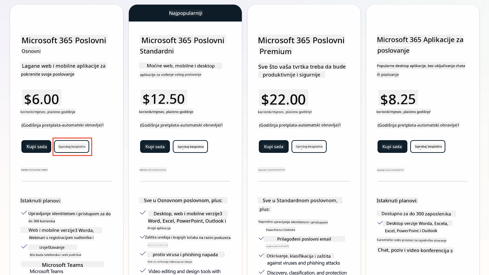  
   1. Nakon što dobijete novi račun, prijavite se.

    !!! Savjet
        Ako planirate objavljivati agente u Microsoft 365 Copilot Chat ili povezivati s organizacijskim podacima (SharePoint, OneDrive, Dataverse), potrebna je Microsoft 365 Copilot licenca. To je dodatna licenca o kojoj možete saznati više [na stranici o licenciranju](https://www.microsoft.com/microsoft-365/copilot#plans).

---

## Korak 2: Započnite probno razdoblje za Copilot Studio

Nakon što imate svoj Microsoft 365 Tenant, trebate dobiti pristup Copilot Studiju. Možete dobiti besplatno probno razdoblje od 30 dana slijedeći ove korake:

1. Idite na [aka.ms/TryCopilotStudio](https://aka.ms/TryCopilotStudio).  
1. Unesite email adresu novog računa koji ste konfigurirali u prethodnom koraku i odaberite `Dalje`.  
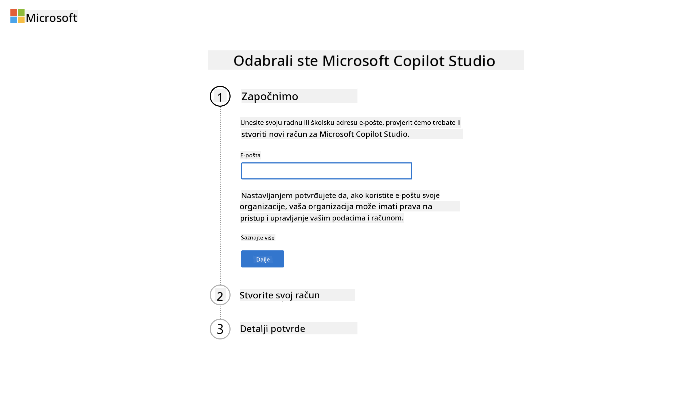  
1. Trebalo bi prepoznati vaš račun. Odaberite `Prijava`.  
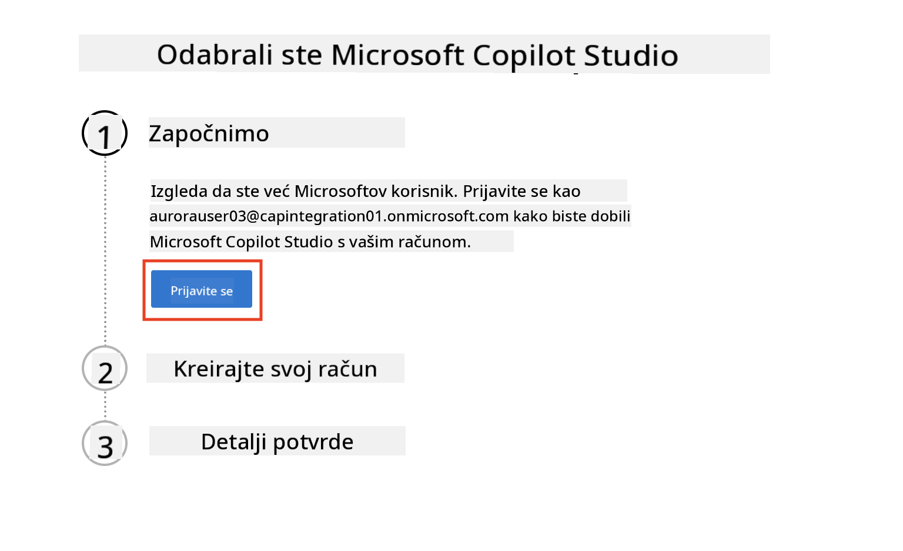  
1. Odaberite `Započni besplatno probno razdoblje`.  
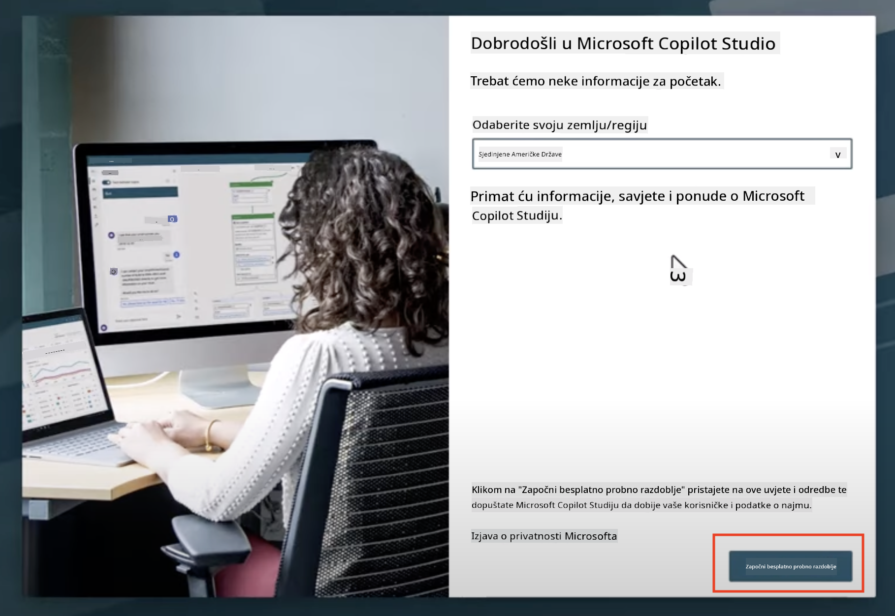

!!! info "Napomene o probnom razdoblju"  
     1. Besplatno probno razdoblje pruža **potpune mogućnosti Copilot Studija**.  
     1. Dobit ćete email obavijesti o isteku probnog razdoblja. Možete produžiti probno razdoblje u koracima od 30 dana (do 90 dana rada agenta).  
     1. Ako je vaš administrator tenanta onemogućio samostalnu prijavu, vidjet ćete grešku—kontaktirajte svog Microsoft 365 administratora kako bi je ponovno omogućio.

---

## Korak 3: Stvorite novo razvojno okruženje

### Prijavite se za Power Apps Developer Plan

Koristeći isti Microsoft 365 tenant iz Koraka 1, prijavite se za Power Apps Developer Plan kako biste stvorili besplatno razvojno okruženje za izradu i testiranje s Copilot Studijom.

1. Prijavite se na [web stranicu Power Apps Developer Plan](https://aka.ms/PowerAppsDevPlan).

    - Unesite svoju email adresu  
    - Označite kućicu  
    - Odaberite **Započni besplatno**

    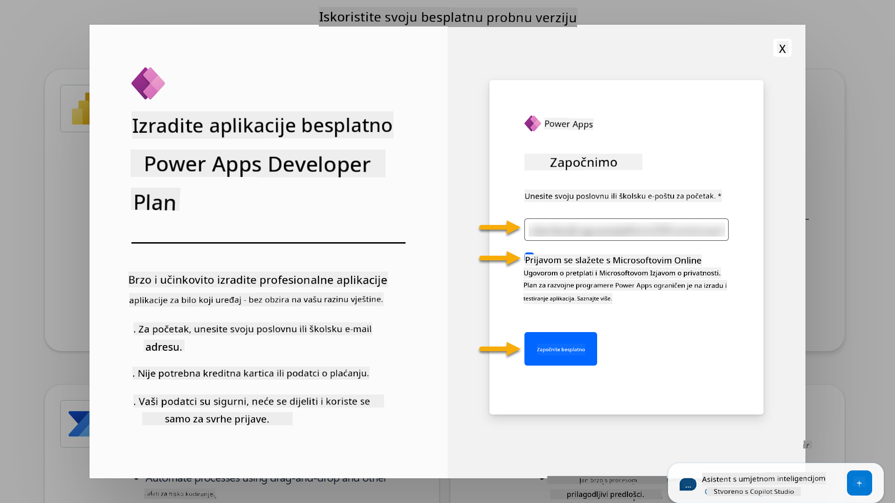

1. Nakon prijave za Developer Plan, bit ćete preusmjereni na [Power Apps](https://make.powerapps.com/). Okruženje koristi vaše ime, na primjer **Okruženje Adele Vance**. Ako već postoji okruženje s tim imenom, novo razvojno okruženje naziva se **Okruženje Adele Vance (1)**.

    Koristite ovo razvojno okruženje u Copilot Studiju prilikom dovršavanja laboratorija.

!!! Napomena
    Ako koristite postojeći Microsoft 365 račun i niste ga stvorili u Koraku 1, na primjer - koristite vlastiti račun u svojoj radnoj organizaciji, vaš IT administrator (ili ekvivalentni tim) koji upravlja vašim tenantom/okruženjima možda je isključio proces prijave. U tom slučaju, kontaktirajte svog administratora ili stvorite testni tenant prema Koraku 1.

---

## Korak 4: Stvorite novu SharePoint stranicu

Potrebno je stvoriti novu SharePoint stranicu koja će se koristiti u [Lekciji 06 - Stvaranje prilagođenog agenta koristeći iskustvo stvaranja razgovora s Copilotom i povezivanje s vašim podacima](../06-create-agent-from-conversation/README.md#62-add-an-internal-knowledge-source-using-a-sharepoint-site).

1. Odaberite ikonu "vafla" u gornjem lijevom kutu Microsoft Copilot Studija za prikaz izbornika. Odaberite SharePoint iz izbornika.

    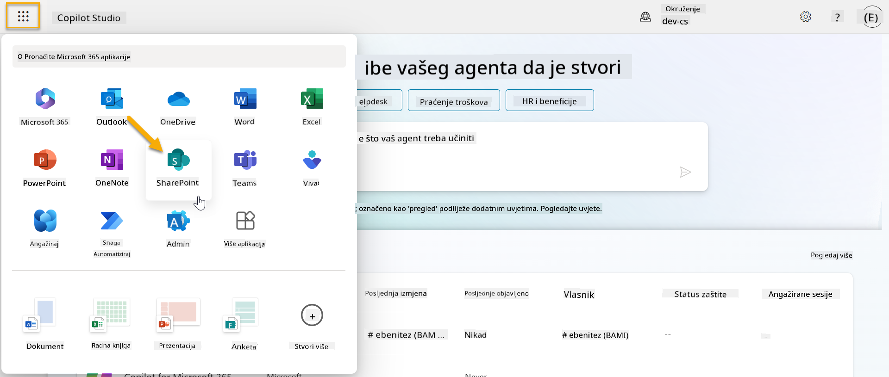

1. Učit će se SharePoint. Odaberite **+ Stvori stranicu** za stvaranje nove SharePoint stranice.

    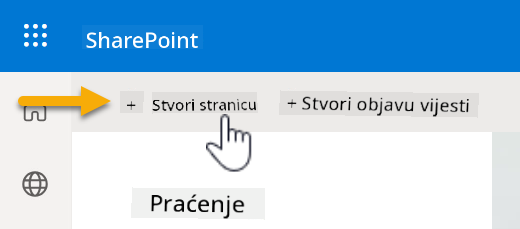

1. Pojavit će se dijalog koji će vas voditi kroz proces stvaranja nove SharePoint stranice. Odaberite **Timsku stranicu**.

    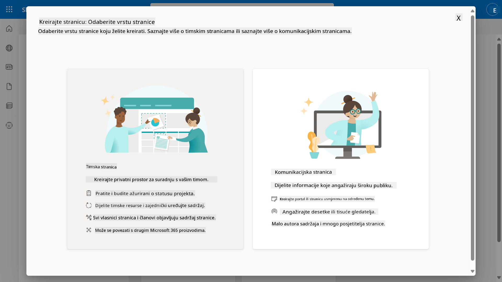

1. U sljedećem koraku, popis Microsoft predložaka će se učitati prema zadanim postavkama. Pomaknite se dolje i odaberite predložak **IT help desk**.

    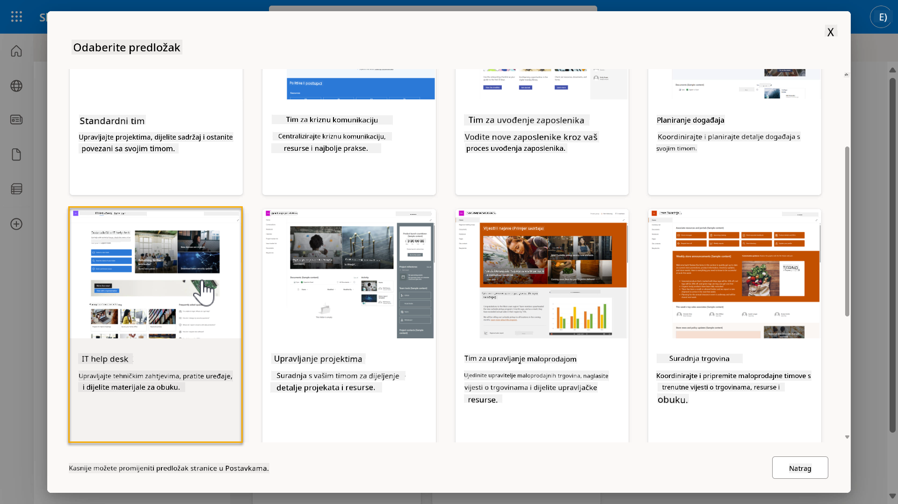

1. Odaberite **Koristi predložak** za stvaranje nove SharePoint stranice koristeći predložak IT help desk.

    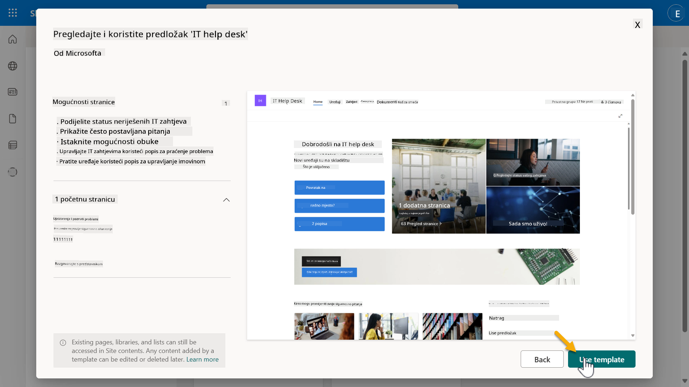

1. Unesite informacije za svoju stranicu. Sljedeći je primjer:

    | Polje | Vrijednost |
    | --- | --- |
    | Naziv stranice | Contoso IT |
    | Opis stranice | Copilot Studio za početnike |
    | Adresa stranice | ContosoIT |

    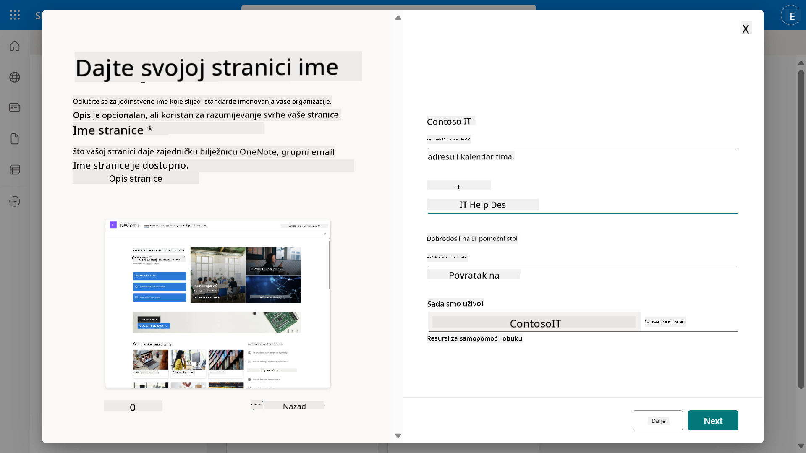

1. U završnom koraku, može se odabrati jezik za SharePoint stranicu. Prema zadanim postavkama bit će **Engleski**. Ostavite jezik kao **Engleski** i odaberite **Stvori stranicu**.

    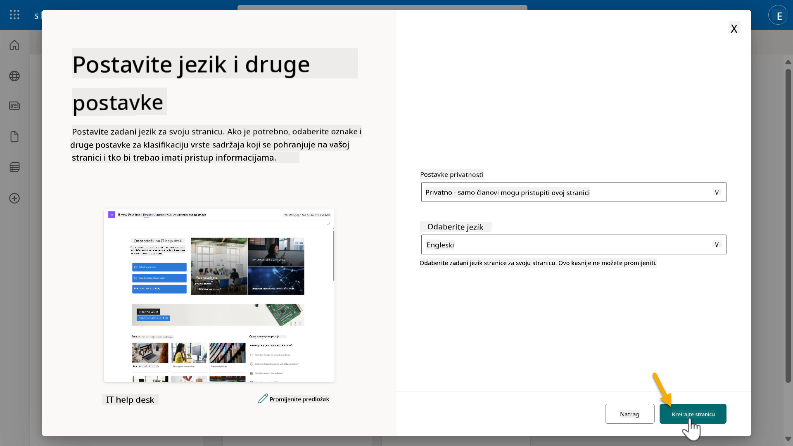

1. SharePoint stranica će se postaviti u sljedećih nekoliko sekundi. U međuvremenu, možete dodati druge korisnike na svoju stranicu unosom njihove email adrese u polje **Dodaj članove**. Kada završite, odaberite **Završi**.

    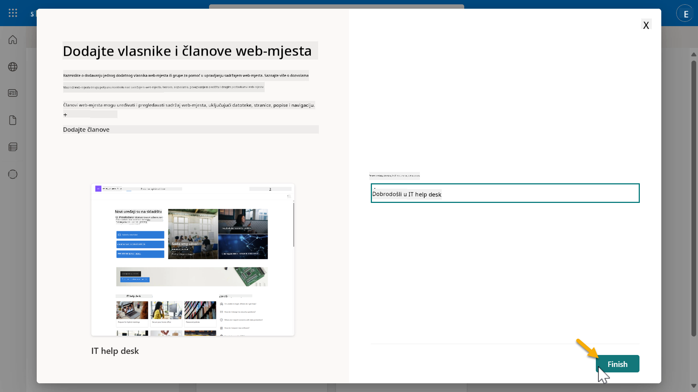

1. Zatim će se učitati početna stranica SharePoint stranice. **Kopirajte** URL SharePoint stranice.

1. Ovaj predložak pruža stranice s uzorcima podataka o raznim IT politikama i dvije uzorke popisa (Ulaznice i Uređaji).

### Koristite popis Uređaji na SharePoint stranici

Koristit ćemo popis **Uređaji** u [Misiji 07 - Dodavanje nove teme s okidačem i čvorovima](../07-add-new-topic-with-trigger/README.md#73-add-a-tool-using-a-connector).

### Dodajte novi stupac

Pomaknite se skroz desno na popisu i odaberite gumb **+ Dodaj stupac**. Odaberite tip **hiperveza**, unesite **Slika** kao naziv stupca i odaberite dodaj.

### Stvorite uzorke podataka u popisu Uređaji na SharePoint stranici

Morate osigurati da popunite ovaj popis s najmanje 4 uzorka podataka i dodate jedan dodatni stupac na ovaj popis.  

Prilikom dodavanja uzoraka podataka, osigurajte da su sljedeća polja popunjena:

- Fotografija uređaja - koristite slike iz [mape sa slikama uređaja](https://github.com/microsoft/agent-academy/tree/main/docs/recruit/00-course-setup/images/device-images)  
- Naslov  
- Status  
- Proizvođač  
- Model  
- Vrsta imovine  
- Boja  
- Serijski broj  
- Datum kupnje  
- Cijena kupnje  
- Broj narudžbe  
- Slika - koristite sljedeće poveznice  

|Uređaj  |URL  |
|---------|---------|
|Surface Laptop 13     | [https://raw.githubusercontent.com/microsoft/agent-academy/refs/heads/main/docs/recruit/00-course-setup/images/device-images/Surface-Laptop-13.png](https://raw.githubusercontent.com/microsoft/agent-academy/refs/heads/main/docs/recruit/00-course-setup/images/device-images/Surface-Laptop-13.png)        |
|Surface Laptop 15     | [https://raw.githubusercontent.com/microsoft/agent-academy/refs/heads/main/docs/recruit/00-course-setup/images/device-images/Surface-Laptop-15.png](https://raw.githubusercontent.com/microsoft/agent-academy/refs/heads/main/docs/recruit/00-course-setup/images/device-images/Surface-Laptop-15.png)        |
|Surface Pro    | [https://raw.githubusercontent.com/microsoft/agent-academy/refs/heads/main/docs/recruit/00-course-setup/images/device-images/Surface-Pro-12.png](https://raw.githubusercontent.com/microsoft/agent-academy/refs/heads/main/docs/recruit/00-course-setup/images/device-images/Surface-Pro-12.png)        |
|Surface Studio    | [https://raw.githubusercontent.com/microsoft/agent-academy/refs/heads/main/docs/recruit/00-course-setup/images/device-images/Surface-Studio.png](https://raw.githubusercontent.com/microsoft/agent-academy/refs/heads/main/docs/recruit/00-course-setup/images/device-images/Surface-Studio.png)        |

---

## ✅ Misija završena

Uspješno ste:

- Postavili Microsoft 365 razvojno okruženje  
- Aktivirali probno razdoblje za Copilot Studio  
- Stvorili SharePoint stranicu za povezivanje agenata  
- Popunili popis Uređaji za korištenje u budućim misijama  

Službeno ste spremni započeti svoju **obuku za agenta na razini regruta** u [Lekciji 01](../01-introduction-to-agents/README.md).  

<!-- markdownlint-disable-next-line MD033 -->

---

**Odricanje od odgovornosti**:  
Ovaj dokument je preveden pomoću AI usluge za prevođenje [Co-op Translator](https://github.com/Azure/co-op-translator). Iako nastojimo osigurati točnost, imajte na umu da automatski prijevodi mogu sadržavati pogreške ili netočnosti. Izvorni dokument na izvornom jeziku treba smatrati autoritativnim izvorom. Za ključne informacije preporučuje se profesionalni prijevod od strane čovjeka. Ne odgovaramo za nesporazume ili pogrešna tumačenja koja proizlaze iz korištenja ovog prijevoda.