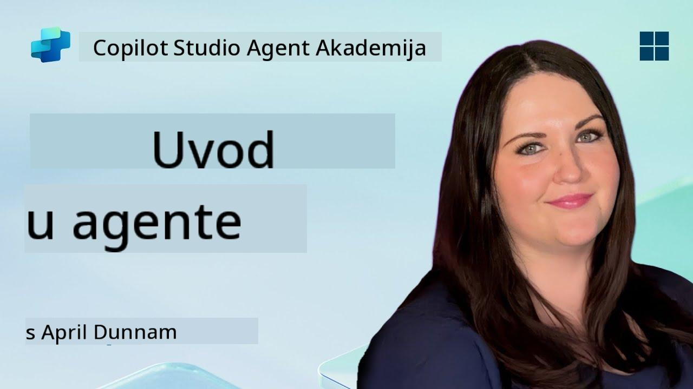

<!--
CO_OP_TRANSLATOR_METADATA:
{
  "original_hash": "d6706e107678264168d77b2e107710b1",
  "translation_date": "2025-10-20T23:32:42+00:00",
  "source_file": "docs/recruit/01-introduction-to-agents/README.md",
  "language_code": "hr"
}
-->
# 🚨 Misija 01: Uvod u agente

## 🕵️‍♂️ KODNO IME: `OPERACIJA DEKODIRANJA AI AGENTA`

> **⏱️ Vrijeme trajanja operacije:** `~30 minuta – samo informacije, bez terenskog rada`

🎥 **Pogledajte vodič**

## 🎯 Kratak opis misije

Dobrodošli, regruti. Prije nego što se upustimo u izradu agenata, potrebno je da dobro razumijete AI koncepte koji ih pokreću. Ova misija će vas opremiti temeljnim znanjem o konverzacijskom AI-u, velikim jezičnim modelima (LLMs), generiranju uz pomoć pretraživanja (RAG) i vrstama agenata koje možete kreirati u Copilot Studiju.

## 🔎 Ciljevi

U ovoj misiji naučit ćete:

1. Što je konverzacijski AI i zašto je važan  
1. Kako veliki jezični modeli (LLMs) pokreću iskustva razgovora  
1. Što generiranje uz pomoć pretraživanja (RAG) donosi  
1. Razliku između konverzacijskih agenata i autonomnih agenata  
1. Kako agenti u Copilot Studiju koriste ove koncepte  

Krenimo!

---

## Što je konverzacijski AI?

Konverzacijski AI odnosi se na svaki sustav koji može razumjeti, obraditi i odgovoriti na ljudski jezik – bilo tekstualno ili govorno – na način koji se čini prirodnim. Pomislite na chatbotove u korisničkim službama ili virtualne osobne asistente u vašim omiljenim aplikacijama. Ispod površine, većina modernih konverzacijskih AI sustava oslanja se na velike jezične modele (LLMs), o kojima ćemo govoriti u nastavku.

### Zašto je važan

- **Korisničko iskustvo:** Konverzacijska sučelja često su intuitivnija od klikanja kroz izbornike.  
- **Skalabilnost:** Jedan agent može istovremeno voditi desetke ili stotine razgovora.  
- **Učinkovitost:** Umjesto izrade prilagođenih skripti temeljenih na pravilima, agenti pokretani LLM-ovima prilagođavaju se korisničkom unosu u stvarnom vremenu.  
- **Proširivost:** Uz pravilan dizajn, agenti mogu pristupiti bazama znanja, povezati se s API-jevima ili djelovati kao "digitalni suradnici" unutar poslovnih procesa.

---

## Veliki jezični modeli (LLMs) 101

U središtu većine konverzacijskih AI sustava nalaze se **veliki jezični modeli** – neuronske mreže trenirane na ogromnim korpusima teksta. Oni uče statističke obrasce jezika kako bi mogli generirati koherentne rečenice, odgovarati na pitanja ili čak smišljati ideje. Ključne točke koje treba razumjeti:

1. **Podaci za treniranje:** LLM-ovi obrađuju terabajte teksta (web stranice, knjige, članke). Ovo "znanje o svijetu" omogućuje im odgovaranje na mnoge teme.  
1. **Tokenizacija:** Tekst se razbija na manje jedinice zvane tokeni (riječi, podriječi ili znakovi). Model predviđa jedan token po jedan.  
1. **Prozor konteksta:** Svaki LLM ima ograničenje koliko tokena može "vidjeti" odjednom. Iznad tog ograničenja, prethodni tokeni se skraćuju.  
1. **Prompting:** S LLM-om komunicirate slanjem prompta. Što je vaš prompt bolji, to je odgovor fokusiraniji i relevantniji.  
1. **Zero-shot vs. Fine-tuning:** Zero-shot znači korištenje LLM-a kakav jest (samo sirovi podaci). Fine-tuning znači prilagodbu modela na specifične podatke kako bi odgovarao preciznije vašim potrebama.

!!! Tip "Profesionalni savjet"
    Uobičajena analogija je da je LLM poput "super-pametnog automatskog dovršavanja". Ne razumije značenje kao ljudski mozak, ali je izuzetno dobar u predviđanju sljedeće najbolje riječi (ili fraze) u nizu.

---

## Generiranje uz pomoć pretraživanja (RAG)

Kada se LLM-ovi oslanjaju isključivo na statične podatke za treniranje, mogu generirati netočne informacije ili postati zastarjeli. RAG to rješava omogućujući modelu da "pronađe" svježe informacije prije nego što sastavi odgovor. Na visokoj razini, RAG funkcionira ovako:

1. **Upit korisnika:** Korisnik postavlja pitanje (npr., "Što je novo u kvartalnim prihodima Contoso-a?").  
1. **Korak pretraživanja:** Sustav pretražuje izvor znanja (dokumente, interne baze podataka, SharePoint biblioteke itd.) kako bi pronašao relevantne odlomke.  
1. **Augmentacija:** Pronađeni odlomci se dodaju ili prethode promptu LLM-a.  
1. **Generiranje:** LLM obrađuje i korisničko pitanje i pronađeni kontekst, te generira odgovor temeljen na ažuriranim podacima.  

Uz RAG, vaš agent može pristupiti internim wiki stranicama tvrtke, API dodacima ili pretražiti bazu znanja FAQ – i vratiti odgovore koji nisu ograničeni na statički objavljene parametre modela.

---

## Konverzacijski vs. autonomni agenti

U kontekstu Copilot Studija, pojam **agent** može se odnositi na različite vrste AI asistenata. Korisno je povući granicu između:

**Konverzacijskih agenata:**

- Primarno se fokusiraju na dvosmjerni dijalog.  
- Čuvaju kontekst kroz više izmjena u razgovoru.  
- Obično se orkestriraju putem unaprijed definiranih tokova ili okidača (npr., "Ako korisnik kaže X, odgovori s Y").  
- Idealni za korisničku podršku, FAQ, vođene interakcije, zakazivanje ili jednostavna pitanja i odgovore.  
  - Primjeri:  
    - Chatbot za Teams koji odgovara na pitanja o HR politikama.  
    - Bot Power Virtual Agents na SharePoint stranici koji vodi korisnike kroz obrazac.  

**Autonomni agenti:**

- Idite dalje od jednostavnog razgovora; mogu **poduzimati radnje** u ime korisnika.  
- Koriste LLM petlje zaključivanja (razmislite o "plan → djelovanje → promatranje → ponovno planiranje") za dovršavanje zadataka.  
- Povezuju se s vanjskim alatima ili API-jevima (npr., pokretanje Power Automate toka, slanje pozivnica za kalendar, manipulacija podacima u Dataverseu).  
- Djeluju bez stalnih korisničkih upita – jednom pokrenuti, mogu autonomno upravljati višestupanjskim procesima.  
  - Primjeri:  
    - Agent koji generira plan putovanja, rezervira letove i šalje potvrde putem e-pošte.  
    - Agent "Sažetak sastanka" koji se pridružuje pozivu na Teamsu, transkribira ga u stvarnom vremenu i piše izvršni sažetak u OneNote.  

!!! Info "Ključna razlika"
    Konverzacijski agenti čekaju unos korisnika i drže se dijaloga. Autonomni agenti proaktivno planiraju i izvršavaju niz koraka koristeći širi pristup alatima.

---

## Agenti u Copilot Studiju

**Copilot Studio** objedinjuje i konverzacijske i autonomne scenarije u jedinstvenom okviru. Evo kako Copilot Studio pomaže u izradi agenata:

1. **Vizualni dizajner agenata:** Platno s malo koda za definiranje promptova, memorije i alata za chat i akcijske tokove.  
1. **Konfiguracije LLM-a:** Odaberite između različitih OpenAI modela ili Microsoftovog GPT-a poslovne klase kako biste prilagodili performanse i troškove.  
1. **Konektori za pretraživanje:** Unaprijed izrađene integracije za SharePoint, OneDrive, Azure Cognitive Search i Dataverse, omogućujući RAG odmah.  
1. **Prilagođeni alati i funkcije:** Definirajte prilagođene HTTP akcije ili Power Automate tokove koje vaš agent može autonomno pozvati.  
1. **Podrška za više modaliteta:** Osim teksta, agenti Copilot Studija mogu obrađivati slike, datoteke ili strukturirane podatke za obogaćivanje konteksta.  
1. **Objavljivanje i distribucija:** Kada je vaš agent spreman, možete ga objaviti na Microsoft 365 Copilot (tako da ga korisnici mogu pozvati u Teamsu, SharePointu, Outlooku itd.) ili ga ugraditi kao samostalni chat widget na web stranici.

---

## 🎉 Misija završena

Sada ste završili uvod u agente i temeljne AI koncepte. Razumijete:

1. **LLMs = "Mozak" vašeg agenta**  
   - Zadužen za razumijevanje jezika i generiranje.  
   - Više tokena = bogatiji kontekst, ali i veći trošak po pozivu.  

1. **RAG = Integracija znanja u stvarnom vremenu**  
   - Povezuje jaz između statičnog LLM-a i stalno promjenjivih izvora podataka.  
   - Pretražuje i ubacuje relevantne dokumente ili zapise u prompt LLM-a.  

1. **Konverzacijski vs. autonomni**  
   - **Konverzacijski:** Fokus na tok dijaloga i očuvanje konteksta (npr., "Memorija sesije").  
   - **Autonomni:** Dodaju "Blokove akcije" koji omogućuju agentu da se poveže s vanjskim alatima ili uslugama.

---
Sljedeće, istražit ćete [osnove Copilot Studija](../02-copilot-studio-fundamentals/README.md)!

Ostanite oštri, regruti - vaše AI putovanje tek počinje!

## 📚 Taktički resursi

🔗 [Početna stranica dokumentacije Copilot Studija](https://learn.microsoft.com/microsoft-copilot-studio/)

---

---

**Izjava o odricanju odgovornosti**:  
Ovaj dokument je preveden pomoću AI usluge za prevođenje [Co-op Translator](https://github.com/Azure/co-op-translator). Iako nastojimo osigurati točnost, imajte na umu da automatski prijevodi mogu sadržavati pogreške ili netočnosti. Izvorni dokument na izvornom jeziku treba smatrati autoritativnim izvorom. Za ključne informacije preporučuje se profesionalni prijevod od strane ljudskog prevoditelja. Ne preuzimamo odgovornost za nesporazume ili pogrešna tumačenja koja mogu proizaći iz korištenja ovog prijevoda.