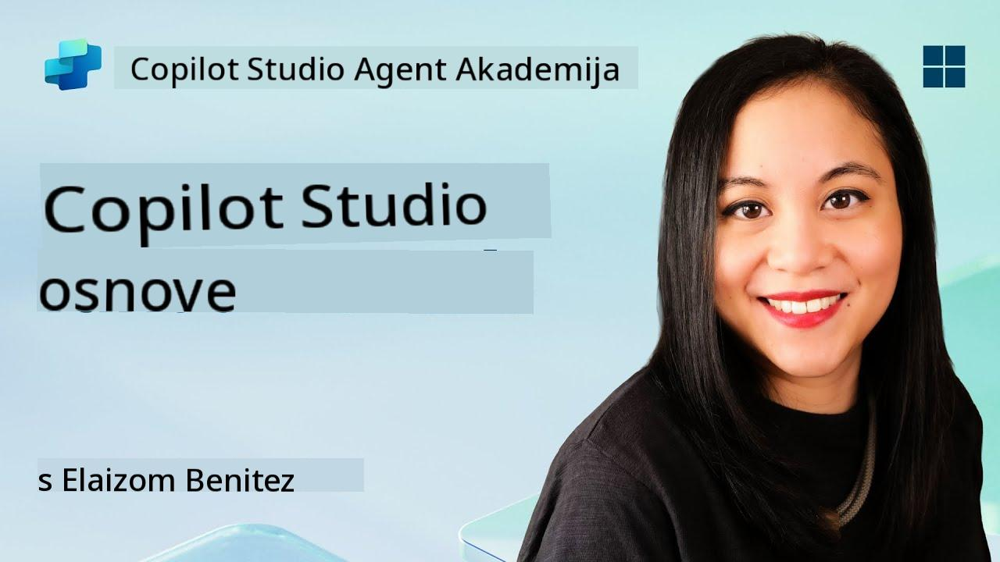
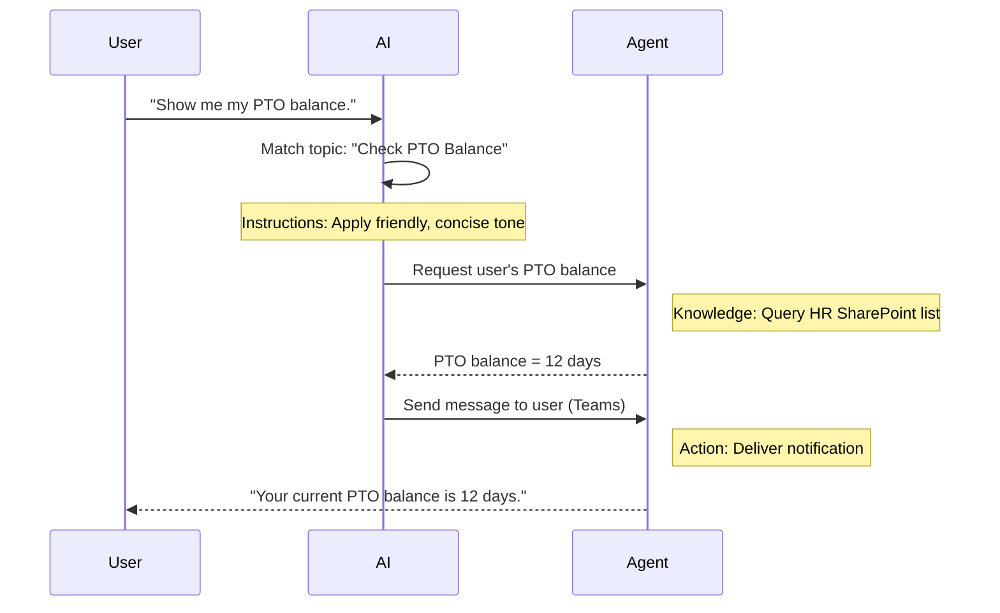

<!--
CO_OP_TRANSLATOR_METADATA:
{
  "original_hash": "90a3c5122f5687bbc8cc819990f175d4",
  "translation_date": "2025-10-20T23:55:36+00:00",
  "source_file": "docs/recruit/02-copilot-studio-fundamentals/README.md",
  "language_code": "hr"
}
-->
# 🚨 Misija 02: Osnove Copilot Studija

## 🕵️‍♂️ KODNO IME: `OPERACIJA OSNOVNI PROTOKOL`

> **⏱️ Vrijeme trajanja operacije:** `~30 minuta – samo prikupljanje informacija, bez terenskog rada`  

🎥 **Pogledajte vodič**

[](https://www.youtube.com/watch?v=x4OCwDRGeLE "Pogledajte vodič na YouTubeu")

## 🎯 Kratak opis misije

Dobrodošli, regrute. Ova misija će vas opremiti osnovnim znanjem o tome kako funkcionira Copilot Studio i kako izraditi inteligentne agente koji donose stvarnu poslovnu vrijednost.

Prije nego što izradite svog prvog agenta, trebate razumjeti četiri ključne komponente koje čine svakog prilagođenog AI agenta: Znanje, Alati, Teme i Upute. Također ćete naučiti kako ti elementi surađuju unutar orkestratora Copilot Studija.

## 🔎 Ciljevi

U ovoj misiji ćete:

- **Naučiti što je Copilot Studio**
- **Naučiti kada i zašto koristiti agente**
- **Istražiti četiri gradivna bloka agenata**
      - **Znanje**
      - **Alati**
      - **Teme**
      - **Upute**
- **Razumjeti kako te komponente surađuju** kako bi stvorile inteligentnog, automatiziranog agenta

---

## Što su agenti u Copilot Studiju?

**Agent** je specijalizirani AI asistent kojeg dizajnirate za obavljanje specifičnih zadataka ili odgovaranje na upite. Za razliku od općeg chatbota, vaš agent:

- **Poznaje podatke specifične za vašu tvrtku** (politike, dokumente, baze podataka)  
- **Obavlja stvarne zadatke** (šalje poruke, kreira događaje u kalendaru, ažurira zapise)  
- **Održava kontekst razgovora** kako bi mogao nastaviti na temelju prethodnih pitanja  

Budući da je Copilot Studio low-code alat, možete jednostavno povlačiti i ispuštati unaprijed izrađene komponente—bez potrebe za dubokim znanjem programiranja. Kada je vaš agent izrađen, korisnici ga mogu koristiti unutar Teamsa, Slacka ili čak prilagođene web stranice za dobivanje odgovora ili automatsko pokretanje radnih procesa.

---

## Kada i zašto koristiti Copilot Studio

Dok Microsoft 365 Copilot pruža opću AI podršku unutar Office aplikacija, prilagođeni agenti su korisni kada:

### Trebate specifično znanje o domeni

- Standardni Copilot možda neće znati interne procedure ili podatke vaše tvrtke. Agent može pretraživati vaše SharePoint stranice, baze podataka ili prilagođene izvore kako bi pružio točne i ažurirane odgovore.  

### Želite automatizirati višekorake radne procese

- Na primjer: "Kada netko podnese trošak, pošalji ga na odobrenje, ažuriraj financijski tracker i obavijesti menadžera." Prilagođeni agent može obaviti svaki korak, pokrenut jednim naredbom ili događajem.  

### Trebate kontekstualno iskustvo unutar alata  

- Zamislite agenta za onboarding novih zaposlenika u Teamsu koji vodi HR osoblje kroz svaku politiku, šalje potrebne obrasce i zakazuje orijentacijske sastanke—direktno unutar postojećeg alata za suradnju.  

---

## Četiri gradivna bloka agenta

Svaki Copilot Studio agent sastoji se od četiri osnovne komponente:

1. **Znanje**  
1. **Alati (Akcije)**  
1. **Teme**  
1. **Upute**

U nastavku ćemo definirati svaki gradivni blok i pokazati kako surađuju kako bi stvorili učinkovitog agenta.

### 1. Znanje

**Znanje** su podaci i kontekst koje vaš agent koristi za točno odgovaranje na pitanja. Sastoji se od dva dijela:

#### Prilagođene upute i kontekst

- Pišete kratak opis svrhe i tona agenta. Na primjer:  

    ```text
    You are an IT support agent. You help employees troubleshoot common software issues, provide troubleshooting steps, and escalate urgent tickets.
    ```

- Tijekom razgovora, agent pamti prethodne korake kako bi se mogao referirati na ono što je već raspravljeno (na primjer, ako korisnik prvo kaže: "Moj printer ne radi," a kasnije pita: "Jesi li provjerio razinu tinte?" agent se prisjeća konteksta o printeru).

#### Izvori znanja (Osnovni podaci)

- Povezujete svog agenta s više izvora podataka—SharePoint knjižnicama, dokumentacijskim stranicama, wikijima ili drugim bazama podataka.  
- Kada korisnik postavi pitanje, agent izvlači relevantne dijelove iz tih izvora kako bi odgovori bili **temeljeni** na stvarnim politikama vaše organizacije, priručnicima proizvoda ili bilo kojim vlasničkim informacijama.  
- Možete čak prisiliti agenta da odgovara isključivo na temelju tih izvora, sprječavajući nagađanje ili "haluciniranje" odgovora.

!!! example
    Agent "Pomoćnik za politike" mogao bi se povezati s vašom HR SharePoint stranicom. Ako korisnik pita: "Koja je stopa akumulacije PTO-a?" agent će dohvatiti točan tekst iz dokumenta o HR politici umjesto da se oslanja na generički AI odgovor.

---

### 2. Alati (Akcije)

**Alati (Akcije)** definiraju što agent može učiniti osim razgovora. Svaka akcija je zadatak koji agent programatski izvršava, kao što su:

- Slanje e-pošte ili poruke putem Teamsa  
- Kreiranje ili ažuriranje događaja u kalendaru  
- Dodavanje ili uređivanje zapisa u bazi podataka (npr. SharePoint listi ili Dataverse tablici)  
- Pozivanje Power Automate toka ili REST API-ja  

#### Kako funkcioniraju akcije

- **Definiranje ulaza i izlaza**  
      - Na primjer, akcija slanja e-pošte može zahtijevati:  
        - `RecipientEmailAddress`  
        - `SubjectLine`  
        - `EmailBody`  

- **Kombiniranje akcija u radne procese**  
      - Često ispunjavanje korisničkog zahtjeva uključuje više koraka.  
      - Možete povezati akcije tako da:  
             1. Agent dohvaća podatke s SharePoint liste.  
             2. Generira sažetak koristeći LLM.  
             3. Šalje poruku putem Teamsa s tim sažetkom.  

- **Povezivanje s vanjskim sustavima**  
      - Ako trebate ažurirati CRM ili pozvati interni API, kreirajte prilagođenu akciju za to.  
      - Copilot Studio može se integrirati s Power Platformom ili bilo kojim HTTP-based endpointom.

!!! example "Agent "Pomoćnik za troškove" mogao bi:"  
    1. Slušati zahtjev "Podnesi trošak".  
    2. Dohvatiti detalje troška korisnika iz obrasca.  
    3. Koristiti akciju "Dodaj na SharePoint listu" za pohranu podataka.  
    4. Pokrenuti akciju "Pošalji e-poštu" kako bi obavijestio odobravatelja.  

---

### 3. Teme

**Teme** definiraju okidače za razgovor ili ulazne točke za vašeg agenta. Svaka tema odgovara određenoj funkcionalnosti ili kategoriji pitanja.

#### Okidači za razgovor  

- Tema može biti "Podnesi IT zahtjev," "Provjeri stanje godišnjeg odmora," ili "Kreiraj izvještaj o prodaji."  
- U pozadini, Copilot Studio koristi **generativnu orkestraciju**: umjesto oslanjanja na točne ključne riječi, AI interpretira namjeru korisnika i odabire pravu temu na temelju kratkog opisa koji pružite.  

#### Opisi tema  

- U svakoj temi, pišete jasan i sažet opis onoga što ta tema pokriva.

!!! example "Primjer opisa teme"
    Ova tema pomaže korisnicima da podnesu IT zahtjev za podršku prikupljanjem detalja o problemu, prioriteta i kontaktnih informacija.

- AI koristi taj opis kako bi odlučio kada aktivirati ovu temu, čak i ako korisnikova formulacija nije potpuno ista.

#### Povezivanje tema s akcijama  

- Svaka tema je povezana s jednom ili više akcija ili koraka za dohvaćanje podataka.  
- Kada AI odabere temu, vodi razgovor kroz sekvencu koju ste definirali (postavlja dodatna pitanja, poziva akcije, vraća rezultate).

!!! example
    Ako korisnik kaže: "Trebam pomoć s postavljanjem novog laptopa," AI bi mogao povezati tu namjeru s temom "Podnesi IT zahtjev". Agent tada traži model laptopa, korisničke podatke i automatski šalje zahtjev u sustav za podršku.

---

### 4. Upute

**Upute** (ponekad nazvane "Upiti" ili "Sistemske poruke") usmjeravaju ton, stil i granice LLM-a. One oblikuju način na koji agent odgovara u svakoj situaciji.

#### Uloga i persona  

- Kažete AI-u tko je (npr. "Vi ste agent za korisničku podršku za Contoso Retail").  
- Ovo postavlja ton—prijateljski, sažet, formalan ili neformalan—ovisno o vašem slučaju korištenja.

#### Smjernice za odgovore  

- Navedite pravila kojih se agent mora pridržavati, kao što su:  
      - "Uvijek sažmi informacije o politici u točke."  
      - "Ako ne znaš odgovor, reci ‘Žao mi je, nemam te informacije.’"  
      - "Nikada ne uključuj povjerljive podatke izvan konteksta."

#### Pravila za pamćenje i kontekst

- Možete uputiti agenta koliko koraka razgovora treba zapamtiti.  
- Na primjer: "Zapamti detalje iz zahtjeva ovog korisnika za do tri dodatna pitanja."

!!! example "U agentu "Savjetnik za beneficije" možete uključiti:"
    "Uvijek se referiraj na najnoviji HR priručnik prilikom odgovaranja na pitanja. Ako te pitaju o rokovima za prijavu, navedi točne datume iz politike. Drži odgovore ispod 150 riječi."

---

## Kako četiri gradivna bloka surađuju

Kada sastavite **Znanje**, **Alate**, **Teme** i **Upute**, AI orkestrator Copilot Studija stvara agenta koji:

1. **Prepoznaje relevantnu temu** (vođen opisima tema).  
1. **Primjenjuje upute** kako bi odredio ton, odlučio kada postaviti dodatna pitanja i provodio pravila.  
1. **Koristi izvore znanja** kako bi odgovori bili temeljeni na podacima vaše organizacije.  
1. **Poziva alate (akcije)** prema potrebi za obavljanje zadataka—slanje poruka, ažuriranje zapisa ili pozivanje API-ja.  

U pozadini, orkestrator koristi pristup **generativnog planiranja**: odlučuje koje korake poduzeti, kojim redoslijedom, kako bi ispunio korisnički zahtjev. Ako akcija ne uspije (na primjer, e-pošta se ne može poslati), agent slijedi vaše smjernice za rukovanje iznimkama (postavlja dodatno pitanje ili prijavljuje grešku). Budući da se LLM prilagođava kontekstu razgovora, agent može održavati pamćenje kroz više koraka i uključiti nove informacije kako se razgovor razvija.

**Primjer vizualnog toka:**  
<!--
1. **Korisnik:** "Pokaži mi stanje mog godišnjeg odmora."
1. **AI (Teme):** Povezuje s temom "Provjeri stanje godišnjeg odmora".  
1. **AI (Upute):** Koristi prijateljski, sažet ton.  
1. **Agent (Znanje):** Pretražuje HR SharePoint listu za stanje korisnikovog odmora.  
1. **Agent (Akcije):** Dohvaća vrijednost i šalje poruku putem Teamsa:  
   > "Vaše trenutno stanje godišnjeg odmora je 12 dana."  
-->



---

## 🎉 Misija završena

Uspješno ste završili osnovni brifing. Sada ste naučili četiri ključna gradivna bloka svakog agenta u Copilot Studiju:

1. **Znanje** – Gdje agent traži točne informacije i održava pamćenje razgovora.  
1. **Alati** – Zadaci koje agent može obaviti kako bi stvari automatski funkcionirale.  
1. **Teme** – Kako agent prepoznaje namjeru korisnika i odlučuje koji radni proces pokrenuti.  
1. **Upute** – Pravila, ton i granice koje usmjeravaju svaki odgovor.

S ovim komponentama možete izraditi osnovnog agenta koji odgovara na pitanja i izvršava jednostavne radne procese. U sljedećoj lekciji, proći ćemo korak po korak kroz izradu agenta "Servisni desk"—od povezivanja vašeg prvog izvora znanja do definiranja teme i povezivanja akcije.

Sljedeće: Izradit ćete [prvog deklarativnog agenta za M365 Copilot](../03-create-a-declarative-agent-for-M365Copilot/README.md).

<!-- markdownlint-disable-next-line MD033 -->


---

**Izjava o odricanju odgovornosti**:  
Ovaj dokument je preveden pomoću AI usluge za prevođenje [Co-op Translator](https://github.com/Azure/co-op-translator). Iako nastojimo osigurati točnost, imajte na umu da automatski prijevodi mogu sadržavati pogreške ili netočnosti. Izvorni dokument na izvornom jeziku treba smatrati autoritativnim izvorom. Za ključne informacije preporučuje se profesionalni prijevod od strane čovjeka. Ne preuzimamo odgovornost za nesporazume ili pogrešna tumačenja koja proizlaze iz korištenja ovog prijevoda.