<!--
CO_OP_TRANSLATOR_METADATA:
{
  "original_hash": "0c51aabca81d6256990caf4c015e6195",
  "translation_date": "2025-10-20T23:35:20+00:00",
  "source_file": "docs/recruit/04-creating-a-solution/README.md",
  "language_code": "hr"
}
-->
# 🚨 Misija 04: Kreiranje rješenja za vašeg agenta

## 🕵️‍♂️ KODNO IME: `OPERACIJA CTRL-ALT-PAKET`

> **⏱️ Vrijeme operacije:** `~45 minuta`

🎥 **Pogledajte vodič**

[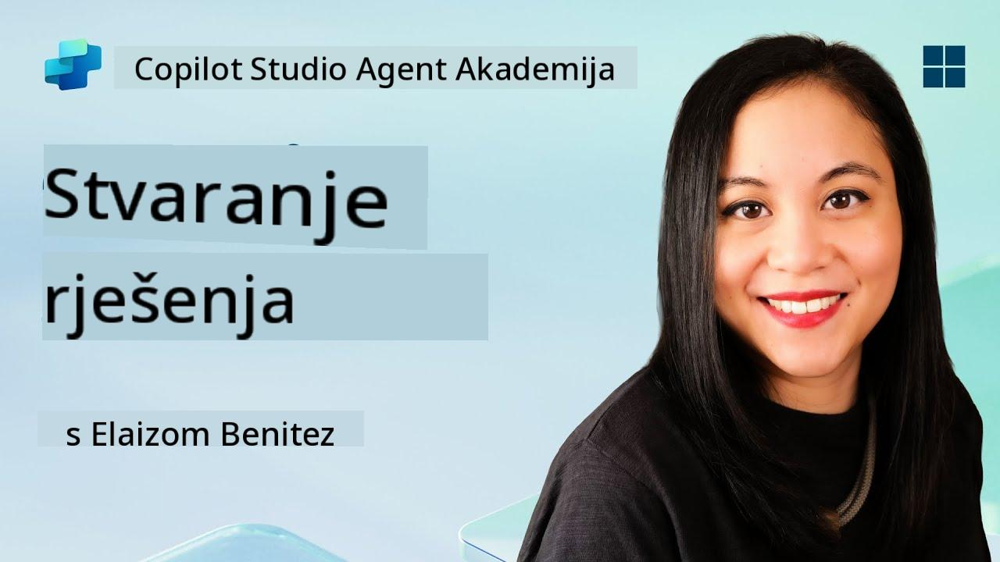](https://www.youtube.com/watch?v=1iATbkgfcpU "Pogledajte vodič na YouTubeu")

## 🎯 Opis misije

Agent Maker, dobrodošli u vašu sljedeću taktičku operaciju. U ovoj misiji naučit ćete kako sastaviti Rješenje - službeno sredstvo za implementaciju vašeg IT Helpdesk agenta izrađenog pomoću Microsoft Copilot Studija. Zamislite to kao digitalnu aktovku koja sadrži vašeg agenta i njegove artefakte.

Svaki agent treba dobro strukturiran dom. To je ono što Power Platform rješenje pruža - red, prenosivost i spremnost za produkciju.

Krenimo s pakiranjem.

## 🔎 Ciljevi

U ovoj misiji naučit ćete:

1. Razumjeti što su Power Platform rješenja i njihovu ulogu u razvoju agenata
1. Naučiti prednosti korištenja rješenja za organizaciju i implementaciju agenata
1. Istražiti izdavače rješenja i njihovu važnost u upravljanju komponentama
1. Razumjeti životni ciklus Power Platform rješenja od razvoja do produkcije
1. Kreirati vlastitog izdavača rješenja i prilagođeno rješenje za vašeg IT Helpdesk agenta

## 🕵🏻‍♀️ Rješenje? Što je to?

U Microsoft Power Platformu, rješenja su poput spremnika ili paketa koji sadrže sve dijelove vaših aplikacija ili agenata - to mogu biti tablice, obrasci, tokovi i prilagođena logika. Rješenja su ključna za upravljanje životnim ciklusom aplikacija (ALM), omogućujući vam upravljanje aplikacijom i agentima od ideje do razvoja, testiranja, implementacije i ažuriranja.

U Copilot Studiju, svaki agent koji kreirate pohranjuje se u Power Platform rješenje. Prema zadanim postavkama, agenti se kreiraju u zadanim rješenjima, osim ako ne kreirate novo prilagođeno rješenje za kreiranje vašeg agenta. To ćemo naučiti 🤓 u ovoj lekciji i praktičnoj radionici.

Rješenja su se tradicionalno kreirala u **Power Apps maker portalu** - web sučelju gdje možete izraditi i prilagoditi aplikacije, Dataverse, tokove, istraživati AI komponente i više.

   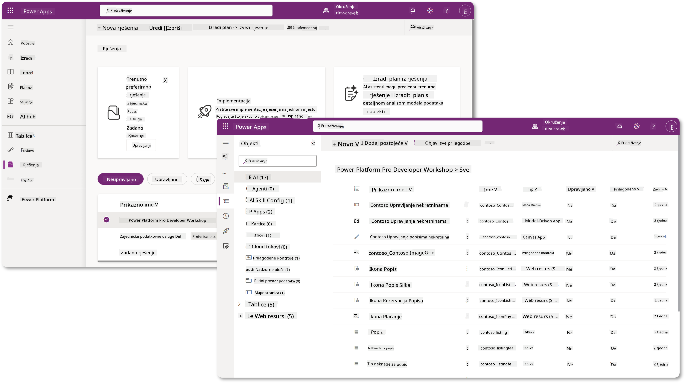

U Copilot Studiju sada postoji **Solution Explorer** gdje možete upravljati svojim rješenjima izravno. Više nije potrebno prelaziti na Power Apps maker portal za upravljanje rješenjima, to se može učiniti unutar Copilot Studija 🪄

To znači da možete obavljati uobičajene zadatke vezane uz rješenja:

- **Kreirati rješenje** - prilagođena rješenja omogućuju agentima da se izvoze i uvoze između okruženja.
- **Postaviti preferirano rješenje** - odabrati rješenje u kojem će agenti, aplikacije itd. biti kreirani prema zadanim postavkama.
- **Dodati ili ukloniti komponente** - vaš agent može referencirati druge komponente poput varijabli okruženja ili tokova u oblaku. Stoga te komponente trebaju biti uključene u rješenje.
- **Izvoziti rješenja** - za premještanje rješenja u drugo ciljno okruženje.
- **Uvoziti rješenja** - uvoziti rješenja kreirana drugdje, uključujući nadogradnju ili ažuriranje rješenja.
- **Kreirati i upravljati cjevovodima rješenja** - automatizirati implementaciju rješenja između okruženja.
- **Git integracija** - omogućuje programerima povezivanje rješenja s Git repozitorijima za kontrolu verzija, suradnju i ALM. Namijenjeno za korištenje samo u razvojnim okruženjima.

   

Postoje dvije vrste rješenja:

- **Neupravljana rješenja** - koriste se tijekom razvoja. Možete ih slobodno uređivati i prilagođavati prema potrebi.
- **Upravljana rješenja** - koriste se kada ste spremni implementirati aplikaciju u testiranje ili produkciju. Ova su zaključana kako bi se spriječile slučajne promjene.

## 🤔 Zašto _trebam_ koristiti rješenje za svog agenta?

Zamislite rješenja kao _kutiju s alatima_. Kada trebate popraviti ili izgraditi nešto (agenta) na drugoj lokaciji (okruženju), skupite sve potrebne alate (komponente) i stavite ih u svoju kutiju s alatima (Rješenje). Zatim možete prenijeti ovu kutiju na novu lokaciju (okruženje) i koristiti alate (komponente) za dovršavanje posla ili dodavanje novih alata (komponenti) za prilagodbu vašeg agenta ili projekta koji gradite.

!!! quote "Elaiza, vaša prijateljska zagovornica oblaka javlja se ovdje 🙋🏻‍♀️ da podijeli nekoliko riječi:"
    Imamo izreku na Novom Zelandu, "Budi uredan Kiwi!" što je poziv na akciju za Novozelanđane 🥝 da preuzmu odgovornost za svoje okruženje pravilnim odlaganjem otpada i održavanjem javnih prostora čistima. Isti kontekst možemo primijeniti na agente tako da sve vezano uz vašeg agenta bude organizirano i prenosivo, što će vam pomoći održati uredno okruženje.

Dobro je pravilo kreirati agenta u posvećenom rješenju u vašem izvornom (razvojnom) okruženju. Evo zašto su rješenja vrijedna:

🧩 **Organizirani razvoj**

- Držite svog agenta odvojenim od zadanog rješenja koje sadrži sve u okruženju. Sve komponente vašeg agenta nalaze se na jednom mjestu 🎯

- Sve što vam treba za vašeg agenta nalazi se u rješenju, što olakšava izvoz i uvoz u ciljno okruženje 👉🏻 ovo je zdrava praksa ALM-a.

🧩 **Sigurna implementacija**

- Možete izvesti svoju aplikaciju ili agenta kao upravljano rješenje i implementirati ga u druga ciljna okruženja (poput testiranja ili produkcije) bez rizika od slučajnih izmjena.

🧩 **Kontrola verzija**

- Možete kreirati zakrpe (ciljane popravke), ažuriranja (opsežnije promjene) ili nadogradnje (zamjena rješenja - obično velike promjene i uvođenje novih značajki).

- Pomaže vam uvođenje promjena na kontroliran način.

🧩 **Upravljanje ovisnostima**

- Rješenja prate koji dijelovi ovise o drugima. To vas sprječava da nešto pokvarite kada radite promjene.

🧩 **Suradnja tima**

- Programeri i kreatori mogu surađivati koristeći neupravljana rješenja u razvoju, a zatim predati upravljano rješenje za implementaciju.

## 🪪 Razumijevanje izdavača rješenja

Izdavač rješenja u Power Platformu je poput oznake ili brenda koji identificira tko je kreirao ili posjeduje rješenje. To je mali, ali važan dio upravljanja vašim aplikacijama, agentima i prilagodbama tokova, posebno kada radite u timovima ili između okruženja.

Kada kreirate rješenje, morate odabrati izdavača. Taj izdavač definira:

- Prefiks koji se dodaje svim prilagođenim komponentama (poput tablica, polja i tokova).

- Ime i kontaktne informacije organizacije ili osobe koja posjeduje rješenje.

### 🤔 Zašto je to važno?

1. **Jednostavna identifikacija** - prefiks (Primjer - `new_` ili `abc_`) pomaže vam brzo identificirati koje komponente pripadaju kojem rješenju ili timu.

1. **Izbjegavanje sukoba** - ako dva tima kreiraju stupac nazvan status, njihovi prefiksi (`teamA_status`, `teamB_status`) sprječavaju sukobe u imenovanju.

1. **Podrška za ALM** - prilikom premještanja rješenja između okruženja (Razvoj → Testiranje → Produkcija), izdavač pomaže pratiti vlasništvo i održavati dosljednost.

### ✨ Primjer

Recimo da kreirate izdavača pod nazivom Contoso Solutions s prefiksom `cts_`.

Ako dodate prilagođeni stupac nazvan _Prioritet_, on će biti pohranjen kao `cts_Prioritet` u rješenju.

Svatko tko naiđe na taj stupac na razini rješenja, bez obzira na to u kojem se okruženju nalazi, lako može prepoznati da je stupac povezan s Contoso Solutions.

## 🧭 Životni ciklus Power Platform rješenja

Sada kada razumijete svrhu rješenja, sljedeće ćemo naučiti o životnom ciklusu.

**1. Kreirajte rješenje u razvojnom okruženju** - započnite kreiranjem novog rješenja u vašem razvojnom okruženju.

**2. Dodajte komponente** - dodajte aplikacije, tokove, tablice i druge elemente u svoje rješenje.

**3. Izvezite kao upravljano rješenje** - pripremite svoje rješenje za implementaciju izvozeći ga kao upravljano rješenje.

**4. Uvezite u testno okruženje** - testirajte svoje rješenje u zasebnom testnom okruženju kako biste osigurali da sve funkcionira kako treba.

**5. Uvezite u produkcijsko okruženje** - implementirajte testirano rješenje u vaše aktivno produkcijsko okruženje.

**6. Primijenite zakrpe, ažuriranja ili nadogradnje** - poboljšajte ili ispravite greške pomoću zakrpa, ažuriranja ili nadogradnji. 🔁 Ponovite ciklus!

### ✨ Primjer

Zamislite da gradite IT helpdesk agenta koji pomaže zaposlenicima s problemima poput problema s uređajima, rješavanja problema s mrežom, postavljanja pisača i slično.

- Započinjete u razvojnom okruženju koristeći neupravljano rješenje.

- Kada je spremno, izvozite ga kao upravljano rješenje i uvozite u ciljno okruženje poput sustavnog testiranja ili testiranja prihvatljivosti korisnika (UAT).

- Nakon testiranja, premještate ga u produkcijsko okruženje - sve bez diranja izvorne razvojne verzije.

## 🧪 Laboratorij 04: Kreirajte novo rješenje

Sada ćemo naučiti

- [4.1 Kako kreirati izdavača rješenja](../../../../../docs/recruit/04-creating-a-solution)
- [4.2 Kako kreirati rješenje](../../../../../docs/recruit/04-creating-a-solution)

Ostat ćemo pri ranijem primjeru, gdje ćemo kreirati rješenje u posvećenom Copilot Studio okruženju za izradu našeg IT helpdesk agenta.

Krenimo!

### Preduvjeti

#### Sigurnosna uloga

U Copilot Studiju, ono što _možete učiniti_ u Solution Exploreru ovisi o vašoj korisničkoj sigurnosnoj ulozi.
Ako nemate dopuštenje za upravljanje rješenjima u Power Apps admin centru, nećete moći obavljati te zadatke ni u Copilot Studiju.

Kako bi sve funkcioniralo glatko, provjerite imate li odgovarajuće sigurnosne uloge i dopuštenja. Ili, ako ne upravljate okruženjima u svojoj organizaciji, obratite se svom IT administratoru (ili ekvivalentnom) timu koji upravlja vašim tenantom/okruženjima.

Sljedeće su sigurnosne uloge koje omogućuju korisnicima kreiranje rješenja u njihovom okruženju.

| Sigurnosna uloga    | Opis |
| ---------- | ---------- |
| Kreator okruženja | Omogućuje potrebna dopuštenja za kreiranje, prilagodbu i upravljanje resursima unutar određenog okruženja, uključujući rješenja  |
| Prilagoditelj sustava  | Šira dopuštenja od Kreatora okruženja, uključujući mogućnost prilagodbe okruženja i upravljanja sigurnosnim ulogama |
| Administrator sustava   | Najviša razina dopuštenja i može upravljati svim aspektima okruženja, uključujući kreiranje i dodjelu sigurnosnih uloga     |

#### Razvojno okruženje

Provjerite jeste li prešli na svoje posvećeno razvojno okruženje, pogledajte [Lekciju 00 - Postavljanje tečaja - Korak 3: Kreirajte novo razvojno okruženje](../00-course-setup/README.md#step-3-create-new-developer-environment).

1. U gornjem desnom kutu odaberite ikonu **Cog wheel** i prebacite se s zadanog okruženja na svoje okruženje, na primjer **Okruženje Adele Vance**.

    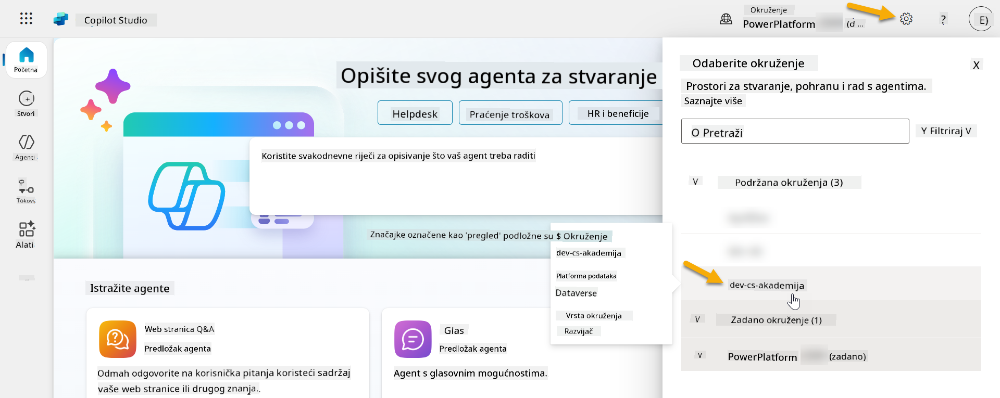

### 4.1 Kreirajte izdavača rješenja

1. Koristeći isto Copilot Studio okruženje korišteno u prethodnoj lekciji, odaberite ikonu **tri točke (. . .)** na lijevom izborniku u Copilot Studiju. Odaberite **Rješenja** pod naslovom **Explore**.

    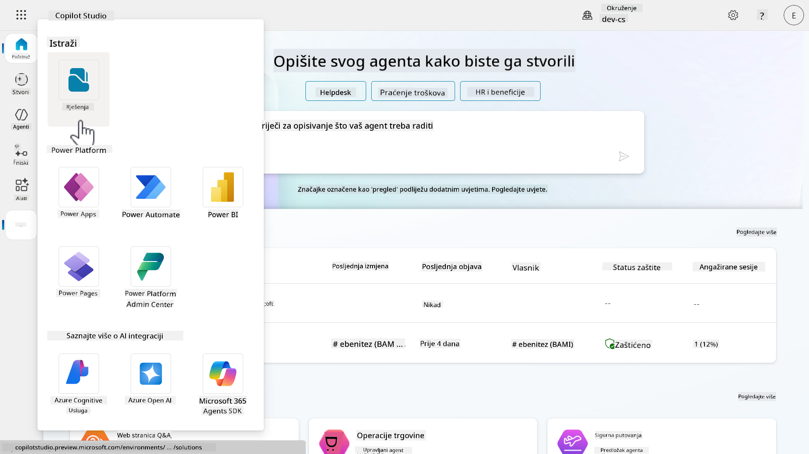

1. Učit će se **Solution Explorer** u Copilot Studiju. Odaberite **+ Novo rješenje**

    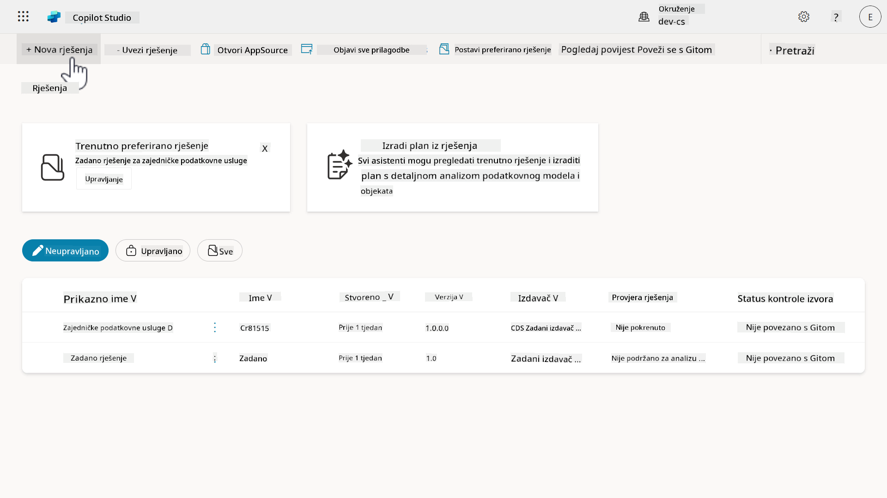

1. Pojavit će se ploča **Novo rješenje** gdje možemo definirati detalje našeg rješenja. Prvo, trebamo kreirati novog izdavača. Odaberite **+ Novi izdavač**.

    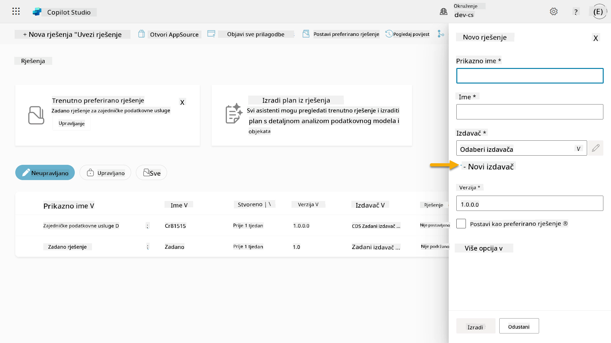  

1. Pojavit će se kartica **Svojstva** ploče **Novi izdavač** s obaveznim i neobaveznim poljima koja treba popuniti u kartici **Svojstva**. Ovdje možemo navesti detalje izdavača koji će se koristiti kao oznaka ili brend koji identificira tko je kreirao ili posjeduje rješenje.

    | Svojstvo    | Opis | Obavezno |
    | ---------- | ---------- | :----------: |
    | Prikazno ime | Prikazno ime za izdavača | Da   |
    | Ime  | Jedinstveno ime i shematsko ime za izdavača  | Da    |
    | Opis   | Navodi svrhu rješenja    | Ne     |
    | Prefiks    | Prefiks izdavača koji će se primijeniti na novokreirane komponente   | Da      |
    | Prefiks vrijednosti izbora   | Generira broj na temelju prefiksa izdavača. Ovaj broj se koristi kada dodajete opcije izborima i pruža indikator koji rješenje je korišteno za dodavanje opcije.   | Da      |

    Kopirajte i zalijepite sljedeće kao **Prikazno ime**,

    ```text
    Contoso Solutions
    ```

    Kopirajte i zalijepite sljedeće kao **Ime**,

    ```text
    ContosoSolutions
    ```

    Kopirajte i zalijepite sljedeće kao **Opis**,

    ```text
    Copilot Studio Agent Academy
    ```

    Kopirajte i zalijepite sljedeće za **Prefiks**,

    ```text
    cts
    ```

    Prema zadanim postavkama, **Prefiks vrijednosti izbora** prikazat će cijeli broj. Ažurirajte ovaj cijeli broj na najbližu tisućicu. Na primjer, u mom snimku zaslona ispod, isprva je bio `77074`. Ažurirajte ovo s `77074` na `77000`.

    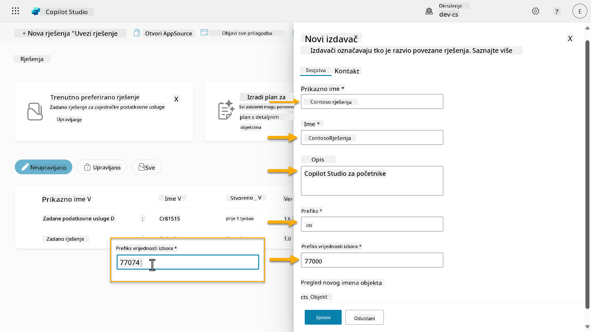  

1. Ako želite navesti kontaktne podatke za rješenje, odaberite karticu **Kontakt** i popunite prikazane stupce.

    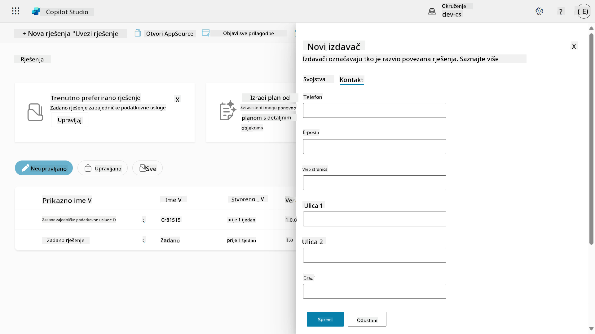

1. Odaberite karticu **Svojstva** i odaberite **Spremi** za kreiranje izdavača.

    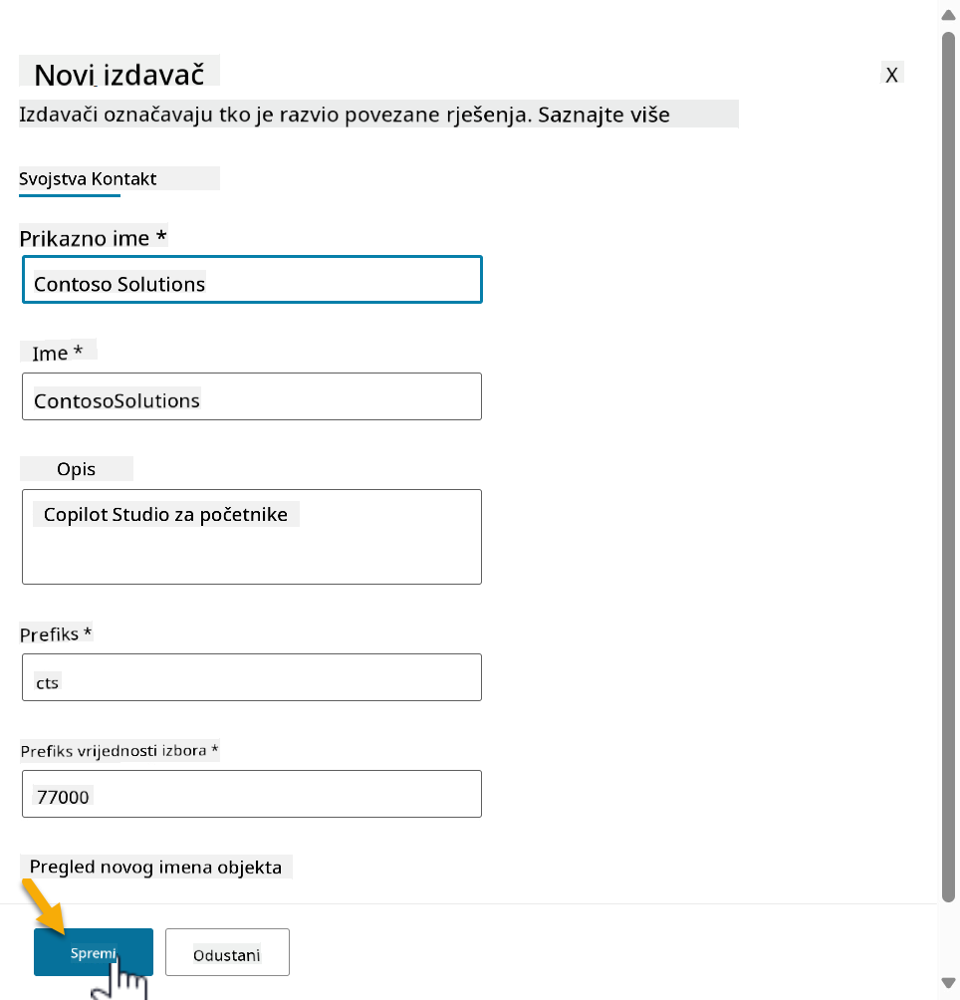
1. Novi prozor za izdavača će se zatvoriti i bit ćete vraćeni na prozor **Nova rješenja** s odabranim novostvorenim izdavačem.

    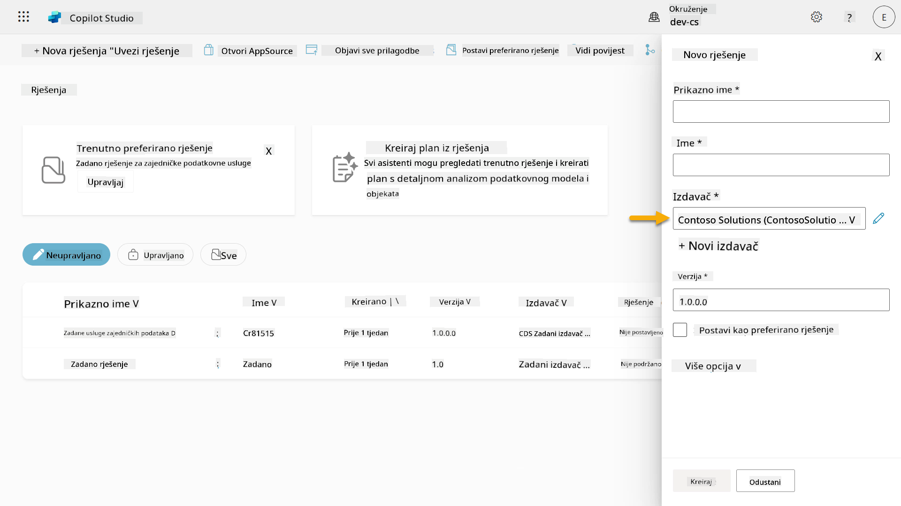  

Bravo, upravo ste stvorili Izdavača rješenja! 🙌🏻 Sljedeće ćemo naučiti kako stvoriti novo prilagođeno rješenje.

### 4.2 Stvaranje novog rješenja

1. Sada kada smo stvorili naše rješenje, možemo dovršiti ostatak obrasca u prozoru **Novo rješenje**.

    Kopirajte i zalijepite sljedeće kao **Prikazni naziv**,

    ```text
    Contoso Helpdesk Agent
    ```

    Kopirajte i zalijepite sljedeće kao **Naziv**,

    ```text
    ContosoHelpdeskAgent
    ```

    Budući da stvaramo novo rješenje, [**Broj verzije**](https://learn.microsoft.com/power-apps/maker/data-platform/update-solutions#understanding-version-numbers-for-updates/?WT.mc_id=power-172615-ebenitez) će prema zadanim postavkama biti `1.0.0.0`.

    Označite kućicu **Postavi kao vaše preferirano rješenje**.

    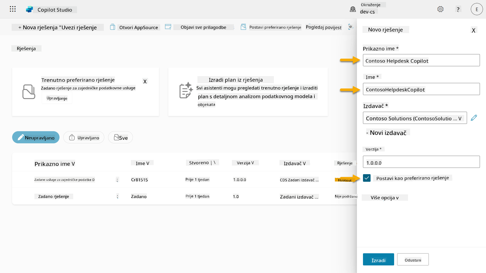  

1. Proširite **Više opcija** kako biste vidjeli dodatne detalje koji se mogu pružiti u rješenju.

    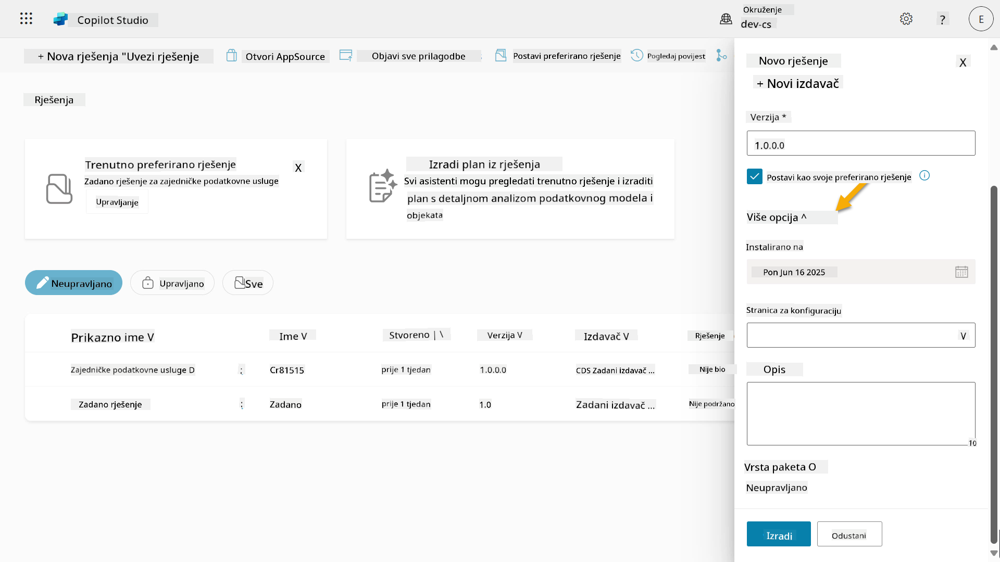

1. Vidjet ćete sljedeće,

    - **Instalirano na** - datum kada je rješenje instalirano.

    - **Stranica za konfiguraciju** - programeri postavljaju HTML web resurs kako bi korisnicima olakšali interakciju s njihovom aplikacijom, agentom ili alatom gdje će se pojaviti kao web stranica u odjeljku Informacije s uputama ili gumbima. Najčešće ga koriste tvrtke ili programeri koji grade i dijele rješenja s drugima.

    - **Opis** - opisuje rješenje ili daje opći opis stranice za konfiguraciju.

    Ostavit ćemo ovo prazno za ovu radionicu.

    Odaberite **Stvori**.

    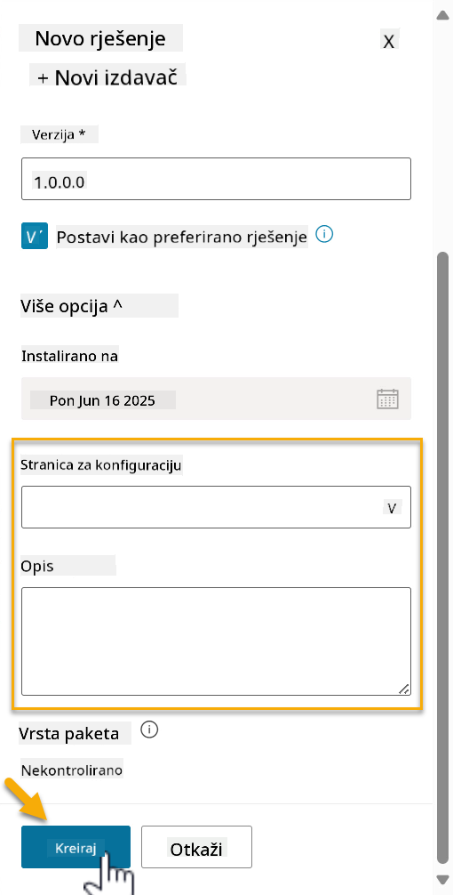

1. Rješenje za Contoso Helpdesk Agent sada je stvoreno. Neće biti komponenti dok ne stvorimo agenta u Copilot Studiju.

    Odaberite ikonu **strelica za povratak** kako biste se vratili u Solution Explorer.

    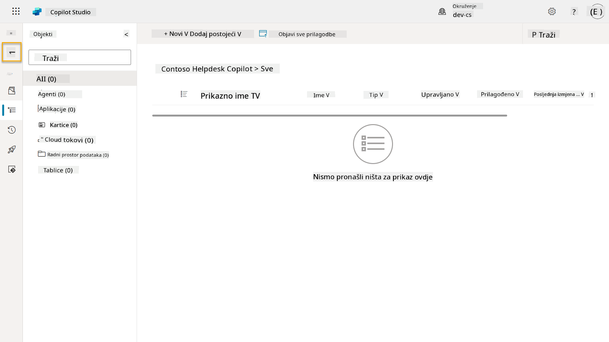

1. Primijetite kako se Contoso Helpdesk Agent sada prikazuje kao **Trenutno preferirano rješenje** jer smo ranije označili kućicu **Postavi kao vaše preferirano rješenje**.

    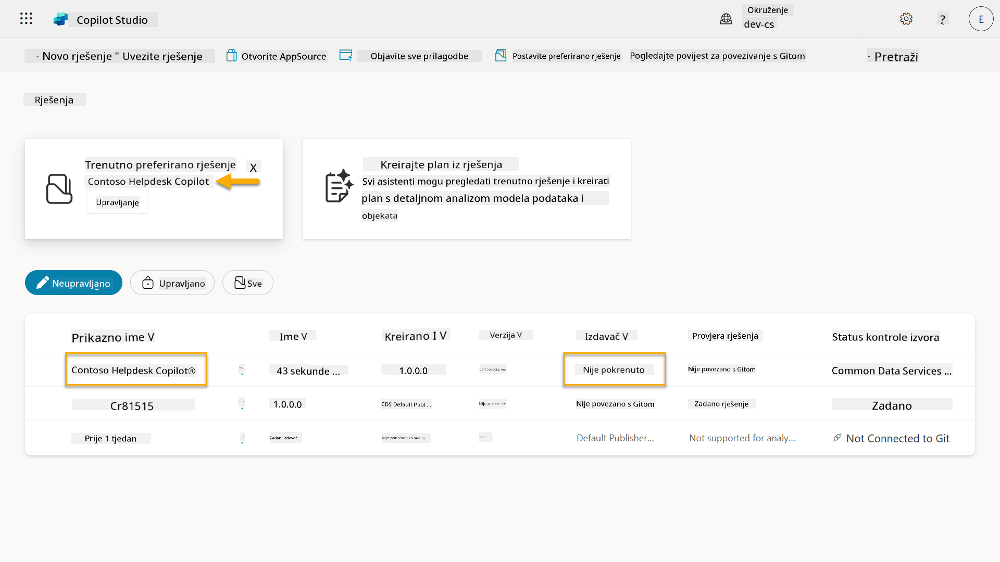

## ✅ Misija završena

Čestitamo! 👏🏻 Stvorili ste Izdavača i koristili ga u vašem novostvorenom rješenju za izradu vašeg agenta!

Bravo, kreatore agenata. Uređena digitalna prisutnost prvi je korak prema operativnosti na velikoj skali. Sada imate alate i način razmišljanja za održivi razvoj agenata spremnih za poduzeće.

Ovo je kraj **Radionice 04 - Stvaranje rješenja**, odaberite poveznicu ispod kako biste prešli na sljedeću lekciju. Vaše rješenje stvoreno u ovoj radionici koristit će se u laboratoriju sljedeće lekcije.

⏭️ [Prijeđite na lekciju **Brzi početak s unaprijed izgrađenim agentima**](../05-using-prebuilt-agents/README.md)

## 📚 Taktički resursi

🔗 [Stvaranje rješenja](https://learn.microsoft.com/power-apps/maker/data-platform/create-solution/?WT.mc_id=power-172615-ebenitez)

🔗 [Stvaranje i upravljanje rješenjima u Copilot Studiju](https://learn.microsoft.com/microsoft-copilot-studio/authoring-solutions-overview/?WT.mc_id=power-172615-ebenitez)

🔗 [Dijeljenje agenata s drugim korisnicima](https://learn.microsoft.com/microsoft-copilot-studio/admin-share-bots/?WT.mc_id=power-172615-ebenitez)

🔗 [Sažetak dostupnih resursa za unaprijed definirane sigurnosne uloge](https://learn.microsoft.com/power-platform/admin/database-security#summary-of-resources-available-to-predefined-security-roles/?WT.mc_id=power-172615-ebenitez)

🔗 [Nadogradnja ili ažuriranje rješenja](https://learn.microsoft.com/power-apps/maker/data-platform/update-solutions/?WT.mc_id=power-172615-ebenitez)

🔗 [Pregled cjevovoda u Power Platformi](https://learn.microsoft.com/power-platform/alm/pipelines/?WT.mc_id=power-172615-ebenitez)

🔗 [Pregled Git integracije u Power Platformi](https://learn.microsoft.com/power-platform/alm/git-integration/overview/?WT.mc_id=power-172615-ebenitez)


---

**Izjava o odricanju odgovornosti**:  
Ovaj dokument je preveden pomoću AI usluge za prevođenje [Co-op Translator](https://github.com/Azure/co-op-translator). Iako nastojimo osigurati točnost, imajte na umu da automatski prijevodi mogu sadržavati pogreške ili netočnosti. Izvorni dokument na izvornom jeziku treba smatrati autoritativnim izvorom. Za ključne informacije preporučuje se profesionalni prijevod od strane čovjeka. Ne preuzimamo odgovornost za nesporazume ili pogrešne interpretacije koje proizlaze iz korištenja ovog prijevoda.