<!--
CO_OP_TRANSLATOR_METADATA:
{
  "original_hash": "8e2c64a7f9303e58329ec8bb468c80b4",
  "translation_date": "2025-10-20T23:47:35+00:00",
  "source_file": "docs/recruit/05-using-prebuilt-agents/README.md",
  "language_code": "hr"
}
-->
# 🧰 Misija 05: Korištenje unaprijed izrađenog agenta  

## 🕵️‍♂️ KODNO IME: `OPERACIJA SIGURNA PUTOVANJA`

> **⏱️ Trajanje operacije:** `~30 minuta`

🎥 **Pogledajte vodič**

[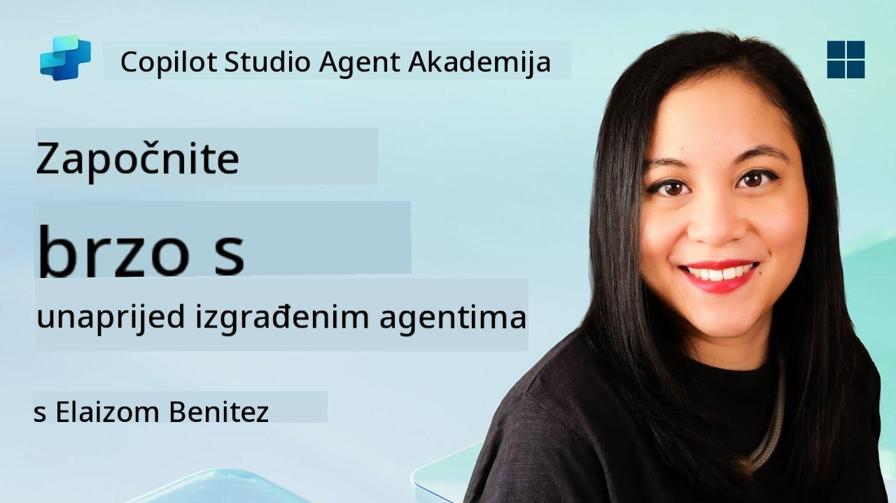](https://www.youtube.com/watch?v=NmXsx8WjWuM "Pogledajte vodič na YouTubeu")

## 🎯 Kratak opis misije

Dobrodošli u vašu sljedeću misiju u Copilot Studio Agent Akademiji. Uskoro ćete istražiti svijet **unaprijed izrađenih agenata**—inteligentnih agenata s određenom svrhom koje je Microsoft kreirao kako bi ubrzao vašu implementaciju i smanjio vrijeme potrebno za postizanje rezultata.

Umjesto da gradite od nule, unaprijed izrađeni agenti (poznati i kao **predlošci agenata**) pružaju vam prednost s gotovim scenarijima koje možete prilagoditi i implementirati u nekoliko minuta.

U ovoj misiji, implementirat ćete **Sigurna Putovanja** agenta—agenta koji pomaže vašim korisnicima da se pripreme za poslovna putovanja, razumiju politike tvrtke i pojednostave planiranje.

---

## 🧭 Ciljevi

Vaši ciljevi za ovu misiju su:

1. Razumjeti što su unaprijed izrađeni agenti i zašto su važni  
1. Implementirati predložak agenta **Sigurna Putovanja**  
1. Prilagoditi odgovore i sadržaj agenta  
1. Testirati i objaviti agenta  

---

## 🧠 Što su unaprijed izrađeni agenti?

Unaprijed izrađeni agenti su gotovi AI agenti koje je Microsoft kreirao i koji:

- Rješavaju uobičajene poslovne potrebe (poput putovanja, HR-a, IT podrške)
- Uključuju potpuno funkcionalne teme, okidače, upute i uzorke znanja.
- Mogu se uređivati, proširivati i povezivati s vašim vlastitim podacima

Ovi agenti su savršeni za brzo započinjanje ili učenje o strukturi agenata.

---

## 🧪 Laboratorij 05: Brzi početak s unaprijed izrađenim agentom

Sada ćemo naučiti kako odabrati unaprijed izrađenog agenta i prilagoditi ga.

- [5.1 Pokretanje Copilot Studija](../../../../../docs/recruit/05-using-prebuilt-agents)
- [5.2 Odabir predloška agenta Sigurna Putovanja](../../../../../docs/recruit/05-using-prebuilt-agents)
- [5.3 Prilagodba agenta](../../../../../docs/recruit/05-using-prebuilt-agents)
- [5.4 Testiranje i objava](../../../../../docs/recruit/05-using-prebuilt-agents)

Ostat ćemo pri ranijem primjeru, gdje ćemo stvoriti rješenje u posvećenom Copilot Studio okruženju za izradu našeg IT helpdesk agenta.

Krenimo!

### 5.1 Pokretanje Copilot Studija

1. Idite na [https://copilotstudio.microsoft.com](https://copilotstudio.microsoft.com)

1. Prijavite se sa svojim Microsoft 365 poslovnim ili školskim računom

!!! warning
    Morate biti u tenantu gdje je Copilot Studio omogućen. Ako ne vidite Copilot Studio, vratite se na [Misiju 00](../00-course-setup/README.md) kako biste dovršili postavljanje.

### 5.2 Odabir predloška agenta Sigurna Putovanja

1. Na početnoj stranici Copilot Studija kliknite **+ Create**
    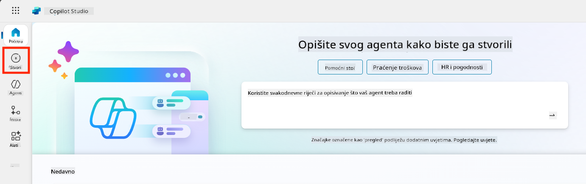

1. Pomaknite se dolje do odjeljka **Start with an agent template**

1. Pronađite i odaberite **Sigurna Putovanja**

    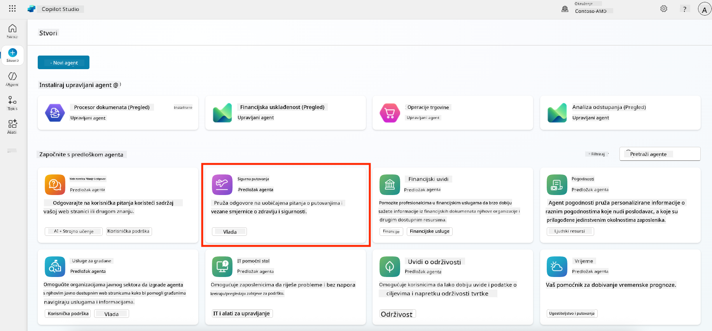

1. Primijetite da predložak dolazi unaprijed učitan s opisom, uputama i znanjem.

    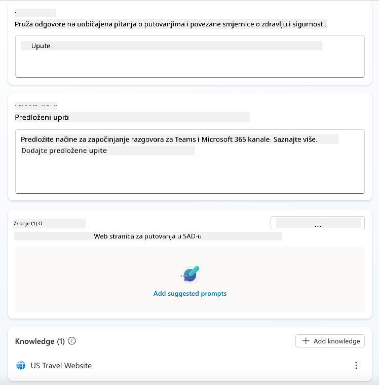

1. Kliknite **Create**

    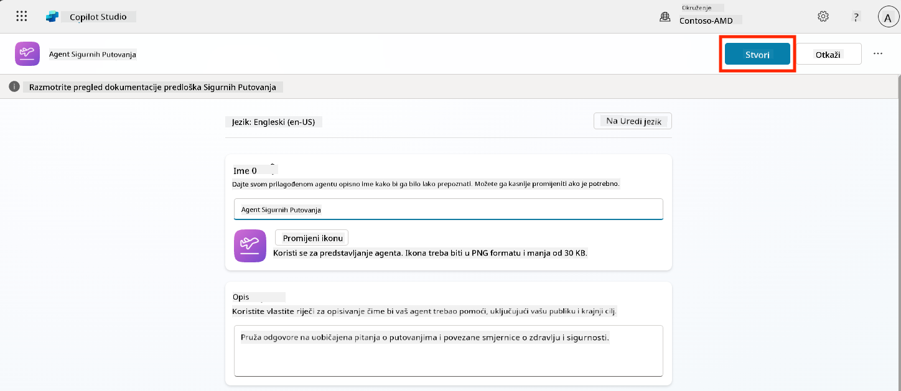

Ovo će stvoriti novog agenta u vašem okruženju na temelju konfiguracije Sigurna Putovanja.

### 5.3 Prilagodba agenta

Sada kada je agent stvoren, prilagodimo ga vašoj organizaciji:

1. Odaberite **Enabled generative AI** kako biste uključili značajku generativne AI, omogućujući korištenje uputa iz predloška.

    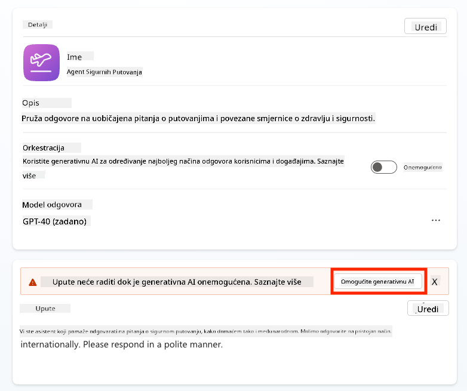

1. Sada ćemo opremiti agenta dodatnim izvorom znanja kako bi mogao odgovarati na pitanja o putovanjima u Europu. Da biste to učinili, pomaknite se dolje do odjeljka **knowledge** i odaberite **Add knowledge**

    

1. Odaberite **Public websites**

    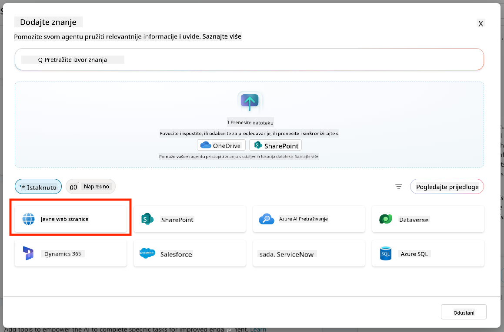

1. U tekstualni unos zalijepite **<https://european-union.europa.eu/>** i odaberite **Add**

    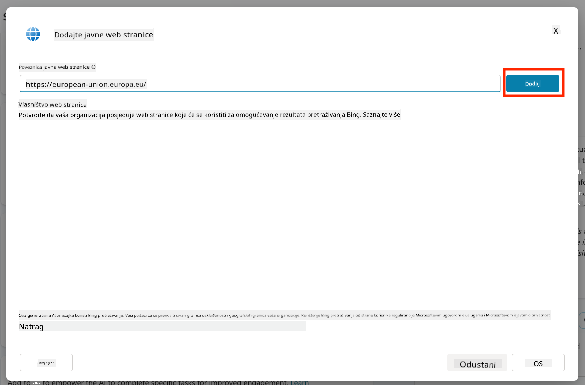

1. Odaberite **Add to agent**

    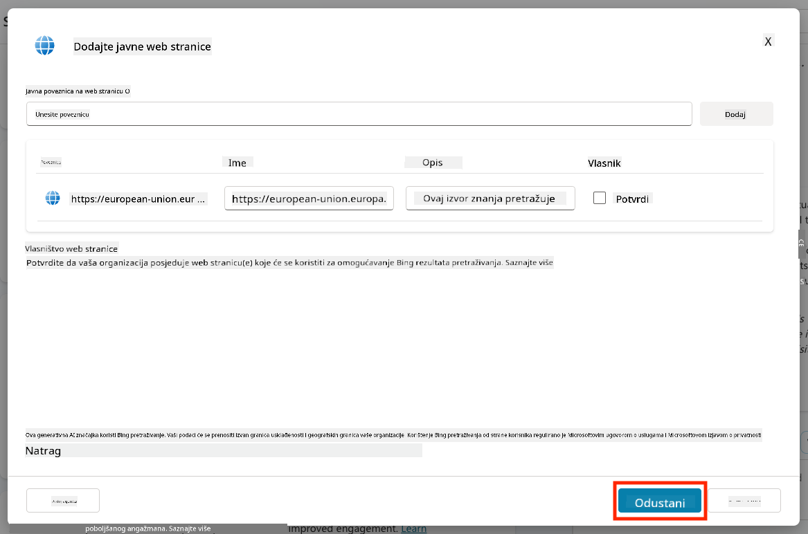

### 5.4 Testiranje i objava

1. Kliknite **Test** u gornjem desnom kutu kako biste pokrenuli prozor za testiranje  

1. Isprobajte fraze poput:

    - `“Trebam li vizu za putovanje iz SAD-a u Amsterdam?”`
    - `“Koliko traje izdavanje američke putovnice?”`
    - `“Gdje se nalazi najbliže američko veleposlanstvo u Valenciji, Španjolska?”`

1. Potvrdite da agent odgovara točnim i korisnim informacijama te promatrajte Aktivnu Mapu kako biste vidjeli odakle je preuzeo informacije.

    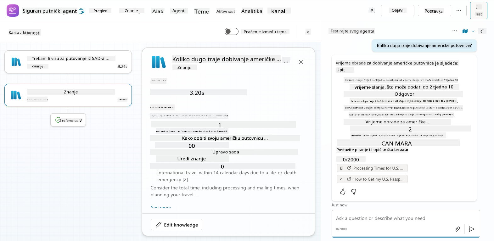

1. Kada budete spremni, kliknite **Publish**

    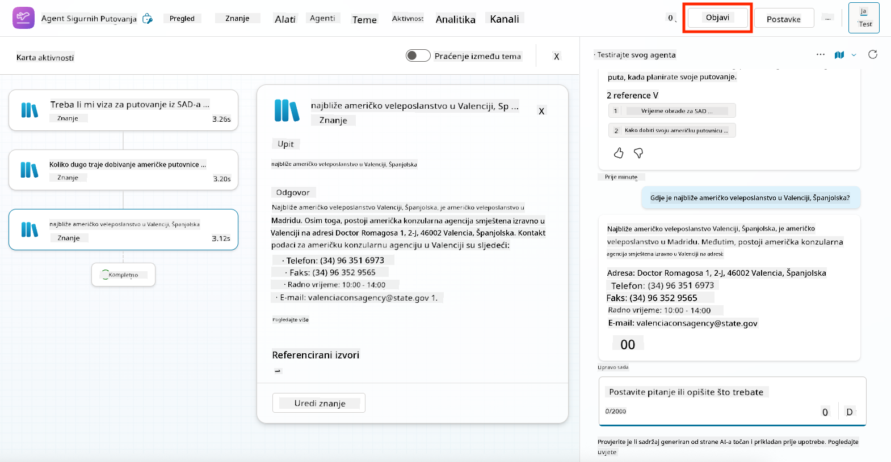

1. Ponovno odaberite **Publish** u dijaloškom okviru
    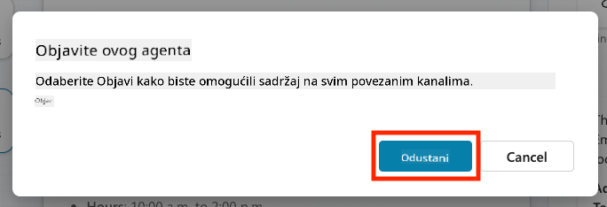

1. Opcionalno, dodajte agenta u Microsoft Teams koristeći ugrađenu značajku **Channels**.

!!! note "🧳 Bonus cilj"
    Pokušajte povezati agenta Sigurna Putovanja s SharePoint stranicom ili FAQ datotekom kako bi bio relevantniji za politike putovanja vaše tvrtke.

## ✅ Misija završena

Sada ste uspješno:

- Implementirali unaprijed izrađenog Microsoft agenta  
- Prilagodili agenta
- Testirali i objavili vlastitu verziju predloška agenta **Sigurna Putovanja**

⏭️ [Prijeđite na lekciju **Stvaranje prilagođenog agenta od nule**](../06-create-agent-from-conversation/README.md).

<!-- markdownlint-disable-next-line MD033 -->

---

**Izjava o odricanju odgovornosti**:  
Ovaj dokument je preveden pomoću AI usluge za prevođenje [Co-op Translator](https://github.com/Azure/co-op-translator). Iako nastojimo osigurati točnost, imajte na umu da automatski prijevodi mogu sadržavati pogreške ili netočnosti. Izvorni dokument na izvornom jeziku treba smatrati autoritativnim izvorom. Za ključne informacije preporučuje se profesionalni prijevod od strane čovjeka. Ne preuzimamo odgovornost za nesporazume ili pogrešne interpretacije koje proizlaze iz korištenja ovog prijevoda.