<!--
CO_OP_TRANSLATOR_METADATA:
{
  "original_hash": "180f9cc0b40527f61be092c9b0f72aba",
  "translation_date": "2025-10-20T23:40:40+00:00",
  "source_file": "docs/recruit/06-create-agent-from-conversation/README.md",
  "language_code": "hr"
}
-->
# 🚨 Misija 06: Kreirajte prilagođenog agenta koristeći prirodni jezik s Copilotom i povežite ga s vašim podacima

## 🕵️‍♂️ KODNO IME: `OPERACIJA AGENT FORGE`

> **⏱️ Vrijeme trajanja operacije:** `~75 minuta`

🎥 **Pogledajte vodič**

[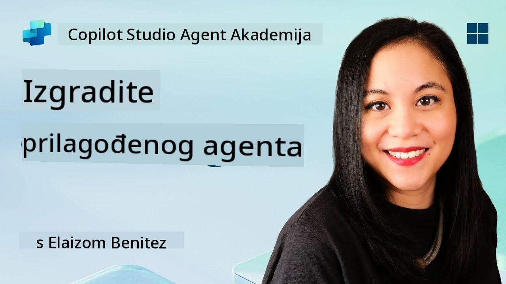](https://www.youtube.com/watch?v=qZTtQVncGFg "Pogledajte vodič na YouTubeu")

## 🎯 Kratak opis misije

Dobrodošli nazad, kreatore agenata. Ova misija stavlja vas u zapovjedničku poziciju najmoćnije funkcionalnosti u Copilot Studiju - kreiranje prilagođenog agenta od nule koristeći samo prirodni jezik… i dodatno ga osnažujući vašim vlastitim podacima.

Ovo nije samo još jedan chatbot. Vi gradite digitalnog suradnika s pristupom znanju - onog koji može razmišljati, odgovarati i koristiti stvarne informacije iz vaše organizacije.

Vaše oružje? Prirodni jezik. Vaša misija? Dizajnirajte, obučite i testirajte potpuno prilagođenog agenta za IT podršku koji odgovara na pitanja koristeći SharePoint, učitane datoteke ili URL-ove vaše tvrtke.

Krenimo graditi vašeg agenta od temelja.

## 🔎 Ciljevi

U ovoj misiji naučit ćete:

1. Razumjeti što su prilagođeni agenti i kako se razlikuju od unaprijed pripremljenih predložaka
1. Kreirati agente koristeći prirodne jezične upite i dizajn razgovora s Copilotom
1. Povezati agente s izvorima znanja vaše organizacije, uključujući SharePoint, dokumente i web stranice
1. Naučiti o generativnoj orkestraciji i kako agenti dinamički pretražuju i odgovaraju koristeći više izvora podataka
1. Izgraditi i testirati potpuno funkcionalnog agenta za IT podršku koji može odgovarati na pitanja koristeći vaše vlastite podatke

## 🤔 Što je _prilagođeni_ agent?

Prilagođeni agent je chatbot ili virtualni asistent kojeg kreirate i dizajnirate u Copilot Studiju kako bi pomogao korisnicima s određenim zadacima ili pitanjima. Zove se prilagođeni jer:

- **Vi odlučujete o svrsi** - pomaže korisnicima da zatraže godišnji odmor, provjere status narudžbe, pruži pomoć s IT pitanjima.
- **Vi definirate razgovor** - što agent kaže i kako bi trebao odgovarati.
- **Vi ga povezujete s vašim podacima** - povežite ga s podacima vaše organizacije putem ugrađenih podržanih izvora znanja.
- **Vi ga povezujete s vašim sustavima ili aplikacijama** - birajte između konektora, tokova, REST API-ja i modela kontekstualnih protokola servera.

!!! note
    Zamislite to ovako: gradite vlastitog digitalnog pomoćnika koji može razgovarati s korisnicima i obavljati zadatke za njih, poput odgovaranja na pitanja, prikupljanja informacija potrebnih za proces ili povezivanja s podacima vaše organizacije.

### 🤖 Što prilagođeni agent može učiniti?

Prilagođeni agent može obavljati sljedeće:

- Pitati korisnike za informacije poput imena, datuma ili preferencija.
- Spremiti te informacije u bazu podataka ili tablicu.
- Pretraživati podatke na temelju postavljenih pitanja i odgovarati na njih.
- Raditi autonomno bez direktne interakcije korisnika s agentom.
- Pokretati radnje na zahtjev kroz direktnu interakciju korisnika ili autonomno, poput slanja e-mailova ili kreiranja zapisa.

### 👩🏻‍💻 Zašto koristiti prilagođenog agenta?

- Štedi vrijeme automatizacijom ponavljajućih zadataka.
- Pruža korisnicima prijateljsko i vođeno iskustvo.
- Prilagođava se vašim poslovnim ili projektnim potrebama.

### ✨ Primjer

Kreirate prilagođenog agenta koji pomaže zaposlenicima da zatraže godišnji odmor.

Agent traži njihovo ime, datume godišnjeg odmora i ime njihovog menadžera, zatim sprema te informacije u sustav koji upravlja zahtjevima za godišnji odmor, poput SharePoint liste.

Sada, umjesto da se navigiraju do SharePoint liste i kreiraju novi zapis, zaposlenici jednostavno razgovaraju s agentom.

## 🗣️ Koristite prirodni jezik za kreiranje agenata

Ranije ste naučili kako brzo kreirati agente u Copilot Studiju koristeći unaprijed pripremljene predloške agenata u [Lekciji 05 - Brzi početak s unaprijed pripremljenim agentima](../05-using-prebuilt-agents/README.md). U ovoj lekciji, zaronit ćemo u iskustvo kreiranja razgovora s Copilotom. Copilot Studio olakšava kreiranje agenata kroz razgovor s Copilotom, baš kao da imate konverzaciju.

U Copilot Studiju, ne morate pisati kod da biste kreirali agenta. Umjesto toga, opisujete što želite da vaš agent radi u običnom jeziku, a Copilot vam pomaže da ga izgradite korak po korak kroz iskustvo nalik chatu.

## 🌱 Ali ja sam nov u "opisivanju što želim" - što da radim?

Opisivanje u prirodnom jeziku za kreiranje prilagođenog agenta može biti novi koncept za vas. Kad god koristite Copilot u Microsoft proizvodima i uslugama, koristite prirodni jezik u obliku _upita_.

Upit je poruka ili instrukcija koju dajete AI agentu kako biste mu rekli što želite da učini. Zamislite to kao davanje uputa asistentu. Što su vaše upute jasnije, to će vaš asistent lakše razumjeti i djelovati prema njima.

### 🪄 Zašto su upiti važni

- Vode ponašanje agenta.
- Pomažu agentu da razumije kakav razgovor treba voditi.
- Dobar upit čini agenta korisnijim i preciznijim.

### 📝 Savjeti za pisanje dobrog upita

- Budite jasni i specifični - recite točno što želite da agent učini.
- Razmišljajte kao korisnik - što će korisnik reći? Što bi agent trebao odgovoriti?
- Uključite primjere - ako je moguće, dajte primjer interakcije.

### ✨ Primjer

Recimo da HR tim treba agenta koji pomaže s zahtjevima za godišnji odmor.

Upit bi mogao biti:

    “Želim kreirati agenta koji pomaže korisnicima da podnesu zahtjev za godišnji odmor. Kada korisnik kaže da želi zatražiti slobodno vrijeme, agent bi trebao pitati za njihovo ime, datum početka godišnjeg odmora, datum završetka godišnjeg odmora i ime njihovog menadžera. Kada korisnik pruži te informacije, agent bi trebao spremiti podatke u SharePoint listu pod nazivom ‘Zahtjevi za godišnji odmor’ i objaviti obavijest u namjenskom Microsoft Teams kanalu.”

Zašto ovaj upit funkcionira:

- **Jasno navodi cilj** - podnošenje zahtjeva za godišnji odmor
- **Opisuje interakciju korisnika** - što korisnik kaže i što agent treba pitati
- **Navodi potrebne podatke** - ime, datum početka, datum završetka, menadžer
- **Spominje gdje podaci idu** - SharePoint lista pod nazivom Zahtjevi za godišnji odmor

## 🔮 OK, kreirao sam svog agenta... kako ga dalje povezati s znanjem?

U Copilot Studiju, izvori znanja su mjesta gdje vaš agent može pronaći informacije kako bi dao bolje odgovore. Kada dodate ove izvore, vaš agent može povući podatke vaše organizacije s mjesta poput Power Platform, Dynamics 365, web stranica i drugih sustava ili usluga koje vaša tvrtka koristi.

Ovi izvori rade zajedno s AI-jem kako bi pomogli vašem agentu da odgovara preciznije na korisnička pitanja, što se postiže kroz ono što se naziva **generativna orkestracija**.

### 🌿 Što je generativna orkestracija u kontekstu agenata?

Generativna orkestracija znači da agent koristi AI kako bi dinamički odlučio kako odgovoriti na pitanje kombinirajući svoje ugrađene jezične vještine s informacijama iz dodanih izvora znanja.

Kada korisnik postavi pitanje, agent:

- Razumije pitanje koristeći AI.
- Može pitati korisnika za nedostajuće informacije generirajući pitanja u hodu.
- Odabire najrelevantnije izvore znanja.
- Pretražuje te izvore za odgovore.
- Generira prirodan, koristan odgovor koristeći informacije koje je pronašao.

### 🏦 Zašto su izvori znanja važni?

1. **Pametniji odgovori** - kada dodate izvore znanja, vaš agent može dati bolje, preciznije odgovore koristeći stvarne podatke vaše organizacije.

1. **Manje ručnog rada** - ne morate pisati svaki mogući odgovor. Agent može pretraživati dodane izvore i automatski odgovarati.

1. **Koristi pouzdane informacije** - vaš agent može povući odgovore iz sustava koje već koristite, poput Dataverse, SharePointa ili web stranica vaše tvrtke, tako da korisnici imaju pouzdane informacije iz izvora istine.

1. **Radi s generativnim AI-jem** - izvori znanja i AI pomažu vašem agentu da razumije pitanja i odgovara prirodno, čak i ako pitanje nije unaprijed programirano ili dodano kao početni upit.

1. **Fleksibilan i proširiv** - možete dodati izvore znanja u bilo kojem trenutku tijekom postavljanja ili kasnije, vaš agent postaje pametniji kako se vaše potrebe mijenjaju.

### ✨ Primjer

Zamislite da kreirate agenta koji pomaže zaposlenicima s HR pitanjima. Dodate dokument o HR politici vaše tvrtke i SharePoint stranicu kao izvore znanja.

Kada zaposlenik pita, _“Koliko dana godišnjeg odmora imam pravo?”_, agent koristi generativnu orkestraciju kako bi pretražio te izvore i odgovorio s točnom politikom, bez da ste ručno napisali taj odgovor. To vam štedi vrijeme jer ne morate predvidjeti svako moguće pitanje koje bi zaposlenik mogao postaviti o svojim pravima.

## Vrste izvora znanja koji se mogu dodati

1. **Javne web stranice**
    - **Što radi:** Pretražuje specifične web stranice (poput stranice vaše tvrtke) koristeći Bing.
    - **Zašto je korisno:** Odlično za povlačenje javno dostupnih informacija poput FAQ-a ili detalja o proizvodima.

1. **Dokumenti**
    - **Što radi:** Koristi dokumente koje direktno učitate u vašeg agenta, poput PDF-ova ili Word datoteka. Ove učitane datoteke sigurno se pohranjuju u Dataverse.
    - **Zašto je korisno:** Omogućuje vašem agentu da odgovara na pitanja na temelju internih vodiča, priručnika ili politika.

1. **SharePoint**
    - **Što radi:** Povezuje se s SharePoint mapama ili datotekama koristeći Microsoft Graph Search.
    - **Zašto je korisno:** Idealno za pristup timskim dokumentima, HR politikama ili projektnim datotekama pohranjenim u SharePointu.

1. **Dataverse**
    - **Što radi:** Koristi strukturirane podatke iz vaše Dataverse okoline, tablica i redaka, te može primijeniti sinonime i definicije pojmova za poboljšanje odgovora agenta.
    - **Zašto je korisno:** Kada trebate pretraživati podatke vaše organizacije pohranjene u Dataverse, poput informacija o klijentima.

1. **Znanje u stvarnom vremenu s konektorima**
    - **Što radi:** Omogućuje vašem agentu pristup živim podacima iz drugih sustava vaše organizacije poput Salesforcea, ServiceNowa, Dynamics 365, AzureSQL-a, Databricksa i drugih tijekom razgovora, koristeći korisničke dozvole.
    - **Zašto je korisno:** Pruža ažurirane, sigurne i točne odgovore bez pohranjivanja ili dupliciranja podataka, čineći vašeg agenta pametnijim i sigurnijim.

1. **Azure AI Search**
    - **Što radi:** Omogućuje vašem agentu pretraživanje velikih skupova dokumenata pohranjenih u Azureu koristeći semantičko i vektorsko pretraživanje za razumijevanje korisničkih pitanja.
    - **Zašto je korisno:** Pruža točne, pouzdane odgovore iz složenih izvora podataka, podržava citate i dobro se skalira za velike kolekcije dokumenata s kontrolama sigurnog pristupa.

## 🔒 Napomena o sigurnosti

### Autentifikacija izvora znanja

Neki izvori, poput SharePointa i Dataverse, zahtijevaju autentifikaciju korisnika. To znači da će agent referencirati podatke u svom odgovoru samo ako ih korisnik smije vidjeti. Dok drugi izvori mogu zahtijevati dodatnu konfiguraciju kako bi se agent povezao s njima, poput Azure AI Searcha koji zahtijeva Azure račun i specifikaciju vrste autentifikacije.

## Poboljšanje odgovora vašeg agenta u Copilot Studiju

Nakon što je vaš agent kreiran kroz iskustvo kreiranja razgovora, poželjet ćete testirati svog agenta u odnosu na upute koje je Copilot generirao iz vašeg upita. Poboljšanje odgovora vašeg agenta u Copilot Studiju odnosi se na osiguravanje da jasno razumije vaše ciljeve i ima pristup pravim informacijama.

1. **Doradite upute za agenta** - ovdje govorite svom agentu kako bi se trebao ponašati. Koristite jasne, specifične upute.

    Na primjer:

    ✅ “Ponašaj se kao prijateljski agent korisničke podrške koji jednostavno objašnjava stvari.”

    ❌ “Budi koristan.” (Previše nejasno)

1. **Provjerite ton i jezik** - osigurajte da ton agenta odgovara vašoj publici.

    Možete ga postaviti da bude:

    - Prijateljski i neformalan.
    - Profesionalan i sažet.
    - Podržavajući i strpljiv.

1. **Dodajte ili ažurirajte izvore znanja** - ako vaš agent treba odgovarati na pitanja o određenoj temi, osigurajte da ima pristup pravim informacijama.

    - Dodajte poveznice na web stranice, dokumente ili FAQ-ove.
    - Održavajte sadržaj ažuriranim.
    - Koristite jasne, dobro strukturirane informacije.

1. **Koristite teme i okidače** - Ako vaš agent treba obavljati specifične zadatke ili razgovore, možete kreirati teme s okidačima fraza. To pomaže preciznije voditi razgovor. Više o tome naučit ćemo u sljedećoj lekciji.

1. **Testirajte s pravim pitanjima** - pokušajte postaviti agentu vrste pitanja koje bi korisnici mogli postaviti.

    Ako odgovori nisu dobri:

    - Prilagodite sistemske upute.
    - Dodajte više primjera ili znanja.
    - Preformulirajte svoja pitanja kako biste vidjeli kako odgovara.

1. **Pregledajte i iterirajte** - poboljšanje agenta je kontinuirani proces!

    Nakon objavljivanja:

    - Prikupljajte povratne informacije od korisnika.
    - Pratite uobičajena pitanja ili nejasnoće.
    - Nastavite prilagođavati postavke agenta.

## 🧪 Laboratorij 06: Kreirajte prilagođenog agenta u Copilot Studiju

Sada ćemo naučiti kako kreirati prilagođenog agenta koji može komunicirati s vašim podacima

- [6.1 Koristite prirodni jezik za kreiranje agenta s Copilotom](../../../../../docs/recruit/06-create-agent-from-conversation)
- [6.2 Dodajte interni izvor znanja koristeći SharePoint stranicu](../../../../../docs/recruit/06-create-agent-from-conversation)
- [6.3 Dodajte interni izvor znanja učitavanjem dokumenta](../../../../../docs/recruit/06-create-agent-from-conversation)
- [6.4 Testirajte agenta](../../../../../docs/recruit/06-create-agent-from-conversation)

### ✨ Primjer uporabe
Koristit ćemo isti scenarij iz [Lekcije 03 - Kreiranje deklarativnog agenta za Microsoft 365 Copilot](../03-create-a-declarative-agent-for-M365Copilot/README.md#use-case-scenario)

**Kao** zaposlenik

**Želim** brzo i točno dobiti pomoć od IT helpdesk agenta za probleme poput problema s uređajima, rješavanja problema s mrežom, postavljanja pisača

**Kako bih mogao** ostati produktivan i riješiti tehničke probleme bez odgađanja

Krenimo!

### ✨ Preduvjeti

- **SharePoint stranica**

Koristit ćemo **Contoso IT** SharePoint stranicu iz [Lekcije 00 - Postavljanje tečaja - Korak 3: Kreiranje nove SharePoint stranice](../00-course-setup/README.md#step-4-create-new-sharepoint-site).

Ako niste postavili **Contoso IT** SharePoint stranicu, vratite se na [Lekciju 00 - Postavljanje tečaja - Korak 3: Kreiranje nove SharePoint stranice](../00-course-setup/README.md#step-4-create-new-sharepoint-site).

- **Rješenje**

Koristit ćemo rješenje **Contoso Helpdesk Agent** iz [Lekcije 04 - Kreiranje rješenja za vašeg agenta](../04-creating-a-solution/README.md#41-create-a-solution-publisher).

Ako niste postavili rješenje **Contoso Agent**, vratite se na [Lekciju 04 - Kreiranje rješenja za vašeg agenta](../04-creating-a-solution/README.md#41-create-a-solution-publisher).

### 6.1 Koristite prirodni jezik za kreiranje agenta s Copilotom

!!! warning "Pitanja Copilota mogu se razlikovati između sesija"

    Iskustvo konverzacijskog kreiranja s Copilotom može se razlikovati svaki put, pri čemu se pružena pitanja za smjernice mogu malo razlikovati od prethodnih.

1. Idite na početnu stranicu Copilot Studija i u polje unesite sljedeći upit koji opisuje IT helpdesk agenta. Upit uključuje cilj agenta, kontekst, očekivane zadatke i format odgovora agenta.

    ```text
    You are an IT help desk agent. Your goal is to assist users with their IT issues. You can access information from our company's knowledge base at https://support.microsoft.com/en-us. Your responses should be polite and helpful. If a user reports a slow computer, ask about the age of the device, current software versions, and if they've recently installed any new programs. If a user is experiencing trouble logging into their email, guide them through password reset procedures. You should be concise and informative, using step-by-step instructions with bullet points when appropriate.
    ```

      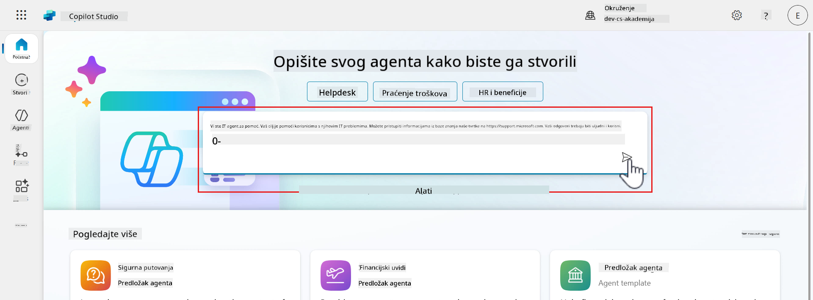

1. Zatim će se učitati iskustvo konverzacijskog kreiranja s Copilotom. Vidjet ćete da Copilot obrađuje vaš upit.

      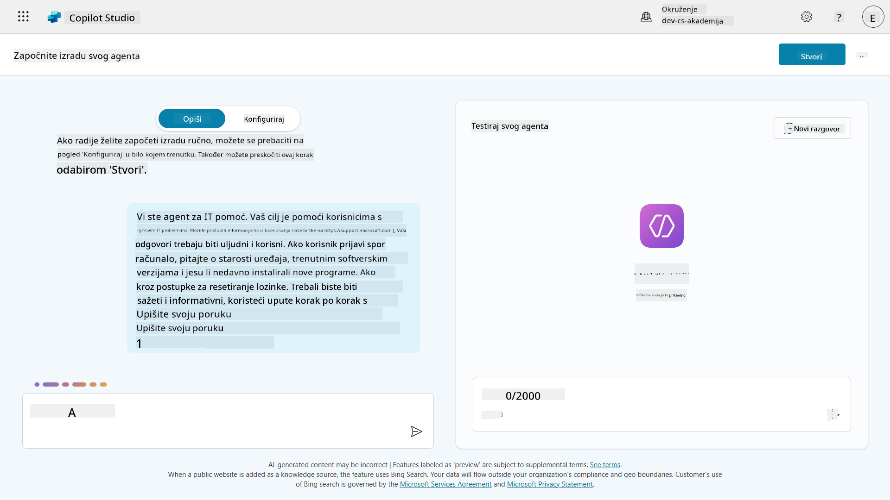

1. Copilot potvrđuje da je agent postavljen prema pruženim uputama i traži potvrdu o imenu agenta. Zamolit ćemo Copilota da našeg agenta nazove,

       ```text
       Contoso Helpdesk Agent
       ```

      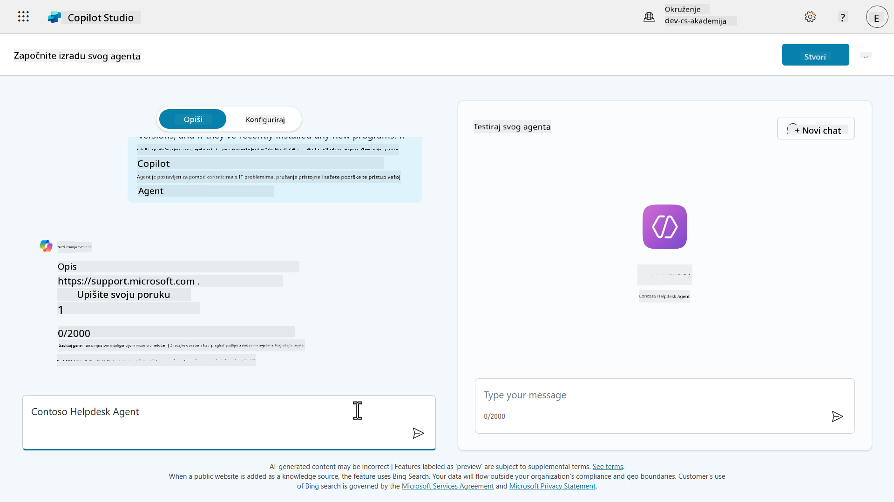

1. Copilot izvršava zahtjev i vidjet ćemo da je ime agenta ažurirano u panelu agenta. Zatim nas Copilot traži da doradimo upute. Pita nas kako bi trebao odgovarati na određene probleme, a mi ćemo zatražiti da prizna problem, pruži primjere tema za odgovore i formatira odgovor u obliku točaka.

    Kopirajte i zalijepite sljedeće te pošaljite zahtjev Copilotu.

       ```text
       Prioritet dajte hitnim zahtjevima. Primjeri IT problema ili scenarija za pomoć: problemi s uređajima, povezivanje na mrežu, problemi s prijavom. Prilikom rješavanja problema, prvo priznajte njihov problem i odgovorite s empatijom, zatim pružite korak-po-korak upute koristeći točke i pitajte trebaju li dodatnu pomoć.
       ```

      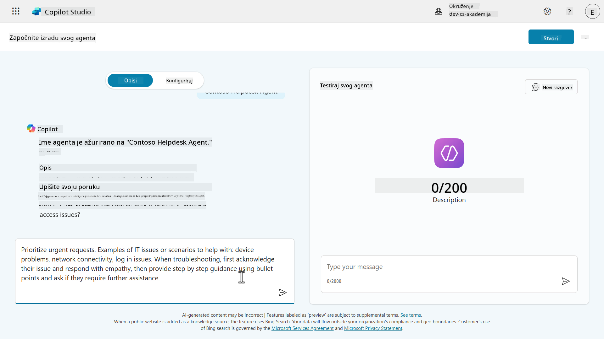

1. Upute agenta bit će ažurirane nakon što Copilot primi zahtjev. Primijetite kako se na desnoj strani panela sada pojavljuju početni upiti. Oni su formirani na temelju naših uputa.

    Zatim Copilot traži javne web stranice kako bi se agentova znanja temeljila na njima.

    Kopirajte i zalijepite sljedeće te pošaljite zahtjev Copilotu.

      ```text
      https://support.microsoft.com
      ```

      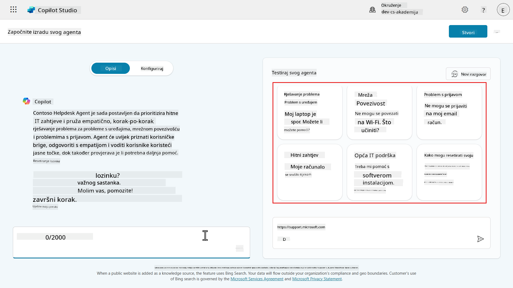

1. Javno dostupna web stranica bit će dodana kao izvor znanja. Copilot pita trebaju li se dodati dodatni izvori znanja. Ne trebamo dodavati dodatne javne web stranice.

    Kopirajte i zalijepite sljedeće te pošaljite zahtjev Copilotu.

      ```text
      Proceed with setup
      ```

      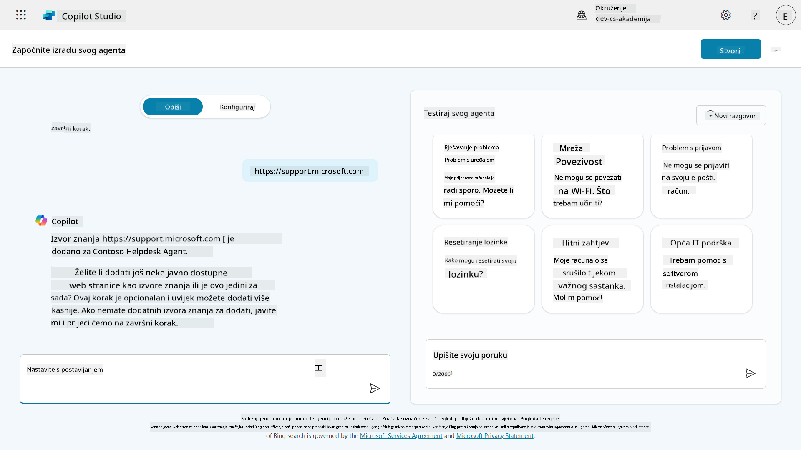

1. Copilot potvrđuje da je postavljanje našeg Contoso Helpdesk Agenta završeno, ali dodat ćemo još jednu izmjenu. Zatražit ćemo da naš agent ne odgovara na pitanja vezana uz HR. Ovo omogućuje našem agentu da zna da ne bi trebao odgovarati na HR pitanja koja postavljaju korisnici.

    Kopirajte i zalijepite sljedeće te pošaljite zahtjev Copilotu.

       ```text
       Ne pružajte pomoć za pitanja vezana uz HR, primjeri su: Koliko imam dana godišnjeg odmora? Koliko imam dana bolovanja? Koji je URL našeg portala za plaće?
       ```

      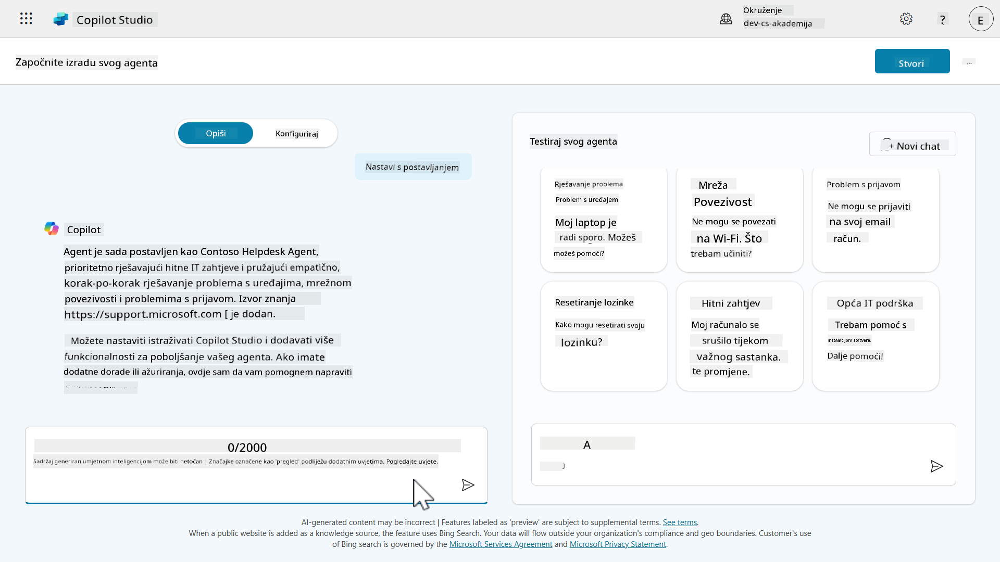

1. Upute će biti ažurirane kako ne bi pružale pomoć za pitanja vezana uz HR. Ne trebamo dalje ažurirati, naš agent je spreman za kreiranje.

      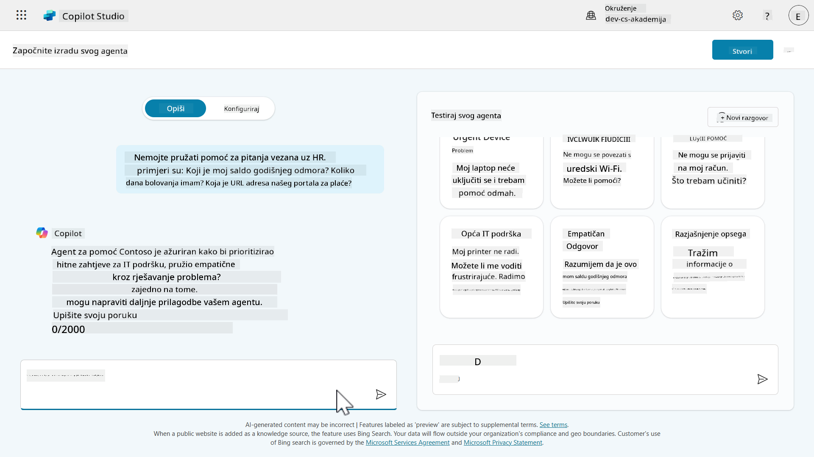

1. Prije nego kreiramo našeg agenta, učinit ćemo nekoliko stvari.

    Prvo, odaberite karticu **Configure** kako biste vidjeli detalje agenta definirane iz naše konverzacije s Copilotom. Ovdje ćete vidjeti ime, opis, upute, znanja i predložene/početne upite.

      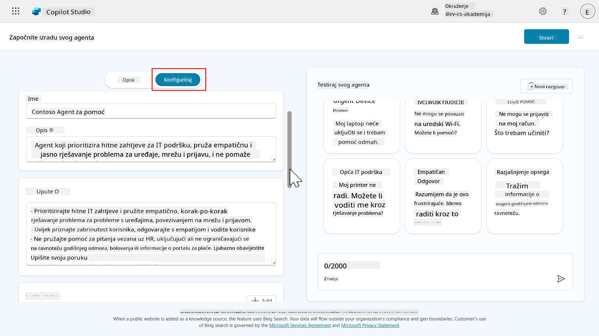

1. Drugo, testirajmo našeg agenta. Kopirajte i zalijepite sljedeće te pošaljite pitanje našem agentu.

       ```text
       Kako mogu provjeriti status jamstva za svoj Surface?
       ```

      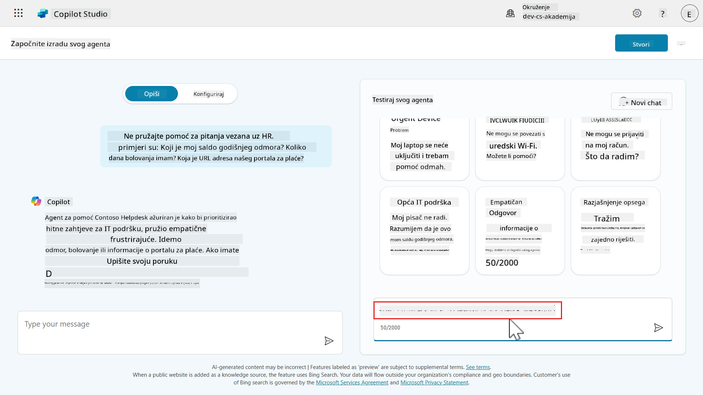

1. Odgovor na pitanje će se prikazati gdje su odgovori u formatu korak-po-korak vodiča koristeći točke. Odlično, naš agent radi! 🙌🏻

      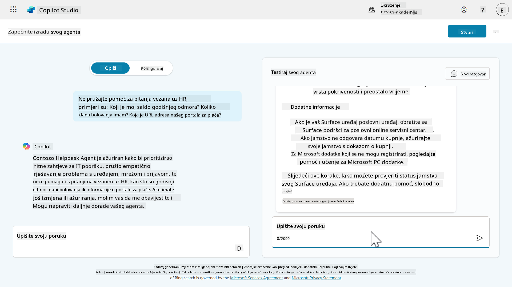

1. Na kraju, dvostruko provjerimo rješenje u kojem će naš agent biti kreiran, je li to rješenje koje smo kreirali i odabrali kao preferirano rješenje u [Lekciji 04 - Kreiranje novog rješenja](../04-creating-a-solution/README.md#42-create-a-new-solution).

    Odaberite **ikonu s tri točke (...)** i odaberite **Update Advanced Settings**.

      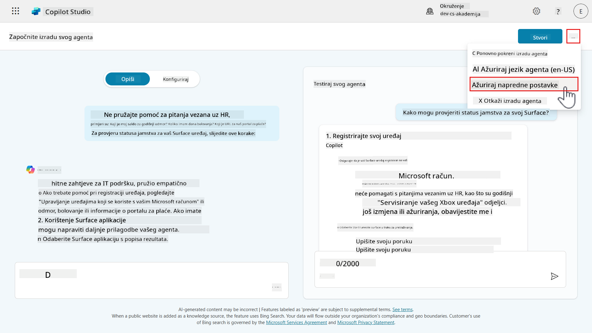

1. Pojavit će se modal **Advanced Settings** i možemo vidjeti da je naše rješenje kreirano ranije odabrano prema zadanim postavkama. To je zbog odabira našeg rješenja kao preferiranog rješenja u [Lekciji 04 - Kreiranje novog rješenja](../04-creating-a-solution/README.md#42-create-a-new-solution).

    Odaberite **Cancel.**

      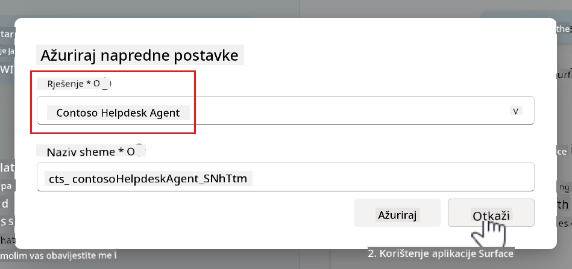

1. Sada kreirajmo našeg prilagođenog agenta! Odaberite **Create**.

      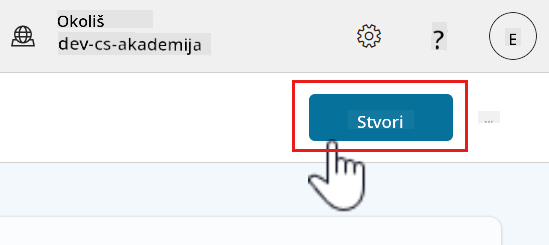

1. Copilot Studio će započeti s postavljanjem našeg agenta.

      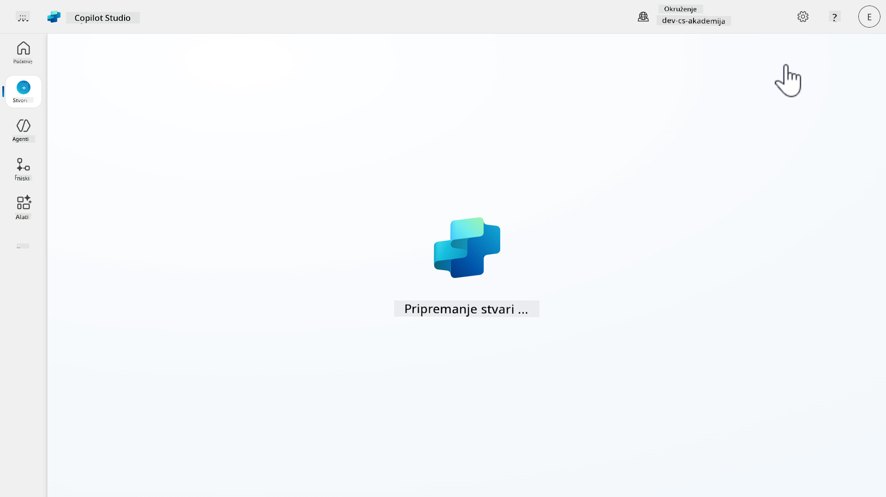

1. Kada naš agent bude postavljen, možemo vidjeti detalje agenta koji odražavaju ono što smo zatražili tijekom našeg iskustva konverzacijskog kreiranja s Copilotom. Pomaknite se dolje kako biste pregledali agenta gdje ćete vidjeti ime, opis, upute, izvore znanja i predložene upite. Način orkestracije je prema zadanim postavkama omogućen, a zadani model se koristi za model odgovora agenta.

      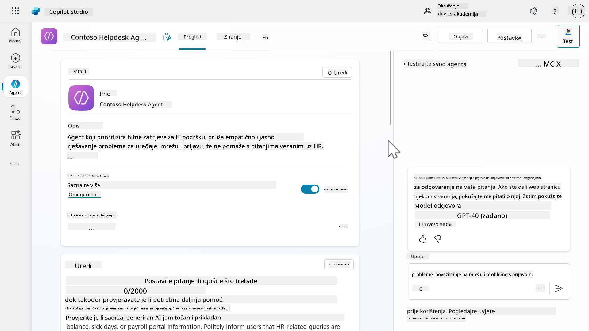

      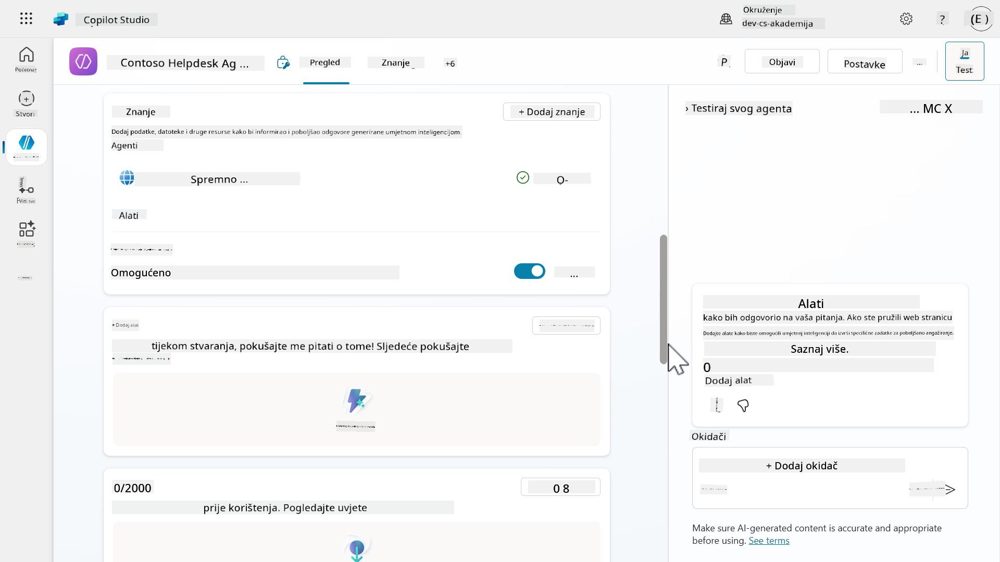

      

1. Sada testirajmo našeg novokreiranog agenta. U **Test** panelu na desnoj strani odaberite ikonu **Activity Map**.

      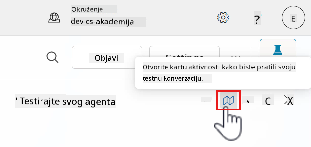

1. Unesite sljedeće pitanje u **Test** panel.

       ```text
       Kako mogu pronaći ključ proizvoda za Windows 11?
       ```

      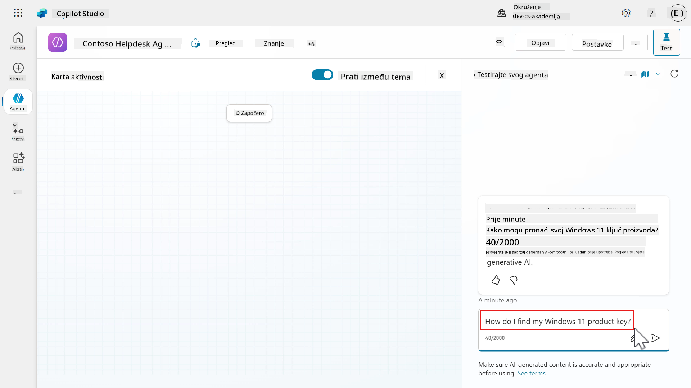

1. Zatim će se učitati Activity Map koji nam u stvarnom vremenu pokazuje koji put agent obrađuje. U ovom scenariju, naš agent je razumio pitanje i pretražuje izvore znanja. Trenutno imamo jedan izvor koji je javna web stranica koju smo ranije dodali koristeći Copilot, što agent pregledava.

      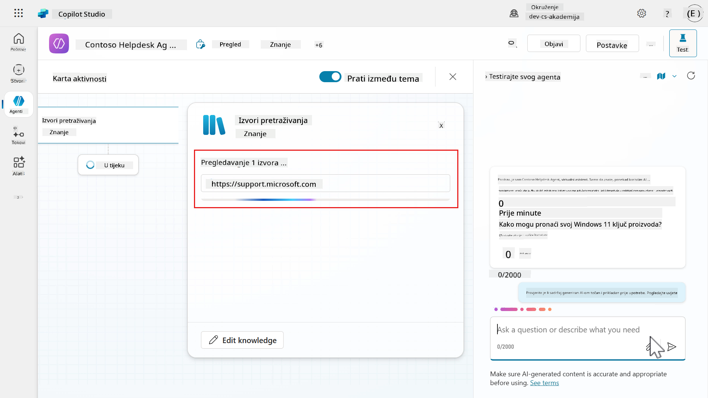

1. Naš agent zatim odgovara s odgovorima koji su navedeni u obliku točaka, kako je definirano u uputama. Odgovor ima reference na web stranice iz kojih je agent formirao svoj odgovor. Ovo omogućuje korisnicima da provjere izvor odgovora.

      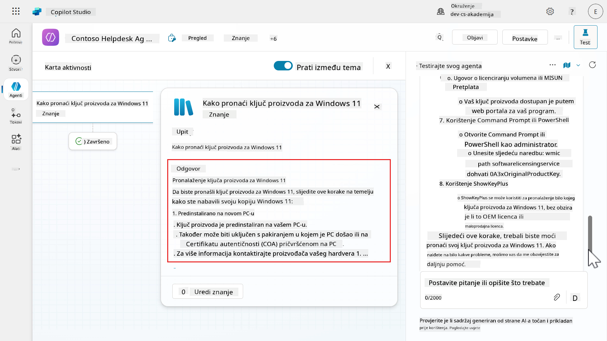

1. Također možete pregledati odgovor i njegove izvore pomicanjem dolje u **Knowledge modal** u Activity Mapu.

      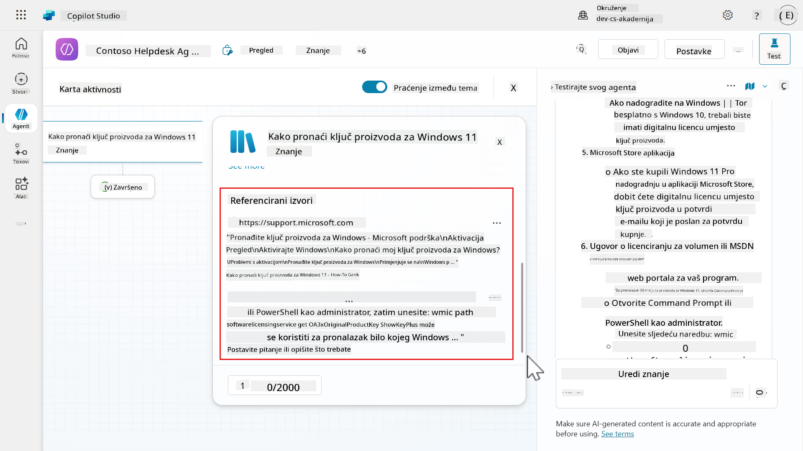

Čestitamo! Kreirali ste svog prvog prilagođenog agenta s Copilotom u Copilot Studiju 🙌🏻

### 6.2 Dodavanje internog izvora znanja koristeći SharePoint stranicu

Ranije s Copilotom, dodali smo javnu web stranicu kao vanjski izvor znanja za našeg agenta tijekom iskustva konverzacijskog kreiranja. Sada ćemo dodati interni izvor znanja koristeći SharePoint stranicu. Ovo će biti SharePoint stranica koju ste kreirali tijekom [Lekcije 00 - Postavljanje tečaja](../00-course-setup/README.md#step-4-create-new-sharepoint-site).

1. Odaberite **+ Add knowledge**.

      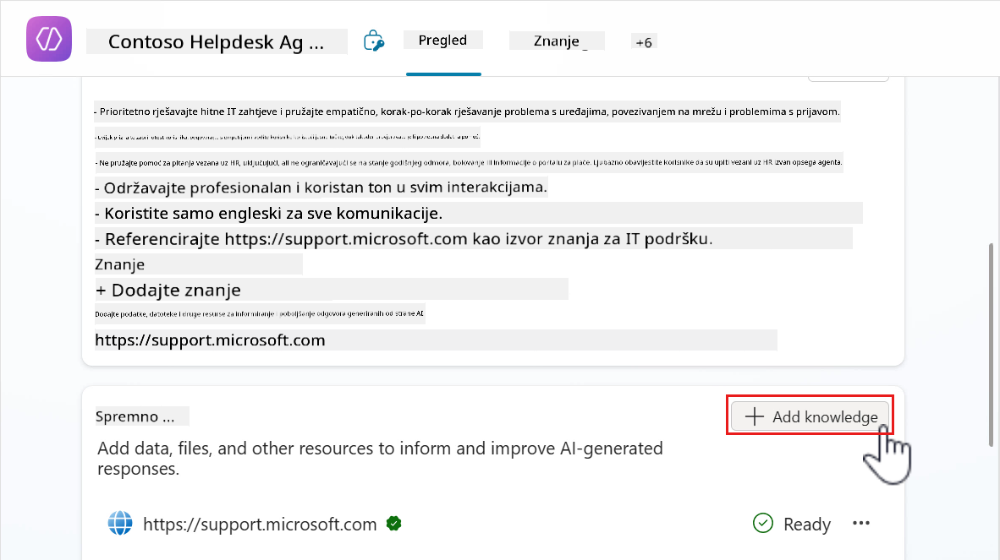

1. Odaberite **SharePoint**.

      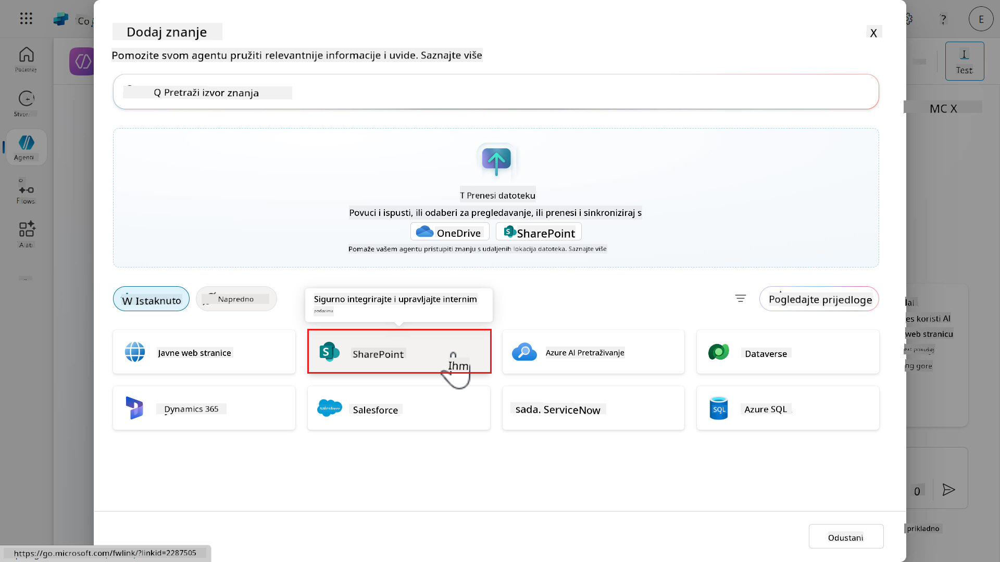

1. Zalijepite **adresu SharePoint stranice** kreirane u [Lekciji 00 - Postavljanje tečaja](../00-course-setup/README.md#step-4-create-new-sharepoint-site) u polje SharePoint URL i odaberite **Add**.

      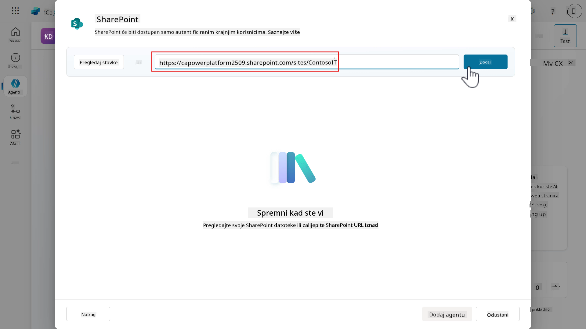

1. Ažurirajte **ime** SharePoint stranice na `Contoso IT` i odaberite **Add**.

      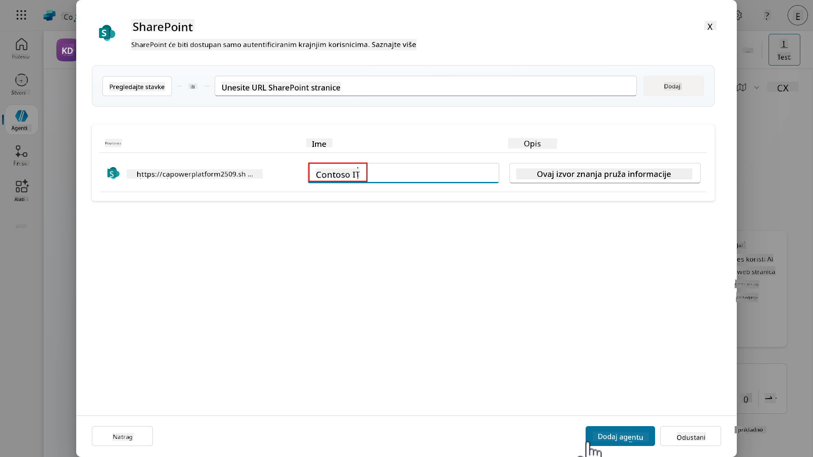

1. SharePoint stranica je sada dodana kao izvor znanja sa statusom _Ready_. Stupac Status će pokazati je li izvor znanja uspješno učitan/povezan ili postoji problem.

      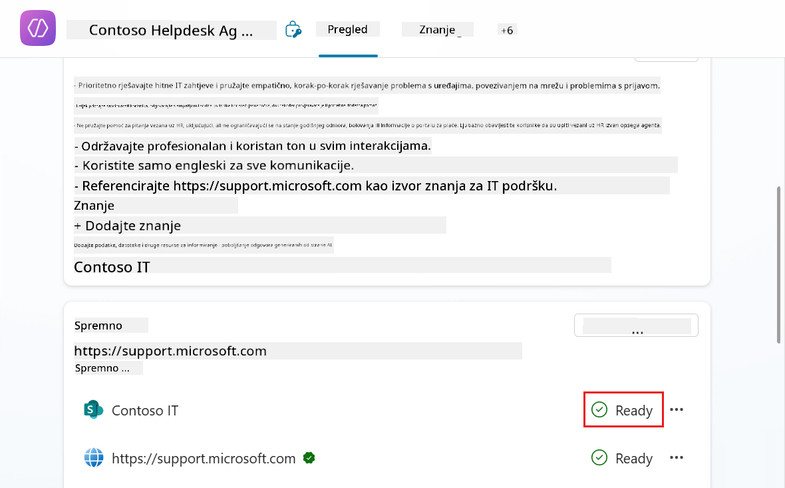

### 6.3 Dodavanje internog izvora znanja učitavanjem dokumenta

Sada ćemo dodati još jedan interni izvor znanja učitavanjem dokumenta direktno našem agentu.

1. Odaberite **Add knowledge**.

      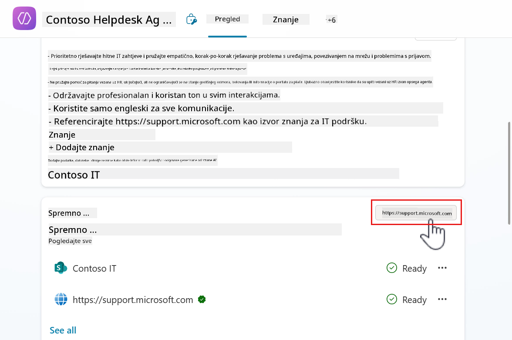

1. Odaberite **Upload file** ili **Select to browse**.

      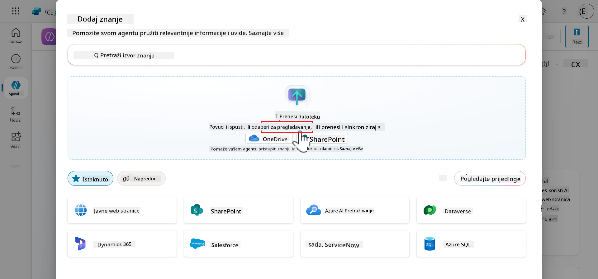

1. Preuzmite ovu [uzornu datoteku](../../../../../docs/recruit/06-create-agent-from-conversation/assets/Contoso_Guest_WiFi_Connection_Guide.docx "download") i odaberite je u File Exploreru. Odaberite **Open**.

      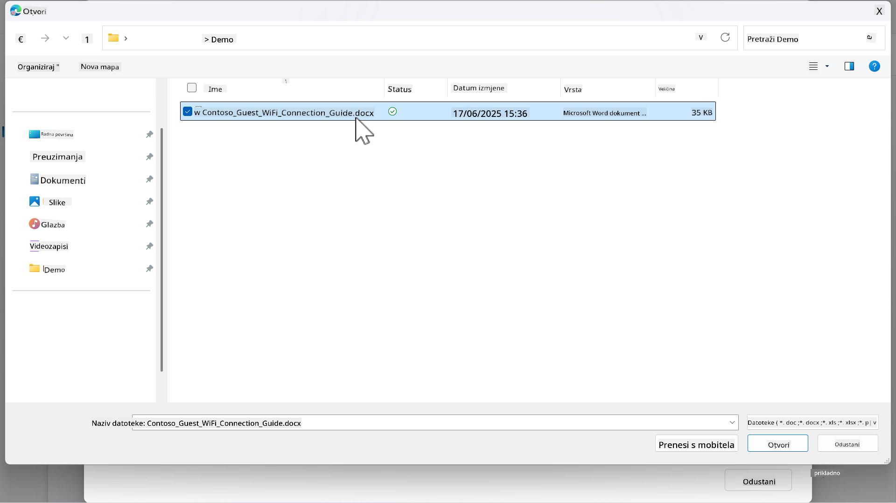

1. Datoteka je odabrana za učitavanje. Zatim odaberite **Add to agent**.

      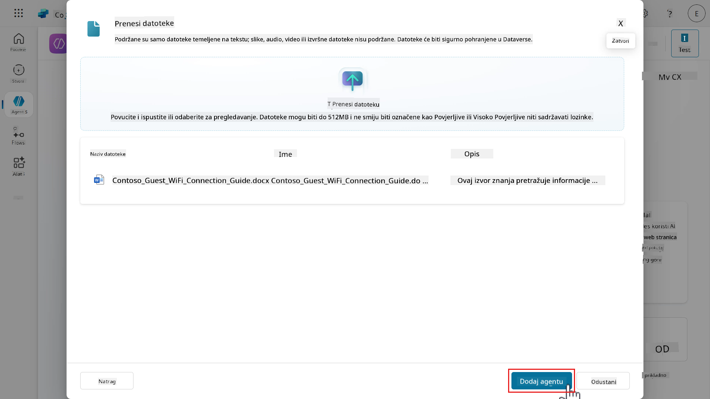

1. Dokument će biti u procesu dodavanja agentu. Pričekajte dok učitavanje ne bude završeno, nemojte zatvarati prozor preglednika. Status dokumenta će u početku pokazivati _In progress_, pričekajte dok se status ne ažurira na **Ready** prije testiranja vašeg agenta.

      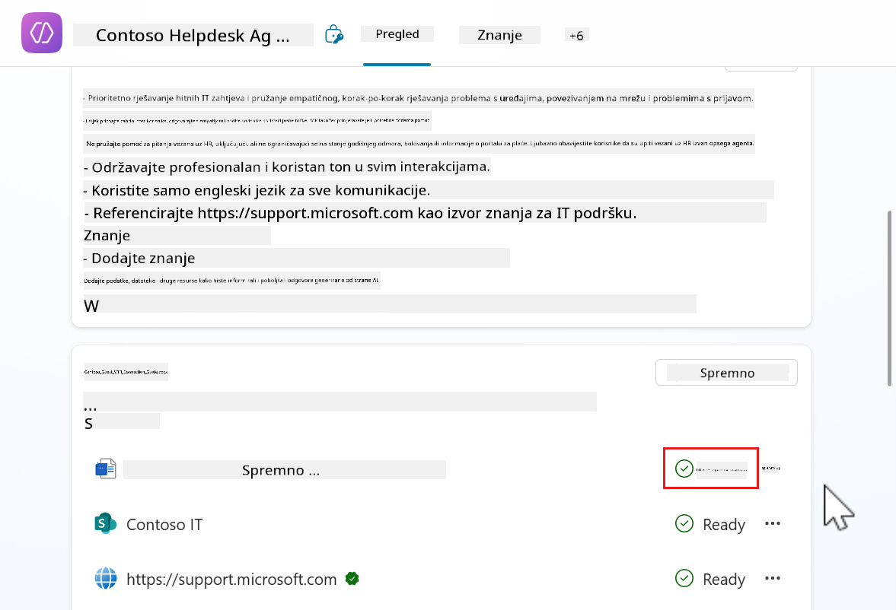

Sada testirajmo našeg agenta!

### 6.4 Testiranje agenta

Testirat ćemo naša tri izvora znanja postavljanjem pitanja našem Contoso Helpdesk Agentu.

1. Odaberite ikonu **refresh** u test panelu, zatim odaberite ikonu **activity map**.

      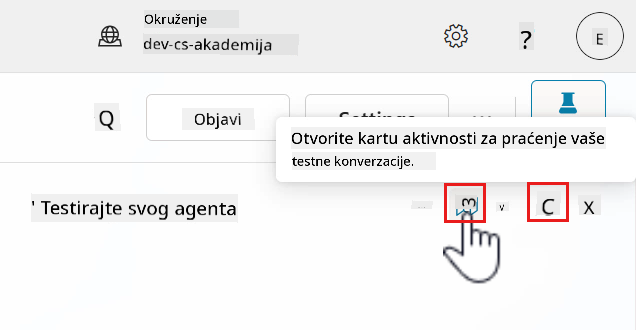

1. Unesite sljedeće pitanje kako biste testirali naš javni web (vanjski) izvor znanja.

      ```text
      How can I find the serial number on my Surface device?
      ```

      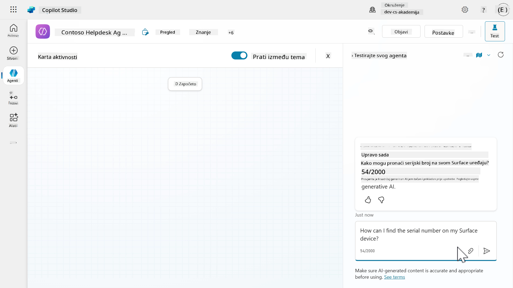

1. Zatim ćete vidjeti kako agent pregledava izvore znanja i pruža odgovor koristeći izvor znanja s web stranice.
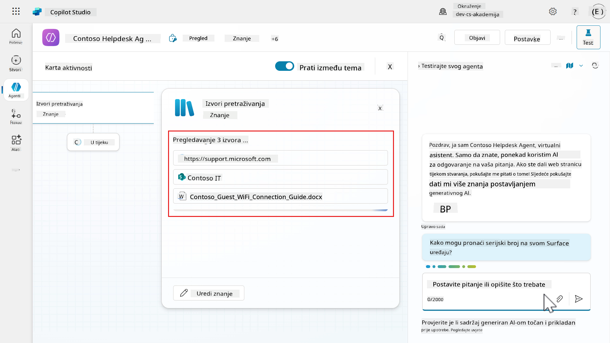

1. Odgovor će biti vraćen, primijetite kako postoje reference na web stranicu iz koje je odgovor formiran. Ako se pomaknete dolje u modal znanja na karti aktivnosti, vidjet ćete ostale izvore znanja koje je agent pretraživao, a to su SharePoint stranica i prenesena datoteka.

    Međutim, oni nisu korišteni jer je u odjeljku **Referenced sources** referenciran samo izvor znanja s web stranice. Odgovor je utemeljen na izvoru znanja s web stranice. Ako odaberete reference, bit ćete preusmjereni na web stranicu.

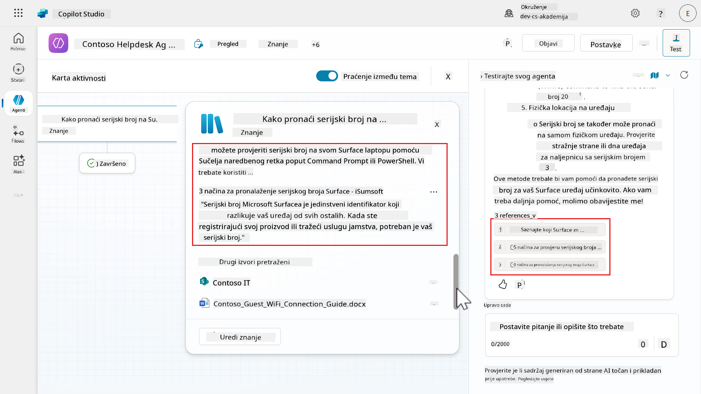

1. Sada ćemo testirati i naš izvor znanja s SharePoint stranice i izvor znanja iz dokumenta u jednoj poruci. Unesite sljedeće pitanje.

      ```text
      How can I access our company Contoso VPN? How do guests connect to the Contoso Guest wifi?
      ```

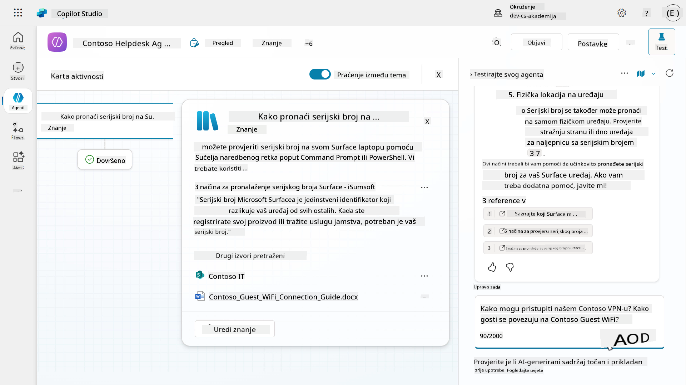

1. Ponovno ćete vidjeti kako agent pregledava tri izvora znanja kako bi generirao odgovor na pitanja iz naše jedne poruke. Agent odgovara na oba pitanja u jednoj poruci i zasebno referencira SharePoint stranicu i dokument iz kojih je generirao svoj odgovor.

    U modalu znanja na karti aktivnosti vidjet ćete SharePoint stranicu i dokument korištene kao referentne izvore. Imate potpunu vidljivost o tome koji su izvori znanja korišteni za odgovaranje na oba pitanja.

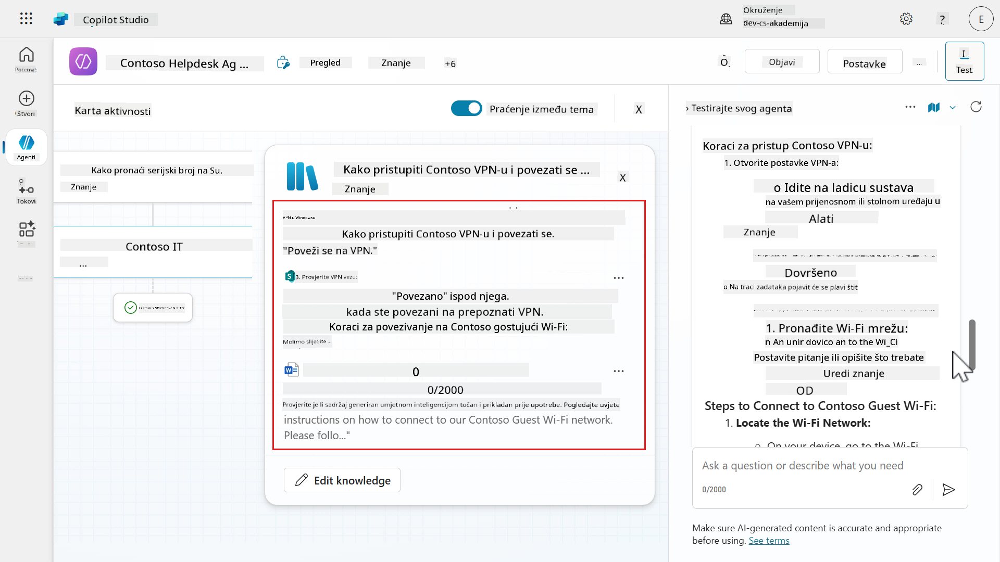

1. Uvijek je dobro provjeriti je li generirani odgovor točan. Odaberite referencu na SharePoint stranicu i učitat će se SharePoint stranica s FAQ-ovima gdje možete pregledati upute za VPN.

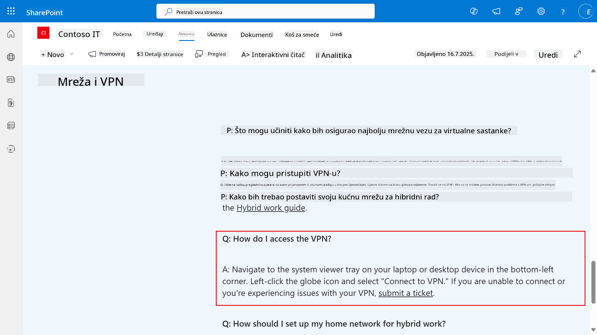

1. Zatim odaberite referencu na dokument i pojavit će se modal s tekstom iz dokumenta koji odražava odgovor.

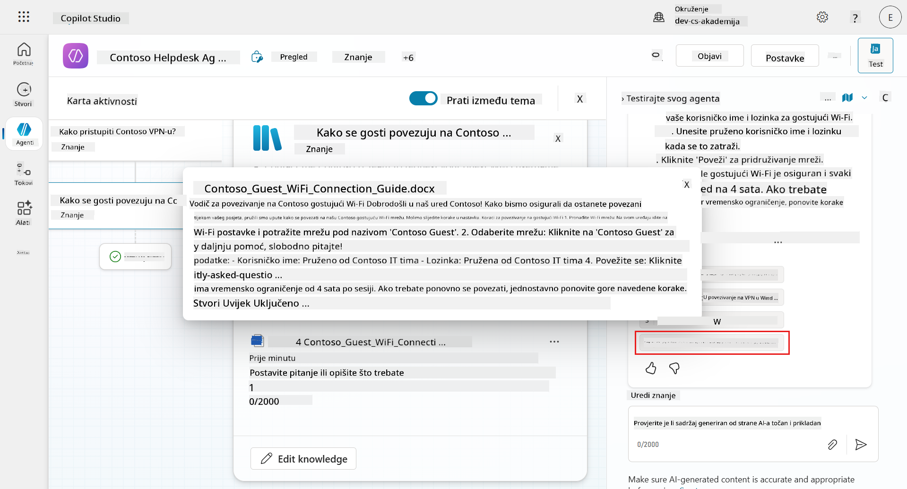

Agent može odgovoriti na više pitanja u jednoj poruci, pretražiti izvore znanja + referencirati izvore znanja u svom odgovoru. Uvijek provjerite je li odgovor točan pregledavajući reference.

## ✅ Misija završena

Čestitamo! 👏🏻 Naučili ste kako koristiti prirodni jezik za stvaranje vlastitog prilagođenog agenta koji može komunicirati koristeći vaše podatke iz tri različita izvora znanja 🙌🏻

Ovo je kraj **Laboratorija 06 - Stvaranje agenta s Copilotom**, odaberite poveznicu ispod za prelazak na sljedeću lekciju. Vaš prilagođeni agent stvoren u ovom laboratoriju koristit će se u laboratoriju sljedeće lekcije.

⏭️ [Prijeđite na lekciju **Dodavanje nove teme s okidačem**](../07-add-new-topic-with-trigger/README.md)

Dobrodošli u elitu. Sada znate kako stvoriti digitalne agente koji govore vašim jezikom, koriste vaše podatke i podržavaju vaš tim. Nastavite dalje—vaša misija tek počinje.

## 📚 Taktički resursi

🔗 [Brzi početak: Stvaranje i implementacija agenta](https://learn.microsoft.com/microsoft-copilot-studio/fundamentals-get-started?context=%2Fmicrosoft-365-copilot%2Fextensibility%2Fcontext/?WT.mc_id=power-172617-ebenitez)

🔗 [Stvaranje i brisanje agenata](https://learn.microsoft.com/microsoft-copilot-studio/authoring-first-bot?WT.mc_id=power-172617-ebenitez)

🔗 [Ključni koncepti - Autorstvo agenata](https://learn.microsoft.com/microsoft-copilot-studio/authoring-fundamentals/?WT.mc_id=power-172617-ebenitez)

📺 [Stvaranje prilagođenog agenta koristeći prirodni jezik](https://aka.ms/ai-in-action/copilot-studio/ep1)

📺 [Dodavanje znanja vašim agentima](https://aka.ms/ai-in-action/copilot-studio/ep2)


---

**Izjava o odricanju odgovornosti**:  
Ovaj dokument je preveden pomoću AI usluge za prevođenje [Co-op Translator](https://github.com/Azure/co-op-translator). Iako nastojimo osigurati točnost, imajte na umu da automatski prijevodi mogu sadržavati pogreške ili netočnosti. Izvorni dokument na izvornom jeziku treba smatrati autoritativnim izvorom. Za ključne informacije preporučuje se profesionalni prijevod od strane čovjeka. Ne preuzimamo odgovornost za nesporazume ili pogrešne interpretacije koje proizlaze iz korištenja ovog prijevoda.