<!--
CO_OP_TRANSLATOR_METADATA:
{
  "original_hash": "cd99a76bcb7372ac2771b6ae178b023d",
  "translation_date": "2025-10-20T23:22:07+00:00",
  "source_file": "docs/recruit/10-add-event-triggers/README.md",
  "language_code": "hr"
}
-->
# 🚨 Misija 10: Dodavanje okidača događaja - Omogućite autonomne sposobnosti agenta

## 🕵️‍♂️ KODNO IME: `OPERACIJA DUHOVNA RUTINA`

> **⏱️ Vremenski okvir operacije:** `~45 minuta`

🎥 **Pogledajte vodič**

[](https://www.youtube.com/watch?v=ZgwHL8PQ1nY "Pogledajte vodič na YouTubeu")

## 🎯 Kratak opis misije

Vrijeme je da unaprijedite svog agenta iz razgovornog asistenta u autonomnog operativca. Vaša misija je omogućiti vašem agentu da djeluje bez poziva - reagirajući na signale iz vašeg digitalnog okruženja s preciznošću i brzinom.

Uz okidače događaja, obučit ćete svog agenta da prati vanjske sustave poput SharePointa, Teamsa i Outlooka te izvršava inteligentne radnje čim primi signal. Ova operacija transformira vašeg agenta u potpuno operativnog terenskog agenta - tihog, brzog i uvijek budnog.

Uspjeh znači izgradnju agenata koji stvaraju vrijednost - ne samo da na nju reagiraju.

## 🔎 Ciljevi

📖 Ova lekcija obuhvaća:

- Razumijevanje okidača događaja i kako omogućuju autonomno ponašanje agenta
- Učenje razlike između okidača događaja i okidača tema, uključujući tijekove rada okidača i podatkovne pakete
- Istraživanje uobičajenih scenarija okidača događaja
- Razumijevanje autentifikacije, sigurnosti i razmatranja objavljivanja za agente vođene događajima
- Izgradnju autonomnog IT Help Desk agenta koji reagira na događaje u SharePointu i šalje potvrde putem e-pošte

## 🤔 Što je okidač događaja?

**Okidač događaja** je mehanizam koji omogućuje vašem agentu da djeluje autonomno kao odgovor na vanjske događaje, bez potrebe za izravnim unosom korisnika. Zamislite to kao da vaš agent "promatra" određene događaje i automatski poduzima radnje kada se ti događaji dogode.

Za razliku od okidača tema, koji zahtijevaju da korisnici nešto upišu kako bi aktivirali razgovor, okidači događaja aktiviraju se na temelju događaja koji se događaju u vašim povezanim sustavima. Npr.:

- Kada se stvori nova datoteka u SharePointu ili OneDrive for Business
- Kada se stvori zapis u Dataverseu
- Kada se zadatak završi u Planneru
- Kada se pošalje novi odgovor na Microsoft Forms
- Kada se doda nova poruka u Microsoft Teams
- Na temelju ponavljajućeg rasporeda (poput dnevnih podsjetnika)  
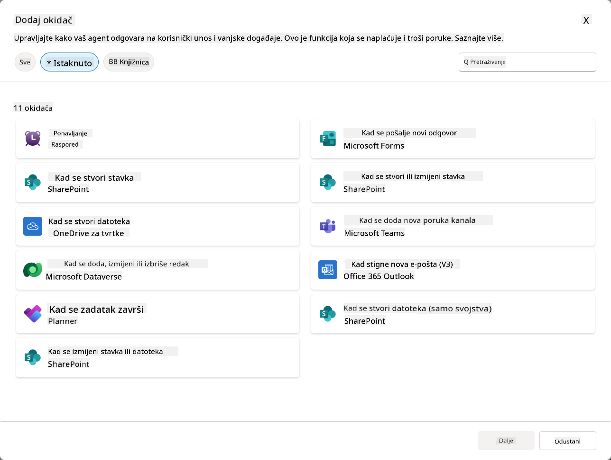

### Zašto su okidači događaja važni za autonomne agente

Okidači događaja transformiraju vašeg agenta iz reaktivnog asistenta u proaktivnog, autonomnog pomagača:

1. **Autonomno djelovanje** - vaš agent može raditi 24/7 bez ljudske intervencije, reagirajući na događaje čim se dogode.
    - *Primjer:* Automatski pozdravite nove članove tima kada se dodaju u tim.

1. **Odgovor u stvarnom vremenu** - umjesto da čeka da korisnici postave pitanja, vaš agent odmah reagira na relevantne događaje.
    - *Primjer:* Upozorite IT tim kada se dokument u SharePointu izmijeni.

1. **Automatizacija tijeka rada** - povežite više radnji na temelju jednog događaja okidača.
    - *Primjer:* Kada se stvori nova podrška, kreirajte zadatak, obavijestite voditelja i ažurirajte nadzornu ploču.

1. **Dosljedni procesi** - osigurajte da se važni koraci nikada ne preskoče automatiziranjem odgovora na ključne događaje.
    - *Primjer:* Svaki novi zaposlenik automatski dobiva materijale za uvođenje i zahtjeve za pristup.

1. **Radnje temeljene na podacima** - koristite informacije iz događaja okidača za donošenje pametnih odluka i poduzimanje odgovarajućih radnji.
    - *Primjer:* Usmjerite hitne zahtjeve na starije osoblje na temelju razine prioriteta u podatkovnom paketu okidača.

## ⚙️ Kako funkcioniraju okidači događaja?

Okidači događaja djeluju kroz trostupanjski tijek rada koji omogućuje vašem agentu da autonomno reagira na vanjske događaje:

### Tijek rada okidača

1. **Otkrivanje događaja** - Specifičan događaj se događa u povezanom sustavu (SharePoint, Teams, Outlook itd.)
1. **Aktivacija okidača** - Okidač događaja otkriva ovaj događaj i šalje podatkovni paket vašem agentu putem Power Automate Cloud Flow-a.
1. **Odgovor agenta** - Vaš agent prima podatkovni paket i izvršava definirane upute.

### Okidači događaja vs okidači tema

Razumijevanje razlike između ove dvije vrste okidača je ključno:

| **Okidači događaja** | **Okidači tema** |
|-------------------|-------------------|
| Aktiviraju se vanjskim događajima sustava | Aktiviraju se unosom korisnika/izraza |
| Omogućuju autonomno ponašanje agenta | Omogućuju razgovorne odgovore |
| Koriste autentifikaciju kreatora | Opcija za autentifikaciju korisnika |
| Djeluju bez interakcije korisnika | Zahtijevaju da korisnik započne razgovor |
| Primjeri: Stvorena datoteka, primljena e-pošta | Primjer: "Kakvo je vrijeme?" |

## 📦 Razumijevanje podatkovnih paketa okidača

Kada se dogodi događaj, okidač šalje **podatkovni paket** vašem agentu koji sadrži informacije o događaju i upute kako reagirati.

### Zadani vs prilagođeni podatkovni paketi

Svaka vrsta okidača dolazi sa zadanom strukturom podatkovnog paketa, ali možete je prilagoditi:

**Zadani podatkovni paket** - Koristi standardni format poput `Koristi sadržaj iz {Body}`

- Sadrži osnovne informacije o događaju
- Koristi generičke upute za obradu
- Dobro za jednostavne scenarije

**Prilagođeni podatkovni paket** - Dodajte specifične upute i formatiranje podataka

- Uključuje detaljne upute za vašeg agenta
- Precizno određuje koje podatke koristiti i kako
- Bolje za složene tijekove rada

### Upute za agenta vs upute za prilagođeni podatkovni paket

Imate dva mjesta za usmjeravanje ponašanja vašeg agenta s okidačima događaja:

**Upute za agenta** (Globalne)

- Opće smjernice koje se primjenjuju na sve okidače
- Primjer: "Prilikom obrade zahtjeva, uvijek prvo provjeri duplikate"
- Najbolje za opće obrasce ponašanja

**Upute za podatkovni paket** (Specifične za okidač)

- Specifične upute za pojedine vrste okidača  
- Primjer: "Za ovo ažuriranje u SharePointu, pošalji sažetak u kanal projekta"
- Najbolje za složene agente s više okidača

💡 **Savjet**: Izbjegavajte sukobljene upute između ove dvije razine, jer to može uzrokovati neočekivano ponašanje.

## 🎯 Uobičajeni scenariji okidača događaja

Evo praktičnih primjera kako okidači događaja mogu unaprijediti vašeg agenta:

### IT Help Desk Agent

- **Okidač**: Novi element na popisu SharePointa (zahtjev za podršku)
- **Radnja**: Automatski kategoriziraj, dodijeli prioritet i obavijesti odgovarajuće članove tima

### Agent za uvođenje zaposlenika

- **Okidač**: Novi korisnik dodan u Dataverse
- **Radnja**: Pošalji poruku dobrodošlice, kreiraj zadatke za uvođenje i dodijeli pristup

### Agent za upravljanje projektima

- **Okidač**: Zadatak završen u Planneru
- **Radnja**: Ažuriraj nadzornu ploču projekta, obavijesti dionike i provjeri blokade

### Agent za upravljanje dokumentima

- **Okidač**: Datoteka učitana u određenu mapu SharePointa
- **Radnja**: Izvuci metapodatke, primijeni oznake i obavijesti vlasnike dokumenta

### Agent za sastanke

- **Okidač**: Stvoren događaj u kalendaru
- **Radnja**: Pošalji podsjetnike i dnevni red prije sastanka, rezerviraj resurse

## ⚠️ Razmatranja o objavljivanju i autentifikaciji

Prije nego vaš agent može koristiti okidače događaja u produkciji, morate razumjeti implikacije autentifikacije i sigurnosti.

### Autentifikacija kreatora

Okidači događaja koriste **podatke za prijavu kreatora agenta** za svu autentifikaciju:

- Vaš agent pristupa sustavima koristeći vaše dozvole
- Korisnici potencijalno mogu pristupiti podacima putem vaših podataka za prijavu
- Sve radnje se izvode "kao vi" čak i kada korisnici komuniciraju s agentom

### Najbolje prakse za zaštitu podataka

Kako biste održali sigurnost prilikom objavljivanja agenata s okidačima događaja:

1. **Procijenite pristup podacima** - Pregledajte koje sustave i podatke vaši okidači mogu pristupiti
1. **Temeljito testirajte** - Razumijte koje informacije okidači uključuju u podatkovne pakete
1. **Ograničite opseg okidača** - Koristite specifične parametre za ograničavanje događaja koji aktiviraju okidače
1. **Pregledajte podatkovne pakete** - Osigurajte da okidači ne otkrivaju osjetljive informacije
1. **Pratite korištenje** - Pratite aktivnost okidača i potrošnju resursa

## ⚠️ Rješavanje problema i ograničenja

Imajte na umu ove važne razmatranja prilikom rada s okidačima događaja:

### Utjecaj na kvotu i naplatu

- Svaka aktivacija okidača računa se u vašu potrošnju poruka
- Česti okidači (poput ponavljanja svake minute) mogu brzo potrošiti kvotu
- Pratite korištenje kako biste izbjegli ograničenja

### Tehnički zahtjevi

- Dostupno samo za agente s omogućenim generativnim orkestracijama
- Zahtijeva omogućeno dijeljenje rješenja svjesnih cloud tijekova rada u vašem okruženju

### Prevencija gubitka podataka (DLP)

- Politike DLP vaše organizacije određuju koji su okidači dostupni
- Administratori mogu potpuno blokirati okidače događaja
- Kontaktirajte svog administratora ako očekivani okidači nisu dostupni

## 🧪 Laboratorij 10 - Dodavanje okidača događaja za autonomno ponašanje agenta

### 🎯 Slučaj upotrebe

Unaprijedit ćete svog IT Help Desk agenta kako bi automatski reagirao na nove zahtjeve za podršku. Kada netko stvori novi element na popisu zahtjeva za podršku u SharePointu, vaš agent će:

1. Automatski se aktivirati kada se stvori zahtjev u SharePointu
1. Pružiti detalje o zahtjevu i upute o koracima koje želite da izvrši
1. Automatski potvrditi zahtjev podnositelju putem e-pošte generirane pomoću AI-a

Ovaj laboratorij demonstrira kako okidači događaja omogućuju istinski autonomno ponašanje agenta.

### Preduvjeti

Prije početka ovog laboratorija, osigurajte da imate:

- ✅ Završene prethodne laboratorije (posebno Laboratorij 6-8 za IT Help Desk agenta)
- ✅ Pristup SharePoint stranici s popisom zahtjeva za IT podršku
- ✅ Okruženje Copilot Studio s omogućenim okidačima događaja
- ✅ Vaš agent ima omogućen generativni orkestraciju
- ✅ Odgovarajuće dozvole u SharePointu i vašem Copilot Studio okruženju

### 10.1 Omogućite Generativni AI i kreirajte okidač za stvaranje elementa u SharePointu

1. Otvorite svog **IT Help Desk agenta** u **Copilot Studio**

1. Prvo, osigurajte da je **Generativni AI** omogućen za vašeg agenta:
   - Idite na karticu **Pregled**
   - U odjeljku Orkestracija, uključite **Generativnu orkestraciju** na **Uključeno** ako već nije  
     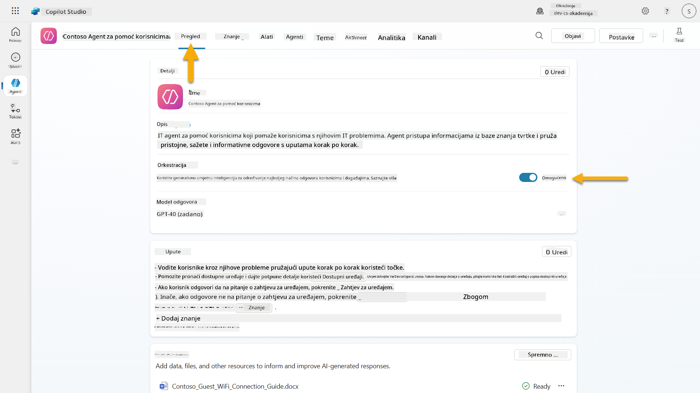

1. Idite na karticu **Pregled** i pronađite odjeljak **Okidači**

1. Kliknite **+ Dodaj okidač** kako biste otvorili knjižnicu okidača  
    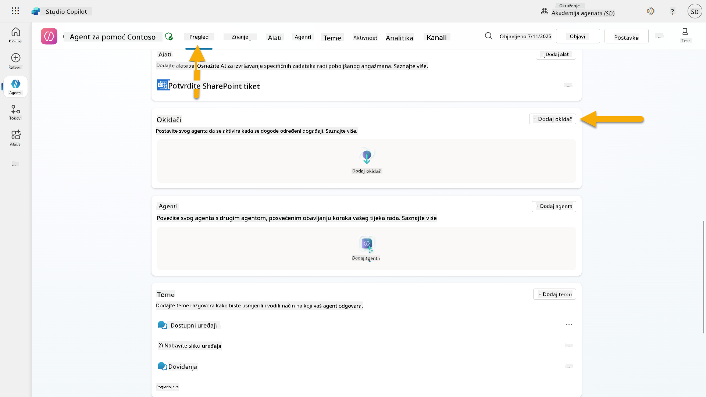

1. Pretražite i odaberite **Kada se stvori element** (SharePoint)  
    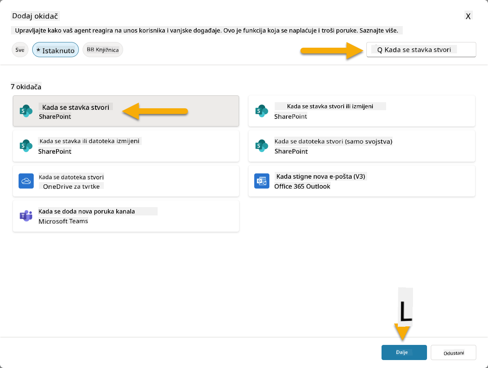

1. Konfigurirajte naziv okidača i veze:

   - **Naziv okidača:** Novi zahtjev za podršku stvoren u SharePointu

1. Pričekajte da se veze konfiguriraju, zatim odaberite **Dalje** za nastavak.  
   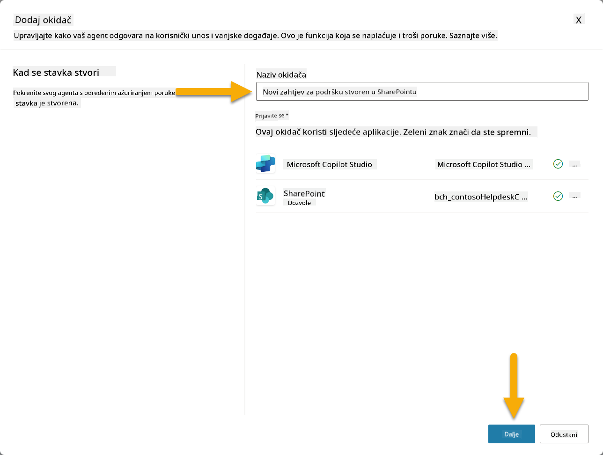

1. Konfigurirajte parametre okidača:

   - **Adresa stranice**: Odaberite svoju "Contoso IT" SharePoint stranicu

   - **Naziv popisa**: Odaberite svoj popis "Zahtjevi"

   - **Dodatne upute agentu kada ga okidač aktivira:**

     ```text
     New Support Ticket Created in SharePoint: {Body}
     
     Use the 'Acknowledge SharePoint Ticket' tool to generate the email body automatically and respond.
     
     IMPORTANT: Do not wait for any user input. Work completely autonomously.
     ```

     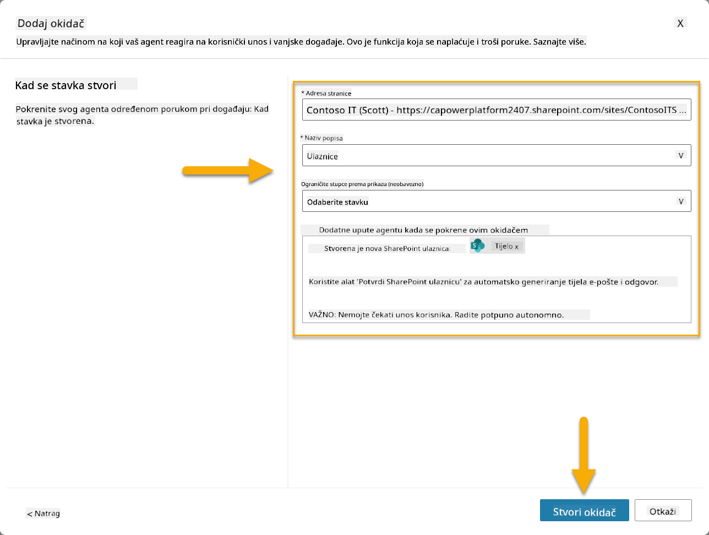

1. Odaberite **Kreiraj okidač** kako biste dovršili kreiranje okidača. Automatski se kreira Power Automate Cloud Flow za autonomno aktiviranje agenta.

1. Odaberite **Zatvori**.

### 10.2 Uredite okidač

1. Unutar odjeljka **Okidači** na kartici **Pregled**, odaberite izbornik **...** na okidaču **Novi zahtjev za podršku stvoren u SharePointu**

1. Odaberite **Uredi u Power Automate**  
   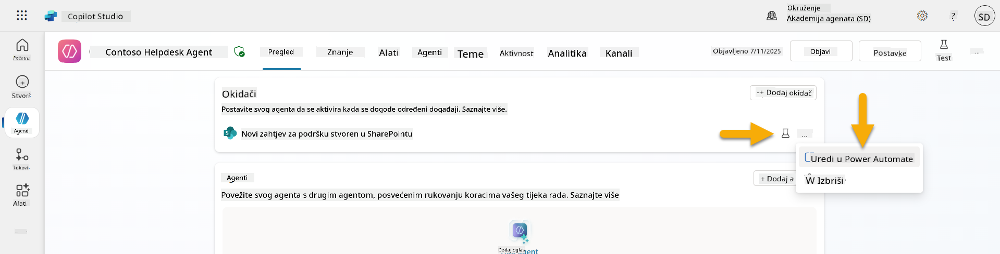

1. Odaberite čvor **Šalje upit navedenom copilotu za obradu**

1. U polju **Tijelo/poruka**, uklonite sadržaj Tijela, **pritisnite tipku kosa crta** (/) i odaberite **Umetni izraz**  
   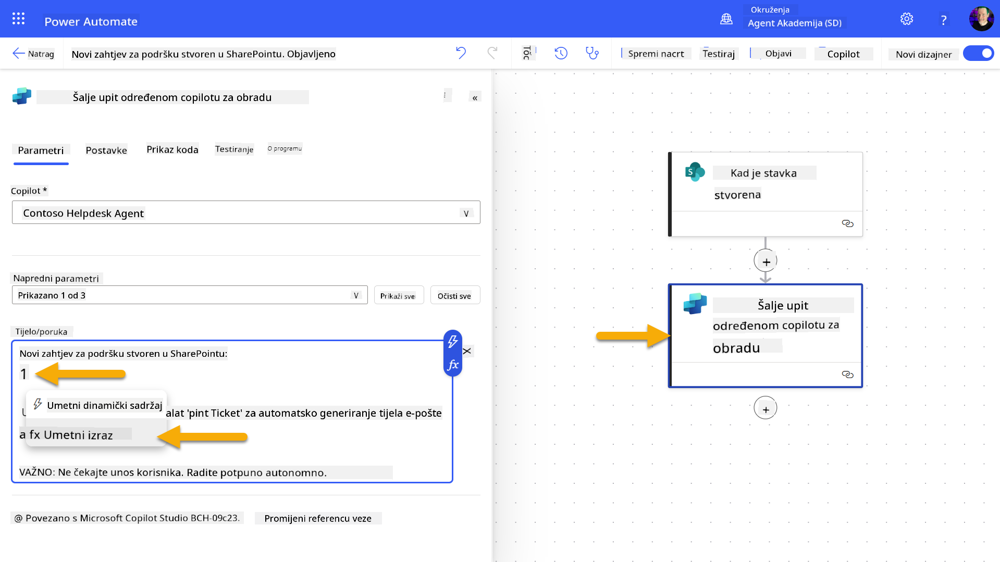

1. Unesite sljedeći izraz kako biste agentu pružili specifične detalje o zahtjevu:

    ```text
    concat('Submitted By Name: ', first(triggerOutputs()?['body/value'])?['Author/DisplayName'], '\nSubmitted By Email: ', first(triggerOutputs()?['body/value'])?['Author/Email'], '\nTitle: ', first(triggerOutputs()?['body/value'])?['Title'], '\nIssue Description: ', first(triggerOutputs()?['body/value'])?['Description'], '\nPriority: ', first(triggerOutputs()?['body/value'])?['Priority/Value'],'\nTicket ID : ', first(triggerOutputs()?['body/value'])?['ID'])
    ```

1. Odaberite **Dodaj**  
   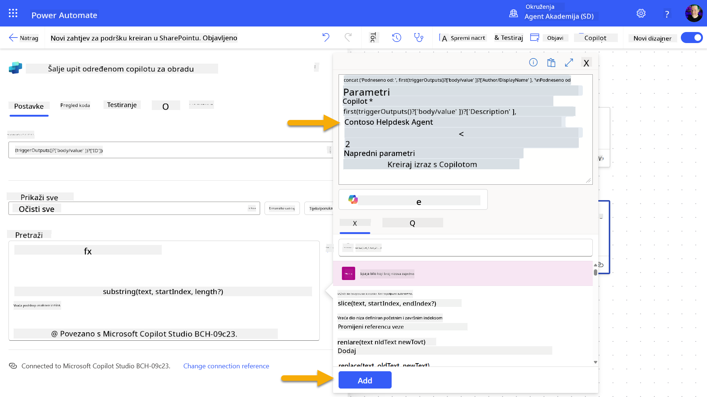

1. Odaberite **Objavi** na gornjoj desnoj alatnoj traci.

### 10.3 Kreirajte alat za potvrdu putem e-pošte

1. **Vratite se** svom agentu u Copilot Studio

1. Idite na karticu **Alati** u svom agentu

1. Kliknite **+ Dodaj alat** i odaberite **Konektor**

1. Pretražite i odaberite konektor **Pošalji e-poštu (V2)**  
    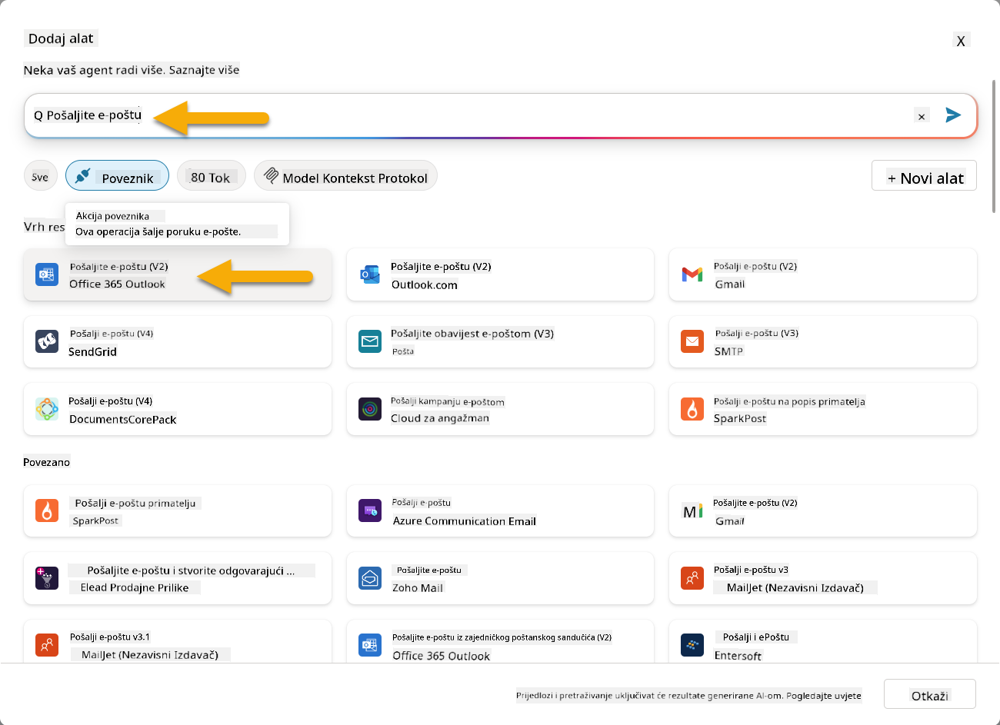

1. Pričekajte da se veza konfigurira, zatim odaberite **Dodaj i konfiguriraj**

1. Konfigurirajte postavke alata:

   - **Naziv**: Potvrdi zahtjev za SharePoint
   - **Opis**: Ovaj alat šalje potvrdu putem e-pošte da je zahtjev primljen.

1. Odaberite **Prilagodi** pored ulaznih parametara i konfigurirajte kako slijedi:

    **Za**:

    - **Opis**: E-mail adresa osobe koja je podnijela zahtjev u SharePointu
    - **Identificiraj kao**: E-mail

    **Tijelo**:

    - **Opis**: Potvrda da je zahtjev primljen i da ćemo odgovoriti u roku od 3 radna dana.

    ![Kon
1. Otvorite novu karticu preglednika i idite na svoj **SharePoint popis IT podrške za prijave problema**
1. Kliknite **+ Dodaj novu stavku** kako biste kreirali testnu prijavu:
   - **Naslov**: "Nemoguće povezivanje na VPN"
   - **Opis**: "Nemoguće povezivanje na korporativnu WIFI mrežu nakon nedavne nadogradnje"
   - **Prioritet**: "Normalno"

1. **Spremite** stavku u SharePoint  
    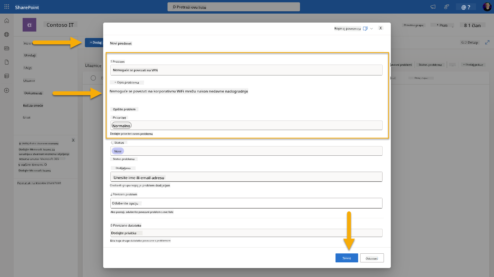
1. Vratite se u **Copilot Studio** i pratite panel **Testiraj svoj okidač** za aktivaciju okidača. Koristite ikonu **Osvježi** kako biste učitali događaj okidača, što može potrajati nekoliko minuta.  
    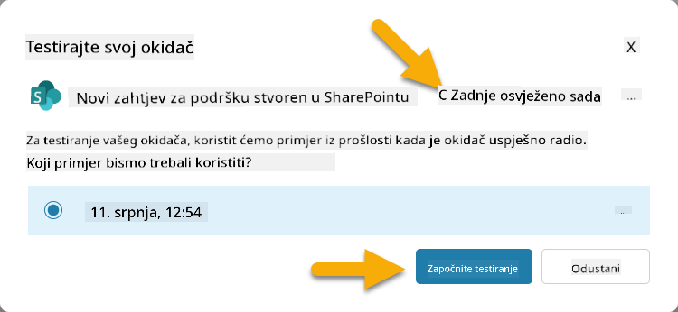
1. Kada se okidač pojavi, odaberite **Započni testiranje**
1. Kliknite na **Ikonu mape aktivnosti** na vrhu panela **Testiraj svog agenta**
1. Provjerite je li vaš agent:
   - Primio podatke okidača
   - Pozvao alat "Potvrdi prijavu problema u SharePointu"  
     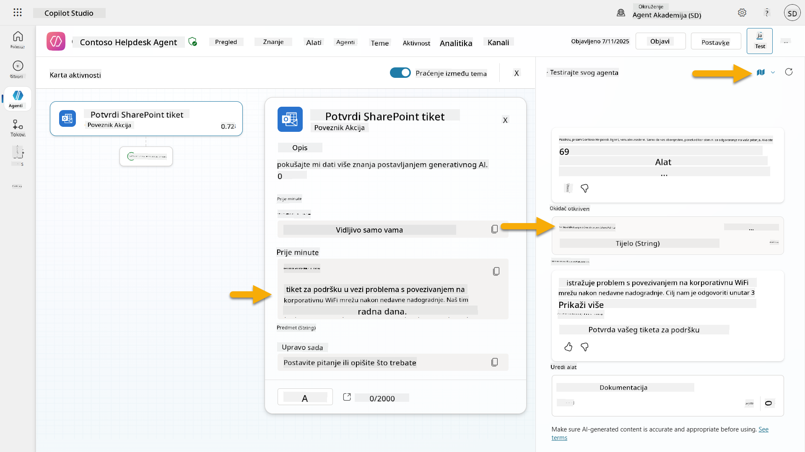
1. Provjerite ulaznu poštu e-pošte podnositelja prijave kako biste potvrdili da je e-mail potvrde poslan  
    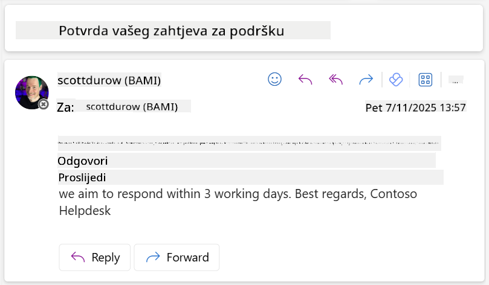
1. Pregledajte karticu **Aktivnost** u Copilot Studio kako biste vidjeli kompletnu izvedbu okidača i alata

## ✅ Misija završena

🎉 **Čestitamo!** Uspješno ste implementirali okidače događaja s alatima konektora koji omogućuju vašem agentu da radi autonomno, automatski šalje potvrde putem e-pošte i obrađuje prijave problema bez intervencije korisnika. Kada vaš agent bude objavljen, djelovat će autonomno u vaše ime.

🚀 **Sljedeće**: U sljedećoj lekciji naučit ćete kako [objaviti svog agenta](../11-publish-your-agent/README.md) na Microsoft Teams i Microsoft 365 Copilot, čineći ga dostupnim cijeloj vašoj organizaciji!

⏭️ [Prijeđite na lekciju **Objavite svog agenta**](../11-publish-your-agent/README.md)

## 📚 Taktički resursi

Spremni za dublje istraživanje okidača događaja i autonomnih agenata? Pogledajte ove resurse:

- **Microsoft Learn**: [Učinite svog agenta autonomnim u Copilot Studio](https://learn.microsoft.com/training/modules/autonomous-agents-online-workshop/?WT.mc_id=power-177340-scottdurow)
- **Dokumentacija**: [Dodajte okidač događaja](https://learn.microsoft.com/microsoft-copilot-studio/authoring-trigger-event?WT.mc_id=power-177340-scottdurow)
- **Najbolje prakse**: [Uvod u okidače Power Automate](https://learn.microsoft.com/power-automate/triggers-introduction?WT.mc_id=power-177340-scottdurow)
- **Napredni scenariji**: [Korištenje Power Automate tokova s agentima](https://learn.microsoft.com/microsoft-copilot-studio/advanced-flow-create?WT.mc_id=power-177340-scottdurow)
- **Sigurnost**: [Prevencija gubitka podataka za Copilot Studio](https://learn.microsoft.com/microsoft-copilot-studio/admin-data-loss-prevention?WT.mc_id=power-177340-scottdurow)


---

**Izjava o odricanju odgovornosti**:  
Ovaj dokument je preveden pomoću AI usluge za prevođenje [Co-op Translator](https://github.com/Azure/co-op-translator). Iako nastojimo osigurati točnost, imajte na umu da automatski prijevodi mogu sadržavati pogreške ili netočnosti. Izvorni dokument na izvornom jeziku treba smatrati autoritativnim izvorom. Za ključne informacije preporučuje se profesionalni prijevod od strane čovjeka. Ne preuzimamo odgovornost za nesporazume ili pogrešna tumačenja koja proizlaze iz korištenja ovog prijevoda.