<!--
CO_OP_TRANSLATOR_METADATA:
{
  "original_hash": "9dceeba2eae2bb73e328602a060eddab",
  "translation_date": "2025-10-20T23:53:45+00:00",
  "source_file": "docs/recruit/11-publish-your-agent/README.md",
  "language_code": "hr"
}
-->
# 🚨 Misija 11: Objavite svog agenta

## 🕵️‍♂️ KODNO IME: `OPERACIJA OBJAVA OBJAVA OBJAVA`

> **⏱️ Vrijeme trajanja operacije:** `~30 minuta`  

🎥 **Pogledajte vodič**

[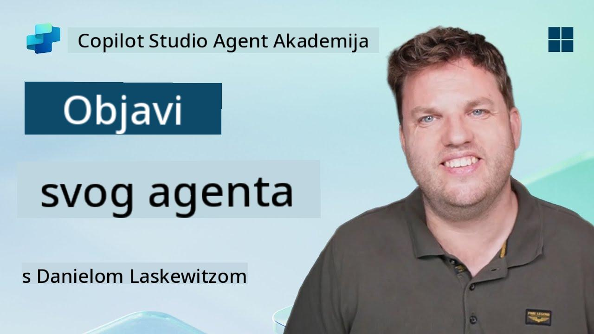](https://www.youtube.com/watch?v=eVZmljhYlSI "Pogledajte vodič na YouTubeu")

## 🎯 Opis misije

Nakon što ste završili niz izazovnih modula, Agent Maker, sada ste spremni za najvažniji korak: objavu svog agenta. Vrijeme je da svoju kreaciju učinite dostupnom korisnicima na Microsoft Teamsu i Microsoft 365 Copilotu.

Vaš agent—opremljen jasnom misijom, moćnim alatima i pristupom ključnim izvorima informacija—spreman je za rad. Koristeći Microsoft Copilot Studio, objavit ćete svog agenta kako bi mogao početi pomagati stvarnim korisnicima, upravo tamo gdje rade.

Pokrenimo vašeg agenta u akciju.

## 🔎 Ciljevi

📖 Ova lekcija obuhvaća:

1. Zašto je važno objaviti svog agenta
1. Što se događa kada objavite svog agenta
1. Kako dodati kanal (Microsoft Teams & Microsoft 365 Copilot)
1. Kako dodati agenta u Microsoft Teams
1. Kako učiniti agenta dostupnim u Microsoft Teamsu za cijelu organizaciju

## 🚀 Objavite agenta

Svaki put kad radite na agentu u Copilot Studiju, možda ćete ga ažurirati dodavanjem novih informacija ili alata. Kada završite sa svim promjenama i temeljito ih testirate, spremni ste za objavu. Objavljivanje osigurava da su najnovija ažuriranja dostupna. Ako ažurirate svog agenta novim alatima, a ne pritisnete gumb za objavu, ažuriranja neće biti dostupna krajnjim korisnicima.

Uvijek se pobrinite da pritisnete gumb za objavu kada želite prenijeti ažuriranja korisnicima svog agenta. Vaš agent može imati dodane kanale, a kada pritisnete objavu, ažuriranja postaju dostupna na svim kanalima koje ste dodali agentu.

## ⚙️ Konfigurirajte kanale

Kanali određuju gdje vaši korisnici mogu pristupiti i komunicirati s vašim agentom. Nakon što objavite svog agenta, možete ga učiniti dostupnim na više kanala. Svaki kanal može prikazati sadržaj vašeg agenta na drugačiji način.

Možete dodati svog agenta na sljedeće kanale:

- **Microsoft Teams i Microsoft 365 Copilot** - Učinite svog agenta dostupnim u Teams razgovorima i sastancima te unutar Microsoft 365 Copilot iskustava ([Saznajte više](https://learn.microsoft.com/microsoft-copilot-studio/publication-add-bot-to-microsoft-teams))
- **Demo web stranica** - Testirajte svog agenta na demo web stranici koju pruža Copilot Studio ([Saznajte više](https://learn.microsoft.com/microsoft-copilot-studio/publication-connect-bot-to-web-channels))
- **Prilagođena web stranica** - Ugradite svog agenta izravno na svoju web stranicu ([Saznajte više](https://learn.microsoft.com/microsoft-copilot-studio/publication-connect-bot-to-web-channels))
- **Mobilna aplikacija** - Integrirajte svog agenta u prilagođenu mobilnu aplikaciju ([Saznajte više](https://learn.microsoft.com/microsoft-copilot-studio/publication-connect-bot-to-custom-application))
- **SharePoint** - Dodajte svog agenta na SharePoint stranice za pomoć s dokumentima i stranicama ([Saznajte više](https://learn.microsoft.com/microsoft-copilot-studio/publication-add-bot-to-sharepoint))
- **Facebook Messenger** - Povežite se s korisnicima putem Facebookove platforme za razmjenu poruka ([Saznajte više](https://learn.microsoft.com/microsoft-copilot-studio/publication-add-bot-to-facebook))
- **Power Pages** - Integrirajte svog agenta u Power Pages web stranice ([Saznajte više](https://learn.microsoft.com/microsoft-copilot-studio/publication-add-bot-to-power-pages))
- **Azure Bot Service kanali** - Pristupite dodatnim kanalima uključujući Slack, Telegram, Twilio SMS i više ([Saznajte više](https://learn.microsoft.com/microsoft-copilot-studio/publication-connect-bot-to-azure-bot-service-channels))

Za dodavanje kanala, idite na karticu **Kanali** u svom agentu i odaberite kanal koji želite konfigurirati. Svaki kanal ima specifične zahtjeve za postavljanje i može zahtijevati dodatnu autentifikaciju ili korake konfiguracije.

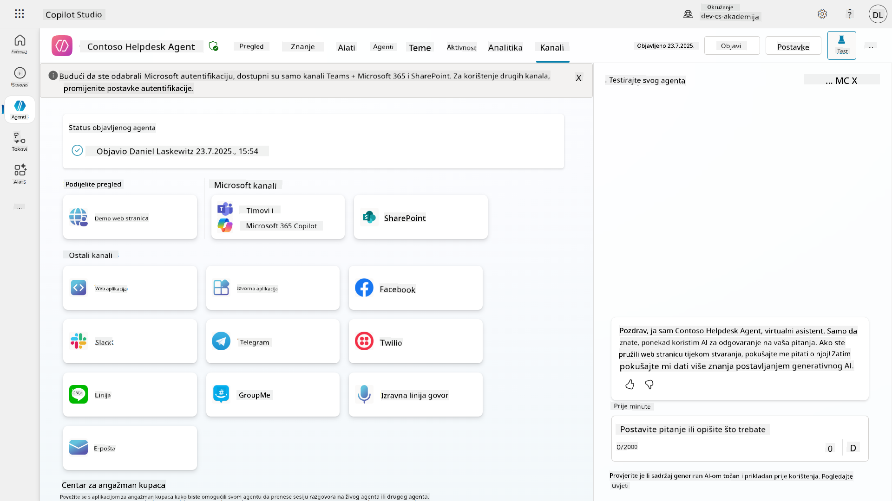

## 📺 Iskustva kanala

Različiti kanali nude različita korisnička iskustva. Kada izrađujete agenta za više kanala, važno je biti svjestan razlika između kanala. Uvijek je dobra strategija testirati svog agenta na više kanala kako biste bili sigurni da radi onako kako ste zamislili.

| Iskustvo                        | Web stranica  | Teams i Microsoft 365 Copilot          | Facebook                 | Dynamics Omnichannel za korisničku podršku                  |
| -------------------------------- | ------------- | --------------------------------------- | ------------------------ | ----------------------------------------------------------- |
| [Anketa o zadovoljstvu kupaca][1] | Adaptivna kartica | Samo tekst                             | Samo tekst              | Samo tekst                                                  |
| [Opcije višestrukog izbora][1]   | Podržano      | [Podržano do šest (kao hero kartica)][4] | [Podržano do 13][6]     | [Djelomično podržano][8]                                    |
| [Markdown][2]                    | Podržano      | [Djelomično podržano][5]                | [Djelomično podržano][7] | [Djelomično podržano][9]                                    |
| [Poruka dobrodošlice][1]         | Podržano      | Podržano                               | Nije podržano           | Podržano za [Chat][10]. Nije podržano za druge kanale.      |
| [Did-You-Mean][3]                | Podržano      | Podržano                               | Podržano                | Podržano za [Microsoft Teams][11], [Chat][10], Facebook i tekstualne kanale (SMS putem [TeleSign][12] i [Twilio][13], [WhatsApp][14], [WeChat][15] i [Twitter][16]). Predložene akcije prikazuju se kao tekstualni popis; korisnici moraju ponovno upisati opciju za odgovor. |

[1]: https://learn.microsoft.com/microsoft-copilot-studio/authoring-create-edit-topics
[2]: https://daringfireball.net/projects/markdown/
[3]: https://learn.microsoft.com/microsoft-copilot-studio/advanced-ai-features
[4]: https://learn.microsoft.com/microsoftteams/platform/concepts/cards/cards-reference#hero-card
[5]: https://learn.microsoft.com/microsoftteams/platform/bots/how-to/format-your-bot-messages#text-only-messages
[6]: https://developers.facebook.com/docs/messenger-platform/send-messages/quick-replies/
[7]: https://www.facebook.com/help/147348452522644?helpref=related
[8]: https://learn.microsoft.com/dynamics365/customer-service/asynchronous-channels#suggested-actions-support
[9]: https://learn.microsoft.com/dynamics365/customer-service/asynchronous-channels#preview-support-for-formatted-messages
[10]: https://learn.microsoft.com/dynamics365/customer-service/set-up-chat-widget
[11]: https://learn.microsoft.com/dynamics365/customer-service/configure-microsoft-teams
[12]: https://learn.microsoft.com/dynamics365/customer-service/configure-sms-channel
[13]: https://learn.microsoft.com/dynamics365/customer-service/configure-sms-channel-twilio
[14]: https://learn.microsoft.com/dynamics365/customer-service/configure-whatsapp-channel
[15]: https://learn.microsoft.com/dynamics365/customer-service/configure-wechat-channel
[16]: https://learn.microsoft.com/dynamics365/customer-service/configure-twitter-channel

> [!NOTE]
> Postoje neki primjeri gdje možete koristiti različitu logiku za različite kanale. Primjer toga možete pronaći u Power Platform Snippets repozitoriju:
>
> Henry Jammes podijelio je primjer kako prikazati različitu adaptivnu karticu kada je kanal Microsoft Teams. ([Poveznica na primjer](https://github.com/pnp/powerplatform-snippets/blob/main/copilot-studio/multiple-topics-matched-topic/source/multiple-topics-matched.yaml#L40))

## 🧪 Laboratorij 11: Objavite svog agenta na Teams i Microsoft 365 Copilot

### 🎯 Primjer upotrebe

Vaš Contoso IT Help Desk agent sada je potpuno konfiguriran s moćnim mogućnostima—može pristupiti izvorima informacija na SharePointu, kreirati zahtjeve za podršku, slati proaktivne obavijesti i inteligentno odgovarati na upite korisnika. Međutim, sve ove funkcionalnosti trenutno su dostupne samo u razvojnom okruženju u kojem ste ih izradili.

**Izazov:** Krajnji korisnici ne mogu koristiti mogućnosti vašeg agenta dok ga ne objavite i učinite dostupnim na kanalima na kojima stvarno rade.

**Rješenje:** Objavljivanjem svog agenta osiguravate da najnovija verzija—sa svim vašim nedavnim ažuriranjima, novim temama, poboljšanim izvorima informacija i konfiguriranim tokovima—bude dostupna stvarnim korisnicima. Bez objave, korisnici bi i dalje komunicirali sa starijom verzijom vašeg agenta koja možda nedostaje ključne funkcionalnosti.

Dodavanje kanala Teams i Microsoft 365 Copilot jednako je važno jer:

- **Integracija s Teamsom**: Zaposlenici vaše organizacije većinu svog radnog dana provode u Microsoft Teamsu za suradnju, sastanke i komunikaciju. Dodavanjem agenta u Teams, korisnici mogu dobiti IT podršku bez napuštanja svog primarnog radnog okruženja.

- **Microsoft 365 Copilot**: Korisnici mogu pristupiti vašem specijaliziranom IT help desk agentu izravno unutar svog Microsoft 365 Copilot iskustva, čineći ga besprijekorno integriranim u njihov svakodnevni rad u Office aplikacijama.

- **Centralizirani pristup**: Umjesto da pamte zasebne web stranice ili aplikacije, korisnici mogu pristupiti IT podršci putem platformi koje već koriste, smanjujući prepreke i povećavajući usvajanje.

Ova misija pretvara vaš razvojni rad u rješenje spremno za produkciju koje donosi stvarnu vrijednost krajnjim korisnicima vaše organizacije.

### Preduvjeti

Prije nego što započnete ovaj laboratorij, osigurajte da imate:

- ✅ Završene prethodne laboratorije i potpuno konfiguriran Contoso Helpdesk Agent
- ✅ Vaš agent je testiran i spreman za produkcijsku upotrebu
- ✅ Dozvole u vašem Copilot Studio okruženju za objavu agenata
- ✅ Pristup Microsoft Teamsu u vašoj organizaciji

### 11.1 Objavite svog agenta

Sada kada je sav naš rad na agentu završen, moramo osigurati da je sav naš rad dostupan krajnjim korisnicima koji će koristiti našeg agenta. Kako bismo osigurali da je sadržaj dostupan svim korisnicima, moramo objaviti svog agenta.

1. Idite na Contoso Helpdesk Agent u Copilot Studiju (putem [Copilot Studio maker portala](https://copilotstudio.microsoft.com))

    U Copilot Studiju, lako je objaviti svog agenta. Jednostavno odaberite gumb za objavu na vrhu pregleda agenta.

    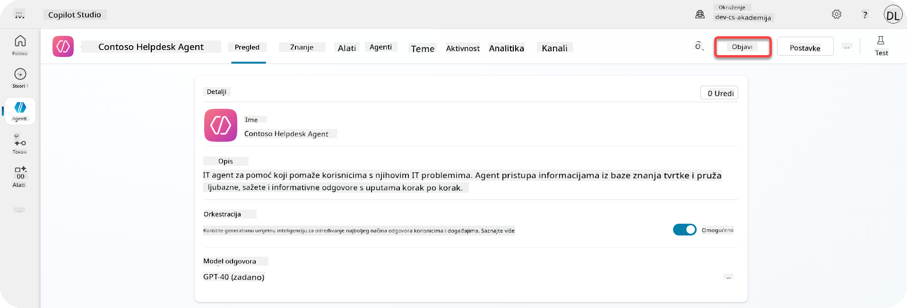

1. Odaberite gumb **Objavi** u svom agentu

    Otvara se skočni prozor za potvrdu da zaista želite objaviti svog agenta.

    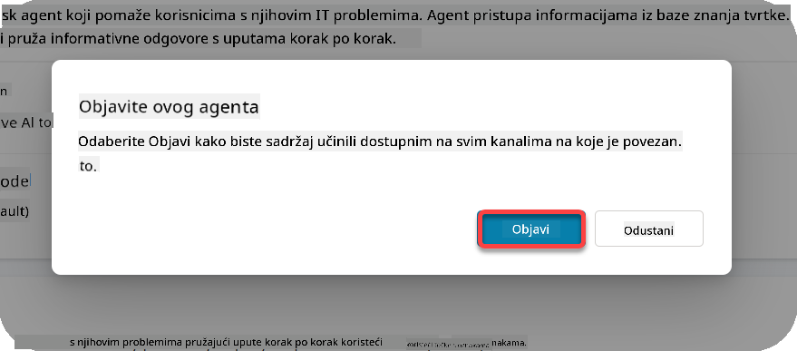

1. Odaberite **Objavi** za potvrdu objave svog agenta

    Sada se prikazuje poruka da se vaš agent objavljuje. Ne morate držati taj skočni prozor otvoren. Bit ćete obaviješteni kada se agent objavi.

    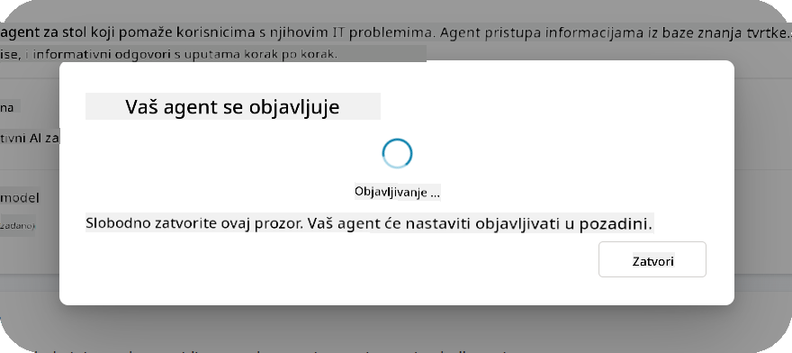

    Kada se agent objavi, vidjet ćete obavijest na vrhu stranice agenta.

    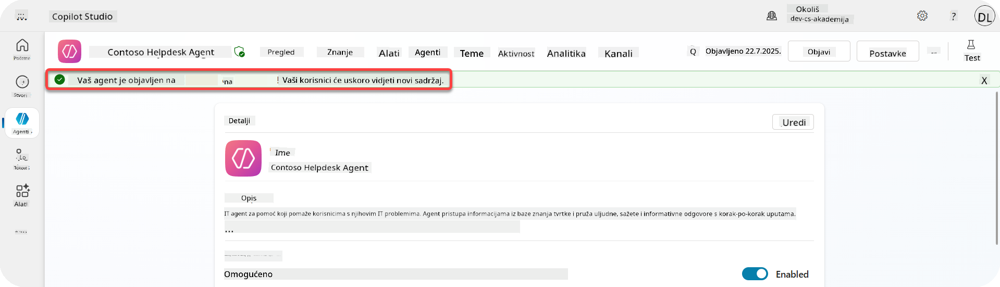

Ali - samo smo objavili agenta, još ga nismo dodali na kanal, pa to sada trebamo riješiti!

### 11.2 Dodajte kanal Teams i Microsoft 365 Copilot

1. Da biste dodali kanal Teams i Microsoft 365 Copilot svom agentu, trebate odabrati **Kanal** u gornjoj navigaciji agenta

    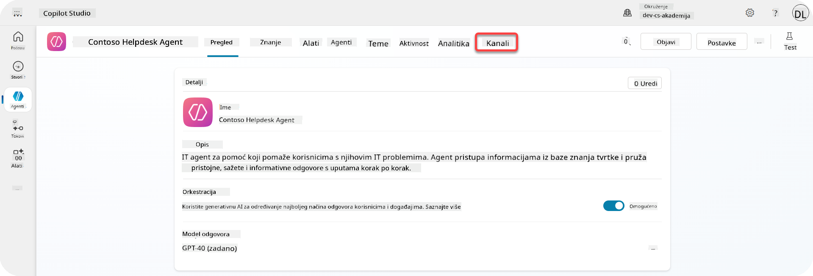

    Ovdje možete vidjeti sve kanale koje možete dodati ovom agentu.

1. Odaberite **Teams i Microsoft 365**

    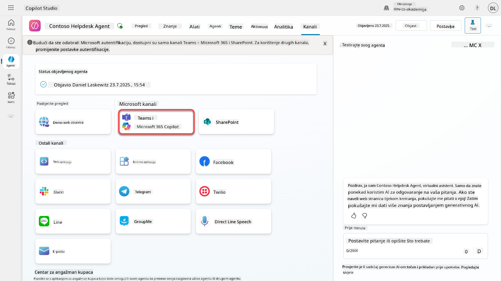

1. Odaberite **Dodaj kanal** za dovršetak čarobnjaka i dodavanje kanala agentu

    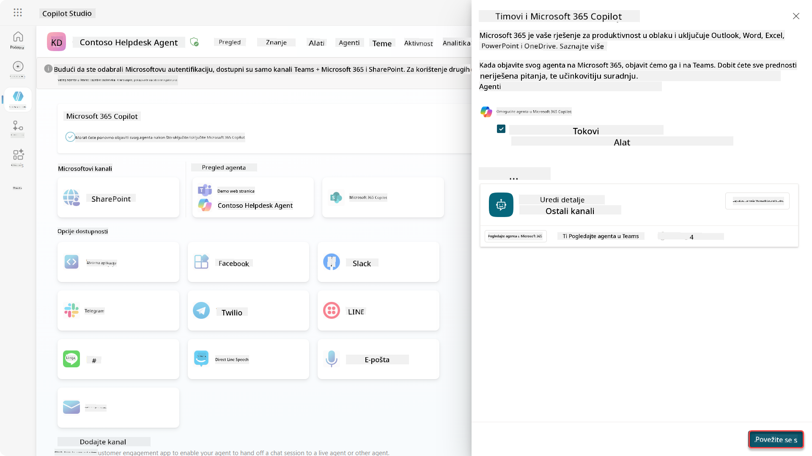

    Trebat će malo vremena dok se kanal ne doda. Nakon dodavanja, na vrhu bočne trake pojavit će se zelena obavijest.

    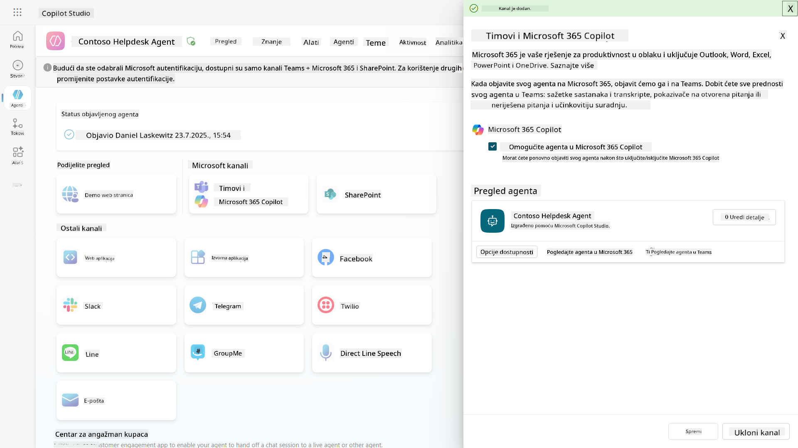

1. Odaberite **Vidi agenta u Teamsu** za otvaranje nove kartice

    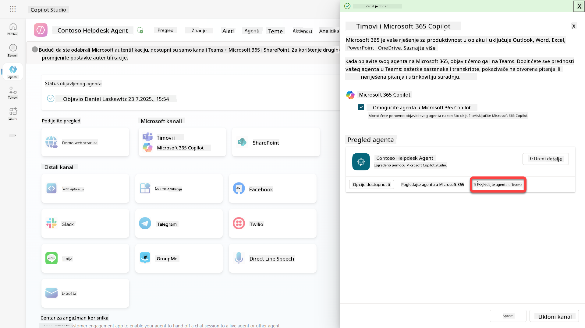

1. Odaberite **Dodaj** za dodavanje Contoso Helpdesk Agenta u Teams

    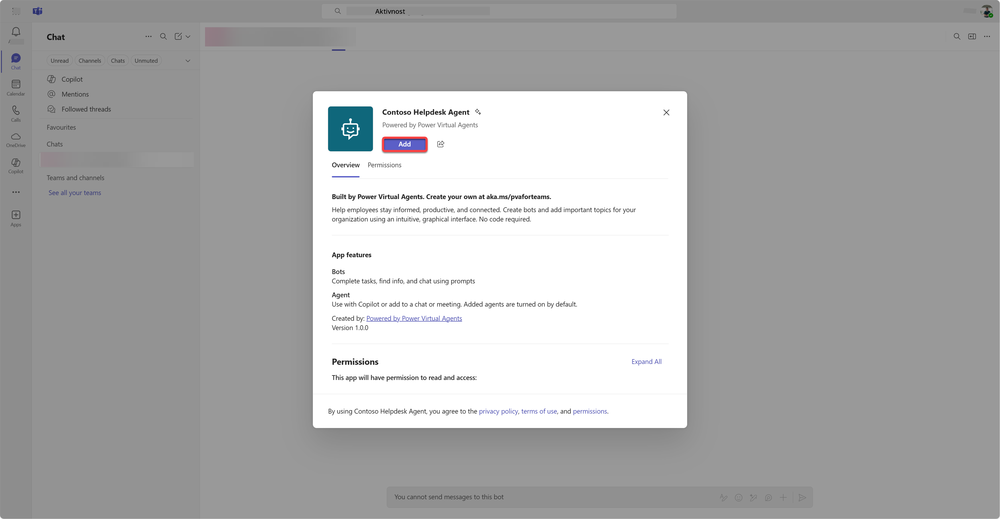

    Ovo bi trebalo potrajati malo vremena. Nakon toga bi se trebao prikazati sljedeći ekran:

    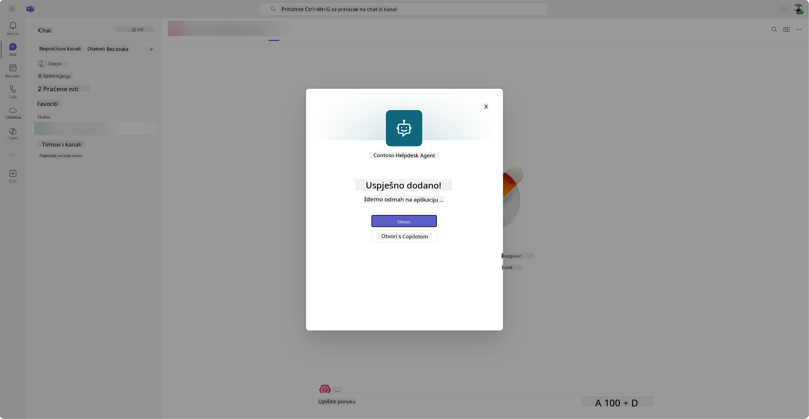

1. Odaberite **Otvori** za otvaranje agenta u Teamsu

    Ovo će otvoriti agenta u Teamsu kao aplikaciju Teamsa

    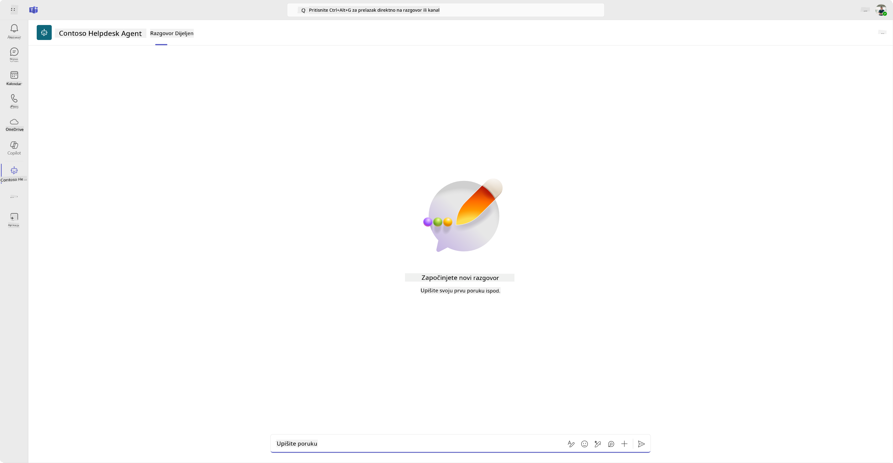

Sada smo objavili agenta da radi za vas u Microsoft Teamsu, ali možda želite učiniti ovo dostupnim za više ljudi.

### 11.3 Učinite agenta dostupnim svim korisnicima u tenantu

1. Zatvorite karticu preglednika gdje je otvoren Contoso Helpdesk Agent

    Ovo bi vas trebalo vratiti u Copilot Studio gdje je bočna ploča Teams i Microsoft 365 Copilot još uvijek otvorena. Sada smo samo otvorili agenta u Teamsu, ali ovdje možemo učiniti puno više. Možemo urediti detalje agenta, možemo ga distribuirati većem broju korisnika i još mnogo toga.

1. Odaberite **Uredi detalje**

    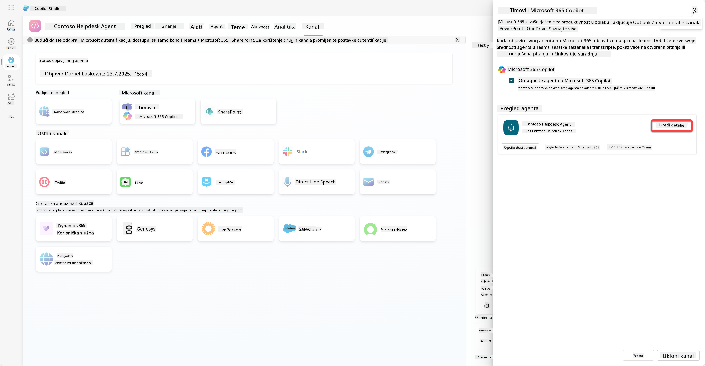
Ovo će otvoriti ploču gdje možemo promijeniti niz detalja i postavki agenta. Možemo promijeniti osnovne detalje poput ikone, boje pozadine ikone i opisa. Također možemo promijeniti postavke za Teams (na primjer, omogućiti korisniku da doda agenta u tim ili omogućiti korištenje ovog agenta u grupnim i sastancima chatovima). Kada odaberete *više*, možete promijeniti detalje za razvojne programere, poput imena programera, web stranice, izjave o privatnosti i uvjeta korištenja.

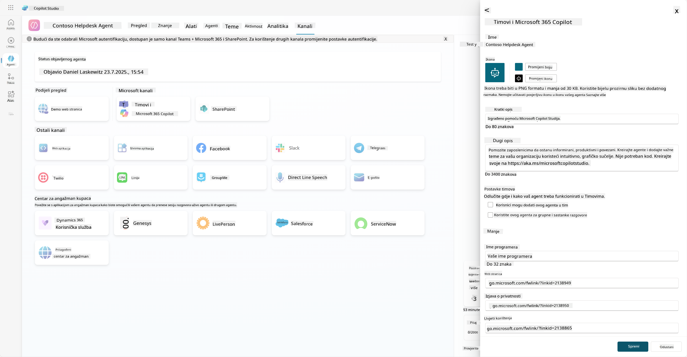

1. Odaberite **Odustani** za zatvaranje ploče za uređivanje detalja.

1. Odaberite **Opcije dostupnosti**

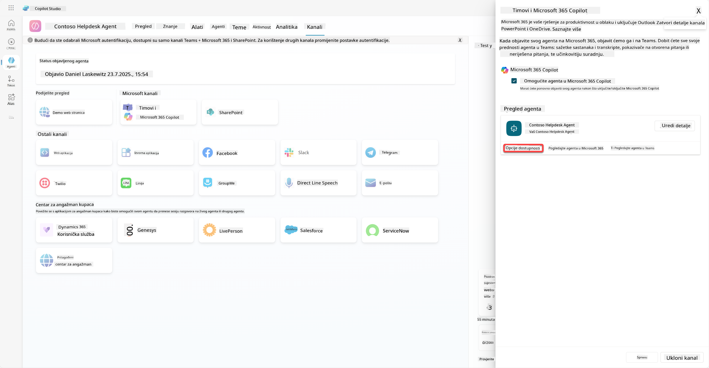

Ovo će otvoriti ploču opcija dostupnosti, gdje možete kopirati poveznicu za slanje korisnicima kako bi koristili ovog agenta (imajte na umu, morate podijeliti agenta s korisnikom) i možete preuzeti datoteku za dodavanje vašeg agenta u Microsoft Teams ili Microsoft 365 trgovinu. Za prikaz agenta u trgovini, imate i druge opcije: možete ga prikazati svojim kolegama i dijeljenim korisnicima (za prikaz u odjeljku *Izrađeno s Power Platformom*) ili ga možete prikazati svima u vašoj organizaciji (za to je potrebno odobrenje administratora).

1. Odaberite **Prikaži svima u mojoj organizaciji**

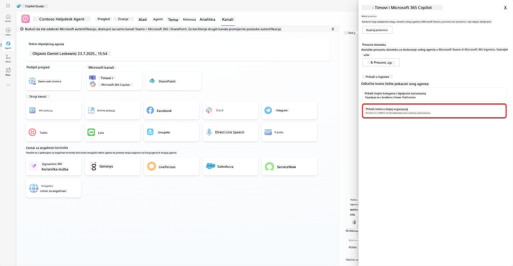

1. Odaberite **Pošalji na odobrenje administratoru**

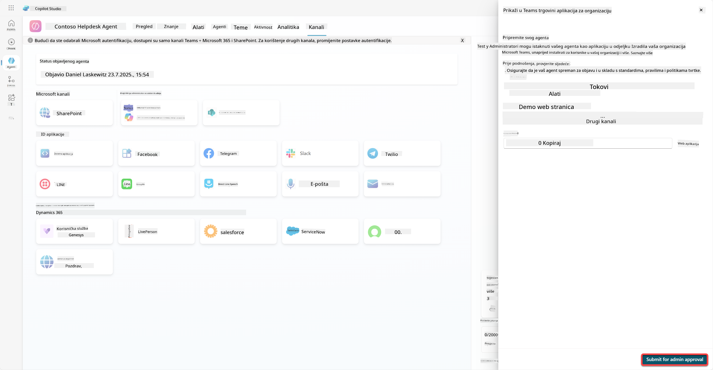

Sada vaš administrator mora odobriti podnošenje vašeg agenta. To može učiniti tako da ode u Teams Admin Center i pronađe Contoso Helpdesk Agent u aplikacijama. Na snimci zaslona možete vidjeti što bi administrator vidio u Teams Admin Centeru.

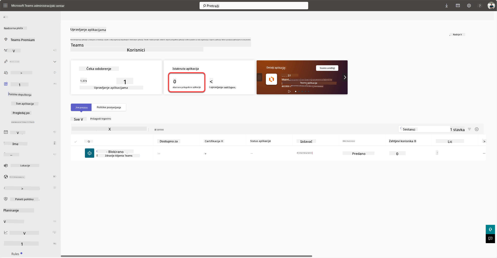

Administrator mora odabrati Contoso Helpdesk Agent i odabrati *Objavi* kako bi objavio Contoso Helpdesk Agent svima.

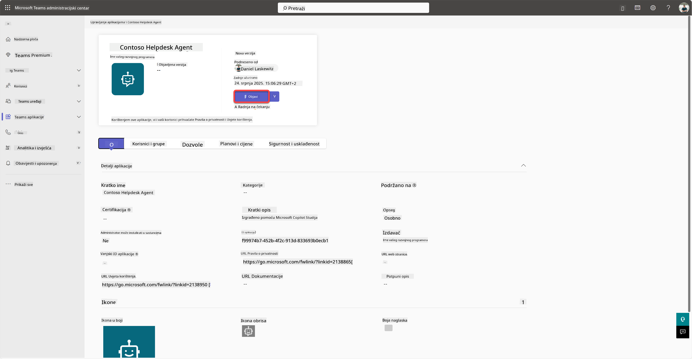

Kada administrator objavi podnošenje agenta, moći ćete osvježiti Copilot Studio i trebali biste vidjeti banner *dostupno u trgovini aplikacija* u opcijama dostupnosti.

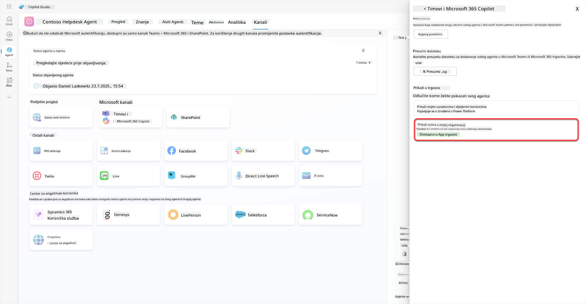

Ovdje postoje još više mogućnosti. Vaš administrator može promijeniti globalnu politiku postavljanja i automatski instalirati Contoso Helpdesk Agent za sve u tenantu. Osim toga, možete postaviti Contoso Helpdesk Agent na lijevu traku kako bi svi imali lak pristup.

## ✅ Misija završena

🎉 **Čestitamo!** Uspješno ste objavili svog agenta i dodali ga u Teams i Microsoft 365 Copilot! Sljedeće je posljednja misija tečaja: Razumijevanje licenciranja.

⏭️ [Prijeđite na lekciju **Razumijevanje licenciranja**](../12-understanding-licensing/README.md)

## 📚 Taktički resursi

🔗 [Dokumentacija o kanalima za objavljivanje](https://learn.microsoft.com/microsoft-copilot-studio/publication-fundamentals-publish-channels)

---

**Odricanje od odgovornosti**:  
Ovaj dokument je preveden pomoću AI usluge za prevođenje [Co-op Translator](https://github.com/Azure/co-op-translator). Iako nastojimo osigurati točnost, imajte na umu da automatski prijevodi mogu sadržavati pogreške ili netočnosti. Izvorni dokument na izvornom jeziku treba smatrati autoritativnim izvorom. Za ključne informacije preporučuje se profesionalni prijevod od strane čovjeka. Ne odgovaramo za nesporazume ili pogrešna tumačenja koja proizlaze iz korištenja ovog prijevoda.