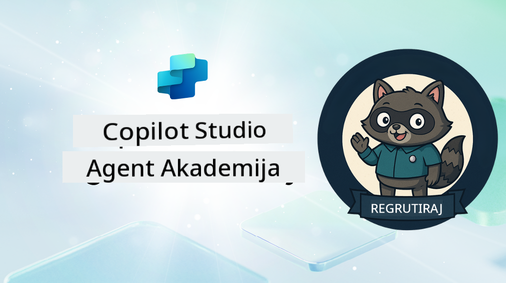

<!--
CO_OP_TRANSLATOR_METADATA:
{
  "original_hash": "8b5ecad9d5d073ea3f4c2b844e80f2e5",
  "translation_date": "2025-10-20T23:19:22+00:00",
  "source_file": "docs/recruit/README.md",
  "language_code": "hr"
}
-->
# Dobrodošao Rekrutu

**Dobrodošao, Rekrutu.**  
Tvoja misija—ako je odlučiš prihvatiti—je savladati umjetnost izrade agenata koristeći **Microsoft Copilot Studio**.

Ova praktična obuka je tvoj ulaz u **svijet agenata**: od temeljenih upita do Adaptive Cards i tokova agenata, naučit ćeš kako izgraditi, skalirati i implementirati inteligentne agente koristeći stvarne alate i primjere.

---

## 🎯 Cilj Misije

Završetkom Akademije za agente, moći ćeš:

- Razumjeti što su agenti u kontekstu Microsoft Copilot Studija
- Istražiti kako se veliki jezični modeli (LLM), generacija uz pomoć pretraživanja (RAG) i orkestracija spajaju u agentu
- Izraditi i **deklarativne** i **prilagođene agente**
- Poboljšati agente s **Temama**, **Adaptive Cards** i **Agent Flows**
- Implementirati agente u **Microsoft Teams** i **Microsoft 365 Copilot**

---

## 🧪 Preduvjeti

Za dovršetak svih misija, trebat će ti:

- Microsoft 365 Developer tenant (s omogućenim SharePointom)
- Pristup **Microsoft Copilot Studiju** (probna verzija ili licencirana)
- Opcionalno: Osnovno znanje o SharePointu, Power Platformi ili Power Fx-u

---

## 🧬 Za koga je ovo namijenjeno

Ovaj tečaj je idealan za:

- Kreatore i programere koji istražuju **Copilot Studio**
- IT stručnjake koji izrađuju **Microsoft 365 Copilot ekstenzije**
- Entuzijaste Power Platforme koji žele **napredovati** s inteligentnim agentima
- Sve koji preferiraju učiti kroz **praktičan rad**

---

## 🧭 Pregled Kurikuluma

Ova akademija podijeljena je u progresivne lekcije—svaka je osmišljena kao terenska misija za unapređenje tvojih vještina izrade agenata.

| Lekcija | Naslov | Misija |
|--------|-------|------------------|
| `00` | 🧰 [Postavljanje Tečaja](./00-course-setup/README.md) | Postavi svoje razvojno okruženje, probnu verziju Copilot Studija i SharePoint stranicu |
| `01` | 🧠 [Uvod u Agente](./01-introduction-to-agents/README.md) | Razumijevanje koncepata konverzacijske umjetne inteligencije, LLM-ova i autonomnih naspram deklarativnih agenata |
| `02` | 🛠️ [Osnove Copilot Studija](./02-copilot-studio-fundamentals/README.md) | Upoznaj osnovne elemente: znanje, vještine, autonomiju |
| `03` | 👩‍💻 [Izrada Deklarativnog Agenta](./03-create-a-declarative-agent-for-M365Copilot/README.md) | Dodaj vlastitog agenta u Microsoft 365 Copilot, temeljenog na upitu |
| `04` | 🧩 [Izrada Rješenja](./04-creating-a-solution/README.md) | Pakiraj svog agenta u ponovno upotrebljivo rješenje za upravljanje okruženjem |
| `05` | 🚀 [Početak s Unaprijed Izrađenim Agentima](./05-using-prebuilt-agents/README.md) | Koristi i prilagodi predložak agenta za ubrzanje postavljanja |
| `06` | ✍️ [Izrada Prilagođenog Agenta](./06-create-agent-from-conversation/README.md) | Izradi novog Copilota temeljenog na izvorima znanja |
| `07` | 🧠 [Dodavanje Teme s Okidačima](./07-add-new-topic-with-trigger/README.md) | Koristi Teme za definiranje prilagođenih putanja pitanja/odgovora |
| `08` | 🪪 [Poboljšanje s Adaptive Cards](./08-add-adaptive-card/README.md) | Izradi Adaptive Card koristeći Power Fx i SharePoint |
| `09` | 🔁 [Automatizacija s Agent Flows](./09-add-an-agent-flow/README.md) | Koristi unos iz Adaptive Card za pokretanje pozadinskih tokova |
| `10` | 🧭 [Dodavanje Okidača Događaja](./10-add-event-triggers/README.md) | Omogući svom agentu da djeluje autonomno koristeći logiku temeljenu na događajima |
| `11` | 📢 [Objavi Svog Agenta](./11-publish-your-agent/README.md) | Implementiraj svog agenta u Microsoft Teams i Microsoft 365 Copilot |
| `12` | 🪪 [Razumijevanje Licenciranja](./12-understanding-licensing/README.md) | Saznaj kako funkcionira licenciranje i naplata s Copilot Studijom |
| `13` | 🚨 [Osiguraj Svoju Rekrutsku Značku](./course-completion-badges-recruit/README.md) | Preuzmi svoju značku i obilježi svoje postignuće! |

!!! note
    ✅ Završetkom ovog kurikuluma osvajaš **Rekrutska** značku.  
    🔓 **Operativac** i **Zapovjednik** bit će dostupni u budućim fazama.

<!-- markdownlint-disable-next-line MD033 -->

---

**Izjava o odricanju odgovornosti**:  
Ovaj dokument je preveden pomoću AI usluge za prevođenje [Co-op Translator](https://github.com/Azure/co-op-translator). Iako nastojimo osigurati točnost, imajte na umu da automatski prijevodi mogu sadržavati pogreške ili netočnosti. Izvorni dokument na izvornom jeziku treba smatrati autoritativnim izvorom. Za ključne informacije preporučuje se profesionalni prijevod od strane ljudskog prevoditelja. Ne preuzimamo odgovornost za nesporazume ili pogrešne interpretacije nastale korištenjem ovog prijevoda.