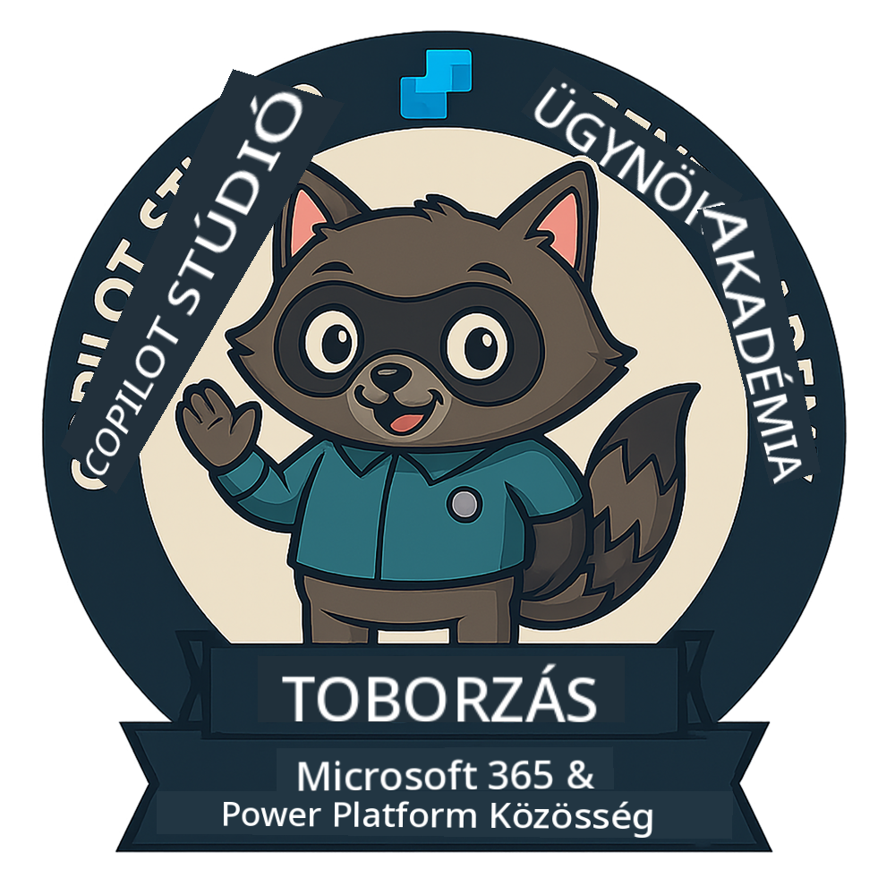

<!--
CO_OP_TRANSLATOR_METADATA:
{
  "original_hash": "15e57e059ce7689d602d7853187235cd",
  "translation_date": "2025-10-20T17:04:35+00:00",
  "source_file": "docs/index.md",
  "language_code": "hu"
}
-->
---
hide:
- navigation
---

# Copilot Studio Ügynök Akadémia

**Üdvözlünk a Copilot Studio Ügynök Akadémián.**  

A küldetésed—ha elfogadod—az, hogy elsajátítsd az ügynökök építésének művészetét a **Microsoft Copilot Studio** segítségével.

Ez a gyakorlati képzés a **ügynökök világába** való belépési pontod: a megalapozott utasításoktól kezdve az Adaptive Cards-okon és ügynökfolyamatokon át megtanulhatod, hogyan építs, méretezz és telepíts intelligens ügynököket valós eszközök és felhasználási esetek segítségével.

---

## 🏅 Rangfejlődés

A **Copilot Studio Ügynök Akadémia** egy több fázisból álló képzési program, amely három ügynöki rangon keresztül fejleszti a képességeidet. Minden szinthez tartozik egy jelvény és növekvő felelősségi körök:

| Rang             | Szint | Vizualizáció |
|------------------|:-----:|--------------|
| 🟢 **Újonc**  [🚀 Kezdj bele](https://aka.ms/agent-academy-recruit){ .md-button .md-button--primary }     | •     | { width="300" }     |
| 🔵 **Operatív** (Hamarosan)   | ••    | { width="300" } |
| 🟡 **Parancsnok** (Hamarosan)    | •••   | { width="300" } |

Minden szint az előzőre épül. Fejezd be az Újonc küldetésedet, és figyelj, hogy tovább léphess az ügynöki hitelesítéseid szintjén.

---

## 🎒 Egyéb kurzusok

Nézd meg ezeket az egyéb kurzusokat, hogy tovább tanulhass az AI-ról és az ügynökökről:

- [Microsoft Copilot Studio <3 MCP Lab](https://aka.ms/mcsmcplab)
- [Copilot Fejlesztői Tábor](https://microsoft.github.io/copilot-camp/)
- [AI Ügynökök Kezdőknek](https://microsoft.github.io/ai-agents-for-beginners/)
- [Model Context Protocol (MCP) Kezdőknek](https://github.com/microsoft/mcp-for-beginners)

---

## 🚑 Problémák

Nagyon értékeljük a visszajelzéseidet! Kérjük, használd az [issues listát](https://github.com/microsoft/agent-academy/issues), hogy megoszd a megjegyzéseidet és problémáidat. Köszönjük!

---

## 📜 Magatartási kódex

Ez a projekt elfogadta a [Microsoft Nyílt Forráskódú Magatartási Kódexét](https://opensource.microsoft.com/codeofconduct/).

!!! info "Források:"

    - [Microsoft Nyílt Forráskódú Magatartási Kódex](https://opensource.microsoft.com/codeofconduct/)
    - [Microsoft Magatartási Kódex GYIK](https://opensource.microsoft.com/codeofconduct/faq/)
    - Kapcsolat: [opencode@microsoft.com](mailto:opencode@microsoft.com) kérdésekkel vagy aggályokkal

---

[⭐️ Csillagozd a repónkat](https://github.com/microsoft/agent-academy){ .md-button .md-button--primary }

<!-- markdownlint-disable-next-line MD033 -->

---

**Felelősség kizárása**:  
Ez a dokumentum az AI fordítási szolgáltatás [Co-op Translator](https://github.com/Azure/co-op-translator) segítségével lett lefordítva. Bár törekszünk a pontosságra, kérjük, vegye figyelembe, hogy az automatikus fordítások hibákat vagy pontatlanságokat tartalmazhatnak. Az eredeti dokumentum az eredeti nyelvén tekintendő hiteles forrásnak. Kritikus információk esetén javasolt professzionális emberi fordítást igénybe venni. Nem vállalunk felelősséget a fordítás használatából eredő félreértésekért vagy téves értelmezésekért.