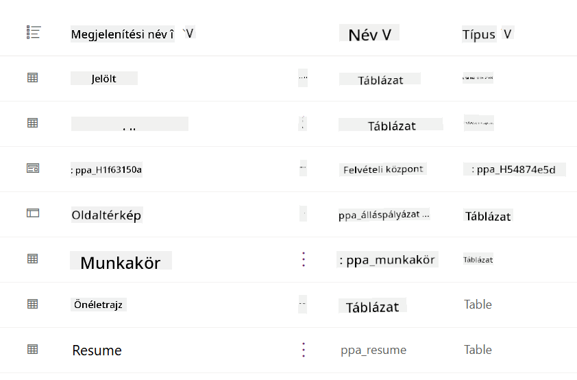
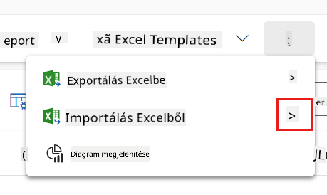
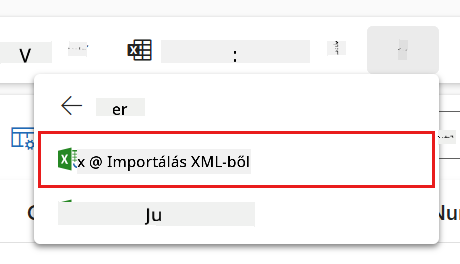
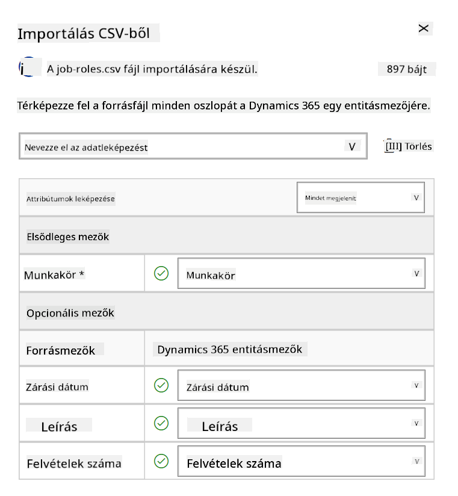
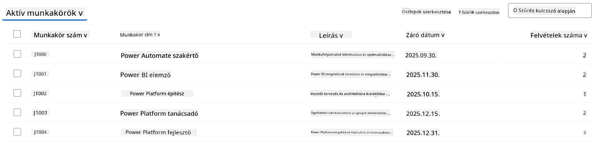
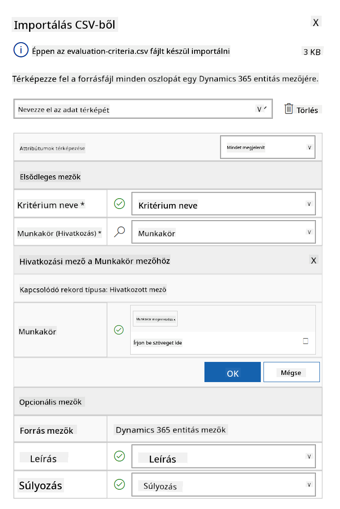
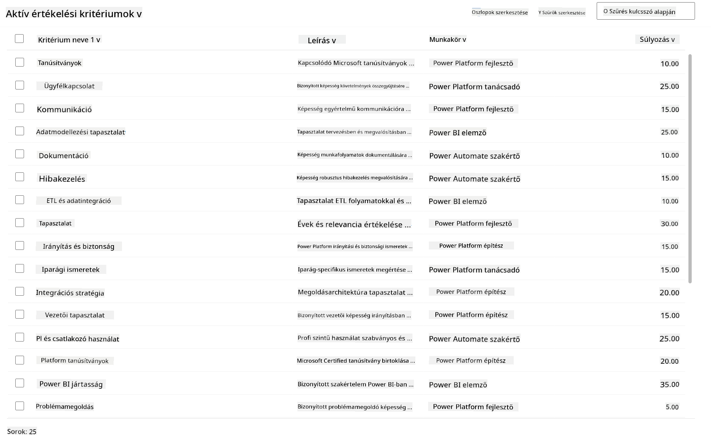

<!--
CO_OP_TRANSLATOR_METADATA:
{
  "original_hash": "2620cf9eaf09a3fc6be7fa31a3a62956",
  "translation_date": "2025-10-20T18:03:55+00:00",
  "source_file": "docs/operative-preview/01-get-started/README.md",
  "language_code": "hu"
}
-->
# 🚨 Küldetés 01: Ismerkedés a Felvételi Ügynökkel

--8<-- "disclaimer.md"

## 🕵️‍♂️ KÓDNEV: `TEHETSÉGKUTATÓ MŰVELET`

> **⏱️ Műveleti időablak:** `~45 perc`

## 🎯 Küldetés összefoglaló

Üdvözlünk, Ügynök. Az első megbízásod a **Tehetségkutató Művelet** - egy mesterséges intelligenciával támogatott toborzási rendszer alapvető infrastruktúrájának létrehozása, amely forradalmasítja a szervezetek tehetségek azonosítását és felvételét.

A küldetésed, ha elfogadod, az, hogy telepíts és konfigurálj egy átfogó felvételi menedzsment rendszert a Microsoft Copilot Studio segítségével. Importálnod kell egy előre elkészített megoldást, amely tartalmazza az összes szükséges adatstruktúrát, majd létre kell hoznod az első mesterséges intelligencia ügynököt - a **Felvételi Ügynököt** -, amely a jövőbeli toborzási műveletek központi irányítója lesz.

Ez a kezdeti telepítés létrehozza azt a parancsnoki központot, amelyet az Ügynök Akadémia Operatív program során tovább fogsz fejleszteni. Tekintsd ezt a műveleti bázisodnak - az alapnak, amelyre a későbbi küldetések során egy teljes hálózatot építesz specializált ügynökökből.

---

## 🔎 Célkitűzések

A küldetés teljesítésével:

- **Forgatókönyv megértése**: Átfogó ismereteket szerzel a toborzási automatizálás kihívásairól és megoldásairól
- **Megoldás telepítése**: Sikeresen importálod és konfigurálod a felvételi menedzsment rendszer alapjait
- **Ügynök létrehozása**: Felépíted a felvételi ügynököt, amely a forgatókönyv kiindulópontja lesz, amit az Ügynök Akadémia Operatív program során fejlesztesz tovább

---

## 🔍 Előfeltételek

Mielőtt nekivágsz a küldetésnek, győződj meg róla, hogy rendelkezel:

- Copilot Studio licenccel
- Hozzáféréssel egy Microsoft Power Platform környezethez
- Adminisztrátori jogosultságokkal megoldások és ügynökök létrehozásához

---

## 🏢 A toborzási automatizálási forgatókönyv megértése

Ez a forgatókönyv bemutatja, hogyan használhat egy vállalat Microsoft Copilot Studio-t a toborzási folyamatának javítására és automatizálására. Egy ügynökrendszert vezet be, amely együttműködik olyan feladatok kezelésében, mint az önéletrajzok átnézése, álláslehetőségek ajánlása, interjúanyagok előkészítése és jelöltek értékelése.

### Üzleti érték

A megoldás segíti a HR csapatokat időt megtakarítani és jobb döntéseket hozni az alábbiak révén:

- Automatikusan feldolgozza az e-mailben érkező önéletrajzokat.
- Alkalmas álláslehetőségeket javasol a jelölt profilja alapján.
- Jelentkezési lapokat és interjú útmutatókat készít minden egyes jelölt számára.
- Beépített biztonsági és moderációs funkciók révén biztosítja a tisztességes és jogszerű felvételi gyakorlatokat.
- Visszajelzéseket gyűjt a megoldás fejlesztése érdekében.

### Hogyan működik

- Egy központi **Felvételi Ügynök** koordinálja a folyamatot és tárolja az adatokat a Microsoft Dataverse-ben.
- Egy **Jelentkezés Feldolgozó Ügynök** olvassa az önéletrajzokat és létrehozza a jelentkezési lapokat.
- Egy **Interjú Előkészítő Ügynök** generál interjúkérdéseket és dokumentumokat a jelölt háttere alapján.
- A rendszer egy bemutató weboldalon publikálható, lehetővé téve az érintettek számára az interakciót.

Ez a forgatókönyv ideális azoknak a szervezeteknek, amelyek modernizálni szeretnék toborzási munkafolyamataikat mesterséges intelligenciával támogatott automatizálás segítségével, miközben átláthatóságot, tisztességet és hatékonyságot biztosítanak.

---

## 🧪 Gyakorlat: A Felvételi Ügynök beállítása

Ebben a gyakorlati részben létrehozod a toborzási automatizálási rendszer alapját. Először importálsz egy előre konfigurált megoldást, amely tartalmazza az összes szükséges Dataverse táblát és adatstruktúrát a jelöltek, álláshelyek és felvételi munkafolyamatok kezeléséhez. Ezután feltöltöd ezeket a táblákat mintaadatokkal, amelyek támogatják a tanulásodat ebben a modulban, és valósághű forgatókönyveket biztosítanak a teszteléshez. Végül létrehozod a Felvételi Ügynököt a Copilot Studio-ban, beállítva az alapvető beszélgetési felületet, amely az összes további funkció sarokköve lesz, amit a későbbi küldetések során hozzáadsz.

### 🧪 Gyakorlat 1.1: Megoldás importálása

1. Lépj a **[Copilot Studio](https://copilotstudio.microsoft.com)** oldalra
1. Válaszd ki a **...** ikont a bal oldali navigációban, majd válaszd a **Megoldások** lehetőséget
1. Kattints a **Megoldás importálása** gombra a tetején
1. **[Töltsd le](https://raw.githubusercontent.com/microsoft/agent-academy/refs/heads/main/docs/operative-preview/01-get-started/assets/Operative_1_0_0_0.zip)** az előkészített megoldást
1. Válaszd a **Tallózás** lehetőséget, és válaszd ki az előző lépésben letöltött megoldást
1. Kattints a **Tovább** gombra
1. Kattints az **Importálás** gombra

!!! success
    Siker esetén egy zöld értesítési sáv jelenik meg a következő üzenettel:  
    "A "Operative" megoldás sikeresen importálva."

Amikor a megoldás importálása befejeződött, nézd meg, mit importáltál, a megoldás megjelenítési nevére (`Operative`) kattintva.



A következő komponensek kerültek importálásra:

| Megjelenítési név | Típus | Leírás |
|-------------------|-------|--------|
| Jelölt | Tábla | Jelölt információk |
| Értékelési Kritériumok | Tábla | Az álláshelyhez tartozó értékelési kritériumok |
| Felvételi Központ | Modellvezérelt alkalmazás | Alkalmazás a felvételi folyamat kezelésére |
| Felvételi Központ | Oldaltérkép | Navigációs struktúra a Felvételi Központ alkalmazáshoz |
| Állásjelentkezés | Tábla | Állásjelentkezések |
| Álláshely | Tábla | Álláshelyek |
| Önéletrajz | Tábla | Jelöltek önéletrajzai |

Az utolsó feladat ehhez a gyakorlathoz: Kattints a **Minden testreszabás közzététele** gombra az oldal tetején.

### 🧪 Gyakorlat 1.2: Mintaadatok importálása

Ebben a gyakorlatban mintaadatokat fogsz hozzáadni néhány táblához, amelyeket az 1.1 gyakorlatban importáltál.

#### Fájlok letöltése importáláshoz

1. **[Töltsd le](https://raw.githubusercontent.com/microsoft/agent-academy/refs/heads/main/docs/operative-preview/01-get-started/assets/evaluation-criteria.csv)** az értékelési kritériumokat tartalmazó CSV-fájlt
1. **[Töltsd le](https://raw.githubusercontent.com/microsoft/agent-academy/refs/heads/main/docs/operative-preview/01-get-started/assets/job-roles.csv)** az álláshelyeket tartalmazó CSV-fájlt

#### Álláshely mintaadatok importálása

1. Térj vissza az előző gyakorlatban importált megoldáshoz
1. Válaszd ki a **Felvételi Központ** Modellvezérelt Alkalmazást, a sor előtti jelölőnégyzetet kiválasztva
1. Kattints a **Lejátszás** gombra a tetején

    !!! warning
        Lehet, hogy újra be kell jelentkezned. Győződj meg róla, hogy ezt megteszed. Ezután látnod kell a Felvételi Központ alkalmazást.

1. Válaszd ki az **Álláshelyek** opciót a bal oldali navigációban
1. Kattints a **Továbbiak** ikonra (három egymás alatti pont) a parancssávban
1. Kattints a **jobb nyíl** ikonra az *Importálás Excelből* mellett

    

1. Válaszd az **Importálás CSV-ből** lehetőséget

    

1. Kattints a **Fájl kiválasztása** gombra, válaszd ki a **job-roles.csv** fájlt, amit az előző lépésben letöltöttél, majd kattints az **Megnyitás** gombra
1. Kattints a **Tovább** gombra
1. Hagyd a következő lépést változatlanul, majd kattints az **Térkép áttekintése** gombra

    

1. Győződj meg róla, hogy a térkép helyes, majd kattints a **Importálás befejezése** gombra

    !!! info
        Ez elindít egy importálást, és nyomon követheted a folyamatot, vagy azonnal befejezheted a **Kész** gombra kattintva.

1. Kattints a **Kész** gombra

Ez eltarthat egy ideig, de a **Frissítés** gombra kattintva ellenőrizheted, hogy az importálás sikeres volt-e.



#### Értékelési Kritériumok mintaadatok importálása

1. Válaszd ki az **Értékelési Kritériumok** opciót a bal oldali navigációban
1. Kattints a **Továbbiak** ikonra (három egymás alatti pont) a parancssávban
1. Kattints a **jobb nyíl** ikonra az *Importálás Excelből* mellett

    

1. Válaszd az **Importálás CSV-ből** lehetőséget

    

1. Kattints a **Fájl kiválasztása** gombra, válaszd ki az **evaluation-criteria.csv** fájlt, amit az előző lépésben letöltöttél, majd kattints az **Megnyitás** gombra
1. Kattints a **Tovább** gombra
1. Hagyd a következő lépést változatlanul, majd kattints az **Térkép áttekintése** gombra

    

1. Most egy kicsit több munkát kell végeznünk a térképezéshez. Kattints a nagyító (🔎 ikon) mellett a Job Role mezőnél
1. Győződj meg róla, hogy itt a **Job Title** van kiválasztva, és ha nem - add hozzá
1. Kattints az **OK** gombra
1. Győződj meg róla, hogy a többi térképezés is helyes, majd kattints az **Importálás befejezése** gombra

    !!! info
        Ez ismét elindít egy importálást, és nyomon követheted a folyamatot, vagy azonnal befejezheted a **Kész** gombra kattintva.

1. Kattints a **Kész** gombra

Ez eltarthat egy ideig, de a **Frissítés** gombra kattintva ellenőrizheted, hogy az importálás sikeres volt-e.



### 🧪 Gyakorlat 1.3: A felvételi ügynök létrehozása

Most, hogy beállítottad az előfeltételeket, itt az ideje a tényleges munkának! Először adjuk hozzá a Felvételi Ügynököt!

1. Lépj a **[Copilot Studio](https://copilotstudio.microsoft.com)** oldalra, és győződj meg róla, hogy ugyanabban a környezetben vagy, ahol a megoldást és az adatokat importáltad
1. Válaszd ki az **Ügynökök** opciót a bal oldali navigációban
1. Kattints az **Új Ügynök** gombra
1. Válaszd a **Konfigurálás** lehetőséget
1. A **Név** mezőbe írd be:

    ```text
    Hiring Agent
    ```

1. A **Leírás** mezőbe írd be:

    ```text
    Central orchestrator for all hiring activities
    ```

1. Kattints a **...** ikonra a *Létrehozás* gomb mellett a jobb felső sarokban
1. Válaszd az **Haladó beállítások frissítése** lehetőséget
1. A **Megoldás** mezőben válaszd ki az `Operative` opciót
1. Kattints a **Frissítés** gombra
1. Kattints a **Létrehozás** gombra a jobb felső sarokban

Ez létrehozza a Felvételi Ügynököt, amelyet az Operatív kurzus során fogsz használni.

---

## 🎉 Küldetés teljesítve

Az 01-es küldetést teljesítetted! Most már elsajátítottad a következő készségeket:

✅ **Forgatókönyv megértése**: Átfogó ismereteket szereztél a toborzási automatizálás kihívásairól és megoldásairól  
✅ **Megoldás telepítése**: Sikeresen importáltad és konfiguráltad a felvételi menedzsment rendszer alapjait  
✅ **Ügynök létrehozása**: Létrehoztál egy felvételi ügynököt, amely a forgatókönyv kiindulópontja lesz, amit az Ügynök Akadémia Operatív program során fejlesztesz tovább  

Következik [Küldetés 02](../02-multi-agent/README.md): Tedd az ügynöködet több ügynökkel kompatibilissé, kapcsolt ügynökökkel.

---

## 📚 Taktikai források

📖 [Microsoft Copilot Studio - Ügynök létrehozása](https://learn.microsoft.com/microsoft-copilot-studio/authoring-first-bot)  
📖 [Microsoft Dataverse Dokumentáció](https://learn.microsoft.com/power-apps/maker/data-platform)

---

**Felelősség kizárása**:  
Ez a dokumentum az [Co-op Translator](https://github.com/Azure/co-op-translator) AI fordítási szolgáltatás segítségével lett lefordítva. Bár törekszünk a pontosságra, kérjük, vegye figyelembe, hogy az automatikus fordítások hibákat vagy pontatlanságokat tartalmazhatnak. Az eredeti dokumentum az eredeti nyelvén tekintendő hiteles forrásnak. Fontos információk esetén javasolt professzionális emberi fordítást igénybe venni. Nem vállalunk felelősséget semmilyen félreértésért vagy téves értelmezésért, amely a fordítás használatából eredhet.