<!--
CO_OP_TRANSLATOR_METADATA:
{
  "original_hash": "4fb913dfc3bbc71506dd3602c4b8e6ed",
  "translation_date": "2025-10-20T17:57:59+00:00",
  "source_file": "docs/operative-preview/02-multi-agent/README.md",
  "language_code": "hu"
}
-->
# 🚨 Küldetés 02: Kapcsolt Ügynökök

--8<-- "disclaimer.md"

## 🕵️‍♂️ KÓDNEVE: `OPERATION SYMPHONY`

> **⏱️ Műveleti Időablak:** `~45 perc`

## 🎯 Küldetés Összefoglaló

Üdv újra, Ügynök! Az 01-es küldetés során létrehoztad a fő Toborzó Ügynöködet - egy szilárd alapot a toborzási munkafolyamatok kezeléséhez. Azonban egy ügynök önmagában csak korlátozottan képes dolgozni.

A feladatod, ha elfogadod, az **Operation Symphony** - átalakítani az egyetlen ügynöködet egy **több ügynökből álló rendszerre**: egy összehangolt, specializált ügynökökből álló csapatra, amely együttműködik a komplex toborzási kihívások kezelésében. Gondolj rá úgy, mint egy szóló operátorról egy specializált munkacsoport irányítására való frissítésre.

Mint egy szimfonikus zenekar, ahol minden zenész tökéletes harmóniában játszik, két kritikus specialistát fogsz hozzáadni a meglévő Toborzó Ügynöködhöz: egy Jelentkezési Beérkezési Ügynököt, amely automatikusan feldolgozza az önéletrajzokat, és egy Interjú Előkészítő Ügynököt, amely átfogó interjúanyagokat készít. Ezek az ügynökök zökkenőmentesen fognak együttműködni a fő irányító alatt.

## 🔎 Célkitűzések

Ebben a küldetésben megtanulod:

1. Mikor érdemes **gyermek ügynököket** használni a **kapcsolt ügynökök** helyett
1. Hogyan tervezz **több ügynökből álló architektúrákat**, amelyek skálázhatók  
1. **Gyermek ügynökök** létrehozása fókuszált feladatokhoz
1. **Kommunikációs minták** kialakítása az ügynökök között
1. Az Jelentkezési Beérkezési Ügynök és az Interjú Előkészítő Ügynök felépítése

## 🧠 Mik azok a kapcsolt ügynökök?

A Copilot Studio-ban nem korlátozódik az egyetlen, monolitikus ügynökök létrehozására. Létrehozhatsz **több ügynökből álló rendszereket** - specializált ügynökök hálózatait, amelyek együttműködnek a komplex munkafolyamatok kezelésében.

Gondolj rá úgy, mint egy valós szervezetre: ahelyett, hogy egy ember végezne el mindent, vannak specialisták, akik bizonyos feladatokban jeleskednek, és szükség esetén együttműködnek.

### Miért fontosak a több ügynökből álló rendszerek?

- **Skálázhatóság:** Minden ügynök külön-külön fejleszthető, tesztelhető és karbantartható különböző csapatok által.  
- **Specializáció:** Az ügynökök arra koncentrálhatnak, amiben a legjobbak. Például egyik az adatfeldolgozásra, másik a felhasználói interakcióra, harmadik a döntéshozatalra.  
- **Rugalmasság:** Az ügynököket kombinálhatod, újrahasználhatod különböző projektekben, és fokozatosan fejlesztheted a rendszeredet.  
- **Karbantarthatóság:** Az egyik ügynök módosítása nem feltétlenül érinti a többit, így a frissítések biztonságosabbak és egyszerűbbek.

### Valós példa: Toborzási folyamat

Vegyük példának a toborzási munkafolyamatot - több ügynök dolgozhat együtt az alábbi feladatokkal:

- **Önéletrajzok beérkezése** dokumentumok feldolgozását és adatkinyerést igényel
- **Pontozás** a jelöltek önéletrajzának értékelését és a munkakövetelményekhez való illesztését jelenti
- **Interjú előkészítése** mély elemzést igényel a jelölt alkalmasságáról  
- **Jelölt kommunikáció** empatikus kommunikációs képességeket igényel

Ahelyett, hogy egy hatalmas ügynököt építenél, amely megpróbálja kezelni ezeket a különböző készségeket, létrehozhatsz specializált ügynököket minden területre, és összehangolhatod őket.

## 🔗 Gyermek ügynökök vs kapcsolt ügynökök: A kulcs különbség

A Copilot Studio két módot kínál a több ügynökből álló rendszerek létrehozására, mindegyiknek megvan a maga felhasználási területe:

### ↘️ Gyermek ügynökök

A gyermek ügynökök **könnyű specialisták**, amelyek a fő ügynökön belül működnek. Gondolj rájuk úgy, mint egy osztályon belüli specializált csapatokra.

#### Kulcs technikai részletek

- A gyermek ügynökök a szülő ügynökön belül élnek, és egyetlen konfigurációs oldaluk van.
- Az eszközök és tudás **a szülő ügynöknél tárolódnak**, de úgy vannak beállítva, hogy "Elérhetőek legyenek" a gyermek ügynök számára.
- A gyermek ügynökök **megosztják a szülő ügynök témáit**. A témák hivatkozhatók a gyermek ügynök utasításaiban.
- A gyermek ügynököket **nem kell külön közzétenni** - automatikusan elérhetők a szülő ügynökön belül, amint létrehozták őket. Ez megkönnyíti a tesztelést, mivel a szülő és gyermek ügynökök módosításai **ugyanabban a megosztott munkaterületen** végezhetők el.

#### Használj gyermek ügynököket, ha

- Egyetlen csapat kezeli az egész megoldást
- Logikusan szeretnéd szervezni az eszközöket és tudást alügynökökbe
- Nincs szükség külön hitelesítésre vagy telepítésre minden ügynök esetében
- Az ügynököket nem kell külön közzétenni vagy önállóan használni
- Az ügynököket nem kell újrahasználni több megoldásban

**Példa:** Egy IT ügyfélszolgálati ügynök gyermek ügynökökkel:

- Jelszó visszaállítási eljárások
- Hardver hibaelhárítás  
- Szoftver telepítési útmutatók

### 🔀 Kapcsolt ügynökök

A kapcsolt ügynökök **teljes értékű, független ügynökök**, amelyekkel a fő ügynök együttműködhet. Gondolj rájuk úgy, mint különálló osztályokra, amelyek együtt dolgoznak egy projekten.

#### Kulcs technikai részletek

- A kapcsolt ügynököknek **saját témáik** és beszélgetési folyamataik vannak. Függetlenül működnek saját beállításaikkal, logikájukkal és telepítési életciklusukkal.
- A kapcsolt ügynököket **közzé kell tenni**, mielőtt hozzáadhatók és használhatók lennének más ügynökök által.
- Tesztelés során a kapcsolt ügynök módosításait közzé kell tenni, mielőtt a hívó ügynök használhatná őket.

#### Használj kapcsolt ügynököket, ha

- Több csapat fejleszti és tartja karban a különböző ügynököket függetlenül
- Az ügynököknek saját beállításokra, hitelesítésre és telepítési csatornákra van szükségük
- Az ügynököket külön kell közzétenni és karbantartani, független alkalmazás életciklus-kezeléssel (ALM) minden ügynök esetében
- Az ügynököket újra kell használni több megoldásban

**Példa:** Egy ügyfélszolgálati rendszer, amely kapcsolódik:

- Egy külön számlázási ügynökhöz, amelyet a pénzügyi csapat tart karban
- Egy külön technikai támogatási ügynökhöz, amelyet a termékcsapat tart karban
- Egy külön visszáru ügynökhöz, amelyet az operációs csapat tart karban

!!! tip "Tipp"
    Kombinálhatod mindkét megközelítést! Például a fő ügynök csatlakozhat külső ügynökökhöz más csapatoktól, miközben saját gyermek ügynökei vannak specializált belső feladatokhoz.

## 🎯 Több ügynökből álló architektúra minták

Több ügynökből álló rendszerek tervezésekor több minta is megjelenik az ügynökök közötti interakciók alapján:

| Minta                | Leírás                                                                 | Legjobb felhasználás                                         |
|----------------------|-------------------------------------------------------------------------|-------------------------------------------------------------|
| **Hub és Spoke**     | Egy fő irányító ügynök koordinálja a több specializált ügynököt. Az irányító kezeli a felhasználói interakciót, és delegálja a feladatokat gyermek vagy kapcsolt ügynököknek. | Komplex munkafolyamatok, ahol egy ügynök koordinálja a specializált feladatokat |
| **Pipeline**         | Az ügynökök egymás után adják át a munkát, mindegyik hozzáad értéket, mielőtt továbbadná a következő szakaszba. | Lineáris folyamatok, mint például jelentkezés feldolgozása (beérkezés → szűrés → interjú → döntés) |
| **Együttműködő**     | Az ügynökök egyszerre dolgoznak a probléma különböző aspektusain, megosztva a kontextust és az eredményeket. | Komplex elemzés, amely több nézőpontot vagy szakértelem területet igényel |

!!! tip "Tipp"
    Akár két vagy több minta hibridje is lehet.

## 💬Ügynök kommunikáció és kontextus megosztás

Amikor az ügynökök együtt dolgoznak, hatékonyan kell információt megosztaniuk. Így működik ez a Copilot Studio-ban:

### Beszélgetési előzmények

Alapértelmezés szerint, amikor egy fő ügynök hív egy gyermek vagy kapcsolt ügynököt, átadhatja a **beszélgetési előzményeket**. Ez teljes kontextust ad a specialista ügynöknek arról, hogy mit beszélt a felhasználó.

Ezt letilthatod biztonsági vagy teljesítmény okokból - például, ha a specialista ügynöknek csak egy konkrét feladatot kell elvégeznie, anélkül, hogy szüksége lenne a teljes beszélgetési kontextusra. Ez jó védelem lehet **adatvesztés** ellen.

### Kifejezett utasítások

A fő ügynök **konkrét utasításokat** adhat a gyermek vagy kapcsolt ügynököknek. Például: "Feldolgozd ezt az önéletrajzot, és foglald össze a képességeit a Senior Fejlesztői pozícióhoz."

### Visszatérési értékek

Az ügynökök strukturált információkat adhatnak vissza a hívó ügynöknek, lehetővé téve a fő ügynök számára, hogy az információt a következő lépésekben használja, vagy megossza más ügynökökkel.

### Dataverse integráció

Komplexebb forgatókönyvek esetén az ügynökök információt oszthatnak meg **Dataverse** vagy más adatbázisokon keresztül, lehetővé téve a tartós kontextus megosztását több interakció során.

## ↘️Gyermek ügynök: Jelentkezési Beérkezési Ügynök

Kezdjük el építeni a több ügynökből álló toborzási rendszerünket. Az első specialista a **Jelentkezési Beérkezési Ügynök** lesz - egy gyermek ügynök, amely felelős a beérkező önéletrajzok és jelölt információk feldolgozásáért.

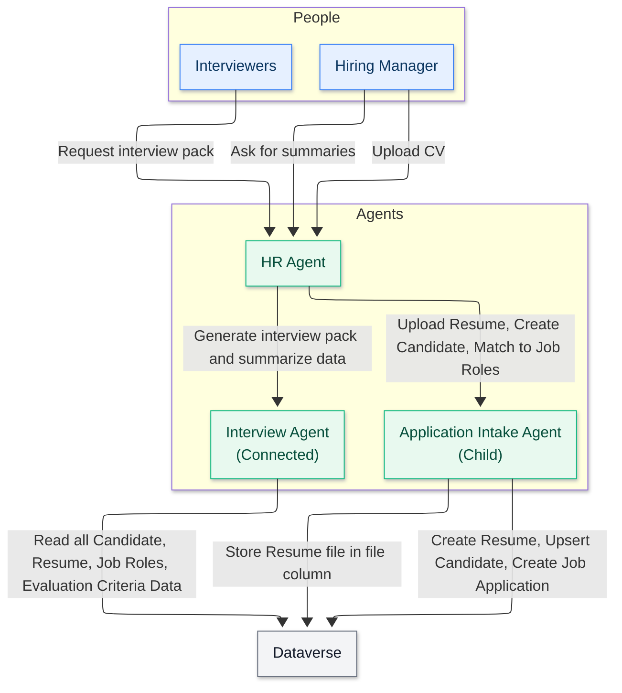
```mermaid
---
config:
  layout: elk
  look: neo
---
flowchart TB
 subgraph People["People"]
    direction TB
        HiringManager["Hiring Manager"]
        Interviewers["Interviewers"]
  end
 subgraph Agents["Agents"]
    direction LR
        ApplicationIntakeAgent["Application Intake Agent<br>(Child)"]
        InterviewAgent["Interview Agent<br>(Connected)"]
        HRAgent["HR Agent"]
  end
    HiringManager -- Upload CV --> HRAgent
    HRAgent -- Upload Resume, Create Candidate, Match to Job Roles --> ApplicationIntakeAgent
    ApplicationIntakeAgent -- Create Resume, Upsert Candidate, Create Job Application --> Dataverse["Dataverse"]
    ApplicationIntakeAgent -- Store Resume file in file column --> Dataverse
    HiringManager -- Ask for summaries --> HRAgent
    Interviewers -- Request interview pack --> HRAgent
    HRAgent -- Generate interview pack and summarize data --> InterviewAgent
    InterviewAgent -- Read all Candidate, Resume, Job Roles, Evaluation Criteria Data --> Dataverse
     HiringManager:::person
     Interviewers:::person
     ApplicationIntakeAgent:::agent
     InterviewAgent:::agent
     HRAgent:::agent
     Dataverse:::data
    classDef person fill:#e6f0ff,stroke:#3b82f6,color:#0b3660
    classDef agent fill:#e8f9ef,stroke:#10b981,color:#064e3b
    classDef data  fill:#f3f4f6,stroke:#6b7280,color:#111827
```

### 🤝Jelentkezési Beérkezési Ügynök feladatai

- **Önéletrajz tartalmának feldolgozása** interaktív csevegésen keresztül kapott PDF-ekből (Egy későbbi küldetésben megtanulod, hogyan lehet önéletrajzokat automatikusan feldolgozni).
- **Strukturált adatok kinyerése** (név, készségek, tapasztalat, végzettség)
- **Jelöltek illesztése nyitott pozíciókhoz** képesítések és motivációs levél alapján
- **Jelölt információk tárolása** Dataverse-ben későbbi feldolgozásra
- **Jelentkezések duplikációjának elkerülése**, hogy ne hozzunk létre ugyanazt a jelöltet kétszer, az önéletrajzból kinyert e-mail cím alapján illesztve meglévő rekordokhoz.

### ⭐Miért legyen ez gyermek ügynök?

A Jelentkezési Beérkezési Ügynök tökéletesen illik gyermek ügynökként, mert:

- Specializált a dokumentumfeldolgozásra és adatkinyerésre
- Nincs szüksége külön közzétételre  
- Része a teljes toborzási megoldásunknak, amelyet ugyanaz a csapat kezel
- Egy konkrét eseményre (új önéletrajz érkezése) összpontosít, és a Toborzó Ügynök hívja meg.

## 🔀Kapcsolt ügynök: Interjú Előkészítő Ügynök  

A második specialista az **Interjú Előkészítő Ügynök** lesz - egy kapcsolt ügynök, amely segít átfogó interjúanyagokat készíteni és értékelni a jelöltek válaszait.

### 🤝Interjú Előkészítő Ügynök feladatai

- **Interjú csomagok készítése** vállalati információkkal, pozíció követelményekkel és értékelési kritériumokkal
- **Interjú kérdések generálása** konkrét pozíciókhoz és jelölt háttérhez igazítva
- **Általános kérdések megválaszolása** a munkakörökről és jelentkezésekről a résztvevők kommunikációjához

### ⭐Miért legyen ez kapcsolt ügynök?

Az Interjú Előkészítő Ügynök jobban működik kapcsolt ügynökként, mert:

- A tehetségkutató csapat önállóan is használni szeretné több toborzási folyamatban
- Saját tudásbázisra van szüksége az interjú legjobb gyakorlatairól és értékelési kritériumokról
- Különböző toborzó vezetők testre szeretnék szabni a viselkedését a csapataik számára
- Újrahasználható belső pozíciókhoz, nem csak külső toborzáshoz

## 🧪Labor 2.1: A Jelentkezési Beérkezési Ügynök hozzáadása

Készen állsz arra, hogy a gyakorlatban is kipróbáld? Adjunk hozzá az első gyermek ügynököt a meglévő Toborzó Ügynöködhöz.

### Előfeltételek a küldetés teljesítéséhez

Szükséged lesz **vagy**:

- **Az 01-es küldetés teljesítésére**, és a Toborzó Ügynököd készen áll, **VAGY**
- **A 02-es küldetés kezdő megoldásának importálására**, ha most kezded, vagy be kell pótolnod. [Töltsd le a 02-es küldetés kezdő megoldását](https://aka.ms/agent-academy)

!!! note "
Az **Agent Flow eszközöket** használjuk a *Önéletrajz feltöltése* lépéshez a Témák helyett, mivel ez a többlépcsős háttérfolyamat determinisztikus végrehajtást és külső rendszerekkel való integrációt igényel. Míg a Témák a beszélgetési párbeszéd irányítására a legjobbak, az Agent Flow biztosítja a strukturált automatizálást, amely megbízhatóan kezeli a fájlok feldolgozását, az adatok érvényesítését és az adatbázis frissítését (új hozzáadás vagy meglévő frissítése) anélkül, hogy a felhasználói interakcióra támaszkodna.

1. Keresse meg az **Eszközök** szekciót az Alkalmazás Felvételi Agent oldalán.
   **Fontos:** Ez nem a fő agent Eszközök lapja, hanem a gyermek agent utasításai alatt görgetve található meg.

1. Válassza ki a **+ Hozzáadás** lehetőséget.
   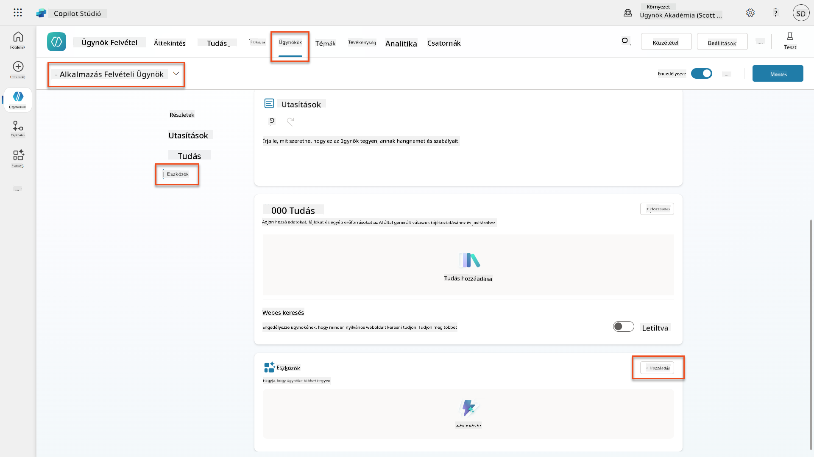

1. Válassza ki a **+ Új eszköz** lehetőséget. 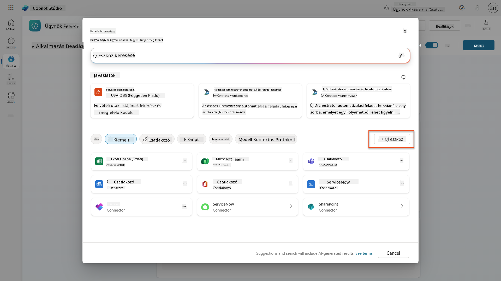

1. Válassza ki az **Agent flow** lehetőséget.
    Az Agent Flow tervező megnyílik, itt fogjuk hozzáadni az önéletrajz feltöltési logikát.  
    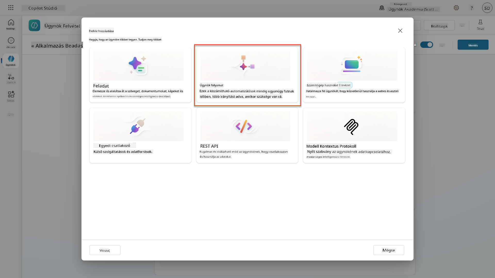

1. Válassza ki a **Amikor egy agent hívja a folyamatot** csomópontot, és válassza ki a **+ Hozzáadás** lehetőséget a következő Paraméterek bemenetéhez, ügyelve arra, hogy megadja mind a nevet, mind a leírást.

    | Típus | Név       | Leírás                                                                                                   |
    |-------|-----------|--------------------------------------------------------------------------------------------------------|
    | Fájl  | Önéletrajz| Az önéletrajz PDF fájl                                                                                  |
    | Szöveg| Üzenet    | Kivonat egy motivációs levél stílusú üzenetből a kontextusból. Az üzenetnek kevesebb mint 2000 karakternek kell lennie. |
    | Szöveg| FelhasználóiEmail| Az e-mail cím, ahonnan az önéletrajz származik. Ez lesz az önéletrajzot feltöltő felhasználó csevegésben, vagy az e-mail küldő címe, ha e-mailben érkezett. |

    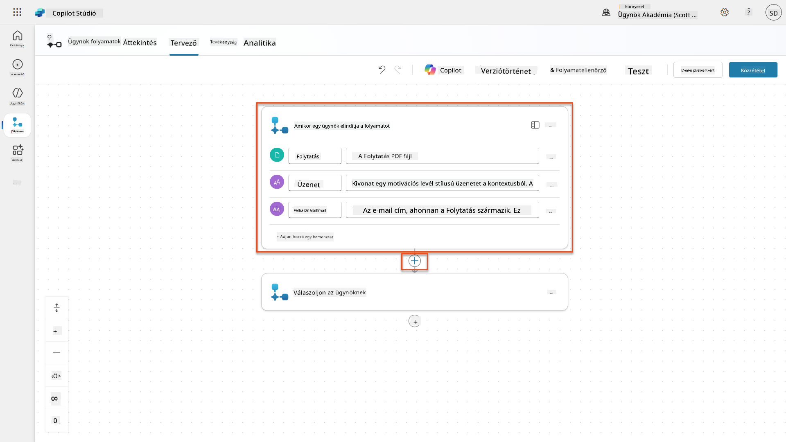

1. Válassza ki a **+ ikon**-t a trigger csomópont alatt, keresse meg a `Dataverse`-t, válassza ki a **Továbbiak megtekintése** lehetőséget a Microsoft Dataverse mellett, majd válassza ki a **Új sor hozzáadása** műveletet a **Microsoft Dataverse** szekcióban.  
    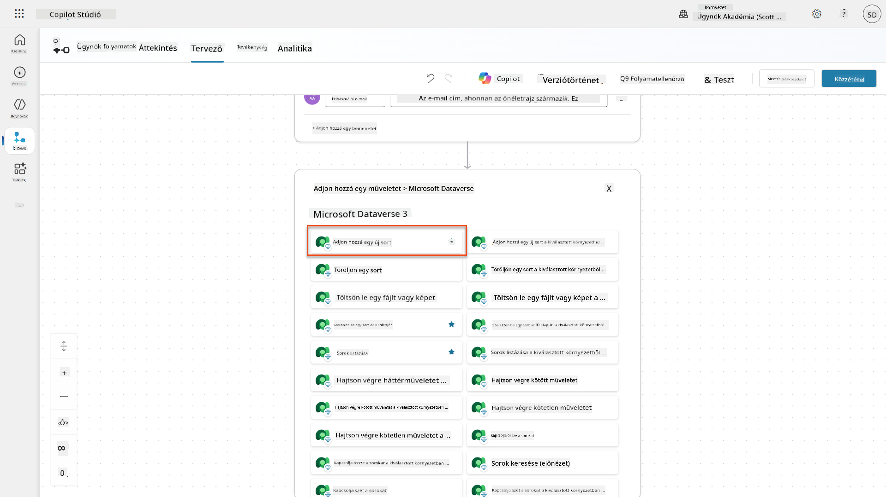

1. Nevezze el a csomópontot **Önéletrajz létrehozása**, az **ellipszis(...)** kiválasztásával, majd válassza a **Átnevezés** lehetőséget.  
    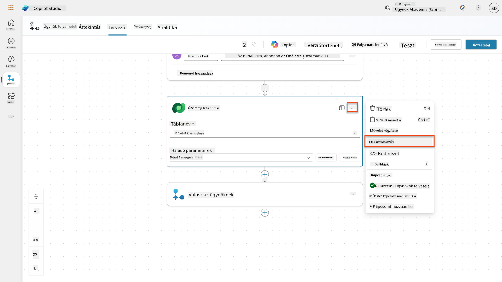

1. Állítsa be a **Táblázat nevét** **Önéletrajzok**-ra, majd válassza a **Mind megjelenítése** lehetőséget, hogy az összes paraméter megjelenjen.

1. Állítsa be a következő **tulajdonságokat**:

    | Tulajdonság              | Beállítás módja                | Részletek / Kifejezés                                         |
    |--------------------------|--------------------------------|--------------------------------------------------------------|
    | **Önéletrajz címe**      | Dinamikus adat (villám ikon)   | **Amikor egy agent hívja a folyamatot** → **Önéletrajz neve** Ha nem látja az Önéletrajz nevet, győződjön meg róla, hogy az Önéletrajz paramétert fentebb adat típusnak konfigurálta. |
    | **Motivációs levél**      | Kifejezés (fx ikon)            | `if(greater(length(triggerBody()?['text']), 2000), substring(triggerBody()?['text'], 0, 2000), triggerBody()?['text'])` |
    | **Forrás e-mail cím**     | Dinamikus adat (villám ikon)   | **Amikor egy agent hívja a folyamatot** → **FelhasználóiEmail** |
    | **Feltöltés dátuma**      | Kifejezés (fx ikon)            | `utcNow()`                                                   |

    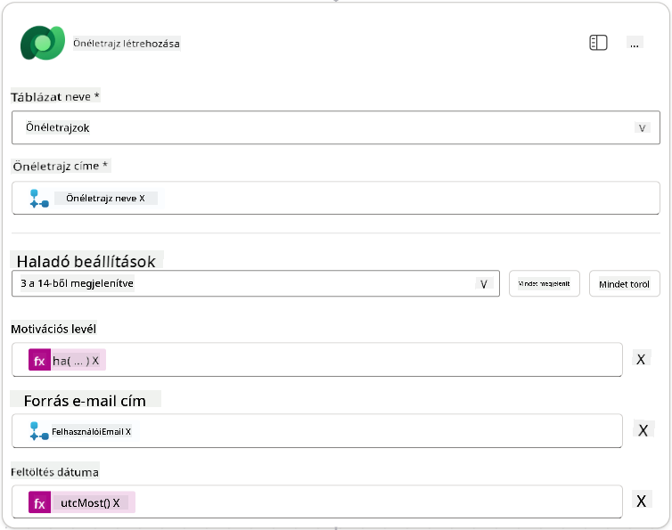

1. Válassza ki a **+ ikon**-t az Önéletrajz létrehozása csomópont alatt, keresse meg a `Dataverse`-t, válassza ki a **Továbbiak megtekintése** lehetőséget a Microsoft Dataverse mellett, majd válassza ki a **Fájl vagy kép feltöltése** műveletet.
   **Fontos:** Ügyeljen arra, hogy ne válassza a Fájl vagy kép feltöltése a kiválasztott környezetbe műveletet.

1. Nevezze el a csomópontot **Önéletrajz fájl feltöltése**, az **ellipszis(...)** kiválasztásával, majd válassza a **Átnevezés** lehetőséget.

1. Állítsa be a következő **tulajdonságokat**:

     | Tulajdonság | Beállítás módja | Részletek |
     |-------------|-----------------|-----------|
     | **Tartalom neve** | Dinamikus adat (villám ikon) | Amikor egy agent hívja a folyamatot → Önéletrajz neve |
     | **Táblázat neve** | Kiválasztás | Önéletrajzok |
     | **Sorazonosító** | Dinamikus adat (villám ikon) | Önéletrajz létrehozása → Továbbiak megtekintése → Önéletrajz |
     | **Oszlop neve** | Kiválasztás | Önéletrajz PDF |
     | **Tartalom** | Dinamikus adat (villám ikon) | Amikor egy agent hívja a folyamatot → Önéletrajz contentBytes |

     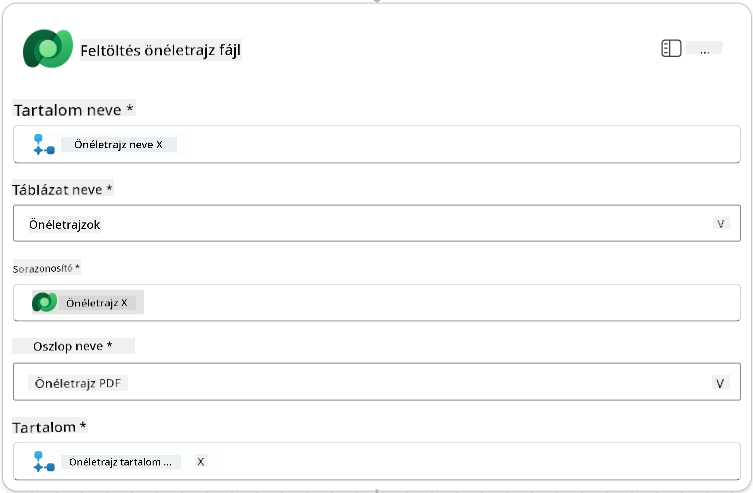

1. Válassza ki a **Válasz az agentnek csomópontot**, majd válassza ki a **+ Kimenet hozzáadása** lehetőséget.

     | Tulajdonság | Beállítás módja | Részletek |
     |-------------|-----------------|-----------|
     | **Típus** | Kiválasztás | `Szöveg` |
     | **Név** | Beírás | `ÖnéletrajzSzám` |
     | **Érték** | Dinamikus adat (villám ikon) | Önéletrajz létrehozása → Továbbiak megtekintése → Önéletrajz Szám |
     | **Leírás** | Beírás | `A létrehozott önéletrajz [ÖnéletrajzSzám]-a` |

     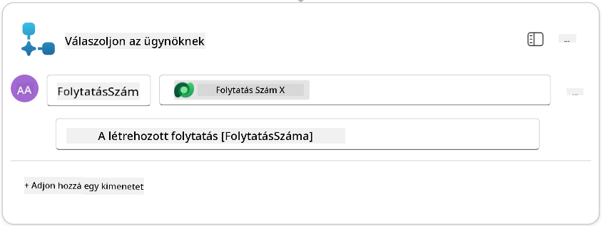

1. Válassza ki a **Mentés piszkozatként** lehetőséget a jobb felső sarokban.  
     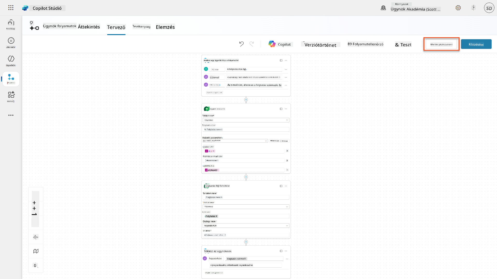

1. Válassza ki az **Áttekintés** lapot, majd válassza ki a **Szerkesztés** lehetőséget a **Részletek** panelen.

     1. **Folyamat neve**: `Önéletrajz feltöltése`
     1. **Leírás**: `Önéletrajz feltöltése utasításra`

     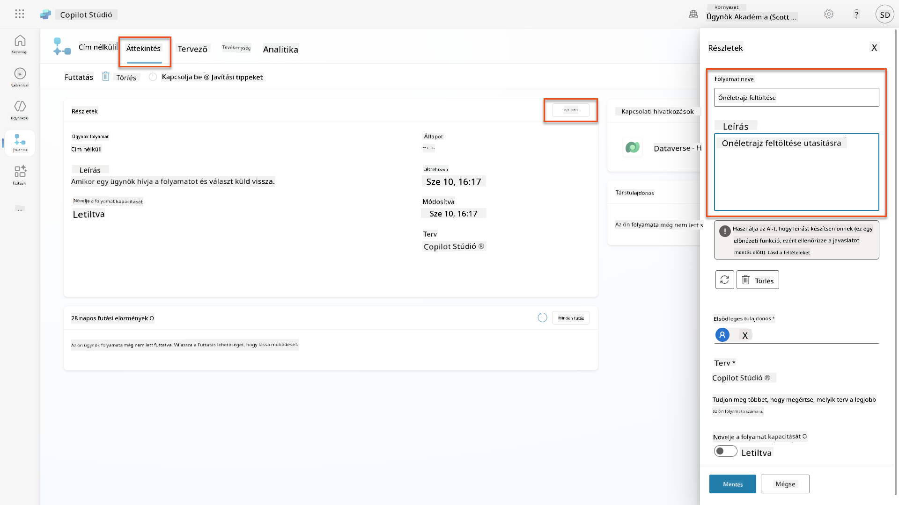

1. Válassza ki újra a **Tervező** lapot, majd válassza ki a **Közzététel** lehetőséget.  
     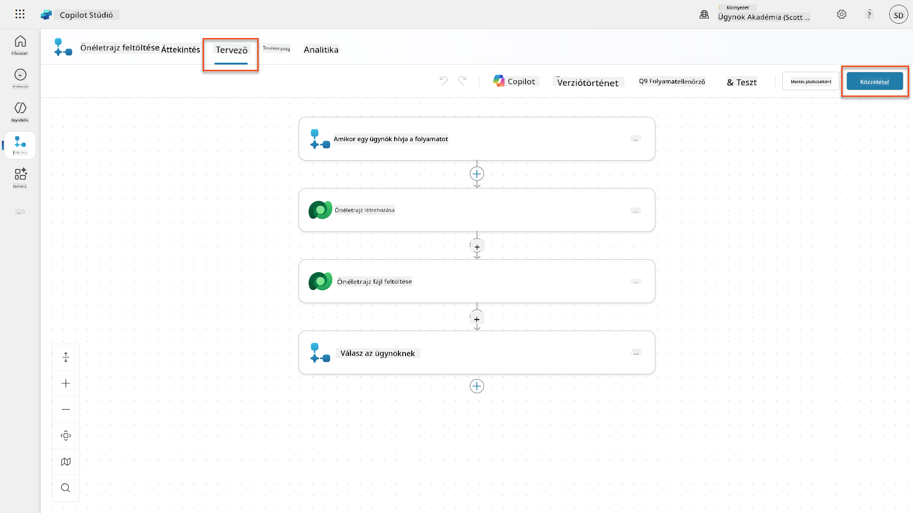

### 2.1.5 Csatlakoztassa a folyamatot az agenthez

Most csatlakoztatja a közzétett folyamatot az Alkalmazás Felvételi Agenthez.

1. Navigáljon vissza a **Felvételi Agent**-hez, és válassza ki az **Agentek** lapot. Nyissa meg az **Alkalmazás Felvételi Agentet**, majd keresse meg az **Eszközök** panelt.  
    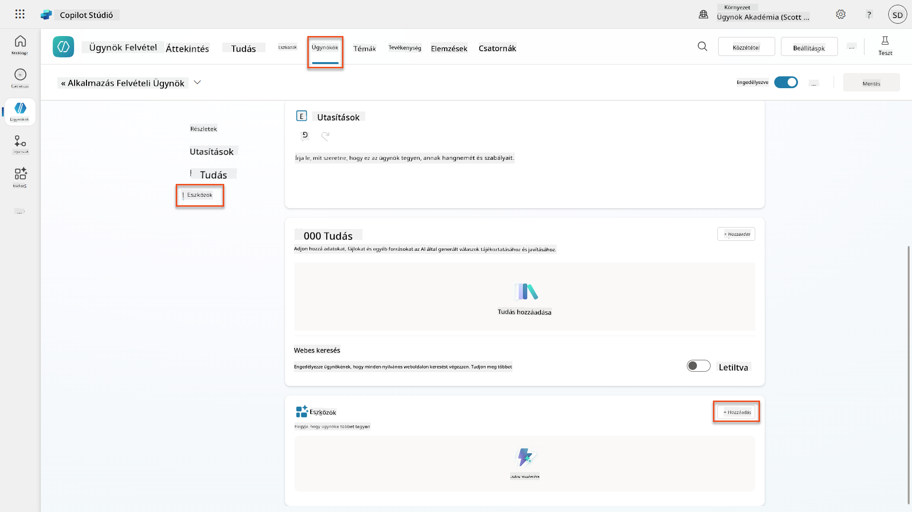

1. Válassza ki a **+ Hozzáadás** lehetőséget.

1. Válassza ki a **Folyamat** szűrőt, és keresse meg a `Önéletrajz feltöltése`-t. Válassza ki az **Önéletrajz feltöltése** folyamatot, majd válassza a **Hozzáadás és konfigurálás** lehetőséget.

1. Állítsa be a következő paramétereket:

    | Paraméter | Érték |
    |-----------|-------|
    | **Leírás** | `Önéletrajz feltöltése utasításra. SZIGORÚ SZABÁLY: Csak akkor hívja meg ezt az eszközt, ha "Önéletrajz feltöltése" formában hivatkoznak rá, és vannak mellékletek.` |
    | **További részletek → Mikor használható ez az eszköz** | `csak ha témák vagy agentek hivatkoznak rá` |
    | **Bemenetek → Bemenet hozzáadása** | `contentBytes` |
    | **Bemenetek → Bemenet hozzáadása** | `name` |

    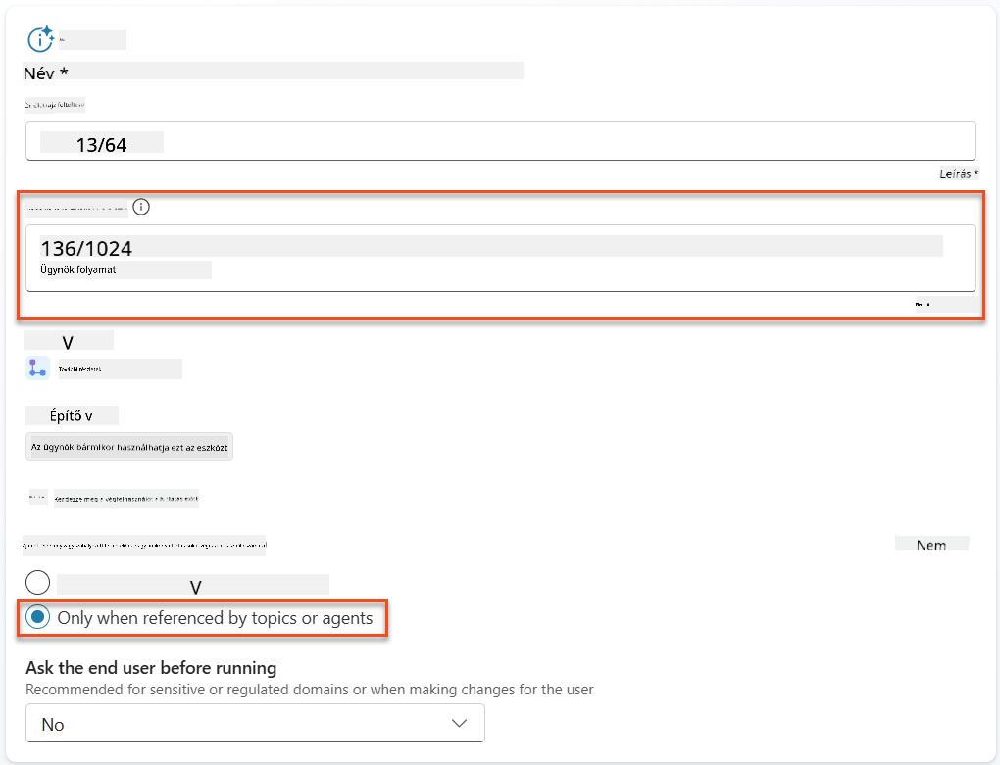

    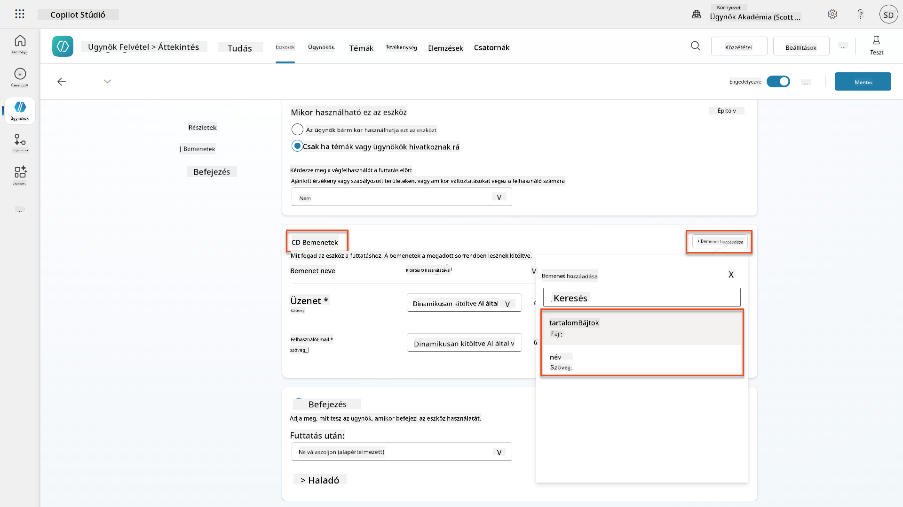

1. Ezután állítsa be a bemenetek tulajdonságait az alábbiak szerint:

    | Bemeneti paraméter | Tulajdonság | Részletek |
    |--------------------|-------------|-----------|
    | **contentBytes** | Kitöltés módja | Egyéni érték |
    |                   | Érték (...→Képlet→Beszúrás) | `First(System.Activity.Attachments).Content` |
    | **name** | Kitöltés módja | Egyéni érték |
    |         | Érték (...→Képlet→Beszúrás) | `First(System.Activity.Attachments).Name` |
    | **Üzenet** | Testreszabás | Egyéni beállítások konfigurálása |
    |             | Leírás | `Kivonat egy motivációs levél stílusú üzenetből a kontextusból. Ügyeljen arra, hogy soha ne kérje a felhasználót, és hozzon létre legalább egy minimális motivációs levelet az elérhető kontextusból. SZIGORÚ SZABÁLY - az üzenetnek kevesebb mint 2000 karakternek kell lennie.` |
    |             | Hány újrapróbálkozás | Ne ismételje |
    |             | Művelet, ha nincs entitás található | Állítsa be a változót értékre |
    |             | Alapértelmezett entitásérték | Önéletrajz feltöltése |
    | **FelhasználóiEmail** | Kitöltés módja | Egyéni érték |
    |  | Érték (...→Képlet→Beszúrás) | `System.User.Email` |

    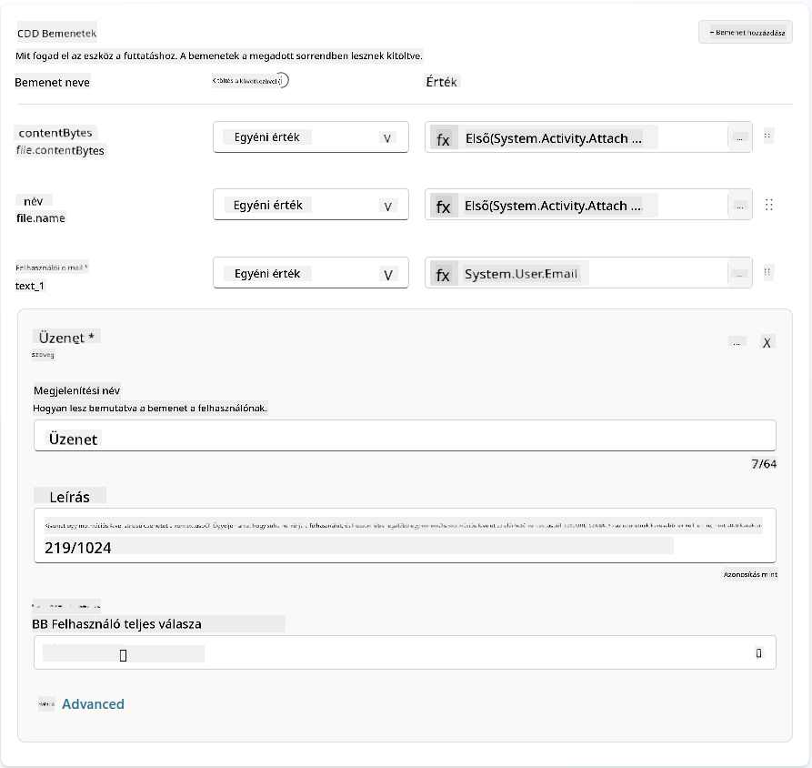

1. Válassza ki a **Mentés** lehetőséget.

### 2.1.6 Agent utasítások meghatározása

1. Lépjen vissza az **Alkalmazás Felvételi Agent**-hez az **Agentek** lap kiválasztásával, majd keresse meg az **Utasítások** panelt.

1. Az **Utasítások** mezőbe illessze be a következő egyértelmű útmutatást a gyermek agent számára:

    ```text
    You are tasked with managing incoming Resumes, Candidate information, and creating Job Applications.  
    Only use tools if the step exactly matches the defined process. Otherwise, indicate you cannot help.  
    
    Process for Resume Upload via Chat  
    1. Upload Resume  
      - Trigger only if /System.Activity.Attachments contains exactly one new resume.  
      - If more than one file, instruct the user to upload one at a time and stop.  
      - Call /Upload Resume once. Never upload more than once for the same message.  
    
    2. Post-Upload  
      - Always output the [ResumeNumber] (R#####).  
    ```

1. Ahol az utasítások tartalmaznak egy perjelet (/), válassza ki a perjel utáni szöveget, és válassza ki a megoldott nevet. Tegye ezt a következőkre:

    - `System.Activity.Attachments` (Változó)
    - `Önéletrajz feltöltése` (Eszköz)

    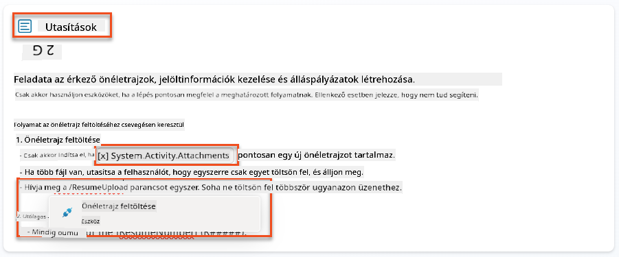

1. Válassza ki a **Mentés** lehetőséget.

### 2.1.7 Tesztelje az Alkalmazás Felvételi Agentet

Most ellenőrizzük, hogy az első zenekari tag megfelelően működik-e.

1. **Töltse le** a [teszt önéletrajzokat.](https://download-directory.github.io/?url=https://github.com/microsoft/agent-academy/tree/main/operative/sample-data/resumes&filename=operative_sampledata)

1. **Nyissa meg** a teszt panelt a **Teszt** kiválasztásával.

1. **Töltsön fel** két önéletrajzot a teszt csevegésbe, és írja be az üzenetet: `Ezeket az önéletrajzokat dolgozza fel`.

    - Az agentnek egy hasonló üzenetet kell visszaadnia: *Egyszerre csak egy önéletrajz tölthető fel. Kérjük, töltsön fel egy önéletrajzot a folytatáshoz.*

    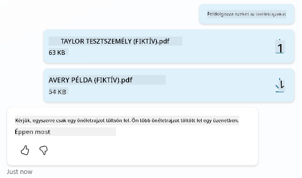

1. Próbáljon meg **csak egy önéletrajzot feltölteni**, az üzenettel: `Ezt az önéletrajzot dolgozza fel`.

    - Az agentnek egy hasonló üzenetet kell adnia: *Az önéletrajz Avery Példa számára sikeresen feltöltve. Az önéletrajz száma R10026.*

1. Az **Tevékenységtérképen** látnia kell, hogy az **Alkalmazás Felvételi Agent** kezeli az önéletrajz feltöltését.  
    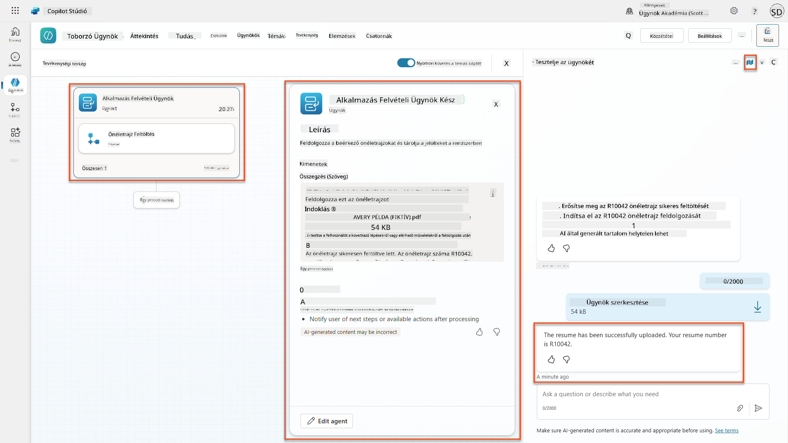

1. Navigáljon a make.powerapps.com → Győződjön meg róla, hogy a környezete ki van választva a jobb felső sarokban található Környezetválasztóban.

1. Válassza ki az **Alkalmazások** → Felvételi Központ → ellipszis(...) menü → **Lejátszás**  
    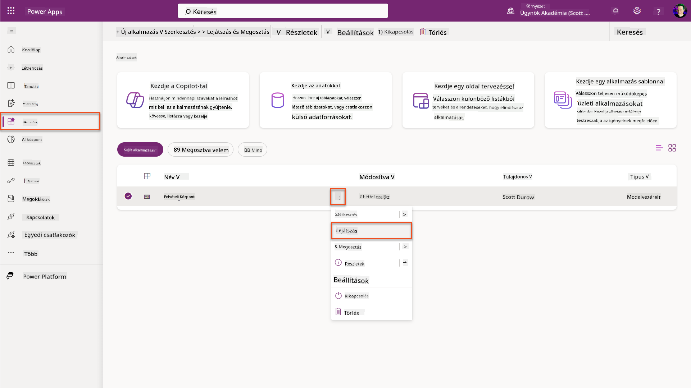

    Megjegyzés: Ha a lejátszás gomb szürke, az azt jelenti, hogy nem publikálta a megoldását az 01. küldetésből. Válassza ki a **Megoldások** → **Minden testreszabás közzététele** lehetőséget.

1. Navigáljon az **Önéletrajzok**-hoz, és ellenőrizze, hogy az önéletrajz fájl feltöltve van-e, és a motivációs levél megfelelően be van-e állítva.  
    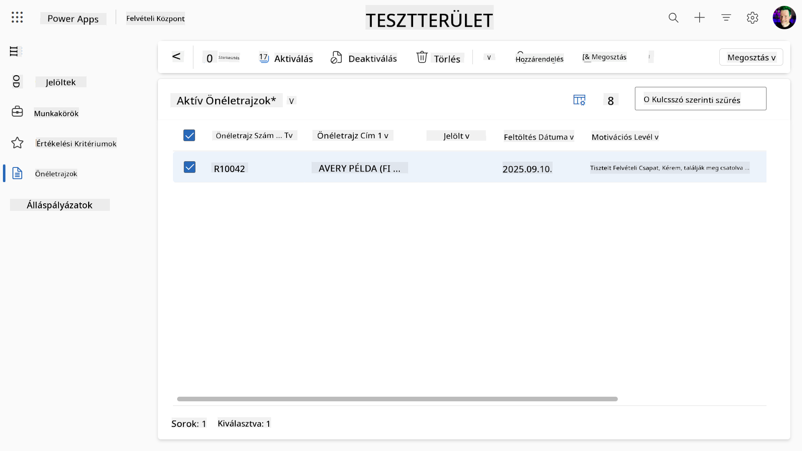

## 🧪Labor 2.2: Interjú előkészítő kapcsolt agent hozzáadása

Most hozzuk létre az interjú előkészítő kapcsolt agentet, és adjuk hozzá a meglévő Felvételi Agenthez.

### 2.2.1 Hozza létre a kapcsolt Interjú Agentet

1. **Navigáljon** a Copilot Studio-ba. Győződjön meg róla, hogy a környezete továbbra is ki van választva a jobb felső sarokban található Környezetválasztóban.

1. Nyissa meg a **Felvételi Agentet**.

1. Navigáljon az Agent lapra, és válassza ki a **+ Agent hozzáadása** lehetőséget.

1. Válassza ki a **Kapcsolt meglévő agent** → **Copilot Studio** lehetőséget.

1. Válassza ki a **+ Új agent** lehetőséget.

### 2.2.2 Alapbeállítások konfigurálása

1. Válassza ki a
    ```text
    Assists with the interview process and provides information about Resumes, Candidates, Job Roles, and Evaluation Criteria.
    ```

    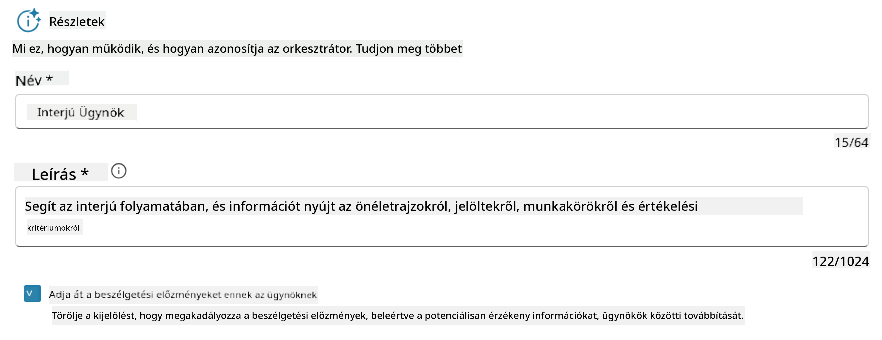
    Figyeld meg, hogy a "Beszélgetési előzmények továbbítása ehhez az ügynökhöz" be van jelölve. Ez lehetővé teszi, hogy a szülő ügynök teljes kontextust biztosítson a kapcsolt ügynök számára.

1. Válaszd ki a **Ügynök hozzáadása** lehetőséget.

1. Győződj meg róla, hogy mind az **Application Intake Agent**, mind az **Interview Agent** látható. Figyeld meg, hogy az egyik egy gyermek ügynök, a másik pedig egy kapcsolt ügynök.  
    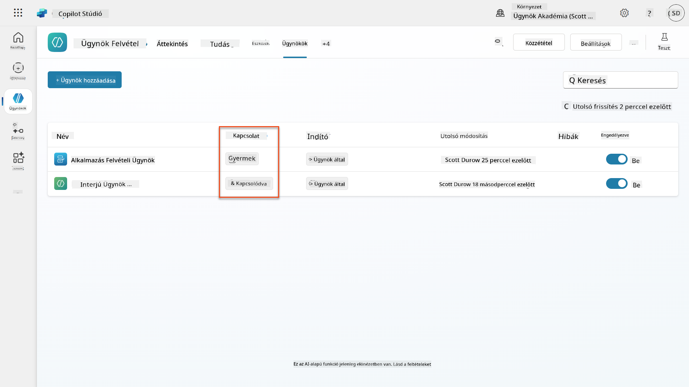

### 2.2.5 Több ügynök együttműködésének tesztelése

1. **Nyisd meg** a teszt panelt a **Teszt** kiválasztásával.

1. **Tölts fel** egy teszt önéletrajzot, és írd be a következő leírást, amely elmagyarázza a szülő ügynöknek, hogy mit delegálhat a kapcsolt ügynöknek:

    ```text
    Upload this resume, then show me open job roles, each with a description of the evaluation criteria, then use this to match the resume to at least one suitable job role even if not a perfect match.
    ```

    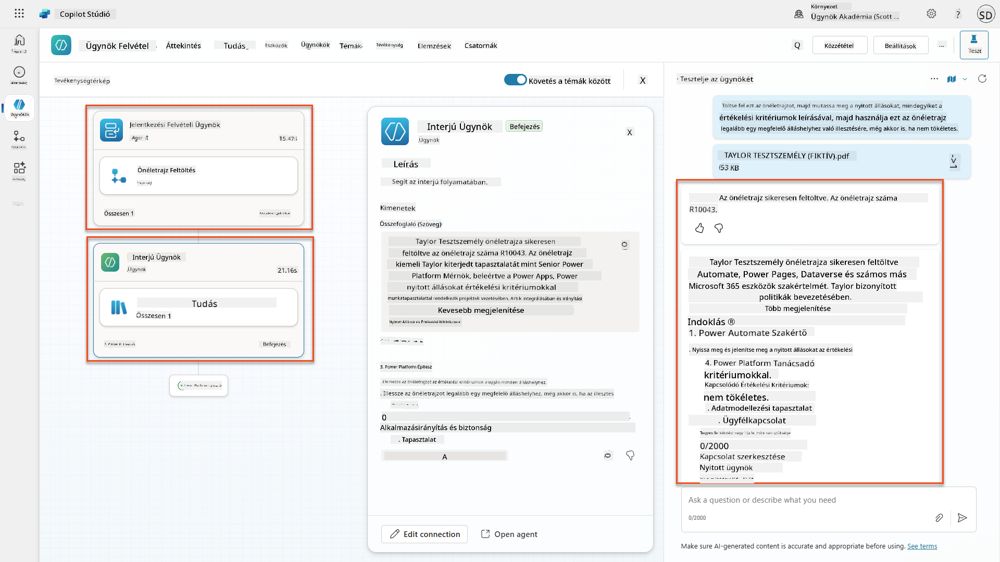

1. Figyeld meg, hogyan delegálta a Felvételi Ügynök a feltöltést a gyermek ügynöknek, majd kérte az Interjú Ügynököt, hogy készítsen összefoglalót és álláslehetőség-összehasonlítást a tudása alapján.  
   Próbálj ki különböző módokat, hogy kérdéseket tegyél fel az önéletrajzokról, álláslehetőségekről és értékelési kritériumokról.  
   **Példák:**

    ```text
    Give me a summary of active resumes
    ```

    ```text
    Summarize resume R10044
    ```

    ```text
    Which active resumes are suitable for the Power Platform Developer role?
    ```

## 🎉 Küldetés Teljesítve

Kiváló munka, Ügynök! **Operation Symphony** most befejeződött. Sikeresen átalakítottad az egyetlen Felvételi Ügynöködet egy kifinomult, specializált képességekkel rendelkező több ügynökből álló zenekarrá.

Íme, amit elértél ebben a küldetésben:

**✅ Több ügynök architektúra elsajátítása**  
Most már érted, mikor érdemes gyermek ügynököket vagy kapcsolt ügynököket használni, és hogyan tervezhetsz skálázható rendszereket.

**✅ Application Intake gyermek ügynök**  
Hozzáadtál egy specializált gyermek ügynököt a Felvételi Ügynöködhöz, amely feldolgozza az önéletrajzokat, kinyeri a jelölt adatait, és tárolja az információkat a Dataverse-ben.

**✅ Interjú előkészítő kapcsolt ügynök**  
Létrehoztál egy újrahasznosítható kapcsolt ügynököt az interjú előkészítéséhez, és sikeresen csatlakoztattad a Felvételi Ügynöködhöz.

**✅ Ügynök kommunikáció**  
Láttad, hogyan tud a fő ügynök koordinálni a specialista ügynökökkel, megosztani a kontextust, és összetett munkafolyamatokat irányítani.

**✅ Alap az autonómiához**  
A továbbfejlesztett felvételi rendszered most készen áll azokra a fejlett funkciókra, amelyeket a következő küldetésekben fogunk hozzáadni: autonóm triggerek, tartalom moderálás és mélyebb elemzés.

🚀**Következő lépés:** A következő küldetésedben megtanulod, hogyan konfiguráld az ügynöködet, hogy önállóan dolgozza fel az e-mailekből érkező önéletrajzokat!

⏩[Lépj a 03. küldetésre: Automatizáld az ügynöködet triggerek segítségével](../03-automate-triggers/README.md)

## 📚 Taktikai Források

📖 [Egyéb ügynökök hozzáadása (előzetes verzió)](https://learn.microsoft.com/microsoft-copilot-studio/authoring-add-other-agents?WT.mc_id=power-182762-scottdurow)

📖 [Eszközök hozzáadása egyedi ügynökökhöz](https://learn.microsoft.com/microsoft-copilot-studio/advanced-plugin-actions?WT.mc_id=power-182762-scottdurow)

📖 [Dataverse használata a Copilot Studio-ban](https://learn.microsoft.com/microsoft-copilot-studio/knowledge-add-dataverse?WT.mc_id=power-182762-scottdurow)

📖 [Ügynök folyamatok áttekintése](https://learn.microsoft.com/microsoft-copilot-studio/flows-overview?WT.mc_id=power-182762-scottdurow)

📖 [Megoldás létrehozása](https://learn.microsoft.com/power-platform/alm/solution-concepts-alm?WT.mc_id=power-182762-scottdurow)

📖 [Power Platform megoldás ALM útmutató](https://learn.microsoft.com/power-platform/alm/overview-alm?WT.mc_id=power-182762-scottdurow)

📺 [Ügynök-ügynök együttműködés a Copilot Studio-ban](https://youtu.be/d-oD3pApHAg?si=rwIHKhJTkjSvhTHw)

---

**Felelősség kizárása**:  
Ez a dokumentum az [Co-op Translator](https://github.com/Azure/co-op-translator) AI fordítási szolgáltatás segítségével lett lefordítva. Bár törekszünk a pontosságra, kérjük, vegye figyelembe, hogy az automatikus fordítások hibákat vagy pontatlanságokat tartalmazhatnak. Az eredeti dokumentum az eredeti nyelvén tekintendő hiteles forrásnak. Kritikus információk esetén javasolt professzionális emberi fordítást igénybe venni. Nem vállalunk felelősséget semmilyen félreértésért vagy téves értelmezésért, amely a fordítás használatából eredhet.