<!--
CO_OP_TRANSLATOR_METADATA:
{
  "original_hash": "75efaf515d5694d4fd549bfd6518901a",
  "translation_date": "2025-10-20T18:17:58+00:00",
  "source_file": "docs/operative-preview/03-automate-triggers/README.md",
  "language_code": "hu"
}
-->
# Küldetés 03: Eseményindítók hozzáadása az autonóm működéshez

--8<-- "disclaimer.md"

## 🕵️‍♂️ KÓDNEVE: `SIGNAL POINT MŰVELET`

> **⏱️ Műveleti időablak:** `~45 perc`

## 🎯 Küldetés összefoglaló

Üdv újra, Ügynök! A [Küldetés 02](../02-multi-agent/README.md) során megtanultad, hogyan hozhatsz létre egy Jelentkezési Ügynököt és egy Interjú Felkészítő Ügynököt, hogy bővítsd a fő Toborzó Ügynök képességeit.

A feladatod, ha elfogadod, a **Signal Point Művelet** - mélyebben belemerülni az **eseményindítók** világába, és a reakcióalapú ügynökrendszert **autonóm működésre** emelni. Átalakítod az ügynökeidet, hogy ne csak kérdésekre válaszoljanak, hanem előre lássák az igényeket és önállóan cselekedjenek. 

Gondolj rá úgy, mint egy frissítésre, amely az ügynököket a _kérdések megválaszolásától_ a _szükségletek előrejelzéséig_ és _önálló cselekvésig_ emeli. Az eseményindítók és automatizált munkafolyamatok révén a Toborzó Ügynök képes lesz észlelni a beérkező önéletrajzokat tartalmazó e-maileket, automatikusan feldolgozni a csatolmányokat, adatokat tárolni a Dataverse-ben, és értesíteni az HR toborzó csapatot a Microsoft Teams-en keresztül - miközben te a magasabb értékű feladatokra koncentrálsz.

Üdvözlünk az automatizáció és intelligencia világában.

## 🔎 Célkitűzések

Ebben a küldetésben megtanulod:

1. Hogyan teszik lehetővé az eseményindítók az autonóm ügynöki viselkedést felhasználói interakció nélkül
1. Az interaktív és autonóm ügynökök közötti különbségeket a Copilot Studio-ban
1. Hogyan hozhatsz létre eseményindítókat, amelyek automatikusan feldolgozzák az e-mail csatolmányokat és feltöltik a fájlokat a Dataverse-be
1. Hogyan építhetsz ügynöki folyamatokat, amelyek adaptív kártyákat küldenek a Teams csatornákra értesítésként
1. Hogyan lehet adatokat átadni az eseményindítók és ügynöki folyamatok között az end-to-end automatizáció érdekében

## 🤔 Mi az az eseményindító?

Korábban a [Recruit](../../recruit/10-add-event-triggers/README.md) részben tanultunk az eseményindítókról. Gyorsan összefoglaljuk, ha esetleg lemaradtál róla.

Az **eseményindítók** lehetővé teszik, hogy egy ügynök _önállóan cselekedjen_, amikor valami történik egy másik rendszerben - felhasználói üzenet nélkül. Amikor a konfigurált esemény bekövetkezik - például „új SharePoint elem,” „új e-mail,” „Planner feladat kiosztva,” vagy akár időalapú ismétlődés, egy csatlakozó indító adatcsomagot küld az ügynöknek. Az ügynök ezután követi az utasításaidat, hogy eldöntse, melyik műveleteket vagy témákat hívja meg.

### Fő jellemzők

- **Autonóm aktiválás:**
      - Ellentétben a témák indítóival, amelyek akkor indulnak, amikor egy felhasználó üzenetet küld az ügynöknek, az eseményindítók külső eseményekből indulnak, lehetővé téve a proaktív viselkedést.

- **Adatcsomag-alapú:**
      - Minden esemény egy adatcsomagot (változók + opcionális utasítások) küld egy csatlakozón keresztül. Az ügynök az általad meghatározott utasításokat és az adatcsomagot használja, hogy eldöntse, mi legyen a következő lépés.
      - Például _hívjon meg egy témát_ vagy _hajtson végre eszközök által meghatározott műveleteket_.

- **Példák készen:**
      - SharePoint/OneDrive fájl vagy elem létrehozva
      - Planner feladat befejezve/kiosztva
      - Microsoft Forms válasz beküldve
      - Ismétlődés/ütemezés

    Az elérhetőség az adott szervezet adatpolitikájától függ, amelyet a Power Automate-ben konfiguráltak.

- **Generatív orkestráció szükséges:**
      - Az eseményindítók csak akkor érhetők el, ha az ügynök számára engedélyezve van a generatív orkestráció.

- **Számlázás/használat:**
      - Minden indító adatcsomag egy üzenetként számít a Copilot Studio kapacitásába.
      - Például egy 10 perces ismétlődés minden 10 percben küld egy üzenetet.

- **Hitelesítési modell és beállítás:**
      - Az indítókat az ügynök Áttekintés részében, a _Triggers_ alatt adhatod hozzá. Az indító csatlakozó hitelesítése az ügynök készítőjének fiókját használja („ügynök szerző hitelesítés”).
      - Az indító paramétereit és adatcsomagját a Power Automate készítői portálon szerkesztheted.

- **Tesztelés és megfigyelhetőség:**
      - Az indítókat tesztelheted az ügynök tesztpaneljén, és az aktivitási térképen ellenőrizheted a viselkedést a publikálás előtt.

!!! info "Fejlesztőknek röviden"

    Gondolj az eseményindítókra úgy, mint **webhook-szerű jelekre**, amelyek strukturált adatcsomagot küldenek az ügynöknek, lehetővé téve, hogy _munkát kezdeményezzen_ és műveleteket láncoljon össze rendszerek között - anélkül, hogy egy felhasználó kérné.

### Témaindítók - miben különböznek?

Korábban tanultál a témaindítókról a [Recruit](../../recruit/07-add-new-topic-with-trigger/README.md) részben, de lehet, hogy még mindig nem világos, miben különböznek a _Téma_ indítók az _Esemény_ indítóktól, és miért fontos ez a különbség az autonóm ügynök megértéséhez.

A témaindítók szabályozzák, hogy _mikor fut egy téma_, általában egy felhasználói üzenet hatására.

- A generatív orkestrációban az alapértelmezett indító a **By agent** - a tervező kiválasztja azt a témát, amelynek neve/leírása legjobban illeszkedik a felhasználó üzenetéhez.
- A klasszikus orkestrációban az alapértelmezett a **Kifejezések** - a tervező kiválasztja azt a témát, amelynek egy vagy több indító kifejezése legjobban illeszkedik a felhasználó üzenetéhez.

Egyéb indítótípusok: `Üzenet érkezett`, `Esemény érkezett`, `Tevékenység érkezett`, `Beszélgetés frissítése`, `Hívás érkezett`, `Átirányítás`, `Tétlenség`, és `Terv befejezése`.

!!! info "Alapvető különbség"

    A témaindítók a csevegésen belüli _beszélgetési tevékenységek_ indítói.
    
    Az eseményindítók a rendszer _eseményeinek_ indítói, amelyeket csatlakozók küldenek, és amelyek az ügynököt bármilyen beszélgetés nélkül futtathatják.

### Gyors útmutató a Témaindító és Eseményindító közötti különbségekről

- **Témaindító:** Felhasználó (vagy csevegési tevékenység) mondta/tette X ➡️ futtatja T témát.
- **Eseményindító:** SharePoint/Planner/E-mail/Időzítő adatcsomagot küldött P ➡️ ügynök értékeli az utasításokat ➡️ ennek megfelelően hívja meg a Műveleteket/Témákat.

## 🏓 Interaktív ügynök vs Autonóm ügynök - összehasonlítás

Most, hogy tudod, mi a különbség az eseményindítók és a témaindítók között, nézzük meg az interaktív ügynök és az autonóm ügynök közötti különbségeket.

A Copilot Studio terminológiájában az "interaktív" azokra az ügynökökre vonatkozik, amelyek elsősorban **témákon** keresztül kommunikálnak egy csevegésben vagy csatornán. Az "autonóm" azokra az ügynökökre vonatkozik, amelyek **eseményindítókat** is használnak, hogy felhasználói bemenet nélkül működjenek.

Az alábbi táblázat összefoglalja a különbségeket és hasonlóságokat.

| Dimenzió                            | Interaktív ügynök     | Autonóm ügynök                                                                                              |
|-------------------------------------|-----------------------|-------------------------------------------------------------------------------------------------------------|
| Hogyan indul                       | Felhasználó (vagy csevegési tevékenység) indít egy témát. Példa: By agent, Kifejezések, Üzenet érkezett.   | Külső eseményindító adatcsomagot küld egy csatlakozón keresztül az ügynöknek. Példa: SharePoint, Planner, e-mail, ütemezés stb. |
| Elsődleges használat               | Kérdések és válaszok, irányított munkafolyamatok, kérés-alapú műveletek csevegésben - Teams, web stb.  | Proaktív műveletek és háttér automatizáció - reagál a rendszer változásaira, majd értesít, fájlt ment vagy feladatokat szervez. |
| Indító felület                     | Témaindítók: By agent / Kifejezések / Üzenet érkezett / Tevékenységtípusok / Hívás / Tétlenség / Terv befejezése | Eseményindítók könyvtára csatlakozókon keresztül; az adatcsomag tartalmazza az eseményadatokat + opcionális utasításokat. |
| Tervező (generatív orkestráció)    | Erősen használva a By agent és Terv befejezése indítókhoz, hogy témákat válasszon/sorrendbe állítson. | Szükséges az eseményindítókhoz; az ügynök az utasításokat + adatcsomagot használja, hogy eldöntse, mely műveleteket/témákat hívja meg. |
| Tipikus példa                     | Felhasználó kérdezi: "Mi a visszatérítési politikánk?" → Téma fut, lekérdezés tudásbázisból, válasz. | Új Planner feladat kiosztva → Eseményindító indul → Ügynök Teams üzenetet küld, rekordot frissít vagy témát hív meg. |
| Beállítási útvonal                | Témák létrehozása, indítótípus meghatározása, párbeszéd/műveletek szerkesztése; publikálás csatornákra. | Eseményindító hozzáadása (Áttekintés → Triggers), csatlakozó hitelesítése az ügynök szerzői hitelesítési adataival, adatcsomag/utasítások konfigurálása; tesztelés tesztpanelen; publikálás. |
| Hitelesítés és irányítás          | Csatorna/hitelesítési kontextusban fut; témaindítók válaszolnak a csevegési tevékenységekre az engedélyezett csatornákban. | Az indítók elérhetősége a Power Automate adatpolitikáitól függ; csatlakozók az ügynök készítőjének fiókján futnak. |
| Megfigyelhetőség                 | Témák tesztelése a Copilot Studio-ban, beszélgetési átiratok/tevékenységek ellenőrzése. | Teszt indító és aktivitási térkép használata a végrehajtás validálására publikálás előtt, aktivitás figyelése publikálás után. |
| Kapacitás hatás                  | Minden felhasználói üzenet/ügynöki válasz egy üzenetként fogyaszt kapacitást. | Minden esemény kézbesítése szintén egy üzenet, plusz bármely további művelet. Példa: egy 10 perces ismétlődés = 6 üzenet/óra |

### Mikor melyiket használjuk?

- Válaszd a **témaindítókat (interaktív)**, amikor a felhasználók kezdeményezik az ügynök beszélgetést - GYIK, irányított jelentkezés vagy parancs-stílusú feladatok csevegésen belül. A tervező By agent indítója csökkenti a kézi kifejezés-kurációt.
- Adj hozzá **eseményindítókat (autonóm)**, amikor az ügynöknek kell kezdeményeznie a beszélgetést vagy önállóan cselekednie - frissítések esetén a SharePoint/Dataverse-ben, beérkező e-mail esetén vagy ütemezés alapján. Ez a reaktív működésről a proaktív műveletekre váltást jelenti.

## Fejlesztői tippek és buktatók

1. **Engedélyezd a generatív orkestrációt** minden ügynöknél, amelyet autonóm működésre szeretnél állítani. Az eseményindítók nem jelennek meg másképp.

1. **Modellezd az adatcsomagot korán.** Döntsd el, hogy az ügynöknek milyen minimális mezőkre van szüksége az indítóból, például `itemId`, `assignedTo`, `dueDate`, és adj meg tömör utasításokat, amelyek megmondják az ügynöknek, mely műveletet/témát hívja meg az adatcsomag értékei alapján.

1. **Hitelesítési hatókör számít.** Az indítók az ügynök készítőjének fiókját használják hitelesítésre. Győződj meg róla, hogy a fiók rendelkezik a megfelelő csatlakozó engedélyekkel és megfelel a Power Automate adatpolitikáinak.

1. **Költség és zaj kontrollálása.** A magas frekvenciájú ismétlődések vagy nagyon aktív források gyorsan növelhetik az üzenetfogyasztást - korlátozd, ahol lehetséges, vagy adj feltételeket az indítóban az események szűrésére.

1. **Tesztelj publikálás előtt.** Használd a **Teszt indítót** és az aktivitási térképet, hogy figyeld a tervet és a meghívott műveleteket - iterálj az utasításokon/adatcsomagon, amíg a viselkedés stabil nem lesz.

## 🧪 Labor 03 - Jelentkezési e-mailek automatizálása

Most hozzáadunk egy eseményindítót a **Toborzó Ügynökhöz**, és létrehozunk egy ügynöki folyamatot a gyermek **Jelentkezési Ügynökben**, hogy további feldolgozást végezzen az autonóm működés érdekében.

### ✨ Használati forgatókönyv

!!! info ""

    **Mint** HR toborzó

    **Azt szeretném**, hogy értesítést kapjak, amikor egy önéletrajzot tartalmazó e-mail érkezik a Beérkező levelek mappámba, amely automatikusan feltöltésre kerül a Dataverse-be

    **Azért, hogy** értesüljek az e-mailben küldött jelentkezésekről, amelyek automatikusan feltöltésre kerülnek a Dataverse-be

Ezt két technika segítségével érjük el:

1. Egy eseményindító, amely az e-mail érkezésekor aktiválódik,
    1. Ellenőrzi, hogy a
Most már frissíteni fogjuk az eseményindítót, hogy további automatizálási funkciókat adjunk hozzá. Válassza ki az **ellipsis (...)** ikont az indítónál, majd válassza az **Edit in Power Automate** lehetőséget.

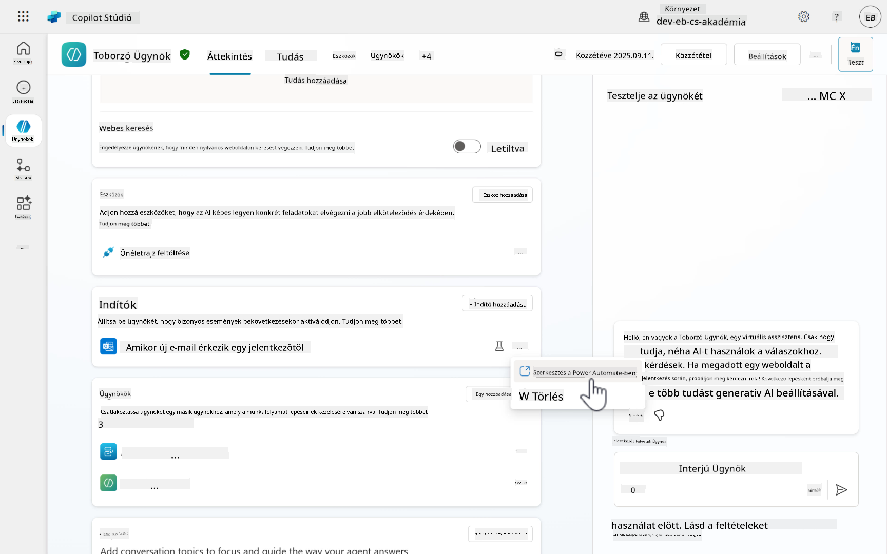

1. Az indító betöltődik egy folyamatként a Power Automate készítői portálján. Amit lát, az a Power Automate készítői portáljának folyamattervezője. Itt adhatunk hozzá további logikát és műveleteket az automatizálás fokozásához. Az indító a tetején jelenik meg, majd a **Sends a prompt to the specified copilot for processing** lesz a folyamat utolsó művelete.

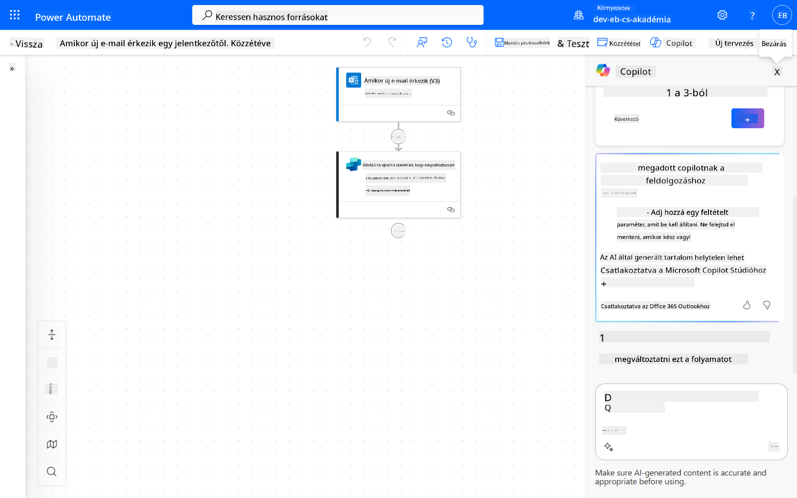

1. Alapértelmezés szerint a Power Automate **When a new email arrives** indítója egyszerre több e-mailt is feldolgozhat, ha több érkezik egyszerre, és csak egyszer futtatja a folyamatot az egész csoportra.

   Annak érdekében, hogy a folyamat külön-külön fusson minden egyes e-mailre, engedélyezze a **Split On** beállítást az indító beállításaiban, és válassza ki a `@triggerOutputs()?['body/value']` értéket a legördülő tömb mezőben.

   A **Split On** bekapcsolásával és a tömb mező beállításával `@triggerOutputs()?['body/value']` értékre, a folyamat külön-külön fog futni minden üzenetre, még akkor is, ha egyszerre sok érkezik.

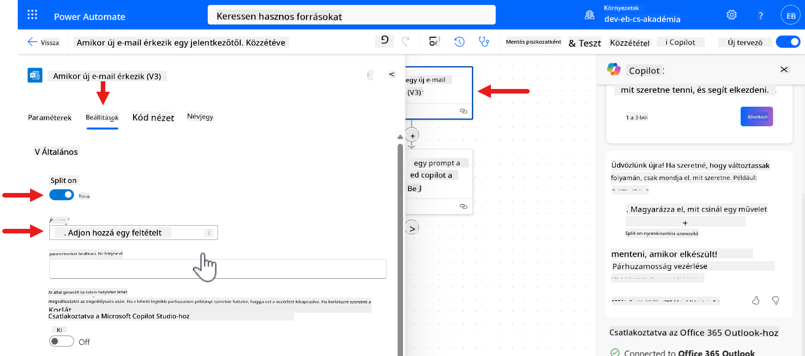

1. Ezután adjunk hozzá némi logikát az e-mail mellékletek fájltípusának ellenőrzéséhez. Csak .PDF fájlokat szeretnénk feltölteni, nem pedig képeket (ezek e-mail aláírásokból származhatnak). Válassza ki az indító alatti **+** ikont, majd válassza a **Control** lehetőséget a **Built in tools** szekcióban.

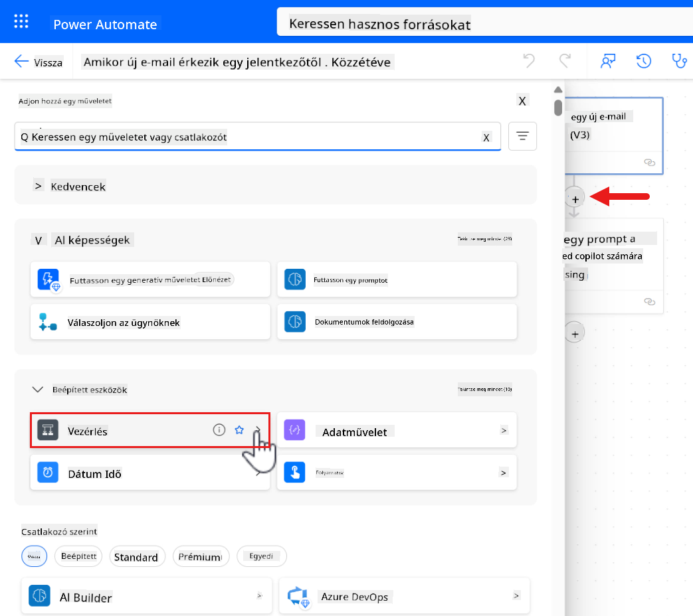

1. Válassza a **Condition** műveletet.

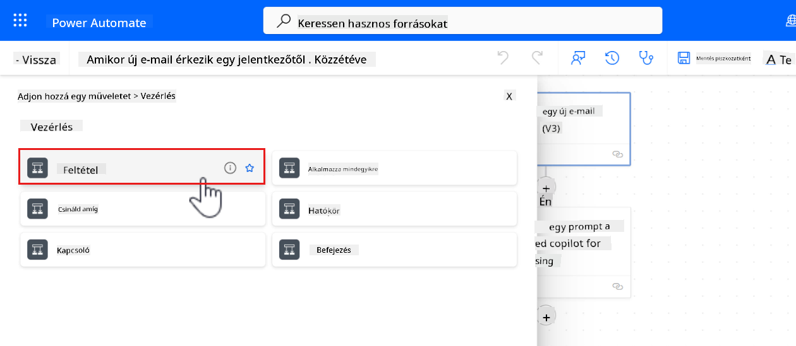

1. Most konfiguráljuk a feltételt, hogy ellenőrizze, a fájl melléklet típusa .PDF-e. A **Choose a value** mezőben válassza a **villám ikon** vagy **fx ikon** lehetőséget a jobb oldalon.

   1. A **Search** mezőbe írja be a következőt:

      ```text
      content type
      ```

   1. Ezután válassza ki az indító **Attachments Content-Type** paraméterét.

   1. Végül válassza az **Add** lehetőséget, hogy hozzáadja a dinamikus tartalom bemenetet az akció **Id** paraméteréhez.

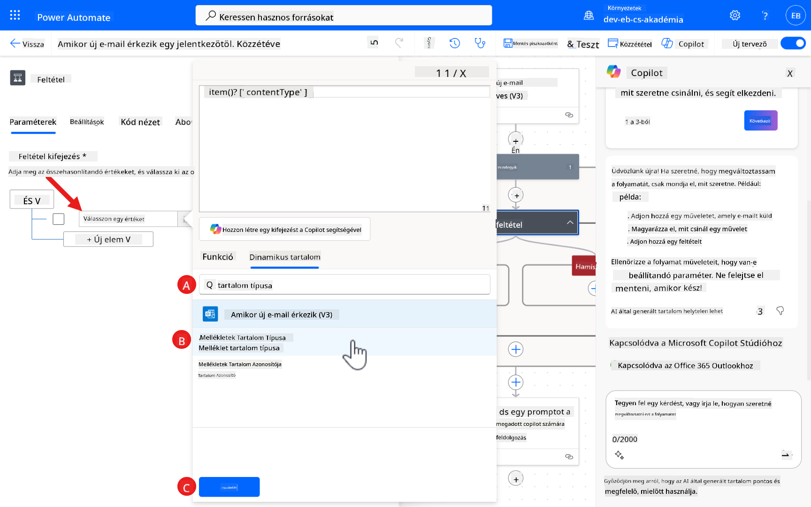

1. Álljunk meg egy pillanatra, valószínűleg észrevette, hogy a **For each** művelet automatikusan megjelent.

   Válassza ki a **For each** műveletet. Ez a művelet az e-mail minden mellékletén végigmegy, mivel az indító **Attachments Content-Type** paramétere minden melléklethez kapcsolódik.

   A háttérben ez egy tömb, ezért a **For each** művelet automatikusan hozzáadódott, amikor a **Attachments Content-Type** paramétert választottuk a **Condition** műveletben.

   További információért bontsa ki az alábbi tanulási blokkot.

??? info "További tanulás: For each művelet automatikus megjelenése"

   🤔 **Miért jelenik meg automatikusan az "Apply to each" vagy "For each"?**
   
   Amikor kiválaszt egy paramétert (dinamikus tartalmat), amely egy elemek listáját vagy tömbjét képviseli - például mellékletek, e-mailek vagy sorok listáját -, a Power Automate felismeri, hogy valószínűleg minden elemet külön-külön szeretne feldolgozni.
   
   Ennek megkönnyítése érdekében a Power Automate automatikusan hozzáad egy **“Apply to each”** (vagy **For each**) ciklust az akció köré. Ez biztosítja, hogy az akció minden elemre külön-külön fusson, ahelyett, hogy megpróbálná az egész listát egyszerre feldolgozni (ami hibákat okozhat).

   🦋 **Példa**
   
   - Ha kiválasztja a "Attachments" elemet egy korábbi műveletből (ami egy tömb), és megpróbálja használni egy olyan műveletben, amely egyetlen fájlt vár, a Power Automate az akciót egy **"Apply to each"** (vagy **For each**) ciklusba csomagolja. 
   - Így az akció minden **mellékletre** lefut - egyenként.
      
   💡 **Fontos pontok**
   
   - **Automatikus:** A ciklus automatikusan megjelenik, hogy segítsen minden elemet feldolgozni a gyűjteményben.
   - **Hibák megelőzése:** Ciklus nélkül az akció sikertelen lehet, mert nem tud több elemet egyszerre kezelni.
   - **Vizualizáció:** Ez vizuálisan mutatja, hogy a folyamat minden elemre ismételni fogja az akciót a listában.

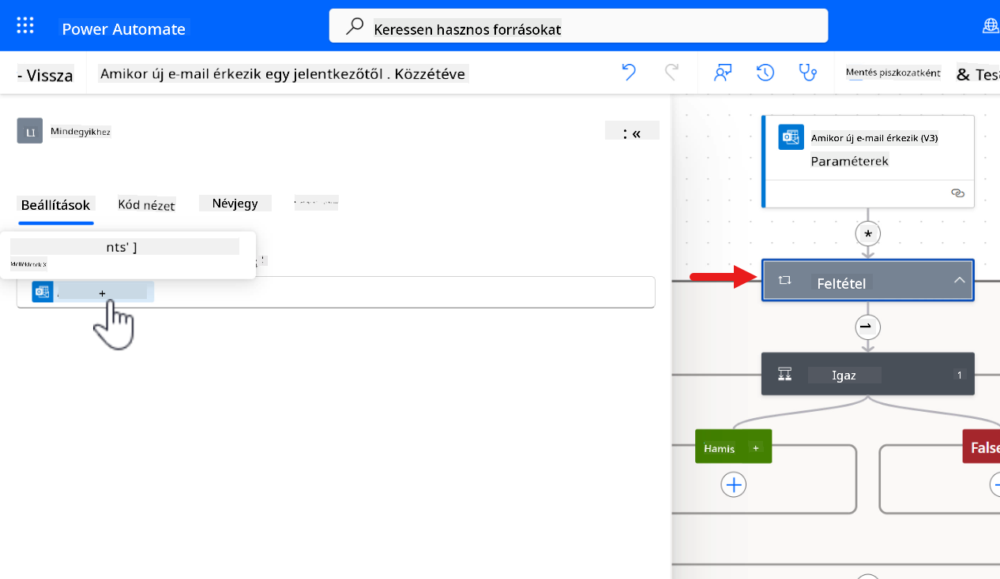

1. Ezután a másik **Choose a value** mezőbe írja be a következőt:

   ```text
   application/pdf
   ```

   Ez biztosítja, hogy minden fájl melléklet esetében ellenőrizze, hogy a fájl kiterjesztése .PDF-e.

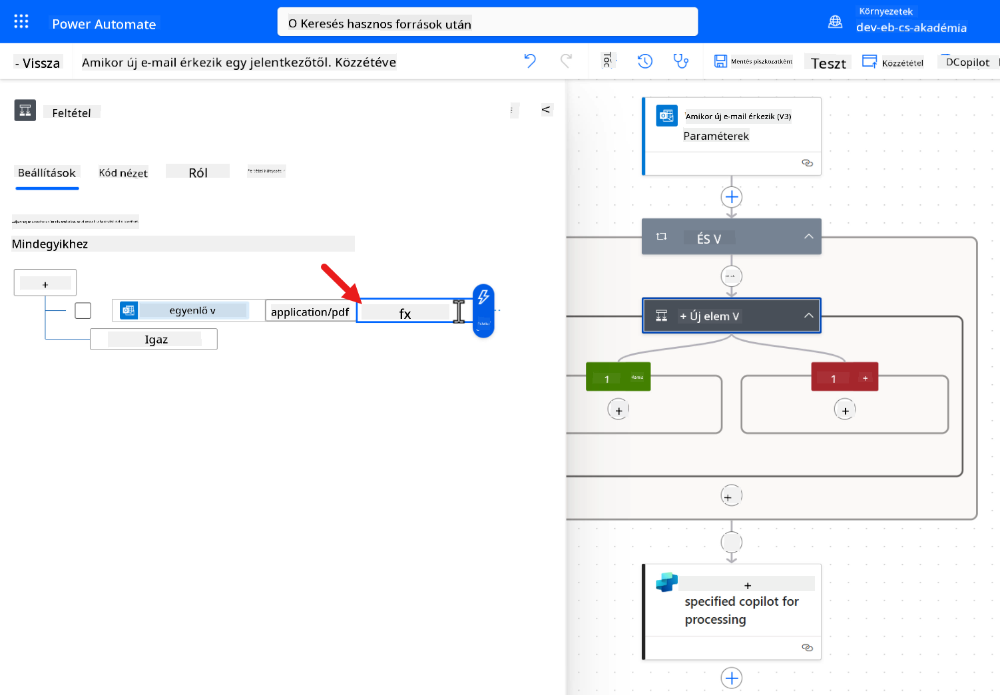

1. Most konfiguráljuk a **True** útvonalat, hogy kinyerjük a fájlt az e-mailből, és feltöltsük a **Resume** Dataverse táblába.

   Adjon hozzá egy új műveletet a **True** útvonal alá, és keressen `html to text` kifejezést. Válassza a **Html to text** műveletet.

   További információért a **Html to text** műveletről bontsa ki az alábbi tanulási blokkot.

??? info "További tanulás: Html to text művelet"

   🤔 **Mi az a "HTML to text" művelet?**
   
   A **HTML to text** művelet a Power Automate-ben HTML-formázott tartalmat alakít át egyszerű szöveggé. Ez különösen hasznos, ha olyan adatokat kap (például e-maileket, webes tartalmakat vagy API válaszokat), amelyek HTML címkéket tartalmaznak, és csak az olvasható szöveget szeretné kinyerni formázás vagy kód nélkül.

   ⚙️ **Hogyan működik?**
   
   - **Bemenet:** HTML tartalom sztringet ad meg (például egy e-mail szövegét).
   - **Kimenet:** A művelet eltávolítja az összes HTML címkét, és csak az egyszerű szöveget adja vissza.
   
   👍🏻 **Mikor érdemes használni?**
   
   - Ha olvasható szöveget szeretne kinyerni e-mailekből, weboldalakról vagy API válaszokból, amelyek HTML-t tartalmaznak.
   - Mielőtt olyan rendszereknek küldene tartalmat, amelyek nem támogatják a HTML formázást (például SMS, Teams üzenetek vagy adatbázisok).
   - Az adatok tisztításához további feldolgozás vagy elemzés előtt.

   🔭 **Hol található?**
   
   - A Power Automate-ben az Agent Flows-ban keresse meg a `HTML to text` nevű műveletet. Ez a **Data Operations** csatlakozó alatt található.
      
   💡 **Fontos pontok**
   
   - Eltávolítja az összes HTML címkét, és csak a szöveget hagyja meg.
   - Nem értelmezi vagy hajt végre szkripteket/stílusokat - csak eltávolítja a címkéket.
   - Hasznos az adatok tisztításához és az egyszerű szöveges kimenetek előkészítéséhez.

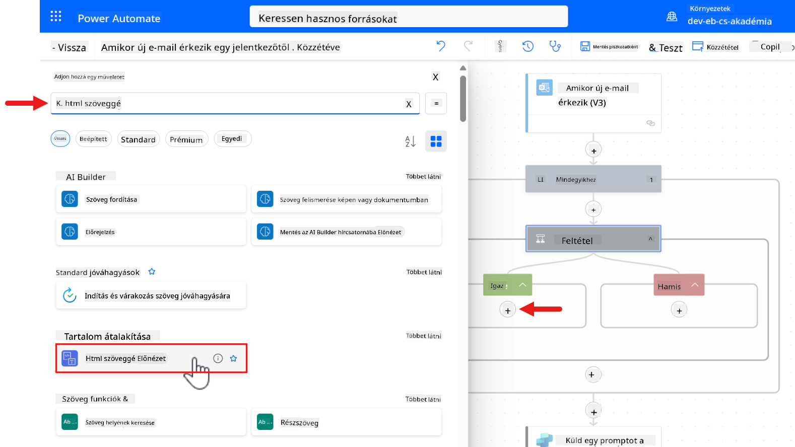

1. Ezután új kapcsolat referenciát kell létrehoznunk a **Html to text** művelethez az **Add new** kiválasztásával.

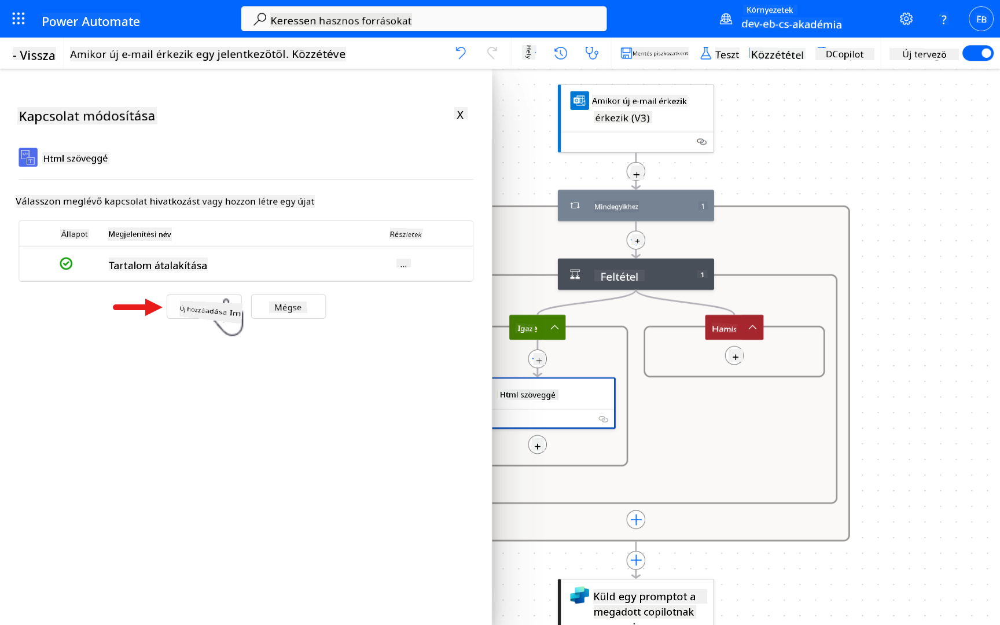

1. Most konfigurálhatjuk a műveletet. Adjuk hozzá az indító **Body** paraméterét. A **Content** mezőben válassza a **villám ikon** vagy **fx ikon** lehetőséget a jobb oldalon.


1. A **Dynamic content** fülön keressen `body` kifejezést, és válassza az indító **Body** paraméterét, majd válassza az **Add** lehetőséget.


1. Befejeztük ennek a műveletnek a konfigurálását, ezért lépjünk ki a műveletből a balra mutató két szögletes zárójel («) kiválasztásával, hogy összehúzzuk a panelt.

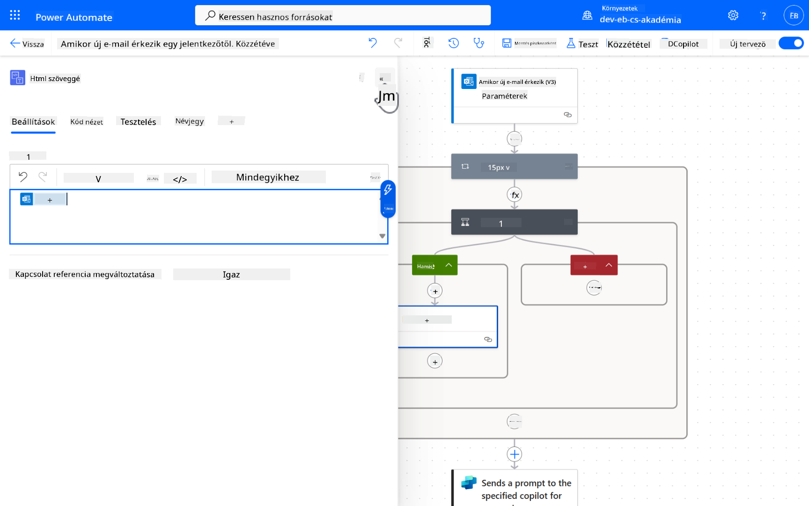

1. Adjon hozzá egy új műveletet a **Html to text** művelet alá az **+ ikon** kiválasztásával, amely betölti az akciók hozzáadására szolgáló panelt. Válassza a **Microsoft Dataverse** csatlakozót.

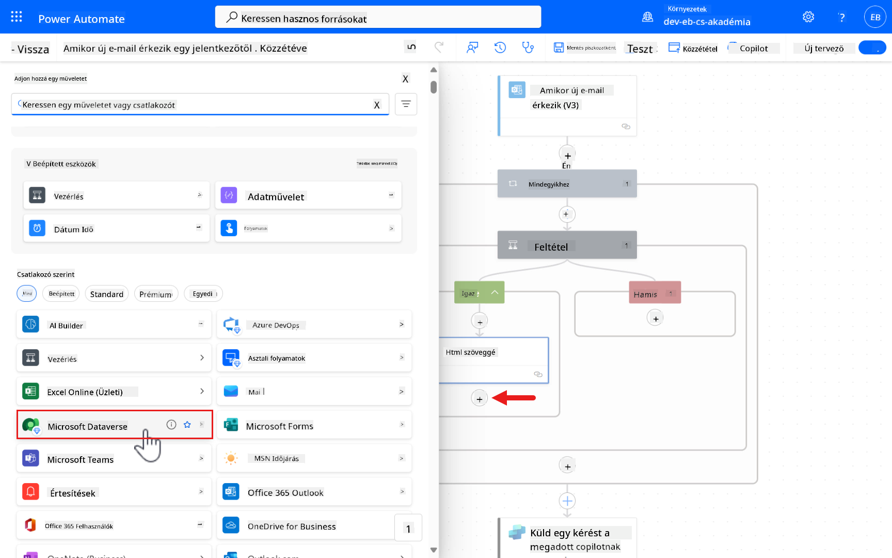

1. Válassza az **Add a new row** műveletet.

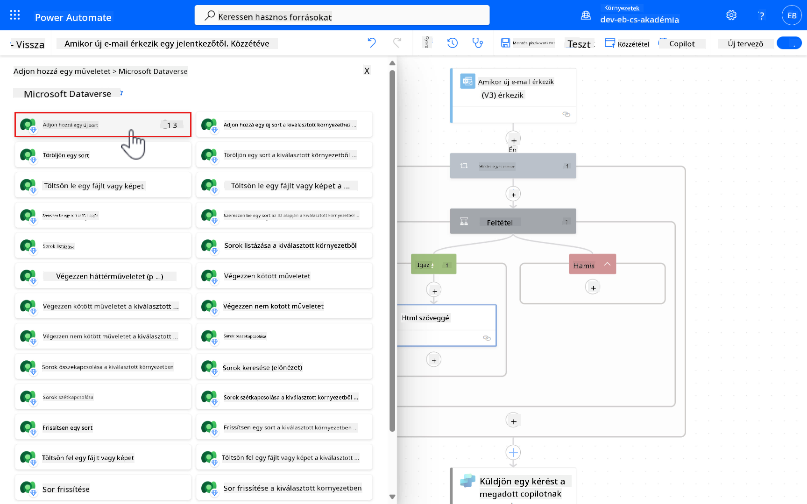

1. Nevezze át a műveletet az **Ellipsis (...)** kiválasztásával, másolja és illessze be a következőt névként:

```text
Add a new Resume row
```

A **Table name** paraméterhez keressen `res` kifejezést, és válassza a **Resumes** táblát.

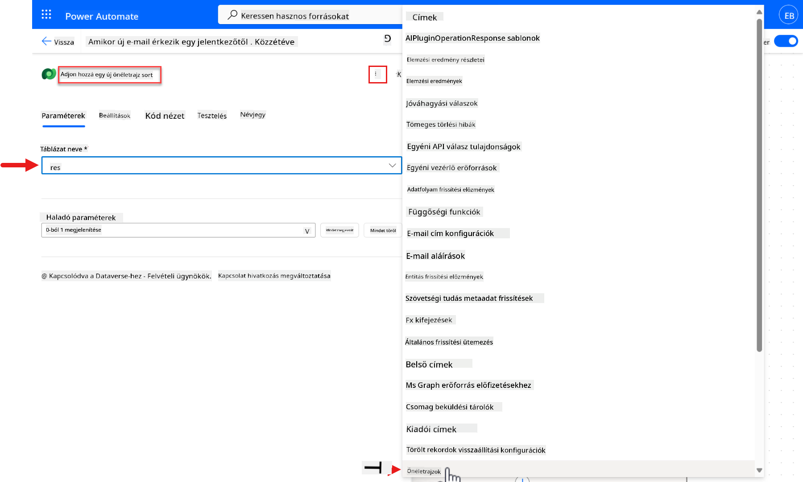

1. Válassza a **Resume Title** mezőt, majd válassza a **villám ikon** vagy **fx ikon** lehetőséget a jobb oldalon.

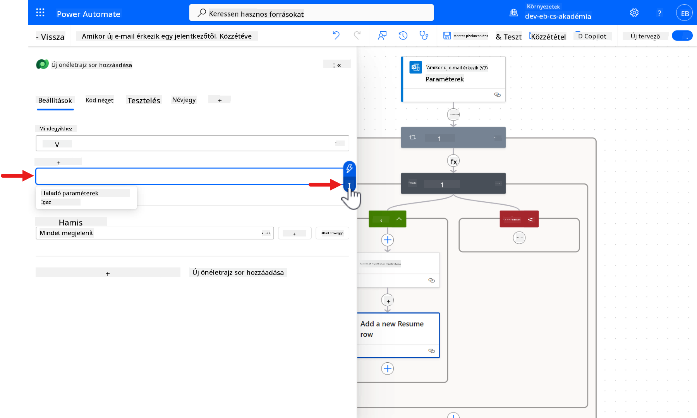

1. A **Function tab** fülön írja be a következő kifejezést, amely az `item()` függvényt használja:

```text
item()?['name']
```

További információért az `item()` függvényről bontsa ki az alábbi tanulási blokkot.

??? info "További tanulás: `item()` függvény"

   🤔 **Mi az az `item()` függvény?**
   
   - Amikor az **Apply to each** műveletet használja, a Power Automate végigmegy a gyűjtemény (tömb) minden elemén.
   - Leggyakrabban olyan műveletekben használják, mint az **Apply to each** (vagy **For each**), **Select**, vagy **Filter array**.

   ⚙️ **Hogyan működik?**
   
   - Az `item()` egy olyan függvény, amely visszaadja az aktuálisan feldolgozott elemet egy ciklusban vagy tömb műveletben.
   - A cikluson belül az `item()` az éppen feldolgozott _aktuális elemre_ utal.
   
   📌 **Hol használható?**
   
   - **Apply to each:** az aktuális elem tulajdonságainak eléréséhez.
   - **Select:** az elemek átalakításához egy tömbben.
   - **Filter array:** az aktuálisan értékelt elem hivatkozásához.

   🦋 **Példa**
   
   - Kifejezés egy ciklusban:
          -  `item()?['Email']`
   - Ez az aktuális elem `Email` tulajdonságát adja vissza.
      
   💡 **Fontos pontok**
   
   - Az `item()` _kontekstszenzitív_: mindig az aktuális elemre utal a ciklusban vagy tömb műveletben, amelyben van.
   - Ha egymásba ágyazott ciklusokat használ, az `items('LoopName')` segítségével hivatkozhat egy adott ciklus elemeire.

Válassza az **Add** lehetőséget, hogy hozzáadja a kifejezést a **Resume Title** paraméterhez.

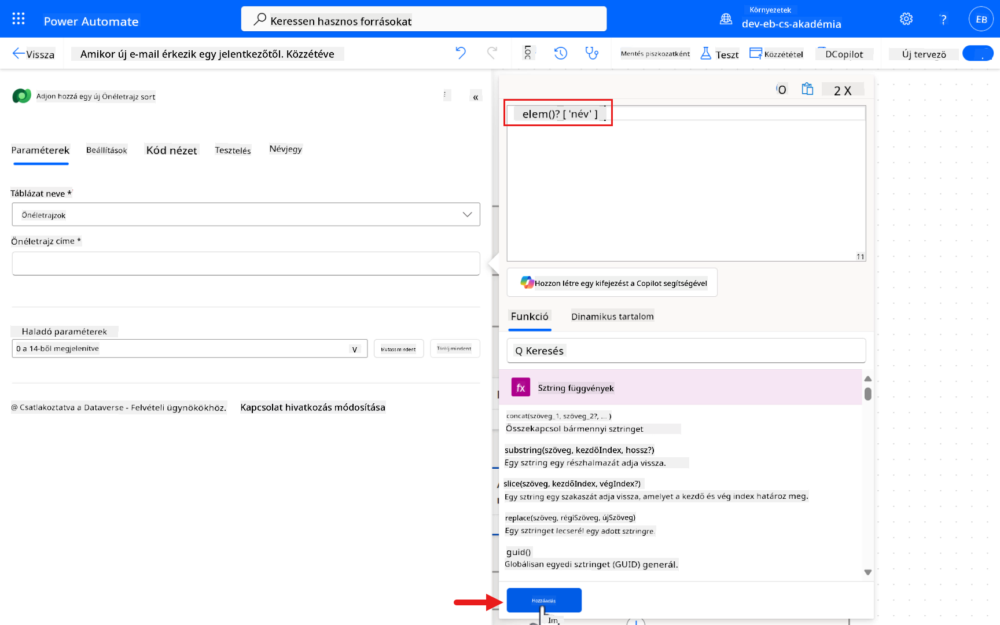

1. Még több paramétert kell konfigurálnunk, válassza a **Show all** lehetőséget, majd a **Cover Letter** mezőben válassza a **villám ikon** vagy **fx ikon** lehetőséget a jobb oldalon.

   A **Function tab** fülön írja be a következő kifejezést, amely ugyanazt a kifejezést használja, mint az előző [küldetésben](../02-multi-agent/README.md):

```text
if(greater(length(body('Html_to_text')), 2000), substring(body('Html_to_text'), 0, 2000), body('Html_to_text'))
```

Ez a kifejezés ellenőrzi, hogy a **Html to text** műveletből származó _szöveg_ hosszabb-e 2000 karakternél, és ha igen, csak az első 2000 karaktert adja vissza; ellenkező esetben a teljes szöveget adja vissza.

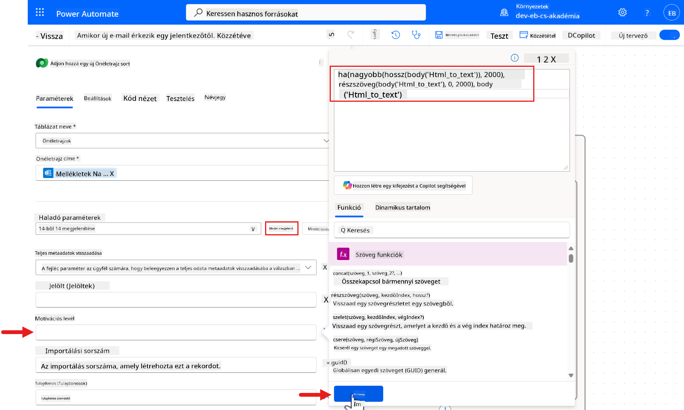

1. A kifejezés most hozzáadódik a **Cover Letter** mezőhöz.

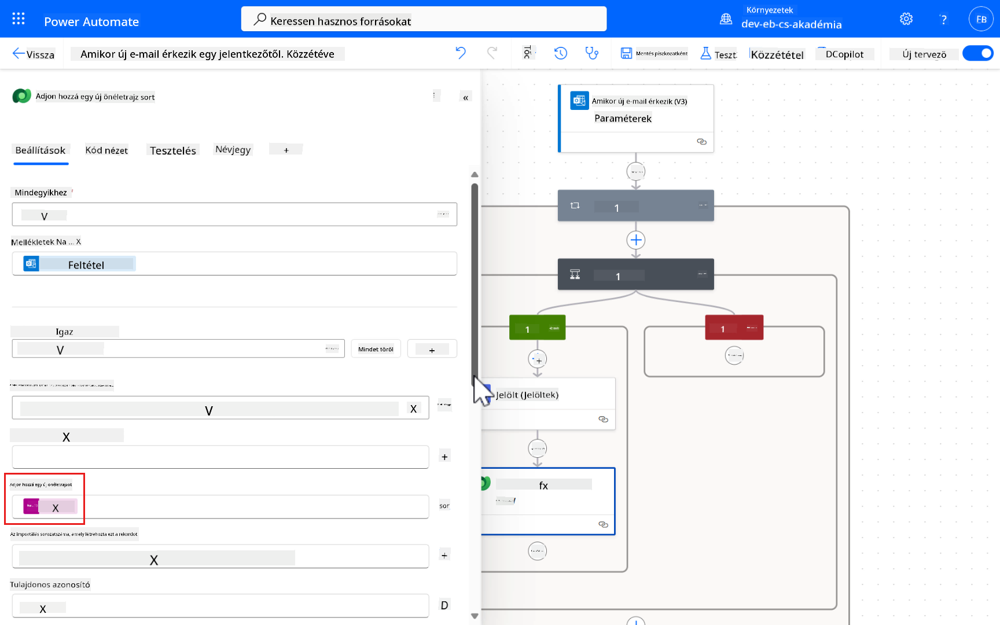

1. A **Source Email Address** mezőhöz keressen `from` kifejezést, és válassza az indító **From** paraméterét, mivel ez tartalmazza az e-mail cím értékét.

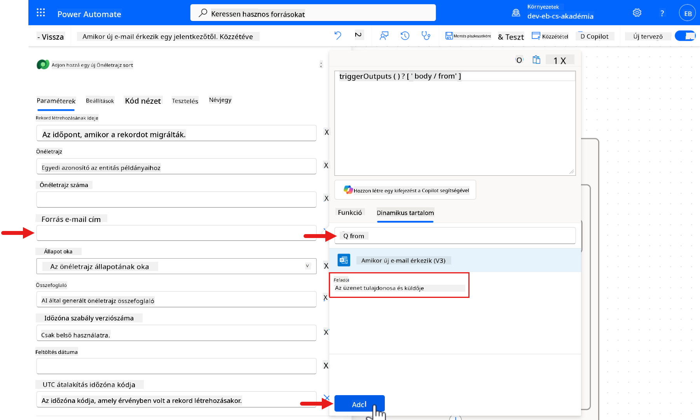

1. Az **Upload Date** mezőhöz válassza a **villám ikon** vagy **fx ikon** lehetőséget a jobb oldalon. A **Function tab** fülön írja be a következő kifejezést, amely az `utcNow()` függvényt használja:

```text
utcNow()
```

További információért az `utcNow` függvényről bontsa ki az alábbi tanulási blokkot.

??? info "További tanulás: `utcNow` függvény"

   🤔 **Mi az az `utcNow()` függvény?**
   
   - Az utcnow() függvény a Power Automate-ben visszaadja az aktuális dátumot és időt az Egyezményes Világidő (UTC) szerint ISO 8601 formátumban, például: `2025-09-23T04:32:14Z`
   
   🦋 **Példa**
   
   - Kifejezés:
          -  `concat('Jelentés generálva ekkor: ', utcnow())`
   - Kimenet:
          - Jelentés generálva ekkor: `2025-09-23T04:32:14Z`
      
   💡 **Fontos pontok**

- **Nincs szükség argumentumokra (bemeneti paraméterekre):** mindig az aktuális UTC időbélyeget adja vissza.
   - **Felhasználási esetek**
       - Időbélyegek hozzáadása naplókhoz vagy fájlnevekhez
       - Az aktuális idő összehasonlítása más dátumokkal
       - Ütemezés vagy időalapú feltételek

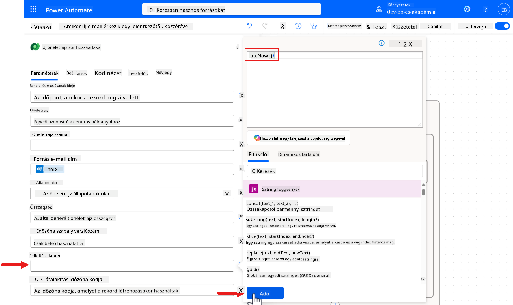

1. Most befejeztük az **Új önéletrajz sor hozzáadása** művelet konfigurálását, így kiléphetünk a panelből annak összecsukásával.

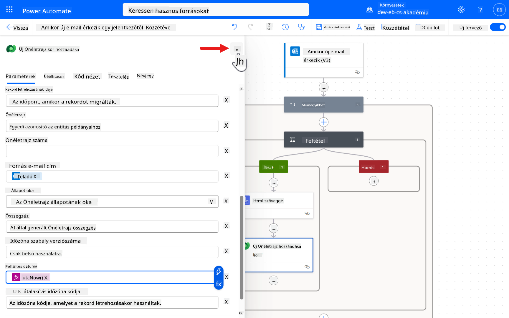

1. Új műveletet fogunk hozzáadni az **+ ikon** kiválasztásával az **Új önéletrajz sor hozzáadása** művelet alatt, amely betölti a műveletek hozzáadására szolgáló panelt. Válassza újra a **Microsoft Dataverse** csatlakozót.

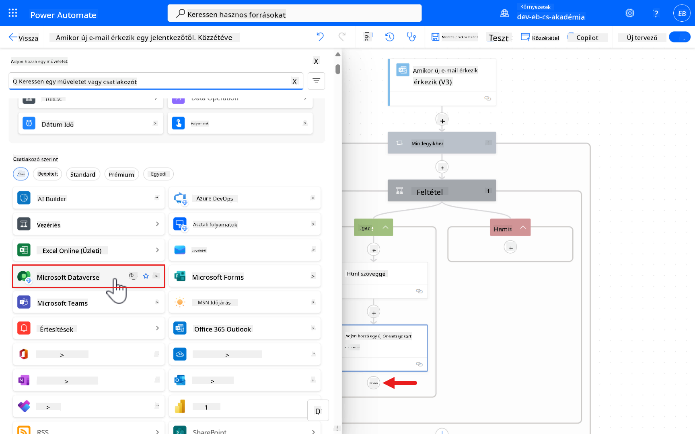

1. Válassza ki a **Fájl vagy kép feltöltése** műveletet.

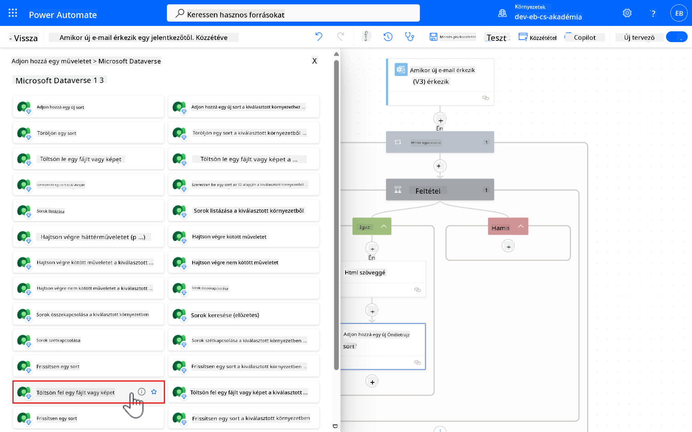

1. Nevezze át a műveletet az **Ellipszis (...)** kiválasztásával, másolja és illessze be az alábbi nevet:

```text
Önéletrajz fájl feltöltése
```

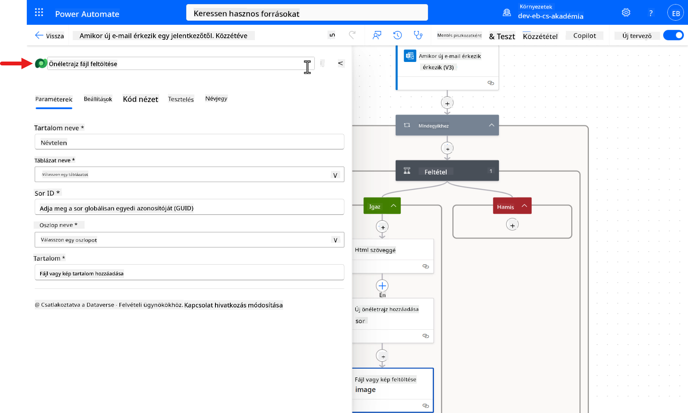

1. Ezután válassza ki a **Tartalom neve** mezőt, és válassza ki a jobb oldalon található **villám ikon** vagy **fx ikon** lehetőséget.

A **Funkciók fülön** írja be az alábbi kifejezést, amely az `item ()` függvényt használja. Ez az aktuális elem (a csatolt fájl) `name` tulajdonságát kapja meg.

```text
item()?['name']
```

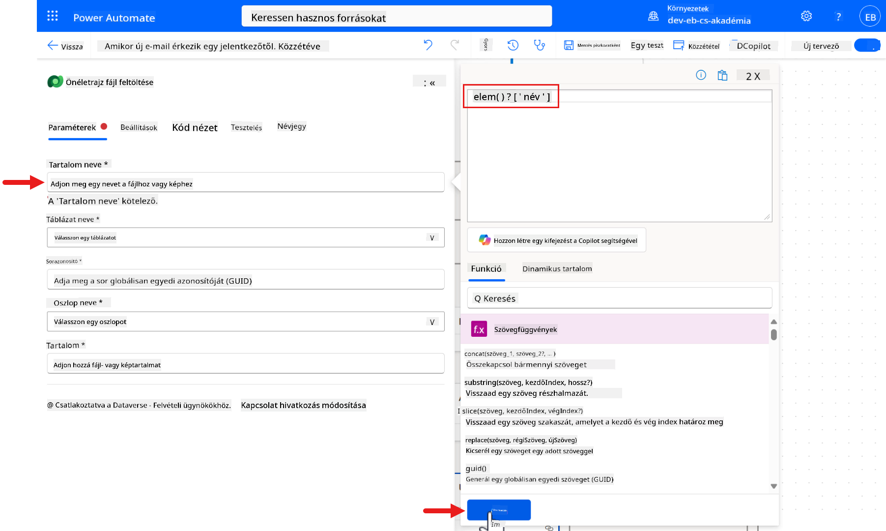

1. A **Táblanév** paraméterhez keressen rá a `res` szóra, és válassza ki a **Önéletrajzok** táblát.

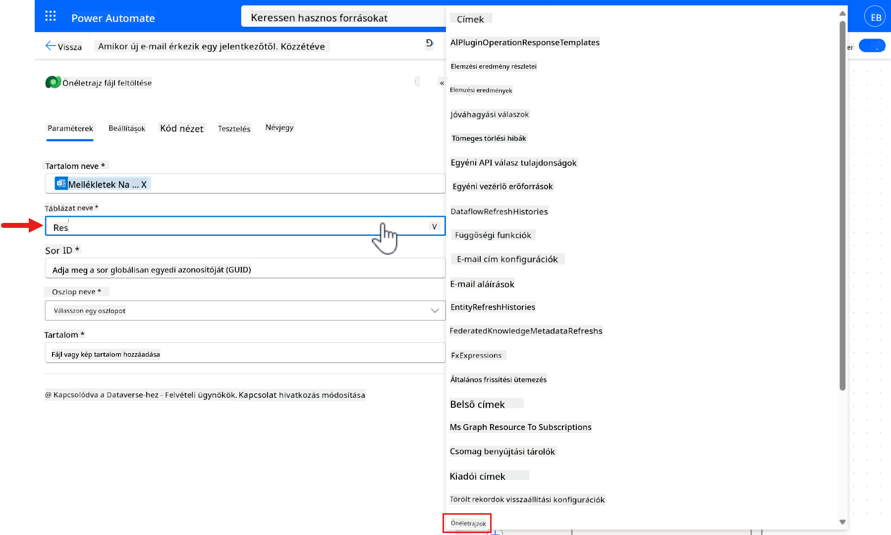

1. Ezután válassza ki a **Sorazonosító** mezőt, és válassza ki a jobb oldalon található **villám ikon** vagy **fx ikon** lehetőséget.

Keressen rá az `ID` szóra, és válassza ki az **Önéletrajz** paramétert az _Új sor hozzáadása_ Dataverse műveletből, mivel ez tartalmazza a PDF fájl feltöltéséhez szükséges sor azonosítóját.

Válassza a **Hozzáadás** lehetőséget.

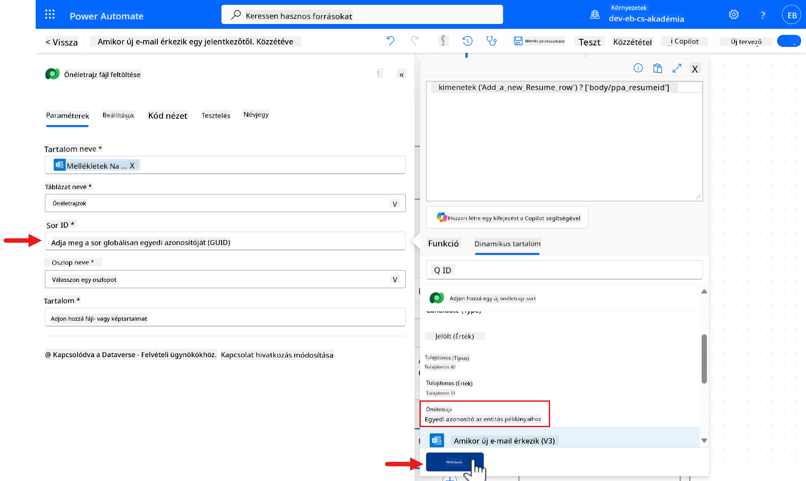

1. Válassza ki az **Oszlopnév** mezőt, és válassza ki a **Önéletrajz PDF** opciót.

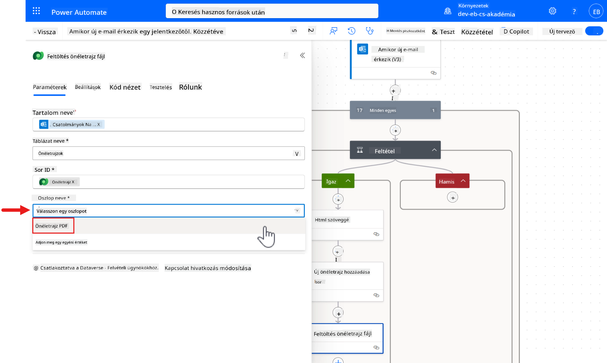

1. Válassza ki a **Tartalom** mezőt, és válassza ki a jobb oldalon található **villám ikon** vagy **fx ikon** lehetőséget.

A **Funkciók fülön** írja be az alábbi kifejezést, amely az `item ()` függvényt használja. Ez az aktuális elem (a csatolt fájl) `contentBytes` tulajdonságát kapja meg. A `contentBytes` egy fájl vagy csatolmány nyers bináris adatait jelenti, Base64 karakterláncként kódolva.

```text
item()?['contentBytes']
```

1. Befejeztük ennek a műveletnek a konfigurálását, így kiléphetünk a műveletből a balra mutató két szögletes zárójel («) kiválasztásával, hogy összecsukjuk a panelt.


1. Ezután válassza ki a **Feldolgozásra küld egy kérést a megadott copilotnak**, majd húzza és ejtse ezt a műveletet az **Önéletrajz fájl feltöltése** művelet alá a feltétel _Igaz_ útvonalán.

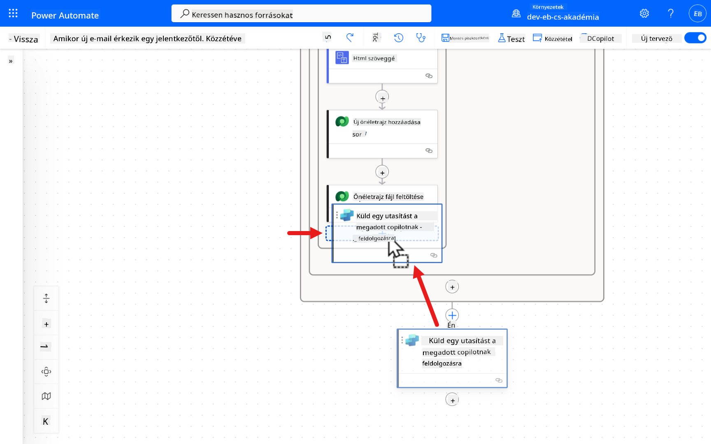

1. Válassza ki a **Feldolgozásra küld egy kérést a megadott copilotnak** műveletet a konfiguráláshoz.

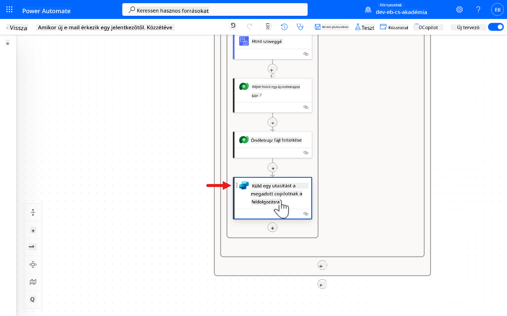

1. A **Törzs/üzenet** mezőben válassza ki az összes mezőtartalmat, és törölje.

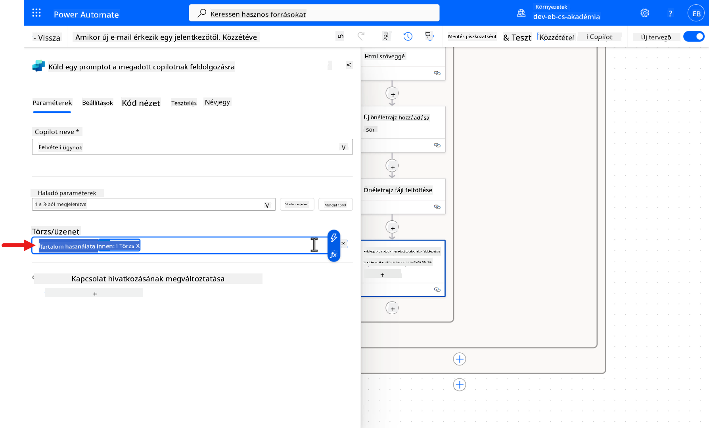

1. Másolja és illessze be az alábbi szöveget a **Törzs/üzenet** mezőbe, és emelje ki a `ÖNÉLETRAJZ AZONOSÍTÓ HELYŐR` szöveget.

```text
Küldje el [ÖnéletrajzAzonosító (szöveg)] = "ÖNÉLETRAJZ AZONOSÍTÓ HELYŐR" és [ÖnéletrajzCím (szöveg_1)] = "ÖNÉLETRAJZ CÍM HELYŐR" és [ÖnéletrajzSzám (szöveg_2)] = "ÖNÉLETRAJZ SZÁM HELYŐR" a "Notify Teams Applicant channel" eszköznek a "Application Intake Agent" gyermekügynökben
```

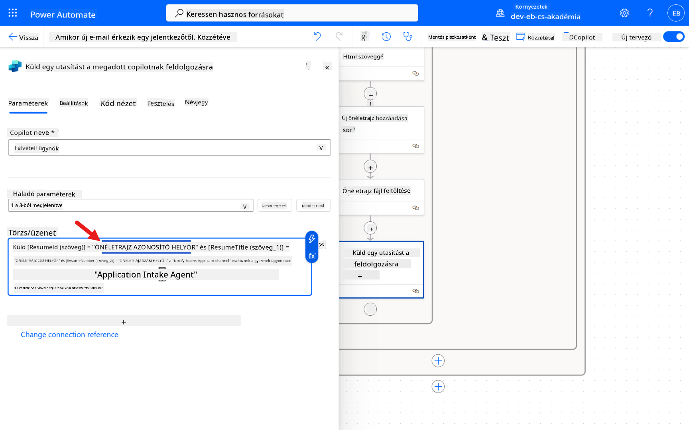

1. Válassza ki a jobb oldalon található **villám ikon** vagy **fx ikon** lehetőséget.

Keressen rá az `önéletrajz` szóra, és válassza ki az **Önéletrajz** paramétert az _Új sor hozzáadása Dataverse_ műveletből, mivel ez tartalmazza az **Önéletrajz** sor létrehozott azonosítóját.

Válassza a **Hozzáadás** lehetőséget.

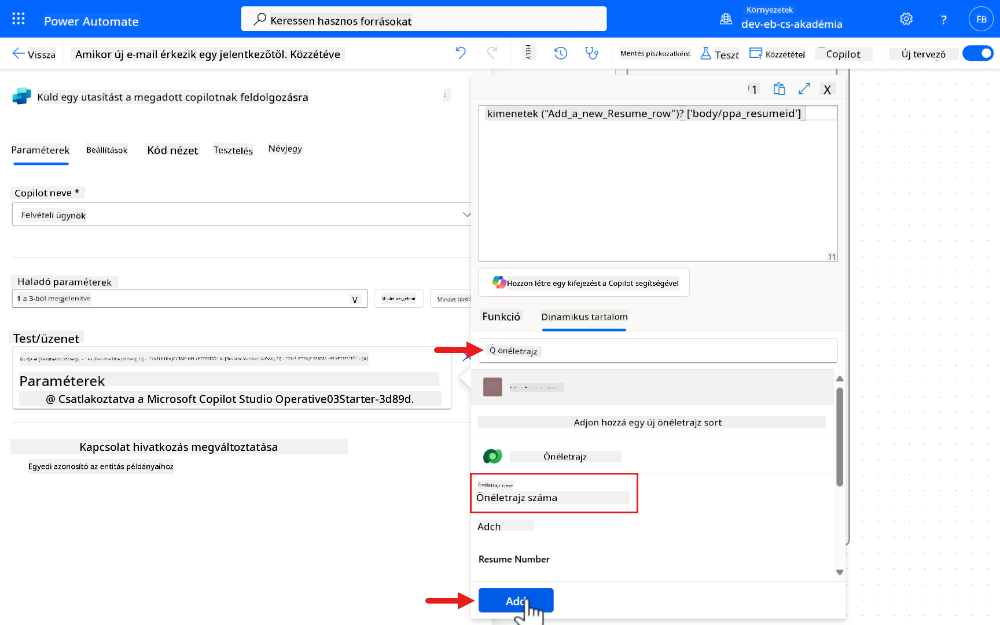

1. Emelje ki az `ÖNÉLETRAJZ CÍM HELYŐR` szöveget. Válassza ki a jobb oldalon található **villám ikon** vagy **fx ikon** lehetőséget.

Keressen rá a `cím` szóra, és válassza ki az **Önéletrajz cím** paramétert az _Új sor hozzáadása Dataverse_ műveletből, mivel ez tartalmazza az **Önéletrajz cím** értékét a létrehozott Önéletrajz sorból.

Válassza a **Hozzáadás** lehetőséget.

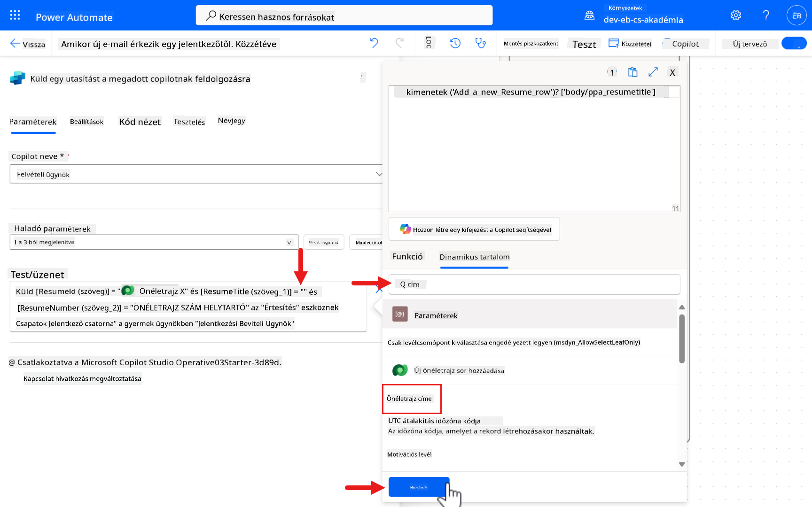

1. Emelje ki az `ÖNÉLETRAJZ SZÁM HELYŐR` szöveget. Válassza ki a jobb oldalon található **villám ikon** vagy **fx ikon** lehetőséget.

Keressen rá az `önéletrajz szám` szóra, és válassza ki az **Önéletrajz szám** paramétert az _Új sor hozzáadása Dataverse_ műveletből, mivel ez tartalmazza az **Önéletrajz szám** értékét a létrehozott Önéletrajz sorból.

Válassza a **Hozzáadás** lehetőséget.

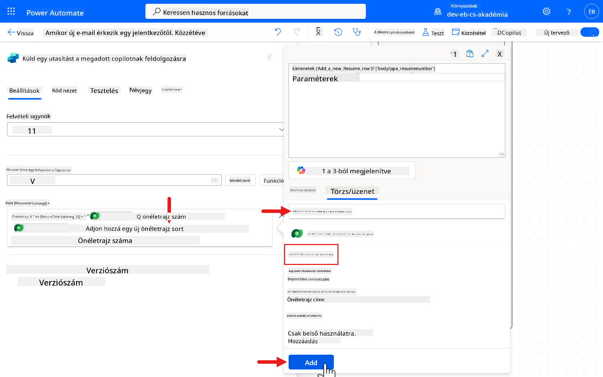

1. Befejeztük ennek a műveletnek és az ügynök folyamatának a konfigurálását 🙌🏻 Nagyszerűen haladsz! Most mentsük el az eseményindító folyamatot a **Vázlat mentése** kiválasztásával.

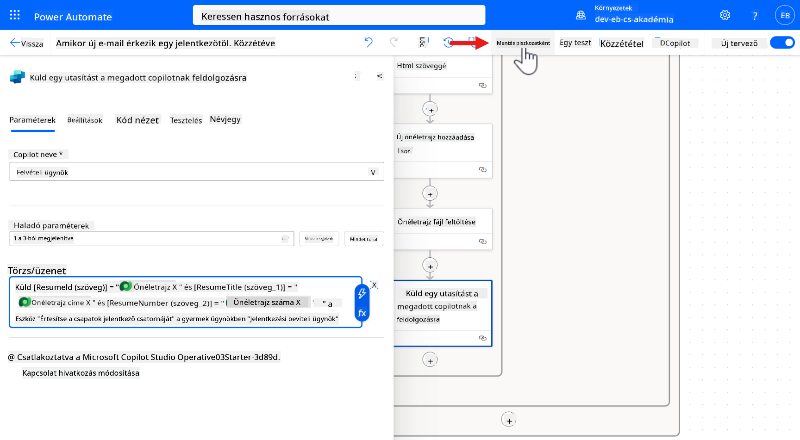

1. Most szerkesztenünk kell az ügynök folyamatának részleteit, válassza a **Vissza** lehetőséget.

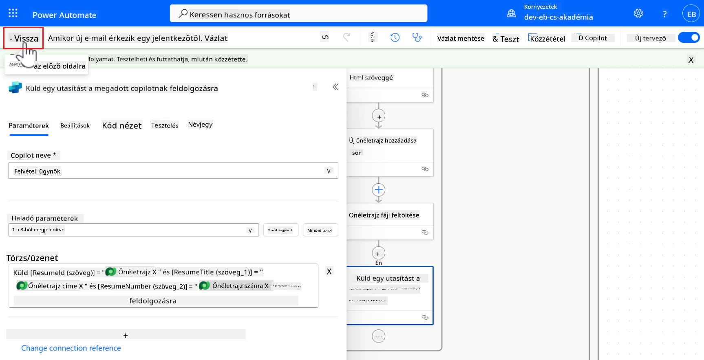

1. Válassza a **Szerkesztés** lehetőséget a **Részletek** szakaszban, és frissítse a **Tervet** a **Copilot Studio** opcióra.

Válassza a **Mentés** lehetőséget.

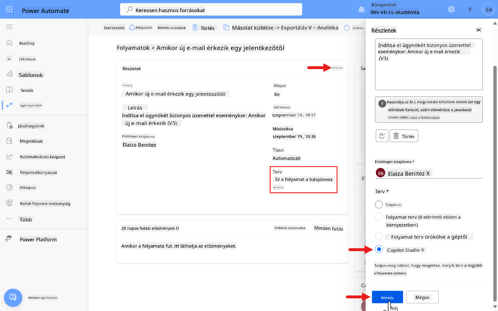

1. Egy modális ablak jelenik meg, amelyben megerősítést kérnek a Copilot Studio tervre való váltáshoz. Válassza a **Megerősítés** lehetőséget.

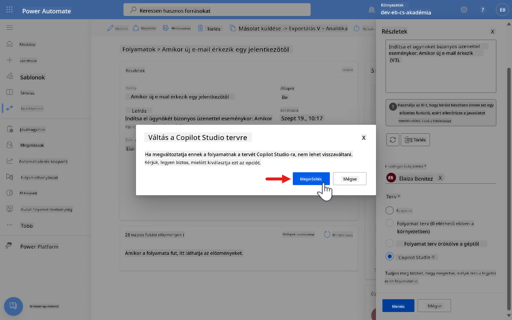

1. A terv most frissült **Copilot Studio**-ra. Válassza a **Szerkesztés** lehetőséget, mivel közzé kell tennünk az eseményindító folyamatot az ügynökünk számára.

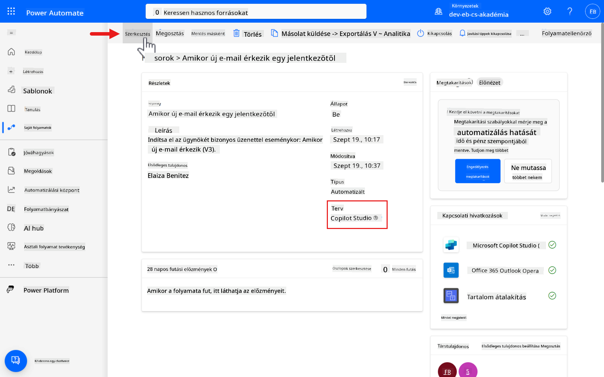

1. Válassza a **Közzététel** lehetőséget.

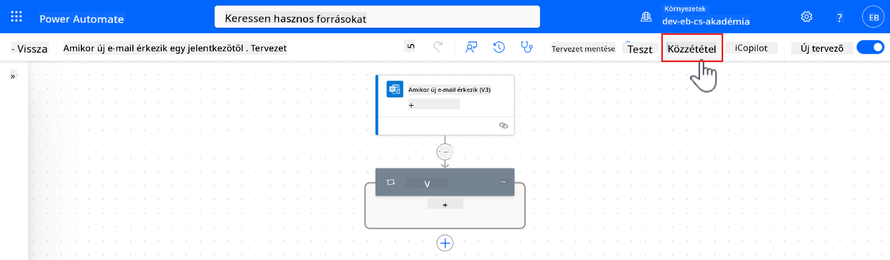

Hurrá! Az eseményindító folyamat most közzé van téve 😃

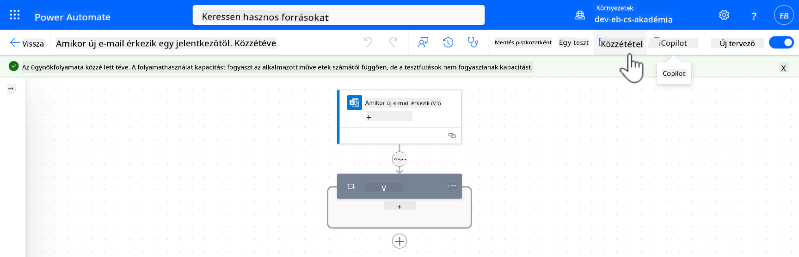

Folytassuk egy új ügynök folyamat létrehozásával, amelyet a **Application Intake Agent** gyermekügynök fog meghívni.

### 3.2. labor - Értesítés küldése egy Teams csatornára adaptív kártya segítségével

Most egy új ügynök folyamatot fogunk létrehozni a **Application Intake Agent** gyermekügynök számára, amely az eseményindító által átadott értékeket használja, hogy egy adaptív kártyát küldjön egy Teams csatornára. Ez az adaptív kártya értesíti a HR toborzási csapatot az automatikusan feltöltött PDF-ről, hogy át tudják nézni.

Kezdjük!

1. A **Felvételi ügynök** alkalmazásban válassza az **Ügynökök** fület, majd válassza ki az **Application Intake Agent** ügynököt.

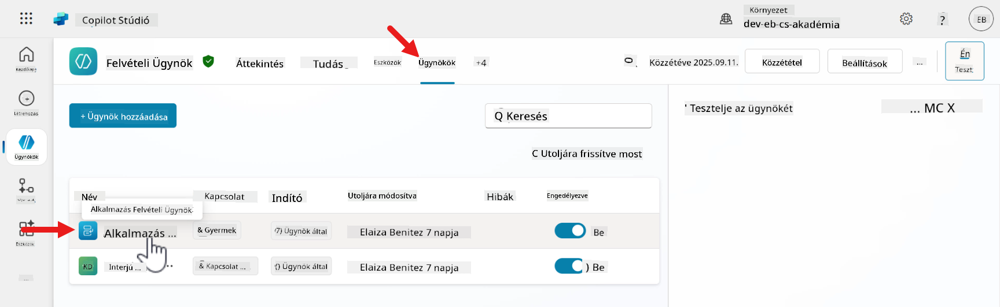

1. Görgessen le a **Eszközök** szakaszhoz, és válassza a **+ Hozzáadás** lehetőséget.

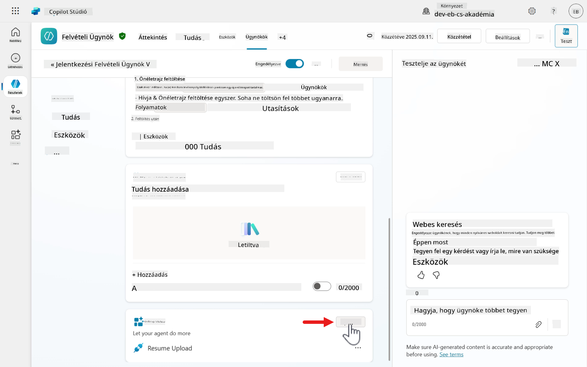

1. Megjelenik az **Eszköz hozzáadása** modális ablak. Válassza a **+ Új eszköz** lehetőséget.

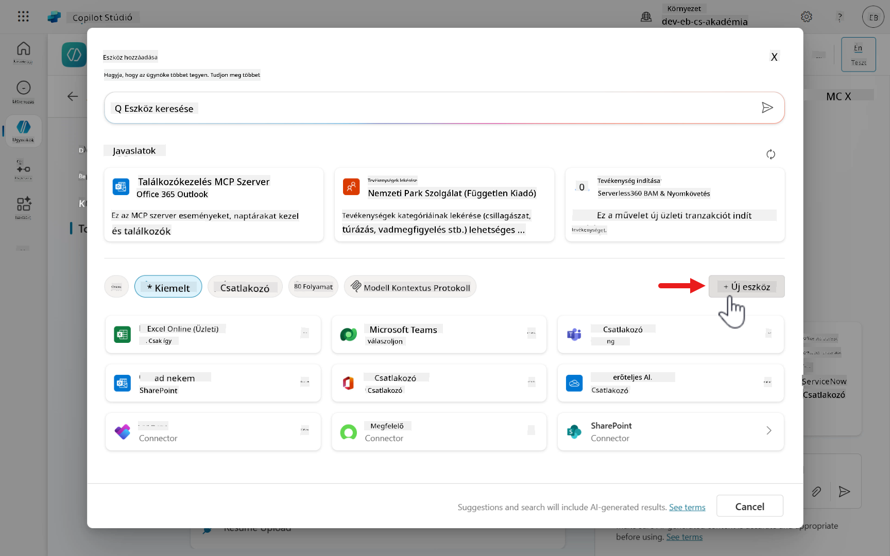

1. Válassza az **Ügynök folyamat** lehetőséget.

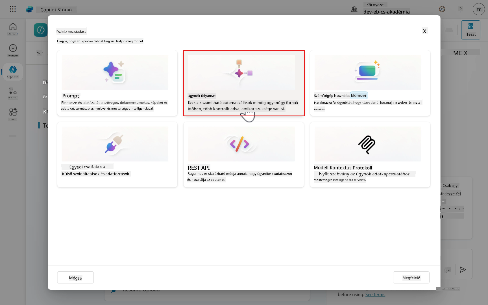

1. Ezután betöltődik az **ügynök folyamat tervezője**. Az **Amikor egy ügynök hívja a folyamatot** triggerben válassza a **+ Bemenet hozzáadása** lehetőséget.

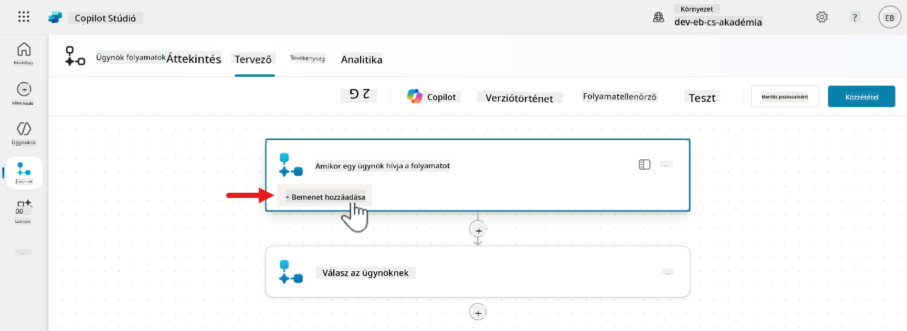

1. Válassza a **Szöveg** lehetőséget a felhasználói bemenet típusaként.

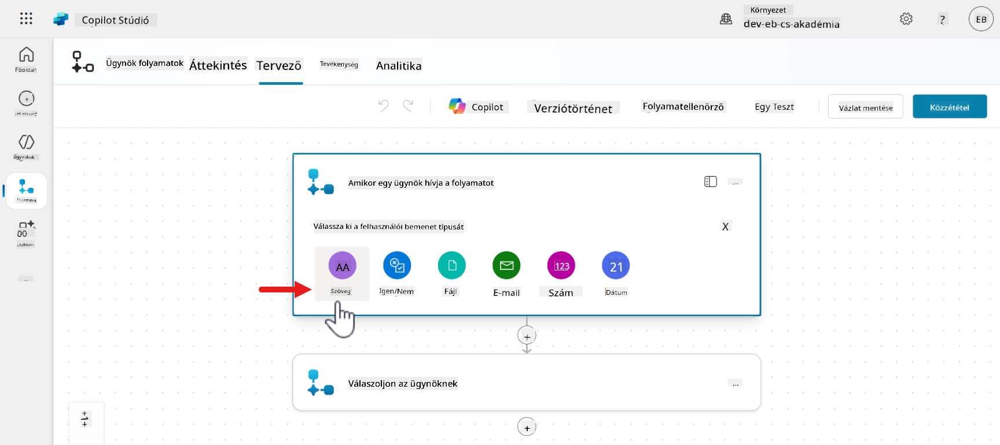

1. A bemeneti szövegmezőbe másolja és illessze be az alábbiakat a bemeneti paraméter nevéhez:

```text
ÖnéletrajzAzonosító
```

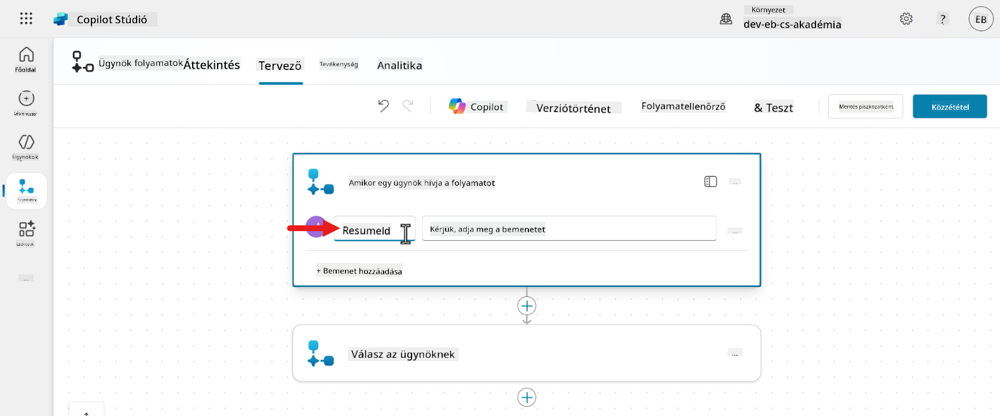

1. Ismételje meg ugyanazokat a lépéseket egy második szöveges bemenet hozzáadásához. Másolja és illessze be az alábbiakat a bemeneti paraméter nevéhez:

```text
ÖnéletrajzCím
```

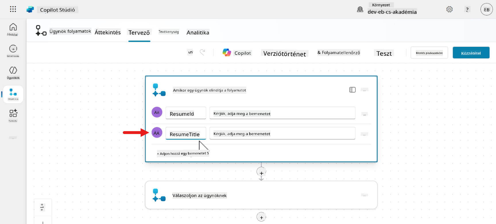

1. Ismételje meg ugyanazokat a lépéseket egy harmadik szöveges bemenet hozzáadásához. Másolja és illessze be az alábbiakat a bemeneti paraméter nevéhez:

```text
ÖnéletrajzSzám
```
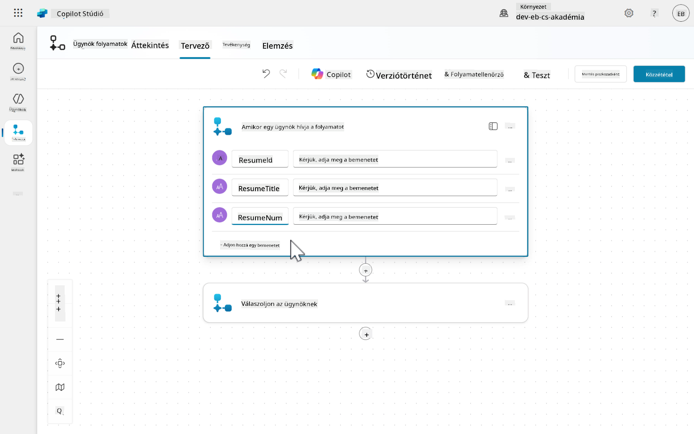

1. Emlékszik, hogyan adtunk hozzá egy adaptív kártyát a [Toborzás](../../recruit/08-add-adaptive-card/README.md#81-create-a-new-topic-with-an-adaptive-card-for-user-to-submit-their-request) során egy témán belül az ügynökünk számára? Ezúttal egy adaptív kártyát fogunk hozzáadni egy ügynök folyamatban. Most hozzáadunk egy másik műveletet az ügynök folyamatunkhoz, amely egy adaptív kártyát küld egy Teams csatornára.

Válassza a **+ ikon** lehetőséget a trigger alatt.

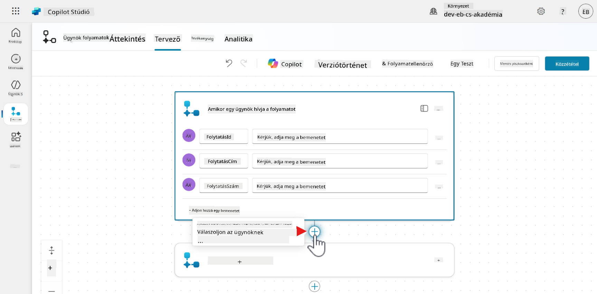

1. Válassza a **Kártya közzététele csevegésben vagy csatornában** műveletet.


1. Microsoft Teams kapcsolat referencia létrehozása szükséges a bejelentkezett felhasználói fiókjával. Válassza a **Bejelentkezés** lehetőséget.

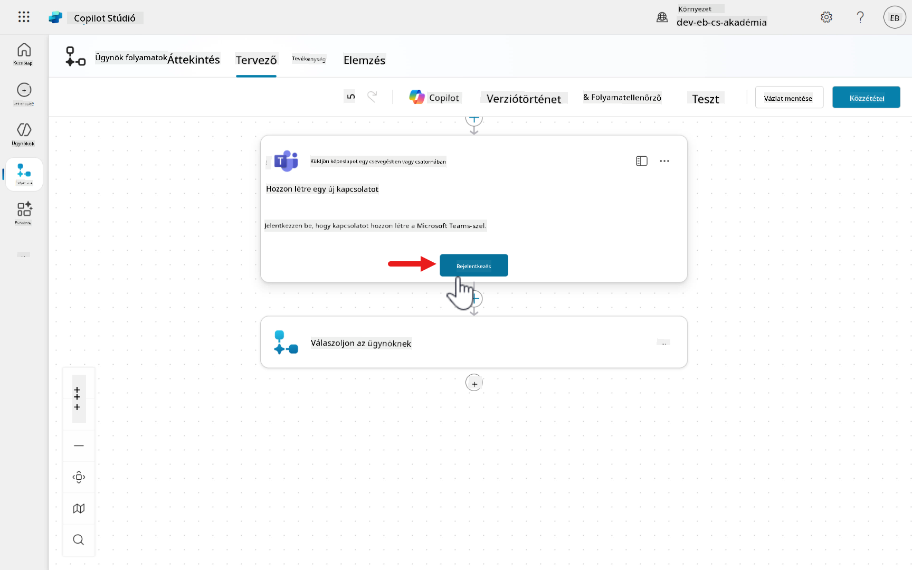

1. Válassza ki a felhasználói fiókját, majd válassza az **Hozzáférés engedélyezése** lehetőséget.

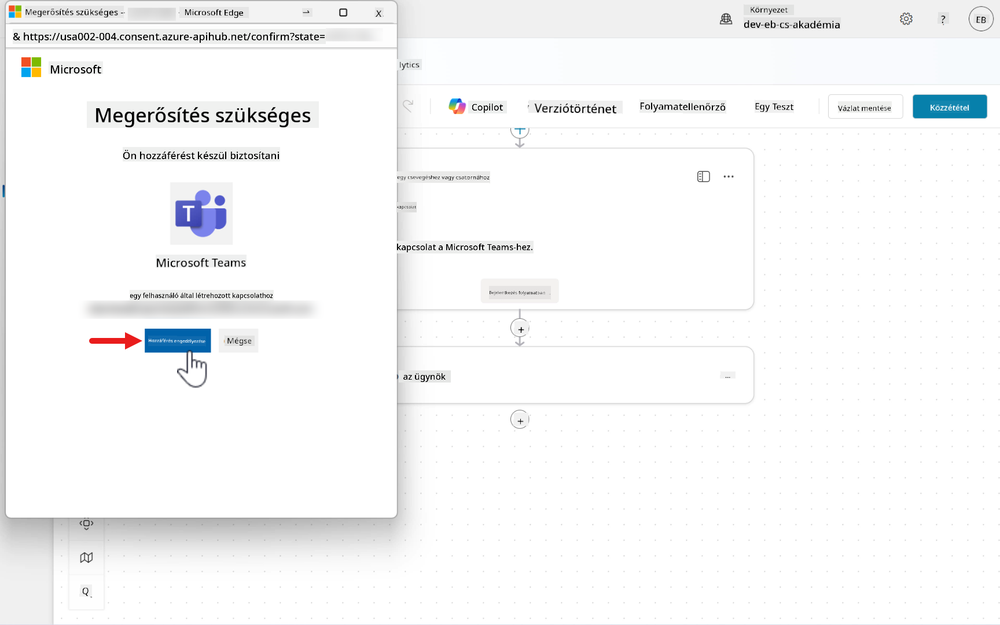

1. Az alábbi bemeneti paraméterekhez:

| Paraméter | Beállítás módja | Részletek |
|----------|------------|---------|
| **Közzététel mint** | Legördülő | Válassza a `Flow bot` opciót |
| **Közzététel helye** | Legördülő | Válassza a `Csatorna` opciót |
| **Csapat** | Legördülő | Válasszon egy csapatot, amely elérhető a környezetében, és amelyhez hozzáférése van a labor gyakorlat elvégzéséhez |
| **Csatorna** | Legördülő | Válasszon egy csatornát, amely elérhető a környezetében, és amelyhez hozzáférése van a labor gyakorlat elvégzéséhez |

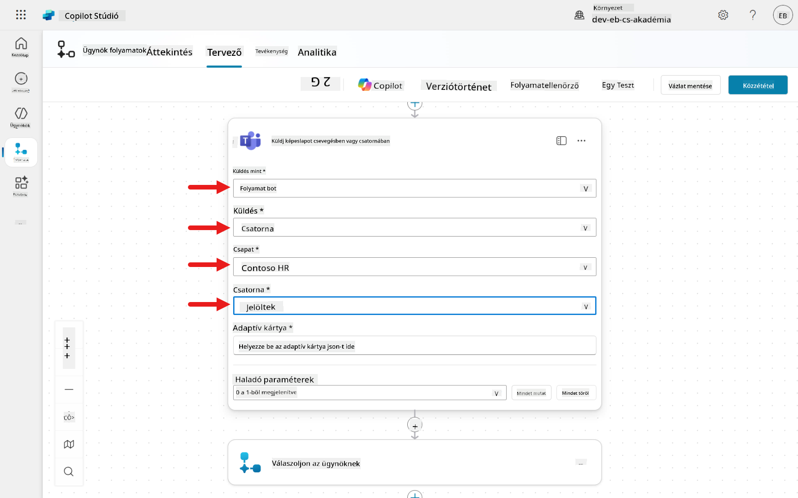

1. Ezután konfiguráljuk az **Adaptív kártya** mezőt. Válassza az **Adaptív kártya** mezőt.

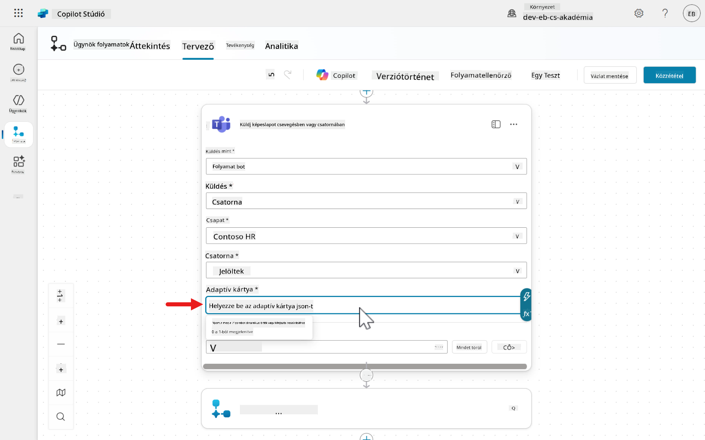

1. Nyissa meg a [Önéletrajz Táblázat Frissített JSON fájlt](../../../../../docs/operative-preview/03-automate-triggers/assets/3.2_ResumeTableUpdated.json), másolja ki annak teljes tartalmát, és illessze be az Adaptív kártya mezőbe.

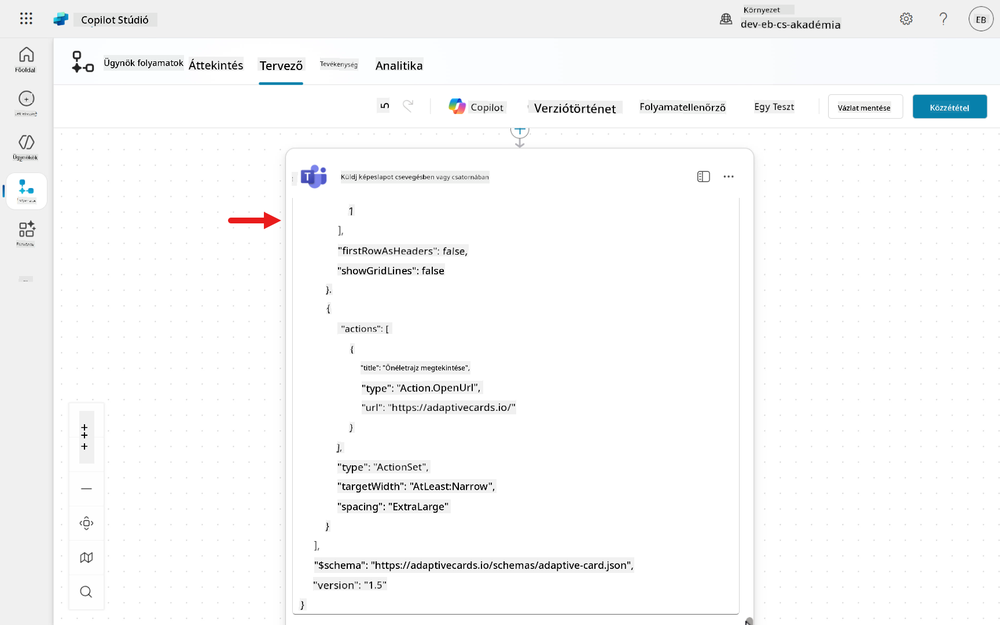

1. Hasonlóan ahhoz, amit a [Toborzás](../../recruit/08-add-adaptive-card/README.md#81-create-a-new-topic-with-an-adaptive-card-for-user-to-submit-their-request) során tettünk, frissíteni fogjuk a JSON payload meglévő értékeit tényleges értékekkel vagy dinamikus tartalommal.

Először frissítsük az URL-t a `url` tulajdonsághoz a `selectAction` tulajdonságon belül. Ezt az URL
1. A következőket kell látnod, ahol sárgával kiemelve találhatók a **Hiring Hub** modellvezérelt alkalmazás környezeti adatai.

     | Paraméter | Érték | Magyarázat |
     |----------|------------|---------|
     | **Szervezet URI** | GUID | A Dataverse/Dynamics 365 környezet szervezeti URL-je |
     | **appid** | GUID | Egy adott modellvezérelt alkalmazás megnyitásához az appid vagy appname lekérdezési paramétert használják. Ebben az esetben az appid van használatban |
     | **viewid** | GUID | A nézet azonosítóját tartalmazó lekérdezési paraméter |

       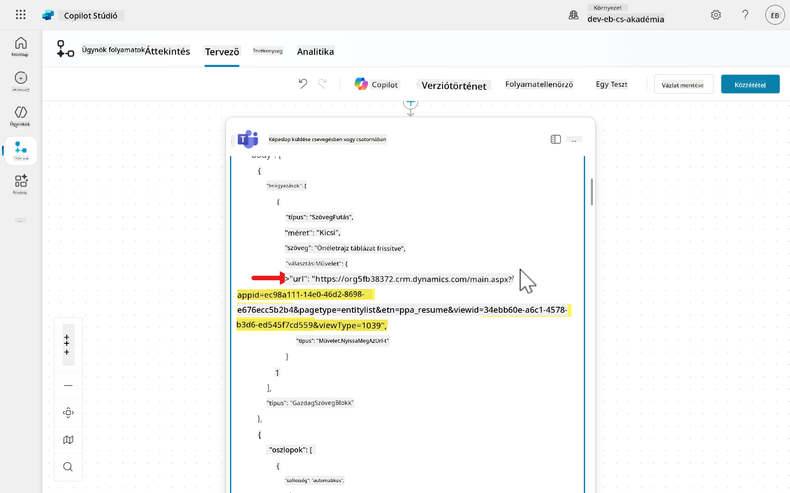

1. Ezután dinamikus tartalomértékeket adunk hozzá több tulajdonsághoz. Kezdjük azzal a szöveggel, amely megjeleníti az eseményindító által automatikusan létrehozott sor Önéletrajz szám hivatkozását.

      Válaszd ki a **panel** ikont az akciópanel betöltéséhez.

       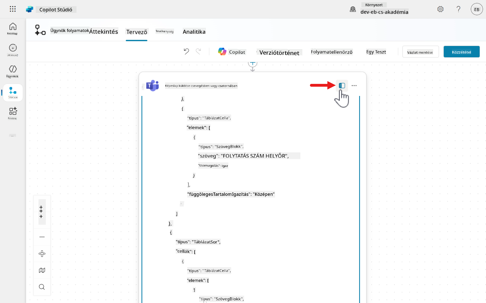

1. Görgess le arra a sorra, ahol a `text` tulajdonságot látod a `RESUME NUMBER PLACEHOLDER` esetében. Jelöld ki a helyőrző értéket, majd töröld.

       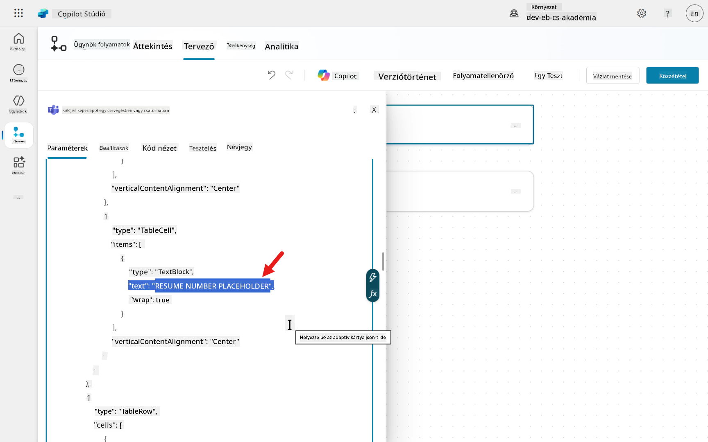

1. Kattints az idézőjelek közé, majd válaszd ki a **villám ikon** vagy **fx ikon** gombot jobbra.

      A **Dinamikus tartalom** fülön válaszd ki a **ResumeNumber** paramétert, majd kattints a **Hozzáadás** gombra.

       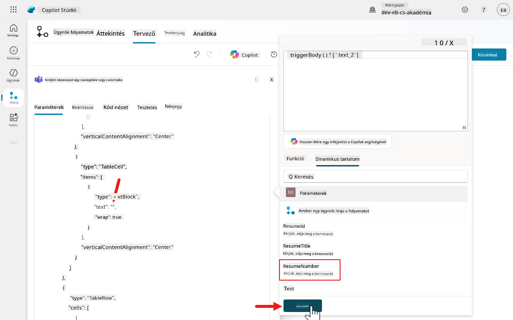

1. A **ResumeNumber** paraméter most dinamikus tartalomként hozzá lesz adva a `text` tulajdonsághoz.

       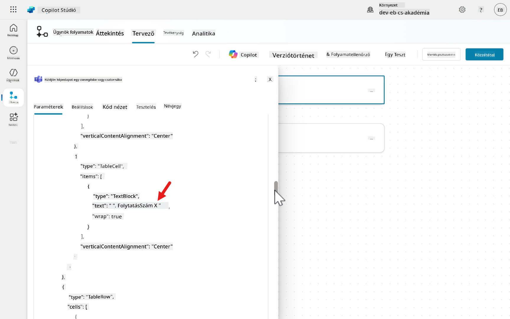

1. Ugyanezeket a lépéseket megismételjük a `RESUME NAME PLACEHOLDER` esetében. Görgess le arra a sorra, ahol a `text` tulajdonságot látod a `RESUME NAME PLACEHOLDER` esetében. Jelöld ki a helyőrző értéket, majd töröld.

       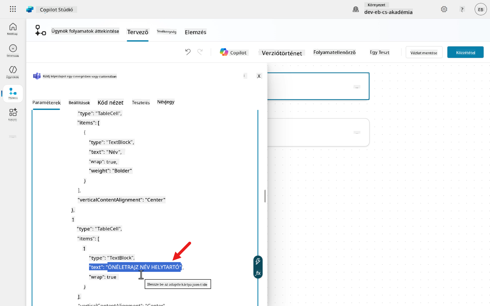

1. Kattints az idézőjelek közé, majd válaszd ki a **villám ikon** vagy **fx ikon** gombot jobbra.

      A **Dinamikus tartalom** fülön válaszd ki a **ResumeTitle** paramétert, majd kattints a **Hozzáadás** gombra.

       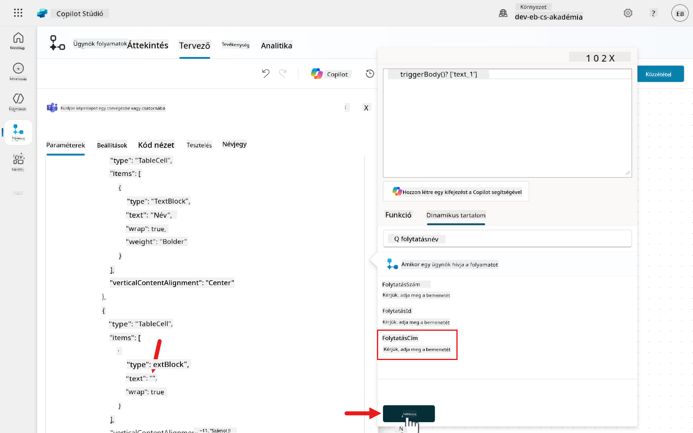

1. A **ResumeTitle** paraméter most dinamikus tartalomként hozzá lesz adva a `text` tulajdonsághoz.

       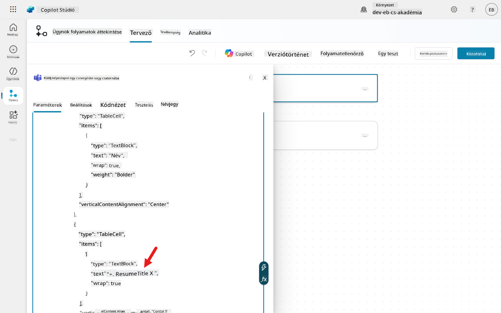

1. Ugyanezeket a lépéseket megismételjük a **Határidő** érték esetében, amely azt jelzi, hogy a toborzónak mikorra kell átnéznie az önéletrajzot. Görgess le arra a sorra, ahol a `text` tulajdonságot látod a `2023. május 21.` esetében.

       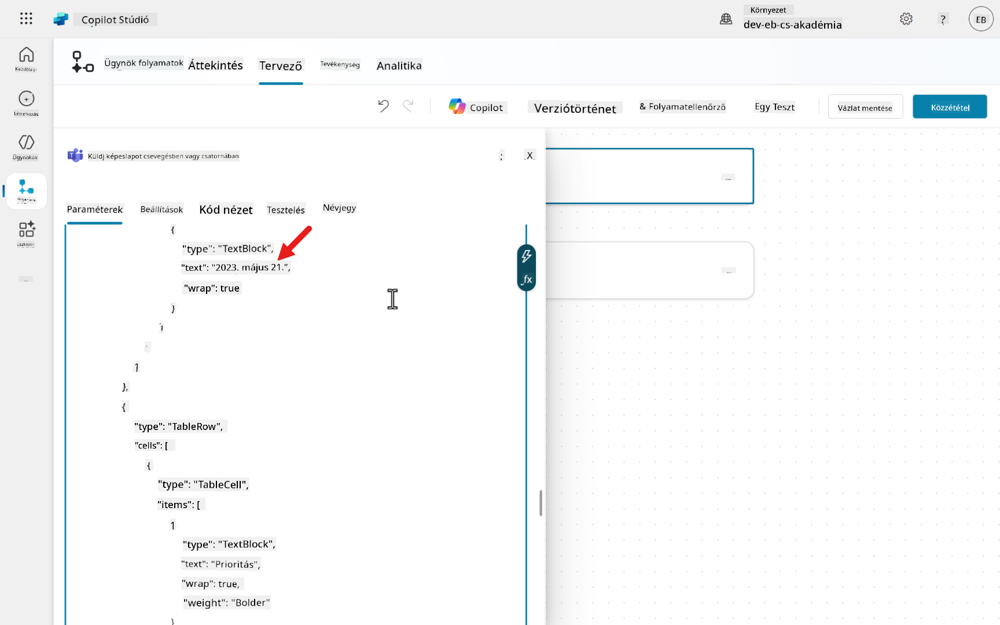

1. Töröld ezt a dátum helyőrző értéket, majd kattints az idézőjelek közé.

       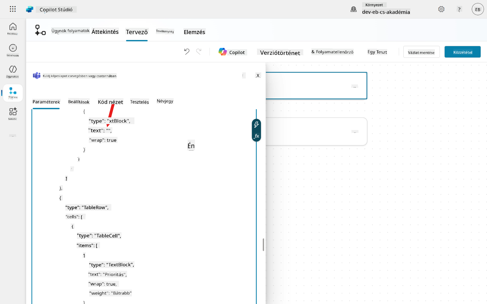

1. Válaszd ki a **villám ikon** vagy **fx ikon** gombot jobbra, majd a **Funkció** fülön írd be a következő kifejezést, és kattints a **Hozzáadás** gombra.

       ```text
       addDays(utcNow(), 3, 'MMM dd, yyyy')
       ```

      Ez a kifejezés két funkciót használ.

     | Funkció | Magyarázat |
     |----------|------------|
     | **addDays** | Hozzáad egy megadott számú napot egy adott dátumhoz, és visszaadja az eredményül kapott dátumot sztring formátumban |
     | **utcNow** | Visszaadja az aktuális dátumot és időt az egyezményes világidő (UTC) formátumban sztringként. |

      Az utcNow érték esetében a dátumot hónap és nap, majd év formátumban formázzuk.

       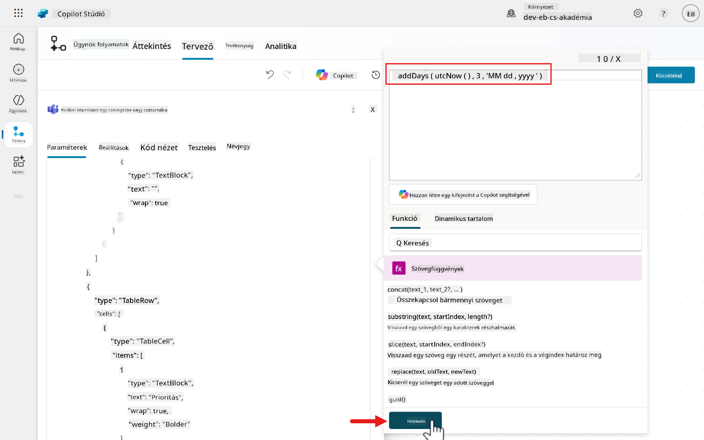

      A kifejezés most hozzá lesz adva a `text` tulajdonsághoz.

       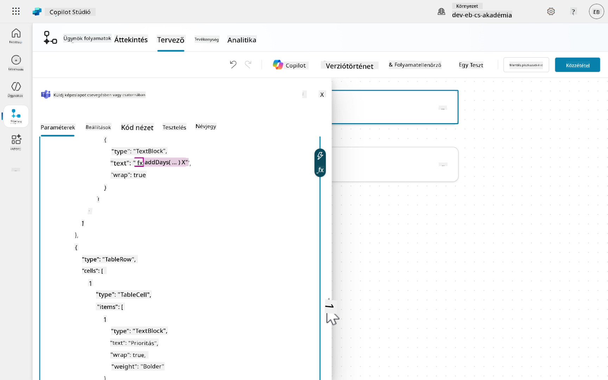

1. Végül frissítjük az URL-t az `url` tulajdonságban az `actions` tömb tulajdonságának alján a JSON payloadban. A jelenlegi helyőrző URL-t lecseréljük az Önéletrajz sor URL-jére a **Hiring Hub** modellvezérelt alkalmazásban. Ez lehetővé teszi a toborzó számára, hogy kiválassza az adaptív kártya `Action.OpenURL` akcióját, és az önéletrajzra irányítsa a modellvezérelt alkalmazásban.

       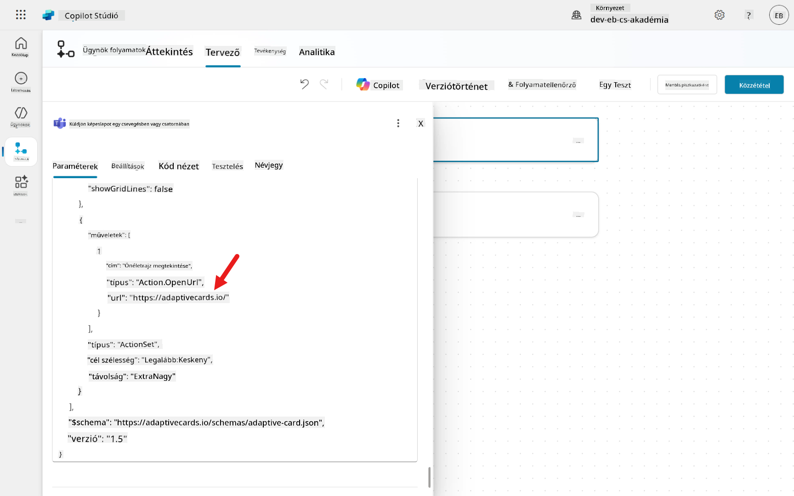

1. A **Hiring Hub** modellvezérelt alkalmazásban nyiss meg egy sort az **Önéletrajzok** rendszer nézetben a bal oldali menü segítségével. Az önéletrajz sor formaként fog betöltődni a modellvezérelt alkalmazásban.

      Másold ki az Önéletrajz sor URL-jét.

    ??? info "Hogyan navigálj vissza a **Hiring Hub** modellvezérelt alkalmazásba, ha kiléptél/bezártad"

        1. Nyisd meg a [https://make.powerapps.com](https://make.powerapps.com) oldalt, és győződj meg róla, hogy abban a fejlesztői környezetben vagy, amelyet ezekhez a laborfeladatokhoz használsz, különben válts át rá.
        
        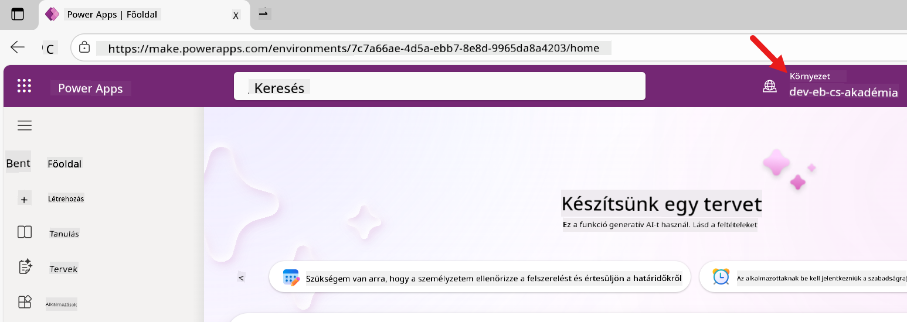

        1. Válaszd ki az **Alkalmazások** opciót a bal oldali menüpanelen, majd a **Hiring Hub** modellvezérelt alkalmazásnál válaszd ki a **Lejátszás** ikont, hogy betöltsd azt a böngésződben.
        
        

       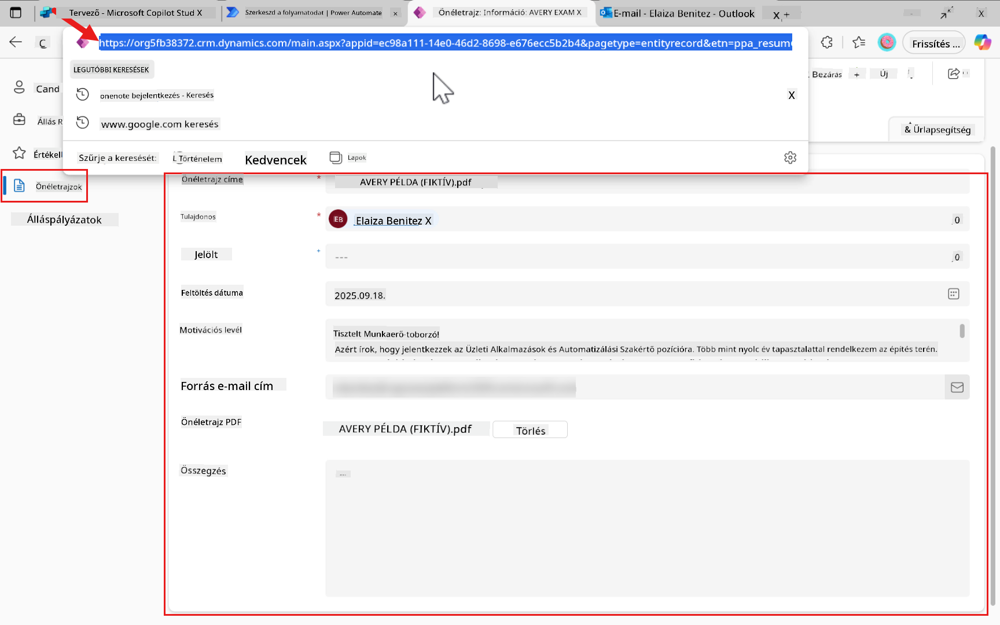

1. Ezután navigálj vissza az ügynökfolyamathoz, jelöld ki a jelenlegi helyőrző URL értéket, majd töröld.

       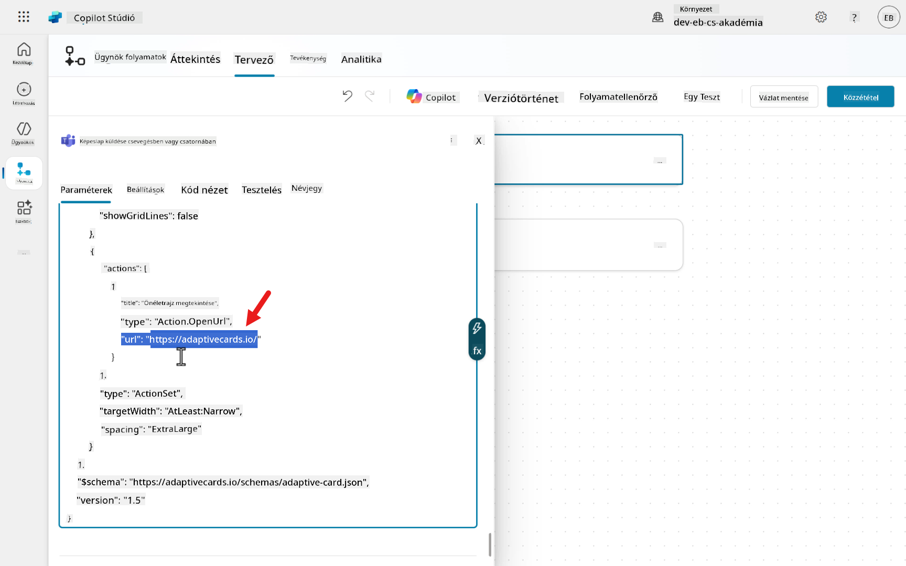

1. Ezután illeszd be a másolt URL-t az `url` tulajdonságba.

       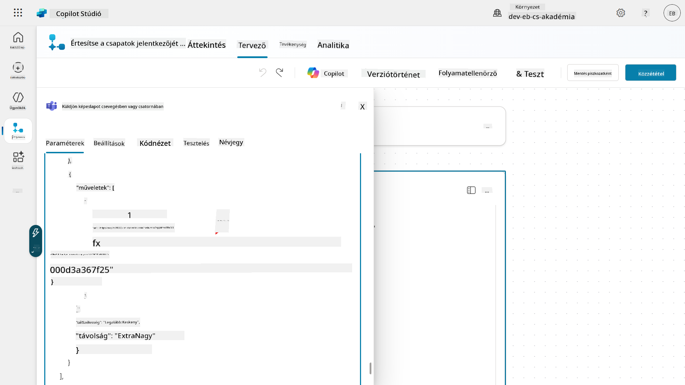

1. A következőket kell látnod. Töröld a `GUID` azonosító értéket a végéről. Ezt dinamikus tartalommal fogjuk helyettesíteni - a **ResumeId** paraméterrel.

       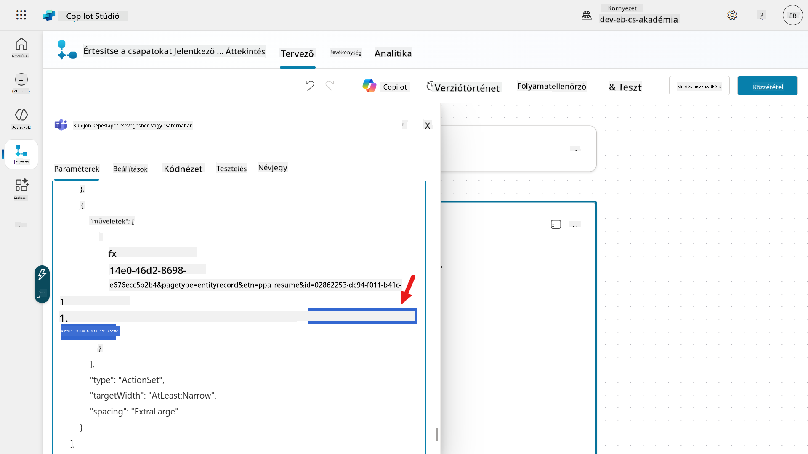

1. Válaszd ki a **villám ikon** vagy **fx ikon** gombot jobbra.

      A **Dinamikus tartalom** fülön válaszd ki a **ResumeId** paramétert, majd kattints a **Hozzáadás** gombra.

       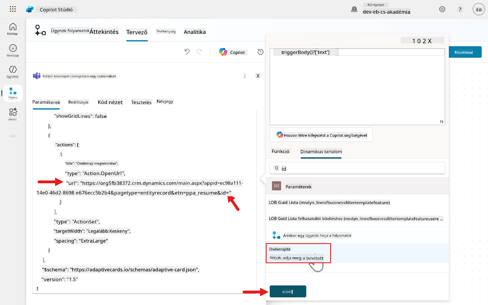

1. A **ResumeId** most dinamikus tartalomként hozzá lesz adva. A következő sárgával kiemelve található a **Hiring Hub** modellvezérelt alkalmazás környezeti adatai.

     | Paraméter | Érték | Magyarázat |
     |----------|------------|---------|
     | **Szervezet URI** | GUID | A Dataverse/Dynamics 365 környezet szervezeti URL-je |
     | **appid** | GUID | Egy adott modellvezérelt alkalmazás megnyitásához az appid vagy appname lekérdezési paramétert használják. Ebben az esetben az appid van használatban |
     | **id** | GUID | Az Önéletrajz sor azonosítóját tartalmazó lekérdezési paraméter |

       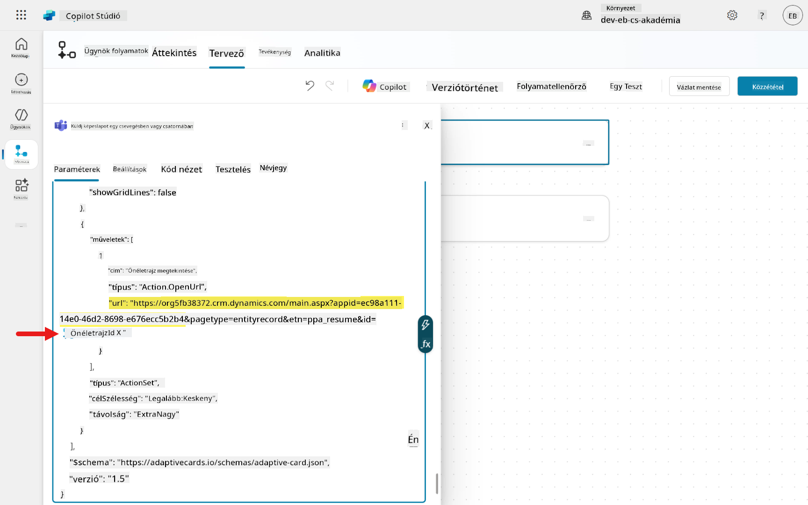

1. Befejeztük a **Kártya közzététele csevegésben vagy csatornában** akció konfigurálását 👏🏻 Lépj ki az akciókonfigurációs panelből az **x** ikon kiválasztásával.

       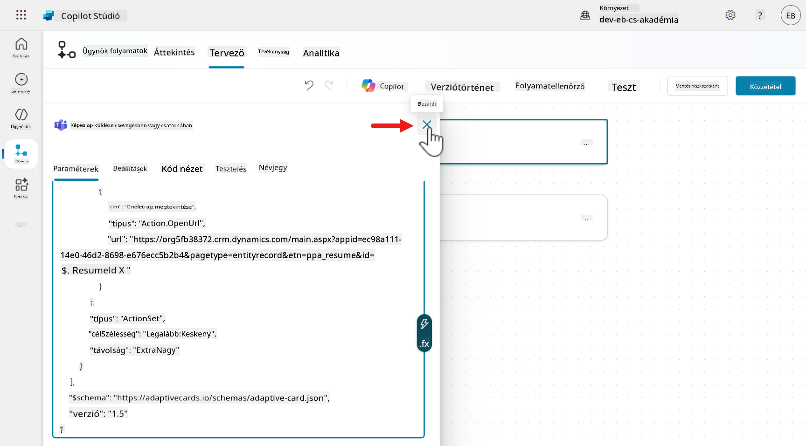

1. Végül konfiguráljuk az utolsó akciót, **Válasz az ügynöknek**, amely egy szöveget küld vissza az ügynöknek a feldolgozás befejezéséhez.

      A **Válasz az ügynöknek** akcióban válaszd ki a **+Kimenet hozzáadása** opciót.

       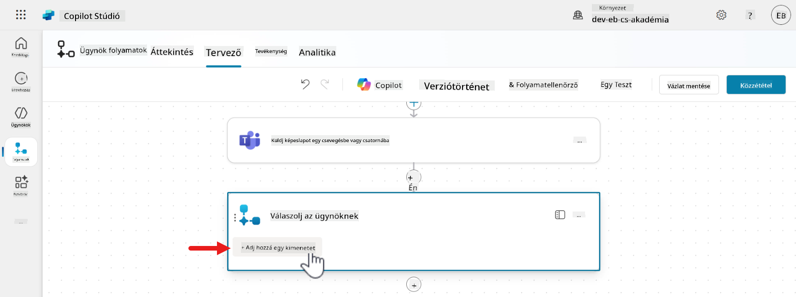

1. Válaszd ki a **Szöveg** opciót a kimenet típusaként.

       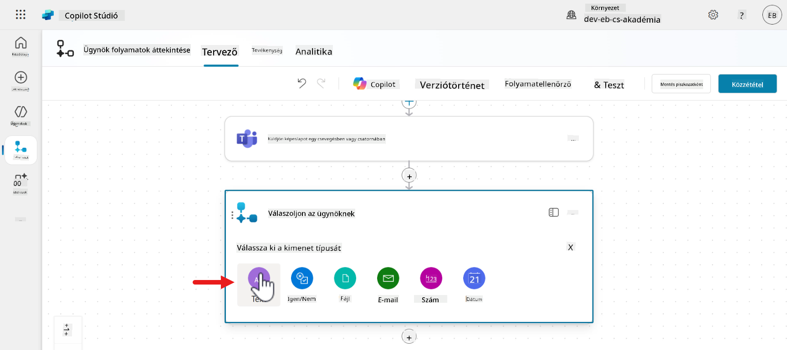

1. Írd be a következőt a kimenet nevének.

       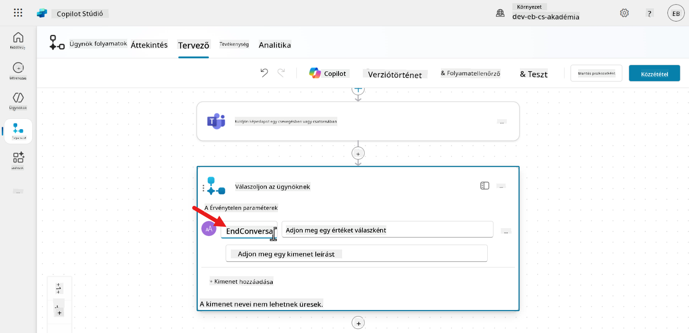

1. Írd be a következőt a kimenet értékeként.

       ```text
       Finished
       ```

       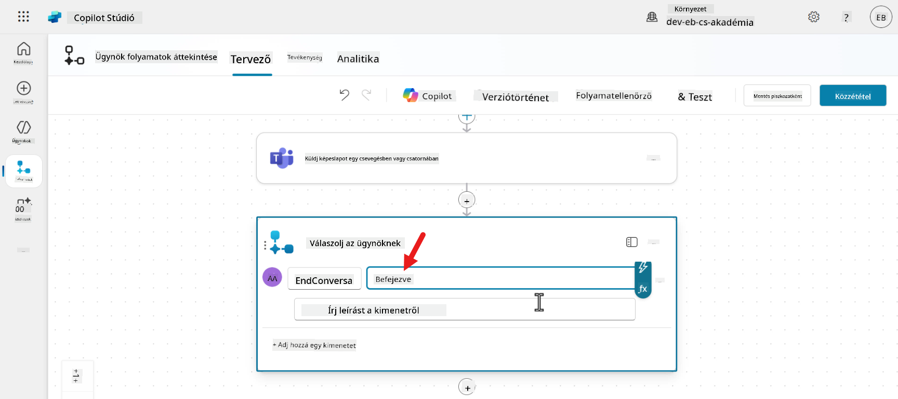

1. Most befejeztük az ügynökfolyamat konfigurálását. Válaszd ki a **Vázlat mentése** opciót az ügynökfolyamat mentéséhez. Mentés után megerősítő üzenet jelenik meg.

       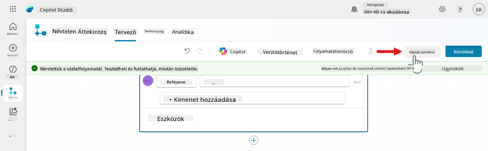

1. Az ügynökfolyamat közzététele előtt frissítenünk kell az ügynökfolyamat részleteit. Válaszd ki az **Áttekintés** fület, majd kattints a **Szerkesztés** gombra.

      Az folyamat neve mezőbe írd be a következőt.

       ```text
       Notify Teams Applicant channel
       ```      

      Ezután válaszd ki a **Frissítés** ikont az ügynökfolyamat leírásának AI segítségével történő frissítéséhez.

      Majd kattints a **Mentés** gombra az ügynökfolyamat frissített részleteinek mentéséhez.

       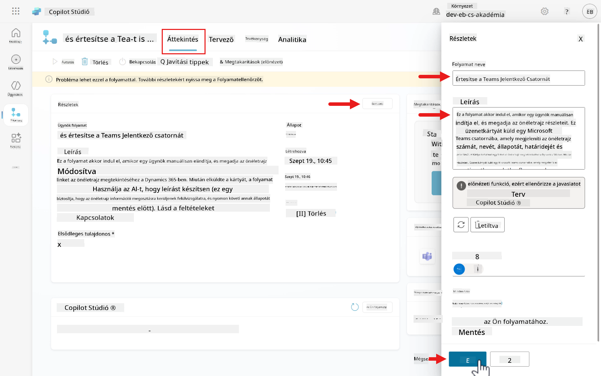

1. Navigálj vissza a **Tervező** fülre, majd válaszd ki a **Közzététel** opciót az ügynökfolyamat közzétételéhez. Mentés után megerősítő üzenet jelenik meg.

       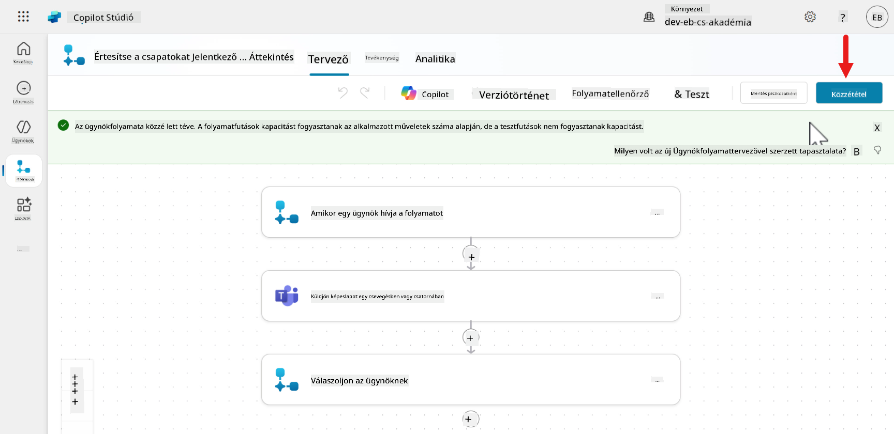

1. Az ügynökfolyamatot most hozzá kell adni eszközként az **Application Intake Agent**-hez. Navigálj vissza a **Hiring Agent**-hez, majd válaszd ki az **Ügynökök** fület, és az **Application Intake Agent**-et.

       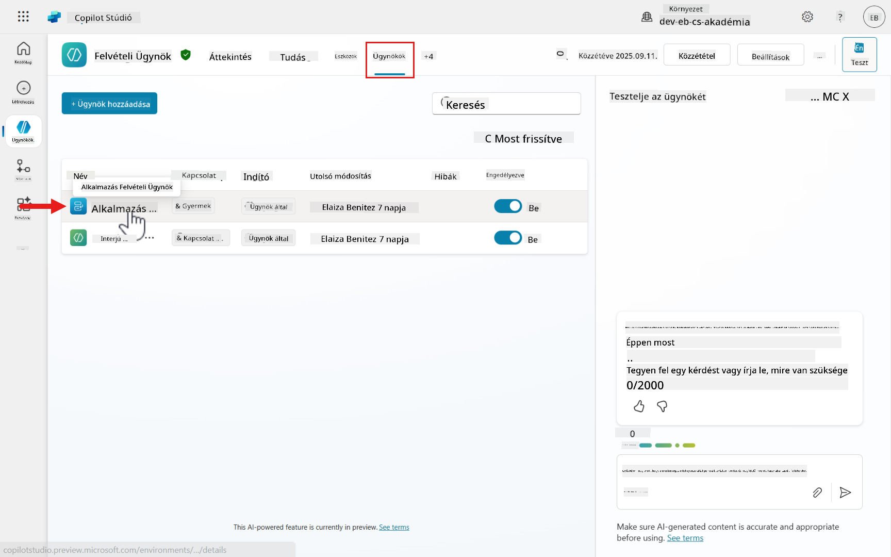

1. Az ügynök **Részletek** szekciójában frissítsük a **Leírás** mezőt. Másold ki a következőt, majd illeszd be a leírás szövegének végére.

       ```text
       és értesítse a Teams Applicant csatornát is
       ```

       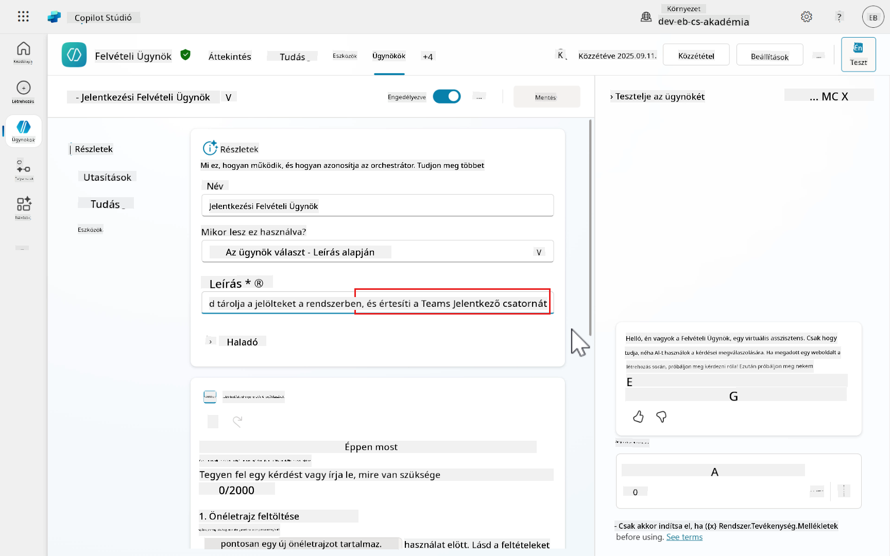

1. Ezután hozzáadjuk az ügynökfolyamatot eszközként. Görgess le, majd válaszd ki a **+ Hozzáadás** opciót.

       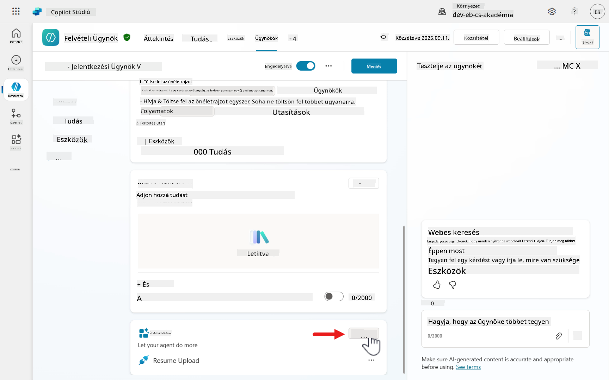

1. Válaszd ki a korábban létrehozott ügynökfolyamatot, **Notify Teams Applicant Channel**.

       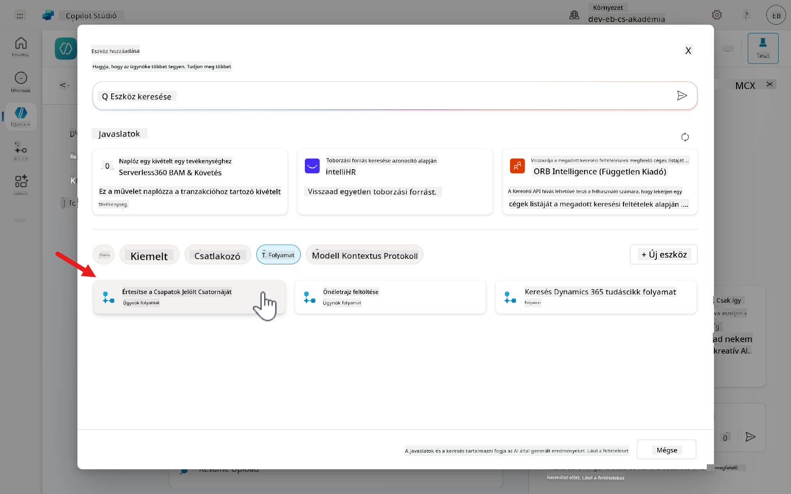

1. Ezután válaszd ki a **Hozzáadás és konfigurálás** opciót.

       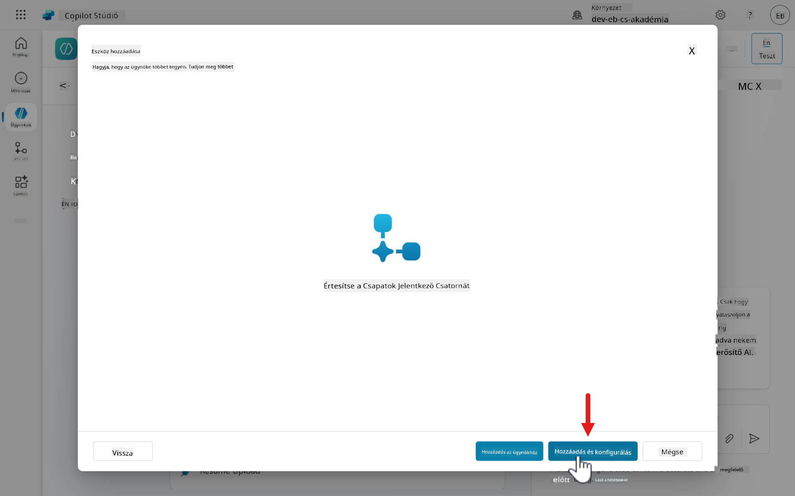

1. Az ügynökfolyamat **Bemenetek** szekciójában láthatóak a korábban konfigurált három bemenetek. Alapértelmezés szerint a **Kitöltés módja** beállítás **Dinamikus kitöltés AI-val** értékre van állítva. Ezt a beállítást változatlanul hagyjuk, mivel az eseményindítóból érkező prompt (az utolsó akcióban, **Küldjön egy promptot a megadott copilotnak feldolgozásra** - ez a **Lab 3.1 - Önéletrajzok feltöltésének automatizálása Dataverse-be e-mailben kapott önéletrajzok alapján** 38-44 lépése) tartalmazni fogja az AI által kinyert paraméterértékeket.

       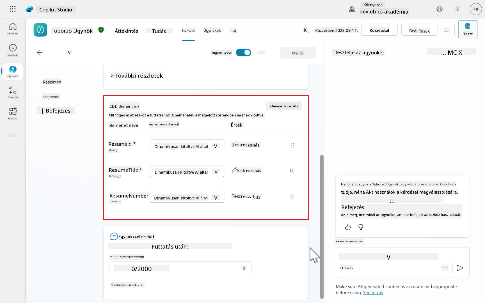

1. Most, hogy az eszköz hozzá lett adva az **Application Intake Agent**-hez, frissíteni kell az ügynök utasításait. Válaszd ki a **vissza nyíl** ikont az ügynökök listájához való visszatéréshez.

       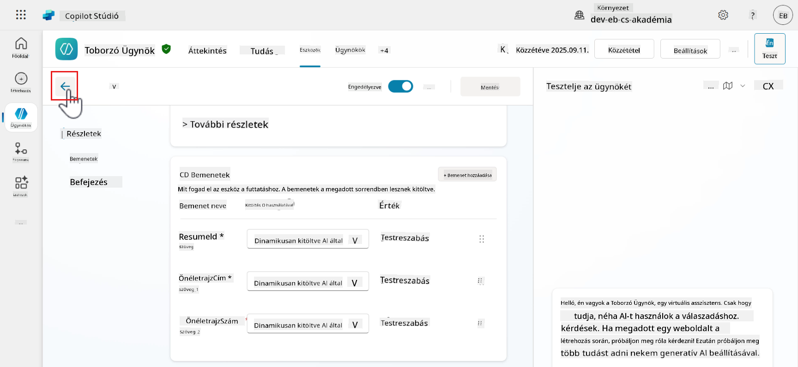

1. Válaszd ki az **Application Intake Agent**-et az **Ügynökök** fülön a **Hiring Agent**-ben.

       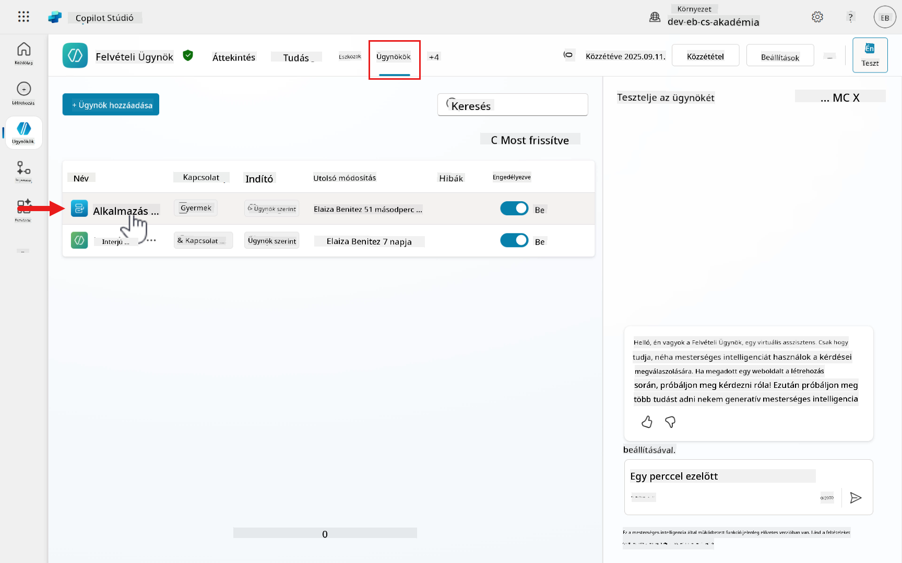

1. Az **Utasítások** mezőben adj hozzá egy új sort a `2.Post-Upload` utasítások után. Másold és illeszd be a következő utasításokat.

       ```text
       Önéletrajz feltöltési folyamat e-mailen keresztül
       1. Amikor üzenetet kapsz, **Küldj [ResumeId (text)] = "1680265f-5793-f011-b41b-7c1e525be9f7" és [ResumeTitle (text_1)] = "TAYLOR TESTPERSON (FICTITIOUS).pdf" és [ResumeNumber (text_2)]= "R01026" az "Notify Teams Applicant channel" eszköznek a "Application Intake Agent" alügynökben, hívd meg [AGENT FLOW PLACEHOLDER]
       ```

       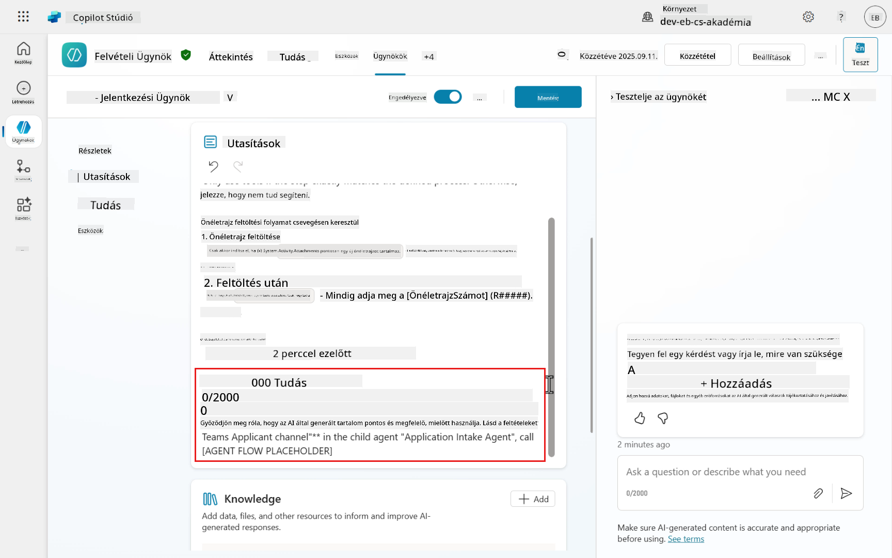

1. Jelöld ki az `[AGENT FLOW PLACEHOLDER` szöveget.

       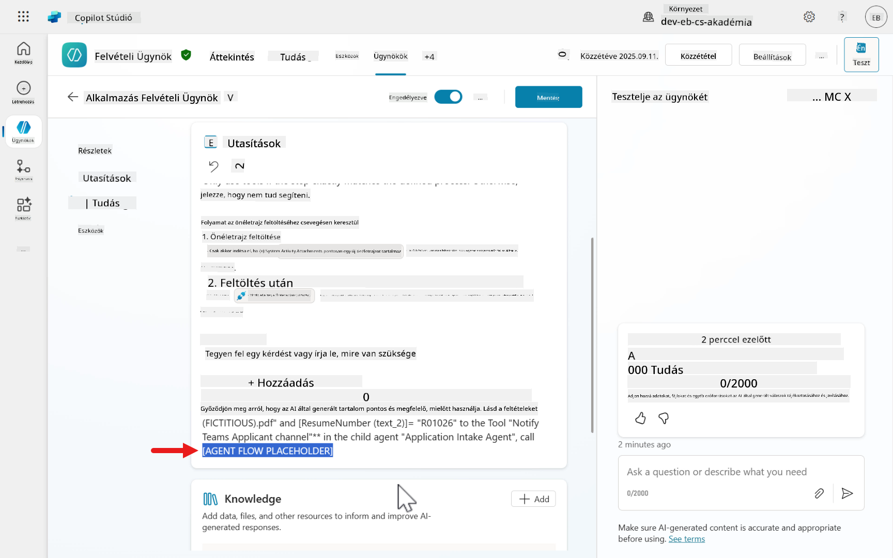

1. Írd be a perjel karaktert, `/`, majd válaszd ki a **Notify Teams Applicant Channel** eszközt.

       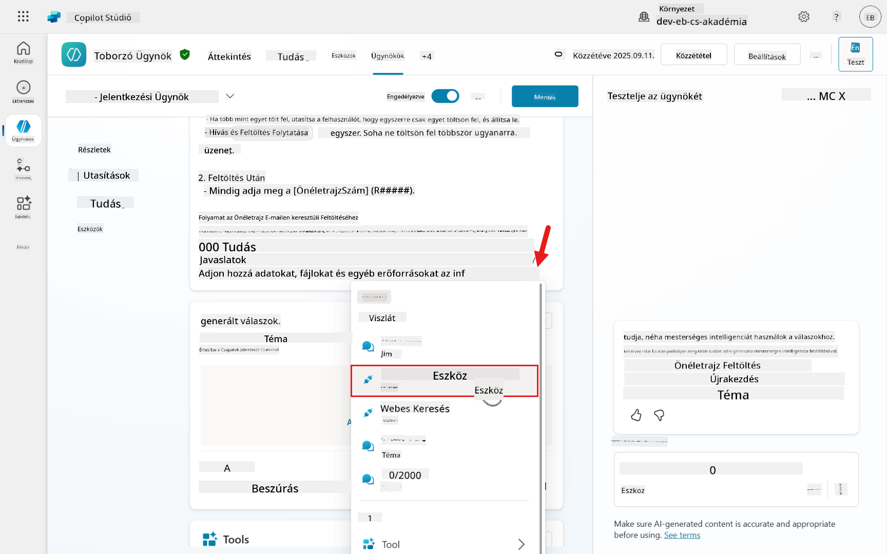
1. Az ügynök folyamatot mostantól a **Jelentkezési Ügynök** fogja elindítani az utasításoknak megfelelően, miután az utolsó művelet (**Feldolgozásra küld egy promptot a megadott copilotnak**) az eseményindítóban visszaküldi a paraméterértékeket tartalmazó promptot az ügynöknek.

      Válassza a **Mentés** lehetőséget, hogy elmentse a frissített utasításokat a **Jelentkezési Ügynök** számára.

       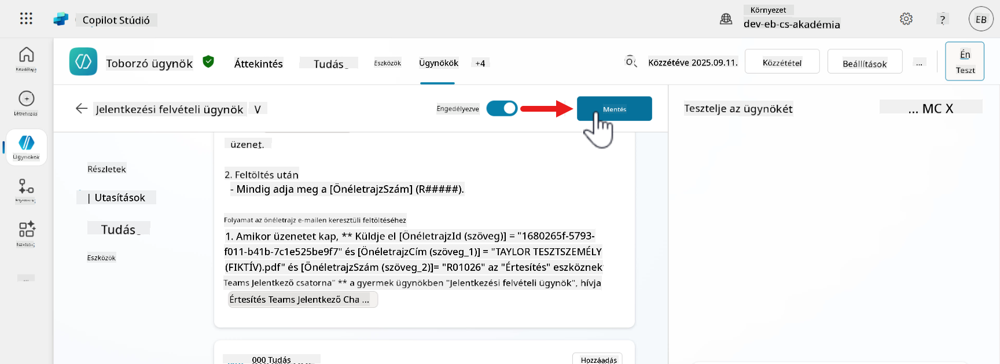

1. Az utasítások frissítve lesznek, miután az ügynököt elmentették.

       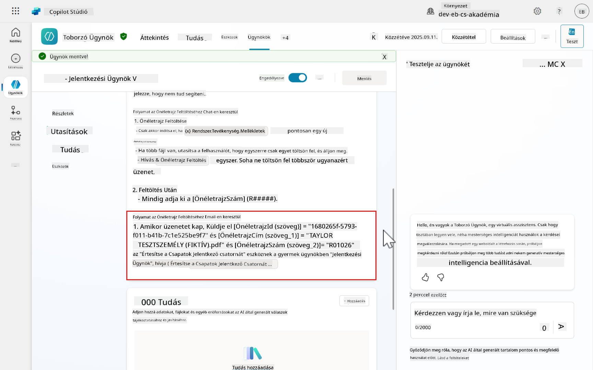

1. Most publikálnunk kell a **Felvételi Ügynököt**. Válassza a **Publikálás** lehetőséget a jobb felső sarokban, majd a megjelenő _Publikálja ezt az ügynököt_ modális ablakban válassza a **Publikálás** lehetőséget.

       

1. A publikálás után megjelenik egy megerősítő üzenet, amely jelzi, hogy az ügynök publikálva lett.

       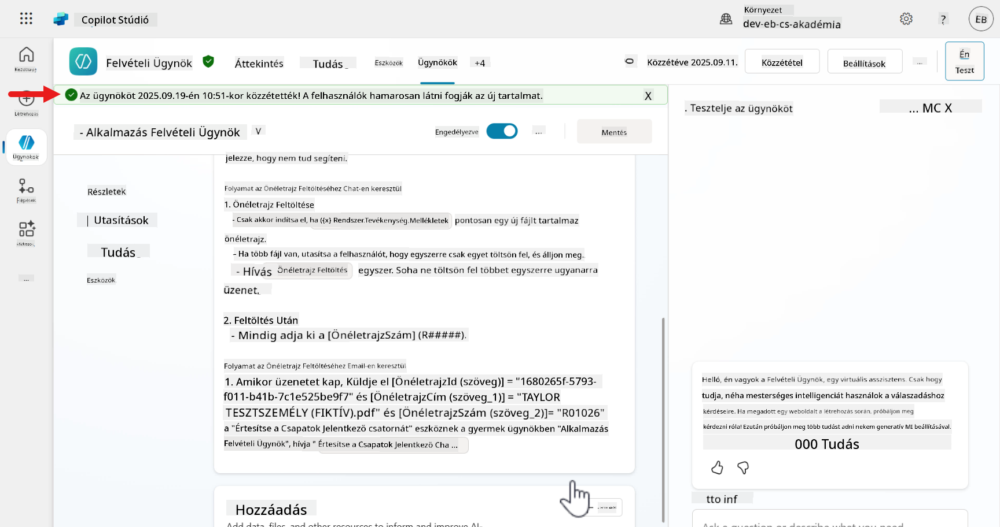

Most már tesztelhetjük az ügynököt!

### 3.3. labor - Eseményindító tesztelése

1. Az eseményindító végrehajtásához egy e-mailt kell küldeni egy PDF formátumú önéletrajzzal. Az Outlookban hozzon létre egy új e-mail üzenetet.

     | E-mail komponens | Részletek |
     |----------|------------|
     | **Címzett** | Használja a bejelentkezett felhasználói fiókját értékként |
     | **Fájl csatolmány** | Töltse fel a [TAYLOR TESTPERSON (FICTITIOUS)](../../../../../docs/operative-preview/test-data/resumes/TAYLOR%20TESTPERSON%20(FICTITIOUS).pdf) fájlt |
     | **Szövegtörzs** | Másolja és illessze be az alábbi szöveget az e-mail szövegtörzsébe |

       ```text
       Tisztelt Felvételi Menedzser!

       Azért írok, hogy kifejezzem érdeklődésemet az Önök szervezeténél meghirdetett Senior Power Platform Engineer pozíció iránt. Több mint kilenc év tapasztalattal rendelkezem a Microsoft felhőalapú platformjain biztonságos és skálázható megoldások szállításában, és biztos vagyok benne, hogy hatékonyan tudok hozzájárulni az Önök csapatához.

       Legutóbbi pozíciómban, mint vezető Power Platform mérnök, kifejlesztettem egy automatizált önéletrajz-beviteli folyamatot, amely csökkentette a manuális osztályozást és javította a kereshetőséget. HR-esetkezelő alkalmazásokat szállítottam, bevezettem megoldás-tudatos folyamatokat, és PR-ellenőrzéseket valósítottam meg a telepítési idők javítása érdekében. Szakértelmem kiterjed a Power Apps, Power Automate, Power Pages, Dataverse és számos Microsoft 365 szolgáltatásra, valamint a Graph/REST API-k és az Azure Functions integrációjára.

       Korábban Teams jóváhagyásokat fejlesztettem adaptív kártyákkal, amelyek azonos napi jóváhagyási időket eredményeztek, és robusztus hibakezelési keretrendszereket hoztam létre. Háttérmunkám magában foglalja a régi munkafolyamatok migrálását Power Automate-re és önkiszolgáló portálok építését, amelyeket több száz alkalmazott fogadott el.

       Számítástechnikai B.Sc. diplomával rendelkezem, valamint Power Platform fejlesztői (PL-400) és megoldás-architektúra (PL-600) tanúsítvánnyal. Szenvedélyesen mentorálok, és önkéntesként tevékenykedtem helyi alkotói csoportokban.

       Mellékelten csatoltam önéletrajzomat az Önök figyelmébe. Örömmel venném a lehetőséget, hogy megbeszéljük, hogyan illeszkednek képességeim és tapasztalataim az Önök igényeihez.

       Köszönöm az idejét és figyelmét.

       Üdvözlettel,
       Taylor Testperson
       ```

       **Küldje el** az e-mailt, miután megírta.

       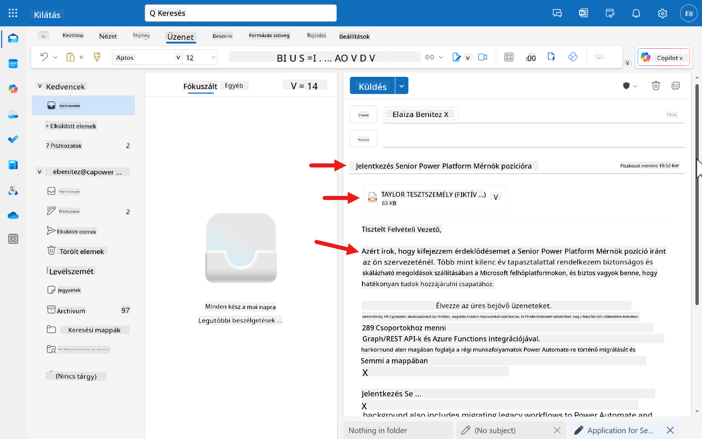

1. A Power Automate készítői portálján az eseményindító folyamathoz válassza a **Frissítés** ikont, hogy megtekintse a sikeresen lefutott folyamatot a küldött e-mailhez.

       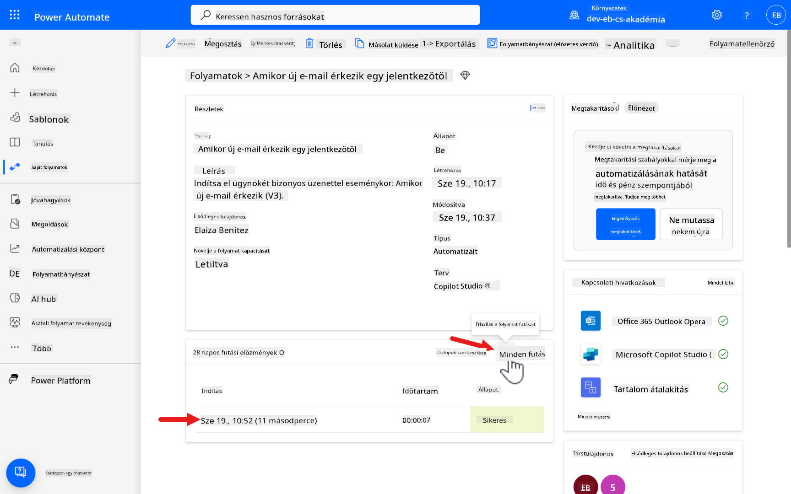

1. Térjen vissza a Copilot Studio-ba, és válassza ki a **Felvételi Ügynök** **Tevékenység** lapját.

       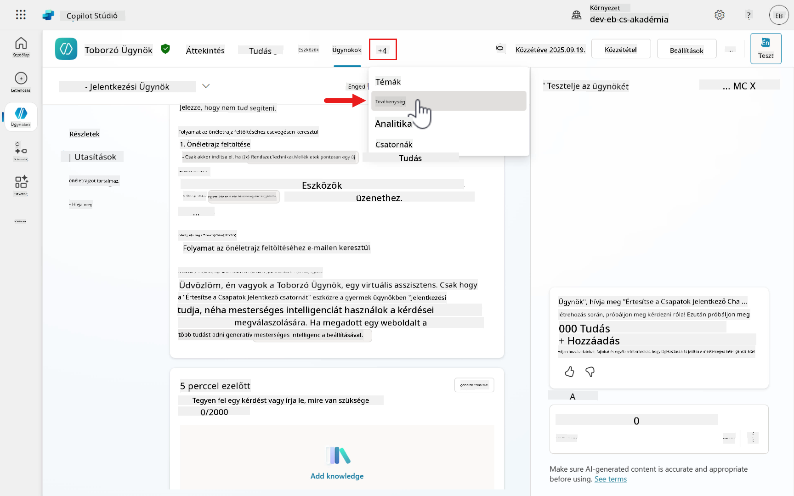

1. A **Tevékenység** lap betöltődik, amely megjeleníti a **Felvételi Ügynök** összes tevékenységét. Lesz egy tevékenység **Automatikus** névértékkel, amelynek állapota **Befejezett**. Ez a tevékenység az eseményindítót és az ügynök folyamatot képviseli, amelyet elindítottak.

       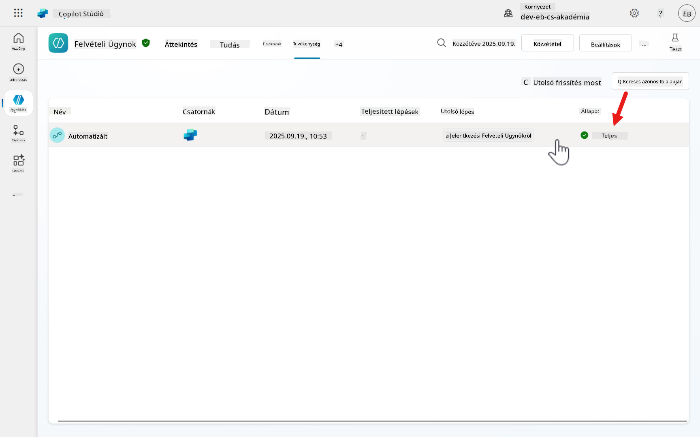

1. Válassza ki a tevékenységet, majd válassza ki az eseményindítót a tevékenységtérképen. A jobb oldali panelen vegye észre, hogy a prompt bemeneti paraméterei tartalmazzák a `Resume Id`, `Resume Title` és `Resume Number` paraméterértékeket a **Dataverse** sorból, amelyet létrehoztak. Ez a dinamikus tartalomértékekből származik, amelyeket korábban a **3.1. labor - Önéletrajzok feltöltésének automatizálása e-mailben** 18-27. lépéseiben konfiguráltunk.

       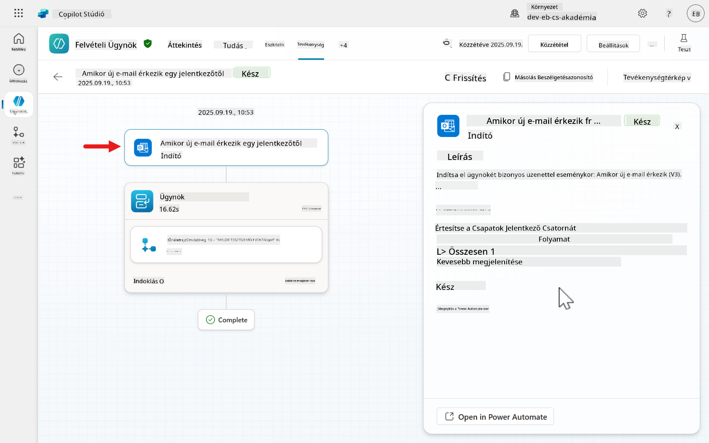

1. Térjen vissza a **Felvételi Központ** modellvezérelt alkalmazásba, és a **Önéletrajzok rendszer nézetében** válassza a **Frissítés** lehetőséget a nézet frissítéséhez. Az e-mailben küldött önéletrajzhoz létrehozott új sor most már megjelenik, mivel az eseményindító létrehozta.

       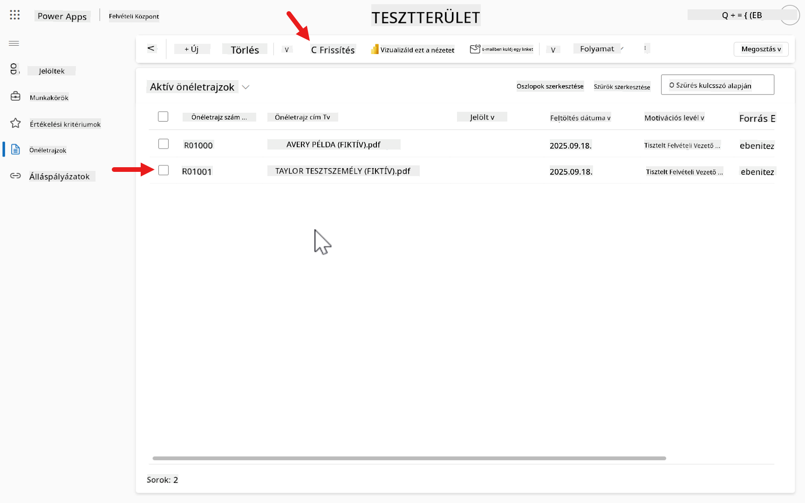

1. Térjen vissza a Copilot Studio-ba, és válassza ki a **Notify Teams Applicant Channel** ügynök folyamatot a **Jelentkezési Ügynök** tevékenységtérképén. A jobb oldali panelen vegye észre, hogy a bemenetek értékei a Dataverse sorból származnak. Ez a promptból származik, amelyet az eseményindító utolsó művelete (**Feldolgozásra küld egy promptot a megadott copilotnak**) küldött, és amely tartalmazza a paraméterértékeket az újonnan létrehozott Dataverse sorból. Így tudjuk átadni az eseményindítók paraméterértékeit az ügynök folyamatoknak.

       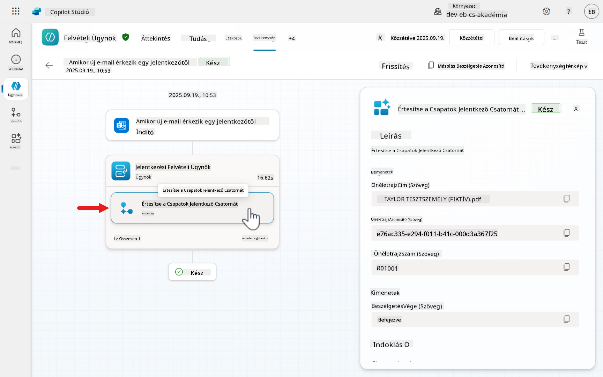

1. Végül nézzük meg az adaptív kártyát, amelyet a **Microsoft Teams** csatornába posztoltak. A csatornában látni fogjuk az adaptív kártyát, amely megjeleníti az újonnan létrehozott Dataverse önéletrajz sor információit. Vigye az egeret az adaptív kártya elején található hiperhivatkozás fölé, és vegye észre, hogy az URL az Önéletrajzok rendszer nézet URL-je, amelyet korábban konfiguráltunk az adaptív kártya JSON (a **3.2. labor - Teams csatorna értesítése adaptív kártyával** 15-19. lépései) payloadjában.

       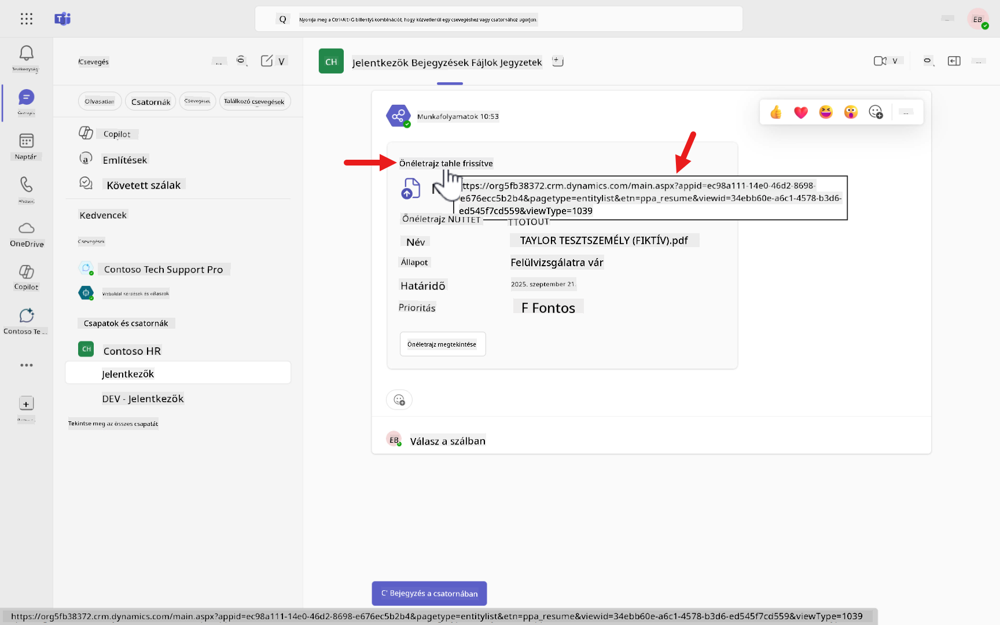

1. Válassza ki a hiperhivatkozást, és átirányítják az Önéletrajzok rendszer nézetére a **Felvételi Központ** modellvezérelt alkalmazásban a böngészőjében.

       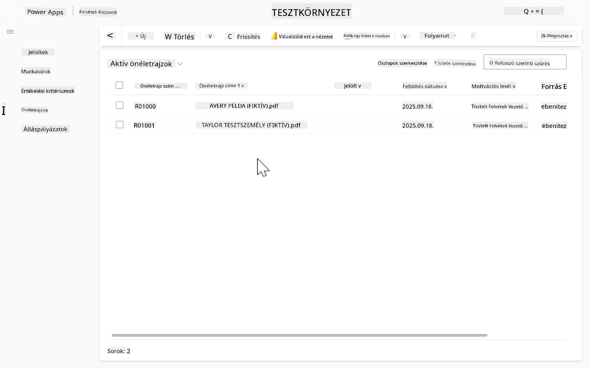

1. Térjen vissza az adaptív kártyához, amelyet a Microsoft Teams csatornába posztoltak. Ezúttal vigye az egeret a **View Resume** fölé, amely az adaptív kártya `Action.OpenURL` művelete. Vegye észre, hogy az URL az Önéletrajz sor, amelyet korábban konfiguráltunk az adaptív kártya JSON (a **3.2. labor - Teams csatorna értesítése adaptív kártyával** 30-36. lépései) payloadjában.

       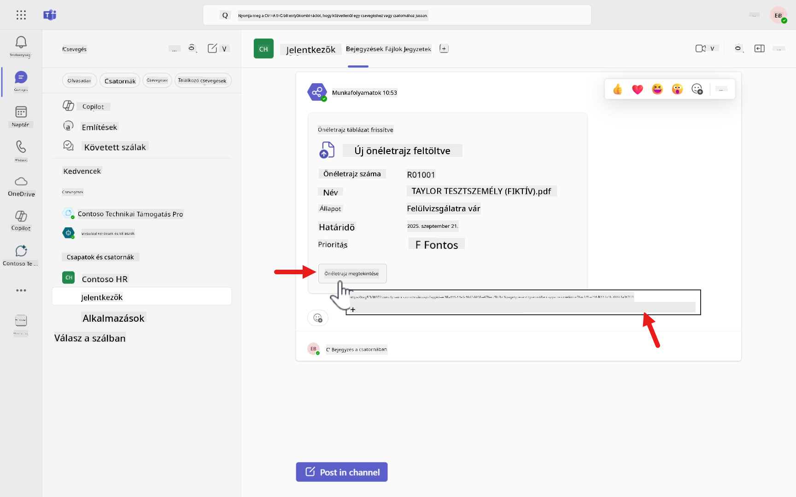

1. Válassza ki a műveletet, és átirányítják az Önéletrajz sor űrlapjára a **Felvételi Központ** modellvezérelt alkalmazásban a böngészőjében.

       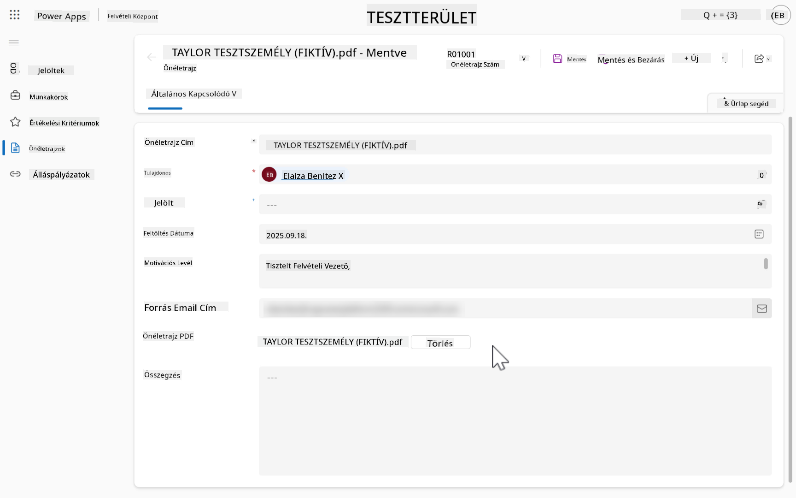

## ✅ Küldetés Teljesítve

Gratulálunk! 👏🏻 Kiváló munka, Operatív.

✅ Eseményindító: létrehozott egy eseményindítót, amely Dataverse paraméterértékeket ad át egy ügynök folyamatnak.  
✅ Ügynök folyamat létrehozása: a Dataverse paraméterértékeket felhasználva adaptív kártyát posztol egy Microsoft Teams csatornába, hogy értesítse a HR toborzó csapatot.  
✅ Gyermek ügynök utasításainak frissítése: a folyamat elindításához, miután az eseményindító befejeződött.

Ez lehetővé teszi a **Felvételi Ügynök** számára, hogy önállóan működjön, amikor önéletrajzokat kap e-mail csatolmányként, és értesítse a HR toborzó csapatot manuális áttekintés céljából.

Ez a **03. labor - Jelentkezési e-mailek automatizálása** vége, válassza az alábbi linket a következő leckére való továbblépéshez.

⏭️ [Lépjen a **Ügynök utasítások szerkesztése** leckére](../04-agent-instructions/README.md)

## 📚 Taktikai Források

📖 [Tegye ügynökét önállóvá a Copilot Studio-ban](https://learn.microsoft.com/training/modules/autonomous-agents-online-workshop/?WT.mc_id=power-188561-ebenitez)  

📖 [Eseményindító hozzáadása](https://learn.microsoft.com/microsoft-copilot-studio/authoring-trigger-event?WT.mc_id=power-188561-ebenitez)  

📖 [Ügynök folyamatok használata az ügynökével](https://learn.microsoft.com/microsoft-copilot-studio/advanced-flow?WT.mc_id=power-188561-ebenitez)  

📖 [Power Automate indítók bevezetése](https://learn.microsoft.com/power-automate/triggers-introduction?WT.mc_id=power-188561-ebenitez)  

📖 [Power Automate folyamatok használata ügynökökkel](https://learn.microsoft.com/microsoft-copilot-studio/advanced-flow-create?WT.mc_id=power-188561-ebenitez)  

📖 [Adatvesztés megelőzése a Copilot Studio-ban](https://learn.microsoft.com/microsoft-copilot-studio/admin-data-loss-prevention?WT.mc_id=power-188561-ebenitez)  

---

**Felelősség kizárása**:  
Ez a dokumentum az [Co-op Translator](https://github.com/Azure/co-op-translator) AI fordítási szolgáltatás segítségével lett lefordítva. Bár törekszünk a pontosságra, kérjük, vegye figyelembe, hogy az automatikus fordítások hibákat vagy pontatlanságokat tartalmazhatnak. Az eredeti dokumentum az eredeti nyelvén tekintendő hiteles forrásnak. Kritikus információk esetén javasolt professzionális emberi fordítást igénybe venni. Nem vállalunk felelősséget semmilyen félreértésért vagy téves értelmezésért, amely a fordítás használatából eredhet.