<!--
CO_OP_TRANSLATOR_METADATA:
{
  "original_hash": "616d142d4fb5f45d2a168fad6c1f9545",
  "translation_date": "2025-10-20T18:28:20+00:00",
  "source_file": "docs/operative-preview/07-multimodal-prompts/README.md",
  "language_code": "hu"
}
-->
# 🚨 Küldetés 07: Önéletrajz tartalmának kinyerése multimodális utasításokkal

--8<-- "disclaimer.md"

## 🕵️‍♂️ KÓDNEVE: `DOKUMENTUM ÖNÉLETRAJZ FELDERÍTÉS`

> **⏱️ Műveleti időablak:** `~45 perc`

## 🎯 Küldetés összefoglaló

Üdvözlünk, Operatív! Az eddigi küldetéseid során hatékony ügynök-összehangolási készségeket sajátítottál el, de most eljött az idő, hogy egy forradalmi képességet fedezz fel: **multimodális dokumentumelemzés**.

A feladatod, ha elfogadod, a **Dokumentum Önéletrajz Felderítés** - strukturált adatok kinyerése bármilyen dokumentumból precízen. Bár az ügynökeid könnyedén feldolgozzák a szövegeket, a való világban naponta kell kezelni PDF-eket, képeket és összetett dokumentumokat. Önéletrajzok halmozódnak fel, számlákat kell feldolgozni, és űrlapokat kell azonnal digitalizálni.

Ez a küldetés átalakít téged egy szöveg-alapú ügynöképítőből **multimodális szakértővé**. Megtanulod, hogyan konfigurálj olyan mesterséges intelligenciát, amely úgy olvassa és érti a dokumentumokat, mint egy emberi elemző - de AI sebességgel és következetességgel. A küldetés végére egy teljes önéletrajz-kinyerő rendszert építesz, amely integrálódik a toborzási munkafolyamatodba.

Az itt elsajátított technikák elengedhetetlenek lesznek a következő küldetésedben az előrehaladott adat-alapú műveletekhez.

## 🔎 Célkitűzések

Ebben a küldetésben megtanulod:

1. Mi az a multimodális utasítás, és mikor érdemes különböző AI modelleket használni
1. Hogyan konfigurálj utasításokat képek és dokumentumok bemeneteivel
1. Hogyan formázd az utasítások kimenetét JSON formátumban strukturált adatkinyeréshez
1. A dokumentumelemzéshez kapcsolódó utasításmérnöki legjobb gyakorlatokat
1. Hogyan integráld a multimodális utasításokat az Agent Flows rendszerrel

## 🧠 A multimodális utasítások megértése

### Mi teszi az utasítást "multimodálissá"?

A hagyományos utasítások csak szöveggel dolgoznak. A multimodális utasítások azonban többféle tartalmat is képesek feldolgozni:

- **Szöveg**: Írott utasítások és tartalom
- **Képek**: Fotók, képernyőképek, diagramok és ábrák (.PNG, .JPG, .JPEG)  
- **Dokumentumok**: Számlák, önéletrajzok, űrlapok (.PDF)

Ez a képesség lehetővé teszi olyan erőteljes forgatókönyvek megvalósítását, mint az önéletrajzok elemzése, számlák feldolgozása vagy adatok kinyerése űrlapokból.

### Miért fontos a multimodalitás a munkafolyamatokhoz?

Naponta szembesül szervezete az alábbi dokumentumfeldolgozási kihívásokkal:

- **Önéletrajz átvizsgálás**: Több száz önéletrajz kézi átnézése értékes időt vesz igénybe
- **Számlafeldolgozás**: Szállítói adatok, összegek és dátumok kinyerése különböző dokumentumformátumokból
- **Űrlapelemzés**: Papír alapú űrlapok digitális adatokká alakítása

A multimodális utasítások megszüntetik ezeket a szűk keresztmetszeteket azáltal, hogy kombinálják az AI nyelvi megértését a vizuális elemzési képességekkel. Ezáltal az AI képes olyan hatékonyan feldolgozni a dokumentumokat, mint a szövegeket.

### Gyakori üzleti forgatókönyvek

Íme néhány példa arra, hogyan alkalmazhatók a multimodális utasítások:

| Forgatókönyv            | Feladat                                                                                                                                    | Példa kimeneti mezők                                                                                     |
|-------------------------|-------------------------------------------------------------------------------------------------------------------------------------------|---------------------------------------------------------------------------------------------------------|
| **Önéletrajz átvizsgálás** | Jelölt neve, e-mail címe, telefonszáma, aktuális pozíciója, tapasztalati évek és kulcskompetenciák kinyerése.                              | Jelölt neve, e-mail cím, telefonszám, aktuális pozíció, tapasztalati évek, kulcskompetenciák             |
| **Számlafeldolgozás**   | Szállítói információk, számla dátuma, teljes összeg és tételsorok kinyerése a számlából.                                                    | Szállító neve, számla dátuma, teljes összeg, számla tételsorok                                           |
| **Űrlapelemzés**        | Elemezze ezt a jelentkezési űrlapot, és nyerje ki az összes kitöltött mezőt.                                                               | Mező neve (pl. Jelentkező neve), Beírt érték (pl. John Doe), ...                                         |
| **ID dokumentum ellenőrzés** | Név, azonosító szám, lejárati dátum és cím kinyerése az azonosító dokumentumból. Ellenőrizze, hogy minden szöveg jól olvasható-e, és jelezze az esetleges homályos részeket. | Teljes név, azonosító szám, lejárati dátum, cím, homályos részek jelzése                                  |

## ⚙️ Modellválasztás az AI Builderben

Az AI Builder különböző modelleket kínál, amelyek specifikus feladatokra optimalizáltak. Fontos megérteni, melyik modellt érdemes használni a siker érdekében.

!!! note "Pontosan 2025 szeptemberéig"
    Az AI Builder modellek rendszeresen frissülnek, ezért ellenőrizze a legfrissebb [AI Builder modellbeállítások dokumentációját](https://learn.microsoft.com/ai-builder/prompt-modelsettings) az aktuális modell elérhetőségért.

### Modellösszehasonlítás

Az alábbi modellek mind támogatják a vizuális és dokumentumfeldolgozást:

| Modell | 💰Költség | ⚡Sebesség | ✅Legjobb felhasználási terület |
|-------|------|-------|----------|
| **GPT-4.1 mini** | Alap (legköltséghatékonyabb) | Gyors | Standard dokumentumfeldolgozás, összegzés, költséghatékony projektek |
| **GPT-4.1** | Normál | Közepes | Összetett dokumentumok, fejlett tartalomkészítés, magas pontossági igények |
| **o3** | Prémium | Lassú (először elemzés) | Adatelemzés, kritikus gondolkodás, kifinomult problémamegoldás |
| **GPT-5 chat** | Normál | Fejlett | Legújabb dokumentumértés, legmagasabb válaszpontosság |
| **GPT-5 reasoning** | Prémium | Lassú (összetett elemzés) | Legkifinomultabb elemzés, tervezés, fejlett érvelés |

### Hőmérséklet beállítások magyarázata

A hőmérséklet szabályozza, hogy az AI válaszai mennyire kreatívak vagy kiszámíthatóak:

- **Hőmérséklet 0**: Legkiszámíthatóbb, következetes eredmények (legjobb adatkinyeréshez)
- **Hőmérséklet 0.5**: Kiegyensúlyozott kreativitás és következetesség  
- **Hőmérséklet 1**: Maximális kreativitás (legjobb tartalomkészítéshez)

Dokumentumelemzéshez használja a **hőmérséklet 0** beállítást a következetes adatkinyerés érdekében.

## 📊 Kimeneti formátumok: Szöveg vs JSON

A megfelelő kimeneti formátum kiválasztása kritikus a további feldolgozáshoz.

### Mikor használjunk szöveg kimenetet

A szöveg kimenet jól működik:

- Ember által olvasható összefoglalókhoz
- Egyszerű osztályozásokhoz
- Tartalomhoz, amely nem igényel strukturált feldolgozást

### Mikor használjunk JSON kimenetet

A JSON kimenet elengedhetetlen:

- Strukturált adatkinyeréshez
- Adatbázisokkal vagy rendszerekkel való integrációhoz
- Power Automate folyamatok feldolgozásához
- Következetes mezőtérképezéshez

### JSON legjobb gyakorlatok

1. **Határozzon meg egyértelmű mezőneveket**: Használjon leíró, következetes elnevezést
1. **Adjon példákat**: Tartalmazzon mintakimenetet és értékeket minden mezőhöz
1. **Adja meg az adattípusokat**: Tartalmazzon példákat dátumokra, számokra és szövegekre
1. **Kezelje a hiányzó adatokat**: Tervezzen null vagy üres értékekre
1. **Érvényesítse a struktúrát**: Tesztelje különböző dokumentumtípusokkal

### Dokumentum minőségi szempontok

- **Felbontás**: Biztosítsa, hogy a képek tiszták és olvashatók legyenek
- **Tájolás**: Forgassa a dokumentumokat megfelelő tájolásba feldolgozás előtt
- **Formátum támogatás**: Tesztelje az adott dokumentumtípusokkal (PDF, JPG, PNG)
- **Méretkorlátok**: Vegye figyelembe a környezetében lévő fájlméret korlátozásokat

### Teljesítmény optimalizálás

- **Válasszon megfelelő modelleket**: Csak akkor frissítse a modelleket, ha szükséges
- **Optimalizálja az utasításokat**: Gyakran a rövidebb, világosabb utasítások jobban teljesítenek
- **Hibakezelés**: Tervezzen olyan dokumentumokra, amelyeket nem lehet feldolgozni
- **Figyelje a költségeket**: Különböző modellek különböző mennyiségű AI Builder kreditet fogyasztanak

## 🧪 7. labor: Önéletrajz-kinyerő rendszer építése

Ideje gyakorlatba ültetni a multimodális tudásodat. Egy átfogó önéletrajz-kinyerő rendszert fogsz építeni, amely elemzi a jelöltek dokumentumait, és strukturált adatokká alakítja őket a toborzási munkafolyamatod számára.

### Előfeltételek a küldetés teljesítéséhez

1. Szükséged lesz **vagy**:

    - **A 06. küldetés teljesítésére**, és a több ügynökből álló toborzási rendszered készenlétére, **VAGY**
    - **A 07. küldetés kezdő megoldásának importálására**, ha újrakezdenéd vagy utolérnéd magad. [Töltse le a 07. küldetés kezdő megoldását](https://aka.ms/agent-academy)

1. Mint önéletrajz dokumentumok a [Teszt Önéletrajzok](https://download-directory.github.io/?url=https://github.com/microsoft/agent-academy/tree/main/operative/sample-data/resumes&filename=operative_sampledata) oldalról

!!! note "Megoldás importálása és mint adatok"
    Ha a kezdő megoldást használod, tekintsd meg a [01. küldetés](../01-get-started/README.md) részletes útmutatóját arról, hogyan importálhatod a megoldásokat és mint adatokat a környezetedbe.

### 7.1 Multimodális utasítás létrehozása

Az első célkitűzésed: hozz létre egy utasítást, amely képes elemezni önéletrajz dokumentumokat és strukturált adatokat kinyerni.

1. Jelentkezz be a [Copilot Studio](https://copilotstudio.microsoft.com) oldalra, és válaszd a **Tools** lehetőséget a bal oldali navigációs sávban.

1. Válaszd a **+ New tool**, majd a **Prompt** lehetőséget.  
    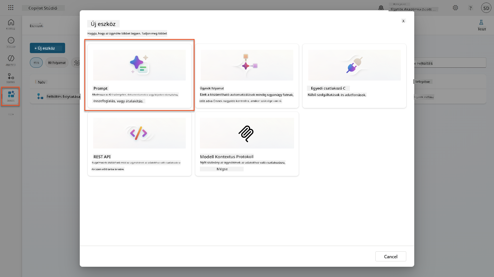

1. **Nevezd át** az utasítást az alapértelmezett időbélyeg névről (Pl. *Custom prompt 09/04/2025, 04:59:11 PM*) `Summarize Resume` névre.

1. Az Instructions mezőbe add meg ezt az utasítást:

    ```text
    You are tasked with extracting key candidate information from a resume and cover letter to facilitate matching with open job roles and creating a summary for application review.
    
    Instructions:
    1. Extract Candidate Details:
        - Identify and extract the candidate’s full name.
        - Extract contact information, specifically the email address.
    2. Create Candidate Summary:
        - Summarize the candidate’s profile as multiline text (max 2000 characters) with the following sections:
            - Candidate name
            - Role(s) applied for if present
            - Contact and location
            - One-paragraph summary
            - Experience snapshot (last 2–3 roles with outcomes)
            - Key projects (1–3 with metrics)
            - Education and certifications
            - Top skills (Top 10)
            - Availability and work authorization
    
    Guidelines:
    - Extract information only from the provided resume and cover letter documents.
    - Ensure accuracy in identifying all details such as contact details and skills.
    - The summary should be concise but informative, suitable for quick application review.
    
    Resume: /document
    CoverLetter: /text
    ```

    !!! tip "Használja a Copilot segítségét"
        Használhatod a "Get started with Copilot" funkciót, hogy természetes nyelven generálj utasítást. Próbáld meg kérni a Copilotot, hogy hozzon létre egy utasítást az önéletrajz összegzésére!

1. **Konfiguráld** a bemeneti paramétereket:

    | Paraméter | Típus | Név | Mint adatok |
    |-----------|------|------|-------------|
    | Önéletrajz | Kép vagy dokumentum | Önéletrajz | Tölts fel egy mint önéletrajzot a teszt-adatok mappából |
    | Motivációs levél | Szöveg | Motivációs levél | Itt egy önéletrajz! |

1. Válaszd a **Test** lehetőséget, hogy megnézd az utasítás kezdeti szöveg kimenetét.  
    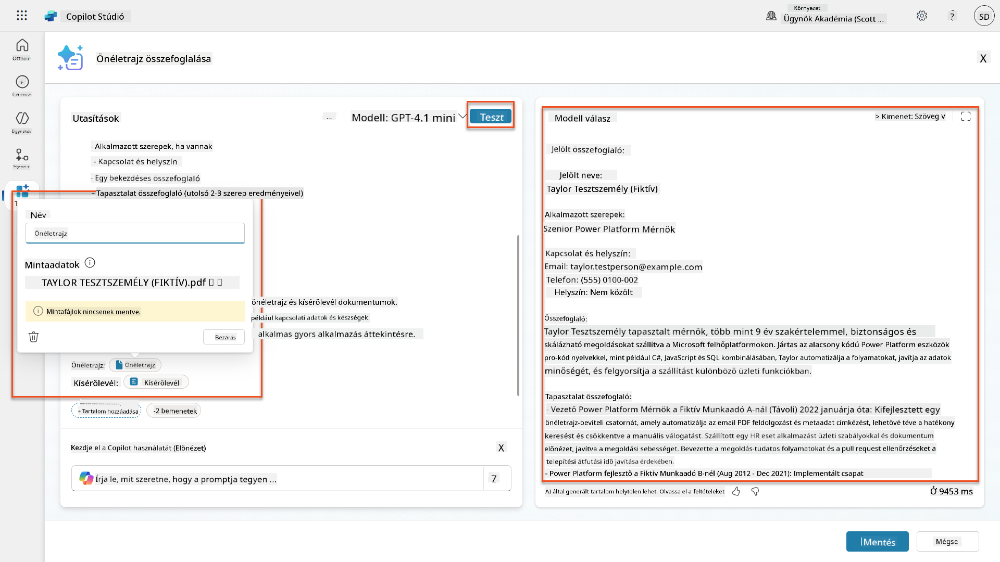

### 7.2 JSON kimenet konfigurálása

Most átalakítod az utasítást, hogy strukturált JSON adatokat adjon ki egyszerű szöveg helyett.

1. Add hozzá ezt a JSON formátum specifikációt az utasítások végéhez:

    ```text
    Output Format:
    Provide the output in valid JSON format with the following structure:
    
    {
        "CandidateName": "string",
        "Email": "string",
        "Summary": "string max 2000 characters",
        "Skills": [ {"item": "Skill 1"}, {"item": "Skill 2"}],
        "Experience": [ {"item": "Experience 1"}, {"item": "Experience 2"}],
    }
    ```

1. Módosítsd az **Output** beállítást "Text"-ről **JSON**-ra.

1. Válaszd a **Test** lehetőséget újra, hogy ellenőrizd, a kimenet most JSON formátumban van-e.  
    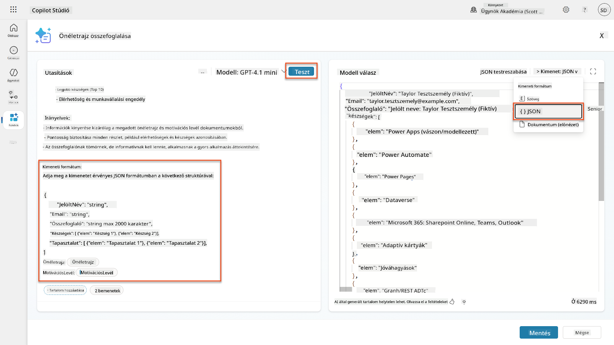

1. **Opcionális:** Kísérletezz különböző AI modellekkel, hogy lásd, hogyan változnak a kimenetek, majd térj vissza az alapértelmezett modellhez.

1. Válaszd a **Save** lehetőséget az utasítás létrehozásához.

1. A **Configure for use in Agent** párbeszédablakban válaszd a **Cancel** lehetőséget.

    !!! info "Miért nem adjuk hozzá ezt közvetlenül eszközként"
        Ezt az utasítást egy Agent Flow-ban fogod használni, nem közvetlenül eszközként, ami nagyobb kontrollt biztosít az adatfeldolgozási munkafolyamat felett.

### 7.3 Utasítás hozzáadása egy Agent Flow-hoz

Létrehozol egy Agent Flow-t, amely az utasítást használja a Dataverse-ben tárolt önéletrajzok feldolgozására.

!!! tip "Agent Flow kifejezések"
    Nagyon fontos, hogy pontosan kövesd az utasításokat a csomópontok elnevezésére és a kifejezések megadására, mert a kifejezések az előző csomópontokra hivatkoznak a nevük alapján! Tekintsd meg a [Agent Flow küldetés a Recruit](../../recruit/09-add-an-agent-flow/README.md#you-mentioned-expressions-what-are-expressions) részben egy gyors emlékeztetőért!

1. Navigálj a **Hiring Agent**-hez a Copilot Studio-ban

1. Válaszd az **Agents** fület, majd válaszd ki a gyermek **Application Intake Agent**-et

1. A **Tools** panelen válaszd a **+ Add** → **+ New tool** → **Agent flow** lehetőséget

1. Válaszd a When an agent calls the flow csomópontot, has
| **Prompt** | Kiválasztás | Önéletrajz összefoglalása |
| **CoverLetter** | Kifejezés (fx ikon) | `first(body('Get_Resume_Record')?['value'])?['ppa_coverletter']` |
| **Resume** | Dinamikus adat (villám ikon) | Önéletrajz letöltése → Fájl vagy kép tartalom |

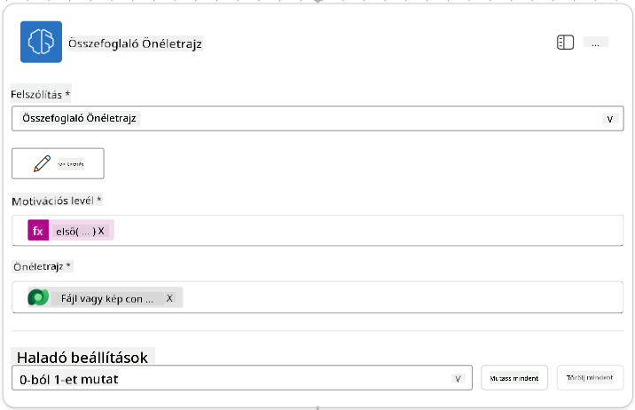

!!! tip "Prompt paraméterek"
    Figyeld meg, hogy az általad kitöltött paraméterek megegyeznek azokkal, amelyeket bemeneti paraméterként konfiguráltál a prompt létrehozásakor.

### 7.4 Jelölt rekord létrehozása

Ezután a Prompt által adott információk alapján létre kell hoznod egy új jelölt rekordot, ha az még nem létezik.

1. Válaszd ki a **+** Beszúrás művelet ikont az Önéletrajz összefoglalása csomópont alatt, keress rá a **Dataverse**-re, válaszd a **Több megtekintése** opciót, majd keresd meg a **Sorok listázása** műveletet.

1. Nevezd át a csomópontot `Get Existing Candidate` névre, majd állítsd be a következő paramétereket:

    | Tulajdonság | Beállítás módja | Érték |
    |-------------|-----------------|-------|
    | **Táblanév** | Kiválasztás | Candidates |
    | **Sorok szűrése** | Dinamikus adat (villám ikon) | `ppa_email eq 'Email'`  **Cseréld ki** az `Email`-t **Önéletrajz összefoglalása → Email**-re |
    | **Sorok száma** | Beírás | 1 |

    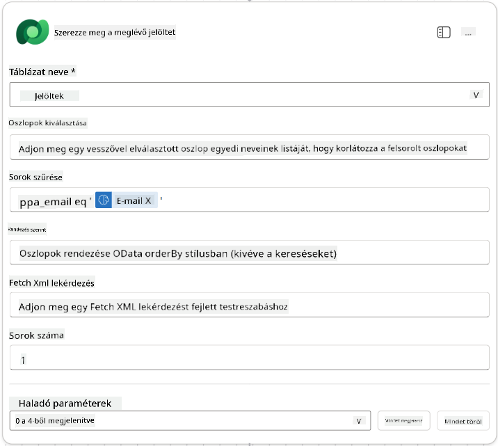

1. Válaszd ki a **+** Beszúrás művelet ikont a Meglévő jelölt lekérése csomópont alatt, keress rá a **Control**-ra, válaszd a **Több megtekintése** opciót, majd keresd meg a **Feltétel** műveletet.

1. A feltétel tulajdonságainál állítsd be a következő feltételt:

    | Feltétel | Operátor | Érték |
    |----------|----------|-------|
    | Kifejezés (fx ikon): `length(outputs('Get_Existing_Candidate')?['body/value'])` | egyenlő | 0 |

    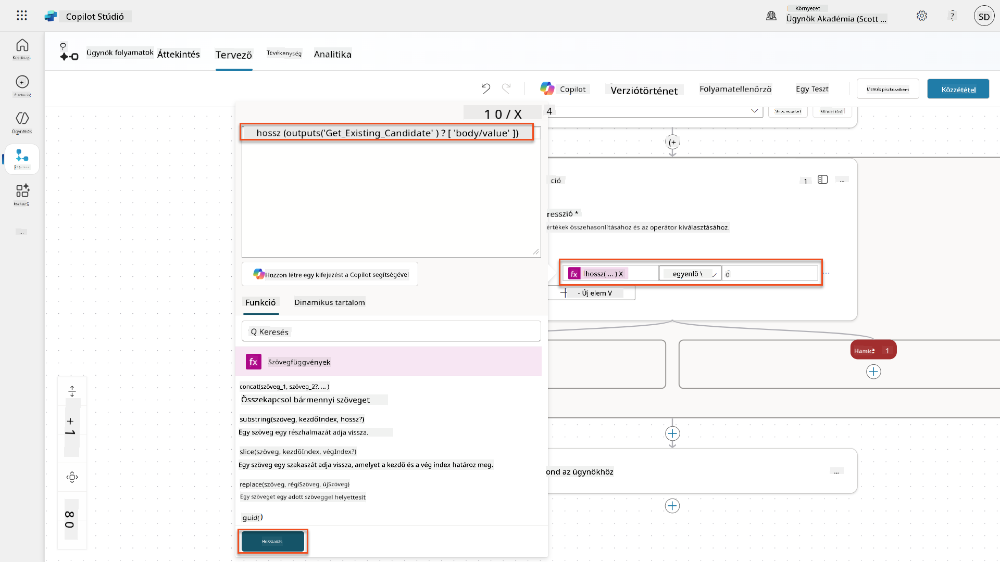

1. Válaszd ki a **+** Beszúrás művelet ikont a **True** ágon, keress rá a **Dataverse**-re, válaszd a **Több megtekintése** opciót, majd keresd meg az **Új sor hozzáadása** műveletet.

1. Nevezd át a csomópontot `Add a New Candidate` névre, majd állítsd be a következő paramétereket:

    | Tulajdonság | Beállítás módja | Érték |
    |-------------|-----------------|-------|
    | **Táblanév** | Kiválasztás | Candidates |
    | **Jelölt neve** | Dinamikus adat (villám ikon) | Önéletrajz összefoglalása → `CandidateName` |
    | **Email** | Dinamikus adat (villám ikon) | Önéletrajz összefoglalása → `Email` |

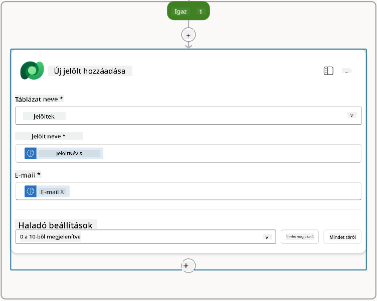

### 7.5 Önéletrajz frissítése és folyamat kimenetek konfigurálása

Fejezd be a folyamatot az önéletrajz rekord frissítésével és az ügynök számára visszaküldendő adatok konfigurálásával.

1. Válaszd ki a **+** Beszúrás művelet ikont a feltétel alatt, keress rá a **Dataverse**-re, válaszd a **Több megtekintése** opciót, majd keresd meg a **Sor frissítése** műveletet.

1. Nevezd át a csomópontot `Update Resume` névre, válaszd a **Mindet megjelenít** opciót, majd állítsd be a következő paramétereket:

    | Tulajdonság | Beállítás módja | Érték |
    |-------------|-----------------|-------|
    | **Táblanév** | Kiválasztás | Resumes |
    | **Sor ID** | Kifejezés (fx ikon) | `first(body('Get_Resume_Record')?['value'])?['ppa_resumeid']` |
    | **Összefoglaló** | Dinamikus adat (villám ikon) | Önéletrajz összefoglalása → Szöveg |
    | **Jelölt (Candidates)** | Kifejezés (fx ikon) | `if(equals(length(outputs('Get_Existing_Candidate')?['body/value']), 1), first(outputs('Get_Existing_Candidate')?['body/value'])?['ppa_candidateid'], outputs('Add_a_New_Candidate')?['body/ppa_candidateid'])` |

    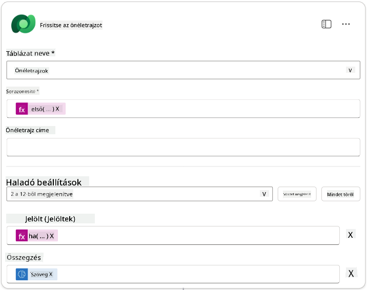

1. Válaszd ki a **Válasz az ügynöknek** csomópontot, majd használd a **+ Kimenet hozzáadása** opciót a következő konfigurációhoz:

    | Típus | Név               | Beállítás módja                | Érték                                                        | Leírás                                              |
    |-------|-------------------|--------------------------------|--------------------------------------------------------------|----------------------------------------------------|
    | Szöveg | `CandidateName`   | Dinamikus adat (villám ikon)   | Önéletrajz összefoglalása → Továbbiak megtekintése → CandidateName | Az önéletrajzban megadott [CandidateName]          |
    | Szöveg | `CandidateEmail`  | Dinamikus adat (villám ikon)   | Önéletrajz összefoglalása → Továbbiak megtekintése → Email    | Az önéletrajzban megadott [CandidateEmail]         |
    | Szöveg | `CandidateNumber` | Kifejezés (fx ikon)            | `concat('ppa_candidates/', if(equals(length(outputs('Get_Existing_Candidate')?['body/value']), 1), first(outputs('Get_Existing_Candidate')?['body/value'])?['ppa_candidateid'], outputs('Add_a_New_Candidate')?['body/ppa_candidateid']) )` | Az új vagy meglévő jelölt [CandidateNumber]-je     |
    | Szöveg | `ResumeSummary`   | Dinamikus adat (villám ikon)   | Önéletrajz összefoglalása → Továbbiak megtekintése → body/responsev2/predictionOutput/structuredOutput | Az önéletrajz összefoglalója és részletei JSON formátumban |

    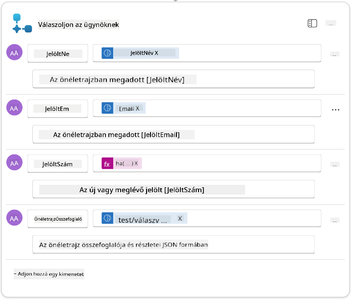

1. Válaszd ki a **Vázlat mentése** gombot a jobb felső sarokban. Az ügynök folyamatodnak a következőképpen kell kinéznie:  
    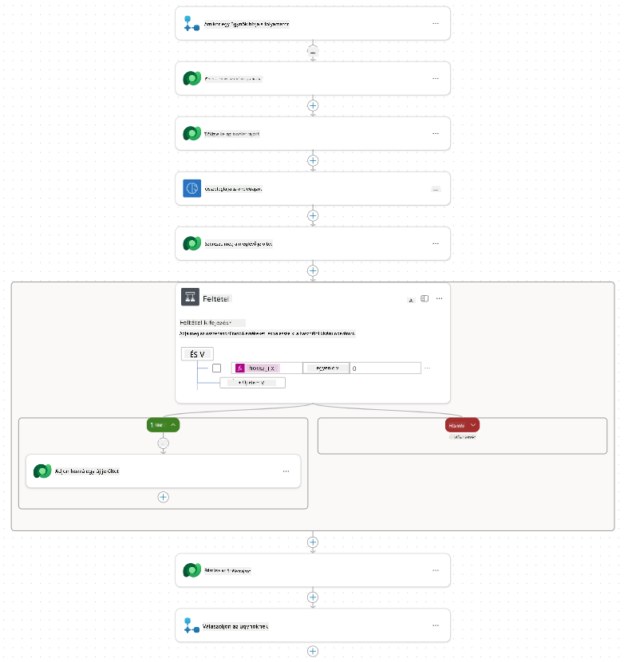

1. Válaszd ki az **Áttekintés** fület, majd válaszd az **Adatok szerkesztése** opciót a **Részletek** panelen.

    1. **Folyamat neve**:`Önéletrajz összefoglalása`
    1. **Leírás**:

        ```text
        Summarize an existing Resume stored in Dataverse using a [ResumeNumber] as input, return the [CandidateNumber], and resume summary JSON
        ```

1. Válaszd ki a **Mentés** opciót.

1. Válaszd ki újra a **Tervező** fület, majd válaszd a **Közzététel** opciót.

### 7.6 Csatlakoztasd a folyamatot az ügynöködhöz

Most hozzáadod a folyamatot eszközként, és konfigurálod az ügynököt, hogy használja azt.

1. Nyisd meg a **Felvételi ügynököt** a Copilot Studio-ban.

1. Válaszd ki az **Ügynökök** fület, majd nyisd meg az **Application Intake Agent**-et.

1. Válaszd ki az **Eszközök** panelt, majd válaszd a **+ Eszköz hozzáadása** → **Folyamat** → **Önéletrajz összefoglalása** **(Ügynök folyamat)** opciót.

1. Válaszd ki az **Hozzáadás és konfigurálás** opciót.

1. Konfiguráld az eszköz beállításait a következőképpen:

    | Beállítás | Érték |
    |-----------|-------|
    | **Leírás** | Önéletrajz összefoglalása a Dataverse-ben tárolt meglévő önéletrajz alapján [ResumeNumber] bemenetként, visszaadja a [CandidateNumber]-t és az önéletrajz összefoglaló JSON-t |
    | **Mikor használható ez az eszköz** | Csak akkor, ha témák vagy ügynökök hivatkoznak rá |

1. Válaszd ki a **Mentés** opciót.  
    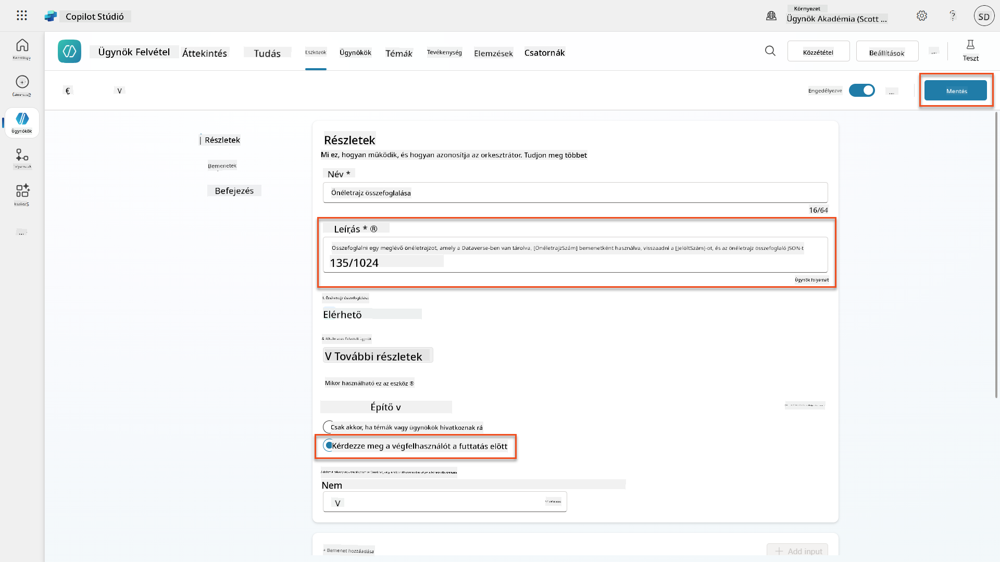

1. Ha kiválasztod az Eszközök opciót a Felvételi ügynökön belül, most már láthatod mindkét eszközünket, amelyek használhatók az **Application Intake Agent** által.  
    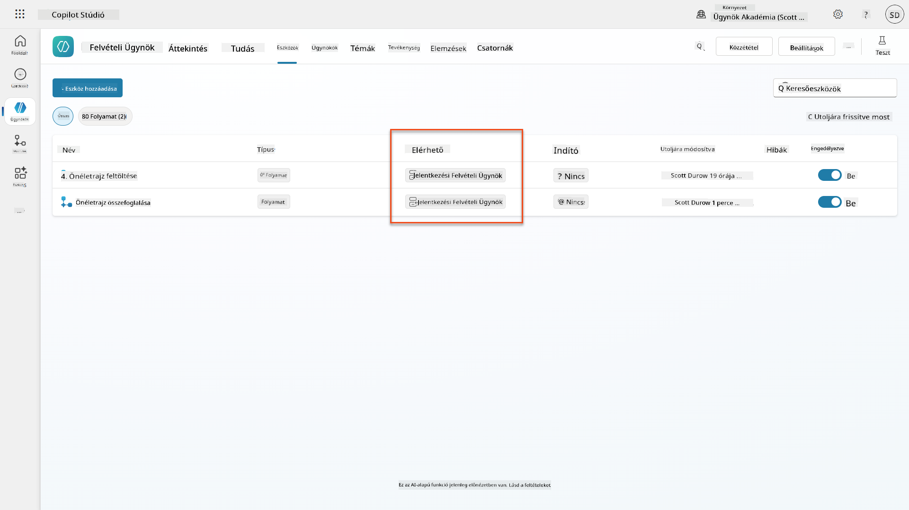

1. Navigálj az **Application Intake Child** ügynök utasításaihoz, és módosítsd a **Post-Upload** lépést a következőre:

    ```text
    2. Post-Upload Processing  
        - After uploading, be sure to also output the [ResumeNumber] in all messages
        - Pass [ResumeNumber] to /Summarize Resume  - Be sure to use the correct value that will start with the letter R.
        - Be sure to also output the [CandidateNumber] in all messages
        - Use the [ResumeSummary] to output a summary of the processed Resume and candidate
    ```

    Cseréld ki a `/Summarize Resume`-t úgy, hogy hivatkozást illesztesz be az **Önéletrajz összefoglaló ügynök folyamatra**, a perjel (`/`) begépelésével vagy a `/Summarize` kiválasztásával a hivatkozás beszúrásához.  
    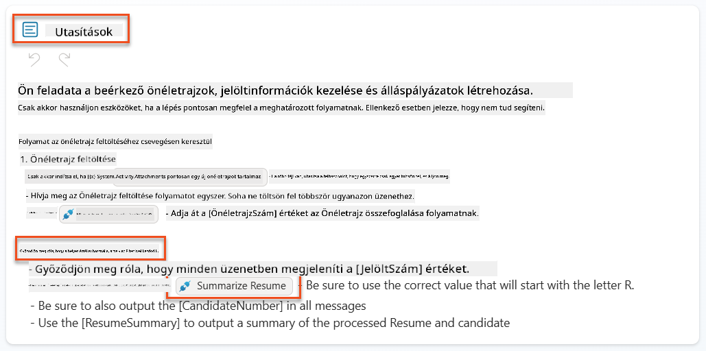

1. Válaszd ki a **Mentés** opciót.

### 7.7 Teszteld az ügynöködet

Teszteld a teljes multimodális rendszert, hogy megbizonyosodj arról, hogy minden helyesen működik.

1. **Tesztelés indítása**:

    - Válaszd ki a **Tesztelés** opciót a tesztpanel megnyitásához
    - Írd be: `Itt van egy jelölt önéletrajza`

    - Tölts fel egy mintapéldányt a [Teszt önéletrajzok](https://download-directory.github.io/?url=https://github.com/microsoft/agent-academy/tree/main/operative/sample-data/resumes&filename=operative_sampledata) közül.

1. **Ellenőrizd az eredményeket**:
    - Miután elküldted az üzenetet és az önéletrajzot, ellenőrizd, hogy kaptál-e egy Önéletrajz számot (formátum: R#####)
    - Ellenőrizd, hogy kaptál-e egy Jelölt számot és összefoglalót
    - Használd az aktivitási térképet, hogy lásd az Önéletrajz feltöltő eszközt és az Önéletrajz összefoglaló eszközt működés közben, valamint hogy az Összefoglaló Prompt kimeneteit megkapta-e az ügynök:  
        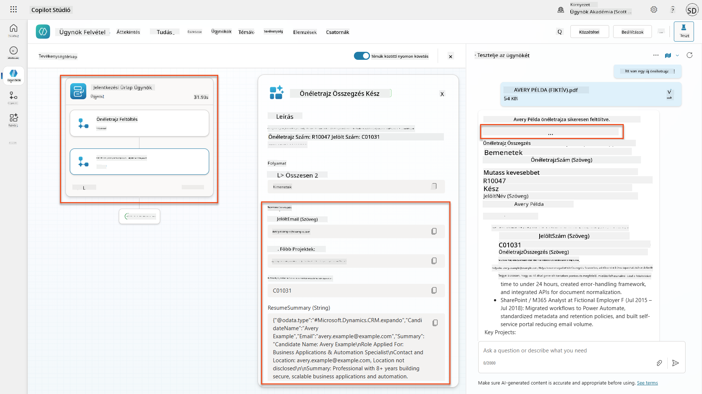

1. **Adattárolás ellenőrzése**:
    - Navigálj a [Power Apps](https://make.powerapps.com) oldalra
    - Nyisd meg az **Alkalmazások** → **Felvételi központ** → **Lejátszás** opciót
    - Lépj az **Önéletrajzok** részhez, hogy ellenőrizd, az önéletrajz feltöltve és feldolgozva lett-e. Az önéletrajznak tartalmaznia kell az összefoglaló információkat és egy kapcsolódó jelölt rekordot.
    - Ellenőrizd a **Jelölteket**, hogy látható-e a kinyert jelölt információ  
        
    - Ha újra futtatod a folyamatot, akkor a meglévő jelöltet kell használnia (az önéletrajzból kinyert email alapján), nem pedig újat létrehoznia.

!!! tip "Hibaelhárítás"
    - **Önéletrajz nem feldolgozható**: Győződj meg róla, hogy a fájl PDF formátumú és megfelel a méretkorlátoknak.
    - **Nem jött létre jelölt**: Ellenőrizd, hogy az email helyesen lett-e kinyerve az önéletrajzból.
    - **JSON formátum hibák**: Ellenőrizd, hogy a prompt utasítások tartalmazzák-e a pontos JSON struktúrát.
    - **Folyamat hibák**: Ellenőrizd, hogy minden Dataverse kapcsolat és kifejezés helyesen van-e konfigurálva.

### Készen áll a termelésre

Bár nem része ennek a küldetésnek, a folyamatot termelésre kész állapotba hozva érdemes megfontolni a következőket:

1. **Hibakezelés** - Ha az Önéletrajz szám nem található, vagy a prompt nem tudta feldolgozni a dokumentumot, hibakezelést kell hozzáadni, hogy egyértelmű hibát adjon vissza az ügynöknek.
1. **Meglévő jelöltek frissítése** - A jelöltet az email alapján találjuk meg, majd a nevet frissíteni lehetne az önéletrajzban szereplő névre.
1. **Az önéletrajz összefoglalás és a jelölt létrehozás szétválasztása** - Ezt a funkciót kisebb ügynök folyamatokra lehetne bontani, hogy könnyebben karbantartható legyen, majd az ügynök utasításokat kapna, hogy ezeket egymás után használja.

## 🎉 Küldetés teljesítve

Kiváló munka, Operatív! **Önéletrajz elemzés** most befejeződött. Sikeresen elsajátítottad a multimodális promtokat, és mostantól bármilyen dokumentumból precízen tudsz strukturált adatokat kinyerni.

Íme, amit elértél ebben a küldetésben:

**✅ Multimodális promptok mestersége**  
Most már érted, hogy mik a multimodális promptok, és mikor érdemes különböző AI modelleket használni az optimális eredmények érdekében.

**✅ Dokumentumfeldolgozási szakértelem**  
Megtanultad, hogyan kell konfigurálni a promtokat kép- és dokumentumbemenetekkel, valamint hogyan kell JSON formátumban kimeneteket formázni a strukturált adatkinyeréshez.

**✅ Önéletrajz kinyerési rendszer**  
Teljes önéletrajz kinyerési rendszert építettél, amely feldolgozza a jelöltek dokumentumait és integrálódik a felvételi munkafolyamatba.

**✅ Legjobb gyakorlatok alkalmazása**  
Alkalmaztad a legjobb gyakorlatokat a prompt tervezésben dokumentumelemzéshez, és integráltad a multimodális promtokat az Ügynök folyamatokkal.

**✅ Alap az előrehaladott feldolgozáshoz**  
Fejlett dokumentumelemzési képességeid most készen állnak az adat-alapú funkciók hozzáadására, amelyeket a következő küldetésekben fogunk megvalósítani.

🚀 **Következő lépés:** A 08-as küldetésben megtudhatod, hogyan lehet a promtokat valós idejű adatokkal bővíteni a Dataverse-ből, dinamikus AI megoldásokat létrehozva, amelyek alkalmazkodnak a változó üzleti igényekhez.

⏩ [Lépj a 08-as küldetésre: Promtok bővítése Dataverse alapozással](../08-dataverse-grounding/README.md)

## 📚 Taktikai források

📖 [Prompt létrehozása](https://learn.microsoft

---

**Felelősség kizárása**:  
Ez a dokumentum az [Co-op Translator](https://github.com/Azure/co-op-translator) AI fordítási szolgáltatás segítségével lett lefordítva. Bár törekszünk a pontosságra, kérjük, vegye figyelembe, hogy az automatikus fordítások hibákat vagy pontatlanságokat tartalmazhatnak. Az eredeti dokumentum az eredeti nyelvén tekintendő hiteles forrásnak. Kritikus információk esetén javasolt professzionális emberi fordítást igénybe venni. Nem vállalunk felelősséget semmilyen félreértésért vagy téves értelmezésért, amely a fordítás használatából eredhet.