<!--
CO_OP_TRANSLATOR_METADATA:
{
  "original_hash": "750f3ea8a94930439ebd8a10871b1d73",
  "translation_date": "2025-10-20T17:54:00+00:00",
  "source_file": "docs/operative-preview/08-dataverse-grounding/README.md",
  "language_code": "hu"
}
-->
# 🚨 Küldetés 08: Fejlettebb promptok Dataverse alapozással

--8<-- "disclaimer.md"

## 🕵️‍♂️ KÓDNEV: `OPERATION GROUNDING CONTROL`

> **⏱️ Műveleti időkeret:** `~60 perc`

## 🎯 Küldetés összefoglaló

Üdv újra, Operatív! A többügynökös toborzási rendszered működik, de van egy kritikus fejlesztés, amelyre szükség van a **adat alapozás** érdekében - az AI modelljeidnek valós idejű hozzáférésre van szükségük a szervezeted strukturált adataihoz, hogy intelligens döntéseket hozhassanak.

Jelenleg az Önéletrajz Összegzés prompt statikus tudással működik. De mi lenne, ha dinamikusan hozzáférhetne az állásleírások adatbázisához, hogy pontos, naprakész egyezéseket biztosítson? Mi lenne, ha megértené az értékelési kritériumokat anélkül, hogy azokat kézzel kellene kódolni?

Ebben a küldetésben fejleszteni fogod az egyedi promptodat **Dataverse alapozással** - közvetlenül élő adatforrásokhoz kapcsolva a promptokat. Ez átalakítja az ügynökeidet statikus válaszadókból dinamikus, adatvezérelt rendszerekké, amelyek alkalmazkodnak a változó üzleti igényekhez.

A küldetésed: integráld a valós idejű állásleírás és értékelési kritérium adatokat az önéletrajz elemzési munkafolyamatodba, létrehozva egy önfrissítő rendszert, amely mindig naprakész marad a szervezeted toborzási követelményeivel.

## 🔎 Célkitűzések

Ebben a küldetésben megtanulod:

1. Hogyan javítja a **Dataverse alapozás** az egyedi promptokat
1. Mikor érdemes adat alapozást használni statikus utasítások helyett
1. Hogyan tervezzünk promptokat, amelyek dinamikusan beépítik az élő adatokat
1. Hogyan fejleszthető az Önéletrajz Összegzés folyamat állásleírás egyeztetéssel

## 🧠 A Dataverse alapozás megértése a promptokhoz

A **Dataverse alapozás** lehetővé teszi, hogy az egyedi promptok élő adatokat érjenek el a Dataverse táblákból a kérések feldolgozása során. A statikus utasítások helyett a promptok valós idejű információkat építhetnek be, hogy megalapozott döntéseket hozzanak.

### Miért fontos a Dataverse alapozás?

A hagyományos promptok fix utasításokkal működnek:

```text
Match this candidate to these job roles: Developer, Manager, Analyst
```

A Dataverse alapozással a prompt hozzáfér az aktuális adatokhoz:

```text
Match this candidate to available job roles from the Job Roles table, 
considering current evaluation criteria and requirements
```

Ez a megközelítés számos kulcsfontosságú előnyt kínál:

- **Dinamikus frissítések:** Az állásleírások és kritériumok módosítása prompt változtatás nélkül
- **Konzisztencia:** Minden ügynök ugyanazokat az aktuális adatforrásokat használja
- **Skálázhatóság:** Új szerepkörök és kritériumok automatikusan elérhetők
- **Pontosság:** A valós idejű adatok biztosítják, hogy a döntések tükrözzék az aktuális igényeket

### Hogyan működik a Dataverse alapozás?

Amikor engedélyezed a Dataverse alapozást egy egyedi prompthoz:

1. **Adat kiválasztása:** Válassz ki konkrét Dataverse táblákat és oszlopokat. Kiválaszthatsz kapcsolódó táblákat is, amelyeket a rendszer a lekért szülő rekordok alapján szűr.
1. **Kontekstszerkesztés:** A prompt automatikusan beépíti a lekért adatokat a kontextusba.
1. **Intelligens szűrés:** A rendszer csak a jelenlegi kéréshez releváns adatokat tartalmazza, ha megadod a szűrést.
1. **Strukturált kimenet:** A prompt hivatkozhat a lekért adatokra, és azokat felhasználva hozhat létre kimenetet.

### Statikusból dinamikusba: Az alapozás előnyei

Vizsgáljuk meg a jelenlegi Önéletrajz Összegzés folyamatot a 07-es küldetésből, és nézzük meg, hogyan alakítja át a Dataverse alapozás statikusból dinamikus intelligenciává.

**Jelenlegi statikus megközelítés:**
A meglévő promptod előre kódolt értékelési kritériumokat és előre meghatározott egyeztetési logikát tartalmazott. Ez a megközelítés működik, de manuális frissítéseket igényel, amikor új állásleírásokat adsz hozzá, megváltoztatod az értékelési kritériumokat, vagy módosítod a vállalati prioritásokat.

**Dataverse alapozás átalakulás:**
A Dataverse alapozás hozzáadásával az Önéletrajz Összegzés folyamat:

- **Hozzáfér az aktuális állásleírásokhoz** a Job Roles táblából
- **Élő értékelési kritériumokat használ** a statikus leírások helyett  
- **Pontos egyezéseket biztosít** a valós idejű követelmények alapján

## 🎯 Miért dedikált promptok az ügynök beszélgetések helyett?

A 02-es küldetésben megtapasztaltad, hogyan tudta az Interjú Ügynök egyeztetni a jelölteket az állásleírásokkal, de összetett felhasználói promptokat igényelt, mint például:

```text
Upload this resume, then show me open job roles,
each with a description of the evaluation criteria, 
then use this to match the resume to at least one suitable
job role even if not a perfect match.
```

Bár ez működött, a dedikált promptok Dataverse alapozással jelentős előnyöket kínálnak konkrét feladatokhoz:

### A dedikált promptok kulcsfontosságú előnyei

| Szempont | Ügynök beszélgetések | Dedikált promptok |
|--------|-------------------|------------------|
| **Konzisztencia** | Az eredmények változhatnak a felhasználó prompt készítési képességei alapján | Minden alkalommal szabványosított feldolgozás |
| **Specializáció** | Az általános célú érvelés figyelmen kívül hagyhatja az üzleti árnyalatokat | Célzott, optimalizált üzleti logikával |
| **Automatizálás** | Emberi interakciót és értelmezést igényel | Automatikusan indul strukturált JSON kimenettel |

## 🧪 Labor 8: Adj hozzá Dataverse alapozást a promptokhoz

Ideje fejleszteni az önéletrajz elemzési képességeidet! Fejleszteni fogod a meglévő Önéletrajz Összegzés folyamatot dinamikus állásleírás egyeztetéssel.

### Előfeltételek a küldetés teljesítéséhez

1. Szükséged lesz **vagy**:

    - **Teljesítened a 07-es küldetést**, és készen kell lennie az önéletrajz elemzési rendszerednek, **VAGY**
    - **Importálnod a 08-as küldetés kezdő megoldását**, ha újrakezdenéd vagy utolérnéd magad. [Töltsd le a 08-as küldetés kezdő megoldását](https://aka.ms/agent-academy)

1. Mintapéldány önéletrajz dokumentumok a [teszt önéletrajzok](https://download-directory.github.io/?url=https://github.com/microsoft/agent-academy/tree/main/operative/sample-data/resumes&filename=operative_sampledata) oldalról

!!! note "Megoldás importálása és mintapéldány adatok"
    Ha a kezdő megoldást használod, tekintsd meg a [01-es küldetést](../01-get-started/README.md) részletes útmutatóért arról, hogyan importálj megoldásokat és mintapéldány adatokat a környezetedbe.

### 8.1 Adj hozzá Dataverse alapozást a promptodhoz

A 07-es küldetésben létrehozott Önéletrajz Összegzés promptot fogod továbbfejleszteni. Jelenleg egyszerűen összegzi az önéletrajzot, de most az állásleírásokkal fogod alapozni, ahogy azok jelenleg léteznek a Dataverse-ben, mindig naprakészen tartva.

Először vizsgáljuk meg a Dataverse táblákat, amelyeket alapozni fogsz:

1. **Navigálj** a [Power Apps](https://make.powerapps.com) oldalra, és válaszd ki a környezetedet a **Környezet váltó** segítségével a navigációs sáv jobb felső sarkában.

1. Válaszd ki a **Táblák** opciót, és keresd meg a **Job Roles** táblát.

1. Tekintsd át a kulcsfontosságú oszlopokat, amelyeket az alapozáshoz fogsz használni:

    | Oszlop | Cél |
    |--------|---------|
    | **Job Role Number** | Egyedi azonosító a szerepkör egyeztetéshez |
    | **Job Title** | Megjelenítési név a szerepkörhöz |
    | **Description** | Részletes szerepkör követelmények |

1. Hasonlóképpen tekintsd át a többi táblát, például az **Evaluation Criteria** táblát.

### 8.2 Adj hozzá Dataverse alapozási adatokat a promptodhoz

1. **Navigálj** a Copilot Studio-ba, és válaszd ki a környezetedet a **Környezet váltó** segítségével a navigációs sáv jobb felső sarkában.

1. Válaszd ki a **Tools** opciót a bal oldali navigációból.

1. Válaszd ki a **Prompt** opciót, és keresd meg a **Summarize Resume** promptot a 07-es küldetésből.  
    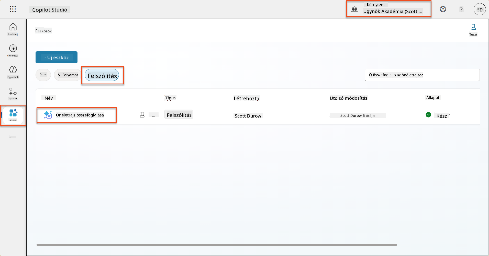

1. Válaszd ki a **Szerkesztés** opciót a prompt módosításához, és cseréld ki az alábbi fejlesztett verzióval:

    !!! important
        Győződj meg róla, hogy az Önéletrajz és Motivációs levél paraméterek érintetlenek maradnak paraméterként.

    ```text
    You are tasked with extracting key candidate information from a resume and cover letter to facilitate matching with open job roles and creating a summary for application review.
    
    ### Instructions:
    1. **Extract Candidate Details:**
       - Identify and extract the candidate's full name.
       - Extract contact information, specifically the email address.
    
    2. **Analyze Resume and Cover Letter:**
       - Review the resume content to identify relevant skills, experience, and qualifications.
       - Review the cover letter to understand the candidate's motivation and suitability for the roles.
    
    3. **Match Against Open Job Roles:**
       - Compare the extracted candidate information with the requirements and descriptions of the provided open job roles.
       - Use the job descriptions to assess potential fit.
       - Identify all roles that align with the candidate's cover letter and profile. You don't need to assess perfect suitability.
       - Provide reasoning for each match based on the specific job requirements.
    
    4. **Create Candidate Summary:**
       - Summarize the candidate's profile as multiline text with the following sections:
          - Candidate name
          - Role(s) applied for if present
          - Contact and location
          - One-paragraph summary
          - Top skills (8–10)
          - Experience snapshot (last 2–3 roles with outcomes)
          - Key projects (1–3 with metrics)
          - Education and certifications
          - Availability and work authorization
    
    ### Output Format
    
    Provide the output in valid JSON format with the following structure:
    
    {
      "CandidateName": "string",
      "Email": "string",
      "MatchedRoles": [
        {
          "JobRoleNumber": "ppa_jobrolenumber from grounded data",
          "RoleName": "ppa_jobtitle from grounded data",
          "Reasoning": "Detailed explanation based on job requirements"
        }
      ],
      "Summary": "string"
    }
    
    ### Guidelines
    
    - Extract information only from the provided resume and cover letter documents.
    - Ensure accuracy in identifying contact details.
    - Use the available job role data for matching decisions.
    - The summary should be concise but informative, suitable for quick application review.
    - If no suitable matches are found, indicate an empty list for MatchedRoles and explain briefly in the summary.
    
    ### Input Data
    Open Job Roles (ppa_jobrolenumber, ppa_jobtitle): /Job Role 
    Resume: {Resume}
    Cover Letter: {CoverLetter}
    ```

1. A prompt szerkesztőben cseréld ki a `/Job Role` részt úgy, hogy kiválasztod a **+ Add content** opciót, majd a **Dataverse** → **Job Role** lehetőséget, és válaszd ki a következő oszlopokat, majd kattints az **Add** gombra:

    1. **Job Role Number**

    1. **Job Title**

    1. **Description**

    !!! tip
        Az oszlopok kereséséhez beírhatod a tábla nevét.

1. A **Job Role** párbeszédablakban válaszd ki a **Filter** attribútumot, válaszd ki a **Status** opciót, majd írd be **Active**-t a **Filter** értékeként.  
    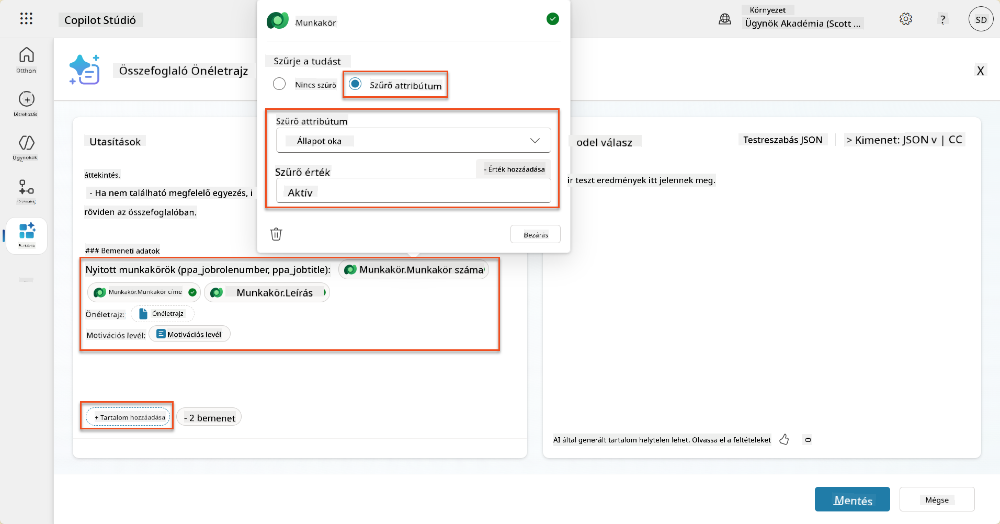

    !!! tip
        Itt használhatod az **Add value** opciót is, hogy bemeneti paramétert adj hozzá - például, ha van egy promptod, amely egy meglévő rekordot összegzi, megadhatod az Önéletrajz Számot paraméterként a szűréshez.

1. Ezután hozzáadod a kapcsolódó Dataverse táblát **Evaluation Criteria**, ismét kiválasztva a **+ Add content** opciót, megkeresve a **Job Roles** táblát, majd a Job Role oszlopok helyett kibővítve a **Job Role (Evaluation Criteria)** opciót, és kiválasztva a következő oszlopokat, majd kattintva az **Add** gombra:

    1. **Criteria Name**

    1. **Description**  
        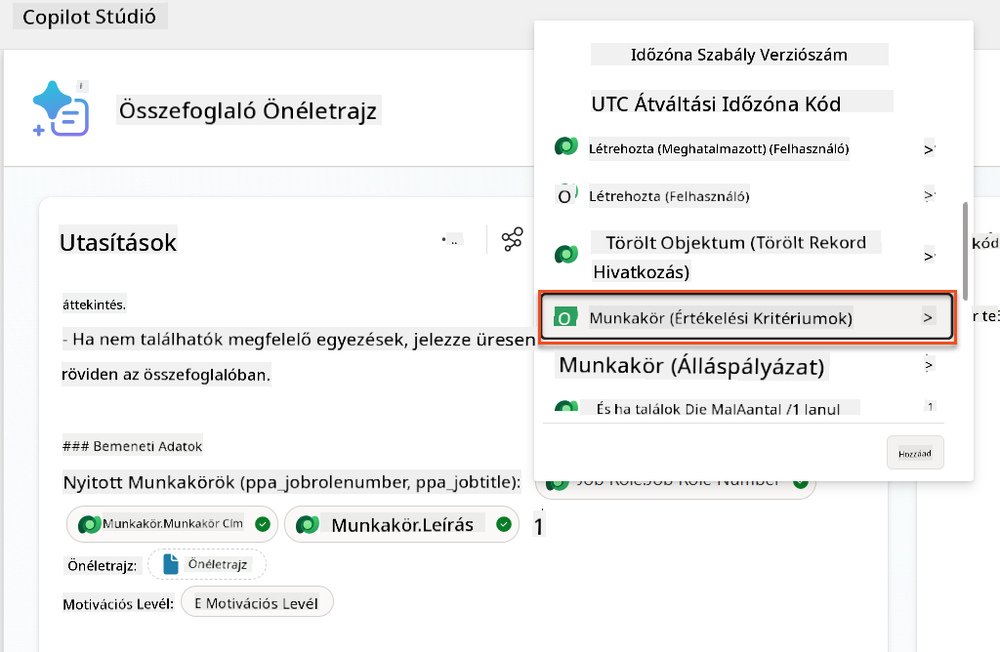

        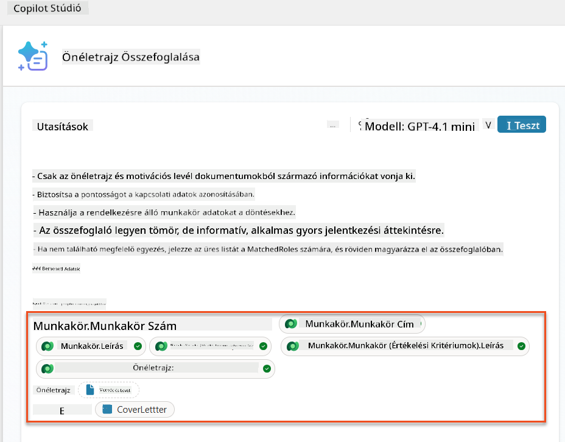

    !!! tip
        Fontos, hogy a kapcsolódó Értékelési Kritériumokat először a Job Role kiválasztásával, majd a menüben navigálva a Job Role (Evaluation Criteria) opcióhoz válaszd ki. Ez biztosítja, hogy csak a Job Role-hoz kapcsolódó rekordok kerüljenek betöltésre.

1. Válaszd ki a **Settings** opciót, és állítsd be a **Record retrieval** értékét 1000-re - ez lehetővé teszi, hogy a maximális Job Roles és Értékelési Kritériumok bekerüljenek a promptba.  
    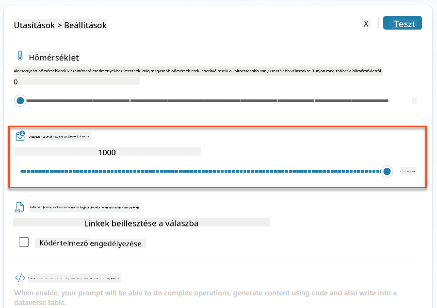

### 8.3 Teszteld a fejlesztett promptot

1. Válaszd ki az **Önéletrajz** paramétert, és tölts fel egy mintapéldány önéletrajzot, amelyet a 07-es küldetésben használtál.
1. Válaszd ki a **Test** opciót.
1. Miután a teszt lefutott, vedd észre, hogy a JSON kimenet most már tartalmazza a **Matched Roles** adatokat.
1. Válaszd ki a **Knowledge used** fület, hogy lásd a Dataverse adatokat, amelyek a prompttal egyesültek a végrehajtás előtt.
1. **Mentsd el** a frissített promptot. A rendszer most automatikusan tartalmazni fogja ezeket a Dataverse adatokat a promptoddal, amikor a meglévő Summarize Resume Agent Flow meghívja azt.  
    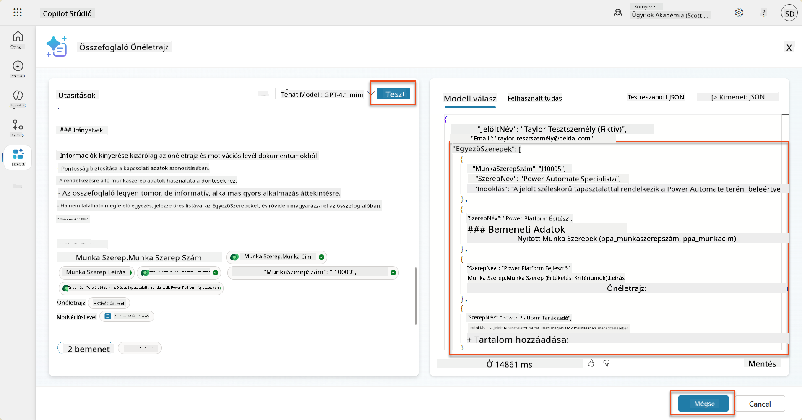

### 8.4 Adj hozzá Álláspályázati Ügynök Folyamatot

Ahhoz, hogy az Alkalmazás Felvételi Ügynök létrehozhassa az állásleírásokat a javasolt szerepkörök alapján, létre kell hoznunk egy Ügynök Folyamatot. Az ügynök minden egyes javasolt állásleírás esetében, amely a jelöltet érdekli, hívni fogja ezt az eszközt.

!!! tip "Ügynök Folyamat Kifejezések"
    Nagyon fontos, hogy pontosan kövesd az utasításokat a csomópontok elnevezésére és a kifejezések megadására, mert a kifejezések az előző csomópontokra hivatkoznak a nevük alapján! Tekintsd meg a [Ügynök Folyamat küldetést a Recruit](../../recruit/09-add-an-agent-flow/README.md#you-mentioned-expressions-what-are-expressions) részben egy gyors ismétlésért!

1. A **Toborzó Ügynök** belsejében válaszd ki az **Agents** fület, és nyisd meg az **Alkalmazás Felvételi Ügynök** gyermek ügynököt.

1. A **Tools** panelen válaszd ki a **+ Add** → **+ New tool** → **Agent Flow** opciót.

1. Válaszd ki a **When an agent calls the flow** csomópontot, használd a **+ Add an input** opciót, hogy hozzáadd a következő paramétereket:

    | Típus | Név            | Leírás                                                  |
    | ---- | --------------- | ------------------------------------------------------------ |
    | Szöveg | `ResumeNumber`  | Ügyelj arra, hogy csak a [ResumeNumber] -nek kell kezdődnie az R betűvel |
    | Szöveg | `JobRoleNumber` | Ügyelj arra, hogy csak a [JobRoleNumber] -nek kell kezdődnie az J betűvel |

    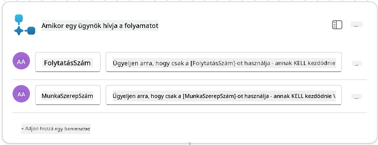

1. Válaszd ki a **+** Beszúrás ikon alatti első csomópontot, keresd meg a **Dataverse** opciót, válaszd ki a **See more** lehetőséget, majd keresd meg a **List rows** akciót.

1. **Nevezd át** a csomópontot `Get Resume` névre, majd állítsd be a következő paramétereket:

    | Tulajdonság        | Hogyan állítsd be                      | Érték                                                        |
    | --------------- | ------------------------------- | ------------------------------------------------------------ |
    | **Table name**  | Válassz                          | Resumes                                                      |
    |
| **Munkakör (Munkakörök)**               | Kifejezés (fx ikon) | `concat('ppa_jobroles/',first(outputs('Get_Job_Role')?['body/value'])?['ppa_jobroleid'])` |
| **Önéletrajz (Önéletrajzok)**           | Kifejezés (fx ikon) | `concat('ppa_resumes/', first(outputs('Get_Resume')?['body/value'])?['ppa_resumeid'])` |
| **Jelentkezési dátum** (használja a **Mindet megjelenít**) | Kifejezés (fx ikon) | `utcNow()`                                                   |

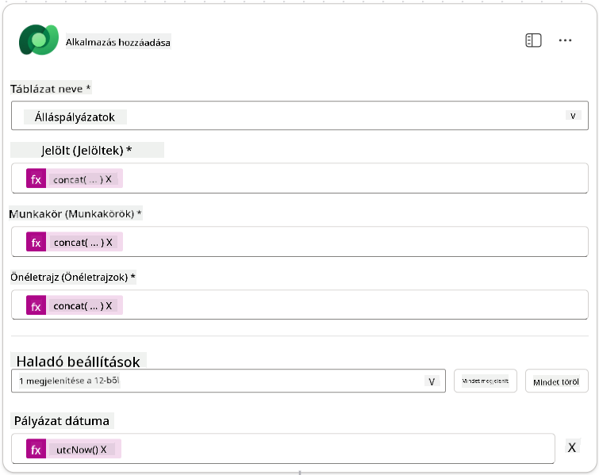

1. Válassza ki a **Válasz az ügynöknek** csomópontot, majd válassza a **+ Kimenet hozzáadása** lehetőséget.

     | Tulajdonság     | Beállítás módja                | Részletek                                      |
     | --------------- | ------------------------------ | ---------------------------------------------- |
     | **Típus**       | Kiválasztás                   | `Szöveg`                                      |
     | **Név**         | Beírás                        | `JelentkezésiSzám`                            |
     | **Érték**       | Dinamikus adat (villám ikon)  | *Jelentkezés hozzáadása → Továbbiak megtekintése → Jelentkezési szám* |
     | **Leírás**      | Beírás                        | `A létrehozott állásjelentkezés [JelentkezésiSzám]-a` |

     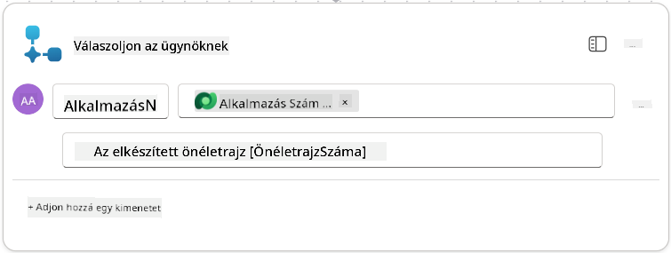

1. Válassza a **Vázlat mentése** lehetőséget a jobb felső sarokban.

1. Válassza az **Áttekintés** lapot, majd válassza a **Szerkesztés** lehetőséget a **Részletek** panelen.

      - **Folyamat neve**:`Állásjelentkezés létrehozása`
      - **Leírás**:`Új állásjelentkezést hoz létre, ha megadja az [ÖnéletrajzSzám]-ot és a [MunkakörSzám]-ot`
      - **Mentés**

1. Válassza újra a **Tervező** lapot, majd válassza a **Közzététel** lehetőséget.

### 8.5 Állásjelentkezés létrehozása hozzáadása az ügynökhöz

Most csatlakoztatja a közzétett folyamatot az Állásjelentkezési Ügynökhöz.

1. Navigáljon vissza a **Felvételi Ügynökhöz**, és válassza az **Ügynökök** lapot. Nyissa meg az **Állásjelentkezési Ügynököt**, majd keresse meg az **Eszközök** panelt.

1. Válassza a **+ Hozzáadás** lehetőséget.

1. Válassza a **Folyamat** szűrőt, és keressen rá a `Állásjelentkezés létrehozása` folyamatra. Válassza ki az **Állásjelentkezés létrehozása** folyamatot, majd válassza a **Hozzáadás és konfigurálás** lehetőséget.

1. Állítsa be a következő paramétereket:

    | Paraméter                                           | Érték                                                        |
    | --------------------------------------------------- | ------------------------------------------------------------ |
    | **Leírás**                                         | `Új állásjelentkezést hoz létre, ha megadja az [ÖnéletrajzSzám]-ot és a [MunkakörSzám]-ot` |
    | **További részletek → Mikor használható ez az eszköz** | `Csak témák vagy ügynökök által hivatkozva`                   |

1. Válassza a **Mentés** lehetőséget  
    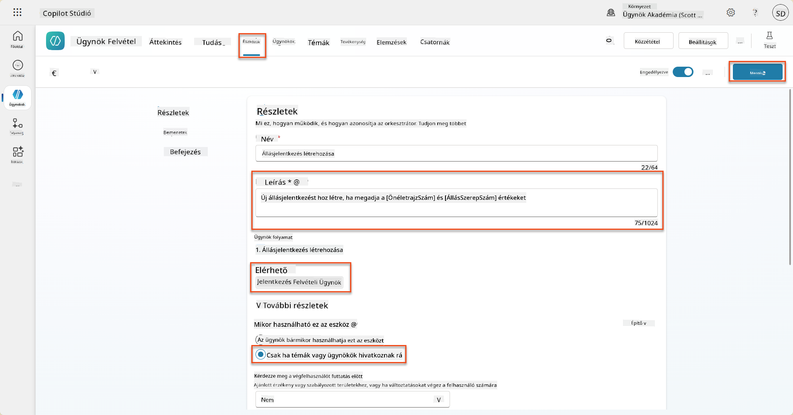

### 8.6 Ügynöki utasítások meghatározása

Az állásjelentkezések létrehozásához meg kell mondania az ügynöknek, mikor használja az új eszközt. Ebben az esetben megkérdezi a felhasználót, hogy mely javasolt munkakörökre szeretne jelentkezni, és utasítja az ügynököt, hogy futtassa az eszközt minden egyes munkakör esetében.

1. Lépjen vissza az **Állásjelentkezési Ügynök**-be, majd keresse meg az **Utasítások** panelt.

1. Az **Utasítások** mezőben **adja hozzá** a következő egyértelmű útmutatást a gyermek ügynökének az **aktuális utasítások végéhez**:

    ```text
    3. Post Resume Upload
       - Respond with a formatted bullet list of [SuggestedJobRoles] the candidate could apply for.  
       - Use the format: [JobRoleNumber] - [RoleDescription]
       - Ask the user to confirm which Job Roles to create applications for the candidate.
       - When the user has confirmed a set of [JobRoleNumber]s, move to the next step.
    
    4. Post Upload - Application Creation
        - After the user confirms which [SuggestedJobRoles] for a specific [ResumeNumber]:
        E.g. "Apply [ResumeNumber] for the Job Roles [JobRoleNumber], [JobRoleNumber], [JobRoleNumber]
        E.g. "apply to all suggested job roles" - this implies use all the [JobRoleNumbers] 
         - Loop over each [JobRoleNumber] and send with [ResumeNumber] to /Create Job Application   
         - Summarize the Job Applications Created
    
    Strict Rules (that must never be broken)
    You must always follow these rules and never break them:
    1. The only valid identifiers are:
      - ResumeNumber (ppa_resumenumber)→ format R#####
      - CandidateNumber (ppa_candidatenumber)→ format C#####
      - ApplicationNumber (ppa_applicationnumber)→ format A#####
      - JobRoleNumber (ppa_jobrolenumber)→ format J#####
    2. Never guess or invent these values.
    3. Always extract identifiers from the current context (conversation, data, or system output). 
    ```

1. Ahol az utasítások perjelet (/) tartalmaznak, válassza ki a perjel utáni szöveget, és válassza a **Állásjelentkezés létrehozása** eszközt.

1. Válassza a **Mentés** lehetőséget  
    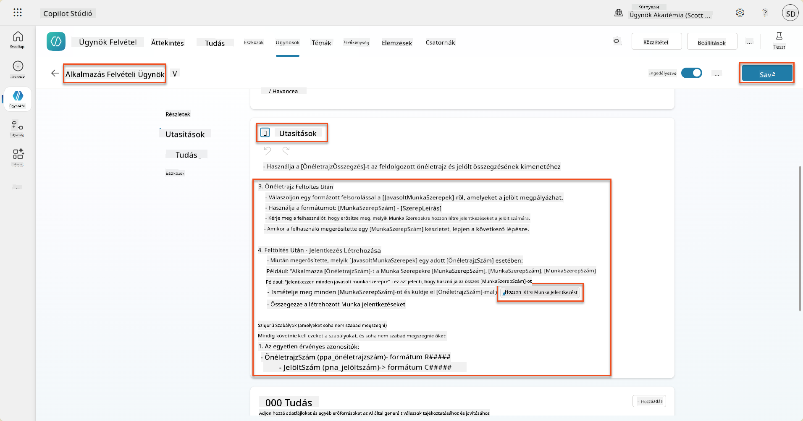

!!! tip "Több elem iterálása generatív orkestrációban"
    Ezek az utasítások a generatív orkestráció azon képességét használják, hogy több soron iteráljon, amikor döntéseket hoz arról, hogy mely lépéseket és eszközöket használja. A megfelelő munkakörök automatikusan beolvasásra kerülnek, és az Állásjelentkezési Ügynök minden sor esetében futni fog. Üdvözöljük a generatív orkestráció varázslatos világában!

### 8.7 Tesztelje az ügynökét

1. Nyissa meg a **Felvételi Ügynököt** a Copilot Studio-ban.

1. **Töltsön fel** egy mintapéldányt a csevegésbe, és írja be:

    ```text
    This is a new resume for the Power Platform Developer Role.
    ```

1. Figyelje meg, hogy az ügynök egy listát ad a javasolt munkakörökről - mindegyikhez egy Munkakör számmal.  
    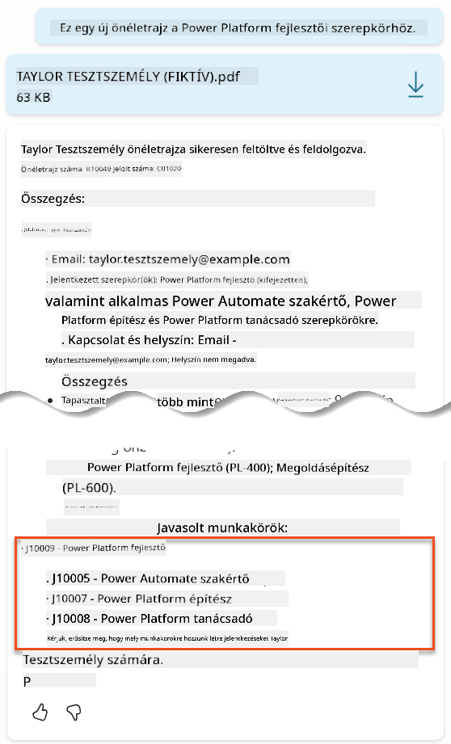

1. Ezután megadhatja, hogy melyekhez szeretné, hogy az Önéletrajz állásjelentkezésként hozzáadásra kerüljön.
    **Példák:**

    ```text
    "Apply for all of those job roles"
    "Apply for the J10009 Power Platform Developer role"
    "Apply for the Developer and Architect roles"
    ```

    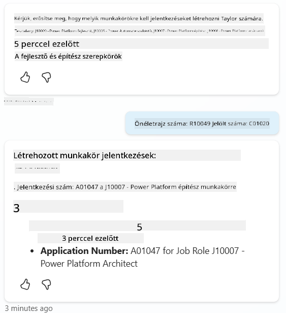

1. Az **Állásjelentkezés létrehozása eszköz** ezután minden megadott munkakör esetében futni fog. Az Aktivitási térképen láthatja, hogy az Állásjelentkezés létrehozása eszköz minden megadott munkakör esetében futott:  
    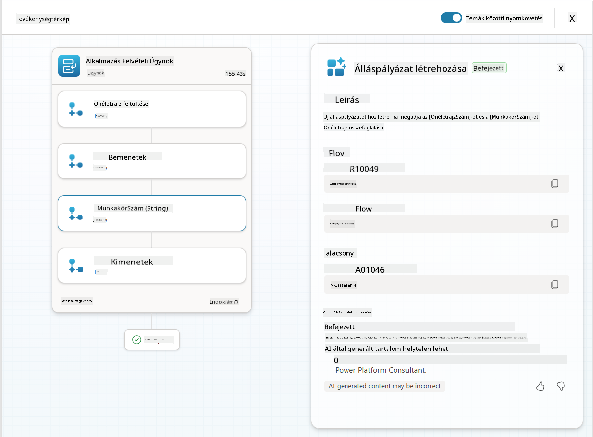

## 🎉 Küldetés Teljesítve

Kiváló munka, Operatív! **Operation Grounding Control** most befejeződött. Sikeresen fejlesztette AI képességeit dinamikus adatkapcsolással, létrehozva egy igazán intelligens felvételi rendszert.

Íme, amit elért ebben a küldetésben:

**✅ Dataverse adatkapcsolási mesteri szint**  
Most már érti, hogyan csatlakoztassa az egyedi utasításokat élő adatforrásokhoz a dinamikus intelligencia érdekében.

**✅ Fejlett önéletrajz elemzés**  
Az Önéletrajz Összegzés folyamata most már hozzáfér a valós idejű munkakör adatokhoz és értékelési kritériumokhoz a pontos párosítás érdekében.

**✅ Adatvezérelt döntéshozatal**  
A felvételi ügynökei most már automatikusan alkalmazkodnak a változó munkakövetelményekhez manuális utasításfrissítések nélkül.

**✅ Állásjelentkezés létrehozása**  
A fejlesztett rendszer most már képes állásjelentkezéseket létrehozni, és készen áll további összetett munkafolyamatok orkestrációjára.

🚀 **Következő lépés:** A következő küldetésében megtanulja, hogyan valósítson meg mélyebb érvelési képességeket, amelyek segítenek az ügynökeinek összetett döntéseket hozni és részletes magyarázatokat adni ajánlásaikhoz.

⏩ [Lépjen a 09. Küldetéshez: Mély érvelés](../09-deep-reasoning/README.md)

## 📚 Taktikai Források

📖 [Saját adatok használata egy utasításban](https://learn.microsoft.com/ai-builder/use-your-own-prompt-data?WT.mc_id=power-182762-scottdurow)

📖 [Egyedi utasítás létrehozása](https://learn.microsoft.com/ai-builder/create-a-custom-prompt?WT.mc_id=power-182762-scottdurow)

📖 [Dataverse használata a Copilot Studio-ban](https://learn.microsoft.com/microsoft-copilot-studio/knowledge-add-dataverse?WT.mc_id=power-182762-scottdurow)

📖 [AI Builder egyedi utasítások áttekintése](https://learn.microsoft.com/ai-builder/prompts-overview?WT.mc_id=power-182762-scottdurow)

📖 [Power Platform AI Builder dokumentáció](https://learn.microsoft.com/ai-builder/?WT.mc_id=power-182762-scottdurow)

📖 [Képzés: AI Builder utasítások létrehozása saját Dataverse adatokkal](https://learn.microsoft.com/training/modules/ai-builder-grounded-prompts/?WT.mc_id=power-182762-scottdurow)

---

**Felelősségi nyilatkozat**:  
Ez a dokumentum az [Co-op Translator](https://github.com/Azure/co-op-translator) AI fordítási szolgáltatás segítségével lett lefordítva. Bár törekszünk a pontosságra, kérjük, vegye figyelembe, hogy az automatikus fordítások hibákat vagy pontatlanságokat tartalmazhatnak. Az eredeti dokumentum az eredeti nyelvén tekintendő hiteles forrásnak. Kritikus információk esetén javasolt professzionális emberi fordítást igénybe venni. Nem vállalunk felelősséget semmilyen félreértésért vagy téves értelmezésért, amely a fordítás használatából eredhet.